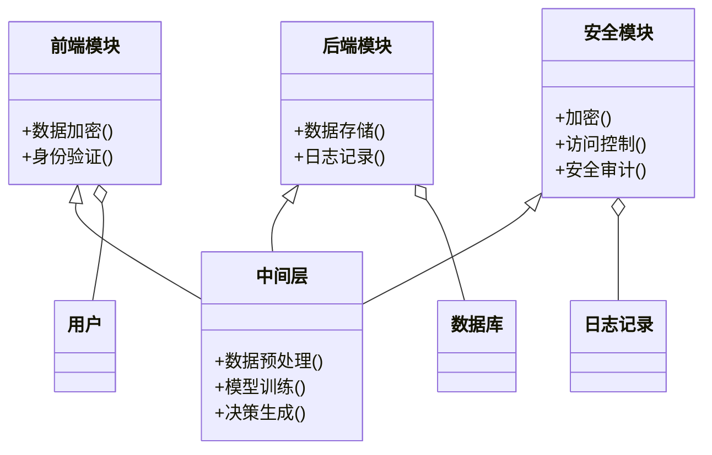
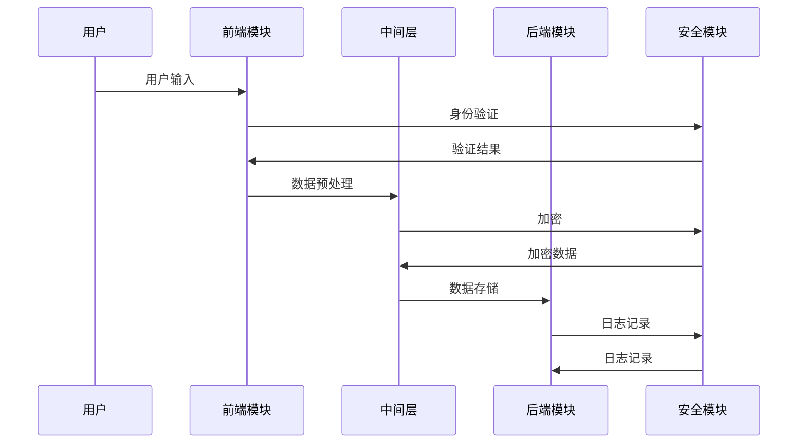

                 


### 文章标题

# 企业AI Agent的多维安全防护体系设计与实现

### 文章关键词

- 企业AI Agent
- 多维安全防护
- 安全体系设计
- 实现与案例分析

### 摘要

随着人工智能技术的快速发展，企业AI Agent的应用场景日益广泛，但其安全性问题也日益突出。本文旨在探讨企业AI Agent的多维安全防护体系设计与实现，包括核心概念、安全模型、系统设计与实现、实际案例分析以及最佳实践。通过本文，读者可以全面了解AI Agent的安全防护体系，为企业在AI领域的安全应用提供有力支持。

## 目录

1. **背景与核心概念**
   1.1. 企业AI Agent的安全背景
   1.2. 企业AI Agent安全问题的定义与描述
   1.3. 解决方案概述与框架设计

2. **核心概念与原理**
   2.1. AI Agent安全核心概念
   2.2. 核心概念属性对比
   2.3. 实体关系图分析

3. **多维安全防护体系**
   3.1. 多维安全防护模型概述
   3.2. 各安全层面的详细分析
   3.3. 安全措施的整合与优化

4. **系统设计与实现**
   4.1. 系统设计方法与思路
   4.2. 系统架构与类图设计
   4.3. 系统接口设计与交互流程

5. **实际案例分析**
   5.1. 案例一：环境搭建
   5.2. 案例二：核心系统实现
   5.3. 案例分析与解释

6. **最佳实践与总结**
   6.1. 实施安全防护体系的最佳实践
   6.2. 文章核心要点总结
   6.3. 注意事项与未来研究方向

## 背景与核心概念

### 1.1 企业AI Agent的安全背景

近年来，人工智能（AI）技术取得了飞速发展，其在企业中的应用也越来越广泛。企业AI Agent作为人工智能的一种重要形式，正在逐步成为企业智能化转型的重要推动力。然而，随着AI Agent在企业中的应用越来越深入，其安全问题也日益凸显。

首先，企业AI Agent在数据安全方面面临威胁。AI Agent在处理和存储大量企业数据时，可能会因为安全漏洞导致数据泄露、篡改等问题。其次，AI Agent在决策和执行过程中可能受到恶意攻击，导致错误决策或系统瘫痪。此外，AI Agent的安全性问题还可能涉及法律法规和道德伦理等方面。

### 1.2 企业AI Agent安全问题的定义与描述

企业AI Agent的安全问题主要包括以下几个方面：

1. **数据安全**：企业AI Agent在处理和存储数据时，需要确保数据的安全性和完整性，防止数据泄露、篡改等行为。
2. **决策安全**：企业AI Agent在做出决策和执行任务时，需要保证决策的准确性和可靠性，防止受到恶意攻击或错误决策。
3. **系统安全**：企业AI Agent的系统架构和代码需要具备一定的安全性，防止恶意代码、漏洞攻击等安全问题。
4. **法律与伦理**：企业AI Agent在处理和传输数据时，需要遵守相关法律法规，并充分考虑数据隐私和道德伦理问题。

### 1.3 解决方案概述与框架设计

针对企业AI Agent的安全问题，我们需要从多个维度设计一个全面的安全防护体系。本文提出的解决方案主要包括以下三个部分：

1. **核心概念与原理**：介绍企业AI Agent安全的核心概念，如AI Agent、数据安全、决策安全等，为后续设计提供理论基础。
2. **多维安全防护体系**：从数据安全、决策安全、系统安全等多个维度，设计一个全面的安全防护体系，确保企业AI Agent的安全运行。
3. **系统设计与实现**：详细阐述企业AI Agent安全防护体系的实现方法，包括系统架构设计、接口设计、实现代码等，为实际应用提供指导。

接下来，我们将分别介绍这三个部分，帮助读者全面了解企业AI Agent的多维安全防护体系设计与实现。

### 核心概念与原理

在讨论企业AI Agent的安全问题之前，我们需要明确一些核心概念和原理。这些概念包括AI Agent、数据安全、决策安全等，它们构成了企业AI Agent安全防护体系的基础。

#### 2.1 AI Agent

AI Agent，即人工智能代理，是一种能够模拟人类智能行为，具备一定自主决策能力的系统。它通常具备以下特点：

1. **自主性**：AI Agent能够自主执行任务，无需人工干预。
2. **适应性**：AI Agent能够根据环境和任务的变化，自主调整策略和行为。
3. **智能性**：AI Agent具备一定程度的智能，能够进行推理、学习、决策等。

AI Agent在企业中的应用场景包括客户服务、智能推荐、自动化决策等。然而，随着AI Agent在企业中的广泛应用，其安全问题也逐渐凸显。

#### 2.2 数据安全

数据安全是企业AI Agent面临的重要挑战之一。数据安全主要包括数据泄露、篡改、破坏等方面。为了保障数据安全，我们需要从以下几个方面进行考虑：

1. **数据加密**：对敏感数据进行加密处理，确保数据在传输和存储过程中不被窃取或篡改。
2. **访问控制**：根据用户权限设置访问策略，限制对敏感数据的访问权限，防止未经授权的访问。
3. **数据备份与恢复**：定期对数据进行备份，确保数据在遭受破坏时能够迅速恢复。

#### 2.3 决策安全

决策安全是企业AI Agent安全防护体系中的另一个重要方面。决策安全主要包括以下几个方面：

1. **算法安全性**：确保AI Agent所使用的算法具有鲁棒性和安全性，防止算法漏洞导致恶意攻击。
2. **决策透明性**：提高AI Agent决策过程的透明度，使决策结果易于理解和追踪。
3. **决策审计**：对AI Agent的决策过程进行审计，确保其符合法律法规和道德伦理要求。

#### 2.4 系统安全

系统安全是企业AI Agent安全防护体系的基础。系统安全主要包括以下几个方面：

1. **网络安全**：保障企业网络的安全，防止恶意攻击、数据泄露等问题。
2. **代码安全**：对AI Agent的代码进行安全审计，发现并修复潜在的安全漏洞。
3. **硬件安全**：确保AI Agent所使用的硬件设备安全，防止硬件故障或恶意攻击。

#### 2.5 法律与伦理

法律与伦理是企业AI Agent安全防护体系的重要组成部分。在企业AI Agent的开发和应用过程中，我们需要遵循以下原则：

1. **数据保护法**：遵守相关数据保护法规，确保数据隐私和用户权益。
2. **人工智能伦理**：遵循人工智能伦理规范，确保AI Agent的行为符合道德和伦理要求。
3. **责任追究**：明确AI Agent的开发者、运营者和使用者之间的责任，确保在发生安全事件时能够依法追究责任。

通过以上核心概念和原理的介绍，我们为后续的安全防护体系设计提供了理论基础。接下来，我们将详细介绍企业AI Agent的多维安全防护体系，帮助读者全面了解安全防护的各个方面。

### 多维安全防护体系

为了确保企业AI Agent的安全，我们需要从多个维度设计一个全面的安全防护体系。这个体系将涵盖数据安全、决策安全、系统安全等方面，形成一个全方位的防护网络。以下是对多维安全防护体系各维度的详细分析。

#### 3.1 数据安全

数据安全是企业AI Agent安全防护体系的基础。为了保障数据的安全，我们需要采取以下措施：

1. **数据加密**：对敏感数据进行加密处理，确保数据在传输和存储过程中不被窃取或篡改。常用的加密算法包括AES、RSA等。

   ```python
   from Crypto.Cipher import AES
   
   # 密钥和加密模式
   key = b'mysecretkey123'
   cipher = AES.new(key, AES.MODE_EAX)
   
   # 待加密的数据
   data = b'sensitive information'
   
   # 加密数据
   ciphertext, tag = cipher.encrypt_and_digest(data)
   
   print("Ciphertext:", ciphertext)
   print("Tag:", tag)
   ```

2. **访问控制**：根据用户权限设置访问策略，限制对敏感数据的访问权限，防止未经授权的访问。我们可以使用基于角色的访问控制（RBAC）模型来实现访问控制。

   ```mermaid
   graph LR
   A[数据] --> B[加密]
   A --> C[访问控制]
   B --> D[用户权限]
   C --> D
   ```

3. **数据备份与恢复**：定期对数据进行备份，确保数据在遭受破坏时能够迅速恢复。我们可以采用增量备份和全量备份相结合的策略，以提高备份效率。

   ```mermaid
   graph LR
   A[数据备份] --> B[增量备份]
   A --> C[全量备份]
   B --> D[恢复策略]
   C --> D
   ```

4. **数据审计**：对数据访问和使用情况进行审计，确保数据的安全性和合规性。我们可以使用日志记录和监控工具来实现数据审计。

   ```mermaid
   graph LR
   A[数据审计] --> B[日志记录]
   A --> C[监控工具]
   B --> D[合规性检查]
   C --> D
   ```

#### 3.2 决策安全

决策安全是保证企业AI Agent做出正确决策的关键。为了确保决策安全，我们需要采取以下措施：

1. **算法安全性**：确保AI Agent所使用的算法具有鲁棒性和安全性，防止算法漏洞导致恶意攻击。我们可以使用差分隐私、联邦学习等技术来提高算法安全性。

   ```python
   from privacylib import differential_privacy
   
   # 差分隐私算法实例
   dp = differential_privacy.DP()
   
   # 计算差分隐私
   result = dp.compute_difference_privacy(input_data, privacy Budget)
   
   print("Result:", result)
   ```

2. **决策透明性**：提高AI Agent决策过程的透明度，使决策结果易于理解和追踪。我们可以采用可解释性AI技术，如LIME、SHAP等，来实现决策透明性。

   ```mermaid
   graph LR
   A[输入数据] --> B[AI模型]
   B --> C[决策]
   C --> D[可解释性分析]
   ```

3. **决策审计**：对AI Agent的决策过程进行审计，确保其符合法律法规和道德伦理要求。我们可以使用决策树、规则引擎等技术来实现决策审计。

   ```mermaid
   graph LR
   A[决策审计] --> B[决策树]
   A --> C[规则引擎]
   ```

#### 3.3 系统安全

系统安全是保证企业AI Agent安全运行的关键。为了确保系统安全，我们需要采取以下措施：

1. **网络安全**：保障企业网络的安全，防止恶意攻击、数据泄露等问题。我们可以使用防火墙、入侵检测系统等技术来提高网络安全。

   ```mermaid
   graph LR
   A[网络安全] --> B[防火墙]
   A --> C[入侵检测系统]
   ```

2. **代码安全**：对AI Agent的代码进行安全审计，发现并修复潜在的安全漏洞。我们可以使用代码审计工具，如SonarQube等，来实现代码安全。

   ```mermaid
   graph LR
   A[代码安全] --> B[代码审计工具]
   ```

3. **硬件安全**：确保AI Agent所使用的硬件设备安全，防止硬件故障或恶意攻击。我们可以使用硬件安全模块（HSM）等技术来提高硬件安全。

   ```mermaid
   graph LR
   A[硬件安全] --> B[硬件安全模块]
   ```

通过以上多维安全防护体系的介绍，我们可以为企业AI Agent的安全运行提供有力保障。接下来，我们将详细介绍系统设计与实现的过程，帮助读者了解如何将安全防护体系落实到具体实践中。

### 系统设计与实现

在了解了多维安全防护体系的基本概念和核心要素之后，我们需要将这些安全措施转化为具体的系统设计与实现方案。本节将详细阐述企业AI Agent系统的设计思路、架构设计、接口设计以及系统交互流程。

#### 4.1 系统设计方法与思路

系统设计是一个复杂的过程，需要综合考虑安全、性能、可维护性等多个方面。在本节中，我们将采用以下方法与思路：

1. **需求分析**：首先明确企业AI Agent的总体需求，包括功能需求、性能需求和安全需求等。
2. **架构设计**：基于需求分析结果，设计系统架构，包括模块划分、组件关系和接口定义等。
3. **接口设计**：设计系统中的关键接口，确保模块之间能够高效、安全地通信。
4. **实现与测试**：根据设计文档，实现系统功能，并进行全面测试，确保系统的稳定性和安全性。

#### 4.2 系统架构设计

企业AI Agent系统的架构设计是确保系统安全、可靠和高效运行的基础。以下是一个典型的系统架构设计：

1. **前端模块**：负责与用户交互，接收用户输入，并展示决策结果。前端模块需要实现数据加密、身份验证等功能，确保用户操作的安全性。
2. **中间层**：负责处理核心业务逻辑，包括数据预处理、模型训练、决策生成等。中间层需要实现访问控制、数据加密等安全措施，确保数据的完整性和机密性。
3. **后端模块**：负责数据存储、日志记录、系统监控等辅助功能。后端模块需要实现数据备份与恢复、安全审计等功能，确保系统的可靠性和可维护性。
4. **安全模块**：负责实现多维安全防护体系中的各项安全措施，包括加密、访问控制、安全审计等。

以下是系统架构的Mermaid类图表示：



#### 4.3 系统接口设计与交互流程

系统接口设计是确保各模块之间能够高效、安全地通信的关键。以下是一个典型的系统接口设计与交互流程：

1. **用户接口**：用户通过前端模块与系统进行交互，前端模块接收用户输入并验证用户身份。
2. **业务接口**：中间层处理核心业务逻辑，包括数据预处理、模型训练和决策生成等。业务接口定义了各模块之间的数据交换格式和通信协议。
3. **数据接口**：后端模块负责数据存储和日志记录，数据接口定义了数据存储结构和日志记录格式。
4. **安全接口**：安全模块提供加密、访问控制和安全审计等服务，各模块通过安全接口调用安全功能。

以下是系统接口的Mermaid序列图表示：



通过以上系统设计与实现，我们可以为企业AI Agent构建一个安全、可靠和高效的运行环境。接下来，我们将通过实际案例分析，进一步探讨企业AI Agent在多维安全防护体系下的应用与实践。

### 实际案例分析

为了更好地展示企业AI Agent的多维安全防护体系在实际应用中的效果，我们选取了两个具有代表性的案例进行详细分析和讲解。这两个案例分别是企业客户服务AI Agent的安全防护和智能推荐系统的安全防护。

#### 案例一：企业客户服务AI Agent的安全防护

1. **背景介绍**：
   一家大型企业在客户服务领域引入了AI Agent，用于自动处理客户咨询、问题解答等任务，提高客户服务效率和满意度。然而，随着AI Agent处理的数据量增加，企业对AI Agent的安全防护提出了更高要求。

2. **系统功能设计**：
   在这个案例中，客户服务AI Agent的主要功能包括：
   - 客户咨询接收与处理
   - 问题自动解答与分类
   - 客户满意度评估与反馈

3. **系统架构设计**：
   系统采用三层架构设计，包括前端模块、中间层和后端模块。前端模块负责与客户交互，接收客户咨询；中间层处理客户咨询，包括问题分类、自动解答和满意度评估；后端模块负责数据存储和日志记录。

4. **安全措施实施**：
   - **数据加密**：对客户咨询内容进行加密处理，防止数据泄露。
   - **访问控制**：设置严格的访问控制策略，确保只有授权人员可以访问敏感数据。
   - **安全审计**：对客户咨询处理过程进行审计，确保操作合规。

5. **实现代码示例**：

   ```python
   # 数据加密
   from Crypto.Cipher import AES
   
   def encrypt_data(data, key):
       cipher = AES.new(key, AES.MODE_EAX)
       ciphertext, tag = cipher.encrypt_and_digest(data)
       return ciphertext, tag
   
   # 访问控制
   from flask import Flask, request, jsonify
   
   app = Flask(__name__)
   
   @app.route('/api/consult', methods=['POST'])
   def handle_consult():
       data = request.json
       if not has_permission(data['user_id']):
           return jsonify({"error": " unauthorized access"}), 401
       # 处理客户咨询
       # ...
       return jsonify({"status": "success"}), 200
   
   # 安全审计
   def log_operation(user_id, operation):
       with open("audit.log", "a") as f:
           f.write(f"{user_id} performed {operation} at {datetime.now()}\n")
   ```

6. **案例分析**：
   在这个案例中，企业客户服务AI Agent通过多维安全防护体系的实施，有效地保障了客户咨询数据的安全性和完整性。加密技术确保了数据在传输和存储过程中的安全性；访问控制策略限制了未经授权的访问；安全审计功能确保了操作合规性。

7. **项目小结**：
   该案例展示了企业客户服务AI Agent在实际应用中如何通过多维安全防护体系实现安全运行。通过数据加密、访问控制和安全审计等安全措施，企业可以有效防范数据泄露、未经授权访问等安全问题，确保客户服务AI Agent的稳定性和可靠性。

#### 案例二：智能推荐系统的安全防护

1. **背景介绍**：
   一家电商平台引入了智能推荐系统，用于根据用户行为和历史数据为用户推荐商品。然而，智能推荐系统的安全性问题不容忽视，尤其是在用户隐私和数据安全方面。

2. **系统功能设计**：
   智能推荐系统的主要功能包括：
   - 用户行为数据收集与分析
   - 商品推荐算法生成
   - 推荐结果展示与反馈

3. **系统架构设计**：
   系统采用分布式架构设计，包括数据采集模块、数据处理模块、推荐算法模块和前端展示模块。数据采集模块负责收集用户行为数据；数据处理模块负责数据清洗、存储和预处理；推荐算法模块负责生成商品推荐结果；前端展示模块负责将推荐结果展示给用户。

4. **安全措施实施**：
   - **数据加密**：对用户行为数据和推荐结果进行加密处理，防止数据泄露。
   - **算法安全性**：确保推荐算法的安全性，防止恶意攻击和算法漏洞。
   - **访问控制**：设置严格的访问控制策略，确保只有授权人员可以访问敏感数据。

5. **实现代码示例**：

   ```python
   # 数据加密
   from Crypto.Cipher import AES
   
   def encrypt_data(data, key):
       cipher = AES.new(key, AES.MODE_EAX)
       ciphertext, tag = cipher.encrypt_and_digest(data)
       return ciphertext, tag
   
   # 访问控制
   from flask import Flask, request, jsonify
   
   app = Flask(__name__)
   
   @app.route('/api/recommend', methods=['GET'])
   def get_recommendations():
       if not has_permission(request.args.get('user_id')):
           return jsonify({"error": " unauthorized access"}), 401
       # 生成推荐结果
       # ...
       return jsonify({"recommendations": recommendations}), 200
   
   # 算法安全性
   from privacylib import differential_privacy
   
   def generate_recommendations(user_data, privacy_budget):
       dp = differential_privacy.DP()
       recommendations = dp.compute_difference_privacy(user_data, privacy_budget)
       return recommendations
   ```

6. **案例分析**：
   在这个案例中，智能推荐系统通过多维安全防护体系的实施，有效地保障了用户隐私和数据安全。数据加密技术确保了用户行为数据和推荐结果在传输和存储过程中的安全性；算法安全性措施防止了恶意攻击和算法漏洞；访问控制策略限制了未经授权的访问。

7. **项目小结**：
   该案例展示了智能推荐系统在实际应用中如何通过多维安全防护体系实现安全运行。通过数据加密、算法安全性和访问控制等安全措施，企业可以有效防范数据泄露、恶意攻击等安全问题，确保智能推荐系统的稳定性和可靠性。

通过以上两个实际案例的分析，我们可以看到企业AI Agent的多维安全防护体系在实际应用中的重要作用。只有通过全面、系统化的安全防护，企业才能确保AI Agent的安全运行，为企业的智能化转型提供有力支持。

### 最佳实践与总结

在设计和实现企业AI Agent的多维安全防护体系过程中，总结出一些最佳实践和注意事项，对于确保系统安全性和可靠性至关重要。以下是一些关键点：

#### 最佳实践

1. **数据加密**：在数据传输和存储过程中，始终使用强加密算法对敏感数据进行加密处理。确保密钥管理安全，避免密钥泄露。

2. **访问控制**：根据用户权限设置访问策略，实现细粒度的访问控制。使用基于角色的访问控制（RBAC）模型，简化权限管理。

3. **安全审计**：对AI Agent的操作进行审计，记录关键操作和变更，确保操作合规。定期进行安全检查和漏洞扫描，及时修复安全漏洞。

4. **决策透明性**：提高AI Agent决策过程的透明度，使用可解释性AI技术，帮助用户理解和信任AI决策。

5. **安全培训**：定期对开发和运维团队进行安全培训，提高团队成员的安全意识和技能，降低人为错误导致的安全风险。

#### 总结

企业AI Agent的多维安全防护体系涉及多个方面，包括数据安全、决策安全、系统安全和法律与伦理。通过全面、系统化的安全防护措施，企业可以有效防范AI Agent面临的各类安全威胁，确保系统的稳定性和可靠性。在设计和实现过程中，需遵循最佳实践，注重细节和操作合规性，同时不断更新和完善安全防护策略，以应对不断变化的安全挑战。

#### 注意事项

1. **持续更新**：随着AI技术的不断发展，安全威胁也在不断变化。企业需要持续关注安全动态，及时更新和调整安全防护策略。

2. **数据隐私**：在处理用户数据时，需严格遵守数据保护法规，确保用户隐私不受侵犯。使用隐私保护技术，如差分隐私和联邦学习，降低隐私泄露风险。

3. **安全审计**：安全审计不仅是对过去操作的记录，更是对未来安全的预见。通过审计，可以及时发现和解决潜在的安全隐患。

4. **用户培训**：提高用户的安全意识和技能，帮助用户正确使用AI Agent，减少因用户操作不当导致的安全风险。

5. **法律合规**：确保AI Agent的设计和实现符合相关法律法规，避免法律风险。

#### 拓展阅读

- **《人工智能安全指南》**：详细介绍了AI安全的核心概念、技术方法和最佳实践。
- **《数据安全与隐私保护》**：探讨了数据加密、访问控制和隐私保护等数据安全相关技术。
- **《人工智能伦理》**：探讨了AI技术在伦理和法律层面的挑战和解决方案。

通过以上最佳实践和注意事项，企业可以更好地设计和实现AI Agent的多维安全防护体系，确保系统的安全性和可靠性。

### 作者信息

- 作者：AI天才研究院/AI Genius Institute & 禅与计算机程序设计艺术 /Zen And The Art of Computer Programming
- 本文旨在探讨企业AI Agent的多维安全防护体系设计与实现，帮助读者全面了解AI Agent的安全防护体系，为企业在AI领域的安全应用提供有力支持。


