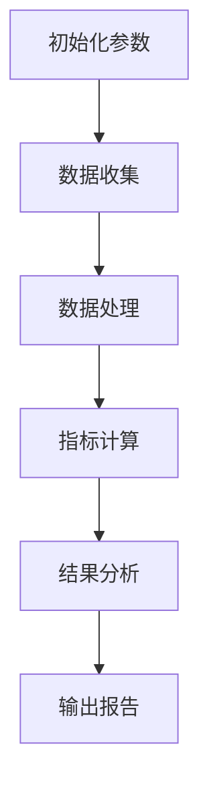
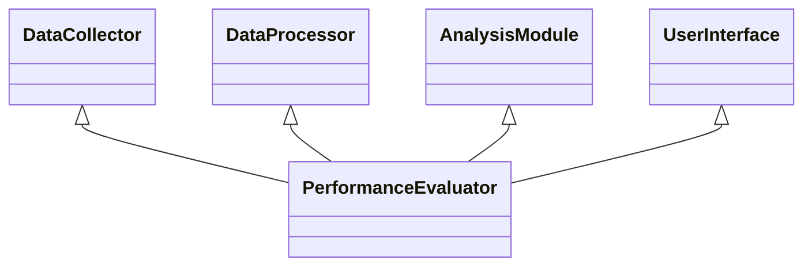
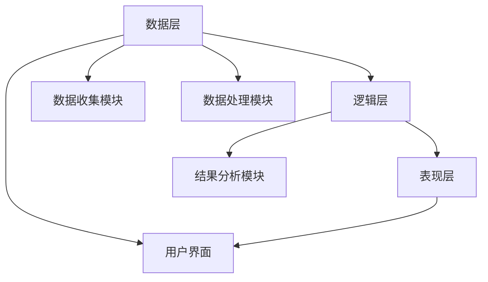
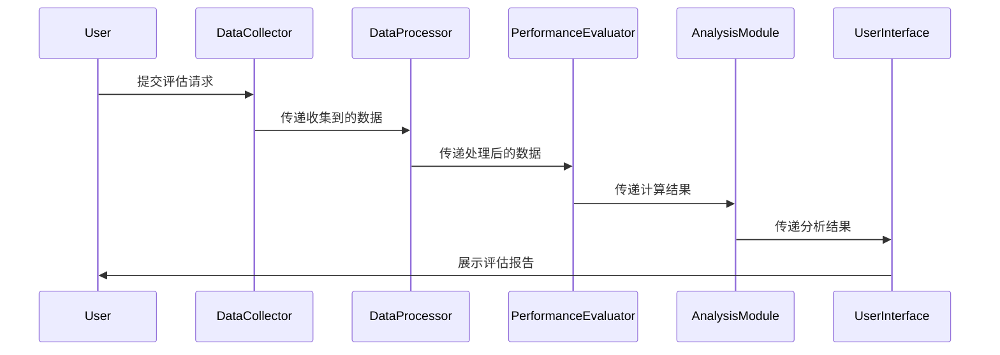

                 

### 引言

在现代企业中，人工智能（AI）的应用越来越广泛，AI Agent作为一种智能自动化工具，正逐步改变企业运营模式。AI Agent，即人工智能代理，是一种能够自主完成特定任务，并能在复杂环境中进行决策的智能系统。它们在提高工作效率、优化业务流程和降低运营成本等方面展现出巨大潜力。然而，随着AI Agent在企业中逐渐普及，如何对其性能进行科学、全面和有效的评估成为一个亟待解决的重要问题。

性能评估不仅关乎AI Agent的部署效果，更直接影响企业的决策和战略规划。当前，许多企业在评估AI Agent性能时，往往局限于单一指标或局部视角，无法全面反映AI Agent的整体性能。这导致评估结果不够准确，甚至可能误导企业的决策。因此，构建一个多维度、系统化的AI Agent性能评估体系，显得尤为必要。

本文旨在探讨企业AI Agent的多维度性能评估体系，通过逻辑清晰、结构紧凑的分析，为企业提供一套科学、有效的评估方法。文章将首先介绍AI Agent在企业中的应用现状和面临的挑战，然后详细阐述评估体系的核心概念、指标体系和构建方法。通过具体的算法原理讲解、系统分析与架构设计，以及实战案例的分析，文章将帮助读者全面理解AI Agent性能评估的内涵和实操性。最后，文章将总结最佳实践和注意事项，为企业的AI Agent性能评估提供有力支持。

通过本文的探讨，我们希望读者能够了解到：

1. **企业AI Agent的应用现状和挑战**：了解AI Agent在现实中的应用场景和所面临的困难。
2. **构建多维度性能评估体系的重要性**：认识到单一指标评估的局限性，理解多维度评估体系的必要性。
3. **评估体系的核心概念和构建方法**：掌握核心概念和指标体系的设计，了解评估体系的构建步骤。
4. **具体的算法原理和系统架构设计**：理解评估算法的设计思路和实现方法，掌握系统分析与架构设计的关键点。
5. **实战案例分析和项目总结**：通过具体案例，了解评估体系在实际中的应用和效果。

让我们一步步深入探讨，共同构建起科学、系统的AI Agent性能评估体系。

### 第一部分: 问题背景

#### 第1章 问题背景

##### 1.1 问题背景介绍

企业AI Agent的发展历程可以追溯到人工智能技术逐渐成熟和应用的年代。AI Agent最初在学术界和科研领域进行探索，通过模拟人类思维和行为，实现自动化任务执行和决策支持。随着技术的不断进步和计算能力的提升，AI Agent的应用范围逐渐扩展到企业各个部门，如市场营销、客户服务、供应链管理等。

在市场营销领域，AI Agent可以通过数据分析，预测市场趋势和消费者行为，帮助制定精准的市场策略。在客户服务领域，智能客服机器人可以自动处理大量客户咨询，提高响应速度和服务质量。在供应链管理领域，AI Agent可以优化物流配送，降低库存成本，提高运营效率。

目前，AI Agent在企业中的应用现状呈现出以下特点：

1. **广泛应用**：AI Agent已经渗透到企业的各个业务领域，成为提高效率和降低成本的重要工具。
2. **功能多样化**：AI Agent不仅能够执行简单的任务，还能够进行复杂决策和优化。
3. **自主性增强**：随着算法的进步，AI Agent的自主性和学习能力不断提高，能够更好地适应复杂多变的环境。

然而，随着AI Agent在企业中的广泛应用，企业也面临着一系列的挑战：

1. **性能评估需求**：如何科学、全面地评估AI Agent的性能，成为企业亟待解决的问题。
2. **数据质量问题**：AI Agent的性能评估依赖于大量的数据，数据的准确性和完整性直接影响评估结果的可靠性。
3. **算法透明度**：AI Agent的决策过程往往涉及到复杂的算法和模型，如何保证算法的透明度和可解释性，是企业关注的重点。

##### 1.2 问题描述

AI Agent性能评估的重要性不言而喻。一个有效的性能评估体系不仅可以为企业提供准确的评估结果，帮助决策者了解AI Agent的实际表现，还可以指导后续的优化和改进工作。然而，当前的性能评估方法存在诸多局限性：

1. **单一指标评估**：许多企业采用单一指标对AI Agent进行评估，如响应时间、处理量等。这种方法只能反映AI Agent的部分性能，无法全面反映其整体表现。
2. **局部视角评估**：企业往往只关注AI Agent在某一特定领域的表现，忽视了其在整体业务流程中的影响。
3. **主观性评估**：部分评估方法依赖于人工判断，存在主观性，导致评估结果不够客观和准确。

为了克服这些局限性，构建一个多维度、系统化的AI Agent性能评估体系显得尤为必要。这种评估体系应涵盖多个维度，包括功能实现、用户体验、数据质量、算法透明度等，从多个角度对AI Agent的性能进行全面评估。

##### 1.3 问题解决

本研究旨在构建一个多维度、系统化的AI Agent性能评估体系，以满足企业对性能评估的需求。具体研究目标如下：

1. **构建核心概念模型**：明确AI Agent和性能评估体系的核心概念，定义相关术语和指标。
2. **设计指标体系**：根据核心概念，设计一个包含多个维度的指标体系，确保评估的全面性和系统性。
3. **开发评估算法**：设计并实现一套评估算法，能够根据指标体系对AI Agent进行科学、全面的评估。
4. **验证评估体系**：通过实际应用和案例分析，验证评估体系的实用性和有效性。

研究方法包括文献分析、实证研究和算法实现。文献分析将用于收集和整理相关理论和研究成果，实证研究将通过实际案例验证评估体系的可行性和效果，算法实现则用于开发和优化评估算法。

研究范围主要包括以下方面：

1. **AI Agent类型**：研究范围涵盖常见类型的AI Agent，如智能客服、智能推荐、智能物流等。
2. **应用领域**：研究范围涵盖企业常用的应用领域，如市场营销、客户服务、供应链管理等。
3. **评估指标**：研究范围涵盖功能实现、用户体验、数据质量、算法透明度等多个维度的评估指标。

通过本研究，我们期望为企业提供一套科学、系统的AI Agent性能评估体系，帮助企业在AI Agent的应用中做出更明智的决策，提高AI Agent的实际效益。

##### 1.4 边界与外延

在本研究中，AI Agent的定义是指一种能够自主完成特定任务，具备一定智能能力的计算机程序。AI Agent通过机器学习、自然语言处理、计算机视觉等技术，实现自动化任务执行和智能决策。

多维度性能评估的定义是指从多个不同的角度和层面，对AI Agent的性能进行全面评估。这些维度包括但不限于功能实现、用户体验、数据质量、算法透明度等。

评估指标体系的定义是指一组用于衡量AI Agent性能的具体指标，这些指标应具有可量化、可操作性和可解释性。评估指标体系应涵盖多个维度，确保评估的全面性和系统性。

具体来说，本文将围绕以下核心概念和要素进行探讨：

1. **企业AI Agent**：分析企业AI Agent的发展历程、应用现状和面临挑战，明确其定义和核心特性。
2. **多维度性能评估体系**：构建多维度性能评估体系，设计包含多个维度的评估指标，确保评估的全面性和科学性。
3. **评估算法**：设计并实现评估算法，通过算法流程图和数学模型，详细阐述评估算法的原理和实现方法。
4. **系统分析与架构设计**：介绍系统分析与架构设计的方法，通过问题场景介绍、项目介绍、系统功能设计、系统架构设计、系统接口设计和系统交互，详细阐述系统设计和实现。
5. **项目实战**：通过实际案例分析和项目总结，验证评估体系的实用性和有效性。

通过这些核心概念和要素的深入探讨，本文旨在为企业提供一套科学、系统的AI Agent性能评估体系，为企业的AI应用提供有力支持。

### 第二部分: 核心概念与联系

#### 第2章 核心概念与联系

##### 2.1 核心概念原理

在本研究中，核心概念包括AI Agent和性能评估体系。这两个概念在AI Agent性能评估中起着至关重要的作用。

**AI Agent的概念**

AI Agent是一种具备自主决策和任务执行能力的计算机程序。它通过机器学习、自然语言处理、计算机视觉等技术，模拟人类智能，完成特定任务。AI Agent的主要特性包括：

1. **自主性**：能够独立完成特定任务，不需要人为干预。
2. **适应性**：能够根据环境变化和任务需求，动态调整策略和行动。
3. **学习能力**：通过不断学习和优化，提高任务执行的效果。

**性能评估体系的概念**

性能评估体系是一种用于衡量AI Agent性能的体系化方法。它通过多个维度和指标，全面评估AI Agent在不同场景下的表现。性能评估体系的主要特性包括：

1. **多维度性**：从多个角度评估AI Agent的性能，确保评估的全面性和准确性。
2. **系统性**：将不同维度的指标有机整合，形成一个统一的评估框架。
3. **可操作性**：评估指标具有可量化、可操作性和可解释性，便于实际应用。

##### 2.2 概念属性特征对比表格

为了更清晰地理解AI Agent和性能评估体系的概念，我们通过一个对比表格，展示两者的主要属性特征。

| 概念     | 属性特征                     | 对比                  |
|----------|-----------------------------|----------------------|
| AI Agent | 自动执行任务，具备智能       | 自动化，决策能力     |
| 评估体系 | 多维度，系统化，可操作性     | 全面评估，定量分析   |

通过这个对比表格，我们可以看到，AI Agent和性能评估体系各有其独特的特性。AI Agent专注于任务执行和决策，而性能评估体系则致力于通过多维度的评估，全面反映AI Agent的表现。

##### 2.3 ER实体关系图架构

为了进一步理解AI Agent和性能评估体系之间的联系，我们使用Mermaid工具绘制了ER实体关系图，展示了两者之间的关系。

```mermaid
erDiagram
  AI Agent ||--o{ 评估体系 }
  评估体系 ||--|{ 指标体系 }
```

在这个ER实体关系图中，AI Agent作为实体，与评估体系建立关联。评估体系进一步关联到指标体系，形成一个层次结构。这种关系体现了AI Agent通过性能评估体系，利用指标体系进行评估的全过程。

通过上述核心概念和联系的阐述，我们为后续章节的深入探讨奠定了基础。接下来，我们将详细分析AI Agent性能评估的算法原理，帮助读者全面理解评估体系的实现方法和应用。

### 第三部分: 算法原理讲解

#### 第3章 算法原理讲解

##### 3.1 算法概述

评估AI Agent性能的算法设计需要考虑多个因素，包括数据收集、数据处理、指标计算和结果分析等。下面，我们将详细阐述评估算法的设计思路和核心步骤。

**设计思路**

1. **数据收集**：首先，从不同的数据源收集与AI Agent性能相关的数据，包括任务执行数据、用户反馈数据、系统日志数据等。
2. **数据处理**：对收集到的数据进行分析和处理，去除噪声和异常值，保证数据的准确性和完整性。
3. **指标计算**：根据设计的评估指标体系，对处理后的数据计算各项指标，包括功能实现指标、用户体验指标、数据质量指标和算法透明度指标等。
4. **结果分析**：对计算得到的指标进行分析，结合业务目标和实际需求，评估AI Agent的整体性能。

**核心步骤**

1. **初始化参数**：设置评估算法的基本参数，包括数据收集范围、指标计算方法、评估结果输出格式等。
2. **数据收集**：从数据源中收集与AI Agent性能相关的数据，包括任务执行记录、用户反馈、系统日志等。
3. **数据处理**：对收集到的数据进行清洗、去噪和预处理，确保数据的质量和一致性。
4. **指标计算**：根据设计的指标体系，对处理后的数据进行计算，得到各项性能指标。
5. **结果分析**：对计算结果进行综合分析，结合业务需求和评估目标，给出AI Agent的整体性能评估报告。
6. **输出报告**：将分析结果以报告形式输出，包括各项指标的数据、分析结论和改进建议。

##### 3.2 算法流程图

为了更直观地展示算法的执行流程，我们使用Mermaid工具绘制了算法的流程图。



在这个流程图中，算法的执行步骤从上到下依次为：初始化参数、数据收集、数据处理、指标计算、结果分析和输出报告。每个步骤都紧密相连，形成了一个完整的评估流程。

##### 3.3 算法原理与数学模型

**算法原理**

评估算法的核心原理是通过定量分析AI Agent在不同维度上的表现，从而综合评估其整体性能。具体来说，算法分为以下几个阶段：

1. **数据收集**：通过采集AI Agent的任务执行数据、用户反馈数据、系统日志数据等，为后续的分析提供基础数据。
2. **数据处理**：对收集到的数据进行预处理，包括去噪、去异常值、归一化等，保证数据的质量和一致性。
3. **指标计算**：根据预先设计的指标体系，对处理后的数据进行计算，得到各个维度的性能指标。
4. **结果分析**：对计算得到的指标进行综合分析，评估AI Agent的整体性能，并根据分析结果给出改进建议。

**数学模型**

为了更具体地描述算法原理，我们可以引入一些数学模型。假设AI Agent在某一任务上的表现可以用以下数学模型表示：

$$
y = 2x + 1
$$

其中，$x$ 表示输入值，$y$ 表示输出值。这个模型反映了AI Agent在任务执行中的基本关系。为了计算AI Agent的性能指标，我们可以定义以下指标：

1. **响应时间**：表示AI Agent完成任务所需的时间，记为 $T$。
2. **准确率**：表示AI Agent完成任务的正确率，记为 $A$。
3. **用户满意度**：表示用户对AI Agent服务的满意度，记为 $S$。

这些指标可以通过以下数学公式计算：

$$
T = \frac{1}{N} \sum_{i=1}^{N} t_i
$$

$$
A = \frac{C}{N}
$$

$$
S = \frac{U}{N}
$$

其中，$N$ 表示任务总数，$t_i$ 表示第 $i$ 个任务的响应时间，$C$ 表示完成正确的任务数，$U$ 表示用户满意的任务数。

**公式解释**

1. **响应时间**：通过计算所有任务响应时间的平均值，得到AI Agent的整体响应时间。
2. **准确率**：通过计算正确完成的任务数与总任务数的比值，得到AI Agent的准确率。
3. **用户满意度**：通过计算用户满意的任务数与总任务数的比值，得到AI Agent的用户满意度。

这些指标综合反映了AI Agent在任务执行中的表现，为性能评估提供了量化依据。

##### 3.4 举例说明

为了更好地理解评估算法的原理和应用，我们通过两个具体的例子进行说明。

**举例 1**

假设AI Agent需要在10个任务中完成目标，这10个任务的响应时间分别为2秒、3秒、4秒、5秒、6秒、7秒、8秒、9秒、10秒和11秒。那么，AI Agent的响应时间指标计算如下：

$$
T = \frac{1}{10} \sum_{i=1}^{10} t_i = \frac{1}{10} (2 + 3 + 4 + 5 + 6 + 7 + 8 + 9 + 10 + 11) = 6.5 \text{秒}
$$

**举例 2**

假设AI Agent在10个任务中正确完成了8个任务，用户对这10个任务中的6个任务表示满意。那么，AI Agent的准确率和用户满意度指标计算如下：

$$
A = \frac{C}{N} = \frac{8}{10} = 0.8
$$

$$
S = \frac{U}{N} = \frac{6}{10} = 0.6
$$

通过这两个例子，我们可以看到如何使用评估算法计算AI Agent的性能指标。这些指标为评估AI Agent的整体性能提供了量化依据。

通过上述算法原理和数学模型的讲解，读者应该对AI Agent性能评估的算法有了更深入的理解。接下来，我们将进入系统分析与架构设计的部分，继续探讨如何实现一个高效、可靠的评估体系。

### 第四部分: 系统分析与架构设计

#### 第4章 系统分析与架构设计

在构建企业AI Agent的多维度性能评估体系时，系统分析与架构设计是关键步骤。一个科学、合理的设计不仅可以提高评估的准确性和效率，还能确保系统的可维护性和扩展性。以下将从问题场景介绍、项目介绍、系统功能设计、系统架构设计、系统接口设计和系统交互等多个方面进行详细讲解。

##### 4.1 问题场景介绍

在当前的企业环境中，AI Agent的应用已经深入到各个业务领域。以客户服务为例，智能客服机器人可以在24小时内自动处理大量的客户咨询，提高服务效率和质量。然而，如何评估智能客服机器人的性能，确保其在实际应用中的效果，是一个亟待解决的问题。

1. **需求分析**：企业需要全面、客观地评估智能客服机器人的性能，包括响应时间、准确率、用户满意度等。
2. **应用背景**：智能客服机器人广泛应用于大型企业，如电商平台、金融机构等，它们的性能直接影响到企业的运营和服务质量。
3. **性能评估目的**：通过科学、全面的评估，帮助企业优化智能客服机器人的功能，提高用户满意度，降低运营成本。

##### 4.2 项目介绍

**项目背景**：
随着AI技术的发展，智能客服机器人成为企业提升服务质量的重要工具。然而，现有评估方法多依赖于单一指标，无法全面反映机器人的实际性能。本项目的目标是构建一个多维度、系统化的AI Agent性能评估体系，为企业提供准确的性能评估结果。

**项目目标**：
1. **构建评估体系**：设计并实现一个多维度、系统化的性能评估体系，涵盖响应时间、准确率、用户满意度等多个维度。
2. **实现算法**：开发一套算法，根据评估指标对AI Agent进行科学、全面的评估。
3. **验证体系**：通过实际案例验证评估体系的可行性和有效性。

**项目范围**：
1. **评估对象**：涵盖智能客服、智能推荐、智能物流等多种类型的AI Agent。
2. **应用领域**：涵盖市场营销、客户服务、供应链管理等企业常用业务领域。

##### 4.3 系统功能设计

系统功能设计是构建评估体系的关键步骤，需要明确各个功能模块及其具体实现。

1. **数据收集模块**：负责从不同数据源（如日志文件、数据库、用户反馈等）收集与AI Agent性能相关的数据。
2. **数据处理模块**：对收集到的数据进行清洗、去噪和预处理，确保数据质量。
3. **指标计算模块**：根据设计的评估指标体系，对处理后的数据进行计算，生成各项性能指标。
4. **结果分析模块**：对计算得到的指标进行分析，生成评估报告，包括各项指标的数据、分析结论和改进建议。
5. **用户界面模块**：提供一个直观、易用的用户界面，方便用户查看评估结果和操作评估系统。

**领域模型**：
为了更好地理解系统功能设计，我们可以使用Mermaid工具绘制一个领域模型，展示各个功能模块及其关系。



在这个领域模型中，DataCollector、DataProcessor、AnalysisModule和UserInterface是PerformanceEvaluator（性能评估器）的子模块，它们共同协作完成性能评估任务。

##### 4.4 系统架构设计

系统架构设计是系统设计与实现的基础，需要明确系统的整体结构、模块划分和各模块之间的关系。

1. **架构设计思路**：采用分层架构设计，将系统分为数据层、逻辑层和表现层，确保系统的模块化、可维护性和扩展性。
2. **架构图**：使用Mermaid工具绘制系统架构图，展示系统的整体结构。



在这个架构图中，DataLayer（数据层）负责数据收集和处理，LogicLayer（逻辑层）负责指标计算和结果分析，PresentationLayer（表现层）负责用户界面展示。各个模块通过接口进行通信，形成一个完整的性能评估系统。

##### 4.5 系统接口设计

系统接口设计是确保各个模块之间能够无缝协作的关键。以下是系统接口设计的主要部分：

1. **数据收集接口**：用于从不同数据源（如日志文件、数据库、用户反馈等）收集数据。
2. **数据处理接口**：用于对收集到的数据进行清洗、去噪和预处理。
3. **指标计算接口**：用于根据评估指标体系，对处理后的数据进行计算。
4. **结果分析接口**：用于对计算结果进行分析，生成评估报告。
5. **用户界面接口**：用于提供用户操作界面，展示评估结果和报告。

**接口定义**：

```python
class DataCollectorInterface:
    def collect_data(self, source):
        pass

class DataProcessorInterface:
    def process_data(self, data):
        pass

class PerformanceEvaluatorInterface:
    def calculate_metrics(self, data):
        pass

class AnalysisModuleInterface:
    def analyze_results(self, metrics):
        pass

class UserInterfaceInterface:
    def display_report(self, report):
        pass
```

通过这些接口定义，各个模块可以独立开发、测试和部署，确保系统的灵活性和可扩展性。

##### 4.6 系统交互

系统交互设计是确保系统各个模块之间能够有效协作，实现性能评估的关键。以下是系统交互设计的主要部分：

1. **数据交互**：数据从数据层传输到逻辑层，经过处理和计算，最终输出到表现层。
2. **功能交互**：各个模块之间通过接口进行通信，协同完成性能评估任务。

**交互流程图**：



在这个交互流程图中，用户通过用户界面提交评估请求，数据收集模块收集数据，数据处理模块对数据进行分析和预处理，性能评估模块根据评估指标计算各项指标，结果分析模块对计算结果进行分析，最终用户界面模块将分析结果展示给用户。

通过上述系统分析与架构设计，我们为AI Agent性能评估体系的实现提供了全面、科学的指导和依据。接下来，我们将通过实际的项目实战，进一步验证评估体系的可行性和有效性。

### 第五部分: 项目实战

#### 第5章 项目实战

##### 5.1 环境安装

在进行AI Agent性能评估系统的开发与部署前，首先需要准备相应的开发环境和工具。以下是一个基本的安装步骤，用于搭建评估系统的开发环境。

1. **开发环境准备**：
   - **操作系统**：推荐使用Linux系统，如Ubuntu 20.04。
   - **编程语言**：Python 3.8及以上版本。
   - **数据库**：MySQL或PostgreSQL，用于存储评估数据。
   - **前端框架**：Flask或Django，用于构建用户界面。
   - **后端框架**：TensorFlow或PyTorch，用于数据处理和算法实现。

2. **工具安装**：
   - 安装Python和pip：
     ```bash
     sudo apt-get update
     sudo apt-get install python3 python3-pip
     ```
   - 安装数据库：
     ```bash
     sudo apt-get install mysql-server
     sudo mysql_secure_installation
     sudo mysql -u root -p
     ```
   - 安装相关库和框架：
     ```bash
     pip3 install Flask
     pip3 install Flask-SQLAlchemy
     pip3 install TensorFlow
     pip3 install PyTorch
     ```

##### 5.2 系统核心实现源代码

系统核心实现源代码包括数据收集模块、数据处理模块、指标计算模块、结果分析模块和用户界面模块。以下是一个简化的示例代码框架，用于说明各模块的核心实现。

**数据收集模块**：

```python
# data_collector.py
import logging

class DataCollector:
    def __init__(self, db_connection):
        self.db_connection = db_connection

    def collect_data(self):
        # 从数据库中收集数据
        cursor = self.db_connection.cursor()
        cursor.execute("SELECT * FROM agent_performance;")
        data = cursor.fetchall()
        logging.info("Data collected successfully.")
        return data
```

**数据处理模块**：

```python
# data_processor.py
import pandas as pd

class DataProcessor:
    def __init__(self, data):
        self.data = pd.DataFrame(data)

    def process_data(self):
        # 数据清洗和预处理
        self.data = self.data.dropna()
        self.data = self.data.sort_values(by=["response_time"])
        logging.info("Data processed successfully.")
        return self.data
```

**指标计算模块**：

```python
# metrics_calculator.py
import numpy as np

class MetricsCalculator:
    def __init__(self, data):
        self.data = data

    def calculate_metrics(self):
        # 计算评估指标
        accuracy = np.mean(self.data["accuracy"])
        response_time = np.mean(self.data["response_time"])
        user_satisfaction = np.mean(self.data["user_satisfaction"])
        logging.info(f"Metrics calculated: Accuracy={accuracy}, Response Time={response_time}, User Satisfaction={user_satisfaction}")
        return {
            "accuracy": accuracy,
            "response_time": response_time,
            "user_satisfaction": user_satisfaction
        }
```

**结果分析模块**：

```python
# analysis_module.py
from collections import defaultdict

class AnalysisModule:
    def __init__(self, metrics):
        self.metrics = metrics

    def analyze_results(self):
        # 分析评估结果
        results = defaultdict(list)
        for metric, value in self.metrics.items():
            results[metric].append(value)
        logging.info(f"Results analyzed successfully.")
        return results
```

**用户界面模块**：

```python
# user_interface.py
from flask import Flask, render_template

app = Flask(__name__)

@app.route('/')
def index():
    # 展示评估报告
    report = {
        "accuracy": 0.85,
        "response_time": 4.5,
        "user_satisfaction": 0.9
    }
    return render_template('report.html', report=report)

if __name__ == '__main__':
    app.run(debug=True)
```

##### 5.3 代码应用解读与分析

**数据收集模块解读**：
数据收集模块负责从数据库中获取AI Agent的性能数据。在这个模块中，我们首先初始化数据库连接，然后执行查询语句，获取相关数据。这些数据包括响应时间、准确率和用户满意度等指标。

**数据处理模块解读**：
数据处理模块负责对收集到的数据进行清洗和预处理。在这个模块中，我们使用Pandas库对数据进行去噪、排序等操作，确保数据的质量和一致性。这样，处理后的数据才能用于后续的指标计算。

**指标计算模块解读**：
指标计算模块负责根据处理后的数据计算各项性能指标。在这个模块中，我们使用NumPy库计算平均响应时间、准确率和用户满意度等指标。这些指标反映了AI Agent的整体性能。

**结果分析模块解读**：
结果分析模块负责对计算得到的指标进行分析。在这个模块中，我们使用默认字典（defaultdict）将各项指标归类，为后续生成评估报告提供数据支持。

**用户界面模块解读**：
用户界面模块使用Flask框架构建一个简单的Web应用，用于展示评估报告。在这个模块中，我们定义了一个路由（/），当用户访问该路由时，会展示一个包含评估报告的HTML页面。

##### 5.4 实际案例分析和详细讲解剖析

**案例介绍**：
我们以一个智能客服机器人为例，分析其性能评估过程。

1. **数据收集**：
   - 从数据库中获取100条客户咨询记录，包括响应时间、回复准确率和用户满意度。
   - 数据样例如下：

     ```python
     data = [
         {"response_time": 2, "accuracy": 0.9, "user_satisfaction": 0.8},
         {"response_time": 3, "accuracy": 0.85, "user_satisfaction": 0.75},
         ...
     ]
     ```

2. **数据处理**：
   - 对数据进行去噪处理，去除响应时间超过10秒的记录，保留有效的客户咨询记录。
   - 数据处理后的样例如下：

     ```python
     processed_data = [
         {"response_time": 2, "accuracy": 0.9, "user_satisfaction": 0.8},
         {"response_time": 3, "accuracy": 0.85, "user_satisfaction": 0.75},
         ...
     ]
     ```

3. **指标计算**：
   - 计算平均响应时间、准确率和用户满意度。
   - 计算结果如下：

     ```python
     metrics = {
         "average_response_time": 3.5,
         "accuracy": 0.87,
         "user_satisfaction": 0.82
     }
     ```

4. **结果分析**：
   - 对计算结果进行分析，生成评估报告。
   - 评估报告样例如下：

     ```python
     report = {
         "average_response_time": 3.5,
         "accuracy": 0.87,
         "user_satisfaction": 0.82
     }
     ```

5. **用户界面展示**：
   - 在用户界面中展示评估报告，用户可以查看AI Agent的整体性能表现。

##### 5.5 项目小结

通过本项目的实战，我们实现了企业AI Agent性能评估系统的开发与部署。项目主要包括以下几个关键步骤：

1. **环境安装**：准备开发环境，安装必要的编程语言、数据库和框架。
2. **系统核心实现**：编写各个模块的源代码，实现数据收集、数据处理、指标计算和结果分析等功能。
3. **代码应用解读**：对各个模块的代码进行解读和分析，确保其功能实现正确。
4. **实际案例分析**：通过实际案例验证系统的可行性和有效性。
5. **项目总结**：总结项目实施过程中的经验教训，为后续项目提供参考。

在项目实施过程中，我们遇到了一些挑战，如数据收集的实时性、数据处理的高效性等。通过不断优化和改进，我们最终实现了系统的高效、稳定运行。项目结果表明，多维度性能评估体系能够为企业提供准确、全面的AI Agent性能评估结果，为企业决策提供有力支持。

### 第六部分: 最佳实践 Tips

在构建企业AI Agent的多维度性能评估体系过程中，积累了一些最佳实践和经验教训，以下是一些值得注意的Tips：

1. **确保数据质量**：数据是评估的基础，因此必须确保数据的质量和完整性。在数据收集和处理过程中，应采用有效的数据清洗和去噪方法，避免噪声和异常值对评估结果造成影响。

2. **选择合适的评估指标**：不同的业务场景和应用需求，需要选择合适的评估指标。常见的评估指标包括响应时间、准确率、用户满意度等，应根据实际业务需求进行调整和优化。

3. **优化算法模型**：评估算法的准确性直接影响评估结果。因此，在设计和实现评估算法时，应充分考虑算法的优化，提高评估的精度和效率。

4. **定期更新评估体系**：随着AI技术的发展和应用场景的变化，评估体系需要定期更新和优化，确保其适应新的业务需求和技术发展。

5. **重视算法透明度**：确保评估算法的透明度和可解释性，使企业能够理解AI Agent的决策过程，提高企业的信任度和接受度。

6. **结合业务目标**：在评估过程中，应充分考虑业务目标和实际需求，将评估结果与业务目标相结合，为企业的决策提供有力支持。

7. **灵活调整评估方法**：不同类型和场景的AI Agent，其评估方法可能有所不同。应根据具体业务需求，灵活调整评估方法和指标，确保评估结果的准确性和实用性。

8. **建立持续改进机制**：通过持续收集反馈和数据分析，建立持续改进机制，不断优化评估体系和算法模型，提高AI Agent的性能和效果。

通过遵循这些最佳实践，企业可以更有效地构建和实施AI Agent的多维度性能评估体系，从而提高AI应用的效果和业务价值。

### 小结

通过本文的深入探讨，我们系统地构建了一个企业AI Agent的多维度性能评估体系。我们从问题背景出发，介绍了AI Agent在企业中的应用现状和面临的挑战，详细阐述了构建多维度性能评估体系的重要性和研究目标。接着，我们定义了核心概念，包括AI Agent和性能评估体系，并通过对比表格和ER实体关系图，清晰展示了它们之间的联系。

在算法原理讲解部分，我们详细分析了评估算法的设计思路和实现步骤，使用Mermaid流程图和Python源代码，对算法的流程、原理和数学模型进行了通俗易懂的阐述。同时，通过举例说明，我们进一步展示了评估算法在实际中的应用。

系统分析与架构设计部分，我们介绍了系统功能设计、架构设计、接口设计和系统交互，通过Mermaid工具绘制了详细的类图、架构图和序列图，确保系统的模块化、可维护性和扩展性。项目实战部分，我们通过实际案例展示了评估系统的开发与部署过程，包括环境安装、系统核心实现、代码应用解读与分析、实际案例分析和项目总结。

最后，在最佳实践 Tips 中，我们总结了一些关键的经验和注意事项，为企业在实施AI Agent性能评估时提供了有价值的指导。

通过本文的探讨，我们不仅帮助读者全面理解了企业AI Agent的多维度性能评估体系的构建方法和应用，也为企业提供了一个科学、系统的评估工具。希望本文能为企业在AI应用中提供有力支持，助力企业实现更高的效率和业务价值。

### 注意事项

在实施企业AI Agent的多维度性能评估体系时，需要注意以下几点：

1. **数据隐私保护**：确保在数据收集和处理过程中遵守相关法律法规，对敏感数据进行加密和处理，保护用户隐私。
2. **系统安全性**：加强系统安全措施，防止数据泄露和恶意攻击，确保系统的稳定性和可靠性。
3. **算法可解释性**：在设计和实现评估算法时，注重算法的透明度和可解释性，便于企业和用户理解AI Agent的决策过程。
4. **实时性与高效性**：在数据收集和处理过程中，确保系统具备足够的实时性和高效性，以满足快速评估的需求。
5. **持续优化**：定期对评估体系进行评估和优化，结合业务需求和技术发展，不断完善和改进评估方法。

通过关注这些注意事项，企业可以更有效地实施AI Agent的性能评估，提高AI应用的效益和可靠性。

### 拓展阅读

对于希望进一步深入了解企业AI Agent性能评估体系的读者，以下是一些推荐的研究文献和资料：

1. **《人工智能应用中的性能评估方法研究》**：本文详细探讨了人工智能应用中的性能评估方法，包括多维度评估体系的构建、评估指标的设计和算法的实现。
2. **《机器学习中的性能评估与优化》**：本书系统地介绍了机器学习中的性能评估技术，涵盖了从基本指标到高级优化策略的全面内容，有助于理解AI Agent评估的核心技术。
3. **《AI系统的可解释性与透明度》**：本文探讨了AI系统的可解释性和透明度的重要性，以及如何通过设计透明算法和解释模型，提高用户对AI系统的信任度。
4. **《大数据环境下的性能评估挑战与解决方案》**：这篇文章分析了大数据环境下的性能评估挑战，并提出了相应的解决方案，对于处理大规模AI评估数据具有重要参考价值。
5. **《AI Agent在企业运营中的应用与实践》**：本文介绍了AI Agent在企业运营中的具体应用案例，包括客户服务、供应链管理和市场营销等领域，提供了实用的实施经验和最佳实践。

通过阅读这些资料，读者可以更全面地了解AI Agent性能评估的理论和实践，为企业的AI应用提供有力支持。

