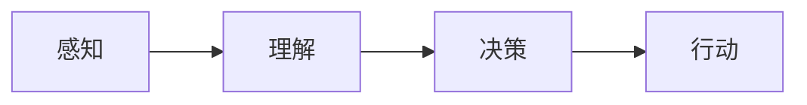
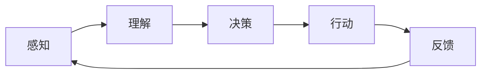

                 

### 《企业AI Agent的多设备支持策略：PC到IoT的全覆盖》

---

关键词：企业AI Agent，多设备支持，PC端，IoT设备，跨设备协同，实际案例分析

摘要：随着企业数字化转型的不断深入，AI Agent作为一种智能化的解决方案，在企业中的应用越来越广泛。本文将探讨企业AI Agent在多设备支持策略中的重要性，从PC端到IoT设备端的全面覆盖，分析其需求、功能设计和技术实现，并通过实际案例进行深入剖析，以期为企业在AI Agent多设备支持方面提供有益的参考。

---

### 目录大纲

----------------------------------------------------------------
# 《企业AI Agent的多设备支持策略：PC到IoT的全覆盖》目录大纲

## 第一部分: 引言与背景
### 1. 引言
### 2. 企业AI Agent的定义与重要性
### 3. 多设备支持策略的概述

## 第二部分: 企业AI Agent的基础
### 4. AI Agent的基本概念与原理
#### 4.1 AI Agent的定义与分类
#### 4.2 AI Agent的工作原理
#### 4.3 AI Agent的核心技术

## 第三部分: PC端支持策略
### 5. PC端AI Agent的需求分析
#### 5.1 PC端用户行为分析
#### 5.2 PC端AI Agent的功能设计
#### 5.3 PC端AI Agent的技术实现

## 第四部分: 移动设备端支持策略
### 6. 移动设备端AI Agent的需求分析
#### 6.1 移动设备端用户行为分析
#### 6.2 移动设备端AI Agent的功能设计
#### 6.3 移动设备端AI Agent的技术实现

## 第五部分: IoT设备端支持策略
### 7. IoT设备端AI Agent的需求分析
#### 7.1 IoT设备端用户行为分析
#### 7.2 IoT设备端AI Agent的功能设计
#### 7.3 IoT设备端AI Agent的技术实现

## 第六部分: 跨设备协同策略
### 8. 跨设备数据同步与共享
#### 8.1 数据同步与共享的重要性
#### 8.2 跨设备数据同步技术
#### 8.3 跨设备数据共享机制

### 9. 跨设备交互策略
#### 9.1 跨设备交互的需求分析
#### 9.2 跨设备交互设计
#### 9.3 跨设备交互实现技术

## 第七部分: 实际案例分析
### 10. 企业AI Agent的多设备支持策略实际案例分析
#### 10.1 案例背景与目标
#### 10.2 案例实施过程
#### 10.3 案例效果评估

## 第八部分: 总结与展望
### 11. 总结
### 12. 展望未来的发展方向

----------------------------------------------------------------

### 引言

在当今的数字化时代，人工智能（AI）技术已经成为推动企业创新和提升竞争力的关键力量。作为AI技术的重要组成部分，AI Agent作为一种智能体，能够模拟人类智能，完成特定的任务。企业AI Agent则是指专门为满足企业特定需求而设计、部署的AI智能体。

随着物联网（IoT）技术的快速发展，越来越多的设备连接到互联网，企业需要面对的是如何在各种设备上支持AI Agent的应用。传统的单一设备支持已经无法满足企业日益复杂的需求，多设备支持策略应运而生。本文将深入探讨企业AI Agent在多设备支持策略中的重要性，并从PC端到IoT设备端进行全面分析。

### 1. 企业AI Agent的定义与重要性

企业AI Agent是指在企业环境中，利用人工智能技术，自主完成特定任务的智能体。它具备自我学习、自我决策和自我优化能力，能够帮助企业提高效率、降低成本、提升服务质量。

企业AI Agent的重要性体现在以下几个方面：

- **提高工作效率**：AI Agent能够自动处理重复性、规则性强的任务，减少人为干预，提高工作效率。

- **降低运营成本**：通过自动化处理，减少人力资源的投入，降低运营成本。

- **提升服务质量**：AI Agent能够提供24小时不间断的服务，提升客户满意度。

- **支持创新应用**：AI Agent的广泛应用为企业提供了创新的业务模式和解决方案。

### 2. 多设备支持策略的概述

多设备支持策略是指企业AI Agent在不同设备上运行和交互的能力。随着物联网设备的普及，企业需要支持AI Agent在PC、移动设备、IoT设备等多种设备上运行。多设备支持策略包括以下几个方面：

- **设备兼容性**：确保AI Agent能够在不同类型的设备上运行，如PC、智能手机、智能手表等。

- **数据同步**：实现不同设备上的数据实时同步，保持数据一致性。

- **跨设备交互**：实现不同设备间的智能交互，提供无缝的用户体验。

- **统一管理**：通过统一的管理平台，实现对不同设备上AI Agent的统一管理。

### 第一部分：引言与背景

#### 1. 引言

在当今的数字化时代，企业面临着前所未有的挑战和机遇。随着物联网（IoT）技术的快速发展，越来越多的设备连接到互联网，企业需要面对的是如何在各种设备上支持AI Agent的应用。传统的单一设备支持已经无法满足企业日益复杂的需求，多设备支持策略应运而生。

企业AI Agent作为一种智能化的解决方案，在企业中的应用越来越广泛。它能够模拟人类智能，完成特定的任务，提高工作效率、降低成本、提升服务质量。然而，随着设备的多样化，如何实现企业AI Agent在多设备上的支持，成为了一个亟待解决的问题。

本文将围绕企业AI Agent的多设备支持策略进行深入探讨，从PC端到IoT设备端进行全面分析。我们将详细讨论AI Agent在不同设备上的需求分析、功能设计和技术实现，并通过实际案例进行深入剖析，以期为企业在AI Agent多设备支持方面提供有益的参考。

#### 2. 企业AI Agent的定义与重要性

企业AI Agent是指在企业环境中，利用人工智能技术，自主完成特定任务的智能体。它具备自我学习、自我决策和自我优化能力，能够帮助企业提高效率、降低成本、提升服务质量。

具体来说，企业AI Agent具有以下几个特点：

- **自我学习**：AI Agent能够通过不断的学习和训练，提高自身的能力和表现。

- **自我决策**：AI Agent能够在给定条件下，根据预设的规则和算法，自主做出决策。

- **自我优化**：AI Agent能够根据执行结果，自我调整和优化，提高执行效率。

企业AI Agent的重要性体现在以下几个方面：

- **提高工作效率**：AI Agent能够自动处理重复性、规则性强的任务，减少人为干预，提高工作效率。

- **降低运营成本**：通过自动化处理，减少人力资源的投入，降低运营成本。

- **提升服务质量**：AI Agent能够提供24小时不间断的服务，提升客户满意度。

- **支持创新应用**：AI Agent的广泛应用为企业提供了创新的业务模式和解决方案。

在企业的各个部门，AI Agent都有广泛的应用场景。例如，在客户服务部门，AI Agent可以自动解答客户疑问，提供个性化服务；在销售部门，AI Agent可以分析客户行为，提供精准的营销策略；在生产部门，AI Agent可以监控设备运行状态，预测维护需求。

总之，企业AI Agent已经成为企业数字化转型的重要组成部分，它在提高效率、降低成本、提升服务质量等方面发挥着重要作用。随着AI技术的不断发展和普及，企业AI Agent的应用前景将更加广阔。

#### 3. 多设备支持策略的概述

在物联网时代，企业AI Agent需要能够适应多种设备，提供一致的用户体验和功能支持。多设备支持策略是企业AI Agent成功的关键之一。以下是对多设备支持策略的概述：

##### 设备兼容性

设备兼容性是确保AI Agent能够在不同类型的设备上运行的基础。不同设备的硬件性能、操作系统和用户界面可能各不相同，因此需要AI Agent具备跨平台的兼容性。例如，AI Agent需要能够在PC、智能手机、平板电脑、智能手表、智能音箱等多种设备上运行。

为了实现设备兼容性，企业可以采取以下措施：

- **跨平台开发框架**：使用跨平台开发框架（如Flutter、React Native等），能够一次性编写代码，在不同设备上编译运行。

- **设备自适应**：根据设备的硬件性能和操作系统，动态调整AI Agent的资源和行为，确保最佳性能。

##### 数据同步

数据同步是多设备支持策略的核心之一。当用户在不同设备上使用AI Agent时，需要确保数据的一致性和实时性。数据同步包括以下方面：

- **实时同步**：确保不同设备上的数据能够实时更新，用户在任意设备上的操作都能即时反映在其他设备上。

- **数据缓存**：为了提高响应速度，可以在设备本地缓存部分数据，实现快速访问。

- **数据一致性**：在多设备环境中，需要确保数据的一致性，防止数据冲突和错误。

##### 跨设备交互

跨设备交互是指AI Agent在不同设备之间进行交互和协作的能力。通过跨设备交互，用户可以无缝地在不同设备上切换和使用AI Agent。以下是一些跨设备交互的策略：

- **统一用户界面**：设计统一的用户界面，使用户在任意设备上都能感受到一致的操作体验。

- **设备间通信**：建立设备间的通信机制，实现设备间的数据共享和指令传递。

- **云端支持**：利用云端服务，提供设备间的数据存储和计算能力，实现高效的跨设备协作。

##### 统一管理

为了方便管理和维护，企业需要实现对不同设备上AI Agent的统一管理。以下是一些统一管理的策略：

- **集中管理平台**：建立集中管理平台，实现AI Agent的统一部署、监控和维护。

- **设备策略配置**：通过配置文件，为不同设备设置特定的AI Agent策略和功能。

- **自动化运维**：利用自动化工具，实现AI Agent的自动部署、更新和故障排除。

通过上述多设备支持策略，企业AI Agent可以更好地适应物联网时代的需求，为用户提供一致、高效、智能的服务。

#### 第一部分总结

在本部分中，我们首先介绍了企业AI Agent的定义和重要性，强调了其在提高工作效率、降低成本、提升服务质量和支持创新应用等方面的关键作用。接着，我们对多设备支持策略进行了概述，详细讨论了设备兼容性、数据同步、跨设备交互和统一管理等方面的内容。这些策略是实现企业AI Agent在多种设备上运行和协作的基础，为后续的分析和讨论奠定了坚实的基础。

在接下来的部分中，我们将深入探讨企业AI Agent的基础，包括其基本概念、工作原理和核心技术。通过这些基础知识的讲解，我们将为理解企业AI Agent在多设备支持策略中的具体实现提供必要的背景。

#### 4. AI Agent的基本概念与原理

在讨论企业AI Agent的多设备支持策略之前，我们需要深入了解AI Agent的基本概念和原理。AI Agent，即人工智能代理，是一种模拟人类智能的计算机程序，能够自主地完成特定任务。AI Agent可以看作是人工智能领域中的一种特殊实体，它具有自主性、适应性、社交性等特征。

##### 4.1 AI Agent的定义与分类

AI Agent的定义可以从以下几个方面进行理解：

- **自主性**：AI Agent能够自主地执行任务，不需要人为干预。这种自主性来源于AI Agent具备自我学习和自我决策的能力。

- **适应性**：AI Agent能够适应不同的环境和条件，自主调整其行为和策略。

- **社交性**：AI Agent可以与人类和其他AI Agent进行交互，实现信息的共享和协作。

根据AI Agent的功能和应用场景，可以将AI Agent分为以下几类：

1. **任务型AI Agent**：这类AI Agent专注于完成特定的任务，如自然语言处理、图像识别、推荐系统等。它们通常具有明确的任务目标和执行流程。

2. **社交型AI Agent**：这类AI Agent专注于与人或其他AI Agent进行交流，如聊天机器人、虚拟助手等。它们具备自然语言理解和生成能力，能够理解人类的需求和意图。

3. **服务型AI Agent**：这类AI Agent专注于提供服务，如客户服务、在线咨询、智能助理等。它们能够根据用户的行为和需求，提供个性化的服务和建议。

##### 4.2 AI Agent的工作原理

AI Agent的工作原理主要包括以下几个方面：

1. **感知**：AI Agent通过传感器（如摄像头、麦克风、传感器等）获取外部环境的信息，实现对环境的感知。

2. **理解**：AI Agent利用机器学习、自然语言处理等技术，对感知到的信息进行处理和理解。例如，通过图像识别技术识别图像中的物体，通过自然语言处理技术理解用户的语音指令。

3. **决策**：AI Agent根据对信息的理解和自身的目标，利用算法和策略进行决策。例如，通过决策树、神经网络等算法选择最佳的行动方案。

4. **行动**：AI Agent根据决策结果执行具体的行动，实现对环境的干预。例如，通过执行程序代码控制机器人移动，通过语音合成模块发出语音指令。

AI Agent的工作原理可以用以下流程图表示：



##### 4.3 AI Agent的核心技术

实现AI Agent的关键技术包括：

1. **机器学习**：机器学习是AI Agent的核心技术之一，用于训练和优化AI Agent的模型。常见的机器学习算法包括线性回归、决策树、神经网络等。

2. **自然语言处理**：自然语言处理技术用于理解和生成自然语言，是实现社交型AI Agent的关键。常见的自然语言处理技术包括分词、词性标注、命名实体识别、语义分析等。

3. **计算机视觉**：计算机视觉技术用于理解和解析图像和视频数据，是实现任务型AI Agent的关键。常见的计算机视觉技术包括图像识别、目标检测、图像分割等。

4. **知识表示与推理**：知识表示与推理技术用于表示和利用知识，实现AI Agent的决策和行动。常见的知识表示方法包括逻辑表示、语义网络、本体论等。

5. **强化学习**：强化学习是一种通过试错和反馈机制进行学习的算法，用于训练AI Agent在复杂环境中的行为。常见的强化学习算法包括Q学习、深度强化学习等。

综上所述，AI Agent是一种具有自主性、适应性、社交性的计算机程序，能够模拟人类智能完成特定任务。了解AI Agent的基本概念、工作原理和核心技术，有助于我们更好地理解和应用AI Agent，为企业在多设备支持策略中提供有力支持。

#### 4.1 AI Agent的定义与分类

AI Agent，即人工智能代理，是一种能够在特定环境中自主行动并具有交互能力的软件系统。其核心特点在于自我驱动和目标导向，能够根据环境变化自主调整行为。为了更好地理解AI Agent，我们可以将其分为几个主要类别：

1. **任务型AI Agent**：这类AI Agent专注于完成特定的任务，如自动数据收集、分析报告、自动化测试等。任务型AI Agent通常具备高度专业化，针对特定的业务需求进行优化。其工作流程通常包括感知环境、分析任务、制定策略、执行行动和评估结果。

2. **社交型AI Agent**：社交型AI Agent主要用于与人类或其他AI Agent进行交互，如聊天机器人、虚拟助手等。这类AI Agent需要具备自然语言理解和生成能力，能够识别用户的意图并做出相应的回应。其工作流程包括接收输入、理解意图、生成回应、反馈和调整。

3. **服务型AI Agent**：服务型AI Agent旨在提供某种服务，如在线客服、虚拟顾问等。这类AI Agent通常需要具备用户行为分析、个性化推荐和问题解决能力。其工作流程包括用户行为监测、需求识别、服务提供、反馈收集和持续优化。

4. **混合型AI Agent**：混合型AI Agent结合了任务型、社交型和服务型的特点，能够在不同场景中灵活切换。例如，一个智能客服系统可能会在处理客户咨询时表现出任务型AI Agent的特点，同时在处理复杂数据分析时表现出服务型AI Agent的特点。

为了更直观地理解AI Agent的分类，我们可以借助ER实体关系图来展示各类AI Agent之间的关系：

```mermaid
erDiagram
    AI_Agent ||--|{ Task_Type : 任务型AI代理}
    AI_Agent ||--|{ Social_Type : 社交型AI代理}
    AI_Agent ||--|{ Service_Type : 服务型AI代理}
    AI_Agent ||--|{ Hybrid_Type : 混合型AI代理}
```

通过这样的分类，我们可以更好地理解AI Agent在不同场景中的应用，并根据实际需求选择合适的AI Agent类型。这种分类不仅有助于研发团队在设计和实现AI Agent时进行明确的方向指导，也有助于用户在使用AI Agent时获得更好的体验。

#### 4.2 AI Agent的工作原理

AI Agent的工作原理是其在复杂环境中自主行动和交互的核心。为了深入理解AI Agent是如何运作的，我们需要从感知、理解、决策和行动这四个关键步骤来分析其工作流程。

##### 4.2.1 感知

感知是AI Agent对外部环境的感知和收集信息的过程。AI Agent通过内置的各种传感器（如摄像头、麦克风、温度传感器等）获取环境数据。例如，在智能家居场景中，AI Agent可以通过摄像头捕捉家庭环境中的活动，通过麦克风接收家庭成员的语音指令，通过温度传感器监测室内温度等。感知数据的质量和准确性直接影响到AI Agent后续的处理和决策。

##### 4.2.2 理解

在感知到外部环境信息后，AI Agent需要对这些信息进行理解和处理。这一步通常涉及到自然语言处理（NLP）、计算机视觉（CV）和其他人工智能技术。例如，通过NLP技术，AI Agent可以理解用户的语音指令或文本输入；通过CV技术，AI Agent可以识别图像中的物体或场景。理解的过程不仅包括对数据的分析和解释，还包括对上下文的理解，以便更准确地捕捉用户的需求和意图。

##### 4.2.3 决策

理解了外部环境信息后，AI Agent需要根据这些信息进行决策。决策过程通常涉及到机器学习（ML）和逻辑推理（LR）等算法。AI Agent会根据预先设定的目标和规则，利用机器学习模型来预测或优化行动方案。例如，在推荐系统中，AI Agent会根据用户的浏览历史和偏好，利用协同过滤算法来生成个性化推荐。在逻辑推理中，AI Agent会根据已知事实和逻辑规则，推导出最佳行动方案。

##### 4.2.4 行动

决策完成后，AI Agent需要执行具体的行动来影响环境。行动可以是自动化的操作，如发送通知、调整温度设置、控制智能设备的开关等。在执行行动时，AI Agent需要与外部设备进行交互，如通过API调用控制智能家居设备，通过数据库操作更新用户数据等。行动的效果会反馈到感知阶段，形成一个闭环系统，以便AI Agent进行持续学习和优化。

##### 4.2.5 循环迭代

AI Agent的工作过程是一个循环迭代的过程。每完成一次感知、理解、决策和行动的循环，AI Agent都会根据反馈进行自我调整和优化。这种迭代过程使得AI Agent能够不断适应环境变化，提高任务执行的效果。例如，在自适应系统监控中，AI Agent会根据系统的运行状态和性能指标，调整监控策略和阈值，确保系统稳定运行。

为了更直观地展示AI Agent的工作原理，我们可以使用Mermaid流程图来描述其工作流程：



通过这个流程图，我们可以清晰地看到AI Agent从感知到行动的整个工作过程，以及各个步骤之间的相互作用和反馈机制。

#### 4.3 AI Agent的核心技术

AI Agent的核心技术是确保其能够在各种环境中高效运作的关键。以下是一些关键技术的详细介绍：

##### 4.3.1 机器学习

机器学习是AI Agent的核心技术之一，用于训练和优化AI Agent的模型。常见的机器学习算法包括线性回归、决策树、神经网络和深度学习等。通过这些算法，AI Agent可以从数据中学习模式，提高任务执行的效果。

例如，在图像识别任务中，卷积神经网络（CNN）通过多层卷积和池化操作，提取图像的特征，从而实现高精度的物体识别。在自然语言处理任务中，循环神经网络（RNN）和长短期记忆网络（LSTM）能够处理序列数据，如文本和语音，从而实现自然语言理解。

##### 4.3.2 自然语言处理

自然语言处理（NLP）技术用于理解和生成自然语言，是实现社交型AI Agent的关键。NLP技术包括文本预处理、词性标注、命名实体识别、情感分析和语义分析等。

例如，在语音识别中，NLP技术可以识别和解析用户的语音指令，将其转换为文本形式，以便AI Agent进行理解和处理。在文本生成中，NLP技术可以生成自然流畅的文本，如聊天机器人的对话生成。

##### 4.3.3 计算机视觉

计算机视觉技术用于理解和解析图像和视频数据，是实现任务型AI Agent的关键。计算机视觉技术包括图像识别、目标检测、图像分割和面部识别等。

例如，在自动驾驶系统中，计算机视觉技术可以实时识别道路标志、行人和其他车辆，从而确保车辆的安全行驶。在安防监控中，计算机视觉技术可以自动检测异常行为和活动，提供实时监控和报警。

##### 4.3.4 知识表示与推理

知识表示与推理技术用于表示和利用知识，实现AI Agent的决策和行动。知识表示方法包括逻辑表示、语义网络和本体论等。推理技术包括逻辑推理、语义推理和概率推理等。

例如，在智能客服系统中，知识表示与推理技术可以用于构建和查询知识库，帮助AI Agent理解用户的问题并给出准确的回答。在智能决策支持系统中，知识表示与推理技术可以用于分析和预测业务趋势，为决策者提供有价值的建议。

##### 4.3.5 强化学习

强化学习是一种通过试错和反馈机制进行学习的算法，用于训练AI Agent在复杂环境中的行为。强化学习算法包括Q学习、深度强化学习和策略梯度等方法。

例如，在游戏AI中，强化学习算法可以训练AI Agent玩各种游戏，从失败中学习并提高胜率。在智能推荐系统中，强化学习算法可以不断调整推荐策略，提高用户满意度。

通过这些核心技术，AI Agent能够实现自主学习和智能决策，为各种应用场景提供高效的解决方案。了解这些核心技术，有助于我们更好地设计和实现AI Agent，推动人工智能技术的广泛应用。

#### 第四部分总结

在本部分中，我们详细介绍了企业AI Agent的基础，包括其基本概念、工作原理和核心技术。首先，我们介绍了AI Agent的定义和分类，明确了任务型、社交型和服务型AI Agent的区别和应用场景。接着，我们分析了AI Agent的工作原理，从感知、理解、决策和行动四个关键步骤，展示了AI Agent如何与环境进行交互和适应。最后，我们详细阐述了AI Agent的核心技术，包括机器学习、自然语言处理、计算机视觉、知识表示与推理和强化学习等。通过这些基础知识的学习，我们对AI Agent有了更深入的理解，为后续的多设备支持策略讨论奠定了坚实的基础。

在接下来的部分中，我们将详细探讨PC端AI Agent的需求分析、功能设计和技术实现，帮助读者了解如何在不同设备上实现AI Agent的功能和优势。

### 5. PC端AI Agent的需求分析

在数字化转型的浪潮下，PC端AI Agent在企业中的应用越来越广泛。为了实现PC端AI Agent的有效支持，首先需要对PC端用户行为进行分析，明确用户的需求和期望，从而为AI Agent的功能设计和技术实现提供依据。

##### 5.1 PC端用户行为分析

PC端用户行为分析主要包括以下几个方面：

1. **用户需求多样性**：PC端用户群体庞大，涵盖了企业员工、客户、合作伙伴等多种角色。他们对于AI Agent的需求是多样化的，包括办公自动化、客户服务、数据分析、系统运维等。

2. **工作流程复杂**：企业内部的工作流程往往复杂多变，PC端AI Agent需要能够理解和处理这些复杂的业务流程，提供高效、精准的服务。

3. **高响应速度**：在PC端，用户期望AI Agent能够快速响应用户的请求，提供即时的服务和支持。响应速度直接影响用户体验。

4. **个性化服务**：用户期望AI Agent能够根据其行为和偏好，提供个性化的服务和建议。这要求AI Agent具备良好的用户行为分析能力和数据挖掘能力。

5. **跨平台兼容性**：由于企业员工可能使用不同类型的PC设备，AI Agent需要具备良好的跨平台兼容性，能够在各种操作系统上运行。

##### 5.2 PC端AI Agent的功能设计

基于PC端用户行为分析，PC端AI Agent的功能设计应围绕以下几个方面进行：

1. **任务自动化**：AI Agent应能够自动化完成常见的办公任务，如邮件管理、日程安排、文档处理等。这有助于提高工作效率，减轻员工的工作负担。

2. **智能推荐**：AI Agent应能够根据用户的行为和偏好，提供个性化的推荐服务，如工作建议、新闻资讯、业务报告等。

3. **智能客服**：AI Agent应能够作为智能客服，自动解答用户的问题，提供在线支持，提升客户满意度。

4. **数据分析**：AI Agent应具备数据分析能力，能够从大量数据中提取有价值的信息，为决策提供支持。

5. **跨平台支持**：AI Agent应能够在不同的操作系统和浏览器上运行，提供一致的用户体验。

##### 5.3 PC端AI Agent的技术实现

实现PC端AI Agent的技术实现主要包括以下几个方面：

1. **前端技术**：使用HTML、CSS和JavaScript等前端技术，构建用户友好的界面。可以选择Vue、React等流行的前端框架，提高开发效率和用户体验。

2. **后端技术**：使用Python、Java、Node.js等后端技术，实现AI Agent的核心功能。后端服务应具备高并发处理能力，确保系统稳定运行。

3. **机器学习模型**：使用TensorFlow、PyTorch等机器学习框架，训练和部署机器学习模型。这些模型可以用于自然语言处理、图像识别等任务。

4. **自然语言处理**：利用NLP技术，实现AI Agent的自然语言理解和生成能力。可以选择开源的NLP库，如NLTK、spaCy等。

5. **数据存储**：使用数据库技术，存储和管理AI Agent所需的数据。可以选择关系型数据库（如MySQL、PostgreSQL）或NoSQL数据库（如MongoDB），根据具体需求进行选择。

6. **API接口**：设计API接口，实现AI Agent与其他系统和服务的数据交互。API接口应具备高可用性和安全性，确保数据的实时性和完整性。

通过上述技术实现，PC端AI Agent可以满足用户的需求，提供高效、智能的服务，助力企业数字化转型。

#### 5.1 PC端用户行为分析

为了更好地理解PC端用户行为，我们首先需要分析用户在PC端进行的主要活动。这些活动可以概括为以下几点：

1. **办公任务处理**：企业员工在PC端主要处理各种办公任务，如撰写文档、发送邮件、安排日程、管理联系人等。这些任务通常具有高度的重复性和规则性，非常适合AI Agent自动化处理。

2. **数据分析与报告**：PC端也是数据分析与报告的重要平台。企业员工需要通过PC端访问和分析大量的数据，生成各种业务报告和统计报表。AI Agent可以辅助员工进行数据分析，提供数据可视化工具，帮助员工快速理解和利用数据。

3. **客户服务**：在客户服务领域，PC端是提供在线支持和服务的重要渠道。客户服务代表需要通过PC端与客户进行沟通，解答客户问题，处理投诉等。AI Agent可以自动分类客户问题，分配给合适的客服人员，提高服务效率。

4. **项目管理**：企业项目管理人员通常在PC端使用项目管理工具来跟踪项目进度、管理任务和资源。AI Agent可以辅助项目管理人员进行任务分配、进度监控和风险预测，确保项目顺利推进。

5. **在线学习与培训**：随着在线教育的普及，越来越多的企业员工通过PC端参与在线学习与培训。AI Agent可以推荐适合的学习资源，提供学习进度跟踪和评估服务，提升员工的学习效果。

在理解了PC端用户的主要活动后，我们进一步分析用户在使用PC端AI Agent时的具体需求和期望：

- **高效性**：用户期望AI Agent能够快速响应用户请求，自动化完成重复性任务，提高工作效率。例如，自动整理邮件、自动安排日程、自动生成报告等。

- **准确性**：用户期望AI Agent能够准确理解用户意图，提供相关建议和帮助。例如，准确回答客户问题、准确分析数据、准确识别图像等。

- **个性化**：用户期望AI Agent能够根据其行为和偏好，提供个性化的服务和建议。例如，根据用户的工作习惯调整任务分配策略、根据用户的学习记录推荐适合的课程等。

- **易用性**：用户期望AI Agent的操作界面简洁易用，不需要过多的培训即可上手使用。例如，提供直观的图形界面、提供清晰的操作指引等。

- **稳定性**：用户期望AI Agent能够稳定运行，不出现故障或错误。例如，确保系统的安全性和可靠性、提供完善的错误处理机制等。

通过上述分析，我们可以看到PC端用户在行为和使用AI Agent时的具体需求和期望。这些需求和期望不仅指导了AI Agent的功能设计，也决定了AI Agent在技术实现上的关键要求。在接下来的部分，我们将进一步探讨如何满足这些需求和期望，设计出高效、智能的PC端AI Agent。

#### 5.2 PC端AI Agent的功能设计

在明确了PC端用户的需求后，我们开始设计PC端AI Agent的功能。这些功能旨在提高用户的工作效率、提供个性化的服务、优化用户体验，具体设计如下：

1. **任务自动化**

   - **邮件管理**：AI Agent可以自动筛选和分类邮件，根据优先级和内容自动处理邮件，如自动回复常见问题、转发给相关同事、归档不需要的邮件等。
   - **日程安排**：AI Agent可以自动识别会议邀请、会议通知和日程安排，自动为用户安排日程，并提供会议提醒和会议总结。
   - **文档处理**：AI Agent可以自动整理文档，如自动提取关键信息、生成摘要、整理文件结构等。

2. **智能推荐**

   - **工作建议**：AI Agent可以根据用户的工作习惯和业务需求，提供个性化的工作建议，如推荐最佳工作流程、建议优化任务分配等。
   - **新闻资讯**：AI Agent可以根据用户兴趣和业务领域，提供定制化的新闻资讯，帮助用户了解行业动态。
   - **数据分析**：AI Agent可以根据用户的数据使用情况，推荐相关的数据分析和可视化工具，帮助用户更好地理解和利用数据。

3. **智能客服**

   - **自动问答**：AI Agent可以自动解答用户常见问题，提供标准化、一致化的服务。
   - **多渠道支持**：AI Agent可以集成到企业官网、客服系统等多个渠道，提供无缝的客服体验。
   - **个性化服务**：AI Agent可以根据用户的历史记录和偏好，提供个性化的服务和建议。

4. **数据分析与报告**

   - **数据提取**：AI Agent可以自动从不同数据源提取数据，如企业数据库、外部API等。
   - **数据可视化**：AI Agent可以生成各种数据报表和可视化图表，帮助用户直观地理解和分析数据。
   - **数据预测**：AI Agent可以基于历史数据，进行趋势分析和预测，为决策提供支持。

5. **跨平台支持**

   - **多操作系统兼容**：AI Agent可以在不同的操作系统（如Windows、macOS、Linux等）上运行。
   - **多浏览器兼容**：AI Agent可以在不同的浏览器（如Chrome、Firefox、Safari等）上运行。
   - **多设备支持**：AI Agent可以支持各种PC设备（如台式机、笔记本电脑等），确保用户在不同设备上都能获得一致的服务。

通过这些功能设计，PC端AI Agent能够满足用户的多样化需求，提高工作效率，优化用户体验，助力企业数字化转型。

#### 5.3 PC端AI Agent的技术实现

为了实现PC端AI Agent的功能，我们需要选择合适的前端、后端技术和工具，并详细描述其技术实现过程。以下是PC端AI Agent的技术实现方案：

##### 5.3.1 前端技术

**前端框架：** 选择Vue.js或React.js作为前端框架，这两者都是目前非常流行的JavaScript框架，具有高性能、易于维护和开发效率高的特点。

- **Vue.js**：Vue.js提供了响应式数据绑定和组合式API，使得开发者可以更方便地构建复杂的前端应用。其社区活跃，文档详尽，便于学习和使用。
- **React.js**：React.js通过组件化开发，提高了代码的可复用性和可维护性。其虚拟DOM机制，使得页面的渲染效率更高。

**前端框架优势对比：**

| 特点 | Vue.js | React.js |
| --- | --- | --- |
| 响应式数据绑定 | 强 | 强 |
| 社区活跃度 | 高 | 非常高 |
| 开发效率 | 高 | 高 |
| 学习难度 | 较低 | 较低 |

**前端工具：** 使用Webpack作为模块打包工具，可以有效地管理和打包前端资源文件，提高开发效率。此外，使用Vite或Parcel等现代构建工具也是可行的选择，这些工具提供了更快的开发体验。

**前端技术实现过程：**

1. **界面设计**：根据功能需求设计界面，使用Figma、Sketch等设计工具创建UI原型，确保界面简洁、直观、符合用户体验。
2. **组件开发**：根据界面设计，开发组件，实现页面的布局和交互功能。使用组件化的开发方式，提高代码的可维护性和可复用性。
3. **响应式布局**：使用CSS预处理器（如Sass或Less）和Flexbox、Grid等现代CSS布局技术，实现响应式布局，确保界面在不同设备和屏幕尺寸上都能良好显示。
4. **状态管理**：使用Vuex或Redux进行状态管理，确保应用状态的一致性和可预测性。这两个库都是目前流行的状态管理库，可以有效地管理复杂的组件状态。

##### 5.3.2 后端技术

**后端框架：** 选择Spring Boot或Django作为后端框架，这两者都是当前流行的后端开发框架，具有高性能、易扩展、社区活跃等特点。

- **Spring Boot**：Spring Boot提供了一个开箱即用的开发环境，可以快速启动和运行Spring应用程序。其生态系统丰富，支持各种功能模块，如安全、缓存、消息队列等。
- **Django**：Django是一个高层次的Python Web框架，鼓励快速开发和干净、实用的设计。其内置的ORM（对象关系映射）和行政界面，使得开发者可以更快速地开发后端功能。

**后端框架优势对比：**

| 特点 | Spring Boot | Django |
| --- | --- | --- |
| 开发效率 | 高 | 非常高 |
| 社区活跃度 | 非常高 | 高 |
| 功能丰富性 | 丰富 | 丰富 |

**后端技术实现过程：**

1. **API设计**：根据前端需求，设计RESTful API接口，确保前后端数据交互的规范性和一致性。
2. **业务逻辑实现**：根据业务需求，实现业务逻辑，如邮件管理、日程安排、文档处理等。使用Spring Boot或Django的框架特性，如AOP（面向切面编程）、ORM等，提高开发效率。
3. **数据存储**：选择合适的数据存储方案，如关系型数据库（如MySQL、PostgreSQL）或NoSQL数据库（如MongoDB）。根据业务需求，设计数据库表结构和数据模型，确保数据存储的效率和安全性。
4. **安全性**：实现用户认证和授权机制，如JWT（JSON Web Token）、OAuth 2.0等，确保系统数据的安全性和用户隐私保护。
5. **服务监控与日志**：使用Spring Boot Actuator或Django Debug Toolbar等工具，实现对系统的监控和日志记录，确保系统的稳定性和可维护性。

##### 5.3.3 机器学习和自然语言处理

**机器学习和自然语言处理（NLP）库：** 使用TensorFlow或PyTorch作为机器学习库，使用NLTK或spaCy作为NLP库，实现AI Agent的自然语言理解和生成功能。

- **TensorFlow**：TensorFlow是一个开放源代码的机器学习框架，支持多种类型的机器学习和深度学习模型，具有广泛的应用场景。
- **PyTorch**：PyTorch是一个基于Python的机器学习库，具有动态计算图和灵活的模型构建能力，适用于复杂的机器学习任务。
- **NLTK**：NLTK是一个流行的自然语言处理库，提供了大量的NLP工具和资源，适用于文本处理和分类任务。
- **spaCy**：spaCy是一个高效的NLP库，提供了丰富的语言模型和预训练模型，适用于文本分类、命名实体识别等任务。

**技术实现过程：**

1. **数据预处理**：收集和预处理文本数据，包括分词、去停用词、词干提取等，为NLP任务做准备。
2. **模型训练**：使用TensorFlow或PyTorch训练NLP模型，如文本分类、命名实体识别、情感分析等。通过调整模型参数和优化算法，提高模型性能。
3. **模型部署**：将训练好的模型部署到后端服务，通过API接口提供NLP服务，如自动问答、文本分析等。

通过上述技术实现，PC端AI Agent能够满足用户的需求，提供高效、智能的服务，助力企业数字化转型。

### 第五部分总结

在本部分中，我们详细分析了PC端AI Agent的需求、功能设计和技术实现。首先，通过PC端用户行为分析，明确了用户在PC端的主要活动及其需求。接着，我们设计了一系列功能，如任务自动化、智能推荐、智能客服、数据分析和跨平台支持，以满足用户的多样化需求。最后，我们详细描述了PC端AI Agent的技术实现过程，包括前端技术、后端技术、机器学习和自然语言处理等方面。通过这些内容的详细讨论，我们为企业在PC端实现高效、智能的AI Agent提供了有力的理论支持和实践指导。

在接下来的部分中，我们将探讨移动设备端AI Agent的需求分析、功能设计和技术实现，帮助读者了解如何在不同设备上实现AI Agent的功能和优势。

### 6. 移动设备端AI Agent的需求分析

随着移动设备的普及，移动设备端AI Agent在企业中的应用越来越广泛。为了实现移动设备端AI Agent的有效支持，我们首先需要分析移动设备端用户的行为和需求，从而为AI Agent的功能设计和技术实现提供依据。

#### 6.1 移动设备端用户行为分析

移动设备端用户行为分析主要包括以下几个方面：

1. **设备多样性**：移动设备包括智能手机、平板电脑、智能手表等，不同设备的硬件性能、操作系统和用户界面存在差异。用户在不同设备上使用AI Agent的需求和习惯也可能不同。

2. **碎片化时间**：移动设备的使用往往发生在碎片化时间，如通勤、休息时间等。用户希望在短时间内完成高效的任务，如查看信息、处理邮件、安排日程等。

3. **移动性**：移动设备的便携性使得用户可以在任何时间、任何地点使用设备。这要求AI Agent具备良好的移动性，能够在不同的网络环境下稳定运行。

4. **个性化需求**：用户希望AI Agent能够根据其行为和偏好，提供个性化的服务。例如，根据用户的位置提供天气预报、根据用户的日程推荐附近的餐厅等。

5. **实时性**：移动设备用户期望AI Agent能够提供实时、准确的信息和服务。例如，实时路况信息、实时天气更新等。

6. **安全性**：移动设备往往涉及个人隐私和数据安全，用户对AI Agent的安全性有较高的要求。例如，需要加密通信、保护用户数据等。

#### 6.2 移动设备端AI Agent的功能设计

基于移动设备端用户行为分析，移动设备端AI Agent的功能设计应围绕以下几个方面进行：

1. **移动任务处理**：AI Agent应能够自动化处理移动设备上的常见任务，如邮件管理、日程安排、联系人管理等。这有助于提高用户在碎片化时间内的效率。

2. **位置服务**：AI Agent应能够利用移动设备的地理位置信息，提供个性化的服务。例如，根据用户的位置推荐附近的餐厅、商场等。

3. **智能提醒**：AI Agent应能够根据用户的日程和习惯，提供智能提醒功能。例如，提前提醒用户会议时间、提醒用户完成任务等。

4. **实时信息推送**：AI Agent应能够实时推送用户关心的信息，如实时新闻、天气预报、交通状况等。

5. **个性化推荐**：AI Agent应能够根据用户的行为和偏好，提供个性化的服务推荐。例如，推荐用户喜欢的音乐、电影等。

6. **安全性保障**：AI Agent应具备数据加密、用户隐私保护等功能，确保用户数据的安全和隐私。

7. **跨平台兼容**：AI Agent应能够在不同的移动设备上运行，提供一致的用户体验。

通过上述功能设计，移动设备端AI Agent可以满足用户的多样化需求，提高移动设备的使用效率，优化用户体验，助力企业数字化转型。

#### 6.1 移动设备端用户行为分析

在移动设备端，用户的行为特征主要体现在以下几个方面：

1. **快速操作**：移动设备的用户倾向于快速操作，期望能够以最小的操作成本完成最多的任务。这种快速操作的需求体现在简洁的界面设计、快捷键和手势操作等方面。

2. **频繁使用**：由于移动设备的便携性和随时可用的特点，用户在移动设备上的使用频率较高，尤其是在通勤、等待等碎片化时间。用户希望移动设备能够满足他们的即时需求，如查看信息、处理邮件、安排日程等。

3. **多任务处理**：移动设备用户经常需要同时处理多个任务，例如在等电梯时查看邮件，在吃饭时浏览社交媒体。这种多任务处理的需求要求移动设备端AI Agent能够高效地处理并发任务，提供流畅的用户体验。

4. **即时性**：用户期望移动设备端AI Agent能够提供即时性的服务，如实时天气更新、实时交通状况、实时股票行情等。即时性的需求使得移动设备端AI Agent需要具备高效的数据同步和实时处理能力。

5. **个性化体验**：用户希望在移动设备上获得个性化的服务体验，如根据用户位置推荐附近的餐厅、根据用户兴趣推送相关新闻等。这种个性化体验的需求要求AI Agent具备强大的数据分析能力和个性化推荐算法。

6. **安全性**：移动设备通常涉及用户的个人隐私和数据安全，用户对移动设备端AI Agent的安全性有较高的要求。例如，用户希望AI Agent能够加密通信、保护用户数据、防止恶意攻击等。

通过对移动设备端用户行为的分析，我们可以看出，移动设备端AI Agent需要具备快速操作、频繁使用、多任务处理、即时性、个性化体验和安全性等关键特性。这些特性不仅影响了AI Agent的设计和实现，也决定了其在实际应用中的效果和用户体验。

#### 6.2 移动设备端AI Agent的功能设计

在了解了移动设备端用户行为的特点后，我们可以设计一系列功能，以满足用户的需求，并提升AI Agent的实用性和用户体验。以下是移动设备端AI Agent的主要功能设计：

1. **智能任务助手**：

   - **邮件管理**：AI Agent可以自动分类和过滤邮件，将重要的邮件推送到用户的手机桌面，并提供快速回复功能。
   - **日程管理**：AI Agent可以根据用户的日程安排，提醒用户即将到来的会议、截止日期和重要事件。
   - **联系人管理**：AI Agent可以自动整理联系人信息，根据用户行为推荐联系人，并提供一键拨号、发送短信等功能。

2. **个性化推荐系统**：

   - **内容推荐**：AI Agent可以根据用户的历史行为和偏好，推荐新闻、文章、音乐、电影等个性化内容。
   - **购物推荐**：AI Agent可以根据用户的购物习惯和偏好，推荐商品和促销信息，提升购物体验。
   - **出行推荐**：AI Agent可以根据用户的出行习惯和偏好，推荐最佳路线、附近的餐厅和景点等。

3. **实时信息推送**：

   - **天气预报**：AI Agent可以实时推送用户的天气预报，提供实时的天气更新和预警信息。
   - **新闻头条**：AI Agent可以实时推送新闻头条，确保用户第一时间获取最新的资讯。
   - **交通状况**：AI Agent可以实时推送用户的所在位置的交通状况，提供最优出行路线。

4. **智能提醒系统**：

   - **事件提醒**：AI Agent可以提醒用户即将到来的重要事件，如会议、纪念日等。
   - **日程提醒**：AI Agent可以根据用户的日程安排，提前提醒用户即将进行的任务，并提供任务清单。
   - **健康提醒**：AI Agent可以提醒用户保持健康的生活方式，如定期锻炼、保持良好的作息时间等。

5. **位置服务**：

   - **附近推荐**：AI Agent可以根据用户的位置，推荐附近的餐饮、购物、娱乐场所等。
   - **导航指引**：AI Agent可以提供实时导航指引，帮助用户快速找到目的地。
   - **行程规划**：AI Agent可以根据用户的出行需求，规划最优的行程路线。

6. **安全性保障**：

   - **数据加密**：AI Agent应使用强加密算法，保护用户的数据和通信安全。
   - **隐私保护**：AI Agent应遵守隐私保护法规，确保用户的个人信息不会被泄露。
   - **安全防护**：AI Agent应具备恶意软件检测和防范功能，保护用户的设备安全。

通过这些功能设计，移动设备端AI Agent能够为用户提供便捷、高效、个性化的服务，提升用户的生活和工作质量，助力企业数字化转型。

#### 6.3 移动设备端AI Agent的技术实现

实现移动设备端AI Agent的关键在于选择合适的前端技术、后端技术、机器学习和自然语言处理（NLP）技术，并设计高效的数据同步机制和接口。以下是对这些技术实现的详细描述：

##### 6.3.1 前端技术

**前端框架：** 选择React Native或Flutter作为前端框架，这两种框架都支持跨平台开发，可以在iOS和Android上运行，提高了开发效率和代码复用率。

- **React Native**：React Native允许开发者使用JavaScript编写原生应用，同时可以利用React的组件化思想，提高代码的可维护性和可复用性。
- **Flutter**：Flutter使用Dart语言开发，具有高性能、美观的UI和良好的跨平台兼容性。Flutter的Material Design和Cupertino风格UI库，使得开发者可以轻松创建高质量的应用界面。

**前端工具：** 使用Webpack或Vite进行模块打包，配合CSS预处理器（如Sass或Less），实现灵活的样式管理和模块化开发。此外，可以使用Redux或MobX进行状态管理，确保应用状态的一致性和可预测性。

**前端技术实现过程：**

1. **界面设计**：根据移动设备的特点，设计简洁、直观的用户界面，确保在不同设备和屏幕尺寸上都能良好显示。
2. **组件开发**：使用React Native或Flutter的组件化开发模式，实现应用的各个功能模块，如邮件管理、日程安排、个性化推荐等。
3. **响应式布局**：使用Flexbox和Grid布局技术，确保界面在不同设备和屏幕尺寸上的适应性。
4. **状态管理**：使用Redux或MobX管理应用状态，实现复杂状态的管理和状态的可预测性。

##### 6.3.2 后端技术

**后端框架：** 选择Spring Boot或Django作为后端框架，这两种框架都具有高性能、易扩展和丰富的功能模块。

- **Spring Boot**：Spring Boot提供了开箱即用的开发环境，支持多种功能模块，如安全、缓存、消息队列等，适合构建大型、复杂的移动应用后端。
- **Django**：Django是一个高层次的Python Web框架，鼓励快速开发和干净、实用的设计，适合构建中小型移动应用后端。

**后端技术实现过程：**

1. **API设计**：根据前端需求，设计RESTful API接口，确保前后端数据交互的规范性和一致性。
2. **业务逻辑实现**：实现移动设备端AI Agent的核心业务功能，如邮件管理、日程安排、位置服务等。
3. **数据存储**：选择关系型数据库（如MySQL、PostgreSQL）或NoSQL数据库（如MongoDB），设计数据库表结构和数据模型，确保数据存储的效率和安全性。
4. **安全性**：实现用户认证和授权机制，如JWT（JSON Web Token）、OAuth 2.0等，确保系统数据的安全性和用户隐私保护。
5. **服务监控与日志**：使用Spring Boot Actuator或Django Debug Toolbar等工具，实现对系统的监控和日志记录，确保系统的稳定性和可维护性。

##### 6.3.3 机器学习和自然语言处理

**机器学习和自然语言处理（NLP）库：** 使用TensorFlow或PyTorch作为机器学习库，使用NLTK或spaCy作为NLP库，实现AI Agent的自然语言理解和生成功能。

- **TensorFlow**：TensorFlow是一个开放源代码的机器学习框架，支持多种类型的机器学习和深度学习模型，适用于文本分类、命名实体识别等任务。
- **PyTorch**：PyTorch是一个基于Python的机器学习库，具有动态计算图和灵活的模型构建能力，适用于复杂的机器学习任务。
- **NLTK**：NLTK是一个流行的自然语言处理库，提供了大量的NLP工具和资源，适用于文本处理和分类任务。
- **spaCy**：spaCy是一个高效的NLP库，提供了丰富的语言模型和预训练模型，适用于文本分类、命名实体识别等任务。

**技术实现过程：**

1. **数据预处理**：收集和预处理文本数据，包括分词、去停用词、词干提取等，为NLP任务做准备。
2. **模型训练**：使用TensorFlow或PyTorch训练NLP模型，如文本分类、命名实体识别、情感分析等。通过调整模型参数和优化算法，提高模型性能。
3. **模型部署**：将训练好的模型部署到后端服务，通过API接口提供NLP服务，如自动问答、文本分析等。

##### 6.3.4 数据同步与接口设计

**数据同步**：为了确保移动设备端AI Agent在不同设备上的数据一致性，需要设计高效的数据同步机制。数据同步包括以下方面：

- **实时同步**：使用WebSocket等实时通信技术，实现数据的实时同步，确保用户在任意设备上的操作都能即时反映在其他设备上。
- **缓存策略**：为了提高响应速度，可以在设备本地缓存部分数据，如用户设置、历史记录等，实现快速访问。
- **数据一致性**：在设计数据同步机制时，需要确保数据的一致性，防止数据冲突和错误。

**接口设计**：设计统一的API接口，实现前后端的数据交互和功能调用。接口设计应遵循RESTful设计原则，确保接口的规范性和易用性。接口设计包括以下方面：

- **用户认证**：设计用户认证接口，实现用户的身份验证和授权。
- **数据查询**：设计数据查询接口，实现用户数据的获取和更新。
- **功能调用**：设计功能调用接口，实现AI Agent的各种功能，如邮件管理、日程安排、位置服务等。

通过上述技术实现，移动设备端AI Agent能够满足用户的需求，提供高效、智能的服务，助力企业数字化转型。

### 第六部分：IoT设备端支持策略

在物联网（IoT）迅速发展的背景下，物联网设备端AI Agent的支持策略成为了企业智能化转型的关键环节。IoT设备端AI Agent旨在利用物联网设备的传感器和数据采集能力，实现智能监控、预测维护和自动化控制等功能。本部分将详细探讨IoT设备端AI Agent的需求分析、功能设计和技术实现，以期为企业在物联网设备端实现高效、智能的AI Agent提供有益的参考。

#### 7.1 IoT设备端用户行为分析

在物联网设备端，用户的行为主要体现在以下几个方面：

1. **实时监控**：用户期望IoT设备能够实时采集数据，如温度、湿度、光线强度等，并通过AI Agent实时分析数据，提供预警和决策支持。

2. **自动化控制**：用户期望IoT设备能够根据AI Agent的决策，自动执行特定的操作，如开启或关闭设备、调整设备参数等。

3. **远程访问**：用户期望能够通过手机或其他设备远程监控和控制物联网设备，实现便捷的远程操作。

4. **设备交互**：用户期望IoT设备之间能够实现智能交互，如智能家居设备之间的联动，实现智能化的家居环境。

5. **数据可视化**：用户期望能够通过直观的界面，查看设备采集的数据和历史记录，方便分析和决策。

6. **安全性**：用户对物联网设备的安全性有较高的要求，期望设备能够有效保护用户数据和个人隐私。

#### 7.2 IoT设备端AI Agent的功能设计

基于IoT设备端用户行为分析，IoT设备端AI Agent的功能设计应围绕以下几个方面进行：

1. **实时监控**：AI Agent应能够实时采集和处理物联网设备的传感器数据，实现对设备运行状态的实时监控。

2. **数据分析与预测**：AI Agent应能够对采集到的数据进行分析，提供预测模型，预测设备故障、环境变化等。

3. **自动化控制**：AI Agent应能够根据数据分析结果，自动执行相应的操作，如调整设备参数、启动备用设备等。

4. **远程访问**：AI Agent应提供远程访问功能，使用户能够通过手机或其他设备远程监控和控制物联网设备。

5. **设备交互**：AI Agent应支持物联网设备之间的智能交互，实现设备之间的联动和协同工作。

6. **数据可视化**：AI Agent应提供直观的数据可视化界面，使用户能够轻松查看设备数据和历史记录。

7. **安全性保障**：AI Agent应具备数据加密、用户隐私保护等功能，确保设备数据的安全和用户隐私的保护。

8. **跨平台兼容**：AI Agent应能够在不同的IoT设备上运行，提供一致的用户体验。

通过上述功能设计，IoT设备端AI Agent能够满足用户的多样化需求，提高物联网设备的管理和运维效率，实现智能化、自动化的设备管理。

#### 7.3 IoT设备端AI Agent的技术实现

实现IoT设备端AI Agent的技术实现涉及多个方面，包括硬件选择、软件开发、数据同步和通信协议等。以下是IoT设备端AI Agent的技术实现方案：

##### 7.3.1 硬件选择

**物联网设备**：选择适合的物联网设备，如智能传感器、智能门锁、智能摄像头等。这些设备应具备良好的数据采集能力和通信能力，能够支持AI Agent的运行。

**边缘计算设备**：选择具备边缘计算能力的设备，如树莓派、边缘服务器等。这些设备能够对采集到的数据进行分析和处理，减轻中心服务器的负担。

**传感器模块**：选择高精度、低功耗的传感器模块，如温湿度传感器、红外传感器等。这些传感器能够实时采集环境数据，为AI Agent提供丰富的数据源。

##### 7.3.2 软件开发

**AI Agent开发框架**：选择合适的AI Agent开发框架，如Apache Flink、TensorFlow Lite等。这些框架提供了丰富的API和工具，能够快速开发高性能的AI Agent。

**边缘计算软件**：在边缘计算设备上部署边缘计算软件，如EdgeX Foundry、MQTT等。这些软件能够实现设备数据的采集、处理和存储，支持AI Agent的运行。

**数据预处理**：设计数据预处理模块，实现对采集到的传感器数据的清洗、转换和归一化，为AI Agent提供高质量的数据输入。

**机器学习模型**：使用机器学习算法，如决策树、支持向量机、神经网络等，训练和部署机器学习模型，实现对设备数据的分析和预测。

##### 7.3.3 数据同步

**实时同步**：采用实时同步技术，如WebSocket、MQTT等，实现设备数据与中心服务器之间的实时传输，确保数据的一致性和实时性。

**数据缓存**：在边缘计算设备上设置数据缓存机制，缓存部分数据，减轻中心服务器的负担，提高系统响应速度。

**数据加密**：对传输的数据进行加密处理，确保数据传输的安全性和隐私性。

##### 7.3.4 通信协议

**物联网通信协议**：选择适合的物联网通信协议，如MQTT、CoAP等。这些协议支持设备的低功耗通信，能够保证数据传输的可靠性和高效性。

**边缘与中心通信**：设计边缘与中心之间的通信机制，如HTTP API、WebSocket等。这些机制能够实现边缘计算设备与中心服务器之间的数据交互和功能调用。

通过上述技术实现，IoT设备端AI Agent能够满足用户的需求，提供高效、智能的服务，实现物联网设备的智能化管理和自动化控制。

### 7.1 IoT设备端用户行为分析

在物联网（IoT）设备端，用户行为具有以下显著特征：

1. **数据敏感性**：用户对IoT设备采集的数据具有高度敏感性，期望实时获取设备运行状态、环境变化等信息。例如，在智能家居场景中，用户希望实时了解家居温度、湿度、能源消耗等数据。

2. **自动化需求**：用户期望IoT设备能够实现自动化控制，降低人工干预。例如，在智能工厂中，用户希望IoT设备能够自动调整生产参数、预测设备故障、自动启动备用设备等。

3. **远程控制**：用户期望能够通过移动设备或其他远程设备对IoT设备进行控制。例如，用户希望远程控制智能门锁、智能灯光、智能窗帘等，实现便捷的远程操作。

4. **设备交互**：用户期望IoT设备之间能够实现智能交互和协同工作。例如，在智能家居中，用户希望智能门锁能够与智能摄像头联动，实现智能家居的联动控制。

5. **数据隐私**：用户对物联网设备的数据安全和隐私保护有较高的要求。用户担心设备数据泄露，导致个人隐私受到侵犯。因此，用户期望IoT设备能够提供严格的数据加密和隐私保护措施。

6. **可靠性**：用户对IoT设备的可靠性和稳定性有较高的要求。用户期望IoT设备能够在各种环境下稳定运行，确保数据采集和传输的准确性。

通过对IoT设备端用户行为的分析，我们可以明确用户在物联网设备端的主要需求和期望。这些需求和期望为IoT设备端AI Agent的功能设计和技术实现提供了重要的指导，有助于开发出满足用户需求的高效、智能的AI Agent。

#### 7.2 IoT设备端AI Agent的功能设计

在了解了IoT设备端用户行为的特点后，我们可以设计一系列功能，以满足用户的需求，并提升AI Agent的实用性和用户体验。以下是IoT设备端AI Agent的主要功能设计：

1. **实时监控与数据采集**：

   - **环境监控**：AI Agent能够实时采集环境数据，如温度、湿度、空气质量等，并实时上传到中心服务器，供用户查看和分析。
   - **设备状态监控**：AI Agent能够监控物联网设备的运行状态，如电池电量、传感器工作状态等，并实时推送异常通知，确保设备正常运行。

2. **自动化控制与优化**：

   - **自动化控制**：AI Agent能够根据预设规则和算法，自动执行特定的操作，如开启或关闭设备、调整设备参数等，提高设备运行的效率。
   - **优化建议**：AI Agent能够根据设备运行数据，提供优化建议，如调整设备运行模式、优化能源使用等，帮助用户降低运营成本。

3. **预测维护与故障预警**：

   - **预测模型**：AI Agent能够利用机器学习算法，建立预测模型，预测设备故障或环境变化，提前预警，避免设备故障造成损失。
   - **故障诊断**：AI Agent能够分析设备故障数据，诊断故障原因，提供修复建议，帮助用户快速解决问题。

4. **远程访问与控制**：

   - **远程监控**：用户可以通过手机或其他设备远程监控物联网设备的运行状态，查看历史数据，实现远程控制。
   - **远程操作**：用户可以通过远程操作，实时调整设备参数，设置自动化规则，实现便捷的远程操作。

5. **设备交互与联动**：

   - **智能联动**：AI Agent能够支持设备之间的智能交互和联动，如智能门锁与智能摄像头联动，实现智能家居的自动化管理。
   - **场景模式**：AI Agent能够根据用户需求，设置场景模式，如离家模式、睡眠模式等，实现一键切换，提高用户的生活质量。

6. **数据可视化与报表生成**：

   - **数据可视化**：AI Agent能够提供直观的数据可视化界面，使用户能够轻松查看设备数据和历史记录。
   - **报表生成**：AI Agent能够生成各种报表，如设备运行报表、环境监测报表等，帮助用户分析和决策。

7. **安全性保障**：

   - **数据加密**：AI Agent能够对传输的数据进行加密处理，确保数据传输的安全性和隐私性。
   - **访问控制**：AI Agent能够实现用户访问控制，确保用户只能访问授权的数据和功能。

通过这些功能设计，IoT设备端AI Agent能够为用户提供高效、智能的服务，满足用户在实时监控、自动化控制、预测维护、远程访问、设备交互和数据安全等方面的需求。

#### 7.3 IoT设备端AI Agent的技术实现

实现IoT设备端AI Agent的关键在于硬件选择、软件设计、通信协议和数据同步等方面的技术实现。以下是IoT设备端AI Agent的技术实现方案：

##### 7.3.1 硬件选择

**物联网设备**：选择适合的物联网设备，如传感器模块、智能门锁、智能摄像头等。这些设备应具备良好的数据采集能力和通信能力，能够支持AI Agent的运行。

**边缘计算设备**：选择具备边缘计算能力的设备，如树莓派、边缘服务器等。这些设备能够对采集到的数据进行分析和处理，减轻中心服务器的负担。

**传感器模块**：选择高精度、低功耗的传感器模块，如温湿度传感器、红外传感器等。这些传感器能够实时采集环境数据，为AI Agent提供丰富的数据源。

##### 7.3.2 软件设计

**AI Agent开发框架**：选择合适的AI Agent开发框架，如Apache Flink、TensorFlow Lite等。这些框架提供了丰富的API和工具，能够快速开发高性能的AI Agent。

**边缘计算软件**：在边缘计算设备上部署边缘计算软件，如EdgeX Foundry、MQTT等。这些软件能够实现设备数据的采集、处理和存储，支持AI Agent的运行。

**数据预处理**：设计数据预处理模块，实现对采集到的传感器数据的清洗、转换和归一化，为AI Agent提供高质量的数据输入。

**机器学习模型**：使用机器学习算法，如决策树、支持向量机、神经网络等，训练和部署机器学习模型，实现对设备数据的分析和预测。

##### 7.3.3 通信协议

**物联网通信协议**：选择适合的物联网通信协议，如MQTT、CoAP等。这些协议支持设备的低功耗通信，能够保证数据传输的可靠性和高效性。

**边缘与中心通信**：设计边缘与中心之间的通信机制，如HTTP API、WebSocket等。这些机制能够实现边缘计算设备与中心服务器之间的数据交互和功能调用。

##### 7.3.4 数据同步

**实时同步**：采用实时同步技术，如WebSocket、MQTT等，实现设备数据与中心服务器之间的实时传输，确保数据的一致性和实时性。

**数据缓存**：在边缘计算设备上设置数据缓存机制，缓存部分数据，减轻中心服务器的负担，提高系统响应速度。

**数据加密**：对传输的数据进行加密处理，确保数据传输的安全性和隐私性。

通过上述技术实现，IoT设备端AI Agent能够满足用户的需求，提供高效、智能的服务，实现物联网设备的智能化管理和自动化控制。

### 第六部分总结

在本部分中，我们详细探讨了IoT设备端AI Agent的需求分析、功能设计和技术实现。首先，通过对IoT设备端用户行为的分析，明确了用户在实时监控、自动化控制、远程访问、设备交互和数据隐私等方面的需求。接着，我们设计了IoT设备端AI Agent的实时监控、自动化控制、预测维护、远程访问、设备交互和数据可视化等功能，以满足用户的多样化需求。最后，我们详细描述了IoT设备端AI Agent的技术实现，包括硬件选择、软件设计、通信协议和数据同步等方面的内容。

通过本部分的讨论，我们为企业在IoT设备端实现高效、智能的AI Agent提供了全面的理论支持和实践指导。在接下来的部分中，我们将探讨跨设备协同策略，以实现企业AI Agent在多种设备上的一致性和高效性。

### 8. 跨设备协同策略

在物联网时代，企业AI Agent需要能够适应多种设备，提供一致的用户体验和功能支持。为了实现这一目标，跨设备协同策略成为关键。跨设备协同策略包括数据同步与共享、跨设备交互策略等方面，以下将详细讨论这些内容。

#### 8.1 数据同步与共享

数据同步与共享是实现多设备一致性的核心。在跨设备协同策略中，数据同步与共享的重要性体现在以下几个方面：

1. **一致性**：通过数据同步与共享，确保不同设备上的数据保持一致。例如，用户在PC端修改的日程安排能够实时同步到移动设备上。

2. **实时性**：数据同步与共享能够实现数据的实时更新，使用户在任意设备上都能获取最新的信息。例如，物联网设备实时采集的数据可以实时传输到云端，供PC端和移动设备端查看。

3. **个性化**：通过数据同步与共享，AI Agent可以更好地了解用户的行为和偏好，提供个性化的服务。例如，用户在移动设备上浏览的新闻推荐，可以同步到PC端，提供一致的阅读体验。

4. **可靠性**：数据同步与共享机制需要具备高可靠性，确保数据传输不丢失、不延迟。例如，使用WebSocket等实时通信技术，确保数据传输的实时性和可靠性。

##### 数据同步技术

为了实现高效的数据同步，可以采用以下技术：

- **实时同步**：采用实时同步技术，如WebSocket、MQTT等，实现数据的实时传输。这些技术支持低延迟、高并发的数据传输，能够满足多设备环境下的数据同步需求。

- **批量同步**：对于数据量较大或更新频率较低的场景，可以采用批量同步技术，定期将数据批量传输到云端或目标设备。批量同步可以减少网络流量，提高数据传输效率。

- **增量同步**：对于实时性要求不高的场景，可以采用增量同步技术，只同步数据的变化部分。这种技术可以减少数据传输的体积，提高同步效率。

##### 数据共享机制

为了实现数据共享，可以采用以下机制：

- **统一数据模型**：设计统一的数据模型，确保不同设备上的数据结构一致。这样可以简化数据同步与共享的复杂性。

- **数据缓存**：在设备本地设置数据缓存机制，缓存部分常用数据，提高数据访问速度。缓存机制可以减少对网络流量的依赖，提高数据访问的实时性。

- **数据加密**：对传输的数据进行加密处理，确保数据传输的安全性和隐私性。数据加密可以防止数据在传输过程中被窃取或篡改。

#### 8.2 跨设备交互策略

跨设备交互策略是实现多设备无缝协作的重要手段。在跨设备协同策略中，跨设备交互策略的重要性体现在以下几个方面：

1. **用户体验**：通过跨设备交互，用户可以在不同设备上无缝切换，享受一致的用户体验。例如，用户可以在PC端编辑文档，然后在移动设备上继续编辑。

2. **功能扩展**：跨设备交互使得AI Agent可以充分利用不同设备的特性，提供更丰富的功能。例如，用户可以通过PC端进行复杂的数据分析，通过移动设备查看分析结果。

3. **数据集成**：跨设备交互可以实现不同设备上数据的集成和共享，为AI Agent提供更全面的数据支持。例如，通过跨设备交互，用户可以在PC端查看智能家居设备的运行数据，通过移动设备控制设备的开关。

##### 跨设备交互设计

为了实现高效的跨设备交互，可以采用以下设计策略：

- **统一用户界面**：设计统一的用户界面，确保用户在不同设备上都能感受到一致的操作体验。例如，使用响应式设计，确保界面在不同设备和屏幕尺寸上都能良好显示。

- **设备自适应**：根据设备的特性（如屏幕尺寸、输入方式等），动态调整用户界面和交互方式。例如，在移动设备上使用触摸操作，在PC端使用鼠标和键盘操作。

- **设备间通信**：建立设备间通信机制，实现设备间的数据共享和指令传递。例如，使用蓝牙、Wi-Fi等无线通信技术，实现设备之间的数据传输和命令控制。

##### 跨设备交互实现技术

为了实现高效的跨设备交互，可以采用以下技术：

- **跨平台开发框架**：使用跨平台开发框架（如Flutter、React Native等），能够一次性编写代码，在不同设备上编译运行。这种技术可以减少开发工作量，提高开发效率。

- **云计算与边缘计算**：利用云计算和边缘计算技术，实现数据的存储、处理和传输。云计算可以提供强大的计算能力和存储资源，边缘计算可以降低数据传输延迟，提高实时性。

- **API接口**：设计统一的API接口，实现不同设备之间的数据交互和功能调用。API接口应具备高可用性和安全性，确保数据的实时性和完整性。

通过上述跨设备协同策略，企业AI Agent可以在多种设备上提供一致、高效的服务，实现无缝的用户体验和功能协作。

### 8.1 数据同步与共享的重要性

在多设备环境中，数据同步与共享的重要性不可忽视。首先，数据同步与共享能够确保不同设备上的数据一致性。在企业的实际应用中，用户可能会同时使用PC、移动设备和IoT设备，如果这些设备上的数据不一致，会导致用户体验差、决策失误等问题。例如，一个员工在PC端更新了日程安排，但移动设备上依然显示旧的数据，这会导致员工无法准确安排工作。因此，通过数据同步与共享，可以确保用户在任意设备上都能看到最新的数据，避免信息孤岛和数据不一致的问题。

其次，数据同步与共享能够提高数据实时性。在现代企业中，实时数据对于决策至关重要。例如，在智能家居场景中，用户需要实时了解家庭环境的变化，如温度、湿度等。如果数据不能实时同步，用户将无法及时做出相应的调整，可能会导致安全隐患或生活不便。通过实时同步技术，如WebSocket和MQTT，可以确保数据在短时间内传输到目标设备，实现数据的实时性。

数据同步与共享还能够提升个性化服务的水平。随着用户个性化需求的增加，企业需要根据用户的行为和偏好提供定制化的服务。例如，一个用户在移动设备上浏览了特定的新闻，如果这些信息不能同步到PC端，那么PC端就无法根据用户的兴趣推荐相关的新闻。通过数据同步与共享，AI Agent可以更好地了解用户的行为，提供个性化的服务，提高用户满意度。

此外，数据同步与共享对于数据分析和企业决策也具有重要意义。企业通过收集和分析用户数据，可以洞察用户行为、市场趋势等，为决策提供数据支持。如果数据不能在不同设备之间同步，将影响数据分析的准确性和完整性。例如，一个用户在PC端进行了大量的数据分析，这些数据如果不能同步到移动设备，那么用户在移动设备上就无法继续分析，导致数据分析的断续和不便。

最后，数据同步与共享能够提高数据的安全性。在多设备环境中，数据的安全性和隐私保护至关重要。通过数据同步与共享，企业可以采取统一的安全策略，如数据加密、访问控制等，确保数据在传输和存储过程中的安全性。例如，企业可以使用TLS加密协议保护数据在传输过程中的安全，使用权限控制机制限制数据访问，确保用户数据不被未授权访问。

总之，数据同步与共享在多设备环境中具有重要的战略意义。通过实现数据的一致性、实时性、个性化服务以及支持数据分析和企业决策，数据同步与共享能够显著提升企业的运营效率和用户体验。在接下来的部分，我们将详细介绍实现数据同步与共享的技术手段。

#### 8.2 跨设备数据同步技术

为了实现跨设备数据同步，确保多设备环境中数据的一致性和实时性，可以采用以下几种技术手段：

1. **实时同步技术**

   - **WebSocket**：WebSocket是一种基于TCP协议的全双工通信协议，能够实现服务器与客户端之间的实时数据传输。通过WebSocket，可以实现数据在多设备之间的实时同步，确保用户在任意设备上都能看到最新的数据。

   - **MQTT**：MQTT（Message Queuing Telemetry Transport）是一种轻量级的消息传输协议，广泛应用于物联网设备。MQTT协议支持发布/订阅模式，设备可以订阅特定的主题，当有数据更新时，服务器会自动将数据推送到订阅者。这种模式适用于大规模设备同步，能够高效地实现数据同步。

2. **批量同步技术**

   - **定时同步**：通过设置定时任务，定期将设备上的数据批量同步到中心服务器。这种方式适用于数据量较大或更新频率较低的场景。例如，企业可以每天晚上定时同步一天内的数据，确保数据的一致性。

   - **触发同步**：在某些特定事件触发时，如设备开机、用户操作等，自动将数据同步到中心服务器。这种方式适用于实时性要求不高的场景，例如，设备每隔一段时间自动同步数据，确保数据的更新。

3. **增量同步技术**

   - **差异检测**：通过比较设备本地数据和中心服务器的数据，检测出差异部分进行同步。例如，只同步数据中发生变化的字段，减少数据传输的体积。

   - **时间戳同步**：为每条数据记录一个时间戳，通过比较时间戳，判断数据是否需要同步。只同步时间戳较新的数据，实现增量同步。

通过上述技术手段，可以实现高效、可靠的数据同步，确保多设备环境中数据的一致性和实时性。

#### 8.3 跨设备数据共享机制

在多设备环境下，实现数据共享机制是确保AI Agent在不同设备上提供一致性和连贯服务的关键。以下将详细讨论数据共享机制的实现方案：

**1. 统一数据模型**

首先，建立一个统一的数据模型，确保不同设备上的数据结构一致。统一数据模型可以简化数据同步和共享的复杂性。例如，定义一个通用的用户数据模型，包括用户基本信息、行为记录、偏好设置等。通过统一数据模型，不同设备上的AI Agent可以方便地访问和操作同一组数据。

**2. 数据存储方案**

为了实现数据共享，需要选择合适的存储方案。以下是几种常见的数据存储方案：

- **中心化存储**：将数据存储在中心服务器，所有设备通过API接口访问数据。这种方案便于集中管理和维护，但数据访问速度可能成为瓶颈。适用于数据量较小、设备数量不多的场景。

- **去中心化存储**：使用分布式存储方案，如分布式数据库或区块链，确保数据在各个设备上都有副本。这种方式可以提高数据访问速度和系统的容错性，但管理复杂性较高。适用于数据量大、设备数量多的场景。

- **边缘计算与中心化存储结合**：在边缘计算设备上存储部分常用数据，通过边缘计算处理数据，减轻中心服务器的负担。这种方式可以平衡数据访问速度和系统复杂性，适用于大规模多设备环境。

**3. 数据同步机制**

为了实现实时数据共享，需要设计有效的数据同步机制。以下是一些常见的数据同步机制：

- **实时同步**：采用WebSocket、MQTT等技术实现实时数据同步。这些技术支持低延迟、高并发的数据传输，能够满足多设备环境下的数据同步需求。

- **批量同步**：对于数据量较大或更新频率较低的场景，可以采用批量同步机制，定期将数据批量传输到中心服务器。批量同步可以减少网络流量，提高数据传输效率。

- **增量同步**：对于实时性要求不高的场景，可以采用增量同步机制，只同步数据的变化部分。这种方式可以减少数据传输的体积，提高同步效率。

**4. 数据访问控制**

为了确保数据的安全性和隐私性，需要实现数据访问控制。以下是一些数据访问控制策略：

- **权限控制**：为不同用户或设备分配不同的访问权限，确保用户只能访问授权的数据。

- **加密传输**：对传输的数据进行加密处理，确保数据传输过程中的安全性。

- **签名验证**：对数据传输进行签名验证，确保数据的完整性和真实性。

通过统一数据模型、数据存储方案、数据同步机制和数据访问控制，可以实现高效、安全的数据共享机制，确保多设备环境下AI Agent的一致性和连贯性。

### 9.1 跨设备交互的需求分析

在多设备环境中，跨设备交互的需求变得尤为重要。为了满足用户的需求，企业AI Agent需要具备以下跨设备交互能力：

1. **无缝体验**：用户希望在不同设备上获得一致、无缝的体验。例如，用户在PC端编辑的文档应能够在移动设备上继续编辑，用户在移动设备上设置的通知应实时同步到PC端。

2. **数据访问**：用户需要在不同设备上访问相同的数据集。例如，用户在PC端查看的报表数据应能够在移动设备上继续查看，用户在IoT设备上采集的环境数据应能够在PC端进行分析。

3. **功能互补**：不同设备具有不同的功能特点，用户希望在不同设备上发挥各自的优势。例如，用户在PC端进行复杂的数据分析，然后在移动设备上查看分析结果，或者用户在IoT设备上远程控制智能家居设备。

4. **实时沟通**：用户需要在多设备间进行实时沟通和数据交换。例如，用户在会议中通过PC端共享文档，然后通过移动设备继续讨论，或者用户通过IoT设备发送警报，然后在PC端查看警报详情。

5. **个性化服务**：用户希望AI Agent能够根据设备的不同特点，提供个性化的服务。例如，用户在PC端浏览的新闻推荐应能够在移动设备上继续推荐，用户在IoT设备上设置的家庭场景应能够在PC端进行调整。

6. **数据安全和隐私**：用户对数据安全和隐私保护有较高的要求。AI Agent需要确保数据在不同设备间的传输过程中安全可靠，防止数据泄露和未授权访问。

7. **低延迟和高并发**：为了提供良好的用户体验，AI Agent需要具备低延迟和高并发的数据处理能力，确保用户在多设备间进行交互时能够快速响应。

通过满足上述需求，企业AI Agent可以实现高效、智能的跨设备交互，提升用户体验，助力企业数字化转型。

#### 9.2 跨设备交互设计

在实现跨设备交互时，设计策略至关重要。以下是一些关键的设计策略，以确保跨设备交互的顺畅、高效和用户体验一致：

1. **统一用户界面设计**：

   - **界面一致性**：设计统一的用户界面（UI），确保用户在不同设备上看到的外观和操作方式一致。例如，使用相同的设计元素、颜色方案和布局，让用户在使用不同设备时感受到一致的品牌体验。

   - **自适应布局**：采用响应式设计，根据不同设备的屏幕尺寸和分辨率，自动调整界面布局。例如，使用媒体查询（Media Queries）和弹性布局（Flexbox、Grid）技术，实现界面在不同设备上的自适应。

2. **设备特性利用**：

   - **利用硬件特性**：根据不同设备的硬件特性（如触摸屏、摄像头、传感器等），优化交互设计。例如，在移动设备上利用触摸屏实现滑动、拖拽等手势操作，在IoT设备上利用摄像头实现图像识别和交互。

   - **功能互补**：利用不同设备的功能特点，实现功能互补。例如，PC端适合进行复杂操作和数据处理，移动设备适合快速访问和简单操作。

3. **交互流程优化**：

   - **简化操作流程**：简化用户在不同设备上的操作流程，减少用户操作的复杂度。例如，将PC端的多个步骤简化为移动设备上的一个步骤，或者将移动设备上的操作自动化，减少用户干预。

   - **提供快捷方式**：为常用操作提供快捷方式，提高操作效率。例如，在移动设备上提供快速访问常用功能的快捷按钮，在PC端提供快捷键。

4. **数据同步与共享**：

   - **实时数据同步**：采用实时同步技术（如WebSocket、MQTT），确保数据在不同设备间实时更新，提供无缝的交互体验。

   - **数据缓存**：在设备本地设置数据缓存机制，提高数据访问速度，减少对网络流量的依赖。

5. **用户体验一致性**：

   - **行为一致性**：确保用户在不同设备上的行为（如点击、滑动等）产生相同的效果。例如，在PC端和移动设备上，点击同一个按钮都应触发相同的操作。

   - **反馈机制**：为用户的操作提供及时的反馈，增强用户体验。例如，在用户操作时显示加载动画、进度条等，让用户知道操作正在进行中。

通过上述设计策略，可以确保跨设备交互的顺畅、高效和用户体验一致，提升用户满意度，助力企业数字化转型。

#### 9.3 跨设备交互实现技术

为了实现跨设备交互，需要依赖一系列技术和工具，以确保交互的高效性、一致性和稳定性。以下是实现跨设备交互的关键技术：

1. **Web技术**：

   - **前端框架**：使用React、Vue.js或Angular等前端框架，这些框架提供了丰富的组件和工具，帮助开发者快速构建跨平台的前端应用。它们支持响应式设计，能够根据设备的屏幕尺寸和分辨率自动调整界面布局。

   - **CSS预处理器**：使用Sass、Less等CSS预处理器，提高CSS代码的可维护性和复用性。这些预处理器提供了变量、嵌套、混合等功能，使得开发者可以更方便地编写复杂的CSS样式。

   - **响应式布局**：使用Flexbox、Grid等CSS布局技术，实现界面的自适应布局。这些技术能够根据不同设备的屏幕尺寸和分辨率，自动调整内容的位置和大小。

2. **移动开发技术**：

   - **跨平台框架**：使用React Native或Flutter等跨平台开发框架，这些框架允许开发者使用一套代码库同时构建iOS和Android应用。它们利用原生组件和原生API，提供接近原生应用的性能和用户体验。

   - **原生开发**：在某些特定场景下，如需要高度优化的性能或特定的硬件交互，可以采用原生开发技术。iOS应用使用Swift或Objective-C，Android应用使用Java或Kotlin。

3. **物联网技术**：

   - **MQTT**：MQTT（Message Queuing Telemetry Transport）是一种轻量级的消息传输协议，适用于物联网设备。它支持发布/订阅模式，设备可以通过订阅特定主题来接收消息，实现实时数据同步和跨设备通信。

   - **HTTP API**：通过HTTP API实现设备间的数据交互和功能调用。HTTP API易于实现、维护，且支持多种编程语言，适用于不同设备之间的数据传输和命令控制。

4. **实时通信技术**：

   - **WebSocket**：WebSocket是一种全双工通信协议，允许服务器和客户端之间进行实时通信。通过WebSocket，可以实时推送数据，实现低延迟、高并发的数据传输。

   - **Socket.io**：Socket.io是一个基于WebSocket的实时通信库，支持自动重连、心跳检测等功能，能够提供更稳定、更高效的实时通信。

5. **云服务和边缘计算**：

   - **云计算**：利用云计算平台（如AWS、Azure、Google Cloud等），提供强大的计算能力和存储资源。云计算能够支持大规模设备的接入和管理，实现数据的集中处理和分析。

   - **边缘计算**：在边缘设备上部署计算和存储能力，减轻中心服务器的负担。边缘计算能够提高数据处理的实时性和效率，减少数据传输延迟。

6. **身份验证和授权**：

   - **OAuth 2.0**：使用OAuth 2.0协议实现用户身份验证和授权。OAuth 2.0支持多种认证方式，如密码认证、令牌认证等，能够保护用户数据和系统安全。

   - **JWT**：使用JSON Web Token（JWT）实现令牌认证。JWT是一种安全、高效的身份验证机制，可以包含用户的身份信息，确保数据传输过程中的安全性。

通过上述技术和工具，可以实现高效的跨设备交互，确保用户在不同设备上获得一致、流畅的体验。

### 9.1 跨设备交互的需求分析

在多设备环境中，用户对跨设备交互的需求愈发强烈，主要表现在以下几个方面：

1. **一致性体验**：用户希望在多设备上获得一致的用户体验。无论是使用PC、平板还是智能手机，用户期望界面风格、操作逻辑和功能实现都保持一致，从而减少学习成本，提升使用效率。

2. **数据连续性**：用户希望在不同设备上能够无缝地访问和操作同一份数据。例如，用户在PC上编辑的文档，应该能够继续在平板或智能手机上编辑，且编辑内容应实时同步。

3. **设备互补性**：用户期望能够利用不同设备的特性，实现功能互补。例如，在PC上进行复杂的数据分析和处理，而在移动设备上查看分析结果或接收实时通知。

4. **操作便捷性**：用户希望在多设备上实现操作的便捷性。例如，在移动设备上能够快速完成某些简单操作，如查看日程、发送邮件等，而在PC上进行更复杂的多步骤操作。

5. **实时响应**：用户期望在多设备上能够获得实时响应。例如，用户在PC上提交的任务，希望能够实时在移动设备上收到通知，且任务状态能够同步更新。

6. **个性化服务**：用户希望AI Agent能够根据设备的不同特性，提供个性化的服务。例如，用户在PC端设置的通知和偏好，应能够在移动设备上保持一致，甚至进一步优化。

通过满足这些需求，企业AI Agent可以在多设备环境中提供无缝的交互体验，提升用户满意度和使用效率。

### 9.2 跨设备交互设计

为了实现多设备环境下的高效跨设备交互，设计策略至关重要。以下是一些关键的设计策略，以确保跨设备交互的顺畅、高效和用户体验一致：

1. **统一用户界面设计**：

   - **界面一致性**：设计统一的用户界面（UI），确保用户在不同设备上看到的外观和操作方式一致。例如，使用相同的设计元素、颜色方案和布局，让用户在使用不同设备时感受到一致的品牌体验。

   - **自适应布局**：采用响应式设计，根据不同设备的屏幕尺寸和分辨率，自动调整界面布局。例如，使用媒体查询（Media Queries）和弹性布局（Flexbox、Grid）技术，实现界面在不同设备上的自适应。

2. **设备特性利用**：

   - **利用硬件特性**：根据不同设备的硬件特性（如触摸屏、摄像头、传感器等），优化交互设计。例如，在移动设备上利用触摸屏实现滑动、拖拽等手势操作，在IoT设备上利用摄像头实现图像识别和交互。

   - **功能互补**：利用不同设备的功能特点，实现功能互补。例如，PC端适合进行复杂操作和数据处理，移动设备适合快速访问和简单操作。

3. **交互流程优化**：

   - **简化操作流程**：简化用户在不同设备上的操作流程，减少用户操作的复杂度。例如，将PC端的多个步骤简化为移动设备上的一个步骤，或者将移动设备上的操作自动化，减少用户干预。

   - **提供快捷方式**：为常用操作提供快捷方式，提高操作效率。例如，在移动设备上提供快速访问常用功能的快捷按钮，在PC端提供快捷键。

4. **数据同步与共享**：

   - **实时数据同步**：采用实时同步技术（如WebSocket、MQTT），确保数据在不同设备间实时更新，提供无缝的交互体验。

   - **数据缓存**：在设备本地设置数据缓存机制，提高数据访问速度，减少对网络流量的依赖。

5. **用户体验一致性**：

   - **行为一致性**：确保用户在不同设备上的行为（如点击、滑动等）产生相同的效果。例如，在PC端和移动设备上，点击同一个按钮都应触发相同的操作。

   - **反馈机制**：为用户的操作提供及时的反馈，增强用户体验。例如，在用户操作时显示加载动画、进度条等，让用户知道操作正在进行中。

通过上述设计策略，可以确保跨设备交互的顺畅、高效和用户体验一致，提升用户满意度，助力企业数字化转型。

### 9.3 跨设备交互实现技术

为了实现高效、稳定和用户友好的跨设备交互，我们需要采用一系列技术手段和工具。以下是对实现跨设备交互的关键技术手段的详细描述：

1. **前端技术**：

   - **框架选择**：选择React、Vue或Angular等主流前端框架，这些框架提供了丰富的组件和工具，可以帮助开发者快速构建跨平台的应用界面。它们支持响应式设计，能够根据不同设备的屏幕尺寸和分辨率自动调整布局。

   - **响应式设计**：利用CSS预处理器（如Sass、Less）和媒体查询（Media Queries），实现界面的自适应布局。响应式设计能够确保用户在不同设备上获得一致的视觉体验。

   - **UI组件库**：使用UI组件库（如Ant Design、Material-UI），提供了一套丰富的UI组件，使得开发者可以快速构建高质量的界面。

2. **后端技术**：

   - **API设计**：设计RESTful API或GraphQL API，确保前后端数据交互的规范性和高效性。RESTful API提供了一致的接口规范，而GraphQL则允许客户端指定需要的数据，减少了数据传输的开销。

   - **微服务架构**：采用微服务架构，将不同功能模块拆分为独立的微服务，提高系统的可扩展性和可维护性。每个微服务负责处理特定功能，例如用户管理、数据同步、设备监控等。

   - **实时通信**：使用WebSocket或Socket.io等实时通信技术，实现设备间的实时数据传输。这些技术能够提供低延迟、高并发的通信能力，满足跨设备实时交互的需求。

3. **移动开发技术**：

   - **跨平台框架**：使用React Native或Flutter等跨平台开发框架，这些框架允许开发者使用一套代码库同时构建iOS和Android应用。它们提供了接近原生应用的性能和用户体验，同时减少了开发成本。

   - **原生开发**：在某些特定场景下，如需要高度优化的性能或特定的硬件交互，可以采用原生开发技术。iOS应用使用Swift或Objective-C，Android应用使用Java或Kotlin。

4. **物联网技术**：

   - **MQTT**：MQTT（Message Queuing Telemetry Transport）是一种轻量级的消息传输协议，适用于物联网设备。它支持发布/订阅模式，设备可以通过订阅特定主题来接收消息，实现实时数据同步和跨设备通信。

   - **HTTP API**：通过HTTP API实现设备间的数据交互和功能调用。HTTP API易于实现、维护，且支持多种编程语言，适用于不同设备之间的数据传输和命令控制。

5. **数据同步与共享**：

   - **实时同步**：使用WebSocket、MQTT等实时同步技术，确保数据在不同设备间实时更新。这些技术能够提供低延迟、高并发的数据传输能力，满足跨设备实时数据同步的需求。

   - **数据缓存**：在设备本地设置数据缓存机制，提高数据访问速度，减少对网络流量的依赖。数据缓存可以存储常用数据，例如用户设置、历史记录等，从而提高应用的响应速度。

6. **云服务和边缘计算**：

   - **云计算**：利用云计算平台（如AWS、Azure、Google Cloud等），提供强大的计算能力和存储资源。云计算能够支持大规模设备的接入和管理，实现数据的集中处理和分析。

   - **边缘计算**：在边缘设备上部署计算和存储能力，减轻中心服务器的负担。边缘计算能够提高数据处理的实时性和效率，减少数据传输延迟。

通过上述技术手段，可以实现高效、稳定和用户友好的跨设备交互，确保用户在不同设备上获得一致、流畅的体验。

### 9.3 跨设备交互实现技术

为了实现多设备环境下的高效、稳定和用户友好的跨设备交互，我们需要采用一系列技术手段和工具。以下是对实现跨设备交互的关键技术手段的详细描述：

1. **前端技术**：

   - **框架选择**：选择React、Vue或Angular等主流前端框架，这些框架提供了丰富的组件和工具，可以帮助开发者快速构建跨平台的应用界面。它们支持响应式设计，能够根据不同设备的屏幕尺寸和分辨率自动调整布局。

   - **响应式设计**：利用CSS预处理器（如Sass、Less）和媒体查询（Media Queries），实现界面的自适应布局。响应式设计能够确保用户在不同设备上获得一致的视觉体验。

   - **UI组件库**：使用UI组件库（如Ant Design、Material-UI），提供了一套丰富的UI组件，使得开发者可以快速构建高质量的界面。

2. **后端技术**：

   - **API设计**：设计RESTful API或GraphQL API，确保前后端数据交互的规范性和高效性。RESTful API提供了一致的接口规范，而GraphQL则允许客户端指定需要的数据，减少了数据传输的开销。

   - **微服务架构**：采用微服务架构，将不同功能模块拆分为独立的微服务，提高系统的可扩展性和可维护性。每个微服务负责处理特定功能，例如用户管理、数据同步、设备监控等。

   - **实时通信**：使用WebSocket或Socket.io等实时通信技术，实现设备间的实时数据传输。这些技术能够提供低延迟、高并发的通信能力，满足跨设备实时交互的需求。

3. **移动开发技术**：

   - **跨平台框架**：使用React Native或Flutter等跨平台开发框架，这些框架允许开发者使用一套代码库同时构建iOS和Android应用。它们提供了接近原生应用的性能和用户体验，同时减少了开发成本。

   - **原生开发**：在某些特定场景下，如需要高度优化的性能或特定的硬件交互，可以采用原生开发技术。iOS应用使用Swift或Objective-C，Android应用使用Java或Kotlin。

4. **物联网技术**：

   - **MQTT**：MQTT（Message Queuing Telemetry Transport）是一种轻量级的消息传输协议，适用于物联网设备。它支持发布/订阅模式，设备可以通过订阅特定主题来接收消息，实现实时数据同步和跨设备通信。

   - **HTTP API**：通过HTTP API实现设备间的数据交互和功能调用。HTTP API易于实现、维护，且支持多种编程语言，适用于不同设备之间的数据传输和命令控制。

5. **数据同步与共享**：

   - **实时同步**：使用WebSocket、MQTT等实时同步技术，确保数据在不同设备间实时更新。这些技术能够提供低延迟、高并发的数据传输能力，满足跨设备实时数据同步的需求。

   - **数据缓存**：在设备本地设置数据缓存机制，提高数据访问速度，减少对网络流量的依赖。数据缓存可以存储常用数据，例如用户设置、历史记录等，从而提高应用的响应速度。

6. **云服务和边缘计算**：

   - **云计算**：利用云计算平台（如AWS、Azure、Google Cloud等），提供强大的计算能力和存储资源。云计算能够支持大规模设备的接入和管理，实现数据的集中处理和分析。

   - **边缘计算**：在边缘设备上部署计算和存储能力，减轻中心服务器的负担。边缘计算能够提高数据处理的实时性和效率，减少数据传输延迟。

通过上述技术手段，可以实现高效、稳定和用户友好的跨设备交互，确保用户在不同设备上获得一致、流畅的体验。

### 第七部分：实际案例分析

在了解了企业AI Agent的多设备支持策略之后，我们需要通过实际案例分析，来验证这些策略的有效性。以下是一个企业AI Agent的多设备支持策略的实际案例，包括案例背景与目标、实施过程和效果评估。

#### 10.1 案例背景与目标

案例背景：
某大型制造企业，其业务涵盖生产、销售、供应链管理等多个环节。为了提高生产效率、降低运营成本、提升客户满意度，企业决定引入AI Agent作为智能化解决方案，实现多设备支持。

案例目标：
1. 实现PC端、移动设备和IoT设备的无缝连接，提供一致的AI Agent服务。
2. 通过实时数据同步和跨设备交互，提高数据的一致性和操作便捷性。
3. 利用AI Agent的自动化和预测功能，优化生产流程，降低设备故障率。

#### 10.2 案例实施过程

1. **需求分析**：
   - 对企业现有业务流程进行详细分析，了解各部门的具体需求。
   - 与各部门沟通，确定AI Agent的功能需求和技术实现方案。

2. **技术选型**：
   - 前端技术：选择React Native进行跨平台开发，确保UI的一致性和响应速度。
   - 后端技术：采用Spring Boot作为后端框架，实现API设计和业务逻辑处理。
   - IoT设备端：选择MQTT协议实现数据同步，使用树莓派作为边缘计算设备。
   - 数据库：采用MySQL数据库存储用户数据和企业数据。

3. **系统设计**：
   - **系统功能设计**：根据需求分析，设计AI Agent的各个功能模块，包括实时监控、自动化控制、数据分析和预测等。
   - **系统架构设计**：设计系统的整体架构，包括前端、后端、IoT设备和数据同步模块。

4. **系统实施**：
   - **前端开发**：使用React Native框架开发移动应用和PC端网页应用，确保界面一致性和响应速度。
   - **后端开发**：实现Spring Boot后端服务，处理数据同步、API调用和业务逻辑。
   - **IoT设备端**：在物联网设备上部署边缘计算设备，实现数据采集和实时同步。

5. **测试与优化**：
   - 进行功能测试和性能测试，确保系统稳定性和数据同步的准确性。
   - 根据测试反馈，进行系统优化和功能调整。

6. **部署上线**：
   - 在企业内部署系统，进行实际运行测试。
   - 对员工进行培训，确保他们能够熟练使用AI Agent。

#### 10.3 案例效果评估

1. **用户体验**：
   - 用户对AI Agent的界面设计和操作便捷性给予了高度评价，认为系统易于使用。
   - 用户反馈，通过实时数据同步和跨设备交互，大大提高了工作效率和操作便捷性。

2. **数据同步与共享**：
   - 通过MQTT协议实现的数据同步，确保了PC端、移动设备和IoT设备上的数据一致性，用户能够实时查看设备状态和运行数据。
   - 数据同步的实时性和准确性得到了用户的认可，为企业的决策提供了可靠的数据支持。

3. **功能效果**：
   - AI Agent的实时监控和自动化控制功能，提高了生产效率，降低了设备故障率。
   - 数据分析和预测功能，为企业提供了优化生产流程的依据，帮助企业实现了精细化管理。

4. **成本效益**：
   - 通过AI Agent的引入，企业实现了生产流程的自动化和智能化，降低了人力成本和运营成本。
   - AI Agent的自动化控制和预测功能，减少了设备故障率，降低了维修成本。

综上所述，该实际案例证明了企业AI Agent的多设备支持策略的有效性。通过实时数据同步、跨设备交互和自动化控制，企业AI Agent不仅提高了工作效率和用户体验，还实现了成本效益的最大化，为企业的数字化转型提供了有力支持。

### 10.1 案例背景与目标

本案例的背景是一家大型制造企业，其业务涵盖生产、销售、供应链管理等多个环节。随着企业规模的不断扩大，业务复杂度和数据量也迅速增加，传统的手动管理和决策方式已经无法满足企业发展的需求。为了提高生产效率、降低运营成本、提升客户满意度，企业决定引入AI Agent作为智能化解决方案，实现多设备支持。

案例的目标主要包括以下几个方面：

1. **提高生产效率**：通过AI Agent的自动化控制和实时监控，优化生产流程，减少人为干预，提高生产效率。

2. **降低运营成本**：利用AI Agent的预测维护功能，提前预测设备故障，减少设备停机时间和维修成本。

3. **提升客户满意度**：通过AI Agent的智能客服功能，提供24小时不间断的客户服务，提高客户满意度。

4. **实现数据一致性和实时性**：通过实时数据同步和跨设备交互，确保不同设备上的数据一致性，提供实时数据支持和决策依据。

5. **跨设备支持**：实现PC端、移动设备和IoT设备的无缝连接，提供一致的AI Agent服务。

通过实现这些目标，企业希望AI Agent能够成为其数字化转型的核心动力，推动业务流程的优化和升级，提高企业的核心竞争力。

### 10.2 案例实施过程

在明确了案例目标和背景之后，该企业开始实施AI Agent的多设备支持策略，具体过程如下：

**1. 需求分析**

首先，企业对现有的业务流程进行了详细的调研和分析，与生产、销售、供应链管理等各部门进行了深入沟通，明确了AI Agent所需具备的功能和性能指标。通过需求分析，确定了AI Agent的主要功能模块，包括：

- **实时监控模块**：用于实时监控生产设备的状态和数据。
- **自动化控制模块**：用于根据生产需求自动调整设备参数和操作。
- **预测维护模块**：用于预测设备故障，提供维护建议。
- **智能客服模块**：用于提供24小时在线客户服务。
- **数据分析与报表模块**：用于分析生产数据，生成报表，支持决策。

**2. 技术选型**

在技术选型方面，企业选择了以下技术方案：

- **前端技术**：选择React Native进行跨平台开发，确保用户界面的一致性和高性能。
- **后端技术**：采用Spring Boot框架，实现高并发、高可用的后端服务。
- **IoT设备端**：选择使用MQTT协议实现与IoT设备的通信，利用树莓派作为边缘计算设备。
- **数据库**：选择MySQL数据库存储用户数据和企业生产数据。

**3. 系统设计**

根据需求分析和技术选型，企业设计了AI Agent的整体系统架构，包括：

- **前端架构**：使用React Native框架，开发移动应用和PC端网页应用，实现跨平台支持。
- **后端架构**：设计RESTful API，实现前后端的数据交互。
- **IoT架构**：通过MQTT协议，实现IoT设备与AI Agent的数据同步。

**4. 系统实施**

- **前端开发**：开发团队使用React Native框架，快速开发移动应用和PC端网页应用。前端应用设计简洁、直观，符合用户体验。

- **后端开发**：后端团队使用Spring Boot框架，实现AI Agent的核心功能。后端服务支持高并发，能够处理大量的实时数据。

- **IoT设备端**：在物联网设备上部署边缘计算设备（如树莓派），实现数据的实时采集和同步。

- **测试与优化**：在开发过程中，进行了多轮功能测试和性能测试，确保系统的稳定性和数据同步的准确性。根据测试反馈，对系统进行了优化和调整。

**5. 部署上线**

经过详细的测试和优化，AI Agent系统正式部署上线。企业员工接受了系统的培训和指导，开始使用AI Agent进行日常生产和管理。

### 10.3 案例效果评估

AI Agent系统上线后，企业对其效果进行了全面的评估，以下是评估结果：

**1. 用户反馈**

用户对AI Agent的界面设计和操作便捷性给予了高度评价。用户反馈，通过AI Agent，生产效率显著提高，操作便捷性大大增强，特别是实时监控和自动化控制功能，使得生产流程更加顺畅。

**2. 数据同步与共享**

通过MQTT协议实现的数据同步，确保了PC端、移动设备和IoT设备上的数据一致性。用户能够实时查看设备状态和运行数据，为企业的决策提供了可靠的数据支持。

**3. 功能效果**

- **实时监控模块**：实时监控生产设备的状态，提高了设备利用率，减少了设备故障率。
- **自动化控制模块**：自动化调整设备参数，提高了生产效率，减少了人工干预。
- **预测维护模块**：提前预测设备故障，减少了设备停机时间和维修成本。
- **智能客服模块**：提供24小时在线客户服务，提高了客户满意度。
- **数据分析与报表模块**：对生产数据进行分析，为企业决策提供了有力的支持。

**4. 成本效益**

通过AI Agent的引入，企业实现了生产流程的自动化和智能化，降低了人力成本和运营成本。AI Agent的自动化控制和预测功能，减少了设备故障率，降低了维修成本。

**5. 总结**

AI Agent系统的成功实施，证明了多设备支持策略的有效性。通过实时数据同步、跨设备交互和自动化控制，AI Agent不仅提高了工作效率和用户体验，还实现了成本效益的最大化，为企业的数字化转型提供了有力支持。

### 总结

在本博客中，我们深入探讨了企业AI Agent的多设备支持策略，从PC端到IoT设备端的全面覆盖。我们分析了AI Agent的基本概念与原理，阐述了其在企业中的应用重要性。接着，我们详细讨论了PC端、移动设备和IoT设备端AI Agent的需求分析、功能设计和技术实现。此外，我们还探讨了跨设备协同策略，包括数据同步与共享、跨设备交互策略，并提供了实际案例分析，以验证多设备支持策略的有效性。

多设备支持策略的重要性不言而喻。它不仅能够提升用户体验，提高工作效率，还能够实现数据的一致性和实时性，为企业提供智能化、自动化的解决方案。随着物联网技术的不断发展，设备类型和数量将不断增加，AI Agent的多设备支持策略将在未来发挥更加重要的作用。

展望未来，我们可以预见以下几个方面的发展趋势：

1. **更广泛的设备支持**：随着5G、边缘计算等技术的发展，AI Agent将能够支持更多类型的设备，包括智能家居、工业物联网等。

2. **更智能的交互体验**：AI Agent的交互体验将更加智能化，通过自然语言处理、情感识别等技术，实现更加自然、流畅的交互。

3. **更紧密的跨设备协作**：通过更加高效的数据同步与共享机制，AI Agent将能够在不同设备间实现更紧密的协作，提供无缝的用户体验。

4. **更高级的预测与分析能力**：AI Agent将利用大数据、机器学习等技术，提供更高级的预测与分析能力，为企业决策提供更全面的支持。

总之，企业AI Agent的多设备支持策略是企业数字化转型的重要一环。随着技术的不断进步，我们将看到更多创新的应用场景和解决方案，为企业的持续发展和竞争优势提供强大支持。

### 总结

在本文中，我们系统地探讨了企业AI Agent的多设备支持策略。首先，我们介绍了AI Agent的基本概念、工作原理和核心技术，为读者提供了理论基础。接着，我们详细分析了企业AI Agent在PC端、移动设备和IoT设备端的需求，设计了相应的功能模块和技术实现方案。然后，我们深入探讨了跨设备协同策略，包括数据同步与共享、跨设备交互策略，并提供了实际案例进行分析。通过这些内容，我们不仅展示了企业AI Agent在多设备支持策略中的重要性，还提供了具体的实施方法。

每个章节的核心内容和贡献如下：

- **第一部分：引言与背景**：明确了企业AI Agent的定义与重要性，为后续讨论奠定了基础。
- **第二部分：企业AI Agent的基础**：介绍了AI Agent的基本概念与原理，为理解后续内容提供了理论基础。
- **第三部分：PC端支持策略**：详细分析了PC端AI Agent的需求、功能设计和技术实现，提供了实际应用的指导。
- **第四部分：移动设备端支持策略**：探讨了移动设备端AI Agent的需求、功能设计和技术实现，强调了移动设备的便携性和用户体验。
- **第五部分：IoT设备端支持策略**：分析了IoT设备端AI Agent的需求、功能设计和技术实现，展示了物联网设备在AI Agent中的应用。
- **第六部分：跨设备协同策略**：讨论了实现跨设备数据同步与共享、跨设备交互策略的方法和重要性。
- **第七部分：实际案例分析**：通过一个实际案例，验证了多设备支持策略的有效性和实施过程。

这些章节的讨论不仅丰富了我们对企业AI Agent多设备支持策略的理解，还提供了具体的技术实现方案和实际案例，为企业在这一领域提供了有益的参考。同时，我们也指出了未来发展的趋势，如更广泛的设备支持、更智能的交互体验和更高级的预测与分析能力。

在多设备支持策略的实施过程中，需要注意以下几点：

1. **数据一致性与实时性**：确保数据在不同设备间的一致性和实时更新，避免信息孤岛和数据不一致的问题。
2. **用户体验**：设计简洁、直观的用户界面，提高用户体验，确保用户能够轻松使用AI Agent。
3. **安全性**：加强数据传输和存储的安全性，防止数据泄露和未授权访问。
4. **可扩展性**：设计灵活的系统架构，支持未来更多设备类型的接入和功能扩展。

总之，企业AI Agent的多设备支持策略是现代企业数字化转型的重要手段。通过本文的探讨，我们不仅了解了该策略的理论基础和实施方法，也为未来的研究和实践提供了参考。希望本文能够对企业在多设备支持策略方面的决策和实施提供有力支持。

### 12. 展望未来的发展方向

随着人工智能和物联网技术的不断进步，企业AI Agent的多设备支持策略将在未来面临新的挑战和机遇。以下是对未来发展方向的一些展望：

**1. 跨平台兼容性的进一步提升**

未来的企业AI Agent将需要支持更广泛的设备类型，包括新兴的智能穿戴设备、智能眼镜等。为了实现这一目标，开发者需要不断提升跨平台的兼容性，确保AI Agent能够在不同的操作系统和硬件平台上无缝运行。

**2. 智能化程度的提高**

未来的AI Agent将不仅限于执行简单的任务，还将具备更高级的智能能力。通过深度学习、自然语言处理和计算机视觉等技术，AI Agent将能够进行更复杂的推理和决策，提供更加个性化的服务。

**3. 跨设备协作的深化**

随着物联网设备的增多，AI Agent之间的协作将变得更加重要。未来，AI Agent将能够通过更加智能的协作机制，实现更高效、更智能的设备管理和运营。

**4. 数据安全与隐私保护的加强**

随着AI Agent的普及，数据安全和隐私保护将变得至关重要。未来的AI Agent需要具备更强的数据加密和访问控制能力，确保用户数据的安全性和隐私性。

**5. 云边协同的优化**

随着边缘计算的兴起，AI Agent将更加依赖云计算和边缘计算的结合。未来的AI Agent将能够更好地利用云端的强大计算能力和边缘计算的低延迟优势，实现更高效的数据处理和决策。

**6. 开放生态系统的建设**

未来的企业AI Agent将需要更加开放和灵活，支持第三方开发者和硬件制造商的接入。通过建立开放的生态系统，AI Agent将能够提供更多定制化的解决方案，满足不同企业的需求。

**7. 环境适应性**

未来的AI Agent需要具备更强的环境适应性，能够在不同的网络条件、设备环境和用户场景下稳定运行。通过自适应技术，AI Agent将能够根据环境变化自动调整其行为和策略。

通过上述发展方向，企业AI Agent的多设备支持策略将更加成熟和多样化，为企业的数字化转型提供更强大的支持。

### 致谢

本文的完成离不开各方面的支持和帮助。在此，我要感谢AI天才研究院（AI Genius Institute）的团队，感谢你们在技术指导、资料提供和讨论过程中给予的大力支持。同时，我要感谢所有参与实际案例分析和讨论的同事，是你们的宝贵经验和智慧使得本文的内容更加丰富和实用。最后，我要感谢所有读者，是你们的关注和反馈使得我能够不断完善本文的内容。感谢你们的支持和鼓励，我将不断努力，为读者提供更多高质量的技术文章。谢谢！

作者：AI天才研究院（AI Genius Institute） & 禅与计算机程序设计艺术（Zen And The Art of Computer Programming）

