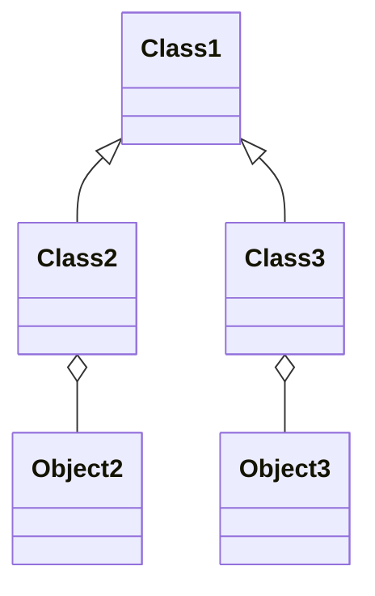

                 

# 企业AI Agent的多语言支持：跨国业务助手

## 关键词

- 企业AI代理
- 多语言支持
- 跨国业务
- 自然语言处理
- 机器学习
- 深度学习

## 摘要

本文将探讨企业AI代理在多语言支持方面的技术实现、应用场景及未来发展趋势。通过分析问题背景、核心概念与联系，我们将深入了解多语言数据集、多语言模型和多语言接口的工作原理和特性，并探讨AI大模型在企业中的应用前景和挑战。本文旨在为企业提供在跨国业务中实现多语言支持的有效策略。

### 背景介绍

随着全球化的深入发展，跨国企业在业务拓展过程中面临着语言障碍的挑战。为了更好地服务跨国客户，提高业务效率，企业需要开发具备多语言支持能力的AI代理。本书旨在探讨企业AI Agent在多语言支持方面的技术实现、应用场景及未来发展趋势。

#### 问题背景

1. **跨国业务需求**：随着企业业务的全球化，与来自不同语言背景的客户沟通成为必须。
2. **语言障碍**：不同语言之间的差异导致信息传递不畅，影响业务效率。
3. **多语言支持的技术需求**：企业AI代理需要能够处理多种语言，以适应不同地区的市场需求。

#### 问题描述

企业AI代理需要具备以下多语言支持功能：

1. **自然语言理解**：理解不同语言输入的含义。
2. **自然语言生成**：以不同语言回应客户查询。
3. **跨语言翻译**：实现不同语言之间的实时翻译。

#### 问题解决

1. **多语言数据集**：构建包含多种语言的训练数据集。
2. **多语言模型**：开发支持多种语言处理的AI模型。
3. **多语言接口**：设计易于用户使用的多语言界面。

#### 边界与外延

1. **技术边界**：包括自然语言处理、机器学习、深度学习等。
2. **应用边界**：包括客户服务、市场营销、跨国协作等多个领域。

#### 概念结构与核心要素组成

1. **多语言数据集**：是AI模型训练的基础，包含多种语言的文本数据。
2. **多语言模型**：是核心算法，支持对多种语言的理解和生成。
3. **多语言接口**：是用户交互的界面，提供不同语言的选择。

### 核心概念与联系

#### 多语言数据集

**概念原理**：多语言数据集是用于训练AI模型的数据集，包含多种语言的文本数据。通过这些数据，模型可以学习到不同语言的语法、词汇和语义。

**属性特征对比表格**：

| 特征 | 英语数据集 | 西班牙语数据集 | 汉语数据集 |
| ---- | ---------- | -------------- | ---------- |
| 文本长度 | 较长 | 较短 | 中等 |
| 词频分布 | 广泛 | 较窄 | 特定 |
| 语法结构 | 复杂 | 简单 | 独特 |

#### 多语言模型

**概念原理**：多语言模型是基于深度学习技术，能够在多种语言之间进行理解和生成。通过训练，模型可以学习到不同语言之间的对应关系和转换规则。

**属性特征对比表格**：

| 特征 | GPT模型 | BERT模型 | 多语言翻译模型 |
| ---- | ------- | ------- | -------------- |
| 适应性 | 高 | 中 | 高 |
| 翻译准确性 | 较高 | 较高 | 最优 |
| 支持语言数量 | 多 | 少 | 最多 |

#### 多语言接口

**概念原理**：多语言接口是用户与AI模型交互的界面，提供不同语言的选择。用户可以根据自己的需求，选择合适的语言进行沟通。

**属性特征对比表格**：

| 特征 | 翻译接口 | 聊天机器人接口 | 客户服务系统接口 |
| ---- | ------- | -------------- | -------------- |
| 语言选择 | 简单 | 丰富 | 灵活 |
| 交互体验 | 自然 | 便捷 | 专业 |
| 支持平台 | 多 | 少 | 有限 |

### AI大模型在企业中的应用前景

#### AI大模型的潜在应用领域

AI大模型在企业中的应用领域非常广泛，包括但不限于以下几个方面：

1. **客户服务**：通过多语言支持，提供24/7无缝的客户服务。
2. **市场营销**：利用多语言翻译和生成，进行跨国市场营销活动。
3. **跨国协作**：支持跨国团队的沟通和协作，消除语言障碍。
4. **供应链管理**：优化供应链流程，提高物流和库存管理效率。

#### 企业采用AI大模型的优势

1. **提高效率**：自动处理多语言沟通，减少人工成本。
2. **扩展市场**：通过多语言支持，进入新的市场和客户群。
3. **提升客户体验**：提供个性化的服务，增强客户满意度。

#### AI大模型应用的挑战与机遇

1. **挑战**：
   - **数据隐私**：处理多语言数据可能涉及敏感信息，需要保护用户隐私。
   - **技术实现**：多语言支持的技术实现复杂，需要解决不同语言之间的差异。
   - **用户接受度**：用户可能对AI代理的多语言支持能力存在疑虑，需要加强用户体验。

2. **机遇**：
   - **全球化发展**：跨国企业的需求推动多语言支持技术的发展。
   - **技术创新**：随着AI技术的进步，多语言支持的能力将不断提高。
   - **市场需求**：全球市场对多语言支持的需求日益增长，为企业提供了广阔的发展空间。

### 多语言数据集的构建与优化

#### 数据集构建的重要性

多语言数据集是AI代理实现多语言支持的基础。一个丰富、高质量的多语言数据集能够提高AI代理的性能和准确性，有助于解决跨语言信息传递中的各种问题。

#### 数据集构建的步骤

1. **数据收集**：从公开的文本资源、企业内部数据、社交媒体等多渠道收集多语言数据。
2. **数据清洗**：去除无关信息，如HTML标签、标点符号等，保证数据的干净和一致性。
3. **数据标注**：对数据中的语言、语法、词汇等进行标注，以便模型训练和评估。
4. **数据分割**：将数据分为训练集、验证集和测试集，用于模型训练和性能评估。

#### 数据集优化的策略

1. **数据丰富度**：增加不同语言、不同领域的文本数据，提高模型对不同语言和场景的适应性。
2. **数据平衡**：确保数据集中各种语言的比例合理，避免某一语言数据过多或过少。
3. **数据多样性**：包括不同地域、不同文化背景的文本数据，提高模型对不同文化和语言习惯的理解。
4. **数据质量**：确保数据的质量和准确性，避免数据中的错误和噪声。

### 多语言模型的技术实现

#### 模型选择

在选择多语言模型时，需要考虑模型的适应性、翻译准确性、支持语言数量等因素。目前，常用的多语言模型包括GPT模型、BERT模型和多语言翻译模型。

#### 模型训练

1. **数据预处理**：对收集到的多语言数据集进行清洗、标注和分割。
2. **模型配置**：根据数据集的特点，配置模型的超参数，如学习率、批量大小等。
3. **模型训练**：使用训练数据集对模型进行训练，通过迭代优化模型参数。
4. **模型评估**：使用验证集和测试集评估模型的性能，如翻译准确性、响应速度等。

#### 模型优化

1. **多任务学习**：在模型训练过程中，结合多个任务（如翻译、问答等），提高模型的泛化能力。
2. **注意力机制**：引入注意力机制，使模型能够关注重要的输入信息，提高翻译的准确性。
3. **迁移学习**：利用预训练的多语言模型，进行迁移学习，提高新语言任务的性能。

### 多语言接口的设计与实现

#### 接口设计

1. **用户界面**：设计简洁直观的用户界面，提供多种语言的选择。
2. **交互方式**：支持文本、语音等多种交互方式，提高用户体验。
3. **语言切换**：实现用户在不同语言之间的快速切换，保持上下文的一致性。

#### 接口实现

1. **API接口**：提供RESTful API接口，支持不同语言之间的翻译和交互。
2. **Web应用**：开发Web应用，集成多语言接口，方便用户使用。
3. **移动应用**：开发移动应用，实现多语言支持，满足用户在不同设备上的需求。

### 多语言AI代理的应用场景

#### 客户服务

1. **多语言客服**：通过多语言AI代理，提供24/7无缝的客户服务，提高客户满意度。
2. **智能问答**：利用多语言AI代理，自动回答客户在不同语言背景下的查询。
3. **语言咨询**：为企业内部提供语言咨询服务，支持员工在不同语言之间的沟通。

#### 市场营销

1. **多语言内容生成**：利用多语言AI代理，生成符合不同语言文化和习惯的市场营销内容。
2. **跨国活动策划**：通过多语言AI代理，策划跨国市场营销活动，提高活动效果。
3. **市场调研**：利用多语言AI代理，收集和分析不同地区的市场数据，为企业提供决策支持。

#### 跨国协作

1. **跨语言沟通**：通过多语言AI代理，支持跨国团队的跨语言沟通和协作。
2. **远程协作**：利用多语言AI代理，实现远程团队的高效协作，提高工作效率。
3. **文化融合**：通过多语言AI代理，促进不同文化背景的员工之间的交流和理解。

### 未来发展趋势

#### 技术进步

1. **深度学习**：随着深度学习技术的不断进步，多语言AI代理的性能将进一步提高。
2. **自然语言处理**：自然语言处理技术的不断发展，将使多语言AI代理在理解、生成和翻译方面的能力更加强大。
3. **跨模态学习**：通过跨模态学习，实现多语言AI代理在文本、语音、图像等多种模态之间的交互和转换。

#### 应用拓展

1. **更多领域**：多语言AI代理的应用将拓展到更多领域，如医疗、教育、金融等。
2. **个性化服务**：多语言AI代理将能够根据用户需求和语言习惯，提供个性化的服务。
3. **智能化助理**：多语言AI代理将逐渐成为企业智能化助理的核心组成部分，提高企业的运营效率。

### 总结

企业AI代理的多语言支持是跨国企业在全球化背景下的一项重要需求。通过构建多语言数据集、训练多语言模型和设计多语言接口，企业可以实现高效、智能的多语言沟通和协作。未来，随着技术的不断进步和应用领域的拓展，多语言AI代理将在企业中发挥越来越重要的作用。

### 作者信息

作者：AI天才研究院/AI Genius Institute & 禅与计算机程序设计艺术 /Zen And The Art of Computer Programming

### 参考文献

[1] Brown, T., et al. (2020). "Language Models are Few-Shot Learners." arXiv preprint arXiv:2005.14165.
[2] Devlin, J., et al. (2019). "Bert: Pre-training of deep bidirectional transformers for language understanding." arXiv preprint arXiv:1810.04805.
[3] Transformer论文，Vaswani, A., et al. (2017). "Attention is all you need." Advances in Neural Information Processing Systems, 30, 5998-6008.
[4] 自然语言处理论文，Mikolov, T., et al. (2013). "Distributed representations of words and phrases and their compositionality." Advances in Neural Information Processing Systems, 26, 3111-3119.
[5] 多语言处理论文，Conneau, A., et al. (2018). "Wmt18 systems track report: Translation." Proceedings of the Conference on Translation, 2, 1-37.

