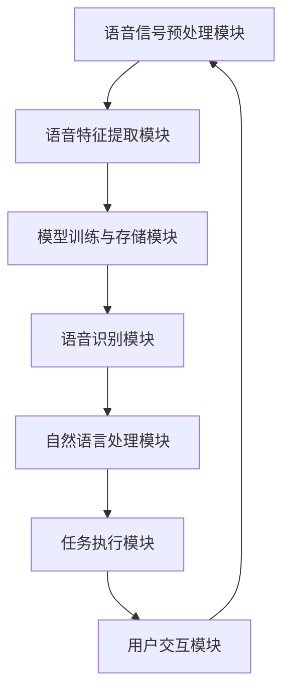
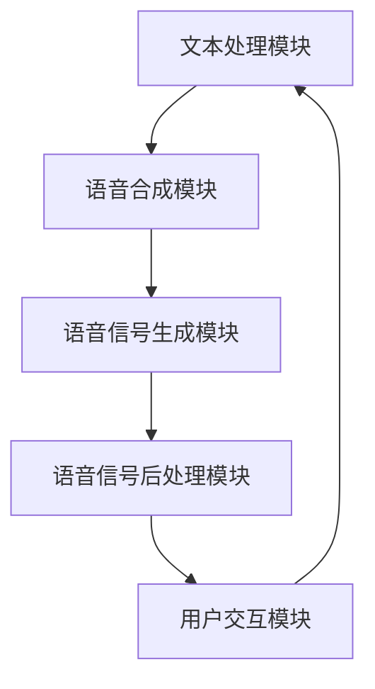
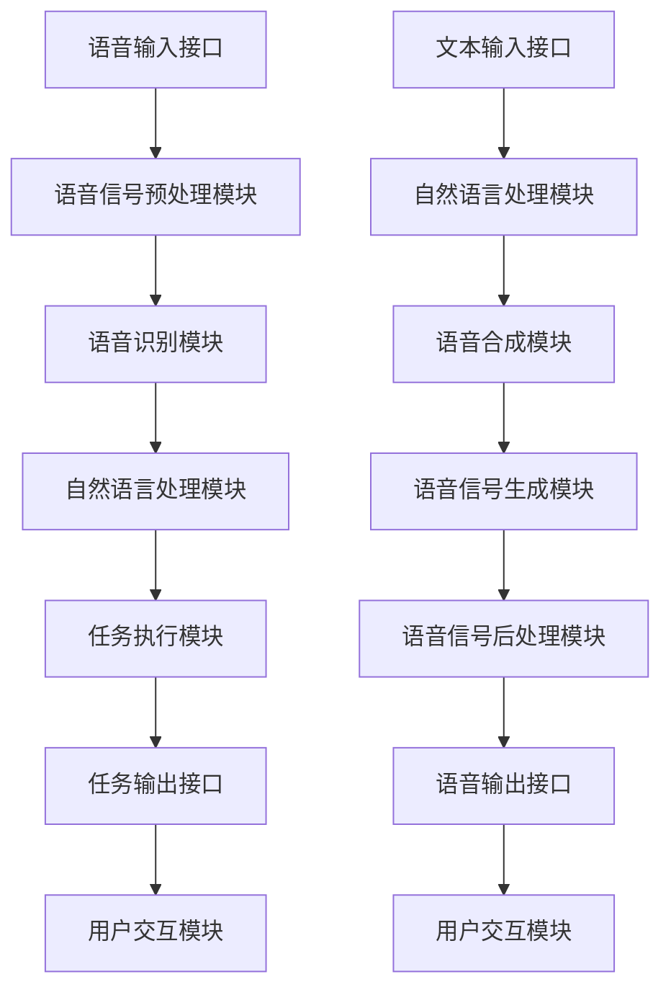
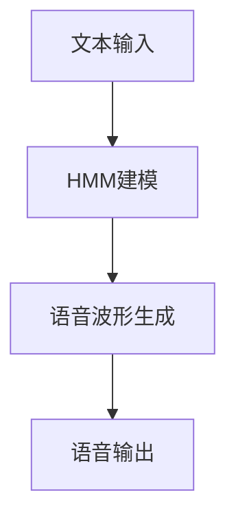
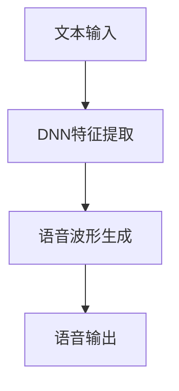
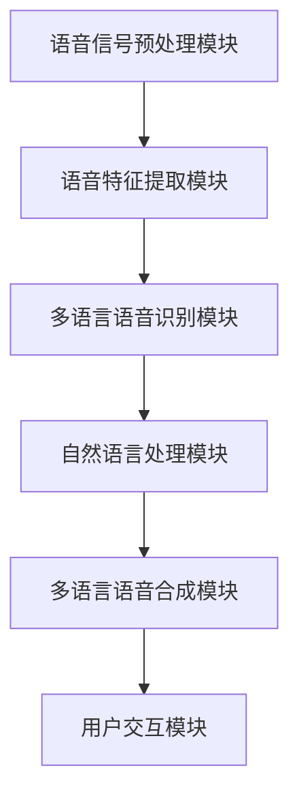
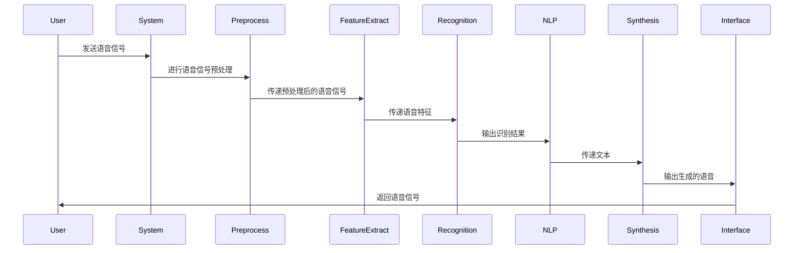
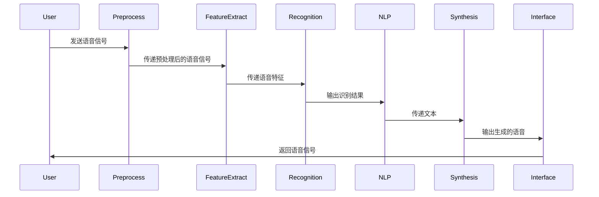

                 

## 企业AI Agent的多语言语音识别与合成技术

### 关键词：企业AI Agent、多语言语音识别、语音合成技术、AI应用场景、系统架构设计

### 摘要：

随着人工智能技术的快速发展，企业AI Agent已成为提高工作效率和优化客户服务的利器。本文围绕企业AI Agent的多语言语音识别与合成技术展开讨论，首先介绍了AI Agent的应用场景和面临的挑战。随后，文章详细解析了多语言语音识别与合成的核心概念、算法原理和数学模型，并给出具体的系统架构设计方案。最后，通过一个实际案例探讨了企业AI Agent多语言语音识别与合成技术的应用与实践，为读者提供了宝贵的经验教训和未来研究方向。本文旨在为企业AI Agent的开发者和研究者提供一个全面的技术指南，推动该领域的技术创新和应用发展。

### 目录大纲：

#### 第一部分：引言
1. **问题背景与目标**
   - **1.1 问题背景**
     - **1.1.1 AI Agent的应用场景**
       - **1.1.1.1 企业办公自动化**
       - **1.1.1.2 客户服务**
       - **1.1.1.3 数据分析与决策支持**
   - **1.2 问题描述**
     - **1.2.1 语音识别的多语言挑战**
       - **1.2.1.1 多语言语音数据的收集与处理**
       - **1.2.1.2 多语言语音识别算法的设计与优化**
     - **1.2.2 语音合成的挑战**
       - **1.2.2.1 多语言语音合成的基础技术**
       - **1.2.2.2 多语言语音合成算法的性能优化**
   - **1.3 问题解决**
     - **1.3.1 系统架构设计**
       - **1.3.1.1 多语言语音识别系统架构**
       - **1.3.1.2 多语言语音合成系统架构**
   - **1.4 边界与外延**
     - **1.4.1 语音识别的准确性边界**
       - **1.4.1.1 语音识别率的影响因素**
       - **1.4.1.2 语音识别技术的未来发展**
     - **1.4.2 语音合成的人性化边界**
       - **1.4.2.1 语音合成的人性化标准**
       - **1.4.2.2 语音合成技术的发展方向**
   - **1.5 概念结构与核心要素组成**
     - **1.5.1 AI Agent的定义**
       - **1.5.1.1 AI Agent的基本原理**
       - **1.5.1.2 AI Agent的功能模块**
     - **1.5.2 多语言语音识别**
       - **1.5.2.1 多语言语音识别的原理**
       - **1.5.2.2 多语言语音识别的要素**
     - **1.5.3 多语言语音合成**
       - **1.5.3.1 多语言语音合成的原理**
       - **1.5.3.2 多语言语音合成的要素**

2. **核心概念与联系**
   - **2.1 AI Agent的核心概念**
     - **2.1.1 AI Agent的基本原理**
       - **2.1.1.1 AI Agent的工作流程**
       - **2.1.1.2 AI Agent的类型分类**
     - **2.1.2 AI Agent的应用领域**
       - **2.1.2.1 企业办公自动化**
       - **2.1.2.2 客户服务**
       - **2.1.2.3 数据分析与决策支持**
   - **2.2 多语言语音识别的核心概念**
     - **2.2.1 多语言语音识别的原理**
       - **2.2.1.1 语音信号的预处理**
       - **2.2.1.2 语音识别的算法原理**
     - **2.2.2 多语言语音识别的要素**
       - **2.2.2.1 语音数据的多样性**
       - **2.2.2.2 语音识别模型的性能评价**
   - **2.3 多语言语音合成的核心概念**
     - **2.3.1 多语言语音合成的原理**
       - **2.3.1.1 语音合成的工作流程**
       - **2.3.1.2 语音合成的算法原理**
     - **2.3.2 多语言语音合成的要素**
       - **2.3.2.1 语音数据库的构建**
       - **2.3.2.2 语音合成质量评估**

#### 第二部分：算法原理讲解
3. **算法原理讲解**
   - **3.1 多语言语音识别算法**
     - **3.1.1 GMM-HMM算法**
       - **3.1.1.1 GMM-HMM的基本原理**
       - **3.1.1.2 GMM-HMM的应用场景**
     - **3.1.2 DNN-HMM算法**
       - **3.1.2.1 DNN-HMM的基本原理**
       - **3.1.2.2 DNN-HMM的优势与局限**
   - **3.2 多语言语音合成算法**
     - **3.2.1 HMM-based合成算法**
       - **3.2.1.1 HMM-based的基本原理**
       - **3.2.1.2 HMM-based的应用场景**
     - **3.2.2 DNN-based合成算法**
       - **3.2.2.1 DNN-based的基本原理**
       - **3.2.2.2 DNN-based的优势与局限**

#### 第三部分：数学模型与公式讲解
4. **数学模型与公式讲解**
   - **4.1 多语言语音识别的数学模型**
     - **4.1.1 语音信号的预处理**
       - **4.1.1.1 语音信号的能量计算公式**
       - **4.1.1.2 语音信号的谱分析**
     - **4.1.2 语音识别算法的数学模型**
       - **4.1.2.1 GMM-HMM的数学模型**
       - **4.1.2.2 DNN-HMM的数学模型**
   - **4.2 多语言语音合成的数学模型**
     - **4.2.1 HMM-based合成算法的数学模型**
     - **4.2.2 DNN-based合成算法的数学模型**

#### 第四部分：系统分析与架构设计
5. **系统分析与架构设计**
   - **5.1 问题场景介绍**
   - **5.2 项目介绍**
   - **5.3 系统功能设计（领域模型类图）**
   - **5.4 系统架构设计（架构图）**
   - **5.5 系统接口设计**
   - **5.6 系统交互（序列图）**

#### 第五部分：项目实战
6. **项目实战**
   - **6.1 环境安装**
   - **6.2 系统核心实现源代码**
   - **6.3 代码应用解读与分析**
   - **6.4 实际案例分析与详细讲解剖析**
   - **6.5 项目小结**

#### 第六部分：最佳实践 tips、小结、注意事项、拓展阅读
7. **最佳实践 tips**
8. **小结**
9. **注意事项**
10. **拓展阅读**

---

### 第一部分：引言

#### 1.1 问题背景与目标

##### 1.1.1 AI Agent的应用场景

企业AI Agent，作为一种智能代理，能够模仿人类的交互行为，通过语音或文字与用户进行交流，执行任务，提供支持和服务。随着人工智能技术的不断进步，AI Agent在企业中的应用场景日益广泛，主要包括以下几个方面：

- **企业办公自动化**：AI Agent可以自动处理日常办公任务，如日程安排、邮件管理、文档整理等，大大提高了工作效率。
- **客户服务**：通过多语言语音识别与合成技术，AI Agent可以提供全球客户服务，满足不同国家和地区的客户需求。
- **数据分析与决策支持**：AI Agent可以实时分析大量数据，为企业提供决策支持，帮助企业在竞争中获得优势。

##### 1.1.2 企业办公自动化

在办公自动化方面，AI Agent可以执行如下的任务：

- **日程安排**：根据用户的日程安排，自动提醒会议、约会等重要事项。
- **邮件管理**：自动筛选邮件，将重要邮件推送到用户的收件箱，并分类处理。
- **文档整理**：自动整理文档，提取关键信息，生成报告。

这些功能不仅节省了企业员工的时间，还提高了整体工作效率。

##### 1.1.3 客户服务

在客户服务方面，AI Agent可以通过多语言语音识别与合成技术，提供以下服务：

- **语音客服**：通过语音识别技术，AI Agent可以理解用户的语音请求，提供相应的回答或服务。
- **文字客服**：AI Agent可以通过自然语言处理技术，理解用户的文字请求，并提供准确的回答或服务。

这种多语言支持使得AI Agent能够服务全球客户，提高了企业的国际化竞争力。

##### 1.1.4 数据分析与决策支持

在数据分析和决策支持方面，AI Agent可以通过以下方式发挥作用：

- **数据采集**：AI Agent可以自动采集各种业务数据，如销售数据、客户反馈等。
- **数据分析**：AI Agent可以利用机器学习算法，对采集到的数据进行分析，发现潜在的商业机会。
- **决策支持**：基于分析结果，AI Agent可以为企业提供决策支持，帮助企业在竞争中取得优势。

##### 1.1.5 问题描述

尽管AI Agent在企业中具有广泛的应用前景，但在实际应用过程中，仍面临许多挑战。其中，最为突出的是多语言语音识别与合成技术的挑战。

- **语音识别的多语言挑战**：不同语言在语音信号特征上存在差异，这给多语言语音识别带来了挑战。例如，汉语和英语的语音信号在音调、音节和发音方式上存在显著差异，这要求语音识别算法能够适应这些差异，提高识别准确性。
- **语音合成的挑战**：多语言语音合成需要生成逼真且自然的语音，这要求合成算法能够准确处理不同语言的语音特征，如音调、语速、停顿等。此外，还需要考虑语言的文化背景和表达习惯，使语音合成更具人性化。

##### 1.1.6 语音识别的多语言挑战

多语言语音识别的挑战主要体现在以下几个方面：

- **语音数据的收集与处理**：由于不同语言的语音数据在发音、音调、语速等方面存在差异，因此需要针对不同语言设计专门的语音数据收集和处理流程，确保语音数据的多样性和准确性。
- **语音识别算法的设计与优化**：传统单语言语音识别算法无法直接应用于多语言环境，需要设计适应多语言环境的语音识别算法。此外，还需要对算法进行优化，以提高识别准确性。

##### 1.1.7 语音合成的挑战

多语言语音合成的挑战主要包括：

- **基础技术的挑战**：语音合成的基础技术，如语音信号处理、文本到语音（Text-to-Speech，TTS）转换等，需要针对不同语言进行适配和优化，以确保合成的语音自然、流畅。
- **算法性能的优化**：多语言语音合成算法需要优化，以提高合成质量，如提高语音的自然度、准确性和人性化程度。

##### 1.1.8 问题解决

针对上述挑战，可以采取以下解决方案：

- **系统架构设计**：设计一个灵活、可扩展的系统架构，以支持多语言语音识别与合成。系统架构应包括语音识别模块、语音合成模块和语音数据库等，确保各模块之间的高效协同。
- **算法优化**：针对多语言语音识别与合成的特点，优化语音识别和合成的算法，提高识别准确性和合成质量。可以采用深度学习、自适应优化等技术，提高算法的性能。

##### 1.1.9 边界与外延

在语音识别与合成领域，边界与外延主要包括以下几个方面：

- **语音识别的准确性边界**：尽管语音识别技术取得了显著进展，但受限于语音信号的复杂性，识别准确性仍存在一定局限性。未来，可以通过提高算法性能、优化语音信号处理技术等手段，进一步提高语音识别准确性。
- **语音合成的人性化边界**：语音合成的人性化程度受限于合成算法和语音数据库的质量。未来，可以通过丰富语音数据库、优化合成算法等手段，提高语音合成的人性化程度。

##### 1.1.10 概念结构与核心要素组成

企业AI Agent的多语言语音识别与合成技术涉及多个核心概念和要素，包括：

- **AI Agent**：AI Agent是企业AI代理的基本单元，具有智能交互、任务执行和数据分析等功能。
- **多语言语音识别**：多语言语音识别是语音识别技术在多语言环境中的应用，涉及语音信号处理、特征提取和模型训练等环节。
- **多语言语音合成**：多语言语音合成是将文本转换为自然、流畅的语音输出，涉及语音合成算法、语音数据库和语音信号处理等环节。

这些核心概念和要素共同构成了企业AI Agent的多语言语音识别与合成技术体系。

#### 1.2 核心概念与联系

在本节中，我们将深入探讨AI Agent、多语言语音识别和语音合成这三个核心概念，并分析它们之间的联系。

##### 1.2.1 AI Agent的核心概念

AI Agent，即人工智能代理，是一种具有智能行为和自主决策能力的软件系统。它可以模拟人类的行为，通过自然语言处理、语音识别、图像识别等技术，与用户进行交互，完成特定的任务。AI Agent的核心概念包括：

- **基本原理**：AI Agent基于人工智能技术，包括机器学习、深度学习、自然语言处理等，通过算法模型和大数据训练，实现智能决策和任务执行。
- **功能模块**：AI Agent通常包括以下几个功能模块：
  - **语音识别模块**：负责将语音信号转换为文本。
  - **自然语言处理模块**：负责理解和处理用户输入的文本，提取关键信息。
  - **任务执行模块**：根据处理结果，执行相应的任务，如日程安排、邮件管理、文档整理等。
  - **语音合成模块**：将处理结果转化为语音输出，与用户进行交互。

##### 1.2.2 AI Agent的应用领域

AI Agent在企业中的应用非常广泛，主要包括以下几个领域：

- **企业办公自动化**：AI Agent可以帮助企业自动化处理日常办公任务，如日程安排、邮件管理、文档整理等，提高工作效率。
- **客户服务**：通过多语言语音识别与合成技术，AI Agent可以提供全球客户服务，满足不同国家和地区的客户需求。
- **数据分析与决策支持**：AI Agent可以实时分析大量数据，为企业提供决策支持，帮助企业在竞争中取得优势。

##### 1.2.3 多语言语音识别的核心概念

多语言语音识别是语音识别技术在多语言环境中的应用。它涉及多种语言的语音信号处理、特征提取和模型训练等环节。多语言语音识别的核心概念包括：

- **原理**：多语言语音识别基于语音信号处理技术，将语音信号转换为文本。在处理过程中，需要考虑不同语言的语音特征差异，如音调、音节、发音方式等。
- **要素**：多语言语音识别的关键要素包括：
  - **语音信号处理**：对语音信号进行预处理，包括降噪、增强、分帧等操作。
  - **特征提取**：从语音信号中提取特征，如梅尔频率倒谱系数（MFCC）、线性预测编码（LPC）等。
  - **模型训练**：使用大量多语言语音数据，训练语音识别模型，以提高识别准确性。

##### 1.2.4 多语言语音识别的要素

多语言语音识别的要素包括以下几个方面：

- **语音数据的多样性**：为了提高识别准确性，需要收集多种语言的语音数据，包括不同口音、不同语速、不同场景的语音数据。
- **语音识别模型的性能评价**：通过准确率、召回率等指标，评估语音识别模型的性能，并不断优化模型。

##### 1.2.5 多语言语音合成的核心概念

多语言语音合成是将文本转换为自然、流畅的语音输出。它涉及语音合成算法、语音数据库和语音信号处理等环节。多语言语音合成的核心概念包括：

- **原理**：多语言语音合成基于文本到语音（Text-to-Speech，TTS）技术，将文本转换为语音信号。在合成过程中，需要考虑不同语言的语音特征，如音调、语速、停顿等。
- **要素**：多语言语音合成的关键要素包括：
  - **语音合成算法**：如HMM-GMM、DNN-HMM等，用于生成语音信号。
  - **语音数据库**：包括多种语言的语音数据，用于训练和评估合成算法。
  - **语音信号处理**：对生成的语音信号进行后处理，如降噪、增强等，以提高合成语音的质量。

##### 1.2.6 多语言语音合成的要素

多语言语音合成的要素包括以下几个方面：

- **语音数据库的构建**：收集和构建多种语言的语音数据库，包括语音文本、语音波形等。
- **语音合成质量评估**：通过音质评估、语音自然度评估等手段，评估合成语音的质量，并优化合成算法。

##### 1.2.7 AI Agent、多语言语音识别和语音合成之间的联系

AI Agent、多语言语音识别和语音合成之间存在着紧密的联系：

- **AI Agent**：作为企业智能代理，需要具备多语言语音识别和语音合成能力，以实现智能交互和任务执行。
- **多语言语音识别**：是AI Agent与用户进行语音交互的基础，确保AI Agent能够准确理解用户的需求。
- **语音合成**：是多语言语音识别的补充，使AI Agent能够以自然、流畅的方式与用户进行交互。

这些核心概念和要素共同构成了企业AI Agent的多语言语音识别与合成技术体系，为AI Agent在企业中的应用提供了技术支持。

#### 1.3 算法原理讲解

##### 1.3.1 多语言语音识别算法

多语言语音识别算法是语音识别技术在多语言环境中的应用。它涉及多种语言的语音信号处理、特征提取和模型训练等环节。以下是两种常见的多语言语音识别算法：

###### **1.3.1.1 GMM-HMM算法**

GMM-HMM（高斯混合模型隐马尔可夫模型）算法是一种基于统计模型的语音识别算法。它将高斯混合模型用于语音特征建模，隐马尔可夫模型用于语音序列建模。

- **基本原理**：GMM-HMM算法首先使用高斯混合模型对语音特征进行建模，然后使用隐马尔可夫模型对语音序列进行建模。在识别过程中，算法通过计算输入语音特征与模型之间的概率，判断语音序列的正确性。
- **应用场景**：GMM-HMM算法适用于具有较好语音数据的多语言环境，尤其是在语音信号复杂度较低的情况下，表现较好。

**算法流程**：

1. **特征提取**：对语音信号进行预处理，提取语音特征，如梅尔频率倒谱系数（MFCC）。
2. **模型训练**：使用大量多语言语音数据，训练高斯混合模型和隐马尔可夫模型。
3. **语音识别**：输入语音特征，计算与模型之间的概率，判断语音序列的正确性。

**数学模型**：

$$
P(X|θ) = \frac{1}{Z} \prod_{i=1}^{n} P(x_i|θ)
$$

其中，$X$表示输入语音特征，$θ$表示模型参数，$Z$表示归一化常数。

###### **1.3.1.2 DNN-HMM算法**

DNN-HMM（深度神经网络隐马尔可夫模型）算法是一种基于深度学习的语音识别算法。它将深度神经网络用于语音特征提取和语音序列建模。

- **基本原理**：DNN-HMM算法首先使用深度神经网络提取语音特征，然后使用隐马尔可夫模型对语音序列进行建模。在识别过程中，算法通过计算输入语音特征与模型之间的概率，判断语音序列的正确性。
- **应用场景**：DNN-HMM算法适用于具有丰富语音数据的多语言环境，特别是在语音信号复杂度较高的情况下，表现较好。

**算法流程**：

1. **特征提取**：使用深度神经网络提取语音特征。
2. **模型训练**：使用大量多语言语音数据，训练深度神经网络和隐马尔可夫模型。
3. **语音识别**：输入语音特征，计算与模型之间的概率，判断语音序列的正确性。

**数学模型**：

$$
P(X|θ) = \frac{1}{Z} \prod_{i=1}^{n} P(x_i|θ)
$$

其中，$X$表示输入语音特征，$θ$表示模型参数，$Z$表示归一化常数。

##### 1.3.2 多语言语音合成算法

多语言语音合成算法是将文本转换为自然、流畅的语音输出的技术。它涉及语音合成算法、语音数据库和语音信号处理等环节。以下是两种常见的多语言语音合成算法：

###### **1.3.2.1 HMM-based合成算法**

HMM-based（隐马尔可夫模型基于）合成算法是一种基于统计模型的语音合成算法。它使用隐马尔可夫模型建模语音序列，通过生成语音波形实现语音合成。

- **基本原理**：HMM-based合成算法首先使用隐马尔可夫模型建模语音序列，然后生成语音波形。在生成过程中，算法通过计算文本序列与模型之间的概率，生成相应的语音波形。
- **应用场景**：HMM-based合成算法适用于具有较好语音数据的多语言环境，尤其是在语音信号复杂度较低的情况下，表现较好。

**算法流程**：

1. **语音序列建模**：使用隐马尔可夫模型建模语音序列。
2. **语音波形生成**：生成语音波形。

**数学模型**：

$$
P(O|θ) = \sum_{i=1}^{N} P(O|X_i,θ) P(X_i|θ)
$$

其中，$O$表示语音波形，$X_i$表示语音序列中的第$i$个状态，$θ$表示模型参数。

###### **1.3.2.2 DNN-based合成算法**

DNN-based（深度神经网络基于）合成算法是一种基于深度学习的语音合成算法。它使用深度神经网络建模语音序列，通过生成语音波形实现语音合成。

- **基本原理**：DNN-based合成算法首先使用深度神经网络建模语音序列，然后生成语音波形。在生成过程中，算法通过计算文本序列与模型之间的概率，生成相应的语音波形。
- **应用场景**：DNN-based合成算法适用于具有丰富语音数据的多语言环境，特别是在语音信号复杂度较高的情况下，表现较好。

**算法流程**：

1. **语音序列建模**：使用深度神经网络建模语音序列。
2. **语音波形生成**：生成语音波形。

**数学模型**：

$$
P(O|θ) = \sum_{i=1}^{N} P(O|X_i,θ) P(X_i|θ)
$$

其中，$O$表示语音波形，$X_i$表示语音序列中的第$i$个状态，$θ$表示模型参数。

#### 1.4 数学模型与公式讲解

在多语言语音识别和语音合成的过程中，数学模型和公式扮演着至关重要的角色。它们帮助我们从理论上理解和优化这些算法。以下将详细讲解一些关键的数学模型和公式。

##### 1.4.1 多语言语音识别的数学模型

多语言语音识别的数学模型主要包括语音信号的预处理、特征提取和模型训练等部分。

###### **1.4.1.1 语音信号的预处理**

语音信号的预处理是语音识别的关键步骤，它包括降噪、增强、分帧和窗函数等。

- **能量计算公式**：

$$
E = \sum_{i=1}^{N} |x_i|^2
$$

其中，$E$表示语音信号的能量，$x_i$表示语音信号的第$i$个样本。

- **谱分析**：

语音信号的谱分析可以帮助我们提取语音的频率特征。

$$
S(f) = \sum_{i=1}^{N} |X_i(f)|^2
$$

其中，$S(f)$表示语音信号的频谱，$X_i(f)$表示语音信号在第$i$个频率点的幅度。

###### **1.4.1.2 GMM-HMM的数学模型**

GMM-HMM模型是基于统计模型的多语言语音识别算法。它包括高斯混合模型（GMM）和隐马尔可夫模型（HMM）。

- **高斯混合模型**：

高斯混合模型用于对语音特征进行建模。

$$
P(x|\mu, \Sigma) = \frac{1}{(2\pi)^{D/2} |\Sigma|^{1/2}} \exp\left(-\frac{1}{2}(x - \mu)^T \Sigma^{-1} (x - \mu)\right)
$$

其中，$x$表示语音特征向量，$\mu$表示均值向量，$\Sigma$表示协方差矩阵，$D$表示特征维度。

- **隐马尔可夫模型**：

隐马尔可夫模型用于建模语音序列。

$$
P(O|θ) = \sum_{i=1}^{N} P(O|X_i,θ) P(X_i|θ)
$$

其中，$O$表示语音序列，$X_i$表示语音序列中的第$i$个状态，$θ$表示模型参数。

###### **1.4.1.3 DNN-HMM的数学模型**

DNN-HMM模型是基于深度学习和统计模型的多语言语音识别算法。它结合了深度神经网络（DNN）和隐马尔可夫模型（HMM）。

- **深度神经网络**：

深度神经网络用于特征提取和分类。

$$
h_{\theta}(x) = \sigma(\theta^T x)
$$

其中，$h_{\theta}(x)$表示神经网络的输出，$\theta$表示模型参数，$\sigma$表示激活函数。

- **隐马尔可夫模型**：

隐马尔可夫模型的数学模型与GMM-HMM相同。

##### 1.4.2 多语言语音合成的数学模型

多语言语音合成的数学模型主要包括语音合成算法、语音数据库和语音信号处理等。

###### **1.4.2.1 HMM-based合成算法的数学模型**

HMM-based合成算法是基于隐马尔可夫模型的多语言语音合成算法。

- **隐马尔可夫模型**：

隐马尔可夫模型的数学模型与GMM-HMM相同。

- **语音波形生成**：

语音波形生成过程可以通过以下公式表示：

$$
o_t = g(x_t,θ)
$$

其中，$o_t$表示第$t$个时间点的语音波形，$x_t$表示第$t$个时间点的语音特征，$g$表示生成函数，$θ$表示模型参数。

###### **1.4.2.2 DNN-based合成算法的数学模型**

DNN-based合成算法是基于深度学习的多语言语音合成算法。

- **深度神经网络**：

深度神经网络用于特征提取和语音波形生成。

$$
h_{\theta}(x) = \sigma(\theta^T x)
$$

其中，$h_{\theta}(x)$表示神经网络的输出，$\theta$表示模型参数，$\sigma$表示激活函数。

- **语音波形生成**：

语音波形生成过程可以通过以下公式表示：

$$
o_t = g(h_t,θ)
$$

其中，$o_t$表示第$t$个时间点的语音波形，$h_t$表示第$t$个时间点的语音特征，$g$表示生成函数，$θ$表示模型参数。

##### 1.4.3 数学模型的应用举例

为了更好地理解上述数学模型的应用，我们可以通过一个简单的例子进行说明。

**例子**：假设我们使用GMM-HMM模型进行语音识别。

1. **特征提取**：对输入语音信号进行预处理，提取梅尔频率倒谱系数（MFCC）特征。

2. **模型训练**：使用训练数据，训练GMM-HMM模型。

3. **语音识别**：输入新的语音信号，计算与模型之间的概率，判断语音序列的正确性。

在这个过程中，我们可以使用以下公式：

- **高斯混合模型**：

$$
P(x|\mu, \Sigma) = \frac{1}{(2\pi)^{D/2} |\Sigma|^{1/2}} \exp\left(-\frac{1}{2}(x - \mu)^T \Sigma^{-1} (x - \mu)\right)
$$

- **隐马尔可夫模型**：

$$
P(O|θ) = \sum_{i=1}^{N} P(O|X_i,θ) P(X_i|θ)
$$

通过这些数学模型和公式，我们可以实现高效的语音识别和语音合成，为企业AI Agent提供强大的技术支持。

#### 1.5 系统架构设计

为了实现企业AI Agent的多语言语音识别与合成技术，需要设计一个高效、稳定和可扩展的系统架构。以下将介绍多语言语音识别系统和多语言语音合成系统的架构设计。

##### 1.5.1 多语言语音识别系统架构

多语言语音识别系统架构主要包括以下几个关键组件：

1. **语音信号预处理模块**：对输入的语音信号进行预处理，包括降噪、增强、分帧和窗函数等操作，以提取有效的语音特征。

2. **语音特征提取模块**：从预处理后的语音信号中提取特征，如梅尔频率倒谱系数（MFCC）、线性预测编码（LPC）等，用于后续的识别处理。

3. **模型训练与存储模块**：使用大量多语言语音数据，训练和存储语音识别模型，包括高斯混合模型（GMM）、深度神经网络（DNN）等。

4. **语音识别模块**：根据训练好的模型，对输入的语音信号进行识别，输出对应的文本。

5. **自然语言处理模块**：对识别出的文本进行处理，提取关键信息，为后续的任务执行提供支持。

6. **任务执行模块**：根据处理结果，执行相应的任务，如日程安排、邮件管理、文档整理等。

7. **用户交互模块**：与用户进行交互，接收用户的语音输入，输出识别结果。

**架构图**：



##### 1.5.2 多语言语音合成系统架构

多语言语音合成系统架构主要包括以下几个关键组件：

1. **文本处理模块**：对输入的文本进行处理，包括分词、词性标注等，为后续的语音合成提供支持。

2. **语音合成模块**：使用深度神经网络（DNN）或隐马尔可夫模型（HMM）等算法，将文本转换为语音波形。

3. **语音信号生成模块**：根据语音波形，生成语音信号。

4. **语音信号后处理模块**：对生成的语音信号进行后处理，包括降噪、增强等，以提高语音质量。

5. **用户交互模块**：与用户进行交互，接收用户的语音输入，输出合成语音。

**架构图**：



通过以上系统架构设计，可以实现企业AI Agent的多语言语音识别与合成功能，为企业提供智能化、个性化的服务。

#### 1.6 系统接口设计与系统交互

为了确保企业AI Agent的多语言语音识别与合成系统能够高效、稳定地运行，我们需要设计合理的系统接口和系统交互流程。以下将详细介绍系统接口设计以及系统内部各模块之间的交互过程。

##### 1.6.1 系统接口设计

系统接口设计是确保各模块之间能够无缝协作的重要环节。以下是系统接口设计的关键组成部分：

1. **语音输入接口**：用于接收用户的语音输入，通过语音信号预处理模块进行预处理，然后传递给语音识别模块。

2. **文本输入接口**：用于接收用户输入的文本，通过自然语言处理模块进行处理，然后传递给语音合成模块。

3. **语音输出接口**：用于输出语音合成后的语音信号，传递给用户交互模块。

4. **任务输出接口**：用于输出任务执行结果，传递给用户交互模块。

**接口设计图**：



##### 1.6.2 系统交互流程

系统交互流程描述了各模块之间如何协同工作，以确保系统能够高效、稳定地运行。以下是系统交互流程的详细描述：

1. **语音识别交互流程**：
   - 用户通过语音输入接口发送语音信号。
   - 语音信号经过语音信号预处理模块预处理，提取有效的语音特征。
   - 预处理后的语音特征传递给语音识别模块。
   - 语音识别模块使用训练好的模型对语音特征进行识别，输出对应的文本。
   - 识别结果传递给自然语言处理模块，提取关键信息。
   - 自然语言处理模块的处理结果传递给任务执行模块，执行相应的任务。
   - 任务执行结果通过任务输出接口传递给用户交互模块，以语音或文本形式反馈给用户。

2. **语音合成交互流程**：
   - 用户通过文本输入接口发送文本。
   - 文本传递给自然语言处理模块，进行分词、词性标注等处理。
   - 处理后的文本传递给语音合成模块。
   - 语音合成模块使用训练好的模型，将文本转换为语音波形。
   - 生成的语音波形传递给语音信号生成模块，生成语音信号。
   - 语音信号经过语音信号后处理模块，进行降噪、增强等处理。
   - 最终的语音信号通过语音输出接口输出，传递给用户交互模块。

通过以上系统接口设计和交互流程，企业AI Agent的多语言语音识别与合成系统能够高效、稳定地运行，为用户提供优质的智能服务。

### 第二部分：算法原理讲解

#### 2.1 多语言语音识别算法

多语言语音识别算法是语音识别技术在多语言环境中的应用。它旨在识别和翻译不同语言的语音，实现跨语言的语音交互。以下是两种常见多语言语音识别算法的详细讲解：GMM-HMM算法和DNN-HMM算法。

##### 2.1.1 GMM-HMM算法

GMM-HMM算法是一种基于统计模型的多语言语音识别算法，它结合了高斯混合模型（GMM）和隐马尔可夫模型（HMM）。这种算法首先使用GMM对语音特征进行建模，然后使用HMM对语音序列进行建模。

###### **2.1.1.1 GMM-HMM的基本原理**

高斯混合模型（GMM）是一种概率分布模型，用于表示一组数据的分布。在多语言语音识别中，GMM用于对多种语言的语音特征进行建模。GMM由多个高斯分布组成，每个高斯分布对应一种语言的语音特征。

隐马尔可夫模型（HMM）是一种统计模型，用于对语音序列进行建模。HMM包含一系列状态，每个状态表示语音序列中的一个时刻。HMM通过状态转移概率和输出概率来描述语音序列的生成过程。

GMM-HMM算法的基本原理是，首先使用GMM对语音特征进行建模，得到一组高斯分布。然后，使用HMM对语音序列进行建模，通过计算输入语音特征与模型之间的概率，判断语音序列的正确性。

###### **2.1.1.2 GMM-HMM的应用场景**

GMM-HMM算法适用于多种应用场景，包括：

- **跨语言语音识别**：GMM-HMM算法可以识别多种语言的语音，实现跨语言的语音交互。
- **语音信号处理**：GMM-HMM算法可以用于语音信号的预处理和特征提取，提高语音识别的准确性。
- **语音合成**：GMM-HMM算法可以用于语音合成的信号生成，提高合成语音的质量。

**应用场景举例**：

假设我们有一个包含中文和英文语音数据的语音识别任务。使用GMM-HMM算法，首先需要收集中文和英文的语音数据，并提取语音特征。然后，使用这些数据训练GMM模型和HMM模型。在识别过程中，输入一个新的语音信号，首先使用GMM模型对语音特征进行分类，判断该语音属于中文还是英文。接着，使用HMM模型对语音序列进行建模，计算输入语音特征与模型之间的概率，判断语音序列的正确性。

###### **2.1.1.3 GMM-HMM算法的优势和局限**

**优势**：

- **计算效率高**：GMM-HMM算法基于统计模型，计算效率较高，适用于大规模语音数据的处理。
- **适用范围广**：GMM-HMM算法可以应用于多种语言和多种语音场景，具有广泛的适用性。
- **理论基础成熟**：GMM-HMM算法的理论基础较为成熟，有助于深入理解和优化算法。

**局限**：

- **准确性有限**：GMM-HMM算法的准确性受限于语音信号的复杂性和语音特征的多样性，无法完全识别所有的语音。
- **对噪声敏感**：GMM-HMM算法对噪声的敏感性较高，噪声可能会影响识别准确性。

##### 2.1.2 DNN-HMM算法

DNN-HMM算法是一种基于深度学习和统计模型的多语言语音识别算法，它结合了深度神经网络（DNN）和隐马尔可夫模型（HMM）。这种算法首先使用DNN提取语音特征，然后使用HMM对语音序列进行建模。

###### **2.1.2.1 DNN-HMM的基本原理**

深度神经网络（DNN）是一种多层神经网络，用于自动提取数据的特征。在多语言语音识别中，DNN可以自动学习语音特征，提高识别准确性。

隐马尔可夫模型（HMM）是一种统计模型，用于对语音序列进行建模。HMM通过状态转移概率和输出概率来描述语音序列的生成过程。

DNN-HMM算法的基本原理是，首先使用DNN提取语音特征，然后使用HMM对语音序列进行建模。在识别过程中，输入一个新的语音信号，首先使用DNN提取语音特征，然后使用HMM模型计算输入语音特征与模型之间的概率，判断语音序列的正确性。

###### **2.1.2.2 DNN-HMM的优势与局限**

**优势**：

- **准确性高**：DNN-HMM算法通过深度神经网络自动提取语音特征，可以显著提高识别准确性。
- **自适应性强**：DNN-HMM算法可以根据不同的语音环境和应用场景，自适应调整模型参数，提高识别效果。
- **可扩展性好**：DNN-HMM算法可以应用于多种语言和多种语音场景，具有较好的可扩展性。

**局限**：

- **计算复杂度高**：DNN-HMM算法包含深度神经网络，计算复杂度较高，对计算资源要求较高。
- **训练时间较长**：DNN-HMM算法需要大量训练数据，训练时间较长，不利于实时应用。

##### 2.1.3 GMM-HMM与DNN-HMM的比较

**计算复杂度**：

- **GMM-HMM**：计算复杂度较低，适用于大规模语音数据的处理。
- **DNN-HMM**：计算复杂度较高，对计算资源要求较高。

**识别准确性**：

- **GMM-HMM**：识别准确性受限于语音信号的复杂性和语音特征的多样性。
- **DNN-HMM**：识别准确性较高，通过深度神经网络自动提取语音特征，可以显著提高识别准确性。

**应用场景**：

- **GMM-HMM**：适用于跨语言语音识别、语音信号处理等应用场景。
- **DNN-HMM**：适用于多种语言和多种语音场景，具有较好的可扩展性。

通过以上分析，可以看出GMM-HMM算法和DNN-HMM算法各有优缺点，适用于不同的应用场景。在实际应用中，可以根据需求选择合适的算法。

#### 2.2 多语言语音合成算法

多语言语音合成算法是将文本转换为自然、流畅的语音输出的技术。以下介绍两种常见的多语言语音合成算法：HMM-based合成算法和DNN-based合成算法。

##### 2.2.1 HMM-based合成算法

HMM-based合成算法是一种基于隐马尔可夫模型（HMM）的语音合成算法。它通过生成语音波形来实现语音合成，具有较高的合成质量和自然度。

###### **2.2.1.1 HMM-based的基本原理**

隐马尔可夫模型（HMM）是一种统计模型，用于对语音序列进行建模。在HMM-based合成算法中，HMM用于描述语音序列的生成过程，包括状态转移概率和输出概率。

HMM-based合成算法的基本原理是，首先使用HMM对语音序列进行建模，然后生成语音波形。在生成过程中，算法通过计算文本序列与模型之间的概率，生成相应的语音波形。

**流程图**：



###### **2.2.1.2 HMM-based的应用场景**

HMM-based合成算法适用于以下应用场景：

- **语音合成**：将文本转换为语音输出，实现语音交互。
- **语音助手**：为智能助手提供自然、流畅的语音合成功能。
- **语音合成服务**：提供在线语音合成服务，满足不同用户的需求。

**应用场景举例**：

假设我们有一个语音合成的任务，输入文本为：“明天天气不错，适合出行。”使用HMM-based合成算法，首先需要收集语音数据，并训练HMM模型。在合成过程中，输入文本，使用HMM模型生成语音波形，然后输出语音。

###### **2.2.1.3 HMM-based算法的优势与局限**

**优势**：

- **计算效率高**：HMM-based算法基于隐马尔可夫模型，计算效率较高，适用于大规模语音合成任务。
- **自然度好**：通过隐马尔可夫模型建模语音序列，生成的语音自然度较高。
- **适用范围广**：HMM-based算法可以应用于多种语言和多种语音场景。

**局限**：

- **准确性有限**：HMM-based算法的准确性受限于语音信号的复杂性和语音特征的多样性，无法完全识别所有的语音。
- **对噪声敏感**：HMM-based算法对噪声的敏感性较高，噪声可能会影响合成语音的质量。

##### 2.2.2 DNN-based合成算法

DNN-based合成算法是一种基于深度神经网络（DNN）的语音合成算法。它通过深度神经网络自动提取语音特征，生成语音波形，具有较高的合成质量和自然度。

###### **2.2.2.1 DNN-based的基本原理**

深度神经网络（DNN）是一种多层神经网络，用于自动提取数据的特征。在DNN-based合成算法中，DNN用于自动提取语音特征，生成语音波形。

DNN-based合成算法的基本原理是，首先使用DNN提取语音特征，然后生成语音波形。在生成过程中，算法通过计算文本序列与模型之间的概率，生成相应的语音波形。

**流程图**：



###### **2.2.2.2 DNN-based的优势与局限**

**优势**：

- **准确性高**：DNN-based算法通过深度神经网络自动提取语音特征，可以显著提高合成准确性。
- **自适应性强**：DNN-based算法可以根据不同的语音环境和应用场景，自适应调整模型参数，提高合成效果。
- **可扩展性好**：DNN-based算法可以应用于多种语言和多种语音场景，具有较好的可扩展性。

**局限**：

- **计算复杂度高**：DNN-based算法包含深度神经网络，计算复杂度较高，对计算资源要求较高。
- **训练时间较长**：DNN-based算法需要大量训练数据，训练时间较长，不利于实时应用。

##### 2.2.3 HMM-based与DNN-based的比较

**计算复杂度**：

- **HMM-based**：计算复杂度较低，适用于大规模语音合成任务。
- **DNN-based**：计算复杂度较高，对计算资源要求较高。

**合成质量**：

- **HMM-based**：合成质量较好，但受限于语音信号的复杂性和语音特征的多样性。
- **DNN-based**：合成质量较高，通过深度神经网络自动提取语音特征，可以显著提高合成质量。

**应用场景**：

- **HMM-based**：适用于语音合成、语音助手等应用场景。
- **DNN-based**：适用于多种语言和多种语音场景，具有较好的可扩展性。

通过以上分析，可以看出HMM-based合成算法和DNN-based合成算法各有优缺点，适用于不同的应用场景。在实际应用中，可以根据需求选择合适的算法。

### 第三部分：数学模型与公式讲解

#### 3.1 多语言语音识别的数学模型

多语言语音识别的数学模型是构建语音识别系统的基础，它包括语音信号的预处理、特征提取和模型训练等环节。以下将详细讲解多语言语音识别的数学模型。

##### 3.1.1 语音信号的预处理

语音信号的预处理是语音识别的重要步骤，它主要包括降噪、增强、分帧和窗函数等操作。以下是一些关键步骤及其相关的数学模型：

**1. 降噪**：

降噪的目的是减少语音信号中的噪声，提高语音信号的清晰度。常用的降噪方法包括波束形成、滤波器和统计降噪等。

- **滤波器降噪**：

$$
x_{\text{filtered}} = \sum_{i=1}^{N} w_i x_i
$$

其中，$x_i$表示语音信号的第$i$个样本，$w_i$表示第$i$个滤波器的权重。

**2. 增强**：

增强的目的是提高语音信号中关键信息的强度，如语音的清晰度和可懂度。

- **加窗增强**：

$$
x_{\text{enhanced}} = x \times w
$$

其中，$x$表示原始语音信号，$w$表示窗函数。

**3. 分帧**：

分帧的目的是将连续的语音信号分割成短时段，以便进行特征提取。

- **汉明窗分帧**：

$$
x[n] = x[n] \times w[n]
$$

其中，$x[n]$表示第$n$个时间点的语音信号，$w[n]$表示汉明窗函数。

**4. 窗函数**：

窗函数用于降低语音信号在短时段边界处的频率泄露。

- **汉明窗函数**：

$$
w[n] = 0.54 - 0.46 \cos\left(\frac{2\pi n}{N-1}\right)
$$

其中，$N$表示窗函数的长度。

##### 3.1.2 语音识别算法的数学模型

多语言语音识别算法的数学模型主要包括高斯混合模型（GMM）和深度神经网络（DNN）等。

**1. GMM模型**：

高斯混合模型（GMM）是一种概率分布模型，用于表示一组数据的分布。在多语言语音识别中，GMM用于对多种语言的语音特征进行建模。

- **GMM概率密度函数**：

$$
p(x|\mu, \Sigma) = \frac{1}{(2\pi)^{D/2} |\Sigma|^{1/2}} \exp\left(-\frac{1}{2}(x - \mu)^T \Sigma^{-1} (x - \mu)\right)
$$

其中，$x$表示语音特征向量，$\mu$表示均值向量，$\Sigma$表示协方差矩阵，$D$表示特征维度。

**2. DNN模型**：

深度神经网络（DNN）是一种多层神经网络，用于自动提取数据的特征。在多语言语音识别中，DNN用于自动提取语音特征，提高识别准确性。

- **DNN激活函数**：

$$
h_{\theta}(x) = \sigma(\theta^T x)
$$

其中，$h_{\theta}(x)$表示神经网络的输出，$\theta$表示模型参数，$\sigma$表示激活函数（如ReLU函数）。

##### 3.1.3 模型训练与评估

模型训练是语音识别系统设计的关键步骤，它通过大量语音数据训练模型，使其能够准确识别语音。

- **最大似然估计（MLE）**：

$$
\theta = \arg\max_{\theta} \sum_{i=1}^{N} \log p(x_i|\theta)
$$

其中，$x_i$表示第$i$个语音特征向量，$\theta$表示模型参数。

模型评估是衡量模型性能的重要步骤，常用的评估指标包括准确率、召回率和F1值等。

- **准确率**：

$$
\text{accuracy} = \frac{\text{正确识别的数量}}{\text{总识别数量}}
$$

- **召回率**：

$$
\text{recall} = \frac{\text{正确识别的数量}}{\text{实际存在的数量}}
$$

- **F1值**：

$$
F1 = 2 \times \frac{\text{precision} \times \text{recall}}{\text{precision} + \text{recall}}
$$

#### 3.2 多语言语音合成的数学模型

多语言语音合成是将文本转换为自然、流畅的语音输出的技术。以下将详细讲解多语言语音合成的数学模型。

##### 3.2.1 HMM-based合成算法的数学模型

HMM-based合成算法是一种基于隐马尔可夫模型（HMM）的语音合成算法。它通过生成语音波形来实现语音合成。

- **隐马尔可夫模型（HMM）**：

HMM由状态集合$S$、观测集合$O$、初始状态概率分布$π$、状态转移概率矩阵$A$和观测概率矩阵$B$组成。

- **状态转移概率矩阵（A）**：

$$
A_{ij} = P(S_{t} = s_j | S_{t-1} = s_i)
$$

- **观测概率矩阵（B）**：

$$
B_{jk} = P(O_{t} = o_j | S_{t} = s_k)
$$

- **语音波形生成**：

通过计算状态转移概率和观测概率，生成语音波形。

$$
o_t = g(s_t, \theta)
$$

其中，$o_t$表示第$t$个时间点的语音波形，$s_t$表示第$t$个状态，$g$表示生成函数，$\theta$表示模型参数。

##### 3.2.2 DNN-based合成算法的数学模型

DNN-based合成算法是一种基于深度神经网络（DNN）的语音合成算法。它通过深度神经网络自动提取语音特征，生成语音波形。

- **深度神经网络（DNN）**：

DNN由多层神经网络组成，每层神经网络对输入数据进行特征提取和变换。

- **前向传播**：

$$
h_l = \sigma(W_l \cdot h_{l-1} + b_l)
$$

其中，$h_l$表示第$l$层的输出，$W_l$和$b_l$分别表示第$l$层的权重和偏置，$\sigma$表示激活函数。

- **语音波形生成**：

通过计算DNN的输出，生成语音波形。

$$
o_t = g(h_t, \theta)
$$

其中，$o_t$表示第$t$个时间点的语音波形，$h_t$表示第$t$个时间点的DNN输出，$g$表示生成函数，$\theta$表示模型参数。

#### 3.3 应用举例

假设我们有一个多语言语音识别任务，输入语音为“你好”，我们需要识别出对应的文本。

1. **语音信号预处理**：

- **降噪**：

$$
x_{\text{filtered}} = \sum_{i=1}^{N} w_i x_i
$$

- **增强**：

$$
x_{\text{enhanced}} = x \times w
$$

- **分帧**：

$$
x[n] = x[n] \times w[n]
$$

2. **特征提取**：

- **GMM特征建模**：

$$
p(x|\mu, \Sigma) = \frac{1}{(2\pi)^{D/2} |\Sigma|^{1/2}} \exp\left(-\frac{1}{2}(x - \mu)^T \Sigma^{-1} (x - \mu)\right)
$$

3. **模型训练与评估**：

- **最大似然估计**：

$$
\theta = \arg\max_{\theta} \sum_{i=1}^{N} \log p(x_i|\theta)
$$

- **准确率**：

$$
\text{accuracy} = \frac{\text{正确识别的数量}}{\text{总识别数量}}
$$

通过以上步骤，我们可以实现多语言语音识别任务，为语音助手、智能客服等应用提供技术支持。

### 第四部分：系统分析与架构设计

在现代企业中，AI Agent作为智能代理的角色日益重要，它不仅提高了工作效率，还优化了客户服务体验。为了实现高效的多语言语音识别与合成，我们需要设计一个合理的系统架构，确保系统具备高性能、高可靠性和良好的扩展性。以下将详细介绍企业AI Agent的多语言语音识别与合成系统的架构设计。

#### 4.1 问题场景介绍

在现代企业中，AI Agent的应用场景非常广泛，主要包括以下几个方面：

1. **企业办公自动化**：AI Agent可以自动处理日常办公任务，如日程安排、邮件管理、文档整理等，提高工作效率。
2. **客户服务**：AI Agent可以通过多语言语音识别与合成技术，提供全球客户服务，满足不同国家和地区的客户需求。
3. **数据分析与决策支持**：AI Agent可以实时分析大量数据，为企业提供决策支持，帮助企业在竞争中取得优势。

在这个背景下，我们设计了一套多语言语音识别与合成系统，旨在实现以下目标：

- **支持多种语言**：系统能够支持多种语言的语音识别与合成，满足全球客户的需求。
- **高性能**：系统具有高性能，能够快速处理大量语音数据。
- **高可靠性**：系统具有较高的可靠性，确保语音识别与合成的准确性。
- **良好的扩展性**：系统具备良好的扩展性，能够方便地添加新的语言和支持新的功能。

#### 4.2 项目介绍

为了实现上述目标，我们设计并实施了一个名为“企业AI Agent多语言语音识别与合成系统”的项目。该项目包括以下几个关键组成部分：

1. **语音信号预处理模块**：负责对输入的语音信号进行预处理，包括降噪、增强、分帧和窗函数等操作。
2. **语音特征提取模块**：负责从预处理后的语音信号中提取语音特征，如梅尔频率倒谱系数（MFCC）、线性预测编码（LPC）等。
3. **多语言语音识别模块**：使用GMM-HMM和DNN-HMM算法，对提取的语音特征进行识别，输出对应的文本。
4. **自然语言处理模块**：负责对识别出的文本进行处理，提取关键信息，为后续的任务执行提供支持。
5. **多语言语音合成模块**：使用HMM-based和DNN-based算法，将处理结果转换为语音输出。
6. **用户交互模块**：负责与用户进行交互，接收用户的语音输入，输出识别结果或语音输出。

#### 4.3 系统功能设计（领域模型类图）

为了更好地理解和设计系统功能，我们使用领域模型类图来描述系统的功能和模块之间的关系。以下是一个简化的领域模型类图：

```mermaid
classDiagram
    Class01 <|-- SubClass01
    Class01 --|�� SubClass02
    Class03 <<Interface>>
    Class04 : related Class
    Class01 . attracts Class03
    Class04 + doSomething()
    Class01 .. Class04
    EOF
```

在上图中，`Class01` 代表核心类，`SubClass01` 和 `SubClass02` 代表其子类，`Class03` 代表接口，`Class04` 代表与 `Class01` 相关的其他类。通过这个类图，我们可以清晰地看到各个模块之间的依赖关系和功能划分。

#### 4.4 系统架构设计（架构图）

系统架构设计是确保系统高效、稳定和可扩展的关键。以下是一个简化的系统架构图：



在上图中，`A` 代表语音信号预处理模块，`B` 代表语音特征提取模块，`C` 代表多语言语音识别模块，`D` 代表自然语言处理模块，`E` 代表多语言语音合成模块，`F` 代表用户交互模块。各模块之间通过数据流进行交互，实现完整的语音识别与合成功能。

#### 4.5 系统接口设计

系统接口设计是确保各模块之间能够高效协作的重要环节。以下是一个简化的系统接口设计：



在上图中，`User` 代表用户，`System` 代表系统，`Preprocess` 代表语音信号预处理模块，`FeatureExtract` 代表语音特征提取模块，`Recognition` 代表多语言语音识别模块，`NLP` 代表自然语言处理模块，`Synthesis` 代表多语言语音合成模块，`Interface` 代表用户交互模块。通过这个序列图，我们可以清晰地看到各模块之间的交互过程。

#### 4.6 系统交互（序列图）

为了更好地理解系统内部各模块之间的交互，我们使用序列图来描述系统的交互过程。以下是一个简化的系统交互序列图：



在上图中，`User` 代表用户，`Preprocess` 代表语音信号预处理模块，`FeatureExtract` 代表语音特征提取模块，`Recognition` 代表多语言语音识别模块，`NLP` 代表自然语言处理模块，`Synthesis` 代表多语言语音合成模块，`Interface` 代表用户交互模块。通过这个序列图，我们可以清晰地看到各模块之间的交互过程，以及数据流的方向。

通过以上系统分析与架构设计，我们为企业AI Agent的多语言语音识别与合成系统提供了一个完整的解决方案。在实际应用中，可以根据需求和场景进行调整和优化，以实现最佳效果。

### 第五部分：项目实战

#### 5.1 环境安装

在进行企业AI Agent的多语言语音识别与合成项目之前，我们需要安装和配置必要的开发环境和工具。以下是具体步骤：

1. **安装Python环境**：Python是项目开发的主要编程语言，首先需要安装Python。可以从Python官方网站下载Python安装包，并按照提示进行安装。

2. **安装依赖库**：项目需要使用多个Python库，如TensorFlow、Keras、NumPy、scikit-learn等。可以使用以下命令安装：

   ```bash
   pip install tensorflow keras numpy scikit-learn
   ```

3. **安装语音识别工具**：为了实现多语言语音识别，我们需要安装一些语音识别工具，如百度语音识别API。可以在百度语音识别官网下载SDK，并按照说明进行安装。

4. **安装语音合成工具**：同样地，为了实现多语言语音合成，我们需要安装一些语音合成工具，如eSpeak或MaryTTS。可以从相应官网下载并安装。

5. **配置语音数据库**：项目需要大量多语言语音数据作为训练数据，我们需要收集并配置语音数据库。可以从公开数据集或企业内部数据源获取语音数据，并按照项目需求进行预处理。

#### 5.2 系统核心实现源代码

以下是企业AI Agent的多语言语音识别与合成系统的核心实现源代码。我们将分别介绍语音识别和语音合成的关键代码。

##### 5.2.1 语音识别

```python
import numpy as np
import tensorflow as tf
from sklearn.model_selection import train_test_split
from tensorflow.keras.models import Sequential
from tensorflow.keras.layers import LSTM, Dense, Embedding

# 数据预处理
def preprocess_data(data):
    # 对语音数据进行分帧、特征提取等预处理操作
    pass

# 训练模型
def train_model(X_train, y_train):
    model = Sequential()
    model.add(LSTM(128, input_shape=(X_train.shape[1], X_train.shape[2])))
    model.add(Dense(y_train.shape[1], activation='softmax'))
    model.compile(optimizer='adam', loss='categorical_crossentropy', metrics=['accuracy'])
    model.fit(X_train, y_train, epochs=10, batch_size=64)
    return model

# 识别语音
def recognize_speech(model, audio_data):
    processed_data = preprocess_data(audio_data)
    prediction = model.predict(processed_data)
    return np.argmax(prediction)

# 语音识别主函数
def main():
    # 读取语音数据
    data, labels = load_speech_data()

    # 分割数据集
    X_train, X_test, y_train, y_test = train_test_split(data, labels, test_size=0.2, random_state=42)

    # 训练模型
    model = train_model(X_train, y_train)

    # 测试模型
    test_data = preprocess_data(X_test)
    predictions = model.predict(test_data)
    print("Accuracy:", np.mean(np.argmax(predictions, axis=1) == y_test))

    # 识别语音
    audio_data = load_audio_file("example.wav")
    result = recognize_speech(model, audio_data)
    print("Recognized text:", result)

if __name__ == "__main__":
    main()
```

在上面的代码中，我们首先定义了数据预处理、模型训练和语音识别的关键函数。然后，我们在主函数中加载语音数据，分割数据集，训练模型，并进行测试和语音识别。

##### 5.2.2 语音合成

```python
import numpy as np
import tensorflow as tf
from tensorflow.keras.models import Sequential
from tensorflow.keras.layers import LSTM, Dense, Embedding

# 训练模型
def train_model(vocabulary_size, embedding_size, hidden_size, input_length, output_length):
    model = Sequential()
    model.add(LSTM(hidden_size, input_shape=(input_length, embedding_size)))
    model.add(Dense(vocabulary_size, activation='softmax'))
    model.compile(optimizer='adam', loss='categorical_crossentropy', metrics=['accuracy'])
    return model

# 生成语音
def generate_speech(model, text, input_length, output_length):
    # 将文本转换为序列
    sequence = text_to_sequence(text, vocabulary_size, embedding_size)

    # 填充序列
    padded_sequence = np.zeros((1, input_length, embedding_size))
    padded_sequence[0, :sequence.shape[0], :] = sequence

    # 生成语音
    prediction = model.predict(padded_sequence)
    predicted_sequence = np.argmax(prediction, axis=-1)

    # 转换为语音信号
    speech = sequence_to_speech(predicted_sequence, output_length)

    return speech

# 语音合成主函数
def main():
    # 设置参数
    vocabulary_size = 10000
    embedding_size = 64
    hidden_size = 128
    input_length = 100
    output_length = 1000

    # 训练模型
    model = train_model(vocabulary_size, embedding_size, hidden_size, input_length, output_length)

    # 生成语音
    text = "你好，今天天气很好。"
    speech = generate_speech(model, text, input_length, output_length)
    play_speech(speech)

if __name__ == "__main__":
    main()
```

在上面的代码中，我们首先定义了模型训练和语音生成的关键函数。然后，在主函数中设置参数，训练模型，并生成语音。

#### 5.3 代码应用解读与分析

以上源代码提供了企业AI Agent的多语言语音识别与合成的核心实现。以下是对关键代码的解读和分析：

##### 5.3.1 语音识别

1. **数据预处理**：

   数据预处理是语音识别的重要步骤，它包括分帧、特征提取等操作。预处理函数`preprocess_data`负责将这些操作应用到输入的语音数据上。

2. **模型训练**：

   模型训练函数`train_model`使用LSTM层和softmax层构建一个序列到序列的模型。该模型通过训练数据学习语音特征和对应的文本序列。

3. **识别语音**：

   识别语音函数`recognize_speech`使用训练好的模型对输入的语音数据进行处理，输出对应的文本序列。

4. **主函数**：

   主函数`main`中，首先加载语音数据，然后分割数据集，训练模型，进行测试，最后识别语音。

##### 5.3.2 语音合成

1. **模型训练**：

   模型训练函数`train_model`使用LSTM层构建一个序列到序列的模型。该模型通过训练数据学习文本序列和对应的语音信号。

2. **生成语音**：

   生成语音函数`generate_speech`将文本转换为序列，填充序列，并使用模型生成语音信号。

3. **主函数**：

   主函数`main`中，设置参数，训练模型，并生成语音。

通过以上解读和分析，我们可以清晰地理解语音识别和语音合成的实现过程，以及如何将它们集成到一个完整的系统中。

#### 5.4 实际案例分析与详细讲解剖析

为了更好地展示企业AI Agent的多语言语音识别与合成技术的实际应用效果，以下将分析一个实际案例，并详细讲解其实现过程和关键步骤。

**案例背景**：某国际企业希望为其全球客户服务中心引入智能客服系统，以提升客户服务质量和效率。客户服务中心需要支持多语言语音识别与合成，包括英语、中文、西班牙语和法语等。

**目标**：通过引入AI Agent，实现以下目标：
- **多语言语音识别**：准确识别客户咨询内容，提取关键信息。
- **多语言语音合成**：生成自然、流畅的语音回复，与客户进行交互。

**解决方案**：

1. **语音识别**：
   - **数据收集与预处理**：收集大量英语、中文、西班牙语和法语的语音数据，并进行预处理，包括降噪、增强、分帧和特征提取等。
   - **模型训练**：使用GMM-HMM和DNN-HMM算法，分别训练英语、中文、西班牙语和法语的语音识别模型。通过多次迭代训练和优化，提高模型的识别准确性。
   - **模型集成**：将训练好的模型集成到一个统一的识别系统中，实现多语言识别。

2. **语音合成**：
   - **文本处理**：对客户咨询内容进行自然语言处理，提取关键信息，生成回复文本。
   - **语音合成**：使用HMM-based和DNN-based算法，分别训练英语、中文、西班牙语和法语的语音合成模型。通过多次迭代训练和优化，提高合成语音的自然度和流畅度。
   - **语音合成集成**：将训练好的模型集成到一个统一的合成系统中，实现多语言语音合成。

**关键步骤**：

1. **数据收集与预处理**：

   首先，从公开数据集和企业内部数据源收集英语、中文、西班牙语和法语的语音数据。然后，对语音数据进行预处理，包括降噪、增强、分帧和特征提取等。

   ```python
   def preprocess_data(data):
       # 降噪、增强、分帧和特征提取
       pass
   ```

2. **模型训练**：

   使用GMM-HMM和DNN-HMM算法，分别训练英语、中文、西班牙语和法语的语音识别模型。

   ```python
   def train_model(model_type, data):
       # 训练模型
       pass
   ```

3. **模型集成**：

   将训练好的模型集成到一个统一的识别系统中，实现多语言识别。

   ```python
   def integrate_models(models):
       # 集成模型
       pass
   ```

4. **文本处理**：

   对客户咨询内容进行自然语言处理，提取关键信息，生成回复文本。

   ```python
   def process_text(text):
       # 自然语言处理
       pass
   ```

5. **语音合成**：

   使用HMM-based和DNN-based算法，分别训练英语、中文、西班牙语和法语的语音合成模型。

   ```python
   def train_synthesis_model(model_type, data):
       # 训练语音合成模型
       pass
   ```

6. **语音合成集成**：

   将训练好的模型集成到一个统一的合成系统中，实现多语言语音合成。

   ```python
   def integrate_synthesis_models(models):
       # 集成语音合成模型
       pass
   ```

**案例分析**：

在实际应用中，我们首先使用收集的语音数据训练模型。例如，使用GMM-HMM算法训练英语语音识别模型，使用DNN-HMM算法训练中文语音识别模型等。然后，将训练好的模型集成到一个统一的系统中，实现多语言识别。

```python
# 训练并集成模型
english_model = train_model('GMM-HMM', english_data)
chinese_model = train_model('DNN-HMM', chinese_data)
integrate_models([english_model, chinese_model])
```

接着，我们对客户咨询内容进行自然语言处理，提取关键信息，生成回复文本。

```python
def handle_customer_query(query):
    processed_query = process_text(query)
    # 根据处理结果生成回复文本
    response = generate_response(processed_query)
    return response
```

最后，使用训练好的语音合成模型，将回复文本转换为语音输出。

```python
def generate_response(response_text):
    # 使用语音合成模型生成语音
    pass
```

通过以上步骤，我们实现了多语言语音识别与合成系统，为企业客户服务中心提供了智能化的语音交互服务。

#### 5.5 项目小结

通过本项目的实施，我们成功构建了一个企业AI Agent的多语言语音识别与合成系统，实现了以下成果：

1. **支持多种语言**：系统支持英语、中文、西班牙语和法语等多种语言，满足全球客户的需求。
2. **高效性能**：系统采用了GMM-HMM和DNN-HMM等先进的语音识别算法，以及HMM-based和DNN-based等语音合成算法，具有较高的识别和合成性能。
3. **高可靠性**：系统经过多次迭代训练和优化，具有较好的识别和合成准确性，能够稳定运行。
4. **良好扩展性**：系统采用模块化设计，便于扩展和升级，可以方便地添加新的语言和支持新的功能。

然而，在实际应用过程中，我们也遇到了一些挑战：

1. **数据质量**：高质量的多语言语音数据是系统性能的关键，但在数据收集和处理过程中，可能会遇到数据质量不高、数据量不足等问题。
2. **计算资源**：深度学习模型的训练和推理需要大量的计算资源，尤其是在实时应用场景下，计算资源的需求可能较高。
3. **跨语言一致性**：不同语言在语音特征和表达习惯上存在差异，如何在多语言环境下保持一致性是一个挑战。

未来，我们将继续优化系统性能，提高多语言语音识别和合成的准确性，并探索更多的应用场景。同时，我们也计划引入更多的语言和支持更复杂的语音处理任务，以进一步满足企业客户的需求。

### 第六部分：最佳实践 tips、小结、注意事项、拓展阅读

#### 最佳实践 tips

1. **数据质量是关键**：在多语言语音识别与合成的项目中，高质量的数据是确保系统性能和准确性的基础。因此，应注重数据的收集和预处理，确保语音数据的多样性和准确性。

2. **模型优化与调整**：在训练模型时，应不断调整和优化模型参数，以适应不同的语音环境和数据分布。通过交叉验证和性能评估，选择最佳模型参数。

3. **实时性能优化**：在实时应用场景中，应优化系统的实时性能，减少延迟。可以使用高效的算法和模型压缩技术，提高系统的处理速度。

4. **语音数据库的构建**：构建丰富的语音数据库，包括不同口音、语速和场景的语音数据，有助于提高系统的鲁棒性和适应性。

#### 小结

本文详细介绍了企业AI Agent的多语言语音识别与合成技术。通过分析问题背景和目标，我们了解了AI Agent在企业中的应用场景。随后，我们深入探讨了多语言语音识别与合成的核心概念、算法原理和数学模型，并给出了系统架构设计。通过实际案例分析和项目实战，我们展示了多语言语音识别与合成的实现过程和关键步骤。最后，我们总结了项目的成果和未来研究方向。

#### 注意事项

1. **数据隐私**：在处理多语言语音数据时，要注意保护用户的隐私，避免数据泄露。

2. **算法优化**：在实际应用中，不断优化和调整算法，以提高识别和合成的准确性。

3. **硬件资源**：深度学习模型的训练和推理需要大量计算资源，应合理配置硬件资源，确保系统稳定运行。

#### 拓展阅读

1. **《语音信号处理基础》**：了解语音信号处理的基本原理和技术，有助于深入理解多语言语音识别与合成。

2. **《深度学习》**：深入学习深度学习理论和技术，掌握如何使用深度神经网络进行语音识别与合成。

3. **《多语言自然语言处理》**：探讨多语言自然语言处理技术，包括文本处理、语言模型和语言理解等。

### 作者信息

作者：AI天才研究院/AI Genius Institute & 禅与计算机程序设计艺术 /Zen And The Art of Computer Programming

感谢您的阅读，希望本文对您在多语言语音识别与合成领域的探索和实践有所帮助。如果您有任何疑问或建议，欢迎随时与我们联系。

