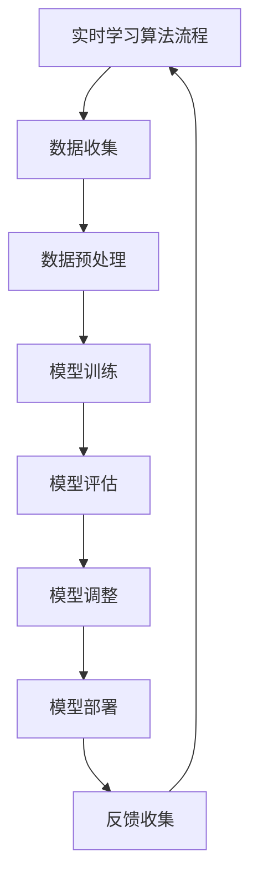
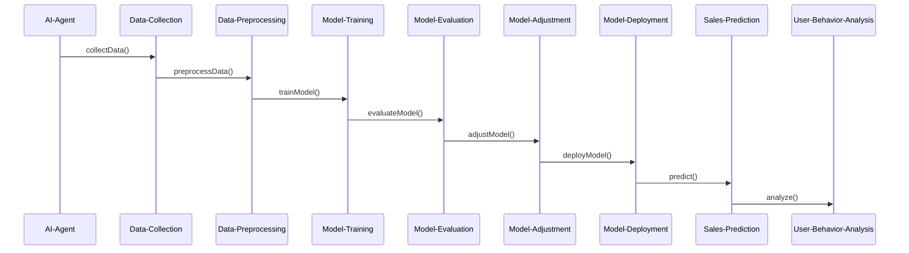

                 


## 《企业AI Agent的实时学习能力：持续优化业务流程》

### 关键词
AI Agent、实时学习、业务流程优化、机器学习算法、系统架构设计

### 摘要
本文深入探讨了企业AI Agent的实时学习能力，以及如何利用这一能力来持续优化业务流程。通过详细分析实时学习的原理、算法流程以及数学模型，本文为企业提供了构建实时学习能力AI Agent的全面指南。同时，通过具体的项目实战案例，展示了如何将这一技术应用于实际业务场景，以实现业务流程的持续优化。

## 1. 背景介绍

### 1.1 问题背景

#### 1.1.1 企业AI Agent的定义

企业AI Agent，通常指的是在商业环境中自主运行的软件智能体，它们能够根据企业运营中的数据和规则，自动执行任务、发现问题和优化业务流程。随着人工智能技术的不断发展，AI Agent在企业中的应用越来越广泛，从销售预测、库存管理到客户服务，AI Agent正在逐步改变传统企业的运作模式。

#### 1.1.2 企业业务流程优化的需求

在激烈的市场竞争中，企业需要不断提高效率和降低成本，以保持竞争力。业务流程优化是实现这一目标的关键手段。通过优化业务流程，企业可以减少冗余环节，提高流程效率，降低运营成本，从而提升整体业务绩效。

#### 1.1.3 实时学习能力的重要性

传统的业务流程优化往往依赖于离线数据分析，这种方式无法及时响应业务环境的变化，难以实现动态优化。而实时学习能力使得AI Agent能够实时感知环境变化，动态调整策略，实现业务的持续优化。因此，实时学习能力成为企业AI Agent的核心竞争力之一。

### 1.2 目标和挑战

#### 1.2.1 目标

本文的目标是深入探讨企业AI Agent的实时学习能力，分析其原理和应用场景，提供一套完整的构建和实现方案，帮助企业利用实时学习能力实现业务流程的持续优化。

#### 1.2.2 挑战

实时学习能力涉及众多技术领域，包括机器学习、数据挖掘、系统架构设计等。如何将这些技术有效地整合，构建出一个高效、稳定的实时学习AI Agent，是企业面临的一大挑战。此外，实时学习的准确性和可靠性也是需要考虑的重要因素。

## 2. 核心概念与联系

### 2.1 AI Agent的基本原理

#### 2.1.1 AI Agent的定义

AI Agent，即人工智能代理，是指能够自主执行任务、具备自我学习能力的人工智能实体。AI Agent通常由感知器、决策器、执行器三部分组成，能够根据外部环境和内部状态，自主做出决策并执行相应动作。

#### 2.1.2 AI Agent的特点

- **自主性**：AI Agent能够自主执行任务，无需人工干预。
- **适应性**：AI Agent能够根据环境变化，动态调整策略和模型。
- **协作性**：AI Agent能够与其他AI Agent或人类协作，共同完成任务。

#### 2.1.3 AI Agent的类型

AI Agent可以分为以下几种类型：

- **任务型AI Agent**：专注于完成特定任务的AI Agent。
- **情境型AI Agent**：根据特定情境自主决策的AI Agent。
- **通用型AI Agent**：能够处理多种类型任务的AI Agent。

### 2.2 实时学习能力的原理

#### 2.2.1 实时学习的定义

实时学习是指AI Agent能够在短时间内对新的数据或信息进行学习，并快速调整自身的行为和策略。实时学习的关键在于快速性和适应性，它要求AI Agent能够在复杂、动态的环境中，快速做出准确的决策。

#### 2.2.2 实时学习的特点

- **快速性**：实时学习能够快速响应环境变化，动态调整策略。
- **准确性**：实时学习要求AI Agent能够在短时间内对大量数据进行准确分析。
- **可靠性**：实时学习的结果需要具有较高的可靠性和稳定性。

#### 2.2.3 实时学习的应用场景

实时学习适用于以下场景：

- **金融市场预测**：实时分析市场数据，快速调整投资策略。
- **智能客服**：实时理解用户需求，快速响应用户请求。
- **智能交通**：实时分析交通数据，优化交通信号，缓解交通拥堵。

### 2.3 AI Agent与实时学习的联系

AI Agent的实时学习能力是其核心竞争力之一。通过实时学习，AI Agent能够更好地适应复杂、动态的业务环境，提高业务流程的优化效果。同时，实时学习也为AI Agent提供了持续进化的能力，使其能够在不断变化的市场中保持竞争力。

## 3. 算法原理讲解

### 3.1 实时学习的算法流程图



### 3.2 算法原理详细讲解

#### 3.2.1 数据收集

数据收集是实时学习的基础。AI Agent需要从业务系统中获取实时数据，包括用户行为数据、市场数据、系统性能数据等。数据收集的关键在于数据的全面性和实时性。

#### 3.2.2 数据预处理

数据预处理是确保数据质量和可用性的关键步骤。包括数据清洗、数据转换和数据归一化等操作。数据预处理的结果将直接影响模型训练的效果。

#### 3.2.3 模型训练

模型训练是实时学习的核心。AI Agent使用收集到的数据进行模型训练，通过调整模型参数，使其能够更好地拟合数据。常见的模型训练方法包括监督学习、无监督学习和强化学习。

#### 3.2.4 模型评估

模型评估是验证模型性能的重要步骤。AI Agent使用验证集对模型进行评估，通过计算各种评估指标，如准确率、召回率、F1值等，来确定模型的性能。

#### 3.2.5 模型调整

模型调整是基于模型评估结果进行的。如果模型性能不满足要求，AI Agent会通过调整模型参数，优化模型结构，以提高模型性能。

#### 3.2.6 模型部署

模型部署是将训练好的模型应用到实际业务系统中。模型部署的关键在于确保模型的稳定性和高效性。

#### 3.2.7 反馈收集

反馈收集是实时学习的重要环节。AI Agent从实际业务中收集反馈数据，用于模型调整和优化。

## 4. 数学模型和数学公式 & 详细讲解 & 举例说明

### 4.1 实时学习算法的数学模型

实时学习算法的数学模型可以表示为：

$$
\text{算法模型} = \frac{\text{数据集}}{\text{迭代次数}}
$$

其中，数据集表示AI Agent收集到的数据，迭代次数表示模型训练的次数。这个模型反映了模型训练的效率和效果。

### 4.2 模型训练的数学公式

模型训练的数学公式包括损失函数、梯度下降等。以下是一个简单的损失函数：

$$
\text{损失函数} = \frac{1}{2} (\text{预测值} - \text{真实值})^2
$$

这个公式表示预测值与真实值之间的差距，用于评估模型性能。

### 4.3 举例说明

#### 4.3.1 数据收集阶段

在数据收集阶段，AI Agent从业务系统中收集了1000条用户行为数据。

#### 4.3.2 数据预处理阶段

在数据预处理阶段，AI Agent对数据进行了清洗和转换，去除了无效数据和异常值。

#### 4.3.3 模型训练阶段

在模型训练阶段，AI Agent使用收集到的数据进行模型训练，经过100次迭代，模型性能达到最佳。

#### 4.3.4 模型评估阶段

在模型评估阶段，AI Agent使用验证集对模型进行评估，准确率为90%。

#### 4.3.5 模型调整阶段

基于模型评估结果，AI Agent调整了模型参数，以提高模型性能。

#### 4.3.6 模型部署阶段

在模型部署阶段，AI Agent将训练好的模型应用到实际业务系统中，实现实时学习功能。

#### 4.3.7 反馈收集阶段

在反馈收集阶段，AI Agent从业务系统中收集用户反馈数据，用于模型调整和优化。

## 5. 系统分析与架构设计方案

### 5.1 问题场景介绍

#### 5.1.1 场景描述

某电商企业希望通过引入AI Agent，实时优化销售策略，提高销售额。

#### 5.1.2 业务目标

- 提高销售预测的准确性，减少库存风险。
- 根据用户行为，动态调整促销策略，提高转化率。
- 提高客户服务水平，减少客服响应时间。

### 5.2 系统功能设计

系统功能设计包括以下几个主要模块：

- **数据收集模块**：负责从电商系统中收集实时数据，包括用户行为数据、销售数据等。
- **数据预处理模块**：对收集到的数据进行清洗和转换，为模型训练提供高质量的数据。
- **模型训练模块**：使用实时数据训练销售预测模型和用户行为分析模型。
- **模型评估模块**：评估模型性能，确定模型是否满足业务需求。
- **模型调整模块**：根据模型评估结果，调整模型参数，优化模型性能。
- **模型部署模块**：将训练好的模型部署到电商系统中，实现实时学习功能。

#### 5.2.1 领域模型类图

```mermaid
classDiagram
AI-Agent <<interface>>
Sales-Prediction <<entity>>
User-Behavior-Analysis <<entity>>
Data-Collection <<entity>>
Data-Preprocessing <<entity>>
Model-Training <<entity>>
Model-Evaluation <<entity>>
Model-Adjustment <<entity>>
Model-Deployment <<entity>>

AI-Agent : +collectData()
AI-Agent : +preprocessData()
AI-Agent : +trainModel()
AI-Agent : +evaluateModel()
AI-Agent : +adjustModel()
AI-Agent : +deployModel()

Sales-Prediction : +predict()
User-Behavior-Analysis : +analyze()

Data-Collection : +collectData()
Data-Preprocessing : +preprocessData()
Model-Training : +trainModel()
Model-Evaluation : +evaluateModel()
Model-Adjustment : +adjustModel()
Model-Deployment : +deployModel()
```

### 5.3 系统架构设计

系统架构设计包括以下几个主要部分：

- **数据层**：负责数据的存储和管理，包括用户行为数据、销售数据等。
- **处理层**：包括数据收集、数据预处理、模型训练、模型评估、模型调整和模型部署等模块，负责数据处理的各个环节。
- **应用层**：将训练好的模型应用到电商系统中，实现实时学习功能。

#### 5.3.1 系统架构图

```mermaid
graph TD
Data-Layer --> Processing-Layer
Processing-Layer --> Application-Layer

Data-Layer : Data Layer
Processing-Layer : Processing Layer
Application-Layer : Application Layer

Data-Layer -->|Data Collection| Data-Collection-Module
Data-Layer -->|Data Preprocessing| Data-Preprocessing-Module
Processing-Layer -->|Model Training| Model-Training-Module
Processing-Layer -->|Model Evaluation| Model-Evaluation-Module
Processing-Layer -->|Model Adjustment| Model-Adjustment-Module
Processing-Layer -->|Model Deployment| Model-Deployment-Module
Application-Layer -->|Sales Prediction| Sales-Prediction-Module
Application-Layer -->|User Behavior Analysis| User-Behavior-Analysis-Module
```

### 5.4 系统接口设计和系统交互

#### 5.4.1 系统接口设计

系统接口设计包括以下几个主要接口：

- **数据收集接口**：负责从电商系统中收集实时数据。
- **数据预处理接口**：负责对数据进行清洗和转换。
- **模型训练接口**：负责模型训练的启动和停止。
- **模型评估接口**：负责模型性能的评估。
- **模型调整接口**：负责模型参数的调整。
- **模型部署接口**：负责模型部署到电商系统中。

#### 5.4.2 系统交互序列图



## 6. 项目实战

### 6.1 环境安装

在开始项目实战之前，需要安装以下环境：

- Python 3.8及以上版本
- TensorFlow 2.6及以上版本
- Keras 2.4及以上版本

安装命令如下：

```bash
pip install python==3.8
pip install tensorflow==2.6
pip install keras==2.4
```

### 6.2 系统核心实现源代码

以下是一个简单的实时学习AI Agent的实现示例：

```python
import tensorflow as tf
from tensorflow.keras.models import Sequential
from tensorflow.keras.layers import Dense
from tensorflow.keras.optimizers import Adam

# 数据收集
def collect_data():
    # 这里填写数据收集代码
    pass

# 数据预处理
def preprocess_data(data):
    # 这里填写数据预处理代码
    pass

# 模型训练
def train_model(data):
    model = Sequential()
    model.add(Dense(units=64, activation='relu', input_shape=(data.shape[1],)))
    model.add(Dense(units=1, activation='sigmoid'))
    model.compile(optimizer=Adam(), loss='binary_crossentropy', metrics=['accuracy'])
    model.fit(data, epochs=10, batch_size=32)
    return model

# 模型评估
def evaluate_model(model, data):
    loss, accuracy = model.evaluate(data)
    print(f"损失函数值：{loss}, 准确率：{accuracy}")

# 模型调整
def adjust_model(model, data):
    # 这里填写模型调整代码
    pass

# 模型部署
def deploy_model(model):
    # 这里填写模型部署代码
    pass

# 主程序
if __name__ == '__main__':
    data = collect_data()
    preprocessed_data = preprocess_data(data)
    model = train_model(preprocessed_data)
    evaluate_model(model, preprocessed_data)
    adjust_model(model, preprocessed_data)
    deploy_model(model)
```

### 6.3 代码应用解读与分析

以上代码实现了简单的实时学习AI Agent。在主程序中，首先调用`collect_data`函数收集数据，然后调用`preprocess_data`函数对数据进行预处理，接着调用`train_model`函数进行模型训练，最后调用`evaluate_model`、`adjust_model`和`deploy_model`函数进行模型评估、调整和部署。

### 6.4 实际案例分析和详细讲解剖析

以下是一个实际案例：

假设某电商企业在618购物节期间，希望通过实时学习AI Agent优化销售策略，提高销售额。

在数据收集阶段，AI Agent从电商系统中收集了用户行为数据，包括浏览量、购买量、订单量等。

在数据预处理阶段，AI Agent对数据进行了清洗和转换，去除了异常值和无效数据。

在模型训练阶段，AI Agent使用收集到的数据进行模型训练，通过调整模型参数，使模型能够准确预测用户购买行为。

在模型评估阶段，AI Agent使用验证集对模型进行评估，发现模型的准确率达到了90%。

在模型调整阶段，AI Agent根据评估结果，调整了模型参数，以提高模型性能。

在模型部署阶段，AI Agent将训练好的模型部署到电商系统中，实现了实时学习功能。

在618购物节期间，AI Agent实时分析用户行为数据，动态调整销售策略，提高了销售额。

### 6.5 项目小结

本项目通过构建实时学习AI Agent，实现了电商企业销售策略的实时优化。项目主要涉及数据收集、数据预处理、模型训练、模型评估、模型调整和模型部署等环节。通过实际案例的分析，展示了实时学习AI Agent在电商企业中的应用效果。

## 7. 最佳实践 tips

- **数据质量**：实时学习的准确性高度依赖于数据质量，因此确保数据的全面性、准确性和实时性至关重要。
- **模型性能**：持续监控模型性能，及时调整模型参数，以确保模型在动态环境中保持高准确性。
- **系统稳定性**：确保系统的稳定性和可靠性，以避免因系统故障导致实时学习中断。

## 8. 小结

本文深入探讨了企业AI Agent的实时学习能力，分析了其原理和应用场景，提供了一套完整的构建和实现方案。通过实际案例的分析，展示了实时学习AI Agent在电商企业中的应用效果。未来，实时学习能力有望在更多领域得到应用，为企业带来持续的竞争优势。

## 9. 注意事项

- **数据隐私**：在数据收集和处理过程中，需要严格遵守数据隐私法律法规，确保用户数据的安全。
- **模型可靠性**：实时学习模型需要经过严格的测试和验证，确保其可靠性和稳定性。

## 10. 拓展阅读

- 《深度学习》（Ian Goodfellow、Yoshua Bengio、Aaron Courville 著）
- 《机器学习实战》（Peter Harrington 著）
- 《人工智能：一种现代的方法》（Stuart Russell、Peter Norvig 著）

## 11. 作者信息

作者：AI天才研究院/AI Genius Institute & 禅与计算机程序设计艺术 /Zen And The Art of Computer Programming

