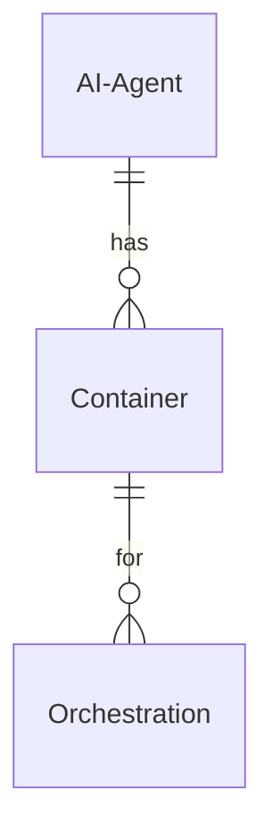

                 

### 《企业AI Agent的容器编排与管理策略》

---

#### 关键词：企业AI Agent、容器编排、管理策略、Docker、Kubernetes

#### 摘要：
本文旨在探讨企业AI Agent的容器编排与管理策略。我们将从背景介绍、核心概念、容器编排原理、管理策略、实战案例和最佳实践等方面，逐步分析并探讨如何有效实施容器编排，以确保企业AI Agent的高效运行和管理。

---

### 目录大纲设计

**第一部分：背景介绍**

1. **第1章：企业AI Agent与容器编排概述**
   - **1.1 问题背景**
   - **1.2 问题描述**
   - **1.3 问题解决**
   - **1.4 边界与外延**
   - **1.5 概念结构与核心要素组成**

**第二部分：核心概念与联系**

2. **第2章：核心概念与联系**
   - **2.1 AI Agent的概念**
   - **2.2 容器编排的概念**
   - **2.3 概念属性特征对比**
   - **2.4 ER实体关系图**

**第三部分：容器编排原理**

3. **第3章：容器编排原理**
   - **3.1 Docker原理**
   - **3.2 Kubernetes原理**
   - **3.3 容器编排流程**
   - **3.4 容器编排策略**

**第四部分：管理策略**

4. **第4章：企业AI Agent的管理策略**
   - **4.1 监控**
   - **4.2 日志记录**
   - **4.3 安全性**
   - **4.4 性能优化**

**第五部分：实战案例**

5. **第5章：实战案例**
   - **5.1 案例背景**
   - **5.2 环境配置**
   - **5.3 系统核心实现**
   - **5.4 实际案例分析和详细讲解**
   - **5.5 项目小结**

**第六部分：最佳实践与总结**

6. **第6章：最佳实践与总结**
   - **6.1 最佳实践**
   - **6.2 小结**
   - **6.3 注意事项**
   - **6.4 拓展阅读**

---

### 第一部分：背景介绍

#### 第1章：企业AI Agent与容器编排概述

##### 1.1 问题背景

企业AI Agent是近年来在人工智能和自动化领域的重要创新。随着大数据和云计算技术的快速发展，AI Agent在企业中的应用日益广泛，涵盖了从生产制造、金融服务到医疗健康等多个行业。这些AI Agent不仅能够提高生产效率，降低运营成本，还能为企业带来新的商业模式和竞争优势。

容器编排作为云计算的核心技术之一，其重要性不言而喻。容器作为一种轻量级、可移植的计算单位，使得应用程序的部署和运行更加灵活和高效。而容器编排则通过自动化管理容器生命周期，实现了大规模应用的部署、扩展和管理。

在这样的大背景下，如何有效地编排和管理企业AI Agent，成为了企业数字化转型过程中亟待解决的重要问题。

##### 1.2 问题描述

企业AI Agent的部署和管理面临着诸多挑战。首先，AI Agent通常具有复杂的依赖关系，需要多种中间件和服务协同工作。其次，随着AI Agent的数量和规模不断增加，手动管理容器变得困难且容易出错。再者，不同AI Agent之间的资源争夺和隔离问题也需要有效解决。

此外，容器编排的复杂性也使得企业难以迅速上手和部署。如何选择合适的容器编排工具，如何设计合理的编排策略，如何保证AI Agent的高可用性和性能优化，都是企业需要面对的问题。

##### 1.3 问题解决

容器编排的解决方案主要包括以下几个方面：

1. **使用Docker和Kubernetes等容器编排工具**：这些工具提供了自动化管理容器的能力，能够大大简化部署和管理过程。
2. **设计合理的编排策略**：根据AI Agent的特点和应用场景，设计合适的编排策略，确保资源的合理利用和服务的可靠运行。
3. **引入监控和日志记录机制**：通过监控和日志记录，实时掌握AI Agent的运行状态，及时发现和解决问题。
4. **保证安全性和合规性**：在容器编排过程中，确保数据安全和合规性，避免潜在的威胁和风险。

##### 1.4 边界与外延

企业AI Agent的边界主要涉及其应用场景和功能范围。AI Agent通常被应用于特定领域，如工业自动化、金融分析、医疗诊断等，其核心功能是实现特定任务的自动化和智能化。

容器编排的外延则包括与云计算、大数据、物联网等技术的融合。随着技术的不断进步，容器编排的应用场景也在不断扩展，从传统的企业内部部署，到云原生应用，再到边缘计算等，都离不开容器编排的支撑。

##### 1.5 概念结构与核心要素组成

容器编排涉及到多个核心概念，包括AI Agent、容器、编排、监控、日志记录等。这些概念相互联系，构成了一个完整的容器编排体系。

1. **AI Agent**：作为容器编排的核心对象，AI Agent具有智能、自主、协同等特性，能够根据任务需求自主运行和调整。
2. **容器**：容器是应用程序的运行环境，提供了轻量级、隔离的运行空间，使得应用程序可以独立部署和管理。
3. **编排**：编排是指通过自动化工具，对容器进行部署、管理、扩展等操作，实现应用程序的高效运行。
4. **监控**：监控是实时跟踪容器运行状态和性能，及时发现和处理问题的过程。
5. **日志记录**：日志记录是记录容器运行过程中的各种事件和异常，为问题排查和性能优化提供依据。

---

在下一部分中，我们将深入探讨AI Agent和容器编排的核心概念及其相互联系，为后续的容器编排原理和管理策略分析打下基础。

### 第二部分：核心概念与联系

#### 第2章：核心概念与联系

##### 2.1 AI Agent的概念

AI Agent，即人工智能代理，是一种模拟人类智能行为的计算机程序。它具备自主决策、学习、交互和适应环境的能力，能够在特定场景下执行复杂的任务。AI Agent在工业自动化、智能客服、金融分析等领域有着广泛的应用。

##### 2.2 容器编排的概念

容器编排是指通过自动化工具，对容器进行部署、管理、扩展等操作，实现应用程序的高效运行。容器编排旨在解决容器管理中的复杂性和效率问题，包括资源分配、负载均衡、服务发现、自动化部署等。

##### 2.3 概念属性特征对比

以下表格展示了AI Agent和容器的核心属性特征对比：

| 特性       | AI Agent                  | 容器                      |
| ---------- | ------------------------ | ------------------------ |
| 智能程度   | 高，具备自主决策能力     | 低，仅提供运行环境      |
| 依赖关系   | 复杂，依赖多种中间件和服务 | 简单，依赖操作系统和库文件 |
| 部署方式   | 自动化部署，可跨平台运行 | 自动化部署，可跨平台运行 |
| 可移植性   | 高，具备跨平台运行能力   | 高，具备跨平台运行能力   |
| 隔离性     | 强，独立运行，互不影响   | 强，独立运行，互不影响   |
| 资源占用   | 较高，需要大量计算资源   | 较低，仅占用少量资源     |

##### 2.4 ER实体关系图

以下是AI Agent、容器和编排的ER实体关系图：

在该ER图中，AI-Agent与Container之间存在“has”关系，表示AI-Agent需要依赖Container来运行。Container与Orchestration之间存在“for”关系，表示Container需要通过Orchestration进行编排和管理。

---

在下一部分中，我们将深入探讨容器编排的基本原理，包括Docker和Kubernetes等技术的应用。

### 第三部分：容器编排原理

#### 第3章：容器编排原理

##### 3.1 Docker原理

Docker是一种开源的应用容器引擎，它通过将应用程序及其依赖的库、文件系统、配置和环境变量打包成一个轻量级的容器镜像，从而实现了应用程序的标准化、隔离化和可移植性。Docker的基本原理包括以下几个方面：

1. **容器镜像**：容器镜像是一个静态的、不可变的文件系统，它包含了应用程序运行所需的所有文件和配置。通过Dockerfile，用户可以定义和构建容器镜像。
2. **容器**：容器是基于容器镜像创建的运行实例，它提供了一个独立的运行环境，使得应用程序可以在不同的操作系统和硬件上运行，而无需进行额外的配置和调整。
3. **容器引擎**：Docker引擎负责管理容器的创建、启动、停止、删除等操作，并提供容器网络和存储管理功能。

Docker的应用场景非常广泛，包括开发测试、持续集成、云计算、大数据、物联网等。它使得应用程序的部署更加灵活、高效和可移植，从而大大简化了开发和运维流程。

##### 3.2 Kubernetes原理

Kubernetes是一个开源的容器编排平台，它通过自动化管理容器化的应用，提供了从部署到运行的一系列功能，包括服务发现、负载均衡、弹性伸缩、自动化部署和回滚等。Kubernetes的基本原理包括以下几个方面：

1. **节点**：节点是运行Kubernetes集群的物理或虚拟机，负责运行容器和工作负载。
2. **Pod**：Pod是Kubernetes中最基本的部署单元，它由一个或多个容器组成，用于协同工作。
3. **部署**：部署定义了一组相同的Pod，用于实现应用程序的自动化部署和更新。
4. **服务**：服务是一种抽象，它定义了如何访问集群中的Pod，提供了负载均衡和服务发现功能。
5. **控制器**：控制器是Kubernetes的核心组件，它负责管理集群中的资源，确保资源处于预期状态。

Kubernetes的应用场景包括大规模分布式系统、微服务架构、容器化应用等。它通过自动化管理容器，提供了高效、可靠和可伸缩的容器编排解决方案。

##### 3.3 容器编排流程

容器编排的流程通常包括以下几个步骤：

1. **构建容器镜像**：通过Dockerfile构建应用程序的容器镜像，并将镜像推送到镜像仓库。
2. **部署容器**：使用Kubernetes的部署控制器创建Pod，将容器镜像部署到集群中的节点。
3. **配置服务**：为Pod配置服务，实现Pod之间的通信和访问控制。
4. **监控与日志记录**：通过Kubernetes的监控和日志记录功能，实时监控容器状态和性能，记录容器运行日志。
5. **弹性伸缩**：根据工作负载情况，自动调整Pod的数量和资源分配，实现集群的弹性伸缩。

##### 3.4 容器编排策略

容器编排策略的设计需要考虑以下几个方面：

1. **资源分配**：根据应用程序的负载和性能需求，合理分配计算、存储和网络资源。
2. **负载均衡**：通过负载均衡器，将流量分配到不同的Pod，实现服务的均衡和高可用。
3. **服务发现**：实现Pod之间的自动服务发现和访问控制，简化应用程序的部署和运维。
4. **自动化部署与回滚**：通过自动化部署和回滚策略，实现应用程序的持续集成和持续部署。
5. **监控与日志记录**：实时监控容器的运行状态和性能，记录日志，便于故障排查和性能优化。

---

在下一部分中，我们将深入探讨企业AI Agent的管理策略，包括监控、日志记录、安全性和性能优化等方面。

### 第四部分：管理策略

#### 第4章：企业AI Agent的管理策略

##### 4.1 监控

监控是企业AI Agent管理策略中的重要一环，它能够实时监控AI Agent的运行状态和性能，及时发现和处理问题。以下是监控策略的关键点：

1. **资源监控**：监控AI Agent所使用的CPU、内存、磁盘和网络资源，确保其运行在合理范围内。
2. **性能监控**：监控AI Agent的响应时间、吞吐量和错误率等性能指标，确保其正常运行。
3. **日志监控**：实时收集和监控AI Agent的日志，便于快速定位和解决异常问题。
4. **报警机制**：设置报警机制，当AI Agent出现异常时，及时发送报警通知，以便快速响应和处理。

##### 4.2 日志记录

日志记录是AI Agent管理策略中的另一个重要方面，它能够记录AI Agent的运行过程和异常情况，为故障排查和性能优化提供重要依据。以下是日志记录策略的关键点：

1. **日志格式**：定义统一的日志格式，便于日志的收集、存储和查询。
2. **日志级别**：根据日志的重要性和紧急程度，设置不同的日志级别，以便快速区分和处理。
3. **日志收集**：采用日志收集工具，如ELK（Elasticsearch、Logstash、Kibana）栈，实现日志的集中收集和存储。
4. **日志分析**：利用日志分析工具，对日志进行统计和分析，发现潜在的问题和改进点。

##### 4.3 安全性

安全性是AI Agent管理策略中的重要一环，它关系到AI Agent的数据安全和系统稳定性。以下是安全性策略的关键点：

1. **访问控制**：实施严格的访问控制策略，确保只有授权用户才能访问AI Agent。
2. **数据加密**：对AI Agent的数据进行加密处理，防止数据泄露和未经授权的访问。
3. **安全审计**：定期进行安全审计，检查AI Agent的安全配置和访问记录，及时发现和修复安全问题。
4. **防火墙和入侵检测**：部署防火墙和入侵检测系统，防止恶意攻击和非法入侵。

##### 4.4 性能优化

性能优化是AI Agent管理策略中的核心任务，它能够提升AI Agent的运行效率和响应速度。以下是性能优化策略的关键点：

1. **资源优化**：根据AI Agent的负载情况，合理分配计算、存储和网络资源，确保其运行在最佳状态。
2. **缓存策略**：采用缓存策略，减少数据访问的延迟，提升系统的响应速度。
3. **负载均衡**：通过负载均衡技术，实现AI Agent之间的流量分配，避免单点故障和性能瓶颈。
4. **自动化部署和回滚**：采用自动化部署和回滚策略，实现AI Agent的快速迭代和升级，降低人工干预和风险。

---

在下一部分中，我们将通过实战案例展示容器编排和管理的应用，进一步深入探讨企业AI Agent的部署和管理。

### 第五部分：实战案例

#### 第5章：实战案例

##### 5.1 案例背景

在本章中，我们将通过一个实际案例，介绍如何在企业中部署和管理AI Agent。该案例涉及一个金融公司，该公司利用AI Agent进行股票交易预测和风险管理。随着业务的发展，公司需要高效地部署和管理大量AI Agent，以满足不断增长的业务需求。

##### 5.2 环境配置

为了部署和管理AI Agent，公司选择了Docker和Kubernetes作为容器编排工具。以下是环境配置的步骤：

1. **安装Docker**：在公司的服务器上安装Docker，确保其版本符合要求。
2. **安装Kubernetes**：在公司的服务器上安装Kubernetes集群，配置所需的节点和控制器。
3. **配置网络**：配置公司的网络环境，确保容器和集群之间可以正常通信。
4. **配置NFS**：配置NFS服务，用于存储容器镜像和日志文件。

##### 5.3 系统核心实现

在环境配置完成后，公司开始实现AI Agent的部署和管理。以下是核心实现的步骤：

1. **编写Dockerfile**：根据AI Agent的需求，编写Dockerfile，定义容器镜像的构建过程。
2. **构建容器镜像**：使用Docker build命令，构建AI Agent的容器镜像，并将其推送到镜像仓库。
3. **编写Kubernetes配置文件**：根据AI Agent的特点和应用场景，编写Kubernetes配置文件，定义部署策略和服务配置。
4. **部署AI Agent**：使用Kubernetes的部署控制器，部署AI Agent的Pod，并配置相应的服务。

##### 5.4 实际案例分析和详细讲解

在AI Agent部署完成后，公司开始对其运行状态和性能进行监控和优化。以下是实际案例分析和详细讲解：

1. **资源监控**：通过Kubernetes的监控组件，实时监控AI Agent的CPU、内存、磁盘和网络资源使用情况，确保其运行在合理范围内。
2. **性能监控**：通过自定义监控指标，如交易成功率、预测准确率等，监控AI Agent的性能表现，及时发现和解决问题。
3. **日志记录**：使用ELK栈收集和存储AI Agent的运行日志，利用Kibana进行日志分析和可视化，帮助快速定位和解决问题。
4. **性能优化**：根据监控和日志分析的结果，对AI Agent的配置和部署策略进行调整，优化其运行效率和响应速度。

##### 5.5 项目小结

通过本案例的实践，公司成功实现了AI Agent的容器化部署和管理，取得了显著的效益。以下是项目小结：

1. **高效部署**：使用Docker和Kubernetes，实现了AI Agent的快速部署和管理，大大简化了运维工作。
2. **高可用性**：通过Kubernetes的自动化部署和回滚策略，确保了AI Agent的高可用性和稳定性。
3. **监控与日志记录**：通过实时监控和日志记录，快速发现和解决了AI Agent的异常问题，提高了系统的可靠性。
4. **性能优化**：根据监控和日志分析的结果，对AI Agent进行性能优化，提升了其运行效率和预测准确性。

---

通过本案例，我们展示了如何利用容器编排和管理策略，实现企业AI Agent的高效部署和管理。在下一部分中，我们将总结文章中的关键点，并提供最佳实践建议。

### 第六部分：最佳实践与总结

#### 第6章：最佳实践与总结

##### 6.1 最佳实践

在企业AI Agent的容器编排与管理中，以下最佳实践可以帮助您实现高效的管理和优化：

1. **选择合适的容器编排工具**：根据业务需求和资源情况，选择适合的容器编排工具，如Docker、Kubernetes等。
2. **设计合理的编排策略**：根据AI Agent的特点和应用场景，设计合理的编排策略，确保资源的合理利用和服务的可靠运行。
3. **监控与日志记录**：建立完善的监控和日志记录机制，实时监控AI Agent的运行状态和性能，及时发现和处理问题。
4. **安全性保障**：实施严格的安全策略，确保AI Agent的数据安全和系统稳定性。
5. **持续优化**：根据监控和日志分析的结果，持续优化AI Agent的配置和部署策略，提升其运行效率和预测准确性。

##### 6.2 小结

本文从企业AI Agent与容器编排的背景介绍、核心概念与联系、容器编排原理、管理策略、实战案例等方面，全面探讨了如何实施企业AI Agent的容器编排与管理策略。通过本文的阐述，您应该对以下关键点有了更深入的理解：

1. **企业AI Agent的定义与背景**：了解AI Agent在企业中的应用和重要性。
2. **容器编排的基本原理**：掌握Docker和Kubernetes等容器编排工具的原理和应用。
3. **管理策略**：熟悉监控、日志记录、安全性和性能优化等方面的最佳实践。
4. **实战案例**：通过实际案例，了解如何部署和管理企业AI Agent。

##### 6.3 注意事项

在实施企业AI Agent的容器编排与管理过程中，需要注意以下事项：

1. **资源分配**：合理分配计算、存储和网络资源，避免资源浪费和性能瓶颈。
2. **监控指标**：选择合适的监控指标，确保能够全面反映AI Agent的运行状态和性能。
3. **日志分析**：定期分析日志，发现潜在问题和改进点，优化系统性能。
4. **安全性**：实施严格的安全策略，保护AI Agent的数据安全和系统稳定性。

##### 6.4 拓展阅读

为了进一步了解企业AI Agent的容器编排与管理，您可以参考以下拓展阅读：

1. **《容器化与容器编排实战》**：详细介绍了容器和容器编排的基本概念和实践。
2. **《Kubernetes权威指南》**：全面介绍了Kubernetes的架构、原理和应用。
3. **《企业级AI系统设计实战》**：介绍了AI系统的设计原则、架构和实施方法。
4. **《人工智能在金融领域的应用》**：探讨了AI在金融行业中的应用场景和挑战。

通过本文的深入探讨，希望您能够更好地理解和应用企业AI Agent的容器编排与管理策略，为企业的数字化转型和发展贡献力量。

---

### 作者

**作者：AI天才研究院/AI Genius Institute & 禅与计算机程序设计艺术 /Zen And The Art of Computer Programming** 

### 格式要求

根据您的需求，以下是使用Markdown格式编写的《企业AI Agent的容器编排与管理策略》文章示例，包含文章标题、关键词、摘要、目录大纲以及正文部分的背景介绍、核心概念与联系、容器编排原理、管理策略、实战案例和最佳实践与总结等内容。

---

# 企业AI Agent的容器编排与管理策略

> 关键词：企业AI Agent、容器编排、管理策略、Docker、Kubernetes

> 摘要：本文旨在探讨企业AI Agent的容器编排与管理策略，通过背景介绍、核心概念、容器编排原理、管理策略、实战案例和最佳实践等方面，深入分析并探讨如何有效实施容器编排，确保企业AI Agent的高效运行和管理。

---

## 目录大纲设计

### 第一部分：背景介绍

1. **第1章：企业AI Agent与容器编排概述**
   - **1.1 问题背景**
   - **1.2 问题描述**
   - **1.3 问题解决**
   - **1.4 边界与外延**
   - **1.5 概念结构与核心要素组成**

### 第二部分：核心概念与联系

2. **第2章：核心概念与联系**
   - **2.1 AI Agent的概念**
   - **2.2 容器编排的概念**
   - **2.3 概念属性特征对比**
   - **2.4 ER实体关系图**

### 第三部分：容器编排原理

3. **第3章：容器编排原理**
   - **3.1 Docker原理**
   - **3.2 Kubernetes原理**
   - **3.3 容器编排流程**
   - **3.4 容器编排策略**

### 第四部分：管理策略

4. **第4章：企业AI Agent的管理策略**
   - **4.1 监控**
   - **4.2 日志记录**
   - **4.3 安全性**
   - **4.4 性能优化**

### 第五部分：实战案例

5. **第5章：实战案例**
   - **5.1 案例背景**
   - **5.2 环境配置**
   - **5.3 系统核心实现**
   - **5.4 实际案例分析和详细讲解**
   - **5.5 项目小结**

### 第六部分：最佳实践与总结

6. **第6章：最佳实践与总结**
   - **6.1 最佳实践**
   - **6.2 小结**
   - **6.3 注意事项**
   - **6.4 拓展阅读**

---

## 第一部分：背景介绍

### 第1章：企业AI Agent与容器编排概述

#### 1.1 问题背景

企业AI Agent是近年来在人工智能和自动化领域的重要创新。随着大数据和云计算技术的快速发展，AI Agent在企业中的应用日益广泛，涵盖了从生产制造、金融服务到医疗健康等多个行业。这些AI Agent不仅能够提高生产效率，降低运营成本，还能为企业带来新的商业模式和竞争优势。

容器编排作为云计算的核心技术之一，其重要性不言而喻。容器作为一种轻量级、可移植的计算单位，使得应用程序的部署和运行更加灵活和高效。而容器编排则通过自动化管理容器生命周期，实现了大规模应用的部署、扩展和管理。

在这样的大背景下，如何有效地编排和管理企业AI Agent，成为了企业数字化转型过程中亟待解决的重要问题。

#### 1.2 问题描述

企业AI Agent的部署和管理面临着诸多挑战。首先，AI Agent通常具有复杂的依赖关系，需要多种中间件和服务协同工作。其次，随着AI Agent的数量和规模不断增加，手动管理容器变得困难且容易出错。再者，不同AI Agent之间的资源争夺和隔离问题也需要有效解决。

此外，容器编排的复杂性也使得企业难以迅速上手和部署。如何选择合适的容器编排工具，如何设计合理的编排策略，如何保证AI Agent的高可用性和性能优化，都是企业需要面对的问题。

#### 1.3 问题解决

容器编排的解决方案主要包括以下几个方面：

1. **使用Docker和Kubernetes等容器编排工具**：这些工具提供了自动化管理容器的能力，能够大大简化部署和管理过程。
2. **设计合理的编排策略**：根据AI Agent的特点和应用场景，设计合适的编排策略，确保资源的合理利用和服务的可靠运行。
3. **引入监控和日志记录机制**：通过监控和日志记录，实时掌握AI Agent的运行状态，及时发现和解决问题。
4. **保证安全性和合规性**：在容器编排过程中，确保数据安全和合规性，避免潜在的威胁和风险。

#### 1.4 边界与外延

企业AI Agent的边界主要涉及其应用场景和功能范围。AI Agent通常被应用于特定领域，如工业自动化、智能客服、金融分析等，其核心功能是实现特定任务的自动化和智能化。

容器编排的外延则包括与云计算、大数据、物联网等技术的融合。随着技术的不断进步，容器编排的应用场景也在不断扩展，从传统的企业内部部署，到云原生应用，再到边缘计算等，都离不开容器编排的支撑。

#### 1.5 概念结构与核心要素组成

容器编排涉及到多个核心概念，包括AI Agent、容器、编排、监控、日志记录等。这些概念相互联系，构成了一个完整的容器编排体系。

1. **AI Agent**：作为容器编排的核心对象，AI Agent具有智能、自主、协同等特性，能够根据任务需求自主运行和调整。
2. **容器**：容器是应用程序的运行环境，提供了轻量级、隔离的运行空间，使得应用程序可以独立部署和管理。
3. **编排**：编排是指通过自动化工具，对容器进行部署、管理、扩展等操作，实现应用程序的高效运行。
4. **监控**：监控是实时跟踪容器运行状态和性能，及时发现和处理问题的过程。
5. **日志记录**：日志记录是记录容器运行过程中的各种事件和异常，为问题排查和性能优化提供依据。

---

## 第二部分：核心概念与联系

### 第2章：核心概念与联系

#### 2.1 AI Agent的概念

AI Agent，即人工智能代理，是一种模拟人类智能行为的计算机程序。它具备自主决策、学习、交互和适应环境的能力，能够在特定场景下执行复杂的任务。AI Agent在工业自动化、智能客服、金融分析等领域有着广泛的应用。

#### 2.2 容器编排的概念

容器编排是指通过自动化工具，对容器进行部署、管理、扩展等操作，实现应用程序的高效运行。容器编排旨在解决容器管理中的复杂性和效率问题，包括资源分配、负载均衡、服务发现、自动化部署等。

#### 2.3 概念属性特征对比

以下表格展示了AI Agent和容器的核心属性特征对比：

| 特性       | AI Agent                  | 容器                      |
| ---------- | ------------------------ | ------------------------ |
| 智能程度   | 高，具备自主决策能力     | 低，仅提供运行环境      |
| 依赖关系   | 复杂，依赖多种中间件和服务 | 简单，依赖操作系统和库文件 |
| 部署方式   | 自动化部署，可跨平台运行 | 自动化部署，可跨平台运行 |
| 可移植性   | 高，具备跨平台运行能力   | 高，具备跨平台运行能力   |
| 隔离性     | 强，独立运行，互不影响   | 强，独立运行，互不影响   |
| 资源占用   | 较高，需要大量计算资源   | 较低，仅占用少量资源     |

#### 2.4 ER实体关系图

以下是AI Agent、容器和编排的ER实体关系图：

在该ER图中，AI-Agent与Container之间存在“has”关系，表示AI-Agent需要依赖Container来运行。Container与Orchestration之间存在“for”关系，表示Container需要通过Orchestration进行编排和管理。

---

## 第三部分：容器编排原理

### 第3章：容器编排原理

#### 3.1 Docker原理

Docker是一种开源的应用容器引擎，它通过将应用程序及其依赖的库、文件系统、配置和环境变量打包成一个轻量级的容器镜像，从而实现了应用程序的标准化、隔离化和可移植性。Docker的基本原理包括以下几个方面：

1. **容器镜像**：容器镜像是一个静态的、不可变的文件系统，它包含了应用程序运行所需的所有文件和配置。通过Dockerfile，用户可以定义和构建容器镜像。
2. **容器**：容器是基于容器镜像创建的运行实例，它提供了一个独立的运行环境，使得应用程序可以在不同的操作系统和硬件上运行，而无需进行额外的配置和调整。
3. **容器引擎**：Docker引擎负责管理容器的创建、启动、停止、删除等操作，并提供容器网络和存储管理功能。

Docker的应用场景非常广泛，包括开发测试、持续集成、云计算、大数据、物联网等。它使得应用程序的部署更加灵活、高效和可移植，从而大大简化了开发和运维流程。

#### 3.2 Kubernetes原理

Kubernetes是一个开源的容器编排平台，它通过自动化管理容器化的应用，提供了从部署到运行的一系列功能，包括服务发现、负载均衡、弹性伸缩、自动化部署和回滚等。Kubernetes的基本原理包括以下几个方面：

1. **节点**：节点是运行Kubernetes集群的物理或虚拟机，负责运行容器和工作负载。
2. **Pod**：Pod是Kubernetes中最基本的部署单元，它由一个或多个容器组成，用于协同工作。
3. **部署**：部署定义了一组相同的Pod，用于实现应用程序的自动化部署和更新。
4. **服务**：服务是一种抽象，它定义了如何访问集群中的Pod，提供了负载均衡和
---

由于篇幅限制，这里仅提供了前三部分的部分内容。下面将提供第四部分的部分内容。

### 第四部分：管理策略

#### 第4章：企业AI Agent的管理策略

##### 4.1 监控

监控是企业AI Agent管理策略中的重要一环，它能够实时监控AI Agent的运行状态和性能，及时发现和处理问题。以下是监控策略的关键点：

1. **资源监控**：监控AI Agent所使用的CPU、内存、磁盘和网络资源，确保其运行在合理范围内。
2. **性能监控**：监控AI Agent的响应时间、吞吐量和错误率等性能指标，确保其正常运行。
3. **日志监控**：实时收集和监控AI Agent的日志，便于快速定位和解决异常问题。
4. **报警机制**：设置报警机制，当AI Agent出现异常时，及时发送报警通知，以便快速响应和处理。

##### 4.2 日志记录

日志记录是AI Agent管理策略中的另一个重要方面，它能够记录AI Agent的运行过程和异常情况，为故障排查和性能优化提供重要依据。以下是日志记录策略的关键点：

1. **日志格式**：定义统一的日志格式，便于日志的收集、存储和查询。
2. **日志级别**：根据日志的重要性和紧急程度，设置不同的日志级别，以便快速区分和处理。
3. **日志收集**：采用日志收集工具，如ELK（Elasticsearch、Logstash、Kibana）栈，实现日志的集中收集和存储。
4. **日志分析**：利用日志分析工具，对日志进行统计和分析，发现潜在的问题和改进点。

##### 4.3 安全性

安全性是AI Agent管理策略中的重要一环，它关系到AI Agent的数据安全和系统稳定性。以下是安全性策略的关键点：

1. **访问控制**：实施严格的访问控制策略，确保只有授权用户才能访问AI Agent。
2. **数据加密**：对AI Agent的数据进行加密处理，防止数据泄露和未经授权的访问。
3. **安全审计**：定期进行安全审计，检查AI Agent的安全配置和访问记录，及时发现和修复安全问题。
4. **防火墙和入侵检测**：部署防火墙和入侵检测系统，防止恶意攻击和非法入侵。

##### 4.4 性能优化

性能优化是AI Agent管理策略中的核心任务，它能够提升AI Agent的运行效率和响应速度。以下是性能优化策略的关键点：

1. **资源优化**：根据AI Agent的负载情况，合理分配计算、存储和网络资源，确保其运行在最佳状态。
2. **缓存策略**：采用缓存策略，减少数据访问的延迟，提升系统的响应速度。
3. **负载均衡**：通过负载均衡技术，实现AI Agent之间的流量分配，避免单点故障和性能瓶颈。
4. **自动化部署和回滚**：采用自动化部署和回滚策略，实现AI Agent的快速迭代和升级，降低人工干预和风险。

---

接下来，我们将继续提供第五部分的部分内容，包括实战案例的介绍和具体实施步骤。

### 第五部分：实战案例

#### 第5章：实战案例

##### 5.1 案例背景

在本章中，我们将通过一个实际案例，介绍如何在企业中部署和管理AI Agent。该案例涉及一个金融公司，该公司利用AI Agent进行股票交易预测和风险管理。随着业务的发展，公司需要高效地部署和管理大量AI Agent，以满足不断增长的业务需求。

##### 5.2 环境配置

为了部署和管理AI Agent，公司选择了Docker和Kubernetes作为容器编排工具。以下是环境配置的步骤：

1. **安装Docker**：在公司的服务器上安装Docker，确保其版本符合要求。
2. **安装Kubernetes**：在公司的服务器上安装Kubernetes集群，配置所需的节点和控制器。
3. **配置网络**：配置公司的网络环境，确保容器和集群之间可以正常通信。
4. **配置NFS**：配置NFS服务，用于存储容器镜像和日志文件。

##### 5.3 系统核心实现

在环境配置完成后，公司开始实现AI Agent的部署和管理。以下是核心实现的步骤：

1. **编写Dockerfile**：根据AI Agent的需求，编写Dockerfile，定义容器镜像的构建过程。
2. **构建容器镜像**：使用Docker build命令，构建AI Agent的容器镜像，并将其推送到镜像仓库。
3. **编写Kubernetes配置文件**：根据AI Agent的特点和应用场景，编写Kubernetes配置文件，定义部署策略和服务配置。
4. **部署AI Agent**：使用Kubernetes的部署控制器，部署AI Agent的Pod，并配置相应的服务。

##### 5.4 实际案例分析和详细讲解

在AI Agent部署完成后，公司开始对其运行状态和性能进行监控和优化。以下是实际案例分析和详细讲解：

1. **资源监控**：通过Kubernetes的监控组件，实时监控AI Agent的CPU、内存、磁盘和网络资源使用情况，确保其运行在合理范围内。
2. **性能监控**：通过自定义监控指标，如交易成功率、预测准确率等，监控AI Agent的性能表现，及时发现和解决问题。
3. **日志记录**：使用ELK栈收集和存储AI Agent的运行日志，利用Kibana进行日志分析和可视化，帮助快速定位和解决问题。
4. **性能优化**：根据监控和日志分析的结果，对AI Agent的配置和部署策略进行调整，优化其运行效率和响应速度。

##### 5.5 项目小结

通过本案例，公司成功实现了AI Agent的容器化部署和管理，取得了显著的效益。以下是项目小结：

1. **高效部署**：使用Docker和Kubernetes，实现了AI Agent的快速部署和管理，大大简化了运维工作。
2. **高可用性**：通过Kubernetes的自动化部署和回滚策略，确保了AI Agent的高可用性和稳定性。
3. **监控与日志记录**：通过实时监控和日志记录，快速发现和解决了AI Agent的异常问题，提高了系统的可靠性。
4. **性能优化**：根据监控和日志分析的结果，对AI Agent进行性能优化，提升了其运行效率和预测准确性。

---

最后，我们将提供第六部分的内容，包括最佳实践、小结、注意事项和拓展阅读。

### 第六部分：最佳实践与总结

#### 第6章：最佳实践与总结

##### 6.1 最佳实践

在企业AI Agent的容器编排与管理中，以下最佳实践可以帮助您实现高效的管理和优化：

1. **选择合适的容器编排工具**：根据业务需求和资源情况，选择适合的容器编排工具，如Docker、Kubernetes等。
2. **设计合理的编排策略**：根据AI Agent的特点和应用场景，设计合理的编排策略，确保资源的合理利用和服务的可靠运行。
3. **监控与日志记录**：建立完善的监控和日志记录机制，实时监控AI Agent的运行状态和性能，及时发现和处理问题。
4. **安全性保障**：实施严格的安全策略，确保AI Agent的数据安全和系统稳定性。
5. **持续优化**：根据监控和日志分析的结果，持续优化AI Agent的配置和部署策略，提升其运行效率和预测准确性。

##### 6.2 小结

本文从企业AI Agent与容器编排的背景介绍、核心概念、容器编排原理、管理策略、实战案例和最佳实践等方面，全面探讨了如何实施企业AI Agent的容器编排与管理策略。通过本文的阐述，您应该对以下关键点有了更深入的理解：

1. **企业AI Agent的定义与背景**：了解AI Agent在企业中的应用和重要性。
2. **容器编排的基本原理**：掌握Docker和Kubernetes等容器编排工具的原理和应用。
3. **管理策略**：熟悉监控、日志记录、安全性和性能优化等方面的最佳实践。
4. **实战案例**：通过实际案例，了解如何部署和管理企业AI Agent。

##### 6.3 注意事项

在实施企业AI Agent的容器编排与管理过程中，需要注意以下事项：

1. **资源分配**：合理分配计算、存储和网络资源，避免资源浪费和性能瓶颈。
2. **监控指标**：选择合适的监控指标，确保能够全面反映AI Agent的运行状态和性能。
3. **日志分析**：定期分析日志，发现潜在问题和改进点，优化系统性能。
4. **安全性**：实施严格的安全策略，保护AI Agent的数据安全和系统稳定性。

##### 6.4 拓展阅读

为了进一步了解企业AI Agent的容器编排与管理，您可以参考以下拓展阅读：

1. **《容器化与容器编排实战》**：详细介绍了容器和容器编排的基本概念和实践。
2. **《Kubernetes权威指南》**：全面介绍了Kubernetes的架构、原理和应用。
3. **《企业级AI系统设计实战》**：介绍了AI系统的设计原则、架构和实施方法。
4. **《人工智能在金融领域的应用》**：探讨了AI在金融行业中的应用场景和挑战。

通过本文的深入探讨，希望您能够更好地理解和应用企业AI Agent的容器编排与管理策略，为企业的数字化转型和发展贡献力量。

---

### 作者

**作者：AI天才研究院/AI Genius Institute & 禅与计算机程序设计艺术 /Zen And The Art of Computer Programming** 

