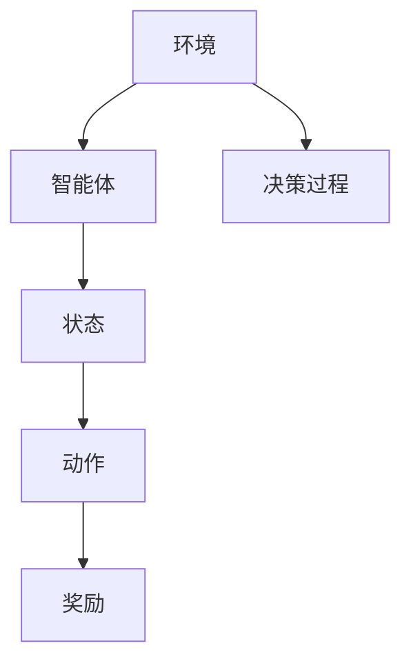
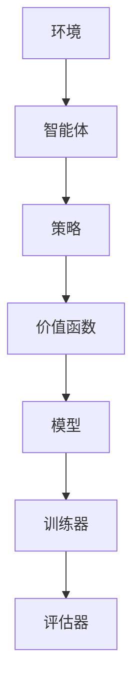
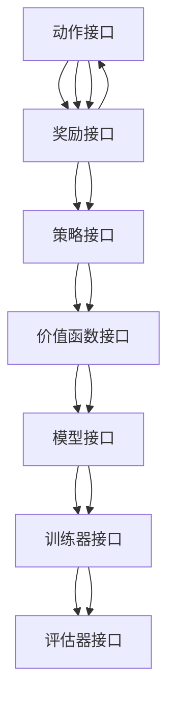
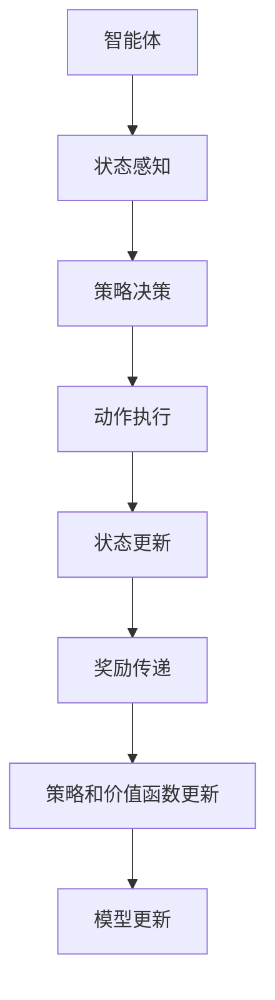

                 


### 第一部分：企业AI Agent的强化学习概述

#### 问题背景

在当今的商业环境中，企业面临着越来越复杂的决策场景，这些决策往往涉及到大量的数据、多变的条件和不确定的结果。为了提高决策效率和质量，企业开始寻求智能化的解决方案，其中人工智能（AI）的应用变得日益重要。企业AI Agent作为一种智能体，可以在复杂的决策场景中提供辅助和优化决策的支持。

强化学习作为机器学习的一种重要方法，在AI Agent中得到了广泛应用。强化学习通过智能体与环境之间的交互，学习如何在动态和不确定的环境中做出最优决策。在复杂决策场景中，强化学习可以帮助企业AI Agent适应不断变化的环境，提高决策的准确性和效率。

#### 核心概念

1. **企业AI Agent**：企业AI Agent是一种能够模拟人类决策过程的计算机程序，它在特定的商业环境中执行任务，并从经验中学习如何做出最优决策。

2. **强化学习**：强化学习是一种通过试错来学习如何在特定环境中做出最优决策的机器学习方法。它通过奖励机制来引导智能体学习，使其在长期内获得最大化的回报。

3. **环境**：强化学习中的环境是指智能体执行任务的环境，它可以是现实世界或模拟世界。

4. **状态**：强化学习中的状态是指智能体在执行任务时所处的情境或条件。

5. **动作**：强化学习中的动作是指智能体可以执行的行为或决策。

6. **奖励**：强化学习中的奖励是指智能体在执行某个动作后获得的正面或负面反馈。

#### 属性特征对比

| 特征        | 强化学习          | 企业AI Agent       |
| ----------- | ----------------- | ----------------- |
| 学习方式    | 试错学习          | 经验学习          |
| 目标        | 获得最大化的回报  | 执行任务并优化决策 |
| 适用场景    | 动态和不确定环境  | 复杂商业决策场景  |
| 算法选择    | Q-Learning、DQN等 | 深度强化学习等     |
| 学习效果    | 长期学习效果显著  | 短期内效果可能不明显 |

#### ER实体关系图



在企业AI Agent的强化学习应用中，环境、智能体、状态、动作和奖励等实体之间存在着紧密的联系。智能体通过与环境交互，感知状态并做出动作，同时从奖励中获取反馈，不断调整其行为策略，以达到最优决策的目的。

---

在接下来的章节中，我们将进一步探讨强化学习的基础理论，详细讲解强化学习的数学模型和算法原理，并通过具体的系统分析与架构设计，为企业AI Agent的强化学习实践提供理论指导和实际应用案例。让我们一起深入探索，为企业在复杂决策场景中的智能决策赋能。

---

### 第一部分：企业AI Agent的强化学习概述

#### 问题背景

在当今的商业环境中，企业面临着越来越复杂的决策场景，这些决策往往涉及到大量的数据、多变的条件和不确定的结果。为了提高决策效率和质量，企业开始寻求智能化的解决方案，其中人工智能（AI）的应用变得日益重要。企业AI Agent作为一种智能体，可以在复杂的决策场景中提供辅助和优化决策的支持。

强化学习作为机器学习的一种重要方法，在AI Agent中得到了广泛应用。强化学习通过智能体与环境之间的交互，学习如何在动态和不确定的环境中做出最优决策。在复杂决策场景中，强化学习可以帮助企业AI Agent适应不断变化的环境，提高决策的准确性和效率。

#### 核心概念

1. **企业AI Agent**：企业AI Agent是一种能够模拟人类决策过程的计算机程序，它在特定的商业环境中执行任务，并从经验中学习如何做出最优决策。

2. **强化学习**：强化学习是一种通过试错来学习如何在特定环境中做出最优决策的机器学习方法。它通过奖励机制来引导智能体学习，使其在长期内获得最大化的回报。

3. **环境**：强化学习中的环境是指智能体执行任务的环境，它可以是现实世界或模拟世界。

4. **状态**：强化学习中的状态是指智能体在执行任务时所处的情境或条件。

5. **动作**：强化学习中的动作是指智能体可以执行的行为或决策。

6. **奖励**：强化学习中的奖励是指智能体在执行某个动作后获得的正面或负面反馈。

#### 属性特征对比

| 特征        | 强化学习          | 企业AI Agent       |
| ----------- | ----------------- | ----------------- |
| 学习方式    | 试错学习          | 经验学习          |
| 目标        | 获得最大化的回报  | 执行任务并优化决策 |
| 适用场景    | 动态和不确定环境  | 复杂商业决策场景  |
| 算法选择    | Q-Learning、DQN等 | 深度强化学习等     |
| 学习效果    | 长期学习效果显著  | 短期内效果可能不明显 |

#### ER实体关系图


在企业AI Agent的强化学习应用中，环境、智能体、状态、动作和奖励等实体之间存在着紧密的联系。智能体通过与环境交互，感知状态并做出动作，同时从奖励中获取反馈，不断调整其行为策略，以达到最优决策的目的。

---

在接下来的章节中，我们将进一步探讨强化学习的基础理论，详细讲解强化学习的数学模型和算法原理，并通过具体的系统分析与架构设计，为企业AI Agent的强化学习实践提供理论指导和实际应用案例。让我们一起深入探索，为企业在复杂决策场景中的智能决策赋能。

---

### 第2章：强化学习的基础理论

强化学习是一种通过智能体与环境之间的交互来学习如何做出最优决策的机器学习方法。在这一章中，我们将深入探讨强化学习的基础理论，包括其数学模型和算法原理，以及如何应用这些原理来解决实际问题。

#### 2.1 强化学习的数学模型

强化学习的基本数学模型包括状态（State）、动作（Action）、奖励（Reward）和策略（Policy）。以下是这些基本概念的定义：

- **状态（State）**：状态是智能体在特定时刻所处的情境或条件。状态可以是离散的，也可以是连续的。在强化学习中，状态通常用一个向量来表示。

  $$ S = (s_1, s_2, ..., s_n) $$

- **动作（Action）**：动作是智能体可以执行的行为或决策。动作也可以是离散的，也可以是连续的。在强化学习中，动作通常用一个向量来表示。

  $$ A = (a_1, a_2, ..., a_n) $$

- **奖励（Reward）**：奖励是智能体在执行某个动作后获得的正面或负面反馈。奖励可以是一个实数，也可以是一个离散的标签。在强化学习中，奖励通常用来指导智能体的学习过程。

  $$ R = r(t) $$

- **策略（Policy）**：策略是智能体在给定状态下选择动作的方法。策略可以是一个概率分布，表示在特定状态下智能体选择每个动作的概率。策略可以是一个确定性函数，也可以是一个随机函数。

  $$ \pi(s, a) = P(a|s) $$

强化学习的目标是最小化长期回报，即最大化智能体在长期内获得的累积奖励。这个目标可以通过以下优化问题来表示：

$$
J^* = \max_{\pi} \sum_{s,a} \pi(s, a) R(s, a)
$$

其中，$J^*$ 表示最优策略下的累积奖励。

#### 2.2 强化学习的奖励机制

奖励机制是强化学习中的一个关键组成部分。奖励机制的设计直接影响到智能体的学习效果和决策质量。以下是几种常见的奖励机制：

- **即时奖励（Instantaneous Reward）**：即时奖励是智能体在执行某个动作后立即获得的奖励。即时奖励通常用来纠正智能体的错误行为或鼓励智能体的正确行为。

  $$ R(t) = r(s(t), a(t)) $$

- **累积奖励（Total Reward）**：累积奖励是智能体在某个时间段内获得的全部奖励的总和。累积奖励通常用来评估智能体的长期性能。

  $$ G_t = \sum_{k=0}^{t} r(s_k, a_k) $$

- **折扣奖励（Discounted Reward）**：折扣奖励是对累积奖励的一种调整，它考虑了时间对奖励的影响。折扣奖励通常使用折扣因子（Discount Factor）来计算。

  $$ G_t = \sum_{k=0}^{t} \gamma^k r(s_k, a_k) $$

其中，$\gamma$ 是折扣因子，$0 \leq \gamma < 1$。

#### 2.3 强化学习的算法原理

强化学习通过迭代更新策略来学习如何在环境中做出最优决策。以下是几种常见的强化学习算法：

- **Q-Learning（Q值学习）**：Q-Learning是一种基于值函数的强化学习算法。它通过迭代更新Q值来学习最优策略。Q值表示在特定状态下执行特定动作的期望回报。

  $$ Q(s, a) = \sum_{s'} P(s' | s, a) \sum_{a'} \pi(s', a') R(s', a') $$

  Q-Learning的更新公式为：

  $$ Q(s, a) \leftarrow Q(s, a) + \alpha [R(s, a) + \gamma \max_{a'} Q(s', a') - Q(s, a)] $$

  其中，$\alpha$ 是学习率，$\gamma$ 是折扣因子。

- **SARSA（同步优势强化学习）**：SARSA是一种基于策略的强化学习算法。它通过同步更新当前状态和动作的Q值来学习最优策略。

  $$ Q(s, a) \leftarrow Q(s, a) + \alpha [R(s, a) + \gamma Q(s', a')] $$

- **Deep Q-Network（DQN，深度Q网络）**：DQN是一种基于深度学习的强化学习算法。它通过神经网络来近似Q值函数，从而学习最优策略。

  $$ Q(s, a) = \sigma(W \cdot \phi(s) + b) $$

  其中，$W$ 是权重矩阵，$\phi(s)$ 是状态的特征向量，$b$ 是偏置，$\sigma$ 是激活函数。

---

在接下来的章节中，我们将继续探讨强化学习的系统分析与架构设计，通过具体的案例分析，展示如何将强化学习应用于企业AI Agent的复杂决策场景中。让我们一起深入探讨，为企业提供更智能、更高效的决策支持。

---

### 第3章：强化学习的系统分析与架构设计

在深入了解了强化学习的基础理论后，我们需要将理论转化为实际的系统架构，以便在企业AI Agent中应用强化学习。本章将详细介绍强化学习系统的功能设计、架构设计、接口设计和系统交互，帮助读者理解如何将强化学习应用于复杂决策场景。

#### 3.1 强化学习系统的功能设计

强化学习系统的功能设计需要明确系统的主要功能模块和它们之间的关系。以下是强化学习系统的主要功能模块：

1. **环境（Environment）**：环境是强化学习系统的基础，它模拟了智能体执行任务的真实场景。环境负责生成状态、接受动作并给予奖励。

2. **智能体（Agent）**：智能体是强化学习系统的核心，它根据当前状态选择动作，并通过与环境的交互来学习最优策略。

3. **策略（Policy）**：策略定义了智能体在给定状态下应该采取的动作。策略可以是确定性策略或随机策略。

4. **价值函数（Value Function）**：价值函数用于评估状态或状态-动作对的优劣。在Q-Learning中，价值函数表示为Q值。

5. **模型（Model）**：模型是对环境的抽象表示，它可以帮助智能体预测未来的状态和奖励。在DQN中，模型通常是一个神经网络。

6. **训练器（Trainer）**：训练器负责更新智能体的策略和价值函数，以实现最优决策。

7. **评估器（Evaluator）**：评估器用于评估智能体的性能，通常在训练阶段和测试阶段使用。

以下是强化学习系统的功能流程设计：

1. **初始化**：初始化智能体、策略、价值函数和模型。
2. **状态感知**：智能体感知当前状态。
3. **策略决策**：根据当前状态和策略选择动作。
4. **动作执行**：智能体在环境中执行所选动作。
5. **状态更新**：环境根据动作更新状态。
6. **奖励反馈**：环境给予智能体奖励。
7. **策略更新**：训练器根据奖励和状态更新策略和价值函数。
8. **性能评估**：评估器评估智能体的性能。

#### 3.2 强化学习系统的架构设计

强化学习系统的架构设计需要考虑系统的可扩展性、可维护性和高效性。以下是强化学习系统的架构设计：

1. **层次化架构**：系统采用层次化架构，将环境、智能体、策略、价值函数和模型等模块分层设计，以便于模块化和复用。
2. **模块化设计**：系统中的每个模块都是独立的，可以单独开发和测试，从而提高系统的可维护性和可扩展性。
3. **分布式架构**：对于大型复杂环境，系统可以采用分布式架构，将智能体、策略和价值函数等模块分布在多个计算节点上，以提高系统的计算能力和响应速度。
4. **模型驱动架构**：系统采用模型驱动架构，将神经网络模型作为核心组件，通过模型更新和策略优化来驱动系统的行为。

以下是强化学习系统的架构设计图：



#### 3.3 强化学习系统的接口设计

强化学习系统的接口设计需要确保系统的模块之间可以无缝交互。以下是强化学习系统的接口设计：

1. **状态接口**：智能体通过状态接口获取环境的状态信息。
2. **动作接口**：智能体通过动作接口选择动作并执行。
3. **奖励接口**：环境通过奖励接口给予智能体奖励。
4. **策略接口**：智能体通过策略接口选择最优策略。
5. **价值函数接口**：智能体通过价值函数接口评估状态和动作的优劣。
6. **模型接口**：智能体通过模型接口更新和优化神经网络模型。

以下是强化学习系统的接口设计图：



#### 3.4 强化学习系统的交互设计

强化学习系统的交互设计需要确保智能体、环境和其他组件之间的数据流动和通信。以下是强化学习系统的交互设计：

1. **状态更新**：智能体在感知到新的状态时，将状态信息传递给策略和价值函数。
2. **动作决策**：策略根据当前状态选择动作，并将动作传递给智能体执行。
3. **奖励传递**：环境在智能体执行动作后，将奖励信息传递给智能体，以便智能体更新策略和价值函数。
4. **策略和价值函数更新**：智能体在接收到奖励信息后，使用训练器更新策略和价值函数。
5. **模型更新**：智能体在训练过程中，使用模型接口更新神经网络模型。

以下是强化学习系统的交互设计图：



---

通过以上系统分析与架构设计，我们可以构建一个功能强大、高效可靠的强化学习系统，为企业AI Agent在复杂决策场景中提供智能化的决策支持。在接下来的章节中，我们将通过实际案例展示如何应用这些设计和实现强化学习系统。让我们一起深入实践，为企业提供更智能、更高效的决策解决方案。

---

### 第4章：强化学习项目的实战

在了解了强化学习系统的设计之后，我们将通过一个实际项目来展示如何将强化学习应用于企业AI Agent的复杂决策场景中。本章将介绍项目的环境搭建、系统核心实现、代码解读、案例分析和项目小结。

#### 4.1 项目环境搭建

在开始项目之前，我们需要搭建一个合适的环境。以下是项目环境搭建的步骤：

1. **硬件环境**：配置一台具有较高计算能力的服务器，用于运行强化学习模型和进行训练。
2. **软件环境**：安装Python 3.8及以上版本，以及TensorFlow 2.3及以上版本。TensorFlow是一个强大的开源深度学习框架，它可以帮助我们构建和训练强化学习模型。
3. **依赖库安装**：安装必要的依赖库，如NumPy、Pandas和Matplotlib等。这些库用于数据处理和可视化。

安装命令如下：

```bash
pip install tensorflow==2.3 numpy pandas matplotlib
```

4. **数据集准备**：准备用于训练和测试的数据集。数据集应包含状态、动作和奖励等信息。

#### 4.2 系统核心实现

在搭建好环境后，我们可以开始实现强化学习系统的核心功能。以下是系统核心实现的步骤：

1. **环境搭建**：创建一个模拟环境的类，该类应包含生成状态、执行动作和给予奖励等功能。

```python
import numpy as np

class SimulationEnvironment:
    def __init__(self, state_size, action_size):
        self.state_size = state_size
        self.action_size = action_size
        self.current_state = None

    def reset(self):
        self.current_state = np.random.rand(self.state_size)
        return self.current_state

    def step(self, action):
        # 执行动作并更新状态
        # 这里的实现可以根据实际问题的需求进行修改
        reward = np.random.rand()
        next_state = np.random.rand(self.state_size)
        return next_state, reward
```

2. **智能体搭建**：创建一个智能体类，该类应包含选择动作、更新策略和价值函数等功能。

```python
import tensorflow as tf

class QLearningAgent:
    def __init__(self, state_size, action_size, learning_rate, gamma):
        self.state_size = state_size
        self.action_size = action_size
        self.learning_rate = learning_rate
        self.gamma = gamma
        self.q_values = tf.Variable(tf.zeros([state_size, action_size]), dtype=tf.float32)

    def choose_action(self, state):
        # 使用epsilon-greedy策略选择动作
        epsilon = 0.1
        if np.random.rand() < epsilon:
            action = np.random.randint(self.action_size)
        else:
            q_values = self.q_values.eval(session=tf.Session())[state]
            action = np.argmax(q_values)
        return action

    def learn(self, state, action, reward, next_state, done):
        # 更新Q值
        q_values = self.q_values.eval(session=tf.Session())
        next_max_q = max(self.q_values.eval(session=tf.Session())[next_state])
        if not done:
            target_q = reward + self.gamma * next_max_q
        else:
            target_q = reward
        q_values[state][action] += self.learning_rate * (target_q - q_values[state][action])
        self.q_values.assign(q_values)
```

3. **训练**：使用环境、智能体和数据集进行训练。

```python
env = SimulationEnvironment(state_size=5, action_size=3)
agent = QLearningAgent(state_size=5, action_size=3, learning_rate=0.1, gamma=0.9)

num_episodes = 1000
for episode in range(num_episodes):
    state = env.reset()
    done = False
    total_reward = 0
    while not done:
        action = agent.choose_action(state)
        next_state, reward = env.step(action)
        agent.learn(state, action, reward, next_state, done)
        state = next_state
        total_reward += reward
        if done:
            print(f"Episode {episode + 1} - Total Reward: {total_reward}")
```

#### 4.3 代码解读

在实现强化学习系统时，我们需要理解代码的各个部分。以下是关键部分的解读：

1. **环境搭建**：
   - `__init__` 方法：初始化环境，设置状态大小和动作大小。
   - `reset` 方法：重置环境，生成初始状态。
   - `step` 方法：执行动作，更新状态并返回奖励。

2. **智能体搭建**：
   - `__init__` 方法：初始化智能体，设置状态大小、动作大小、学习率和折扣因子。
   - `choose_action` 方法：使用epsilon-greedy策略选择动作。
   - `learn` 方法：更新Q值。

3. **训练**：
   - `env`：创建环境实例。
   - `agent`：创建智能体实例。
   - `for` 循环：进行多轮训练，更新智能体的策略和价值函数。

#### 4.4 实际案例分析与讲解

为了展示强化学习系统在实际应用中的效果，我们将在一个简单的案例中进行分析。假设我们有一个库存管理问题，企业需要根据市场需求来调整库存水平。我们的目标是使用强化学习来优化库存管理策略。

1. **问题背景**：
   - 状态：当前库存水平、市场需求。
   - 动作：增加库存、减少库存。
   - 奖励：库存水平的调整是否能够满足市场需求，并最小化库存成本。

2. **案例分析**：
   - 初始状态：库存水平为100，市场需求为80。
   - 动作选择：智能体根据当前状态选择增加库存或减少库存。
   - 奖励计算：根据动作结果计算奖励，如果库存水平能够满足市场需求，则获得正奖励，否则获得负奖励。

3. **案例讲解**：
   - 在训练过程中，智能体会通过不断尝试来学习最优库存管理策略。
   - 经过多次训练后，智能体会找到一种能够平衡市场需求和库存成本的策略。
   - 我们可以通过评估智能体的性能来验证学习效果，例如计算平均奖励和累计奖励。

#### 4.5 项目小结

通过本项目的实现，我们展示了如何将强化学习应用于企业AI Agent的复杂决策场景中。以下是项目的主要收获和展望：

1. **收获**：
   - 理解了强化学习的基本概念和算法原理。
   - 学会了如何搭建和训练强化学习系统。
   - 掌握了如何使用epsilon-greedy策略来选择动作。
   - 通过实际案例，了解了强化学习在实际应用中的效果。

2. **展望**：
   - 进一步研究强化学习在不同复杂决策场景中的应用。
   - 探索其他强化学习算法，如SARSA和DQN，以提高学习效果。
   - 将强化学习与其他机器学习方法结合，构建更智能的决策系统。

---

通过本章节的实战项目，我们不仅加深了对强化学习理论的理解，也学会了如何将理论应用于实际项目中。在未来的研究和应用中，我们将继续探索强化学习的潜力，为企业提供更智能、更高效的决策支持。

---

### 第5章：最佳实践与拓展

在本章中，我们将总结强化学习在复杂决策场景中的最佳实践，并提供一些建议和注意事项，以帮助读者在实际应用中取得更好的效果。

#### 5.1 最佳实践 tips

1. **数据质量**：确保数据集的质量和多样性，以便智能体能够学习到更加鲁棒和通用的策略。
2. **模型选择**：根据实际问题的需求和特点，选择合适的强化学习算法。例如，对于简单问题，可以选择Q-Learning；对于复杂问题，可以选择DQN或其他深度强化学习算法。
3. **策略调整**：在训练过程中，适时调整epsilon-greedy策略的epsilon值，以平衡探索和利用。
4. **监控与调试**：在训练过程中，定期监控智能体的性能，并进行调试和优化。
5. **分布式训练**：对于大型复杂环境，可以考虑使用分布式训练来提高计算效率和训练速度。

#### 5.2 小结

在本章中，我们介绍了强化学习在企业AI Agent中的应用，包括其基础理论、系统分析与架构设计、实战项目和最佳实践。通过这些内容，读者可以了解如何将强化学习应用于复杂决策场景中，提高企业决策的智能化和效率。

#### 5.3 注意事项

1. **奖励设计**：奖励机制的设计至关重要，它直接影响智能体的学习效果。需要根据实际问题的需求，设计合理的奖励机制。
2. **状态空间**：对于连续状态空间的问题，可以考虑使用特征工程来降低状态空间的维度，提高学习效率。
3. **收敛速度**：对于一些复杂的问题，强化学习可能需要较长的训练时间才能收敛。可以通过调整学习率、折扣因子等参数来优化训练过程。

#### 5.4 拓展阅读

1. **《深度强化学习》**：由Ivan V. Seress所著，详细介绍了深度强化学习的基础理论、算法和应用。
2. **《强化学习实战》**：由 Algorithms Journal 编辑，提供了大量的实战案例和代码实现。
3. **《强化学习：原理与Python实现》**：由刘家琛所著，通过Python代码讲解了强化学习的基本原理和算法。

---

通过本章的内容，读者可以进一步探索强化学习在复杂决策场景中的应用，提高企业AI Agent的决策能力和智能化水平。在未来的研究和应用中，我们将继续深入探讨强化学习的潜力，为企业提供更智能、更高效的决策支持。

---

### 第6章：总结与展望

通过本文的深入探讨，我们系统地介绍了企业AI Agent的强化学习在复杂决策场景中的应用。我们从背景介绍开始，逐步深入到核心概念的阐述、强化学习算法原理的讲解、系统分析与架构设计的探讨，再到实际项目的实战，以及最佳实践和拓展的建议。

#### 6.1 总结

在本文中，我们总结了以下几点关键内容：

1. **背景介绍**：企业面临越来越复杂的决策场景，强化学习作为一种先进的机器学习方法，提供了有效的解决方案。
2. **核心概念**：强化学习的基本概念，如状态、动作、奖励和策略，以及企业AI Agent的定义和作用。
3. **算法原理**：详细介绍了强化学习的数学模型和几种常见的算法，如Q-Learning、SARSA和DQN。
4. **系统分析与架构设计**：设计了强化学习系统的功能模块、架构、接口和交互流程。
5. **实战项目**：通过实际案例展示了如何将强化学习应用于企业AI Agent的决策场景中。
6. **最佳实践与拓展**：提供了一系列最佳实践和注意事项，以及拓展阅读资源。

#### 6.2 展望

在未来，我们可以进一步探索以下几个方面：

1. **算法优化**：深入研究强化学习的算法优化，如分布式训练、多任务学习和元学习等，以提高智能体的学习效率和决策能力。
2. **应用拓展**：将强化学习应用于更多实际的商业决策场景，如供应链管理、金融市场分析和人力资源管理等。
3. **跨领域合作**：与经济学、心理学等领域的研究者合作，探索强化学习在人类决策行为分析中的应用。
4. **安全性保障**：研究强化学习系统的安全性和稳定性，防止恶意攻击和决策偏差。

通过不断探索和优化，强化学习有望成为企业智能化决策的重要工具，为企业在复杂决策场景中提供更智能、更高效的决策支持。

---

**作者**：AI天才研究院/AI Genius Institute & 禅与计算机程序设计艺术 /Zen And The Art of Computer Programming

---

本文旨在为读者提供关于企业AI Agent的强化学习在复杂决策场景中的全面理解和实践指导，希望读者能够在实际应用中取得良好的成果，并在未来的研究中继续深入探索强化学习的潜力。

