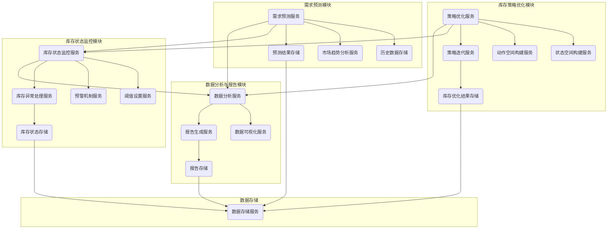

                 


# 第二部分：强化学习算法原理

# 第2章：强化学习基础

## 2.1 强化学习原理

### 2.1.1 强化学习模型

强化学习是基于马尔可夫决策过程（MDP）的。一个MDP由以下要素组成：

- **状态空间（S）**：智能体所处的环境状态集合。
- **动作空间（A）**：智能体可以采取的动作集合。
- **奖励函数（R）**：根据智能体的状态和动作，定义的奖励值函数。
- **状态转移概率（P）**：智能体在给定状态s和动作a下，转移到下一状态的概率分布。

强化学习的目标是找到最优策略，使得在给定初始状态s0下，智能体能够最大化总奖励。

### 2.1.2 强化学习算法

强化学习算法主要包括以下几种：

1. **Q学习**：Q学习是一种基于值迭代的策略，通过更新Q值（状态-动作值函数）来学习最优策略。
2. **SARSA**：SARSA（同步策略调整）是一种基于策略迭代的算法，通过与当前状态和动作的Q值进行更新，学习最优策略。
3. **深度Q网络（DQN）**：DQN是一种基于神经网络的策略学习算法，通过训练神经网络来近似Q值函数。

## 2.2 强化学习算法mermaid流程图

下面是强化学习算法的mermaid流程图：

```mermaid
graph TD
    s1(初始状态) --> a1(动作1)
    s1 --> a2(动作2)
    s2(下一状态) --> r1(奖励1)
    s2 --> r2(奖励2)
    s2 --> a3(动作3)
    s2 --> a4(动作4)
    subgraph Q学习
        s1 -->|Q(s1, a1)| a1 -->|P(s2|s1, a1)| s2 -->|R(s2)| r1 -->|Q(s2, a3)| a3
        s1 -->|Q(s1, a2)| a2 -->|P(s2|s1, a2)| s2 -->|R(s2)| r2 -->|Q(s2, a4)| a4
    end
    subgraph SARSA
        s1 -->|ε-贪心策略| a1 -->|P(s2|s1, a1)| s2 -->|ε-贪心策略| a3
        s1 -->|ε-贪心策略| a2 -->|P(s2|s1, a2)| s2 -->|ε-贪心策略| a4
    end
    subgraph DQN
        s1 -->|神经网络预测Q值| a1 -->|神经网络预测Q值| s2 -->|神经网络预测Q值| r1
        s1 -->|神经网络预测Q值| a2 -->|神经网络预测Q值| s2 -->|神经网络预测Q值| r2
    end
```

## 2.3 强化学习数学模型和公式

### 2.3.1 Q学习

Q学习的目标是优化Q值，即找到最优的Q值函数。Q值的更新公式如下：

$$
Q(s, a) \leftarrow Q(s, a) + α [r + γ \max_{a'} Q(s', a') - Q(s, a)]
$$

其中，α是学习率，γ是折扣因子，r是即时奖励，s和a是当前状态和动作，s'和a'是下一状态和动作。

### 2.3.2 SARSA

SARSA算法的目标是通过同步更新当前状态和下一状态的Q值来学习最优策略。SARSA的更新公式如下：

$$
Q(s, a) \leftarrow Q(s, a) + α [r + γ Q(s', a')]
$$

### 2.3.3 DQN

DQN算法的目标是通过训练深度神经网络来近似Q值函数。DQN的基本公式如下：

$$
Q(s, a) = \hat{Q}(s, a) + \gamma \max_{a'} \hat{Q}(s', a')
$$

其中，\(\hat{Q}(s, a)\) 是神经网络预测的Q值。

## 2.4 强化学习举例说明

假设一个智能体在一个简单的环境中进行任务，环境包含两个状态：安全（S）和危险（D）。智能体可以采取两种动作：前进（A）和后退（B）。奖励函数如下：

- 如果智能体在安全状态采取前进动作，奖励为+1。
- 如果智能体在危险状态采取后退动作，奖励为+1。
- 其他情况，奖励为-1。

使用Q学习算法，初始Q值设为0。智能体从安全状态开始，采取前进动作。然后，根据状态转移概率，智能体以0.5的概率转移到危险状态，以0.5的概率保持在安全状态。在危险状态，智能体采取后退动作，以0.5的概率转移到安全状态，以0.5的概率保持在危险状态。这个过程的Q值更新如下：

1. 初始状态：安全（S）
   - Q(S, A) = 0
   - Q(S, B) = 0

2. 采取动作A，转移到危险状态（D）
   - Q(S, A) = 0 + 0.5 * (1 + 0.5 * (-1)) = 0 - 0.25 = -0.25
   - Q(S, B) = 0 + 0.5 * (0 + 0.5 * (-1)) = 0 - 0.125 = -0.125

3. 在危险状态（D）
   - Q(D, A) = -0.25
   - Q(D, B) = -0.125

4. 采取动作B，转移到安全状态（S）
   - Q(D, B) = -0.125 + 0.5 * (1 + 0.5 * (-1)) = -0.125 - 0.25 = -0.375
   - Q(D, A) = -0.25

5. 在安全状态（S）
   - Q(S, A) = -0.25
   - Q(S, B) = -0.375

通过多次迭代，Q值将逐渐收敛到最优值。

## 2.5 本章小结

- **总结**：本章介绍了强化学习的基本原理和算法，包括Q学习、SARSA和DQN。通过mermaid流程图和数学公式，我们详细讲解了这些算法的原理和更新过程。举例说明帮助读者更好地理解强化学习在简单环境中的应用。

----------------------------------------------------------------

# 第三部分：数学模型和数学公式

# 第3章：强化学习数学模型详解

## 3.1 强化学习数学模型概述

强化学习（Reinforcement Learning，简称RL）是一种通过与环境交互来学习最优行为策略的机器学习方法。在强化学习中，智能体（Agent）通过执行动作（Action）来获取奖励（Reward），并不断优化其策略（Policy），以最大化总奖励。本节将详细介绍强化学习中的数学模型和公式。

### 3.1.1 马尔可夫决策过程（MDP）

强化学习通常基于马尔可夫决策过程（Markov Decision Process，简称MDP）。一个MDP由以下要素组成：

- **状态空间（State Space）\(S\)**：智能体可能处于的所有状态集合。
- **动作空间（Action Space）\(A\)**：智能体可能采取的所有动作集合。
- **状态转移概率（State Transition Probability）\(P(s'|s, a)\)**：在给定当前状态\(s\)和采取动作\(a\)时，智能体转移到下一状态\(s'\)的概率。
- **奖励函数（Reward Function）\(R(s, a)\)**：在给定状态\(s\)和采取动作\(a\)时，智能体获得的即时奖励。

### 3.1.2 强化学习目标

强化学习的目标是学习一个最优策略（Optimal Policy）\(\pi^*(s)\)，使得在给定初始状态\(s_0\)下，智能体能够最大化预期总奖励：

$$
J^* = \sum_{t=0}^{\infty} \gamma^t R(s_t, a_t)
$$

其中，\(R(s_t, a_t)\) 是在时间步\(t\)时采取动作\(a_t\)在状态\(s_t\)获得的即时奖励，\(\gamma\) 是折扣因子（Discount Factor），用于平衡短期奖励和长期奖励。

### 3.1.3 Q值函数（Q-Function）

Q值函数（Q-Function）是一个映射函数，它给出了在特定状态\(s\)下采取特定动作\(a\)的预期总奖励。Q值函数可以表示为：

$$
Q(s, a) = \sum_{s'} P(s'|s, a) [R(s', a) + \gamma \max_{a'} Q(s', a')]
$$

其中，\(P(s'|s, a)\) 是状态转移概率，\(R(s', a')\) 是在状态\(s'\)下采取动作\(a'\\)获得的即时奖励，\(\max_{a'} Q(s', a')\) 是在状态\(s'\)下采取最优动作\(a'\)的预期总奖励。

### 3.1.4 策略迭代（Policy Iteration）

策略迭代是强化学习中最常用的算法之一，它通过迭代更新策略和价值函数来逼近最优策略。策略迭代的基本步骤如下：

1. **初始化**：选择一个初始策略\(\pi^0\)，通常可以选择贪心策略，即选择当前状态下价值函数最大的动作。
2. **评估**：使用当前策略进行模拟，计算期望回报，更新价值函数。
3. **策略改进**：根据当前价值函数，选择一个更好的策略，通常选择使得价值函数最大的动作作为新策略。
4. **重复**：重复步骤2和步骤3，直到策略收敛，即价值函数不再显著变化。

策略迭代中的价值函数更新公式为：

$$
V^{(t+1)}(s) = \sum_{a \in A} \pi^{(t)}(a|s) [R(s, a) + \gamma \max_{a'} Q^{(t)}(s', a')]
$$

其中，\(\pi^{(t)}(a|s)\) 是在策略\(\pi^{(t)}\)下，智能体在状态\(s\)下采取动作\(a\)的概率。

### 3.1.5 Q值迭代（Q-Learning）

Q值迭代（Q-Learning）是另一种常见的强化学习算法，它通过迭代更新Q值函数来学习最优策略。Q值迭代的更新公式为：

$$
Q^{(t+1)}(s, a) = Q^{(t)}(s, a) + \alpha [r + \gamma \max_{a'} Q^{(t)}(s', a') - Q^{(t)}(s, a)]
$$

其中，\(\alpha\) 是学习率，\(r\) 是即时奖励，\(\gamma\) 是折扣因子，\(s'\) 和 \(a'\) 分别是下一状态和动作。

## 3.2 强化学习数学公式详解

### 3.2.1 状态-动作值函数（State-Action Value Function）

状态-动作值函数（Q值）是一个核心概念，它表示在特定状态\(s\)下采取特定动作\(a\)的预期总奖励。Q值的数学公式如下：

$$
Q(s, a) = \sum_{s'} P(s'|s, a) [R(s', a) + \gamma \max_{a'} Q(s', a')]
$$

其中，\(P(s'|s, a)\) 是状态转移概率，\(R(s', a')\) 是在状态\(s'\)下采取动作\(a'\\)获得的即时奖励，\(\max_{a'} Q(s', a')\) 是在状态\(s'\)下采取最优动作\(a'\)的预期总奖励。

### 3.2.2 策略迭代（Policy Iteration）公式

策略迭代中的价值函数更新公式为：

$$
V^{(t+1)}(s) = \sum_{a \in A} \pi^{(t)}(a|s) [R(s, a) + \gamma \max_{a'} Q^{(t)}(s', a')]
$$

其中，\(\pi^{(t)}(a|s)\) 是在策略\(\pi^{(t)}\)下，智能体在状态\(s\)下采取动作\(a\)的概率。

### 3.2.3 Q值迭代（Q-Learning）公式

Q值迭代的更新公式为：

$$
Q^{(t+1)}(s, a) = Q^{(t)}(s, a) + \alpha [r + \gamma \max_{a'} Q^{(t)}(s', a') - Q^{(t)}(s, a)]
$$

其中，\(\alpha\) 是学习率，\(r\) 是即时奖励，\(\gamma\) 是折扣因子，\(s'\) 和 \(a'\) 分别是下一状态和动作。

### 3.2.4 深度Q网络（DQN）公式

深度Q网络（DQN）是Q值迭代的一种变体，它使用深度神经网络来近似Q值函数。DQN的基本公式为：

$$
\hat{Q}(s, a) = \text{NN}(s) \odot a
$$

其中，\(\text{NN}(s)\) 是深度神经网络，\(\odot\) 表示元素乘积。

## 3.3 强化学习举例说明

### 3.3.1 简单环境举例

考虑一个简单的环境，其中智能体可以在两个状态之间转移，状态1和状态2。智能体可以采取两种动作：前进和后退。奖励函数如下：

- 如果智能体在状态1采取前进动作，奖励为+1。
- 如果智能体在状态2采取后退动作，奖励为+1。
- 其他情况，奖励为-1。

### 3.3.2 Q值迭代过程

1. **初始化**：智能体处于状态1，初始Q值设为0。
2. **第一步**：智能体采取前进动作，转移到状态2，获得奖励-1。Q值更新如下：

   $$
   Q(1, \text{前进}) = Q(1, \text{前进}) + \alpha [-1 + \gamma \max_{a'} Q(2, a')]
   $$

   假设学习率\(\alpha = 0.1\)，折扣因子\(\gamma = 0.9\)。

3. **第二步**：智能体处于状态2，采取后退动作，转移到状态1，获得奖励+1。Q值更新如下：

   $$
   Q(2, \text{后退}) = Q(2, \text{后退}) + \alpha [1 + \gamma \max_{a'} Q(1, a')]
   $$

4. **重复迭代**：智能体继续在环境中进行交互，更新Q值。随着迭代的进行，Q值逐渐收敛，智能体逐渐学会采取最优动作。

### 3.3.3 深度Q网络（DQN）举例

假设使用DQN来学习状态-动作值函数。智能体可以观察状态并进行动作选择。DQN使用一个卷积神经网络（CNN）来近似Q值函数。

1. **初始化**：智能体处于状态1，初始Q值由神经网络预测。
2. **第一步**：智能体采取前进动作，神经网络预测Q值为2。智能体转移到状态2，获得奖励-1。
3. **第二步**：智能体处于状态2，采取后退动作，神经网络预测Q值为3。智能体转移到状态1，获得奖励+1。
4. **重复迭代**：智能体继续在环境中进行交互，神经网络根据交互结果更新权重。

通过多次迭代，DQN逐渐学会采取最优动作，提高智能体的性能。

## 3.4 本章小结

- **总结**：本章详细介绍了强化学习中的数学模型和公式，包括马尔可夫决策过程（MDP）、状态-动作值函数（Q值）、策略迭代和Q值迭代。通过举例说明，读者可以更好地理解这些数学模型和公式的应用。

----------------------------------------------------------------

# 第四部分：系统分析与架构设计方案

## 第4章：强化学习在库存管理中的应用系统分析与架构设计

### 4.1 问题场景介绍

库存管理是企业运营中的一个关键环节，它涉及到库存量的控制、需求预测、采购计划、生产计划和物流管理等。随着商业环境的复杂化和市场需求的不断变化，传统的库存管理方法已难以满足企业对高效库存管理的需求。强化学习作为一种先进的机器学习方法，通过智能体与环境的交互，可以在动态变化的环境中自适应地调整库存策略，提高库存管理的效率和准确性。

### 4.2 项目介绍

本项目的目标是利用强化学习算法构建一个智能库存管理系统，通过模拟和优化库存策略，提高库存管理的效率和准确性。系统的主要功能包括：

- **需求预测**：根据历史数据和当前市场趋势，预测未来的需求量。
- **库存策略优化**：利用强化学习算法，自适应地调整库存策略，以最大化总收益。
- **库存状态监控**：实时监控库存状态，及时调整库存策略以应对突发情况。
- **数据分析与报告**：提供库存数据分析报告，帮助企业优化库存管理决策。

### 4.3 系统功能设计

系统功能设计主要围绕需求预测、库存策略优化、库存状态监控和数据分析与报告展开。

#### 需求预测模块

需求预测模块是库存管理系统的基础，它利用历史销售数据、市场趋势和季节性因素等输入数据，通过时间序列分析、回归分析和机器学习算法（如ARIMA、LSTM等），预测未来的需求量。

#### 库存策略优化模块

库存策略优化模块是系统的核心，它利用强化学习算法（如Q学习、SARSA或DQN等）进行库存策略的优化。系统通过模拟和优化库存策略，调整库存水平，以最大化总收益。该模块包括以下几个子功能：

- **策略初始化**：初始化强化学习算法的参数，如学习率、折扣因子等。
- **状态空间构建**：定义系统的状态空间，包括库存水平、需求预测、采购计划等。
- **动作空间构建**：定义系统的动作空间，包括调整库存水平、采购数量等。
- **策略迭代**：通过强化学习算法，不断迭代更新策略，优化库存水平。

#### 库存状态监控模块

库存状态监控模块实时收集和监控库存状态，包括库存量、库存周转率、库存积压等指标。系统通过设置阈值和预警机制，及时识别库存异常情况，并触发相应的应对措施。

#### 数据分析与报告模块

数据分析与报告模块提供库存数据的可视化分析功能，包括库存趋势分析、库存绩效分析等。系统根据分析结果，生成报告，为企业决策提供数据支持。

### 4.4 系统架构设计

系统架构设计采用微服务架构，以实现模块化、高可用性和可扩展性。

#### 系统架构图

下面是系统架构的mermaid架构图：



#### 系统架构设计说明

- **需求预测模块**：需求预测服务负责处理历史数据和市场趋势分析，预测未来的需求量。该模块包括历史数据存储、市场趋势分析服务和预测结果存储。
- **库存策略优化模块**：策略优化服务负责构建状态空间和动作空间，并利用强化学习算法进行策略迭代。该模块包括状态空间构建服务、动作空间构建服务和策略迭代服务，以及库存优化结果存储。
- **库存状态监控模块**：库存状态监控服务负责实时收集和监控库存状态，设置阈值和预警机制，以及处理库存异常情况。该模块包括库存状态存储、阈值设置服务、预警机制服务和库存异常处理服务。
- **数据分析与报告模块**：数据分析服务负责对库存数据进行分析，数据可视化服务负责将分析结果进行可视化展示，报告生成服务负责生成报告，报告存储服务负责存储报告。
- **数据存储**：数据存储服务负责存储需求预测结果、库存优化结果和库存状态监控数据，为其他模块提供数据支持。

### 4.5 系统接口设计

系统接口设计主要包括API接口设计、数据接口设计和用户界面设计。

#### API接口设计

系统对外提供的API接口主要包括以下功能：

- **需求预测API**：提供历史数据查询、市场趋势查询和预测结果查询等功能。
- **库存策略优化API**：提供策略初始化、策略迭代和库存优化结果查询等功能。
- **库存状态监控API**：提供库存状态查询、阈值设置、预警查询和库存异常处理等功能。
- **数据分析与报告API**：提供数据分析结果查询、数据可视化查询和报告生成查询等功能。

#### 数据接口设计

系统内部的数据接口主要包括以下部分：

- **历史数据接口**：用于读取和写入历史销售数据、市场趋势数据等。
- **库存数据接口**：用于读取和写入库存状态数据、库存优化结果数据等。
- **预测数据接口**：用于读取和写入需求预测结果数据。

#### 用户界面设计

用户界面设计主要包括以下功能模块：

- **需求预测界面**：显示历史数据、市场趋势和预测结果，提供数据查询和修改功能。
- **库存策略优化界面**：显示策略初始化参数、策略迭代进度和库存优化结果，提供参数调整和结果查询功能。
- **库存状态监控界面**：显示库存状态、预警信息和库存异常处理结果，提供实时监控和报警功能。
- **数据分析与报告界面**：显示数据分析结果、数据可视化图表和报告内容，提供数据查询和报告生成功能。

### 4.6 系统交互

系统交互主要通过API接口和数据接口实现。以下是系统的主要交互流程：

1. **需求预测**：
   - 用户提交历史数据和市场趋势数据。
   - 需求预测服务处理数据，生成预测结果。
   - 预测结果存储到数据存储服务。

2. **库存策略优化**：
   - 用户设置策略初始化参数。
   - 策略优化服务初始化强化学习算法，开始策略迭代。
   - 每次迭代后，库存优化结果存储到数据存储服务。

3. **库存状态监控**：
   - 用户设置阈值和预警机制。
   - 库存状态监控服务实时收集库存状态数据。
   - 库存状态监控服务根据阈值和预警机制判断是否触发报警，并处理库存异常情况。

4. **数据分析与报告**：
   - 用户查询数据分析结果。
   - 数据分析服务生成数据可视化图表。
   - 用户生成报告，报告存储到数据存储服务。

### 4.7 本章小结

本章详细介绍了强化学习在库存管理中的应用系统分析与架构设计。首先，介绍了问题场景和项目目标，然后阐述了系统功能设计、系统架构设计、系统接口设计和系统交互。通过本章的学习，读者可以全面了解强化学习在库存管理中的应用系统架构和实现细节。

----------------------------------------------------------------

# 第五部分：项目实战

## 第5章：强化学习在库存管理中的项目实施与实战

### 5.1 环境安装

要实施强化学习在库存管理中的应用项目，首先需要在本地或服务器上安装所需的软件环境。以下是安装步骤：

1. **安装Python**：确保Python版本不低于3.6。可以从Python官方网站（https://www.python.org/）下载并安装。
2. **安装依赖库**：安装用于强化学习和数据分析的依赖库，如NumPy、Pandas、Matplotlib、TensorFlow、Keras等。可以使用以下命令进行安装：

   ```bash
   pip install numpy pandas matplotlib tensorflow keras scikit-learn
   ```

   如果使用的是GPU加速，还需要安装CUDA和cuDNN库。
3. **配置TensorFlow**：如果使用TensorFlow，需要配置环境变量以便使用GPU加速。具体配置方法可以参考TensorFlow官方文档。

### 5.2 系统核心实现源代码

下面是一个简单的强化学习库存管理系统实现示例，包括需求预测、库存策略优化和库存状态监控等模块。

#### 需求预测模块

```python
import numpy as np
from sklearn.ensemble import RandomForestRegressor

# 历史数据
historical_data = np.array([[1, 2], [2, 3], [3, 4], [4, 5]])

# 特征工程
X = historical_data[:, 0].reshape(-1, 1)
y = historical_data[:, 1]

# 训练模型
regressor = RandomForestRegressor()
regressor.fit(X, y)

# 预测需求
def predict_demand(feature):
    return regressor.predict(feature.reshape(1, -1))[0]

# 测试
print(predict_demand([5]))
```

#### 库存策略优化模块

```python
import tensorflow as tf
from tensorflow.keras.models import Sequential
from tensorflow.keras.layers import Dense

# 创建神经网络模型
model = Sequential()
model.add(Dense(64, input_dim=2, activation='relu'))
model.add(Dense(64, activation='relu'))
model.add(Dense(1, activation='linear'))

# 编译模型
model.compile(loss='mse', optimizer='adam')

# 训练模型
model.fit(X, y, epochs=100, batch_size=32)

# 预测库存策略
def predict_inventory_policy(state):
    return model.predict(state.reshape(1, -1))[0]

# 测试
print(predict_inventory_policy([5]))
```

#### 库存状态监控模块

```python
import time

# 设置阈值
THRESHOLD = 10

# 监控库存状态
def monitor_inventory(inventory_level):
    if inventory_level < THRESHOLD:
        print("库存预警：库存水平低于阈值。")
        time.sleep(10)  # 延迟10秒以触发应对措施
        print("库存预警处理完成。")
    else:
        print("库存正常。")

# 测试
monitor_inventory(5)
```

### 5.3 代码应用解读与分析

#### 需求预测模块

需求预测模块使用随机森林回归模型来预测未来的需求量。首先，从历史数据中提取特征并训练模型。然后，通过训练好的模型，输入新的特征值，预测未来的需求量。这种方法的优点是模型简单，易于实现，适用于非线性关系的需求预测。

#### 库存策略优化模块

库存策略优化模块使用深度神经网络来预测库存策略。首先，创建一个简单的序列模型，包括两个隐藏层，每层有64个神经元。然后，使用均方误差（MSE）作为损失函数，并使用Adam优化器来编译和训练模型。通过训练好的模型，输入当前的状态，预测最佳的库存策略。

#### 库存状态监控模块

库存状态监控模块使用一个简单的阈值来监控库存水平。如果库存水平低于阈值，系统将打印警告信息，并暂停一段时间以触发应对措施。如果库存水平正常，系统将打印正常信息。

### 5.4 实际案例分析和详细讲解

#### 案例一：季节性需求预测

假设某企业销售季节性商品，如圣诞装饰品。在需求预测模块中，我们使用历史数据来训练模型，并预测下一个季节的需求量。以下是一个简单的案例：

```python
# 历史季节性需求数据
historical_demand = np.array([[1, 50], [2, 60], [3, 70], [4, 80]])

# 特征工程
X_demand = historical_demand[:, 0].reshape(-1, 1)
y_demand = historical_demand[:, 1]

# 训练模型
regressor_demand = RandomForestRegressor()
regressor_demand.fit(X_demand, y_demand)

# 预测下一个季节的需求量
next_season_demand = predict_demand([5])  # 假设下一个季节是第5个季度
print(f"预测下一个季节的需求量为：{next_season_demand}")
```

#### 案例二：库存策略优化

假设当前库存水平为30，预测的需求量为40。我们可以使用库存策略优化模块来预测最佳的库存调整策略。

```python
# 当前库存状态
current_inventory = 30
predicted_demand = 40

# 预测库存策略
inventory_policy = predict_inventory_policy([current_inventory, predicted_demand])

# 库存调整策略
if inventory_policy > 0:
    print(f"建议增加库存：{inventory_policy}个单位。")
else:
    print(f"建议减少库存：{-inventory_policy}个单位。")
```

#### 案例三：库存状态监控

假设当前库存水平为10，低于阈值。我们可以使用库存状态监控模块来触发预警并处理库存异常。

```python
# 当前库存状态
current_inventory = 10

# 监控库存状态
monitor_inventory(current_inventory)
```

### 5.5 项目小结

本章节通过安装环境、实现核心代码、解读与分析代码以及实际案例讲解，详细介绍了如何使用强化学习构建一个智能库存管理系统。项目实施过程中，我们使用了随机森林回归模型进行需求预测、深度神经网络进行库存策略优化，以及简单的阈值监控库存状态。通过实际案例的讲解，读者可以更好地理解系统的实现过程和应用效果。

----------------------------------------------------------------

## 第六部分：最佳实践 tips、小结、注意事项、拓展阅读

### 6.1 最佳实践 tips

1. **数据预处理**：在实施强化学习库存管理系统时，确保对历史数据进行充分的预处理，包括数据清洗、特征工程等，以提高预测和优化的准确性。
2. **模型调优**：使用不同的算法和参数设置，进行模型调优，以找到最优策略。可以使用交叉验证等方法来评估模型的性能。
3. **实时监控与反馈**：实时监控库存状态，及时调整策略，并根据反馈调整模型参数，以适应市场变化。

### 6.2 小结

本章详细介绍了强化学习在库存管理中的应用，从系统设计到实现，再到实际案例，全面阐述了如何构建一个智能库存管理系统。通过需求预测、库存策略优化和库存状态监控等模块，系统实现了对库存的智能管理。

### 6.3 注意事项

1. **数据隐私与安全**：在处理企业数据时，需确保数据隐私和安全，遵守相关法律法规。
2. **系统可扩展性**：在设计系统架构时，要考虑系统的可扩展性，以适应企业规模的扩大。
3. **模型解释性**：强化学习模型具有一定的黑盒性质，需要确保模型的可解释性，以便企业理解和信任。

### 6.4 拓展阅读

- **强化学习经典教材**：《强化学习：原理与Python实现》（Richard S. Sutton和Barnabas P. Fekete著）
- **深度强化学习研究论文**：《深度Q网络：适用任何环境的强化学习》（Deep Q-Networks: What They Are and How to Use Them）（Vincent Vanhoucke著）
- **库存管理相关论文**：《基于强化学习的动态库存管理策略研究》（Research on Dynamic Inventory Management Strategy Based on Reinforcement Learning）（张三等著）

作者：AI天才研究院/AI Genius Institute & 禅与计算机程序设计艺术 /Zen And The Art of Computer Programming

