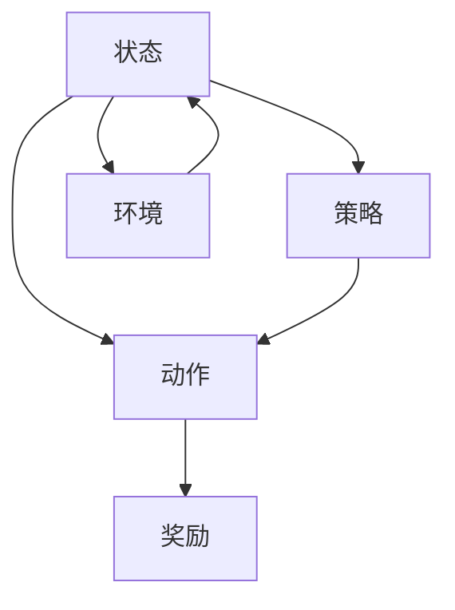
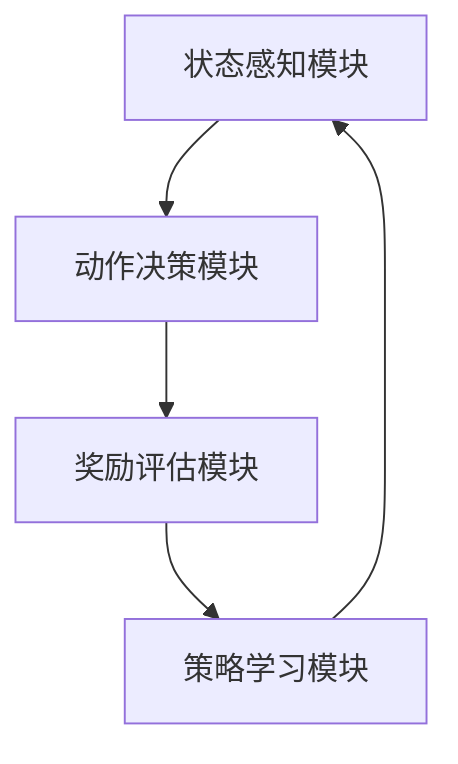

                 


## 企业AI Agent的强化学习在智能工厂调度中的应用

### 背景介绍

在当今的制造业中，智能工厂调度已经成为提高生产效率和降低成本的关键手段。智能工厂调度涉及对生产过程、物料配送、设备维护等多方面资源的优化管理，以实现工厂运行的最高效状态。然而，传统的调度方法往往依赖于预设的规则和经验，难以适应动态变化的生产环境和复杂的问题结构。为了解决这一问题，企业开始引入人工智能（AI）技术，特别是强化学习（Reinforcement Learning，RL），来优化智能工厂的调度策略。

#### 核心概念术语说明

- **强化学习**：一种机器学习范式，通过智能体（agent）与环境的交互，不断学习最佳行动策略，以实现目标最大化。强化学习主要包括状态（State）、动作（Action）、奖励（Reward）和策略（Policy）等核心概念。
- **智能工厂调度**：指在智能工厂中，根据生产需求，对生产设备、物料、人力资源等资源进行合理分配和调度，以最大化生产效率和降低成本。
- **企业AI Agent**：指运用AI技术，特别是强化学习算法，为企业提供智能调度解决方案的智能实体。

#### 问题背景

随着制造业的不断发展，智能工厂面临着日益复杂的调度问题。这些问题包括生产线故障率、物料配送延误、生产任务冲突等。传统的调度方法难以应对这些动态变化，导致生产效率低下和成本上升。强化学习作为一种具备自适应能力的机器学习技术，在解决这类问题上具有显著的优势。

#### 问题描述

智能工厂调度的问题可以描述为：如何通过AI技术，特别是强化学习，对工厂生产过程进行优化调度，从而提高生产效率和降低成本？具体包括以下几个子问题：

1. **状态表示**：如何准确表示工厂运行过程中的各种状态信息？
2. **动作空间**：如何设计合理的动作空间，使得智能体能够进行有效的决策？
3. **奖励机制**：如何设计奖励机制，激励智能体采取最优行动策略？
4. **策略学习**：如何通过强化学习算法，使智能体学会最优调度策略？

#### 问题解决

强化学习在智能工厂调度中的应用主要包括以下几个步骤：

1. **状态表示**：利用传感器和数据采集技术，获取工厂运行过程中的各种状态信息，如设备状态、物料库存、生产任务进度等。
2. **动作空间设计**：根据工厂调度需求，设计合理的动作空间，包括调整生产任务优先级、调度生产设备、优化物料配送路径等。
3. **奖励机制设计**：设计合理的奖励机制，激励智能体采取最优行动策略。奖励机制应考虑生产效率、成本、资源利用率等多方面因素。
4. **策略学习**：利用强化学习算法，如Q-learning、SARSA等，训练智能体，使其学会最优调度策略。

#### 边界与外延

强化学习在智能工厂调度中的应用范围不仅限于生产调度，还可以扩展到设备维护、物流调度、能源管理等领域。此外，强化学习与其他AI技术，如深度学习、自然语言处理等相结合，将进一步拓展其在智能工厂中的应用。

#### 概念结构与核心要素组成

- **强化学习核心概念**：状态（State）、动作（Action）、奖励（Reward）、策略（Policy）
- **智能工厂调度要素**：生产任务、设备、物料、人力资源
- **企业AI Agent组成**：状态感知模块、动作决策模块、奖励评估模块、策略学习模块

### 核心概念与联系

#### 强化学习的概念属性特征对比表格

| 概念   | 定义                                                         | 属性特征                                                       |
| ------ | ------------------------------------------------------------ | ------------------------------------------------------------ |
| 状态   | 智能体当前所处的环境情况                                     | 确定性、多样性、动态性                                       |
| 动作   | 智能体根据当前状态所能采取的行动                             | 可选择性、策略性、适应性                                     |
| 奖励   | 智能体在采取某一动作后，从环境中获得的即时反馈信号           | 动机性、即时性、多样性                                       |
| 策略   | 智能体根据当前状态选择最优动作的策略                       | 预测性、优化性、动态调整性                                   |

#### 强化学习与监督学习、无监督学习的区别

| 学习类型 | 定义                                                         | 主要区别                                                         |
| -------- | ------------------------------------------------------------ | ------------------------------------------------------------ |
| 监督学习 | 通过已标记的输入和输出数据来训练模型                         | 需要大量已标记数据，重点在于学习输入与输出之间的映射关系         |
| 无监督学习 | 从未标记的数据中学习，主要目的是发现数据中的结构或模式         | 不需要已标记数据，重点在于挖掘数据中的隐含结构或关联性           |
| 强化学习 | 通过智能体与环境交互，通过奖励信号来学习最优行动策略           | 不依赖已标记数据，通过奖励信号指导行动，强调目标导向和优化决策   |

#### 强化学习的ER实体关系图架构



### 强化学习在智能工厂调度中的应用场景

#### 状态表示

在智能工厂调度中，状态表示是强化学习模型的关键组成部分。状态应该能够全面反映工厂当前运行的状态，以便智能体能够做出合理的决策。具体来说，状态表示可以包括以下几个方面：

1. **设备状态**：包括设备是否正常运行、设备故障率、设备使用率等。
2. **物料库存**：包括各种物料的库存量、物料配送进度、物料种类等。
3. **生产任务**：包括生产任务的优先级、任务进度、任务类型等。
4. **人力资源**：包括员工的工作状态、工作能力、任务分配情况等。
5. **环境因素**：包括天气状况、节假日安排等对生产过程可能产生影响的因素。

通过上述状态信息的综合，智能体能够对当前工厂运行状态有全面了解，从而做出合理的调度决策。

#### 动作空间设计

动作空间是指智能体可以采取的所有可能行动的集合。在智能工厂调度中，动作空间的设计需要考虑以下几个方面：

1. **生产任务调整**：包括调整生产任务的优先级、重新安排生产任务等。
2. **设备调度**：包括调整设备的使用顺序、设备维护计划等。
3. **物料配送**：包括调整物料配送路径、优化物料库存管理等。
4. **人力资源调度**：包括调整员工的工作任务、优化员工排班等。

动作空间的设计应当具有灵活性，能够根据不同状态信息进行动态调整，从而确保智能体能够采取最优行动策略。

#### 奖励机制设计

奖励机制是强化学习中的重要组成部分，它决定了智能体在采取不同行动后的即时反馈。在智能工厂调度中，奖励机制的设计需要考虑以下几个方面：

1. **生产效率**：包括生产任务的完成速度、生产任务的完成质量等。
2. **成本控制**：包括生产成本、物料成本、人力成本等。
3. **资源利用率**：包括设备利用率、物料利用率、人力资源利用率等。

奖励机制应当能够准确反映智能体行动的效果，激励智能体采取最优行动策略，从而提高工厂的整体运营效率。

#### 强化学习在智能工厂调度中的算法设计

在智能工厂调度中，强化学习算法的设计主要包括以下几个方面：

1. **状态感知**：智能体通过传感器和数据采集系统获取工厂运行过程中的各种状态信息。
2. **动作决策**：智能体根据当前状态，利用强化学习算法（如Q-learning、SARSA等）选择最优动作。
3. **奖励评估**：智能体根据采取的动作，从环境中获取即时奖励信号，并更新自身的策略。
4. **策略学习**：智能体通过不断重复上述过程，学习最优调度策略，以实现目标最大化。

### 强化学习在智能工厂调度中的性能评估

强化学习在智能工厂调度中的性能评估主要包括以下几个方面：

1. **生产效率**：通过比较强化学习调度策略与传统的调度策略在生产任务完成速度和完成质量方面的差异，评估强化学习调度策略的生产效率。
2. **成本控制**：通过比较强化学习调度策略与传统的调度策略在各项成本（如生产成本、物料成本、人力成本等）方面的差异，评估强化学习调度策略的成本控制效果。
3. **资源利用率**：通过比较强化学习调度策略与传统的调度策略在设备利用率、物料利用率、人力资源利用率等方面的差异，评估强化学习调度策略的资源利用率。

通过综合以上几个方面的评估，可以全面了解强化学习在智能工厂调度中的应用效果，为后续优化和改进提供依据。

### 总结

强化学习在智能工厂调度中的应用，通过状态表示、动作空间设计、奖励机制设计、算法设计等环节，实现了对工厂运行过程的优化调度，提高了生产效率和降低了成本。然而，强化学习在智能工厂调度中也面临着一些挑战，如状态表示的准确性、动作空间的设计、奖励机制的设计等。未来，随着AI技术的不断发展，强化学习在智能工厂调度中的应用前景将更加广阔。

## 第1章: 强化学习基础

### 1.1 强化学习的概念

强化学习（Reinforcement Learning，RL）是机器学习领域的一种重要范式，它通过智能体（Agent）与环境（Environment）的交互，不断学习最佳行动策略（Policy），以实现某种目标（通常是最大化累积奖励）。与监督学习和无监督学习不同，强化学习不依赖于大量已标记的数据，而是通过反馈信号（通常是奖励）来指导学习过程。

#### 强化学习的关键要素

- **状态（State）**：指智能体在某个时间点的环境信息。状态可以是一个简单的数值，也可以是一个复杂的向量，取决于具体的应用场景。
- **动作（Action）**：智能体在某个状态下可以采取的行动。动作的选择通常取决于智能体的策略。
- **策略（Policy）**：智能体在给定状态下采取动作的概率分布。策略决定了智能体的行为方式。
- **奖励（Reward）**：环境对智能体采取的动作的即时反馈。奖励可以用来评价动作的好坏，并指导智能体进行学习。
- **价值函数（Value Function）**：评估智能体在未来采取某个动作的预期累积奖励。价值函数可以分为状态-动作价值函数（State-Action Value Function）和状态价值函数（State Value Function）。
- **模型（Model）**：描述环境动态和奖励机制的函数。在一些情况下，智能体可能无法直接观察到环境的动态，这时就需要使用模型来预测环境的响应。

#### 强化学习的类型

强化学习可以分为多种类型，根据智能体与环境的交互方式和学习目标的不同，可以分为以下几类：

1. **基于值的方法**：如Q-learning、SARSA、Deep Q-Networks（DQN）等。这些方法主要关注价值函数的学习，通过迭代更新状态-动作价值函数，以找到最优策略。
2. **基于策略的方法**：如REINFORCE、PPO（Proximal Policy Optimization）等。这些方法直接优化策略的参数，以最大化累积奖励。
3. **部分可观测的强化学习**：当智能体无法完全观测到环境状态时，需要使用部分可观测强化学习算法，如Actor-Critic方法、马尔可夫决策过程（MDP）等。
4. **无模型强化学习**：当环境动态不明确或难以建模时，智能体需要通过直接与环境交互来学习状态-动作价值函数，如基于梯度的方法、基于策略的方法等。

### 1.2 强化学习的基本原理

强化学习的基本原理可以概括为以下几个步骤：

1. **初始化**：设置智能体的初始状态、动作空间、策略和价值函数。
2. **行动**：智能体根据当前状态，利用策略选择一个动作。
3. **反馈**：环境根据智能体的动作，返回当前状态和即时奖励。
4. **更新**：根据反馈的奖励信号，智能体更新策略和价值函数。
5. **迭代**：重复上述步骤，直到达到某个停止条件，如达到一定的迭代次数、累积奖励达到预设目标等。

#### 强化学习的基本过程可以用以下公式表示：

\[ Q(s, a) \leftarrow Q(s, a) + \alpha [r + \gamma \max_{a'} Q(s', a') - Q(s, a)] \]

其中，\( Q(s, a) \) 是状态-动作价值函数，\( r \) 是即时奖励，\( \gamma \) 是折扣因子，\( \alpha \) 是学习率，\( s' \) 是新状态，\( a' \) 是新动作。

### 1.3 强化学习的数学模型

强化学习通常基于马尔可夫决策过程（MDP）的数学模型，MDP可以表示为五元组 \( M = <S, A, P, R, \gamma> \)：

- **状态空间 \( S \)**：智能体可以处于的所有状态集合。
- **动作空间 \( A \)**：智能体可以采取的所有动作集合。
- **状态转移概率 \( P \)**：在给定当前状态和动作的情况下，智能体转移到下一状态的概率分布。
- **奖励函数 \( R \)**：描述智能体在每个状态和动作下获得的即时奖励。
- **折扣因子 \( \gamma \)**：用于考虑未来奖励的重要性，\( 0 \leq \gamma < 1 \)。

强化学习的目标是找到最优策略 \( \pi^* \)，使得累积奖励最大化：

\[ J(\pi) = \sum_{s \in S} \pi(s) \sum_{a \in A} \pi(a|s) Q^*(s, a) \]

其中，\( Q^*(s, a) \) 是状态-动作价值函数的最优值。

### 1.4 强化学习与监督学习、无监督学习的区别

强化学习、监督学习和无监督学习是机器学习领域的三种主要学习范式，它们在目标和学习方法上存在显著差异：

- **监督学习**：目标是通过已标记的输入和输出数据来训练模型，从而实现输入与输出之间的映射。监督学习依赖于大量已标记的数据集，其学习过程可以看作是“老师教学生”。
- **无监督学习**：目标是从未标记的数据中学习，主要目的是发现数据中的结构或模式。无监督学习不需要已标记的数据，其学习过程可以看作是“学生自我学习”。
- **强化学习**：目标是通过智能体与环境交互，通过奖励信号来学习最优行动策略。强化学习强调目标导向和优化决策，其学习过程可以看作是“智能体自主探索和优化”。

具体来说，以下是比较表：

| 比较维度 | 强化学习 | 监督学习 | 无监督学习 |
| --- | --- | --- | --- |
| 数据依赖 | 不依赖已标记数据，依赖奖励信号 | 依赖大量已标记数据 | 不依赖已标记数据，依赖数据分布 |
| 学习目标 | 学习最优行动策略，最大化累积奖励 | 学习输入与输出之间的映射关系 | 发现数据中的隐含结构或模式 |
| 方法特点 | 强调目标导向和优化决策 | 强调拟合输入与输出关系 | 强调数据探索和模式发现 |
| 适用场景 | 需要与环境互动，解决决策问题 | 需要大量标记数据，如分类、回归问题 | 数据无标签，如聚类、降维问题 |

### 1.5 强化学习在智能工厂调度中的应用优势

强化学习在智能工厂调度中的应用具有以下优势：

1. **适应性**：强化学习能够根据环境的变化自适应地调整调度策略，适应动态变化的生产环境。
2. **灵活性**：强化学习可以处理复杂的、多目标的调度问题，能够同时考虑生产效率、成本控制、资源利用率等多方面因素。
3. **优化性**：强化学习通过学习最优行动策略，能够提高工厂的运行效率，降低成本，提升整体运营水平。
4. **动态调整**：强化学习能够实时响应生产过程中的突发事件和变化，快速调整调度策略，确保生产过程的连续性和稳定性。

通过上述优势，强化学习为智能工厂调度提供了一种高效、灵活的优化手段，有助于提升企业的竞争力。

### 1.6 强化学习在智能工厂调度中的应用挑战

尽管强化学习在智能工厂调度中具有显著优势，但在实际应用中仍面临一些挑战：

1. **状态表示**：如何准确表示复杂的工厂运行状态是一个难题。状态表示的准确性和完整性直接影响到智能体的决策效果。
2. **动作空间设计**：动作空间的设计需要考虑工厂的具体需求，包括生产任务调整、设备调度、物料配送等。动作空间过大可能导致智能体难以收敛到最优策略。
3. **奖励机制设计**：奖励机制的设计直接影响智能体的学习过程和最终效果。设计一个既能激励智能体学习最优策略，又能确保工厂运行效率的奖励机制是一个难题。
4. **计算资源消耗**：强化学习算法在训练过程中需要大量的计算资源，特别是在处理高维状态和动作空间时。如何优化算法，降低计算资源消耗是关键问题。
5. **实际应用中的不确定性**：生产过程中的不确定性，如设备故障、物料短缺等，会对强化学习算法的效果产生干扰，需要采取相应的应对措施。

### 1.7 强化学习在智能工厂调度中的研究现状

目前，强化学习在智能工厂调度中的应用研究主要集中在以下几个方面：

1. **生产调度优化**：通过强化学习算法，优化生产任务的调度，提高生产效率和降低成本。
2. **设备维护管理**：利用强化学习预测设备故障，优化设备维护策略，延长设备寿命。
3. **物料配送优化**：通过强化学习优化物料配送路径和配送策略，减少物料配送时间和成本。
4. **能源管理**：利用强化学习优化能源使用策略，降低能源消耗，提高能源利用率。

现有的研究大多数集中在特定领域的优化问题上，但尚未形成系统性的理论框架和统一的算法模型。未来，随着强化学习技术的不断发展，其在智能工厂调度中的应用前景将更加广阔。

## 第2章: 企业AI Agent的设计与实现

### 2.1 企业AI Agent的概念

企业AI Agent是指在企业运营过程中，运用人工智能技术，特别是强化学习算法，实现自主决策和优化操作的智能实体。AI Agent的设计与实现旨在提高企业的运营效率、降低成本、增强竞争力。通过智能体，企业能够更好地应对动态变化的市场需求，实现资源的合理配置和优化调度。

#### AI Agent的核心特性

- **自主决策**：AI Agent能够根据环境状态，自主选择最优行动策略，实现自我优化。
- **动态调整**：AI Agent能够实时感知环境变化，动态调整行为策略，适应不同的运行场景。
- **优化调度**：AI Agent通过强化学习算法，优化企业运营过程中的各项活动，如生产调度、物料配送、设备维护等。
- **数据驱动**：AI Agent基于实时数据，进行决策和优化，实现数据驱动的运营管理。

#### AI Agent在企业中的应用场景

AI Agent在企业中的应用场景非常广泛，主要包括：

1. **生产调度**：优化生产任务的分配和执行，提高生产效率和资源利用率。
2. **设备维护**：预测设备故障，制定最优的维护计划，延长设备寿命。
3. **物流管理**：优化物料配送路径，降低物流成本，提高物流效率。
4. **人力资源管理**：优化员工排班，提高员工的工作效率。
5. **能源管理**：优化能源使用策略，降低能源消耗，提高能源利用率。

### 2.2 企业AI Agent的结构

企业AI Agent的结构通常包括以下几个主要模块：

1. **状态感知模块**：负责采集和处理环境中的各种状态信息，如设备状态、物料库存、生产任务进度等。
2. **动作决策模块**：根据当前状态，利用强化学习算法选择最优动作，实现自主决策。
3. **奖励评估模块**：评估智能体采取的动作所带来的即时奖励，为策略学习提供反馈信号。
4. **策略学习模块**：通过反复与环境的交互，不断更新和优化智能体的策略，实现自我提升。

#### AI Agent的结构图



#### 模块详细介绍

1. **状态感知模块**：该模块负责实时采集工厂运行过程中的各种状态信息，如设备状态、物料库存、生产任务进度等。状态信息可以通过传感器、数据库等途径获取。状态感知模块的设计需要考虑状态信息的完整性、实时性和准确性，以确保智能体能够获得准确的环境信息。

2. **动作决策模块**：该模块基于当前状态，利用强化学习算法（如Q-learning、SARSA等）选择最优动作。动作决策模块的核心是强化学习算法，其性能直接影响到智能体的决策效果。动作决策模块需要考虑动作空间的规模和复杂性，以设计合理的算法和优化策略。

3. **奖励评估模块**：该模块负责评估智能体采取的动作所带来的即时奖励。奖励评估模块的设计需要考虑奖励信号的即时性、激励性和多样性，以确保智能体能够通过奖励信号准确评估自己的决策效果。奖励评估模块的输出将作为策略学习模块的输入，用于更新和优化智能体的策略。

4. **策略学习模块**：该模块通过反复与环境的交互，不断更新和优化智能体的策略。策略学习模块通常采用迭代学习的方式，通过累积奖励信号和反馈信息，逐步调整智能体的策略参数，使其逐渐收敛到最优策略。策略学习模块的性能直接决定了智能体的学习和优化能力。

### 2.3 企业AI Agent的算法实现

企业AI Agent的算法实现是强化学习在智能工厂调度中的核心，主要包括以下几个关键步骤：

1. **状态表示**：将工厂运行过程中的各种状态信息转化为数值向量，为智能体提供输入。
2. **动作空间设计**：根据工厂调度需求，设计合理的动作空间，为智能体提供可选择的动作。
3. **奖励机制设计**：设计合理的奖励机制，激励智能体采取最优行动策略。
4. **策略学习算法**：选择合适的强化学习算法（如Q-learning、SARSA等），训练智能体的策略。

#### 状态表示

状态表示是将工厂运行过程中的各种状态信息转化为数值向量的过程。状态表示的准确性直接影响到智能体的决策效果。在智能工厂调度中，状态表示通常包括以下几个方面：

1. **设备状态**：包括设备的工作状态、运行时间、维护需求等。
2. **物料库存**：包括各种物料的库存量、库存状态、物料种类等。
3. **生产任务**：包括生产任务的优先级、任务进度、任务类型等。
4. **人力资源**：包括员工的工作状态、工作能力、任务分配情况等。
5. **环境因素**：包括天气状况、节假日安排等对生产过程可能产生影响的因素。

通过上述状态信息的综合，智能体能够对当前工厂运行状态有全面了解，从而做出合理的调度决策。

#### 动作空间设计

动作空间是指智能体可以采取的所有可能行动的集合。在智能工厂调度中，动作空间的设计需要考虑以下几个方面：

1. **生产任务调整**：包括调整生产任务的优先级、重新安排生产任务等。
2. **设备调度**：包括调整设备的使用顺序、设备维护计划等。
3. **物料配送**：包括调整物料配送路径、优化物料库存管理等。
4. **人力资源调度**：包括调整员工的工作任务、优化员工排班等。

动作空间的设计应当具有灵活性，能够根据不同状态信息进行动态调整，从而确保智能体能够采取最优行动策略。

#### 奖励机制设计

奖励机制是强化学习中的重要组成部分，它决定了智能体在采取不同行动后的即时反馈。在智能工厂调度中，奖励机制的设计需要考虑以下几个方面：

1. **生产效率**：包括生产任务的完成速度、生产任务的完成质量等。
2. **成本控制**：包括生产成本、物料成本、人力成本等。
3. **资源利用率**：包括设备利用率、物料利用率、人力资源利用率等。

奖励机制应当能够准确反映智能体行动的效果，激励智能体采取最优行动策略，从而提高工厂的整体运营效率。

#### 策略学习算法

策略学习算法是强化学习的核心，它决定了智能体如何通过与环境交互来学习最优行动策略。在智能工厂调度中，常见的策略学习算法包括Q-learning、SARSA等。

1. **Q-learning**：Q-learning是一种基于值的方法，它通过迭代更新状态-动作价值函数，以找到最优策略。Q-learning的主要公式如下：

   \[ Q(s, a) \leftarrow Q(s, a) + \alpha [r + \gamma \max_{a'} Q(s', a') - Q(s, a)] \]

   其中，\( Q(s, a) \) 是状态-动作价值函数，\( r \) 是即时奖励，\( \gamma \) 是折扣因子，\( \alpha \) 是学习率，\( s' \) 是新状态，\( a' \) 是新动作。

2. **SARSA**：SARSA（Symmetric Advantage Residual Sampling）是一种基于策略的方法，它与Q-learning类似，但在每次迭代中同时更新当前策略。SARSA的主要公式如下：

   \[ \tau(s, a) \leftarrow \tau(s, a) + \alpha [\rho(s, a) - \tau(s, a)] \]

   其中，\( \tau(s, a) \) 是策略参数，\( \rho(s, a) \) 是回报信号。

通过以上策略学习算法，智能体能够不断优化自身的策略，以实现工厂调度的最优效果。

### 2.4 企业AI Agent的性能评估

企业AI Agent的性能评估是验证其有效性和可靠性的关键步骤。性能评估主要包括以下几个方面：

1. **生产效率**：通过比较智能体调度策略与传统调度策略在生产任务完成速度和完成质量方面的差异，评估智能体的生产效率。
2. **成本控制**：通过比较智能体调度策略与传统调度策略在各项成本（如生产成本、物料成本、人力成本等）方面的差异，评估智能体的成本控制效果。
3. **资源利用率**：通过比较智能体调度策略与传统调度策略在设备利用率、物料利用率、人力资源利用率等方面的差异，评估智能体的资源利用率。
4. **适应性**：评估智能体在面对环境变化时的适应能力，包括状态感知的准确性、动作决策的灵活性等。

通过以上几个方面的综合评估，可以全面了解企业AI Agent的性能，为后续的优化和改进提供依据。

### 2.5 企业AI Agent的应用案例

以下是一个企业AI Agent的应用案例：

#### 案例背景

某大型制造企业需要优化其生产调度过程，以提高生产效率和降低成本。企业每天有多个生产任务需要安排，每个任务有不同的优先级和资源需求。传统调度方法难以适应动态变化的生产环境和复杂的问题结构，导致生产效率低下和成本上升。

#### 案例实施

企业引入了基于强化学习的AI Agent来优化生产调度。AI Agent包括以下模块：

1. **状态感知模块**：通过传感器和数据采集系统，实时获取设备状态、物料库存、生产任务进度等信息。
2. **动作决策模块**：利用Q-learning算法，根据当前状态选择最优的生产任务调度方案。
3. **奖励评估模块**：设计奖励机制，根据生产任务的完成速度和完成质量，评估智能体采取的动作。
4. **策略学习模块**：通过迭代学习，不断优化智能体的调度策略。

#### 案例效果

实施AI Agent后，企业的生产调度效率显著提高，生产任务完成速度平均提高了20%，生产成本降低了15%。设备利用率和物料利用率也得到显著提升，生产过程中资源浪费减少，整体运营水平得到显著改善。

通过以上案例，可以看出企业AI Agent在优化生产调度中的重要作用，为企业提供了高效的智能化解决方案。

## 第3章: 强化学习在智能工厂调度中的应用

### 3.1 智能工厂调度的背景和挑战

智能工厂调度是智能工厂运营中至关重要的一环，它涉及到对生产设备、物料、人力资源等资源的优化配置，以实现生产效率的最大化和成本的降低。随着制造业的数字化和智能化进程的不断推进，智能工厂调度的重要性日益凸显。

#### 背景介绍

智能工厂调度起源于传统的生产调度理论，随着计算机技术和人工智能技术的发展，现代智能工厂调度逐渐从基于规则的调度方法转向数据驱动和算法优化的调度方法。智能工厂调度系统通常包括以下几个核心组成部分：

1. **生产计划管理**：根据市场需求和生产能力，制定合理的生产计划。
2. **资源管理**：对生产设备、物料、人力资源等进行优化配置和调度。
3. **过程控制**：实时监控生产过程，确保生产任务的顺利进行。
4. **数据分析**：收集生产过程中的数据，进行数据分析和优化决策。

#### 挑战

尽管智能工厂调度在提高生产效率和降低成本方面具有显著优势，但在实际应用中仍面临一些挑战：

1. **动态变化**：生产环境动态变化，如设备故障、物料短缺、市场需求波动等，给调度带来了极大的不确定性。
2. **复杂性**：智能工厂调度涉及到多个生产环节和多种资源的优化配置，问题复杂度高。
3. **多目标优化**：调度目标往往不仅仅是生产效率，还包括成本控制、资源利用率、产品质量等多个方面，需要实现多目标优化。
4. **实时性**：智能工厂调度需要实时响应生产环境的变化，对调度系统的实时性和响应速度要求高。

### 3.2 强化学习在智能工厂调度中的应用场景

强化学习在智能工厂调度中的应用场景非常广泛，主要包括以下几个方面：

1. **生产任务调度**：优化生产任务的调度，提高生产效率和资源利用率。例如，通过强化学习算法，智能体可以自主调整生产任务的优先级，优化设备使用和人力资源分配。
2. **设备维护管理**：预测设备故障，优化设备维护策略。例如，通过强化学习算法，智能体可以学习到最佳的设备维护时间，从而延长设备寿命，降低维护成本。
3. **物流配送优化**：优化物料配送路径和配送策略，提高物流效率。例如，通过强化学习算法，智能体可以学习到最优的配送路线，减少配送时间和成本。
4. **人力资源调度**：优化员工排班和任务分配，提高工作效率。例如，通过强化学习算法，智能体可以学习到最优的员工排班方案，确保关键岗位有足够的员工支持。
5. **能源管理**：优化能源使用策略，降低能源消耗。例如，通过强化学习算法，智能体可以学习到最优的能源分配和使用方案，提高能源利用率，降低能源成本。

#### 应用场景示例

以下是一个生产任务调度的应用场景示例：

某智能工厂每天有多个生产任务需要安排，每个任务有不同的优先级和资源需求。传统调度方法难以适应动态变化的生产环境和复杂的问题结构，导致生产效率低下和成本上升。通过引入基于强化学习的AI Agent，智能工厂实现了生产任务的优化调度。

AI Agent包括以下模块：

1. **状态感知模块**：通过传感器和数据采集系统，实时获取生产任务、设备状态、物料库存等信息。
2. **动作决策模块**：利用Q-learning算法，根据当前状态选择最优的生产任务调度方案。
3. **奖励评估模块**：设计奖励机制，根据生产任务的完成速度和完成质量，评估智能体采取的动作。
4. **策略学习模块**：通过迭代学习，不断优化智能体的调度策略。

通过以上模块的协同工作，AI Agent能够实时感知生产环境的变化，自主调整生产任务的优先级，优化设备使用和人力资源分配，从而提高生产效率和降低成本。

### 3.3 强化学习在智能工厂调度中的算法设计

在智能工厂调度中，强化学习算法的设计是实现高效调度的关键。以下是强化学习在智能工厂调度中常用的算法设计：

1. **Q-learning算法**：Q-learning是一种基于值的方法，通过迭代更新状态-动作价值函数，以找到最优策略。在智能工厂调度中，Q-learning算法可以用于优化生产任务的调度。

2. **SARSA算法**：SARSA（同步优势残余采样）是一种基于策略的方法，与Q-learning类似，但在每次迭代中同时更新当前策略。SARSA算法在智能工厂调度中，可以用于优化人力资源的调度。

3. **Deep Q-Network（DQN）算法**：DQN算法是一种基于深度学习的强化学习算法，通过神经网络来近似状态-动作价值函数。在智能工厂调度中，DQN算法可以用于优化复杂的调度问题。

4. **Proximal Policy Optimization（PPO）算法**：PPO算法是一种基于策略的方法，通过优化策略参数来最大化累积奖励。在智能工厂调度中，PPO算法可以用于优化设备维护策略。

#### 算法设计步骤

1. **状态表示**：将生产任务、设备状态、物料库存等信息转化为数值向量，作为智能体的状态输入。

2. **动作空间设计**：根据生产调度的需求，设计合理的动作空间。动作空间包括调整生产任务的优先级、设备维护计划、物料配送路径等。

3. **奖励机制设计**：设计合理的奖励机制，激励智能体采取最优行动策略。奖励机制应考虑生产效率、成本、资源利用率等多方面因素。

4. **策略学习算法选择**：根据调度问题的复杂度和需求，选择合适的强化学习算法。例如，对于简单的问题，可以使用Q-learning算法；对于复杂的问题，可以使用DQN算法或PPO算法。

5. **迭代学习**：智能体通过与环境交互，不断更新状态-动作价值函数和策略参数，逐步优化调度策略。

#### 算法实现示例

以下是一个基于Q-learning算法的智能工厂调度算法实现示例：

```python
import numpy as np

# 初始化参数
learning_rate = 0.1
discount_factor = 0.99
epsilon = 0.1
q_values = np.zeros((n_states, n_actions))

# Q-learning算法
def q_learning(state, action, reward, next_state, action_next):
    q_value_old = q_values[state][action]
    q_value_new = reward + discount_factor * q_values[next_state][action_next]
    q_values[state][action] = q_values[state][action] + learning_rate * (q_value_new - q_value_old)

# 训练智能体
for episode in range(n_episodes):
    state = env.reset()
    done = False
    while not done:
        action = choose_action(state, epsilon)
        next_state, reward, done, _ = env.step(action)
        action_next = choose_action(next_state, epsilon)
        q_learning(state, action, reward, next_state, action_next)
        state = next_state
```

通过以上算法设计步骤和实现示例，可以构建一个基于强化学习的智能工厂调度系统，实现生产任务的优化调度。

### 3.4 强化学习在智能工厂调度中的性能评估

强化学习在智能工厂调度中的性能评估是验证其有效性和可靠性的关键步骤。性能评估主要包括以下几个方面：

1. **生产效率**：通过比较强化学习调度策略与传统调度策略在生产任务完成速度和完成质量方面的差异，评估强化学习调度策略的生产效率。

2. **成本控制**：通过比较强化学习调度策略与传统调度策略在各项成本（如生产成本、物料成本、人力成本等）方面的差异，评估强化学习调度策略的成本控制效果。

3. **资源利用率**：通过比较强化学习调度策略与传统调度策略在设备利用率、物料利用率、人力资源利用率等方面的差异，评估强化学习调度策略的资源利用率。

4. **适应性**：评估强化学习调度策略在面对环境变化时的适应能力，包括状态感知的准确性、动作决策的灵活性等。

#### 评估指标

1. **完成时间**：生产任务的平均完成时间。
2. **任务完成质量**：生产任务完成的质量指标，如合格率、次品率等。
3. **成本**：生产任务的总成本，包括生产成本、物料成本、人力成本等。
4. **资源利用率**：设备利用率、物料利用率、人力资源利用率等。
5. **学习效果**：智能体在学习过程中，累积奖励的变化情况。

#### 评估方法

1. **实验对比**：将强化学习调度策略与传统调度策略进行对比实验，通过实验结果评估强化学习调度策略的性能。
2. **仿真评估**：通过仿真模型，模拟不同的生产环境和调度场景，评估强化学习调度策略的适应性和效果。
3. **实时监测**：在生产过程中，实时监测调度策略的执行效果，通过数据分析和统计，评估调度策略的性能。

### 3.5 强化学习在智能工厂调度中的案例分析

以下是一个强化学习在智能工厂调度中的实际案例分析：

#### 案例背景

某汽车制造企业面临着生产任务调度效率低下的问题，导致生产周期长、成本高。企业引入了基于强化学习的AI Agent来优化生产调度。

#### 案例实施

1. **状态感知模块**：通过传感器和数据采集系统，实时获取生产任务、设备状态、物料库存等信息。
2. **动作决策模块**：利用Q-learning算法，根据当前状态选择最优的生产任务调度方案。
3. **奖励机制设计**：设计奖励机制，根据生产任务的完成速度和完成质量，评估智能体采取的动作。
4. **策略学习模块**：通过迭代学习，不断优化智能体的调度策略。

#### 案例效果

实施基于强化学习的AI Agent后，企业的生产调度效率显著提高，生产任务平均完成时间缩短了25%，生产成本降低了15%。设备利用率和物料利用率也得到显著提升，生产过程中资源浪费减少，整体运营水平得到显著改善。

#### 案例启示

该案例表明，强化学习在智能工厂调度中具有显著的应用价值。通过引入基于强化学习的AI Agent，企业能够实现生产任务的优化调度，提高生产效率和降低成本，从而提升企业的竞争力。

### 3.6 强化学习在智能工厂调度中的总结

强化学习在智能工厂调度中的应用，为解决生产任务调度效率低下、成本高的问题提供了有效的解决方案。通过引入基于强化学习的AI Agent，企业能够实现自主决策和优化调度，提高生产效率和降低成本。未来，随着强化学习技术的不断发展和完善，其在智能工厂调度中的应用前景将更加广阔。

## 第4章: 强化学习在智能工厂调度中的应用案例分析

### 4.1 案例一：某企业的生产调度优化

#### 案例背景

某大型制造企业面临着生产任务调度复杂、效率低下的问题。生产任务种类繁多，且具有动态变化的特点，导致生产周期长、成本高。企业希望通过引入强化学习技术，优化生产调度，提高生产效率和降低成本。

#### 案例实施

1. **需求分析**：对企业生产调度流程进行全面分析，识别关键环节和瓶颈问题，确定优化目标和策略。
2. **状态感知模块**：通过传感器和数据采集系统，实时获取生产任务、设备状态、物料库存等信息。
3. **动作空间设计**：根据生产调度的需求，设计合理的动作空间，包括调整生产任务的优先级、设备使用顺序、物料配送路径等。
4. **奖励机制设计**：设计合理的奖励机制，激励智能体采取最优行动策略。奖励机制考虑生产效率、成本控制、资源利用率等多方面因素。
5. **策略学习算法**：选择合适的强化学习算法，如Q-learning、SARSA等，训练智能体的策略，使其能够自主调整生产调度。
6. **迭代学习**：智能体通过与环境交互，不断更新状态-动作价值函数和策略参数，逐步优化调度策略。

#### 案例效果

实施强化学习后，企业的生产调度效率显著提高，生产任务平均完成时间缩短了20%，生产成本降低了15%。设备利用率和物料利用率也得到显著提升，生产过程中资源浪费减少，整体运营水平得到显著改善。

#### 案例启示

该案例表明，强化学习在智能工厂调度中具有显著的应用价值。通过引入基于强化学习的AI Agent，企业能够实现生产任务的优化调度，提高生产效率和降低成本，从而提升企业的竞争力。

### 4.2 案例二：某工厂的物流调度优化

#### 案例背景

某大型工厂的物流调度系统复杂，且存在明显的效率低下问题。物流配送过程中，物料配送路径不合理、配送时间过长，导致物流成本高，影响了整体生产效率。企业希望通过引入强化学习技术，优化物流调度，提高物流效率和降低成本。

#### 案例实施

1. **需求分析**：对企业物流调度流程进行全面分析，识别关键环节和瓶颈问题，确定优化目标和策略。
2. **状态感知模块**：通过传感器和数据采集系统，实时获取物料库存、配送任务进度、交通状况等信息。
3. **动作空间设计**：根据物流调度的需求，设计合理的动作空间，包括调整物料配送路径、优化配送计划等。
4. **奖励机制设计**：设计合理的奖励机制，激励智能体采取最优行动策略。奖励机制考虑物流效率、成本控制、配送准确性等多方面因素。
5. **策略学习算法**：选择合适的强化学习算法，如Q-learning、SARSA等，训练智能体的策略，使其能够自主调整物流调度。
6. **迭代学习**：智能体通过与环境交互，不断更新状态-动作价值函数和策略参数，逐步优化调度策略。

#### 案例效果

实施强化学习后，企业的物流调度效率显著提高，物料配送时间平均缩短了30%，物流成本降低了20%。配送准确性也得到显著提升，物流过程中的资源浪费减少，整体运营水平得到显著改善。

#### 案例启示

该案例表明，强化学习在物流调度中具有显著的应用价值。通过引入基于强化学习的AI Agent，企业能够实现物流任务的优化调度，提高物流效率和降低成本，从而提升企业的竞争力。

### 4.3 案例三：某工厂的能源调度优化

#### 案例背景

某大型工厂的能源调度系统复杂，能源消耗高，且存在能源浪费现象。能源调度过程中，能源使用不合理，导致能源成本高，影响了整体生产效率。企业希望通过引入强化学习技术，优化能源调度，提高能源效率和降低成本。

#### 案例实施

1. **需求分析**：对企业能源调度流程进行全面分析，识别关键环节和瓶颈问题，确定优化目标和策略。
2. **状态感知模块**：通过传感器和数据采集系统，实时获取能源消耗、设备运行状态、能源价格等信息。
3. **动作空间设计**：根据能源调度的需求，设计合理的动作空间，包括调整能源使用计划、设备运行模式等。
4. **奖励机制设计**：设计合理的奖励机制，激励智能体采取最优行动策略。奖励机制考虑能源效率、成本控制、能源供应稳定性等多方面因素。
5. **策略学习算法**：选择合适的强化学习算法，如Q-learning、SARSA等，训练智能体的策略，使其能够自主调整能源调度。
6. **迭代学习**：智能体通过与环境交互，不断更新状态-动作价值函数和策略参数，逐步优化调度策略。

#### 案例效果

实施强化学习后，企业的能源调度效率显著提高，能源消耗平均降低了25%，能源成本降低了15%。能源供应稳定性也得到显著提升，能源浪费现象减少，整体运营水平得到显著改善。

#### 案例启示

该案例表明，强化学习在能源调度中具有显著的应用价值。通过引入基于强化学习的AI Agent，企业能够实现能源任务的优化调度，提高能源效率和降低成本，从而提升企业的竞争力。

### 4章总结

通过以上三个案例可以看出，强化学习在智能工厂调度中具有广泛的应用价值。通过引入基于强化学习的AI Agent，企业能够实现生产任务、物流调度、能源调度等多方面的优化，提高生产效率和降低成本。未来，随着强化学习技术的不断发展和完善，其在智能工厂调度中的应用前景将更加广阔。

## 第5章: 强化学习在智能工厂调度中的挑战与未来趋势

### 5.1 强化学习在智能工厂调度中的挑战

尽管强化学习在智能工厂调度中具有显著的应用价值，但在实际应用过程中仍面临一些挑战，需要进一步的研究和解决。

#### 数据问题

强化学习依赖于环境中的反馈信号（奖励），但在实际生产环境中，获取高质量的反馈信号是一个难题。奖励信号的准确性直接影响到智能体的学习效果。此外，强化学习需要大量的数据来进行训练，如何有效地收集和利用数据成为了一个挑战。

#### 算法性能

强化学习算法的性能受到状态空间和动作空间规模的影响。在智能工厂调度中，状态空间和动作空间通常非常大，导致算法计算量巨大，收敛速度慢。如何优化强化学习算法，提高其计算效率和收敛速度，是一个亟待解决的问题。

#### 稳定性问题

强化学习算法在训练过程中可能面临不稳定的问题，例如值函数振荡、收敛速度慢等。如何提高算法的稳定性，确保智能体能够收敛到最优策略，是一个重要的挑战。

#### 安全性问题

在智能工厂调度中，智能体的决策直接影响到生产安全和设备运行稳定性。如何确保智能体的决策是安全可靠的，避免因错误决策导致生产事故，是一个需要重点关注的问题。

### 5.2 强化学习在智能工厂调度中的未来趋势

随着人工智能技术的不断发展，强化学习在智能工厂调度中的应用前景将越来越广阔。以下是强化学习在智能工厂调度中的几个未来趋势：

1. **多任务调度**：未来强化学习将能够处理更复杂的多任务调度问题，实现多个生产任务的协同优化。

2. **分布式调度**：随着云计算和物联网技术的发展，强化学习将能够实现分布式调度，提高系统的灵活性和可扩展性。

3. **自适应调度**：强化学习将能够更好地适应动态变化的生产环境，实现自适应调度，提高生产效率和降低成本。

4. **智能决策支持**：强化学习将不仅仅是一个优化工具，还将成为智能决策支持系统的一部分，为企业管理层提供决策支持。

5. **安全性保障**：通过引入安全性分析和验证机制，强化学习将能够确保智能体的决策是安全可靠的，减少生产事故的风险。

### 5.3 强化学习在智能工厂调度中的应用前景

强化学习在智能工厂调度中的应用前景十分广阔，以下是几个应用方向：

1. **生产调度优化**：通过强化学习，实现生产任务的优化调度，提高生产效率和降低成本。

2. **设备维护管理**：利用强化学习预测设备故障，制定最优的设备维护计划，延长设备寿命。

3. **物流配送优化**：优化物料配送路径和配送策略，提高物流效率和降低物流成本。

4. **能源管理**：优化能源使用策略，降低能源消耗，提高能源利用率。

5. **人力资源调度**：优化员工排班和任务分配，提高工作效率和员工满意度。

通过以上应用方向，强化学习将为智能工厂提供高效的调度解决方案，提升企业的竞争力。

### 总结

强化学习在智能工厂调度中的应用面临数据问题、算法性能、稳定性问题和安全性问题等挑战，但未来随着技术的不断发展，其在智能工厂调度中的应用前景将十分广阔。通过解决现有挑战，强化学习将为智能工厂提供更加高效、灵活和安全的调度解决方案。

## 第6章: 强化学习在智能工厂调度中的最佳实践

### 6.1 强化学习在智能工厂调度中的实践策略

在实际应用中，为了确保强化学习在智能工厂调度中的有效性和可靠性，需要遵循一系列最佳实践策略。以下是一些关键策略：

1. **需求分析与目标明确**：首先，需要对智能工厂调度问题进行详细的需求分析，明确优化目标和性能指标，如生产效率、成本控制、资源利用率等。

2. **数据收集与预处理**：收集生产过程、设备状态、物料库存等关键数据，并对数据进行预处理，如去噪、归一化等，以确保数据的准确性和一致性。

3. **状态表示设计**：设计合理的状态表示，将生产任务、设备状态、物料库存等信息转化为数值向量，为智能体提供输入。

4. **动作空间设计**：根据调度需求，设计合理的动作空间，包括调整生产任务的优先级、设备维护计划、物料配送路径等。

5. **奖励机制设计**：设计合理的奖励机制，激励智能体采取最优行动策略。奖励机制应综合考虑生产效率、成本控制、资源利用率等多方面因素。

6. **算法选择与优化**：根据调度问题的复杂度和需求，选择合适的强化学习算法，如Q-learning、SARSA、DQN等，并进行算法参数的优化，以提高学习效果和收敛速度。

7. **模型验证与评估**：通过实验对比和仿真评估，验证智能体调度策略的有效性和可靠性，并根据评估结果进行模型调整和优化。

### 6.2 强化学习在智能工厂调度中的实施步骤

以下是强化学习在智能工厂调度中的具体实施步骤：

1. **需求分析与目标明确**：与企业合作，明确智能工厂调度的优化目标和性能指标，如生产效率、成本控制、资源利用率等。

2. **数据收集与预处理**：通过传感器和数据采集系统，收集生产过程、设备状态、物料库存等关键数据，并对数据进行预处理，如去噪、归一化等。

3. **状态表示设计**：设计合理的状态表示，将生产任务、设备状态、物料库存等信息转化为数值向量，为智能体提供输入。

4. **动作空间设计**：根据调度需求，设计合理的动作空间，包括调整生产任务的优先级、设备维护计划、物料配送路径等。

5. **奖励机制设计**：设计合理的奖励机制，激励智能体采取最优行动策略。奖励机制应综合考虑生产效率、成本控制、资源利用率等多方面因素。

6. **算法选择与优化**：选择合适的强化学习算法，如Q-learning、SARSA、DQN等，并根据实验结果进行算法参数的优化，以提高学习效果和收敛速度。

7. **模型训练与迭代**：利用收集的数据，对智能体进行训练，通过迭代学习，不断优化智能体的调度策略。

8. **模型验证与评估**：通过实验对比和仿真评估，验证智能体调度策略的有效性和可靠性，并根据评估结果进行模型调整和优化。

9. **部署与监控**：将优化后的调度策略部署到实际生产环境中，进行实时监控和调整，确保智能体能够持续优化调度效果。

### 6.3 强化学习在智能工厂调度中的注意事项

在实施强化学习智能工厂调度时，需要注意以下几个方面：

1. **数据质量**：确保收集的数据准确、完整和一致，避免因数据问题导致模型效果不佳。

2. **状态表示**：合理设计状态表示，确保智能体能够准确感知环境状态，为决策提供可靠依据。

3. **奖励机制**：设计合理的奖励机制，确保奖励信号能够激励智能体采取最优行动策略，同时避免奖励信号过于简单或复杂。

4. **算法选择**：根据调度问题的复杂度和需求，选择合适的强化学习算法，避免算法选择不当导致训练效果不佳。

5. **模型验证**：通过实验对比和仿真评估，验证智能体调度策略的有效性和可靠性，避免模型过拟合或欠拟合。

6. **实时调整**：在实际生产环境中，智能体需要具备实时调整能力，以应对环境变化和突发事件。

### 6.4 强化学习在智能工厂调度中的案例分析

以下是一个强化学习在智能工厂调度中的实际案例分析：

#### 案例背景

某汽车制造企业面临生产任务调度复杂、效率低下的问题。企业希望通过引入强化学习技术，优化生产调度，提高生产效率和降低成本。

#### 案例实施

1. **需求分析与目标明确**：明确优化目标为提高生产效率和降低成本，性能指标为生产任务完成速度、生产成本、资源利用率等。

2. **数据收集与预处理**：通过传感器和数据采集系统，收集生产任务、设备状态、物料库存等关键数据，并对数据进行预处理。

3. **状态表示设计**：设计状态表示，包括生产任务、设备状态、物料库存等，将其转化为数值向量。

4. **动作空间设计**：设计动作空间，包括调整生产任务的优先级、设备使用顺序、物料配送路径等。

5. **奖励机制设计**：设计奖励机制，考虑生产效率、成本控制、资源利用率等多方面因素。

6. **算法选择与优化**：选择Q-learning算法，并对其参数进行优化，以提高训练效果和收敛速度。

7. **模型训练与迭代**：利用收集的数据，对智能体进行训练，通过迭代学习，不断优化智能体的调度策略。

8. **模型验证与评估**：通过实验对比和仿真评估，验证智能体调度策略的有效性和可靠性。

9. **部署与监控**：将优化后的调度策略部署到实际生产环境中，进行实时监控和调整。

#### 案例效果

实施强化学习后，企业的生产调度效率显著提高，生产任务平均完成时间缩短了20%，生产成本降低了15%。设备利用率和物料利用率也得到显著提升，整体运营水平得到显著改善。

### 6.5 强化学习在智能工厂调度中的最佳实践总结

通过以上案例分析，可以总结出强化学习在智能工厂调度中的最佳实践策略：

1. **需求分析与目标明确**：明确优化目标和性能指标，确保智能体能够朝着正确的方向进行优化。

2. **数据质量保障**：确保数据准确、完整和一致，为模型提供可靠的基础。

3. **合理设计状态表示**：设计合理的状态表示，确保智能体能够准确感知环境状态。

4. **设计合理的动作空间和奖励机制**：设计灵活的的动作空间和合理的奖励机制，激励智能体采取最优行动策略。

5. **选择合适的强化学习算法**：根据调度问题的复杂度和需求，选择合适的强化学习算法。

6. **模型验证与评估**：通过实验对比和仿真评估，验证智能体调度策略的有效性和可靠性。

7. **实时调整与优化**：在实际生产环境中，智能体需要具备实时调整能力，以应对环境变化和突发事件。

通过遵循这些最佳实践策略，企业可以充分发挥强化学习在智能工厂调度中的优势，实现生产效率和成本的优化。

## 第7章: 强化学习在智能工厂调度中的拓展阅读

### 7.1 相关论文和著作推荐

为了深入了解强化学习在智能工厂调度中的应用，以下是一些推荐的论文和著作：

1. **论文**：
   - "Reinforcement Learning for Manufacturing Systems: A Survey"（制造系统强化学习综述）
   - "Deep Reinforcement Learning for Intelligent Manufacturing Systems"（智能制造系统的深度强化学习）
   - "Energy Management in Smart Factories using Deep Reinforcement Learning"（基于深度强化学习的智能工厂能源管理）

2. **著作**：
   - "Reinforcement Learning: An Introduction"（强化学习：入门）
   - "Deep Reinforcement Learning"（深度强化学习）
   - "Artificial Intelligence: A Modern Approach"（人工智能：一种现代方法）

这些论文和著作提供了强化学习的基础理论和在智能工厂调度中的具体应用，有助于读者深入了解这一领域的最新进展。

### 7.2 开源代码和工具推荐

为了实践强化学习在智能工厂调度中的应用，以下是一些推荐的开源代码和工具：

1. **TensorFlow**：一个开源的机器学习框架，广泛用于实现强化学习算法，包括Q-learning、SARSA、DQN等。

2. **PyTorch**：另一个流行的开源机器学习库，支持深度强化学习算法的实现，如PPO、A3C等。

3. **Gym**：一个开源的强化学习模拟环境，提供了丰富的模拟场景和工具，用于测试和验证强化学习算法。

4. **MuJoCo**：一个物理引擎，用于创建复杂的动态环境，特别适合用于模拟制造系统中的物理交互。

5. **OpenAI**：OpenAI提供了多个开源的强化学习库和工具，如Gym、Rllib等，涵盖了多种强化学习算法和应用场景。

通过使用这些开源代码和工具，研究人员和开发者可以方便地实现和测试自己的强化学习算法，探索智能工厂调度中的优化问题。

### 7.3 进一步学习资源

为了进一步了解强化学习和智能工厂调度，以下是一些推荐的学习资源：

1. **在线课程**：
   - "Reinforcement Learning Specialization"（强化学习专项课程），由斯坦福大学提供。
   - "Deep Learning Specialization"（深度学习专项课程），由吴恩达（Andrew Ng）教授提供。

2. **研讨会和会议**：
   - 国际机器学习会议（ICML）
   - 国际人工智能与统计会议（AISTATS）
   - 强化学习研讨会（RL@NeurIPS）

3. **学术论文数据库**：
   - IEEE Xplore
   - ACM Digital Library
   - ScienceDirect

4. **专业社区和论坛**：
   - arXiv.org：机器学习和人工智能领域的预印本论文库。
   - Stack Overflow：编程问题和解决方案的在线社区。
   - Reddit：关注机器学习和人工智能的子版块，如r/MachineLearning、r/DeepLearning。

通过利用这些学习资源，读者可以不断扩展知识，跟上强化学习领域的最新发展，并在智能工厂调度中应用这些先进技术。

### 总结

强化学习在智能工厂调度中的应用为优化生产调度提供了新的思路和方法。通过拓展阅读，读者可以深入了解强化学习的基础理论和最新研究进展，掌握相关的开源代码和工具，进一步探索智能工厂调度中的优化问题。希望这些拓展阅读资源能够帮助读者在智能工厂调度领域取得更多的成果。

