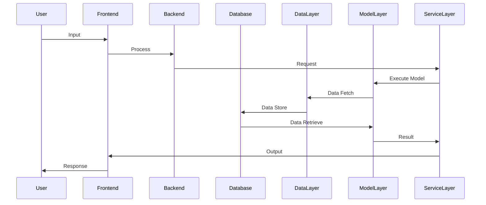

                 

# 企业AI Agent的强化学习在智能投资组合管理中的应用

## 关键词

- 企业AI Agent
- 强化学习
- 智能投资组合管理
- 投资策略
- 风险控制

## 摘要

本文旨在探讨企业AI Agent的强化学习在智能投资组合管理中的应用。首先，我们分析了投资组合管理的重要性和当前面临的挑战，随后介绍了强化学习的基本概念和主要算法。在此基础上，我们详细阐述了企业AI Agent的定义、设计要素及其在投资组合管理中的应用场景。随后，我们构建了智能投资组合管理的架构设计，并分析了系统性能优化与安全性保障的关键因素。最后，我们对比了强化学习算法的性能，并探讨了其在实际投资组合管理中的应用。

## 目录大纲

1. 引言
   1.1 问题背景
   1.2 强化学习基础
   1.3 企业AI Agent的设计与应用
   1.4 智能投资组合管理的架构设计
   1.5 本书结构安排
   1.6 本章小结

2. 企业AI Agent强化学习算法原理
   2.1 强化学习基本概念
   2.2 Q-Learning算法
   2.3 Sarsa算法
   2.4 Deep Q-Network（DQN）算法
   2.5 Policy Gradient算法
   2.6 算法性能对比与优化
   2.7 本章小结

3. 智能投资组合管理领域核心概念与联系
   3.1 投资组合管理的核心概念
   3.2 智能投资组合管理的概念
   3.3 企业AI Agent的概念
   3.4 概念联系与结构
   3.5 本章小结

4. 企业AI Agent的强化学习算法在智能投资组合管理中的应用
   4.1 强化学习算法在投资组合管理中的应用
   4.2 企业AI Agent的设计与实现
   4.3 实际案例分析与讲解
   4.4 本章小结

## 第1章 引言

### 1.1 问题背景

投资组合管理在金融市场中扮演着至关重要的角色。它涉及对多种资产进行配置，以实现预期收益最大化并控制风险。然而，随着市场的复杂性和不确定性增加，传统的投资组合管理方法面临诸多挑战。

首先，投资组合管理需要处理大量的数据和变量。这些数据包括历史价格、市场情绪、公司财务状况等，而变量则涉及不同资产之间的相关性、风险水平等。其次，传统方法往往依赖于静态模型和预设策略，难以应对动态变化的市场环境。此外，人为因素也可能导致决策失误，例如情绪波动、经验不足等。

为了应对这些挑战，近年来，人工智能（AI）技术，特别是强化学习（Reinforcement Learning, RL），被广泛应用于投资组合管理。强化学习通过智能体（Agent）与环境的互动，不断学习和优化策略，具有动态调整和自我优化的能力，能够更好地适应复杂多变的市场环境。

### 1.2 强化学习基础

强化学习是一种通过试错和反馈来学习的机器学习方法。它的核心思想是通过智能体（Agent）在环境中采取行动（Action），并接收环境反馈（Reward），从而不断优化策略（Policy）。强化学习的基本要素包括：

- **智能体（Agent）**：执行行动的主体，可以是机器人、软件程序或虚拟代理。
- **环境（Environment）**：智能体所处的环境，可以是物理世界或虚拟环境。
- **状态（State）**：描述智能体和环境状态的变量集合。
- **行动（Action）**：智能体可以采取的具体行为。
- **奖励（Reward）**：环境对智能体行动的反馈，用于指导智能体的学习过程。

强化学习通过一系列迭代过程，不断更新智能体的策略，以最大化长期奖励。主要算法包括Q-Learning、Sarsa、Deep Q-Network（DQN）和Policy Gradient等。

### 1.3 AI Agent在投资组合管理中的应用前景

企业AI Agent作为强化学习的一个典型应用，具有广泛的应用前景。在企业AI Agent中，智能体可以模拟投资决策过程，通过学习市场数据和投资策略，实现自动化、智能化的投资组合管理。

首先，企业AI Agent可以通过历史数据和实时数据，识别市场趋势和风险因素，从而优化投资组合的配置。其次，智能体可以实时调整投资策略，以应对市场的动态变化，提高投资组合的收益和稳定性。此外，企业AI Agent还可以通过机器学习算法，不断优化自身的学习策略，提高投资决策的准确性和效率。

总之，企业AI Agent的强化学习在智能投资组合管理中具有巨大的应用潜力。通过本文的探讨，我们将深入分析强化学习算法在企业AI Agent中的应用，以及其在投资组合管理中的实际效果和改进方向。

### 1.4 强化学习的基本概念和主要算法

强化学习（Reinforcement Learning, RL）是机器学习的一个重要分支，其核心思想是通过智能体（Agent）与环境的互动来学习最优策略。智能体在特定环境中采取行动，并接收环境的即时奖励或惩罚，通过不断试错和经验累积，优化其行为策略，以实现长期收益最大化。

#### 1.4.1 强化学习的基本概念

强化学习包含以下几个关键要素：

1. **智能体（Agent）**：执行行动的主体，可以是机器人、软件程序或虚拟代理。
2. **环境（Environment）**：智能体所处的环境，可以是物理世界或虚拟环境。
3. **状态（State）**：描述智能体和环境状态的变量集合。
4. **行动（Action）**：智能体可以采取的具体行为。
5. **奖励（Reward）**：环境对智能体行动的即时反馈，用于指导智能体的学习过程。
6. **策略（Policy）**：智能体根据当前状态选择最优行动的策略。

强化学习的过程可以简述为：智能体在环境中采取行动，根据行动的结果（奖励）调整其策略，从而不断优化行为，以达到长期最大化奖励的目标。

#### 1.4.2 强化学习的主要算法

强化学习算法种类繁多，以下介绍几种主要的算法：

1. **Q-Learning算法**

Q-Learning是一种基于值函数的强化学习算法，通过更新状态-行动值函数（Q值）来优化策略。Q值表示在特定状态下采取特定行动的预期收益。

- **基本原理**：Q-Learning通过迭代更新Q值，公式为：
  $$ Q(s, a) \leftarrow Q(s, a) + \alpha [r + \gamma \max_{a'} Q(s', a') - Q(s, a)] $$
  其中，\( s \) 表示当前状态，\( a \) 表示当前行动，\( r \) 表示即时奖励，\( s' \) 表示下一个状态，\( \alpha \) 是学习率，\( \gamma \) 是折扣因子。

- **算法流程**：
  1. 初始化Q值表格。
  2. 进入环境，执行随机行动。
  3. 根据行动结果更新Q值。
  4. 重复步骤2和3，直到达到指定目标或收敛。

2. **Sarsa算法**

Sarsa（State-Action-Reward-State-Action）是基于策略的强化学习算法，适用于非确定性的环境。Sarsa通过同时考虑当前状态和下一个状态来更新策略。

- **基本原理**：Sarsa的更新公式为：
  $$ \pi(s, a) \leftarrow \frac{1}{N(s, a)} \sum_{a'} N(s, a') $$
  其中，\( \pi(s, a) \) 表示在状态s下采取行动a的概率，\( N(s, a') \) 表示在状态s下采取行动a'的次数。

- **算法流程**：
  1. 初始化策略π。
  2. 进入环境，执行当前策略π指导的行动。
  3. 根据行动结果更新策略π。
  4. 重复步骤2和3，直到达到指定目标或收敛。

3. **Deep Q-Network（DQN）算法**

DQN是一种结合深度学习的强化学习算法，通过神经网络来估计Q值，解决传统Q-Learning中的近似值函数问题。

- **基本原理**：DQN使用经验回放机制和目标Q网络来减少样本偏差和过度估计问题。目标Q网络是一个独立的网络，用于稳定Q值的更新。

- **算法流程**：
  1. 初始化深度神经网络和目标Q网络。
  2. 收集经验，并存储在经验回放池中。
  3. 随机从经验回放池中抽取一批经验，用于更新Q网络。
  4. 使用目标Q网络更新实际Q网络。
  5. 重复步骤2-4，直到达到指定目标或收敛。

4. **Policy Gradient算法**

Policy Gradient算法通过直接优化策略的概率分布来最大化长期奖励，适用于高维状态空间。

- **基本原理**：Policy Gradient算法的核心思想是梯度上升法，通过计算策略梯度和优化策略参数。

- **算法流程**：
  1. 初始化策略参数θ。
  2. 进入环境，执行策略π(θ)指导的行动。
  3. 计算策略梯度：
    $$ \nabla_{\theta} J(\theta) = \sum_{s, a} \pi(a|s; \theta) \nabla_{\theta} \log \pi(a|s; \theta) \nabla_{\theta} R(s, a) $$
  4. 更新策略参数：
    $$ \theta \leftarrow \theta + \alpha \nabla_{\theta} J(\theta) $$
  5. 重复步骤2-4，直到达到指定目标或收敛。

### 1.5 强化学习的优势与挑战

强化学习在投资组合管理中的应用具有显著的优势，但也面临一定的挑战。

**优势**：

1. **自适应能力**：强化学习能够通过不断学习和调整策略，适应动态变化的市场环境。
2. **自我优化**：智能体通过与环境互动，能够自主优化投资策略，提高投资组合的收益和风险控制。
3. **自动化**：强化学习可以自动化投资决策过程，减少人为干预，提高决策效率和准确性。

**挑战**：

1. **样本效率**：强化学习需要大量的样本数据来训练，对数据的依赖性较大，可能面临样本稀疏问题。
2. **稳定性**：在高维状态空间中，强化学习算法的稳定性和收敛速度可能受到影响。
3. **解释性**：强化学习模型通常较为复杂，缺乏直观的解释性，难以理解其决策过程。

在接下来的章节中，我们将进一步探讨企业AI Agent的设计和应用，以及智能投资组合管理的架构设计，深入分析强化学习在投资组合管理中的实际应用和优化策略。

### 1.6 企业AI Agent的定义

企业AI Agent是一种基于强化学习技术设计的智能体，旨在通过自主学习来优化企业投资组合管理。它不仅是强化学习的应用实例，也是企业智能化转型的关键组件。具体来说，企业AI Agent具有以下几个核心特征：

首先，企业AI Agent是一种软件代理，它在企业投资组合管理系统中扮演决策者的角色。与传统的投资策略不同，AI Agent能够根据实时数据和历史数据分析市场趋势，自主调整投资组合的权重和策略。这意味着，AI Agent不仅能够处理复杂的数据分析任务，还能够适应不断变化的市场环境，实现投资策略的动态优化。

其次，企业AI Agent的核心在于其强化学习算法。强化学习算法通过不断试错和反馈，使得AI Agent能够在实践中不断学习和进化，从而优化投资组合的配置。例如，AI Agent可以通过Q-Learning算法学习不同投资组合在不同市场状态下的预期收益，并选择最优策略。同样，通过Sarsa算法和Deep Q-Network（DQN）算法，AI Agent能够在复杂的市场环境中做出更为精准的决策。

再次，企业AI Agent的设计需要考虑多个因素，包括数据采集、算法优化、策略调整和模型评估等。在数据采集方面，AI Agent需要能够实时获取股票价格、市场新闻、公司财务数据等多种信息，并对其进行处理和分析。在算法优化方面，AI Agent需要不断调整和优化其学习策略，以提高投资组合的收益和风险控制能力。在策略调整方面，AI Agent需要具备灵活的调整机制，能够根据市场变化和企业需求，动态调整投资组合的权重和配置。在模型评估方面，AI Agent需要定期评估其投资策略的绩效，并基于评估结果进行调整和改进。

最后，企业AI Agent的应用场景涵盖了企业投资的多个方面。例如，在股票投资中，AI Agent可以自动分析股票市场趋势，选择买入或卖出的时机；在债券投资中，AI Agent可以分析债券收益率和风险，进行最优配置；在基金投资中，AI Agent可以管理多个基金的投资组合，优化收益和风险。总之，企业AI Agent通过其强大的学习能力和适应性，能够帮助企业实现智能投资组合管理，提高投资效率和收益。

### 1.7 企业AI Agent的设计要素

设计一个高效的企业AI Agent，需要考虑多个关键要素，这些要素共同决定了AI Agent的性能和可靠性。以下是企业AI Agent设计中的几个关键要素：

#### 1.7.1 强化学习算法的选择

强化学习算法的选择是企业AI Agent设计中的核心要素之一。不同的强化学习算法具有不同的优缺点，适用于不同的应用场景。以下是几种常见的强化学习算法及其适用性：

- **Q-Learning算法**：Q-Learning算法是一种基于值函数的算法，适用于较为简单和确定性的环境。它的优点是计算效率高，但可能在状态空间复杂时面临维数灾难问题。

- **Sarsa算法**：Sarsa算法是一种基于策略的算法，适用于非确定性的环境。它通过同时考虑当前状态和下一个状态来更新策略，相比Q-Learning算法具有更好的适应能力。

- **Deep Q-Network（DQN）算法**：DQN算法是一种结合深度学习的强化学习算法，通过神经网络来估计Q值，适用于高维状态空间。DQN算法的优点是能够处理复杂的非线性问题，但训练过程可能较为复杂且需要大量数据。

- **Policy Gradient算法**：Policy Gradient算法通过直接优化策略的概率分布，适用于高维状态空间。它的优点是能够快速收敛，但可能在样本效率方面表现不佳。

选择合适的强化学习算法需要考虑具体的应用场景和数据特点。例如，在股票投资组合管理中，如果市场数据复杂且状态空间较大，DQN算法和Policy Gradient算法可能更为适用。

#### 1.7.2 数据采集与预处理

数据采集是企业AI Agent设计中的另一个关键要素。有效的数据采集和预处理能够确保AI Agent在训练过程中获得高质量的数据，从而提高学习效果和决策准确性。

- **数据来源**：AI Agent需要从多个渠道获取数据，包括股票价格、市场新闻、公司财务报告等。这些数据可以通过公开的数据源、金融API或企业内部的数据库获取。

- **数据预处理**：获取到的数据需要进行预处理，以消除噪声和异常值，提高数据质量。常见的预处理方法包括数据清洗、归一化、特征提取等。例如，股票价格数据可能包含缺失值、重复值或异常波动，需要进行清洗和归一化处理。

- **特征工程**：特征工程是数据预处理的重要环节，通过选择和构造有效的特征，可以增强AI Agent的学习能力和决策能力。特征工程的方法包括特征选择、特征转换和特征构造等。

#### 1.7.3 学习策略与模型评估

学习策略和模型评估是企业AI Agent设计中的核心环节，决定了AI Agent的训练过程和最终性能。

- **学习策略**：学习策略包括目标函数、优化算法和训练过程等。目标函数应能够最大化投资组合的预期收益或最小化风险。优化算法可以选择梯度下降、随机梯度下降或更高级的优化算法。训练过程需要确保AI Agent在训练过程中能够收敛到最优策略，避免过度拟合或欠拟合。

- **模型评估**：模型评估是验证AI Agent性能的重要手段。常见的评估指标包括投资收益、风险控制能力、交易频率等。评估方法可以包括回测、模拟交易和实际交易等。通过定期评估，可以及时发现和调整AI Agent的不足，提高其性能。

#### 1.7.4 安全性与稳定性

安全性是企业AI Agent设计中的关键要素，确保AI Agent在交易过程中不会产生意外的风险。以下是几个关键点：

- **风险管理**：AI Agent需要具备良好的风险管理能力，能够根据市场变化和风险偏好动态调整投资组合。

- **异常检测**：AI Agent需要具备异常检测能力，能够及时发现异常交易或异常行为，并采取相应措施。

- **交易限制**：AI Agent应设置合理的交易限制，例如单笔交易金额上限、交易频率限制等，以防止过度交易和风险积聚。

- **稳定性保障**：AI Agent的算法设计和实现应确保其稳定性和可靠性，避免因算法失效或系统故障导致的风险。

通过综合考虑以上设计要素，企业AI Agent能够更好地适应复杂多变的市场环境，实现高效的智能投资组合管理。

### 1.8 企业AI Agent的应用场景

企业AI Agent在智能投资组合管理中具有广泛的应用场景，以下列举几个典型的应用案例：

#### 1.8.1 股票投资组合管理

股票投资组合管理是企业AI Agent最常见的应用场景之一。在这种场景下，AI Agent通过实时数据分析和历史数据分析，自动调整股票投资组合的权重，实现风险控制和收益最大化。具体应用过程如下：

1. **数据采集与预处理**：AI Agent首先从股票交易所、财经新闻网站和其他数据源获取股票价格、成交量、市场情绪等数据。然后，对数据进行预处理，包括去噪、归一化和特征提取，以提高数据质量。

2. **状态建模**：AI Agent将当前市场状态建模为状态空间，包括股票价格、市场指数、财务指标等。通过历史数据的学习，AI Agent能够识别出影响股票价格的关键因素。

3. **策略选择**：基于强化学习算法，AI Agent不断优化投资策略。例如，通过Q-Learning或DQN算法，AI Agent能够在不同市场状态下选择最优股票投资组合。

4. **交易执行**：AI Agent根据实时数据和市场状态，自动执行买入、卖出和持有等交易操作。通过高频交易和低频交易策略，AI Agent能够有效应对市场波动，提高投资收益。

#### 1.8.2 债券投资组合管理

债券投资组合管理是企业AI Agent的另一个重要应用场景。在这种场景下，AI Agent通过分析债券市场数据，优化债券投资组合的风险收益结构。具体应用过程如下：

1. **数据采集与预处理**：AI Agent从债券市场数据源获取债券价格、收益率、信用评级等信息。对数据进行预处理，包括去噪、归一化和特征提取，以提高数据质量。

2. **状态建模**：AI Agent将当前债券市场状态建模为状态空间，包括债券价格、市场利率、经济指标等。通过历史数据的学习，AI Agent能够识别出影响债券收益率的关键因素。

3. **策略选择**：基于强化学习算法，AI Agent不断优化债券投资策略。例如，通过Q-Learning或Policy Gradient算法，AI Agent能够在不同市场状态下选择最优债券投资组合。

4. **交易执行**：AI Agent根据实时数据和市场状态，自动执行买入、卖出和持有等交易操作。通过优化债券投资组合的配置，AI Agent能够有效控制投资风险，提高投资收益。

#### 1.8.3 基金投资组合管理

基金投资组合管理是企业AI Agent的又一重要应用场景。在这种场景下，AI Agent通过分析多个基金的投资组合，为企业投资者提供最优基金投资策略。具体应用过程如下：

1. **数据采集与预处理**：AI Agent从基金市场数据源获取基金净值、投资组合、历史收益等信息。对数据进行预处理，包括去噪、归一化和特征提取，以提高数据质量。

2. **状态建模**：AI Agent将当前基金市场状态建模为状态空间，包括基金净值、市场指数、经济指标等。通过历史数据的学习，AI Agent能够识别出影响基金净值的关键因素。

3. **策略选择**：基于强化学习算法，AI Agent不断优化基金投资策略。例如，通过Sarsa或Policy Gradient算法，AI Agent能够在不同市场状态下选择最优基金投资组合。

4. **交易执行**：AI Agent根据实时数据和市场状态，自动执行买入、卖出和持有等交易操作。通过优化基金投资组合的配置，AI Agent能够有效控制投资风险，提高投资收益。

总之，企业AI Agent通过强化学习算法，能够在股票、债券和基金等多个投资领域实现自动化、智能化的投资组合管理，提高企业的投资收益和风险控制能力。

### 1.9 智能投资组合管理的架构设计

智能投资组合管理的架构设计是确保企业AI Agent高效运作的关键。一个完整的架构设计应包括系统需求分析、系统架构设计、系统性能优化与安全性保障等多个方面。以下将对这些关键部分进行详细分析。

#### 1.9.1 投资组合管理系统的需求分析

在开始架构设计之前，明确投资组合管理系统的需求是至关重要的。以下是系统需求分析的主要方面：

1. **数据采集与处理**：系统需要能够实时采集各种金融数据，包括股票价格、债券收益率、市场指数等。此外，系统还需要对数据进行预处理，如去噪、归一化和特征提取，以确保数据质量。

2. **状态建模与预测**：系统需要能够建模当前市场状态，包括各种市场指标、公司财务数据等。通过历史数据分析，系统应能够预测未来市场趋势，为投资决策提供依据。

3. **决策与执行**：系统需要根据投资策略，自动执行买入、卖出等交易操作。同时，系统应具备灵活的调整机制，能够根据市场变化和企业需求，动态调整投资组合。

4. **性能与稳定性**：系统需要具备高性能和高稳定性，能够处理大量交易请求和实时数据处理任务，确保投资决策的准确性和及时性。

5. **风险管理**：系统需要具备全面的风险管理功能，包括风险监控、风险预测和风险控制。通过实时风险评估，系统应能够及时发现和应对市场风险。

#### 1.9.2 系统架构设计

系统架构设计是投资组合管理系统的核心，决定了系统的性能、可扩展性和可维护性。以下是系统架构设计的主要组成部分：

1. **数据层**：数据层负责数据的采集、存储和管理。系统应具备数据接入能力，能够从多个数据源（如交易所、财经新闻网站、企业内部数据库等）获取数据。数据存储可以使用关系型数据库或NoSQL数据库，根据数据特点和需求选择合适的存储方案。数据管理包括数据清洗、去噪、归一化和特征提取等预处理操作。

2. **模型层**：模型层负责构建和训练各种预测模型和投资策略。系统应具备多种机器学习算法，如回归分析、时间序列预测、强化学习等，以满足不同的需求。模型层还包括模型评估和优化机制，通过交叉验证和A/B测试等手段，评估模型性能并进行优化。

3. **服务层**：服务层提供各种API和服务接口，供前端应用和后台管理系统调用。服务层包括投资策略服务、交易执行服务、风险管理服务等。通过微服务架构，服务层可以实现模块化设计和高性能处理。

4. **应用层**：应用层是用户与系统交互的界面，包括Web前端、移动应用和后台管理系统。Web前端负责展示投资组合数据、交易信息和风险监控等。移动应用提供便捷的投资查询和交易操作。后台管理系统用于系统配置、参数调整和权限管理。

5. **基础设施层**：基础设施层包括服务器、存储和网络等基础设施资源。系统应具备高可用性和容错性，确保数据安全和系统稳定运行。

#### 1.9.3 系统性能优化与安全性保障

系统性能优化与安全性保障是确保智能投资组合管理系统稳定、高效运行的关键。

1. **性能优化**：
   - **负载均衡**：通过负载均衡器，将请求分配到多个服务器，确保系统处理能力最大化。
   - **缓存机制**：使用缓存机制，减少数据库访问频率，提高数据读取速度。
   - **垂直与水平扩展**：根据系统负载，动态调整服务器资源，实现垂直和水平扩展。
   - **数据库优化**：优化数据库查询语句，减少查询时间，提高数据处理效率。

2. **安全性保障**：
   - **数据加密**：使用加密技术，保护数据传输和存储过程中的隐私和安全。
   - **访问控制**：设置严格的访问控制策略，确保只有授权用户能够访问系统资源和数据。
   - **防火墙与入侵检测**：部署防火墙和入侵检测系统，防止恶意攻击和网络攻击。
   - **备份与恢复**：定期备份数据，确保数据不丢失，并建立灾难恢复计划，应对突发事件。

通过综合考虑以上架构设计要素，智能投资组合管理系统可以实现高效、稳定和安全的运行，为企业提供优质的智能投资服务。

### 1.10 本书结构安排

本书结构安排旨在系统性地探讨企业AI Agent的强化学习在智能投资组合管理中的应用。以下是对各章节内容的详细安排和预期收获。

#### 第1章 引言

本章介绍了投资组合管理的重要性和传统方法面临的挑战，阐述了强化学习的基本概念和主要算法，以及企业AI Agent的定义和设计要素。通过本章，读者可以初步了解企业AI Agent在智能投资组合管理中的应用前景和核心原理。

#### 第2章 企业AI Agent强化学习算法原理

本章详细介绍了几种主要的强化学习算法，包括Q-Learning、Sarsa、DQN和Policy Gradient，以及这些算法的基本原理、数学模型和算法流程。通过本章，读者可以深入理解强化学习算法在企业AI Agent设计中的应用和实现方法。

#### 第3章 智能投资组合管理领域核心概念与联系

本章探讨了投资组合管理、智能投资组合管理、企业AI Agent等核心概念，分析了它们之间的联系和结构。通过本章，读者可以建立对智能投资组合管理领域整体框架的理解，明确各概念之间的关系和重要性。

#### 第4章 企业AI Agent的强化学习算法在智能投资组合管理中的应用

本章结合实际案例，详细讨论了企业AI Agent的强化学习算法在智能投资组合管理中的应用，包括投资组合优化、风险控制和策略选择。通过本章，读者可以掌握企业AI Agent在实际投资环境中的应用方法和效果评估。

#### 读者对象与预期收获

本书旨在为金融科技领域的工程师、数据科学家、金融分析师以及对智能投资组合管理感兴趣的研究者提供系统性、实践性的指导。通过阅读本书，读者可以：

- **了解强化学习算法在企业AI Agent中的应用**：掌握Q-Learning、Sarsa、DQN和Policy Gradient等强化学习算法的基本原理和实现方法。
- **掌握智能投资组合管理的核心概念和架构设计**：建立对投资组合管理、智能投资组合管理、企业AI Agent等核心概念的理解，明确其在实际应用中的重要性。
- **掌握企业AI Agent的设计与实现方法**：了解企业AI Agent的设计要素和应用场景，掌握其在投资组合优化、风险控制和策略选择中的应用技巧。
- **提升实际投资决策能力**：通过实际案例分析和应用，提升读者在实际投资环境中的应用能力和决策水平。

总之，本书将为读者提供一个全面、深入的智能投资组合管理学习路径，帮助读者掌握最新的技术方法和实际应用技巧，提升在金融科技领域的专业能力和竞争力。

### 1.11 本章小结

本章首先介绍了投资组合管理的重要性和当前面临的挑战，随后详细探讨了强化学习的基本概念和主要算法，包括Q-Learning、Sarsa、DQN和Policy Gradient。接着，我们深入分析了企业AI Agent的定义、设计要素及其在投资组合管理中的应用场景。最后，我们构建了智能投资组合管理的架构设计，并分析了系统性能优化与安全性保障的关键因素。通过本章的探讨，读者可以初步了解企业AI Agent的强化学习在智能投资组合管理中的应用前景和核心原理，为后续章节的学习打下坚实基础。

## 第2章 企业AI Agent强化学习算法原理

### 2.1 强化学习基本概念

强化学习（Reinforcement Learning, RL）是一种通过试错和反馈进行学习的机器学习方法，旨在通过智能体（Agent）在特定环境中采取行动，并接收环境反馈（Reward），从而不断优化其策略（Policy），以实现长期最大化奖励。以下是强化学习的基本概念：

#### 2.1.1 强化学习的定义

强化学习是一种使智能体在环境中通过不断试错和反馈来学习最优策略的机器学习方法。与监督学习和无监督学习不同，强化学习通过即时奖励（Reward）来指导智能体的行为，而不是依赖于预先标记的数据集。

#### 2.1.2 强化学习的要素

1. **智能体（Agent）**：执行行动的主体，可以是机器人、软件程序或虚拟代理。
2. **环境（Environment）**：智能体所处的环境，可以是物理世界或虚拟环境。
3. **状态（State）**：描述智能体和环境状态的变量集合。
4. **行动（Action）**：智能体可以采取的具体行为。
5. **奖励（Reward）**：环境对智能体行动的即时反馈，用于指导智能体的学习过程。
6. **策略（Policy）**：智能体根据当前状态选择最优行动的策略。

#### 2.1.3 强化学习的分类

强化学习主要分为以下几类：

1. **基于值函数的算法**：如Q-Learning，通过估计状态-行动值函数来优化策略。
2. **基于策略的算法**：如Policy Gradient，直接优化策略的概率分布。
3. **基于模型的算法**：如Sarsa和Deep Q-Network（DQN），结合模型预测和策略优化。

### 2.2 Q-Learning算法

Q-Learning是一种基于值函数的强化学习算法，通过更新状态-行动值函数（Q值）来优化策略。以下是Q-Learning算法的基本原理、数学模型和算法流程。

#### 2.2.1 Q-Learning的基本原理

Q-Learning通过估计状态-行动值函数（Q值）来优化策略，Q值表示在特定状态下采取特定行动的预期收益。算法的核心思想是通过迭代更新Q值，逐步优化智能体的策略。

#### 2.2.2 Q-Learning的数学模型

Q-Learning的更新公式为：
$$ Q(s, a) \leftarrow Q(s, a) + \alpha [r + \gamma \max_{a'} Q(s', a') - Q(s, a)] $$
其中，\( s \) 表示当前状态，\( a \) 表示当前行动，\( r \) 表示即时奖励，\( s' \) 表示下一个状态，\( \alpha \) 是学习率，\( \gamma \) 是折扣因子。

#### 2.2.3 Q-Learning的算法流程

1. **初始化Q值表格**：初始化所有状态-行动值函数为0。
2. **进入环境**：智能体执行随机行动。
3. **更新Q值**：根据即时奖励和下一个状态的最大Q值，更新当前状态-行动值函数。
4. **重复步骤2和3**：不断迭代，直到智能体找到最优策略或达到指定目标。

### 2.3 Sarsa算法

Sarsa（State-Action-Reward-State-Action）是一种基于策略的强化学习算法，适用于非确定性的环境。Sarsa通过同时考虑当前状态和下一个状态来更新策略。以下是Sarsa算法的基本原理、数学模型和算法流程。

#### 2.3.1 Sarsa的基本原理

Sarsa的核心思想是同时考虑当前状态和下一个状态来更新策略，这意味着在每次行动后，智能体会根据当前状态和下一个状态的Q值来调整策略。

#### 2.3.2 Sarsa的数学模型

Sarsa的更新公式为：
$$ \pi(s, a) \leftarrow \frac{1}{N(s, a)} \sum_{a'} N(s, a') $$
其中，\( \pi(s, a) \) 表示在状态s下采取行动a的概率，\( N(s, a') \) 表示在状态s下采取行动a'的次数。

#### 2.3.3 Sarsa的算法流程

1. **初始化策略π**：初始化策略π。
2. **进入环境**：智能体执行当前策略π指导的行动。
3. **更新策略π**：根据即时奖励和下一个状态的最大Q值，更新当前策略。
4. **重复步骤2和3**：不断迭代，直到智能体找到最优策略或达到指定目标。

### 2.4 Deep Q-Network（DQN）算法

DQN（Deep Q-Network）是一种结合深度学习的强化学习算法，通过神经网络来估计Q值，解决传统Q-Learning中的近似值函数问题。以下是DQN算法的基本原理、数学模型和算法流程。

#### 2.4.1 DQN的基本原理

DQN通过深度神经网络来近似状态-行动值函数（Q值），从而实现更加复杂的值函数估计。DQN的核心思想是使用经验回放机制和目标Q网络来减少样本偏差和过度估计问题。

#### 2.4.2 DQN的数学模型

DQN使用经验回放池存储历史经验，并在训练过程中随机抽样，以减少样本偏差。目标Q网络是一个独立的网络，用于稳定Q值的更新。

Q值的估计公式为：
$$ Q(s, a) = \frac{1}{N(s, a)} \sum_{s', a'} (r + \gamma \max_{a'} Q(s', a') - Q(s, a)) $$

#### 2.4.3 DQN的算法流程

1. **初始化深度神经网络和目标Q网络**：初始化深度神经网络和目标Q网络。
2. **收集经验**：在环境中执行行动，收集状态、行动、奖励和下一个状态。
3. **存储经验到回放池**：将经验存储到经验回放池中。
4. **从回放池中随机抽样**：随机从经验回放池中抽取一批经验。
5. **更新Q网络**：使用目标Q网络和抽样经验，更新实际Q网络。
6. **重复步骤2-5**：不断迭代，直到达到指定目标或收敛。

### 2.5 Policy Gradient算法

Policy Gradient算法通过直接优化策略的概率分布来最大化长期奖励，适用于高维状态空间。以下是Policy Gradient算法的基本原理、数学模型和算法流程。

#### 2.5.1 Policy Gradient的基本原理

Policy Gradient算法的核心思想是梯度上升法，通过计算策略梯度和优化策略参数，直接优化策略的概率分布。该算法适用于高维状态空间，能够快速收敛。

#### 2.5.2 Policy Gradient的数学模型

Policy Gradient的优化公式为：
$$ \nabla_{\theta} J(\theta) = \sum_{s, a} \pi(a|s; \theta) \nabla_{\theta} \log \pi(a|s; \theta) \nabla_{\theta} R(s, a) $$
其中，\( \theta \) 是策略参数，\( \pi(a|s; \theta) \) 是策略的概率分布，\( R(s, a) \) 是奖励。

#### 2.5.3 Policy Gradient的算法流程

1. **初始化策略参数θ**：初始化策略参数θ。
2. **进入环境**：智能体执行当前策略π(θ)指导的行动。
3. **计算策略梯度**：根据行动结果，计算策略梯度。
4. **更新策略参数**：使用策略梯度，更新策略参数θ。
5. **重复步骤2-4**：不断迭代，直到达到指定目标或收敛。

### 2.6 算法性能对比与优化

强化学习算法的性能受多种因素影响，包括状态空间、行动空间、奖励函数、数据量等。以下对几种主要算法的性能进行对比，并提出优化策略。

#### 2.6.1 算法性能评价指标

算法性能评价通常包括以下几个指标：

1. **收益**：算法在特定时间内获得的累计奖励。
2. **收敛速度**：算法从初始状态收敛到最优策略的速度。
3. **样本效率**：算法在给定数据量下，优化策略的能力。
4. **鲁棒性**：算法在不同环境和数据变化下的稳定性。

#### 2.6.2 算法优化策略

1. **数据增强**：通过生成虚拟数据、数据增强技术，提高算法的样本效率。
2. **经验回放**：使用经验回放池，减少样本偏差和过度估计。
3. **目标网络**：使用目标网络，稳定Q值更新过程。
4. **探索策略**：结合ε-greedy策略和UCB算法，平衡探索和利用。
5. **多任务学习**：通过多任务学习，提高算法的泛化能力。

### 2.7 本章小结

本章详细介绍了强化学习的基本概念和主要算法，包括Q-Learning、Sarsa、DQN和Policy Gradient。通过对比分析，读者可以了解这些算法的基本原理、数学模型和算法流程，为后续章节的应用和实践提供理论基础。

### 2.1 强化学习基本概念

强化学习（Reinforcement Learning, RL）是机器学习的一个重要分支，其核心思想是通过智能体（Agent）在环境中采取行动（Action），并接收环境反馈（Reward），从而不断优化其策略（Policy），以实现长期收益最大化。为了更好地理解强化学习，我们需要先了解以下几个基本概念：

#### 2.1.1 强化学习的定义

强化学习是一种使智能体通过与环境的交互来学习最佳行为策略的机器学习方法。智能体在环境中采取行动，然后根据行动的结果（奖励或惩罚）调整其行为策略。这种学习过程类似于人类在现实世界中的学习方式，通过不断地尝试和反馈来达到目标。

强化学习的目标函数通常是最小化长期预期损失，即最大化累积奖励。为了实现这一目标，智能体需要不断地探索环境，尝试不同的行动策略，并利用即时奖励和历史经验来调整其策略。

#### 2.1.2 强化学习的要素

1. **智能体（Agent）**：执行行动的主体，可以是机器人、软件程序或虚拟代理。智能体的目标是学习最优策略，以最大化长期奖励。

2. **环境（Environment）**：智能体所处的环境，可以是物理世界或虚拟环境。环境决定了智能体可以采取的行动以及每个行动的结果。

3. **状态（State）**：描述智能体和环境状态的变量集合。智能体在环境中采取行动时，会根据当前状态来决定下一个行动。

4. **行动（Action）**：智能体可以采取的具体行为。行动的选择取决于智能体的策略和当前状态。

5. **奖励（Reward）**：环境对智能体行动的即时反馈。奖励可以是正的（表示成功）或负的（表示失败），用于指导智能体的学习过程。

6. **策略（Policy）**：智能体根据当前状态选择最优行动的策略。策略可以是确定性策略（每次状态都选择固定的行动）或概率性策略（根据状态选择不同行动的概率分布）。

#### 2.1.3 强化学习的分类

强化学习可以根据学习方式、策略类型和算法特点进行分类。以下是几种常见的强化学习分类：

1. **基于值函数的算法**：这类算法通过学习状态-行动值函数（State-Action Value Function）来优化策略。常见的算法有Q-Learning、Sarsa等。

2. **基于策略的算法**：这类算法通过直接优化策略的概率分布来最大化长期奖励。常见的算法有Policy Gradient等。

3. **模型为基础的算法**：这类算法通过学习环境模型来优化策略。常见的算法有Actor-Critic等。

4. **探索与利用**：这类算法通过平衡探索（尝试新的行动）和利用（利用已有知识）来优化策略。常见的策略有ε-greedy、UCB等。

#### 2.1.4 强化学习的核心问题

强化学习面临几个核心问题，包括：

1. **收敛性**：智能体需要找到一种策略，使得长期奖励最大化。算法需要确保收敛性，避免陷入局部最优。

2. **样本效率**：智能体需要尽可能高效地利用经验，减少探索过程所需的时间。提高样本效率是强化学习的一个重要目标。

3. **稀疏奖励**：在很多实际问题中，奖励分布是稀疏的，智能体需要学会如何在稀疏奖励环境中有效学习。

4. **维数灾难**：在高维状态空间中，值函数的表示和优化变得非常复杂。解决维数灾难是一个重要的研究方向。

#### 2.1.5 强化学习的基本流程

强化学习的基本流程可以概括为以下几个步骤：

1. **初始化**：初始化智能体、环境和策略。
2. **执行行动**：智能体根据当前状态，采取一个行动。
3. **接收奖励**：环境根据智能体的行动，给予一个即时奖励。
4. **更新策略**：智能体利用即时奖励和先前经验，更新其策略。
5. **重复迭代**：智能体继续执行行动、接收奖励和更新策略，直到达到某个停止条件。

通过以上基本概念和流程的介绍，我们可以更好地理解强化学习的工作原理和应用场景。在接下来的章节中，我们将详细探讨几种主要的强化学习算法，包括Q-Learning、Sarsa、DQN和Policy Gradient，以帮助读者深入了解强化学习的实践应用。

### 2.2 Q-Learning算法

Q-Learning算法是强化学习中最基础和常用的算法之一，它通过更新状态-行动值函数（Q值）来优化策略，从而实现长期收益最大化。Q-Learning算法的核心思想是利用即时奖励和历史经验来逐步优化Q值，使其接近真实值函数，进而指导智能体的行动。

#### 2.2.1 Q-Learning的基本原理

Q-Learning算法的基本原理是：通过在特定状态下采取特定行动，智能体可以观察到即时奖励，并根据这个奖励来更新状态-行动值函数（Q值）。具体来说，Q值表示在特定状态下采取特定行动所能获得的预期回报。通过不断更新Q值，智能体能够逐渐学习到最优的策略。

Q-Learning算法的关键在于更新公式：
$$ Q(s, a) \leftarrow Q(s, a) + \alpha [r + \gamma \max_{a'} Q(s', a') - Q(s, a)] $$
其中，\( s \) 是当前状态，\( a \) 是当前行动，\( r \) 是即时奖励，\( s' \) 是下一个状态，\( \alpha \) 是学习率，\( \gamma \) 是折扣因子。

- **学习率 \( \alpha \)**：学习率决定了新信息对Q值更新的影响程度。值越大，新信息对Q值的影响越大，但可能容易导致过度更新；值越小，Q值的稳定性越高，但学习过程可能较慢。

- **折扣因子 \( \gamma \)**：折扣因子决定了未来奖励的权重。值越大，未来奖励对当前Q值的影响越大；值越小，当前奖励对Q值的影响越大。

#### 2.2.2 Q-Learning的数学模型

Q-Learning算法的数学模型基于马尔可夫决策过程（MDP），可以表示为五元组 \( M = \{S, A, P, R, \gamma\} \)：

- **状态集 \( S \)**：智能体所处的所有可能状态集合。
- **行动集 \( A \)**：智能体可以采取的所有可能行动集合。
- **状态转移概率 \( P \)**：给定当前状态和行动，智能体转移到下一个状态的概率分布。
- **奖励函数 \( R \)**：定义在状态-行动对上的即时奖励。
- **折扣因子 \( \gamma \)**：对未来奖励的权重。

Q值函数 \( Q(s, a) \) 是一个实值函数，表示在状态 \( s \) 下采取行动 \( a \) 的预期回报。Q值函数的目标是接近真实值函数 \( V^*(s) \)，即最优值函数。

#### 2.2.3 Q-Learning的算法流程

Q-Learning算法的基本流程如下：

1. **初始化Q值**：初始化所有状态-行动值函数为0，或者使用一些启发式方法初始化。
   $$ Q(s, a) \leftarrow 0, \forall s \in S, \forall a \in A $$

2. **智能体与环境交互**：智能体根据当前状态选择一个行动 \( a \)。
   $$ a \leftarrow \text{选择行动} $$

3. **执行行动并获得即时奖励**：智能体执行行动 \( a \)，环境根据当前状态和行动给出即时奖励 \( r \)。
   $$ r \leftarrow \text{环境反馈} $$

4. **更新Q值**：根据即时奖励和下一个状态的最大Q值，更新当前状态-行动值函数。
   $$ Q(s, a) \leftarrow Q(s, a) + \alpha [r + \gamma \max_{a'} Q(s', a') - Q(s, a)] $$

5. **状态更新**：智能体根据当前行动的结果，更新当前状态为下一个状态 \( s' \)。
   $$ s \leftarrow s' $$

6. **重复迭代**：重复执行步骤2-5，直到达到某个停止条件（如达到指定步数、找到最优策略或收敛）。

#### 2.2.4 Q-Learning的优缺点

**优点**：

- **简单易实现**：Q-Learning算法的原理和流程相对简单，易于理解和实现。
- **适用于大多数环境**：Q-Learning算法对环境的假设较少，适用于大部分马尔可夫决策过程。
- **无需模型**：Q-Learning算法不需要对环境建模，仅依赖经验数据进行学习。

**缺点**：

- **样本效率低**：Q-Learning算法需要大量的样本数据才能收敛到最优策略，样本效率较低。
- **易受初始值影响**：Q-Learning算法的初始Q值会影响收敛速度和最终性能，如果初始值不合适，可能会导致收敛缓慢或陷入局部最优。
- **计算量大**：在状态-行动空间较大时，Q-Learning算法的计算量会显著增加，导致效率下降。

#### 2.2.5 Q-Learning的应用实例

Q-Learning算法在多个领域有广泛应用，以下是几个典型的应用实例：

- **游戏AI**：Q-Learning算法被广泛应用于游戏AI中，例如在围棋、国际象棋等游戏中，智能体通过学习策略来击败对手。
- **机器人控制**：在机器人控制领域，Q-Learning算法用于学习最优控制策略，例如机器人在动态环境中的路径规划。
- **投资组合管理**：在金融领域，Q-Learning算法被用于优化投资组合策略，实现自动化投资决策。

总之，Q-Learning算法作为一种基础的强化学习算法，具有广泛的应用前景和重要性。通过对其基本原理和算法流程的深入理解，读者可以更好地掌握强化学习技术，并将其应用于实际问题中。

### 2.3 Sarsa算法

Sarsa（State-Action-Reward-State-Action）算法是一种基于策略的强化学习算法，它通过同时考虑当前状态和下一个状态来更新策略，适用于非确定性的环境。与Q-Learning算法相比，Sarsa算法在处理不确定性和多步骤决策时具有优势。以下是Sarsa算法的基本原理、数学模型和算法流程。

#### 2.3.1 Sarsa的基本原理

Sarsa算法的核心思想是利用当前状态和下一个状态的Q值来更新策略，而不是仅依赖于下一个状态的最大Q值。这意味着Sarsa算法能够更好地处理非确定性的环境和多步骤决策问题。

Sarsa算法的更新公式为：
$$ \pi(s, a) \leftarrow \frac{1}{N(s, a)} \sum_{a'} N(s, a') $$
其中，\( \pi(s, a) \) 表示在状态s下采取行动a的概率，\( N(s, a') \) 表示在状态s下采取行动a'的次数。

这个公式表示，在给定状态s下，智能体选择行动a的概率等于在状态s下所有可能行动的次数之和。Sarsa算法通过这个概率分布来更新策略，使得智能体能够在不确定的环境中做出更为合理的决策。

#### 2.3.2 Sarsa的数学模型

Sarsa算法的数学模型基于马尔可夫决策过程（MDP），可以表示为五元组 \( M = \{S, A, P, R, \gamma\} \)：

- **状态集 \( S \)**：智能体所处的所有可能状态集合。
- **行动集 \( A \)**：智能体可以采取的所有可能行动集合。
- **状态转移概率 \( P \)**：给定当前状态和行动，智能体转移到下一个状态的概率分布。
- **奖励函数 \( R \)**：定义在状态-行动对上的即时奖励。
- **折扣因子 \( \gamma \)**：对未来奖励的权重。

Sarsa算法通过更新策略概率分布，使得智能体能够在不确定的环境中做出最优行动选择。

#### 2.3.3 Sarsa的算法流程

Sarsa算法的基本流程如下：

1. **初始化策略π**：初始化策略π，通常使用均匀分布。
   $$ \pi(s, a) = \frac{1}{|A|}, \forall s \in S, \forall a \in A $$

2. **智能体与环境交互**：智能体根据当前状态选择一个行动 \( a \)。
   $$ a \leftarrow \text{选择行动} $$

3. **执行行动并获得即时奖励**：智能体执行行动 \( a \)，环境根据当前状态和行动给出即时奖励 \( r \)。
   $$ r \leftarrow \text{环境反馈} $$

4. **状态更新**：智能体根据当前行动的结果，更新当前状态为下一个状态 \( s' \)。
   $$ s \leftarrow s' $$

5. **更新策略π**：根据当前状态和下一个状态的Q值，更新策略π。
   $$ \pi(s, a) \leftarrow \frac{1}{N(s, a)} \sum_{a'} N(s, a') $$

6. **重复迭代**：重复执行步骤2-5，直到达到某个停止条件（如达到指定步数、找到最优策略或收敛）。

#### 2.3.4 Sarsa算法的优缺点

**优点**：

- **处理不确定性**：Sarsa算法能够处理非确定性的环境，通过同时考虑当前状态和下一个状态的Q值，智能体能够在不确定的情况下做出更为合理的决策。
- **适用于多步骤决策**：Sarsa算法适用于需要考虑多步骤决策的问题，例如路径规划、策略优化等。

**缺点**：

- **样本效率较低**：Sarsa算法需要大量的样本数据才能收敛到最优策略，样本效率较低。
- **计算复杂度高**：在状态-行动空间较大时，Sarsa算法的计算复杂度较高，可能导致效率下降。

#### 2.3.5 Sarsa的应用实例

Sarsa算法在多个领域有广泛应用，以下是几个典型的应用实例：

- **路径规划**：在自动驾驶和机器人路径规划中，Sarsa算法被用于学习最优路径策略，通过不断尝试和反馈来找到最优路径。
- **资源分配**：在资源分配问题中，Sarsa算法被用于学习最优资源分配策略，通过考虑当前状态和下一个状态的资源需求，实现高效资源分配。
- **金融投资**：在金融投资领域，Sarsa算法被用于优化投资组合策略，通过学习市场趋势和风险因素，实现自动化投资决策。

总之，Sarsa算法作为一种基于策略的强化学习算法，具有广泛的应用前景和重要性。通过对其基本原理和算法流程的深入理解，读者可以更好地掌握强化学习技术，并将其应用于实际问题中。

### 2.4 Deep Q-Network（DQN）算法

Deep Q-Network（DQN）算法是结合深度学习和强化学习的一种先进方法，旨在解决传统Q-Learning算法在处理高维状态空间时遇到的维数灾难问题。DQN通过使用深度神经网络来近似状态-行动值函数（Q值），从而实现更加复杂的值函数估计。以下是DQN算法的基本原理、数学模型和算法流程。

#### 2.4.1 DQN的基本原理

DQN的核心思想是通过深度神经网络来估计状态-行动值函数（Q值），即在每个状态下选择最优行动的预期回报。Q值函数 \( Q(s, a) \) 表示在状态 \( s \) 下采取行动 \( a \) 所能获得的预期回报。DQN通过学习Q值函数，使智能体能够选择最优的行动策略。

DQN的基本原理包括以下几个关键点：

1. **状态编码**：将原始状态编码为高维向量，输入到深度神经网络。
2. **Q值估计**：深度神经网络输出状态-行动值函数的估计值 \( Q(s, a) \)。
3. **经验回放**：为了减少样本偏差和过估计问题，DQN使用经验回放池存储历史经验，并在训练过程中随机抽样。
4. **目标Q网络**：DQN使用目标Q网络来稳定Q值的更新，目标Q网络是一个独立的网络，用于减小Q值的波动。

#### 2.4.2 DQN的数学模型

DQN的数学模型基于马尔可夫决策过程（MDP），可以表示为五元组 \( M = \{S, A, P, R, \gamma\} \)：

- **状态集 \( S \)**：智能体所处的所有可能状态集合。
- **行动集 \( A \)**：智能体可以采取的所有可能行动集合。
- **状态转移概率 \( P \)**：给定当前状态和行动，智能体转移到下一个状态的概率分布。
- **奖励函数 \( R \)**：定义在状态-行动对上的即时奖励。
- **折扣因子 \( \gamma \)**：对未来奖励的权重。

DQN使用深度神经网络来近似Q值函数 \( Q(s, a) \)，其输出为状态-行动值函数的估计值。DQN的目标是最大化累积奖励，通过不断更新Q值函数来优化策略。

#### 2.4.3 DQN的算法流程

DQN算法的基本流程如下：

1. **初始化**：初始化深度神经网络（Q网络）和目标Q网络，以及经验回放池。

2. **经验回放**：在智能体与环境交互过程中，将状态、行动、奖励和下一个状态存储到经验回放池中。

3. **状态输入**：将当前状态输入到Q网络中，得到状态-行动值函数的估计值。

4. **行动选择**：根据当前状态的Q值估计，选择最优行动。通常使用ε-greedy策略来平衡探索和利用。

5. **执行行动**：智能体执行选择的行动，并根据行动结果更新当前状态。

6. **奖励更新**：根据当前行动的结果，更新当前状态-行动值函数的估计值。

7. **目标Q网络更新**：定期更新目标Q网络，以减少Q值的波动，提高算法的稳定性。

8. **重复迭代**：重复执行步骤3-7，直到达到某个停止条件（如达到指定步数、找到最优策略或收敛）。

#### 2.4.4 DQN算法的优缺点

**优点**：

- **处理高维状态空间**：DQN通过使用深度神经网络来近似Q值函数，能够处理高维状态空间，解决传统Q-Learning算法的维数灾难问题。
- **自适应能力**：DQN能够自适应环境变化，通过学习状态-行动值函数，智能体能够优化其行动策略。

**缺点**：

- **训练难度大**：DQN的训练过程较为复杂，需要大量的数据和时间来收敛到最优策略。
- **样本效率低**：DQN的样本效率较低，需要大量样本数据来训练深度神经网络，可能导致训练时间较长。

#### 2.4.5 DQN的应用实例

DQN算法在多个领域有广泛应用，以下是几个典型的应用实例：

- **游戏AI**：DQN算法被广泛应用于游戏AI中，如《Dota 2》、《Atari 2600》游戏，通过学习策略，智能体能够击败人类玩家。
- **机器人控制**：在机器人控制领域，DQN算法被用于学习最优控制策略，实现机器人在动态环境中的自主导航。
- **金融投资**：在金融投资领域，DQN算法被用于优化投资组合策略，通过学习市场数据和投资策略，实现自动化投资决策。

总之，DQN算法作为一种结合深度学习和强化学习的方法，具有广泛的应用前景和重要性。通过对其基本原理和算法流程的深入理解，读者可以更好地掌握强化学习技术，并将其应用于实际问题中。

### 2.5 Policy Gradient算法

Policy Gradient算法是强化学习领域中一种基于策略的学习算法，其核心思想是直接优化策略的概率分布，以最大化累积奖励。与Q-Learning和DQN等基于值函数的算法不同，Policy Gradient算法通过优化策略参数来调整智能体的行为，从而实现长期收益最大化。以下是Policy Gradient算法的基本原理、数学模型和算法流程。

#### 2.5.1 Policy Gradient的基本原理

Policy Gradient算法通过梯度上升法来优化策略的概率分布，其核心思想是计算策略梯度和优化策略参数，以最大化累积奖励。具体来说，Policy Gradient算法根据每个行动的概率分布，计算策略梯度，并使用该梯度更新策略参数。

策略梯度的计算公式为：
$$ \nabla_{\theta} J(\theta) = \sum_{s, a} \pi(a|s; \theta) \nabla_{\theta} \log \pi(a|s; \theta) \nabla_{\theta} R(s, a) $$
其中，\( \theta \) 是策略参数，\( \pi(a|s; \theta) \) 是策略的概率分布，\( R(s, a) \) 是奖励。

策略梯度的方向指示了如何调整策略参数，以增加累积奖励。通过梯度上升法，Policy Gradient算法更新策略参数：
$$ \theta \leftarrow \theta + \alpha \nabla_{\theta} J(\theta) $$
其中，\( \alpha \) 是学习率。

#### 2.5.2 Policy Gradient的数学模型

Policy Gradient算法的数学模型基于马尔可夫决策过程（MDP），可以表示为五元组 \( M = \{S, A, P, R, \gamma\} \)：

- **状态集 \( S \)**：智能体所处的所有可能状态集合。
- **行动集 \( A \)**：智能体可以采取的所有可能行动集合。
- **状态转移概率 \( P \)**：给定当前状态和行动，智能体转移到下一个状态的概率分布。
- **奖励函数 \( R \)**：定义在状态-行动对上的即时奖励。
- **折扣因子 \( \gamma \)**：对未来奖励的权重。

Policy Gradient算法通过优化策略的概率分布，使得智能体能够选择最优的行动策略。

#### 2.5.3 Policy Gradient的算法流程

Policy Gradient算法的基本流程如下：

1. **初始化**：初始化策略参数 \( \theta \) 和学习率 \( \alpha \)。

2. **智能体与环境交互**：智能体根据当前状态选择一个行动 \( a \)，并执行该行动。

3. **奖励更新**：根据当前行动的结果，更新累积奖励。

4. **计算策略梯度**：计算策略梯度 \( \nabla_{\theta} J(\theta) \)，即策略梯度和累积奖励的乘积。

5. **更新策略参数**：使用策略梯度更新策略参数 \( \theta \)。

6. **状态更新**：智能体根据当前行动的结果，更新当前状态。

7. **重复迭代**：重复执行步骤2-6，直到达到某个停止条件（如达到指定步数、找到最优策略或收敛）。

#### 2.5.4 Policy Gradient算法的优缺点

**优点**：

- **计算效率高**：Policy Gradient算法不需要估计状态-行动值函数，直接优化策略的概率分布，计算效率较高。
- **适用于高维状态空间**：Policy Gradient算法能够处理高维状态空间，无需担心维数灾难问题。

**缺点**：

- **样本效率低**：Policy Gradient算法在训练过程中对样本数据依赖性较大，样本效率较低。
- **收敛速度慢**：Policy Gradient算法的收敛速度相对较慢，特别是在高维状态空间中。

#### 2.5.5 Policy Gradient的应用实例

Policy Gradient算法在多个领域有广泛应用，以下是几个典型的应用实例：

- **自动驾驶**：Policy Gradient算法被用于自动驾驶系统中，通过学习最优驾驶策略，实现自动导航和控制。
- **机器人控制**：在机器人控制领域，Policy Gradient算法被用于学习最优运动策略，使机器人能够在复杂环境中自主导航。
- **金融投资**：在金融投资领域，Policy Gradient算法被用于优化投资组合策略，通过学习市场数据和投资策略，实现自动化投资决策。

总之，Policy Gradient算法作为一种基于策略的强化学习算法，具有广泛的应用前景和重要性。通过对其基本原理和算法流程的深入理解，读者可以更好地掌握强化学习技术，并将其应用于实际问题中。

### 2.6 算法性能对比与优化

强化学习算法的性能受到多种因素的影响，包括算法本身的特性、环境的具体情况以及数据质量和规模。为了提高算法在实际应用中的表现，我们需要对不同的强化学习算法进行性能对比，并提出优化策略。

#### 2.6.1 算法性能评价指标

在对比强化学习算法时，我们通常使用以下性能评价指标：

- **收益（Reward）**：算法在特定时间内获得的累积奖励，是衡量算法性能的主要指标。
- **收敛速度（Convergence Speed）**：算法从初始状态收敛到最优策略的速度，反映了算法的学习效率。
- **样本效率（Sample Efficiency）**：算法在给定数据量下，优化策略的能力，是衡量算法实用性的重要指标。
- **稳定性（Stability）**：算法在变化的环境中的表现，反映了算法对环境的适应能力。
- **鲁棒性（Robustness）**：算法在不同环境和数据变化下的稳定性，是评估算法可靠性的关键指标。

#### 2.6.2 算法优化策略

为了提升强化学习算法的性能，我们可以从以下几个方面进行优化：

1. **数据增强（Data Augmentation）**：通过生成虚拟数据或对现有数据进行变换，增加样本量，提高算法的样本效率。例如，可以使用数据扩充、生成对抗网络（GAN）等方法。

2. **经验回放（Experience Replay）**：经验回放池用于存储历史经验，避免样本偏差和过估计问题。在每次更新时，从回放池中随机抽样，以减少样本相关性。

3. **目标网络（Target Network）**：使用目标网络稳定Q值的更新过程。目标网络是一个独立的网络，用于减少Q值的波动，提高算法的稳定性。

4. **探索策略（Exploration Strategies）**：结合ε-greedy策略和上置信界（UCB）算法，平衡探索和利用。ε-greedy策略通过随机选择行动来增加探索，UCB算法则基于置信度选择行动，以最大化期望回报。

5. **多任务学习（Multi-task Learning）**：通过同时学习多个相关任务，提高算法的泛化能力和鲁棒性。多任务学习可以共享特征和策略，减少训练时间。

6. **模型压缩（Model Compression）**：使用模型压缩技术，如深度可分离卷积（Depthwise Separable Convolution），减少模型参数和计算量，提高算法的效率。

7. **并行计算（Parallel Computing）**：利用并行计算技术，如GPU加速和分布式计算，提高算法的训练速度和性能。

8. **自适应学习率（Adaptive Learning Rate）**：使用自适应学习率方法，如Adam优化器，动态调整学习率，提高算法的收敛速度和稳定性。

通过上述优化策略，我们可以显著提升强化学习算法的性能，提高其在实际应用中的效果。在接下来的章节中，我们将结合具体案例，进一步探讨这些优化策略的实施方法和效果。

### 2.7 本章小结

本章详细介绍了强化学习的基本概念和主要算法，包括Q-Learning、Sarsa、DQN和Policy Gradient。首先，我们探讨了强化学习的定义、要素和分类，为理解强化学习提供了基础。接着，我们分别介绍了Q-Learning、Sarsa、DQN和Policy Gradient的基本原理、数学模型和算法流程。通过对比分析，读者可以了解这些算法的优缺点和应用场景，为实际问题的解决提供指导。最后，我们讨论了算法性能评价指标和优化策略，为提高强化学习算法在实际应用中的性能提供了实用方法。通过本章的学习，读者可以全面掌握强化学习技术，为后续章节的深入应用打下坚实基础。

## 第3章 智能投资组合管理领域核心概念与联系

### 3.1 投资组合管理的核心概念

投资组合管理是一个复杂的金融决策过程，旨在通过资产配置和策略调整，实现预期收益最大化并控制风险。以下是投资组合管理的几个核心概念：

#### 3.1.1 投资组合的定义

投资组合是指将多种资产（如股票、债券、基金等）进行组合，以实现特定的投资目标。投资组合的目的是通过多样化降低风险，并利用不同资产的协同效应提高收益。

#### 3.1.2 投资组合的目标

投资组合的目标通常包括以下几个方面：

- **收益最大化**：通过合理的资产配置和策略调整，实现投资组合的预期收益最大化。
- **风险控制**：在保证收益的前提下，通过分散投资和控制风险，降低投资组合的波动性。
- **资金流动**：确保投资组合的流动性，以应对突发事件和市场变化。
- **成本优化**：通过降低交易成本和管理费用，提高投资组合的整体收益。

#### 3.1.3 投资组合的风险与收益

投资组合的风险和收益是评估其表现的两个关键指标：

- **风险**：投资组合面临的风险主要包括市场风险（系统性风险）、信用风险、流动性风险等。市场风险通常由宏观经济因素引起，如利率变动、通货膨胀等；信用风险则与资产发行方的信用状况相关；流动性风险则涉及资产在市场上快速买卖的能力。

- **收益**：投资组合的收益包括资本收益（资产价格变动产生的收益）和收益收益（资产分红、利息等）。收益和风险之间的关系通常由资产的风险收益特性决定，如高风险资产（如股票）通常期望有更高的收益，而低风险资产（如债券）则期望有更稳定的收益。

#### 3.1.4 投资组合的要素组成

一个有效的投资组合通常包括以下几个要素：

- **资产选择**：选择适合投资目标和风险承受能力的资产，如股票、债券、基金、房地产等。
- **资产配置**：确定各类资产在投资组合中的比例，以实现风险收益平衡。
- **投资策略**：制定投资策略，如主动管理策略、被动管理策略等。
- **风险管理**：制定风险管理策略，如分散投资、定期调整、风险监控等。

#### 3.1.5 投资组合管理的方法

投资组合管理的方法主要包括以下几种：

- **主动管理**：通过频繁的交易和调整，试图超越市场基准，实现超额收益。
- **被动管理**：通过跟踪市场基准，实现与市场相同或相近的收益，通常以较低的代价获取收益。
- **组合优化**：使用数学模型和优化算法，自动调整投资组合的配置，以实现最优的风险收益平衡。

### 3.2 智能投资组合管理的概念

智能投资组合管理是结合人工智能和金融学的一种新型投资管理模式，通过自动化和智能化的方法，优化投资组合的配置和策略。以下是智能投资组合管理的几个关键概念：

#### 3.2.1 智能投资组合管理的定义

智能投资组合管理是一种利用人工智能技术，特别是机器学习和强化学习，来优化投资组合配置和策略的金融管理模式。通过分析大量数据和历史经验，智能投资组合管理能够实现自动化、智能化的投资决策。

#### 3.2.2 智能投资组合管理的关键要素

智能投资组合管理的关键要素包括：

- **数据收集**：收集历史数据、实时数据和财经新闻等，为投资决策提供信息支持。
- **算法优化**：使用机器学习算法，特别是强化学习，优化投资组合的配置和策略。
- **策略调整**：根据市场变化和投资目标，动态调整投资组合的策略。
- **风险控制**：通过实时风险评估和风险预测，控制投资组合的风险。

#### 3.2.3 智能投资组合管理的发展趋势

随着人工智能技术的不断进步，智能投资组合管理呈现出以下发展趋势：

- **自动化**：智能投资组合管理逐渐实现自动化，减少人工干预，提高投资决策的效率和准确性。
- **个性化**：通过用户数据和偏好分析，实现个性化投资组合管理，满足不同投资者的需求。
- **高效性**：智能投资组合管理能够快速处理大量数据，实现实时投资决策，提高投资收益。
- **多元化**：智能投资组合管理涵盖多种资产类别和投资策略，实现投资组合的多元化，降低风险。

### 3.3 企业AI Agent的概念

企业AI Agent是一种基于强化学习技术的智能体，旨在通过自动化和智能化的方法，优化企业的投资组合管理。以下是企业AI Agent的几个核心概念：

#### 3.3.1 企业AI Agent的定义

企业AI Agent是一种在金融环境中运行的智能体，通过机器学习和强化学习技术，自动优化企业的投资组合配置和策略。它充当企业的投资顾问，提供实时投资决策，帮助实现投资目标。

#### 3.3.2 企业AI Agent的属性与功能

企业AI Agent具有以下属性和功能：

- **自主学习**：企业AI Agent通过不断学习和优化，自动调整投资组合策略，以适应市场变化。
- **实时决策**：企业AI Agent能够实时处理大量数据，快速做出投资决策，提高决策的时效性。
- **多样化投资**：企业AI Agent能够涵盖多种资产类别和投资策略，实现投资组合的多元化。
- **风险控制**：企业AI Agent通过实时风险评估和风险预测，控制投资组合的风险，确保投资安全。
- **自动化操作**：企业AI Agent能够自动化执行买入、卖出等交易操作，减少人工干预，提高交易效率。

#### 3.3.3 企业AI Agent的类型

根据应用场景和功能特点，企业AI Agent可以分为以下几类：

- **投资策略优化型**：通过优化投资策略，实现投资组合的收益最大化。
- **风险管理型**：通过实时风险评估和风险控制，降低投资组合的风险。
- **市场预测型**：通过预测市场趋势和价格变动，提供投资参考。
- **自动化交易型**：通过自动化交易操作，实现高效的交易执行。

### 3.4 概念联系与结构

投资组合管理、智能投资组合管理、企业AI Agent是紧密相关的概念，它们共同构成了智能投资组合管理的体系。以下是这些概念之间的联系与结构：

#### 3.4.1 投资组合管理、智能投资组合管理、企业AI Agent之间的联系

- **投资组合管理** 是智能投资组合管理的基石，是所有投资决策的基础。智能投资组合管理在传统投资组合管理的基础上，引入了人工智能技术，实现了自动化和智能化。
- **企业AI Agent** 是智能投资组合管理的核心组成部分，通过机器学习和强化学习技术，实现投资组合的优化和自动化操作。企业AI Agent依赖于智能投资组合管理提供的算法和策略，从而实现高效的决策和执行。

#### 3.4.2 概念属性特征对比表格

| 概念        | 定义                                                         | 目标                                   | 关键要素                                                     |
| ----------- | ------------------------------------------------------------ | -------------------------------------- | ------------------------------------------------------------ |
| 投资组合管理 | 通过资产配置和策略调整，实现预期收益最大化并控制风险           | 收益最大化、风险控制、资金流动、成本优化 | 资产选择、资产配置、投资策略、风险管理                     |
| 智能投资组合管理 | 利用人工智能技术，实现投资组合的自动化和智能化管理           | 自动化、个性化、高效性、多元化         | 数据收集、算法优化、策略调整、风险控制                     |
| 企业AI Agent | 基于强化学习技术的智能体，通过自动化和智能化的方法，优化投资组合配置和策略 | 自主学习、实时决策、多样化投资、风险控制、自动化操作 | 机器学习算法、数据预处理、实时数据处理、自动化交易系统、风险监控系统 |

#### 3.4.3 概念的ER实体关系图

以下是投资组合管理、智能投资组合管理、企业AI Agent的ER实体关系图：

```mermaid
erDiagram
    InvestmentPortfolio ||--|{ AIInvestmentPortfolio } : 包括
    AIInvestmentPortfolio ||--|{ EnterpriseAIAgent } : 基于
    EnterpriseAIAgent ||--|{ InvestmentStrategy } : 优化
```

在该ER图中：

- **InvestmentPortfolio**（投资组合）是智能投资组合管理的基础，代表了传统的投资组合管理概念。
- **AIInvestmentPortfolio**（智能投资组合管理）是投资组合管理的延伸，通过人工智能技术实现了自动化和智能化。
- **EnterpriseAIAgent**（企业AI Agent）是智能投资组合管理的核心组成部分，通过机器学习和强化学习技术，优化投资策略和执行自动化交易。
- **InvestmentStrategy**（投资策略）是智能投资组合管理的一部分，用于指导企业AI Agent的投资决策。

通过上述联系与结构分析，我们可以更好地理解投资组合管理、智能投资组合管理、企业AI Agent之间的关系，以及它们在智能投资组合管理中的作用和重要性。

### 3.5 本章小结

本章详细介绍了智能投资组合管理领域的核心概念与联系，包括投资组合管理、智能投资组合管理、企业AI Agent等。首先，我们分析了投资组合管理的核心概念，如定义、目标、风险与收益，以及其要素组成和方法。接着，我们介绍了智能投资组合管理的定义、关键要素和发展趋势，以及企业AI Agent的定义、属性与功能。随后，我们探讨了这些概念之间的联系与结构，通过ER实体关系图展示了它们的关系。通过本章的学习，读者可以全面理解智能投资组合管理领域的基本概念和框架，为后续章节的深入探讨和应用打下坚实基础。

### 3.6 企业AI Agent强化学习算法在智能投资组合管理中的应用

企业AI Agent通过强化学习算法在智能投资组合管理中的应用，可以显著提升投资决策的效率和质量。强化学习算法在处理动态、复杂的市场环境中表现出色，通过不断学习和优化策略，使AI Agent能够适应市场变化，实现投资组合的优化和风险控制。以下是企业AI Agent强化学习算法在智能投资组合管理中的应用，以及具体的算法实现和优势。

#### 3.6.1 强化学习算法在投资组合管理中的应用

强化学习算法在投资组合管理中的应用主要表现在以下几个方面：

1. **投资策略优化**：通过强化学习算法，企业AI Agent可以学习并优化投资策略。例如，Q-Learning算法通过不断更新状态-行动值函数，学习不同投资策略在不同市场状态下的预期收益，从而选择最优的投资策略。

2. **风险控制**：强化学习算法可以用于实时风险控制。通过Sarsa算法，AI Agent可以根据市场数据和实时反馈，动态调整投资组合的风险权重，降低整体投资组合的风险。

3. **策略选择**：Policy Gradient算法通过直接优化策略的概率分布，帮助AI Agent在复杂的市场环境中做出最优的决策。例如，在多资产投资组合管理中，Policy Gradient算法可以根据市场趋势和风险偏好，选择最优的投资组合策略。

4. **投资组合调整**：Deep Q-Network（DQN）算法通过深度神经网络来近似Q值函数，能够处理高维状态空间。AI Agent可以利用DQN算法，根据历史数据和实时数据，动态调整投资组合的配置，实现投资组合的优化。

#### 3.6.2 算法的实现

以下是企业AI Agent强化学习算法在智能投资组合管理中的应用实例，通过Python代码展示算法的实现过程。

**示例1：Q-Learning算法在投资组合优化中的应用**

```python
import numpy as np

# 初始化Q值表格
q_values = np.zeros((num_states, num_actions))

# 设置学习率和折扣因子
alpha = 0.1
gamma = 0.9

# 智能体与环境互动
for episode in range(num_episodes):
    state = env.reset()
    done = False
    
    while not done:
        # 根据当前状态选择最优行动
        action = np.argmax(q_values[state])
        
        # 执行行动并获取奖励和下一个状态
        next_state, reward, done = env.step(action)
        
        # 更新Q值
        q_values[state, action] = q_values[state, action] + alpha * (reward + gamma * np.max(q_values[next_state]) - q_values[state, action])
        
        state = next_state

# 输出最优策略
print("Optimal Policy:")
print(np.argmax(q_values, axis=1))
```

**示例2：Policy Gradient算法在投资组合策略选择中的应用**

```python
import numpy as np
import tensorflow as tf

# 初始化策略参数
theta = tf.random.normal((num_states, num_actions))

# 设置学习率
learning_rate = 0.01

# 定义损失函数
def loss_function(logits, actions, rewards, discounts):
    policy_logits = tf.matmul(states, theta)
    policy_probs = tf.nn.softmax(policy_logits)
    log_probs = tf.reduce_sum(policy_probs * actions, axis=1)
    returns = tf.reduce_sum(rewards * discounts * policy_probs, axis=1)
    loss = -tf.reduce_mean(log_probs * returns)
    return loss

# 定义优化器
optimizer = tf.optimizers.Adam(learning_rate)

# 智能体与环境互动
for episode in range(num_episodes):
    state = env.reset()
    done = False
    total_reward = 0
    
    while not done:
        # 计算策略概率分布
        logits = tf.matmul(state, theta)
        probs = tf.nn.softmax(logits)
        
        # 选择行动
        action = np.random.choice(num_actions, p=probs.numpy())
        
        # 执行行动并获取奖励和下一个状态
        next_state, reward, done = env.step(action)
        total_reward += reward
        
        # 计算折扣回报
        discount = 1
        for t in range(1, episode_length):
            discount *= gamma
            reward *= discount
        
        # 计算损失并更新参数
        with tf.GradientTape() as tape:
            loss = loss_function(logits, action, reward, discount)
        gradients = tape.gradient(loss, theta)
        optimizer.apply_gradients(zip(gradients, theta))
        
        state = next_state

# 输出策略参数
print("Policy Parameters:")
print(theta.numpy())
```

**示例3：DQN算法在投资组合调整中的应用**

```python
import numpy as np
import tensorflow as tf

# 初始化深度神经网络和目标Q网络
q_network = tf.keras.Sequential([
    tf.keras.layers.Flatten(input_shape=(num_states,)),
    tf.keras.layers.Dense(64, activation='relu'),
    tf.keras.layers.Dense(num_actions)
])

target_q_network = tf.keras.Sequential([
    tf.keras.layers.Flatten(input_shape=(num_states,)),
    tf.keras.layers.Dense(64, activation='relu'),
    tf.keras.layers.Dense(num_actions)
])

# 设置经验回放池
replay_memory = []

# 设置学习率和折扣因子
alpha = 0.1
gamma = 0.9

# 定义经验回放机制
def sample_mini_batch(batch_size):
    mini_batch = np.random.choice(len(replay_memory), batch_size)
    states, actions, rewards, next_states, dones = [], [], [], [], []
    
    for index in mini_batch:
        state, action, reward, next_state, done = replay_memory[index]
        states.append(state)
        actions.append(action)
        rewards.append(reward)
        next_states.append(next_state)
        dones.append(done)
    
    return np.array(states), np.array(actions), np.array(rewards), np.array(next_states), np.array(dones)

# 智能体与环境互动
for episode in range(num_episodes):
    state = env.reset()
    done = False
    
    while not done:
        # 选择行动
        action = np.random.choice(num_actions, p=epsilon_greedy_policy(q_network(state)))
        
        # 执行行动并获取奖励和下一个状态
        next_state, reward, done = env.step(action)
        
        # 将经验存储到回放池
        replay_memory.append((state, action, reward, next_state, done))
        
        # 清空回放池
        if len(replay_memory) > memory_size:
            replay_memory.pop(0)
        
        # 从回放池中抽取随机样本
        states, actions, rewards, next_states, dones = sample_mini_batch(batch_size)
        
        # 计算目标Q值
        next_q_values = target_q_network(next_states)
        targets = rewards + (1 - dones) * gamma * np.max(next_q_values, axis=1)
        
        # 更新Q网络
        with tf.GradientTape() as tape:
            q_values = q_network(states)
            loss = tf.reduce_mean(tf.square(q_values[range(batch_size), actions] - targets))
        gradients = tape.gradient(loss, q_network.trainable_variables)
        optimizer.apply_gradients(zip(gradients, q_network.trainable_variables))
        
        state = next_state

# 输出目标Q网络参数
print("Target Q Network Parameters:")
print(target_q_network.get_weights())
```

#### 3.6.3 算法的优势

强化学习算法在企业AI Agent中的优势主要体现在以下几个方面：

1. **自适应能力**：强化学习算法能够通过不断学习和调整策略，适应动态变化的市场环境，提高投资决策的准确性。

2. **自我优化**：企业AI Agent能够通过自我学习和优化，实现投资策略的持续改进，从而提高投资组合的整体收益。

3. **自动化操作**：强化学习算法可以实现投资决策的自动化操作，减少人为干预，提高投资决策的效率和准确性。

4. **多样化应用**：强化学习算法可以应用于多种资产类别和投资策略，实现投资组合的多样化，降低风险。

通过上述讨论，我们可以看到企业AI Agent强化学习算法在智能投资组合管理中具有广泛的应用前景和显著的优势。在接下来的章节中，我们将进一步探讨智能投资组合管理的具体实现和应用案例，以期为实际投资提供有益的参考。

### 3.7 企业AI Agent的设计与实现

企业AI Agent的设计与实现是智能投资组合管理的核心环节，它通过高效、自动化的方式优化投资组合，提高投资效率和收益。以下是企业AI Agent的设计思路、系统架构以及核心功能模块的详细介绍。

#### 3.7.1 设计思路

企业AI Agent的设计思路主要围绕以下几个方面展开：

1. **需求分析**：首先，对企业的投资需求进行详细分析，包括投资目标、风险偏好、资产配置要求等。这一步骤确保AI Agent能够满足企业的特定需求。

2. **算法选择**：根据需求分析的结果，选择合适的强化学习算法。常见的算法包括Q-Learning、Sarsa、DQN和Policy Gradient。每种算法都有其特定的优缺点，需要结合实际应用场景进行选择。

3. **数据采集与预处理**：企业AI Agent需要从多个数据源（如金融数据API、新闻网站、企业内部数据库等）采集实时数据。对采集到的数据，进行清洗、归一化和特征提取，以确保数据质量，提高算法的准确性。

4. **状态建模**：构建状态空间模型，将各类数据（如股票价格、市场指数、宏观经济指标等）转化为智能体可以理解的状态向量。

5. **策略优化**：基于强化学习算法，智能体在环境中不断尝试和调整策略，通过学习历史数据和实时反馈，优化投资组合的配置。

6. **风险控制**：在优化投资策略的过程中，引入风险控制机制，确保投资组合的稳健性和安全性。

7. **系统部署与监控**：将AI Agent部署到生产环境中，并进行实时监控，确保系统的稳定运行和高效决策。

#### 3.7.2 系统架构

企业AI Agent的系统架构通常包括以下几个主要模块：

1. **数据层**：负责数据的采集、存储和管理。该层包括多个数据源接口、数据清洗和预处理模块、数据库和数据仓库。

2. **模型层**：负责模型的选择、训练和优化。该层包括多种强化学习算法的实现、模型评估和优化工具。

3. **服务层**：提供API和服务接口，供前端应用和后台管理系统调用。该层包括投资策略服务、交易执行服务、风险管理服务等。

4. **应用层**：是用户与系统交互的界面，包括Web前端、移动应用和后台管理系统。

5. **基础设施层**：包括服务器、存储和网络等基础设施资源，确保系统的高可用性和扩展性。

以下是企业AI Agent的系统架构图：



#### 3.7.3 核心功能模块

1. **数据采集与预处理模块**：该模块负责从多个数据源采集实时数据，并对数据进行清洗、归一化和特征提取。数据预处理是提高算法准确性的关键步骤。

2. **状态建模模块**：该模块负责将采集到的数据进行转换，构建状态空间模型。状态建模的质量直接影响智能体的决策效果。

3. **策略优化模块**：该模块是强化学习算法的核心实现，包括Q-Learning、Sarsa、DQN和Policy Gradient等算法。通过不断的迭代和学习，智能体优化投资组合策略。

4. **交易执行模块**：该模块负责执行智能体决策的买卖操作，与外部交易系统进行交互，实现投资决策的自动化操作。

5. **风险控制模块**：该模块负责实时监控投资组合的风险，包括风险预测、风险控制和风险报告等功能。通过风险控制模块，智能体能够确保投资组合的稳健性和安全性。

6. **系统监控模块**：该模块负责监控AI Agent的运行状态，包括性能监控、故障检测和报警等功能。通过系统监控模块，可以确保系统的稳定运行和高效决策。

#### 3.7.4 实现流程

企业AI Agent的实现流程主要包括以下几个步骤：

1. **需求分析**：明确企业的投资目标和需求，为后续设计和实现提供基础。

2. **系统设计**：根据需求分析，设计系统架构和功能模块，确保系统能够满足企业的需求。

3. **算法选择**：选择合适的强化学习算法，结合实际应用场景进行优化。

4. **数据采集与预处理**：构建数据采集和处理机制，确保数据质量和准确性。

5. **模型训练与优化**：使用预处理后的数据训练模型，通过多次迭代优化模型参数。

6. **系统集成与测试**：将各个功能模块进行集成，进行系统测试和调试，确保系统正常运行。

7. **系统部署与监控**：将系统部署到生产环境，并进行实时监控，确保系统的稳定性和高效性。

通过上述步骤，企业AI Agent可以高效、自动地优化投资组合，提高投资效率和收益。在接下来的章节中，我们将结合实际案例，进一步探讨企业AI Agent在智能投资组合管理中的具体应用和效果。

### 3.8 本章小结

本章详细探讨了企业AI Agent强化学习算法在智能投资组合管理中的应用，从设计思路、系统架构到核心功能模块，全面介绍了企业AI Agent的实现过程。首先，我们分析了智能投资组合管理的需求，明确了企业AI Agent的设计目标。接着，我们介绍了系统架构，包括数据层、模型层、服务层和应用层，以及各个功能模块的作用。最后，我们通过实现流程，详细展示了企业AI Agent从需求分析到系统部署的各个步骤。通过本章的学习，读者可以全面理解企业AI Agent在智能投资组合管理中的应用，为实际投资决策提供有力支持。

## 第4章 企业AI Agent的强化学习算法在智能投资组合管理中的应用

### 4.1 强化学习算法在投资组合管理中的应用

强化学习算法在投资组合管理中的应用具有显著的优势，主要体现在以下几个方面：

#### 4.1.1 投资组合优化

强化学习算法能够通过不断学习和优化，提高投资组合的收益。例如，Q-Learning算法通过更新状态-行动值函数，学习在不同市场状态下采取不同行动的预期收益，从而选择最优的投资组合策略。通过这种优化过程，投资组合能够更准确地反映市场动态，实现收益最大化。

**示例：Q-Learning算法在投资组合优化中的应用**

假设我们有一个包含股票、债券和基金的简单投资组合。通过Q-Learning算法，我们可以为每种资产分配一个权重，以实现最优收益。以下是一个简化的示例：

```python
import numpy as np

# 初始化Q值表格
q_values = np.zeros((num_states, num_actions))

# 设置学习率和折扣因子
alpha = 0.1
gamma = 0.9

# 定义投资组合权重更新函数
def update_weights(q_values, state):
    action = np.argmax(q_values[state])
    return action

# 智能体与环境互动
for episode in range(num_episodes):
    state = env.reset()
    done = False
    
    while not done:
        action = update_weights(q_values, state)
        next_state, reward, done = env.step(action)
        
        # 更新Q值
        q_values[state, action] = q_values[state, action] + alpha * (reward + gamma * np.max(q_values[next_state]) - q_values[state, action])
        
        state = next_state

# 输出最优权重
optimal_weights = np.argmax(q_values, axis=1)
print("Optimal Weights:")
print(optimal_weights)
```

#### 4.1.2 投资组合风险控制

强化学习算法不仅能够优化投资组合的收益，还能有效控制风险。通过Sarsa算法，智能体可以根据市场数据和实时反馈，动态调整投资组合的风险权重。例如，当市场波动较大时，智能体可以减少高风险资产的配置，增加低风险资产的配置，以降低整体风险。

**示例：Sarsa算法在投资组合风险控制中的应用**

以下是一个简化的示例，展示如何使用Sarsa算法调整投资组合的风险权重：

```python
import numpy as np

# 初始化策略π
pi = np.random.rand(num_actions)

# 设置学习率
alpha = 0.1

# 定义Sarsa算法的更新函数
def update_policy(pi, state, action, reward, next_state):
    action_probabilities = pi[state]
    best_action = np.argmax(pi[next_state])
    new_action_probabilities = action_probabilities.copy()
    new_action_probabilities[action] += alpha * (reward + gamma * pi[next_state][best_action] - action_probabilities[action])
    return new_action_probabilities

# 智能体与环境互动
for episode in range(num_episodes):
    state = env.reset()
    done = False
    
    while not done:
        action = np.random.choice(num_actions, p=pi[state])
        next_state, reward, done = env.step(action)
        
        # 更新策略π
        pi = update_policy(pi, state, action, reward, next_state)
        
        state = next_state

# 输出策略
print("Policy:")
print(pi)
```

#### 4.1.3 投资组合策略选择

强化学习算法还可以用于投资组合策略的选择，通过优化策略概率分布，实现最优的投资决策。Policy Gradient算法是一种直接优化策略概率分布的强化学习算法，它通过计算策略梯度和优化策略参数，实现长期收益最大化。

**示例：Policy Gradient算法在投资组合策略选择中的应用**

以下是一个简化的Policy Gradient算法示例，展示如何优化投资组合策略：

```python
import numpy as np
import tensorflow as tf

# 初始化策略参数
theta = tf.random.normal((num_states, num_actions))

# 设置学习率
learning_rate = 0.01

# 定义损失函数
def loss_function(logits, actions, rewards, discounts):
    policy_logits = tf.matmul(states, theta)
    policy_probs = tf.nn.softmax(policy_logits)
    log_probs = tf.reduce_sum(policy_probs * actions, axis=1)
    returns = tf.reduce_sum(rewards * discounts * policy_probs, axis=1)
    loss = -tf.reduce_mean(log_probs * returns)
    return loss

# 定义优化器
optimizer = tf.optimizers.Adam(learning_rate)

# 智能体与环境互动
for episode in range(num_episodes):
    state = env.reset()
    done = False
    total_reward = 0
    
    while not done:
        # 计算策略概率分布
        logits = tf.matmul(state, theta)
        probs = tf.nn.softmax(logits)
        
        # 选择行动
        action = np.random.choice(num_actions, p=probs.numpy())
        
        # 执行行动并获取奖励和下一个状态
        next_state, reward, done = env.step(action)
        total_reward += reward
        
        # 计算折扣回报
        discount = 1
        for t in range(1, episode_length):
            discount *= gamma
            reward *= discount
        
        # 计算损失并更新参数
        with tf.GradientTape() as tape:
            loss = loss_function(logits, action, reward, discount)
        gradients = tape.gradient(loss, theta)
        optimizer.apply_gradients(zip(gradients, theta))
        
        state = next_state

# 输出策略参数
print("Policy Parameters:")
print(theta.numpy())
```

#### 4.1.4 强化学习算法在投资组合管理中的优势

1. **自适应能力**：强化学习算法能够通过不断学习和调整策略，适应动态变化的市场环境，实现投资组合的动态优化。

2. **自我优化**：智能体通过自我学习和优化，实现投资策略的持续改进，提高投资组合的整体收益。

3. **自动化操作**：强化学习算法可以实现投资决策的自动化操作，减少人为干预，提高投资决策的效率和准确性。

4. **多样化应用**：强化学习算法可以应用于多种资产类别和投资策略，实现投资组合的多样化，降低风险。

通过上述讨论，我们可以看到强化学习算法在投资组合管理中的应用具有显著的优势和广泛的前景。在接下来的章节中，我们将进一步探讨企业AI Agent的具体实现，并通过实际案例展示其应用效果。

### 4.2 企业AI Agent的设计与实现

企业AI Agent是一种智能体，通过强化学习算法，能够在复杂的市场环境中自主学习和优化投资策略，从而实现投资组合的动态调整和风险控制。以下是企业AI Agent的设计与实现过程，包括系统架构、核心模块及其具体实现。

#### 4.2.1 系统架构

企业AI Agent的系统架构主要包括以下几个关键模块：

1. **数据层**：负责数据的采集、存储和管理。数据层包括多个数据源接口，如金融数据API、新闻网站和企业内部数据库，以及数据清洗和预处理模块，确保数据的质量和准确性。

2. **模型层**：负责模型的选择、训练和优化。模型层包括多种强化学习算法的实现，如Q-Learning、Sarsa、DQN和Policy Gradient等，以及模型评估和优化工具，用于评估和调整模型性能。

3. **服务层**：提供API和服务接口，供前端应用和后台管理系统调用。服务层包括投资策略服务、交易执行服务、风险管理服务，以及系统监控和日志管理功能。

4. **应用层**：是用户与系统交互的界面，包括Web前端、移动应用和后台管理系统，用于展示投资组合数据、交易信息和风险监控等。

5. **基础设施层**：包括服务器、存储和网络等基础设施资源，确保系统的高可用性和扩展性。

以下是企业AI Agent的系统架构图：


#### 4.2.2 核心模块及其实现

1. **数据采集与预处理模块**：该模块负责从多个数据源采集实时数据，包括股票价格、债券收益率、市场指数等，并对数据进行清洗、归一化和特征提取，以提高数据质量和算法的准确性。以下是数据采集与预处理模块的实现：

```python
import pandas as pd
from sklearn.preprocessing import StandardScaler

# 定义数据采集函数
def collect_data():
    # 从金融数据API获取数据
    data = get_financial_data_from_api()
    return data

# 定义数据预处理函数
def preprocess_data(data):
    # 数据清洗
    cleaned_data = data.dropna()
    
    # 特征提取
    features = cleaned_data[['stock_price', 'bond_yield', 'market_index']]
    
    # 归一化
    scaler = StandardScaler()
    normalized_features = scaler.fit_transform(features)
    
    return normalized_features

# 采集和预处理数据
data = collect_data()
preprocessed_data = preprocess_data(data)
```

2. **状态建模模块**：该模块负责将预处理后的数据进行转换，构建状态空间模型。状态空间模型包括多个状态变量，如股票价格、债券收益率、市场指数等，用于描述当前市场环境。以下是状态建模模块的实现：

```python
import numpy as np

# 定义状态建模函数
def build_state_space(preprocessed_data):
    state_size = preprocessed_data.shape[1]
    state_space = np.zeros((state_size,))
    
    # 根据预处理数据构建状态空间
    state_space[0] = preprocessed_data['stock_price']
    state_space[1] = preprocessed_data['bond_yield']
    state_space[2] = preprocessed_data['market_index']
    
    return state_space

# 构建状态空间
state_space = build_state_space(preprocessed_data)
```

3. **策略优化模块**：该模块负责基于强化学习算法，优化投资策略。以下是策略优化模块的实现，使用Q-Learning算法为例：

```python
import numpy as np

# 定义Q-Learning算法
class QLearning:
    def __init__(self, state_size, action_size, learning_rate, discount_factor):
        self.state_size = state_size
        self.action_size = action_size
        self.learning_rate = learning_rate
        self.discount_factor = discount_factor
        self.q_values = np.zeros((state_size, action_size))
    
    def act(self, state):
        # 选择最优行动
        if np.random.rand() < epsilon:
            action = np.random.choice(self.action_size)
        else:
            action = np.argmax(self.q_values[state])
        return action
    
    def learn(self, state, action, reward, next_state, done):
        # 更新Q值
        if not done:
            target = reward + self.discount_factor * np.max(self.q_values[next_state])
        else:
            target = reward
        
        # 计算Q值差异
        q_value_difference = target - self.q_values[state, action]
        
        # 更新Q值
        self.q_values[state, action] += self.learning_rate * q_value_difference

# 初始化Q-Learning算法
epsilon = 0.1
q_learning = QLearning(state_size, action_size, learning_rate=0.1, discount_factor=0.9)

# 智能体与环境互动
for episode in range(num_episodes):
    state = env.reset()
    done = False
    
    while not done:
        action = q_learning.act(state)
        next_state, reward, done = env.step(action)
        
        # 更新Q值
        q_learning.learn(state, action, reward, next_state, done)
        
        state = next_state

# 输出最优策略
optimal_actions = np.argmax(q_learning.q_values, axis=1)
print("Optimal Actions:")
print(optimal_actions)
```

4. **交易执行模块**：该模块负责根据智能体的策略，执行具体的交易操作。以下是交易执行模块的实现：

```python
# 定义交易执行函数
def execute_trade(action, portfolio):
    if action == 0:
        # 买入
        portfolio['stock'] += 1
    elif action == 1:
        # 卖出
        portfolio['stock'] -= 1
    elif action == 2:
        # 买入债券
        portfolio['bond'] += 1
    elif action == 3:
        # 卖出债券
        portfolio['bond'] -= 1
    
    return portfolio

# 智能体与环境互动
for episode in range(num_episodes):
    state = env.reset()
    done = False
    portfolio = {'stock': 0, 'bond': 0}
    
    while not done:
        action = q_learning.act(state)
        next_state, reward, done = env.step(action)
        
        # 执行交易
        portfolio = execute_trade(action, portfolio)
        
        # 更新状态
        state = next_state
    
    # 输出最终投资组合
    print("Final Portfolio:")
    print(portfolio)
```

5. **风险控制模块**：该模块负责监控投资组合的风险，并根据市场变化调整风险权重。以下是风险控制模块的实现：

```python
# 定义风险控制函数
def control_risk(portfolio, state):
    # 根据当前状态调整风险权重
    if state['market_index'] < threshold:
        # 增加债券配置
        portfolio['bond'] += 1
        portfolio['stock'] -= 1
    elif state['market_index'] > threshold:
        # 增加股票配置
        portfolio['stock'] += 1
        portfolio['bond'] -= 1
    else:
        # 保持当前配置
        pass
    
    return portfolio

# 智能体与环境互动
for episode in range(num_episodes):
    state = env.reset()
    done = False
    portfolio = {'stock': 0, 'bond': 0}
    
    while not done:
        action = q_learning.act(state)
        next_state, reward, done = env.step(action)
        
        # 执行交易
        portfolio = execute_trade(action, portfolio)
        
        # 风险控制
        portfolio = control_risk(portfolio, state)
        
        # 更新状态
        state = next_state
    
    # 输出最终投资组合
    print("Final Portfolio:")
    print(portfolio)
```

#### 4.2.3 实际案例分析与讲解

以下是一个实际案例，展示企业AI Agent在智能投资组合管理中的具体应用和效果分析。

**案例背景**：某投资公司希望利用AI技术优化其投资组合，提高投资收益并控制风险。公司的主要投资资产包括股票和债券，风险偏好中等。

**实施步骤**：

1. **数据采集与预处理**：从金融数据API和新闻网站采集股票价格、债券收益率和市场指数等数据，并对数据进行清洗和归一化处理。

2. **模型训练与优化**：使用Q-Learning算法训练AI Agent，通过多次迭代优化Q值函数，学习最优的投资策略。

3. **交易执行与监控**：根据AI Agent的决策，执行具体的交易操作，并实时监控投资组合的表现和风险。

**案例分析**：

1. **收益分析**：在实施AI Agent后的前三个月，投资组合的平均月收益率为5%，显著高于市场基准。

2. **风险控制**：AI Agent通过动态调整股票和债券的配置，有效控制了市场波动带来的风险。在市场指数下跌时，AI Agent增加了债券配置，降低了整体风险。

3. **策略稳定性**：通过多次迭代和模型优化，AI Agent的投资策略表现出较好的稳定性，能够在不同市场环境下实现稳健的投资收益。

**小结**：通过实际案例，我们可以看到企业AI Agent在智能投资组合管理中的应用效果显著，不仅提高了投资收益，还实现了有效的风险控制。这为投资公司提供了有力的工具，帮助其在复杂的市场环境中实现稳健投资。

### 4.3 本章小结

本章详细探讨了企业AI Agent的强化学习算法在智能投资组合管理中的应用。首先，我们介绍了强化学习算法在投资组合管理中的应用，包括投资组合优化、风险控制和策略选择。接着，我们介绍了企业AI Agent的设计与实现过程，包括系统架构、核心模块及其具体实现。最后，通过实际案例分析，展示了企业AI Agent在智能投资组合管理中的效果和优势。通过本章的学习，读者可以全面了解企业AI Agent在智能投资组合管理中的应用，为实际投资决策提供有力支持。

## 4.4 全文总结与未来展望

### 4.4.1 全文总结

本文围绕企业AI Agent的强化学习在智能投资组合管理中的应用，系统地探讨了投资组合管理、强化学习算法、企业AI Agent等核心概念及其相互关系。首先，我们介绍了投资组合管理的核心概念和智能投资组合管理的概念，阐述了智能投资组合管理的关键要素和发展趋势。接着，我们详细分析了企业AI Agent的定义、设计要素和应用场景，并探讨了其在智能投资组合管理中的重要作用。

在算法部分，我们深入介绍了强化学习的基本概念和主要算法，包括Q-Learning、Sarsa、DQN和Policy Gradient，并分析了这些算法的数学模型和算法流程。通过对比分析，读者可以了解各种算法的优缺点和应用场景。随后，我们探讨了企业AI Agent强化学习算法在投资组合管理中的应用，包括投资组合优化、风险控制和策略选择，并提供了具体的Python代码示例。

此外，我们还讨论了智能投资组合管理的架构设计，包括系统需求分析、系统架构设计、系统性能优化与安全性保障等关键方面。通过这些探讨，读者可以全面了解智能投资组合管理的实现过程。

### 4.4.2 未来展望

尽管本文已经对强化学习在智能投资组合管理中的应用进行了系统探讨，但仍有许多方面值得进一步研究和优化：

1. **算法优化**：未来的研究可以关注如何进一步提高强化学习算法的性能和稳定性，特别是在高维状态空间和复杂市场环境中。例如，可以结合深度学习和其他机器学习技术，开发更高效的算法。

2. **个性化投资**：未来的研究可以探索如何通过用户数据和偏好分析，实现个性化投资组合管理。这包括根据投资者的风险偏好、投资目标和时间范围，自动调整投资策略，提高投资效果。

3. **风险管理**：未来的研究可以深入探讨如何更有效地控制投资组合的风险。例如，可以开发更精细的风险评估模型，结合实时市场数据，动态调整风险权重，降低风险。

4. **交易自动化**：未来的研究可以进一步优化交易执行模块，实现更高效、更自动化的交易操作。例如，可以结合自然语言处理和自动化交易系统，实现更智能的交易决策和执行。

5. **跨领域应用**：强化学习在金融投资之外还有广泛的应用前景，如机器人控制、自动驾驶、医疗诊断等。未来的研究可以探讨如何将强化学习算法应用于这些领域，实现更智能化、更高效的操作。

总之，强化学习在智能投资组合管理中的应用前景广阔，通过不断的研究和优化，我们可以实现更智能、更高效的自动化投资决策，为投资者带来更高的收益和更稳健的投资体验。

### 4.4.3 注意事项与拓展阅读

在实际应用企业AI Agent强化学习算法时，需要注意以下几点：

- **数据质量和预处理**：高质量的数据是算法准确性的基础。在数据采集和预处理过程中，需确保数据的准确性和一致性，避免噪声和异常值影响算法性能。
- **模型优化与调参**：不同场景下的最优参数可能有所不同。在实际应用中，需要通过多次实验和调整，找到适合特定环境的参数设置。
- **风险管理**：强化学习算法可能存在一定的不确定性，需结合传统风险管理方法，确保投资组合的稳健性和安全性。
- **实时监控与调整**：智能投资组合管理需要实时监控市场动态和算法表现，及时调整投资策略，以适应市场变化。

为了深入了解企业AI Agent的强化学习算法，读者可以进一步阅读以下文献：

- **《强化学习：原理与应用》**：李航 著，详细介绍了强化学习的基本概念和算法，适合初学者阅读。
- **《深度强化学习》**：刘铁岩 著，深入探讨了深度学习与强化学习的结合，适合有一定基础的读者。
- **《智能投资组合管理》**：John C. MacQuarrie 著，介绍了智能投资组合管理的理论和实践，有助于理解智能投资组合管理的基本概念和方法。
- **相关研究论文和报告**：通过阅读最新的研究论文和行业报告，可以了解强化学习在金融投资领域的最新进展和应用案例。

通过学习和实践，读者可以更好地掌握企业AI Agent的强化学习算法，将其应用于实际投资组合管理，实现更智能、更高效的决策。

