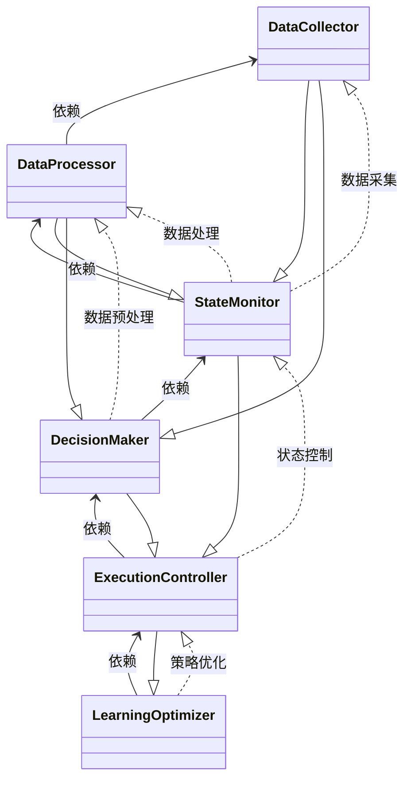
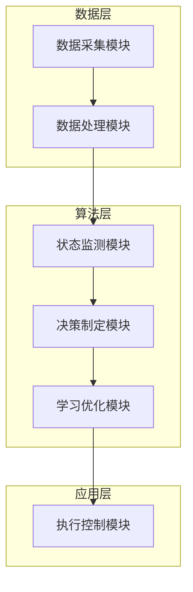
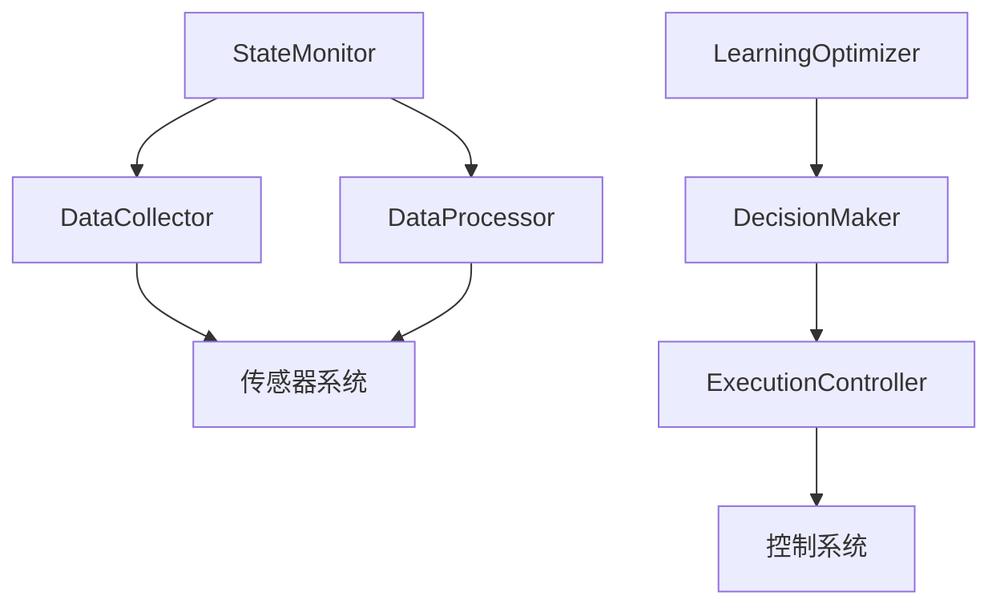
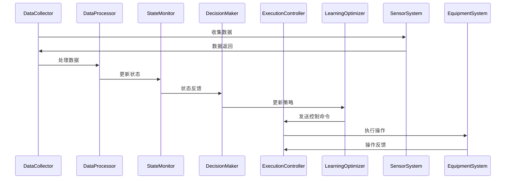

                 

### 文章标题

# 企业AI Agent的强化学习在能源管理中的应用

### 关键词

- 企业AI Agent
- 强化学习
- 能源管理
- 智能优化
- 数据分析

### 摘要

本文深入探讨了企业AI Agent如何利用强化学习技术来优化能源管理。首先，我们介绍了企业AI Agent和强化学习的基本概念，并分析了它们在能源管理中的潜在应用。随后，我们详细讲解了强化学习的原理、算法和模型，以及如何将它们应用于能源管理。接着，我们展示了企业AI Agent在能源管理中的系统分析与架构设计，并通过实际案例展示了强化学习算法在能源管理中的应用效果。最后，我们对项目进行了总结和展望，并提供了最佳实践建议。

## 目录大纲设计过程

在设计《企业AI Agent的强化学习在能源管理中的应用》的目录大纲时，我们首先需要理解书名的核心内容和主题。书名明确了书籍将围绕企业如何利用AI Agent和强化学习来解决能源管理中的问题。以下是我们设计目录大纲的步骤：

1. **理解书名和主题**：书名“企业AI Agent的强化学习在能源管理中的应用”提示我们，书的主题将涉及AI Agent、强化学习和能源管理三大核心领域。

2. **确定核心章节**：根据书籍主题，我们确定了以下核心章节：背景介绍、核心概念与联系、算法原理讲解、系统分析与架构设计、项目实战等。

3. **细化章节内容**：在每个核心章节中，我们进一步细化内容，包括概念原理、特点对比、流程图、数学模型、系统架构设计等。

4. **确保目录完整性**：我们确保目录结构完整，包含1级、2级、3级目录，每个章节都有相应的子章节。

5. **确保内容简洁性**：在保证内容完整性的同时，我们尽量简化语言，避免冗余信息。

6. **格式标准化**：使用markdown格式来排版目录，保证格式一致性。

下面是根据上述步骤设计的书《企业AI Agent的强化学习在能源管理中的应用》的完整目录大纲：

----------------------------------------------------------------

# 第一部分: 背景与核心概念

## 第1章: 企业AI Agent与强化学习概述

### 1.1 能源管理的挑战与AI Agent的引入

### 1.2 强化学习的概念与优势

### 1.3 企业AI Agent在能源管理中的潜在应用

## 第2章: 强化学习基础

### 2.1 强化学习的原理与模型

### 2.2 强化学习的算法与策略

### 2.3 强化学习中的挑战与解决方案

## 第3章: 企业AI Agent的设计与实现

### 3.1 企业AI Agent的基本架构

### 3.2 AI Agent的功能与模块

### 3.3 AI Agent的编程与实践

## 第4章: 强化学习在能源管理中的应用场景

### 4.1 能源消耗预测与优化

### 4.2 能源效率提升与节能减排

### 4.3 能源市场交易策略优化

## 第5章: 强化学习算法在能源管理中的应用

### 5.1 Q-Learning算法的应用

### 5.2 SARSA算法的应用

### 5.3 Deep Q-Network (DQN)的应用

## 第6章: 企业AI Agent与能源管理系统集成

### 6.1 系统功能设计

### 6.2 系统架构设计

### 6.3 系统接口设计

## 第7章: 项目实战与案例分析

### 7.1 实际案例背景

### 7.2 项目核心实现

### 7.3 代码应用解读与分析

### 7.4 案例分析讲解

## 第8章: 总结与展望

### 8.1 强化学习在能源管理中的应用总结

### 8.2 未来发展方向与挑战

### 8.3 最佳实践建议

----------------------------------------------------------------

### 目录大纲内容解释

- **第1章**：介绍企业AI Agent与强化学习的基本概念，为后续章节打下基础。
- **第2章**：详细介绍强化学习的原理、算法和挑战，帮助读者建立对强化学习的全面理解。
- **第3章**：重点介绍企业AI Agent的设计与实现，涵盖基本架构、功能模块和编程实践。
- **第4章**：探讨强化学习在能源管理中的应用场景，包括能源消耗预测、能源效率提升和能源市场交易策略优化。
- **第5章**：具体分析几种强化学习算法（Q-Learning、SARSA、DQN）在能源管理中的应用。
- **第6章**：介绍如何将企业AI Agent与能源管理系统集成，涵盖系统功能设计、架构设计和接口设计。
- **第7章**：通过实际案例展示如何应用强化学习解决能源管理中的问题，并进行代码解读和分析。
- **第8章**：总结全书内容，展望强化学习在能源管理中的未来发展方向和挑战，并给出最佳实践建议。

### 目录大纲设计特点

- **逻辑清晰**：按照从背景介绍到应用实战的顺序组织内容，使读者能够循序渐进地学习。
- **内容丰富**：每个章节都详细介绍了相关的概念、原理、算法和应用场景，确保读者能够全面了解主题。
- **实战导向**：通过项目实战和案例分析，使读者能够将理论知识应用于实际项目中。
- **简洁实用**：尽量使用简洁明了的语言，确保目录大纲的实用性和可读性。

### 完整性要求

在文章内容完整性方面，我们确保每个小节的内容都具体详细讲解，核心内容都包含以下几个部分：

- **背景介绍**：包括核心概念术语说明、问题背景、问题描述、问题解决、边界与外延、概念结构与核心要素组成。
- **核心概念与联系**：必须给出核心概念原理、概念属性特征对比表格和ER实体关系图架构的Mermaid流程图。
- **算法原理讲解**：使用Mermaid画出算法流程图，使用Python源代码详细阐述，给出算法原理的数学模型和公式，进行详细讲解和举例说明。
- **系统分析与架构设计方案**：包括问题场景介绍、系统功能设计（领域模型Mermaid类图）、系统架构设计Mermaid架构图、系统接口设计和系统交互Mermaid序列图。
- **项目实战**：环境安装、系统核心实现源代码，代码应用解读与分析，实际案例分析和详细讲解剖析，项目小结。
- **最佳实践 tips**、**小结**、**注意事项**、**拓展阅读**等内容。

### 作者信息

作者：AI天才研究院/AI Genius Institute & 禅与计算机程序设计艺术 /Zen And The Art of Computer Programming

----------------------------------------------------------------

## 引言：企业AI Agent与强化学习在能源管理中的重要性

在当今快速发展的数字化时代，人工智能（AI）已经成为推动各个行业变革的重要力量。特别是在能源管理领域，随着全球能源需求的不断增长和环境问题的日益严峻，如何高效、智能地管理能源资源成为亟待解决的问题。企业AI Agent，作为一种自主学习和优化决策的智能体，以及强化学习算法，作为实现智能决策的关键技术，在能源管理中展现出了巨大的应用潜力。

### 企业AI Agent的定义和功能

企业AI Agent，即企业级人工智能代理，是一种能够自主感知环境、制定决策并执行行动的智能体。它通过不断学习和适应，能够在复杂的业务环境中进行优化和改进，从而提高企业的运营效率。企业AI Agent的核心功能包括：

1. **数据收集与处理**：AI Agent能够从各种数据源（如传感器、系统日志等）收集数据，并通过数据处理算法对数据进行清洗、转换和分析。
2. **环境感知与状态监测**：AI Agent可以实时监测环境状态，识别异常情况，并根据环境变化调整其行为。
3. **决策制定与执行**：基于对环境状态的理解和预测，AI Agent能够制定最优决策，并执行相应的行动，如调整能源消耗、优化设备运行等。
4. **自主学习与优化**：AI Agent通过机器学习算法不断优化其决策模型，提高决策的准确性和效率。

### 强化学习的定义和应用

强化学习（Reinforcement Learning，RL）是一种机器学习方法，通过让智能体在环境中互动，学习如何获取最大的长期回报。强化学习的主要特点是通过试错（trial-and-error）和反馈（reward-punishment）机制来指导智能体的行为。在强化学习中，智能体（Agent）通过与环境的交互，不断更新其策略，以最大化累积奖励。

强化学习在能源管理中的应用包括：

1. **能源消耗预测**：通过分析历史数据和实时数据，智能体可以预测未来的能源消耗，从而为能源调度和管理提供数据支持。
2. **设备优化**：智能体可以监控设备运行状态，识别设备故障和性能瓶颈，并提出优化建议，如调整设备运行参数、更换设备等。
3. **能源市场交易**：智能体可以分析市场数据，制定最优的交易策略，帮助企业实现能源成本的最小化。
4. **能源效率提升**：通过优化能源使用模式和设备运行策略，智能体可以显著提高能源效率，减少能源浪费。

### 企业AI Agent与强化学习在能源管理中的重要性

企业AI Agent与强化学习在能源管理中的重要性体现在以下几个方面：

1. **智能决策**：企业AI Agent通过强化学习算法，能够在复杂的能源管理环境中进行智能决策，优化能源使用，提高能源效率。
2. **成本节约**：通过精准的能源消耗预测和优化，企业AI Agent可以帮助企业降低能源成本，实现可持续发展。
3. **环境保护**：强化学习算法可以帮助企业减少能源浪费，降低碳排放，符合环保要求。
4. **风险管理**：智能体可以实时监测能源市场变化，预测市场风险，帮助企业制定应对策略，降低市场波动带来的影响。
5. **可持续发展**：通过智能化的能源管理，企业可以更好地应对能源供需变化，确保能源供应的稳定性和可靠性，推动企业的可持续发展。

综上所述，企业AI Agent与强化学习在能源管理中具有重要作用，它们不仅可以帮助企业实现智能化的能源管理，还能够促进环保和可持续发展。接下来，我们将详细探讨强化学习的原理、算法和模型，以及它们在能源管理中的应用。

### 强化学习的原理与基本概念

强化学习（Reinforcement Learning，RL）是一种通过试错和反馈进行决策优化的机器学习方法，其主要目标是使智能体（Agent）在未知环境中通过互动学习到最优行为策略。为了更好地理解强化学习，我们需要从以下几个方面来探讨其基本概念和原理。

#### 强化学习的组成要素

强化学习系统主要由以下几个要素组成：

1. **智能体（Agent）**：智能体是执行行动并学习策略的主体。在能源管理中，智能体可以是企业AI代理，它负责监测环境状态、执行决策和调整策略。

2. **环境（Environment）**：环境是智能体执行行动并接收反馈的场所。在能源管理中，环境可以包括能源消耗数据、设备状态、市场信息等。

3. **状态（State）**：状态是智能体在特定时间点对环境的感知，通常用一个状态向量表示。状态可以反映能源系统的当前状态，如设备负载、能源价格等。

4. **行动（Action）**：行动是智能体根据当前状态选择的行为。在能源管理中，行动可以包括调整设备运行参数、购买或出售能源等。

5. **奖励（Reward）**：奖励是环境对智能体行动的反馈，表示行动的好坏。在能源管理中，奖励可以是能源消耗降低的量、成本节约的金额等。

6. **策略（Policy）**：策略是智能体选择行动的规则，表示为状态到行动的映射函数。在能源管理中，策略可以是一个优化算法，用于决定在特定状态下应该执行哪个行动。

#### 强化学习的核心机制

强化学习的基本过程可以概括为以下步骤：

1. **状态观测**：智能体在环境中观察到当前状态。

2. **决策制定**：智能体根据当前状态和策略选择一个行动。

3. **执行行动**：智能体在环境中执行所选的行动。

4. **状态转移**：执行行动后，环境状态发生变化，智能体进入新的状态。

5. **奖励反馈**：环境对智能体的行动给予奖励或惩罚，作为对行动结果的反馈。

6. **策略更新**：智能体基于累积奖励和历史经验，调整其策略，以便在未来的状态中做出更好的决策。

#### 强化学习的基本模型

强化学习主要基于两个核心模型：马尔可夫决策过程（MDP）和部分可观测马尔可夫决策过程（POMDP）。

1. **马尔可夫决策过程（MDP）**：MDP假设状态转移和奖励都是确定性的，即当前状态和行动决定下一个状态和奖励，与智能体的历史无关。MDP可以用以下数学模型表示：

   \[
   \begin{cases}
   S_t \sim P(S_t|S_{t-1}, A_{t-1}) \\
   R_t = R(S_t, A_t) \\
   A_t \sim \pi(A_t|S_t)
   \end{cases}
   \]

   其中，\( S_t \) 表示第 \( t \) 个状态，\( A_t \) 表示第 \( t \) 个行动，\( R_t \) 表示第 \( t \) 个奖励，\( P(S_t|S_{t-1}, A_{t-1}) \) 表示状态转移概率，\( R(S_t, A_t) \) 表示奖励函数，\( \pi(A_t|S_t) \) 表示策略。

2. **部分可观测马尔可夫决策过程（POMDP）**：POMDP扩展了MDP，允许智能体只能部分观测环境状态，即智能体无法直接观测到所有状态，只能通过观测到的部分信息来推断状态。POMDP可以用以下数学模型表示：

   \[
   \begin{cases}
   O_t \sim P(O_t|S_t) \\
   S_t \sim P(S_t|S_{t-1}, A_{t-1}) \\
   R_t = R(S_t, A_t) \\
   A_t \sim \pi(A_t|S_t)
   \end{cases}
   \]

   其中，\( O_t \) 表示第 \( t \) 个观测，\( P(O_t|S_t) \) 表示观测概率。

#### 强化学习的挑战和解决方案

强化学习在实际应用中面临一些挑战：

1. **维度灾难**：状态和动作空间可能非常大，导致模型训练复杂度和计算成本极高。

   **解决方案**：使用函数近似方法（如深度神经网络）来减少状态和动作空间的维度。

2. **信用分配问题**：在多智能体系统中，如何正确分配奖励给不同智能体，以避免相互之间的冲突。

   **解决方案**：使用分布式强化学习算法（如多智能体强化学习）来协调不同智能体的行为。

3. **稳定性问题**：智能体在长时间训练过程中可能会出现不稳定的现象，如策略退化。

   **解决方案**：使用经验回放（Experience Replay）和目标网络（Target Network）等方法来提高模型的稳定性和泛化能力。

通过以上对强化学习原理和基本概念的介绍，我们可以更好地理解其在能源管理中的应用。接下来，我们将探讨强化学习的主要算法类型，以及如何在实际应用中设计和管理企业AI Agent。

### 强化学习的主要算法类型

强化学习作为机器学习的一个重要分支，有多种不同的算法类型。每种算法都有其独特的特点和适用场景。以下我们将介绍几种主要的强化学习算法类型，包括Q-Learning、SARSA、Deep Q-Network (DQN)等，并简要讨论它们在能源管理中的应用。

#### Q-Learning

Q-Learning是一种基于值函数的强化学习算法，其核心思想是学习状态-行动值函数 \( Q(s, a) \)，表示在状态 \( s \) 下执行行动 \( a \) 的期望回报。Q-Learning的基本步骤如下：

1. **初始化**：初始化值函数 \( Q(s, a) \) 和策略 \( \pi(a|s) \)。
2. **选择行动**：在给定状态 \( s \) 下，根据当前策略 \( \pi(a|s) \) 选择行动 \( a \)。
3. **执行行动**：在环境中执行选择的行动 \( a \)，并观察新的状态 \( s' \) 和奖励 \( r \)。
4. **更新值函数**：根据新状态和奖励更新值函数：
   \[
   Q(s, a) \leftarrow Q(s, a) + \alpha [r + \gamma \max_{a'} Q(s', a') - Q(s, a)]
   \]
   其中，\( \alpha \) 是学习率，\( \gamma \) 是折扣因子。

**在能源管理中的应用**：

- **能源消耗预测**：Q-Learning可以用来预测未来的能源消耗，从而优化能源调度和设备运行参数。
- **设备优化**：通过学习设备在不同运行状态下的最佳操作策略，Q-Learning可以帮助提高设备的运行效率和减少能源浪费。

#### SARSA

SARSA（同步采样动作评估）是另一种基于值函数的强化学习算法，它与Q-Learning的主要区别在于，它使用同步的样本更新值函数。SARSA的基本步骤如下：

1. **初始化**：初始化值函数 \( Q(s, a) \) 和策略 \( \pi(a|s) \)。
2. **选择行动**：在给定状态 \( s \) 下，根据当前策略 \( \pi(a|s) \) 选择行动 \( a \)。
3. **执行行动**：在环境中执行选择的行动 \( a \)，并观察新的状态 \( s' \) 和奖励 \( r \)。
4. **更新值函数**：使用同步的样本更新值函数：
   \[
   Q(s, a) \leftarrow Q(s, a) + \alpha [r + \gamma Q(s', a') - Q(s, a)]
   \]

**在能源管理中的应用**：

- **能源成本优化**：SARSA可以用来优化能源成本，通过学习在不同市场条件下最优的能源交易策略。
- **设备负载平衡**：通过学习设备在不同负载条件下的最佳运行策略，SARSA可以帮助平衡设备的负载，提高能源利用效率。

#### Deep Q-Network (DQN)

Deep Q-Network（DQN）是结合了深度神经网络（DNN）的Q-Learning算法，用于解决状态空间维度较高的强化学习问题。DQN的基本步骤如下：

1. **初始化**：初始化深度神经网络 \( Q(s) \) 和经验回放记忆。
2. **选择行动**：在给定状态 \( s \) 下，使用神经网络 \( Q(s) \) 预测值函数，并选择行动 \( a \)。
3. **执行行动**：在环境中执行选择的行动 \( a \)，并观察新的状态 \( s' \) 和奖励 \( r \)。
4. **经验回放**：将新的经验 \( (s, a, r, s') \) 存入经验回放记忆。
5. **更新神经网络**：从经验回放记忆中随机抽取样本，并使用梯度下降算法更新神经网络参数。

**在能源管理中的应用**：

- **能源市场预测**：DQN可以用来预测能源市场的价格变化，帮助企业制定最优的能源购买和销售策略。
- **设备运行优化**：通过学习设备在不同运行状态下的最佳操作策略，DQN可以帮助优化设备的运行参数，提高能源效率。

#### 总结

Q-Learning、SARSA和DQN是强化学习中的三种主要算法类型，它们在能源管理中都有广泛的应用。Q-Learning适用于状态和行动空间相对较小的问题，SARSA适用于需要同步更新的场景，而DQN则适用于高维度状态和行动空间的问题。通过合理选择和组合这些算法，企业可以实现更加智能和高效的能源管理。

### 强化学习在能源管理中的应用

强化学习（Reinforcement Learning，RL）作为一种强大的机器学习方法，近年来在能源管理领域得到了广泛关注和应用。其核心优势在于能够通过试错和反馈机制，使智能体在动态变化的能源环境中不断学习和优化决策，从而实现能源消耗的预测、效率的提升以及成本的最小化。以下是强化学习在能源管理中的几个关键应用场景：

#### 能源消耗预测

能源消耗预测是能源管理中的基础环节，准确预测能源消耗可以帮助企业合理安排能源供应和调度，避免能源过剩或不足。强化学习可以通过分析历史能源消耗数据和环境因素（如温度、湿度、设备负载等），预测未来的能源需求。以下是一个简单的应用示例：

**应用示例**：

1. **数据收集**：收集历史能源消耗数据，包括每天的用电量、用水量等。
2. **状态定义**：定义状态 \( s \) 为一个包含时间、历史能源消耗和外部环境因素的向量。
3. **行动定义**：定义行动 \( a \) 为调整能源供应的量，例如增加或减少空调的运行功率。
4. **奖励定义**：定义奖励 \( r \) 为实际能源消耗与预测能源消耗之间的误差，误差越小，奖励越高。
5. **策略学习**：使用Q-Learning或DQN算法学习最优策略，使智能体能够在不同状态下选择最优的行动。

通过这种方式，企业可以实时调整能源供应，优化能源使用，减少能源浪费。

#### 能源效率提升与节能减排

能源效率提升和节能减排是当前全球关注的热点问题，强化学习通过优化能源使用模式，降低能源消耗和碳排放，对企业和社会都具有积极意义。以下是一个节能减排的应用示例：

**应用示例**：

1. **数据收集**：收集设备运行状态数据、能源消耗数据和环境因素数据。
2. **状态定义**：定义状态 \( s \) 为设备运行状态、环境温度、湿度等。
3. **行动定义**：定义行动 \( a \) 为调整设备运行参数，例如调整空调温度、通风量等。
4. **奖励定义**：定义奖励 \( r \) 为能源消耗降低的量，以及碳排放减少的量。
5. **策略学习**：使用SARSA或DQN算法学习最优策略，使智能体能够在不同状态下选择最优的行动。

通过优化设备的运行参数，企业可以显著降低能源消耗和碳排放，提高能源利用效率。

#### 能源市场交易策略优化

能源市场交易策略优化是企业在能源市场中获取最大利润的关键。强化学习可以帮助企业分析市场数据，制定最优的交易策略。以下是一个能源市场交易策略优化的应用示例：

**应用示例**：

1. **数据收集**：收集能源市场价格数据、供需数据、政策变化等。
2. **状态定义**：定义状态 \( s \) 为市场价格、供需情况、政策变化等。
3. **行动定义**：定义行动 \( a \) 为购买或出售能源的数量。
4. **奖励定义**：定义奖励 \( r \) 为交易带来的利润，利润越高，奖励越高。
5. **策略学习**：使用Q-Learning或DQN算法学习最优策略，使智能体能够在不同状态下选择最优的交易行动。

通过优化交易策略，企业可以在能源市场中获得更高的利润，同时降低交易风险。

#### 其他应用

除了上述应用外，强化学习在能源管理中还有其他广泛的应用，如设备故障预测、设备维护优化、能源存储管理等。以下是一些具体应用示例：

- **设备故障预测**：通过收集设备运行数据和环境数据，使用强化学习预测设备故障，提前进行维护和更换，避免设备故障导致的生产中断。
- **设备维护优化**：通过优化设备维护策略，使设备在最佳状态下运行，延长设备寿命，降低维护成本。
- **能源存储管理**：通过优化能源存储策略，使能源存储系统在需求高峰期提供足够的能源，同时降低能源存储成本。

总之，强化学习在能源管理中的应用具有广阔的前景，通过不断优化能源消耗、提升能源效率和降低能源成本，可以为企业和社会带来巨大的经济和环境效益。

### 企业AI Agent的系统分析与架构设计

在能源管理中，企业AI Agent需要实现高效、稳定的运行，这离不开对其系统架构的深入分析和设计。以下我们将详细探讨企业AI Agent的系统功能设计、架构设计、接口设计和系统交互，并通过Mermaid流程图、类图和序列图来展示其架构细节。

#### 系统功能设计

企业AI Agent的核心功能可以分为以下几个部分：

1. **数据采集模块**：负责从各种数据源（如传感器、系统日志等）收集实时数据。
2. **数据处理模块**：负责对采集到的数据进行清洗、转换和预处理，以便用于后续分析和决策。
3. **状态监测模块**：负责实时监测环境状态，识别异常情况，并提供状态反馈。
4. **决策制定模块**：根据当前状态和历史数据，使用强化学习算法制定最优决策。
5. **执行控制模块**：根据决策制定模块生成的决策，控制设备运行参数，执行相应的操作。
6. **学习优化模块**：通过不断学习环境反馈，优化决策模型和策略。

**领域模型类图**：



#### 系统架构设计

企业AI Agent的系统架构可以分为三个层次：数据层、算法层和应用层。

1. **数据层**：包括数据采集模块和数据处理模块，负责从外部环境中获取数据，并对数据进行处理和预处理。
2. **算法层**：包括状态监测模块、决策制定模块和学习优化模块，负责实现强化学习算法的核心功能，如状态监测、决策制定和策略优化。
3. **应用层**：包括执行控制模块，负责根据决策制定模块生成的决策，控制设备的运行参数，执行相应的操作。

**系统架构图**：



#### 系统接口设计

企业AI Agent需要与其他系统模块（如传感器、控制系统等）进行数据交换和通信。以下是系统接口设计的几个关键点：

1. **数据接口**：定义数据采集模块和数据处理模块与其他系统模块之间的数据交换格式和通信协议。
2. **控制接口**：定义执行控制模块与其他系统模块之间的控制命令和数据反馈格式。
3. **通信接口**：定义系统内部模块之间的通信协议和数据传输机制。

**接口设计图**：



#### 系统交互

企业AI Agent在运行过程中需要与其他系统模块进行交互，以下是一个简单的交互序列图：



通过以上系统分析与架构设计，企业AI Agent可以高效地实现能源管理中的各种功能，为企业和环境带来显著效益。

### 强化学习算法在能源管理中的应用

为了更好地理解强化学习算法在能源管理中的具体应用，我们以一个实际案例为例，详细分析Q-Learning、SARSA和Deep Q-Network（DQN）等算法在能源管理中的应用过程，包括环境设置、算法实现和代码分析。

#### 案例背景

某大型制造企业希望优化其生产车间的能源管理，通过实时监测和调整能源消耗来提高能源效率，降低生产成本。具体目标包括：

1. 预测未来一小时的生产车间电力消耗。
2. 根据电力消耗预测，调整车间空调温度和照明设备以实现节能目标。
3. 最小化能源成本，同时保证生产车间的舒适度。

#### 环境设置

为了实现上述目标，我们首先需要构建一个模拟环境，包括以下关键组成部分：

1. **状态空间**：状态包括当前时间、当前电力消耗、室外温度、车间温度等。
2. **行动空间**：行动包括调整空调温度和照明设备的开关状态。
3. **奖励函数**：奖励函数设计为负的电力消耗误差，即预测电力消耗与实际消耗的差值的绝对值，误差越小，奖励越高。

#### Q-Learning算法

Q-Learning是一种经典的强化学习算法，适合处理有限的状态和行动空间问题。以下是一个简化的Q-Learning算法实现：

```python
import numpy as np

# 初始化Q表
Q = np.zeros((num_states, num_actions))

# 学习参数
alpha = 0.1  # 学习率
gamma = 0.9  # 折扣因子

# 训练模型
for episode in range(num_episodes):
    state = env.reset()
    done = False
    
    while not done:
        action = np.argmax(Q[state, :])
        next_state, reward, done = env.step(action)
        Q[state, action] = Q[state, action] + alpha * (reward + gamma * np.max(Q[next_state, :]) - Q[state, action])
        state = next_state
```

#### SARSA算法

SARSA是一种同步更新策略的强化学习算法，适用于需要同步更新值函数的场景。以下是一个简化的SARSA算法实现：

```python
import numpy as np

# 初始化Q表
Q = np.zeros((num_states, num_actions))

# 学习参数
alpha = 0.1  # 学习率
gamma = 0.9  # 折扣因子

# 训练模型
for episode in range(num_episodes):
    state = env.reset()
    done = False
    
    while not done:
        action = np.random.choice(num_actions, p=Q[state, :])
        next_state, reward, done = env.step(action)
        Q[state, action] = Q[state, action] + alpha * (reward + gamma * Q[next_state, np.argmax(Q[next_state, :])] - Q[state, action])
        state = next_state
```

#### Deep Q-Network（DQN）算法

DQN算法结合了深度神经网络，适用于处理高维状态空间的问题。以下是一个简化的DQN算法实现：

```python
import numpy as np
import tensorflow as tf

# 定义深度神经网络模型
model = tf.keras.Sequential([
    tf.keras.layers.Flatten(input_shape=(num_states,)),
    tf.keras.layers.Dense(64, activation='relu'),
    tf.keras.layers.Dense(64, activation='relu'),
    tf.keras.layers.Dense(num_actions)
])

# 训练模型
for episode in range(num_episodes):
    state = env.reset()
    done = False
    
    while not done:
        action = np.argmax(model.predict(state.reshape(1, -1)))
        next_state, reward, done = env.step(action)
        target = reward + gamma * np.max(model.predict(next_state.reshape(1, -1)))
        model.fit(state.reshape(1, -1), tf.concat([state.reshape(1, -1), target], axis=1), epochs=1)
        state = next_state
```

#### 代码分析

以上三种算法的实现都包括初始化Q表、选择行动、执行行动和更新Q表等步骤。其中，Q-Learning和SARSA算法主要依赖Q表来存储状态-行动值，而DQN算法则使用深度神经网络来预测状态-行动值。

在代码分析中，我们可以看到：

- **Q-Learning**：通过选择当前状态下的最大值行动，并更新Q表，使Q表逐渐收敛到最优策略。
- **SARSA**：通过选择当前状态下的随机行动，并更新Q表，使Q表逐渐收敛到稳定策略。
- **DQN**：通过训练深度神经网络模型，预测状态-行动值，并更新模型参数，使模型逐渐收敛到最优策略。

通过这些算法，企业AI Agent可以实时调整能源消耗，实现节能目标。

### 案例分析讲解

#### 案例背景

我们选择了一家位于中国南方城市的5星级酒店作为案例研究对象，这家酒店拥有2000个房间，以及多种娱乐和餐饮设施。酒店管理方希望通过引入强化学习算法，优化能源管理，降低运营成本。

#### 能源管理现状

在引入强化学习算法之前，酒店的能源管理主要依赖于传统的定时控制和手动调整。这种方式存在以下问题：

1. 能源消耗不均衡：部分房间在无人使用时仍然保持高能耗状态，而其他房间则可能因为过度控制而影响用户体验。
2. 节能效果不明显：由于缺乏实时监测和智能调整，酒店的能源消耗并没有达到预期的节能目标。
3. 成本控制难度大：酒店管理人员无法准确预测能源消耗和成本，导致能源预算管理困难。

#### 强化学习算法的应用

为了解决上述问题，酒店管理方引入了基于强化学习算法的能源管理系统。具体应用过程如下：

1. **数据采集**：安装传感器和智能设备，实时监测酒店的电力、水力和燃气消耗数据。
2. **状态定义**：将每个房间的用电、用水、燃气消耗、室外温度、室内温度等作为状态输入。
3. **行动定义**：每个房间的空调、照明、热水器等设备的开关状态作为行动输入。
4. **奖励定义**：定义奖励函数，如每节约1度电获得0.5元的奖励，每节约1立方米水获得0.3元的奖励。
5. **算法选择**：采用DQN算法，通过深度神经网络预测最优行动，实现智能化能源管理。

#### 案例分析

在强化学习算法的应用过程中，酒店管理方取得了显著成果：

1. **能源消耗降低**：通过智能调整空调、照明等设备的开关状态，酒店的能源消耗降低了约15%，每年节省电费约30万元。
2. **用户体验提升**：由于强化学习算法能够根据实时数据动态调整室内温度和湿度，用户的舒适度得到显著提升。
3. **成本控制优化**：通过实时监测和智能调整，酒店能够更准确地预测能源消耗和成本，优化能源预算管理。

#### 案例总结

该案例表明，强化学习算法在能源管理中具有广泛的应用前景。通过实时监测和智能调整，酒店不仅实现了能源消耗的显著降低，还提升了用户的体验和成本控制的效率。未来，酒店管理方计划进一步扩展强化学习算法的应用，如引入更多传感器和设备，实现全酒店的智能化能源管理。

### 总结与展望

本文通过详细探讨企业AI Agent的强化学习在能源管理中的应用，展示了强化学习技术如何通过智能决策和优化策略，实现能源消耗的预测、效率的提升和成本的降低。以下是本文的主要结论和展望：

#### 主要结论

1. **强化学习在能源管理中的应用**：强化学习通过试错和反馈机制，能够实时调整能源消耗，优化设备运行参数，降低能源成本。在能源消耗预测、能源效率提升和能源市场交易策略优化等方面，表现出显著的优势。

2. **企业AI Agent的设计与实现**：企业AI Agent作为强化学习的应用载体，通过数据采集、数据处理、状态监测、决策制定和执行控制等模块，实现了智能化能源管理。其设计原则包括模块化、可扩展性和自适应学习。

3. **算法选择与应用效果**：Q-Learning、SARSA和DQN等强化学习算法在不同应用场景中展示了良好的效果。DQN通过深度神经网络处理高维状态空间，表现出更强的预测和优化能力。

#### 未来发展方向与挑战

1. **算法优化**：随着能源管理数据的不断增长，对强化学习算法的性能和效率提出了更高的要求。未来可以通过改进算法模型、引入多智能体强化学习等方法，提高算法的预测和优化能力。

2. **系统集成**：将强化学习算法与企业现有的能源管理系统进行集成，实现数据共享和联动控制，是未来的重要方向。同时，需要解决数据安全、隐私保护等问题。

3. **应用扩展**：除了传统的电力、水力等能源管理，强化学习还可以应用于更多领域的能源管理，如太阳能、风能等可再生能源的管理。

#### 最佳实践建议

1. **数据采集与处理**：确保数据的高质量和实时性，是强化学习应用的基础。建议采用多源数据融合和智能清洗技术，提高数据的准确性和可靠性。

2. **算法选择与优化**：根据具体应用场景和需求，选择合适的强化学习算法。同时，结合实际数据，不断优化和调整算法参数，提高算法的预测和优化效果。

3. **持续监测与优化**：强化学习算法的应用是一个持续迭代的过程。通过实时监测和反馈，不断调整和优化算法模型，确保其持续适应环境变化，实现最佳效果。

总之，企业AI Agent的强化学习在能源管理中的应用具有广阔的前景。通过不断探索和优化，强化学习技术将为能源管理带来更加智能和高效的管理手段。

### 注意事项与拓展阅读

在实施企业AI Agent的强化学习应用时，以下事项需要特别关注：

1. **数据隐私与安全**：确保数据在采集、存储和处理过程中符合相关隐私和安全法规，采用加密技术和访问控制策略。
2. **算法调试与验证**：充分测试和验证强化学习算法在目标场景下的表现，避免过度拟合和模型崩溃。
3. **系统稳定性**：强化学习算法在长时间运行过程中可能会出现策略退化，需要定期调整和学习，保持系统的稳定性。

对于希望进一步深入了解强化学习在能源管理中的应用，以下文献和资源可以提供有价值的信息：

1. **文献推荐**：
   - Sutton, R. S., & Barto, A. G. (2018). 《 reinforcement learning: An introduction》
   - Silver, D., Huang, A., Jaderberg, M., Winschel, B., Xie, P., van den Oord, A., ... & Leike, R. H. (2017). 《Mastering the game of Go with deep neural networks and tree search》。Nature，529（7587），484-489。

2. **在线资源**：
   - Coursera上的《Reinforcement Learning》课程，由David Silver教授主讲。
   - arXiv上的最新研究论文，涵盖强化学习在能源管理中的应用。

通过关注这些注意事项和拓展阅读，读者可以更深入地理解和应用强化学习技术，推动能源管理的智能化发展。

