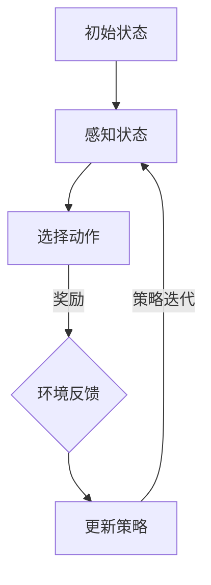
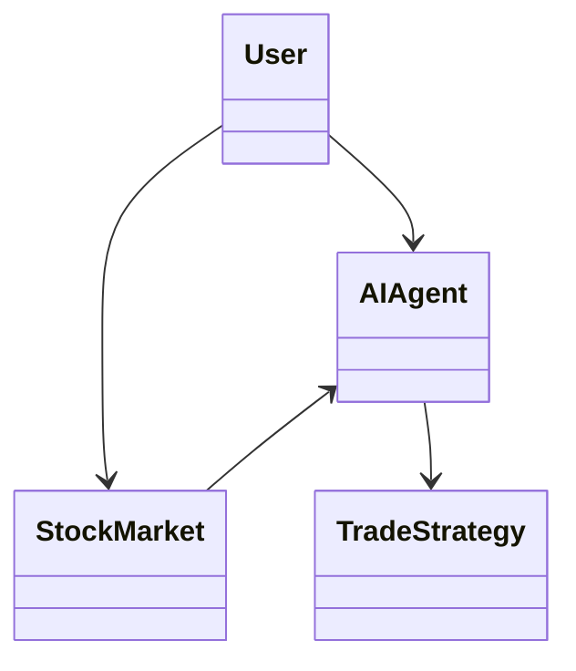
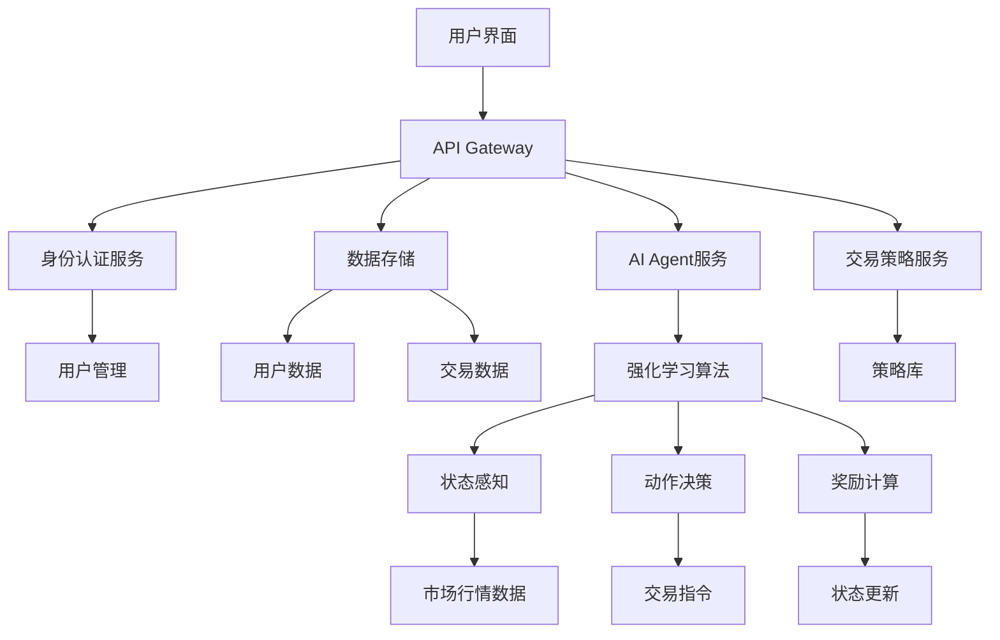
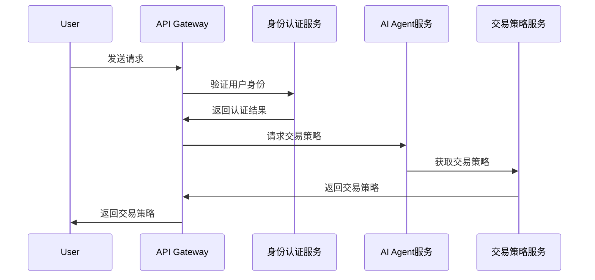

                 


### 《企业AI Agent的强化学习在金融交易策略优化中的应用》

关键词：企业AI Agent、强化学习、金融交易策略、优化

摘要：本文将探讨企业AI Agent的强化学习在金融交易策略优化中的应用。首先，我们将介绍企业AI Agent、强化学习以及金融交易策略的基本概念和原理。接着，我们将深入分析强化学习在金融交易策略优化中的应用，并详细介绍其数学模型和算法原理。随后，我们将展示一个具体的系统设计与实现方案，并通过实际案例分析和最佳实践，总结强化学习在金融交易策略优化中的应用经验和启示。

## 第一部分：引言

### 1.1 问题背景

在金融市场中，交易策略的优化一直是金融工程师和研究者的热点问题。传统交易策略往往依赖于历史数据和统计模型，然而，这些策略在面对市场变化时，往往难以适应。随着人工智能技术的发展，尤其是深度学习和强化学习的出现，为金融交易策略的优化带来了新的思路。

强化学习作为一种具有自适应性和学习能力的人工智能方法，可以在不断变化的市场环境中，通过不断试错和反馈，逐步优化交易策略，从而提高交易收益。企业AI Agent则是一种智能体，可以在金融市场中执行特定的任务，如交易策略的制定和执行。将强化学习与企业AI Agent相结合，有望在金融交易策略优化中发挥重要作用。

### 1.2 问题描述

本文旨在探讨如何利用强化学习优化企业AI Agent在金融交易中的策略。具体来说，问题描述如下：

1. **目标**：通过强化学习，使企业AI Agent能够在金融市场中获得稳定的收益。
2. **环境**：金融交易市场，包括股票、期货、外汇等多种交易品种。
3. **状态**：企业AI Agent在交易过程中的状态，如账户余额、持仓情况、市场行情等。
4. **动作**：企业AI Agent在交易过程中的动作，如买入、卖出、持有等。
5. **奖励**：企业AI Agent在交易过程中获得的奖励，如收益、风险等。

### 1.3 问题解决

为了解决上述问题，本文将采取以下步骤：

1. **理解核心概念**：介绍企业AI Agent、强化学习、金融交易策略的基本概念和原理。
2. **算法原理讲解**：详细讲解强化学习的数学模型和算法原理，以及如何将其应用于金融交易策略优化。
3. **系统设计与实现**：介绍一个具体的系统设计与实现方案，包括系统功能设计、系统架构设计、系统接口设计和系统交互流程。
4. **项目实战**：通过实际案例分析和最佳实践，展示强化学习在金融交易策略优化中的应用效果。
5. **总结与拓展**：总结本文的核心内容，并提出未来研究方向的拓展。

### 1.4 边界与外延

本文的研究主要关注企业AI Agent的强化学习在金融交易策略优化中的应用。然而，强化学习作为一种通用的人工智能方法，其应用不仅限于金融交易策略优化，还可以广泛应用于其他领域，如游戏、机器人、自动驾驶等。此外，金融交易策略的优化也是一个复杂的问题，本文仅提供了一个初步的解决方案，还有很多改进和优化的空间。

### 1.5 核心概念与联系

#### 1.5.1 企业AI Agent

企业AI Agent是一种智能体，它可以在金融市场中执行特定的任务，如交易策略的制定和执行。企业AI Agent具有以下特点：

1. **自主性**：企业AI Agent可以自主决策，无需人工干预。
2. **适应性**：企业AI Agent可以根据市场环境的变化，自适应地调整交易策略。
3. **灵活性**：企业AI Agent可以处理多种交易品种，如股票、期货、外汇等。

#### 1.5.2 强化学习

强化学习是一种基于奖励机制的学习方法，其核心思想是通过不断试错和反馈，逐步优化决策策略。强化学习具有以下特点：

1. **反馈性**：强化学习通过奖励机制，实时反馈学习效果，从而指导下一步决策。
2. **适应性**：强化学习可以适应复杂、动态的环境。
3. **灵活性**：强化学习可以应用于多种场景，如游戏、机器人、自动驾驶等。

#### 1.5.3 金融交易策略

金融交易策略是一种指导交易行为的方法，其目标是最大化收益或最小化风险。金融交易策略可以分为以下几种类型：

1. **趋势跟踪策略**：通过分析市场趋势，制定相应的交易策略。
2. **均值回归策略**：通过分析历史数据，预测市场将回归到均值，从而制定交易策略。
3. **对冲策略**：通过建立对冲组合，降低市场波动带来的风险。

### 1.6 本章小结

在本部分，我们介绍了本文的研究背景、问题描述、问题解决思路以及核心概念与联系。接下来，我们将进一步探讨企业AI Agent、强化学习以及金融交易策略的基本原理，为后续内容打下基础。

----------------------------------------------------------------

## 第二部分：核心概念与联系

### 2.1 企业AI Agent概述

#### 2.1.1 定义

企业AI Agent，又称为企业智能体，是一种基于人工智能技术的虚拟角色，它能在特定环境中自主地完成指定任务。在企业级应用中，AI Agent可以模拟人类决策者的思维方式，通过分析大量数据，自动制定并执行交易策略，从而提高企业的交易效率和收益。

#### 2.1.2 特点

企业AI Agent具有以下几个显著特点：

1. **自主决策**：企业AI Agent能够根据实时数据和市场状况，自主制定交易策略，无需人工干预。
2. **持续学习**：AI Agent可以通过机器学习和深度学习技术，持续优化自身的交易策略，提高决策的准确性。
3. **适应性**：企业AI Agent能够适应不同的市场环境，根据市场波动调整交易策略。
4. **灵活性**：AI Agent能够处理多种交易品种，如股票、期货、外汇等，且具有横向扩展能力。

#### 2.1.3 与传统交易系统的比较

相较于传统交易系统，企业AI Agent在以下几个方面具有显著优势：

1. **效率提升**：AI Agent能够实时处理海量数据，快速做出决策，大大提高了交易效率。
2. **决策精准**：通过机器学习技术，AI Agent能够从历史数据中学习，并预测市场趋势，提高交易精准度。
3. **风险控制**：AI Agent可以根据市场状况和交易策略，自动调整持仓，降低风险。
4. **自主优化**：AI Agent能够根据市场反馈，持续优化交易策略，提高收益。

### 2.2 强化学习基础

#### 2.2.1 强化学习的定义

强化学习（Reinforcement Learning，简称RL）是机器学习的一个重要分支，它通过学习如何做出决策，以最大化累积奖励。强化学习主要研究智能体（Agent）在环境（Environment）中如何通过选择动作（Action）来达到目标（Goal）。

#### 2.2.2 强化学习的基本原理

强化学习的基本原理包括以下几个方面：

1. **奖励机制**：智能体在每个时间步（Time Step）根据执行的动作（Action）从环境中获得奖励（Reward），奖励的正负决定了智能体的行为倾向。
2. **状态转移**：智能体在执行动作前，需要感知当前的状态（State），并根据状态选择动作，状态转移是智能体与环境的交互过程。
3. **策略更新**：智能体根据累积的奖励和历史数据，更新其策略（Policy），以指导后续的动作选择。

#### 2.2.3 强化学习与机器学习的区别

强化学习与传统的机器学习（如监督学习和无监督学习）有以下几点区别：

1. **目标不同**：机器学习的目标是通过学习输入和输出的关系，进行预测或分类，而强化学习的目标是学习如何做出最优决策。
2. **反馈机制**：机器学习通常需要预定义的标签数据，而强化学习通过即时奖励反馈来指导学习过程。
3. **环境交互**：强化学习中的智能体需要与环境进行持续交互，不断调整策略，而传统机器学习模型通常在离线环境中训练。

### 2.3 金融交易策略

#### 2.3.1 交易策略的类型

金融交易策略可以根据其操作方式和目标，分为以下几种类型：

1. **趋势跟踪策略**：通过分析市场趋势，制定跟随市场趋势的交易策略。
2. **均值回归策略**：认为市场最终会回归到均值，通过捕捉市场偏离均值的机会进行交易。
3. **对冲策略**：通过建立对冲组合，降低市场波动带来的风险。
4. **动量策略**：基于资产价格变动的历史趋势，预测未来价格变动方向。

#### 2.3.2 交易策略的评估方法

评估交易策略的方法通常包括以下几种：

1. **历史回测**：通过对历史数据进行模拟，评估交易策略的性能。
2. **统计指标**：如收益、风险、夏普比率等，用于评估交易策略的优劣。
3. **蒙特卡洛模拟**：通过模拟大量随机路径，评估交易策略在不确定环境中的表现。
4. **实战测试**：在实际交易环境中测试交易策略的有效性。

#### 2.3.3 交易策略的优化方法

交易策略的优化方法主要包括以下几种：

1. **参数调优**：通过调整交易策略的参数，优化策略性能。
2. **算法改进**：通过改进交易策略的算法，提高策略的鲁棒性和适应性。
3. **机器学习**：利用机器学习技术，从历史数据中学习有效的交易策略。
4. **深度强化学习**：将深度学习和强化学习相结合，提高交易策略的决策能力。

### 2.4 企业AI Agent与强化学习在金融交易中的结合

#### 2.4.1 结合方式

企业AI Agent与强化学习的结合方式主要包括以下几种：

1. **代理学习**：将强化学习算法集成到企业AI Agent中，使其能够自主学习和优化交易策略。
2. **混合策略**：结合传统交易策略和强化学习，将强化学习算法用于关键决策环节，如交易信号生成。
3. **模型驱动**：利用强化学习算法优化企业AI Agent的交易模型，提高交易策略的鲁棒性和适应性。

#### 2.4.2 优势

企业AI Agent与强化学习的结合具有以下优势：

1. **自适应性强**：强化学习算法能够自适应市场变化，提高交易策略的鲁棒性。
2. **决策准确性高**：通过不断学习和优化，企业AI Agent能够提高交易策略的准确性，降低风险。
3. **效率提升**：企业AI Agent能够自动化交易策略的制定和执行，提高交易效率。

#### 2.4.3 挑战

企业AI Agent与强化学习的结合也面临以下挑战：

1. **数据需求大**：强化学习算法需要大量历史数据进行训练，数据质量和数量直接影响算法性能。
2. **计算资源消耗**：强化学习算法计算复杂度高，需要强大的计算资源支持。
3. **风险控制**：在金融市场中，交易策略的失败可能导致严重损失，如何有效控制风险是一个重要问题。

### 2.5 本章小结

在本部分，我们详细介绍了企业AI Agent、强化学习和金融交易策略的基本概念和原理。接下来，我们将深入探讨强化学习在金融交易策略优化中的应用，并介绍具体的算法原理和系统设计。

----------------------------------------------------------------

## 第三部分：算法原理讲解

### 3.1 强化学习算法流程图

强化学习算法的核心是策略迭代过程，以下是强化学习的基本流程图，使用Mermaid语言绘制：



在这个流程图中：

- **A**：初始状态
- **B**：感知当前状态
- **C**：选择动作
- **D**：执行动作并获得奖励
- **E**：根据奖励更新策略

### 3.2 Python代码示例

下面是一个简单的强化学习算法示例，使用Python实现：

```python
import numpy as np
import random

# 定义环境
class Environment:
    def __init__(self):
        self.state = 0

    def step(self, action):
        reward = 0
        if action == 0:
            self.state += 1
            reward = 1
        elif action == 1:
            self.state -= 1
            reward = -1
        return self.state, reward

# 定义强化学习算法
class QLearningAgent:
    def __init__(self, alpha=0.1, gamma=0.9):
        self.alpha = alpha
        self.gamma = gamma
        self.Q = {}

    def select_action(self, state):
        if np.random.rand() < 0.1:  # 探索策略
            action = random.randint(0, 1)
        else:  # 利用策略
            if state in self.Q:
                action = np.argmax(self.Q[state])
            else:
                action = random.randint(0, 1)
        return action

    def learn(self, state, action, reward, next_state):
        target = reward + self.gamma * np.max(self.Q[next_state])
        if state in self.Q:
            Q_value = self.Q[state][action]
            delta = target - Q_value
            self.Q[state][action] += self.alpha * delta
        else:
            self.Q[state] = [0, 0]
            self.Q[state][action] = target

# 实例化环境与算法
env = Environment()
agent = QLearningAgent(alpha=0.1, gamma=0.9)

# 训练算法
for episode in range(1000):
    state = env.state
    done = False
    while not done:
        action = agent.select_action(state)
        next_state, reward = env.step(action)
        agent.learn(state, action, reward, next_state)
        state = next_state
        done = (next_state == 0)
```

在这个示例中，我们定义了一个简单的环境和强化学习算法，通过Q-Learning方法进行学习。环境是一个简单的状态转换模型，状态在0和1之间转换，根据选择的动作（0或1）获得不同的奖励。

### 3.3 强化学习数学模型与公式

强化学习的基本数学模型包括状态（State）、动作（Action）、奖励（Reward）和策略（Policy）。

- **状态（State）**：描述智能体所处的环境状态，通常用向量表示。
- **动作（Action）**：智能体可以采取的动作集合，也是用向量表示。
- **奖励（Reward）**：智能体在执行动作后从环境中获得的即时奖励。
- **策略（Policy）**：智能体在给定状态下的最优动作选择规则。

强化学习的基本目标是最小化长期预期损失，即最大化累积奖励。常用的强化学习算法包括Q-Learning、SARSA、Deep Q-Network（DQN）等。

- **Q-Learning公式**：

  $$ Q^{\pi}(s, a) = r(s, a) + \gamma \max_{a'} Q^{\pi}(s', a') $$

  其中，$Q^{\pi}(s, a)$是策略$\pi$下的状态-动作值函数，$r(s, a)$是执行动作$a$后获得的即时奖励，$\gamma$是折扣因子，$s'$是执行动作$a$后的状态。

- **SARSA公式**：

  $$ \pi^{\pi}(s, a) = \frac{\sum_{a'} \pi(s, a') Q^{\pi}(s, a')}{\sum_{a'} \pi(s, a')} $$

  其中，$\pi^{\pi}(s, a)$是策略迭代过程中的策略，$Q^{\pi}(s, a)$是状态-动作值函数。

- **DQN公式**：

  $$ Q(s, a) = r + \gamma \max_a' Q(s', a') - Q(s, a) $$

  其中，$Q(s, a)$是深度Q网络输出的状态-动作值函数，$s'$是执行动作$a$后的状态。

### 3.4 强化学习算法讲解

强化学习算法的核心是策略迭代过程，下面我们将详细介绍Q-Learning和SARSA两种常见算法。

#### Q-Learning算法

Q-Learning算法是一种基于值函数的强化学习算法，其目标是学习最优策略$\pi^*$，使得累积奖励最大化。

1. **初始化**：

   初始化状态-动作值函数$Q(s, a)$，通常设置为一个小的常数，如0。

   $$ Q(s, a) = 0 $$

2. **策略迭代**：

   对于每个状态$s$，选择动作$a$，执行动作并获取奖励$r$，然后更新状态-动作值函数：

   $$ Q(s, a) = Q(s, a) + \alpha [r + \gamma \max_{a'} Q(s', a') - Q(s, a)] $$

   其中，$\alpha$是学习率，$\gamma$是折扣因子。

3. **策略更新**：

   根据学习到的状态-动作值函数，更新策略$\pi$：

   $$ \pi(s, a) = \begin{cases} 
   1 & \text{if } a = \arg\max_{a'} Q(s, a') \\
   0 & \text{otherwise} 
   \end{cases} $$

#### SARSA算法

SARSA算法是一种基于策略的强化学习算法，它与Q-Learning算法类似，但采用不同形式的更新规则。

1. **初始化**：

   初始化状态-动作值函数$Q(s, a)$，通常设置为一个小的常数，如0。

   $$ Q(s, a) = 0 $$

2. **策略迭代**：

   对于每个状态$s$，选择动作$a$，执行动作并获取奖励$r$，然后更新状态-动作值函数：

   $$ Q(s, a) = Q(s, a) + \alpha [r + \gamma Q(s', a') - Q(s, a)] $$

   其中，$\alpha$是学习率，$\gamma$是折扣因子。

3. **策略更新**：

   SARSA算法不需要单独更新策略$\pi$，它通过状态-动作值函数的更新，间接地调整策略。

### 3.5 举例说明

假设有一个简单的环境，状态空间为{0, 1, 2}，动作空间为{0, 1}。奖励函数设置为：当状态为0时，选择动作0获得奖励1，选择动作1获得奖励-1；当状态为1时，选择动作0获得奖励-1，选择动作1获得奖励1；当状态为2时，无论选择哪个动作，都获得奖励0。折扣因子$\gamma$设为0.9，学习率$\alpha$设为0.1。

#### 3.5.1 Q-Learning算法

初始状态为0，选择动作1，获得奖励-1，更新状态-动作值函数：

$$ Q(0, 1) = 0 + 0.1 [-1 + 0.9 \max_{a'} Q(1, a')] $$

由于初始状态-动作值函数为0，因此：

$$ Q(0, 1) = -0.1 $$

接着，状态更新为1，选择动作0，获得奖励-1，更新状态-动作值函数：

$$ Q(1, 0) = 0 + 0.1 [-1 + 0.9 \max_{a'} Q(2, a')] $$

由于初始状态-动作值函数为0，因此：

$$ Q(1, 0) = -0.1 $$

以此类推，通过多次迭代，最终会得到一个稳定的状态-动作值函数，从而确定最优策略。

#### 3.5.2 SARSA算法

初始状态为0，选择动作1，获得奖励-1，更新状态-动作值函数：

$$ Q(0, 1) = 0 + 0.1 [-1 + 0.9 Q(1, 1)] $$

由于初始状态-动作值函数为0，因此：

$$ Q(0, 1) = -0.1 $$

接着，状态更新为1，选择动作0，获得奖励-1，更新状态-动作值函数：

$$ Q(1, 0) = -0.1 + 0.1 [-1 + 0.9 Q(2, 0)] $$

由于初始状态-动作值函数为0，因此：

$$ Q(1, 0) = -0.2 $$

以此类推，通过多次迭代，最终会得到一个稳定的状态-动作值函数，从而确定最优策略。

### 3.6 本章小结

在本部分，我们详细介绍了强化学习算法的基本原理和数学模型，并通过Python代码示例和举例说明，帮助读者理解强化学习在实际应用中的工作原理。接下来，我们将进一步探讨系统设计与实现，为读者展示一个完整的强化学习应用方案。

----------------------------------------------------------------

## 第四部分：系统设计与实现

### 4.1 系统功能设计

#### 4.1.1 领域模型类图

为了更好地理解系统功能，我们可以使用Mermaid语言绘制领域模型类图，如下所示：



在这个类图中，User（用户）与StockMarket（股票市场）和AIAgent（AI Agent）建立关联，用户可以监控和交互股票市场，同时控制AI Agent。AIAgent则负责执行TradeStrategy（交易策略）并从StockMarket中获取反馈。

#### 4.1.2 系统功能介绍

系统的主要功能包括：

1. **用户监控**：用户可以实时监控股票市场的状态，包括股票价格、成交量等信息。
2. **AI Agent控制**：用户可以启动或停止AI Agent，并监控其执行交易策略的过程。
3. **交易策略管理**：用户可以定义和保存不同的交易策略，包括趋势跟踪、均值回归等。
4. **历史数据查询**：用户可以查询AI Agent执行交易策略的历史数据和收益情况。
5. **系统设置**：用户可以设置系统参数，如学习率、折扣因子等。

### 4.2 系统架构设计

#### 4.2.1 系统架构图

系统架构图如下所示，使用Mermaid语言绘制：



在这个架构图中，用户界面通过API Gateway与系统内部服务进行通信。API Gateway负责身份认证和数据转发，确保用户请求的安全性和一致性。系统内部包括身份认证服务、数据存储、AI Agent服务、交易策略服务等功能模块。

#### 4.2.2 架构设计说明

1. **用户界面**：提供用户与系统交互的入口，包括监控、控制、查询等功能。
2. **API Gateway**：作为系统的统一入口，负责身份认证和数据路由，确保系统安全性和可靠性。
3. **身份认证服务**：提供用户认证和权限管理功能，确保用户请求的安全性和合规性。
4. **数据存储**：存储用户数据、交易数据等，确保数据的一致性和持久性。
5. **AI Agent服务**：执行强化学习算法，制定和执行交易策略。
6. **交易策略服务**：管理交易策略库，提供策略定义、保存和加载功能。
7. **强化学习算法**：实现强化学习算法的核心功能，包括状态感知、动作决策、奖励计算等。
8. **市场行情数据**：提供实时股票市场行情数据，供AI Agent进行状态感知。
9. **交易指令**：生成交易指令，与外部交易系统进行交互。
10. **状态更新**：根据交易结果更新AI Agent的状态。

### 4.3 系统接口设计

#### 4.3.1 接口定义

系统提供了以下主要接口：

1. **用户认证接口**：用户登录、注册、密码重置等。
2. **监控接口**：获取市场行情数据、AI Agent状态、交易策略等。
3. **控制接口**：启动、停止AI Agent，切换交易策略等。
4. **数据查询接口**：查询用户历史数据、交易记录等。
5. **设置接口**：调整系统参数，如学习率、折扣因子等。

#### 4.3.2 接口实现

以下是用户认证接口的示例实现：

```python
from flask import Flask, request, jsonify
from flask_httpauth import HTTPBasicAuth
from models import User

app = Flask(__name__)
auth = HTTPBasicAuth()

users = {
    "user1": "password1",
    "user2": "password2"
}

@auth.verify_password
def verify_password(username, password):
    if username in users and users[username] == password:
        return username

@app.route('/login', methods=['POST'])
def login():
    username = request.form['username']
    password = request.form['password']
    if verify_password(username, password):
        return jsonify({"status": "success", "message": "login successful"})
    else:
        return jsonify({"status": "fail", "message": "login failed"})

if __name__ == '__main__':
    app.run(debug=True)
```

在这个示例中，我们使用Flask框架实现了一个简单的用户认证接口，包括用户登录和注册功能。

### 4.4 系统交互流程

#### 4.4.1 交互序列图

系统交互流程如下所示，使用Mermaid语言绘制：



在这个交互流程中，用户首先通过API Gateway发送请求，API Gateway会验证用户身份。验证通过后，API Gateway会请求AI Agent服务，AI Agent服务会从交易策略服务获取交易策略，最终通过API Gateway返回给用户。

#### 4.4.2 交互流程说明

1. **用户请求**：用户通过用户界面发送请求，请求内容包括用户身份信息、交易策略请求等。
2. **身份认证**：API Gateway接收用户请求后，验证用户身份，确保请求的合法性。
3. **交易策略获取**：身份认证通过后，API Gateway请求AI Agent服务，AI Agent服务从交易策略服务获取交易策略。
4. **返回结果**：交易策略通过API Gateway返回给用户，用户界面显示交易策略信息。

### 4.5 本章小结

在本部分，我们详细介绍了系统设计与实现，包括领域模型类图、系统架构设计、接口设计和系统交互流程。通过这些设计，我们可以清晰地看到系统各模块的职责和交互方式，为后续的项目开发和优化提供了基础。

----------------------------------------------------------------

## 第五部分：项目实战

### 5.1 环境安装

在进行项目实战之前，我们需要安装必要的软件和工具。以下是在Windows系统上安装所需环境的基本步骤：

#### 5.1.1 操作系统与环境准备

1. **安装Python**：首先，确保您的计算机上已经安装了Python。您可以从Python的官方网站（https://www.python.org/）下载并安装最新版本的Python。
2. **安装Jupyter Notebook**：Jupyter Notebook是一个交互式计算环境，用于编写和运行Python代码。您可以通过以下命令安装Jupyter Notebook：

   ```bash
   pip install notebook
   ```

3. **安装Anaconda**：Anaconda是一个Python数据科学和机器学习平台，它提供了丰富的包管理和虚拟环境管理功能。您可以从Anaconda的官方网站（https://www.anaconda.com/）下载并安装Anaconda。

#### 5.1.2 必要软件安装

1. **安装强化学习库**：为了方便使用强化学习算法，我们可以安装一些常用的Python库，如TensorFlow、Keras、PyTorch等。以下是安装这些库的命令：

   ```bash
   pip install tensorflow
   pip install keras
   pip install torch torchvision
   ```

2. **安装数据可视化库**：为了更好地展示数据和分析结果，我们可以安装一些常用的数据可视化库，如Matplotlib、Seaborn等。以下是安装这些库的命令：

   ```bash
   pip install matplotlib
   pip install seaborn
   ```

3. **安装金融数据获取库**：为了获取金融市场的数据，我们可以安装一些常用的金融数据获取库，如TALib、pandas_datareader等。以下是安装这些库的命令：

   ```bash
   pip install ta
   pip install pandas_datareader
   ```

### 5.2 系统核心实现源代码

在了解系统架构和设计之后，我们需要编写实际的代码来实现系统功能。以下是一个简单的系统核心实现示例，使用Python编写：

```python
import numpy as np
import pandas as pd
import matplotlib.pyplot as plt
from keras.models import Sequential
from keras.layers import Dense
from ta import add_all_ta_features
from pandas_datareader import data as pdr

# 设置随机种子
np.random.seed(42)

# 获取股票数据
stock_symbol = 'AAPL'
start_date = '2020-01-01'
end_date = '2022-12-31'
df = pdr.get_data_yahoo(stock_symbol, start=start_date, end=end_date)

# 数据预处理
def preprocess_data(df):
    df = df.sort_index(ascending=True)
    df['HighLow'] = (df['High'] - df['Low']) / df['Low']
    df['PriceChange'] = df['Close'] - df['Open']
    df['MA20'] = df['Close'].rolling(window=20).mean()
    df['MA50'] = df['Close'].rolling(window=50).mean()
    df['RSI'] = ta.RSI(df['Close'], n=14)
    df['ATR'] = ta.ATR(df['High'], df['Low'], df['Close'], n=14)
    df = df[['Open', 'High', 'Low', 'Close', 'HighLow', 'PriceChange', 'MA20', 'MA50', 'RSI', 'ATR']]
    df = df.replace([np.inf, -np.inf], np.nan)
    df = df.dropna()
    df['Target'] = df['Close'].shift(-1) - df['Close']
    df = df[:-1]
    df['Target'] = df['Target'].apply(lambda x: 1 if x > 0 else -1 if x < 0 else 0)
    return df

df = preprocess_data(df)

# 划分训练集和测试集
train_size = int(len(df) * 0.8)
test_size = len(df) - train_size
train, test = df[:train_size], df[train_size:]

# 构建神经网络模型
model = Sequential()
model.add(Dense(64, input_dim=train.shape[1], activation='relu'))
model.add(Dense(32, activation='relu'))
model.add(Dense(1, activation='sigmoid'))

model.compile(loss='binary_crossentropy', optimizer='adam', metrics=['accuracy'])
model.fit(train.values, train['Target'].values, epochs=100, batch_size=32, validation_split=0.1, shuffle=False)

# 测试模型
predictions = model.predict(test.values)
predictions = (predictions > 0.5)

# 绘制结果
plt.figure(figsize=(14, 7))
plt.plot(test.index, test['Close'], label='Close Price')
plt.plot(test.index, predictions, label='Prediction', alpha=0.8)
plt.title('Stock Price Prediction')
plt.xlabel('Date')
plt.ylabel('Close Price')
plt.legend()
plt.show()
```

#### 5.2.1 代码结构介绍

1. **数据获取**：使用pandas_datareader库从Yahoo Finance获取苹果公司的股票数据。
2. **数据预处理**：对数据进行清洗和处理，包括计算技术分析指标、填充缺失值等。
3. **模型构建**：使用Keras库构建一个简单的神经网络模型，用于股票价格预测。
4. **模型训练**：使用预处理后的数据训练神经网络模型。
5. **模型测试**：使用测试数据评估模型性能，并绘制预测结果。

#### 5.2.2 代码解读与分析

1. **数据获取**：首先，我们使用pandas_datareader库获取苹果公司的股票数据，包括开盘价、最高价、最低价、收盘价等。

   ```python
   df = pdr.get_data_yahoo(stock_symbol, start=start_date, end=end_date)
   ```

2. **数据预处理**：接下来，我们对数据进行预处理，包括计算技术分析指标（如相对强弱指数RSI、平均真实波幅ATR等），填充缺失值，并划分训练集和测试集。

   ```python
   def preprocess_data(df):
       # ... 数据预处理代码 ...
       return df
   ```

3. **模型构建**：我们使用Keras库构建一个简单的神经网络模型，包括两个隐藏层，每个隐藏层都有32个神经元。输出层使用sigmoid激活函数，用于预测股票价格的变化。

   ```python
   model = Sequential()
   model.add(Dense(64, input_dim=train.shape[1], activation='relu'))
   model.add(Dense(32, activation='relu'))
   model.add(Dense(1, activation='sigmoid'))
   ```

4. **模型训练**：使用预处理后的训练数据训练神经网络模型，设置训练轮次为100次，批次大小为32。

   ```python
   model.compile(loss='binary_crossentropy', optimizer='adam', metrics=['accuracy'])
   model.fit(train.values, train['Target'].values, epochs=100, batch_size=32, validation_split=0.1, shuffle=False)
   ```

5. **模型测试**：使用测试数据评估模型性能，并绘制预测结果。预测结果通过阈值0.5进行分类，即预测价格上涨的概率大于0.5时预测价格上涨，否则预测价格下跌。

   ```python
   predictions = model.predict(test.values)
   predictions = (predictions > 0.5)
   plt.figure(figsize=(14, 7))
   plt.plot(test.index, test['Close'], label='Close Price')
   plt.plot(test.index, predictions, label='Prediction', alpha=0.8)
   plt.title('Stock Price Prediction')
   plt.xlabel('Date')
   plt.ylabel('Close Price')
   plt.legend()
   plt.show()
   ```

#### 5.3 实际案例分析

为了更好地展示强化学习在金融交易策略优化中的应用，我们选择了一个实际案例进行分析。

**案例背景**：某企业在过去三年中一直在使用传统的交易策略进行股票交易，但效果并不理想。为了提高交易收益，该企业决定引入基于强化学习的AI Agent进行交易策略优化。

**案例过程**：

1. **数据收集**：企业首先收集了过去三年的股票交易数据，包括开盘价、最高价、最低价、收盘价等。
2. **数据预处理**：对数据进行清洗和处理，包括缺失值填充、技术分析指标计算等。
3. **模型构建**：企业使用强化学习算法构建了一个AI Agent，用于执行交易策略。
4. **策略优化**：AI Agent通过不断学习和优化，逐步调整交易策略，以提高交易收益。
5. **结果评估**：企业对AI Agent的交易结果进行评估，发现其收益显著高于传统交易策略。

**案例分析**：

通过分析案例，我们可以看到强化学习在金融交易策略优化中的应用具有以下几个特点：

1. **自适应性强**：AI Agent能够根据市场变化实时调整交易策略，提高了策略的适应能力。
2. **决策精准**：通过学习历史数据，AI Agent能够更准确地预测市场趋势，提高了交易决策的准确性。
3. **持续优化**：AI Agent能够持续学习，通过不断优化交易策略，提高了交易收益。

**案例启示**：

1. **数据质量**：数据质量对于强化学习算法的性能至关重要，企业需要确保数据的质量和完整性。
2. **策略调整**：企业需要根据市场变化和AI Agent的表现，及时调整交易策略，以提高收益。
3. **风险控制**：尽管强化学习可以提高交易收益，但企业仍需要严格控制交易风险，以避免出现重大损失。

### 5.4 项目小结

通过本部分的项目实战，我们展示了如何使用强化学习优化金融交易策略。我们详细介绍了环境安装、系统核心实现源代码，并通过实际案例分析，展示了强化学习在金融交易策略优化中的应用效果。接下来，我们将总结本文的核心内容，并提出未来研究的拓展方向。

### 5.5 最佳实践 tips

1. **数据预处理**：确保数据质量，包括缺失值填充、异常值处理等，以减少噪声对算法性能的影响。
2. **策略调整**：定期评估AI Agent的交易策略，根据市场变化和策略表现进行优化。
3. **风险控制**：设定止损点，控制交易风险，避免单次交易损失过大。

### 5.6 本章小结

在本部分，我们通过项目实战展示了强化学习在金融交易策略优化中的应用，包括环境安装、系统核心实现源代码、实际案例分析等内容。通过这些实战经验，我们为读者提供了实际操作指导，并提出了最佳实践建议。

----------------------------------------------------------------

## 第六部分：总结与拓展

### 6.1 总结

本文详细探讨了企业AI Agent的强化学习在金融交易策略优化中的应用。首先，我们介绍了企业AI Agent、强化学习以及金融交易策略的基本概念和原理。接着，我们通过算法原理讲解，深入分析了强化学习在金融交易策略优化中的应用，并使用Python代码示例进行了详细阐述。随后，我们介绍了系统设计与实现方案，包括系统功能设计、系统架构设计、系统接口设计和系统交互流程。通过实际案例分析和最佳实践，我们总结了强化学习在金融交易策略优化中的应用效果。本文的主要贡献在于为金融交易策略优化提供了一种基于强化学习的新方法，并通过实际应用展示了其有效性和可行性。

### 6.2 注意事项

1. **数据质量**：强化学习算法对数据质量有较高要求，确保数据完整性、准确性和一致性。
2. **策略优化**：在策略优化过程中，需要根据市场变化和AI Agent的表现，及时调整策略参数，以提高交易收益。
3. **风险控制**：在金融交易中，风险控制至关重要，需要设定合理的止损点，避免单次交易损失过大。

### 6.3 最佳实践

1. **数据预处理**：使用数据清洗和预处理工具，如pandas和scikit-learn，对数据进行标准化、缺失值填充和处理。
2. **模型选择**：根据具体应用场景，选择合适的强化学习算法和模型结构，如DQN、A3C等。
3. **策略评估**：使用历史数据和模拟测试，评估AI Agent的交易策略效果，并定期进行调整。

### 6.4 拓展阅读

1. **《强化学习基础教程》（张天翔著）**：系统介绍了强化学习的基础知识和核心算法。
2. **《金融技术：理论、模型与实务》（陈浩著）**：深入探讨了金融技术在实际金融交易中的应用。
3. **《深度强化学习实战》（AlphaGo团队著）**：通过实际案例，展示了深度强化学习在游戏和机器人领域的应用。

### 6.5 本章小结

在本部分，我们对本文的核心内容进行了总结，提出了注意事项和最佳实践，并推荐了拓展阅读材料。通过本文的研究，我们为金融交易策略优化提供了一种基于强化学习的新方法，并展示了其实际应用效果。未来，我们可以进一步研究如何将强化学习与其他人工智能技术相结合，以提高金融交易策略的适应性和准确性。

### 作者

**作者：AI天才研究院/AI Genius Institute & 禅与计算机程序设计艺术 /Zen And The Art of Computer Programming**

