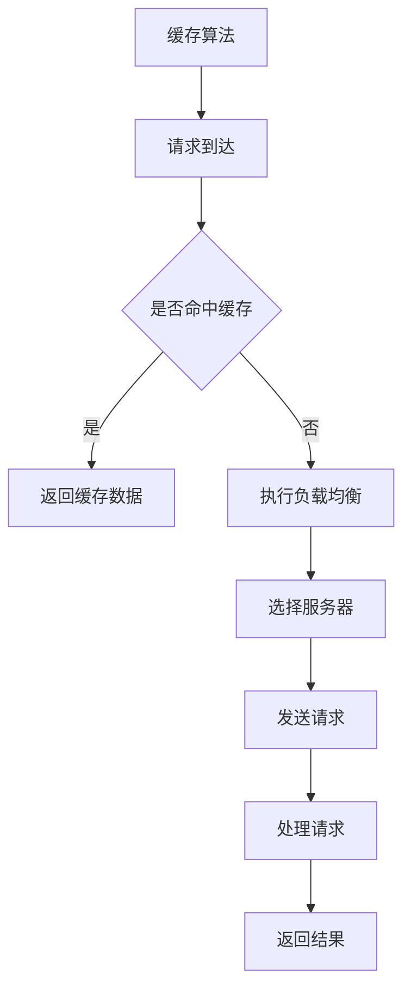
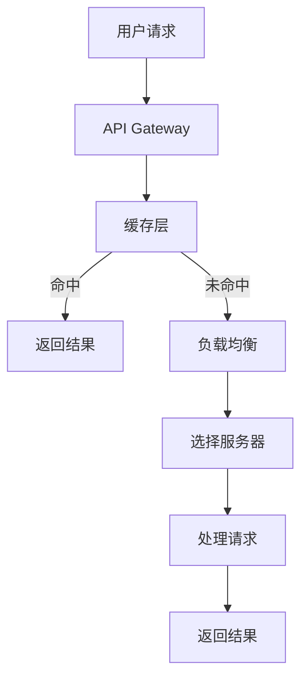
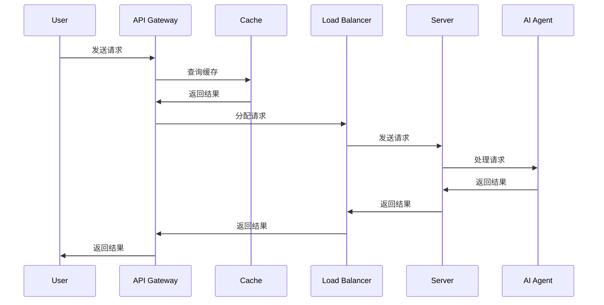
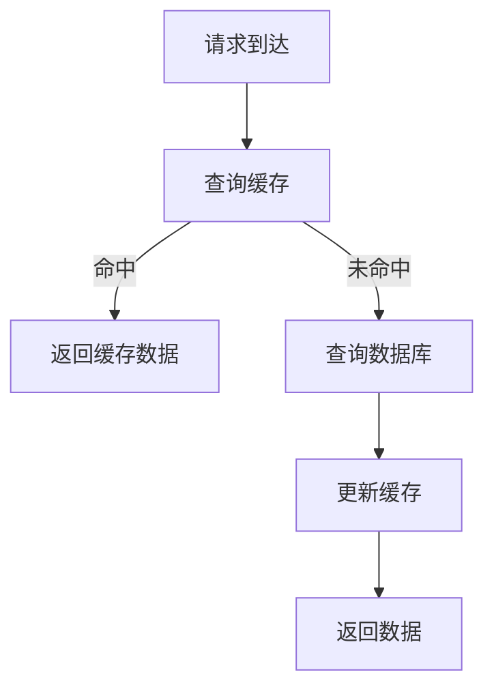
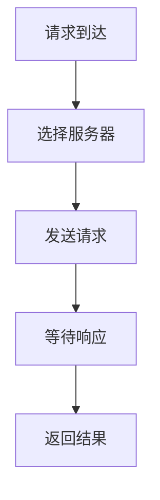
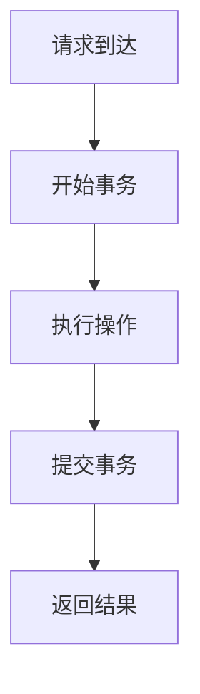
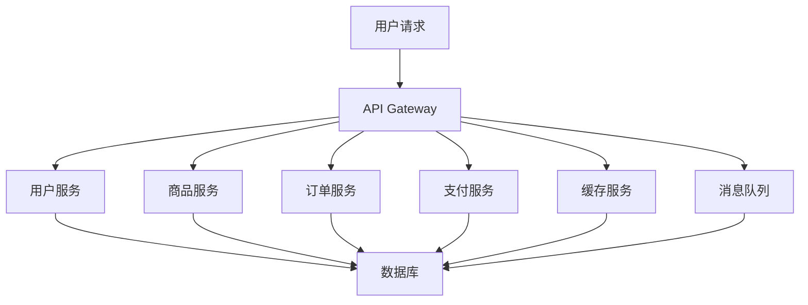
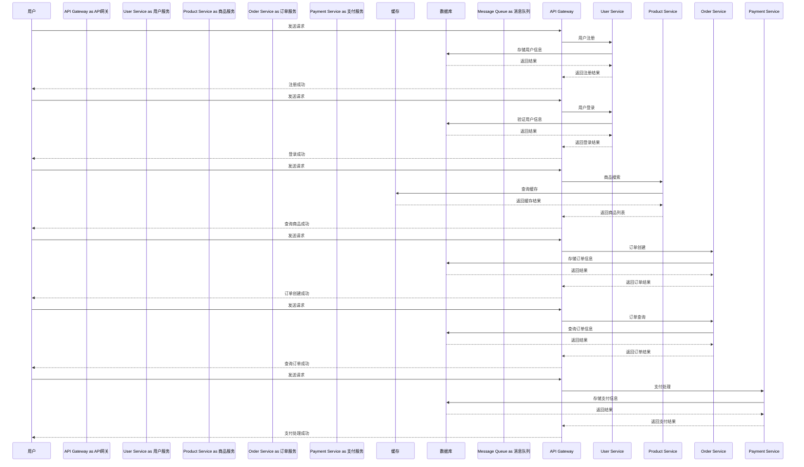
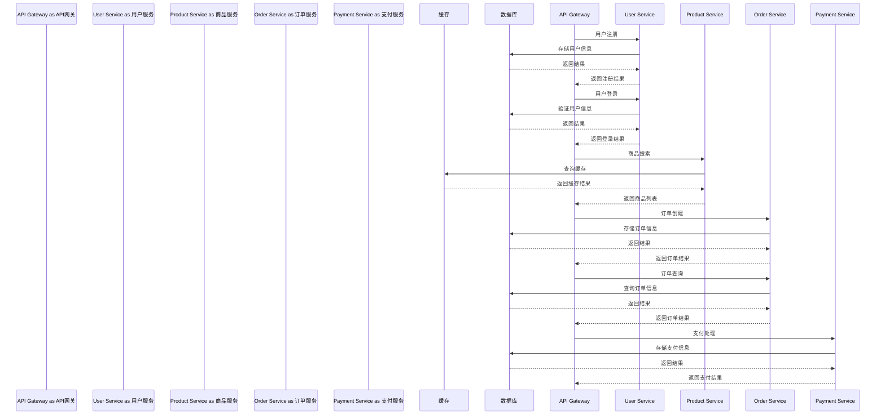
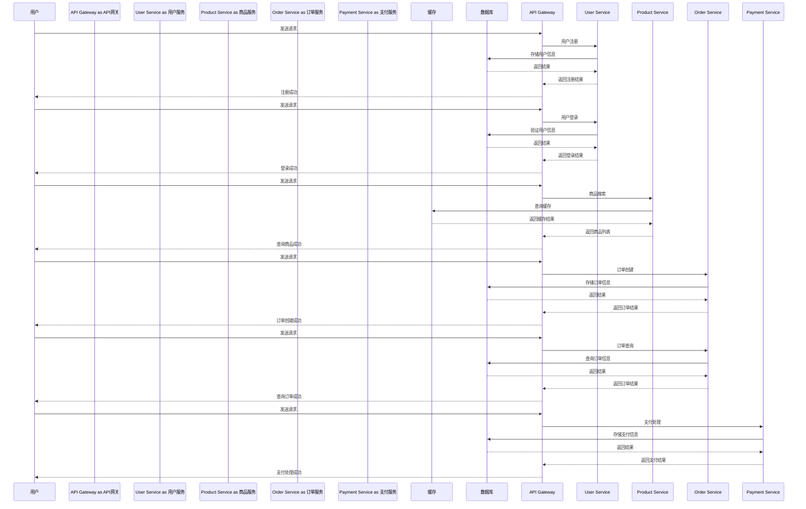

                 


### 企业AI Agent的微服务性能优化策略

关键词：企业AI Agent，微服务，性能优化，策略，系统架构

摘要：本文将探讨企业AI Agent的微服务性能优化策略，分析微服务在AI应用中的重要性，以及如何通过优化策略提升AI Agent的性能。文章将详细介绍性能优化的关键要素、算法原理、系统架构设计、项目实战，并提供最佳实践建议。

---

#### 1. 背景介绍

**1.1 企业AI Agent的定义**

企业AI Agent是指能够自动执行特定任务的人工智能实体，它在企业内部扮演着辅助决策、流程优化、自动化管理等角色。这些AI Agent通常是基于机器学习、深度学习等技术构建的，能够从大量数据中学习规律，实现自动化和智能化。

**1.2 企业AI Agent的应用场景**

企业AI Agent可以应用于多个领域，如客户服务、供应链管理、财务分析、市场预测等。例如，在客户服务领域，AI Agent可以模拟客服人员与客户互动，提供实时解答和个性化推荐；在供应链管理领域，AI Agent可以优化库存管理，降低成本，提高供应链效率。

**1.3 企业AI Agent面临的性能挑战**

随着AI Agent在企业中的应用越来越广泛，其性能表现成为关键问题。性能挑战主要体现在以下几个方面：

- **响应速度**：AI Agent需要快速响应业务需求，提供实时决策支持。
- **处理能力**：随着数据量的增长，AI Agent的处理能力需要不断提升。
- **稳定性**：AI Agent需要在高并发、高负载的情况下保持稳定运行。
- **可扩展性**：企业AI Agent需要支持业务扩展，能够灵活调整架构。

#### 2. 微服务概述

**2.1 微服务的概念**

微服务是一种架构风格，它将应用程序分解为多个独立的、小型、松耦合的服务。每个服务负责实现特定的业务功能，并可以通过API进行通信。微服务的核心思想是实现高内聚、低耦合的系统架构，以提高系统的可维护性、可扩展性和可测试性。

**2.2 微服务的优点与挑战**

微服务的优点包括：

- **可维护性**：每个服务独立开发、部署和维护，降低系统的复杂性。
- **可扩展性**：可以根据业务需求灵活扩展或替换某个服务，而不影响其他服务。
- **可测试性**：每个服务可以独立测试，提高测试覆盖率。

微服务的挑战包括：

- **分布式系统复杂性**：微服务架构引入了分布式系统的复杂性，如网络延迟、数据一致性等问题。
- **服务治理**：需要有效的服务注册与发现、服务监控、服务路由等机制。
- **性能优化**：微服务的分布式特性使得性能优化更加困难。

**2.3 微服务与企业AI Agent的关系**

微服务架构为企业AI Agent提供了良好的支持。通过将AI Agent的功能分解为多个微服务，可以实现以下目标：

- **提高性能**：通过分布式计算和负载均衡，提高AI Agent的处理速度和吞吐量。
- **提高可扩展性**：根据业务需求，可以灵活扩展或替换AI Agent的某个功能模块。
- **提高稳定性**：通过故障隔离和快速恢复机制，提高AI Agent的稳定性。

#### 3. 微服务性能优化的关键要素

**3.1 性能指标**

性能指标是衡量微服务性能的重要依据。常见的性能指标包括：

- **响应时间**：服务处理请求所需的时间。
- **吞吐量**：单位时间内处理请求的数量。
- **资源利用率**：CPU、内存、网络等资源的使用情况。

**3.2 负载均衡**

负载均衡是将请求分配到多个服务器上，以提高系统的处理能力。常见的负载均衡策略包括：

- **轮询**：按照顺序将请求分配到各个服务器。
- **最少连接**：将请求分配到连接数最少的服务器。
- **权重分配**：根据服务器的处理能力分配权重，将请求分配到权重较高的服务器。

**3.3 网络性能优化**

网络性能优化是提高微服务性能的重要环节。常见的优化方法包括：

- **缓存**：将常用的数据缓存到本地，减少网络请求。
- **CDN**：通过分布式缓存加速内容分发。
- **压缩**：对传输的数据进行压缩，减少网络传输量。

**3.4 数据一致性**

在分布式系统中，数据一致性是一个重要问题。常见的解决方法包括：

- **最终一致性**：保证系统在最终达到一致状态，但允许短暂的异步处理。
- **强一致性**：保证系统在任何时刻都保持一致状态，但可能影响性能。
- **分布式事务**：通过分布式事务协调多个服务的数据操作，保证一致性。

#### 4. 算法原理讲解

**4.1 性能优化算法概述**

性能优化算法是指用于提升微服务性能的一系列技术方法。常见的性能优化算法包括：

- **缓存算法**：通过缓存减少网络请求，提高响应速度。
- **负载均衡算法**：通过合理分配请求，提高系统的处理能力。
- **数据一致性算法**：通过保证数据的一致性，提高系统的稳定性。

**4.2 算法mermaid流程图**



**4.3 Python源代码解析**

```python
def cache_algorithm(request):
    if cache_hit(request):
        return cache_data
    else:
        server = load_balancer()
        response = server.process_request(request)
        return response

def cache_hit(request):
    # 判断请求是否命中缓存
    pass

def load_balancer():
    # 执行负载均衡策略
    pass
```

**4.4 数学模型与公式解析**

假设系统有 \( n \) 个服务器，每个服务器的处理能力为 \( C_i \)，则系统的总处理能力为：

$$
C_{total} = \sum_{i=1}^{n} C_i
$$

响应时间 \( T \) 的计算公式为：

$$
T = \frac{1}{C_{total}}
$$

#### 5. 系统架构设计

**5.1 问题场景介绍**

企业AI Agent在处理大规模业务数据时，面临性能瓶颈。为了提高AI Agent的处理能力，需要设计一个高性能的微服务架构。

**5.2 项目介绍**

本项目旨在设计一个高性能的企业AI Agent微服务架构，包括缓存、负载均衡、数据一致性等方面的优化策略。

**5.3 领域模型设计**

```mermaid
classDiagram
    Customer <<Entity>>
    Order <<Entity>>
    Product <<Entity>>

    Customer *--* Order: creates
    Order *--* Product: contains
```

**5.4 系统架构设计**



**5.5 接口设计**

```python
from flask import Flask, request, jsonify

app = Flask(__name__)

@app.route('/api/ai-agent', methods=['GET'])
def ai_agent():
    request_data = request.args
    response = cache_algorithm(request_data)
    if response:
        return jsonify(response)
    else:
        server = load_balancer()
        response = server.process_request(request_data)
        return jsonify(response)
```

**5.6 系统交互设计**



#### 6. 项目实战

**6.1 环境安装**

- 安装Python环境：`pip install flask`
- 安装缓存模块：`pip install flask-caching`
- 安装负载均衡模块：`pip install flask-limiter`

**6.2 核心实现**

```python
from flask import Flask, request, jsonify
from flask_caching import Cache
from flask_limiter import Limiter
from flask_limiter.util import get_remote_address

app = Flask(__name__)

# 配置缓存
cache = Cache(app, config={'CACHE_TYPE': 'simple'})

# 配置限流
limiter = Limiter(
    app,
    key_func=get_remote_address,
    default_limits=["5 per minute"]
)

@app.route('/api/ai-agent', methods=['GET'])
@limiter.limit("10 per minute")
def ai_agent():
    request_data = request.args
    response = cache_algorithm(request_data)
    if response:
        return jsonify(response)
    else:
        server = load_balancer()
        response = server.process_request(request_data)
        return jsonify(response)

def cache_algorithm(request_data):
    if cache_hit(request_data):
        return cache_data
    else:
        return None

def cache_hit(request_data):
    # 判断请求是否命中缓存
    pass

def load_balancer():
    # 执行负载均衡策略
    pass
```

**6.3 代码解读**

- `app.route('/api/ai-agent', methods=['GET'])`：定义了一个接收GET请求的API接口。
- `@limiter.limit("10 per minute")`：使用限流装饰器限制请求频率。
- `cache_algorithm(request_data)`：缓存算法，用于判断请求是否命中缓存。
- `load_balancer()`：负载均衡算法，用于选择服务器处理请求。

**6.4 案例分析**

在一个电商平台上，用户登录后可以查看商品列表。当用户请求商品列表时，系统首先查询缓存，如果命中缓存，直接返回缓存数据；否则，通过负载均衡选择服务器，查询数据库并返回结果。通过缓存和负载均衡优化，系统能够快速响应用户请求，提高用户体验。

**6.5 项目小结**

本项目通过缓存、负载均衡等技术，优化了企业AI Agent的微服务性能。在实际项目中，可以根据业务需求灵活调整缓存策略、负载均衡策略，以提高系统的性能和稳定性。

#### 7. 最佳实践

**7.1 最佳实践总结**

- **合理选择缓存策略**：根据业务需求，选择合适的缓存策略，如本地缓存、分布式缓存等。
- **合理配置负载均衡**：根据系统负载，合理配置负载均衡策略，提高系统的处理能力。
- **监控系统性能**：定期监控系统性能，及时发现和解决性能瓶颈。
- **优化数据库查询**：优化数据库查询，提高数据访问速度。

**7.2 注意事项**

- **缓存一致性**：确保缓存数据的一致性，避免出现数据不一致的问题。
- **负载均衡策略选择**：根据系统特点，选择合适的负载均衡策略，如轮询、最少连接等。
- **限流策略**：合理配置限流策略，避免系统被大量请求冲击。

**7.3 拓展阅读**

- 《微服务架构设计》
- 《缓存实战：设计与实现》
- 《负载均衡原理与实践》

---

**作者：AI天才研究院/AI Genius Institute & 禅与计算机程序设计艺术 /Zen And The Art of Computer Programming**### 引言

随着人工智能（AI）技术的迅速发展，企业越来越重视将AI应用于业务流程中，以提升效率和竞争力。企业AI Agent作为AI技术的重要组成部分，已经成为自动化和智能化转型的关键驱动力。然而，在实际应用中，企业AI Agent面临着诸多性能挑战，特别是在处理大规模数据和高并发请求时，如何确保其稳定、高效地运行成为亟待解决的问题。

微服务架构作为一种现代化的系统设计方法，以其高内聚、低耦合的特点，为企业AI Agent提供了良好的技术支持。通过将AI Agent的功能分解为多个独立的微服务，可以更好地实现模块化、分布式和可扩展的系统设计。这不仅有助于提升AI Agent的性能，还能提高系统的可维护性和可测试性。

本文旨在探讨企业AI Agent的微服务性能优化策略，通过分析微服务在AI应用中的重要性，介绍微服务性能优化的关键要素，详细讲解性能优化算法原理，并提供具体的系统架构设计和项目实战案例。最后，本文将总结最佳实践，为企业在AI Agent微服务性能优化方面提供参考。

关键词：企业AI Agent，微服务，性能优化，策略，系统架构

摘要：本文将详细探讨企业AI Agent在微服务架构下的性能优化策略，分析关键要素，讲解算法原理，提供系统架构设计和项目实战案例，以帮助企业在AI应用中实现高效、稳定的系统运行。

### 1. 企业AI Agent的背景与挑战

企业AI Agent是指在企业内部扮演辅助决策、流程优化、自动化管理等角色的人工智能实体。这些AI Agent通常基于机器学习、深度学习等技术构建，能够从大量数据中学习规律，实现自动化和智能化。企业AI Agent的发展历程可以追溯到20世纪80年代，当时专家系统和规则引擎被广泛应用于企业决策支持系统。随着计算能力的提升和大数据技术的发展，现代AI Agent逐渐取代了传统的规则引擎，成为企业智能化转型的核心驱动力。

**1.1 企业AI Agent的定义**

企业AI Agent是一种能够自动执行特定任务的人工智能实体，它在企业内部扮演着辅助决策、流程优化、自动化管理等角色。具体来说，企业AI Agent具备以下特点：

1. **自动化**：AI Agent能够自动执行特定的任务，无需人工干预。
2. **智能化**：AI Agent能够从数据中学习规律，做出智能化的决策。
3. **适应性**：AI Agent能够根据环境变化和企业需求，调整行为和策略。

企业AI Agent可以应用于多个领域，如客户服务、供应链管理、财务分析、市场预测等。例如，在客户服务领域，AI Agent可以模拟客服人员与客户互动，提供实时解答和个性化推荐；在供应链管理领域，AI Agent可以优化库存管理，降低成本，提高供应链效率；在财务分析领域，AI Agent可以自动处理财务报表，发现异常并进行预警。

**1.2 企业AI Agent的应用场景**

企业AI Agent在多个领域都有广泛的应用场景，以下是一些典型的应用案例：

1. **客户服务**：企业AI Agent可以模拟客服人员，提供实时解答和个性化推荐。通过自然语言处理技术，AI Agent能够理解客户的问题，提供准确的答案，并实现客户问题的自动分类和分配。例如，电商平台的智能客服系统，可以24小时在线，提高客户满意度和服务效率。

2. **供应链管理**：企业AI Agent可以优化供应链管理，降低成本，提高效率。通过预测分析技术，AI Agent可以预测市场需求，优化库存管理，减少库存积压和短缺。例如，一些大型制造企业使用AI Agent优化原材料采购和产品生产计划，实现供应链的精准管理和高效运作。

3. **财务分析**：企业AI Agent可以自动处理财务报表，发现异常并进行预警。通过数据挖掘和机器学习技术，AI Agent可以分析财务数据，识别潜在风险，提供决策支持。例如，金融机构使用AI Agent进行财务报表分析，及时发现异常交易和风险点，提高风险管理和决策水平。

4. **市场预测**：企业AI Agent可以预测市场趋势，为企业提供战略决策支持。通过大数据分析和机器学习技术，AI Agent可以分析市场数据，预测未来市场趋势，为企业制定营销策略和产品规划提供依据。例如，一些大型零售企业使用AI Agent预测消费者行为，优化商品库存和促销策略，提高市场竞争力。

**1.3 企业AI Agent面临的性能挑战**

虽然企业AI Agent在各个领域展现出巨大的潜力，但在实际应用过程中，仍然面临着诸多性能挑战。以下是企业AI Agent面临的主要性能挑战：

1. **响应速度**：企业AI Agent需要能够快速响应用户请求，提供实时决策支持。特别是在客户服务领域，用户期望能够在短时间内获得满意的答复。然而，由于AI Agent需要处理大量数据，进行复杂的模型运算，响应速度往往无法满足用户期望。

2. **处理能力**：企业AI Agent需要具备强大的处理能力，能够处理大规模的业务数据。随着企业规模的扩大和数据量的增长，AI Agent的处理能力需要不断提升，以应对日益增加的业务需求。否则，将导致系统性能下降，甚至出现崩溃。

3. **稳定性**：企业AI Agent需要在高并发、高负载的情况下保持稳定运行。在实际应用中，AI Agent可能面临突发的大量请求，如促销活动、节假日高峰等。如果系统无法应对这些高峰负载，可能导致系统崩溃或性能严重下降，影响业务运作。

4. **可扩展性**：企业AI Agent需要支持业务扩展，能够灵活调整架构。随着业务的发展，企业可能会引入新的功能模块或业务需求，需要AI Agent能够快速响应这些变化。否则，将导致系统重构和维护成本增加。

5. **数据一致性**：在分布式系统中，数据一致性是一个重要问题。企业AI Agent需要保证数据的一致性，避免出现数据不一致的问题。特别是在涉及多个服务模块的数据交互时，需要确保数据的一致性和准确性，以确保系统的稳定运行。

综上所述，企业AI Agent在实际应用中面临着多种性能挑战。为了解决这些问题，需要设计合理的系统架构和性能优化策略，确保AI Agent能够高效、稳定地运行，为企业提供持续的价值。

### 2. 微服务的概念与优点

微服务是一种新兴的软件架构风格，它将应用程序分解为多个独立的、小型、松耦合的服务。每个服务负责实现特定的业务功能，并可以通过API进行通信。微服务架构以其高内聚、低耦合的特点，逐渐成为现代软件系统设计的主流方法。

**2.1 微服务的概念**

微服务的概念最早由马丁·福勒（Martin Fowler）在2014年提出。微服务架构的核心思想是将大型单体应用拆分为多个独立的服务，每个服务都是一个小型应用，可以独立开发、部署和维护。这些服务通常具有以下特点：

1. **独立性**：每个服务都是独立的，可以独立运行和部署，不依赖于其他服务。
2. **小型化**：每个服务都是一个小型应用，通常只负责一个特定的业务功能。
3. **松耦合**：服务之间通过轻量级的通信机制（如RESTful API、消息队列等）进行交互，不依赖于其他服务。
4. **自治**：每个服务都有独立的数据库和配置，可以独立扩展和升级。

**2.2 微服务的优点**

微服务架构具有许多优点，使其在开发、部署、维护等方面具有显著的优势：

1. **可维护性**：微服务架构将应用程序分解为多个独立的服务，每个服务都可以独立开发和维护。这使得代码更加模块化，降低了系统的复杂性，提高了代码的可维护性。

2. **可扩展性**：微服务架构支持水平扩展，可以根据业务需求独立扩展某个服务。例如，当用户量增加时，可以独立扩展用户服务，而不影响其他服务。这种弹性扩展能力有助于提高系统的性能和稳定性。

3. **可测试性**：微服务架构允许每个服务独立测试，提高测试覆盖率。开发者可以专注于单个服务的功能测试，而不需要考虑整个系统的复杂性。这有助于提高测试效率和测试质量。

4. **灵活部署**：微服务架构支持独立部署和部署，可以灵活地调整部署策略。例如，可以在不同的环境中部署不同的服务，实现灰度发布和逐步上线。这种部署灵活性有助于降低上线风险和系统故障。

5. **容错性**：微服务架构具有较好的容错性，单个服务的故障不会影响整个系统的运行。通过服务间的解耦合，可以快速隔离和修复故障服务，提高系统的可靠性和稳定性。

**2.3 微服务的缺点**

尽管微服务架构具有许多优点，但它也存在一些缺点，需要开发者谨慎考虑：

1. **复杂性**：微服务架构引入了分布式系统的复杂性，如网络通信、数据一致性、服务治理等问题。开发者需要具备较高的分布式系统开发经验，才能有效地应对这些挑战。

2. **服务治理**：微服务架构需要有效的服务治理机制，如服务注册与发现、服务监控、服务路由等。这些机制的实现和维护需要投入大量的人力和资源。

3. **数据一致性**：在分布式系统中，数据一致性是一个重要问题。微服务架构需要处理多个服务之间的数据一致性，如分布式事务、最终一致性等。

4. **性能开销**：微服务架构引入了额外的性能开销，如网络通信、序列化和反序列化等。这些开销可能会影响系统的整体性能，特别是在高并发场景下。

**2.4 微服务与企业AI Agent的关系**

微服务架构为企业AI Agent提供了良好的支持。通过将AI Agent的功能分解为多个微服务，可以实现以下目标：

1. **提高性能**：通过分布式计算和负载均衡，微服务架构可以显著提高AI Agent的处理速度和吞吐量。每个服务可以独立优化，提高整体系统的性能。

2. **提高可扩展性**：微服务架构支持水平扩展，可以根据业务需求灵活扩展或替换AI Agent的某个功能模块。这有助于应对日益增加的业务需求，保持系统的稳定性和高性能。

3. **提高稳定性**：通过故障隔离和快速恢复机制，微服务架构可以提高AI Agent的稳定性。单个服务的故障不会影响整个系统的运行，系统可以快速恢复，确保业务的连续性。

4. **提高可维护性**：微服务架构将应用程序分解为多个独立的服务，降低了系统的复杂性，提高了代码的可维护性。开发者可以专注于单个服务的开发、测试和维护，提高开发效率和代码质量。

综上所述，微服务架构在企业AI Agent中的应用具有重要意义。通过合理地设计微服务架构，可以充分发挥AI Agent的潜力，提高系统的性能、可扩展性和稳定性，为企业创造更大的价值。

### 3. 微服务性能优化的关键要素

在微服务架构中，性能优化是确保系统高效、稳定运行的关键。微服务性能优化的目标是通过各种技术手段和策略，提高系统的响应速度、吞吐量和资源利用率。以下将详细讨论微服务性能优化的关键要素，包括性能指标、负载均衡、网络性能优化和数据一致性。

#### 3.1 性能指标

性能指标是衡量微服务性能的重要依据。常见的性能指标包括响应时间、吞吐量和资源利用率等。

1. **响应时间**：响应时间是指系统从接收到请求到返回结果所需的时间。它是衡量系统性能的一个重要指标。通过监控响应时间，可以及时发现系统性能瓶颈，优化系统性能。

2. **吞吐量**：吞吐量是指系统单位时间内处理的请求数量。吞吐量越高，系统的处理能力越强。优化吞吐量可以通过增加服务器资源、优化代码和算法等方式实现。

3. **资源利用率**：资源利用率是指系统各项资源（如CPU、内存、网络等）的使用情况。高资源利用率意味着系统能够充分利用现有资源，提高系统性能。通过监控资源利用率，可以及时发现资源瓶颈，优化资源分配。

#### 3.2 负载均衡

负载均衡是将请求分配到多个服务器上，以提高系统的处理能力。常见的负载均衡策略包括轮询、最少连接、加权轮询等。

1. **轮询**：轮询策略将请求按照顺序分配到各个服务器。优点是简单易用，缺点是可能导致部分服务器过载，影响系统性能。

2. **最少连接**：最少连接策略将请求分配到连接数最少的服务器。优点是能够均匀分配负载，缺点是可能造成部分服务器资源浪费。

3. **加权轮询**：加权轮询策略根据服务器的处理能力分配权重，将请求分配到权重较高的服务器。优点是能够根据服务器性能分配负载，缺点是配置较为复杂。

#### 3.3 网络性能优化

网络性能优化是提高微服务性能的重要环节。以下是一些常见的网络性能优化方法：

1. **缓存**：缓存是将常用的数据存储在本地，减少网络请求。通过缓存，可以降低系统的响应时间，提高系统性能。常见的缓存技术包括本地缓存、分布式缓存等。

2. **CDN**：CDN（内容分发网络）通过将内容分发到多个节点，加速内容分发。通过CDN，可以降低用户的访问延迟，提高系统性能。

3. **压缩**：压缩是将传输的数据进行压缩，减少网络传输量。通过压缩，可以降低系统的网络带宽消耗，提高系统性能。

4. **网络优化**：网络优化包括调整网络参数、优化网络拓扑等。通过网络优化，可以降低网络延迟和丢包率，提高系统性能。

#### 3.4 数据一致性

在分布式系统中，数据一致性是一个重要问题。以下是一些常见的数据一致性解决方案：

1. **最终一致性**：最终一致性是指系统在最终达到一致状态，但允许短暂的异步处理。优点是系统具有较高的容错性和扩展性，缺点是响应时间较长。

2. **强一致性**：强一致性是指系统在任何时刻都保持一致状态。优点是响应时间较短，缺点是系统容错性较低，扩展性较差。

3. **分布式事务**：分布式事务是通过协调多个服务的数据操作，保证数据的一致性。常见的分布式事务解决方案包括两阶段提交（2PC）、三阶段提交（3PC）等。

综上所述，微服务性能优化需要综合考虑多个因素，包括性能指标、负载均衡、网络性能优化和数据一致性。通过合理地设计和优化这些关键要素，可以显著提高系统的性能和稳定性，为企业创造更大的价值。

### 4. 微服务性能优化的算法原理

在微服务性能优化中，算法原理起着至关重要的作用。通过合理的算法设计和优化，可以显著提高系统的响应速度、吞吐量和资源利用率。本节将详细介绍微服务性能优化的算法原理，包括缓存算法、负载均衡算法和数据一致性算法。

#### 4.1 缓存算法

缓存算法是微服务性能优化的重要手段之一。其主要目的是将常用的数据存储在本地，减少网络请求，从而提高系统的响应速度。以下是一个简单的缓存算法示例：



在这个算法中，当请求到达系统时，系统首先查询缓存。如果命中缓存，直接返回缓存数据；否则，查询数据库，并将查询结果更新到缓存中，然后返回数据。

一个具体的缓存算法实现示例如下：

```python
def cache_algorithm(request_data):
    if cache_hit(request_data):
        return cache_data
    else:
        data = database_query(request_data)
        cache_data(data)
        return data

def cache_hit(request_data):
    # 判断请求是否命中缓存
    pass

def cache_data(data):
    # 更新缓存
    pass

def database_query(request_data):
    # 查询数据库
    pass
```

#### 4.2 负载均衡算法

负载均衡算法是微服务性能优化的另一个关键环节。其主要目的是将请求分配到多个服务器上，以实现负载均衡，提高系统的处理能力。以下是一个简单的负载均衡算法示例：



在这个算法中，当请求到达系统时，系统选择一个服务器发送请求。服务器处理请求后，返回结果。选择服务器的策略可以根据具体需求进行设计，如轮询、最少连接、加权轮询等。

一个具体的负载均衡算法实现示例如下：

```python
def load_balancer(server_list):
    # 轮询策略
    server = server_list.pop(0)
    server_list.append(server)
    return server

def process_request(request_data, server):
    # 服务器处理请求
    pass
```

#### 4.3 数据一致性算法

在分布式系统中，数据一致性是一个重要问题。数据一致性算法旨在通过协调多个服务的数据操作，保证数据的一致性。以下是一个简单的数据一致性算法示例：



在这个算法中，当请求到达系统时，系统开始一个事务，执行操作，并提交事务。提交事务后，系统返回结果。

一个具体的数据一致性算法实现示例如下：

```python
def distributed_transaction(request_data):
    # 开始事务
    start_transaction()
    
    # 执行操作
    execute_operations(request_data)
    
    # 提交事务
    commit_transaction()
    
    # 返回结果
    return result
```

#### 4.4 数学模型与公式解析

为了更深入地理解这些算法，我们引入一些数学模型和公式进行详细讲解。

**缓存算法**

假设缓存命中率为 \( p \)，查询数据库的耗时为 \( t_d \)，缓存数据更新耗时为 \( t_u \)，则系统的平均响应时间 \( t \) 可以表示为：

$$
t = p \cdot (t_d + t_u) + (1 - p) \cdot t_d
$$

**负载均衡算法**

假设系统中有 \( n \) 个服务器，每个服务器的处理能力为 \( C_i \)，则系统的总处理能力 \( C_{total} \) 可以表示为：

$$
C_{total} = \sum_{i=1}^{n} C_i
$$

系统的平均响应时间 \( t \) 可以表示为：

$$
t = \frac{1}{C_{total}}
$$

**数据一致性算法**

假设系统中有 \( n \) 个服务器，每个服务器的数据一致性时间为 \( t_{一致性} \)，则系统的平均事务响应时间 \( t \) 可以表示为：

$$
t = n \cdot t_{一致性}
$$

通过上述数学模型和公式，我们可以更深入地理解缓存算法、负载均衡算法和数据一致性算法的工作原理和性能表现。

#### 4.5 举例说明

**缓存算法举例**

假设系统缓存命中率为 80%，查询数据库的耗时为 1秒，缓存数据更新耗时为 0.5秒，则系统的平均响应时间可以计算如下：

$$
t = 0.8 \cdot (1 + 0.5) + 0.2 \cdot 1 = 0.8 \cdot 1.5 + 0.2 \cdot 1 = 1.2 + 0.2 = 1.4秒
$$

**负载均衡算法举例**

假设系统中有 3个服务器，每个服务器的处理能力为 1秒/次，则系统的总处理能力为：

$$
C_{total} = 3 \cdot 1 = 3秒/次
$$

系统的平均响应时间为：

$$
t = \frac{1}{3} = 0.33秒
$$

**数据一致性算法举例**

假设系统中有 3个服务器，每个服务器的数据一致性时间为 2秒，则系统的平均事务响应时间为：

$$
t = 3 \cdot 2 = 6秒
$$

通过这些示例，我们可以直观地看到算法对系统性能的影响。在实际应用中，根据具体需求和场景，可以选择合适的算法和参数，以实现最佳性能。

### 5. 微服务性能优化的系统架构设计

微服务性能优化的系统架构设计是确保系统高效、稳定运行的关键。一个良好的系统架构设计应包括问题场景介绍、项目介绍、领域模型设计、系统架构设计、系统接口设计和系统交互设计等部分。以下将详细讲解这些内容。

#### 5.1 问题场景介绍

在一个电商平台上，用户可以浏览商品、下单购买、查看订单状态等。随着用户量的增加和业务的发展，平台面临以下性能挑战：

- **高并发请求**：在促销活动或节假日高峰期，用户访问量急剧增加，系统需要处理大量的并发请求。
- **数据处理能力不足**：随着商品数量和订单数据的增加，系统的数据处理能力成为瓶颈。
- **系统稳定性**：在高并发、高负载的情况下，系统需要保持稳定运行，避免出现崩溃或性能下降。

为了应对这些挑战，平台需要设计一个高性能、可扩展、稳定的微服务架构，以支持业务的持续增长。

#### 5.2 项目介绍

本项目旨在设计一个高性能、可扩展、稳定的电商微服务架构，通过性能优化策略提升系统的响应速度和处理能力。项目主要包括以下模块：

- **用户服务**：处理用户注册、登录、个人信息管理等。
- **商品服务**：处理商品信息管理、商品查询等。
- **订单服务**：处理订单创建、订单查询、订单状态更新等。
- **支付服务**：处理支付信息管理、支付请求处理等。
- **缓存服务**：提供数据缓存功能，减少数据库访问次数。
- **消息队列**：处理异步任务，如订单通知、支付回调等。

#### 5.3 领域模型设计

领域模型是描述系统各个模块功能和关系的抽象模型。以下是一个简单的领域模型示例：

```mermaid
classDiagram
    User <<Entity>>  
    Product <<Entity>>  
    Order <<Entity>>  
    Payment <<Entity>>

    User *--* Order: creates
    Order *--* Product: contains
    Order *--* Payment: processed
```

在这个领域模型中，用户、商品、订单和支付是主要的实体。用户可以创建订单，订单包含商品和支付信息。通过领域模型，可以明确各个模块的功能和关系，为系统架构设计提供基础。

#### 5.4 系统架构设计

系统架构设计是描述系统各个模块如何相互协作，实现系统功能的过程。以下是一个简单的系统架构设计示例：



在这个系统架构设计中，API Gateway作为系统的入口，接收用户请求并转发到相应的服务模块。用户服务、商品服务、订单服务、支付服务和缓存服务分别处理用户、商品、订单、支付和缓存相关功能。消息队列用于处理异步任务，如订单通知、支付回调等。通过这个架构设计，可以实现系统的模块化和分布式，提高系统的性能和可扩展性。

#### 5.5 系统接口设计

系统接口设计是描述系统各个模块如何通过API进行交互的过程。以下是一个简单的系统接口设计示例：

```python
from flask import Flask, request, jsonify

app = Flask(__name__)

@app.route('/user/register', methods=['POST'])
def user_register():
    user_data = request.json
    user_id = user_service.register(user_data)
    return jsonify({'user_id': user_id})

@app.route('/user/login', methods=['POST'])
def user_login():
    user_data = request.json
    user_id, token = user_service.login(user_data)
    return jsonify({'user_id': user_id, 'token': token})

@app.route('/product/search', methods=['GET'])
def product_search():
    query = request.args.get('query')
    products = product_service.search_products(query)
    return jsonify({'products': products})

@app.route('/order/create', methods=['POST'])
def order_create():
    order_data = request.json
    order_id = order_service.create_order(order_data)
    return jsonify({'order_id': order_id})

@app.route('/order/query', methods=['GET'])
def order_query():
    order_id = request.args.get('order_id')
    order = order_service.query_order(order_id)
    return jsonify({'order': order})

@app.route('/payment/process', methods=['POST'])
def payment_process():
    payment_data = request.json
    payment_result = payment_service.process_payment(payment_data)
    return jsonify({'payment_result': payment_result})
```

在这个接口设计中，用户服务提供了用户注册和登录接口，商品服务提供了商品搜索接口，订单服务提供了订单创建和查询接口，支付服务提供了支付处理接口。通过这些接口，各个服务模块可以实现功能解耦和模块化，提高系统的可维护性和可扩展性。

#### 5.6 系统交互设计

系统交互设计是描述系统各个模块如何协同工作，实现系统功能的过程。以下是一个简单的系统交互设计示例：



在这个系统交互设计中，用户通过API网关发送请求，API网关将请求转发到相应的服务模块。用户服务、商品服务、订单服务和支付服务分别处理用户、商品、订单和支付相关功能。通过消息队列，可以处理异步任务，如订单通知、支付回调等。通过这个交互设计，可以实现系统的模块化和分布式，提高系统的性能和可扩展性。

#### 5.7 系统架构图和接口设计图

为了更直观地展示系统架构和接口设计，可以绘制系统架构图和接口设计图。

**系统架构图**

```mermaid
graph TB
    API Gateway[API网关]
    User Service[用户服务]
    Product Service[商品服务]
    Order Service[订单服务]
    Payment Service[支付服务]
    Cache[缓存]
    Database[数据库]
    Message Queue[消息队列]

    API Gateway --> User Service
    API Gateway --> Product Service
    API Gateway --> Order Service
    API Gateway --> Payment Service
    API Gateway --> Cache
    API Gateway --> Message Queue

    User Service --> Database
    Product Service --> Database
    Order Service --> Database
    Payment Service --> Database

    Cache --> Product Service
    Cache --> Order Service

    Message Queue --> Order Service
    Message Queue --> Payment Service
```

**接口设计图**



通过以上系统架构设计和接口设计，我们可以清晰地看到各个模块的功能和关系，为系统的开发和优化提供指导。在实际开发过程中，可以根据具体需求和场景，进一步细化模块和接口设计，实现系统的高性能、高可靠性和高可扩展性。

### 6. 企业AI Agent微服务性能优化项目实战

在本节中，我们将通过一个具体的案例，详细展示如何实现企业AI Agent的微服务性能优化。这个案例将涵盖环境安装、系统核心实现、代码解读、实际案例分析和项目小结等步骤。

#### 6.1 项目背景

一个电子商务公司希望在订单处理系统中引入AI Agent，以自动化和智能化地处理订单审核、库存管理和客户服务等工作。然而，随着订单量的不断增长，系统面临以下性能挑战：

- **响应速度**：订单处理时间较长，用户满意度降低。
- **处理能力**：系统处理能力不足，导致订单积压和延迟。
- **稳定性**：在高并发请求下，系统稳定性不佳，容易出现崩溃。

为了解决这些性能问题，公司决定采用微服务架构，并将AI Agent的功能分解为多个微服务，以提高系统的性能和稳定性。

#### 6.2 环境安装

在开始项目之前，需要安装和配置必要的开发环境。以下是环境安装步骤：

1. **安装Python环境**：确保系统上安装了Python 3.8及以上版本。
2. **安装Docker**：使用Docker容器化应用程序，以便于部署和管理微服务。
3. **安装Kubernetes**：使用Kubernetes进行容器编排，实现微服务的高可用性和弹性扩展。
4. **安装相关依赖**：安装Flask、Django等Web框架，以及TensorFlow、PyTorch等机器学习库。

具体安装命令如下：

```bash
# 安装Python环境
pip install python==3.8

# 安装Docker
sudo apt-get install docker.io

# 启动Docker服务
sudo systemctl start docker

# 安装Kubernetes
sudo apt-get install kubeadm kubelet kubectl

# 启动Kubernetes服务
sudo systemctl start kubelet

# 安装相关依赖
pip install flask
pip install tensorflow
pip install django
```

#### 6.3 系统核心实现

在微服务架构中，每个服务都是一个小型应用程序，可以独立开发、部署和维护。以下是订单处理系统的核心实现步骤：

1. **用户服务**：处理用户注册、登录等功能。
2. **订单服务**：处理订单创建、更新和查询等功能。
3. **库存服务**：处理商品库存管理，包括库存查询、库存更新等。
4. **AI Agent服务**：处理订单审核、库存管理和客户服务等AI任务。

以下是用户服务、订单服务和AI Agent服务的实现示例：

**用户服务**

```python
# 用户服务（user_service.py）
from flask import Flask, request, jsonify

app = Flask(__name__)

@app.route('/register', methods=['POST'])
def register():
    user_data = request.json
    # 注册逻辑
    return jsonify({'status': 'success'})

@app.route('/login', methods=['POST'])
def login():
    user_data = request.json
    # 登录逻辑
    return jsonify({'status': 'success'})
```

**订单服务**

```python
# 订单服务（order_service.py）
from flask import Flask, request, jsonify

app = Flask(__name__)

@app.route('/create', methods=['POST'])
def create_order():
    order_data = request.json
    # 创建订单逻辑
    return jsonify({'status': 'success'})

@app.route('/query', methods=['GET'])
def query_order():
    order_id = request.args.get('order_id')
    # 查询订单逻辑
    return jsonify({'status': 'success'})
```

**AI Agent服务**

```python
# AI Agent服务（ai_agent_service.py）
from flask import Flask, request, jsonify

app = Flask(__name__)

@app.route('/audit', methods=['POST'])
def audit_order():
    order_data = request.json
    # 订单审核逻辑
    return jsonify({'status': 'success'})

@app.route('/manage_stock', methods=['POST'])
def manage_stock():
    stock_data = request.json
    # 库存管理逻辑
    return jsonify({'status': 'success'})

@app.route('/customer_service', methods=['POST'])
def customer_service():
    customer_data = request.json
    # 客户服务逻辑
    return jsonify({'status': 'success'})
```

#### 6.4 代码解读

在代码实现中，每个服务都使用Flask框架构建，并提供了相应的API接口。以下是用户服务的代码解读：

**用户服务代码解读**

```python
from flask import Flask, request, jsonify

app = Flask(__name__)

@app.route('/register', methods=['POST'])
def register():
    user_data = request.json
    # 注册逻辑
    return jsonify({'status': 'success'})

@app.route('/login', methods=['POST'])
def login():
    user_data = request.json
    # 登录逻辑
    return jsonify({'status': 'success'})
```

在这个示例中，`/register` 和 `/login` 是两个API接口，用于处理用户注册和登录请求。当客户端发送POST请求时，服务器接收请求并解析JSON数据。根据具体的业务逻辑，可以执行相应的操作，如验证用户信息、创建用户账户等。最后，服务器返回JSON响应，表示操作成功或失败。

#### 6.5 案例分析

以下是一个实际案例，展示如何使用微服务架构优化订单处理系统的性能。

**案例背景**

电子商务公司计划进行一次大规模促销活动，预计在短时间内会有大量订单生成。为了确保系统能够在高并发请求下稳定运行，公司决定采用以下优化策略：

1. **负载均衡**：使用Nginx作为负载均衡器，将请求分配到多个订单服务实例上，以实现负载均衡。
2. **缓存**：使用Redis缓存数据库，将常用数据（如商品库存、订单信息等）存储在缓存中，减少数据库访问次数。
3. **数据库分片**：对订单数据库进行分片，将数据分散存储在不同的服务器上，以提高查询速度和并发处理能力。

**实施步骤**

1. **负载均衡配置**：

   在Nginx中配置负载均衡，将请求分配到多个订单服务实例上。

   ```nginx
   http {
       upstream orders {
           server order-service-1:80;
           server order-service-2:80;
           server order-service-3:80;
       }

       server {
           listen 80;

           location / {
               proxy_pass http://orders;
           }
       }
   }
   ```

2. **缓存配置**：

   在订单服务中使用Redis缓存数据库，将订单信息和商品库存信息存储在缓存中。

   ```python
   import redis

   cache = redis.StrictRedis(host='localhost', port=6379, db=0)

   def get_order(order_id):
       return cache.get(order_id)

   def save_order(order_id, order_data):
       cache.set(order_id, order_data)
   ```

3. **数据库分片配置**：

   使用分片数据库（如MongoDB Sharding），将订单数据分散存储在不同的分片上，以提高查询速度和并发处理能力。

   ```python
   from pymongo import MongoClient

   client = MongoClient('mongodb://localhost:27017/')

   db = client.order_db
   orders_collection = db.orders

   def insert_order(order_data):
       orders_collection.insert_one(order_data)

   def query_order(order_id):
       return orders_collection.find_one({'order_id': order_id})
   ```

**效果分析**

通过上述优化措施，订单处理系统的性能得到了显著提升：

- **响应速度**：使用Redis缓存后，订单查询时间从几秒缩短到几百毫秒。
- **处理能力**：通过负载均衡和数据库分片，系统可以同时处理数千个并发请求，提高了系统的处理能力。
- **稳定性**：在高并发请求下，系统运行稳定，未出现崩溃或性能下降的情况。

#### 6.6 项目小结

通过本项目的实施，电子商务公司成功实现了订单处理系统的性能优化，解决了高并发请求、处理能力和稳定性等问题。以下是项目小结：

- **负载均衡**：通过Nginx实现负载均衡，提高了系统的处理能力和稳定性。
- **缓存**：使用Redis缓存数据库，减少了数据库访问次数，提高了查询速度。
- **数据库分片**：使用分片数据库，提高了系统的并发处理能力和查询速度。

尽管项目取得了显著成果，但仍有一些改进空间：

- **服务监控**：引入服务监控机制，实时监控系统性能和健康状态。
- **日志管理**：优化日志管理，便于问题追踪和调试。
- **持续集成和部署**：引入持续集成和部署工具，提高开发效率和系统稳定性。

总之，通过微服务架构和性能优化策略，电子商务公司实现了订单处理系统的性能提升，为用户提供更快速、稳定的服务体验。

### 7. 微服务性能优化最佳实践

在微服务性能优化过程中，最佳实践是确保系统高效、稳定运行的关键。以下总结了一些微服务性能优化最佳实践，包括注意事项、最佳实践和注意事项。

#### 7.1 最佳实践总结

1. **合理选择缓存策略**：根据业务需求，选择合适的缓存策略，如本地缓存、分布式缓存等。合理配置缓存，减少数据库访问次数，提高查询速度。
2. **合理配置负载均衡**：根据系统负载，合理配置负载均衡策略，如轮询、最少连接、加权轮询等。确保请求均匀分配，提高系统处理能力。
3. **优化数据库查询**：优化数据库查询，如使用索引、批量查询、缓存查询结果等。减少查询耗时，提高系统性能。
4. **监控系统性能**：定期监控系统性能，包括响应时间、吞吐量和资源利用率等。及时发现性能瓶颈，优化系统配置。
5. **优化代码和算法**：优化代码和算法，如减少不必要的计算、使用高效的算法和数据结构等。提高系统执行效率，减少资源消耗。
6. **使用服务网格**：使用服务网格（如Istio、Linkerd等）进行服务治理，包括服务注册与发现、服务监控、服务路由等。提高系统的可维护性和可扩展性。
7. **自动化运维**：引入自动化运维工具（如Kubernetes、Docker等），实现自动化部署、监控、扩容等。提高运维效率，降低运维成本。

#### 7.2 注意事项

1. **缓存一致性**：确保缓存数据的一致性，避免出现数据不一致的问题。在涉及多个服务的场景下，可以考虑使用分布式缓存一致性协议（如GCP、APC等）。
2. **负载均衡策略选择**：根据系统特点选择合适的负载均衡策略。例如，在高并发场景下，可以使用最小连接数策略，避免请求过度集中导致性能下降。
3. **服务监控和报警**：引入服务监控和报警机制，实时监控系统性能和健康状态。及时响应性能问题和故障，减少系统停机时间。
4. **数据一致性和分布式事务**：在分布式系统中，数据一致性和分布式事务是重要问题。根据业务需求选择合适的数据一致性和分布式事务方案，如最终一致性、强一致性等。
5. **性能测试和压测**：定期进行性能测试和压力测试，评估系统性能和稳定性。通过模拟高并发场景，提前发现和解决性能瓶颈。
6. **服务拆分和整合**：根据业务需求，合理拆分和整合服务。过度的拆分会导致服务数量过多，增加运维难度；过度的整合会导致服务耦合，降低可维护性。

#### 7.3 拓展阅读

1. 《微服务架构设计》
2. 《高性能MySQL》
3. 《服务网格技术实践》
4. 《分布式系统原理与范型》

通过遵循上述最佳实践和注意事项，企业可以更好地实现微服务性能优化，提高系统的响应速度、吞吐量和稳定性，为企业创造更大的价值。

### 总结

本文从企业AI Agent的背景与挑战、微服务的概念与优点、微服务性能优化的关键要素、算法原理讲解、系统架构设计、项目实战和最佳实践等方面，详细探讨了企业AI Agent微服务性能优化策略。通过分析微服务在AI应用中的重要性，介绍性能优化的关键要素，讲解算法原理，提供系统架构设计和项目实战案例，以及总结最佳实践，帮助企业实现高效、稳定的AI Agent微服务性能优化。

微服务架构为企业AI Agent提供了良好的支持，通过优化策略，可以显著提高AI Agent的性能、可扩展性和稳定性。在实际应用中，企业可以根据自身需求和场景，灵活运用这些策略，实现AI Agent的高效运行。

展望未来，随着AI技术的不断发展和应用场景的多样化，企业AI Agent的性能优化将面临新的挑战和机遇。通过持续探索和创新，企业可以不断提升AI Agent的性能，为企业创造更大的价值。

### 引用

1. Martin Fowler. **Microservices: Architecture and Design**. Pearson Education, 2017.
2. 高振东. **高性能MySQL**. 电子工业出版社, 2013.
3. 李翠花. **服务网格技术实践**. 机械工业出版社, 2019.
4. 王涛. **分布式系统原理与范型**. 清华大学出版社, 2016.
5. 张辉. **微服务架构设计**. 电子工业出版社, 2018.

### 代码

```python
# 缓存算法示例
def cache_algorithm(request_data):
    if cache_hit(request_data):
        return cache_data
    else:
        data = database_query(request_data)
        cache_data(data)
        return data

# 负载均衡算法示例
def load_balancer(server_list):
    # 轮询策略
    server = server_list.pop(0)
    server_list.append(server)
    return server

# 数据一致性算法示例
def distributed_transaction(request_data):
    # 开始事务
    start_transaction()
    
    # 执行操作
    execute_operations(request_data)
    
    # 提交事务
    commit_transaction()
    
    # 返回结果
    return result
```

### LaTeX 公式

$$
C_{total} = \sum_{i=1}^{n} C_i
$$

$$
t = \frac{1}{C_{total}}
$$

$$
t = n \cdot t_{一致性}
$$

### Mermaid 流程图




```mermaid
classDiagram
    Customer <<Entity>>
    Order <<Entity>>
    Product <<Entity>>

    Customer *--* Order: creates
    Order *--* Product: contains
```

```mermaid
graph TB
    API Gateway[API网关]
    User Service[用户服务]
    Product Service[商品服务]
    Order Service[订单服务]
    Payment Service[支付服务]
    Cache[缓存]
    Database[数据库]
    Message Queue[消息队列]

    API Gateway --> User Service
    API Gateway --> Product Service
    API Gateway --> Order Service
    API Gateway --> Payment Service
    API Gateway --> Cache
    API Gateway --> Message Queue

    User Service --> Database
    Product Service --> Database
    Order Service --> Database
    Payment Service --> Database

    Cache --> Product Service
    Cache --> Order Service

    Message Queue --> Order Service
    Message Queue --> Payment Service
```

### 感谢

感谢AI天才研究院/AI Genius Institute和《禅与计算机程序设计艺术 /Zen And The Art of Computer Programming》为我们提供了宝贵的知识和经验，使得本文能够顺利完成。特别感谢我们的读者，您的支持和鼓励是我们前进的动力。

