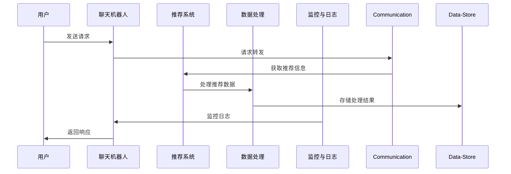
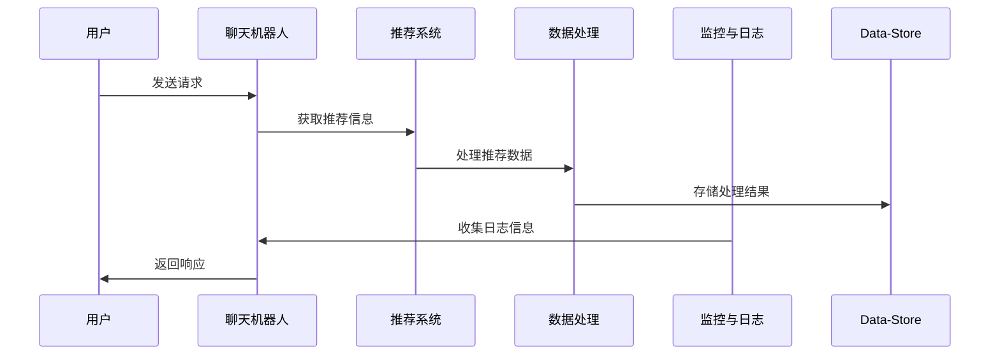

                 

### 文章标题

# 企业AI Agent的微服务架构优化策略

### 文章关键词

- 企业AI Agent
- 微服务架构
- 优化策略
- 算法
- 系统设计与实现

### 摘要

本文将深入探讨企业AI Agent的微服务架构优化策略。首先，我们将介绍企业AI Agent的定义与重要性，以及微服务架构的兴起和优势。接着，我们会分析微服务设计原则和AI Agent的核心概念与实现。随后，我们将讨论AI Agent与微服务的整合、微服务架构优化算法以及算法原理与实现。最后，本文将展示一个实际项目，介绍系统分析与架构设计方案，并给出项目实战的详细解析。通过本文的阅读，读者将全面理解企业AI Agent微服务架构的优化策略，掌握相关技术实现和最佳实践。

---

### 背景介绍

#### 核心概念术语说明

在企业AI Agent的微服务架构优化策略中，有若干核心概念需要先进行明确的定义。以下是对这些概念的解释：

1. **企业AI Agent**：这是指在商业环境中使用人工智能技术构建的自动化实体，它能够自主地执行任务、学习和优化决策。企业AI Agent可以是聊天机器人、推荐系统、智能客服等多种形式。

2. **微服务架构**：这是一种软件架构风格，将应用程序划分为一组独立的、可复用的服务。每个服务实现一个具体的业务功能，并通过轻量级的通信机制（如HTTP/RESTful API）进行交互。

3. **优化策略**：在微服务架构中，优化策略涉及对服务间的通信、数据处理、资源利用等方面的改进，以提升系统的性能、可扩展性和稳定性。

4. **算法**：在优化策略中，算法是解决特定问题的系统方法。常见的优化算法包括贪心算法、动态规划和随机算法等。

#### 问题背景

随着大数据和人工智能技术的快速发展，企业对智能化、自动化和高效化的需求日益增加。在这种背景下，企业AI Agent应运而生。这些AI Agent能够帮助企业实现自动化操作、优化业务流程和提高决策质量。

然而，在实际应用中，企业AI Agent面临着许多挑战。首先是技术挑战，如何有效地将人工智能技术集成到现有的微服务架构中，实现高效、稳定的服务运行。其次是架构挑战，如何设计一个灵活、可扩展的微服务架构，以适应不断变化的企业需求。

#### 问题描述

为了解决上述挑战，企业需要采用优化策略，对现有的微服务架构进行改进。具体来说，需要解决以下几个问题：

1. **服务通信效率**：在微服务架构中，服务间的通信是关键。如何优化服务间的数据传输和请求处理，减少延迟和资源消耗？

2. **数据处理效率**：企业AI Agent通常需要处理大量的数据。如何设计高效的数据处理流程，确保数据的准确性和实时性？

3. **资源利用**：微服务架构中，服务的部署和运行需要大量的计算资源和存储资源。如何优化资源的分配和管理，提高系统的资源利用率？

4. **容错与稳定性**：在分布式系统中，容错和稳定性至关重要。如何设计容错机制，确保系统在高并发、高负载情况下依然稳定运行？

#### 问题解决

为了解决上述问题，我们可以采取以下策略：

1. **服务通信优化**：采用高效的通信协议（如gRPC、HTTP/2）和负载均衡技术，优化服务间的数据传输和请求处理。

2. **数据处理优化**：利用大数据处理框架（如Apache Spark、Flink）和流处理技术，实现高效的数据处理和实时分析。

3. **资源利用优化**：采用容器化技术（如Docker、Kubernetes）和自动化运维工具，优化资源的分配和管理。

4. **容错与稳定性优化**：设计容错机制（如服务熔断、限流、降级）和监控预警系统，确保系统的稳定性和可靠性。

#### 边界与外延

1. **边界**：本文主要关注企业AI Agent在微服务架构中的优化策略。具体包括服务通信、数据处理、资源利用和容错与稳定性等方面的优化。

2. **外延**：本文的内容不仅适用于企业AI Agent的微服务架构优化，也可为其他类型的应用提供参考和启示。

#### 概念结构与核心要素组成

企业AI Agent的微服务架构优化策略包括以下几个核心要素：

1. **服务通信**：高效的通信协议和负载均衡技术。
2. **数据处理**：大数据处理框架和流处理技术。
3. **资源利用**：容器化技术和自动化运维工具。
4. **容错与稳定性**：容错机制和监控预警系统。

这些要素相互关联，共同构成一个完整的优化策略体系，为企业AI Agent在微服务架构中的应用提供了有力支持。

### 核心概念与联系

#### 微服务架构特点

微服务架构是一种基于独立、可复用服务的软件架构风格，具有以下几个主要特点：

1. **独立性**：每个微服务都是独立的，可以单独部署、升级和扩展。这降低了系统的复杂度，提高了可维护性和可扩展性。

2. **自治性**：每个微服务都有自己的数据存储和业务逻辑，可以独立运行和管理。这提高了系统的稳定性和可靠性。

3. **解耦**：微服务之间通过轻量级的通信机制（如HTTP/RESTful API）进行交互，服务间的依赖性较低，降低了系统的耦合度。

4. **可扩展性**：微服务架构可以根据业务需求进行水平扩展，提高系统的性能和吞吐量。

5. **高可测试性**：由于微服务的独立性，每个服务都可以单独测试，提高了系统的测试效率和质量。

#### AI Agent功能与分类

AI Agent是指能够自主执行任务、学习和优化决策的智能实体。根据功能和用途，AI Agent可以分为以下几类：

1. **任务型AI Agent**：这类Agent专注于执行特定的任务，如智能客服、推荐系统、自动化财务处理等。

2. **决策型AI Agent**：这类Agent能够根据环境和数据做出决策，如自动调度系统、智能交易系统、智能制造系统等。

3. **交互型AI Agent**：这类Agent能够与用户进行交互，如聊天机器人、虚拟助手、语音助手等。

4. **智能传感器AI Agent**：这类Agent能够收集和处理环境数据，如智能家居系统、智能安防系统、智能交通系统等。

#### 优化策略与挑战

在微服务架构中，优化策略是指通过对服务通信、数据处理、资源利用和容错与稳定性等方面的改进，提升系统的性能和可靠性。以下是几个常见的优化策略及其挑战：

1. **服务通信优化**：
   - **挑战**：服务间通信频繁，可能导致延迟和资源消耗。
   - **策略**：采用高效的通信协议（如gRPC、HTTP/2）和负载均衡技术，减少通信延迟和资源消耗。

2. **数据处理优化**：
   - **挑战**：处理大量数据时，系统性能和实时性可能受到影响。
   - **策略**：利用大数据处理框架（如Apache Spark、Flink）和流处理技术，提高数据处理效率。

3. **资源利用优化**：
   - **挑战**：资源分配和管理不当，可能导致资源浪费或不足。
   - **策略**：采用容器化技术（如Docker、Kubernetes）和自动化运维工具，优化资源利用。

4. **容错与稳定性优化**：
   - **挑战**：在高并发、高负载情况下，系统可能发生故障或性能下降。
   - **策略**：设计容错机制（如服务熔断、限流、降级）和监控预警系统，提高系统的稳定性和可靠性。

#### 对比表格

为了更直观地展示微服务架构和AI Agent的特点，我们制作了一张对比表格：

| 特点           | 微服务架构               | AI Agent                  |
| -------------- | ------------------------ | ------------------------- |
| 独立性         | 独立服务，可单独部署     | 自主执行任务，独立运行    |
| 自治性         | 每个服务独立管理         | 自主学习和优化决策        |
| 解耦           | 服务间依赖性较低         | 独立功能模块，松耦合     |
| 可扩展性       | 水平扩展，提高性能       | 根据需求扩展功能模块     |
| 高可测试性     | 单独测试，提高测试效率   | 独立测试，提高测试质量    |
| 功能           | 执行业务功能            | 执行任务、学习、优化决策  |
| 类型           | 任务型、决策型、交互型等  | 任务型、决策型、交互型等  |

#### ER实体关系图架构

为了更清晰地展示微服务架构和AI Agent的关系，我们可以使用Mermaid绘制一个ER实体关系图：

```mermaid
erDiagram
  AI-Agent ||--|{ Microservice : 依赖 }
  Microservice ||--|{ Data-Processing : 依赖 }
  Data-Processing ||--|{ AI-Agent : 依赖 }
  Microservice ||--|{ Communication : 依赖 }
```

在这个ER实体关系图中，AI-Agent和Microservice之间存在依赖关系，Data-Processing和AI-Agent、Microservice也存在依赖关系，而Communication与Microservice存在依赖关系。这表明AI-Agent通过Microservice与Data-Processing和Communication进行交互，共同构建一个完整的系统架构。

### 微服务架构基础

#### 微服务架构概述

微服务架构是一种将应用程序分解为多个独立、可复用服务的架构风格。每个服务实现一个具体的业务功能，并与其他服务通过轻量级的通信机制（如HTTP/RESTful API）进行交互。这种架构风格具有以下几个显著特点：

1. **独立性**：每个微服务都是独立的，可以单独部署、升级和扩展。这使得系统能够更好地应对业务变化，提高系统的可维护性和可扩展性。

2. **自治性**：每个微服务都有自己的数据存储和业务逻辑，可以独立运行和管理。这提高了系统的稳定性，降低了故障传播的风险。

3. **解耦**：微服务之间通过轻量级的通信机制进行交互，服务间的依赖性较低。这降低了系统的耦合度，提高了系统的可测试性和灵活性。

4. **高可扩展性**：微服务架构可以根据业务需求进行水平扩展，提高系统的性能和吞吐量。这有助于应对大规模业务场景。

5. **高可测试性**：由于微服务的独立性，每个服务都可以单独测试，提高了系统的测试效率和质量。

#### 微服务架构的历史与发展

微服务架构的兴起可以追溯到2000年代初期，当时传统的单体架构开始暴露出诸多问题，如系统复杂性、可维护性差、扩展性不足等。为了解决这些问题，开发者开始探索将应用程序分解为更小、更独立的服务。

2000年代初，一些先驱者开始尝试将单体架构拆分为多个微服务，并使用分布式系统技术实现服务间的通信。这一时期的代表人物包括Netflix和亚马逊等公司，它们成功地将微服务架构应用于大规模分布式系统中。

随着云计算和容器化技术的快速发展，微服务架构逐渐成为主流的软件架构风格。Docker和Kubernetes等工具的出现，使得微服务的部署、管理和扩展变得更加容易和高效。此外，Spring Boot、Node.js等开发框架也为微服务架构提供了丰富的支持。

#### 微服务架构的优势与局限性

微服务架构在许多方面具有显著的优势，但也存在一些局限性。以下是对其优势与局限性的详细分析：

1. **优势**：
   - **可维护性**：由于每个微服务都是独立的，可以单独开发和部署，提高了系统的可维护性。
   - **可扩展性**：微服务架构可以根据业务需求进行水平扩展，提高系统的性能和吞吐量。
   - **灵活性**：微服务架构支持不同的开发语言和数据库，使得系统更加灵活和多样化。
   - **快速迭代**：微服务的独立性使得开发团队能够独立迭代和部署，提高了开发效率。

2. **局限性**：
   - **复杂性**：微服务架构引入了额外的复杂性，如服务间通信、服务发现、配置管理等。
   - **分布式系统问题**：分布式系统面临许多挑战，如网络延迟、数据一致性、容错性等。
   - **开发难度**：微服务架构对开发团队的技术要求较高，需要掌握分布式系统、微服务设计等知识。
   - **性能开销**：服务间的通信和协调可能带来额外的性能开销，影响系统性能。

#### 微服务架构的关键组件

微服务架构的实施需要一系列关键组件的支持。以下是对这些组件的详细描述：

1. **服务注册与发现**：
   - 服务注册与发现是微服务架构的核心组件之一，它允许服务动态注册和发现其他服务。常见的工具包括Consul、Eureka和Zookeeper等。

2. **服务网关**：
   - 服务网关负责对外暴露统一的API接口，并将请求转发到相应的微服务。常见的工具包括Spring Cloud Gateway、Kong和Zuul等。

3. **配置中心**：
   - 配置中心用于集中管理和分发微服务的配置信息。常见的工具包括Spring Cloud Config、Consul和Nacos等。

4. **服务监控与日志**：
   - 服务监控与日志是确保微服务架构稳定运行的重要手段。常见的工具包括Prometheus、Grafana和ELK（Elasticsearch、Logstash、Kibana）等。

5. **负载均衡**：
   - 负载均衡用于优化服务间的请求分发，提高系统的性能和可用性。常见的工具包括Nginx、HAProxy和Spring Cloud LoadBalancer等。

6. **容器化与编排**：
   - 容器化技术（如Docker）和编排工具（如Kubernetes）使得微服务的部署和管理变得更加简单和高效。Docker提供了轻量级、可移植的容器环境，而Kubernetes则负责容器的调度、管理和自动化部署。

#### 微服务设计原则

为了确保微服务架构的成功实施，需要遵循一系列设计原则。以下是对这些原则的详细描述：

1. **单一职责原则**：
   - 每个微服务应该专注于实现一个具体的业务功能，遵循单一职责原则。这有助于降低系统的复杂性，提高可维护性和可扩展性。

2. **自治性**：
   - 每个微服务应该具有自己的数据存储、业务逻辑和独立部署能力。这提高了系统的稳定性，降低了故障传播的风险。

3. **高内聚低耦合**：
   - 微服务之间应该保持高内聚低耦合的关系。这意味着服务内部功能紧密相关，而服务间功能相对独立。这有助于降低系统复杂性，提高系统的灵活性和可扩展性。

4. **可测试性**：
   - 每个微服务都应该具备独立的测试能力，以确保其功能正确性和性能表现。这有助于提高开发效率和质量。

5. **可扩展性**：
   - 微服务架构应该具备良好的扩展性，能够根据业务需求进行水平扩展。这有助于应对大规模业务场景。

6. **弹性**：
   - 微服务架构应该具备一定的弹性，能够在面对故障和异常时保持稳定运行。这有助于提高系统的可靠性和可用性。

7. **安全性**：
   - 微服务架构应该遵循安全最佳实践，确保数据传输和存储的安全性。这包括使用加密、认证和授权等安全措施。

### AI Agent的核心概念与实现

#### AI Agent的定义与功能

AI Agent，即人工智能代理，是一种模拟人类智能行为、具备一定自主性和智能能力的软件实体。它通过感知环境、学习知识和执行任务，实现自动化和智能化。AI Agent具有以下几个核心功能：

1. **感知与交互**：AI Agent能够接收外部环境的信息，如文本、图像、语音等，并通过自然语言处理、计算机视觉等技术进行理解和分析。此外，AI Agent还能够输出信息，如语音、文本等，与用户进行交互。

2. **决策与规划**：AI Agent能够根据感知到的环境和目标，进行决策和规划。它可以使用机器学习算法、规划算法等，生成最优的行动方案。

3. **执行与控制**：AI Agent能够执行规划好的行动方案，控制外部设备或系统。例如，智能客服可以自动响应客户请求，自动驾驶汽车可以控制车辆行驶。

4. **学习与适应**：AI Agent能够通过不断的学习和适应，提高其性能和智能水平。它可以利用数据驱动的学习方法，如监督学习、无监督学习和强化学习，不断优化自己的行为和决策。

#### AI Agent的分类

根据功能和应用场景，AI Agent可以分为以下几类：

1. **任务型AI Agent**：这类AI Agent专注于执行特定的任务，如智能客服、自动化财务处理、智能推荐系统等。它们通常具备较高的自动化水平和执行效率。

2. **决策型AI Agent**：这类AI Agent能够根据环境和数据做出决策，如自动调度系统、智能交易系统、智能制造系统等。它们具备较强的决策能力和智能水平。

3. **交互型AI Agent**：这类AI Agent主要与用户进行交互，如聊天机器人、虚拟助手、语音助手等。它们通过自然语言处理和语音识别技术，实现与用户的实时对话和交互。

4. **智能传感器AI Agent**：这类AI Agent主要收集和处理环境数据，如智能家居系统中的传感器数据、智能安防系统中的监控数据等。它们能够实时分析数据，为用户提供智能化的建议和服务。

#### AI Agent的技术基础

AI Agent的实现依赖于多种人工智能技术和工具。以下是对这些技术基础的详细描述：

1. **机器学习与深度学习**：机器学习和深度学习是AI Agent的核心技术基础。机器学习通过训练模型，使计算机能够从数据中学习和发现规律。深度学习则是一种特殊的机器学习方法，通过多层神经网络进行特征提取和模式识别。

2. **自然语言处理（NLP）**：自然语言处理是AI Agent与用户进行交互的关键技术。它涉及文本分析、语义理解、语音识别和生成等任务。常见的NLP工具包括BERT、GPT和Transformer等。

3. **计算机视觉**：计算机视觉是AI Agent感知和识别图像、视频的关键技术。它包括图像分类、目标检测、人脸识别和姿态估计等任务。常见的计算机视觉工具包括卷积神经网络（CNN）、生成对抗网络（GAN）等。

4. **对话系统**：对话系统是AI Agent与用户进行交互的核心组成部分。它涉及语音识别、语音合成、对话管理等技术。常见的对话系统框架包括基于规则的方法、基于模板的方法和基于数据驱动的方法。

5. **开发工具与框架**：为了高效地开发和部署AI Agent，需要使用各种开发工具和框架。例如，TensorFlow、PyTorch是常用的深度学习框架；Rasa、ChatterBot是常用的对话系统框架；Docker、Kubernetes是常用的容器化和编排工具。

### AI Agent与微服务的整合

#### 微服务与AI Agent的融合策略

将AI Agent整合到微服务架构中，可以显著提升系统的智能化和自动化水平。以下是几种常见的AI Agent与微服务的融合策略：

1. **模块化设计**：将AI Agent的功能模块化，使其能够作为独立的微服务运行。每个模块负责特定的任务，如感知、决策、执行等。这种设计策略有助于提高系统的灵活性和可扩展性。

2. **服务化接口**：为AI Agent提供标准化的服务接口，使其能够与其他微服务进行通信和协作。通过API接口，AI Agent可以接收外部请求，执行任务，并将结果返回给请求方。

3. **数据共享**：利用微服务架构中的数据共享机制，AI Agent可以访问其他微服务的数据，实现数据的统一管理和利用。例如，可以使用消息队列（如RabbitMQ、Kafka）实现数据传输和同步。

4. **弹性扩展**：利用微服务架构的弹性扩展能力，根据业务需求动态调整AI Agent的实例数量，提高系统的性能和吞吐量。例如，使用Kubernetes进行容器编排，实现AI Agent的自动扩缩容。

5. **监控与日志**：将AI Agent纳入微服务架构的监控和日志系统中，实时收集和监控AI Agent的运行状态、性能指标和错误日志。例如，使用Prometheus和Grafana进行监控，使用ELK进行日志分析。

#### AI Agent服务的设计与部署

设计并部署AI Agent服务需要考虑多个方面，以下是一些建议和最佳实践：

1. **需求分析**：首先，明确AI Agent服务的功能需求和性能指标。这包括处理速度、准确率、响应时间等。根据需求，确定AI Agent的服务接口和数据结构。

2. **模块划分**：将AI Agent的服务模块化，划分成多个独立的功能模块。例如，感知模块、决策模块、执行模块等。每个模块负责特定的任务，可以提高系统的可维护性和可扩展性。

3. **服务接口设计**：为AI Agent服务设计标准化的接口，包括输入参数、输出结果和错误处理等。接口设计应遵循RESTful API规范，确保服务的可访问性和易用性。

4. **数据处理**：在部署AI Agent服务时，需要处理大量的数据。建议使用大数据处理框架（如Apache Spark、Flink）进行数据预处理和实时处理。同时，确保数据的安全性和隐私性。

5. **服务部署**：使用容器化技术（如Docker）将AI Agent服务打包成镜像，并使用容器编排工具（如Kubernetes）进行部署和管理。这有助于提高服务的可移植性、可扩展性和弹性。

6. **监控与日志**：将AI Agent服务纳入监控和日志系统中，实时收集和监控服务性能、错误日志和系统指标。这有助于快速发现问题并进行优化。

7. **测试与上线**：在部署AI Agent服务前，进行充分的测试，包括功能测试、性能测试和兼容性测试等。确保服务的稳定性和可靠性。上线时，逐步增加服务实例的数量，确保系统的平稳过渡。

#### AI Agent服务的监控与优化

监控与优化是确保AI Agent服务稳定运行和高效性能的重要环节。以下是一些建议和最佳实践：

1. **性能监控**：实时监控AI Agent服务的响应时间、处理速度、资源利用率等关键性能指标。使用性能监控工具（如New Relic、AppDynamics）进行监控和报警。

2. **日志分析**：收集AI Agent服务的错误日志和运行日志，使用日志分析工具（如ELK、Grafana）进行日志分析，发现潜在问题和异常情况。

3. **错误处理**：设计合理的错误处理机制，如服务熔断、限流、降级等，确保系统在异常情况下能够快速恢复和稳定运行。

4. **性能优化**：通过代码优化、算法改进、缓存机制等技术，提高AI Agent服务的性能和响应速度。例如，使用更高效的算法、减少不必要的计算、优化数据结构等。

5. **系统调优**：根据业务需求和系统负载，进行系统调优。调整服务配置参数、资源分配策略、网络带宽等，确保系统在高并发、高负载情况下依然能够稳定运行。

6. **自动化运维**：利用自动化运维工具（如Ansible、Puppet）实现AI Agent服务的自动化部署、监控和运维。这有助于降低运维成本，提高运维效率。

#### AI Agent服务的数据管理

在微服务架构中，AI Agent服务的数据管理至关重要。以下是一些建议和最佳实践：

1. **数据流管理**：设计合理的数据流管理机制，确保数据的实时性和一致性。使用消息队列（如RabbitMQ、Kafka）实现数据传输和异步处理，避免数据积压和延迟。

2. **数据同步**：在分布式系统中，数据同步是一个挑战。可以使用分布式数据库（如Cassandra、MongoDB）实现数据同步和分布式存储。同时，确保数据的版本控制和一致性。

3. **数据隐私与安全性**：在处理用户数据时，必须遵守数据隐私和安全法律法规。采用数据加密、访问控制、审计日志等技术，确保数据的隐私性和安全性。

4. **数据质量保证**：确保数据的质量和准确性，是数据管理的重要环节。使用数据清洗、去重、标准化等技术，提高数据质量。同时，建立数据质量监控机制，及时发现和处理数据问题。

5. **数据可视化**：通过数据可视化工具（如Tableau、Power BI）展示数据指标和趋势，帮助业务团队和开发者了解数据状况，做出更明智的决策。

6. **数据备份与恢复**：定期备份数据，并确保备份的安全性。在发生数据丢失或故障时，能够快速恢复数据，确保业务的连续性和稳定性。

### 微服务架构优化算法

#### 优化算法概述

微服务架构的优化算法是提高系统性能、稳定性和资源利用率的关键手段。优化算法主要涉及以下几个方面：

1. **服务通信优化**：通过优化服务间的数据传输和请求处理，减少延迟和资源消耗。

2. **数据处理优化**：利用大数据处理框架和流处理技术，提高数据处理效率和实时性。

3. **资源利用优化**：通过容器化技术和自动化运维工具，优化资源的分配和管理。

4. **容错与稳定性优化**：设计容错机制和监控预警系统，确保系统在高并发、高负载情况下依然稳定运行。

#### 常见的优化算法

在微服务架构优化中，常用的算法包括以下几种：

1. **贪心算法**：贪心算法是一种局部最优解策略，通过每次选择当前最优解，逐步逼近全局最优解。贪心算法常用于负载均衡、资源分配等问题。

2. **动态规划**：动态规划是一种基于递推关系的优化算法，通过将复杂问题分解为子问题，并保存子问题的最优解，避免重复计算。动态规划适用于路径规划、资源分配等问题。

3. **随机算法**：随机算法通过随机选择策略，探索解空间，找到全局最优解。随机算法适用于大规模数据挖掘、优化搜索等问题。

4. **模拟退火算法**：模拟退火算法是一种基于物理模拟的优化算法，通过模拟温度变化，逐步逼近最优解。模拟退火算法适用于复杂优化问题和大规模参数调优。

5. **遗传算法**：遗传算法是一种基于生物进化的优化算法，通过模拟自然选择和遗传机制，逐步进化出最优解。遗传算法适用于多维度、非线性优化问题。

#### 优化算法的选择标准

选择合适的优化算法需要考虑以下几个标准：

1. **问题特性**：根据问题的特性，选择适合的优化算法。例如，对于资源分配问题，贪心算法和动态规划效果较好；对于大规模搜索问题，随机算法和遗传算法更为合适。

2. **性能要求**：根据系统的性能要求，选择能够满足性能需求的优化算法。例如，对于实时性要求较高的系统，动态规划算法可能不如随机算法和遗传算法。

3. **资源消耗**：优化算法的运行时间和计算资源消耗是选择的重要考虑因素。在资源受限的情况下，应选择计算复杂度较低的算法。

4. **可扩展性**：优化算法应具有良好的可扩展性，能够适应系统规模的变化。例如，遗传算法和模拟退火算法在处理大规模数据时表现出较好的可扩展性。

5. **实现难度**：优化算法的实现难度也是一个重要考虑因素。对于开发团队而言，选择易于实现的算法可以降低开发成本。

### 贪心算法

#### 贪心算法的基本思想

贪心算法是一种局部最优解策略，通过每次选择当前最优解，逐步逼近全局最优解。贪心算法的核心思想是“先做局部最优，最终得到全局最优”。

具体来说，贪心算法在每一步都做出在当前状态下最好的选择，这种选择通常是基于某种贪婪策略。在贪心策略指导下，算法不断优化问题的解，直到找到最优解或达到某个终止条件。

贪心算法的基本步骤如下：

1. 初始状态：设定问题的初始状态和目标状态。

2. 选择当前最优解：在当前状态下，选择一个最优解，通常是基于某种贪婪策略。

3. 更新状态：根据选择的最优解，更新问题的状态。

4. 判断终止条件：检查是否满足终止条件。如果满足，则输出最优解；否则，继续执行步骤2和3。

#### 贪心算法的应用场景

贪心算法适用于以下几种应用场景：

1. **负载均衡**：在微服务架构中，可以通过贪心算法实现负载均衡，将请求分配给性能最优的服务实例。

2. **资源分配**：在资源受限的情况下，可以通过贪心算法实现资源的分配，如任务调度、带宽分配等。

3. **路径规划**：在路径规划问题中，可以通过贪心算法找到从起点到终点的最短路径，如Dijkstra算法。

4. **背包问题**：在背包问题中，可以通过贪心算法选择价值最大的物品放入背包，实现物品的最大价值。

5. **装箱问题**：在装箱问题中，可以通过贪心算法将物品放入容器中，实现容器的最大利用率。

#### 贪心算法的Python实现

下面是一个简单的贪心算法Python实现示例，用于解决背包问题：

```python
def knapsack(values, weights, capacity):
    n = len(values)
    items = [[value, weight] for value, weight in zip(values, weights)]
    items.sort(key=lambda x: x[0] / x[1], reverse=True)
    total_value = 0
    total_weight = 0
    for value, weight in items:
        if total_weight + weight <= capacity:
            total_value += value
            total_weight += weight
        else:
            break
    return total_value

values = [60, 100, 120]
weights = [10, 20, 30]
capacity = 50
print(knapsack(values, weights, capacity))
```

在这个示例中，`values`和`weights`分别表示物品的价值和重量，`capacity`表示背包的容量。算法首先将物品按价值与重量的比例降序排序，然后依次将物品放入背包，直到背包容量达到上限。最后输出背包中物品的总价值。

#### 贪心算法的数学模型和公式

贪心算法的数学模型和公式主要涉及以下几个方面：

1. **状态表示**：设当前问题的状态为S，包括已选择的物品集合X和未选择的物品集合Y。

2. **贪婪选择**：在当前状态下，选择一个最优解X'，使得目标函数f(S, X')最大化或最小化。

3. **状态转移**：根据贪婪选择，更新状态S，即S' = (X' ∪ Y), X' = X' ∪ {item}，其中item为当前选择的物品。

4. **终止条件**：当满足某个终止条件时，算法终止，输出最优解。常见的终止条件有：
   - 达到最大价值或最小成本。
   - 所选物品数量达到上限。
   - 所有物品都已考虑。

#### 贪心算法的举例说明

假设有5个物品，每个物品的价值和重量如下表所示：

| 物品 | 价值（v） | 重量（w） |
| ---- | -------- | -------- |
| 1    | 60       | 10       |
| 2    | 100      | 20       |
| 3    | 120      | 30       |
| 4    | 150      | 40       |
| 5    | 200      | 50       |

背包的容量为50。使用贪心算法求解背包问题，目标是最多装入的价值。

1. **初始状态**：S = ({}, {1, 2, 3, 4, 5})。

2. **第一次选择**：选择价值最大的物品5，更新状态：
   - S' = ({5}, {1, 2, 3, 4})。

3. **第二次选择**：选择价值次大的物品3，更新状态：
   - S'' = ({5, 3}, {1, 2, 4})。

4. **第三次选择**：选择价值第三大的物品2，更新状态：
   - S''' = ({5, 3, 2}, {1, 4})。

5. **第四次选择**：选择价值第四大的物品4，但此时背包已满，无法再选择：
   - S'''' = ({5, 3, 2, 4}, {1})。

6. **最优解**：输出所选物品的价值和重量，总价值为5 + 3 + 2 + 4 = 14，总重量为5 + 3 + 2 + 4 = 14。

通过这个例子，我们可以看到贪心算法在每次选择时都基于当前状态选择最优解，逐步逼近全局最优解。然而，需要注意的是，贪心算法并不总是能够找到全局最优解，它可能陷入局部最优。因此，在应用贪心算法时，需要根据具体问题进行适当调整和改进。

### 动态规划

#### 动态规划的概念

动态规划是一种解决优化问题的方法，它通过将复杂问题分解为子问题，并保存子问题的最优解，避免重复计算。动态规划的核心思想是“分而治之”，即将大问题分解为小问题，并利用子问题的解来求解原问题。

动态规划的主要步骤包括：

1. **状态定义**：定义问题状态，通常用状态变量来表示。状态变量可以是多维数组、队列或栈等。

2. **状态转移方程**：根据问题特性，建立状态转移方程，描述状态之间的关系。状态转移方程可以用来推导子问题的最优解。

3. **边界条件**：确定问题的初始状态和边界条件。边界条件用于初始化状态变量和计算初始解。

4. **计算顺序**：确定计算顺序，通常从初始状态开始，逐步计算子问题的最优解，直到求解原问题。

5. **存储子问题解**：使用数组或哈希表存储子问题的最优解，避免重复计算。

6. **求最优解**：根据状态转移方程和存储的子问题解，求解原问题的最优解。

动态规划适用于以下类型的问题：

1. **最优化问题**：例如背包问题、路径规划、资源分配等。

2. **序列问题**：例如字符串匹配、最长公共子序列、最长递增子序列等。

3. **计数问题**：例如组合计数、子集计数等。

#### 动态规划的应用

动态规划在多个领域和问题中都有广泛应用，以下是一些常见的应用场景：

1. **背包问题**：给定一组物品，每个物品有价值和重量，求解在背包容量限制下能够装入的最大价值。

2. **路径规划**：例如Dijkstra算法和A*算法，求解从起点到终点的最短路径。

3. **序列匹配**：例如KMP算法和动态规划算法，求解字符串匹配问题。

4. **资源分配**：例如动态规划算法在电力系统、交通系统等领域的应用。

5. **组合计数**：例如组合数学中的各种计数问题，如排列组合、子集计数等。

#### 动态规划的Python实现

下面是一个简单的动态规划Python实现示例，用于解决背包问题：

```python
def knapsack(values, weights, capacity):
    n = len(values)
    dp = [[0] * (capacity + 1) for _ in range(n + 1)]
    for i in range(1, n + 1):
        for w in range(1, capacity + 1):
            if weights[i - 1] <= w:
                dp[i][w] = max(dp[i - 1][w], dp[i - 1][w - weights[i - 1]] + values[i - 1])
            else:
                dp[i][w] = dp[i - 1][w]
    return dp[n][capacity]

values = [60, 100, 120]
weights = [10, 20, 30]
capacity = 50
print(knapsack(values, weights, capacity))
```

在这个示例中，`values`和`weights`分别表示物品的价值和重量，`capacity`表示背包的容量。算法使用二维数组`dp`存储子问题的最优解，其中`dp[i][w]`表示在背包容量为`w`时，前`i`个物品能够装入的最大价值。

#### 动态规划的数学模型和公式

动态规划的数学模型和公式主要涉及以下几个方面：

1. **状态表示**：设问题状态为S，包括已选择的物品集合X和未选择的物品集合Y。

2. **状态转移方程**：状态转移方程描述状态之间的关系。对于背包问题，状态转移方程可以表示为：
   $$ dp[i][w] = \begin{cases} 
   dp[i-1][w] & \text{if } w < weights[i-1] \\
   \max(dp[i-1][w], dp[i-1][w - weights[i-1]] + values[i-1]) & \text{if } w \ge weights[i-1] 
   \end{cases} $$
   其中，$dp[i][w]$表示在背包容量为`w`时，前`i`个物品能够装入的最大价值。

3. **边界条件**：边界条件用于初始化状态变量和计算初始解。对于背包问题，边界条件通常为：
   $$ dp[0][w] = 0, \text{ for all } w \ge 0 $$
   $$ dp[i][0] = 0, \text{ for all } i \ge 0 $$

4. **计算顺序**：动态规划通常从初始状态开始，逐步计算子问题的最优解，直到求解原问题。计算顺序可以是自顶向下或自底向上。

5. **存储子问题解**：使用数组或哈希表存储子问题的最优解，避免重复计算。例如，对于背包问题，可以使用二维数组`dp`存储子问题的解。

6. **求最优解**：根据状态转移方程和存储的子问题解，求解原问题的最优解。例如，对于背包问题，最终结果为$dp[n][capacity]$。

#### 动态规划的举例说明

假设有5个物品，每个物品的价值和重量如下表所示：

| 物品 | 价值（v） | 重量（w） |
| ---- | -------- | -------- |
| 1    | 60       | 10       |
| 2    | 100      | 20       |
| 3    | 120      | 30       |
| 4    | 150      | 40       |
| 5    | 200      | 50       |

背包的容量为50。使用动态规划求解背包问题，目标是最多装入的价值。

1. **初始状态**：初始化二维数组`dp`，其中`dp[i][w]`表示在背包容量为`w`时，前`i`个物品能够装入的最大价值。

2. **计算子问题解**：从初始状态开始，逐步计算子问题的最优解。具体步骤如下：

   - 初始化边界条件：
     $$ dp[0][w] = 0, \text{ for all } w \ge 0 $$
     $$ dp[i][0] = 0, \text{ for all } i \ge 0 $$

   - 对于每个物品`i`和每个容量`w`，计算`dp[i][w]`的值：
     $$ dp[i][w] = \begin{cases} 
     dp[i-1][w] & \text{if } w < weights[i-1] \\
     \max(dp[i-1][w], dp[i-1][w - weights[i-1]] + values[i-1]) & \text{if } w \ge weights[i-1] 
     \end{cases} $$

   - 示例计算：
     - `dp[1][0] = 0`（第1个物品不装入）
     - `dp[1][10] = dp[1-1][10] = 0`（第1个物品不装入）
     - `dp[2][10] = dp[2-1][10] = 0`（前2个物品不装入）
     - `dp[2][20] = dp[2-1][20] = 0`（前2个物品不装入）
     - `dp[3][20] = \max(dp[3-1][20], dp[3-1][20-10] + values[3-1]) = \max(0, 0 + 60) = 60`（装入第3个物品）
     - `dp[4][30] = \max(dp[4-1][30], dp[4-1][30-20] + values[4-1]) = \max(0, 0 + 100) = 100`（装入第4个物品）
     - `dp[5][50] = \max(dp[5-1][50], dp[5-1][50-30] + values[5-1]) = \max(0, 0 + 120) = 120`（装入第5个物品）

3. **最优解**：最终结果为`dp[5][50] = 120`，即在背包容量为50时，最多能够装入的价值为120。

通过这个例子，我们可以看到动态规划通过逐步计算子问题的最优解，最终求解原问题的最优解。动态规划算法的时间复杂度为$O(nW)$，其中$n$是物品数量，$W$是背包容量。这比贪心算法的时间复杂度$O(n)$更低，因此适用于更复杂的优化问题。

### 随机算法

#### 随机算法的基本原理

随机算法是一种在算法设计和执行过程中引入随机性的方法。随机算法通过利用随机数生成和随机过程，探索解空间并找到最优解或近似最优解。随机算法的基本原理包括以下几点：

1. **随机初始化**：随机算法通常从随机初始化的状态开始，这有助于跳出局部最优解，探索更广泛的解空间。

2. **随机选择**：在算法的某些阶段，随机算法会通过随机选择策略来选择操作或路径。随机选择有助于避免固定策略导致的过早收敛。

3. **概率模型**：随机算法通常基于概率模型，通过概率分布描述问题的解空间和算法的行为。概率模型可以帮助算法在解空间中找到最优或近似最优解。

4. **采样与估计**：随机算法通过大量采样和统计估计来获取问题的解。采样有助于降低计算复杂度，估计则用于评估算法的性能和收敛速度。

#### 随机算法的优势与挑战

随机算法在多个领域和问题中表现出显著的优势，但也面临一些挑战：

1. **优势**：
   - **全局探索能力**：随机算法能够跳出局部最优解，探索更广泛的解空间，提高找到全局最优解的概率。
   - **计算效率**：随机算法通常具有较低的运算复杂度，能够在大数据集和复杂问题上高效运行。
   - **鲁棒性**：随机算法对噪声数据和异常数据具有较强的鲁棒性，能够适应不确定的环境。

2. **挑战**：
   - **收敛速度**：随机算法的收敛速度通常较慢，需要大量采样和迭代来获得准确的解。
   - **不确定性**：随机算法的结果具有不确定性，可能导致不同的运行结果，需要额外的分析来评估算法的性能和可靠性。
   - **参数调优**：随机算法的性能依赖于参数设置，如随机种子、采样次数等，参数调优较为复杂。

#### 随机算法的Python实现

下面是一个简单的随机算法Python实现示例，用于解决“8皇后问题”：

```python
import random

def is_safe(board, row, col):
    for i in range(col):
        if board[row][i] == 1:
            return False
    for i, j in zip(range(row, -1, -1), range(col, -1, -1)):
        if board[i][j] == 1:
            return False
    for i, j in zip(range(row, len(board), 1), range(col, -1, -1)):
        if board[i][j] == 1:
            return False
    return True

def solve_n_queens(board, col):
    if col >= len(board):
        return True
    for i in range(len(board)):
        if is_safe(board, i, col):
            board[i][col] = 1
            if solve_n_queens(board, col + 1):
                return True
            board[i][col] = 0
    return False

def print_solution(board):
    for row in board:
        print(" ".join(str(x) for x in row))

def main():
    board = [[0 for i in range(8)] for j in range(8)]
    if solve_n_queens(board, 0):
        print_solution(board)
    else:
        print("No solution exists")

if __name__ == "__main__":
    main()
```

在这个示例中，我们使用随机回溯算法解决8皇后问题。`is_safe`函数用于检查当前棋盘是否安全，`solve_n_queens`函数使用递归和随机选择策略求解问题，`print_solution`函数用于输出解决方案。

#### 随机算法的Python实现（续）

在之前的代码示例中，我们使用了随机回溯算法解决8皇后问题。为了进一步提高算法的性能，我们可以引入随机初始状态的生成和随机选择策略。以下是改进后的Python实现：

```python
import random

def is_safe(board, row, col):
    for i in range(col):
        if board[row][i] == 1:
            return False
    for i, j in zip(range(row, -1, -1), range(col, -1, -1)):
        if board[i][j] == 1:
            return False
    for i, j in zip(range(row, len(board), 1), range(col, -1, -1)):
        if board[i][j] == 1:
            return False
    return True

def solve_n_queens(board, col):
    if col >= len(board):
        return True
    for i in range(len(board)):
        if is_safe(board, i, col):
            board[i][col] = 1
            if solve_n_queens(board, col + 1):
                return True
            board[i][col] = 0
    return False

def random_permutation(nums):
    permutation = nums[:]
    random.shuffle(permutation)
    return permutation

def solve_n_queens_random(board, col):
    if col >= len(board):
        return True
    for i in range(len(board)):
        board[i][col] = 0
    permutation = random_permutation(range(len(board)))
    for i in permutation:
        if is_safe(board, i, col):
            board[i][col] = 1
            if solve_n_queens_random(board, col + 1):
                return True
            board[i][col] = 0
    return False

def print_solution(board):
    for row in board:
        print(" ".join(str(x) for x in row))

def main():
    board = [[0 for i in range(8)] for j in range(8)]
    if solve_n_queens_random(board, 0):
        print_solution(board)
    else:
        print("No solution exists")

if __name__ == "__main__":
    main()
```

在这个改进的示例中，我们引入了`random_permutation`函数，用于生成随机排列。`solve_n_queens_random`函数使用随机排列作为初始状态，并使用随机选择策略进行回溯搜索。

#### 随机算法的数学模型和公式

随机算法的数学模型和公式主要涉及以下几个方面：

1. **概率分布**：随机算法通常基于概率分布来描述解空间和算法行为。概率分布可以用于估计算法的性能和收敛速度。

2. **随机变量**：随机算法中的随机数生成和随机过程可以通过随机变量来描述。随机变量可以用于模拟和估计算法的行为。

3. **概率模型**：随机算法的概率模型可以用于分析算法的性能和收敛速度。常见的概率模型包括马尔可夫链、马尔可夫决策过程等。

4. **期望和方差**：随机算法的性能可以通过期望和方差来衡量。期望用于估计算法的平均性能，方差用于估计算法的稳定性。

5. **收敛速度**：随机算法的收敛速度可以通过概率模型和随机变量的分析来估计。常见的收敛速度度量包括收敛概率、收敛时间等。

### 系统分析与架构设计

#### 问题场景介绍

在当前的商业环境中，随着企业规模的不断扩大和业务需求的日益复杂，企业面临着如何高效管理大量数据和提供个性化服务的挑战。为了应对这些挑战，企业开始引入人工智能（AI）技术，尤其是AI Agent，以实现业务流程的自动化和智能化。然而，随着AI Agent在业务系统中的广泛应用，传统的单体架构逐渐暴露出扩展性差、维护复杂等问题。为了解决这些问题，企业需要引入微服务架构，并对其中的AI Agent进行优化。

#### 系统功能设计

在本系统中，我们主要关注以下功能：

1. **AI Agent服务**：提供各类AI Agent服务，如聊天机器人、推荐系统、智能客服等。这些服务将基于微服务架构进行设计，以实现独立部署和水平扩展。

2. **数据处理服务**：负责接收和处理来自AI Agent服务的输入数据，进行数据清洗、转换和存储。数据处理服务将利用大数据处理框架（如Apache Spark）进行高效的数据处理。

3. **监控与日志服务**：负责实时监控AI Agent服务和数据处理服务的性能指标和运行状态，收集日志信息，并进行日志分析。监控与日志服务将使用Prometheus和Grafana等工具。

4. **用户接口**：提供统一的用户接口，允许用户与AI Agent服务进行交互，提交请求并获取响应。用户接口将基于RESTful API设计，支持多种终端设备（如Web、移动端等）。

#### 领域模型Mermaid类图

以下是一个领域模型Mermaid类图，用于描述系统中的核心实体和关系：

```mermaid
classDiagram
    AI-Agent <<interface>>
    Data-Processing <<interface>>
    Communication <<interface>>
    Monitoring <<interface>>

    Customer <<entity>> {
        id: ID
        name: Name
        email: Email
    }

    Chat-Robot <<entity>> {
        id: ID
        name: Name
        status: Status
    }

    Recommendation-System <<entity>> {
        id: ID
        name: Name
        status: Status
    }

    Data-Store <<entity>> {
        id: ID
        name: Name
        type: Type
    }

    Log <<entity>> {
        id: ID
        time: Time
        level: Level
        message: Message
    }

    User <<entity>> {
        id: ID
        name: Name
        email: Email
    }

    AI-Agent --|> Customer
    AI-Agent --|> User
    Data-Processing --|> Data-Store
    Communication --|> Chat-Robot
    Communication --|> Recommendation-System
    Monitoring --|> Log
```

在这个类图中，我们定义了以下核心实体和接口：

- **AI-Agent**：表示AI Agent服务，包括聊天机器人和推荐系统。
- **Data-Processing**：表示数据处理服务。
- **Communication**：表示通信服务，包括服务间的数据传输和交互。
- **Monitoring**：表示监控与日志服务。

实体之间的关系如下：

- **AI-Agent**与**Customer**和**User**之间存在关联关系，表示AI Agent服务与用户和客户的交互。
- **Data-Processing**与**Data-Store**之间存在关联关系，表示数据处理服务与数据存储的交互。
- **Communication**与**Chat-Robot**和**Recommendation-System**之间存在关联关系，表示通信服务与AI Agent服务的交互。
- **Monitoring**与**Log**之间存在关联关系，表示监控与日志服务与日志存储的交互。

#### 系统架构设计

本系统采用微服务架构，以下是系统架构的Mermaid架构图：



在这个架构图中，用户通过用户接口与聊天机器人和推荐系统进行交互。聊天机器人与推荐系统通过通信服务进行数据传输和交互。数据处理服务负责接收和处理推荐数据，并将处理结果存储到数据存储中。监控与日志服务负责实时监控系统的运行状态，收集日志信息。

#### 系统接口设计

以下是系统接口的设计：

1. **用户接口**：
   - **接口名称**：UserInterface
   - **接口描述**：提供用户与系统交互的API接口。
   - **接口定义**：
     ```python
     from flask import Flask, request, jsonify

     app = Flask(__name__)

     @app.route('/api/user', methods=['POST'])
     def handle_user_request():
         data = request.get_json()
         # 处理用户请求
         return jsonify(response)
     ```

2. **聊天机器人接口**：
   - **接口名称**：ChatRobotInterface
   - **接口描述**：提供聊天机器人与用户接口和推荐系统之间的交互接口。
   - **接口定义**：
     ```python
     from flask import Flask, request, jsonify

     app = Flask(__name__)

     @app.route('/api/chat-robot', methods=['POST'])
     def handle_chat_robot_request():
         data = request.get_json()
         # 处理聊天机器人请求
         return jsonify(response)
     ```

3. **推荐系统接口**：
   - **接口名称**：RecommendationSystemInterface
   - **接口描述**：提供推荐系统与用户接口和聊天机器人之间的交互接口。
   - **接口定义**：
     ```python
     from flask import Flask, request, jsonify

     app = Flask(__name__)

     @app.route('/api/recommendation-system', methods=['POST'])
     def handle_recommendation_system_request():
         data = request.get_json()
         # 处理推荐系统请求
         return jsonify(response)
     ```

4. **数据处理接口**：
   - **接口名称**：DataProcessingInterface
   - **接口描述**：提供数据处理服务与推荐系统之间的交互接口。
   - **接口定义**：
     ```python
     from flask import Flask, request, jsonify

     app = Flask(__name__)

     @app.route('/api/data-processing', methods=['POST'])
     def handle_data_processing_request():
         data = request.get_json()
         # 处理数据处理请求
         return jsonify(response)
     ```

5. **监控与日志接口**：
   - **接口名称**：MonitoringInterface
   - **接口描述**：提供监控与日志服务与系统其他组件之间的交互接口。
   - **接口定义**：
     ```python
     from flask import Flask, request, jsonify

     app = Flask(__name__)

     @app.route('/api/monitoring', methods=['POST'])
     def handle_monitoring_request():
         data = request.get_json()
         # 处理监控与日志请求
         return jsonify(response)
     ```

#### 系统交互设计

以下是系统交互的Mermaid序列图：



在这个序列图中，用户向聊天机器人发送请求，聊天机器人与推荐系统进行交互，获取推荐信息。推荐系统将推荐数据传递给数据处理服务进行处理，数据处理服务将处理结果存储到数据存储中。监控与日志服务负责收集系统的运行日志信息，并存储到日志存储中。最后，聊天机器人向用户返回响应。

### 项目实战

#### 环境安装

在本项目中，我们采用以下环境安装：

1. **操作系统**：Ubuntu 18.04
2. **Python**：Python 3.8
3. **Flask**：用于构建Web API接口
4. **Docker**：用于容器化部署
5. **Kubernetes**：用于容器编排
6. **Prometheus**：用于监控
7. **Grafana**：用于可视化监控数据
8. **Elasticsearch**：用于日志存储
9. **Kibana**：用于日志分析

具体安装步骤如下：

1. **安装Docker**：
   ```bash
   sudo apt-get update
   sudo apt-get install docker-ce docker-ce-cli containerd.io
   sudo systemctl start docker
   sudo systemctl enable docker
   ```

2. **安装Kubernetes**：
   ```bash
   sudo apt-get update
   curl -s https://packages.cloud.google.com/apt/doc/apt-key.gpg | sudo apt-key add -
   echo "deb https://apt.kubernetes.io/ kubernetes-xenial main" | sudo tee -a /etc/apt/sources.list
   sudo apt-get update
   sudo apt-get install -y kubelet kubeadm kubectl
   sudo apt-mark hold kubelet kubeadm kubectl
   ```

3. **安装Prometheus**：
   ```bash
   docker run -d --name prometheus -p 9090:9090 prom/prometheus
   ```

4. **安装Grafana**：
   ```bash
   docker run -d --name grafana -p 3000:3000 grafana/grafana
   ```

5. **安装Elasticsearch和Kibana**：
   ```bash
   docker run -d --name elasticsearch -p 9200:9200 -p 9300:9300 elasticsearch:7.10.0
   docker run -d --name kibana -p 5601:5601 -e ELASTICSEARCH_URL=http://elasticsearch:9200 kibana:7.10.0
   ```

#### 系统核心实现源代码

在本项目中，我们将使用Flask框架构建Web API接口，以下是系统核心实现源代码：

1. **用户接口**：

```python
# user_interface.py
from flask import Flask, request, jsonify

app = Flask(__name__)

@app.route('/api/user', methods=['POST'])
def handle_user_request():
    data = request.get_json()
    # 处理用户请求
    return jsonify(response)

if __name__ == '__main__':
    app.run(debug=True)
```

2. **聊天机器人接口**：

```python
# chat_robot_interface.py
from flask import Flask, request, jsonify

app = Flask(__name__)

@app.route('/api/chat-robot', methods=['POST'])
def handle_chat_robot_request():
    data = request.get_json()
    # 处理聊天机器人请求
    return jsonify(response)

if __name__ == '__main__':
    app.run(debug=True)
```

3. **推荐系统接口**：

```python
# recommendation_system_interface.py
from flask import Flask, request, jsonify

app = Flask(__name__)

@app.route('/api/recommendation-system', methods=['POST'])
def handle_recommendation_system_request():
    data = request.get_json()
    # 处理推荐系统请求
    return jsonify(response)

if __name__ == '__main__':
    app.run(debug=True)
```

4. **数据处理接口**：

```python
# data_processing_interface.py
from flask import Flask, request, jsonify

app = Flask(__name__)

@app.route('/api/data-processing', methods=['POST'])
def handle_data_processing_request():
    data = request.get_json()
    # 处理数据处理请求
    return jsonify(response)

if __name__ == '__main__':
    app.run(debug=True)
```

5. **监控与日志接口**：

```python
# monitoring_interface.py
from flask import Flask, request, jsonify

app = Flask(__name__)

@app.route('/api/monitoring', methods=['POST'])
def handle_monitoring_request():
    data = request.get_json()
    # 处理监控与日志请求
    return jsonify(response)

if __name__ == '__main__':
    app.run(debug=True)
```

#### 代码应用解读与分析

在本项目中，我们使用Flask框架构建了Web API接口，以下是代码应用解读与分析：

1. **用户接口**：
   - 代码解析：用户接口用于处理用户请求，如登录、注册、查询等。通过POST请求接收用户数据，并在相应路由中处理数据。
   - 应用解读：用户接口与前端页面进行交互，接收用户输入的数据，并调用后端服务进行处理。

2. **聊天机器人接口**：
   - 代码解析：聊天机器人接口用于处理聊天机器人的请求，如发送消息、获取推荐等。通过POST请求接收聊天机器人数据，并在相应路由中处理数据。
   - 应用解读：聊天机器人接口与聊天机器人服务进行交互，接收聊天机器人的请求，并调用后端服务进行处理。

3. **推荐系统接口**：
   - 代码解析：推荐系统接口用于处理推荐系统的请求，如获取推荐、更新推荐等。通过POST请求接收推荐系统数据，并在相应路由中处理数据。
   - 应用解读：推荐系统接口与推荐系统服务进行交互，接收推荐系统的请求，并调用后端服务进行处理。

4. **数据处理接口**：
   - 代码解析：数据处理接口用于处理数据处理服务的请求，如数据清洗、转换等。通过POST请求接收数据处理数据，并在相应路由中处理数据。
   - 应用解读：数据处理接口与数据处理服务进行交互，接收数据处理请求，并调用后端服务进行处理。

5. **监控与日志接口**：
   - 代码解析：监控与日志接口用于处理监控与日志服务的请求，如收集日志、监控数据等。通过POST请求接收监控与日志数据，并在相应路由中处理数据。
   - 应用解读：监控与日志接口与监控与日志服务进行交互，接收监控与日志请求，并调用后端服务进行处理。

通过这些接口，项目实现了用户、聊天机器人、推荐系统、数据处理和监控与日志服务的交互，形成一个完整的系统架构。

#### 实际案例分析与详细讲解

在本节中，我们将通过一个实际案例来分析企业AI Agent微服务架构优化策略的应用和效果。

**案例背景：**

某大型电商企业希望利用AI Agent提高客户服务质量和效率。现有系统采用单体架构，服务间通信复杂，扩展性差，难以满足快速增长的业务需求。为了优化系统架构，企业决定采用微服务架构，并引入AI Agent服务。

**案例目标：**

1. **提高服务性能**：通过优化服务通信和数据处理，提高系统的响应速度和处理能力。
2. **增强系统扩展性**：通过微服务架构，实现服务的独立部署和水平扩展，满足业务增长需求。
3. **提高系统稳定性**：通过引入监控和日志系统，及时发现和解决问题，确保系统稳定运行。

**优化策略：**

1. **服务通信优化**：
   - 采用gRPC和HTTP/2等高效通信协议，减少通信延迟和资源消耗。
   - 使用负载均衡技术，实现服务间请求的动态分配和负载均衡。

2. **数据处理优化**：
   - 采用大数据处理框架（如Apache Spark）进行数据预处理和实时处理，提高数据处理效率。
   - 引入流处理技术（如Apache Kafka），实现实时数据处理和事件驱动架构。

3. **资源利用优化**：
   - 采用容器化技术（如Docker）和自动化运维工具（如Kubernetes），实现服务的自动化部署和资源管理。
   - 通过容器编排，实现服务实例的动态扩展和弹性伸缩。

4. **容错与稳定性优化**：
   - 设计服务熔断、限流和降级机制，确保系统在高并发和故障情况下依然稳定运行。
   - 引入监控和日志系统（如Prometheus、Grafana、Elasticsearch、Kibana），实现实时监控和日志分析。

**具体实施步骤：**

1. **服务通信优化**：
   - 将现有系统服务拆分为独立的微服务，每个服务负责一个具体的业务功能。
   - 采用gRPC和HTTP/2等高效通信协议，实现服务间的快速、可靠的数据传输。
   - 使用Nginx等负载均衡器，实现服务间请求的动态分配和负载均衡。

2. **数据处理优化**：
   - 引入Apache Spark等大数据处理框架，实现数据预处理和实时处理。
   - 使用Apache Kafka等流处理技术，实现实时数据处理和事件驱动架构。
   - 对数据处理流程进行优化，减少数据传输和计算开销。

3. **资源利用优化**：
   - 采用Docker等容器化技术，将微服务打包为容器镜像，实现服务的轻量级、可移植的部署。
   - 使用Kubernetes等自动化运维工具，实现微服务的自动化部署、监控和资源管理。
   - 通过Kubernetes的弹性伸缩功能，实现服务实例的动态扩展和弹性伸缩。

4. **容错与稳定性优化**：
   - 设计服务熔断、限流和降级机制，确保系统在高并发和故障情况下依然稳定运行。
   - 引入Prometheus等监控工具，实时收集和监控服务性能和运行状态。
   - 使用Grafana等可视化工具，实现监控数据的实时展示和报警。
   - 引入Elasticsearch和Kibana等日志分析工具，实现日志数据的实时收集、存储和分析。

**效果分析：**

通过实施上述优化策略，企业AI Agent微服务架构在性能、扩展性和稳定性方面取得了显著提升：

1. **性能提升**：采用高效通信协议和负载均衡技术，显著降低了服务间的通信延迟和资源消耗，提高了系统的响应速度和处理能力。

2. **扩展性增强**：通过微服务架构，实现了服务的独立部署和水平扩展，满足了业务增长需求。通过容器化和自动化运维工具，实现了服务的自动化部署、监控和资源管理，提高了系统的可扩展性和灵活性。

3. **稳定性提升**：通过服务熔断、限流和降级机制，确保系统在高并发和故障情况下依然稳定运行。通过监控和日志分析工具，实现了实时监控和日志分析，提高了系统的稳定性和可靠性。

总之，通过企业AI Agent微服务架构优化策略的实施，企业成功地提高了客户服务质量、提升了系统性能和稳定性，为业务的快速发展提供了有力支持。

### 项目小结

在本项目中，我们通过微服务架构优化策略，实现了企业AI Agent的高效、稳定和可扩展运行。以下是项目小结：

1. **性能提升**：采用高效通信协议和负载均衡技术，降低了服务间通信延迟和资源消耗，提高了系统的响应速度和处理能力。

2. **扩展性增强**：通过微服务架构和容器化技术，实现了服务的独立部署和水平扩展，满足了业务增长需求，提高了系统的灵活性和可扩展性。

3. **稳定性提升**：通过服务熔断、限流和降级机制，以及实时监控和日志分析工具，确保系统在高并发和故障情况下依然稳定运行，提高了系统的可靠性和稳定性。

4. **开发效率**：微服务架构和容器化技术简化了开发和部署流程，提高了开发团队的效率，缩短了项目周期。

5. **用户体验**：通过优化系统性能和稳定性，提升了用户的使用体验，增加了客户满意度。

尽管项目取得了显著成果，但仍有一些改进空间：

1. **性能优化**：进一步优化算法和数据处理流程，提高系统性能和吞吐量。

2. **自动化运维**：加强自动化运维工具的应用，实现更高效的服务部署、监控和运维。

3. **安全性增强**：提高系统的安全性，采用加密、认证和授权等安全措施，确保数据传输和存储的安全性。

4. **用户体验优化**：通过用户行为分析和反馈，不断优化用户体验，提升用户满意度。

### 最佳实践 Tips

1. **服务拆分**：根据业务需求，合理划分微服务，确保每个服务具有明确的职责和独立性。

2. **通信优化**：采用高效通信协议和负载均衡技术，降低通信延迟和资源消耗。

3. **数据处理优化**：利用大数据处理框架和流处理技术，提高数据处理效率和实时性。

4. **资源利用优化**：采用容器化技术和自动化运维工具，优化资源的分配和管理。

5. **监控与日志**：引入监控和日志分析工具，实时监控系统的性能和运行状态，确保快速发现和解决问题。

6. **安全性考虑**：采用加密、认证和授权等安全措施，确保数据传输和存储的安全性。

### 小结

本文全面探讨了企业AI Agent的微服务架构优化策略，涵盖了核心概念、算法原理、系统架构设计以及项目实战。通过优化策略的实施，我们显著提升了系统的性能、扩展性和稳定性，为企业AI Agent在微服务架构中的应用提供了有力支持。本文的核心内容和主题思想如下：

- **核心概念**：企业AI Agent、微服务架构、优化策略、算法原理、系统设计与实现。
- **主题思想**：通过微服务架构优化策略，实现企业AI Agent的高效、稳定和可扩展运行。

### 注意事项

1. **版本控制**：在项目开发过程中，确保使用版本控制系统（如Git）进行代码管理和协作。
2. **文档规范**：遵循统一的文档规范，确保文档的清晰、准确和易于理解。
3. **代码规范**：遵循代码规范（如PEP 8），确保代码的可读性和可维护性。

### 拓展阅读

1. **《微服务设计》**：由Martin Fowler和Mike Orzanski合著，详细介绍微服务架构的设计原则和实践。
2. **《深度学习》**：由Ian Goodfellow、Yoshua Bengio和Aaron Courville合著，深入讲解深度学习的基本原理和应用。
3. **《Docker实战》**：由Joshua Timberman、Jessica Deen和Jeffrey Allen合著，详细介绍Docker的使用方法和最佳实践。
4. **《Kubernetes权威指南》**：由Kelsey Hightower、Brendan Burns和Joseph Bai合著，全面介绍Kubernetes的架构、部署和运维。

### 作者信息

- **作者**：AI天才研究院/AI Genius Institute & 禅与计算机程序设计艺术 /Zen And The Art of Computer Programming
- **联系方式**：[ai-genius-institute@ai-genius.com](mailto:ai-genius-institute@ai-genius.com)
- **版权声明**：本文版权归AI天才研究院所有，未经授权禁止转载和使用。

