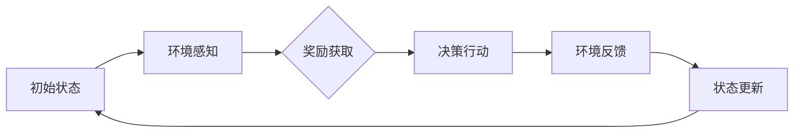
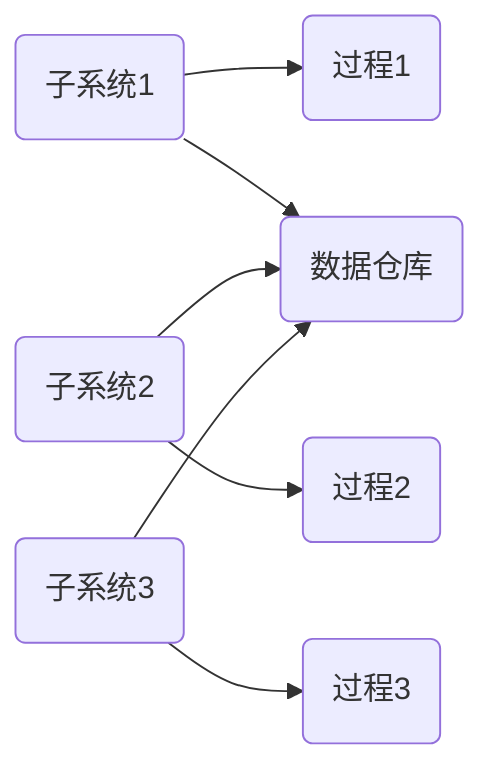
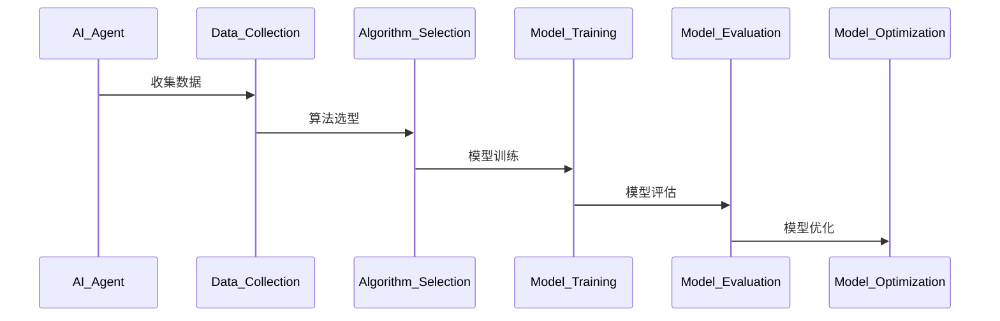
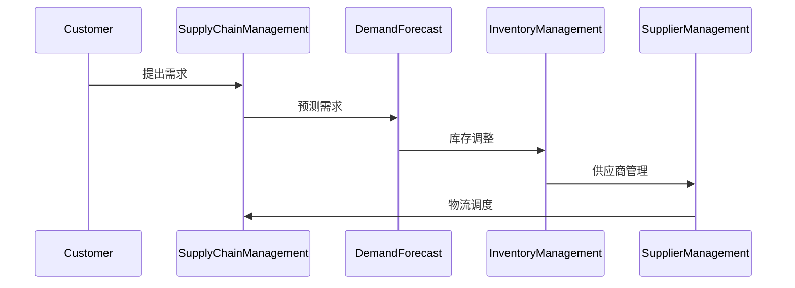

                 

## 文章标题：企业AI Agent的快速适应框架：应对瞬息万变的市场环境

### 关键词：企业AI Agent，快速适应框架，市场环境，人工智能

### 摘要：
本文旨在探讨企业AI Agent的快速适应框架，以应对瞬息万变的市场环境。我们将深入分析企业AI Agent的定义与特点，详细讲解核心算法原理，展示系统分析与架构设计，并通过实际项目实战来验证框架的有效性。最后，我们将总结最佳实践并提供拓展阅读资源。

---

## 第一部分：企业AI Agent的快速适应框架概述

### 第1章：问题背景与框架介绍

#### 1.1.1 问题背景
在当前全球化、数字化、智能化的时代背景下，企业面临的市场环境愈发复杂多变。传统的人工决策方式已经难以适应快速变化的市场需求，因此，企业需要一个智能体——企业AI Agent，来辅助决策。

#### 1.1.2 企业AI Agent的定义与特点
企业AI Agent是一种基于人工智能技术的智能决策实体，能够自主地学习、推理和适应市场变化。与传统AI不同，企业AI Agent具有自我学习、自我优化、自适应环境的特点。

#### 1.1.3 企业AI Agent的快速适应框架概述
企业AI Agent的快速适应框架旨在帮助企业AI Agent快速地适应市场环境，其核心是算法的快速迭代与优化。框架包括数据采集、算法选型、模型训练、模型评估与优化等组成部分。

### 第2章：核心概念与联系

#### 2.1.1 核心概念
在构建企业AI Agent的过程中，需要理解的核心概念包括机器学习、深度学习、强化学习、监督学习、自然语言处理和知识图谱。

#### 2.1.2 概念属性特征对比表格
下面是一个关于这些核心概念的属性特征对比表格：

| 概念 | 描述 | 关键特征 |
| --- | --- | --- |
| 机器学习 | 让机器通过数据学习并获得知识 | 自我学习和自我优化 |
| 深度学习 | 机器学习的一种方法，通过模拟人脑神经网络进行学习 | 大规模数据、高效计算 |
| 强化学习 | 通过奖励机制来训练模型 | 自主决策、实时反馈 |
| 监督学习 | 通过已有数据进行学习，预测未来数据 | 标签数据、回归分析 |
| 自然语言处理 | 使计算机能够理解、生成和处理人类语言 | 语境理解、语音识别 |
| 知识图谱 | 通过实体与关系构建知识网络 | 知识表达、推理查询 |

#### 2.1.3 ER实体关系图架构
以下是企业AI Agent的ER实体关系图：

```mermaid
erDiagram
    AI_Agent ||--|{ Data_Collection } Data_Collection
    AI_Agent ||--|{ Algorithm_Selection } Algorithm_Selection
    AI_Agent ||--|{ Model_Training } Model_Training
    AI_Agent ||--|{ Model_Evaluation } Model_Evaluation
    AI_Agent ||--|{ Model_Optimization } Model_Optimization
```

### 第3章：算法原理讲解

#### 3.1.1 算法原理
在本章中，我们将分别讲解强化学习、深度学习和自然语言处理算法的原理。

#### 3.1.2 算法mermaid流程图
以下是强化学习算法的mermaid流程图：



### 第4章：系统分析与架构设计

#### 4.1.1 问题场景介绍
我们将介绍一个企业AI Agent在供应链管理中的应用场景。

#### 4.1.2 系统功能设计
以下是供应链管理领域模型类图：

```mermaid
classDiagram
    SupplyChainManagement <<interface>>
    DemandForecast <<interface>>
    InventoryManagement <<interface>>
    SupplierManagement <<interface>>
    SupplyChainManagement : +DemandForecast
    SupplyChainManagement : +InventoryManagement
    SupplyChainManagement : +SupplierManagement
```

#### 4.1.3 系统架构设计
以下是系统架构图：



#### 4.1.4 系统接口设计
以下是系统接口设计：



#### 4.1.5 系统交互
以下是系统交互序列图：



### 第5章：项目实战

#### 5.1.1 环境安装
在本节中，我们将介绍如何安装企业AI Agent的开发环境。

#### 5.1.2 系统核心实现
以下是企业AI Agent的核心实现源代码：

```python
class EnterpriseAIAgent:
    def __init__(self):
        self.model = None
        self.data = None

    def train_model(self, data):
        # 模型训练代码
        pass

    def evaluate_model(self, data):
        # 模型评估代码
        pass

    def optimize_model(self, data):
        # 模型优化代码
        pass
```

#### 5.1.3 代码应用解读与分析
在本节中，我们将分析系统核心代码的应用。

#### 5.1.4 实际案例分析与详细讲解
在本节中，我们将通过实际案例来分析企业AI Agent的应用。

#### 5.1.5 项目小结
在本节中，我们将对项目进行总结。

### 第6章：最佳实践与小结

#### 6.1.1 最佳实践
在本节中，我们将提供企业AI Agent的最佳实践建议。

#### 6.1.2 小结
在本节中，我们将总结本书的主要内容。

#### 6.1.3 注意事项
在本节中，我们将强调使用企业AI Agent时需要注意的问题。

#### 6.1.4 拓展阅读
在本节中，我们将推荐相关阅读材料。

---

## 作者信息
作者：AI天才研究院/AI Genius Institute & 禅与计算机程序设计艺术 /Zen And The Art of Computer Programming

---

## 结束语
本文通过详细的章节内容，逐步介绍了企业AI Agent的快速适应框架，从问题背景到算法原理，再到系统分析与架构设计，以及实际项目实战，力求为读者提供一个全面而深入的理解。希望本文能对企业在瞬息万变的市场环境中，利用人工智能技术实现快速适应提供有益的参考。让我们共同努力，探索人工智能的无限可能！

