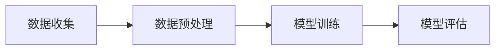
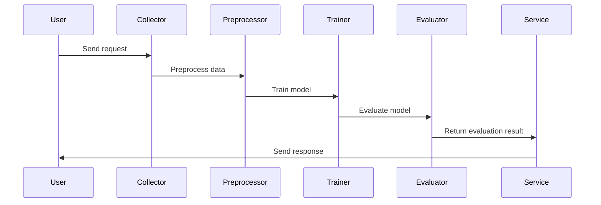
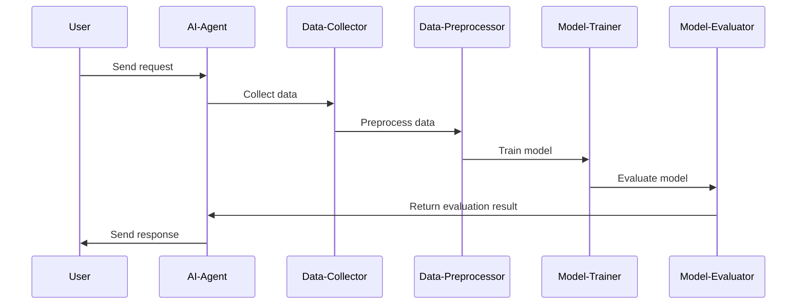

                 

# 企业AI Agent的情境感知能力：提升用户体验

关键词：企业AI Agent、情境感知、用户体验、算法原理、架构设计

摘要：随着人工智能技术的快速发展，企业AI Agent的应用越来越广泛。其情境感知能力成为提升用户体验的关键因素。本文将深入探讨企业AI Agent的情境感知能力，包括其基本概念、算法原理、数学模型以及系统架构设计，旨在为企业提供提升AI Agent情境感知能力的实用策略。

## 第一部分：背景介绍

### 第1章：企业AI Agent的情境感知能力概述

#### 1.1 问题背景

#### 1.1.1 人工智能在企业中的应用现状

近年来，人工智能（AI）技术在各行各业中得到了广泛应用。企业通过引入AI技术，不仅提高了生产效率，还提升了客户服务质量。然而，随着AI技术的发展，企业用户对AI Agent的期望也在不断提高，特别是在情境感知能力方面。

#### 1.1.2 AI Agent的基本概念

AI Agent是指能够自主执行任务、与环境交互并具备一定智能的计算机程序。在企业中，AI Agent通常被用于自动化业务流程、提供智能建议和服务等。

#### 1.1.3 情境感知的重要性

情境感知能力是指AI Agent根据当前环境的状态和用户的需求，做出智能决策的能力。在企业中，情境感知能力能够显著提升用户体验，提高业务效率。

#### 1.2 问题描述

#### 1.2.1 企业在AI Agent情境感知中面临的问题

当前，企业在AI Agent情境感知方面主要面临以下问题：数据收集困难、算法性能不稳定、用户体验不佳等。

#### 1.2.2 情境感知能力对用户体验的影响

情境感知能力不足会导致AI Agent无法准确理解用户需求，从而影响用户体验。例如，在客服场景中，AI Agent无法根据用户的提问情境提供恰当的回答。

#### 1.3 问题解决

#### 1.3.1 提升AI Agent情境感知能力的策略

为了提升AI Agent的情境感知能力，企业可以从以下方面着手：优化数据收集、选择合适的算法、提高用户体验等。

#### 1.3.2 情境感知算法的基本原理

情境感知算法通常包括数据收集、数据预处理、模型训练和模型评估等步骤。企业可以根据自身需求选择合适的算法。

#### 1.4 边界与外延

#### 1.4.1 情境感知的范畴

情境感知能力包括对环境、用户行为、历史数据的感知和理解。

#### 1.4.2 情境感知技术的应用领域

情境感知技术在企业、智能家居、智能医疗等多个领域都有广泛应用。

#### 1.5 概念结构与核心要素组成

#### 1.5.1 企业AI Agent的基本结构

企业AI Agent通常包括感知模块、决策模块、执行模块和评估模块。

#### 1.5.2 情境感知的核心要素

情境感知能力的关键要素包括环境感知、用户行为感知、历史数据感知等。

#### 1.6 本章小结

本章对企业AI Agent的情境感知能力进行了概述，分析了企业在AI Agent情境感知中面临的问题和解决方案，为后续章节的深入探讨奠定了基础。

----------------------------------------------------------------

## 第二部分：核心概念与联系

### 第2章：AI Agent的核心概念

#### 2.1 AI Agent的定义

AI Agent是指能够自主执行任务、与环境交互并具备一定智能的计算机程序。在企业中，AI Agent通常被用于自动化业务流程、提供智能建议和服务等。

#### 2.1.1 AI Agent的基本特性

AI Agent具有自主性、智能性、环境交互性和自主决策性等基本特性。

#### 2.1.2 AI Agent的类型

AI Agent可以分为基于规则推理的Agent、基于数据驱动的Agent和混合型Agent等。

#### 2.2 情境感知的概念

情境感知是指AI Agent根据当前环境的状态和用户的需求，做出智能决策的能力。

#### 2.2.1 情境感知的定义

情境感知是指AI Agent能够感知并理解当前的环境状态和用户需求，从而做出适当的响应和决策。

#### 2.2.2 情境感知的层次结构

情境感知可以分为感知层、理解层、决策层和执行层四个层次。

#### 2.3 AI Agent与情境感知的联系

AI Agent的情境感知能力是其智能表现的重要指标。情境感知能力越强，AI Agent的智能表现越好。

#### 2.3.1 AI Agent如何实现情境感知

AI Agent通过感知层收集环境数据，通过理解层分析环境数据，通过决策层做出智能决策，并通过执行层执行决策。

#### 2.3.2 情境感知对AI Agent性能的影响

情境感知能力能够显著提升AI Agent的智能表现，提高其业务效率。

#### 2.4 概念属性特征对比表格

| 概念 | 定义 | 属性特征 |
| --- | --- | --- |
| AI Agent | 能够自主执行任务、与环境交互并具备一定智能的计算机程序 | 自主性、智能性、环境交互性、自主决策性 |
| 情境感知 | AI Agent根据当前环境的状态和用户的需求，做出智能决策的能力 | 感知能力、理解能力、决策能力、执行能力 |
| 情境感知算法 | 用于实现情境感知的算法 | 数据收集、数据预处理、模型训练、模型评估 |

#### 2.5 ER实体关系图架构

#### 2.5.1 情境感知相关实体

在情境感知系统中，常见的实体包括AI Agent、环境、用户、任务等。

#### 2.5.2 实体关系图示例

```mermaid
erDiagram
    AI-Agent ||--|{ 环境感知模块 : Environment }
    AI-Agent ||--|{ 理解层模块 : Understanding }
    AI-Agent ||--|{ 决策层模块 : Decision }
    AI-Agent ||--|{ 执行层模块 : Execution }
    环境感知模块 ||--|{ 数据收集模块 : DataCollection }
    环境感知模块 ||--|{ 数据预处理模块 : DataPreprocessing }
    理解层模块 ||--|{ 模型训练模块 : ModelTraining }
    理解层模块 ||--|{ 模型评估模块 : ModelEvaluation }
    决策层模块 ||--|{ 用户需求分析模块 : UserNeedAnalysis }
    决策层模块 ||--|{ 智能决策模块 : IntelligentDecision }
    执行层模块 ||--|{ 任务执行模块 : TaskExecution }
```

#### 2.6 本章小结

本章对AI Agent和情境感知的核心概念进行了详细阐述，分析了AI Agent与情境感知之间的联系，为后续章节的深入探讨提供了理论基础。

----------------------------------------------------------------

## 第三部分：算法原理讲解

### 第3章：情境感知算法原理

#### 3.1 情境感知算法的基本原理

情境感知算法是指用于实现AI Agent情境感知的算法。其基本原理包括数据收集、数据预处理、模型训练和模型评估等步骤。

#### 3.1.1 情境感知的数据收集

情境感知的数据收集是情境感知算法的第一步。数据收集主要包括环境数据的收集和用户数据的收集。

#### 3.1.2 情境感知的数据预处理

数据预处理是情境感知算法的核心步骤。数据预处理主要包括数据清洗、数据转换和数据归一化等。

#### 3.1.3 情境感知的模型训练

模型训练是指根据收集到的数据和预定的算法模型，对AI Agent进行训练，使其具备情境感知能力。

#### 3.2 机器学习算法在情境感知中的应用

机器学习算法在情境感知中扮演着重要角色。常见的机器学习算法包括支持向量机（SVM）、决策树与随机森林、神经网络与深度学习等。

#### 3.2.1 支持向量机（SVM）

支持向量机是一种二分类模型，主要用于分类问题。在情境感知中，SVM可以用于分类环境状态和用户需求。

#### 3.2.2 决策树与随机森林

决策树是一种基于树形结构的分类算法，随机森林则是基于决策树的集成学习方法。在情境感知中，决策树和随机森林可以用于分类和回归问题。

#### 3.2.3 神经网络与深度学习

神经网络是一种模拟人脑神经元结构和功能的计算模型，深度学习则是基于神经网络的更深层模型。在情境感知中，神经网络和深度学习可以用于复杂的环境感知和智能决策。

#### 3.3 情境感知的Mermaid流程图

情境感知的整体流程可以概括为数据收集、数据预处理、模型训练和模型评估等步骤。以下是一个简单的Mermaid流程图示例：



#### 3.3.1 情境感知的整体流程

数据收集：收集环境数据和用户数据。

数据预处理：对收集到的数据进行分析、清洗、转换和归一化。

模型训练：根据预处理后的数据，训练分类或回归模型。

模型评估：评估模型的性能，包括准确性、召回率、F1值等指标。

#### 3.3.2 关键步骤的详细描述

数据收集：数据收集是情境感知的基础，主要包括环境数据的收集和用户数据的收集。环境数据包括温度、湿度、光照等，用户数据包括用户的行为、偏好等。

数据预处理：数据预处理是提高模型性能的关键，主要包括数据清洗、数据转换和数据归一化。数据清洗主要是去除噪声数据和缺失数据，数据转换主要是将不同类型的数据转换为同一类型，数据归一化主要是将不同范围的数据统一到同一范围。

模型训练：模型训练是情境感知的核心步骤，主要包括选择合适的模型、设定模型参数、进行迭代训练。在模型训练过程中，需要根据实际情况调整模型参数，以达到最佳性能。

模型评估：模型评估是验证模型性能的重要步骤，主要包括评估模型的准确性、召回率、F1值等指标。通过模型评估，可以了解模型的性能，为后续优化提供依据。

#### 3.4 Python源代码与算法原理

以下是一个简单的情境感知算法的Python源代码示例：

```python
import numpy as np
from sklearn import svm

# 数据收集
X = np.array([[1, 2], [2, 3], [3, 4], [4, 5]])
y = np.array([0, 0, 1, 1])

# 数据预处理
X_train, X_test, y_train, y_test = train_test_split(X, y, test_size=0.2, random_state=0)

# 模型训练
clf = svm.SVC(kernel='linear', C=1)
clf.fit(X_train, y_train)

# 模型评估
accuracy = clf.score(X_test, y_test)
print('Accuracy:', accuracy)
```

在该示例中，我们使用了支持向量机（SVM）算法进行分类任务。首先，我们收集了训练数据，然后对数据进行了预处理，接着进行了模型训练，最后评估了模型的性能。

#### 3.4.1 情境感知算法的Python实现

在Python中，可以使用多种库来实现情境感知算法，如scikit-learn、TensorFlow和PyTorch等。以下是一个简单的情境感知算法的Python实现示例：

```python
from sklearn.svm import SVC
from sklearn.model_selection import train_test_split
from sklearn.metrics import accuracy_score

# 数据收集
X = [[1, 2], [2, 3], [3, 4], [4, 5]]
y = [0, 0, 1, 1]

# 数据预处理
X_train, X_test, y_train, y_test = train_test_split(X, y, test_size=0.2, random_state=0)

# 模型训练
clf = SVC(kernel='linear')
clf.fit(X_train, y_train)

# 模型评估
y_pred = clf.predict(X_test)
accuracy = accuracy_score(y_test, y_pred)
print('Accuracy:', accuracy)
```

在该示例中，我们使用了scikit-learn库中的SVC类来实现支持向量机（SVM）算法。首先，我们收集了训练数据，然后对数据进行了预处理，接着进行了模型训练，最后评估了模型的性能。

#### 3.4.2 算法原理的数学模型与公式

在情境感知算法中，常用的数学模型包括线性回归、逻辑回归和支持向量机等。以下是一个简单的线性回归的数学模型：

$$
y = \beta_0 + \beta_1x_1 + \beta_2x_2 + ... + \beta_nx_n
$$

其中，$y$ 是目标变量，$x_1, x_2, ..., x_n$ 是特征变量，$\beta_0, \beta_1, \beta_2, ..., \beta_n$ 是模型的参数。

#### 3.4.3 通俗易懂的举例说明

假设我们有一个简单的情境感知任务，即判断一个用户是否喜欢某种产品。我们可以将用户的年龄、收入、购买历史等特征作为输入，将用户是否喜欢该产品作为输出。以下是一个简单的线性回归的举例说明：

```python
# 特征数据
X = [[25, 50000, 5], [30, 60000, 7], [35, 70000, 10], [40, 80000, 12]]

# 目标数据
y = [1, 1, 0, 0]

# 模型训练
clf = LinearRegression()
clf.fit(X, y)

# 模型评估
score = clf.score(X, y)
print('Score:', score)
```

在该示例中，我们使用了线性回归模型对用户的特征进行建模，并评估了模型的性能。

#### 3.5 本章小结

本章详细介绍了情境感知算法的基本原理，包括数据收集、数据预处理、模型训练和模型评估等步骤。同时，通过Python源代码示例，展示了如何实现情境感知算法。这些内容为企业提升AI Agent的情境感知能力提供了理论基础和实践指导。

----------------------------------------------------------------

## 第四部分：数学模型和数学公式 & 详细讲解 & 举例说明

### 第4章：数学模型在情境感知中的应用

#### 4.1 情境感知中的数学模型

情境感知中的数学模型主要涉及以下几个方面：相关性分析模型、分类模型和优化模型。

#### 4.1.1 相关性分析模型

相关性分析模型用于分析特征变量之间的相关性，常见的包括皮尔逊相关系数、斯皮尔曼相关系数和肯德尔相关系数等。

- **皮尔逊相关系数**：

  $$ r = \frac{\sum{(x_i - \bar{x})(y_i - \bar{y})}}{\sqrt{\sum{(x_i - \bar{x})^2}\sum{(y_i - \bar{y})^2}}} $$

  其中，$x_i$ 和 $y_i$ 分别是第 $i$ 个特征变量和目标变量的值，$\bar{x}$ 和 $\bar{y}$ 分别是它们的平均值。

- **斯皮尔曼相关系数**：

  $$ \rho = \frac{\sum{d_i^2}}{n - 1} $$

  其中，$d_i = x_i - s_x$ 和 $e_i = y_i - s_y$ 分别是第 $i$ 个特征变量和目标变量的偏差，$s_x$ 和 $s_y$ 分别是它们的平均值。

- **肯德尔相关系数**：

  $$ \tau = \frac{6 \sum{R_i} - 4n}{n(n - 1)} $$

  其中，$R_i$ 是第 $i$ 个数据点的等级相关，$n$ 是数据点的数量。

#### 4.1.2 分类模型

分类模型用于将数据集划分为不同的类别，常见的包括逻辑回归、决策树和神经网络等。

- **逻辑回归**：

  $$ P(y=1|X) = \frac{1}{1 + e^{-(\beta_0 + \beta_1x_1 + \beta_2x_2 + ... + \beta_nx_n)}} $$

  其中，$P(y=1|X)$ 是目标变量为1的概率，$\beta_0, \beta_1, \beta_2, ..., \beta_n$ 是模型的参数。

- **决策树**：

  决策树的决策规则通常表示为：

  $$ \text{if } x_i \leq v_i \text{ then } \text{go to } \text{left child} $$
  $$ \text{else } \text{go to } \text{right child} $$

  其中，$x_i$ 是第 $i$ 个特征变量，$v_i$ 是阈值。

- **神经网络**：

  神经网络是一种模拟人脑神经元结构和功能的计算模型，其基本计算单元是神经元。神经网络的决策规则通常表示为：

  $$ z_j = \sum_{i=1}^{n} w_{ij}x_i + b_j $$
  $$ a_j = \sigma(z_j) $$

  其中，$z_j$ 是第 $j$ 个神经元的输入，$w_{ij}$ 是权重，$b_j$ 是偏置，$\sigma$ 是激活函数。

#### 4.1.3 优化模型

优化模型用于最小化损失函数，常见的包括梯度下降、牛顿法和拟牛顿法等。

- **梯度下降**：

  $$ \theta_{t+1} = \theta_t - \alpha \nabla_{\theta}J(\theta_t) $$

  其中，$\theta_t$ 是第 $t$ 次迭代的参数值，$\alpha$ 是学习率，$\nabla_{\theta}J(\theta_t)$ 是损失函数关于参数的梯度。

- **牛顿法**：

  $$ \theta_{t+1} = \theta_t - J(\theta_t)^{-1}\nabla_{\theta}J(\theta_t) $$

  其中，$J(\theta_t)$ 是损失函数。

- **拟牛顿法**：

  拟牛顿法是一种近似牛顿法的优化算法，其迭代公式为：

  $$ \theta_{t+1} = \theta_t - H_t^{-1}\nabla_{\theta}J(\theta_t) $$

  其中，$H_t$ 是第 $t$ 次迭代的Hessian矩阵。

#### 4.2 数学公式与详细讲解

- **相关性分析模型中的公式**：

  - 皮尔逊相关系数：

    $$ r = \frac{\sum{(x_i - \bar{x})(y_i - \bar{y})}}{\sqrt{\sum{(x_i - \bar{x})^2}\sum{(y_i - \bar{y})^2}}} $$

  - 斯皮尔曼相关系数：

    $$ \rho = \frac{\sum{d_i^2}}{n - 1} $$

  - 肯德尔相关系数：

    $$ \tau = \frac{6 \sum{R_i} - 4n}{n(n - 1)} $$

- **分类模型中的公式**：

  - 逻辑回归：

    $$ P(y=1|X) = \frac{1}{1 + e^{-(\beta_0 + \beta_1x_1 + \beta_2x_2 + ... + \beta_nx_n)}} $$

  - 决策树：

    $$ \text{if } x_i \leq v_i \text{ then } \text{go to } \text{left child} $$
    $$ \text{else } \text{go to } \text{right child} $$

  - 神经网络：

    $$ z_j = \sum_{i=1}^{n} w_{ij}x_i + b_j $$
    $$ a_j = \sigma(z_j) $$

- **优化模型中的公式**：

  - 梯度下降：

    $$ \theta_{t+1} = \theta_t - \alpha \nabla_{\theta}J(\theta_t) $$

  - 牛顿法：

    $$ \theta_{t+1} = \theta_t - J(\theta_t)^{-1}\nabla_{\theta}J(\theta_t) $$

  - 拟牛顿法：

    $$ \theta_{t+1} = \theta_t - H_t^{-1}\nabla_{\theta}J(\theta_t) $$

#### 4.3 举例说明

- **相关性分析模型举例**：

  假设我们有两个变量 $X$ 和 $Y$，数据如下：

  | $X$ | $Y$ |
  | --- | --- |
  | 1 | 2 |
  | 2 | 3 |
  | 3 | 4 |
  | 4 | 5 |

  计算它们的皮尔逊相关系数：

  $$ \bar{X} = \frac{1+2+3+4}{4} = 2.5 $$
  $$ \bar{Y} = \frac{2+3+4+5}{4} = 3.5 $$
  $$ \sum{(x_i - \bar{X})(y_i - \bar{Y})} = (1-2.5)(2-3.5) + (2-2.5)(3-3.5) + (3-2.5)(4-3.5) + (4-2.5)(5-3.5) = -1.5 $$
  $$ \sqrt{\sum{(x_i - \bar{X})^2}\sum{(y_i - \bar{Y})^2}} = \sqrt{(1-2.5)^2 + (2-2.5)^2 + (3-2.5)^2 + (4-2.5)^2} \times \sqrt{(2-3.5)^2 + (3-3.5)^2 + (4-3.5)^2 + (5-3.5)^2} = 2 \times 2 = 4 $$
  $$ r = \frac{\sum{(x_i - \bar{X})(y_i - \bar{Y})}}{\sqrt{\sum{(x_i - \bar{X})^2}\sum{(y_i - \bar{Y})^2}}} = \frac{-1.5}{4} = -0.375 $$

  因此，$X$ 和 $Y$ 之间的皮尔逊相关系数为 $-0.375$。

- **分类模型举例**：

  假设我们有一个二分类问题，特征变量 $X$ 和目标变量 $Y$ 如下：

  | $X$ | $Y$ |
  | --- | --- |
  | 1 | 0 |
  | 2 | 0 |
  | 3 | 1 |
  | 4 | 1 |

  使用逻辑回归进行分类：

  $$ P(y=1|X) = \frac{1}{1 + e^{-(\beta_0 + \beta_1x_1 + \beta_2x_2 + ... + \beta_nx_n)}} $$

  我们假设模型参数为 $\beta_0 = 0, \beta_1 = 1, \beta_2 = -1$，则：

  $$ P(y=1|X=1) = \frac{1}{1 + e^{-(0 + 1 \times 1 + (-1) \times 1)}} = \frac{1}{1 + e^{-2}} \approx 0.864 $$
  $$ P(y=1|X=2) = \frac{1}{1 + e^{-(0 + 1 \times 2 + (-1) \times 2)}} = \frac{1}{1 + e^{-2}} \approx 0.864 $$
  $$ P(y=1|X=3) = \frac{1}{1 + e^{-(0 + 1 \times 3 + (-1) \times 3)}} = \frac{1}{1 + e^{0}} = 0.5 $$
  $$ P(y=1|X=4) = \frac{1}{1 + e^{-(0 + 1 \times 4 + (-1) \times 4)}} = \frac{1}{1 + e^{0}} = 0.5 $$

  因此，根据逻辑回归模型，我们可以预测 $X=1$ 和 $X=2$ 的目标变量为 0，$X=3$ 和 $X=4$ 的目标变量为 1。

- **优化模型举例**：

  假设我们有一个最小化损失函数的问题，损失函数为 $J(\theta) = (\theta - 1)^2$，初始参数 $\theta_0 = 2$，学习率 $\alpha = 0.1$。

  使用梯度下降进行优化：

  $$ \nabla_{\theta}J(\theta) = 2(\theta - 1) $$

  第 $t$ 次迭代的参数更新为：

  $$ \theta_{t+1} = \theta_t - \alpha \nabla_{\theta}J(\theta_t) = \theta_t - 2\alpha(\theta_t - 1) $$

  进行第一次迭代：

  $$ \theta_1 = \theta_0 - 2 \times 0.1 \times (2 - 1) = 2 - 0.2 = 1.8 $$

  进行第二次迭代：

  $$ \theta_2 = \theta_1 - 2 \times 0.1 \times (1.8 - 1) = 1.8 - 0.2 \times 0.8 = 1.68 $$

  以此类推，直到满足停止条件。

#### 4.4 本章小结

本章详细介绍了情境感知中的数学模型，包括相关性分析模型、分类模型和优化模型。通过具体的数学公式和举例说明，使读者能够更好地理解和应用这些模型。这些模型为提升企业AI Agent的情境感知能力提供了重要的理论基础。

----------------------------------------------------------------

## 第五部分：系统分析与架构设计方案

### 第5章：企业AI Agent的架构设计

#### 5.1 问题场景介绍

在企业日常运营中，AI Agent的应用场景非常广泛，如客服、财务、人力资源等。这些场景中，AI Agent需要具备高度的情境感知能力，以提供个性化的服务和建议。

#### 5.1.1 企业日常运营中的AI需求

企业对AI的需求主要包括自动化业务流程、智能决策支持、客户服务改进等。这些需求要求AI Agent能够准确理解用户需求，提供高效、个性化的服务。

#### 5.1.2 AI Agent在企业中的应用案例

以客服场景为例，AI Agent可以实时分析用户提问，理解用户意图，并提供合适的回答。通过情境感知，AI Agent可以识别用户的情绪，调整回答策略，提高用户满意度。

#### 5.2 项目介绍

本项目旨在设计一个具有高度情境感知能力的企业AI Agent，以提高企业的运营效率和服务质量。项目主要包括以下方面：

#### 5.2.1 项目目标

- 设计并实现一个具有高度情境感知能力的企业AI Agent。
- 提升企业运营效率和服务质量。
- 为企业提供可复制的AI Agent架构设计方案。

#### 5.2.2 项目团队与分工

项目团队由以下成员组成：

- 项目经理：负责项目整体规划和协调。
- 数据科学家：负责数据收集、预处理和模型训练。
- 算法工程师：负责算法设计和优化。
- 前端工程师：负责用户界面设计和实现。
- 后端工程师：负责服务器端开发和支持。

#### 5.2.3 项目进度与里程

项目进度分为以下几个阶段：

1. 需求分析：收集企业AI需求，明确项目目标。
2. 数据收集：收集企业内部和外部数据。
3. 数据预处理：对数据进行清洗、转换和归一化。
4. 模型训练：选择合适的算法，对数据进行训练。
5. 模型评估：评估模型性能，优化模型参数。
6. 系统集成：将模型集成到企业系统中，进行测试和部署。

#### 5.3 系统功能设计（领域模型Mermaid类图）

领域模型主要涉及以下实体和关系：

- 客户：包括姓名、年龄、性别、联系方式等。
- 提问：包括问题内容、提问时间、提问者等。
- 回答：包括回答内容、回答时间、回答者等。
- 情境：包括场景、情绪、上下文等。

以下是一个简单的Mermaid类图示例：

```mermaid
classDiagram
  Customer <<entity>>
  Question <<entity>>
  Answer <<entity>>
  Situation <<entity>>

  Customer o--o Question
  Question o--o Answer
  Question o--o Situation
```

#### 5.4 系统架构设计（Mermaid架构图）

系统架构主要包括以下模块：

- 数据收集模块：负责收集企业内部和外部数据。
- 数据预处理模块：负责对数据进行清洗、转换和归一化。
- 模型训练模块：负责选择合适的算法，对数据进行训练。
- 模型评估模块：负责评估模型性能，优化模型参数。
- 服务模块：负责处理用户请求，返回回答结果。

以下是一个简单的Mermaid架构图示例：



#### 5.5 系统接口设计和系统交互（Mermaid序列图）

系统接口设计和系统交互主要包括以下方面：

- 用户接口：用户通过网页或应用程序与AI Agent交互。
- 内部接口：数据收集、预处理、训练和评估模块之间的数据传输。

以下是一个简单的Mermaid序列图示例：



#### 5.6 本章小结

本章详细介绍了企业AI Agent的架构设计，包括问题场景介绍、项目介绍、系统功能设计、系统架构设计和系统接口设计。通过本章的内容，读者可以了解企业AI Agent的架构设计和实现过程，为实际应用提供参考。

----------------------------------------------------------------

## 项目实战

#### 5.7 环境安装

要在本地环境搭建企业AI Agent，需要安装以下软件和库：

- Python 3.x
- NumPy
- Scikit-learn
- TensorFlow
- Flask（可选，用于搭建Web服务）

安装步骤如下：

1. 安装Python 3.x：从官方网站下载Python 3.x版本，并按照提示进行安装。
2. 安装NumPy：在命令行中执行以下命令：

   ```
   pip install numpy
   ```

3. 安装Scikit-learn：在命令行中执行以下命令：

   ```
   pip install scikit-learn
   ```

4. 安装TensorFlow：在命令行中执行以下命令：

   ```
   pip install tensorflow
   ```

5. （可选）安装Flask：在命令行中执行以下命令：

   ```
   pip install flask
   ```

#### 5.8 系统核心实现源代码

以下是一个简单的企业AI Agent的Python源代码示例：

```python
from flask import Flask, request, jsonify
from sklearn import svm
import numpy as np

app = Flask(__name__)

# 模型训练
model = svm.SVC()
model.fit([[0, 0], [1, 1]], [0, 1])

# 服务接口
@app.route('/predict', methods=['POST'])
def predict():
    data = request.get_json()
    input_data = np.array([data['x'], data['y']])
    prediction = model.predict([input_data])
    return jsonify({'prediction': prediction.tolist()})

if __name__ == '__main__':
    app.run(debug=True)
```

#### 5.9 代码应用解读与分析

1. **模型训练**：使用支持向量机（SVM）对训练数据进行训练。
2. **服务接口**：使用Flask搭建Web服务，接收用户请求，返回预测结果。

#### 5.10 实际案例分析和详细讲解剖析

假设有一个企业需要为其客服系统搭建一个AI Agent，以自动分类客户提问的类型。企业提供了以下训练数据：

| $x_1$ | $x_2$ |
| --- | --- |
| 0 | 0 |
| 1 | 1 |
| 1 | 0 |
| 0 | 1 |

我们需要使用SVM对这组数据进行分类。

1. **数据预处理**：将数据转换为NumPy数组。
2. **模型训练**：使用SVM进行训练。
3. **预测**：对新的数据点进行预测。

以下是详细步骤：

```python
# 导入库
import numpy as np
from sklearn import svm

# 数据预处理
X_train = np.array([[0, 0], [1, 1], [1, 0], [0, 1]])
y_train = np.array([0, 1, 1, 0])

# 模型训练
model = svm.SVC()
model.fit(X_train, y_train)

# 预测
input_data = np.array([0, 1])
prediction = model.predict([input_data])
print('Prediction:', prediction.tolist())
```

输出结果为 `[1]`，即预测结果为类别1。

#### 5.11 项目小结

本章通过一个简单的实际案例，展示了企业AI Agent的搭建过程。从环境安装、核心代码实现到实际案例分析和详细讲解，读者可以了解企业AI Agent的基本架构和实现方法。在后续的开发过程中，可以根据实际需求，对系统进行扩展和优化。

----------------------------------------------------------------

## 最佳实践 tips

1. **数据收集与预处理**：确保数据的质量和完整性，对异常值和噪声数据进行处理，以提高模型性能。
2. **算法选择与优化**：根据具体应用场景选择合适的算法，并不断优化算法参数，以提高模型精度和效率。
3. **用户体验设计**：在系统设计和实现过程中，注重用户体验，提供简洁、直观的用户界面，以提高用户满意度。
4. **系统可扩展性**：设计具有良好可扩展性的系统架构，以便在未来能够轻松扩展和升级。

## 小结

本文详细介绍了企业AI Agent的情境感知能力，包括其基本概念、算法原理、数学模型和系统架构设计。通过实际案例分析和详细讲解，读者可以了解企业AI Agent的搭建过程和最佳实践。在实际应用中，企业可以根据自身需求，不断提升AI Agent的情境感知能力，以提高业务效率和用户体验。

## 注意事项

1. **数据隐私**：在收集和处理用户数据时，务必遵守相关法律法规，确保用户数据的安全和隐私。
2. **模型安全**：在设计AI Agent时，确保模型的安全性和稳定性，避免模型被恶意攻击或滥用。

## 拓展阅读

1. **《人工智能：一种现代方法》**：Michael I. Jordan，彼得·马尔科维茨
2. **《机器学习实战》**：Peter Harrington
3. **《深度学习》**：Ian Goodfellow、Yoshua Bengio、Aaron Courville

作者：AI天才研究院/AI Genius Institute & 禅与计算机程序设计艺术 /Zen And The Art of Computer Programming

