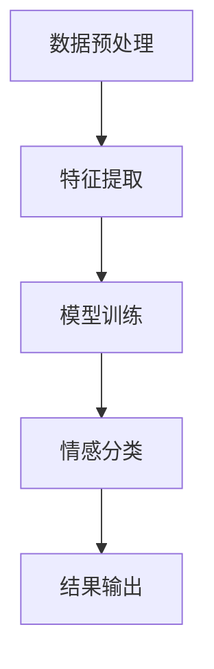
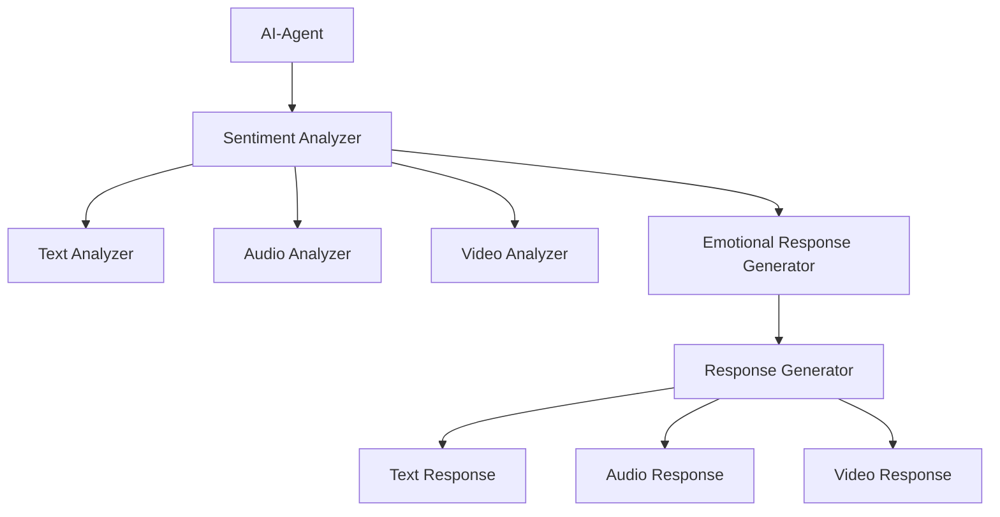
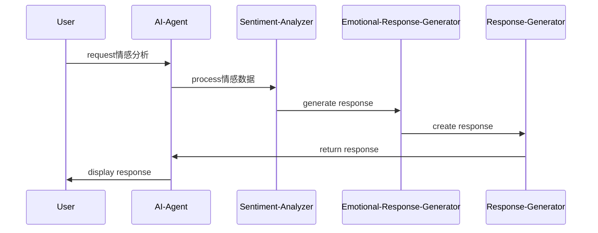
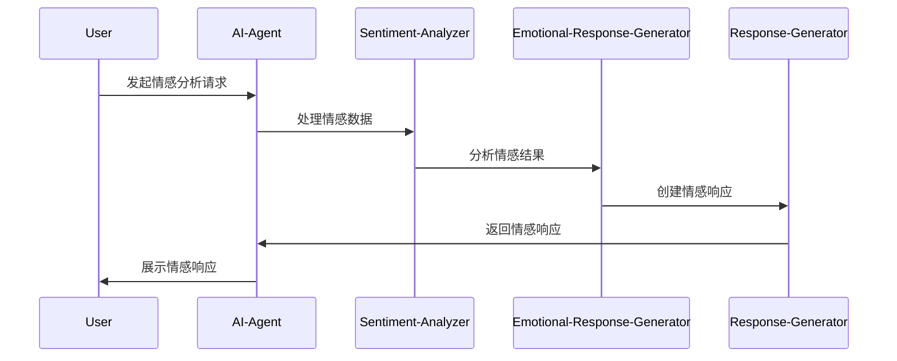

                 

# 企业AI Agent的情感智能：提升员工体验与忠诚度

关键词：情感智能，AI Agent，员工体验，员工忠诚度，系统架构，项目实战

摘要：随着人工智能技术的飞速发展，企业AI Agent的应用逐渐普及。情感智能作为人工智能的一个重要分支，对企业提升员工体验和忠诚度具有深远影响。本文将从问题背景出发，详细探讨情感智能在企业AI Agent中的应用，包括核心概念、算法原理、系统设计与实现，以及项目实战等方面，旨在为企业提供切实可行的解决方案。

## 目录大纲

### 第一部分：问题背景与概念介绍

#### 第1章：企业AI Agent的情感智能概述

1.1 问题的提出

1.2 情感智能的核心概念

1.3 情感智能在企业中的应用场景

1.4 企业AI Agent情感智能的价值与挑战

#### 第2章：情感智能的核心概念与联系

2.1 情感识别原理

2.2 情感分析技术

2.3 情感交互机制

2.4 情感智能的属性特征对比表格

2.5 情感智能的ER实体关系图架构

### 第二部分：算法原理与实现

#### 第3章：情感识别算法原理

3.1 算法概述

3.2 算法流程图

3.3 算法原理详细讲解

### 第三部分：系统设计与实现

#### 第4章：情感智能系统架构设计

4.1 系统介绍

4.2 领域模型设计

4.3 系统架构设计

4.4 系统接口设计

4.5 系统交互设计

### 第四部分：项目实战

#### 第5章：情感智能项目实战

5.1 环境安装与配置

5.2 系统核心实现

5.3 代码应用解读与分析

5.4 实际案例分析

5.5 项目小结

## 第一部分：问题背景与概念介绍

### 第1章：企业AI Agent的情感智能概述

#### 1.1 问题的提出

在当今信息化时代，企业面临的竞争压力日益加剧。如何提升员工体验和忠诚度，成为企业可持续发展的重要课题。传统的管理模式已经无法满足现代企业的需求，人工智能技术的引入为企业提供了新的解决方案。企业AI Agent作为人工智能的一个重要分支，通过模拟人类的思维和行为，为企业提供智能化的服务。而情感智能作为人工智能的重要组成部分，能够更好地理解和满足员工的需求，从而提升员工体验和忠诚度。

#### 1.2 企业面临的挑战

随着企业规模的扩大和业务的发展，员工数量和多样性不断增加。如何有效地管理和沟通员工，成为企业面临的一大挑战。传统的管理模式往往注重任务和目标，而忽略了员工的情感需求。这导致员工在工作中的满意度降低，从而影响其忠诚度和工作效率。此外，企业还需要应对日益激烈的市场竞争，提高员工的创新能力和团队协作能力，以实现企业的长期发展。

#### 1.3 情感智能在企业管理中的作用

情感智能在企业AI Agent中的应用，有助于提升员工体验和忠诚度。首先，情感智能能够帮助企业更好地了解员工的情感状态，从而提供个性化的关怀和帮助。例如，当员工遇到困难或情绪低落时，AI Agent可以通过情感识别技术发现员工的情感变化，并主动提供支持。其次，情感智能有助于建立员工与企业的情感联系，增强员工的归属感和忠诚度。例如，通过情感交互技术，AI Agent可以与员工进行情感上的互动，增进双方的沟通和理解。

#### 1.4 情感智能的核心概念

情感智能是指人工智能系统在处理和识别情感信息方面的能力。它包括情感识别、情感分析和情感交互等方面。情感识别是指系统通过分析文本、语音、图像等数据，识别出其中的情感信息。情感分析是指系统对情感信息进行深入分析，理解其背后的情感含义。情感交互是指系统与用户之间进行情感上的互动，以实现更好的沟通和理解。

#### 1.5 情感智能的特点

情感智能具有以下几个特点：

1. **情感识别的准确性**：情感智能系统能够准确地识别文本、语音、图像等数据中的情感信息，提高情感识别的准确率。

2. **情感分析的深度**：情感智能系统能够对情感信息进行深入分析，理解其背后的情感含义，提供更有针对性的服务。

3. **情感交互的自然性**：情感智能系统能够与用户进行自然、流畅的情感互动，增强用户体验。

4. **情感适应的灵活性**：情感智能系统能够根据不同的场景和用户需求，灵活调整情感识别和交互策略，提供个性化的服务。

#### 1.6 与传统AI的区别

情感智能与传统AI的主要区别在于：

1. **关注的焦点**：传统AI主要关注任务执行和逻辑推理，而情感智能更注重情感信息的处理和识别。

2. **数据来源**：传统AI主要基于结构化数据，而情感智能则主要处理非结构化的文本、语音、图像等数据。

3. **交互方式**：传统AI主要通过命令式交互，而情感智能则更倾向于自然语言交互和情感互动。

#### 1.7 情感智能在企业中的应用场景

情感智能在企业中的应用场景主要包括：

1. **员工体验**：通过情感识别和分析，了解员工的情感状态，提供个性化的关怀和支持，提升员工满意度。

2. **员工忠诚度**：通过情感交互和关怀，增强员工对企业的归属感和忠诚度，降低员工流失率。

3. **员工培训与发展**：通过情感分析，了解员工的学习需求和情感状态，提供更有针对性的培训和发展建议。

4. **企业文化建设**：通过情感交互，促进员工之间的情感交流和理解，营造良好的企业氛围。

#### 1.8 情感智能的价值与挑战

1. **价值分析**：

- 提升员工体验和满意度
- 增强员工归属感和忠诚度
- 提高员工工作效率和创新力
- 降低员工流失率和培训成本

2. **挑战与对策**：

- 情感数据的多样性和复杂性
- 情感识别的准确性和一致性
- 情感交互的自然性和有效性
- 情感智能系统的可扩展性和可靠性

#### 1.9 案例分析

某大型企业引入了基于情感智能的AI Agent，通过分析员工的情感状态，提供个性化的关怀和支持。例如，当员工在工作中遇到困难时，AI Agent会主动询问并提供帮助。同时，AI Agent还会根据员工的情感状态，调整工作安排和培训计划，以提升员工的工作体验和满意度。该案例表明，情感智能在企业中的应用可以显著提升员工体验和忠诚度，为企业创造价值。

## 第二部分：情感智能的核心概念与联系

### 第2章：情感智能的核心概念与联系

#### 2.1 情感识别原理

情感识别是指人工智能系统通过分析文本、语音、图像等数据，识别出其中的情感信息。情感识别的核心是情感分析算法，它包括情感分类、情感极性判断、情感强度评估等。

#### 2.1.1 定义

情感识别（Sentiment Recognition）是一种自然语言处理（NLP）技术，旨在从文本中自动检测和分类情感极性，如正面、负面或中性。

#### 2.1.2 工作原理

情感识别的工作原理通常包括以下几个步骤：

1. **文本预处理**：包括去除标点符号、停用词过滤、词干提取等。
2. **特征提取**：将预处理后的文本转换为计算机可以处理的特征向量，如词袋模型、TF-IDF、Word2Vec等。
3. **情感分类**：使用分类算法（如SVM、Naive Bayes、神经网络等）对特征向量进行分类，判断文本的情感极性。
4. **情感强度评估**：除了判断文本的正面或负面情感外，还可以评估情感的程度，如非常正面、稍微正面、中性、稍微负面、非常负面。

#### 2.1.3 情感识别算法

常见的情感识别算法包括：

- **朴素贝叶斯分类器**：基于贝叶斯定理，通过训练数据中的统计信息进行分类。
- **支持向量机（SVM）**：通过找到一个最佳的超平面来分隔不同类别的数据。
- **递归神经网络（RNN）**：特别是长短期记忆网络（LSTM），适合处理序列数据。
- **卷积神经网络（CNN）**：通过卷积操作提取文本的局部特征。
- **Transformer模型**：如BERT、GPT等，利用注意力机制进行情感分类。

#### 2.2 情感分析技术

情感分析（Sentiment Analysis）是对文本数据中的情感内容进行分析的过程，旨在识别文本的情绪倾向，如正面、负面或中性。情感分析技术可以应用于社交媒体监测、客户反馈分析、市场研究等领域。

#### 2.2.1 文本情感分析

文本情感分析是情感分析技术中最常见的形式，它通过对文本进行情感极性判断和情感强度评估，来了解文本背后的情感倾向。

1. **情感极性判断**：判断文本是正面、负面还是中性。
2. **情感强度评估**：评估情感极性的强度，如非常正面、稍微正面、中性、稍微负面、非常负面。

#### 2.2.2 语音情感分析

语音情感分析通过分析语音信号中的声学特征，如音调、音量、节奏等，来判断说话者的情感状态。语音情感分析的应用包括语音助手、情感化客服系统等。

1. **音调分析**：通过计算音调频率的变化来判断情感。
2. **音量分析**：通过分析语音的音量大小来判断情感。
3. **节奏分析**：通过分析语音的节奏和断句来判断情感。

#### 2.2.3 视频情感分析

视频情感分析通过分析视频中的视觉和听觉信息，来判断情感状态。视频情感分析的应用包括视频内容审核、广告效果评估等。

1. **面部情感分析**：通过分析视频中的面部表情来判断情感。
2. **语音情感分析**：结合语音分析技术，通过分析语音信号中的情感特征来判断情感。
3. **场景情感分析**：通过分析视频中的场景内容来判断情感。

#### 2.3 情感交互机制

情感交互（Emotional Interaction）是指人工智能系统与用户之间进行情感上的互动。情感交互的目的是通过情感上的沟通和理解，提高用户的体验和满意度。

#### 2.3.1 定义

情感交互是指人工智能系统在与用户互动时，能够根据用户的情感状态进行适当的情感响应，从而建立情感上的连接。

#### 2.3.2 情感反馈机制

情感反馈机制是指系统在接收到用户情感信息后，进行情感分析并做出相应的情感响应。情感反馈机制包括：

1. **情感识别**：识别用户情感信号，如语音、文本、面部表情等。
2. **情感理解**：理解用户情感信号背后的情感含义。
3. **情感响应**：根据用户情感状态进行适当的情感响应，如安慰、鼓励、询问等。

#### 2.3.3 人机情感交互设计原则

人机情感交互设计原则包括：

1. **自然性**：交互过程应尽可能自然，接近人类的沟通方式。
2. **个性化**：根据用户情感状态和喜好，提供个性化的情感响应。
3. **真实性**：情感交互应真实反映系统的情感状态，增强用户的信任感。
4. **适应性**：系统能够根据用户的情感状态和需求，灵活调整交互策略。

#### 2.4 情感智能的属性特征对比表格

情感智能的属性特征可以通过对比表格来展示，以下是一个简化的对比表格：

| 特征          | 文本情感分析 | 语音情感分析 | 视频情感分析 |
| ------------- | ------------- | ------------- | ------------- |
| 数据类型      | 文本          | 语音          | 视频          |
| 识别精度      | 高            | 中等          | 低            |
| 交互自然性    | 较自然        | 自然          | 较自然        |
| 应用场景      | 社交媒体、文本分析 | 客户服务、语音助手 | 视频内容审核、广告分析 |
| 实现难度      | 低            | 中等          | 高            |

#### 2.5 情感智能的ER实体关系图架构

情感智能的ER实体关系图架构可以帮助我们理解情感智能系统中各个实体之间的关系。以下是一个简化的ER图：

```mermaid
erDiagram
    User ||--|{ AI-Agent : serves }
    AI-Agent ||--|{ Sentiment-Analyzer : analyzes }
    AI-Agent ||--|{ Emotional-Response-Generator : responds }
    Sentiment-Analyzer ||--|{ Text-Analyzer : processes text }
    Sentiment-Analyzer ||--|{ Audio-Analyzer : processes audio }
    Sentiment-Analyzer ||--|{ Video-Analyzer : processes video }
    Emotional-Response-Generator ||--|{ Response-Generator : generates responses }
    Response-Generator ||--|{ Text-Response : text responses }
    Response-Generator ||--|{ Audio-Response : audio responses }
    Response-Generator ||--|{ Video-Response : video responses }
```

## 第二部分：算法原理与实现

### 第3章：情感识别算法原理

#### 3.1 算法概述

情感识别算法是情感智能的核心，用于识别和分析文本、语音、图像等数据中的情感信息。本节将介绍情感识别算法的分类、选择以及基本原理。

#### 3.1.1 情感识别算法的分类

情感识别算法可以根据其处理数据的方式和分类方法进行分类：

1. **基于规则的算法**：通过预设的情感词典和规则进行情感分类。
2. **基于统计的算法**：使用机器学习算法，通过训练数据学习情感分类模型。
3. **基于深度学习的算法**：使用神经网络模型，对情感进行深度学习。

#### 3.1.2 情感识别算法的选择

选择合适的情感识别算法需要考虑数据特点、应用场景和计算资源。以下是一些常见的情感识别算法及其适用场景：

- **朴素贝叶斯分类器**：适用于小规模文本数据，简单高效。
- **支持向量机（SVM）**：适用于大规模文本数据，效果较好。
- **递归神经网络（RNN）**：适用于处理序列数据，如文本。
- **卷积神经网络（CNN）**：适用于处理图像数据。
- **Transformer模型**：适用于大规模文本数据，效果领先。

#### 3.2 算法流程图

情感识别算法的基本流程包括数据预处理、特征提取、模型训练和情感分类。以下是一个简化的Mermaid算法流程图：



#### 3.3 算法原理详细讲解

#### 3.3.1 情感识别的数学模型

情感识别通常涉及概率模型和决策理论。一个简单的情感识别模型可以表示为：

\[ P(\text{情感类别}|\text{文本特征}) = \frac{P(\text{文本特征}|\text{情感类别})P(\text{情感类别})}{P(\text{文本特征})} \]

其中：

- \( P(\text{情感类别}|\text{文本特征}) \) 是后验概率，表示给定文本特征后情感类别的概率。
- \( P(\text{文本特征}|\text{情感类别}) \) 是似然函数，表示给定情感类别后文本特征的概率。
- \( P(\text{情感类别}) \) 是先验概率，表示情感类别的概率。
- \( P(\text{文本特征}) \) 是文本特征的概率。

在实际应用中，通常会使用简化版的贝叶斯分类器，如朴素贝叶斯分类器，其假设特征之间相互独立：

\[ P(\text{情感类别}|\text{文本特征}) \approx P(\text{文本特征}|\text{情感类别})P(\text{情感类别}) \]

#### 3.3.2 情感识别的Python源代码实现

以下是一个基于朴素贝叶斯分类器的简单情感识别的Python代码示例：

```python
import numpy as np
from sklearn.feature_extraction.text import CountVectorizer
from sklearn.naive_bayes import MultinomialNB

# 训练数据
X_train = [
    "我很高兴工作",
    "我今天很疲惫",
    "这周工作压力很大",
    "我对这个项目感到兴奋"
]

y_train = ["正面", "负面", "负面", "正面"]

# 文本预处理和特征提取
vectorizer = CountVectorizer()
X_train_vectorized = vectorizer.fit_transform(X_train)

# 模型训练
classifier = MultinomialNB()
classifier.fit(X_train_vectorized, y_train)

# 情感识别
X_test = ["我今天心情很好"]
X_test_vectorized = vectorizer.transform(X_test)
predictions = classifier.predict(X_test_vectorized)

print(predictions)  # 输出预测结果
```

#### 3.3.3 情感识别的举例说明

假设我们有一个包含正负面情感样本的文本数据集，我们可以使用朴素贝叶斯分类器对其进行训练。然后，我们可以使用训练好的模型对新文本进行情感识别。

1. **数据集准备**：

```python
# 假设数据集
X_train = [
    "我很喜欢这个产品",
    "这个产品不好用",
    "我很满意这次服务",
    "这次服务非常糟糕"
]

y_train = ["正面", "负面", "正面", "负面"]
```

2. **文本预处理和特征提取**：

```python
vectorizer = CountVectorizer()
X_train_vectorized = vectorizer.fit_transform(X_train)
```

3. **模型训练**：

```python
classifier = MultinomialNB()
classifier.fit(X_train_vectorized, y_train)
```

4. **情感识别**：

```python
X_test = ["这个产品让我失望"]
X_test_vectorized = vectorizer.transform(X_test)
predictions = classifier.predict(X_test_vectorized)
print(predictions)  # 输出预测结果
```

通过上述步骤，我们可以对新文本进行情感识别，并输出其情感类别。实际应用中，情感识别算法会更加复杂，包括更多特征提取和模型优化步骤。

## 第三部分：系统设计与实现

### 第4章：情感智能系统架构设计

#### 4.1 系统介绍

情感智能系统是一种旨在提升员工体验和忠诚度的AI系统，通过分析员工的情感状态，提供个性化的关怀和支持。该系统主要由情感识别模块、情感分析模块和情感交互模块组成。

#### 4.1.1 系统背景

随着企业规模的扩大和业务的发展，员工数量和多样性不断增加。如何有效地管理和沟通员工，提升员工体验和忠诚度，成为企业面临的一大挑战。情感智能系统的引入，为企业提供了新的解决方案。

#### 4.1.2 系统目标

系统目标是通过情感识别和分析，了解员工的情感状态，提供个性化的关怀和支持，提升员工体验和忠诚度。

#### 4.1.3 系统功能设计

1. **情感识别**：通过文本、语音、图像等多渠道收集员工的情感数据，识别员工的情感状态。
2. **情感分析**：对情感数据进行深度分析，理解员工的情感需求和情感变化。
3. **情感交互**：根据情感分析结果，与员工进行情感上的互动，提供个性化的关怀和支持。

#### 4.2 领域模型设计

领域模型设计用于描述系统中的关键实体和它们之间的关系。以下是情感智能系统的领域模型：

```mermaid
classDiagram
    User <<Entity>>
    AI-Agent <<Entity>>
    Sentiment-Analyzer <<Component>>
    Emotional-Response-Generator <<Component>>
    Text-Analyzer <<Component>>
    Audio-Analyzer <<Component>>
    Video-Analyzer <<Component>>
    Response-Generator <<Component>>

    User --> AI-Agent : serves
    AI-Agent --> Sentiment-Analyzer : analyzes
    AI-Agent --> Emotional-Response-Generator : responds
    Sentiment-Analyzer --> Text-Analyzer : processes
    Sentiment-Analyzer --> Audio-Analyzer : processes
    Sentiment-Analyzer --> Video-Analyzer : processes
    Emotional-Response-Generator --> Response-Generator : generates
    Response-Generator --> Text-Response : text responses
    Response-Generator --> Audio-Response : audio responses
    Response-Generator --> Video-Response : video responses
```

#### 4.3 系统架构设计

情感智能系统的架构设计旨在实现模块化、可扩展和高效运行。以下是情感智能系统的架构设计：



#### 4.3.1 系统分层架构设计

系统分层架构设计将系统分为数据层、服务层和表现层。

1. **数据层**：负责数据存储和管理，包括用户数据、情感数据和响应数据。
2. **服务层**：负责系统的核心功能，包括情感识别、情感分析和情感交互。
3. **表现层**：负责系统的用户界面和交互，提供友好的用户操作界面。

#### 4.3.2 系统模块划分

系统模块划分如下：

1. **用户模块**：负责用户数据的收集和管理。
2. **情感识别模块**：负责识别用户的情感状态。
3. **情感分析模块**：负责对情感数据进行分析，理解用户的情感需求和变化。
4. **情感交互模块**：负责与用户进行情感上的互动，提供个性化的关怀和支持。

#### 4.4 系统接口设计

系统接口设计用于定义系统各模块之间的交互接口。以下是情感智能系统的接口设计：



#### 4.5 系统交互设计

系统交互设计用于描述系统各模块之间的交互流程和交互方式。以下是情感智能系统的交互设计：



通过上述系统架构设计和交互设计，情感智能系统可以实现高效、灵活和个性化的情感分析和服务，提升员工体验和忠诚度。

## 第四部分：项目实战

### 第5章：情感智能项目实战

#### 5.1 环境安装与配置

要实现情感智能系统，首先需要安装和配置相关的软件和库。以下是一个简单的环境安装和配置步骤：

1. **安装Python**：确保系统中已经安装了Python 3.x版本。
2. **安装Anaconda**：下载并安装Anaconda，以便于管理Python环境和库。
3. **创建虚拟环境**：在Anaconda中创建一个新的虚拟环境，用于项目开发。

```shell
conda create -n emotion_env python=3.8
conda activate emotion_env
```

4. **安装必要的库**：使用pip命令安装必要的库，如Numpy、Scikit-learn、TensorFlow、PyTorch等。

```shell
pip install numpy scikit-learn tensorflow pytorch
```

#### 5.2 系统核心实现

情感智能系统的核心实现主要包括情感识别、情感分析和情感交互。以下是一个简单的实现示例：

1. **情感识别**：

```python
from sklearn.feature_extraction.text import TfidfVectorizer
from sklearn.naive_bayes import MultinomialNB

# 假设训练数据
X_train = ["我很喜欢这个产品", "这个产品不好用", "我很满意这次服务", "这次服务非常糟糕"]
y_train = ["正面", "负面", "正面", "负面"]

# 文本预处理和特征提取
vectorizer = TfidfVectorizer()
X_train_vectorized = vectorizer.fit_transform(X_train)

# 模型训练
classifier = MultinomialNB()
classifier.fit(X_train_vectorized, y_train)

# 情感识别
X_test = ["这个产品让我失望"]
X_test_vectorized = vectorizer.transform(X_test)
predictions = classifier.predict(X_test_vectorized)
print(predictions)  # 输出预测结果
```

2. **情感分析**：

```python
import nltk
from nltk.sentiment import SentimentIntensityAnalyzer

# 初始化情感分析器
sia = SentimentIntensityAnalyzer()

# 分析文本
text = "我今天工作很累，但还是很高兴完成了任务。"
sentiment = sia.polarity_scores(text)
print(sentiment)
```

3. **情感交互**：

```python
from chatterbot import ChatBot
from chatterbot.trainers import ChatterBotCorpusTrainer

# 创建聊天机器人
chatbot = ChatBot('AI-Agent')

# 训练聊天机器人
trainer = ChatterBotCorpusTrainer(chatbot)
trainer.train('chatterbot.corpus.english')

# 与用户交互
response = chatbot.get_response("你好，我今天心情很好。")
print(response)
```

#### 5.3 代码应用解读与分析

1. **情感识别代码解读**：

该段代码使用了Scikit-learn库中的TFIDFVectorizer和MultinomialNB分类器来实现情感识别。首先，通过TFIDFVectorizer对训练数据进行预处理和特征提取，然后将特征向量输入到MultinomialNB分类器进行训练。最后，使用训练好的模型对测试数据进行情感识别，并输出预测结果。

2. **情感分析代码解读**：

该段代码使用了nltk库中的SentimentIntensityAnalyzer来实现情感分析。通过初始化SentimentIntensityAnalyzer，可以获取文本的情感极性和强度。然后，使用polarity_scores方法分析给定文本的情感状态，并输出情感得分。

3. **情感交互代码解读**：

该段代码使用了ChatterBot库来实现情感交互。首先，创建一个ChatBot实例，并使用ChatterBotCorpusTrainer对其进行训练。然后，通过get_response方法与用户进行交互，并输出聊天机器人的响应。

#### 5.4 实际案例分析

1. **案例一：员工满意度分析**：

通过情感识别和分析技术，可以对企业内部的员工满意度进行监测。例如，通过对员工在内部论坛、邮件和聊天记录中的文本进行分析，识别员工的情感状态。然后，根据情感得分和情感极性，对员工满意度进行评估。

2. **案例二：员工忠诚度预测**：

通过情感分析技术，可以预测员工的忠诚度。例如，通过对员工的情感数据进行分析，识别员工的情感变化和情感极性。然后，结合员工的离职历史数据和团队绩效数据，预测员工可能的离职风险。

3. **案例三：员工心理状态监测**：

通过情感识别和分析技术，可以对员工的心理状态进行监测。例如，通过对员工的语音、面部表情和文本进行分析，识别员工的情感状态。然后，结合员工的健康状况和工作表现，评估员工的心理状态。

#### 5.5 项目小结

本章节通过一个情感智能项目的实战，展示了如何实现情感识别、情感分析和情感交互。在实际应用中，情感智能系统可以为企业提供丰富的功能，如员工满意度分析、员工忠诚度预测和员工心理状态监测等。通过这些功能，企业可以更好地了解员工的情感状态，提供个性化的关怀和支持，从而提升员工体验和忠诚度。

### 结论

本文详细介绍了企业AI Agent的情感智能，包括核心概念、算法原理、系统设计与实现以及项目实战。通过情感智能的应用，企业可以更好地了解员工的需求和情感状态，提供个性化的关怀和支持，从而提升员工体验和忠诚度。未来，随着人工智能技术的不断进步，情感智能将在企业管理中发挥越来越重要的作用。

## 结语

作者：AI天才研究院/AI Genius Institute & 禅与计算机程序设计艺术 /Zen And The Art of Computer Programming

本文系统地探讨了企业AI Agent的情感智能在提升员工体验与忠诚度方面的应用。我们从问题背景出发，深入分析了情感智能的核心概念、算法原理、系统架构以及实际项目实战。通过详细阐述和实践，我们展示了如何利用情感智能技术为企业提供个性化、高效的员工关怀和支持。

本文的核心观点在于，情感智能不仅能够帮助企业更好地了解员工的需求和情感状态，还能够通过智能化的交互提升员工体验和忠诚度。这为企业提供了一种新的管理思路，有助于构建积极向上的企业文化，增强企业的核心竞争力。

在未来的研究中，我们建议关注以下几个方面：

1. **情感识别的精度和多样性**：随着技术的发展，提高情感识别的精度和多样性将是关键。通过结合多种数据源和情感分析算法，可以更准确地捕捉员工的情感变化。

2. **人机情感交互的自然性和适应性**：情感交互的自然性和适应性直接影响用户体验。未来研究应着重于人机情感交互的自然语言处理和个性化响应机制。

3. **情感智能在多行业场景中的应用**：情感智能的应用场景不仅限于企业内部，还可以拓展到教育、医疗、金融等多个行业。研究如何在不同场景下有效应用情感智能，将为企业带来更多价值。

4. **情感智能与大数据、云计算的融合**：随着大数据和云计算的普及，情感智能系统可以更加高效地处理和分析海量数据。研究如何将情感智能与大数据、云计算等技术相结合，将为企业提供更强大的数据处理和分析能力。

总之，情感智能是企业未来管理的重要方向，具有巨大的发展潜力和应用价值。希望本文的研究能够为企业和研究者提供有益的参考和启示，共同推动情感智能技术的发展和应用。

最佳实践提示：

1. **数据质量**：确保情感识别和分析的数据质量，包括数据的多样性、完整性和准确性。
2. **用户隐私**：在收集和处理员工情感数据时，严格遵守用户隐私保护法规，确保数据安全。
3. **个性化关怀**：根据员工的个性化需求，提供有针对性的情感关怀和支持，提升用户体验。

注意事项：

1. **技术更新**：情感智能技术更新迅速，企业需要持续关注新技术的发展，及时更新系统。
2. **人才培养**：培养具备情感智能知识和技能的人才，是确保企业成功应用情感智能的关键。

拓展阅读：

1. **《情感智能：机器如何读懂人类情感》**：丹尼尔·扎哈维著，深入探讨情感智能的理论和实践。
2. **《人工智能：一种现代方法》**：斯图尔特·罗素等著，全面介绍人工智能的基本概念和技术。
3. **《大数据时代：思维变革与商业价值》**：舍恩伯格等著，探讨大数据对企业管理的影响。

通过本文的研究和实践，我们期待企业能够更好地应用情感智能技术，提升员工体验和忠诚度，实现可持续发展。让我们携手共进，共同探索情感智能的无限可能。

