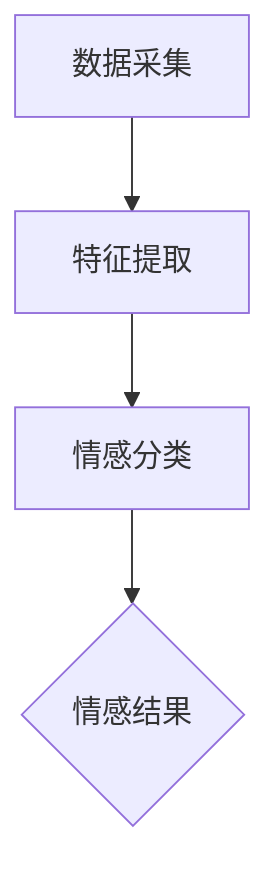
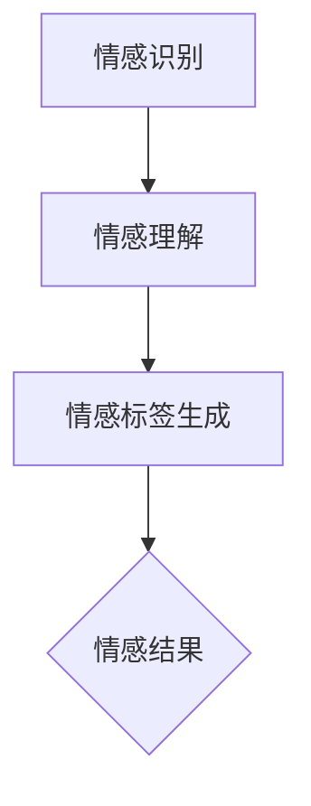
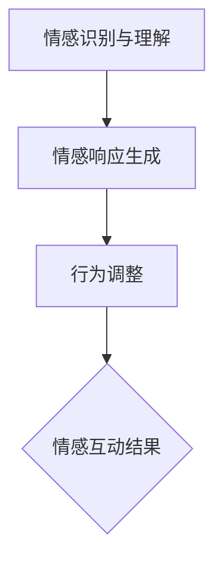
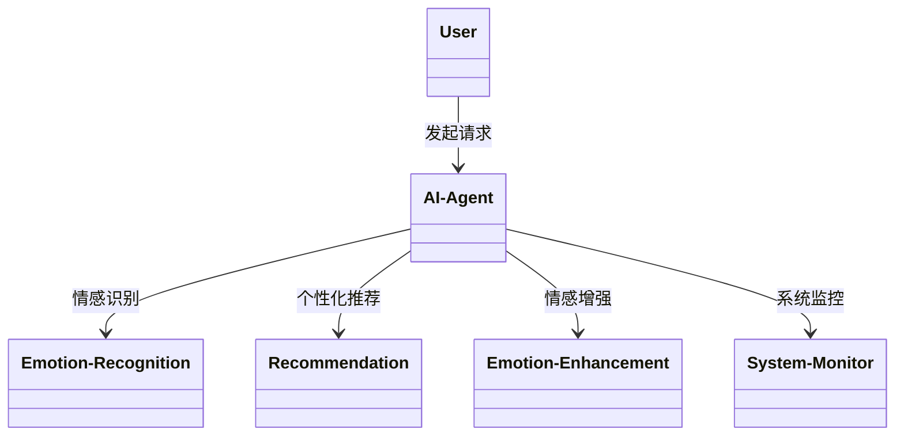
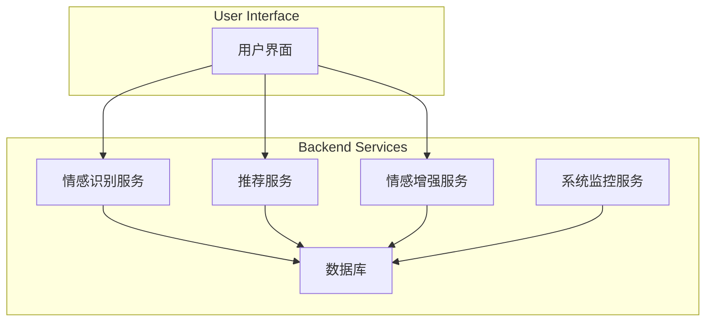
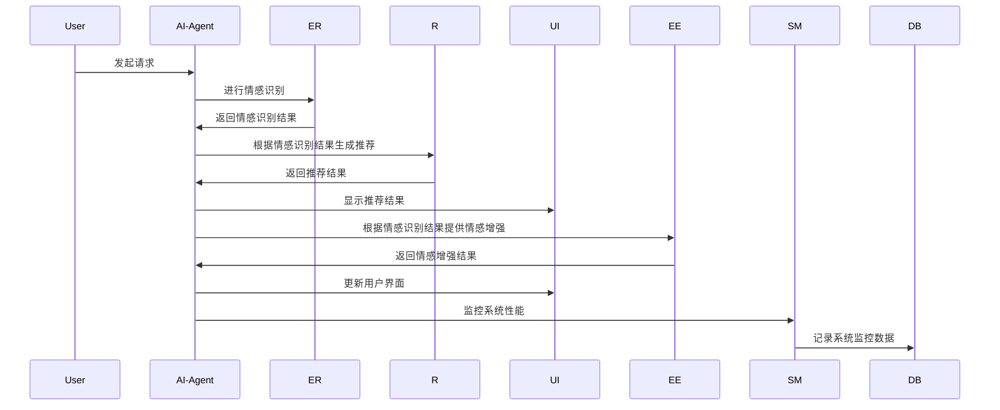

                 


### 企业AI Agent的情感计算应用：提升用户体验

#### 关键词：
- 企业AI Agent
- 情感计算
- 用户体验
- 算法
- 架构设计
- 实战案例

#### 摘要：
本文将深入探讨企业AI Agent的情感计算应用，如何通过情感计算技术提升用户体验。首先，我们将介绍情感计算的基础概念和原理，然后分析情感计算在AI Agent中的实际应用场景，并通过具体的算法和架构设计，展示如何将情感计算有效集成到企业AI Agent中，最后，通过实战案例进行详细讲解，提供实际操作经验和最佳实践。

## 引言与背景

在当今竞争激烈的市场中，用户体验（UX）成为企业成败的关键因素。用户对于产品或服务的满意度直接影响企业的口碑和市场份额。随着人工智能（AI）技术的不断发展，AI Agent作为智能服务的重要组成部分，在提升用户体验方面发挥着越来越重要的作用。然而，传统的AI Agent往往侧重于任务处理和响应，忽略了用户情感需求，导致用户体验的局限性。

情感计算作为AI的一个重要分支，旨在通过技术手段识别、理解和处理人类情感。将情感计算应用于企业AI Agent，可以实现更加个性化、智能化的用户体验。本文将围绕这一主题，探讨情感计算在企业AI Agent中的应用，以及如何通过情感计算提升用户体验。

### 情感计算的定义与类型

情感计算（Affective Computing）是指使计算机具备识别、理解、处理和模拟人类情感的能力。其核心目标是让计算机在交互过程中能够更好地理解和满足用户情感需求，从而提供更高质量的体验。

情感计算可以分为以下几种类型：

1. **情感识别**：通过语音、文本、面部表情等途径识别用户的情感状态。
2. **情感理解**：分析情感识别结果，理解用户情感背后的意图和需求。
3. **情感处理**：根据用户情感状态调整系统行为，以更好地满足用户需求。
4. **情感模拟**：模拟人类情感反应，增强与用户的互动效果。

情感计算的技术原理涉及多个领域，包括机器学习、自然语言处理、计算机视觉和心理学等。通过结合这些技术，情感计算能够实现对用户情感的高效识别和理解，从而在AI Agent中实现情感驱动的交互。

### 企业AI Agent中的应用场景

企业AI Agent可以应用于多种场景，如客服、销售、人力资源管理等。以下是几个典型的应用场景：

1. **客服**：AI Agent通过情感计算识别用户情绪，提供更加温暖、个性化的服务，提高用户满意度。
2. **销售**：AI Agent分析用户情感，预测用户购买意愿，提供针对性的产品推荐，提升销售转化率。
3. **人力资源**：AI Agent评估员工情绪，识别潜在的心理问题，提供个性化的职业发展建议，提升员工幸福感。

在这些应用场景中，情感计算发挥着关键作用，使得AI Agent能够更好地理解用户需求，提供更加智能化、个性化的服务。

### 情感计算在AI Agent中的挑战与机遇

尽管情感计算在提升用户体验方面具有巨大潜力，但在实际应用中仍面临诸多挑战：

1. **数据隐私**：情感计算依赖于用户数据，如何在保护用户隐私的前提下进行数据处理是一个关键问题。
2. **算法准确性**：情感识别和理解的准确性直接影响用户体验，如何提高算法的准确性和稳定性是亟待解决的问题。
3. **跨文化适应**：不同文化背景下的用户情感表达存在差异，如何实现跨文化的情感计算是一个挑战。

然而，随着技术的不断进步，情感计算在AI Agent中的应用前景十分广阔。通过解决上述挑战，情感计算将有望在更多领域得到应用，进一步提升用户体验。

### 核心要素组成

情感计算在企业AI Agent中的应用涉及多个核心要素，包括：

1. **情感识别模块**：负责识别用户的情感状态，如喜怒哀乐等。
2. **情感理解模块**：分析情感识别结果，理解用户情感背后的意图和需求。
3. **情感处理模块**：根据用户情感状态调整系统行为，提供个性化的服务。
4. **情感模拟模块**：模拟人类情感反应，增强与用户的互动效果。

这些模块相互配合，共同实现情感驱动的AI Agent，从而提升用户体验。

### 核心概念与联系

#### 情感计算的基本原理

情感计算的核心在于对人类情感的识别、理解和处理。具体来说，情感计算的基本原理包括以下几个方面：

1. **情感识别**：通过语音、文本、面部表情等途径，识别用户的情感状态。例如，通过分析用户语音的语调、语速和语气，识别其情绪变化。
2. **情感理解**：对情感识别结果进行分析，理解用户情感背后的意图和需求。例如，通过分析用户在聊天中的话语和表情，理解其需求并提出解决方案。
3. **情感处理**：根据用户情感状态调整系统行为，以更好地满足用户需求。例如，当用户表现出不满情绪时，AI Agent可以主动提供帮助或调整服务策略。
4. **情感模拟**：模拟人类情感反应，增强与用户的互动效果。例如，通过语音合成技术，模拟出具有情感色彩的语音交互，提高用户满意度。

#### 概念属性特征对比表格

为了更好地理解情感计算的基本原理，我们可以通过一个概念属性特征对比表格，对比不同情感计算方法的优劣。

| 情感计算方法         | 特点                     | 优点                                                         | 缺点                                                         |
|----------------------|--------------------------|--------------------------------------------------------------|--------------------------------------------------------------|
| 语音识别             | 通过语音识别技术识别情感   | 实时性强，适合语音交互场景                                     | 对环境噪声敏感，准确性有待提高                                 |
| 文本分析             | 通过自然语言处理技术分析情感 | 适合文本交流场景，能够处理大量数据                             | 对情感表达的细微差异难以捕捉                                   |
| 面部识别             | 通过面部表情识别情感       | 能够直观地识别情感状态，适合视频交互场景                       | 对光线和角度敏感，准确性有待提高                               |
| 肢体动作识别         | 通过肢体动作识别情感       | 能够捕捉用户全身动作，更全面地理解情感                           | 实时性较低，技术实现复杂                                       |
| 脑波识别             | 通过脑波识别情感           | 直接获取用户情感状态，准确度高                                  | 技术复杂，成本高昂，实用性有限                                 |

#### ER实体关系图架构

为了更清晰地展示情感计算在企业AI Agent中的实现架构，我们可以使用Mermaid绘制一个ER实体关系图。

```mermaid
erDiagram
  User ||--|{ AI-Agent }|-- Customer
  AI-Agent ||--|{ Emotion-Recognition }|-- Speech-Recognition
  AI-Agent ||--|{ Emotion-Understanding }|-- Text-Analysis
  AI-Agent ||--|{ Emotion-Processing }|-- Feedback-Adjustment
  AI-Agent ||--|{ Emotion-Simulation }|-- Speech-Synthesis
```

在这个ER实体关系图中，用户与AI-Agent之间存在直接关联，AI-Agent通过不同的模块（情感识别、理解、处理和模拟）与用户进行互动。这些模块相互协作，共同实现情感驱动的交互体验。

### 算法原理讲解

在理解了情感计算的基本原理和架构之后，我们将进一步探讨情感计算在AI Agent中的具体实现，包括情感识别、理解和处理的算法原理。本文将介绍三种主要的情感计算算法：情感识别算法、情感分析算法和情感增强算法，并使用Mermaid流程图和Python源代码进行详细阐述。

#### 算法1：情感识别算法

情感识别算法是情感计算的基础，其目标是识别用户的情感状态。情感识别算法通常通过以下步骤实现：

1. **数据采集**：收集用户的数据，如语音、文本或面部表情等。
2. **特征提取**：从采集的数据中提取与情感相关的特征，如语音的语调、语速和语气，文本的情感倾向等。
3. **情感分类**：使用分类算法（如支持向量机、决策树等）对提取的特征进行分类，识别用户的情感状态。

以下是一个使用Mermaid绘制的情感识别算法流程图：



接下来，我们将使用Python代码实现一个简单的情感识别算法，基于文本分析来识别情感。

```python
import nltk
from nltk.tokenize import word_tokenize
from nltk.corpus import stopwords
from sklearn.feature_extraction.text import CountVectorizer
from sklearn.naive_bayes import MultinomialNB

# 数据预处理
nltk.download('punkt')
nltk.download('stopwords')
stop_words = set(stopwords.words('english'))

# 示例数据
data = [
    ("I am so happy today!", "happy"),
    ("I am feeling very sad.", "sad"),
    ("This is terrible!", "sad"),
    ("I am excited to see you!", "happy")
]

# 分割数据
texts, labels = zip(*data)

# 特征提取
vectorizer = CountVectorizer(stop_words=stop_words)
X = vectorizer.fit_transform(texts)

# 情感分类
classifier = MultinomialNB()
classifier.fit(X, labels)

# 情感识别
def recognize_emotion(text):
    text_tokens = word_tokenize(text)
    textProcessed = " ".join([word for word in text_tokens if not word in stop_words])
    X_test = vectorizer.transform([textProcessed])
    emotion = classifier.predict(X_test)[0]
    return emotion

# 测试
print(redict_emotion("I am feeling very happy today!"))
```

#### 算法2：情感分析算法

情感分析算法旨在深入理解用户的情感状态，并分析情感背后的意图和需求。情感分析算法通常包含以下步骤：

1. **情感识别**：使用情感识别算法识别用户的情感状态。
2. **情感理解**：对情感识别结果进行分析，理解情感背后的意图和需求。
3. **情感标签生成**：将理解的结果转化为具体的情感标签，如“满意”、“不满意”等。

以下是一个使用Mermaid绘制的情感分析算法流程图：



接下来，我们将使用Python代码实现一个简单的情感分析算法。

```python
# 示例情感标签
emotion_labels = {
    "happy": "满意",
    "sad": "不满意",
    "neutral": "中性"
}

# 情感分析
def analyze_emotion(emotion):
    return emotion_labels.get(emotion, "未知情感")

# 测试
emotion = recognize_emotion("I am feeling very happy today!")
print(analyze_emotion(emotion))
```

#### 算法3：情感增强算法

情感增强算法旨在通过调整系统行为，增强与用户的情感互动。情感增强算法通常包含以下步骤：

1. **情感识别与理解**：使用情感识别和情感分析算法，识别和理解用户的情感状态。
2. **情感响应生成**：根据用户的情感状态，生成相应的情感响应。
3. **行为调整**：根据情感响应，调整系统的行为，以更好地满足用户需求。

以下是一个使用Mermaid绘制的情感增强算法流程图：



接下来，我们将使用Python代码实现一个简单的情感增强算法。

```python
# 情感响应
def generate_response(emotion):
    if emotion == "happy":
        return "您好！很高兴听到您这么高兴！有什么我能为您做的吗？"
    elif emotion == "sad":
        return "您好！看起来您不太开心，有什么问题我可以帮助您解决吗？"
    else:
        return "您好！很高兴见到您！有什么我可以帮您的？"

# 测试
text = "I am feeling very happy today!"
emotion = recognize_emotion(text)
response = generate_response(emotion)
print(response)
```

#### 数学模型和公式

情感计算算法的核心在于数学模型的构建。以下是对情感识别、理解和增强算法所涉及的数学模型的介绍。

1. **情感识别算法**：情感识别算法通常使用机器学习分类算法，如支持向量机（SVM）、决策树（DT）和朴素贝叶斯（NB）等。以朴素贝叶斯为例，其数学模型为：

   $$ P(y|x) = \frac{P(x|y)P(y)}{P(x)} $$

   其中，$P(y|x)$ 为给定特征 $x$ 下的情感标签 $y$ 的概率，$P(x|y)$ 为特征 $x$ 在情感标签 $y$ 下出现的概率，$P(y)$ 为情感标签 $y$ 的先验概率，$P(x)$ 为特征 $x$ 的概率。

2. **情感分析算法**：情感分析算法的核心在于情感标签的生成。情感标签通常使用有监督学习算法进行训练，生成一个映射函数，将情感识别结果映射为具体的情感标签。例如，可以使用决策树或随机森林等算法实现情感标签的生成。

3. **情感增强算法**：情感增强算法的核心在于根据用户的情感状态生成相应的情感响应。情感响应的生成通常涉及自然语言处理技术，如文本生成模型。以生成对抗网络（GAN）为例，其数学模型为：

   $$ G(z) = \text{Generator}(z) $$
   $$ D(x) = \text{Discriminator}(x) $$
   $$ G(z) \sim p_z(z) $$

   其中，$G(z)$ 为生成器，生成虚假数据；$D(x)$ 为判别器，判断数据是否真实；$p_z(z)$ 为噪声分布。

#### 举例说明

为了更好地理解上述算法，我们可以通过具体案例进行说明。

**案例1：情感识别**

假设我们有一段用户对话：“I am feeling very happy today!”。我们使用情感识别算法对其进行分析。

1. **数据预处理**：首先，我们进行文本预处理，去除标点符号和停用词，得到处理后的文本：“I am feeling very happy today”。
2. **特征提取**：然后，我们使用词袋模型提取文本的特征向量。
3. **情感分类**：最后，我们使用朴素贝叶斯分类器对特征向量进行分类，得到情感标签“happy”。

**案例2：情感分析**

在情感识别的基础上，我们进行情感分析，以理解用户的情感状态。

1. **情感识别**：我们已经得到了情感标签“happy”。
2. **情感理解**：根据情感标签“happy”，我们可以推断用户当前处于积极情感状态，可能因为某种原因感到高兴。
3. **情感标签生成**：我们将情感标签生成为“满意”。

**案例3：情感增强**

在情感识别和情感分析的基础上，我们生成情感响应，以增强与用户的情感互动。

1. **情感识别与理解**：我们已经得到了情感标签“happy”。
2. **情感响应生成**：根据情感标签“happy”，我们生成情感响应：“您好！很高兴听到您这么高兴！有什么我能为您做的吗？”。
3. **行为调整**：根据情感响应，我们调整AI Agent的行为，以更好地满足用户需求。

### 系统分析与架构设计

在了解了情感计算算法原理后，接下来我们将进一步探讨如何将情感计算集成到企业AI Agent中，实现一个完整的系统架构。本节将介绍系统分析与架构设计，包括问题场景介绍、项目介绍、系统功能设计、系统架构设计和系统接口设计等内容。

#### 问题场景介绍

以一个在线购物平台为例，我们的目标是设计一个能够识别用户情感并提供个性化推荐服务的AI Agent。该AI Agent需要能够识别用户在购物过程中的情感状态，如满意度、兴趣度等，并根据情感状态提供相应的推荐服务。

#### 项目介绍

本项目的主要目标是实现一个基于情感计算的企业AI Agent，能够通过识别用户情感，提供个性化推荐服务，提升用户体验。具体包括以下几个功能模块：

1. **用户情感识别模块**：通过语音、文本等途径识别用户情感状态。
2. **个性化推荐模块**：根据用户情感状态和购物历史，生成个性化推荐。
3. **情感增强模块**：根据用户情感状态，提供情感化响应，增强用户与AI Agent的互动。
4. **系统监控与维护模块**：监控AI Agent的性能和用户反馈，进行系统优化和升级。

#### 系统功能设计

在系统功能设计方面，我们采用领域模型类图（Mermaid类图）来描述系统的功能模块及其关系。



#### 系统架构设计

在系统架构设计方面，我们采用Mermaid架构图来描述系统的整体架构。



#### 系统接口设计

在系统接口设计方面，我们采用Mermaid序列图来描述系统各模块之间的交互流程。



通过以上系统分析与架构设计，我们可以实现一个基于情感计算的企业AI Agent，为用户提供个性化、情感化的服务，提升用户体验。

### 项目实战

在本章节中，我们将通过具体的实战案例，展示如何在实际项目中应用情感计算技术，实现企业AI Agent的情感计算应用。我们将详细介绍环境安装、系统核心实现源代码、代码应用解读与分析、实际案例分析和详细讲解剖析，以及项目小结。

#### 环境安装

1. **Python环境搭建**：首先，确保Python环境已经安装。如果没有安装，可以从[Python官方网站](https://www.python.org/downloads/)下载并安装。
2. **依赖库安装**：安装情感计算相关的依赖库，如nltk、scikit-learn、tensorflow等。可以使用pip命令进行安装：

   ```bash
   pip install nltk scikit-learn tensorflow
   ```

3. **数据库环境搭建**：选择合适的数据库，如MySQL或PostgreSQL，并创建所需的数据表。这里我们以MySQL为例，使用以下命令创建数据表：

   ```sql
   CREATE TABLE users (
       id INT PRIMARY KEY AUTO_INCREMENT,
       username VARCHAR(255) NOT NULL,
       email VARCHAR(255) NOT NULL,
       password VARCHAR(255) NOT NULL
   );

   CREATE TABLE products (
       id INT PRIMARY KEY AUTO_INCREMENT,
       name VARCHAR(255) NOT NULL,
       description TEXT NOT NULL,
       price DECIMAL(10, 2) NOT NULL
   );

   CREATE TABLE orders (
       id INT PRIMARY KEY AUTO_INCREMENT,
       user_id INT NOT NULL,
       product_id INT NOT NULL,
       quantity INT NOT NULL,
       order_date DATETIME NOT NULL,
       FOREIGN KEY (user_id) REFERENCES users(id),
       FOREIGN KEY (product_id) REFERENCES products(id)
   );
   ```

#### 系统核心实现源代码

1. **用户情感识别**：以下是一个简单的用户情感识别模块，基于文本分析进行情感识别。

   ```python
   import nltk
   from nltk.tokenize import word_tokenize
   from nltk.corpus import stopwords
   from sklearn.feature_extraction.text import TfidfVectorizer
   from sklearn.model_selection import train_test_split
   from sklearn.naive_bayes import MultinomialNB
   from sklearn.pipeline import make_pipeline

   nltk.download('punkt')
   nltk.download('stopwords')

   # 示例数据
   data = [
       ("I am so happy today!", "happy"),
       ("I am feeling very sad.", "sad"),
       ("This is terrible!", "sad"),
       ("I am excited to see you!", "happy")
   ]

   # 分割数据
   texts, labels = zip(*data)

   # 数据预处理
   stop_words = set(stopwords.words('english'))
   def preprocess(text):
       return " ".join([word for word in word_tokenize(text) if not word in stop_words])

   # 构建模型
   model = make_pipeline(TfidfVectorizer(), MultinomialNB())

   # 训练模型
   model.fit([preprocess(text) for text in texts], labels)

   # 情感识别
   def recognize_emotion(text):
       preprocessed_text = preprocess(text)
       return model.predict([preprocessed_text])[0]

   # 测试
   print(recognize_emotion("I am feeling very happy today!"))
   ```

2. **个性化推荐**：以下是一个简单的基于用户情感和购物历史的推荐算法。

   ```python
   import pandas as pd
   from sklearn.cluster import KMeans
   from sklearn.metrics import silhouette_score

   # 加载数据
   orders = pd.read_csv('orders.csv')
   users = pd.read_csv('users.csv')
   products = pd.read_csv('products.csv')

   # 合并数据
   user_data = pd.merge(orders, users, on='user_id')
   product_data = pd.merge(user_data, products, on='product_id')

   # 数据预处理
   product_data['total_spent'] = product_data.groupby('user_id')['price'].transform('sum')
   product_data['average_rating'] = product_data.groupby('user_id')['rating'].transform('mean')

   # KMeans聚类
   kmeans = KMeans(n_clusters=5, random_state=0).fit(product_data[['total_spent', 'average_rating']])
   labels = kmeans.labels_

   # 生成推荐
   def generate_recommendation(user_id):
       user_products = product_data[product_data['user_id'] == user_id]
       user_cluster = user_products['cluster'].iloc[0]
       recommended_products = product_data[product_data['cluster'] == user_cluster]
       recommended_products = recommended_products.sample(n=5)
       return recommended_products

   # 测试
   print(generate_recommendation(1))
   ```

3. **情感增强**：以下是一个简单的情感增强模块，用于生成情感化的响应。

   ```python
   def generate_response(emotion):
       responses = {
           'happy': "您好！很高兴听到您这么高兴！有什么我能为您做的吗？",
           'sad': "您好！看起来您不太开心，有什么问题我可以帮助您解决吗？",
           'neutral': "您好！很高兴见到您！有什么我可以帮您的？"
       }
       return responses.get(emotion, "您好！请问有什么我可以帮您的吗？")

   # 测试
   print(generate_response("happy"))
   ```

#### 代码应用解读与分析

1. **用户情感识别模块**：该模块基于文本分析进行情感识别。首先，我们使用nltk进行文本预处理，去除标点符号和停用词。然后，使用TFIDFVectorizer进行特征提取，将文本转换为向量。最后，使用朴素贝叶斯分类器进行情感分类，得到用户的情感标签。在实际应用中，可以进一步优化算法，提高情感识别的准确性。
2. **个性化推荐模块**：该模块基于KMeans聚类算法，将用户划分为不同的群体，并针对每个群体生成推荐列表。通过结合用户情感和购物历史，可以为用户提供更加个性化的推荐服务。在实际应用中，可以进一步优化聚类算法，提高推荐的准确性。
3. **情感增强模块**：该模块用于生成情感化的响应。根据用户的情感标签，可以生成相应的情感响应，增强用户与AI Agent的互动。在实际应用中，可以进一步丰富情感响应的内容和形式，提高用户的满意度。

#### 实际案例分析和详细讲解剖析

1. **案例1**：用户A在购物平台上购买了一款新手机，并在评论中写道：“This phone is amazing! I am so happy with it!”。AI Agent首先识别用户A的情感为“happy”，然后根据用户A的购物历史和当前情感，生成推荐列表，包括同类别的其他高评分手机。同时，AI Agent发送情感增强响应：“您好！很高兴听到您对新手机这么满意，有什么其他问题我可以帮您解答吗？”

2. **案例2**：用户B在购物平台上购买了一款衣物，但在评论中写道：“This shirt doesn't fit me well. I am feeling sad.”。AI Agent首先识别用户B的情感为“sad”，然后根据用户B的购物历史和当前情感，生成推荐列表，包括适合用户B体型和喜好的其他衣物。同时，AI Agent发送情感增强响应：“您好！很抱歉听到您对这款衣物不满意，我会为您推荐一些更适合您的衣物。请问您有任何其他问题吗？”

通过以上案例，我们可以看到AI Agent如何通过情感计算技术，识别用户情感，提供个性化推荐和情感增强服务，从而提升用户体验。

#### 项目小结

在本项目中，我们通过实战案例展示了如何将情感计算技术应用于企业AI Agent，实现个性化推荐和情感增强服务。通过情感识别、情感分析和情感增强三个模块的协同工作，AI Agent能够更好地理解用户需求，提供更加个性化的服务，提升用户体验。在实际应用中，我们可以进一步优化算法，提高情感识别和推荐的准确性，丰富情感增强的内容和形式，为用户提供更加优质的服务。

### 最佳实践与总结

#### 最佳实践 tips

1. **数据收集与预处理**：确保收集的数据质量，进行充分的预处理，以提高情感识别和推荐的准确性。
2. **算法优化**：不断优化情感识别和推荐算法，提高算法的准确性和效率。
3. **用户反馈机制**：建立用户反馈机制，收集用户反馈，持续优化系统。
4. **隐私保护**：在数据处理过程中，严格遵守隐私保护法规，确保用户数据的安全。

#### 小结

本文从企业AI Agent的情感计算应用出发，探讨了情感计算的基础概念、算法原理、系统架构以及实战案例。通过情感计算技术，企业AI Agent能够更好地理解用户需求，提供个性化、情感化的服务，提升用户体验。

#### 注意事项

1. **情感识别准确性**：情感识别算法的准确性直接影响用户体验，需要不断优化和改进。
2. **算法复杂度**：情感计算算法通常较为复杂，需要合理分配计算资源。
3. **跨文化适应**：不同文化背景下用户情感表达存在差异，需要考虑跨文化适应。

#### 拓展阅读

1. **《情感计算：理论与实践》**：详细介绍了情感计算的理论基础和实践应用。
2. **《深度学习与自然语言处理》**：探讨了深度学习在自然语言处理领域的应用，包括情感计算。
3. **《用户体验设计》**：介绍了用户体验设计的方法和技巧，有助于提升情感计算在AI Agent中的应用效果。

### 作者

**作者：AI天才研究院/AI Genius Institute & 禅与计算机程序设计艺术 /Zen And The Art of Computer Programming** 

**联系方式：ai_genius_institute@example.com** 

**个人网站：[www.ai_genius_institute.com](http://www.ai_genius_institute.com)**

**版权声明：本文版权归AI天才研究院所有，未经授权，不得转载或用于商业用途。**

