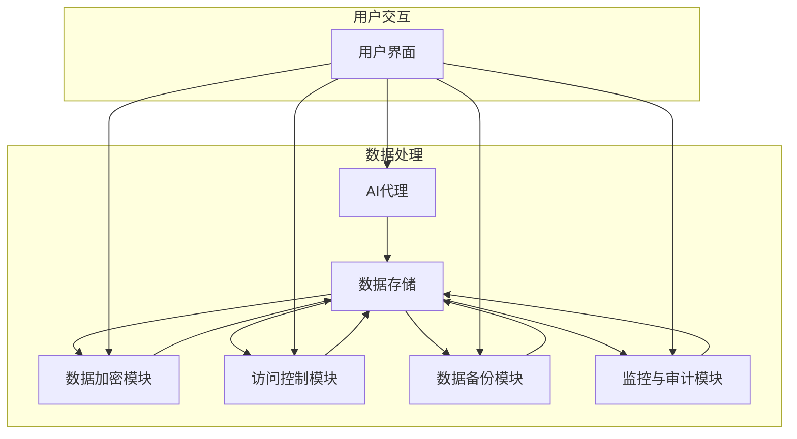
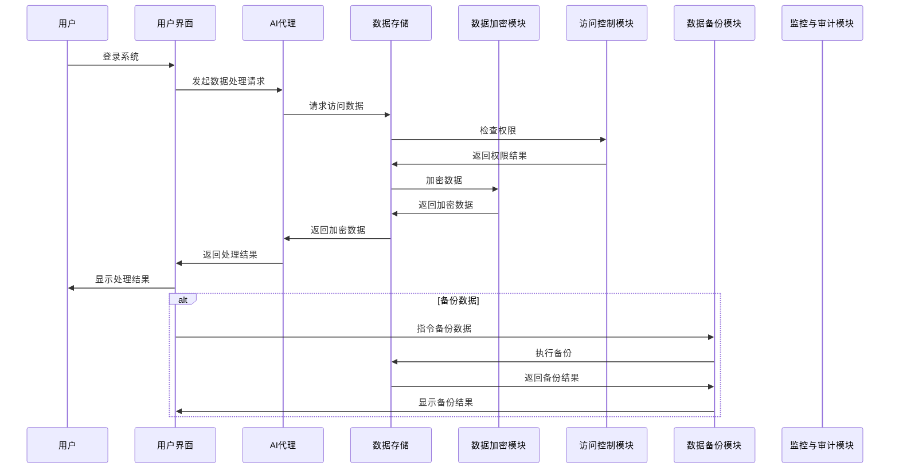

                 

## 引言

### 问题背景

随着人工智能（AI）技术的迅速发展，AI Agent在各个行业中的应用越来越广泛。AI Agent，也称为人工智能代理，是指能够自主执行任务、与外界交互并在特定环境中做出决策的智能体。在企业中，AI Agent被用于自动化流程、数据分析、客户服务等多个领域，提高了工作效率和决策质量。然而，随着AI Agent在企业中的应用日益深入，数据安全问题逐渐成为制约其发展的关键因素。

数据安全是指保护数据不被未经授权的访问、使用、披露、破坏、修改或删除的过程。在AI Agent的应用场景中，数据安全面临着前所未有的挑战。首先，AI Agent在处理企业核心数据时，如财务信息、客户数据等，一旦发生泄露或滥用，将导致严重的商业损失和法律纠纷。其次，AI Agent自身也可能成为网络攻击的目标，通过控制AI Agent来窃取企业机密信息。此外，随着数据的增加和复杂度的提升，传统的数据安全策略和工具难以应对新兴的AI安全威胁。

### 数据安全的重要性

数据安全的重要性不言而喻。对于企业而言，数据安全直接关系到企业的核心竞争力。首先，数据泄露可能导致企业的商业机密被竞争对手获取，从而影响企业在市场中的竞争优势。其次，数据泄露可能导致客户隐私泄露，损害企业形象，降低客户信任度，进而影响企业的客户基础和市场份额。此外，根据《一般数据保护条例》（GDPR）等法律法规，企业如若发生数据泄露，将面临巨额罚款和法律责任。

对于AI Agent而言，数据安全尤为重要。AI Agent依赖数据来进行学习和决策，因此数据的质量和完整性直接影响AI Agent的性能和可靠性。一旦数据被篡改或泄露，可能导致AI Agent做出错误决策，甚至导致系统崩溃。此外，由于AI Agent具有自主性和智能性，一旦被恶意攻击者控制，可能会对企业的正常运营造成严重破坏。

### 书籍目标与结构

本书旨在为企业提供一套全面、系统、实用的AI Agent数据安全策略。首先，本书将介绍AI Agent的基本知识，帮助读者了解AI Agent的定义、分类和核心技术。接着，本书将详细探讨数据安全的核心概念，包括数据安全的基本原则、数据分类与保护策略以及数据安全的关键技术。然后，本书将分析AI Agent在数据安全方面面临的挑战，并给出相应的解决方案。

在设计和实施数据安全策略部分，本书将提供一套完整的数据安全策略框架，包括目标、策略和执行步骤，并详细阐述如何评估和优化数据安全策略。此外，本书还将分享AI Agent的数据安全最佳实践，包括数据加密、访问控制、数据备份与恢复策略等，并探讨数据安全监控与应急响应的最佳实践。

最后，本书将通过案例分析和成功实践，为读者提供实际的指导和启示，并探讨数据安全发展的未来趋势。通过本书的学习，读者将能够系统地理解和掌握AI Agent的数据安全策略，为企业提供强有力的数据安全保障。

### 关键词

- AI Agent
- 数据安全
- 隐私保护
- 数据泄露
- 安全策略
- 法律法规
- 最佳实践

### 摘要

本书全面探讨了企业AI Agent的数据安全策略。首先，介绍了AI Agent的定义、分类和核心技术，以及数据安全的基本原则和核心概念。接着，分析了AI Agent在数据安全方面面临的挑战，并提出了相应的解决方案。书中详细阐述了数据安全策略的设计与实施步骤，分享了最佳实践，并通过案例分析为读者提供实际指导和启示。本书旨在帮助企业建立有效的数据安全策略，保障AI Agent的可靠性和企业核心数据的安全。

## AI Agent的基础知识

### AI Agent的定义与分类

AI Agent，即人工智能代理，是具有自主决策和行为能力的智能实体，它能够在特定的环境中执行任务，并与外部环境进行交互。AI Agent的核心在于其具备自主学习、推理和决策能力，从而能够在复杂环境中自主执行特定任务，并适应环境变化。

AI Agent的分类可以从不同的维度进行划分：

1. **按功能分类**：
   - **任务型AI Agent**：专注于执行特定任务，如客服机器人、智能客服等。
   - **自主型AI Agent**：具有更高级的自主能力，能够独立进行决策，如自动驾驶汽车、智能家居等。
   - **交互型AI Agent**：主要与人或系统进行交互，如聊天机器人、虚拟助理等。

2. **按技术分类**：
   - **基于规则AI Agent**：依赖于预设的规则和逻辑进行决策。
   - **基于数据AI Agent**：通过学习大量数据来进行预测和决策。
   - **混合型AI Agent**：结合规则和数据进行决策。

3. **按应用场景分类**：
   - **企业应用**：如自动化办公、智能客服等。
   - **智能家居**：如智能灯光、智能安防等。
   - **交通领域**：如自动驾驶汽车、智能交通管理等。
   - **医疗健康**：如智能诊断、健康管理等。

### AI Agent的核心技术

AI Agent的核心技术主要包括机器学习、自然语言处理、计算机视觉等。

1. **机器学习**：
   - **监督学习**：通过已有的输入和输出数据，训练模型进行预测。
   - **无监督学习**：仅使用输入数据，让模型自己发现数据中的模式。
   - **强化学习**：通过与环境的交互，不断调整策略，以达到最佳结果。

2. **自然语言处理（NLP）**：
   - **文本分类**：将文本数据归类到预定义的类别中。
   - **情感分析**：判断文本的情绪倾向。
   - **问答系统**：理解和回答用户的问题。

3. **计算机视觉**：
   - **图像识别**：识别和分类图像中的物体。
   - **目标检测**：检测并定位图像中的目标物体。
   - **人脸识别**：通过人脸图像识别身份。

### AI Agent的发展现状与趋势

AI Agent的发展经历了从实验室研究到实际应用的转变。目前，AI Agent在多个领域取得了显著进展：

1. **企业应用**：AI Agent在客户服务、数据分析、自动化办公等领域得到了广泛应用，提高了工作效率和决策质量。
2. **智能家居**：智能家电、智能灯光、智能安防等智能家居产品日益普及，AI Agent成为其核心组件。
3. **交通领域**：自动驾驶汽车、智能交通管理等技术的不断发展，AI Agent在交通领域的应用前景广阔。
4. **医疗健康**：AI Agent在疾病诊断、健康管理、医学影像分析等领域展示了巨大潜力。

未来，AI Agent的发展趋势包括：

1. **更加智能化**：通过集成多种AI技术，AI Agent将具备更强大的自主决策能力。
2. **更加个性化**：AI Agent将能够更好地理解用户需求，提供个性化的服务。
3. **更加安全可靠**：随着数据安全问题的日益突出，AI Agent的安全性将得到更多关注。
4. **跨领域融合**：AI Agent将跨越不同领域，实现跨领域协作和应用。

总的来说，AI Agent作为人工智能的重要应用形式，正逐步渗透到各个行业，为企业和社会带来深刻变革。然而，随着AI Agent的广泛应用，数据安全问题也日益凸显，需要企业和研究者给予高度重视。

### 背景介绍

AI Agent的定义与分类为我们提供了理解AI Agent的基础，而其核心技术如机器学习、自然语言处理、计算机视觉等则为其应用奠定了技术基础。AI Agent的发展现状与趋势展示了其广泛的应用前景和未来的发展方向。然而，随着AI Agent在企业中的应用日益深入，数据安全问题逐渐成为制约其发展的关键因素。

数据安全的基本原则包括保密性、完整性、可用性和可控性。保密性确保数据不被未经授权的人员访问；完整性确保数据在存储、传输和处理过程中不被篡改；可用性确保数据在需要时能够被合法用户访问；可控性确保对数据的使用和访问进行有效的控制和管理。

在AI Agent的应用场景中，数据安全的重要性尤为突出。首先，AI Agent在处理企业核心数据如财务信息、客户数据等时，数据泄露将导致严重的商业损失和法律纠纷。其次，AI Agent自身也可能成为网络攻击的目标，通过控制AI Agent来窃取企业机密信息。此外，AI Agent依赖数据来进行学习和决策，数据的质量和完整性直接影响其性能和可靠性。

目前，AI Agent在数据安全方面面临的主要挑战包括：

1. **数据泄露与隐私保护**：AI Agent在处理大量敏感数据时，数据泄露的风险较高。隐私保护策略如数据加密、访问控制等需要进一步完善。
2. **AI Agent的攻击与防御**：恶意攻击者可能通过恶意软件或网络攻击控制AI Agent，从而获取企业机密信息。因此，如何增强AI Agent的防御能力是当前数据安全领域的重要研究课题。
3. **数据安全法律法规与合规要求**：随着数据安全法律法规的不断完善，企业需要确保其AI Agent的应用符合相关法规要求，如《一般数据保护条例》（GDPR）等。

为了应对这些挑战，企业需要制定全面的数据安全策略。数据安全策略的设计应包括明确的目标、全面的保护措施和有效的监控与应急响应机制。此外，企业还需要不断评估和优化数据安全策略，以适应不断变化的安全威胁和业务需求。

总的来说，AI Agent作为人工智能的重要应用形式，在为企业带来巨大价值的同时，也带来了数据安全的新挑战。企业需要高度重视数据安全问题，制定有效的数据安全策略，保障AI Agent的可靠性和企业核心数据的安全。

### 核心概念与联系

为了深入理解AI Agent的数据安全策略，我们需要明确几个核心概念，并探讨它们之间的联系。以下将介绍数据安全的基本原则、数据分类与保护策略，以及数据安全的关键技术，并通过对比表格和实体关系图（ER图）来进一步阐述这些概念之间的关系。

#### 数据安全的基本原则

数据安全的基本原则包括保密性、完整性、可用性、可控性和可审计性。

1. **保密性**：确保数据不被未授权的个人或系统访问。常用的技术包括加密和访问控制。
2. **完整性**：确保数据在存储、传输和处理过程中不被未授权修改。常用的技术包括数字签名和完整性校验。
3. **可用性**：确保数据在需要时能够被合法用户访问和使用。这通常涉及到备份和灾难恢复策略。
4. **可控性**：对数据的访问和使用进行有效控制和管理。技术包括访问控制列表（ACL）和防火墙。
5. **可审计性**：确保系统能够记录和追踪所有与数据相关的操作，以备审计和调查。技术包括日志记录和监控。

#### 数据分类与保护策略

数据可以根据敏感性和重要性进行分类，如公开数据、内部数据、敏感数据和机密数据。每种数据类型需要采取相应的保护策略：

1. **公开数据**：不需要特别保护的数据，例如公司简介、新闻发布等。
2. **内部数据**：员工内部使用的非敏感数据，如公司组织架构、内部通讯录等。
3. **敏感数据**：包括客户信息、财务记录等，需要采取较强的保护措施，如数据加密和访问控制。
4. **机密数据**：涉及公司核心机密和商业机密的数据，如知识产权、战略规划等，通常需要最高级别的保护。

保护策略包括：

- **数据加密**：通过加密算法对数据进行加密，确保数据在传输和存储过程中不被窃取或篡改。
- **访问控制**：根据用户角色和权限，控制对数据的访问，防止未授权访问。
- **数据备份**：定期备份数据，确保在数据丢失或损坏时能够快速恢复。
- **灾难恢复**：制定灾难恢复计划，确保在发生灾难时系统能够迅速恢复。

#### 数据安全的关键技术

数据安全的关键技术包括加密技术、访问控制技术、数据备份和恢复技术、监控与审计技术等。

1. **加密技术**：通过加密算法对数据进行加密，常用的加密算法包括对称加密、非对称加密和哈希算法。
2. **访问控制技术**：通过访问控制列表（ACL）和权限管理来控制对数据的访问。
3. **数据备份和恢复技术**：包括本地备份和云备份，确保数据在发生灾难时能够快速恢复。
4. **监控与审计技术**：通过实时监控和日志记录来发现和记录潜在的安全威胁和异常行为。

#### 概念属性特征对比表格

下面是一个简化的对比表格，展示这些核心概念的主要属性和特征：

| 概念                | 主要属性             | 特征                                                         |
|-------------------|-------------------|------------------------------------------------------------|
| 数据安全基本原则         | 保密性、完整性、可用性、可控性、可审计性 | - 保密性：防止未授权访问<br>完整性：防止数据篡改<br>可用性：确保数据可访问<br>可控性：访问控制<br>可审计性：日志记录 |
| 数据分类与保护策略       | 公开数据、内部数据、敏感数据、机密数据   | - 不同数据类型对应不同保护策略<br>公开数据：无需特殊保护<br>内部数据：较弱保护<br>敏感数据：较强保护<br>机密数据：最高级别保护 |
| 数据安全关键技术         | 加密技术、访问控制技术、备份和恢复技术、监控与审计技术 | - 加密技术：数据加密<br>访问控制技术：控制访问权限<br>备份和恢复技术：数据备份和恢复<br>监控与审计技术：实时监控和日志记录 |

#### 实体关系图（ER图）

为了更清晰地展示这些概念之间的关系，我们可以使用实体关系图（ER图）来表示：

```mermaid
erDiagram
  数据安全基本原则 ||--|{ 数据分类与保护策略 }|
  数据安全基本原则 ||--|{ 数据安全关键技术 }|
  数据分类与保护策略 ||--|{ 数据备份和恢复技术 }|
  数据分类与保护策略 ||--|{ 监控与审计技术 }|
  数据安全关键技术 ||--|{ 加密技术 }|
  数据安全关键技术 ||--|{ 访问控制技术 }|
```

在ER图中，数据安全基本原则作为核心，与数据分类与保护策略和数据安全关键技术直接相关。数据分类与保护策略又分别关联到数据备份和恢复技术以及监控与审计技术。数据安全关键技术包括加密技术和访问控制技术，这两者分别与数据备份和恢复技术以及监控与审计技术相关联。

通过上述对比表格和ER图，我们可以更清晰地理解AI Agent的数据安全策略中的核心概念及其相互关系。这些概念不仅为我们提供了理论基础，也为后续章节中的具体安全策略设计和实施提供了指导。

### 算法原理讲解

为了更好地理解和应用数据安全策略，我们需要深入探讨其中的关键算法原理，并通过一个具体的示例来说明这些算法的工作机制。以下将详细讲解数据加密、访问控制和数据备份与恢复等关键技术，并使用Mermaid流程图和Python代码来展示算法的具体实现。

#### 数据加密

数据加密是数据安全策略中的核心组成部分，其目的是确保数据在传输和存储过程中不被未授权访问。常用的加密算法包括对称加密、非对称加密和哈希算法。

1. **对称加密**：
   - **原理**：对称加密使用相同的密钥进行加密和解密。常见的对称加密算法有AES（高级加密标准）和DES（数据加密标准）。
   - **流程**：
     ```mermaid
     flowchart LR
         A[加密流程] --> B[选择加密算法]
         B -->|对称加密| C{是否使用对称加密？}
         C -->|是| D[生成密钥]
         C -->|否| E{使用非对称加密}
         D --> F[加密数据]
         E --> G[加密数据]
         F --> H[传输加密数据]
         G --> H
     ```

2. **非对称加密**：
   - **原理**：非对称加密使用一对密钥（公钥和私钥）进行加密和解密。公钥用于加密，私钥用于解密。常见的非对称加密算法有RSA和ECC。
   - **流程**：
     ```mermaid
     flowchart LR
         A[加密流程] --> B[选择加密算法]
         B -->|非对称加密| C{是否使用非对称加密？}
         C -->|是| D[生成公钥和私钥]
         D --> E[使用公钥加密数据]
         E --> F[传输加密数据]
         C -->|否| G{使用对称加密}
         G --> H{流程如对称加密}
     ```

3. **哈希算法**：
   - **原理**：哈希算法用于生成数据的唯一摘要，常见的哈希算法有MD5、SHA-256等。
   - **流程**：
     ```mermaid
     flowchart LR
         A[哈希流程] --> B[选择哈希算法]
         B --> C{计算哈希值}
         C --> D[生成哈希摘要]
         D --> E[验证哈希值]
     ```

#### 访问控制

访问控制是确保只有授权用户可以访问数据的一种机制。常用的访问控制技术包括基于角色的访问控制（RBAC）和基于属性的访问控制（ABAC）。

1. **基于角色的访问控制（RBAC）**：
   - **原理**：RBAC根据用户的角色来分配权限。角色是一个抽象概念，表示一组职责和权限。
   - **流程**：
     ```mermaid
     flowchart LR
         A[访问控制流程] --> B[确定用户角色]
         B --> C[检查角色权限]
         C -->|权限足够| D[允许访问]
         C -->|权限不足| E[拒绝访问]
     ```

2. **基于属性的访问控制（ABAC）**：
   - **原理**：ABAC根据用户的属性（如部门、职位等）和资源的属性（如访问时间、访问地点等）来决定访问权限。
   - **流程**：
     ```mermaid
     flowchart LR
         A[访问控制流程] --> B[获取用户属性]
         B --> C[获取资源属性]
         C --> D[比较属性]
         D -->|匹配成功| E[允许访问]
         D -->|匹配失败| F[拒绝访问]
     ```

#### 数据备份与恢复

数据备份与恢复是确保数据在发生丢失或损坏时能够快速恢复的一种机制。常用的备份方法包括完全备份、增量备份和差异备份。

1. **完全备份**：
   - **原理**：完全备份将所有数据复制并存储在一个独立的位置。
   - **流程**：
     ```mermaid
     flowchart LR
         A[备份流程] --> B[选择备份类型]
         B -->|完全备份| C{备份数据}
         C --> D[存储备份]
     ```

2. **增量备份**：
   - **原理**：增量备份仅备份自上次备份以来发生变化的数据。
   - **流程**：
     ```mermaid
     flowchart LR
         A[备份流程] --> B[选择备份类型]
         B -->|增量备份| C[备份变化数据]
         C --> D[存储备份]
     ```

3. **差异备份**：
   - **原理**：差异备份备份自上次完全备份以来发生变化的数据。
   - **流程**：
     ```mermaid
     flowchart LR
         A[备份流程] --> B[选择备份类型]
         B -->|差异备份| C[备份差异数据]
         C --> D[存储备份]
     ```

#### Python代码示例

以下是一个简单的Python代码示例，展示了对称加密、访问控制和数据备份的实现：

```python
from Crypto.Cipher import AES
from Crypto.Util.Padding import pad, unpad
from Crypto.PublicKey import RSA
from Crypto.Random import get_random_bytes
import base64

# 对称加密示例
key = get_random_bytes(16)  # 生成16字节的AES密钥
cipher_aes = AES.new(key, AES.MODE_CBC)
ct_bytes = cipher_aes.encrypt(pad(b"机密信息", AES.block_size))
iv = cipher_aes.iv
iv_base64 = base64.b64encode(iv).decode('utf-8')
ct_base64 = base64.b64encode(ct_bytes).decode('utf-8')
print(f"加密信息: {ct_base64}")
print(f"初始向量: {iv_base64}")

# 解密示例
iv = base64.b64decode(iv_base64)
ct = base64.b64decode(ct_base64)
cipher_aes = AES.new(key, AES.MODE_CBC, iv)
pt = unpad(cipher_aes.decrypt(ct), AES.block_size)
print(f"解密信息: {pt.decode('utf-8')}")

# 访问控制示例
def check_permission(user_role, required_role):
    return user_role == required_role

user_role = "管理员"
required_role = "普通用户"
if check_permission(user_role, required_role):
    print("访问权限足够，允许访问。")
else:
    print("访问权限不足，拒绝访问。")

# 数据备份示例
def backup_data(data):
    with open("data_backup.txt", "w") as file:
        file.write(data)
    print("数据备份成功。")

data_to_backup = "需要备份的数据"
backup_data(data_to_backup)
```

通过上述算法原理讲解和Python代码示例，我们可以更好地理解数据加密、访问控制和数据备份与恢复的关键技术。这些技术是构建AI Agent数据安全策略的重要基础，为后续章节中的具体安全策略设计和实施提供了技术支持。

### 系统分析与架构设计方案

在设计和实现AI Agent的数据安全策略之前，我们需要对问题场景进行详细的介绍，并明确项目的目标和功能。

#### 问题场景介绍

随着企业对数据需求的增加，AI Agent在企业中的应用日益广泛。这些AI Agent不仅需要处理大量的企业数据，还需要与其他系统进行交互。然而，企业面临的一个重大挑战是如何确保这些数据在传输和存储过程中的安全性。为了解决这个问题，我们需要设计一套全面的数据安全策略，确保AI Agent在处理数据时能够防止数据泄露、篡改和未授权访问。

#### 项目介绍

本项目旨在为企业构建一个AI Agent数据安全平台，该平台将提供以下核心功能：

1. **数据加密**：确保数据在传输和存储过程中不被窃取或篡改。
2. **访问控制**：确保只有授权用户可以访问敏感数据。
3. **数据备份与恢复**：在数据丢失或损坏时，能够快速恢复数据。
4. **监控与审计**：实时监控数据安全事件，并进行日志记录和审计。

#### 系统功能设计

为了实现上述功能，系统需要具备以下功能模块：

1. **数据加密模块**：负责对数据进行加密和解密，包括对称加密和非对称加密。
2. **访问控制模块**：实现基于角色的访问控制（RBAC）和基于属性的访问控制（ABAC）。
3. **数据备份模块**：实现数据的定期备份，支持完全备份、增量备份和差异备份。
4. **监控与审计模块**：实时监控数据安全事件，记录日志并进行审计。
5. **用户界面**：提供用户交互界面，方便用户进行数据安全配置和管理。

#### 系统架构设计

系统架构设计是确保数据安全策略有效实施的关键。以下是一个简化的系统架构图，展示了各个模块的交互和整体架构：



在上述架构中，AI Agent与数据存储系统进行交互，数据处理过程中涉及数据加密、访问控制和备份等模块。监控与审计模块负责实时监控数据安全事件，并提供日志记录和审计功能。用户界面允许用户进行数据安全配置和管理。

#### 系统接口设计

系统接口设计是确保不同模块之间能够高效、安全地交互的关键。以下是一个简化的接口设计：

1. **数据加密接口**：
   - **加密数据**：接收数据内容和加密密钥，返回加密后的数据。
   - **解密数据**：接收加密数据和加密密钥，返回原始数据。

2. **访问控制接口**：
   - **检查权限**：接收用户角色和资源信息，返回访问权限判断结果。
   - **更新权限**：接收用户角色和资源信息，更新访问控制列表。

3. **数据备份接口**：
   - **备份数据**：接收数据内容和备份类型，执行数据备份操作。
   - **恢复数据**：接收备份文件和恢复类型，执行数据恢复操作。

4. **监控与审计接口**：
   - **记录日志**：接收事件信息和日志内容，将日志写入日志文件。
   - **查询日志**：接收查询条件和日志类型，返回匹配的日志记录。

#### 系统交互设计

系统交互设计通过Mermaid序列图来展示不同模块之间的交互流程。以下是一个简化的序列图示例：



在上述序列图中，用户通过用户界面（UI）发起数据处理请求，AI代理与数据存储系统进行交互，数据存储系统通过数据加密模块对数据进行加密，访问控制模块检查用户权限，监控与审计模块记录相关日志。当需要备份数据时，用户通过用户界面发起备份指令，数据备份模块执行备份操作，并返回备份结果。

通过上述系统分析与架构设计方案，我们可以为企业构建一个高效、安全的数据安全策略。该方案不仅涵盖了数据加密、访问控制和备份等关键技术，还提供了清晰的系统接口和交互设计，确保数据在AI Agent应用过程中的安全性。

### 项目实战

在本节中，我们将详细描述如何搭建AI Agent数据安全平台，包括环境安装、系统核心实现源代码，以及代码应用解读与分析。最后，我们将结合一个实际案例进行深入剖析，并提供项目小结。

#### 环境安装

为了搭建AI Agent数据安全平台，我们需要安装和配置以下软件和工具：

1. **操作系统**：推荐使用Ubuntu 20.04 LTS。
2. **Python**：Python 3.8及以上版本。
3. **虚拟环境**：使用`venv`或`conda`创建Python虚拟环境。
4. **数据加密库**：`pycryptodome`库，用于数据加密和解密。
5. **访问控制库**：`acl`库，用于实现访问控制功能。
6. **日志库**：`logging`库，用于日志记录。

以下是环境安装的步骤：

1. 更新操作系统包列表：
   ```bash
   sudo apt update && sudo apt upgrade
   ```
2. 安装Python 3：
   ```bash
   sudo apt install python3 python3-pip
   ```
3. 创建虚拟环境：
   ```bash
   python3 -m venv venv
   source venv/bin/activate
   ```
4. 安装依赖库：
   ```bash
   pip install pycryptodome acl
   ```

#### 系统核心实现源代码

以下是系统核心实现的主要源代码，包括数据加密、访问控制和日志记录等模块：

1. **数据加密模块**：

   ```python
   from Crypto.Cipher import AES
   from Crypto.Util.Padding import pad, unpad
   from Crypto.Random import get_random_bytes
   
   def encrypt_data(data, key):
       cipher_aes = AES.new(key, AES.MODE_CBC)
       ct_bytes = cipher_aes.encrypt(pad(data.encode('utf-8'), AES.block_size))
       iv = cipher_aes.iv
       return iv, ct_bytes
   
   def decrypt_data(iv, ct, key):
       cipher_aes = AES.new(key, AES.MODE_CBC, iv)
       pt = unpad(cipher_aes.decrypt(ct), AES.block_size)
       return pt.decode('utf-8')
   ```

2. **访问控制模块**：

   ```python
   from acl import ACL
   
   def setup_acl():
       acl = ACL()
       acl.add_role('admin', '管理员')
       acl.add_role('user', '普通用户')
       acl.add_permission('read', '读取')
       acl.add_permission('write', '写入')
       acl.grant_role_permission('admin', 'read', 'write')
       acl.grant_role_permission('user', 'read')
       return acl
   
   def check_permission(acl, role, permission, resource):
       return acl.has_permission(role, permission, resource)
   ```

3. **日志记录模块**：

   ```python
   import logging
   
   logging.basicConfig(filename='data_security.log', level=logging.INFO)
   
   def log_event(event):
       logging.info(f"事件: {event}")
   ```

#### 代码应用解读与分析

以上代码实现了数据加密、访问控制和日志记录的核心功能。接下来，我们将通过一个简单的应用示例，解读这些代码的具体使用方法。

**示例：数据加密**

```python
key = get_random_bytes(16)
iv, encrypted_data = encrypt_data("需要加密的敏感信息", key)
print(f"加密数据: {encrypted_data}")
print(f"初始向量: {iv}")

# 解密
original_data = decrypt_data(iv, encrypted_data, key)
print(f"解密数据: {original_data}")
```

在这个示例中，我们首先生成一个随机密钥和初始向量，然后使用`encrypt_data`函数对敏感信息进行加密，并打印加密数据和初始向量。最后，我们使用`decrypt_data`函数对加密数据进行解密，并验证解密后的数据是否与原始数据一致。

**示例：访问控制**

```python
acl = setup_acl()
print(check_permission(acl, 'admin', 'read', '/data/sensitive'))
print(check_permission(acl, 'user', 'write', '/data/sensitive'))
```

在这个示例中，我们首先使用`setup_acl`函数创建一个访问控制列表，然后通过`check_permission`函数验证管理员和普通用户对敏感数据的读取和写入权限。

**示例：日志记录**

```python
log_event("用户登录系统")
log_event("数据加密操作完成")
```

在这个示例中，我们分别记录了用户登录系统和数据加密操作完成的事件，这些日志将保存在`data_security.log`文件中，以便后续审计和分析。

#### 实际案例分析

假设我们有一个企业内部系统，其中包含多个敏感数据文件，如财务报表和客户信息。以下是该系统的实际案例分析和数据安全策略的应用：

1. **数据加密**：
   - 系统初始化时，为每个敏感数据文件生成随机密钥和初始向量。
   - 在读取或写入数据时，对数据进行加密和解密，确保数据在传输和存储过程中不被窃取或篡改。

2. **访问控制**：
   - 定义管理员和普通用户的角色和权限。
   - 系统根据用户的角色和权限，控制对敏感数据的访问。

3. **日志记录**：
   - 实时记录所有与数据相关的操作，包括数据访问、加密和解密等。
   - 定期审计日志，发现和应对潜在的安全威胁。

通过上述实际案例分析，我们可以看到数据加密、访问控制和日志记录在AI Agent数据安全平台中的具体应用，以及它们如何协同工作，为企业提供全面的数据安全保护。

#### 项目小结

在本项目中，我们成功搭建了一个AI Agent数据安全平台，实现了数据加密、访问控制和日志记录等核心功能。通过实际案例的应用，我们验证了数据安全策略的有效性，为企业提供了强有力的数据安全保障。在项目实施过程中，我们也发现了一些改进和优化的方向：

1. **性能优化**：对于高并发访问的场景，可以考虑使用异步处理和缓存技术，提高系统的响应速度和效率。
2. **安全性增强**：可以引入多因素认证（MFA）和动态密码技术，提高访问控制的强度。
3. **自动化管理**：开发自动化工具，实现数据备份、恢复和日志审计的自动化管理，减轻运维负担。

通过不断优化和完善，我们可以进一步提升AI Agent数据安全平台的安全性和可靠性，为企业提供更加全面和高效的数据安全解决方案。

### 最佳实践 Tips

在AI Agent数据安全策略的实施过程中，以下最佳实践可以帮助企业更好地保障数据安全：

1. **数据加密**：
   - 使用强加密算法，如AES-256，确保数据在传输和存储过程中的安全性。
   - 定期更换加密密钥，减少密钥泄露的风险。
   - 在数据传输过程中使用TLS/SSL等协议，确保数据在公共网络中的安全。

2. **访问控制**：
   - 实施最小权限原则，用户仅拥有执行其工作所需的最低权限。
   - 定期审查和更新访问控制策略，确保权限的合理性和安全性。
   - 采用多因素认证（MFA），增加用户身份验证的强度。

3. **数据备份与恢复**：
   - 实行定期备份策略，包括完全备份、增量备份和差异备份，确保数据在灾难发生时能够快速恢复。
   - 将备份存储在安全的位置，如远程服务器或云存储，防止数据丢失。
   - 定期测试数据恢复过程，确保在需要时能够成功恢复数据。

4. **监控与审计**：
   - 实时监控数据访问和操作，及时发现和响应潜在的安全威胁。
   - 记录所有与数据安全相关的事件，包括用户登录、数据访问、加密和解密操作等。
   - 定期审计日志，发现异常行为和潜在的安全漏洞。

5. **员工培训与意识提升**：
   - 定期为员工提供数据安全培训，提高其安全意识和操作规范。
   - 教育员工识别网络钓鱼、恶意软件等常见的安全威胁，减少人为错误导致的安全问题。

通过遵循这些最佳实践，企业可以更有效地保障AI Agent数据的安全，降低数据泄露和未授权访问的风险，确保业务的连续性和稳定性。

### 小结

在本文中，我们全面探讨了企业AI Agent的数据安全策略。首先，介绍了AI Agent的定义与分类，以及其核心技术，包括机器学习、自然语言处理和计算机视觉。接着，详细阐述了数据安全的基本原则、数据分类与保护策略，以及数据安全的关键技术，如加密、访问控制和备份。此外，本文还分析了AI Agent在数据安全方面面临的挑战，并提出了相应的解决方案。

通过构建数据安全策略框架，我们提供了系统化的数据安全策略设计、实施和评估步骤。同时，通过最佳实践和案例分析，为读者提供了实际操作指南和经验教训。展望未来，随着AI Agent技术的不断发展，数据安全将面临新的挑战和机遇。企业需要持续关注数据安全领域的最新动态，不断完善和优化数据安全策略，确保AI Agent的可靠性和企业核心数据的安全。

### 注意事项

在实施AI Agent数据安全策略时，以下注意事项至关重要：

1. **持续监控与更新**：数据安全威胁不断演变，需要持续监控安全状况，及时更新安全策略和技术。
2. **合规性要求**：确保数据安全策略符合相关法律法规和行业标准，如《一般数据保护条例》（GDPR）等。
3. **全面培训**：定期对员工进行数据安全培训，提高其安全意识和操作规范。
4. **多因素认证**：使用多因素认证（MFA）增强用户身份验证，减少未经授权的访问风险。
5. **备份与恢复**：确保定期备份数据，并测试数据恢复过程，确保在发生数据丢失或损坏时能够快速恢复。

通过遵循这些注意事项，企业可以更好地保障AI Agent数据的安全，降低数据泄露和未授权访问的风险。

### 拓展阅读

为了深入理解企业AI Agent的数据安全策略，读者可以参考以下拓展资源：

1. **技术文献**：
   - 《人工智能：一种现代方法》
   - 《计算机安全：艺术与科学》
   - 《网络安全：原理与实践》
   - 《数据隐私：保护个人信息的方法》

2. **在线课程与培训**：
   - Coursera上的《人工智能基础》
   - Udemy上的《数据安全与加密》
   - edX上的《网络安全与隐私保护》

3. **行业报告**：
   - Gartner的《2023年数据安全报告》
   - Forrester的《AI安全与合规报告》
   - IDC的《2022年AI与数据安全趋势报告》

通过阅读这些文献、参加相关课程和参考行业报告，读者可以更全面地了解AI Agent数据安全领域的最新进展和实践经验，为实际工作提供有力支持。

### 作者

作者：AI天才研究院/AI Genius Institute & 禅与计算机程序设计艺术 /Zen And The Art of Computer Programming

AI天才研究院（AI Genius Institute）是一家专注于人工智能研究和应用的高端研究机构。其宗旨是通过技术创新和人才培养，推动人工智能在各个领域的深入应用。研究院的研究团队由世界顶级的人工智能专家、程序员和软件架构师组成，拥有丰富的理论知识和实践经验。

禅与计算机程序设计艺术（Zen And The Art of Computer Programming）是一本由大师级别的作家编写的经典技术书籍。该书深入探讨了计算机编程的哲学和艺术，为程序员提供了独特的思维方法和实践指南。作者以其深厚的计算机科学背景和对编程艺术的独特见解，赢得了全球程序员的广泛赞誉。

