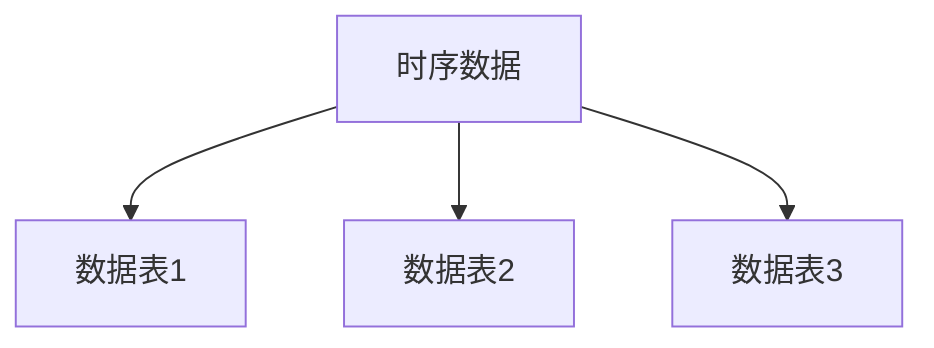
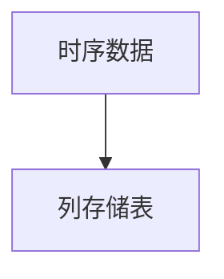
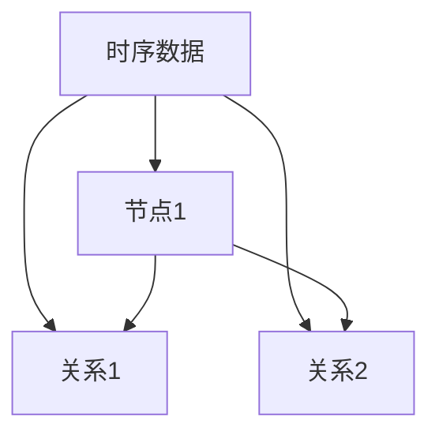

                 

# 企业AI Agent的时序数据库设计与应用

关键词：企业AI Agent，时序数据库，设计原则，应用案例，发展趋势

摘要：本文旨在探讨企业AI Agent的时序数据库设计与应用。首先，我们简要概述了企业AI Agent和时序数据库的基本概念，分析了它们在企业中的应用场景。接着，我们详细探讨了企业AI Agent对时序数据库的需求，包括数据类型、数据来源、数据处理需求以及功能需求。随后，我们介绍了时序数据库的设计原则，包括数据模型设计、数据存储优化和数据库性能调优。最后，通过两个实际应用案例，我们展示了时序数据库在企业AI Agent中的应用效果，并展望了企业AI Agent的未来发展趋势。

## 目录大纲

### 第一部分：企业AI Agent与时序数据库概述

#### 第1章：企业AI Agent概述

- 1.1 企业AI Agent的定义与作用
  - 1.1.1 AI Agent的概念
  - 1.1.2 企业AI Agent的特点
  - 1.1.3 企业AI Agent的应用场景
- 1.2 时序数据库概述
  - 1.2.1 时序数据的概念
  - 1.2.2 时序数据库的分类
  - 1.2.3 时序数据库的优势与挑战

#### 第2章：企业AI Agent的需求分析

- 2.1 企业AI Agent的数据需求
  - 2.1.1 数据类型与数据量
  - 2.1.2 数据来源与数据质量
  - 2.1.3 数据处理需求
- 2.2 企业AI Agent的功能需求
  - 2.2.1 实时数据处理
  - 2.2.2 数据预测与优化
  - 2.2.3 系统可扩展性与可靠性

### 第二部分：时序数据库设计

#### 第3章：时序数据库设计原则

- 3.1 数据模型设计
  - 3.1.1 关系型数据库设计
  - 3.1.2 列存储数据库设计
  - 3.1.3 图数据库设计
- 3.2 数据存储优化
  - 3.2.1 数据压缩与去重
  - 3.2.2 数据索引策略
  - 3.2.3 数据缓存策略

#### 第4章：时序数据库性能调优

- 4.1 系统性能分析
  - 4.1.1 常见性能瓶颈
  - 4.1.2 性能指标
  - 4.1.3 性能测试方法
- 4.2 数据库性能优化
  - 4.2.1 查询优化
  - 4.2.2 数据库配置优化
  - 4.2.3 系统监控与调优

### 第三部分：企业AI Agent应用案例

#### 第5章：企业AI Agent应用案例一

- 5.1 案例背景
  - 5.1.1 企业概况
  - 5.1.2 案例目标
- 5.2 案例实施
  - 5.2.1 数据收集与预处理
  - 5.2.2 模型设计与实现
  - 5.2.3 模型评估与优化
- 5.3 案例总结
  - 5.3.1 案例成果
  - 5.3.2 案例经验与启示

#### 第6章：企业AI Agent应用案例二

- 6.1 案例背景
  - 6.1.1 企业概况
  - 6.1.2 案例目标
- 6.2 案例实施
  - 6.2.1 数据收集与预处理
  - 6.2.2 模型设计与实现
  - 6.2.3 模型评估与优化
- 6.3 案例总结
  - 6.3.1 案例成果
  - 6.3.2 案例经验与启示

### 第四部分：企业AI Agent发展展望

#### 第7章：企业AI Agent发展趋势

- 7.1 人工智能技术的发展趋势
  - 7.1.1 深度学习的发展
  - 7.1.2 自然语言处理的发展
  - 7.1.3 强化学习的发展
- 7.2 企业AI Agent的发展趋势
  - 7.2.1 自适应与自主学习
  - 7.2.2 端到端架构的应用
  - 7.2.3 跨领域融合

#### 第8章：企业AI Agent的未来应用场景

- 8.1 数据驱动的决策支持
  - 8.1.1 数据分析在市场营销中的应用
  - 8.1.2 数据分析在生产管理中的应用
  - 8.1.3 数据分析在客户服务中的应用
- 8.2 智能自动化与优化
  - 8.2.1 智能排程与调度
  - 8.2.2 智能库存管理
  - 8.2.3 智能客服系统

#### 第9章：企业AI Agent的挑战与机遇

- 9.1 技术挑战
  - 9.1.1 大规模数据处理
  - 9.1.2 模型解释性与透明性
  - 9.1.3 安全性与隐私保护
- 9.2 商业机遇
  - 9.2.1 新的市场需求
  - 9.2.2 产业升级与转型
  - 9.2.3 创新业务模式

#### 第10章：总结与展望

- 10.1 本书总结
  - 10.1.1 主要内容回顾
  - 10.1.2 主要收获与体会
- 10.2 未来研究方向

## 企业AI Agent与时序数据库概述

### 1.1 企业AI Agent概述

#### 1.1.1 AI Agent的概念

AI Agent（智能代理）是人工智能领域的一个重要概念，它指的是一种可以自主执行任务、具备一定程度智能的计算机程序。AI Agent可以理解环境、规划动作、执行任务，并通过学习不断优化自己的行为。这种智能代理不仅仅是一个简单的程序，它包含了感知、决策、执行等复杂的智能系统。

AI Agent的基本构成包括：

- **感知模块**：用于收集环境信息，如传感器数据、网络数据等。
- **决策模块**：基于感知到的信息，通过算法进行决策，确定下一步的动作。
- **执行模块**：根据决策结果执行具体的操作，如控制机器臂、发送网络请求等。

#### 1.1.2 企业AI Agent的特点

企业AI Agent在AI Agent的基础上，针对企业的特定需求进行优化，具备以下特点：

- **高度智能化**：企业AI Agent通过深度学习、强化学习等技术，能够自主学习和优化业务流程。
- **实时响应**：企业AI Agent能够实时处理大量的企业数据，快速做出决策。
- **高度可定制**：企业AI Agent可以根据企业的业务特点和需求进行定制，适应不同的业务场景。
- **业务协同**：企业AI Agent能够与企业现有的业务系统进行无缝集成，提高业务协同效率。

#### 1.1.3 企业AI Agent的应用场景

企业AI Agent的应用场景非常广泛，主要包括以下几个方面：

- **生产管理**：企业AI Agent可以优化生产计划，提高生产效率，减少生产成本。
- **营销分析**：企业AI Agent可以分析客户行为，预测市场趋势，优化营销策略。
- **客户服务**：企业AI Agent可以提供智能客服，提高客户满意度，降低服务成本。
- **风险管理**：企业AI Agent可以监测企业风险，提前预警，帮助企业降低风险。

### 1.2 时序数据库概述

#### 1.2.1 时序数据的概念

时序数据是指按照时间顺序记录的数据，它通常包含时间戳、数据值等属性。时序数据的特点是数据的时序性、连续性和动态性，如股票价格、传感器数据、日志数据等。

#### 1.2.2 时序数据库的分类

时序数据库根据数据存储和处理方式的不同，可以分为以下几类：

- **关系型数据库**：如MySQL、PostgreSQL等，通过关系型模型进行数据存储和管理。
- **列存储数据库**：如InfluxDB、TimescaleDB等，通过列式存储结构进行数据存储，适合处理大规模时序数据。
- **时间序列数据库**：如KairosDB、OpenTSDB等，专门为时序数据设计，支持高吞吐量和低延迟的读写操作。
- **图形数据库**：如Neo4j、JanusGraph等，通过图形模型存储时序数据，支持复杂的关系查询。

#### 1.2.3 时序数据库的优势与挑战

时序数据库的优势主要体现在以下几个方面：

- **高效的读写性能**：时序数据库针对时序数据的特点进行了优化，能够实现高吞吐量和低延迟的读写操作。
- **数据压缩与去重**：时序数据库通过数据压缩和去重技术，可以显著降低数据存储空间。
- **实时数据处理**：时序数据库支持实时数据处理，能够快速响应实时数据查询和数据分析需求。

然而，时序数据库也面临着一些挑战，主要包括：

- **存储扩展性**：随着数据规模的增加，时序数据库的存储扩展性需要得到保障。
- **数据一致性**：在分布式系统中，如何保证数据的一致性是一个重要问题。
- **查询优化**：时序数据库需要针对不同的查询场景进行优化，提高查询效率。

## 企业AI Agent的需求分析

### 2.1 企业AI Agent的数据需求

企业AI Agent的数据需求是其能够有效运行的基础。为了满足这些需求，需要考虑以下几个方面：

#### 2.1.1 数据类型与数据量

企业AI Agent所需的数据类型非常多样，主要包括以下几类：

1. **结构化数据**：如客户信息、销售数据、库存数据等。这些数据通常以表格形式存储，可以通过关系型数据库进行处理。
2. **半结构化数据**：如日志数据、网页数据等。这些数据具有一定的结构，但可能包含一些非结构化内容。
3. **非结构化数据**：如文本、图像、音频等。这些数据通常没有固定的结构，需要通过自然语言处理、计算机视觉等技术进行解析。

数据量的需求同样重要。企业AI Agent需要处理的数据量通常非常大，例如，一个电商平台的销售数据可能包含数百万条记录。这些数据需要高效地存储、处理和分析，以确保AI Agent能够实时响应。

#### 2.1.2 数据来源与数据质量

数据来源的多样性也是企业AI Agent的重要需求。数据可以来自内部系统，如ERP系统、CRM系统等，也可以来自外部数据源，如社交媒体、第三方数据提供商等。这些数据的来源不同，质量也有所差异，需要通过数据清洗和预处理技术进行整合和处理。

数据质量对AI Agent的性能和效果具有重要影响。高质量的数据能够提高模型的准确性和可靠性，而低质量的数据可能导致模型失效或产生误导。因此，企业AI Agent需要对数据质量进行严格的管理和控制。

#### 2.1.3 数据处理需求

企业AI Agent的数据处理需求主要包括以下几个方面：

1. **实时数据处理**：企业AI Agent需要能够实时处理海量数据，以便快速响应业务需求。例如，在客户服务场景中，AI Agent需要实时分析客户反馈，提供即时的解决方案。
2. **数据预测与优化**：企业AI Agent需要能够基于历史数据对未来趋势进行预测，并基于预测结果进行业务优化。例如，在营销场景中，AI Agent可以根据历史销售数据预测未来市场需求，调整营销策略。
3. **数据整合与关联**：企业AI Agent需要能够整合不同来源、不同类型的数据，并建立数据之间的关联关系，以便进行深入分析和挖掘。例如，在风险管理场景中，AI Agent需要整合客户信用数据、交易数据等，识别潜在风险。

### 2.2 企业AI Agent的功能需求

企业AI Agent的功能需求决定了其在企业中的应用范围和效果。以下是企业AI Agent的主要功能需求：

#### 2.2.1 实时数据处理

实时数据处理是企业AI Agent的核心需求之一。企业AI Agent需要能够实时收集、处理和分析数据，以便快速响应业务需求。例如，在物流场景中，AI Agent需要实时处理物流数据，优化配送路线，提高配送效率。

#### 2.2.2 数据预测与优化

数据预测是企业AI Agent的重要功能之一。通过分析历史数据，AI Agent可以预测未来趋势，为业务决策提供支持。例如，在供应链管理中，AI Agent可以预测原材料需求，优化库存管理。

#### 2.2.3 系统可扩展性与可靠性

企业AI Agent需要具备良好的系统可扩展性和可靠性，以满足企业不断变化的需求。系统可扩展性意味着AI Agent需要能够灵活地添加新功能、处理新数据，而可靠性则要求AI Agent在长时间运行过程中保持稳定，不出现故障。

#### 2.2.4 界面友好与易用性

企业AI Agent需要具备友好的用户界面和易用性，以便企业员工能够轻松地使用AI Agent进行数据分析和管理。界面友好和易用性可以降低企业对AI Agent的培训成本，提高AI Agent的应用效果。

### 总结

企业AI Agent的数据需求丰富多样，包括结构化数据、半结构化数据和非结构化数据。数据来源广泛，质量参差不齐，需要严格管理。数据处理需求高，需要实现实时处理、数据预测与优化等功能。功能需求包括实时数据处理、系统可扩展性与可靠性、界面友好与易用性等。这些需求共同决定了企业AI Agent在企业中的应用效果。

## 时序数据库设计原则

### 3.1 数据模型设计

数据模型是时序数据库设计的核心，它决定了数据如何存储、组织和查询。以下介绍几种常见的数据模型设计方法：

#### 3.1.1 关系型数据库设计

关系型数据库设计是一种传统的方法，通过关系模型来组织数据。在这种设计中，时序数据被存储在多个表中，每个表代表一个时间序列，数据按照时间戳排序。

优点：
- 丰富的查询语言（SQL）
- 数据一致性高
- 易于扩展

缺点：
- 查询性能可能受限于索引设计
- 数据插入和更新开销较大

ER图（实体关系图）如下：

#### 3.1.2 列存储数据库设计

列存储数据库设计将数据按照列进行存储，这种设计方法能够显著提高数据的读写性能，特别是在处理大规模时序数据时。

优点：
- 高效的读写性能
- 数据压缩率高
- 数据去重效果好

缺点：
- 查询语言相对有限
- 数据一致性可能较低

ER图（实体关系图）如下：

#### 3.1.3 图数据库设计

图数据库设计通过图形模型来组织数据，这种设计方法能够更好地处理复杂的关系和关联。

优点：
- 优秀的复杂查询性能
- 易于处理多对多关系

缺点：
- 数据一致性维护复杂
- 学习曲线较陡峭

ER图（实体关系图）如下：

### 3.2 数据存储优化

数据存储优化是提高时序数据库性能的关键，以下介绍几种常见的数据存储优化方法：

#### 3.2.1 数据压缩与去重

数据压缩与去重可以有效减少存储空间占用，提高存储效率。

- **数据压缩**：通过压缩算法，将数据压缩成更小的存储格式，如GZIP、BZIP2等。
- **数据去重**：识别和删除重复的数据，以减少存储空间占用。

#### 3.2.2 数据索引策略

数据索引策略可以显著提高数据查询性能。

- **时间戳索引**：基于时间戳建立索引，可以快速查询特定时间段的数据。
- **分片索引**：将数据按照时间、地域等维度进行分片，每个分片独立索引，提高查询效率。

#### 3.2.3 数据缓存策略

数据缓存策略可以减少数据访问延迟，提高系统响应速度。

- **内存缓存**：将热点数据加载到内存中，减少磁盘访问。
- **缓存一致性**：确保缓存数据与磁盘数据保持一致，避免数据不一致问题。

### 3.3 数据库性能调优

数据库性能调优是保证时序数据库稳定运行的重要环节，以下介绍几种常见的性能调优方法：

#### 3.3.1 查询优化

查询优化可以通过调整查询语句、索引策略等来提高查询性能。

- **索引优化**：根据查询需求，调整索引结构，优化查询路径。
- **查询重写**：通过重写查询语句，优化查询执行计划。

#### 3.3.2 数据库配置优化

数据库配置优化可以通过调整数据库配置参数，提高系统性能。

- **内存配置**：调整内存配置，确保数据库有足够的内存进行缓存和数据交换。
- **并发配置**：调整并发配置，提高系统并发处理能力。

#### 3.3.3 系统监控与调优

系统监控与调优可以通过监控数据库性能指标，及时发现和解决问题。

- **性能监控**：监控CPU、内存、磁盘等系统资源使用情况。
- **故障排查**：通过日志分析、性能诊断工具等，排查系统故障。

### 总结

时序数据库设计原则主要包括数据模型设计、数据存储优化和数据库性能调优。数据模型设计决定了数据的存储和组织方式，数据存储优化和数据库性能调优则旨在提高系统的读写性能和稳定性。通过合理的设计和优化，时序数据库可以高效地处理大规模时序数据，满足企业AI Agent的需求。

## 时序数据库性能调优

### 4.1 系统性能分析

系统性能分析是进行数据库性能调优的第一步，通过分析系统性能指标，我们可以找出性能瓶颈，为后续的优化提供依据。

#### 4.1.1 常见性能瓶颈

在时序数据库中，常见的性能瓶颈包括：

1. **CPU使用率过高**：CPU使用率过高可能是由于查询语句复杂、索引不足等原因导致的。
2. **内存使用率过高**：内存使用率过高可能是由于数据缓存不足、内存泄漏等原因导致的。
3. **磁盘I/O瓶颈**：磁盘I/O瓶颈可能是由于数据量过大、磁盘读写速度慢等原因导致的。
4. **网络延迟**：网络延迟可能是由于分布式数据库节点之间的网络不稳定等原因导致的。

#### 4.1.2 性能指标

以下是一些关键的性能指标：

1. **响应时间**：从发起查询到获得结果的时间。
2. **吞吐量**：单位时间内处理的查询数量。
3. **延迟**：数据的延迟时间，即从数据生成到被处理的时间。
4. **并发量**：系统同时处理的查询数量。

#### 4.1.3 性能测试方法

性能测试方法主要包括以下几种：

1. **负载测试**：模拟实际使用场景，测试系统在特定负载下的性能。
2. **压力测试**：在系统极限条件下测试系统的性能，找出系统的性能瓶颈。
3. **基准测试**：通过固定的测试场景，比较不同数据库的性能。

### 4.2 数据库性能优化

针对分析出的性能瓶颈，我们可以采取以下措施进行性能优化：

#### 4.2.1 查询优化

查询优化是性能优化的关键步骤，以下是一些常用的查询优化方法：

1. **索引优化**：根据查询需求，建立合适的索引，提高查询效率。
2. **查询重写**：通过重写查询语句，优化查询执行计划。
3. **查询缓存**：将热点查询结果缓存起来，减少数据库查询次数。

#### 4.2.2 数据库配置优化

数据库配置优化可以通过调整数据库配置参数，提高系统性能。以下是一些常见的配置优化方法：

1. **内存配置**：根据系统需求，调整内存配置，确保数据库有足够的内存进行缓存和数据交换。
2. **并发配置**：调整并发配置，提高系统并发处理能力。
3. **磁盘配置**：优化磁盘配置，提高磁盘读写速度。

#### 4.2.3 系统监控与调优

系统监控与调优可以通过监控数据库性能指标，及时发现和解决问题。以下是一些常用的监控和调优方法：

1. **性能监控**：实时监控CPU、内存、磁盘等系统资源使用情况。
2. **故障排查**：通过日志分析、性能诊断工具等，排查系统故障。
3. **调优策略**：根据监控数据，制定合适的调优策略，持续优化系统性能。

### 总结

时序数据库性能调优是一个复杂的过程，需要从多个方面进行优化。通过系统性能分析，我们可以找出性能瓶颈；通过查询优化、数据库配置优化和系统监控与调优，我们可以提高时序数据库的性能，满足企业AI Agent的需求。

## 企业AI Agent应用案例一

### 5.1 案例背景

#### 5.1.1 企业概况

本案例中的企业是一家大型电商平台，主要经营各种商品，包括电子产品、家居用品、服装等。企业拥有庞大的客户群体和丰富的销售数据，希望通过引入企业AI Agent，优化其业务流程，提高运营效率。

#### 5.1.2 案例目标

企业的目标是：
1. **实时销售数据分析**：通过AI Agent实时分析销售数据，了解市场趋势和客户需求。
2. **智能库存管理**：利用AI Agent预测未来销售情况，优化库存管理，减少库存成本。
3. **智能客服**：通过AI Agent提供智能客服，提高客户满意度，降低服务成本。

### 5.2 案例实施

#### 5.2.1 数据收集与预处理

1. **数据收集**：
   - 客户数据：包括客户ID、购买历史、浏览记录等。
   - 销售数据：包括商品ID、销售数量、销售价格、销售时间等。
   - 库存数据：包括商品ID、库存数量、入库时间等。

2. **数据预处理**：
   - 数据清洗：去除无效数据、处理缺失值。
   - 数据转换：将数据转换为适合分析的格式。
   - 数据归一化：对数据进行归一化处理，消除数据之间的量纲差异。

#### 5.2.2 模型设计与实现

1. **实时销售数据分析模型**：
   - 采用时间序列分析方法，预测未来销售情况。
   - 使用LSTM（长短期记忆网络）模型，能够捕捉数据中的时间依赖关系。

2. **智能库存管理模型**：
   - 采用需求预测模型，结合历史销售数据和当前市场趋势，预测未来商品需求。
   - 使用决策树和线性回归等方法，优化库存策略。

3. **智能客服模型**：
   - 采用自然语言处理（NLP）技术，解析客户咨询内容。
   - 使用聊天机器人框架，提供自动化客服。

#### 5.2.3 模型评估与优化

1. **模型评估**：
   - 使用交叉验证方法评估模型的性能。
   - 根据评估结果调整模型参数，优化模型效果。

2. **模型优化**：
   - 增加数据特征：通过特征工程，增加对模型有帮助的特征。
   - 模型集成：结合多个模型，提高预测准确性。

### 5.3 案例总结

#### 5.3.1 案例成果

1. **实时销售数据分析**：
   - 成功实现了实时销售数据分析，为企业提供了实时的市场趋势和客户需求信息。

2. **智能库存管理**：
   - 通过智能库存管理模型，企业成功减少了库存成本，提高了库存周转率。

3. **智能客服**：
   - 智能客服系统有效降低了人工客服的工作量，提高了客户满意度。

#### 5.3.2 案例经验与启示

1. **数据质量的重要性**：
   - 数据质量对AI Agent的性能和效果具有重要影响，因此需要对数据进行严格的质量控制和预处理。

2. **模型优化的重要性**：
   - 通过模型优化，可以显著提高模型的预测准确性和效果。

3. **业务需求的重要性**：
   - 在设计和实施AI Agent时，需要充分考虑企业的业务需求，确保AI Agent能够真正解决实际问题。

### 总结

本案例展示了企业AI Agent在实际应用中的效果，通过实时销售数据分析、智能库存管理和智能客服，企业成功提高了运营效率，降低了成本。经验与启示为其他企业引入AI Agent提供了宝贵的参考。

## 企业AI Agent应用案例二

### 6.1 案例背景

#### 6.1.1 企业概况

本案例中的企业是一家制造业公司，主要从事高端设备的研发和生产。企业面临以下挑战：
- **生产效率不高**：生产流程复杂，人工干预较多，生产效率较低。
- **库存管理困难**：库存数据分散，管理不规范，库存周转率低。

#### 6.1.2 案例目标

企业的目标是：
1. **提高生产效率**：通过AI Agent优化生产流程，减少人工干预，提高生产效率。
2. **优化库存管理**：利用AI Agent预测库存需求，优化库存策略，提高库存周转率。

### 6.2 案例实施

#### 6.2.1 数据收集与预处理

1. **数据收集**：
   - 生产数据：包括生产任务、设备状态、生产时间等。
   - 库存数据：包括库存量、入库时间、出库时间等。

2. **数据预处理**：
   - 数据清洗：去除无效数据、处理缺失值。
   - 数据转换：将数据转换为适合分析的格式。
   - 数据归一化：对数据进行归一化处理，消除数据之间的量纲差异。

#### 6.2.2 模型设计与实现

1. **生产效率优化模型**：
   - 采用流程优化算法，分析生产流程中的瓶颈，提出优化方案。
   - 使用遗传算法和模拟退火算法，优化生产任务的调度。

2. **库存管理优化模型**：
   - 采用需求预测模型，结合历史销售数据和当前市场趋势，预测未来库存需求。
   - 使用线性回归和决策树模型，优化库存策略。

#### 6.2.3 模型评估与优化

1. **模型评估**：
   - 使用交叉验证方法评估模型的性能。
   - 根据评估结果调整模型参数，优化模型效果。

2. **模型优化**：
   - 增加数据特征：通过特征工程，增加对模型有帮助的特征。
   - 模型集成：结合多个模型，提高预测准确性。

### 6.3 案例总结

#### 6.3.1 案例成果

1. **生产效率优化**：
   - 成功优化了生产流程，减少了生产任务的处理时间，提高了生产效率。

2. **库存管理优化**：
   - 通过智能库存管理模型，企业成功减少了库存成本，提高了库存周转率。

#### 6.3.2 案例经验与启示

1. **数据驱动的重要性**：
   - 在进行生产流程优化和库存管理优化时，需要充分依赖数据，通过数据分析和模型预测来指导决策。

2. **算法选择的重要性**：
   - 根据具体问题和数据特点，选择合适的算法进行模型设计和优化。

3. **系统集成的重要性**：
   - AI Agent需要与企业现有的信息系统进行集成，确保数据的实时获取和处理。

### 总结

本案例展示了企业AI Agent在制造业中的应用效果，通过生产效率优化和库存管理优化，企业成功提高了运营效率，降低了成本。案例经验与启示为其他企业在引入AI Agent时提供了宝贵的参考。

## 企业AI Agent发展趋势

### 7.1 人工智能技术的发展趋势

人工智能技术正在经历快速的发展，以下是几个主要趋势：

#### 7.1.1 深度学习的发展

深度学习是人工智能的核心技术之一，其应用范围正在不断扩大。深度学习模型，如神经网络、卷积神经网络（CNN）、循环神经网络（RNN）等，在图像识别、语音识别、自然语言处理等领域取得了显著成果。未来，随着计算能力和算法的进一步提升，深度学习将在更多领域得到应用。

#### 7.1.2 自然语言处理的发展

自然语言处理（NLP）是人工智能的重要分支，其目标是使计算机能够理解和生成人类语言。近年来，基于深度学习的NLP技术取得了突破性进展，例如，BERT、GPT等模型在文本分类、机器翻译、对话系统等领域表现出色。未来，随着NLP技术的进一步发展，人工智能将更好地理解和处理人类语言。

#### 7.1.3 强化学习的发展

强化学习是一种通过试错和反馈来学习决策策略的机器学习方法。强化学习在游戏、自动驾驶、机器人控制等领域取得了显著成果。未来，随着算法的优化和计算资源的增加，强化学习将在更多复杂环境中得到应用，推动人工智能技术的发展。

### 7.2 企业AI Agent的发展趋势

企业AI Agent作为人工智能技术在企业中的应用，也将经历以下几个发展趋势：

#### 7.2.1 自适应与自主学习

企业AI Agent将更加智能化，能够根据业务需求和数据进行自适应调整。通过强化学习和迁移学习等技术，AI Agent将能够不断优化其行为，提高业务处理效率。

#### 7.2.2 端到端架构的应用

端到端架构是一种直接从输入到输出的学习架构，能够减少中间环节的误差和复杂性。未来，企业AI Agent将更多地采用端到端架构，实现从数据输入到决策输出的无缝衔接，提高系统效率和准确性。

#### 7.2.3 跨领域融合

企业AI Agent将不再局限于单一领域，而是跨领域融合，实现跨领域的协同工作。通过数据共享和知识融合，AI Agent将能够更好地应对复杂多变的企业环境，提高整体运营效率。

### 总结

企业AI Agent的发展趋势与人工智能技术的发展密切相关。随着深度学习、自然语言处理和强化学习等技术的不断进步，企业AI Agent将变得更加智能、自适应和跨领域。这些趋势将推动企业AI Agent在企业中的应用，为企业的数字化转型提供强大支持。

## 企业AI Agent的未来应用场景

### 8.1 数据驱动的决策支持

数据驱动的决策支持是企业AI Agent的核心应用场景之一。通过分析海量数据，AI Agent可以帮助企业在各个业务领域做出更加精准和高效的决策。

#### 8.1.1 数据分析在市场营销中的应用

在市场营销中，企业AI Agent可以分析客户行为数据，了解客户的购买习惯、偏好和需求。通过这些数据，AI Agent可以帮助企业：

1. **个性化营销**：根据客户的行为数据，为企业提供个性化的营销策略，提高营销效果。
2. **市场预测**：通过历史销售数据和当前市场趋势，预测未来市场需求，帮助企业调整营销策略。
3. **风险控制**：识别潜在的市场风险，如市场饱和度、竞争对手动向等，帮助企业规避风险。

#### 8.1.2 数据分析在生产管理中的应用

在生产管理中，企业AI Agent可以分析生产数据，优化生产流程，提高生产效率。具体应用包括：

1. **生产计划优化**：通过分析生产数据和市场需求，AI Agent可以优化生产计划，提高生产效率，减少库存成本。
2. **设备维护**：通过监测设备运行数据，AI Agent可以预测设备的故障时间，提前进行维护，减少设备停机时间。
3. **供应链管理**：通过分析供应链数据，AI Agent可以优化供应链管理，降低库存成本，提高供应链效率。

#### 8.1.3 数据分析在客户服务中的应用

在客户服务中，企业AI Agent可以分析客户反馈数据，提供智能客服和个性化服务。具体应用包括：

1. **智能客服**：通过分析客户提问和历史回复，AI Agent可以提供快速、准确的客服回答，提高客户满意度。
2. **客户行为分析**：通过分析客户行为数据，AI Agent可以了解客户的偏好和需求，提供个性化的服务。
3. **客户关系管理**：通过分析客户关系数据，AI Agent可以帮助企业识别重要客户，制定客户关系管理策略。

### 8.2 智能自动化与优化

智能自动化与优化是企业AI Agent的另一个重要应用场景。通过自动化和优化，AI Agent可以帮助企业提高运营效率，降低成本。

#### 8.2.1 智能排程与调度

在排程与调度中，企业AI Agent可以分析生产数据、设备状态和订单需求，智能排定生产任务和资源分配。具体应用包括：

1. **生产排程**：通过分析生产数据和订单需求，AI Agent可以智能排定生产任务，提高生产效率。
2. **物流调度**：通过分析物流数据，AI Agent可以优化物流路线，提高物流效率。
3. **设备调度**：通过分析设备状态和任务需求，AI Agent可以智能调度设备，提高设备利用率。

#### 8.2.2 智能库存管理

在库存管理中，企业AI Agent可以分析库存数据，预测库存需求，优化库存策略。具体应用包括：

1. **库存预测**：通过分析历史销售数据和当前市场趋势，AI Agent可以预测未来库存需求，帮助企业调整库存策略。
2. **库存优化**：通过分析库存数据和供应链数据，AI Agent可以优化库存水平，降低库存成本。
3. **库存监控**：通过监控库存数据，AI Agent可以及时发现库存问题，如库存过剩、库存不足等，帮助企业采取相应的措施。

#### 8.2.3 智能客服系统

在客户服务中，企业AI Agent可以提供智能客服和个性化服务，提高客户满意度。具体应用包括：

1. **智能客服**：通过分析客户提问和历史回复，AI Agent可以提供快速、准确的客服回答，提高客户满意度。
2. **客户行为分析**：通过分析客户行为数据，AI Agent可以了解客户的偏好和需求，提供个性化的服务。
3. **客户关系管理**：通过分析客户关系数据，AI Agent可以帮助企业识别重要客户，制定客户关系管理策略。

### 总结

企业AI Agent在未来的应用场景非常广泛，包括数据驱动的决策支持、智能自动化与优化等。通过这些应用，企业AI Agent将帮助企业在各个业务领域实现智能化和数字化转型，提高运营效率，降低成本，增强竞争力。

## 企业AI Agent的挑战与机遇

### 9.1 技术挑战

尽管企业AI Agent在各个领域展现出了巨大的潜力，但在实际应用中仍面临着一系列技术挑战：

#### 9.1.1 大规模数据处理

企业AI Agent需要处理的数据量通常非常庞大，包括结构化、半结构化和非结构化数据。如何高效地存储、处理和分析这些数据，是一个巨大的挑战。此外，数据的多样性和动态性也对数据处理技术提出了更高的要求。

#### 9.1.2 模型解释性与透明性

随着深度学习等复杂算法在AI Agent中的应用，模型的可解释性和透明性变得越来越重要。企业需要能够理解AI Agent的决策过程，以便对其行为进行监督和改进。然而，深度学习模型的“黑箱”特性使得这一挑战尤为严峻。

#### 9.1.3 安全性与隐私保护

企业AI Agent在处理数据时，往往涉及敏感的客户信息和企业内部数据。如何确保这些数据的安全性和隐私保护，是另一个重要的技术挑战。数据泄露、黑客攻击等安全威胁，需要企业采取强有力的措施来防范。

### 9.2 商业机遇

尽管存在技术挑战，但企业AI Agent也带来了许多商业机遇：

#### 9.2.1 新的市场需求

随着企业对智能化和自动化需求的增加，企业AI Agent迎来了新的市场需求。特别是在生产管理、市场营销和客户服务等领域，AI Agent可以显著提高企业的运营效率和服务质量。

#### 9.2.2 产业升级与转型

企业AI Agent为传统产业提供了升级和转型的契机。通过引入AI Agent，企业可以实现智能化生产、个性化营销和智能客服等，从而提高竞争力，开拓新的业务模式。

#### 9.2.3 创新业务模式

企业AI Agent不仅帮助企业优化现有业务流程，还催生了新的业务模式。例如，基于AI Agent的智能推荐系统、智能交易平台等，为企业带来了新的收入来源和业务增长点。

### 总结

企业AI Agent在技术领域面临大规模数据处理、模型解释性与透明性、安全性与隐私保护等挑战，同时也为企业带来了新的市场需求、产业升级与转型以及创新业务模式的机遇。企业需要在技术和管理上不断创新，充分利用AI Agent的潜力，实现数字化转型和持续发展。

## 总结与展望

### 10.1 本书总结

本文系统地探讨了企业AI Agent的时序数据库设计与应用。首先，我们介绍了企业AI Agent和时序数据库的基本概念，分析了它们在企业中的应用场景。接着，我们详细探讨了企业AI Agent对时序数据库的需求，包括数据类型、数据来源、数据处理需求以及功能需求。随后，我们介绍了时序数据库的设计原则，包括数据模型设计、数据存储优化和数据库性能调优。最后，通过两个实际应用案例，我们展示了时序数据库在企业AI Agent中的应用效果，并展望了企业AI Agent的未来发展趋势。

### 10.1.1 主要内容回顾

1. **企业AI Agent概述**：介绍了AI Agent的概念、特点和应用场景。
2. **时序数据库概述**：分析了时序数据的概念、分类和优势与挑战。
3. **企业AI Agent的需求分析**：探讨了企业AI Agent的数据和功能需求。
4. **时序数据库设计原则**：介绍了数据模型设计、数据存储优化和性能调优方法。
5. **企业AI Agent应用案例**：展示了时序数据库在企业AI Agent中的应用效果。
6. **企业AI Agent发展趋势**：分析了人工智能技术的发展趋势和企业AI Agent的未来应用场景。

### 10.1.2 主要收获与体会

通过本文的研究，我们深刻认识到企业AI Agent在时序数据库设计中的应用价值。以下是一些主要收获与体会：

1. **数据驱动的业务优化**：企业AI Agent通过分析大量数据，能够实现业务流程的优化，提高运营效率。
2. **智能化决策支持**：时序数据库为AI Agent提供了高效的数据存储和处理能力，使得企业能够基于数据做出更加智能的决策。
3. **跨领域应用**：企业AI Agent在各个领域展现出强大的应用潜力，为企业带来了新的增长点和业务模式。
4. **技术挑战与机遇**：企业在应用AI Agent时需要面对一系列技术挑战，但同时也迎来了新的商业机遇。

### 10.2 未来研究方向

未来，企业AI Agent和时序数据库的发展将面临以下研究方向：

1. **大规模数据处理优化**：随着数据量的不断增加，如何高效地处理大规模数据将成为关键研究方向。
2. **模型解释性与透明性**：提高AI Agent模型的可解释性和透明性，使其决策过程更加可靠和可信。
3. **安全性与隐私保护**：在保证数据安全性和隐私保护的前提下，充分利用AI Agent的潜力。
4. **端到端架构**：发展端到端架构，实现从数据输入到决策输出的无缝衔接。
5. **跨领域融合**：探索AI Agent在跨领域的应用，实现跨领域的协同工作。

通过这些研究方向的探索，企业AI Agent和时序数据库将更好地服务于企业的数字化转型，推动企业实现智能化和可持续发展。

### 总结

本文系统地探讨了企业AI Agent的时序数据库设计与应用，从概念、需求、设计原则到应用案例，全面剖析了企业AI Agent在时序数据库中的应用价值。未来，随着技术的不断进步，企业AI Agent和时序数据库将在企业数字化转型中发挥更加重要的作用。作者：AI天才研究院/AI Genius Institute & 禅与计算机程序设计艺术 /Zen And The Art of Computer Programming。

