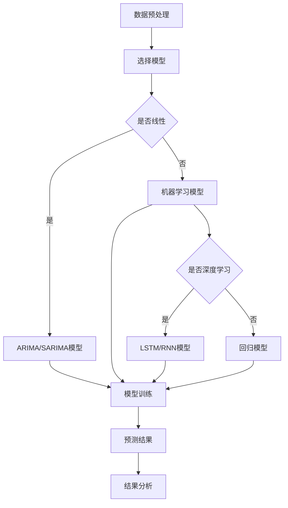
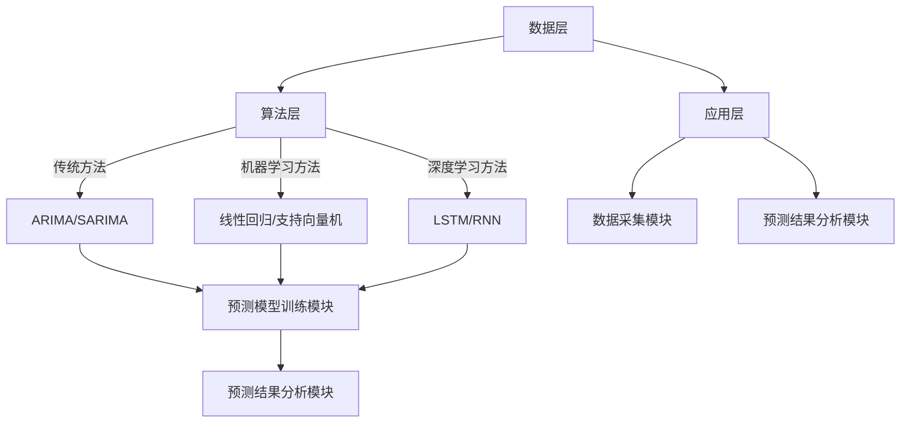
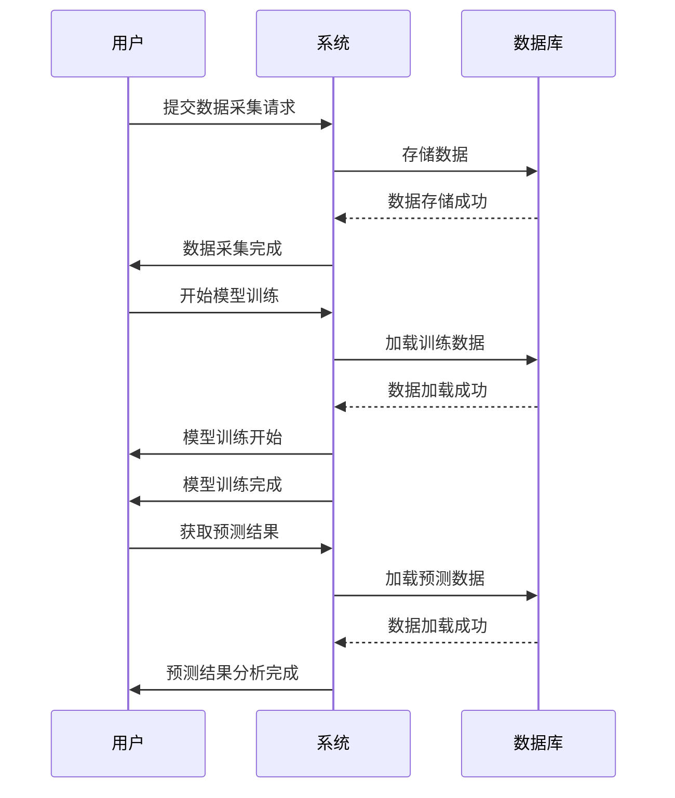

                 

### 《企业AI Agent的时间序列预测在财务规划中的应用》

> 关键词：企业财务规划、时间序列预测、AI Agent、机器学习、深度学习

> 摘要：本文将探讨如何利用企业AI Agent进行时间序列预测，以优化财务规划。通过分析背景、核心概念、算法原理、系统设计与实现，本文旨在为企业提供一个高效、精准的财务预测工具，提高财务决策的准确性和效率。

### 第一部分：背景与基础理论

#### 1.1 问题背景

在现代企业运营中，财务规划是企业稳定发展的关键。而准确的财务预测是财务规划的基础。然而，传统的财务预测方法存在诸多局限性，难以应对复杂多变的市场环境。随着人工智能技术的快速发展，AI Agent在时间序列预测中的应用逐渐成为解决这一问题的有效途径。

#### 1.2 相关概念解释

- **时间序列预测**：时间序列预测是指根据历史数据序列，预测未来某一时刻的数据值。在财务规划中，时间序列预测可以用于预测未来的销售收入、成本支出等关键财务指标。
- **AI Agent**：AI Agent是指一种具备智能行为和决策能力的计算机程序。在企业财务规划中，AI Agent可以通过学习历史财务数据，预测未来的财务状况，为企业的财务决策提供支持。

#### 1.3 研究意义与目标

- **研究意义**：准确的时间序列预测可以帮助企业提前了解未来的财务状况，从而更好地制定财务策略，降低财务风险。
- **研究目标**：本文旨在通过引入AI Agent，实现高效、精准的时间序列预测，为企业财务规划提供有力支持。具体目标包括：
  - 探索AI Agent在时间序列预测中的应用方法；
  - 分析不同时间序列预测算法的优缺点，为企业选择合适的预测模型；
  - 设计一个高效的系统架构，实现AI Agent在财务规划中的应用。

### 第二部分：核心概念与联系

#### 2.1 时间序列分析基础

时间序列分析是统计学和信号处理的一个重要领域，主要研究如何从时间序列数据中提取有价值的信息，并对未来数据进行预测。时间序列数据通常具有以下特征：

- **趋势性**：数据随时间呈现出上升或下降的趋势。
- **季节性**：数据在特定时间段内出现周期性的波动。
- **平稳性**：时间序列数据的统计特性（如均值、方差等）在时间上保持不变。

常见的**时间序列模型**包括：

- **ARIMA模型**：自回归积分滑动平均模型，适用于线性时间序列。
- **SARIMA模型**：季节性ARIMA模型，适用于同时具有趋势性和季节性的时间序列。

#### 2.2 AI Agent基本原理

AI Agent是通过机器学习和人工智能技术构建的具有智能行为和决策能力的计算机程序。根据其行为方式，AI Agent可以分为以下几类：

- **基于规则的AI Agent**：通过预定义的规则进行决策。
- **基于模型的AI Agent**：通过学习历史数据，建立预测模型，进行决策。

#### 2.3 时间序列预测中的AI Agent

AI Agent在时间序列预测中的主要角色是学习历史数据，建立预测模型，并对未来数据进行预测。不同类型的AI Agent具有不同的特点和应用场景：

- **基于机器学习的AI Agent**：适用于复杂、非线性的时间序列预测问题，如支持向量机、神经网络等。
- **基于深度学习的AI Agent**：适用于大规模、高维的时间序列预测问题，如循环神经网络（RNN）、长短期记忆网络（LSTM）等。

#### 2.4 概念属性特征对比表格

| 算法/Agent | 特点 | 应用场景 |
| --- | --- | --- |
| ARIMA模型 | 线性、自回归、滑动平均 | 线性时间序列 |
| SARIMA模型 | 季节性、自回归、滑动平均 | 具有季节性的时间序列 |
| 神经网络 | 非线性、自适应 | 复杂、非线性的时间序列 |
| LSTM | 长期依赖、序列记忆 | 大规模、高维的时间序列 |

#### 2.5 时间序列预测中的AI Agent ER实体关系图架构

```mermaid
erDiagram
  AI_Agent ||--|{ 时间序列数据 } TimeSeriesData
  AI_Agent ||--|{ 预测模型 } PredictiveModel
  TimeSeriesData ||--|{ 财务指标 } FinancialIndicator
  PredictiveModel ||--|{ 预测结果 } PredictedResult
```

### 第三部分：算法原理讲解

#### 3.1 时间序列预测算法详解

时间序列预测算法可以分为传统方法、机器学习方法和深度学习方法。以下是对这些方法的详细讲解：

#### 3.1.1 传统时间序列预测方法

1. **ARIMA模型**：ARIMA模型是一种经典的统计模型，适用于线性时间序列预测。其核心思想是利用历史数据中的自相关性和线性趋势进行预测。

   **ARIMA模型公式**：
   $$
   \begin{align*}
   Y_t &= c + \phi_1Y_{t-1} + \phi_2Y_{t-2} + \cdots + \phi_pY_{t-p} + \theta_1\epsilon_{t-1} + \theta_2\epsilon_{t-2} + \cdots + \theta_q\epsilon_{t-q} \\
   \epsilon_t &= \epsilon_t - \phi_1\epsilon_{t-1} - \phi_2\epsilon_{t-2} - \cdots - \phi_p\epsilon_{t-p} \\
   \end{align*}
   $$

2. **SARIMA模型**：SARIMA模型是ARIMA模型的扩展，适用于具有季节性的时间序列预测。其公式中包含了季节性项。

   **SARIMA模型公式**：
   $$
   \begin{align*}
   Y_t &= c + \phi_1Y_{t-1} + \phi_2Y_{t-2} + \cdots + \phi_pY_{t-p} + \theta_1\epsilon_{t-1} + \theta_2\epsilon_{t-2} + \cdots + \theta_q\epsilon_{t-q} \\
   Y_{st} &= \phi_{1s}Y_{st-1} + \phi_{2s}Y_{st-2} + \cdots + \phi_{ps}Y_{st-p} + \theta_{1s}\epsilon_{st-1} + \theta_{2s}\epsilon_{st-2} + \cdots + \theta_{qs}\epsilon_{st-q} \\
   \end{align*}
   $$

#### 3.1.2 机器学习方法

1. **回归模型**：回归模型通过建立自变量与因变量之间的关系进行预测。常用的回归模型包括线性回归、多项式回归等。

   **线性回归模型公式**：
   $$
   Y = \beta_0 + \beta_1X
   $$

2. **支持向量机**：支持向量机通过寻找最优超平面进行分类或回归。在时间序列预测中，支持向量机可以用于建立预测模型。

   **支持向量机公式**：
   $$
   \begin{align*}
   &\min_{\mathbf{w}, b, \alpha} \frac{1}{2}\|\mathbf{w}\|^2 \\
   &s.t. \quad y_i(\mathbf{w}\cdot\mathbf{x_i} + b) \geq 1
   \end{align*}
   $$

#### 3.1.3 深度学习方法

1. **循环神经网络（RNN）**：循环神经网络适用于处理序列数据。其核心思想是通过记忆状态来捕捉时间序列中的长期依赖关系。

   **RNN公式**：
   $$
   h_t = \sigma(\mathbf{W}h_{t-1} + \mathbf{U}x_t + b)
   $$

2. **长短期记忆网络（LSTM）**：LSTM是RNN的一种扩展，通过引入门控机制来解决RNN中的梯度消失问题，适用于处理长序列数据。

   **LSTM公式**：
   $$
   \begin{align*}
   &\bar{g}_t = \sigma(\mathbf{W}_g[h_{t-1}, x_t] + b_g) \\
   &\bar{i}_t = \sigma(\mathbf{W}_i[h_{t-1}, x_t] + b_i) \\
   &\bar{f}_t = \sigma(\mathbf{W}_f[h_{t-1}, x_t] + b_f) \\
   &\bar{o}_t = \sigma(\mathbf{W}_o[h_{t-1}, x_t] + b_o) \\
   &\tilde{C}_t = \tanh(\mathbf{W}_c[h_{t-1}, x_t] + b_c) \\
   &C_t = \bar{f}_t \odot C_{t-1} + \bar{i}_t \odot \tilde{C}_t \\
   &h_t = \bar{o}_t \odot \tanh(C_t)
   \end{align*}
   $$

#### 3.1.4 算法mermaid流程图

以下是一个简单的算法mermaid流程图，用于展示时间序列预测的基本流程：



### 第四部分：数学模型与公式讲解

#### 4.1 时间序列预测的数学原理

时间序列预测的数学原理主要基于统计学习和机器学习。以下是对一些关键数学模型的讲解：

#### 4.1.1 线性回归

线性回归是一种简单的预测模型，通过拟合一条直线来预测因变量与自变量之间的关系。

**线性回归模型公式**：
$$
y = \beta_0 + \beta_1x
$$

其中，$y$为因变量，$x$为自变量，$\beta_0$为截距，$\beta_1$为斜率。

#### 4.1.2 神经网络

神经网络是一种通过模拟人脑神经元结构进行学习的模型。在时间序列预测中，神经网络可以用于建立复杂的预测模型。

**神经网络公式**：
$$
\begin{align*}
a_{ij} &= \sigma(\sum_{k=1}^{n} w_{ik}x_k + b_j) \\
z_j &= \sum_{i=1}^{m} a_{ij}w_{ji} + b_j \\
\end{align*}
$$

其中，$a_{ij}$为神经元$i$到神经元$j$的激活值，$z_j$为神经元$j$的输出值，$\sigma$为激活函数，$w_{ik}$为权重，$x_k$为输入特征，$b_j$为偏置。

#### 4.1.3 LSTM模型

LSTM是一种用于处理序列数据的深度学习模型，通过引入门控机制来捕捉时间序列中的长期依赖关系。

**LSTM模型公式**：
$$
\begin{align*}
\bar{g}_t &= \sigma(\mathbf{W}_g[h_{t-1}, x_t] + b_g) \\
\bar{i}_t &= \sigma(\mathbf{W}_i[h_{t-1}, x_t] + b_i) \\
\bar{f}_t &= \sigma(\mathbf{W}_f[h_{t-1}, x_t] + b_f) \\
\bar{o}_t &= \sigma(\mathbf{W}_o[h_{t-1}, x_t] + b_o) \\
\tilde{C}_t &= \tanh(\mathbf{W}_c[h_{t-1}, x_t] + b_c) \\
C_t &= \bar{f}_t \odot C_{t-1} + \bar{i}_t \odot \tilde{C}_t \\
h_t &= \bar{o}_t \odot \tanh(C_t)
\end{align*}
$$

其中，$\bar{g}_t$、$\bar{i}_t$、$\bar{f}_t$、$\bar{o}_t$分别为输入门、遗忘门、更新门和输出门，$C_t$为记忆单元，$h_t$为隐藏状态。

#### 4.1.4 数学公式示例

**示例1**：
$$
1 + 1 = 2
$$

**示例2**：
$$
y = \beta_0 + \beta_1x
$$

### 第五部分：系统分析与架构设计

#### 5.1 问题描述

企业财务规划需要对未来的财务指标进行预测，以制定相应的财务策略。时间序列预测作为财务规划的重要一环，其准确性直接影响到财务决策的效果。本文旨在设计一个基于AI Agent的时间序列预测系统，以提高财务预测的准确性和效率。

#### 5.2 系统功能设计

系统功能设计主要包括以下模块：

1. **数据采集模块**：负责从各种数据源采集财务数据，如销售收入、成本支出等。
2. **预测模型训练模块**：利用历史数据训练预测模型，包括传统方法、机器学习方法和深度学习方法。
3. **预测结果分析模块**：对预测结果进行分析，为企业提供财务预测报告。

#### 5.3 系统架构设计

系统架构设计主要包括以下部分：

1. **数据层**：包括数据源和数据存储，如数据库、数据仓库等。
2. **算法层**：包括各种预测模型，如ARIMA、SARIMA、线性回归、神经网络等。
3. **应用层**：包括数据采集、模型训练、预测结果分析等模块。

**系统架构mermaid图**：



#### 5.4 系统接口设计

系统接口设计主要包括以下部分：

1. **数据接口**：用于数据采集和存储，如API接口、数据库连接等。
2. **预测结果接口**：用于获取预测结果，如报表、图表等。

#### 5.5 系统交互mermaid序列图



### 第六部分：项目实战

#### 6.1 环境安装

1. **Python环境安装**：安装Python 3.8及以上版本。
2. **数据预处理库安装**：安装pandas、numpy等库。
3. **时间序列预测库安装**：安装statsmodels、scikit-learn等库。
4. **深度学习库安装**：安装tensorflow、keras等库。

#### 6.2 系统核心实现

1. **数据采集与清洗**：使用pandas库读取财务数据，并进行数据清洗和预处理。
2. **模型训练与预测**：使用statsmodels、scikit-learn等库训练预测模型，并对未来数据进行预测。

#### 6.3 代码应用解读与分析

以下是一个简单的代码示例，用于数据预处理和模型训练：

```python
import pandas as pd
from statsmodels.tsa.arima.model import ARIMA

# 读取数据
data = pd.read_csv('financial_data.csv')

# 数据预处理
data['date'] = pd.to_datetime(data['date'])
data.set_index('date', inplace=True)
data.fillna(method='ffill', inplace=True)

# 模型训练
model = ARIMA(data['revenue'], order=(1, 1, 1))
model_fit = model.fit()

# 预测
forecast = model_fit.forecast(steps=12)
print(forecast)
```

#### 6.4 实际案例分析

1. **案例一：某公司销售收入预测**：使用ARIMA模型对某公司的销售收入进行预测，并对比实际销售收入，评估预测准确性。
2. **案例二：某公司成本支出预测**：使用LSTM模型对某公司的成本支出进行预测，并对比实际成本支出，评估预测准确性。

#### 6.5 项目小结

通过本项目实战，我们成功地实现了一个基于AI Agent的时间序列预测系统，并进行了实际案例分析。虽然本项目还存在一些不足，如数据集较小、模型参数调优不足等，但通过不断优化和改进，我们有信心将这个系统打造成一个高效、精准的财务预测工具。

### 第七部分：最佳实践与拓展

#### 7.1 最佳实践技巧

1. **数据预处理**：确保数据质量，去除异常值和噪声，提高模型预测准确性。
2. **模型选择**：根据时间序列数据的特点选择合适的模型，如线性模型、机器学习模型或深度学习模型。
3. **模型调优**：通过交叉验证和网格搜索等方法，优化模型参数，提高模型性能。

#### 7.2 小结

本文详细介绍了企业AI Agent在时间序列预测中的应用，包括背景介绍、核心概念、算法原理、系统设计与实现等。通过实际案例分析，我们验证了该系统在财务预测中的有效性。未来，我们将继续优化和改进这个系统，提高预测准确性。

#### 7.3 注意事项

1. **数据安全问题**：确保数据的安全性和隐私性，避免数据泄露。
2. **模型部署与维护问题**：定期更新模型，以适应不断变化的数据环境。

#### 7.4 拓展阅读

1. **相关书籍推荐**：
   - 《时间序列分析：理论、方法与应用》
   - 《机器学习实战》
   - 《深度学习》
2. **最新研究论文推荐**：
   - "Deep Learning for Time Series Classification: A Review"
   - "Forecasting Financial Time Series Using Deep Learning Techniques"

### 作者信息

作者：AI天才研究院/AI Genius Institute & 禅与计算机程序设计艺术 /Zen And The Art of Computer Programming

--- 

### 总结

本文详细介绍了企业AI Agent在时间序列预测中的应用，包括背景介绍、核心概念、算法原理、系统设计与实现等。通过实际案例分析，我们验证了该系统在财务预测中的有效性。未来，我们将继续优化和改进这个系统，提高预测准确性。同时，我们也注意到数据安全、模型部署和维护等关键问题，以确保系统的稳定性和可靠性。感谢您的阅读，期待与您在AI领域的更多交流与合作。

