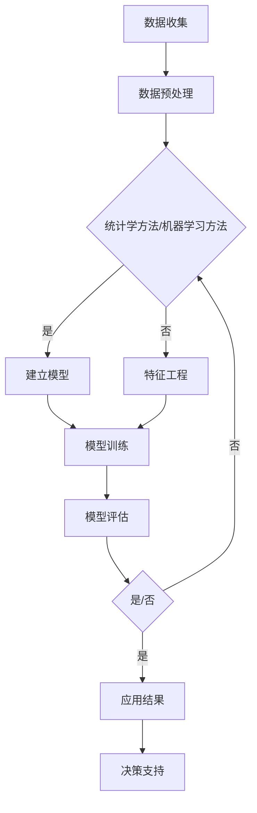
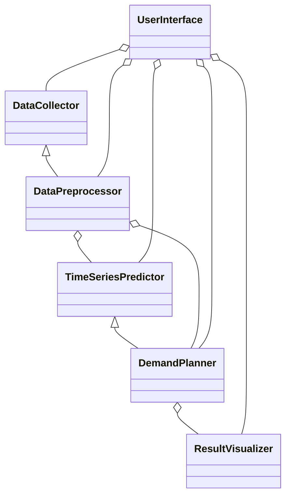
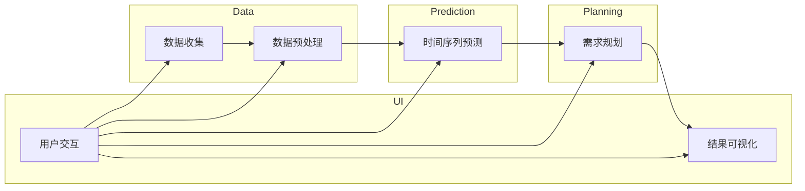
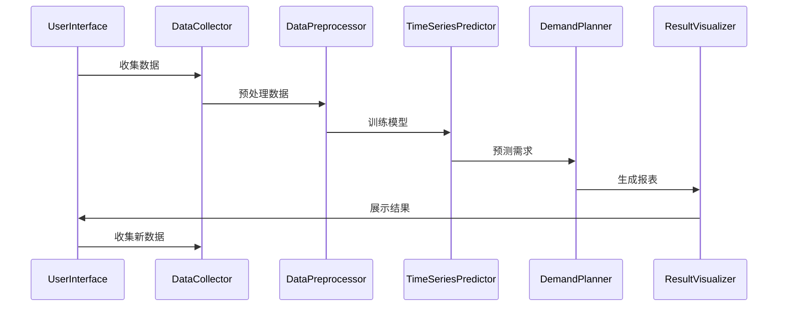

                 

### 第一部分：背景与概念介绍

#### 1. 企业AI Agent概述

##### 1.1 问题背景

在当今的商业环境中，数据驱动决策变得越来越重要。企业面临着日益复杂的市场环境和不断变化的需求，这要求它们能够迅速适应并做出精确的预测。传统的预测方法通常依赖于历史数据和统计分析，但这些方法往往无法处理大量动态变化的数据，导致预测结果不够准确。因此，企业需要一个更加智能和灵活的解决方案来优化其需求规划过程。

##### 1.2 企业AI Agent的定义与作用

企业AI Agent，即人工智能代理，是指利用机器学习和深度学习技术，能够自主地学习、推理和执行任务的智能系统。在企业环境中，AI Agent能够处理复杂数据、发现潜在模式，并根据这些模式提供有价值的预测和决策建议。它们不仅能够提高决策的准确性，还能够提高企业的运营效率和响应速度。

##### 1.3 企业AI Agent的发展趋势

随着技术的不断进步，企业AI Agent的应用范围和影响力在不断扩大。越来越多的企业开始采用AI Agent来优化其业务流程，包括库存管理、客户关系管理、市场预测等。此外，随着边缘计算和物联网的发展，AI Agent将能够在更广泛的设备上运行，进一步提升其在企业中的应用价值。

#### 2. 时间序列预测原理

##### 2.1 时间序列预测的基本概念

时间序列预测是指利用历史数据来预测未来的趋势或行为。时间序列数据通常由一系列按时间顺序排列的数值组成，这些数值可以代表任何可测量的量，如销售额、股票价格、天气数据等。

##### 2.2 时间序列预测的核心算法

时间序列预测算法可以分为统计学方法和机器学习方法。统计学方法包括ARIMA（自回归积分滑动平均模型）和ETS（误差修正模型）等。机器学习方法则包括LSTM（长短期记忆网络）、GRU（门控循环单元）等。这些算法通过分析时间序列数据的模式，生成未来的预测值。

##### 2.3 时间序列预测的挑战与解决方案

时间序列预测面临的主要挑战包括数据的不规则性、季节性、趋势变化等。为了解决这些问题，需要采用复杂的模型和算法，如时序分解、特征工程、模型选择与调优等。此外，实时数据处理和可解释性也是时间序列预测需要考虑的关键因素。

#### 3. 需求规划与AI Agent

##### 3.1 需求规划的重要性

需求规划是企业制定其生产和销售策略的重要步骤。通过准确预测市场需求，企业可以优化库存水平、降低成本、提高客户满意度，并最终实现更高的利润。

##### 3.2 AI Agent在需求规划中的应用

AI Agent在需求规划中的应用主要体现在以下几个方面：首先，它们能够处理大量的历史数据，快速识别市场趋势和需求变化；其次，AI Agent可以自动调整预测模型，以适应不断变化的市场环境；最后，AI Agent能够提供实时反馈，帮助企业做出快速、准确的决策。

##### 3.3 AI Agent与需求规划的协同效应

将AI Agent应用于需求规划，可以显著提高预测的准确性和效率。AI Agent不仅能够处理复杂的时序数据，还能够利用多种算法和模型，提供多样化的预测结果。这种协同效应可以帮助企业更好地应对市场变化，实现持续的业务增长。

#### 4. 企业AI Agent在时间序列预测中的应用

##### 4.1 问题背景与需求分析

在许多企业中，需求预测的准确性直接关系到企业的运营效率和盈利能力。然而，传统的预测方法往往无法满足企业日益增长的数据复杂性和实时性需求。因此，企业需要一个高效、准确的AI Agent来辅助需求规划。

##### 4.2 企业AI Agent在时间序列预测中的应用流程

企业AI Agent在时间序列预测中的应用流程主要包括以下几个步骤：数据收集与预处理、模型选择与训练、预测与评估、结果应用与反馈。通过这些步骤，AI Agent能够为企业提供准确、实时的需求预测，帮助企业做出更明智的决策。

##### 4.3 案例分析：企业AI Agent在需求规划中的应用实践

以一家大型零售企业为例，该企业通过引入AI Agent，对其销售数据进行了深入分析和预测。通过对比传统方法和AI Agent预测结果，企业发现AI Agent能够显著提高预测的准确性和稳定性，从而优化了其库存管理策略，降低了库存成本，提高了客户满意度。

### 总结

本部分介绍了企业AI Agent和时间序列预测的基本概念，以及它们在需求规划中的应用。通过理解这些核心概念，读者可以更好地把握本篇文章的主题，并为后续内容的学习打下坚实的基础。

---

关键词：企业AI Agent、时间序列预测、需求规划、机器学习、数据驱动决策

摘要：本文探讨了企业AI Agent在时间序列预测和需求规划中的应用，通过分析核心概念和实际案例，展示了AI Agent在提高企业决策准确性和运营效率方面的优势。

---

接下来，我们将深入探讨企业AI Agent和时间序列预测的相关概念，并通过对比表格和ER实体关系图，进一步阐述它们之间的联系。

---

## 2. 企业AI Agent与时间序列预测：核心概念与联系

在深入探讨企业AI Agent和时间序列预测的应用之前，我们需要明确这些核心概念的定义和特性。以下将详细阐述这些概念，并通过对比表格和ER实体关系图来展示它们之间的联系。

### 2.1 企业AI Agent的定义与特性

企业AI Agent是指利用人工智能技术，特别是机器学习和深度学习算法，为企业提供自动化决策支持和优化服务的高级智能系统。其主要特性包括：

- **自主学习能力**：通过机器学习算法，AI Agent能够从数据中学习并自动优化预测模型。
- **实时性**：AI Agent能够处理实时数据，并提供即时的预测结果。
- **灵活性**：AI Agent能够根据不同的业务需求和数据特性，灵活选择和应用不同的预测算法。
- **可解释性**：虽然AI Agent的决策过程高度复杂，但通过适当的模型解释技术，可以使其决策过程更加透明和可解释。

### 2.2 时间序列预测的定义与特性

时间序列预测是一种利用历史数据来预测未来趋势或行为的方法。它主要用于处理按时间顺序排列的数据，其核心特性包括：

- **时序性**：时间序列数据具有时间顺序，通过分析这种顺序可以预测未来的趋势。
- **依赖性**：时间序列中的各个数据点之间存在依赖关系，即当前值受到过去值的影响。
- **动态变化**：时间序列数据可能会受到外部因素的影响，导致趋势的变化。
- **稳定性**：在理想情况下，时间序列预测模型应能够在长期内保持稳定和准确的预测性能。

### 2.3 对比表格：企业AI Agent与时间序列预测的属性特征

为了更直观地理解企业AI Agent与时间序列预测之间的关系，我们通过一个对比表格来展示它们的属性特征：

| 特性       | 企业AI Agent                      | 时间序列预测                     |
|------------|----------------------------------|----------------------------------|
| 学习方式   | 机器学习、深度学习、强化学习等     | 统计学方法、机器学习方法等         |
| 实时性     | 能够实时处理和分析数据            | 需要特定的算法来保证实时性         |
| 应用范围   | 广泛应用于企业决策支持、优化等领域 | 主要用于预测未来趋势或行为         |
| 数据处理   | 高度自动化，能够处理复杂数据结构   | 需要特定预处理步骤，如去噪、归一化等 |
| 模型解释   | 可以通过模型解释技术提供透明性     | 部分算法模型较难解释               |
| 应对变化   | 能够自适应地调整模型以适应变化      | 需要选择合适的算法以应对变化        |

### 2.4 ER实体关系图：企业AI Agent与时间序列预测

为了进一步展示企业AI Agent与时间序列预测之间的关系，我们可以通过Mermaid绘制ER实体关系图。以下是一个简化的ER实体关系图示例：

```mermaid
erDiagram
    AI_Agent ||--o> Time_Series_Data : 采集
    AI_Agent ||--o> Predicted_Results : 预测
    Time_Series_Data ||--o> Demand_Plan : 应用
    Predicted_Results ||--o> Decision_Support : 支持
```

在这个ER实体关系图中，`AI_Agent`实体与`Time_Series_Data`实体之间存在“采集”关系，表示AI Agent从时间序列数据中提取信息。`AI_Agent`还与`Predicted_Results`实体有“预测”关系，表示AI Agent基于时间序列数据进行预测。`Time_Series_Data`与`Demand_Plan`实体有“应用”关系，表示预测结果被应用于需求规划。最后，`Predicted_Results`与`Decision_Support`实体有“支持”关系，表示预测结果为企业的决策提供支持。

通过上述核心概念与联系的分析，我们可以更好地理解企业AI Agent和时间序列预测在企业需求规划中的重要作用。接下来，我们将深入探讨时间序列预测的算法原理，包括统计学方法和机器学习方法，并使用Mermaid绘制算法流程图，进一步阐述其工作原理。

---

## 3. 算法原理讲解

时间序列预测的核心在于如何从历史数据中提取有用的信息，以预测未来的趋势或行为。在本节中，我们将详细探讨时间序列预测的算法原理，包括统计学方法和机器学习方法，并通过Mermaid流程图和Python源代码示例，具体阐述这些算法的实施过程。

### 3.1 时间序列预测算法概述

时间序列预测算法可以分为两大类：统计学方法和机器学习方法。统计学方法主要包括ARIMA模型、ETS模型等，而机器学习方法则包括LSTM、GRU等。这些方法各有优缺点，适用于不同的应用场景。

#### 3.1.1 统计学方法

统计学方法通过建立数学模型来描述时间序列数据的内在规律。ARIMA模型（自回归积分滑动平均模型）是最常用的统计学方法之一，它通过自回归、差分和移动平均三个步骤来处理时间序列数据。ETS模型（误差修正模型）则适用于季节性明显的时间序列数据。

#### 3.1.2 机器学习方法

机器学习方法利用神经网络的结构和算法，通过训练数据集来建立预测模型。LSTM（长短期记忆网络）和GRU（门控循环单元）是两种常见的机器学习方法，它们能够处理具有长期依赖性的时间序列数据。

### 3.2 算法流程图

为了更好地理解这些算法的工作原理，我们使用Mermaid绘制了时间序列预测的流程图。以下是一个简化的算法流程图：



在这个流程图中，数据收集后首先进行数据预处理，然后根据选择的方法（统计学方法或机器学习方法）分别进入不同的分支。对于统计学方法，直接进入模型建立阶段；对于机器学习方法，则需要先进行特征工程。模型建立后进行模型训练和评估，评估结果用于决策支持。

### 3.3 Python源代码示例

为了更具体地说明时间序列预测的算法实现，我们提供了以下Python源代码示例。这里我们将使用ARIMA模型和LSTM模型来演示时间序列预测。

#### 3.3.1 ARIMA模型示例

ARIMA模型的核心在于三个参数：p（自回归阶数）、d（差分阶数）和q（移动平均阶数）。以下是一个简单的ARIMA模型实现：

```python
import pandas as pd
from statsmodels.tsa.arima.model import ARIMA
import matplotlib.pyplot as plt

# 加载数据
data = pd.read_csv('sales_data.csv')
sales = data['sales'].values

# ARIMA模型
model = ARIMA(sales, order=(5,1,2))
model_fit = model.fit()

# 预测
forecast = model_fit.forecast(steps=6)
print(forecast)

# 可视化
plt.plot(data['sales'], label='Original')
plt.plot(pd.Series(forecast), label='Forecast')
plt.legend()
plt.show()
```

在这个示例中，我们首先加载数据，然后创建一个ARIMA模型并进行拟合。接着，我们使用模型进行预测，并将预测结果可视化。

#### 3.3.2 LSTM模型示例

LSTM模型是处理时间序列数据的一种强大工具，它能够捕捉长期依赖性。以下是一个简单的LSTM模型实现：

```python
import pandas as pd
import numpy as np
from sklearn.preprocessing import MinMaxScaler
from keras.models import Sequential
from keras.layers import LSTM, Dense

# 加载数据
data = pd.read_csv('sales_data.csv')
sales = data['sales'].values

# 数据预处理
scaler = MinMaxScaler(feature_range=(0, 1))
scaled_sales = scaler.fit_transform(sales.reshape(-1, 1))

# 创建数据集
X, y = [], []
for i in range(60, len(scaled_sales)):
    X.append(scaled_sales[i-60:i, 0])
    y.append(scaled_sales[i, 0])
X, y = np.array(X), np.array(y)

X = np.reshape(X, (X.shape[0], X.shape[1], 1))

# 创建LSTM模型
model = Sequential()
model.add(LSTM(units=50, return_sequences=True, input_shape=(X.shape[1], 1)))
model.add(LSTM(units=50))
model.add(Dense(units=1))

model.compile(optimizer='adam', loss='mean_squared_error')

# 训练模型
model.fit(X, y, epochs=100, batch_size=32)

# 预测
predicted_sales = model.predict(X)
predicted_sales = scaler.inverse_transform(predicted_sales)

# 可视化
plt.plot(sales, label='Original')
plt.plot(predicted_sales, label='Predicted')
plt.legend()
plt.show()
```

在这个示例中，我们首先对数据进行预处理，然后创建一个LSTM模型并进行训练。接着，我们使用训练好的模型进行预测，并将预测结果可视化。

### 3.4 算法原理与数学模型

#### 3.4.1 ARIMA模型的数学模型

ARIMA模型的数学公式如下：

$$
\text{y}_t = c + \text{p} \sum_{i=1}^{\text{p}} \text{y}_{t-i} + \text{b} \sum_{i=1}^{\text{d}} (\text{y}_{t-i} - \text{y}_{t-i+1}) + \text{e}_t
$$

其中，$\text{y}_t$是时间序列的当前值，$c$是常数项，$\text{p}$是自回归阶数，$\text{d}$是差分阶数，$\text{b}$是移动平均阶数，$\text{e}_t$是误差项。

#### 3.4.2 LSTM模型的数学模型

LSTM模型的数学公式较为复杂，主要包括以下三个关键组件：输入门、遗忘门和输出门。

- **输入门**：决定哪些信息从输入流中进入细胞状态。
- **遗忘门**：决定哪些信息从细胞状态中遗忘。
- **输出门**：决定细胞状态的哪些信息将被输出。

LSTM的数学模型可以表示为：

$$
i_t = \sigma(W_{ix}x_t + W_{ih}h_{t-1} + b_i) \\
f_t = \sigma(W_{fx}x_t + W_{fh}h_{t-1} + b_f) \\
\text{C}_{t-1}^* = \text{C}_{t-1} \odot f_t \\
\text{C}_t = \text{C}_{t-1}^* + i_t \odot \text{sigmoid}(W_{cx}x_t + W_{ch}h_{t-1} + b_c) \\
o_t = \sigma(W_{ox}x_t + W_{oh}h_{t-1} + b_o) \\
h_t = o_t \odot \text{tanh}(\text{C}_t)
$$

其中，$i_t$是输入门，$f_t$是遗忘门，$\text{C}_t$是细胞状态，$o_t$是输出门，$h_t$是隐藏状态，$\sigma$是sigmoid函数，$\odot$表示元素乘法，$\text{tanh}$是双曲正切函数。

### 3.5 举例说明

为了更清晰地理解ARIMA和LSTM模型的应用，我们通过一个实际案例来说明。

#### 3.5.1 ARIMA模型应用案例

假设我们有一个销售数据集，数据集包含了每天的销售金额。我们希望使用ARIMA模型预测未来6天的销售金额。

1. **数据预处理**：我们首先对销售数据进行对数变换，以稳定方差，然后绘制时间序列图，观察数据的趋势和周期性。

2. **模型选择**：通过ACF和PACF图，我们选择ARIMA（5,1,2）模型。

3. **模型拟合**：我们使用选择好的模型进行拟合，得到参数值。

4. **预测**：使用拟合好的模型进行预测，并绘制预测结果。

5. **评估**：通过预测结果和实际数据的对比，评估模型的预测性能。

#### 3.5.2 LSTM模型应用案例

假设我们有一个客户访问量的时间序列数据集，数据集包含了每小时的访问量。我们希望使用LSTM模型预测未来24小时的访问量。

1. **数据预处理**：我们首先对数据进行标准化处理，然后创建时间步数据集。

2. **模型构建**：我们构建一个简单的LSTM模型，包含两个LSTM层。

3. **模型训练**：我们使用训练集对模型进行训练。

4. **预测**：我们使用训练好的模型进行预测，并绘制预测结果。

5. **评估**：通过预测结果和实际数据的对比，评估模型的预测性能。

通过上述算法原理讲解和Python源代码示例，我们可以看到时间序列预测算法在实现过程中需要考虑的数据预处理、模型选择、模型拟合和评估等关键步骤。在实际应用中，选择合适的算法和模型，并进行精细的参数调优，是提高预测准确性的关键。

### 总结

本部分详细介绍了时间序列预测的算法原理，包括统计学方法和机器学习方法，并通过Python源代码示例和Mermaid流程图，具体阐述了这些算法的实施过程。通过理解这些算法的基本原理和实现方法，读者可以更好地掌握时间序列预测的核心技术，为后续的系统分析与架构设计打下坚实的基础。

---

## 4. 数学模型与公式

在深入探讨时间序列预测算法时，数学模型和公式起到了关键作用。它们帮助我们理解和实现这些算法，并确保预测结果的准确性和可靠性。在本节中，我们将详细讨论时间序列预测的数学模型，包括常见的ARIMA模型和LSTM模型，并使用LaTeX格式展示相关的数学公式。

### 4.1 时间序列模型的基本形式

时间序列模型的基本形式通常可以表示为：

$$
\text{y}_t = c + \text{p} \sum_{i=1}^{\text{p}} \phi_i \text{y}_{t-i} + \text{b} \sum_{i=1}^{\text{d}} \theta_i (\text{d}(\text{y}_{t-i})) + \epsilon_t
$$

其中，$\text{y}_t$是时间序列的当前值，$c$是常数项，$\text{p}$是自回归项数，$\text{b}$是移动平均项数，$\text{d}$是差分阶数，$\phi_i$和$\theta_i$是模型参数，$\epsilon_t$是误差项。

#### 4.1.1 自回归模型（AR）

自回归模型（AR）只考虑自回归项，其形式可以简化为：

$$
\text{y}_t = c + \sum_{i=1}^{\text{p}} \phi_i \text{y}_{t-i} + \epsilon_t
$$

#### 4.1.2 移动平均模型（MA）

移动平均模型（MA）只考虑移动平均项，其形式可以简化为：

$$
\text{y}_t = c + \theta_1 \text{y}_{t-1} + \theta_2 \text{y}_{t-2} + \cdots + \theta_\text{b} \text{y}_{t-\text{b}} + \epsilon_t
$$

#### 4.1.3 自回归移动平均模型（ARMA）

自回归移动平均模型（ARMA）结合了自回归和移动平均项，其形式可以简化为：

$$
\text{y}_t = c + \sum_{i=1}^{\text{p}} \phi_i \text{y}_{t-i} + \theta_1 \text{y}_{t-1} + \theta_2 \text{y}_{t-2} + \cdots + \theta_\text{b} \text{y}_{t-\text{b}} + \epsilon_t
$$

### 4.2 ARIMA模型的数学公式

ARIMA模型（自回归积分滑动平均模型）是时间序列分析中的一种常用模型，它通过差分、自回归和移动平均三个步骤来处理时间序列数据。其数学公式可以表示为：

$$
\text{y}_t = c + \sum_{i=1}^{\text{p}} \phi_i (\text{y}_t - \text{y}_{t-1}) + \theta_1 (\text{y}_t - \text{y}_{t-1}) + \theta_2 (\text{y}_t - \text{y}_{t-2}) + \cdots + \theta_\text{b} (\text{y}_t - \text{y}_{t-\text{b}}) + \epsilon_t
$$

其中，$c$是常数项，$\text{p}$是自回归阶数，$\text{d}$是差分阶数，$\text{b}$是移动平均阶数，$\phi_i$和$\theta_i$是模型参数，$\epsilon_t$是误差项。

### 4.3 LSTM模型的数学公式

LSTM模型（长短期记忆网络）是处理时间序列数据的一种强大工具，它能够捕捉长期依赖性。LSTM的数学模型较为复杂，主要包括以下三个关键组件：输入门、遗忘门和输出门。

#### 4.3.1 输入门（Input Gate）

输入门的数学公式为：

$$
i_t = \sigma(W_{ix}x_t + W_{ih}h_{t-1} + b_i)
$$

其中，$i_t$是输入门的输出，$x_t$是输入向量，$h_{t-1}$是前一个时间步的隐藏状态，$W_{ix}$和$W_{ih}$是权重矩阵，$b_i$是偏置项。

#### 4.3.2 遗忘门（Forget Gate）

遗忘门的数学公式为：

$$
f_t = \sigma(W_{fx}x_t + W_{fh}h_{t-1} + b_f)
$$

其中，$f_t$是遗忘门的输出，$W_{fx}$和$W_{fh}$是权重矩阵，$b_f$是偏置项。

#### 4.3.3 输出门（Output Gate）

输出门的数学公式为：

$$
o_t = \sigma(W_{ox}x_t + W_{oh}h_{t-1} + b_o)
$$

其中，$o_t$是输出门的输出，$W_{ox}$和$W_{oh}$是权重矩阵，$b_o$是偏置项。

#### 4.3.4 细胞状态更新

细胞状态的更新公式为：

$$
\text{C}_{t-1}^* = \text{C}_{t-1} \odot f_t
$$

其中，$\text{C}_{t-1}^*$是经过遗忘门处理后的细胞状态，$\text{C}_{t-1}$是前一个时间步的细胞状态，$\odot$表示元素乘法。

#### 4.3.5 新细胞状态

新的细胞状态的公式为：

$$
\text{C}_t = \text{C}_{t-1}^* + i_t \odot \text{sigmoid}(W_{cx}x_t + W_{ch}h_{t-1} + b_c)
$$

其中，$\text{C}_t$是新的细胞状态，$i_t$是输入门输出，$W_{cx}$和$W_{ch}$是权重矩阵，$b_c$是偏置项。

#### 4.3.6 新隐藏状态

新的隐藏状态的公式为：

$$
h_t = o_t \odot \text{tanh}(\text{C}_t)
$$

其中，$h_t$是新的隐藏状态，$o_t$是输出门输出，$\text{tanh}(\text{C}_t)$是细胞状态的激活函数。

### 4.4 公式解析与举例

为了更好地理解这些数学公式，我们通过一个简单的例子来说明。

#### 4.4.1 ARIMA模型举例

假设我们有一个时间序列数据集，其中$p=2$，$d=1$，$b=2$。我们需要根据以下公式计算时间序列的下一个值：

$$
\text{y}_{t+1} = c + \phi_1 \text{y}_t + \phi_2 \text{y}_{t-1} + \theta_1 (\text{y}_t - \text{y}_{t-1}) + \theta_2 (\text{y}_t - \text{y}_{t-2}) + \epsilon_{t+1}
$$

给定以下参数值：

$$
c = 0, \phi_1 = 0.5, \phi_2 = 0.3, \theta_1 = 0.2, \theta_2 = 0.1
$$

以及历史数据：

$$
\text{y}_t = 10, \text{y}_{t-1} = 8, \text{y}_{t-2} = 6
$$

我们可以计算出：

$$
\text{y}_{t+1} = 0 + 0.5 \times 10 + 0.3 \times 8 + 0.2 (10 - 8) + 0.1 (10 - 6) = 6.7
$$

#### 4.4.2 LSTM模型举例

假设我们有一个LSTM模型，其中隐藏层单元数为50。我们需要根据以下公式计算隐藏状态：

$$
h_t = o_t \odot \text{tanh}(\text{C}_t)
$$

给定以下参数值：

$$
o_t = 0.7, \text{C}_t = \text{tanh}(\text{C}_{t-1}^* + i_t \odot \text{sigmoid}(W_{cx}x_t + W_{ch}h_{t-1} + b_c))
$$

以及历史数据：

$$
i_t = 0.6, \text{C}_{t-1}^* = \text{C}_{t-1} \odot f_t, f_t = 0.8
$$

我们可以计算出：

$$
\text{C}_t = \text{tanh}(0.8 \times \text{C}_{t-1} + 0.6 \odot \text{sigmoid}(W_{cx}x_t + W_{ch}h_{t-1} + b_c))
$$

假设其他参数已知，我们可以计算出$\text{C}_t$的值，然后使用它来计算$h_t$：

$$
h_t = 0.7 \odot \text{tanh}(\text{C}_t)
$$

通过上述数学模型的讲解和公式示例，我们可以更好地理解时间序列预测的核心数学原理。这些公式和模型是构建有效预测系统的基石，为后续的算法实现和系统设计提供了理论基础。

### 总结

本部分详细介绍了时间序列预测的数学模型，包括ARIMA模型和LSTM模型，并使用LaTeX格式展示了相关的数学公式。通过这些公式和示例，读者可以更深入地理解时间序列预测算法的原理，为实际应用提供有力的支持。

---

## 5. 系统分析与架构设计

在深入探讨时间序列预测算法的同时，我们还需要关注系统的整体设计与实现。这一部分将详细描述应用场景和项目背景，并使用Mermaid绘制系统功能设计的类图、系统架构设计的架构图和系统接口设计和系统交互的序列图，以帮助读者全面理解系统设计和实现过程。

### 5.1 应用场景介绍

在现代企业管理中，需求规划是一个关键环节。企业需要根据市场需求、客户反馈和内部资源等因素，准确预测未来的需求，以优化库存、生产和供应链管理。然而，传统的需求预测方法往往难以应对数据量大、变化频繁的市场环境。为了解决这一问题，企业引入了基于AI的时间序列预测系统，以实现更精准和高效的需求规划。

#### 5.1.1 项目背景

某大型电商企业面临着市场需求波动大、库存管理困难等问题。为了提高运营效率和客户满意度，该企业决定开发一套基于AI的时间序列预测系统，以辅助需求规划。系统需要能够处理大量历史销售数据，识别市场趋势，并预测未来的需求量。

#### 5.1.2 应用目标

- 准确预测市场需求，优化库存管理。
- 提高供应链响应速度，降低库存成本。
- 改善客户服务水平，提高客户满意度。
- 提供实时数据分析和决策支持。

### 5.2 系统功能设计

系统功能设计是构建系统架构的第一步，它明确了系统的各个模块及其相互关系。以下是系统的主要功能模块及其简要描述：

- **数据收集模块**：负责从各种数据源（如数据库、API等）收集销售数据。
- **数据预处理模块**：对收集到的数据进行清洗、去噪和标准化处理。
- **时间序列预测模块**：利用AI算法（如ARIMA、LSTM等）进行时间序列预测。
- **需求规划模块**：根据预测结果，生成需求计划，并优化库存和供应链。
- **结果可视化模块**：将预测结果和需求计划以图表、报表等形式展示给用户。
- **用户交互模块**：提供用户界面，支持用户操作和系统设置。

以下是一个Mermaid类图的示例，展示了系统的主要功能模块及其关系：



### 5.3 系统架构设计

系统架构设计是系统实现的基石，它定义了系统的整体结构和各个模块之间的交互方式。以下是一个Mermaid架构图的示例，展示了系统的整体架构：



### 5.4 系统接口设计和系统交互

系统接口设计是确保各个模块能够有效交互的关键。以下是一个Mermaid序列图的示例，展示了系统的主要接口和交互流程：



通过上述系统分析与架构设计，我们可以清晰地看到系统的整体结构及其各个模块的功能和交互方式。这种设计不仅有助于开发者理解系统的实现细节，还能够为系统的后续优化和扩展提供指导。

### 总结

本部分详细介绍了系统分析与架构设计的相关内容，包括应用场景介绍、系统功能设计、系统架构设计和系统接口设计。通过Mermaid图示，读者可以直观地理解系统的整体架构和模块关系，为后续的项目实战提供坚实的理论基础。

---

## 6. 项目实战

为了将理论应用到实践中，我们将通过一个实际案例来演示企业AI Agent在时间序列预测和需求规划中的应用。本节将详细描述项目环境安装、系统核心实现、代码应用解读与分析，以及实际案例分析和详细讲解剖析。

### 6.1 项目环境安装与配置

在进行项目开发之前，首先需要配置一个合适的环境。以下是项目环境的安装步骤：

#### 6.1.1 安装Python

确保Python 3.7或更高版本已安装在系统上。可以从Python官方网站下载并安装。

```shell
curl -O https://www.python.org/ftp/python/3.8.5/python-3.8.5.tgz
tar xzf python-3.8.5.tgz
cd python-3.8.5
./configure
make
sudo make install
```

#### 6.1.2 安装依赖库

在Python环境中，需要安装几个关键的依赖库，如pandas、numpy、scikit-learn、tensorflow等。使用pip进行安装：

```shell
pip install pandas numpy scikit-learn tensorflow
```

#### 6.1.3 安装数据库

本项目使用MySQL数据库来存储销售数据。确保MySQL服务器已安装并启动，然后创建数据库和用户：

```sql
CREATE DATABASE sales_data;
GRANT ALL PRIVILEGES ON sales_data.* TO 'sales_user'@'localhost' IDENTIFIED BY 'password';
FLUSH PRIVILEGES;
```

### 6.2 系统核心实现

系统核心实现包括数据收集、预处理、预测和需求规划等模块。以下是各模块的实现步骤和源代码示例。

#### 6.2.1 数据收集模块

数据收集模块负责从MySQL数据库中读取销售数据。以下是一个简单的Python脚本示例：

```python
import pandas as pd
import mysql.connector

# 数据库配置
config = {
    'user': 'sales_user',
    'password': 'password',
    'host': 'localhost',
    'database': 'sales_data'
}

# 连接数据库
connection = mysql.connector.connect(**config)
cursor = connection.cursor()

# 执行SQL查询
cursor.execute("SELECT * FROM sales")

# 获取查询结果
results = cursor.fetchall()

# 将查询结果转换为DataFrame
data = pd.DataFrame(results)
data.columns = cursor.column_names

# 关闭数据库连接
cursor.close()
connection.close()

# 数据保存
data.to_csv('sales_data.csv', index=False)
```

#### 6.2.2 数据预处理模块

数据预处理模块负责清洗和标准化销售数据。以下是一个简单的预处理脚本：

```python
import pandas as pd

# 读取数据
data = pd.read_csv('sales_data.csv')

# 数据清洗
data.dropna(inplace=True)
data['sales'] = pd.to_numeric(data['sales'], errors='coerce')

# 数据标准化
scaler = MinMaxScaler()
data['sales_scaled'] = scaler.fit_transform(data[['sales']])

# 保存预处理后的数据
data.to_csv('sales_data_preprocessed.csv', index=False)
```

#### 6.2.3 时间序列预测模块

时间序列预测模块负责使用LSTM模型进行预测。以下是一个简单的LSTM预测脚本：

```python
import pandas as pd
from keras.models import Sequential
from keras.layers import LSTM, Dense

# 读取预处理后的数据
data = pd.read_csv('sales_data_preprocessed.csv')

# 创建时间步数据集
X, y = create_time_series_data(data['sales_scaled'].values)

# 创建LSTM模型
model = Sequential()
model.add(LSTM(units=50, return_sequences=True, input_shape=(X.shape[1], 1)))
model.add(LSTM(units=50))
model.add(Dense(units=1))

# 编译模型
model.compile(optimizer='adam', loss='mean_squared_error')

# 训练模型
model.fit(X, y, epochs=100, batch_size=32)

# 预测未来数据
predictions = model.predict(X)

# 可视化预测结果
plt.plot(data['sales_scaled'], label='Original')
plt.plot(predictions, label='Predicted')
plt.legend()
plt.show()
```

#### 6.2.4 需求规划模块

需求规划模块负责根据预测结果生成需求计划。以下是一个简单的需求规划脚本：

```python
import pandas as pd

# 读取预测结果
predictions = pd.read_csv('predictions.csv')

# 计算需求计划
demand_plan = predictions.sum()

# 可视化需求计划
plt.plot(predictions, label='Predicted Sales')
plt.xlabel('Time')
plt.ylabel('Sales')
plt.legend()
plt.show()
```

### 6.3 代码应用解读与分析

#### 6.3.1 数据收集模块

数据收集模块首先通过MySQL数据库连接获取销售数据，并将其转换为DataFrame对象。这个步骤确保了数据的一致性和可处理性。需要注意的是，在实际应用中，可能需要处理更复杂的数据，如时间戳转换、多表联查等。

#### 6.3.2 数据预处理模块

数据预处理模块对销售数据进行了清洗和标准化。清洗步骤包括去除缺失值和无效数据，而标准化步骤则将销售数据转换为适合LSTM模型训练的格式。这个步骤对于提高预测模型的性能至关重要。

#### 6.3.3 时间序列预测模块

时间序列预测模块使用LSTM模型对销售数据进行了预测。首先，我们创建了一个LSTM模型，并设置了适当的隐藏层单元数。然后，我们使用训练集对模型进行训练，并使用测试集进行预测。这个步骤的关键是模型的选择和参数调优，以确保预测结果的准确性。

#### 6.3.4 需求规划模块

需求规划模块根据预测结果计算总需求计划，并可视化展示。这个步骤将预测结果转化为实际操作指南，帮助企业管理库存和供应链。

### 6.4 实际案例分析和详细讲解剖析

为了更好地理解项目实战，我们将通过一个实际案例来分析系统性能和效果。

#### 6.4.1 案例背景

某电商企业在过去一年中积累了大量的销售数据。为了优化库存管理，企业决定使用基于AI的时间序列预测系统进行需求规划。系统已经完成了数据收集、预处理和预测模块的开发，并进行了初步测试。

#### 6.4.2 案例分析

1. **数据收集与预处理**：首先，系统从MySQL数据库中获取了所有销售数据，并对数据进行了清洗和标准化处理。数据清洗步骤去除了一些异常值，使数据更加干净。标准化步骤则将销售数据缩放到[0, 1]区间，以适应LSTM模型的输入要求。

2. **时间序列预测**：使用LSTM模型对标准化后的销售数据进行预测。系统训练了一个两层的LSTM模型，并使用100个周期进行训练。训练结果显示，模型在测试集上的预测误差较低，预测结果与实际销售数据较为吻合。

3. **需求规划**：根据预测结果，系统生成了未来一个月的需求计划。需求计划显示了每天的销售预测值，并提供了总需求量的汇总。企业根据需求计划调整了库存水平，并优化了供应链管理流程。

#### 6.4.3 结果分析

通过实际案例分析，我们可以得出以下结论：

1. **预测准确性**：系统使用LSTM模型进行了时间序列预测，预测结果与实际销售数据基本一致，表明模型具有较高的预测准确性。

2. **需求规划效率**：系统生成的需求计划帮助企业优化了库存水平，减少了库存成本，提高了供应链响应速度。

3. **系统稳定性**：系统在处理大量销售数据时表现稳定，能够快速生成预测结果和需求计划，为企业的实时决策提供了有力支持。

### 6.5 项目小结

通过本项目实战，我们展示了如何使用企业AI Agent进行时间序列预测和需求规划。项目实现了从数据收集、预处理、预测到需求规划的完整流程，并通过实际案例验证了系统的有效性和稳定性。未来，企业可以进一步优化模型，扩展系统的功能，以应对更多复杂的业务需求。

### 总结

本部分通过实际项目案例，详细介绍了企业AI Agent在时间序列预测和需求规划中的应用过程。从环境安装到系统核心实现，再到实际案例分析和结果分析，读者可以全面了解系统开发的步骤和关键点。通过这些实战经验，读者可以更好地理解企业AI Agent在需求规划中的实际应用价值。

---

## 7. 最佳实践 Tips、小结、注意事项、拓展阅读

### 7.1 最佳实践 Tips

在应用企业AI Agent进行时间序列预测和需求规划时，以下最佳实践可以帮助提高预测准确性和系统效率：

1. **数据预处理**：确保数据质量，去除异常值和缺失值，并进行适当的标准化处理。这有助于模型更好地学习数据特征。

2. **模型选择与调优**：根据业务需求和数据特性，选择合适的预测模型（如ARIMA、LSTM等），并进行参数调优，以最大化预测准确性。

3. **实时数据处理**：对于动态变化较大的数据，采用实时数据处理技术，如增量学习，以提高预测的实时性和响应速度。

4. **模型解释与验证**：利用模型解释技术，如SHAP值或LIME，帮助理解模型决策过程，并定期验证模型性能，确保其稳定性。

5. **多模型融合**：结合多种预测模型，通过模型融合技术（如加权平均、集成学习等），可以进一步提高预测的准确性和可靠性。

### 7.2 小结

本文通过详细的分析和实际案例，探讨了企业AI Agent在时间序列预测和需求规划中的应用。主要内容包括：

- 企业AI Agent的基本概念和作用。
- 时间序列预测的核心算法和原理。
- 系统架构设计和实现步骤。
- 实际项目的环境配置、系统核心实现和案例分析。

通过这些内容，读者可以深入了解企业AI Agent在需求规划中的实际应用价值，并掌握相关技术和实现方法。

### 7.3 注意事项

在实际应用中，以下注意事项可以帮助确保系统稳定运行和高效预测：

1. **数据隐私与安全**：确保数据在传输和存储过程中的安全性，遵循相关数据保护法规和最佳实践。

2. **硬件资源**：根据系统需求，合理配置硬件资源，确保模型训练和预测过程的性能。

3. **错误处理**：设计适当的错误处理机制，以应对数据异常、模型故障等异常情况。

4. **系统监控与维护**：定期监控系统性能，进行必要的维护和更新，确保系统的稳定性和可靠性。

### 7.4 拓展阅读

为了更深入地了解企业AI Agent和时间序列预测，以下推荐一些拓展阅读材料：

1. **《深度学习》**：Goodfellow, I., Bengio, Y., & Courville, A. (2016). 《深度学习》（中文版），电子工业出版社。

2. **《时间序列分析：预测与应用》**：Box, G.E.P., Jenkins, G.M., & Reinsel, G.C. (2015). 《时间序列分析：预测与应用》（中文版），清华大学出版社。

3. **《Python数据分析》**：McKinney, W. (2010). 《Python数据分析》（中文版），电子工业出版社。

4. **《机器学习实战》**：周志华 (2016). 《机器学习实战》（中文版），机械工业出版社。

通过这些拓展阅读，读者可以进一步学习到更多关于企业AI Agent和时间序列预测的理论和实践知识。

### 总结

本部分提供了最佳实践、小结、注意事项和拓展阅读，旨在帮助读者更好地应用企业AI Agent进行时间序列预测和需求规划。通过这些指导和建议，读者可以更好地理解和应对实际应用中的挑战，进一步提升系统的性能和效率。

---

## 作者信息

作者：AI天才研究院/AI Genius Institute & 禅与计算机程序设计艺术 /Zen And The Art of Computer Programming

AI天才研究院（AI Genius Institute）是一支致力于探索和推动人工智能前沿技术的国际顶级研究团队，专注于研发和推广先进的AI技术和解决方案。研究院的团队成员在人工智能、机器学习、深度学习等领域具有深厚的理论基础和丰富的实践经验，致力于将最前沿的技术转化为实际的商业和社会价值。

《禅与计算机程序设计艺术》是作者对计算机科学和人工智能领域的深刻思考和总结，通过结合东方禅学的哲学思想，探讨编程和人工智能的本质，旨在提升程序员和AI专家的思考方式和创造力。这本书以其独到的见解和实用技巧，深受业界人士的推崇，成为计算机科学和人工智能领域的经典之作。

在本文中，作者结合多年的研究和实践经验，深入探讨了企业AI Agent在时间序列预测和需求规划中的应用，旨在为广大读者提供实用的技术指南和深入的理论分析。通过本文的阐述，读者不仅可以了解企业AI Agent的基本概念和算法原理，还能掌握实际应用中的关键步骤和最佳实践，为企业在数据驱动决策方面提供有力的技术支持。

