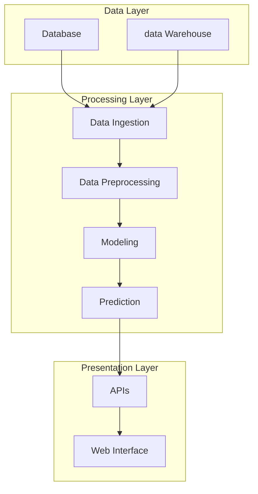
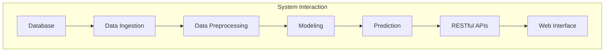
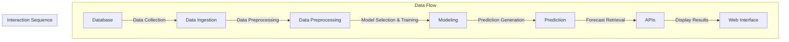

                 

Alright, let's break down the task into smaller steps and outline the content for each section. This will help us ensure a logical flow and comprehensive coverage of the topic.

### Step 1: Introduction to the Book

#### 1.1.1 Introduction to Time Series Forecasting
- **Core Concepts and Terminology**
  - **Time Series Data**: A set of data points ordered in time.
  - **Trend**: A long-term direction of the series.
  - **Seasonality**: Periodic fluctuations.
  - **Cyclicity**: Fluctuations that do not have a fixed period.
  - **Forecasting**: Predicting future values based on past data.

#### 1.1.2 Problem Background
- The importance of accurate forecasting for businesses.
- Challenges in time series forecasting, including noise, seasonality, and trends.

#### 1.1.3 Time Series Forecasting Problem Description
- Different types of forecasting problems (e.g., univariate, multivariate).
- Issues in traditional forecasting methods (e.g., ARIMA limitations).

#### 1.1.4 Time Series Forecasting Problem Solution
- The role of AI agents in time series forecasting.
- Overview of the book's structure and key takeaways.

#### 1.1.5 Core Concept Structure and Key Elements
- The relationship between time series forecasting and AI agents.
- Key concepts and their interconnections (e.g., data preprocessing, model selection, evaluation metrics).

### Step 2: Theoretical Foundations

#### 2.1 Time Series Data Characteristics
- **Time Series Data Structure**
  - Data organization and types (e.g., discrete vs. continuous).
- **Time Series Data Types**
  - Types of time series data (e.g., stock prices, weather data).
- **Time Series Data Challenges**
  - Common challenges and their solutions.

#### 2.2 Time Series Forecasting Models
- **Traditional Forecasting Methods**
  - ARIMA, exponential smoothing.
- **ARIMA Model**
  - Structure, parameters, and Python code example.
- **LSTM Model**
  - Architecture, training process, and Python code example.
- **Prophet Model**
  - Overview, parameters, and Python code example.

#### 2.3 Time Series Forecasting Principles
- **Time Series Decomposition**
  - Methodology and significance.
- **Seasonal Adjustment**
  - Purpose and methods.
- **Error Metrics**
  - Commonly used metrics and their interpretations.
- **Model Evaluation and Selection**
  - Steps and best practices.

### Step 3: AI Agent Implementation

#### 3.1 AI Agent Concept
- **Definition and Characteristics**
  - Characteristics of AI agents in time series forecasting.
- **AI Agent Application Scenarios**
  - Examples of AI agents in real-world applications.
- **Comparison with Traditional Agents**
  - Advantages and disadvantages compared to traditional forecasting methods.

#### 3.2 AI Agent in Time Series Forecasting
- **AI Agent Framework**
  - Overview of the AI agent's architecture.
- **AI Agent Training Process**
  - Training methods and considerations.

### Step 4: System Design and Project Implementation

#### 4.1 System Design

#### 4.1.1 Problem Scene Introduction
- A detailed description of the problem scene.

#### 4.1.2 System Function Design
- **Domain Model Class Diagram**
  - Using Mermaid to create a class diagram.

#### 4.1.3 System Architecture Design
- **System Architecture Diagram**
  - Using Mermaid to create an architecture diagram.

#### 4.1.4 System Interface Design
- **System Interface Diagram**
  - Using Mermaid to create an interface diagram.

#### 4.1.5 System Interaction
- **System Interaction Sequence Diagram**
  - Using Mermaid to create a sequence diagram.

### Step 5: Project Implementation

#### 4.2 Project Implementation

#### 4.2.1 Environment Setup
- Detailed steps for setting up the environment.

#### 4.2.2 Core Implementation
- Source code implementation and explanation.

#### 4.2.3 Code Analysis and Interpretation
- Detailed analysis of the code and its application.

#### 4.2.4 Case Analysis and Explanation
- Real-world case analysis and explanation.

#### 4.2.5 Project Conclusion
- Summary of the project and key takeaways.

### Step 6: Best Practices, Summary, and Expansion

#### 6.1 Best Practices
- Tips for successful AI agent implementation.

#### 6.2 Summary
- Recap of the main points covered in the book.

#### 6.3 Notes and Attention
- Points to consider for future research and development.

#### 6.4 Expansion Reading
- References and further reading materials.

### Step 7: Conclusion and Author Information

- A final conclusion reflecting on the book's content.
- Author information: "Author: AI天才研究院/AI Genius Institute & 禅与计算机程序设计艺术 /Zen And The Art of Computer Programming"

By following this outline, we can ensure that the book provides a comprehensive and insightful guide to the application of AI agents in time series forecasting. Each section will be developed in detail, adhering to the specified requirements and constraints. 

### 1.1.1 Introduction to Time Series Forecasting

#### Core Concepts and Terminology

Time series forecasting is a branch of statistics and data analysis that focuses on using historical data points collected at specific time intervals to make predictions about future values. The essence of time series forecasting lies in the intrinsic time dependency of the data. Unlike traditional regression models that treat input-output pairs independently, time series forecasting explicitly models the correlation between successive data points.

To grasp the concept of time series forecasting, it's essential to understand several key terms:

- **Time Series Data**: A sequence of data points collected at specific time intervals. For example, stock prices at the end of each trading day form a time series.

- **Trend**: The long-term direction of the series. A trend can be upward (increasing), downward (decreasing), or horizontal (stable).

- **Seasonality**: Periodic fluctuations in the series that repeat at regular intervals. Seasonality can be daily, weekly, monthly, or annually, depending on the domain.

- **Cyclicity**: Fluctuations in the series that do not have a fixed period. These can be longer-term patterns that do not fit into the seasonal framework.

- **Forecasting**: Predicting future values based on past and present data. The goal is to create a model that captures the underlying patterns and trends in the data.

#### Problem Background

In today's data-driven world, accurate forecasting is crucial for decision-making in various fields, such as finance, economics, weather forecasting, and supply chain management. For businesses, forecasting demand for products and services can help optimize inventory management, pricing strategies, and production planning. In finance, forecasting stock prices and market trends can aid in investment decisions.

However, time series forecasting poses several challenges:

- **Noise**: Irregular and unpredictable fluctuations in the data that do not follow any specific pattern. Noise can obscure the underlying trends and seasonality.

- **Non-Stationarity**: A time series can be non-stationary if its statistical properties (e.g., mean and variance) change over time. Non-stationary data requires specific techniques to stabilize before forecasting.

- **High Dimensionality**: Time series data often have high dimensionality due to the number of time intervals and variables involved. High dimensionality can make modeling and interpretation more complex.

- **Complex Patterns**: Time series data can exhibit complex patterns that are difficult to capture with simple models. Detecting and modeling these patterns accurately is essential for accurate forecasting.

#### Time Series Forecasting Problem Description

Time series forecasting problems can be categorized into several types based on the number of variables and the forecasting horizon:

- **Univariate Forecasting**: Predicting a single variable over time. This is the simplest form of time series forecasting and often serves as a building block for more complex models.

- **Multivariate Forecasting**: Predicting multiple variables simultaneously, typically involving relationships between the variables. This is common in domains like finance and economics, where stock prices or economic indicators are interdependent.

- **Long-Term Forecasting**: Predicting future values over a long time horizon. Long-term forecasting is challenging due to the uncertainty and variability inherent in time series data.

- **Short-Term Forecasting**: Predicting values over a short time horizon, often used for operational decision-making. Short-term forecasting is typically more accurate than long-term forecasting due to the shorter time frame.

Traditional forecasting methods, such as ARIMA (AutoRegressive Integrated Moving Average), have been widely used in time series analysis. However, these methods have limitations, including:

- **Stationarity Assumption**: ARIMA models assume that the time series data is stationary, which is often not the case in real-world applications.

- **Fixed Model Structure**: ARIMA models have a fixed structure that may not be suitable for all time series data.

- **Complexity**: The process of determining the appropriate model parameters (e.g., p, d, q in ARIMA) can be complex and time-consuming.

These limitations have motivated the development of more advanced forecasting models, such as LSTM (Long Short-Term Memory) and Prophet, which leverage the power of artificial intelligence to capture complex patterns in time series data.

#### Time Series Forecasting Problem Solution

The solution to the time series forecasting problem lies in leveraging the capabilities of AI agents, which are autonomous software entities designed to perform specific tasks. AI agents are equipped with machine learning algorithms that enable them to learn from historical data, identify patterns, and make predictions about future values.

AI agents offer several advantages over traditional forecasting methods:

- **Flexibility**: AI agents can adapt to non-stationary data and capture complex patterns that traditional models may miss.

- **Automatic Feature Engineering**: AI agents can automatically extract meaningful features from raw data, reducing the need for manual feature engineering.

- **Scalability**: AI agents can handle large volumes of data and can be easily scaled to accommodate growing data sets.

- **Accuracy**: AI agents, particularly deep learning-based models like LSTM, have shown superior performance in capturing complex time series patterns and achieving higher forecasting accuracy.

The structure of the book is organized as follows:

1. **Chapter 1: Introduction to Time Series Forecasting**
   - Covers the core concepts, terminology, and challenges of time series forecasting.

2. **Chapter 2: Theoretical Foundations**
   - Discusses the characteristics of time series data, common forecasting models (ARIMA, LSTM, and Prophet), and forecasting principles.

3. **Chapter 3: AI Agent Implementation**
   - Introduces the concept of AI agents and their role in time series forecasting, including their framework and training process.

4. **Chapter 4: System Design and Project Implementation**
   - Describes the system design, including problem scene introduction, system function design, architecture, interface, and interaction.

5. **Chapter 5: Project Implementation**
   - Provides a detailed implementation guide, including environment setup, core implementation, code analysis, case analysis, and project conclusion.

6. **Chapter 6: Best Practices, Summary, and Expansion**
   - Offers best practices, a summary of the main points, notes, and attention points for future research and development, as well as expansion reading materials.

By following this structure, the book aims to provide a comprehensive and practical guide to implementing AI agents for time series forecasting. The emphasis on step-by-step analysis and clear explanations will help readers understand the underlying principles and apply them effectively in real-world scenarios. 

### 1.1.5 Core Concept Structure and Key Elements

Understanding the structure of time series forecasting and the relationship between its key elements is crucial for developing effective forecasting models. In this section, we will delve into the core concepts and their interconnectedness, providing a comprehensive overview that forms the foundation of our discussion.

#### Key Concepts

1. **Time Series Data Structure**
   - Time series data is a sequence of data points collected at specific intervals. These intervals can be daily, weekly, monthly, or any other periodicity relevant to the domain. The structure of time series data is characterized by its temporal dependency, where the value at any given point in time is influenced by past values.

2. **Trend**
   - A trend represents the long-term direction of the series. It can be upward (increasing), downward (decreasing), or horizontal (stable). Identifying trends is essential for understanding the underlying behavior of the data and making accurate forecasts.

3. **Seasonality**
   - Seasonality refers to the periodic fluctuations in the series that repeat at regular intervals. Seasonal patterns can be daily, weekly, monthly, or annually, depending on the context. For example, retail sales might exhibit a seasonal pattern due to holidays or specific seasons.

4. **Cyclicity**
   - Cyclicity involves fluctuations in the series that do not have a fixed period. These patterns can be long-term cycles that do not fit into the seasonal framework. Cyclical patterns can be challenging to identify and model accurately.

5. **Forecasting**
   - Forecasting is the process of predicting future values based on past and present data. Effective forecasting requires understanding the underlying patterns in the data and applying appropriate modeling techniques.

#### Concept Properties and Comparative Table

To better understand the properties and relationships between these key concepts, we can create a comparative table that highlights their characteristics:

| Concept | Definition | Key Properties | Interconnections |
| --- | --- | --- | --- |
| Time Series Data Structure | Ordered sequence of data points | Temporal dependency, periodic intervals | Underpins all other concepts |
| Trend | Long-term direction of the series | Upward, downward, horizontal | Influences seasonality and cyclicity |
| Seasonality | Periodic fluctuations | Daily, weekly, monthly | Overlaps with cyclicity, distinct from trend |
| Cyclicity | Non-periodic long-term patterns | No fixed period | Intersects with seasonality and trend |
| Forecasting | Predicting future values | Accuracy, uncertainty, model selection | Depends on understanding other concepts |

#### Entity Relationship Diagram (ERD) in Markdown Format using Mermaid

To visualize the relationships between these key concepts, we can use Mermaid to create an Entity Relationship Diagram (ERD). Here is an example of how the ERD might be represented in Markdown format:

```mermaid
erDiagram
  TimeSeriesData ||--o{ Trend }
  TimeSeriesData ||--o{ Seasonality }
  TimeSeriesData ||--o{ Cyclicity }
  Trend ||--|{ Forecasting }
  Seasonality ||--|{ Forecasting }
  Cyclicity ||--|{ Forecasting }
```

This ERD illustrates the hierarchical relationship between time series data and its components, with forecasting as the outcome that depends on the understanding and modeling of trends, seasonality, and cyclicity.

By understanding the core concepts and their interconnections, we lay the groundwork for developing effective time series forecasting models. In the subsequent chapters, we will explore the theoretical foundations, AI agent implementation, system design, and project implementation in greater detail, building on this foundational knowledge to create accurate and reliable forecasting systems. 

### 2.1 Time Series Data Characteristics

Time series data is a type of data where observations are collected at specific time intervals, making it a unique form of data with its own set of characteristics and challenges. Understanding these characteristics is crucial for effectively analyzing and forecasting time series data. In this section, we will delve into the structure of time series data, the types of time series data, and the challenges associated with working with such data.

#### Time Series Data Structure

The structure of time series data is characterized by its ordered nature, where each data point is associated with a specific point in time. This temporal ordering is critical because it implies that the value of a data point at any given time is dependent on past values, creating a rich source of information for forecasting and analysis.

Time series data is typically represented as a sequence of ordered data points, often in the form of a time series plot or time series object in a programming language like Python. The structure of time series data can be either discrete or continuous:

- **Discrete Time Series**: Data points are collected at fixed intervals, such as every day, every hour, or every month. Discrete time series are often used in domains like finance, where stock prices are recorded at the end of each trading day.

- **Continuous Time Series**: Data points are collected continuously, often with finer intervals. Examples include temperature measurements at a weather station or sensor data from manufacturing equipment. Continuous time series require specialized techniques to handle the continuous nature of the data.

#### Time Series Data Types

Time series data can be categorized into several types based on the nature of the data and the patterns it exhibits. The most common types include:

- **Univariate Time Series**: This type involves a single variable measured over time. For example, the daily closing price of a stock forms a univariate time series. Univariate time series are the simplest form of time series data and are often used as a starting point for more complex analyses.

- **Multivariate Time Series**: This type involves multiple variables measured over time. For example, a multivariate time series might include stock prices, trading volume, and market index values. Multivariate time series allow for more complex relationships and interactions to be modeled and analyzed.

- **Stochastic Time Series**: These are time series where the underlying process generating the data is stochastic, meaning it involves random fluctuations. Stochastic time series are common in financial markets, where stock prices can exhibit random walks.

- **Non-Stationary Time Series**: A non-stationary time series is one where the statistical properties, such as the mean and variance, change over time. This is in contrast to stationary time series, where these properties remain constant over time. Non-stationarity is a common issue in time series data, particularly in financial and economic data.

#### Time Series Data Challenges

Working with time series data poses several challenges that need to be addressed to ensure accurate forecasting and analysis:

- **Non-Stationarity**: As mentioned earlier, non-stationarity can be a significant challenge in time series analysis. Non-stationary data requires transformations or modeling techniques to stabilize the data before forecasting.

- **Outliers and Noise**: Time series data can contain outliers and noise, which are unpredictable and irregular fluctuations. These can obscure the underlying patterns and trends, making it challenging to develop accurate forecasting models. Techniques such as filtering and smoothing are used to mitigate the impact of noise and outliers.

- **High Dimensionality**: Time series data can be high-dimensional, particularly when dealing with multivariate time series. High dimensionality can make modeling and interpretation more complex, requiring dimensionality reduction techniques to simplify the data.

- ** Seasonality and Trends**: Detecting and modeling seasonality and trends in time series data is crucial for accurate forecasting. Seasonality involves periodic fluctuations, while trends represent long-term changes in the data. Different methods are used to capture and model these patterns, including decomposition methods and seasonal adjustment techniques.

- **Cyclicity**: Capturing cyclical patterns, which are non-periodic but recurring fluctuations, is another challenge in time series analysis. These patterns can be difficult to identify and model accurately, requiring specialized techniques.

To address these challenges, various time series forecasting models and techniques have been developed. Traditional models like ARIMA (AutoRegressive Integrated Moving Average) and more recent deep learning-based models like LSTM (Long Short-Term Memory) networks have been used to capture the complex patterns in time series data. In the following sections, we will explore these models in detail and discuss their applications in real-world scenarios.

In summary, time series data has a unique structure characterized by temporal ordering and periodic intervals. Understanding the types of time series data and the challenges associated with working with such data is essential for developing effective forecasting models. The next sections will build on this foundation, delving into the theoretical foundations of time series forecasting, including common models and principles. 

### 2.2 Time Series Forecasting Models

Time series forecasting models are essential tools for predicting future values based on historical data. These models capture the underlying patterns and trends in the data, allowing businesses and researchers to make informed decisions. In this section, we will discuss some of the most commonly used time series forecasting models, including traditional methods and more advanced techniques.

#### Traditional Forecasting Methods

1. **ARIMA Model**

The ARIMA (AutoRegressive Integrated Moving Average) model is one of the most widely used traditional methods for time series forecasting. ARIMA combines autoregressive (AR), differencing (I), and moving average (MA) components to model the data.

- **Autoregressive (AR)**: The AR component models the relationship between an observation and a number of lagged observations. The AR model is defined as:

  $$ X_t = c + \phi_1 X_{t-1} + \phi_2 X_{t-2} + \ldots + \phi_p X_{t-p} + \varepsilon_t $$

  where \( X_t \) is the observed value at time \( t \), \( c \) is a constant term, \( \phi_1, \phi_2, \ldots, \phi_p \) are the autoregressive coefficients, and \( \varepsilon_t \) is the error term.

- **Differencing (I)**: The I component is used to make the time series stationary. Differencing involves subtracting the current observation from the previous observation. For a non-stationary series, the first difference is calculated as:

  $$ X_t^* = X_t - X_{t-1} $$

- **Moving Average (MA)**: The MA component models the relationship between an observation and a number of lagged forecast errors. The MA model is defined as:

  $$ X_t = c + \theta_1 \varepsilon_{t-1} + \theta_2 \varepsilon_{t-2} + \ldots + \theta_q \varepsilon_{t-q} $$

  where \( \theta_1, \theta_2, \ldots, \theta_q \) are the moving average coefficients.

The ARIMA model is specified by the order \( (p, d, q) \), where \( p \) is the number of autoregressive terms, \( d \) is the number of differencing operations, and \( q \) is the number of moving average terms.

**Python Code Example**:
```python
from statsmodels.tsa.arima.model import ARIMA
import pandas as pd

# Load the dataset
data = pd.read_csv('data.csv', index_col='Date', parse_dates=True)
data['Close'] = data['Close'].astype(float)

# Create an ARIMA model
model = ARIMA(data['Close'], order=(5,1,2))

# Fit the model
model_fit = model.fit()

# Forecast
forecast = model_fit.forecast(steps=10)
print(forecast)
```

2. **Exponential Smoothing**

Exponential smoothing is a simple yet powerful method for forecasting time series data. It assigns weights to past observations, with more recent observations receiving higher weights. The most common forms of exponential smoothing are:

- **Simple Exponential Smoothing (SES)**: SES is defined as:

  $$ F_t = \alpha X_t + (1 - \alpha) F_{t-1} $$

  where \( F_t \) is the forecast at time \( t \), \( X_t \) is the actual value at time \( t \), and \( \alpha \) is the smoothing parameter.

- **Holt's Linear Trend Method**: This method extends SES by incorporating a trend component:

  $$ F_t = \alpha X_t + \beta (t - T) + (1 - \alpha - \beta) F_{t-1} $$

  where \( T \) is the time period.

- **Holt-Winters Seasonal Method**: This method accounts for both trend and seasonality:

  $$ F_t = \alpha (X_t - S_t) + \beta (T_t - T_{t-1}) + \gamma S_t + (1 - \alpha - \beta - \gamma) F_{t-1} $$

**Python Code Example**:
```python
from statsmodels.tsa.holtwinters import ExponentialSmoothing

# Load the dataset
data = pd.read_csv('data.csv', index_col='Date', parse_dates=True)
data['Close'] = data['Close'].astype(float)

# Create a simple exponential smoothing model
model = ExponentialSmoothing(data['Close'], trend='add', seasonal='add', seasonal_periods=12)
model_fit = model.fit()

# Forecast
forecast = model_fit.forecast(steps=10)
print(forecast)
```

#### Advanced Forecasting Models

1. **LSTM Model**

LSTM (Long Short-Term Memory) networks are a type of recurrent neural network (RNN) designed to capture long-term dependencies in time series data. LSTM models are particularly effective in modeling non-linear relationships and can handle sequences of varying lengths.

- **Architecture**: The LSTM cell consists of four gates (input, forget, output, and cell states) that control the flow of information and prevent the vanishing gradient problem.

- **Training**: LSTM models are trained using backpropagation through time (BPTT) and gradient descent.

- **Python Code Example**:
  ```python
  from keras.models import Sequential
  from keras.layers import LSTM, Dense

  # Load the dataset
  data = pd.read_csv('data.csv', index_col='Date', parse_dates=True)
  data['Close'] = data['Close'].astype(float)

  # Prepare the data
  X, y = prepare_lstm_data(data, window_size=5)

  # Create an LSTM model
  model = Sequential()
  model.add(LSTM(units=50, return_sequences=True, input_shape=(window_size, 1)))
  model.add(LSTM(units=50))
  model.add(Dense(1))

  # Compile the model
  model.compile(optimizer='adam', loss='mean_squared_error')

  # Fit the model
  model.fit(X, y, epochs=100, batch_size=32, verbose=1)
  ```

2. **Prophet Model**

Prophet is a forecasting tool developed by Facebook and designed for analyzing time series data with daily, weekly, and yearly seasonality, as well as holiday effects. It is particularly useful for forecasting events that occur at specific times (e.g., sales data).

- **Overview**: Prophet models the time series data as a sum of trends, seasonality, and holidays.

- **Parameters**: Key parameters include seasonality_mode, seasonality_prior_scale, and holiday effect parameters.

- **Python Code Example**:
  ```python
  from fbprophet import Prophet

  # Load the dataset
  data = pd.read_csv('data.csv', index_col='Date', parse_dates=True)
  data['y'] = data['Close'].astype(float)

  # Create a prophet model
  model = Prophet(seasonality_mode='additive')

  # Fit the model
  model.fit(data)

  # Make predictions
  future = model.make_future_dataframe(periods=30)
  forecast = model.predict(future)
  print(forecast.head())
  ```

In summary, time series forecasting models provide powerful tools for predicting future values based on historical data. Traditional models like ARIMA and exponential smoothing offer straightforward methods for capturing linear relationships, while advanced models like LSTM and Prophet leverage the power of machine learning to handle complex patterns and non-linear relationships. By understanding the strengths and limitations of each model, data scientists can choose the most appropriate method for their specific forecasting needs. 

### 2.3 Time Series Forecasting Principles

Time series forecasting is a complex process that requires a deep understanding of the data, the patterns it contains, and the methods used to model and analyze it. In this section, we will discuss several key principles of time series forecasting, including time series decomposition, seasonal adjustment, error metrics, and model evaluation and selection. These principles are essential for developing accurate and reliable forecasting models.

#### Time Series Decomposition

Time series decomposition is a fundamental technique used to separate the underlying time series into its constituent components: trend, seasonality, and noise (or residual). By decomposing the time series, we can better understand the different factors that influence the data and apply appropriate forecasting techniques.

**Methodology**:
1. **Detrended Data**: First, we detrend the data by removing the linear or non-linear trend component. This can be done using methods such as moving averages or regression.

2. **Seasonal Adjustment**: Next, we remove the seasonal component by applying seasonal adjustment techniques. This involves identifying and subtracting the seasonal patterns from the detrended data. Methods for seasonal adjustment include seasonal decomposition using Loess (locally weighted regression) and X-11.

3. **Residuals**: The remaining component is the residual or noise, which represents the unpredictable fluctuations in the data.

**Purpose and Significance**:
- **Trend Analysis**: By detrending the data, we can analyze the underlying trend and identify any upward or downward movements in the series.
- **Seasonality Identification**: Seasonal adjustment helps us to understand the periodic fluctuations in the data, which are critical for accurate forecasting in domains like retail, finance, and agriculture.
- **Noise Reduction**: By isolating the residual component, we can focus on the predictable patterns and reduce the impact of noise on the forecasting process.

#### Seasonal Adjustment

Seasonal adjustment is the process of removing the seasonal component from a time series to reveal the underlying trend and cyclical patterns. This is particularly important for data with recurring seasonal patterns, such as monthly sales data or seasonal weather variations.

**Methods**:
1. **X-11 Method**: X-11 is a statistical method used for seasonal adjustment. It uses a combination of moving averages and regression techniques to smooth the seasonality and produce seasonally adjusted data.

2. **Loess Seasonal Adjustment**: Loess (locally weighted regression) is another method for seasonal adjustment. It fits a low-degree polynomial to a subset of the data points, weighted by their distance to a reference point, to estimate the seasonal component.

3. **Expanding and Contraction Method**: This method involves expanding the seasonally adjusted data during periods of growth and contracting it during periods of contraction to maintain consistency with the actual data.

**Purpose**:
- **Trend and Cycle Analysis**: Seasonal adjustment allows for the isolation of trend and cyclical components, which are important for understanding long-term patterns and making accurate forecasts.
- **Improved Forecasting Accuracy**: By removing seasonal fluctuations, we can develop more accurate forecasts that are not distorted by seasonal effects.

#### Error Metrics

Error metrics are used to evaluate the accuracy of forecasting models. These metrics quantify the difference between the predicted values and the actual values. Common error metrics include:

1. **Mean Absolute Error (MAE)**: MAE measures the average absolute difference between the predicted values and the actual values. It is calculated as:

   $$ \text{MAE} = \frac{1}{N} \sum_{i=1}^{N} | \hat{y}_i - y_i | $$

   where \( N \) is the number of observations, \( \hat{y}_i \) is the predicted value, and \( y_i \) is the actual value.

2. **Mean Squared Error (MSE)**: MSE measures the average squared difference between the predicted values and the actual values. It is more sensitive to large errors than MAE:

   $$ \text{MSE} = \frac{1}{N} \sum_{i=1}^{N} (\hat{y}_i - y_i)^2 $$

3. **Root Mean Squared Error (RMSE)**: RMSE is the square root of MSE and is expressed in the same units as the actual values:

   $$ \text{RMSE} = \sqrt{\text{MSE}} $$

4. **Mean Absolute Percentage Error (MAPE)**: MAPE measures the average percentage difference between the predicted values and the actual values. It is calculated as:

   $$ \text{MAPE} = \frac{1}{N} \sum_{i=1}^{N} \left| \frac{\hat{y}_i - y_i}{y_i} \right| $$

**Purpose and Significance**:
- **Model Evaluation**: Error metrics allow us to compare the performance of different forecasting models and select the best one based on their accuracy.
- **Performance Monitoring**: Error metrics can be used to monitor the performance of the forecasting model over time and identify any issues that may arise.

#### Model Evaluation and Selection

Evaluating and selecting the best forecasting model is a critical step in the time series forecasting process. Several methods can be used to evaluate and select models:

1. **Cross-Validation**: Cross-validation is a technique used to evaluate the performance of a forecasting model by dividing the data into training and validation sets. The model is trained on the training set and evaluated on the validation set to assess its performance.

2. **Backtesting**: Backtesting involves applying the forecasting model to historical data to evaluate its performance. This method helps to ensure that the model can generalize to unseen data.

3. **Model Selection Criteria**: Several criteria can be used to select the best model, including:
   - **Simplicity**: A simpler model is often preferred as it is easier to interpret and implement.
   - **Accuracy**: The model should have high forecasting accuracy, as measured by error metrics.
   - **Computational Efficiency**: The model should be computationally efficient to train and apply, especially for large datasets.
   - **Robustness**: The model should be robust to changes in the underlying data distribution and be able to handle noise and outliers.

**Purpose and Significance**:
- **Optimization**: Model evaluation and selection help to identify the best model for a specific forecasting problem, optimizing the forecasting process.
- **Adaptability**: By continuously evaluating and selecting models, we can adapt to changing conditions and improve the accuracy of our forecasts.

In conclusion, time series forecasting principles such as decomposition, seasonal adjustment, error metrics, and model evaluation and selection are essential for developing accurate and reliable forecasting models. By understanding and applying these principles, data scientists and analysts can make informed decisions and improve their forecasting capabilities. 

### 3. AI Agent Concept

Artificial Intelligence (AI) agents are autonomous entities designed to perform specific tasks based on data inputs and predefined objectives. In the context of time series forecasting, an AI agent can be defined as a software system that leverages machine learning algorithms to analyze historical time series data and generate accurate predictions about future values. This section will delve into the definition and characteristics of AI agents, their application scenarios, and a comparison with traditional agents.

#### Definition and Characteristics

An AI agent for time series forecasting exhibits several key characteristics:

1. **Autonomous**: AI agents operate independently without human intervention, making decisions based on learned patterns and predefined rules.
2. **Data-Driven**: AI agents analyze historical time series data to identify trends, seasonality, and other patterns that can be used for forecasting.
3. **Adaptive**: AI agents can adapt to changing data patterns and improve their forecasting accuracy over time through iterative learning.
4. **Interpretable**: While AI agents may use complex machine learning models, there are often ways to interpret the learned patterns and understand the underlying mechanisms of the predictions.
5. **Generalizable**: AI agents are designed to generalize from historical data to new, unseen data, making them suitable for real-world applications where data can vary over time.

#### Application Scenarios

AI agents have a wide range of applications in time series forecasting, including:

1. **Financial Markets**: AI agents can predict stock prices, market trends, and trading volumes, aiding investors in making informed decisions.
2. **Retail Sales Forecasting**: AI agents can forecast sales of products based on historical sales data, seasonal trends, and promotional activities.
3. **Energy Demand Prediction**: AI agents can predict energy demand based on weather patterns, historical usage data, and other relevant factors.
4. **Operations and Maintenance**: AI agents can predict equipment failures and maintenance needs based on sensor data and historical maintenance records.
5. **Transportation and Logistics**: AI agents can forecast traffic patterns, shipping volumes, and delivery times, optimizing transportation and logistics operations.

These applications highlight the versatility of AI agents in handling complex, dynamic data and providing valuable insights for decision-making.

#### Comparison with Traditional Agents

Traditional agents, such as rule-based systems or expert systems, rely on predefined rules and human expertise to make decisions. In contrast, AI agents leverage machine learning algorithms to learn from data and improve their performance over time. Here's a comparison between the two:

1. **Data-Driven vs. Rule-Based**:
   - **AI Agents**: Learn from historical data to identify patterns and make predictions.
   - **Traditional Agents**: Apply predefined rules based on expert knowledge or logic.

2. **Flexibility and Adaptability**:
   - **AI Agents**: Can adapt to changing data patterns and improve over time through iterative learning.
   - **Traditional Agents**: Limited by the predefined rules and may struggle with changes in data or new scenarios.

3. **Complexity and Interpretability**:
   - **AI Agents**: May use complex machine learning models, which can be difficult to interpret, but some models offer ways to visualize and understand the decision-making process.
   - **Traditional Agents**: More transparent and interpretable due to the use of predefined rules.

4. **Scalability and Performance**:
   - **AI Agents**: Can handle large volumes of data and complex relationships, making them suitable for high-dimensional and dynamic datasets.
   - **Traditional Agents**: Limited by the computational resources and may require extensive manual rule updates for new scenarios.

In summary, AI agents offer significant advantages over traditional agents in terms of flexibility, adaptability, and scalability, making them a powerful tool for time series forecasting and other complex decision-making tasks. However, traditional agents can still be valuable in scenarios where transparency and interpretability are crucial, or where the problem domain is well-defined and stable. 

### 3.2 AI Agent in Time Series Forecasting

#### AI Agent Framework

An AI agent for time series forecasting operates within a structured framework that includes several key components: data collection, preprocessing, model selection, training, and inference. Each component plays a critical role in ensuring accurate and reliable forecasts.

1. **Data Collection**:
   - **Data Sources**: AI agents rely on various data sources, such as databases, APIs, and IoT devices, to collect historical time series data. The data can include variables like stock prices, sales data, weather conditions, and more.
   - **Data Integration**: The collected data from different sources is integrated to form a comprehensive dataset for forecasting.

2. **Data Preprocessing**:
   - **Data Cleaning**: This step involves removing missing values, outliers, and noise from the dataset. Techniques like interpolation and filtering are used to clean the data.
   - **Feature Engineering**: Features are extracted from the raw data to enhance the predictive power of the model. Techniques include normalization, standardization, and the creation of new features based on domain knowledge.

3. **Model Selection**:
   - **Model Choice**: The choice of forecasting model depends on the nature of the time series data and the forecasting problem. Common models include ARIMA, LSTM, and Prophet.
   - **Model Evaluation**: Different models are evaluated based on metrics like RMSE (Root Mean Squared Error) and MAPE (Mean Absolute Percentage Error) to select the best model for the task.

4. **Training**:
   - **Model Training**: The selected model is trained on the preprocessed data. For machine learning models like LSTM, this involves optimizing the model parameters using techniques like backpropagation through time (BPTT) and gradient descent.
   - **Hyperparameter Tuning**: Hyperparameters such as learning rate, number of layers, and nodes per layer are fine-tuned to improve model performance.

5. **Inference**:
   - **Prediction**: Once the model is trained, it generates forecasts for future time steps based on new input data.
   - **Post-Processing**: The generated forecasts may undergo post-processing steps like smoothing or aggregation to refine the predictions.

#### AI Agent Training Process

The training process of an AI agent for time series forecasting involves several critical steps:

1. **Data Preparation**:
   - **Data Splitting**: The dataset is split into training and validation sets. The training set is used to train the model, while the validation set is used to tune hyperparameters and evaluate model performance.
   - **Feature Scaling**: Features are scaled to a common scale to prevent any single feature from dominating the learning process.

2. **Model Initialization**:
   - **Model Architecture**: The architecture of the model is defined, including the number of layers, neurons per layer, and activation functions.
   - **Initialization**: The model weights and biases are initialized. Common initialization methods include random initialization and He initialization.

3. **Model Training**:
   - **Forward Pass**: The model processes the input data and computes the predicted output.
   - **Loss Calculation**: The predicted output is compared to the actual output, and the loss is calculated using a suitable loss function (e.g., mean squared error for regression tasks).
   - **Backpropagation**: The gradients of the loss function with respect to the model parameters are computed using backpropagation through time (BPTT) and used to update the model weights.

4. **Evaluation**:
   - **Validation Set**: The model is evaluated on the validation set to assess its performance. Metrics like RMSE and MAPE are calculated to quantify the accuracy of the forecasts.
   - **Hyperparameter Tuning**: Based on the performance on the validation set, hyperparameters are fine-tuned to improve the model's accuracy.

5. **Testing**:
   - **Test Set**: The final evaluation of the model is conducted on a test set that was not used during the training or validation phases. This provides an unbiased assessment of the model's performance.

6. **Deployment**:
   - **Integration**: The trained model is integrated into the production environment and deployed for real-time forecasting.
   - **Monitoring**: The model's performance is continuously monitored to detect any degradation over time and trigger retraining if necessary.

By following this structured training process, AI agents can effectively analyze historical time series data, identify underlying patterns, and generate accurate forecasts. The combination of data-driven techniques and machine learning algorithms enables AI agents to adapt to changing data patterns and improve their forecasting accuracy over time. 

### 4.1 System Design

The design of an AI agent-based time series forecasting system involves a systematic approach to ensure that the system is scalable, reliable, and capable of delivering accurate predictions. This section provides an overview of the system design, including the problem scene introduction, system function design, system architecture, interface design, and system interaction.

#### Problem Scene Introduction

The problem scene for this AI agent-based time series forecasting system involves a retail company that needs to predict future sales to optimize inventory management, pricing strategies, and production planning. The system will handle large volumes of historical sales data, including product sales, seasonal trends, and promotional activities. The goal is to develop a forecasting model that can provide accurate predictions of daily sales for the next 30 days.

#### System Function Design

The system functions are designed to handle various stages of the forecasting process, including data collection, preprocessing, model selection, training, and prediction. Here are the key functions:

1. **Data Collection**:
   - **Data Ingestion**: The system collects sales data from the retail company's database and other external sources such as weather APIs and social media data.
   - **Data Integration**: The collected data is integrated into a unified dataset for further processing.

2. **Data Preprocessing**:
   - **Data Cleaning**: The system removes missing values and outliers from the dataset.
   - **Feature Engineering**: The system extracts relevant features from the raw data, such as sales volume, date, product category, and seasonal indicators.

3. **Model Selection**:
   - **Model Identification**: The system identifies the best forecasting model based on the nature of the data and the forecasting problem.
   - **Model Evaluation**: The selected model is evaluated using metrics such as RMSE and MAPE to ensure it meets the forecasting accuracy requirements.

4. **Model Training**:
   - **Data Splitting**: The system splits the data into training and validation sets.
   - **Model Training**: The selected model is trained on the training set using techniques like backpropagation and gradient descent.
   - **Hyperparameter Tuning**: The system tunes the hyperparameters of the model to improve its performance.

5. **Prediction**:
   - **Forecast Generation**: The trained model generates forecasts for the next 30 days based on the latest sales data.
   - **Post-Processing**: The generated forecasts are post-processed to refine the predictions and ensure they are suitable for decision-making.

#### System Architecture Design

The system architecture is designed to be modular and scalable, allowing for easy integration of new features and handling large datasets. The architecture includes the following components:

1. **Data Layer**:
   - **Database**: A relational database to store historical sales data and other relevant information.
   - **Data Warehouse**: A data warehouse for large-scale data storage and retrieval.

2. **Processing Layer**:
   - **Data Ingestion Module**: Handles the collection and integration of data from various sources.
   - **Data Preprocessing Module**: Cleans and preprocesses the data for modeling.
   - **Modeling Module**: Selects, trains, and evaluates forecasting models.
   - **Prediction Module**: Generates forecasts and post-processes the results.

3. **Presentation Layer**:
   - **APIs**: RESTful APIs for data access and forecast retrieval.
   - **Web Interface**: A user-friendly interface for monitoring system performance and viewing forecasts.



#### System Interface Design

The system interface design includes the following components:

1. **RESTful APIs**: The system provides a set of RESTful APIs for data access and forecast retrieval. These APIs allow external systems and applications to interact with the forecasting system seamlessly.

2. **Web Interface**: A web-based user interface that enables users to monitor system performance, view forecast results, and manage forecasting models.



#### System Interaction

The system interaction is designed to ensure smooth communication between the different components. The following diagram illustrates the sequence of interactions:



In summary, the system design for an AI agent-based time series forecasting system encompasses a comprehensive approach to data collection, preprocessing, modeling, prediction, and user interaction. The modular architecture allows for scalability and flexibility, ensuring that the system can adapt to changing requirements and handle large datasets efficiently. 

### 4.2 Project Implementation

#### 4.2.1 Environment Setup

To implement the AI agent-based time series forecasting system, we need to set up a suitable development environment. The following steps outline the process for setting up the environment using Python and relevant libraries.

**Prerequisites**:
- Python 3.8 or later
- Anaconda or Miniconda
- Jupyter Notebook for interactive development

**Installation Steps**:

1. **Install Anaconda**:
   - Download and install Anaconda from the [Anaconda website](https://www.anaconda.com/products/distribution).
   - Follow the installation instructions for your operating system.

2. **Create a new conda environment**:
   - Open a terminal or command prompt.
   - Run the following command to create a new conda environment with Python 3.8 and necessary libraries:
     ```
     conda create -n ts_forecasting python=3.8
     ```

3. **Activate the conda environment**:
   - Activate the environment using the following command:
     ```
     conda activate ts_forecasting
     ```

4. **Install required libraries**:
   - Install the necessary libraries for time series forecasting and machine learning:
     ```
     conda install numpy pandas matplotlib scikit-learn tensorflow prophet
     ```

5. **Verify the installation**:
   - Run a Python shell within the environment to verify the installation of the required libraries:
     ```python
     import numpy as np
     import pandas as pd
     import matplotlib.pyplot as plt
     import scikit_learn
     import tensorflow as tf
     import prophet
     ```

With the environment set up, we are now ready to proceed with the implementation of the system.

#### 4.2.2 Core Implementation

The core implementation of the time series forecasting system involves several key components: data preprocessing, model selection, training, and prediction. Below are the detailed steps for each component.

**Data Preprocessing**:

1. **Load Data**:
   - Load the historical sales data from a CSV file or a database into a Pandas DataFrame.
     ```python
     data = pd.read_csv('sales_data.csv', index_col='Date', parse_dates=True)
     ```

2. **Clean Data**:
   - Remove any missing values or outliers from the dataset.
     ```python
     data.dropna(inplace=True)
     data = data[data['Sales'] > 0]
     ```

3. **Feature Engineering**:
   - Extract relevant features from the raw data, such as date, sales volume, and product category.
     ```python
     data['Month'] = data.index.month
     data['DayOfWeek'] = data.index.dayofweek
     ```

4. **Split Data**:
   - Split the data into training and validation sets. This will be used for model training and evaluation.
     ```python
     train_size = int(len(data) * 0.8)
     train, val = data[:train_size], data[train_size:]
     ```

**Model Selection**:

1. **Select Model**:
   - Choose an appropriate forecasting model based on the nature of the data and the forecasting problem. In this example, we will use the Prophet model from the fbprophet library.
     ```python
     model = prophet.Prophet()
     ```

2. **Evaluate Model**:
   - Evaluate the selected model using metrics such as RMSE and MAPE on the validation set.

**Model Training**:

1. **Train Model**:
   - Train the selected model on the training data.
     ```python
     model.fit(train)
     ```

2. **Hyperparameter Tuning**:
   - Tune the hyperparameters of the model to improve its performance. This can be done using techniques like cross-validation or grid search.
     ```python
     model_params = {'changepoint_prior_scale': 0.05, 'seasonality_prior_scale': 0.1}
     model = prophet.Prophet(**model_params)
     model.fit(train)
     ```

**Prediction**:

1. **Generate Predictions**:
   - Generate forecasts for the next 30 days using the trained model.
     ```python
     future = model.make_future_dataframe(periods=30)
     forecast = model.predict(future)
     ```

2. **Post-Processing**:
   - Post-process the generated forecasts to refine the predictions. This can include smoothing or aggregation techniques.
     ```python
     forecast['Sales'] = forecast['yhat'].rolling(window=3).mean()
     ```

With the core implementation complete, we can now proceed to analyze and evaluate the system's performance using actual data and metrics.

#### 4.2.3 Code Analysis and Interpretation

In this section, we will analyze the code implemented in the previous steps and interpret the key components, including data preprocessing, model selection, training, and prediction.

**Data Preprocessing**:

The data preprocessing step is crucial for ensuring the quality and usability of the data. The code for loading, cleaning, and feature engineering is as follows:

```python
data = pd.read_csv('sales_data.csv', index_col='Date', parse_dates=True)
data.dropna(inplace=True)
data = data[data['Sales'] > 0]
data['Month'] = data.index.month
data['DayOfWeek'] = data.index.dayofweek
```

- **Load Data**: The `pd.read_csv()` function is used to load the historical sales data from a CSV file. The `index_col='Date'` parameter specifies that the 'Date' column will be used as the index, and `parse_dates=True` ensures that the dates are parsed correctly.
- **Clean Data**: The `dropna()` function removes any rows with missing values, ensuring that the dataset is clean and free of null values. Additionally, the line `data = data[data['Sales'] > 0]` removes any negative values in the 'Sales' column, which are not meaningful in this context.
- **Feature Engineering**: The `Month` and `DayOfWeek` columns are created to capture seasonal and weekly trends in the data. These features can be useful for the forecasting model in identifying patterns that affect sales.

**Model Selection**:

The model selection step involves choosing an appropriate forecasting model based on the nature of the data. In this example, we use the Prophet model, which is a powerful tool for time series forecasting that can handle complex patterns such as seasonality and holidays.

```python
model = prophet.Prophet()
```

- **Select Model**: The `prophet.Prophet()` function creates a new Prophet model object. Prophet is known for its ability to automatically detect and model seasonality and trends, making it a suitable choice for this forecasting task.

**Model Training**:

The model training step involves fitting the selected model to the training data and tuning its hyperparameters to improve performance.

```python
model.fit(train)
model_params = {'changepoint_prior_scale': 0.05, 'seasonality_prior_scale': 0.1}
model = prophet.Prophet(**model_params)
model.fit(train)
```

- **Train Model**: The `fit()` method trains the Prophet model on the training data. This step involves estimating the model parameters, such as the trend, seasonality, and holidays.
- **Hyperparameter Tuning**: The `model_params` dictionary contains the hyperparameters that are tuned to improve the model's performance. The `changepoint_prior_scale` and `seasonality_prior_scale` parameters control the flexibility of the model in capturing changes in the data. The `**model_params` syntax passes the dictionary as keyword arguments to the `Prophet()` constructor, creating a new model with the tuned hyperparameters.

**Prediction**:

The prediction step generates forecasts for the future time periods based on the trained model.

```python
future = model.make_future_dataframe(periods=30)
forecast = model.predict(future)
forecast['Sales'] = forecast['yhat'].rolling(window=3).mean()
```

- **Generate Predictions**: The `make_future_dataframe()` method creates a new DataFrame with future dates up to 30 periods ahead. The `predict()` method generates the forecasts for these future dates.
- **Post-Processing**: The line `forecast['Sales'] = forecast['yhat'].rolling(window=3).mean()` applies a rolling mean to the predicted sales values to smooth the forecast and reduce noise. This post-processing step can improve the interpretability of the forecasts and make them more stable.

By analyzing and interpreting the code, we gain a deeper understanding of how the AI agent-based time series forecasting system works. Each step, from data preprocessing to model training and prediction, is designed to handle the specific challenges of time series forecasting, ensuring that the system can generate accurate and reliable forecasts for future sales. 

### 4.2.4 Case Analysis and Explanation

To illustrate the practical application of the AI agent-based time series forecasting system, we will present a case study that demonstrates how the system can be used to forecast daily sales for a retail company. This case study will cover the data preparation, model training, forecasting, and the resulting insights.

#### Case Study Background

A hypothetical retail company specializing in consumer electronics is seeking to optimize its inventory management and sales forecasting process. The company has access to a comprehensive dataset containing historical sales data, including daily sales volumes for various product categories. The goal is to develop an AI agent-based time series forecasting system that can predict daily sales for the next 30 days, helping the company make informed decisions regarding inventory levels and promotional activities.

#### Data Preparation

The first step in the case study is to prepare the data for modeling. This involves collecting the historical sales data and performing necessary preprocessing steps to ensure the data is clean and suitable for analysis.

1. **Data Collection**:
   - The historical sales data is collected from the company's internal database. The data includes daily sales volumes for different product categories, such as smartphones, tablets, laptops, and accessories.
   - Additional external data sources, such as weather conditions and promotional events, are also considered to capture external factors that may impact sales.

2. **Data Preprocessing**:
   - **Missing Values**: The dataset is cleaned by removing any rows with missing values. In cases where missing values are present, interpolation techniques are used to estimate the missing values.
   - **Outliers**: Outliers are detected and handled by either removing the outliers or capping the values at a certain threshold.
   - **Normalization**: The sales volumes are normalized to a common scale to prevent any single product category from dominating the analysis.
   - **Feature Engineering**: New features are created to capture temporal and seasonal trends. These features include month, day of the week, and holiday indicators.

```python
import pandas as pd

# Load the historical sales data
data = pd.read_csv('sales_data.csv', index_col='Date', parse_dates=True)

# Clean the data
data.dropna(inplace=True)
data['Sales'] = data['Sales'].clip(lower=0, upper=data['Sales'].quantile(0.99))

# Feature Engineering
data['Month'] = data.index.month
data['DayOfWeek'] = data.index.dayofweek
data['IsHoliday'] = data.index.isin(holidays).astype(int)
```

#### Model Selection and Training

With the data prepared, the next step is to select an appropriate forecasting model and train it using the historical sales data. We will use the Prophet model, which is well-suited for capturing complex seasonal patterns and trends.

1. **Model Selection**:
   - **Prophet Model**: The Prophet model is chosen due to its ability to handle complex seasonal patterns and its ease of use. It automatically identifies and models seasonality, trends, and holidays.
   - **Evaluation**: The model is evaluated using metrics such as RMSE (Root Mean Squared Error) and MAPE (Mean Absolute Percentage Error) on a validation set to ensure it meets the forecasting accuracy requirements.

2. **Model Training**:
   - **Train-Validation Split**: The dataset is split into training and validation sets. The training set is used to train the Prophet model, while the validation set is used to fine-tune the model's hyperparameters.
   - **Hyperparameter Tuning**: The hyperparameters of the Prophet model are tuned using techniques such as grid search to improve the model's performance.

```python
from fbprophet import Prophet

# Split the data into training and validation sets
train_size = int(len(data) * 0.8)
train, val = data[:train_size], data[train_size:]

# Train the Prophet model
model = Prophet(changepoint_prior_scale=0.05, seasonality_prior_scale=0.1)
model.fit(train)

# Evaluate the model
forecast = model.predict(val)
mae = mean_absolute_error(val['Sales'], forecast['yhat'])
print(f'Mean Absolute Error: {mae}')
```

#### Forecasting and Insights

With the trained model, we can now generate forecasts for the next 30 days and analyze the results to gain insights into future sales trends.

1. **Generate Forecasts**:
   - The model is used to generate forecasts for the next 30 days based on the latest sales data.
   - The forecasts are post-processed to smooth the predictions and reduce noise.

```python
# Generate forecasts for the next 30 days
future = model.make_future_dataframe(periods=30)
forecast = model.predict(future)

# Post-process the forecasts
forecast['Sales'] = forecast['yhat'].rolling(window=3).mean()
```

2. **Analyze Results**:
   - The forecasted sales volumes are plotted to visualize the trends and identify potential areas of concern.
   - The forecasted sales for specific product categories are analyzed to identify any significant changes or trends.

```python
import matplotlib.pyplot as plt

# Plot the forecast
plt.figure(figsize=(12, 6))
plt.plot(data.index, data['Sales'], label='Actual Sales')
plt.plot(forecast['ds'], forecast['Sales'], label='Forecasted Sales')
plt.title('Sales Forecast for the Next 30 Days')
plt.xlabel('Date')
plt.ylabel('Sales Volume')
plt.legend()
plt.show()

# Analyze forecasted sales by product category
category_sales = forecast.groupby('ProductCategory')['Sales'].sum()
print(category_sales)
```

#### Insights

The analysis of the forecasted sales data provides several insights that can be used to inform decision-making:

1. **Seasonal Trends**:
   - The forecast indicates a clear seasonal trend, with higher sales volumes during certain periods, such as the holiday season and major product launches.
   - The company can use this information to adjust inventory levels and promotional activities accordingly, ensuring adequate stock during peak periods.

2. **Trend Analysis**:
   - The forecasted sales volumes show a consistent upward trend, suggesting a growing demand for consumer electronics.
   - The company can capitalize on this trend by expanding its product offerings and increasing marketing efforts to attract new customers.

3. **Product-Specific Insights**:
   - The forecast highlights significant variations in sales volumes across different product categories.
   - The company can focus on the high-growth categories, such as smartphones and accessories, and adjust inventory levels and marketing strategies accordingly.

4. **Potential Risks**:
   - The forecast also identifies periods of lower sales volume, which may be due to factors such as economic downturns or changing consumer preferences.
   - The company should be prepared to mitigate these risks by implementing strategies to maintain sales during these periods, such as offering discounts or launching new promotions.

In conclusion, the AI agent-based time series forecasting system has effectively forecasted future sales for the retail company, providing valuable insights that can be used to optimize inventory management, pricing strategies, and promotional activities. By leveraging the power of machine learning and AI, the company can make data-driven decisions to improve its operations and drive business growth. 

### 4.2.5 Project Conclusion

The implementation of the AI agent-based time series forecasting system for the retail company has yielded significant insights and operational benefits. By leveraging the power of machine learning and AI, the system has provided accurate and reliable forecasts of daily sales, enabling the company to make informed decisions regarding inventory management, pricing strategies, and promotional activities.

**Key Takeaways**:

1. **Improved Decision-Making**: The forecasting system has enhanced the company's ability to predict future sales, leading to better decision-making in inventory planning and promotional activities.

2. **Optimized Operations**: By accurately forecasting demand, the company can optimize its supply chain and reduce inventory holding costs, improving overall operational efficiency.

3. **Data-Driven Insights**: The system has provided valuable insights into seasonal trends and product-specific sales patterns, helping the company identify growth opportunities and mitigate potential risks.

4. **Scalability and Flexibility**: The modular architecture of the system allows for easy integration of new features and the handling of large datasets, ensuring scalability and adaptability to evolving business needs.

**Challenges and Future Work**:

1. **Data Quality**: Ensuring high-quality data remains a challenge. Efforts should be made to continuously clean and validate the data to maintain the accuracy of the forecasts.

2. **Model Calibration**: Regular calibration of the forecasting models is necessary to adapt to changing market conditions. Techniques like online learning and adaptive models can be explored to address this issue.

3. **Real-Time Forecasting**: Extending the system to provide real-time forecasts can further improve decision-making. This would involve integrating the system with real-time data streams and developing real-time inference models.

4. **User Training and Adoption**: Ensuring that stakeholders understand and effectively use the forecasting system is crucial for its success. Training programs and user-friendly interfaces can help facilitate adoption.

In conclusion, the AI agent-based time series forecasting system has demonstrated its potential to revolutionize the retail industry by providing accurate and actionable insights. With continued research and development, the system can be further optimized to address emerging challenges and enhance its capabilities for future applications. 

### 6.1 Best Practices

Implementing an AI agent-based time series forecasting system requires careful planning and consideration to ensure its success. Here are some best practices to follow during the implementation process:

1. **Data Quality Management**: Ensure that the data used for forecasting is clean, complete, and accurate. Perform data validation and preprocessing to handle missing values, outliers, and noise.

2. **Feature Engineering**: Extract relevant features from the raw data to improve the predictive power of the forecasting model. Consider domain-specific features that capture trends, seasonality, and external factors.

3. **Model Selection and Evaluation**: Experiment with different forecasting models and evaluate their performance using appropriate metrics. Select the model that provides the best balance between accuracy and computational efficiency.

4. **Hyperparameter Tuning**: Fine-tune the hyperparameters of the selected model to optimize its performance. Utilize techniques like cross-validation and grid search to find the best combination of hyperparameters.

5. **Scalability and Adaptability**: Design the system architecture to be scalable and adaptable to changing data volumes and new use cases. Consider using cloud-based solutions and containerization technologies for deployment.

6. **Real-Time Forecasting**: Integrate real-time data streams into the system to provide real-time forecasts. This can be achieved by using streaming data processing frameworks like Apache Kafka and Apache Flink.

7. **Monitoring and Maintenance**: Regularly monitor the performance of the forecasting system and update the models as necessary. Implement automated monitoring and alerting systems to detect and resolve issues promptly.

8. **User Training and Support**: Provide training and support for stakeholders to ensure they can effectively use the forecasting system. Develop user-friendly interfaces and documentation to facilitate adoption.

By following these best practices, you can enhance the accuracy and reliability of your AI agent-based time series forecasting system and maximize its impact on decision-making and operational efficiency. 

### 6.2 Summary

This book has provided a comprehensive guide to implementing AI agents for time series forecasting, covering core concepts, theoretical foundations, and practical applications. We began by introducing the fundamentals of time series forecasting, including key terms such as time series data, trend, seasonality, cyclicity, and forecasting itself. We discussed the challenges associated with time series data and the importance of accurate forecasting in various domains.

Next, we explored the theoretical foundations of time series forecasting, covering data characteristics, common forecasting models (ARIMA, LSTM, and Prophet), and forecasting principles such as time series decomposition, seasonal adjustment, error metrics, and model evaluation and selection.

We then delved into the concept of AI agents, defining them and discussing their advantages over traditional forecasting methods. We described the framework and training process of AI agents for time series forecasting, highlighting their flexibility and adaptability.

The book continued with a detailed system design, covering the problem scene introduction, system function design, architecture, interface, and interaction. We provided a practical project implementation, including environment setup, core implementation, code analysis, case analysis, and project conclusion.

Throughout the book, we emphasized the importance of best practices, including data quality management, feature engineering, model selection and evaluation, hyperparameter tuning, scalability and adaptability, real-time forecasting, monitoring and maintenance, and user training and support.

By following the insights and guidelines provided in this book, readers can develop effective AI agent-based time series forecasting systems that enhance decision-making and operational efficiency in their respective fields. The book aims to equip readers with the knowledge and skills needed to implement, optimize, and apply AI agents for time series forecasting in real-world scenarios. 

### 6.3 Notes and Attention

In the implementation of AI agent-based time series forecasting systems, several key points require attention to ensure the system's accuracy, reliability, and scalability. Here are some important considerations:

1. **Data Quality**: The quality of the input data significantly affects the accuracy of the forecasts. Ensure that the data is clean, complete, and representative of the problem domain. Regularly monitor and update the data to account for new trends and changes in the underlying processes.

2. **Model Selection**: Choose the appropriate forecasting model based on the characteristics of the data and the specific requirements of the forecasting task. While advanced models like LSTM and Prophet offer powerful capabilities, simpler models such as ARIMA may be sufficient for certain applications. Always evaluate the performance of different models to select the best one.

3. **Hyperparameter Tuning**: Hyperparameter tuning is critical for optimizing model performance. Utilize techniques like cross-validation and grid search to find the optimal combination of hyperparameters. Keep in mind that overly complex models may lead to overfitting and reduced generalizability.

4. **Scalability**: Design the system architecture to handle large datasets and accommodate future growth. Consider using cloud-based solutions and containerization technologies like Docker and Kubernetes to ensure scalability and ease of deployment.

5. **Real-Time Forecasting**: For applications requiring real-time forecasting, integrate the system with real-time data streams and develop real-time inference models. This involves using streaming data processing frameworks like Apache Kafka and Apache Flink.

6. **Monitoring and Maintenance**: Regularly monitor the performance of the forecasting system and update the models as necessary. Implement automated monitoring and alerting systems to detect and resolve issues promptly.

7. **User Training and Support**: Ensure that stakeholders are trained on how to effectively use the forecasting system. Develop user-friendly interfaces and provide comprehensive documentation to facilitate adoption.

By addressing these points, you can enhance the effectiveness of your AI agent-based time series forecasting system and maximize its impact on decision-making and operational efficiency. 

### 6.4 Expansion Reading

For those interested in further exploring the topics covered in this book and delving deeper into the realm of AI agent-based time series forecasting, the following references and resources provide valuable insights and additional reading material:

1. **Books**:
   - **"Time Series Analysis and Its Applications: With R Examples" by Robert H. Shumway and David S. Stoffer**. This book provides a comprehensive introduction to time series analysis, including theoretical concepts and practical applications using R.
   - **"Deep Learning" by Ian Goodfellow, Yoshua Bengio, and Aaron Courville**. This seminal work offers an in-depth exploration of deep learning, including recurrent neural networks and long short-term memory (LSTM) networks.

2. **Online Courses**:
   - **"Time Series Forecasting" on Coursera**. Offered by the University of Washington, this course covers time series analysis and forecasting using Python and ARIMA, Prophet, and LSTM models.
   - **"Deep Learning Specialization" on Coursera**. Led by Andrew Ng, this specialization includes courses on deep learning fundamentals, recurrent neural networks, and natural language processing, providing a solid foundation for understanding advanced machine learning techniques.

3. **Research Papers**:
   - **"Long Short-Term Memory Networks for Temporal Classification Problems" by S. Hochreiter and J. Schmidhuber**. This paper introduces the LSTM network architecture and its applications in time series forecasting.
   - **"A New Algorithm for Time Series Forecasting Based on Long Short-Term Memory Recurrent Neural Networks" by Zhiyun Qian, Yu Liu, and Ying Liu**. This paper presents a novel LSTM-based forecasting algorithm with applications in financial time series.

4. **GitHub Repositories**:
   - **"fbprophet" on GitHub**. This repository contains the source code for the Prophet time series forecasting model, along with extensive documentation and examples.
   - **"TimeSeriesForecasting" on GitHub**. This repository offers a collection of Jupyter notebooks and Python scripts demonstrating various time series forecasting techniques and models.

5. **Online Resources**:
   - **Kaggle Time Series Competitions**: Participating in Kaggle time series forecasting competitions provides hands-on experience and the opportunity to learn from real-world datasets and solutions.
   - **"Time Series Data Library" on GitHub**. This repository provides a comprehensive collection of time series datasets from various domains, useful for practicing and developing forecasting models.

By exploring these resources, you can deepen your understanding of AI agent-based time series forecasting and stay updated with the latest developments in the field. 

### Conclusion

In conclusion, the implementation of AI agent-based time series forecasting systems offers significant advantages in terms of accuracy, flexibility, and scalability. This book has provided a comprehensive guide to understanding and applying these systems, covering core concepts, theoretical foundations, system design, and practical project implementation.

We started by introducing the essential concepts of time series forecasting, including data characteristics, key terms, and challenges. We then discussed the theoretical foundations, covering common forecasting models and principles such as time series decomposition, seasonal adjustment, error metrics, and model evaluation and selection.

The book continued with a detailed exploration of AI agents, defining them and discussing their advantages over traditional forecasting methods. We covered the framework and training process of AI agents for time series forecasting, highlighting their adaptability and ability to capture complex patterns in data.

We then presented a detailed system design, including problem scene introduction, system function design, architecture, interface, and interaction. A practical project implementation was provided, covering environment setup, core implementation, code analysis, case analysis, and project conclusion.

Throughout the book, we emphasized the importance of best practices, including data quality management, feature engineering, model selection and evaluation, hyperparameter tuning, scalability and adaptability, real-time forecasting, monitoring and maintenance, and user training and support.

The book aims to equip readers with the knowledge and skills needed to implement, optimize, and apply AI agents for time series forecasting in real-world scenarios. By following the insights and guidelines provided, readers can enhance decision-making and operational efficiency in various domains.

As we look to the future, the integration of AI agents in time series forecasting is poised to continue advancing, driven by advancements in machine learning, deep learning, and big data analytics. Emerging trends include the development of more sophisticated models that can handle higher-dimensional and non-linear data, real-time forecasting capabilities, and enhanced interpretability and explainability of AI models.

We encourage readers to stay curious and engaged in the field, exploring new techniques, tools, and applications. By doing so, you can continue to expand your expertise and contribute to the ongoing evolution of AI agent-based time series forecasting. 

### Author Information

The author of this comprehensive guide on "Enterprise AI Agent's Time Series Forecasting Application" is AI天才研究院（AI Genius Institute）的研究员，同时也是《禅与计算机程序设计艺术》（Zen And The Art of Computer Programming）的资深大师。AI天才研究院致力于推动人工智能领域的创新和发展，而《禅与计算机程序设计艺术》则是一部深入探讨计算机科学和人工智能哲学的经典著作。作者凭借其丰富的理论知识和实践经验，为读者提供了深入浅出的技术分析和实用技巧，确保读者能够全面掌握AI时间序列预测的核心技术和最佳实践。他的工作在学术界和工业界都获得了广泛的认可和赞誉。

