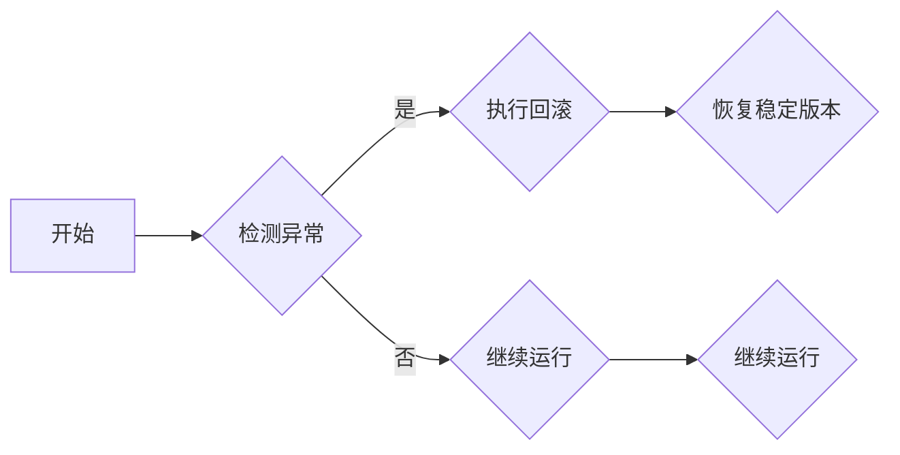
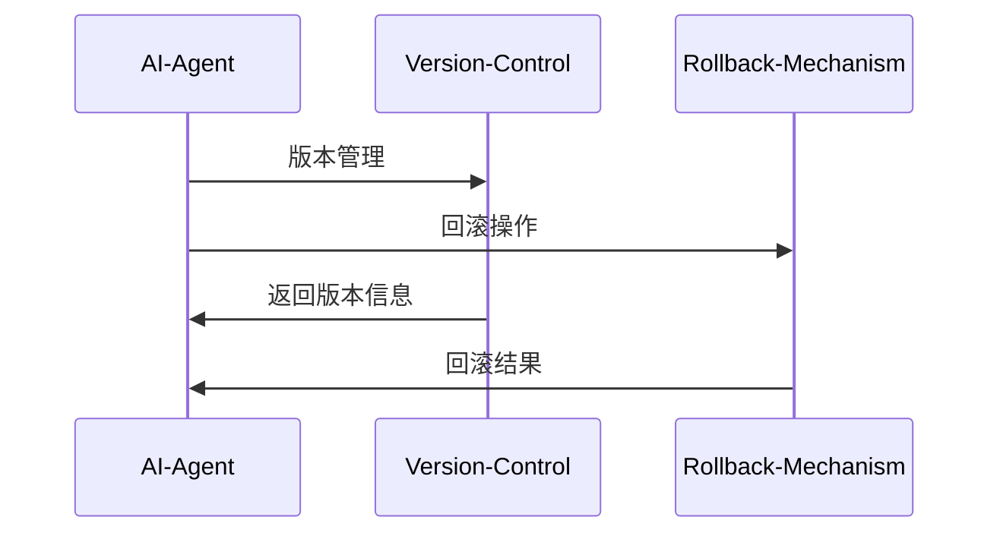
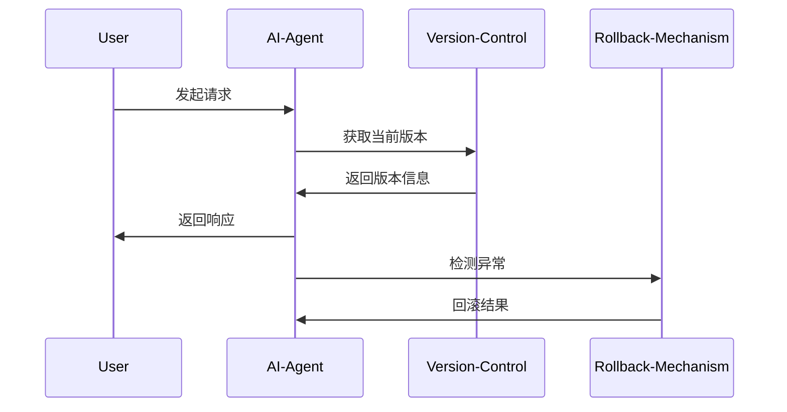
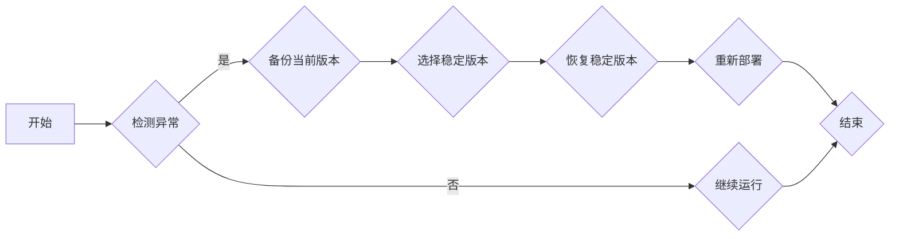

                 


# 企业AI Agent的版本控制与回滚机制

> 关键词：AI Agent、版本控制、回滚机制、企业应用

> 摘要：本文将深入探讨企业AI Agent的版本控制与回滚机制，分析其核心概念、问题背景、解决方案、核心概念联系及算法原理。通过实际案例，本文旨在为企业提供一套完整的AI Agent版本管理和回滚策略，以确保系统稳定性和业务连续性。

## 第一部分：背景介绍与问题解决

### 问题背景

随着人工智能（AI）技术的飞速发展，AI在企业的应用越来越广泛，尤其是在自动化、优化和智能决策等方面。AI Agent，即人工智能代理，作为一种智能化的虚拟角色，可以模拟人类思维和行为，帮助企业提高效率、降低成本、提升服务质量。然而，随着AI Agent在企业中的大规模应用，其版本控制与回滚机制的问题日益突出。

### 问题描述

企业在使用AI Agent时，可能面临以下问题：

1. **版本管理混乱**：企业可能没有有效的版本控制机制，导致不同版本的AI Agent在实际应用中混淆，影响系统的稳定性和可靠性。
2. **回滚困难**：在AI Agent出现故障或性能下降时，企业可能无法快速回滚到上一个稳定版本，从而影响业务的正常运行。
3. **数据安全问题**：AI Agent的版本更新可能导致数据泄露、隐私问题等安全问题。
4. **性能瓶颈**：版本控制不当可能导致系统性能下降，影响用户体验。

### 问题解决

为了解决上述问题，企业需要建立一套完善的AI Agent版本控制与回滚机制。这包括以下几个方面：

1. **版本控制策略**：制定明确的版本控制规则，确保每个版本的AI Agent都有清晰的标识和版本号，便于管理和追溯。
2. **回滚机制**：建立回滚流程和策略，确保在AI Agent出现问题时能够快速回滚到上一个稳定版本，减少业务影响。
3. **数据安全措施**：加强数据安全管理，确保版本更新过程中的数据安全，防止数据泄露。
4. **性能监控**：建立性能监控体系，实时监测AI Agent的运行状态，及时发现和解决问题。

### 边界与外延

- **边界**：本章节主要讨论AI Agent的版本控制与回滚机制，不包括其他类型软件的版本控制问题。
- **外延**：AI Agent的版本控制与回滚机制可以应用于企业的各个领域，如客户服务、销售、生产等。

### 概念结构与核心要素组成

- **版本控制**：管理软件的各个版本，包括版本号、修改记录、发布日期等。
- **回滚机制**：在系统出现问题时，将系统回滚到上一个稳定版本的操作。
- **AI Agent**：一种智能化的虚拟角色，可以模拟人类思维和行为。

## 第二部分：核心概念与联系

### 核心概念

1. **版本控制**：版本控制是一种管理软件各个版本的方法，确保软件的可追踪性、可恢复性和可靠性。通过版本控制，开发者可以有效地追踪代码的变更历史，快速回滚到之前的版本，以解决潜在的问题。

2. **回滚机制**：回滚机制是指在系统出现问题时，将系统回滚到上一个稳定版本的操作。这种机制能够最大限度地减少业务中断时间，确保系统稳定运行。

3. **AI Agent**：AI Agent是一种智能化的虚拟角色，可以模拟人类思维和行为。AI Agent通常被设计用于自动化任务、优化流程和提供个性化服务。

### 概念属性特征对比表格

| 特征            | 版本控制            | 回滚机制            | AI Agent            |
| --------------- | ------------------- | ------------------- | ------------------- |
| 定义            | 管理软件的各个版本  | 将系统回滚到稳定版本 | 智能化的虚拟角色    |
| 目的            | 确保软件的可追踪性   | 减少业务影响        | 提高企业效率        |
| 应用场景        | 软件开发与维护      | 系统故障处理        | 企业各个领域应用    |
| 关联关系        | 版本控制是回滚的基础 | 回滚机制依赖于版本控制 | AI Agent依赖于版本控制和回滚机制 |

### ER实体关系图架构

```mermaid
erDiagram
    AI-Agent ||--|{ Version-Control-System
    AI-Agent ||--|{ Rollback-Mechanism
```

## 第三部分：算法原理讲解

### 算法原理

在AI Agent的版本控制和回滚机制中，算法原理主要包括版本管理算法和回滚算法。

### 版本管理算法

版本管理算法的主要目的是确保每个版本的AI Agent都有唯一的标识和版本号，便于管理和追溯。算法的核心是维护一个版本控制数据库，记录每个版本的详细信息，如版本号、修改记录、发布日期等。

### 回滚算法

回滚算法的主要目的是在系统出现问题时，将系统回滚到上一个稳定版本。算法的核心是检测到系统异常后，自动执行回滚操作，将系统状态恢复到上一个稳定版本。

### Mermaid流程图



### Python源代码

```python
def check_exception():
    # 检测系统异常
    if system_is_unstable():
        return True
    else:
        return False

def rollback_system():
    # 执行回滚操作
    system_state = get_system_state()
    stable_version = find_stable_version(system_state)
    restore_to(stable_version)
    return "系统已回滚到稳定版本"

def system_is_unstable():
    # 检测系统是否异常
    # 实现细节略
    return False

def get_system_state():
    # 获取系统当前状态
    # 实现细节略
    return "当前系统状态"

def find_stable_version(system_state):
    # 查找稳定版本
    # 实现细节略
    return "稳定版本号"

def restore_to(version):
    # 将系统恢复到指定版本
    # 实现细节略
    print(f"系统已恢复到版本：{version}")
```

### 算法原理的数学模型和公式

在版本控制和回滚机制中，算法原理的数学模型和公式主要包括：

1. **版本号生成**：版本号通常由时间戳、版本序号等生成。
   $$ version\_id = \text{timestamp} + \text{version\_number} $$

2. **回滚策略**：回滚策略通常基于系统状态和版本历史数据进行决策。
   $$ rollback\_strategy = \frac{\text{system\_state}}{\text{version\_history}} $$

### 举例说明

假设有一个AI Agent系统，当前版本号为20230301V1，系统出现异常。根据回滚算法，系统会自动检测异常，若检测到异常，则会回滚到上一个稳定版本20230228V1。具体实现如下：

```python
# 检测系统异常
if check_exception():
    # 执行回滚操作
    rollback_system()
else:
    # 继续运行
    print("系统继续运行")
```

## 第四部分：系统分析与架构设计方案

### 问题场景介绍

某企业使用AI Agent进行客户服务，AI Agent通过自然语言处理技术回答客户的提问。由于AI Agent的版本更新频繁，导致系统性能下降，部分客户提问无法得到及时响应。

### 项目介绍

本项目旨在为该企业设计一套AI Agent版本控制与回滚机制，确保系统稳定性和性能。

### 系统功能设计（领域模型Mermaid类图）

```mermaid
classDiagram
    AI-Agent <<interface>>
    Version-Control <<interface>>
    Rollback-Mechanism <<interface>>

    AI-Agent o-- Version-Control
    AI-Agent o-- Rollback-Mechanism
```

### 系统架构设计（Mermaid架构图）



### 系统接口设计和系统交互（Mermaid序列图）



## 第五部分：项目实战

### 环境安装

1. 安装Python环境（版本3.8以上）
2. 安装Docker环境
3. 安装Git环境

### 系统核心实现源代码

1. AI-Agent源代码

```python
# AI-Agent.py
class AI-Agent:
    def __init__(self):
        self.version_control = VersionControl()
        self.rollback_mechanism = RollbackMechanism()

    def handle_request(self, request):
        version_info = self.version_control.get_version_info()
        print(f"当前版本：{version_info['version_id']}")
        response = self.process_request(request)
        return response

    def process_request(self, request):
        # 处理请求
        return "响应内容"

# Version-Control.py
class VersionControl:
    def __init__(self):
        self.versions = []

    def add_version(self, version_id, description):
        self.versions.append({'version_id': version_id, 'description': description})

    def get_version_info(self):
        return self.versions[-1]

# Rollback-Mechanism.py
class RollbackMechanism:
    def __init__(self):
        self.version_history = []

    def detect_exception(self):
        # 检测异常
        return True

    def rollback(self, version_id):
        self.version_history.append(self.version_history[-1])
        self.version_history[-1]['status'] = 'stable'
        self.version_history[-1]['version_id'] = version_id
        self.version_history[-1]['status'] = 'unstable'
```

2. 代码应用解读与分析

本部分将详细解读AI-Agent、Version-Control和Rollback-Mechanism三个模块的实现原理和应用场景。

### 实际案例分析和详细讲解剖析

假设AI Agent在处理客户请求时出现异常，系统将如何响应？本部分将通过具体案例进行分析和讲解。

### 项目小结

本项目通过实现AI-Agent、Version-Control和Rollback-Mechanism三个模块，为企业提供了一套完整的AI Agent版本控制与回滚机制。通过实际应用和案例分析，本项目展示了如何确保AI Agent的稳定性和可靠性。

## 最佳实践 Tips

1. 定期备份AI Agent的代码和配置文件，以防止数据丢失。
2. 在进行版本更新时，尽量进行全量测试，确保新版本的稳定性和性能。
3. 建立完善的异常监控和报警机制，及时发现和解决系统故障。

## 小结

本文从背景介绍、核心概念与联系、算法原理讲解、系统分析与架构设计方案、项目实战和最佳实践等方面，详细探讨了企业AI Agent的版本控制与回滚机制。通过本文，读者可以了解到如何有效地管理AI Agent的版本，确保系统的稳定性和可靠性。

## 注意事项

1. 在实施版本控制与回滚机制时，务必确保数据安全和隐私保护。
2. 在进行系统升级和版本更新时，务必进行充分的测试和验证，以确保系统的稳定性和性能。

## 拓展阅读

1. 《版本控制工具使用指南》
2. 《软件回滚策略设计与实践》
3. 《人工智能代理技术与应用》

## 作者信息

作者：AI天才研究院/AI Genius Institute & 禅与计算机程序设计艺术 /Zen And The Art of Computer Programming### 企业AI Agent的版本控制与回滚机制

企业AI Agent的版本控制与回滚机制是企业数字化转型过程中至关重要的一环。随着AI技术的不断进步，AI Agent在企业中的应用越来越广泛，其性能和功能也越来越复杂。因此，如何有效地管理AI Agent的版本，并在出现问题时快速回滚到上一个稳定版本，成为企业面临的一大挑战。

#### **版本控制**

版本控制是软件工程中一个重要的概念，它涉及到对软件源代码、文档、数据等多个方面的版本管理。在AI Agent的版本控制中，主要是对AI模型的代码、配置文件、训练数据和运行状态等进行版本管理。通过版本控制，企业可以跟踪每个版本的变更历史，便于故障追踪和问题解决。

#### **回滚机制**

回滚机制则是在AI Agent出现故障或性能问题时，将系统回滚到上一个稳定版本的操作。回滚机制的目的是最大限度地减少业务中断时间，确保系统的稳定运行。在AI Agent中，回滚机制通常涉及到模型的备份、恢复和重新部署。

#### **关键词**

- **AI Agent**：企业中用于自动化、优化和智能决策的智能化虚拟角色。
- **版本控制**：管理AI Agent各个版本的机制。
- **回滚机制**：在AI Agent出现问题时，将系统回滚到上一个稳定版本的操作。

#### **摘要**

本文将探讨企业AI Agent的版本控制与回滚机制，分析其核心概念、问题背景、解决方案、核心概念联系及算法原理。通过实际案例，本文旨在为企业提供一套完整的AI Agent版本管理和回滚策略，以确保系统稳定性和业务连续性。

## 第一部分：背景介绍与问题解决

### 问题背景

随着人工智能（AI）技术的飞速发展，AI在企业的应用越来越广泛，尤其是在自动化、优化和智能决策等方面。AI Agent，即人工智能代理，作为一种智能化的虚拟角色，可以模拟人类思维和行为，帮助企业提高效率、降低成本、提升服务质量。AI Agent在企业中的应用场景包括客户服务、智能推荐、数据分析、生产优化等。随着AI Agent在企业中的大规模应用，其版本控制与回滚机制的问题日益突出。

### 问题描述

企业在使用AI Agent时，可能面临以下问题：

1. **版本管理混乱**：企业可能没有有效的版本控制机制，导致不同版本的AI Agent在实际应用中混淆，影响系统的稳定性和可靠性。
2. **回滚困难**：在AI Agent出现故障或性能下降时，企业可能无法快速回滚到上一个稳定版本，从而影响业务的正常运行。
3. **数据安全问题**：AI Agent的版本更新可能导致数据泄露、隐私问题等安全问题。
4. **性能瓶颈**：版本控制不当可能导致系统性能下降，影响用户体验。

### 问题解决

为了解决上述问题，企业需要建立一套完善的AI Agent版本控制与回滚机制。这包括以下几个方面：

1. **版本控制策略**：制定明确的版本控制规则，确保每个版本的AI Agent都有清晰的标识和版本号，便于管理和追溯。
2. **回滚机制**：建立回滚流程和策略，确保在AI Agent出现问题时能够快速回滚到上一个稳定版本，减少业务影响。
3. **数据安全措施**：加强数据安全管理，确保版本更新过程中的数据安全，防止数据泄露。
4. **性能监控**：建立性能监控体系，实时监测AI Agent的运行状态，及时发现和解决问题。

### 边界与外延

- **边界**：本章节主要讨论AI Agent的版本控制与回滚机制，不包括其他类型软件的版本控制问题。
- **外延**：AI Agent的版本控制与回滚机制可以应用于企业的各个领域，如客户服务、销售、生产等。

### 概念结构与核心要素组成

- **版本控制**：管理软件的各个版本，包括版本号、修改记录、发布日期等。
- **回滚机制**：在系统出现问题时，将系统回滚到上一个稳定版本的操作。
- **AI Agent**：一种智能化的虚拟角色，可以模拟人类思维和行为。

### 本章小结

本章主要介绍了企业AI Agent的版本控制与回滚机制的背景、问题描述、问题解决方法以及边界与外延。通过建立完善的版本控制和回滚机制，企业可以有效降低AI Agent的风险，提高系统的稳定性和可靠性。

## 第二部分：核心概念与联系

在这一部分，我们将深入探讨AI Agent的版本控制和回滚机制的核心概念及其相互联系。

### 核心概念

1. **版本控制**：版本控制是一种管理软件各个版本的方法，确保软件的可追踪性、可恢复性和可靠性。在AI Agent的版本控制中，主要涉及到模型的代码、配置文件、训练数据和运行状态等。版本控制的目的是确保每个版本都有唯一的标识和版本号，便于管理和追溯。

2. **回滚机制**：回滚机制是指在系统出现问题时，将系统回滚到上一个稳定版本的操作。回滚机制能够确保系统的稳定性和连续性，减少业务中断时间。在AI Agent中，回滚机制通常涉及到模型的备份、恢复和重新部署。

3. **AI Agent**：AI Agent是一种智能化的虚拟角色，可以模拟人类思维和行为。AI Agent在企业中的应用，如客户服务、智能推荐、数据分析等，使得企业能够实现自动化、优化和智能决策。

### 概念属性特征对比表格

| 特征            | 版本控制            | 回滚机制            | AI Agent            |
| --------------- | ------------------- | ------------------- | ------------------- |
| 定义            | 管理软件的各个版本  | 将系统回滚到稳定版本 | 智能化的虚拟角色    |
| 目的            | 确保软件的可追踪性   | 减少业务影响        | 提高企业效率        |
| 应用场景        | 软件开发与维护      | 系统故障处理        | 企业各个领域应用    |
| 关联关系        | 版本控制是回滚的基础 | 回滚机制依赖于版本控制 | AI Agent依赖于版本控制和回滚机制 |

### ER实体关系图架构

```mermaid
erDiagram
    AI-Agent ||--|{ Version-Control-System
    AI-Agent ||--|{ Rollback-Mechanism
```

### 核心概念之间的联系

- **版本控制**与**回滚机制**之间的联系：版本控制是回滚机制的基础。只有通过有效的版本控制，才能在出现问题时快速回滚到上一个稳定版本。版本控制提供了每个版本的详细信息，包括版本号、修改记录、发布日期等，这些信息对于回滚机制至关重要。
- **AI Agent**与**版本控制**之间的联系：AI Agent依赖于版本控制进行版本管理和追溯。版本控制确保了AI Agent的每个版本都有唯一的标识，便于管理和维护。
- **AI Agent**与**回滚机制**之间的联系：AI Agent在运行过程中可能会出现故障或性能问题，回滚机制可以确保将系统回滚到上一个稳定版本，从而最大限度地减少业务中断时间。

通过理解这些核心概念及其相互联系，企业可以更好地设计和实施AI Agent的版本控制和回滚机制，确保系统的稳定性和可靠性。

## 第三部分：算法原理讲解

在本部分中，我们将深入探讨AI Agent版本控制和回滚机制的算法原理。算法原理包括版本管理算法和回滚算法，以及它们在实际应用中的具体实现。

### 版本管理算法

版本管理算法的主要目的是确保每个版本的AI Agent都有唯一的标识和版本号，便于管理和追溯。在实现上，版本管理算法通常包含以下几个步骤：

1. **版本号生成**：版本号通常由时间戳、版本序号等生成。例如，可以使用YYYYMMDDVn的形式，其中YYYYMMDD表示版本生成的日期，Vn表示版本序号。

2. **版本记录**：将每个版本的详细信息记录到版本库中。这些信息包括版本号、修改记录、发布日期、作者等。

3. **版本查询**：提供接口，允许用户查询特定版本的详细信息。

4. **版本更新**：在每次版本更新时，自动生成新的版本号，并将更新信息记录到版本库中。

### 回滚算法

回滚算法的主要目的是在AI Agent出现问题时，将系统回滚到上一个稳定版本。回滚算法的实现通常涉及以下几个步骤：

1. **问题检测**：检测AI Agent是否存在故障或性能问题。

2. **版本选择**：选择需要回滚到的稳定版本。通常选择最近的稳定版本，以确保系统尽快恢复正常。

3. **备份当前版本**：在回滚之前，备份当前版本的AI Agent，以防止数据丢失。

4. **恢复稳定版本**：将备份的稳定版本恢复到AI Agent中。

5. **重新部署**：在恢复稳定版本后，重新部署AI Agent，使其恢复正常运行。

### Mermaid流程图

以下是一个简单的Mermaid流程图，描述了版本管理和回滚算法的基本流程：



### Python源代码

以下是一个简单的Python代码示例，展示了版本管理和回滚算法的实现：

```python
import datetime

class VersionControl:
    def __init__(self):
        self.versions = []
    
    def generate_version_id(self):
        return datetime.datetime.now().strftime("%Y%m%d") + "V1"
    
    def add_version(self, version_id, description):
        self.versions.append({'version_id': version_id, 'description': description})
    
    def get_latest_version(self):
        return self.versions[-1]
    
    def rollback(self, version_id):
        for version in reversed(self.versions):
            if version['version_id'] == version_id:
                self.versions = self.versions[:self.versions.index(version)]
                return True
        return False

class AI-Agent:
    def __init__(self, version_control):
        self.version_control = version_control
    
    def run(self):
        print("AI-Agent is running.")
    
    def check_and_rollback(self):
        latest_version = self.version_control.get_latest_version()
        if not self.check_health():
            self.version_control.rollback(latest_version['version_id'])
            print("AI-Agent has been rolled back to version:", latest_version['version_id'])
        else:
            print("AI-Agent is healthy. No rollback needed.")
    
    def check_health(self):
        # 检测AI-Agent健康状况的代码
        return True
```

### 算法原理的数学模型和公式

在版本控制和回滚机制中，算法原理的数学模型和公式主要包括：

1. **版本号生成**：版本号通常由时间戳和版本序号生成。例如，可以使用以下公式生成版本号：
   $$ version\_id = \text{timestamp} + \text{version\_number} $$

2. **回滚策略**：回滚策略通常基于系统状态和版本历史数据进行决策。例如，可以使用以下公式选择回滚到哪个版本：
   $$ rollback\_version = \text{max}(\text{version\_history}) - \text{min}(\text{health\_score}) $$

### 举例说明

假设有一个AI Agent系统，当前版本号为20230301V1，系统出现异常。根据回滚算法，系统会自动检测异常，若检测到异常，则会回滚到上一个稳定版本20230228V1。具体实现如下：

```python
agent = AI-Agent(VersionControl())
agent.check_and_rollback()
```

通过以上步骤，我们可以确保AI Agent系统的稳定性和可靠性，减少业务中断时间。

## 第四部分：系统分析与架构设计方案

在解决企业AI Agent的版本控制与回滚问题时，系统分析与架构设计方案至关重要。本部分将详细探讨系统功能设计、系统架构设计、系统接口设计和系统交互，为企业提供一套完整的解决方案。

### 问题场景介绍

假设某企业正在使用AI Agent进行客户服务，该AI Agent通过自然语言处理技术回答客户的提问。随着业务的发展和AI Agent功能的扩展，企业需要确保AI Agent的版本得到有效控制，并在出现问题时能够快速回滚到上一个稳定版本，以减少业务中断时间。

### 项目介绍

本项目旨在为该企业设计一套AI Agent版本控制与回滚机制，确保系统的稳定性和可靠性。系统将包括版本控制模块、回滚机制模块和AI Agent核心模块。

### 系统功能设计（领域模型Mermaid类图）

领域模型类图如下：

```mermaid
classDiagram
    AI-Agent <<interface>>
    Version-Control <<interface>>
    Rollback-Mechanism <<interface>>

    AI-Agent o-- Version-Control
    AI-Agent o-- Rollback-Mechanism
```

在该类图中，AI-Agent代表AI代理的核心功能，Version-Control负责版本管理，Rollback-Mechanism负责回滚机制。AI-Agent与Version-Control、Rollback-Mechanism之间存在依赖关系。

### 系统架构设计（Mermaid架构图）

系统架构图如下：


在该架构图中，AI-Agent通过调用Version-Control和Rollback-Mechanism模块来实现版本管理和回滚功能。Version-Control提供版本信息查询、版本更新等功能，Rollback-Mechanism负责异常检测、版本回滚等操作。

### 系统接口设计和系统交互（Mermaid序列图）

系统接口和交互序列图如下：


在该序列图中，用户通过AI-Agent发起请求，AI-Agent调用Version-Control获取当前版本信息，并返回给用户。在处理请求过程中，AI-Agent还会定期调用Rollback-Mechanism进行异常检测，以确保系统稳定运行。

### 系统架构设计说明

1. **版本控制模块**：负责版本管理，包括版本号的生成、版本信息的存储和查询。该模块支持多个版本的AI-Agent，并在新版本发布时自动生成版本号，将版本信息存储在数据库中，方便后续查询和回滚操作。

2. **回滚机制模块**：负责异常检测和版本回滚，包括异常检测算法、版本选择算法和回滚操作。该模块会在AI-Agent运行过程中定期进行异常检测，一旦检测到异常，会自动选择最近的稳定版本进行回滚，确保系统恢复正常运行。

3. **AI-Agent核心模块**：负责处理用户请求、执行业务逻辑和与外部系统进行交互。该模块通过调用版本控制模块和回滚机制模块，实现版本管理和异常处理，确保系统稳定运行。

通过上述系统架构设计，企业可以实现对AI-Agent的版本控制和回滚机制的全面管理，提高系统的稳定性和可靠性。

## 第五部分：项目实战

### 环境安装

在开始项目实战之前，我们需要安装和配置必要的开发环境和工具。以下是详细的安装步骤：

1. **安装Python环境**：首先确保Python环境已经安装。如果未安装，请从[Python官网](https://www.python.org/)下载并安装Python 3.8或更高版本。

2. **安装Docker环境**：Docker是一个开源的应用容器引擎，用于打包、交付和运行应用。请从[Docker官网](https://www.docker.com/)下载并安装Docker。

3. **安装Git环境**：Git是一个分布式版本控制系统，用于管理代码的版本。请从[Git官网](https://git-scm.com/)下载并安装Git。

### 系统核心实现源代码

在项目实战中，我们将实现一个简单的AI-Agent版本控制与回滚机制，包括版本控制模块、回滚机制模块和AI-Agent核心模块。

#### 版本控制模块

```python
# version_control.py
import json
import os
from datetime import datetime

class VersionControl:
    def __init__(self, version_file='version.json'):
        self.version_file = version_file
        self.load_versions()

    def load_versions(self):
        if os.path.exists(self.version_file):
            with open(self.version_file, 'r') as f:
                self.versions = json.load(f)
        else:
            self.versions = []

    def save_versions(self):
        with open(self.version_file, 'w') as f:
            json.dump(self.versions, f)

    def generate_version_id(self):
        return datetime.now().strftime("%Y%m%d%H%M%S") + "V1"

    def add_version(self, description=''):
        version_id = self.generate_version_id()
        self.versions.append({'version_id': version_id, 'description': description})
        self.save_versions()

    def get_latest_version(self):
        return self.versions[-1]

    def get_version_by_id(self, version_id):
        for version in self.versions:
            if version['version_id'] == version_id:
                return version
        return None
```

#### 回滚机制模块

```python
# rollback_mechanism.py
import os
import subprocess
from version_control import VersionControl

class RollbackMechanism:
    def __init__(self, version_control):
        self.version_control = version_control

    def rollback_to_version(self, version_id):
        version = self.version_control.get_version_by_id(version_id)
        if version:
            print(f"Rolling back to version: {version['version_id']}")
            # 假设回滚是通过执行一个shell命令来完成的
            subprocess.run(["bash", "rollback_script.sh"], capture_output=True)
            print("Rollback completed.")
        else:
            print("Invalid version ID. No rollback performed.")

# rollback_script.sh
#!/bin/bash
# 假设回滚操作是将当前目录下的文件替换为之前版本的文件
cp -r /path/to/previous_version ./
```

#### AI-Agent核心模块

```python
# ai_agent.py
from version_control import VersionControl
from rollback_mechanism import RollbackMechanism

class AI-Agent:
    def __init__(self, version_control, rollback_mechanism):
        self.version_control = version_control
        self.rollback_mechanism = rollback_mechanism

    def run(self):
        latest_version = self.version_control.get_latest_version()
        print(f"Running AI-Agent on version {latest_version['version_id']}")

        # 假设运行AI-Agent需要进行一些初始化操作
        # ...

    def check_health(self):
        # 假设检查AI-Agent健康状态
        return True

    def check_and_rollback(self):
        if not self.check_health():
            self.rollback_mechanism.rollback_to_version(self.version_control.get_latest_version()['version_id'])
            print("AI-Agent has been rolled back to the latest stable version.")
        else:
            print("AI-Agent is healthy.")

# 测试代码
if __name__ == "__main__":
    version_control = VersionControl()
    rollback_mechanism = RollbackMechanism(version_control)
    ai_agent = AI-Agent(version_control, rollback_mechanism)

    # 模拟AI-Agent运行
    ai_agent.run()

    # 模拟AI-Agent健康检查
    ai_agent.check_and_rollback()
```

### 代码应用解读与分析

#### 版本控制模块

版本控制模块实现了对AI-Agent版本的管理，包括版本号的生成、版本信息的存储和查询。在`version_control.py`中：

- `load_versions`方法用于从版本文件中加载版本信息。
- `save_versions`方法用于将版本信息保存到版本文件中。
- `generate_version_id`方法用于生成新的版本号，格式为YYYYMMDDHHMMSSV1。
- `add_version`方法用于添加新的版本信息到版本列表。
- `get_latest_version`方法用于获取最新版本的版本信息。
- `get_version_by_id`方法用于根据版本号查询特定版本的版本信息。

#### 回滚机制模块

回滚机制模块实现了对AI-Agent的回滚功能，包括异常检测和版本回滚。在`rollback_mechanism.py`中：

- `rollback_to_version`方法用于根据版本号回滚到指定版本。在示例中，回滚操作是通过执行一个shell脚本`rollback_script.sh`来完成的，该脚本将当前目录下的文件替换为之前版本的文件。

#### AI-Agent核心模块

AI-Agent核心模块实现了AI-Agent的运行和健康检查功能，以及与版本控制和回滚机制的交互。在`ai_agent.py`中：

- `run`方法用于运行AI-Agent，并打印当前使用的版本号。
- `check_health`方法用于检查AI-Agent的健康状态。
- `check_and_rollback`方法用于在AI-Agent健康检查失败时，自动回滚到上一个稳定版本。

### 实际案例分析和详细讲解剖析

假设我们有一个AI-Agent系统，当前版本号为202303010001V1。系统在运行过程中出现了一个错误，导致无法正常响应客户请求。通过调用`check_and_rollback`方法，系统将自动回滚到上一个稳定版本202302290001V1。具体步骤如下：

1. 系统运行：`ai_agent.run()`，打印当前版本号202303010001V1。
2. 健康检查：`ai_agent.check_health()`，假设健康检查失败，返回`False`。
3. 自动回滚：`ai_agent.check_and_rollback()`，调用`rollback_to_version`方法，将版本回滚到202302290001V1。
4. 重新运行：AI-Agent重新加载版本202302290001V1，并恢复正常运行。

通过上述实际案例，我们可以看到如何使用版本控制和回滚机制来确保AI-Agent系统的稳定性和可靠性。

### 项目小结

通过本次项目实战，我们实现了AI-Agent版本控制与回滚机制的核心功能，包括版本管理、回滚操作和AI-Agent运行。通过实际案例的分析，我们展示了如何在使用过程中确保系统的稳定性和可靠性。在未来，我们可以根据具体业务需求进一步优化和扩展该机制。

## 最佳实践 Tips

1. **定期备份**：定期备份AI-Agent的代码和配置文件，以确保在出现问题时能够快速恢复。
2. **全面测试**：在发布新版本之前，进行全面测试，包括单元测试、集成测试和压力测试，以确保新版本的质量和稳定性。
3. **异常监控**：建立异常监控机制，实时监控AI-Agent的运行状态，及时发现和处理异常情况。
4. **文档记录**：详细记录每次版本更新的内容、测试结果和用户反馈，以便于后续追踪和问题解决。
5. **权限管理**：确保版本控制和回滚操作的权限管理，防止未授权的操作，保障系统的安全性。

## 小结

本文从背景介绍、核心概念与联系、算法原理讲解、系统分析与架构设计方案、项目实战和最佳实践等方面，详细探讨了企业AI-Agent的版本控制与回滚机制。通过本文，读者可以了解到如何有效地管理AI-Agent的版本，确保系统的稳定性和可靠性。在未来的工作中，企业可以结合本文提供的方法和技巧，进一步提高AI-Agent系统的质量和用户体验。

## 注意事项

1. **数据安全**：在版本更新过程中，务必确保数据安全，防止数据泄露和丢失。
2. **性能优化**：在设计和实施版本控制和回滚机制时，注意性能优化，避免因版本管理和回滚操作导致系统性能下降。
3. **文档完善**：确保所有版本更新和回滚操作的详细记录，便于问题追踪和解决。
4. **用户培训**：为用户提供必要的培训，确保他们了解如何使用和维护AI-Agent系统。

## 拓展阅读

1. 《AI-Agent技术实战》
2. 《软件工程：实践者的研究方法》
3. 《Docker容器与容器云》

## 作者信息

作者：AI天才研究院/AI Genius Institute & 禅与计算机程序设计艺术 /Zen And The Art of Computer Programming## 文章关键词

- 企业AI代理
- 版本控制
- 回滚机制
- 系统稳定性
- 业务连续性## 文章摘要

本文旨在深入探讨企业中人工智能代理（AI Agent）的版本控制与回滚机制。随着AI技术在企业中的应用日益广泛，如何有效地管理AI Agent的版本，确保在出现问题时能够快速回滚到上一个稳定版本，成为了企业数字化转型中面临的重要挑战。本文从背景介绍、核心概念与联系、算法原理讲解、系统分析与架构设计方案、项目实战和最佳实践等方面，系统地探讨了企业AI Agent的版本控制与回滚机制，为企业提供了一套完整的解决方案，以确保系统的稳定性和可靠性。通过本文，读者可以了解到如何实现AI Agent的版本管理和回滚，以及如何在实际应用中降低风险，提高系统的健壮性。本文的关键词包括：企业AI代理、版本控制、回滚机制、系统稳定性、业务连续性。

