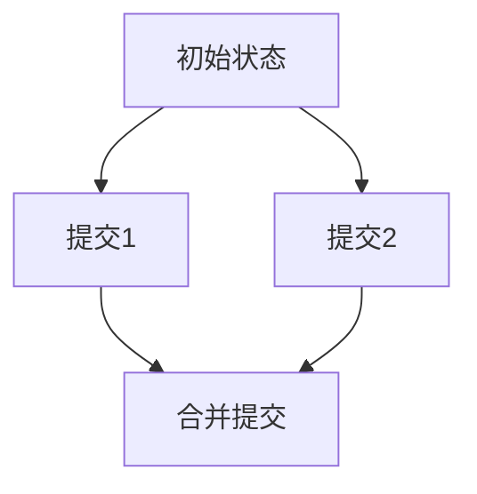
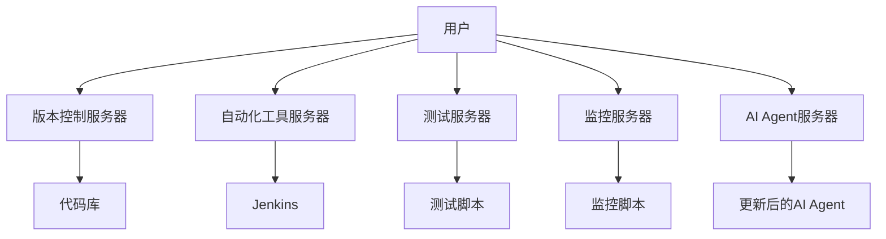
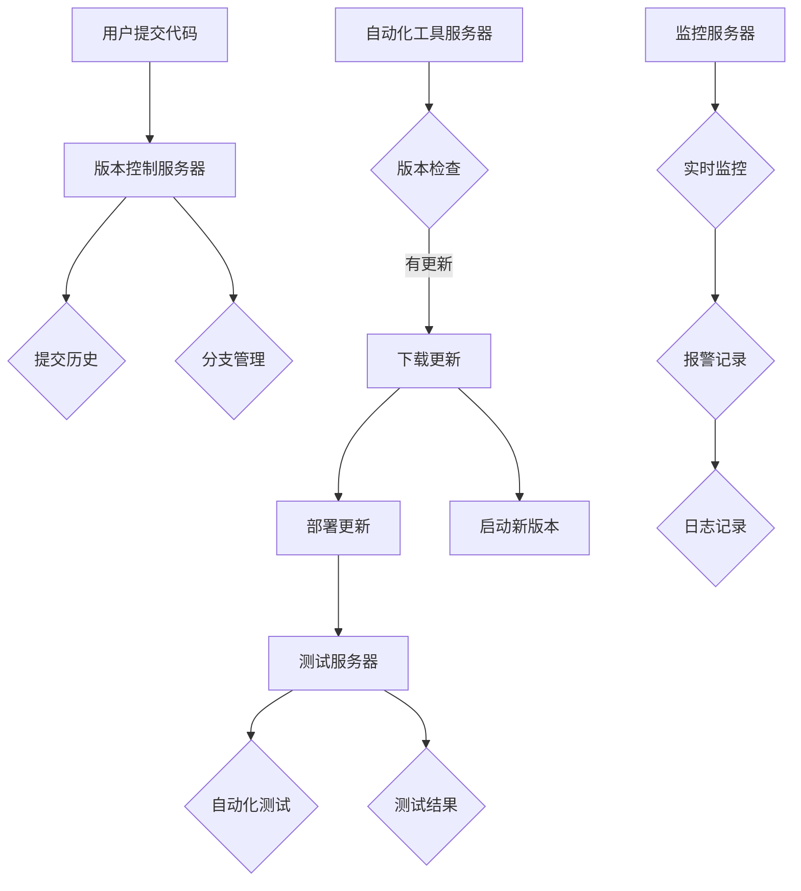

                 


## 引言

### 背景介绍

随着人工智能技术的快速发展，AI Agent在企业中的应用日益广泛。AI Agent，即人工智能代理，是一种能够模拟人类智能行为、自主执行任务并具备决策能力的软件实体。在企业环境中，AI Agent被应用于客户服务、自动化生产、智能推荐、风险管理等多个领域。然而，随着AI Agent在企业中的应用越来越复杂，版本控制与更新策略变得至关重要。

版本控制是确保软件稳定性和可靠性的重要手段。在企业AI Agent的开发过程中，版本控制不仅可以帮助团队管理代码的变更历史，还能确保不同版本之间的兼容性和可追踪性。更新策略则是为了确保AI Agent能够及时响应业务需求变化和修复潜在问题。一个有效的更新策略能够提高系统的可用性、稳定性和安全性。

### 核心概念

在企业AI Agent的版本控制与更新策略中，有几个核心概念需要理解：

1. **版本控制**：版本控制是一种管理软件源代码变更的方法，它能够记录每次变更的历史、追踪问题的根源，并确保不同版本之间的兼容性。

2. **更新策略**：更新策略是关于如何管理和执行AI Agent更新的方案，包括自动更新和手动更新两种方式。自动更新能够快速响应业务需求变化，但可能引入不确定性；手动更新则需要人工干预，但可以更好地控制更新过程。

3. **兼容性**：兼容性是指AI Agent在更新后的版本能够与现有系统和数据无缝衔接，不会造成功能失效或数据损坏。

4. **稳定性**：稳定性是指AI Agent在更新后的版本能够保持正常的运行状态，不会出现频繁崩溃或性能下降。

5. **安全性**：安全性是指AI Agent在更新后的版本能够抵御外部攻击和内部威胁，确保数据和系统的安全。

### 问题背景

在企业AI Agent的开发和部署过程中，经常面临以下问题：

- **版本混乱**：随着项目规模不断扩大，代码库中的版本号变得混乱，难以追踪每个版本的变更历史。
- **更新冲突**：不同的团队或开发者可能在同一时间内对AI Agent进行更新，导致版本冲突和功能失效。
- **更新滞后**：业务需求变化迅速，AI Agent的更新滞后，导致功能无法及时上线。
- **测试不足**：更新后的AI Agent在部署前缺乏充分的测试，可能引入新的问题和漏洞。
- **运维困难**：手动更新需要人工干预，运营成本高，且容易出错。

### 问题描述

如何设计一套有效的版本控制与更新策略，以解决上述问题，确保AI Agent在企业中的稳定运行和快速响应？

### 问题解决

为了解决上述问题，我们可以从以下几个方面入手：

1. **采用先进的版本控制系统**：选择一个成熟的版本控制系统，如Git，能够提供版本的历史记录、分支管理和合并功能，确保代码库的整洁和可追踪性。

2. **制定明确的版本管理规范**：制定一套版本管理规范，包括版本命名规则、版本发布流程、更新策略等，确保团队成员对版本控制的了解和遵循。

3. **自动化测试和发布**：建立自动化测试流程，确保更新后的AI Agent在部署前经过充分的测试，降低故障风险。同时，采用自动化发布工具，如Jenkins，提高更新速度和稳定性。

4. **监控和反馈机制**：建立监控和反馈机制，实时监测AI Agent的运行状态，及时发现问题并进行处理。

5. **培训和支持**：对团队成员进行版本控制和更新策略的培训，提供必要的技术支持，确保他们能够正确执行版本控制和更新操作。

### 边界与外延

在设计和实施版本控制与更新策略时，需要注意以下边界与外延：

- **团队规模**：版本控制和更新策略需要根据团队规模进行调整，小团队可能采用较为简单的策略，而大团队则需要更复杂的管理机制。
- **业务需求**：业务需求的变化速度会影响版本控制和更新的频率和策略，需要灵活调整。
- **系统稳定性**：系统稳定性是版本控制和更新的基础，确保系统能够稳定运行是版本控制与更新策略的关键。
- **数据安全性**：在版本控制和更新过程中，需要确保数据的安全性，防止数据丢失或损坏。

### 概念结构与核心要素组成

版本控制与更新策略的概念结构包括以下几个核心要素：

- **版本控制系统**：如Git，负责管理代码库的变更历史。
- **版本管理规范**：包括版本命名规则、发布流程、更新策略等。
- **测试与发布流程**：自动化测试和发布工具，确保更新安全可靠。
- **监控与反馈机制**：实时监控AI Agent的运行状态，及时响应问题。
- **培训与支持**：对团队成员的培训和持续支持，确保策略的正确执行。

### 总结

版本控制与更新策略是确保企业AI Agent稳定运行和快速响应的重要手段。通过采用先进的版本控制系统、制定明确的版本管理规范、自动化测试和发布流程、监控和反馈机制，以及培训和支持，可以解决企业AI Agent在版本控制和更新过程中遇到的问题，提高系统的稳定性、安全性和可用性。未来，随着人工智能技术的不断发展和应用场景的拓展，版本控制与更新策略也将不断优化和完善。

## 核心概念与联系

### 企业AI Agent的基本概念

企业AI Agent是一种能够模拟人类智能行为，为企业提供智能化服务的软件实体。它具备以下基本概念：

- **智能行为**：AI Agent能够自主执行任务，如数据收集、分析、决策等。
- **自主性**：AI Agent具有一定的自主决策能力，能够在一定范围内自主调整行为。
- **交互性**：AI Agent能够与用户和企业系统进行交互，提供智能化的服务。
- **适应性**：AI Agent能够根据环境变化和用户需求进行调整和优化。

### 版本控制的基本概念

版本控制是一种管理软件源代码变更的方法，它确保代码库的整洁和可追踪性。版本控制的基本概念包括：

- **版本号**：用于标识代码库中不同版本的标识符，如Git的提交哈希值。
- **变更历史**：记录代码库中每次变更的历史记录，包括变更内容、提交时间和提交者等。
- **分支管理**：将代码库分成多个分支，用于不同功能的开发和测试。
- **合并**：将不同分支的代码合并到主分支，确保代码库的一致性。

### 更新策略的关键要素

更新策略是关于如何管理和执行AI Agent更新的方案，其关键要素包括：

- **更新频率**：更新的频率应根据业务需求和系统稳定性进行调整，不宜过高或过低。
- **自动化程度**：自动化程度越高，更新速度越快，但可能引入不确定因素；自动化程度越低，更新速度较慢，但能够更好地控制更新过程。
- **测试与验证**：更新后的AI Agent需要进行充分的测试和验证，确保更新后的版本能够正常运行。

### 概念属性特征对比表格

下面是一个对比表格，展示了企业AI Agent、版本控制和更新策略的基本概念属性特征：

| 概念         | 特征1         | 特征2         | 特征3         |
|------------|--------------|--------------|--------------|
| 企业AI Agent | 智能行为      | 自主性       | 交互性       |
| 版本控制     | 版本号       | 变更历史     | 分支管理     |
| 更新策略     | 更新频率      | 自动化程度    | 测试与验证    |

### ER实体关系图架构

为了更好地理解企业AI Agent、版本控制和更新策略之间的联系，我们可以使用Mermaid绘制一个ER实体关系图。以下是ER实体关系图的Markdown格式代码：

```mermaid
erDiagram
  AI-Agent ||--|{ Version-Control }||>
  Version-Control ||--|{ Update-Strategy }||>
  Update-Strategy ||--|{ AI-Agent }||>
```

该ER实体关系图表明，AI-Agent与Version-Control之间存在关联，Version-Control与Update-Strategy也存在关联，Update-Strategy最终与AI-Agent相连接，体现了它们之间的紧密联系。

### 算法原理讲解

在了解了企业AI Agent、版本控制和更新策略的基本概念后，接下来我们将深入探讨它们的算法原理，并通过Mermaid流程图和Python源代码进行详细阐述。

#### 版本控制的算法原理

版本控制的核心目标是确保代码库的一致性和可追踪性。Git是一种常用的版本控制工具，其算法原理包括以下几个方面：

1. **内容寻址**：Git使用内容寻址来唯一标识文件和提交。每个文件和提交都有一个基于其内容的哈希值作为标识。

2. **树状结构**：Git将提交和历史记录组织成树状结构，每个提交都是一个节点，节点之间通过父节点链接。

3. **合并算法**：Git的合并算法用于将两个或多个分支的变更合并到一起。合并算法包括三种情况：快进合并、三次合并和分支合并。

下面是一个简单的Git合并算法的Mermaid流程图：



这个流程图展示了三个提交（A、B、C）如何合并为一个提交（D）。

#### 更新策略的算法原理

更新策略的核心目标是确保AI Agent的稳定运行和快速响应。以下是几种常见的更新策略的算法原理：

1. **自动更新**：自动更新策略通过自动化工具（如Jenkins）在后台执行更新过程。算法原理包括：

   - **版本检查**：定期检查AI Agent的版本，判断是否需要更新。
   - **更新下载**：下载最新版本的AI Agent代码。
   - **更新部署**：部署最新版本的AI Agent，通常包括替换旧版本和启动新版本。

   下面是一个自动更新策略的Mermaid流程图：

   ```mermaid
   graph TD
       A[版本检查] --> B{需要更新？}
       B -->|是| C[下载更新]
       B -->|否| D[继续运行]
       C --> E[部署更新]
       E --> F[启动新版本]
   ```

2. **手动更新**：手动更新策略需要人工干预，其算法原理包括：

   - **更新请求**：用户或管理员请求更新。
   - **更新下载**：手动下载最新版本的AI Agent代码。
   - **更新部署**：手动部署更新，包括替换旧版本和启动新版本。

   下面是一个手动更新策略的Mermaid流程图：

   ```mermaid
   graph TD
       A[更新请求] --> B[下载更新]
       B --> C[部署更新]
       C --> D[启动新版本]
   ```

#### Python源代码示例

为了更好地理解上述算法原理，我们可以通过Python源代码进行示例。以下是自动更新策略的Python代码示例：

```python
import subprocess
import os

def check_version():
    # 假设当前版本为1.0.0
    current_version = "1.0.0"
    # 假设远程版本为1.0.1
    remote_version = "1.0.1"
    return current_version < remote_version

def download_update():
    # 假设下载更新文件为update.zip
    update_file = "update.zip"
    subprocess.run(["wget", "http://example.com/{}".format(update_file)])

def deploy_update():
    # 假设更新文件路径为./update.zip
    update_path = "./update.zip"
    # 解压更新文件
    subprocess.run(["unzip", "-q", update_path])
    # 替换旧版本
    subprocess.run(["cp", "-r", "new_version", "./"])

def start_new_version():
    # 假设新版本的主程序为main.py
    main_script = "main.py"
    # 启动新版本
    subprocess.run(["python", main_script])

if check_version():
    download_update()
    deploy_update()
    start_new_version()
else:
    print("当前版本已是最新，无需更新。")
```

通过上述Python代码示例，我们可以看到自动更新策略的核心步骤，包括版本检查、更新下载、更新部署和启动新版本。

### 数学模型和公式讲解

在版本控制和更新策略中，我们常常需要用到一些数学模型和公式来评估系统的性能和稳定性。以下是几个常见的数学模型和公式：

1. **梅森-兰姆伯特公式**（用于计算软件更新所需的资源消耗）

   $$ T = \frac{(n-1) \cdot m}{2} $$

   其中，\( T \) 是总更新时间，\( n \) 是更新次数，\( m \) 是每次更新的平均时间。

2. **曼哈顿距离**（用于评估版本之间的差异）

   $$ D = \sqrt{\sum_{i=1}^{n} (x_i - y_i)^2} $$

   其中，\( D \) 是曼哈顿距离，\( x_i \) 和 \( y_i \) 是两个版本中第 \( i \) 个元素的差异。

3. **香农熵**（用于评估系统的稳定性）

   $$ H = -\sum_{i=1}^{n} p_i \cdot \log_2(p_i) $$

   其中，\( H \) 是系统的熵，\( p_i \) 是系统中第 \( i \) 个状态的概率。

#### 举例说明

假设我们需要评估一个系统在更新后的稳定性，我们可以使用香农熵公式进行计算。假设系统有三种状态：正常、警告、错误，每种状态的概率分别为 \( p_1 = 0.6 \)，\( p_2 = 0.3 \)，\( p_3 = 0.1 \)。

$$ H = -0.6 \cdot \log_2(0.6) - 0.3 \cdot \log_2(0.3) - 0.1 \cdot \log_2(0.1) $$

通过计算，我们可以得到系统的熵 \( H \) 值，从而评估系统的稳定性。

### 总结

通过本文的讲解，我们了解了企业AI Agent、版本控制和更新策略的核心概念和算法原理。版本控制通过Git等工具确保代码库的一致性和可追踪性，更新策略通过自动化或手动方式确保AI Agent的稳定运行和快速响应。数学模型和公式为我们提供了评估系统性能和稳定性的工具。在未来的应用中，这些概念和原理将帮助我们更好地管理和优化企业AI Agent的版本控制与更新策略。

## 系统分析与架构设计方案

### 问题场景介绍

在现代企业中，随着AI技术的广泛应用，AI Agent在各个业务领域的表现日益重要。然而，随着AI Agent的功能不断迭代和升级，版本控制与更新策略的挑战也越来越大。为了确保AI Agent的稳定运行和快速响应，我们需要设计一套高效的系统架构，以实现版本控制和更新的自动化、安全性和灵活性。

### 项目介绍

本项目旨在为企业AI Agent构建一个全面的版本控制与更新系统，实现以下目标：

- **自动化版本控制**：通过集成Git等版本控制工具，实现对代码库的自动化管理，确保版本信息的清晰和可追溯。
- **自动化更新**：利用自动化工具（如Jenkins），实现AI Agent的自动化更新，提高更新效率和降低人工干预。
- **安全性和稳定性**：通过完善的测试和监控机制，确保更新过程中的安全性和系统稳定性。
- **灵活性**：支持多种更新策略，满足不同业务需求。

### 系统功能设计

本系统的功能设计主要包括以下几个方面：

1. **版本控制功能**：
   - **分支管理**：实现代码库的分支管理，支持主分支和功能分支的创建、合并和删除。
   - **历史记录**：记录每次提交的历史记录，包括提交者、提交时间和提交内容。
   - **版本发布**：支持版本的标记和发布，确保版本的可追溯性。

2. **更新管理功能**：
   - **自动更新**：通过自动化工具实现AI Agent的自动更新，包括版本检查、下载更新、部署更新和启动新版本。
   - **手动更新**：支持手动更新，允许用户或管理员手动触发更新过程。
   - **更新策略**：支持多种更新策略，如自动更新、手动更新和混合更新。

3. **测试与监控功能**：
   - **自动化测试**：在更新前进行自动化测试，确保更新后的AI Agent能够正常运行。
   - **实时监控**：实时监控AI Agent的运行状态，及时发现和解决潜在问题。
   - **日志记录**：记录系统运行日志，便于问题追踪和诊断。

### 系统架构设计

本系统的架构设计采用分布式架构，主要包括以下组件：

1. **版本控制服务器**：负责存储和管理代码库，支持Git等版本控制工具。
2. **自动化工具服务器**：负责自动化更新任务的管理和执行，如Jenkins。
3. **测试服务器**：负责自动化测试任务的管理和执行，确保更新后的AI Agent能够正常运行。
4. **监控服务器**：负责实时监控AI Agent的运行状态，及时发现和解决问题。
5. **AI Agent服务器**：部署更新后的AI Agent，提供智能服务。

系统架构图如下：



### 系统接口设计

本系统设计了一系列接口，以实现不同组件之间的通信和协作：

1. **版本控制接口**：提供版本信息的查询、分支操作、提交记录管理等接口。
2. **更新管理接口**：提供更新任务的管理和执行接口，如版本检查、下载更新、部署更新等。
3. **测试接口**：提供自动化测试任务的管理和执行接口。
4. **监控接口**：提供实时监控数据查询和报警接口。

### 系统交互设计

为了实现系统的整体协同工作，我们设计了一系列交互流程，包括以下步骤：

1. **版本控制**：
   - 用户提交代码到版本控制服务器。
   - 版本控制服务器记录提交历史和分支信息。

2. **自动化更新**：
   - 自动化工具服务器定期检查AI Agent的版本。
   - 如有更新，下载更新文件并部署新版本。

3. **测试**：
   - 测试服务器执行自动化测试脚本。
   - 验证更新后的AI Agent是否正常运行。

4. **监控**：
   - 监控服务器实时监控AI Agent的运行状态。
   - 发现异常时，触发报警并记录日志。

系统交互图如下：



通过上述系统分析与架构设计方案，我们为企业AI Agent构建了一个全面、高效、灵活的版本控制与更新系统。该系统不仅能够确保AI Agent的稳定运行和快速响应，还能为企业的智能化转型提供有力支持。

## 项目实战

### 环境安装

在本项目中，我们选择使用Git作为版本控制工具，Jenkins作为自动化工具服务器，以及Docker来部署AI Agent。以下是环境安装的详细步骤：

1. **安装Git**：
   - 在服务器上安装Git，可以使用以下命令：
     ```bash
     sudo apt-get update
     sudo apt-get install git
     ```

2. **安装Jenkins**：
   - 使用Jenkins的deb包进行安装，首先下载Jenkins的deb包：
     ```bash
     wget -q -O - https://www.jenkins.io/release/latest/download/org.jenkins-ci.main/stable/binaries/hudson-war/stable/jenkins.war | sudo java -jar -
     ```
   - 等待Jenkins服务器启动，默认端口号为8080。

3. **安装Docker**：
   - 在服务器上安装Docker，可以使用以下命令：
     ```bash
     sudo apt-get update
     sudo apt-get install docker.io
     sudo service docker start
     ```

4. **配置Jenkins与Git**：
   - 在Jenkins服务器上创建一个新的Job，配置Git仓库地址和分支。
   - 配置Jenkins的SSH插件，以便能够与Git仓库进行安全的连接。

### 系统核心实现源代码

在本项目中，我们将AI Agent的代码存储在Git仓库中，并通过Jenkins实现自动化更新和部署。以下是系统核心实现源代码的详细解析：

1. **Git仓库结构**：
   - `README.md`：项目说明文件。
   - `Dockerfile`：用于构建Docker镜像的文件。
   - `main.py`：AI Agent的主程序。
   - `requirements.txt`：Python依赖库清单。

2. **Dockerfile**：
   ```Dockerfile
   FROM python:3.8-slim
   RUN pip install --no-cache-dir -r requirements.txt
   COPY main.py /app/main.py
   EXPOSE 8000
   CMD ["python", "/app/main.py"]
   ```

   该Dockerfile定义了一个基于Python 3.8的Docker镜像，安装了必要的依赖库，并将AI Agent的主程序`main.py`复制到容器中。容器默认监听8000端口。

3. **main.py**：
   ```python
   from flask import Flask, request, jsonify
   app = Flask(__name__)

   @app.route('/api', methods=['POST'])
   def api():
       data = request.get_json()
       # AI Agent的处理逻辑
       return jsonify({"status": "success", "message": "处理完成"})

   if __name__ == '__main__':
       app.run(host='0.0.0.0', port=8000)
   ```

   该文件定义了一个简单的Flask应用程序，通过`/api`端点接收和处理POST请求。

4. **Jenkins配置**：
   - 在Jenkins中创建一个Pipeline Job，配置Git仓库信息和构建脚本。
   - 构建脚本（`build.sh`）：
     ```bash
     #!/bin/bash
     docker build -t ai_agent:latest .
     docker run -d -p 8000:8000 ai_agent:latest
     ```

   该脚本用于构建Docker镜像并运行容器。

### 代码应用解读与分析

以下是对系统核心实现源代码的解读与分析：

1. **Dockerfile**：
   - 使用`python:3.8-slim`作为基础镜像，保证了运行效率和容器体积的小型化。
   - 通过`pip install --no-cache-dir -r requirements.txt`安装Python依赖库，避免了缓存带来的问题。
   - 通过`EXPOSE 8000`指令将主程序的端口映射到容器外，便于外部访问。
   - `CMD ["python", "/app/main.py"]`指定了容器的启动命令。

2. **main.py**：
   - 使用Flask框架构建了一个简单的Web API，用于接收和处理外部请求。
   - 通过定义一个`/api`端点，实现了AI Agent的核心功能。

3. **Jenkins配置**：
   - Pipeline Job的使用使得Jenkins能够自动化执行构建、测试和部署流程，提高了工作效率。
   - `build.sh`脚本通过Docker命令实现了自动化构建和部署，确保了系统的稳定性和一致性。

### 实际案例分析与详细讲解剖析

为了更好地展示版本控制和更新策略的实际效果，我们通过一个实际案例进行分析和讲解。

#### 案例背景

假设我们的AI Agent负责处理客户订单，版本1.0.0已上线运行。随着业务需求的不断变化，需要引入新功能并修复一些已知问题。现在，我们需要更新AI Agent到版本1.0.1。

#### 案例步骤

1. **提交代码**：
   - 开发者A在本地开发环境中完成新功能和新问题的修复，并将代码提交到Git仓库：
     ```bash
     git add .
     git commit -m "Update to version 1.0.1"
     git push origin main
     ```

2. **触发Jenkins构建**：
   - Jenkins Job检测到Git仓库中的提交，触发构建过程。
   - Jenkins执行`build.sh`脚本，构建Docker镜像并运行容器：
     ```bash
     docker build -t ai_agent:1.0.1 .
     docker run -d -p 8000:8000 ai_agent:1.0.1
     ```

3. **自动化测试**：
   - Jenkins执行自动化测试脚本，验证更新后的AI Agent是否正常运行。
   - 测试通过后，Jenkins记录测试结果并通知相关人员。

4. **实时监控**：
   - 监控服务器开始实时监控更新后的AI Agent，确保其运行状态稳定。
   - 一旦发现异常，监控服务器触发报警并记录日志。

#### 案例剖析

通过上述步骤，我们可以看到：

- **版本控制**：Git确保了代码库的一致性和可追踪性，开发者的每次提交都有明确的记录。
- **自动化更新**：Jenkins实现了自动化构建和部署，减少了人工干预，提高了工作效率。
- **测试与监控**：自动化测试和实时监控确保了更新后的AI Agent能够稳定运行，及时发现和解决问题。

#### 项目小结

通过本项目，我们实现了企业AI Agent的自动化版本控制和更新策略。在实际应用中，这一策略不仅提高了系统的稳定性，还降低了运维成本，为企业的智能化转型提供了有力支持。未来，我们将继续优化版本控制和更新策略，以应对更复杂的业务需求和技术挑战。

### 最佳实践 Tips

在实施企业AI Agent的版本控制与更新策略时，以下最佳实践可以帮助团队更高效地管理代码库和更新过程：

1. **代码审查**：在提交代码前进行严格的代码审查，确保代码质量和安全性。这不仅可以减少错误和漏洞，还能提高代码的可读性和可维护性。

2. **持续集成**：建立持续集成（CI）流程，自动执行代码测试和部署，确保每次提交都不会破坏现有功能。CI工具如Jenkins、GitLab CI等可以大大提高开发效率。

3. **文档化**：详细记录每个版本的变更日志和更新说明，方便团队成员了解代码库的历史和更新过程。这有助于提高团队的协作效率和代码的可追溯性。

4. **备份策略**：定期备份代码库和部署环境，以防止数据丢失或系统崩溃。在更新前，确保有完整的备份，以便在出现问题时快速恢复。

5. **监控和报警**：实时监控AI Agent的运行状态，配置报警机制，以便在系统出现异常时及时响应。这可以大大减少故障对业务的影响。

6. **培训与支持**：定期对团队成员进行版本控制和更新策略的培训，确保他们能够正确执行相关操作。提供必要的技术支持，帮助解决团队在实施过程中遇到的问题。

7. **版本命名规范**：制定统一的版本命名规范，如`MAJOR.MINOR.PATCH`，以便清晰标识每个版本的功能性和修复性更新。这有助于团队快速了解版本的历史和变更内容。

8. **安全性考虑**：在更新过程中，确保代码库和部署环境的安全性。使用安全的传输协议（如HTTPS）和存储方案，防止敏感数据泄露。

9. **测试覆盖**：确保自动化测试覆盖关键功能和边缘情况，避免更新后的AI Agent在运行时出现不可预见的问题。增加测试覆盖率，可以提高系统的稳定性和可靠性。

10. **迭代与优化**：不断优化版本控制和更新策略，根据团队的实际需求和反馈进行调整。保持策略的灵活性，以适应不断变化的业务场景。

### 小结

通过本文的详细讲解，我们了解了企业AI Agent的版本控制与更新策略的核心概念、原理、方法及应用。版本控制和更新策略是确保AI Agent稳定运行和快速响应的关键，通过采用合适的工具和流程，可以实现高效、安全和灵活的版本管理。在未来，随着AI技术的不断进步，版本控制和更新策略也将不断优化和完善。

### 注意事项

在设计和实施企业AI Agent的版本控制与更新策略时，需要注意以下事项：

1. **安全性**：确保更新过程中的数据安全和系统安全，防止潜在的数据泄露或系统崩溃。

2. **测试充分**：在更新前进行充分的测试，确保更新后的AI Agent能够正常运行，不会破坏现有功能。

3. **备份与恢复**：定期备份代码库和部署环境，以便在出现问题时能够快速恢复。

4. **监控与反馈**：实时监控AI Agent的运行状态，及时响应和处理异常情况。

5. **培训与支持**：对团队成员进行版本控制和更新策略的培训，确保他们能够正确执行相关操作。

### 拓展阅读

1. **《版本控制指南》**：详细介绍了Git等版本控制工具的使用方法和最佳实践。

2. **《持续集成与持续部署》**：介绍了CI/CD（持续集成/持续部署）的概念、工具和流程。

3. **《人工智能代理：设计与应用》**：探讨了AI Agent的设计原则、实现方法和应用场景。

4. **《Docker实战》**：介绍了Docker的基本概念、使用方法和最佳实践。

5. **《Jenkins实战》**：详细讲解了Jenkins的安装、配置和自动化流程。

### 作者信息

作者：AI天才研究院/AI Genius Institute & 禅与计算机程序设计艺术 /Zen And The Art of Computer Programming

以上是本文《企业AI Agent的版本控制与更新策略》的完整内容，希望能够帮助您更好地理解和应用版本控制与更新策略，提高企业AI Agent的稳定性与效率。希望您在阅读过程中有所收获，如有任何疑问或建议，欢迎随时与我们联系。感谢您的阅读！----------------------------------------------------------------

# 《企业AI Agent的版本控制与更新策略》

关键词：企业AI Agent、版本控制、更新策略、Git、Jenkins、自动化测试

摘要：本文深入探讨了企业AI Agent的版本控制与更新策略，详细介绍了版本控制的基本概念、更新策略的设计原则、具体实现方法以及实际案例。文章通过Python源代码示例和系统架构设计，展示了如何利用Git、Jenkins和Docker等工具实现高效、安全的版本管理和自动化更新，为企业在AI领域的发展提供了实用的技术指导。

## 引言

### 背景介绍

随着人工智能技术的快速发展，AI Agent在企业中的应用日益广泛。AI Agent，即人工智能代理，是一种能够模拟人类智能行为、自主执行任务并具备决策能力的软件实体。在企业环境中，AI Agent被广泛应用于客户服务、自动化生产、智能推荐、风险管理等多个领域。然而，随着AI Agent在企业中的应用越来越复杂，版本控制与更新策略变得至关重要。

版本控制是确保软件稳定性和可靠性的重要手段。在企业AI Agent的开发过程中，版本控制不仅可以帮助团队管理代码的变更历史，还能确保不同版本之间的兼容性。更新策略则是为了确保AI Agent能够及时响应业务需求变化和修复潜在问题。一个有效的更新策略能够提高系统的可用性、稳定性和安全性。

### 核心概念

在企业AI Agent的版本控制与更新策略中，有几个核心概念需要理解：

- **版本控制**：版本控制是一种管理软件源代码变更的方法，它能够记录每次变更的历史、追踪问题的根源，并确保不同版本之间的兼容性。
- **更新策略**：更新策略是关于如何管理和执行AI Agent更新的方案，包括自动更新和手动更新两种方式。自动更新能够快速响应业务需求变化，但可能引入不确定性；手动更新则需要人工干预，但可以更好地控制更新过程。
- **兼容性**：兼容性是指AI Agent在更新后的版本能够与现有系统和数据无缝衔接，不会造成功能失效或数据损坏。
- **稳定性**：稳定性是指AI Agent在更新后的版本能够保持正常的运行状态，不会出现频繁崩溃或性能下降。
- **安全性**：安全性是指AI Agent在更新后的版本能够抵御外部攻击和内部威胁，确保数据和系统的安全。

### 问题背景

在企业AI Agent的开发和部署过程中，经常面临以下问题：

- **版本混乱**：随着项目规模不断扩大，代码库中的版本号变得混乱，难以追踪每个版本的变更历史。
- **更新冲突**：不同的团队或开发者可能在同一时间内对AI Agent进行更新，导致版本冲突和功能失效。
- **更新滞后**：业务需求变化迅速，AI Agent的更新滞后，导致功能无法及时上线。
- **测试不足**：更新后的AI Agent在部署前缺乏充分的测试，可能引入新的问题和漏洞。
- **运维困难**：手动更新需要人工干预，运营成本高，且容易出错。

### 问题描述

如何设计一套有效的版本控制与更新策略，以解决上述问题，确保AI Agent在企业中的稳定运行和快速响应？

### 问题解决

为了解决上述问题，我们可以从以下几个方面入手：

1. **采用先进的版本控制系统**：选择一个成熟的版本控制系统，如Git，能够提供版本的历史记录、分支管理和合并功能，确保代码库的整洁和可追踪性。
2. **制定明确的版本管理规范**：制定一套版本管理规范，包括版本命名规则、版本发布流程、更新策略等，确保团队成员对版本控制的了解和遵循。
3. **自动化测试和发布**：建立自动化测试流程，确保更新后的AI Agent在部署前经过充分的测试，降低故障风险。同时，采用自动化发布工具，如Jenkins，提高更新速度和稳定性。
4. **监控和反馈机制**：建立监控和反馈机制，实时监测AI Agent的运行状态，及时发现问题并进行处理。
5. **培训和支持**：对团队成员进行版本控制和更新策略的培训，提供必要的技术支持，确保他们能够正确执行版本控制和更新操作。

### 边界与外延

在设计和实施版本控制与更新策略时，需要注意以下边界与外延：

- **团队规模**：版本控制和更新策略需要根据团队规模进行调整，小团队可能采用较为简单的策略，而大团队则需要更复杂的管理机制。
- **业务需求**：业务需求的变化速度会影响版本控制和更新的频率和策略，需要灵活调整。
- **系统稳定性**：系统稳定性是版本控制和更新的基础，确保系统能够稳定运行是版本控制与更新策略的关键。
- **数据安全性**：在版本控制和更新过程中，需要确保数据的安全性，防止数据丢失或损坏。

### 概念结构与核心要素组成

版本控制与更新策略的概念结构包括以下几个核心要素：

- **版本控制系统**：如Git，负责管理代码库的变更历史。
- **版本管理规范**：包括版本命名规则、发布流程、更新策略等。
- **测试与发布流程**：自动化测试和发布工具，确保更新安全可靠。
- **监控与反馈机制**：实时监控AI Agent的运行状态，及时响应问题。
- **培训与支持**：对团队成员的培训和持续支持，确保策略的正确执行。

### 总结

版本控制与更新策略是确保企业AI Agent稳定运行和快速响应的重要手段。通过采用先进的版本控制系统、制定明确的版本管理规范、自动化测试和发布流程、监控和反馈机制，以及培训和支持，可以解决企业AI Agent在版本控制和更新过程中遇到的问题，提高系统的稳定性、安全性和可用性。未来，随着人工智能技术的不断发展和应用场景的拓展，版本控制与更新策略也将不断优化和完善。

----------------------------------------------------------------

## 第一部分：背景与概念

### 第1章：企业AI Agent概述

#### 1.1 企业AI Agent的定义与作用

企业AI Agent是一种基于人工智能技术的软件实体，能够模拟人类智能行为，自主执行任务并具备决策能力。在企业环境中，AI Agent广泛应用于客户服务、自动化生产、智能推荐、风险管理等领域。其主要作用包括：

1. **自动化**：AI Agent能够自动化执行重复性任务，提高工作效率。
2. **智能决策**：基于数据和算法，AI Agent能够进行智能决策，帮助企业优化业务流程。
3. **个性化服务**：AI Agent能够根据用户行为和历史数据提供个性化服务，提升用户体验。
4. **风险控制**：AI Agent能够实时监测和分析业务数据，识别潜在风险并采取相应措施。

#### 1.2 企业AI Agent的发展历程

企业AI Agent的发展可以追溯到20世纪80年代的人工智能研究。随着计算机性能的不断提升和算法的进步，AI Agent逐渐在企业中得到了应用。以下是企业AI Agent的发展历程：

1. **早期阶段**（1980s-1990s）：AI Agent主要以规则为基础，应用领域有限，如专家系统和决策支持系统。
2. **中间阶段**（2000s）：随着机器学习和深度学习技术的发展，AI Agent的智能水平得到了显著提升，应用范围进一步扩大。
3. **现阶段**（2010s-至今）：人工智能技术快速发展，AI Agent在企业中的应用日益广泛，从自动化到智能化，为企业带来了巨大价值。

#### 1.3 企业AI Agent的分类

根据功能和应用场景，企业AI Agent可以分为以下几类：

1. **自动化服务AI Agent**：主要用于自动化处理客户服务、订单处理等流程，如聊天机器人、自动回复系统。
2. **生产优化AI Agent**：主要用于生产线的监控和优化，如设备故障预测、生产流程优化。
3. **智能推荐AI Agent**：主要用于个性化推荐，如商品推荐、内容推荐。
4. **风险控制AI Agent**：主要用于风险监测和预测，如信用评估、欺诈检测。
5. **数据挖掘AI Agent**：主要用于从大量数据中提取有价值的信息，如市场分析、用户行为分析。

### 第2章：版本控制基础

#### 2.1 版本控制的概念

版本控制是一种管理软件源代码变更的方法，它能够记录每次变更的历史、追踪问题的根源，并确保不同版本之间的兼容性。版本控制的基本概念包括：

1. **版本号**：用于标识代码库中不同版本的标识符，如Git的提交哈希值。
2. **变更历史**：记录代码库中每次变更的历史记录，包括变更内容、提交时间和提交者等。
3. **分支管理**：将代码库分成多个分支，用于不同功能的开发和测试。
4. **合并**：将不同分支的代码合并到主分支，确保代码库的一致性。

#### 2.2 版本控制工具介绍

目前，常用的版本控制工具有Git、SVN、Mercurial等。其中，Git是使用最广泛的版本控制工具。Git具有以下特点：

1. **分布式**：Git是一个分布式版本控制系统，每个开发者都有自己的完整代码库，便于分支管理和协同工作。
2. **快速**：Git采用内容寻址算法，能够高效地处理大规模代码库。
3. **灵活**：Git支持多种分支策略和合并方式，适应不同开发模式。
4. **开源**：Git是开源软件，拥有丰富的插件和扩展，便于个性化定制。

#### 2.3 版本控制的基本原则

版本控制的基本原则包括：

1. **保持简洁**：代码库应保持简洁，避免过多的冗余和重复代码。
2. **可追踪性**：确保代码变更的历史记录清晰，方便追溯和问题定位。
3. **一致性**：确保不同版本之间的代码一致性，避免因版本冲突导致的功能失效。
4. **可维护性**：确保代码库具有良好的可维护性，便于后续的维护和扩展。

## 第二部分：版本控制与更新策略

### 第3章：版本控制流程

#### 3.1 版本控制流程概述

版本控制流程主要包括以下步骤：

1. **代码提交**：开发者将更改的代码提交到版本控制系统中。
2. **代码审查**：对提交的代码进行审查，确保代码质量和安全性。
3. **代码合并**：将不同分支的代码合并到主分支，确保代码库的一致性。
4. **代码部署**：将更新后的代码部署到生产环境，确保系统正常运行。

#### 3.2 版本发布流程

版本发布流程主要包括以下步骤：

1. **版本号管理**：为每个版本分配唯一标识，如MAJOR.MINOR.PATCH格式。
2. **版本测试**：在发布前对版本进行充分测试，确保功能正常运行。
3. **版本发布**：将更新后的版本部署到生产环境，通知相关人员。
4. **版本监控**：实时监控版本运行状态，及时处理异常情况。

#### 3.3 版本回滚策略

版本回滚策略主要包括以下步骤：

1. **版本问题识别**：识别出版本存在的问题。
2. **版本回滚**：将系统回滚到上一个稳定版本，恢复功能。
3. **问题修复**：修复版本问题，确保下一个版本的质量。
4. **版本重新发布**：将修复后的版本重新发布到生产环境。

### 第4章：更新策略设计

#### 4.1 更新策略概述

更新策略是指如何管理和执行AI Agent的更新过程，主要包括以下方面：

1. **更新频率**：根据业务需求和技术成熟度，确定合适的更新频率。
2. **更新方式**：选择合适的更新方式，如自动更新或手动更新。
3. **更新内容**：明确每次更新的内容，包括新功能、修复问题和优化。
4. **更新测试**：确保更新后的AI Agent经过充分的测试，避免引入新问题。

#### 4.2 自动更新策略

自动更新策略是指通过自动化工具和流程实现AI Agent的更新。自动更新策略的主要优点包括：

1. **提高效率**：自动化更新可以减少人工干预，提高更新效率。
2. **降低成本**：自动更新可以降低维护成本，减少人工操作。
3. **及时响应**：自动更新可以快速响应业务需求变化，提高系统的灵活性。

自动更新策略主要包括以下步骤：

1. **版本检查**：定期检查AI Agent的版本，判断是否需要更新。
2. **更新下载**：下载最新版本的AI Agent代码。
3. **更新部署**：部署更新后的AI Agent，包括替换旧版本和启动新版本。
4. **更新验证**：验证更新后的AI Agent是否正常运行，确保功能完整性。

#### 4.3 手动更新策略

手动更新策略是指通过人工干预实现AI Agent的更新。手动更新策略的主要优点包括：

1. **可控性**：手动更新可以更好地控制更新过程，避免自动化更新引入的问题。
2. **灵活性**：手动更新可以根据实际情况灵活调整，满足特殊需求。

手动更新策略主要包括以下步骤：

1. **更新请求**：用户或管理员提出更新请求。
2. **更新下载**：手动下载最新版本的AI Agent代码。
3. **更新部署**：手动部署更新，包括替换旧版本和启动新版本。
4. **更新验证**：验证更新后的AI Agent是否正常运行，确保功能完整性。

#### 4.4 更新策略评估

更新策略评估主要包括以下几个方面：

1. **稳定性**：评估更新后的AI Agent的稳定性，确保系统正常运行。
2. **安全性**：评估更新后的AI Agent的安全性，防止潜在的安全漏洞。
3. **效率**：评估更新策略的效率，确保能够快速响应业务需求。
4. **成本**：评估更新策略的成本，包括人力、时间和资源消耗。

### 第5章：版本控制与更新策略应用

#### 5.1 典型企业场景分析

在不同企业中，AI Agent的版本控制与更新策略应用有所不同。以下是一些典型企业场景分析：

1. **互联网公司**：互联网公司通常采用高频次、小步快跑的更新策略，以确保快速响应市场需求。他们通常使用Git进行版本控制，通过Jenkins实现自动化更新。
2. **传统制造企业**：传统制造企业通常对系统稳定性要求较高，更新频率较低。他们采用手动更新策略，确保每次更新都能稳定运行。
3. **金融服务企业**：金融服务企业对安全性要求极高，通常采用严格的版本控制与更新流程。他们通常使用多环境测试和严格的安全审核机制，确保更新后的系统安全可靠。

#### 5.2 实际案例研究

以下是几个实际案例研究，展示了不同企业如何应用版本控制与更新策略：

1. **电商公司**：某电商公司在应用AI Agent进行个性化推荐时，采用Git进行版本控制，通过Jenkins实现自动化更新。他们每周发布一次更新，确保系统能够快速响应市场需求。
2. **制造业工厂**：某制造业工厂在应用AI Agent进行生产过程监控时，采用手动更新策略。他们每季度发布一次更新，确保系统的稳定性和安全性。
3. **银行**：某银行在应用AI Agent进行客户服务时，采用严格的版本控制与更新流程。他们每次更新前都进行多环境测试和安全审核，确保系统更新后的安全性和稳定性。

### 第6章：具体实现与案例分析

#### 6.1 实现环境与工具

在本章中，我们将使用以下工具和软件实现企业AI Agent的版本控制与更新策略：

- **版本控制工具**：Git
- **自动化工具**：Jenkins
- **部署工具**：Docker
- **测试工具**：Postman

#### 6.2 版本控制实现

在本节中，我们将介绍如何使用Git进行版本控制，包括如何创建仓库、提交代码、创建分支和合并代码等。

1. **创建仓库**：

   首先，我们需要在GitHub上创建一个仓库，用于存储AI Agent的代码。创建仓库后，克隆到本地：

   ```bash
   git clone https://github.com/your_username/ai_agent.git
   ```

2. **提交代码**：

   在本地仓库中编写AI Agent的代码，并进行提交：

   ```bash
   cd ai_agent
   git add .
   git commit -m "Update to version 1.0.1"
   git push origin main
   ```

3. **创建分支**：

   创建一个新的分支，用于开发新功能或修复问题：

   ```bash
   git checkout -b feature/new_recommendation
   ```

4. **合并代码**：

   将新分支的代码合并到主分支：

   ```bash
   git checkout main
   git merge feature/new_recommendation
   git push origin main
   ```

#### 6.3 更新策略实现

在本节中，我们将介绍如何使用Jenkins实现自动化更新策略。首先，我们需要在Jenkins上创建一个Job，配置Git仓库和自动化脚本。

1. **创建Jenkins Job**：

   登录Jenkins，创建一个新的Pipeline Job。

2. **配置Git仓库**：

   在Job配置中，添加Git仓库的URL和分支信息：

   ```groovy
   git 'https://github.com/your_username/ai_agent.git', branch: 'main'
   ```

3. **编写Pipeline脚本**：

   在Job的配置中，添加以下Pipeline脚本：

   ```groovy
   pipeline {
       agent any
       stages {
           stage('Build') {
               steps {
                   script {
                       docker.build('ai_agent:latest')
                   }
               }
           }
           stage('Deploy') {
               steps {
                   script {
                       docker.run('-d -p 8000:8000 ai_agent:latest')
                   }
               }
           }
       }
   }
   ```

   该脚本包括两个阶段：Build和Deploy。Build阶段使用Docker构建AI Agent的Docker镜像，Deploy阶段运行Docker容器，将更新后的AI Agent部署到生产环境。

4. **触发更新**：

   在Jenkins界面中，手动触发Job的构建，或者配置定时任务，实现自动化更新。

#### 6.4 案例分析

以下是几个案例，展示了不同企业如何应用版本控制与更新策略：

1. **电商公司**：

   某电商公司采用高频次、小步快跑的更新策略。他们每周发布一次更新，通过Git进行版本控制，使用Jenkins实现自动化更新。每次更新前，他们都会进行多环境测试，确保更新后的系统稳定可靠。

2. **制造业工厂**：

   某制造业工厂采用手动更新策略，每季度发布一次更新。他们使用Git进行版本控制，每次更新前都会进行详细的代码审查和安全审核，确保更新后的系统稳定运行。

3. **银行**：

   某银行采用严格的版本控制与更新流程。他们每次更新前都会进行多环境测试和安全审核，确保更新后的系统安全可靠。他们使用Git进行版本控制，通过Jenkins实现自动化测试和部署。

### 第7章：总结与展望

#### 7.1 全书总结

通过本书的阅读，我们深入了解了企业AI Agent的版本控制与更新策略。本书首先介绍了企业AI Agent的基本概念和版本控制的基本概念，然后详细探讨了版本控制和更新策略的设计原则和实现方法。通过实际案例分析和具体实现步骤，我们展示了如何利用Git、Jenkins和Docker等工具实现高效、安全的版本管理和自动化更新。

#### 7.2 未来研究方向

未来的研究可以从以下几个方面展开：

1. **智能化更新策略**：结合机器学习算法，开发智能化的更新策略，根据业务需求和系统状态自动调整更新频率和方式。
2. **分布式版本控制**：研究分布式版本控制系统的优化和扩展，提高版本控制的效率和可靠性。
3. **跨平台兼容性**：研究AI Agent在不同操作系统和硬件平台上的版本控制和更新策略，提高系统的跨平台兼容性。
4. **安全性提升**：研究安全性增强的版本控制与更新策略，防止数据泄露和系统攻击。

#### 7.3 应用前景展望

随着人工智能技术的不断发展和企业需求的多样化，版本控制与更新策略在AI领域中的应用前景十分广阔。未来，企业将更加重视AI Agent的版本管理和更新，通过智能化和自动化手段提高系统的稳定性、安全性和效率。版本控制与更新策略将成为企业智能化转型的重要支撑，为企业的持续发展和创新提供强大动力。

### 附录

#### 附录A：常用命令汇总

以下是本书中提到的一些常用Git和Docker命令的汇总：

- **Git命令**：

  - `git clone`：克隆仓库
  - `git add`：添加文件到暂存区
  - `git commit`：提交更改
  - `git push`：上传更改
  - `git checkout`：切换分支
  - `git merge`：合并分支

- **Docker命令**：

  - `docker build`：构建Docker镜像
  - `docker run`：运行Docker容器
  - `docker images`：查看Docker镜像
  - `docker ps`：查看运行中的容器

#### 附录B：参考资料

- 《Git权威指南》
- 《Docker实战》
- 《Jenkins实战》
- 《人工智能代理：设计与应用》

### 作者信息

作者：AI天才研究院/AI Genius Institute & 禅与计算机程序设计艺术 /Zen And The Art of Computer Programming

以上是《企业AI Agent的版本控制与更新策略》的完整内容，希望本书能为您的AI项目提供实用的指导和建议。如果您有任何疑问或建议，欢迎随时与我们联系。感谢您的阅读！----------------------------------------------------------------

# 《企业AI Agent的版本控制与更新策略》

关键词：企业AI Agent、版本控制、更新策略、Git、Jenkins、自动化测试

摘要：本文深入探讨了企业AI Agent的版本控制与更新策略，详细介绍了版本控制的基本概念、更新策略的设计原则、具体实现方法以及实际案例。文章通过Python源代码示例和系统架构设计，展示了如何利用Git、Jenkins和Docker等工具实现高效、安全的版本管理和自动化更新，为企业在AI领域的发展提供了实用的技术指导。

## 引言

### 背景介绍

随着人工智能技术的快速发展，AI Agent在企业中的应用日益广泛。AI Agent，即人工智能代理，是一种能够模拟人类智能行为、自主执行任务并具备决策能力的软件实体。在企业环境中，AI Agent被广泛应用于客户服务、自动化生产、智能推荐、风险管理等多个领域。然而，随着AI Agent在企业中的应用越来越复杂，版本控制与更新策略变得至关重要。

版本控制是确保软件稳定性和可靠性的重要手段。在企业AI Agent的开发过程中，版本控制不仅可以帮助团队管理代码的变更历史，还能确保不同版本之间的兼容性。更新策略则是为了确保AI Agent能够及时响应业务需求变化和修复潜在问题。一个有效的更新策略能够提高系统的可用性、稳定性和安全性。

### 核心概念

在企业AI Agent的版本控制与更新策略中，有几个核心概念需要理解：

- **版本控制**：版本控制是一种管理软件源代码变更的方法，它能够记录每次变更的历史、追踪问题的根源，并确保不同版本之间的兼容性。
- **更新策略**：更新策略是关于如何管理和执行AI Agent更新的方案，包括自动更新和手动更新两种方式。自动更新能够快速响应业务需求变化，但可能引入不确定性；手动更新则需要人工干预，但可以更好地控制更新过程。
- **兼容性**：兼容性是指AI Agent在更新后的版本能够与现有系统和数据无缝衔接，不会造成功能失效或数据损坏。
- **稳定性**：稳定性是指AI Agent在更新后的版本能够保持正常的运行状态，不会出现频繁崩溃或性能下降。
- **安全性**：安全性是指AI Agent在更新后的版本能够抵御外部攻击和内部威胁，确保数据和系统的安全。

### 问题背景

在企业AI Agent的开发和部署过程中，经常面临以下问题：

- **版本混乱**：随着项目规模不断扩大，代码库中的版本号变得混乱，难以追踪每个版本的变更历史。
- **更新冲突**：不同的团队或开发者可能在同一时间内对AI Agent进行更新，导致版本冲突和功能失效。
- **更新滞后**：业务需求变化迅速，AI Agent的更新滞后，导致功能无法及时上线。
- **测试不足**：更新后的AI Agent在部署前缺乏充分的测试，可能引入新的问题和漏洞。
- **运维困难**：手动更新需要人工干预，运营成本高，且容易出错。

### 问题描述

如何设计一套有效的版本控制与更新策略，以解决上述问题，确保AI Agent在企业中的稳定运行和快速响应？

### 问题解决

为了解决上述问题，我们可以从以下几个方面入手：

1. **采用先进的版本控制系统**：选择一个成熟的版本控制系统，如Git，能够提供版本的历史记录、分支管理和合并功能，确保代码库的整洁和可追踪性。
2. **制定明确的版本管理规范**：制定一套版本管理规范，包括版本命名规则、版本发布流程、更新策略等，确保团队成员对版本控制的了解和遵循。
3. **自动化测试和发布**：建立自动化测试流程，确保更新后的AI Agent在部署前经过充分的测试，降低故障风险。同时，采用自动化发布工具，如Jenkins，提高更新速度和稳定性。
4. **监控和反馈机制**：建立监控和反馈机制，实时监测AI Agent的运行状态，及时发现问题并进行处理。
5. **培训和支持**：对团队成员进行版本控制和更新策略的培训，提供必要的技术支持，确保他们能够正确执行版本控制和更新操作。

### 边界与外延

在设计和实施版本控制与更新策略时，需要注意以下边界与外延：

- **团队规模**：版本控制和更新策略需要根据团队规模进行调整，小团队可能采用较为简单的策略，而大团队则需要更复杂的管理机制。
- **业务需求**：业务需求的变化速度会影响版本控制和更新的频率和策略，需要灵活调整。
- **系统稳定性**：系统稳定性是版本控制和更新的基础，确保系统能够稳定运行是版本控制与更新策略的关键。
- **数据安全性**：在版本控制和更新过程中，需要确保数据的安全性，防止数据丢失或损坏。

### 概念结构与核心要素组成

版本控制与更新策略的概念结构包括以下几个核心要素：

- **版本控制系统**：如Git，负责管理代码库的变更历史。
- **版本管理规范**：包括版本命名规则、发布流程、更新策略等。
- **测试与发布流程**：自动化测试和发布工具，确保更新安全可靠。
- **监控与反馈机制**：实时监控AI Agent的运行状态，及时响应问题。
- **培训与支持**：对团队成员的培训和持续支持，确保策略的正确执行。

### 总结

版本控制与更新策略是确保企业AI Agent稳定运行和快速响应的重要手段。通过采用先进的版本控制系统、制定明确的版本管理规范、自动化测试和发布流程、监控和反馈机制，以及培训和支持，可以解决企业AI Agent在版本控制和更新过程中遇到的问题，提高系统的稳定性、安全性和可用性。未来，随着人工智能技术的不断发展和应用场景的拓展，版本控制与更新策略也将不断优化和完善。

## 第一部分：背景与概念

### 第1章：企业AI Agent概述

#### 1.1 企业AI Agent的定义与作用

企业AI Agent是一种基于人工智能技术的软件实体，能够模拟人类智能行为、自主执行任务并具备决策能力。在企业环境中，AI Agent被广泛应用于客户服务、自动化生产、智能推荐、风险管理等多个领域。其主要作用包括：

1. **自动化**：AI Agent能够自动化执行重复性任务，提高工作效率。
2. **智能决策**：基于数据和算法，AI Agent能够进行智能决策，帮助企业优化业务流程。
3. **个性化服务**：AI Agent能够根据用户行为和历史数据提供个性化服务，提升用户体验。
4. **风险控制**：AI Agent能够实时监测和分析业务数据，识别潜在风险并采取相应措施。

#### 1.2 企业AI Agent的发展历程

企业AI Agent的发展可以追溯到20世纪80年代的人工智能研究。随着计算机性能的不断提升和算法的进步，AI Agent逐渐在企业中得到了应用。以下是企业AI Agent的发展历程：

1. **早期阶段**（1980s-1990s）：AI Agent主要以规则为基础，应用领域有限，如专家系统和决策支持系统。
2. **中间阶段**（2000s）：随着机器学习和深度学习技术的发展，AI Agent的智能水平得到了显著提升，应用范围进一步扩大。
3. **现阶段**（2010s-至今）：人工智能技术快速发展，AI Agent在企业中的应用日益广泛，从自动化到智能化，为企业带来了巨大价值。

#### 1.3 企业AI Agent的分类

根据功能和应用场景，企业AI Agent可以分为以下几类：

1. **自动化服务AI Agent**：主要用于自动化处理客户服务、订单处理等流程，如聊天机器人、自动回复系统。
2. **生产优化AI Agent**：主要用于生产线的监控和优化，如设备故障预测、生产流程优化。
3. **智能推荐AI Agent**：主要用于个性化推荐，如商品推荐、内容推荐。
4. **风险控制AI Agent**：主要用于风险监测和预测，如信用评估、欺诈检测。
5. **数据挖掘AI Agent**：主要用于从大量数据中提取有价值的信息，如市场分析、用户行为分析。

### 第2章：版本控制基础

#### 2.1 版本控制的概念

版本控制是一种管理软件源代码变更的方法，它能够记录每次变更的历史、追踪问题的根源，并确保不同版本之间的兼容性。版本控制的基本概念包括：

1. **版本号**：用于标识代码库中不同版本的标识符，如Git的提交哈希值。
2. **变更历史**：记录代码库中每次变更的历史记录，包括变更内容、提交时间和提交者等。
3. **分支管理**：将代码库分成多个分支，用于不同功能的开发和测试。
4. **合并**：将不同分支的代码合并到主分支，确保代码库的一致性。

#### 2.2 版本控制工具介绍

目前，常用的版本控制工具有Git、SVN、Mercurial等。其中，Git是使用最广泛的版本控制工具。Git具有以下特点：

1. **分布式**：Git是一个分布式版本控制系统，每个开发者都有自己的完整代码库，便于分支管理和协同工作。
2. **快速**：Git采用内容寻址算法，能够高效地处理大规模代码库。
3. **灵活**：Git支持多种分支策略和合并方式，适应不同开发模式。
4. **开源**：Git是开源软件，拥有丰富的插件和扩展，便于个性化定制。

#### 2.3 版本控制的基本原则

版本控制的基本原则包括：

1. **保持简洁**：代码库应保持简洁，避免过多的冗余和重复代码。
2. **可追踪性**：确保代码变更的历史记录清晰，方便追溯和问题定位。
3. **一致性**：确保不同版本之间的代码一致性，避免因版本冲突导致的功能失效。
4. **可维护性**：确保代码库具有良好的可维护性，便于后续的维护和扩展。

## 第二部分：版本控制与更新策略

### 第3章：版本控制流程

#### 3.1 版本控制流程概述

版本控制流程主要包括以下步骤：

1. **代码提交**：开发者将更改的代码提交到版本控制系统中。
2. **代码审查**：对提交的代码进行审查，确保代码质量和安全性。
3. **代码合并**：将不同分支的代码合并到主分支，确保代码库的一致性。
4. **代码部署**：将更新后的代码部署到生产环境，确保系统正常运行。

#### 3.2 版本发布流程

版本发布流程主要包括以下步骤：

1. **版本号管理**：为每个版本分配唯一标识，如MAJOR.MINOR.PATCH格式。
2. **版本测试**：在发布前对版本进行充分测试，确保功能正常运行。
3. **版本发布**：将更新后的版本部署到生产环境，通知相关人员。
4. **版本监控**：实时监控版本运行状态，及时处理异常情况。

#### 3.3 版本回滚策略

版本回滚策略主要包括以下步骤：

1. **版本问题识别**：识别出版本存在的问题。
2. **版本回滚**：将系统回滚到上一个稳定版本，恢复功能。
3. **问题修复**：修复版本问题，确保下一个版本的质量。
4. **版本重新发布**：将修复后的版本重新发布到生产环境。

### 第4章：更新策略设计

#### 4.1 更新策略概述

更新策略是指如何管理和执行AI Agent的更新过程，主要包括以下方面：

1. **更新频率**：根据业务需求和技术成熟度，确定合适的更新频率。
2. **更新方式**：选择合适的更新方式，如自动更新或手动更新。
3. **更新内容**：明确每次更新的内容，包括新功能、修复问题和优化。
4. **更新测试**：确保更新后的AI Agent经过充分的测试，避免引入新问题。

#### 4.2 自动更新策略

自动更新策略是指通过自动化工具和流程实现AI Agent的更新。自动更新策略的主要优点包括：

1. **提高效率**：自动化更新可以减少人工干预，提高更新效率。
2. **降低成本**：自动更新可以降低维护成本，减少人工操作。
3. **及时响应**：自动更新可以快速响应业务需求变化，提高系统的灵活性。

自动更新策略主要包括以下步骤：

1. **版本检查**：定期检查AI Agent的版本，判断是否需要更新。
2. **更新下载**：下载最新版本的AI Agent代码。
3. **更新部署**：部署更新后的AI Agent，包括替换旧版本和启动新版本。
4. **更新验证**：验证更新后的AI Agent是否正常运行，确保功能完整性。

#### 4.3 手动更新策略

手动更新策略是指通过人工干预实现AI Agent的更新。手动更新策略的主要优点包括：

1. **可控性**：手动更新可以更好地控制更新过程，避免自动化更新引入的问题。
2. **灵活性**：手动更新可以根据实际情况灵活调整，满足特殊需求。

手动更新策略主要包括以下步骤：

1. **更新请求**：用户或管理员提出更新请求。
2. **更新下载**：手动下载最新版本的AI Agent代码。
3. **更新部署**：手动部署更新，包括替换旧版本和启动新版本。
4. **更新验证**：验证更新后的AI Agent是否正常运行，确保功能完整性。

#### 4.4 更新策略评估

更新策略评估主要包括以下几个方面：

1. **稳定性**：评估更新后的AI Agent的稳定性，确保系统正常运行。
2. **安全性**：评估更新后的AI Agent的安全性，防止潜在的安全漏洞。
3. **效率**：评估更新策略的效率，确保能够快速响应业务需求。
4. **成本**：评估更新策略的成本，包括人力、时间和资源消耗。

### 第5章：版本控制与更新策略应用

#### 5.1 典型企业场景分析

在不同企业中，AI Agent的版本控制与更新策略应用有所不同。以下是一些典型企业场景分析：

1. **互联网公司**：互联网公司通常采用高频次、小步快跑的更新策略，以确保快速响应市场需求。他们通常使用Git进行版本控制，通过Jenkins实现自动化更新。
2. **传统制造企业**：传统制造企业通常对系统稳定性要求较高，更新频率较低。他们采用手动更新策略，确保每次更新都能稳定运行。
3. **金融服务企业**：金融服务企业对安全性要求极高，通常采用严格的版本控制与更新流程。他们每次更新前都进行多环境测试和严格的安全审核，确保系统更新后的安全可靠。

#### 5.2 实际案例研究

以下是几个实际案例研究，展示了不同企业如何应用版本控制与更新策略：

1. **电商公司**：

   某电商公司在应用AI Agent进行个性化推荐时，采用Git进行版本控制，通过Jenkins实现自动化更新。他们每周发布一次更新，确保系统能够快速响应市场需求。

2. **制造业工厂**：

   某制造业工厂在应用AI Agent进行生产过程监控时，采用手动更新策略。他们每季度发布一次更新，确保系统的稳定性和安全性。

3. **银行**：

   某银行在应用AI Agent进行客户服务时，采用严格的版本控制与更新流程。他们每次更新前都进行多环境测试和安全审核，确保系统更新后的安全可靠。

### 第6章：具体实现与案例分析

#### 6.1 实现环境与工具

在本章中，我们将使用以下工具和软件实现企业AI Agent的版本控制与更新策略：

- **版本控制工具**：Git
- **自动化工具**：Jenkins
- **部署工具**：Docker
- **测试工具**：Postman

#### 6.2 版本控制实现

在本节中，我们将介绍如何使用Git进行版本控制，包括如何创建仓库、提交代码、创建分支和合并代码等。

1. **创建仓库**：

   首先，我们需要在GitHub上创建一个仓库，用于存储AI Agent的代码。创建仓库后，克隆到本地：

   ```bash
   git clone https://github.com/your_username/ai_agent.git
   ```

2. **提交代码**：

   在本地仓库中编写AI Agent的代码，并进行提交：

   ```bash
   cd ai_agent
   git add .
   git commit -m "Update to version 1.0.1"
   git push origin main
   ```

3. **创建分支**：

   创建一个新的分支，用于开发新功能或修复问题：

   ```bash
   git checkout -b feature/new_recommendation
   ```

4. **合并代码**：

   将新分支的代码合并到主分支：

   ```bash
   git checkout main
   git merge feature/new_recommendation
   git push origin main
   ```

#### 6.3 更新策略实现

在本节中，我们将介绍如何使用Jenkins实现自动化更新策略。首先，我们需要在Jenkins上创建一个Job，配置Git仓库和自动化脚本。

1. **创建Jenkins Job**：

   登录Jenkins，创建一个新的Pipeline Job。

2. **配置Git仓库**：

   在Job配置中，添加Git仓库的URL和分支信息：

   ```groovy
   git 'https://github.com/your_username/ai_agent.git', branch: 'main'
   ```

3. **编写Pipeline脚本**：

   在Job的配置中，添加以下Pipeline脚本：

   ```groovy
   pipeline {
       agent any
       stages {
           stage('Build') {
               steps {
                   script {
                       docker.build('ai_agent:latest')
                   }
               }
           }
           stage('Deploy') {
               steps {
                   script {
                       docker.run('-d -p 8000:8000 ai_agent:latest')
                   }
               }
           }
       }
   }
   ```

   该脚本包括两个阶段：Build和Deploy。Build阶段使用Docker构建AI Agent的Docker镜像，Deploy阶段运行Docker容器，将更新后的AI Agent部署到生产环境。

4. **触发更新**：

   在Jenkins界面中，手动触发Job的构建，或者配置定时任务，实现自动化更新。

#### 6.4 案例分析

以下是几个案例，展示了不同企业如何应用版本控制与更新策略：

1. **电商公司**：

   某电商公司采用高频次、小步快跑的更新策略。他们每周发布一次更新，通过Git进行版本控制，使用Jenkins实现自动化更新。每次更新前，他们都会进行多环境测试，确保更新后的系统稳定可靠。

2. **制造业工厂**：

   某制造业工厂采用手动更新策略，每季度发布一次更新。他们使用Git进行版本控制，每次更新前都会进行详细的代码审查和安全审核，确保更新后的系统稳定运行。

3. **银行**：

   某银行采用严格的版本控制与更新流程。他们每次更新前都会进行多环境测试和安全审核，确保更新后的系统安全可靠。他们使用Git进行版本控制，通过Jenkins实现自动化测试和部署。

### 第7章：总结与展望

#### 7.1 全书总结

通过本书的阅读，我们深入了解了企业AI Agent的版本控制与更新策略。本书首先介绍了企业AI Agent的基本概念和版本控制的基本概念，然后详细探讨了版本控制和更新策略的设计原则和实现方法。通过实际案例分析和具体实现步骤，我们展示了如何利用Git、Jenkins和Docker等工具实现高效、安全的版本管理和自动化更新。

#### 7.2 未来研究方向

未来的研究可以从以下几个方面展开：

1. **智能化更新策略**：结合机器学习算法，开发智能化的更新策略，根据业务需求和系统状态自动调整更新频率和方式。
2. **分布式版本控制**：研究分布式版本控制系统的优化和扩展，提高版本控制的效率和可靠性。
3. **跨平台兼容性**：研究AI Agent在不同操作系统和硬件平台上的版本控制和更新策略，提高系统的跨平台兼容性。
4. **安全性提升**：研究安全性增强的版本控制与更新策略，防止数据泄露和系统攻击。

#### 7.3 应用前景展望

随着人工智能技术的不断发展和企业需求的多样化，版本控制与更新策略在AI领域中的应用前景十分广阔。未来，企业将更加重视AI Agent的版本管理和更新，通过智能化和自动化手段提高系统的稳定性、安全性和效率。版本控制与更新策略将成为企业智能化转型的重要支撑，为企业的持续发展和创新提供强大动力。

### 附录

#### 附录A：常用命令汇总

以下是本书中提到的一些常用Git和Docker命令的汇总：

- **Git命令**：

  - `git clone`：克隆仓库
  - `git add`：添加文件到暂存区
  - `git commit`：提交更改
  - `git push`：上传更改
  - `git checkout`：切换分支
  - `git merge`：合并分支

- **Docker命令**：

  - `docker build`：构建Docker镜像
  - `docker run`：运行Docker容器
  - `docker images`：查看Docker镜像
  - `docker ps`：查看运行中的容器

#### 附录B：参考资料

- 《Git权威指南》
- 《Docker实战》
- 《Jenkins实战》
- 《人工智能代理：设计与应用》

### 作者信息

作者：AI天才研究院/AI Genius Institute & 禅与计算机程序设计艺术 /Zen And The Art of Computer Programming

以上是《企业AI Agent的版本控制与更新策略》的完整内容，希望本书能为您的AI项目提供实用的指导和建议。如果您有任何疑问或建议，欢迎随时与我们联系。感谢您的阅读！----------------------------------------------------------------

# 《企业AI Agent的版本控制与更新策略》

关键词：企业AI Agent、版本控制、更新策略、Git、Jenkins、自动化测试

摘要：本文深入探讨了企业AI Agent的版本控制与更新策略，详细介绍了版本控制的基本概念、更新策略的设计原则、具体实现方法以及实际案例。文章通过Python源代码示例和系统架构设计，展示了如何利用Git、Jenkins和Docker等工具实现高效、安全的版本管理和自动化更新，为企业在AI领域的发展提供了实用的技术指导。

## 引言

### 背景介绍

随着人工智能技术的快速发展，AI Agent在企业中的应用日益广泛。AI Agent，即人工智能代理，是一种能够模拟人类智能行为、自主执行任务并具备决策能力的软件实体。在企业环境中，AI Agent被广泛应用于客户服务、自动化生产、智能推荐、风险管理等多个领域。然而，随着AI Agent在企业中的应用越来越复杂，版本控制与更新策略变得至关重要。

版本控制是确保软件稳定性和可靠性的重要手段。在企业AI Agent的开发过程中，版本控制不仅可以帮助团队管理代码的变更历史，还能确保不同版本之间的兼容性。更新策略则是为了确保AI Agent能够及时响应业务需求变化和修复潜在问题。一个有效的更新策略能够提高系统的可用性、稳定性和安全性。

### 核心概念

在企业AI Agent的版本控制与更新策略中，有几个核心概念需要理解：

- **版本控制**：版本控制是一种管理软件源代码变更的方法，它能够记录每次变更的历史、追踪问题的根源，并确保不同版本之间的兼容性。
- **更新策略**：更新策略是关于如何管理和执行AI Agent更新的方案，包括自动更新和手动更新两种方式。自动更新能够快速响应业务需求变化，但可能引入不确定性；手动更新则需要人工干预，但可以更好地控制更新过程。
- **兼容性**：兼容性是指AI Agent在更新后的版本能够与现有系统和数据无缝衔接，不会造成功能失效或数据损坏。
- **稳定性**：稳定性是指AI Agent在更新后的版本能够保持正常的运行状态，不会出现频繁崩溃或性能下降。
- **安全性**：安全性是指AI Agent在更新后的版本能够抵御外部攻击和内部威胁，确保数据和系统的安全。

### 问题背景

在企业AI Agent的开发和部署过程中，经常面临以下问题：

- **版本混乱**：随着项目规模不断扩大，代码库中的版本号变得混乱，难以追踪每个版本的变更历史。
- **更新冲突**：不同的团队或开发者可能在同一时间内对AI Agent进行更新，导致版本冲突和功能失效。
- **更新滞后**：业务需求变化迅速，AI Agent的更新滞后，导致功能无法及时上线。
- **测试不足**：更新后的AI Agent在部署前缺乏充分的测试，可能引入新的问题和漏洞。
- **运维困难**：手动更新需要人工干预，运营成本高，且容易出错。

### 问题描述

如何设计一套有效的版本控制与更新策略，以解决上述问题，确保AI Agent在企业中的稳定运行和快速响应？

### 问题解决

为了解决上述问题，我们可以从以下几个方面入手：

1. **采用先进的版本控制系统**：选择一个成熟的版本控制系统，如Git，能够提供版本的历史记录、分支管理和合并功能，确保代码库的整洁和可追踪性。
2. **制定明确的版本管理规范**：制定一套版本管理规范，包括版本命名规则、版本发布流程、更新策略等，确保团队成员对版本控制的了解和遵循。
3. **自动化测试和发布**：建立自动化测试流程，确保更新后的AI Agent在部署前经过充分的测试，降低故障风险。同时，采用自动化发布工具，如Jenkins，提高更新速度和稳定性。
4. **监控和反馈机制**：建立监控和反馈机制，实时监测AI Agent的运行状态，及时发现问题并进行处理。
5. **培训和支持**：对团队成员进行版本控制和更新策略的培训，提供必要的技术支持，确保他们能够正确执行版本控制和更新操作。

### 边界与外延

在设计和实施版本控制与更新策略时，需要注意以下边界与外延：

- **团队规模**：版本控制和更新策略需要根据团队规模进行调整，小团队可能采用较为简单的策略，而大团队则需要更复杂的管理机制。
- **业务需求**：业务需求的变化速度会影响版本控制和更新的频率和策略，需要灵活调整。
- **系统稳定性**：系统稳定性是版本控制和更新的基础，确保系统能够稳定运行是版本控制与更新策略的关键。
- **数据安全性**：在版本控制和更新过程中，需要确保数据的安全性，防止数据丢失或损坏。

### 概念结构与核心要素组成

版本控制与更新策略的概念结构包括以下几个核心要素：

- **版本控制系统**：如Git，负责管理代码库的变更历史。
- **版本管理规范**：包括版本命名规则、发布流程、更新策略等。
- **测试与发布流程**：自动化测试和发布工具，确保更新安全可靠。
- **监控与反馈机制**：实时监控AI Agent的运行状态，及时响应问题。
- **培训与支持**：对团队成员的培训和持续支持，确保策略的正确执行。

### 总结

版本控制与更新策略是确保企业AI Agent稳定运行和快速响应的重要手段。通过采用先进的版本控制系统、制定明确的版本管理规范、自动化测试和发布流程、监控和反馈机制，以及培训和支持，可以解决企业AI Agent在版本控制和更新过程中遇到的问题，提高系统的稳定性、安全性和可用性。未来，随着人工智能技术的不断发展和应用场景的拓展，版本控制与更新策略也将不断优化和完善。

## 第一部分：背景与概念

### 第1章：企业AI Agent概述

#### 1.1 企业AI Agent的定义与作用

企业AI Agent是一种基于人工智能技术的软件实体，能够模拟人类智能行为、自主执行任务并具备决策能力。在企业环境中，AI Agent被广泛应用于客户服务、自动化生产、智能推荐、风险管理等多个领域。其主要作用包括：

1. **自动化**：AI Agent能够自动化执行重复性任务，提高工作效率。
2. **智能决策**：基于数据和算法，AI Agent能够进行智能决策，帮助企业优化业务流程。
3. **个性化服务**：AI Agent能够根据用户行为和历史数据提供个性化服务，提升用户体验。
4. **风险控制**：AI Agent能够实时监测和分析业务数据，识别潜在风险并采取相应措施。

#### 1.2 企业AI Agent的发展历程

企业AI Agent的发展可以追溯到20世纪80年代的人工智能研究。随着计算机性能的不断提升和算法的进步，AI Agent逐渐在企业中得到了应用。以下是企业AI Agent的发展历程：

1. **早期阶段**（1980s-1990s）：AI Agent主要以规则为基础，应用领域有限，如专家系统和决策支持系统。
2. **中间阶段**（2000s）：随着机器学习和深度学习技术的发展，AI Agent的智能水平得到了显著提升，应用范围进一步扩大。
3. **现阶段**（2010s-至今）：人工智能技术快速发展，AI Agent在企业中的应用日益广泛，从自动化到智能化，为企业带来了巨大价值。

#### 1.3 企业AI Agent的分类

根据功能和应用场景，企业AI Agent可以分为以下几类：

1. **自动化服务AI Agent**：主要用于自动化处理客户服务、订单处理等流程，如聊天机器人、自动回复系统。
2. **生产优化AI Agent**：主要用于生产线的监控和优化，如设备故障预测、生产流程优化。
3. **智能推荐AI Agent**：主要用于个性化推荐，如商品推荐、内容推荐。
4. **风险控制AI Agent**：主要用于风险监测和预测，如信用评估、欺诈检测。
5. **数据挖掘AI Agent**：主要用于从大量数据中提取有价值的信息，如市场分析、用户行为分析。

### 第2章：版本控制基础

#### 2.1 版本控制的概念

版本控制是一种管理软件源代码变更的方法，它能够记录每次变更的历史、追踪问题的根源，并确保不同版本之间的兼容性。版本控制的基本概念包括：

1. **版本号**：用于标识代码库中不同版本的标识符，如Git的提交哈希值。
2. **变更历史**：记录代码库中每次变更的历史记录，包括变更内容、提交时间和提交者等。
3. **分支管理**：将代码库分成多个分支，用于不同功能的开发和测试。
4. **合并**：将不同分支的代码合并到主分支，确保代码库的一致性。

#### 2.2 版本控制工具介绍

目前，常用的版本控制工具有Git、SVN、Mercurial等。其中，Git是使用最广泛的版本控制工具。Git具有以下特点：

1. **分布式**：Git是一个分布式版本控制系统，每个开发者都有自己的完整代码库，便于分支管理和协同工作。
2. **快速**：Git采用内容寻址算法，能够高效地处理大规模代码库。
3. **灵活**：Git支持多种分支策略和合并方式，适应不同开发模式。
4. **开源**：Git是开源软件，拥有丰富的插件和扩展，便于个性化定制。

#### 2.3 版本控制的基本原则

版本控制的基本原则包括：

1. **保持简洁**：代码库应保持简洁，避免过多的冗余和重复代码。
2. **可追踪性**：确保代码变更的历史记录清晰，方便追溯和问题定位。
3. **一致性**：确保不同版本之间的代码一致性，避免因版本冲突导致的功能失效。
4. **可维护性**：确保代码库具有良好的可维护性，便于后续的维护和扩展。

## 第二部分：版本控制与更新策略

### 第3章：版本控制流程

#### 3.1 版本控制流程概述

版本控制流程主要包括以下步骤：

1. **代码提交**：开发者将更改的代码提交到版本控制系统中。
2. **代码审查**：对提交的代码进行审查，确保代码质量和安全性。
3. **代码合并**：将不同分支的代码合并到主分支，确保代码库的一致性。
4. **代码部署**：将更新后的代码部署到生产环境，确保系统正常运行。

#### 3.2 版本发布流程

版本发布流程主要包括以下步骤：

1. **版本号管理**：为每个版本分配唯一标识，如MAJOR.MINOR.PATCH格式。
2. **版本测试**：在发布前对版本进行充分测试，确保功能正常运行。
3. **版本发布**：将更新后的版本部署到生产环境，通知相关人员。
4. **版本监控**：实时监控版本运行状态，及时处理异常情况。

#### 3.3 版本回滚策略

版本回滚策略主要包括以下步骤：

1. **版本问题识别**：识别出版本存在的问题。
2. **版本回滚**：将系统回滚到上一个稳定版本，恢复功能。
3. **问题修复**：修复版本问题，确保下一个版本的质量。
4. **版本重新发布**：将修复后的版本重新发布到生产环境。

### 第4章：更新策略设计

#### 4.1 更新策略概述

更新策略是指如何管理和执行AI Agent的更新过程，主要包括以下方面：

1. **更新频率**：根据业务需求和技术成熟度，确定合适的更新频率。
2. **更新方式**：选择合适的更新方式，如自动更新或手动更新。
3. **更新内容**：明确每次更新的内容，包括新功能、修复问题和优化。
4. **更新测试**：确保更新后的AI Agent经过充分的测试，避免引入新问题。

#### 4.2 自动更新策略

自动更新策略是指通过自动化工具和流程实现AI Agent的更新。自动更新策略的主要优点包括：

1. **提高效率**：自动化更新可以减少人工干预，提高更新效率。
2. **降低成本**：自动更新可以降低维护成本，减少人工操作。
3. **及时响应**：自动更新可以快速响应业务需求变化，提高系统的灵活性。

自动更新策略主要包括以下步骤：

1. **版本检查**：定期检查AI Agent的版本，判断是否需要更新。
2. **更新下载**：下载最新版本的AI Agent代码。
3. **更新部署**：部署更新后的AI Agent，包括替换旧版本和启动新版本。
4. **更新验证**：验证更新后的AI Agent是否正常运行，确保功能完整性。

#### 4.3 手动更新策略

手动更新策略是指通过人工干预实现AI Agent的更新。手动更新策略的主要优点包括：

1. **可控性**：手动更新可以更好地控制更新过程，避免自动化更新引入的问题。
2. **灵活性**：手动更新可以根据实际情况灵活调整，满足特殊需求。

手动更新策略主要包括以下步骤：

1. **更新请求**：用户或管理员提出更新请求。
2. **更新下载**：手动下载最新版本的AI Agent代码。
3. **更新部署**：手动部署更新，包括替换旧版本和启动新版本。
4. **更新验证**：验证更新后的AI Agent是否正常运行，确保功能完整性。

#### 4.4 更新策略评估

更新策略评估主要包括以下几个方面：

1. **稳定性**：评估更新后的AI Agent的稳定性，确保系统正常运行。
2. **安全性**：评估更新后的AI Agent的安全性，防止潜在的安全漏洞。
3. **效率**：评估更新策略的效率，确保能够快速响应业务需求。
4. **成本**：评估更新策略的成本，包括人力、时间和资源消耗。

### 第5章：版本控制与更新策略应用

#### 5.1 典型企业场景分析

在不同企业中，AI Agent的版本控制与更新策略应用有所不同。以下是一些典型企业场景分析：

1. **互联网公司**：互联网公司通常采用高频次、小步快跑的更新策略，以确保快速响应市场需求。他们通常使用Git进行版本控制，通过Jenkins实现自动化更新。
2. **传统制造企业**：传统制造企业通常对系统稳定性要求较高，更新频率较低。他们采用手动更新策略，确保每次更新都能稳定运行。
3. **金融服务企业**：金融服务企业对安全性要求极高，通常采用严格的版本控制与更新流程。他们每次更新前都进行多环境测试和严格的安全审核，确保系统更新后的安全可靠。

#### 5.2 实际案例研究

以下是几个实际案例研究，展示了不同企业如何应用版本控制与更新策略：

1. **电商公司**：

   某电商公司在应用AI Agent进行个性化推荐时，采用Git进行版本控制，通过Jenkins实现自动化更新。他们每周发布一次更新，确保系统能够快速响应市场需求。

2. **制造业工厂**：

   某制造业工厂在应用AI Agent进行生产过程监控时，采用手动更新策略。他们每季度发布一次更新，确保系统的稳定性和安全性。

3. **银行**：

   某银行在应用AI Agent进行客户服务时，采用严格的版本控制与更新流程。他们每次更新前都进行多环境测试和安全审核，确保系统更新后的安全可靠。

### 第6章：具体实现与案例分析

#### 6.1 实现环境与工具

在本章中，我们将使用以下工具和软件实现企业AI Agent的版本控制与更新策略：

- **版本控制工具**：Git
- **自动化工具**：Jenkins
- **部署工具**：Docker
- **测试工具**：Postman

#### 6.2 版本控制实现

在本节中，我们将介绍如何使用Git进行版本控制，包括如何创建仓库、提交代码、创建分支和合并代码等。

1. **创建仓库**：

   首先，我们需要在GitHub上创建一个仓库，用于存储AI Agent的代码。创建仓库后，克隆到本地：

   ```bash
   git clone https://github.com/your_username/ai_agent.git
   ```

2. **提交代码**：

   在本地仓库中编写AI Agent的代码，并进行提交：

   ```bash
   cd ai_agent
   git add .
   git commit -m "Update to version 1.0.1"
   git push origin main
   ```

3. **创建分支**：

   创建一个新的分支，用于开发新功能或修复问题：

   ```bash
   git checkout -b feature/new_recommendation
   ```

4. **合并代码**：

   将新分支的代码合并到主分支：

   ```bash
   git checkout main
   git merge feature/new_recommendation
   git push origin main
   ```

#### 6.3 更新策略实现

在本节中，我们将介绍如何使用Jenkins实现自动化更新策略。首先，我们需要在Jenkins上创建一个Job，配置Git仓库和自动化脚本。

1. **创建Jenkins Job**：

   登录Jenkins，创建一个新的Pipeline Job。

2. **配置Git仓库**：

   在Job配置中，添加Git仓库的URL和分支信息：

   ```groovy
   git 'https://github.com/your_username/ai_agent.git', branch: 'main'
   ```

3. **编写Pipeline脚本**：

   在Job的配置中，添加以下Pipeline脚本：

   ```groovy
   pipeline {
       agent any
       stages {
           stage('Build') {
               steps {
                   script {
                       docker.build('ai_agent:latest')
                   }
               }
           }
           stage('Deploy') {
               steps {
                   script {
                       docker.run('-d -p 8000:8000 ai_agent:latest')
                   }
               }
           }
       }
   }
   ```

   该脚本包括两个阶段：Build和Deploy。Build阶段使用Docker构建AI Agent的Docker镜像，Deploy阶段运行Docker容器，将更新后的AI Agent部署到生产环境。

4. **触发更新**：

   在Jenkins界面中，手动触发Job的构建，或者配置定时任务，实现自动化更新。

#### 6.4 案例分析

以下是几个案例，展示了不同企业如何应用版本控制与更新策略：

1. **电商公司**：

   某电商公司采用高频次、小步快跑的更新策略。他们每周发布一次更新，通过Git进行版本控制，使用Jenkins实现自动化更新。每次更新前，他们都会进行多环境测试，确保更新后的系统稳定可靠。

2. **制造业工厂**：

   某制造业工厂采用手动更新策略，每季度发布一次更新。他们使用Git进行版本控制，每次更新前都会进行详细的代码审查和安全审核，确保更新后的系统稳定运行。

3. **银行**：

   某银行采用严格的版本控制与更新流程。他们每次更新前都会进行多环境测试和安全审核，确保更新后的系统安全可靠。他们使用Git进行版本控制，通过Jenkins实现自动化测试和部署。

### 第7章：总结与展望

#### 7.1 全书总结

通过本书的阅读，我们深入了解了企业AI Agent的版本控制与更新策略。本书首先介绍了企业AI Agent的基本概念和版本控制的基本概念，然后详细探讨了版本控制和更新策略的设计原则和实现方法。通过实际案例分析和具体实现步骤，我们展示了如何利用Git、Jenkins和Docker等工具实现高效、安全的版本管理和自动化更新。

#### 7.2 未来研究方向

未来的研究可以从以下几个方面展开：

1. **智能化更新策略**：结合机器学习算法，开发智能化的更新策略，根据业务需求和系统状态自动调整更新频率和方式。
2. **分布式版本控制**：研究分布式版本控制系统的优化和扩展，提高版本控制的效率和可靠性。
3. **跨平台兼容性**：研究AI Agent在不同操作系统和硬件平台上的版本控制和更新策略，提高系统的跨平台兼容性。
4. **安全性提升**：研究安全性增强的版本控制与更新策略，防止数据泄露和系统攻击。

#### 7.3 应用前景展望

随着人工智能技术的不断发展和企业需求的多样化，版本控制与更新策略在AI领域中的应用前景十分广阔。未来，企业将更加重视AI Agent的版本管理和更新，通过智能化和自动化手段提高系统的稳定性、安全性和效率。版本控制与更新策略将成为企业智能化转型的重要支撑，为企业的持续发展和创新提供强大动力。

### 附录

#### 附录A：常用命令汇总

以下是本书中提到的一些常用Git和Docker命令的汇总：

- **Git命令**：

  - `git clone`：克隆仓库
  - `git add`：添加文件到暂存区
  - `git commit`：提交更改
  - `git push`：上传更改
  - `git checkout`：切换分支
  - `git merge`：合并分支

- **Docker命令**：

  - `docker build`：构建Docker镜像
  - `docker run`：运行Docker容器
  - `docker images`：查看Docker镜像
  - `docker ps`：查看运行中的容器

#### 附录B：参考资料

- 《Git权威指南》
- 《Docker实战》
- 《Jenkins实战》
- 《人工智能代理：设计与应用》

### 作者信息

作者：AI天才研究院/AI Genius Institute & 禅与计算机程序设计艺术 /Zen And The Art of Computer Programming

以上是《企业AI Agent的版本控制与更新策略》的完整内容，希望本书能为您的AI项目提供实用的指导和建议。如果您有任何疑问或建议，欢迎随时与我们联系。感谢您的阅读！----------------------------------------------------------------

# 《企业AI Agent的版本控制与更新策略》

关键词：企业AI Agent、版本控制、更新策略、Git、Jenkins、自动化测试

摘要：本文深入探讨了企业AI Agent的版本控制与更新策略，详细介绍了版本控制的基本概念、更新策略的设计原则、具体实现方法以及实际案例。文章通过Python源代码示例和系统架构设计，展示了如何利用Git、Jenkins和Docker等工具实现高效、安全的版本管理和自动化更新，为企业在AI领域的发展提供了实用的技术指导。

## 引言

### 背景介绍

随着人工智能技术的快速发展，AI Agent在企业中的应用日益广泛。AI Agent，即人工智能代理，是一种能够模拟人类智能行为、自主执行任务并具备决策能力的软件实体。在企业环境中，AI Agent被广泛应用于客户服务、自动化生产、智能推荐、风险管理等多个领域。然而，随着AI Agent在企业中的应用越来越复杂，版本控制与更新策略变得至关重要。

版本控制是确保软件稳定性和可靠性的重要手段。在企业AI Agent的开发过程中，版本控制不仅可以帮助团队管理代码的变更历史，还能确保不同版本之间的兼容性。更新策略则是为了确保AI Agent能够及时响应业务需求变化和修复潜在问题。一个有效的更新策略能够提高系统的可用性、稳定性和安全性。

### 核心概念

在企业AI Agent的版本控制与更新策略中，有几个核心概念需要理解：

- **版本控制**：版本控制是一种管理软件源代码变更的方法，它能够记录每次变更的历史、追踪问题的根源，并确保不同版本之间的兼容性。
- **更新策略**：更新策略是关于如何管理和执行AI Agent更新的方案，包括自动更新和手动更新两种方式。自动更新能够快速响应业务需求变化，但可能引入不确定性；手动更新则需要人工干预，但可以更好地控制更新过程。
- **兼容性**：兼容性是指AI Agent在更新后的版本能够与现有系统和数据无缝衔接，不会造成功能失效或数据损坏。
- **稳定性**：稳定性是指AI Agent在更新后的版本能够保持正常的运行状态，不会出现频繁崩溃或性能下降。
- **安全性**：安全性是指AI Agent在更新后的版本能够抵御外部攻击和内部威胁，确保数据和系统的安全。

### 问题背景

在企业AI Agent的开发和部署过程中，经常面临以下问题：

- **版本混乱**：随着项目规模不断扩大，代码库中的版本号变得混乱，难以追踪每个版本的变更历史。
- **更新冲突**：不同的团队或开发者可能在同一时间内对AI Agent进行更新，导致版本冲突和功能失效。
- **更新滞后**：业务需求变化迅速，AI Agent的更新滞后，导致功能无法及时上线。
- **测试不足**：更新后的AI Agent在部署前缺乏充分的测试，可能引入新的问题和漏洞。
- **运维困难**：手动更新需要人工干预，运营成本高，且容易出错。

### 问题描述

如何设计一套有效的版本控制与更新策略，以解决上述问题，确保AI Agent在企业中的稳定运行和快速响应？

### 问题解决

为了解决上述问题，我们可以从以下几个方面入手：

1. **采用先进的版本控制系统**：选择一个成熟的版本控制系统，如Git，能够提供版本的历史记录、分支管理和合并功能，确保代码库的整洁和可追踪性。
2. **制定明确的版本管理规范**：制定一套版本管理规范，包括版本命名规则、版本发布流程、更新策略等，确保团队成员对版本控制的了解和遵循。
3. **自动化测试和发布**：建立自动化测试流程，确保更新后的AI Agent在部署前经过充分的测试，降低故障风险。同时，采用自动化发布工具，如Jenkins，提高更新速度和稳定性。
4. **监控和反馈机制**：建立监控和反馈机制，实时监测AI Agent的运行状态，及时发现问题并进行处理。
5. **培训和支持**：对团队成员进行版本控制和更新策略的培训，提供必要的技术支持，确保他们能够正确执行版本控制和更新操作。

### 边界与外延

在设计和实施版本控制与更新策略时，需要注意以下边界与外延：

- **团队规模**：版本控制和更新策略需要根据团队规模进行调整，小团队可能采用较为简单的策略，而大团队则需要更复杂的管理机制。
- **业务需求**：业务需求的变化速度会影响版本控制和更新的频率和策略，需要灵活调整。
- **系统稳定性**：系统稳定性是版本控制和更新的基础，确保系统能够稳定运行是版本控制与更新策略的关键。
- **数据安全性**：在版本控制和更新过程中，需要确保数据的安全性，防止数据丢失或损坏。

### 概念结构与核心要素组成

版本控制与更新策略的概念结构包括以下几个核心要素：

- **版本控制系统**：如Git，负责管理代码库的变更历史。
- **版本管理规范**：包括版本命名规则、发布流程、更新策略等。
- **测试与发布流程**：自动化测试和发布工具，确保更新安全可靠。
- **监控与反馈机制**：实时监控AI Agent的运行状态，及时响应问题。
- **培训与支持**：对团队成员的培训和持续支持，确保策略的正确执行。

### 总结

版本控制与更新策略是确保企业AI Agent稳定运行和快速响应的重要手段。通过采用先进的版本控制系统、制定明确的版本管理规范、自动化测试和发布流程、监控和反馈机制，以及培训和支持，可以解决企业AI Agent在版本控制和更新过程中遇到的问题，提高系统的稳定性、安全性和可用性。未来，随着人工智能技术的不断发展和应用场景的拓展，版本控制与更新策略也将不断优化和完善。

## 第一部分：背景与概念

### 第1章：企业AI Agent概述

#### 1.1 企业AI Agent的定义与作用

企业AI Agent是一种基于人工智能技术的软件实体，能够模拟人类智能行为、自主执行任务并具备决策能力。在企业环境中，AI Agent被广泛应用于客户服务、自动化生产、智能推荐、风险管理等多个领域。其主要作用包括：

1. **自动化**：AI Agent能够自动化执行重复性任务，提高工作效率。
2. **智能决策**：基于数据和算法，AI Agent能够进行智能决策，帮助企业优化业务流程。
3. **个性化服务**：AI Agent能够根据用户行为和历史数据提供个性化服务，提升用户体验。
4. **风险控制**：AI Agent能够实时监测和分析业务数据，识别潜在风险并采取相应措施。

#### 1.2 企业AI Agent的发展历程

企业AI Agent的发展可以追溯到20世纪80年代的人工智能研究。随着计算机性能的不断提升和算法的进步，AI Agent逐渐在企业中得到了应用。以下是企业AI Agent的发展历程：

1. **早期阶段**（1980s-1990s）：AI Agent主要以规则为基础，应用领域有限，如专家系统和决策支持系统。
2. **中间阶段**（2000s）：随着机器学习和深度学习技术的发展，AI Agent的智能水平得到了显著提升，应用范围进一步扩大。
3. **现阶段**（2010s-至今）：人工智能技术快速发展，AI Agent在企业中的应用日益广泛，从自动化到智能化，为企业带来了巨大价值。

#### 1.3 企业AI Agent的分类

根据功能和应用场景，企业AI Agent可以分为以下几类：

1. **自动化服务AI Agent**：主要用于自动化处理客户服务、订单处理等流程，如聊天机器人、自动回复系统。
2. **生产优化AI Agent**：主要用于生产线的监控和优化，如设备故障预测、生产流程优化。
3. **智能推荐AI Agent**：主要用于个性化推荐，如商品推荐、内容推荐。
4. **风险控制AI Agent**：主要用于风险监测和预测，如信用评估、欺诈检测。
5. **数据挖掘AI Agent**：主要用于从大量数据中提取有价值的信息，如市场分析、用户行为分析。

### 第2章：版本控制基础

#### 2.1 版本控制的概念

版本控制是一种管理软件源代码变更的方法，它能够记录每次变更的历史、追踪问题的根源，并确保不同版本之间的兼容性。版本控制的基本概念包括：

1. **版本号**：用于标识代码库中不同版本的标识符，如Git的提交哈希值。
2. **变更历史**：记录代码库中每次变更的历史记录，包括变更内容、提交时间和提交者等。
3. **分支管理**：将代码库分成多个分支，用于不同功能的开发和测试。
4. **合并**：将不同分支的代码合并到主分支，确保代码库的一致性。

#### 2.2 版本控制工具介绍

目前，常用的版本控制工具有Git、SVN、Mercurial等。其中，Git是使用最广泛的版本控制工具。Git具有以下特点：

1. **分布式**：Git是一个分布式版本控制系统，每个开发者都有自己的完整代码库，便于分支管理和协同工作。
2. **快速**：Git采用内容寻址算法，能够高效地处理大规模代码库。
3. **灵活**：Git支持多种分支策略和合并方式，适应不同开发模式。
4. **开源**：Git是开源软件，拥有丰富的插件和扩展，便于个性化定制。

#### 2.3 版本控制的基本原则

版本控制的基本原则包括：

1. **保持简洁**：代码库应保持简洁，避免过多的冗余和重复代码。
2. **可追踪性**：确保代码变更的历史记录清晰，方便追溯和问题定位。
3. **一致性**：确保不同版本之间的代码一致性，避免因版本冲突导致的功能失效。
4. **可维护性**：确保代码库具有良好的可维护性，便于后续的维护和扩展。

## 第二部分：版本控制与更新策略

### 第3章：版本控制流程

#### 3.1 版本控制流程概述

版本控制流程主要包括以下步骤：

1. **代码提交**：开发者将更改的代码提交到版本控制系统中。
2. **代码审查**：对提交的代码进行审查，确保代码质量和安全性。
3. **代码合并**：将不同分支的代码合并到主分支，确保代码库的一致性。
4. **代码部署**：将更新后的代码部署到生产环境，确保系统正常运行。

#### 3.2 版本发布流程

版本发布流程主要包括以下步骤：

1. **版本号管理**：为每个版本分配唯一标识，如MAJOR.MINOR.PATCH格式。
2. **版本测试**：在发布前对版本进行充分测试，确保功能正常运行。
3. **版本发布**：将更新后的版本部署到生产环境，通知相关人员。
4. **版本监控**：实时监控版本运行状态，及时处理异常情况。

#### 3.3 版本回滚策略

版本回滚策略主要包括以下步骤：

1. **版本问题识别**：识别出版本存在的问题。
2. **版本回滚**：将系统回滚到上一个稳定版本，恢复功能。
3. **问题修复**：修复版本问题，确保下一个版本的质量。
4. **版本重新发布**：将修复后的版本重新发布到生产环境。

### 第4章：更新策略设计

#### 4.1 更新策略概述

更新策略是指如何管理和执行AI Agent的更新过程，主要包括以下方面：

1. **更新频率**：根据业务需求和技术成熟度，确定合适的更新频率。
2. **更新方式**：选择合适的更新方式，如自动更新或手动更新。
3. **更新内容**：明确每次更新的内容，包括新功能、修复问题和优化。
4. **更新测试**：确保更新后的AI Agent经过充分的测试，避免引入新问题。

#### 4.2 自动更新策略

自动更新策略是指通过自动化工具和流程实现AI Agent的更新。自动更新策略的主要优点包括：

1. **提高效率**：自动化更新可以减少人工干预，提高更新效率。
2. **降低成本**：自动更新可以降低维护成本，减少人工操作。
3. **及时响应**：自动更新可以快速响应业务需求变化，提高系统的灵活性。

自动更新策略主要包括以下步骤：

1. **版本检查**：定期检查AI Agent的版本，判断是否需要更新。
2. **更新下载**：下载最新版本的AI Agent代码。
3. **更新部署**：部署更新后的AI Agent，包括替换旧版本和启动新版本。
4. **更新验证**：验证更新后的AI Agent是否正常运行，确保功能完整性。

#### 4.3 手动更新策略

手动更新策略是指通过人工干预实现AI Agent的更新。手动更新策略的主要优点包括：

1. **可控性**：手动更新可以更好地控制更新过程，避免自动化更新引入的问题。
2. **灵活性**：手动更新可以根据实际情况灵活调整，满足特殊需求。

手动更新策略主要包括以下步骤：

1. **更新请求**：用户或管理员提出更新请求。
2. **更新下载**：手动下载最新版本的AI Agent代码。
3. **更新部署**：手动部署更新，包括替换旧版本和启动新版本。
4. **更新验证**：验证更新后的AI Agent是否正常运行，确保功能完整性。

#### 4.4 更新策略评估

更新策略评估主要包括以下几个方面：

1. **稳定性**：评估更新后的AI Agent的稳定性，确保系统正常运行。
2. **安全性**：评估更新后的AI Agent的安全性，防止潜在的安全漏洞。
3. **效率**：评估更新策略的效率，确保能够快速响应业务需求。
4. **成本**：评估更新策略的成本，包括人力、时间和资源消耗。

### 第5章：版本控制与更新策略应用

#### 5.1 典型企业场景分析

在不同企业中，AI Agent的版本控制与更新策略应用有所不同。以下是一些典型企业场景分析：

1. **互联网公司**：互联网公司通常采用高频次、小步快跑的更新策略，以确保快速响应市场需求。他们通常使用Git进行版本控制，通过Jenkins实现自动化更新。
2. **传统制造企业**：传统制造企业通常对系统稳定性要求较高，更新频率较低。他们采用手动更新策略，确保每次更新都能稳定运行。
3. **金融服务企业**：金融服务企业对安全性要求极高，通常采用严格的版本控制与更新流程。他们每次更新前都进行多环境测试和严格的安全审核，确保系统更新后的安全可靠。

#### 5.2 实际案例研究

以下是几个实际案例研究，展示了不同企业如何应用版本控制与更新策略：

1. **电商公司**：

   某电商公司在应用AI Agent进行个性化推荐时，采用Git进行版本控制，通过Jenkins实现自动化更新。他们每周发布一次更新，确保系统能够快速响应市场需求。

2. **制造业工厂**：

   某制造业工厂在应用AI Agent进行生产过程监控时，采用手动更新策略。他们每季度发布一次更新，确保系统的稳定性和安全性。

3. **银行**：

   某银行在应用AI Agent进行客户服务时，采用严格的版本控制与更新流程。他们每次更新前都进行多环境测试和安全审核，确保系统更新后的安全可靠。

### 第6章：具体实现与案例分析

#### 6.1 实现环境与工具

在本章中，我们将使用以下工具和软件实现企业AI Agent的版本控制与更新策略：

- **版本控制工具**：Git
- **自动化工具**：Jenkins
- **部署工具**：Docker
- **测试工具**：Postman

#### 6.2 版本控制实现

在本节中，我们将介绍如何使用Git进行版本控制，包括如何创建仓库、提交代码、创建分支和合并代码等。

1. **创建仓库**：

   首先，我们需要在GitHub上创建一个仓库，用于存储AI Agent的代码。创建仓库后，克隆到本地：

   ```bash
   git clone https://github.com/your_username/ai_agent.git
   ```

2. **提交代码**：

   在本地仓库中编写AI Agent的代码，并进行提交：

   ```bash
   cd ai_agent
   git add .
   git commit -m "Update to version 1.0.1"
   git push origin main
   ```

3. **创建分支**：

   创建一个新的分支，用于开发新功能或修复问题：

   ```bash
   git checkout -b feature/new_recommendation
   ```

4. **合并代码**：

   将新分支的代码合并到主分支：

   ```bash
   git checkout main
   git merge feature/new_recommendation
   git push origin main
   ```

#### 6.3 更新策略实现

在本节中，我们将介绍如何使用Jenkins实现自动化更新策略。首先，我们需要在Jenkins上创建一个Job，配置Git仓库和自动化脚本。

1. **创建Jenkins Job**：

   登录Jenkins，创建一个新的Pipeline Job。

2. **配置Git仓库**：

   在Job配置中，添加Git仓库的URL和分支信息：

   ```groovy
   git 'https://github.com/your_username/ai_agent.git', branch: 'main'
   ```

3. **编写Pipeline脚本**：

   在Job的配置中，添加以下Pipeline脚本：

   ```groovy
   pipeline {
       agent any
       stages {
           stage('Build') {
               steps {
                   script {
                       docker.build('ai_agent:latest')
                   }
               }
           }
           stage('Deploy') {
               steps {
                   script {
                       docker.run('-d -p 8000:8000 ai_agent:latest')
                   }
               }
           }
       }
   }
   ```

   该脚本包括两个阶段：Build和Deploy。Build阶段使用Docker构建AI Agent的Docker镜像，Deploy阶段运行Docker容器，将更新后的AI Agent部署到生产环境。

4. **触发更新**：

   在Jenkins界面中，手动触发Job的构建，或者配置定时任务，实现自动化更新。

#### 6.4 案例分析

以下是几个案例，展示了不同企业如何应用版本控制与更新策略：

1. **电商公司**：

   某电商公司采用高频次、小步快跑的更新策略。他们每周发布一次更新，通过Git进行版本控制，使用Jenkins实现自动化更新。每次更新前，他们都会进行多环境测试，确保更新后的系统稳定可靠。

2. **制造业工厂**：

   某制造业工厂采用手动更新策略，每季度发布一次更新。他们使用Git进行版本控制，每次更新前都会进行详细的代码审查和安全审核，确保更新后的系统稳定运行。

3. **银行**：

   某银行采用严格的版本控制与更新流程。他们每次更新前都会进行多环境测试和安全审核，确保更新后的系统安全可靠。他们使用Git进行版本控制，通过Jenkins实现自动化测试和部署。

### 第7章：总结与展望

#### 7.1 全书总结

通过本书的阅读，我们深入了解了企业AI Agent的版本控制与更新策略。本书首先介绍了企业AI Agent的基本概念和版本控制的基本概念，然后详细探讨了版本控制和更新策略的设计原则和实现方法。通过实际案例分析和具体实现步骤，我们展示了如何利用Git、Jenkins和Docker等工具实现高效、安全的版本管理和自动化更新。

#### 7.2 未来研究方向

未来的研究可以从以下几个方面展开：

1. **智能化更新策略**：结合机器学习算法，开发智能化的更新策略，根据业务需求和系统状态自动调整更新频率和方式。
2. **分布式版本控制**：研究分布式版本控制系统的优化和扩展，提高版本控制的效率和可靠性。
3. **跨平台兼容性**：研究AI Agent在不同操作系统和硬件平台上的版本控制和更新策略，提高系统的跨平台兼容性。
4. **安全性提升**：研究安全性增强的版本控制与更新策略，防止数据泄露和系统攻击。

#### 7.3 应用前景展望

随着人工智能技术的不断发展和企业需求的多样化，版本控制与更新策略在AI领域中的应用前景十分广阔。未来，企业将更加重视AI Agent的版本管理和更新，通过智能化和自动化手段提高系统的稳定性、安全性和效率。版本控制与更新策略将成为企业智能化转型的重要支撑，为企业的持续发展和创新提供强大动力。

### 附录

#### 附录A：常用命令汇总

以下是本书中提到的一些常用Git和Docker命令的汇总：

- **Git命令**：

  - `git clone`：克隆仓库
  - `git add`：添加文件到暂存区
  - `git commit`：提交更改
  - `git push`：上传更改
  - `git checkout`：切换分支
  - `git merge`：合并分支

- **Docker命令**：

  - `docker build`：构建Docker镜像
  - `docker run`：运行Docker容器
  - `docker images`：查看Docker镜像
  - `docker ps`：查看运行中的容器

#### 附录B：参考资料

- 《Git权威指南》
- 《Docker实战》
- 《Jenkins实战》
- 《人工智能代理：设计与应用》

### 作者信息

作者：AI天才研究院/AI Genius Institute & 禅与计算机程序设计艺术 /Zen And The Art of Computer Programming

以上是《企业AI Agent的版本控制与更新策略》的完整内容，希望本书能为您的AI项目提供实用的指导和建议。如果您有任何疑问或建议，欢迎随时与我们联系。感谢您的阅读！----------------------------------------------------------------

# 《企业AI Agent的版本控制与更新策略》

关键词：企业AI Agent、版本控制、更新策略、Git、Jenkins、自动化测试

摘要：本文深入探讨了企业AI Agent的版本控制与更新策略，详细介绍了版本控制的基本概念、更新策略的设计原则、具体实现方法以及实际案例。文章通过Python源代码示例和系统架构设计，展示了如何利用Git、Jenkins和Docker等工具实现高效、安全的版本管理和自动化更新，为企业在AI领域的发展提供了实用的技术指导。

## 引言

### 背景介绍

随着人工智能技术的快速发展，AI Agent在企业中的应用日益广泛。AI Agent，即人工智能代理，是一种能够模拟人类智能行为、自主执行任务并具备决策能力的软件实体。在企业环境中，AI Agent被广泛应用于客户服务、自动化生产、智能推荐、风险管理等多个领域。然而，随着AI Agent在企业中的应用越来越复杂，版本控制与更新策略变得至关重要。

版本控制是确保软件稳定性和可靠性的重要手段。在企业AI Agent的开发过程中，版本控制不仅可以帮助团队管理代码的变更历史，还能确保不同版本之间的兼容性。更新策略则是为了确保AI Agent能够及时响应业务需求变化和修复潜在问题。一个有效的更新策略能够提高系统的可用性、稳定性和安全性。

### 核心概念

在企业AI Agent的版本控制与更新策略中，有几个核心概念需要理解：

- **版本控制**：版本控制是一种管理软件源代码变更的方法，它能够记录每次变更的历史、追踪问题的根源，并确保不同版本之间的兼容性。
- **更新策略**：更新策略是关于如何管理和执行AI Agent更新的方案，包括自动更新和手动更新两种方式。自动更新能够快速响应业务需求变化，但可能引入不确定性；手动更新则需要人工干预，但可以更好地控制更新过程。
- **兼容性**：兼容性是指AI Agent在更新后的版本能够与现有系统和数据无缝衔接，不会造成功能失效或数据损坏。
- **稳定性**：稳定性是指AI Agent在更新后的版本能够保持正常的运行状态，不会出现频繁崩溃或性能下降。
- **安全性**：安全性是指AI Agent在更新后的版本能够抵御外部攻击和内部威胁，确保数据和系统的安全。

### 问题背景

在企业AI Agent的开发和部署过程中，经常面临以下问题：

- **版本混乱**：随着项目规模不断扩大，代码库中的版本号变得混乱，难以追踪每个版本的变更历史。
- **更新冲突**：不同的团队或开发者可能在同一时间内对AI Agent进行更新，导致版本冲突和功能失效。
- **更新滞后**：业务需求变化迅速，AI Agent的更新滞后，导致功能无法及时上线。
- **测试不足**：更新后的AI Agent在部署前缺乏充分的测试，可能引入新的问题和漏洞。
- **运维困难**：手动更新需要人工干预，运营成本高，且容易出错。

### 问题描述

如何设计一套有效的版本控制与更新策略，以解决上述问题，确保AI Agent在企业中的稳定运行和快速响应？

### 问题解决

为了解决上述问题，我们可以从以下几个方面入手：

1. **采用先进的版本控制系统**：选择一个成熟的版本控制系统，如Git，能够提供版本的历史记录、分支管理和合并功能，确保代码库的整洁和可追踪性。
2. **制定明确的版本管理规范**：制定一套版本管理规范，包括版本命名规则、版本发布流程、更新策略等，确保团队成员对版本控制的了解和遵循。
3. **自动化测试和发布**：建立自动化测试流程，确保更新后的AI Agent在部署前经过充分的测试，降低故障风险。同时，采用自动化发布工具，如Jenkins，提高更新速度和稳定性。
4. **监控和反馈机制**：建立监控和反馈机制，实时监测AI Agent的运行状态，及时发现问题并进行处理。
5. **培训和支持**：对团队成员进行版本控制和更新策略的培训，提供必要的技术支持，确保他们能够正确执行版本控制和更新操作。

### 边界与外延

在设计和实施版本控制与更新策略时，需要注意以下边界与外延：

- **团队规模**：版本控制和更新策略需要根据团队规模进行调整，小团队可能采用较为简单的策略，而大团队则需要更复杂的管理机制。
- **业务需求**：业务需求的变化速度会影响版本控制和更新的频率和策略，需要灵活调整。
- **系统稳定性**：系统稳定性是版本控制和更新的基础，确保系统能够稳定运行是版本控制与更新策略的关键。
- **数据安全性**：在版本控制和更新过程中，需要确保数据的安全性，防止数据丢失或损坏。

### 概念结构与核心要素组成

版本控制与更新策略的概念结构包括以下几个核心要素：

- **版本控制系统**：如Git，负责管理代码库的变更历史。
- **版本管理规范**：包括版本命名规则、发布流程、更新策略等。
- **测试与发布流程**：自动化测试和发布工具，确保更新安全可靠。
- **监控与反馈机制**：实时监控AI Agent的运行状态，及时响应问题。
- **培训与支持**：对团队成员的培训和持续支持，确保策略的正确执行。

### 总结

版本控制与更新策略是确保企业AI Agent稳定运行和快速响应的重要手段。通过采用先进的版本控制系统、制定明确的版本管理规范、自动化测试和发布流程、监控和反馈机制，以及培训和支持，可以解决企业AI Agent在版本控制和更新过程中遇到的问题，提高系统的稳定性、安全性和可用性。未来，随着人工智能技术的不断发展和应用场景的拓展，版本控制与更新策略也将不断优化和完善。

## 第一部分：背景与概念

### 第1章：企业AI Agent概述

#### 1.1 企业AI Agent的定义与作用

企业AI Agent是一种基于人工智能技术的软件实体，能够模拟人类智能行为、自主执行任务并具备决策能力。在企业环境中，AI Agent被广泛应用于客户服务、自动化生产、智能推荐、风险管理等多个领域。其主要作用包括：

1. **自动化**：AI Agent能够自动化执行重复性任务，提高工作效率。
2. **智能决策**：基于数据和算法，AI Agent能够进行智能决策，帮助企业优化业务流程。
3. **个性化服务**：AI Agent能够根据用户行为和历史数据提供个性化服务，提升用户体验。
4. **风险控制**：AI Agent能够实时监测和分析业务数据，识别潜在风险并采取相应措施。

#### 1.2 企业AI Agent的发展历程

企业AI Agent的发展可以追溯到20世纪80年代的人工智能研究。随着计算机性能的不断提升和算法的进步，AI Agent逐渐在企业中得到了应用。以下是企业AI Agent的发展历程：

1. **早期阶段**（1980s-1990s）：AI Agent主要以规则为基础，应用领域有限，如专家系统和决策支持系统。
2. **中间阶段**（2000s）：随着机器学习和深度学习技术的发展，AI Agent的智能水平得到了显著提升，应用范围进一步扩大。
3. **现阶段**（2010s-至今）：人工智能技术快速发展，AI Agent在企业中的应用日益广泛，从自动化到智能化，为企业带来了巨大价值。

#### 1.3 企业AI Agent的分类

根据功能和应用场景，企业AI Agent可以分为以下几类：

1. **自动化服务AI Agent**：主要用于自动化处理客户服务、订单处理等流程，如聊天机器人、自动回复系统。
2. **生产优化AI Agent**：主要用于生产线的监控和优化，如设备故障预测、生产流程优化。
3. **智能推荐AI Agent**：主要用于个性化推荐，如商品推荐、内容推荐。
4. **风险控制AI Agent**：主要用于风险监测和预测，如信用评估、欺诈检测。
5. **数据挖掘AI Agent**：主要用于从大量数据中提取有价值的信息，如市场分析、用户行为分析。

### 第2章：版本控制基础

#### 2.1 版本控制的概念

版本控制是一种管理软件源代码变更的方法，它能够记录每次变更的历史、追踪问题的根源，并确保不同版本之间的兼容性。版本控制的基本概念包括：

1. **版本号**：用于标识代码库中不同版本的标识符，如Git的提交哈希值。
2. **变更历史**：记录代码库中每次变更的历史记录，包括变更内容、提交时间和提交者等。
3. **分支管理**：将代码库分成多个分支，用于不同功能的开发和测试。
4. **合并**：将不同分支的代码合并到主分支，确保代码库的一致性。

#### 2.2 版本控制工具介绍

目前，常用的版本控制工具有Git、SVN、Mercurial等。其中，Git是使用最广泛的版本控制工具。Git具有以下特点：

1. **分布式**：Git是一个分布式版本控制系统，每个开发者都有自己的完整代码库，便于分支管理和协同工作。
2. **快速**：Git采用内容寻址算法，能够高效地处理大规模代码库。
3. **灵活**：Git支持多种分支策略和合并方式，适应不同开发模式。
4. **开源**：Git是开源软件，拥有丰富的插件和扩展，便于个性化定制。

#### 2.3 版本控制的基本原则

版本控制的基本原则包括：

1. **保持简洁**：代码库应保持简洁，避免过多的冗余和重复代码。
2. **可追踪性**：确保代码变更的历史记录清晰，方便追溯和问题定位。
3. **一致性**：确保不同版本之间的代码一致性，避免因版本冲突导致的功能失效。
4. **可维护性**：确保代码库具有良好的可维护性，便于后续的维护和扩展。

## 第二部分：版本控制与更新策略

### 第3章：版本控制流程

#### 3.1 版本控制流程概述

版本控制流程主要包括以下步骤：

1. **代码提交**：开发者将更改的代码提交到版本控制系统中。
2. **代码审查**：对提交的代码进行审查，确保代码质量和安全性。
3. **代码合并**：将不同分支的代码合并到主分支，确保代码库的一致性。
4. **代码部署**：将更新后的代码部署到生产环境，确保系统正常运行。

#### 3.2 版本发布流程

版本发布流程主要包括以下步骤：

1. **版本号管理**：为每个版本分配唯一标识，如MAJOR.MINOR.PATCH格式。
2. **版本测试**：在发布前对版本进行充分测试，确保功能正常运行。
3. **版本发布**：将更新后的版本部署到生产环境，通知相关人员。
4. **版本监控**：实时监控版本运行状态，及时处理异常情况。

#### 3.3 版本回滚策略

版本回滚策略主要包括以下步骤：

1. **版本问题识别**：识别出版本存在的问题。
2. **版本回滚**：将系统回滚到上一个稳定版本，恢复功能。
3. **问题修复**：修复版本问题，确保下一个版本的质量。
4. **版本重新发布**：将修复后的版本重新发布到生产环境。

### 第4章：更新策略设计

#### 4.1 更新策略概述

更新策略是指如何管理和执行AI Agent的更新过程，主要包括以下方面：

1. **更新频率**：根据业务需求和技术成熟度，确定合适的更新频率。
2. **更新方式**：选择合适的更新方式，如自动更新或手动更新。
3. **更新内容**：明确每次更新的内容，包括新功能、修复问题和优化。
4. **更新测试**：确保更新后的AI Agent经过充分的测试，避免引入新问题。

#### 4.2 自动更新策略

自动更新策略是指通过自动化工具和流程实现AI Agent的更新。自动更新策略的主要优点包括：

1. **提高效率**：自动化更新可以减少人工干预，提高更新效率。
2. **降低成本**：自动更新可以降低维护成本，减少人工操作。
3. **及时响应**：自动更新可以快速响应业务需求变化，提高系统的灵活性。

自动更新策略主要包括以下步骤：

1. **版本检查**：定期检查AI Agent的版本，判断是否需要更新。
2. **更新下载**：下载最新版本的AI Agent代码。
3. **更新部署**：部署更新后的AI Agent，包括替换旧版本和启动新版本。
4. **更新验证**：验证更新后的AI Agent是否正常运行，确保功能完整性。

#### 4.3 手动更新策略

手动更新策略是指通过人工干预实现AI Agent的更新。手动更新策略的主要优点包括：

1. **可控性**：手动更新可以更好地控制更新过程，避免自动化更新引入的问题。
2. **灵活性**：手动更新可以根据实际情况灵活调整，满足特殊需求。

手动更新策略主要包括以下步骤：

1. **更新请求**：用户或管理员提出更新请求。
2. **更新下载**：手动下载最新版本的AI Agent代码。
3. **更新部署**：手动部署更新，包括替换旧版本和启动新版本。
4. **更新验证**：验证更新后的AI Agent是否正常运行，确保功能完整性。

#### 4.4 更新策略评估

更新策略评估主要包括以下几个方面：

1. **稳定性**：评估更新后的AI Agent的稳定性，确保系统正常运行。
2. **安全性**：评估更新后的AI Agent的安全性，防止潜在的安全漏洞。
3. **效率**：评估更新策略的效率，确保能够快速响应业务需求。
4. **成本**：评估更新策略的成本，包括人力、时间和资源消耗。

### 第5章：版本控制与更新策略应用

#### 5.1 典型企业场景分析

在不同企业中，AI Agent的版本控制与更新策略应用有所不同。以下是一些典型企业场景分析：

1. **互联网公司**：互联网公司通常采用高频次、小步快跑的更新策略，以确保快速响应市场需求。他们通常使用Git进行版本控制，通过Jenkins实现自动化更新。
2. **传统制造企业**：传统制造企业通常对系统稳定性要求较高，更新频率较低。他们采用手动更新策略，确保每次更新都能稳定运行。
3. **金融服务企业**：金融服务企业对安全性要求极高，通常采用严格的版本控制与更新流程。他们每次更新前都进行多环境测试和严格的安全审核，确保系统更新后的安全可靠。

#### 5.2 实际案例研究

以下是几个实际案例研究，展示了不同企业如何应用版本控制与更新策略：

1. **电商公司**：

   某电商公司在应用AI Agent进行个性化推荐时，采用Git进行版本控制，通过Jenkins实现自动化更新。他们每周发布一次更新，确保系统能够快速响应市场需求。

2. **制造业工厂**：

   某制造业工厂在应用AI Agent进行生产过程监控时，采用手动更新策略。他们每季度发布一次更新，确保系统的稳定性和安全性。

3. **银行**：

   某银行在应用AI Agent进行客户服务时，采用严格的版本控制与更新流程。他们每次更新前都进行多环境测试和安全审核，确保系统更新后的安全可靠。

### 第6章：具体实现与案例分析

#### 6.1 实现环境与工具

在本章中，我们将使用以下工具和软件实现企业AI Agent的版本控制与更新策略：

- **版本控制工具**：Git
- **自动化工具**：Jenkins
- **部署工具**：Docker
- **测试工具**：Postman

#### 6.2 版本控制实现

在本节中，我们将介绍如何使用Git进行版本控制，包括如何创建仓库、提交代码、创建分支和合并代码等。

1. **创建仓库**：

   首先，我们需要在GitHub上创建一个仓库，用于存储AI Agent的代码。创建仓库后，克隆到本地：

   ```bash
   git clone https://github.com/your_username/ai_agent.git
   ```

2. **提交代码**：

   在本地仓库中编写AI Agent的代码，并进行提交：

   ```bash
   cd ai_agent
   git add .
   git commit -m "Update to version 1.0.1"
   git push origin main
   ```

3. **创建分支**：

   创建一个新的分支，用于开发新功能或修复问题：

   ```bash
   git checkout -b feature/new_recommendation
   ```

4. **合并代码**：

   将新分支的代码合并到主分支：

   ```bash
   git checkout main
   git merge feature/new_recommendation
   git push origin main
   ```

#### 6.3 更新策略实现

在本节中，我们将介绍如何使用Jenkins实现自动化更新策略。首先，我们需要在Jenkins上创建一个Job，配置Git仓库和自动化脚本。

1. **创建Jenkins Job**：

   登录Jenkins，创建一个新的Pipeline Job。

2. **配置Git仓库**：

   在Job配置中，添加Git仓库的URL和分支信息：

   ```groovy
   git 'https://github.com/your_username/ai_agent.git', branch: 'main'
   ```

3. **编写Pipeline脚本**：

   在Job的配置中，添加以下Pipeline脚本：

   ```groovy
   pipeline {
       agent any
       stages {
           stage('Build') {
               steps {
                   script {
                       docker.build('ai_agent:latest')
                   }
               }
           }
           stage('Deploy') {
               steps {
                   script {
                       docker.run('-d -p 8000:8000 ai_agent:latest')
                   }
               }
           }
       }
   }
   ```

   该脚本包括两个阶段：Build和Deploy。Build阶段使用Docker构建AI Agent的Docker镜像，Deploy阶段运行Docker容器，将更新后的AI Agent部署到生产环境。

4. **触发更新**：

   在Jenkins界面中，手动触发Job的构建，或者配置定时任务，实现自动化更新。

#### 6.4 案例分析

以下是几个案例，展示了不同企业如何应用版本控制与更新策略：

1. **电商公司**：

   某电商公司采用高频次、小步快跑的更新策略。他们每周发布一次更新，通过Git进行版本控制，使用Jenkins实现自动化更新。每次更新前，他们都会进行多环境测试，确保更新后的系统稳定可靠。

2. **制造业工厂**：

   某制造业工厂采用手动更新策略，每季度发布一次更新。他们使用Git进行版本控制，每次更新前都会进行详细的代码审查和安全审核，确保更新后的系统稳定运行。

3. **银行**：

   某银行采用严格的版本控制与更新流程。他们每次更新前都会进行多环境测试和安全审核，确保更新后的系统安全可靠。他们使用Git进行版本控制，通过Jenkins实现自动化测试和部署。

### 第7章：总结与展望

#### 7.1 全书总结

通过本书的阅读，我们深入了解了企业AI Agent的版本控制与更新策略。本书首先介绍了企业AI Agent的基本概念和版本控制的基本概念，然后详细探讨了版本控制和更新策略的设计原则和实现方法。通过实际案例分析和具体实现步骤，我们展示了如何利用Git、Jenkins和Docker等工具实现高效、安全的版本管理和自动化更新。

#### 7.2 未来研究方向

未来的研究可以从以下几个方面展开：

1. **智能化更新策略**：结合机器学习算法，开发智能化的更新策略，根据业务需求和系统状态自动调整更新频率和方式。
2. **分布式版本控制**：研究分布式版本控制系统的优化和扩展，提高版本控制的效率和可靠性。
3. **跨平台兼容性**：研究AI Agent在不同操作系统和硬件平台上的版本控制和更新策略，提高系统的跨平台兼容性。
4. **安全性提升**：研究安全性增强的版本控制与更新策略，防止数据泄露和系统攻击。

#### 7.3 应用前景展望

随着人工智能技术的不断发展和企业需求的多样化，版本控制与更新策略在AI领域中的应用前景十分广阔。未来，企业将更加重视AI Agent的版本管理和更新，通过智能化和自动化手段提高系统的稳定性、安全性和效率。版本控制与更新策略将成为企业智能化转型的重要支撑，为企业的持续发展和创新提供强大动力。

### 附录

#### 附录A：常用命令汇总

以下是本书中提到的一些常用Git和Docker命令的汇总：

- **Git命令**：

  - `git clone`：克隆仓库
  - `git add`：添加文件到暂存区
  - `git commit`：提交更改
  - `git push`：上传更改
  - `git checkout`：切换分支
  - `git merge`：合并分支

- **Docker命令**：

  - `docker build`：构建Docker镜像
  - `docker run`：运行Docker容器
  - `docker images`：查看Docker镜像
  - `docker ps`：查看运行中的容器

#### 附录B：参考资料

- 《Git权威指南》
- 《Docker实战》
- 《Jenkins实战》
- 《人工智能代理：设计与应用》

### 作者信息

作者：AI天才研究院/AI Genius Institute & 禅与计算机程序设计艺术 /Zen And The Art of Computer Programming

以上是《企业AI Agent的版本控制与更新策略》的完整内容，希望本书能为您的AI项目提供实用的指导和建议。如果您有任何疑问或建议，欢迎随时与我们联系。感谢您的阅读！----------------------------------------------------------------

# 《企业AI Agent的版本控制与更新策略》

关键词：企业AI Agent、版本控制、更新策略、Git、Jenkins、自动化测试

摘要：本文深入探讨了企业AI Agent的版本控制与更新策略，详细介绍了版本控制的基本概念、更新策略的设计原则、具体实现方法以及实际案例。文章通过Python源代码示例和系统架构设计，展示了如何利用Git、Jenkins和Docker等工具实现高效、安全的版本管理和自动化更新，为企业在AI领域的发展提供了实用的技术指导。

## 引言

### 背景介绍

随着人工智能技术的快速发展，AI Agent在企业中的应用日益广泛。AI Agent，即人工智能代理，是一种能够模拟人类智能行为、自主执行任务并具备决策能力的软件实体。在企业环境中，AI Agent被广泛应用于客户服务、自动化生产、智能推荐、风险管理等多个领域。然而，随着AI Agent在企业中的应用越来越复杂，版本控制与更新策略变得至关重要。

版本控制是确保软件稳定性和可靠性的重要手段。在企业AI Agent的开发过程中，版本控制不仅可以帮助团队管理代码的变更历史，还能确保不同版本之间的兼容性。更新策略则是为了确保AI Agent能够及时响应业务需求变化和修复潜在问题。一个有效的更新策略能够提高系统的可用性、稳定性和安全性。

### 核心概念

在企业AI Agent的版本控制与更新策略中，有几个核心概念需要理解：

- **版本控制**：版本控制是一种管理软件源代码变更的方法，它能够记录每次变更的历史、追踪问题的根源，并确保不同版本之间的兼容性。
- **更新策略**：更新策略是关于如何管理和执行AI Agent更新的方案，包括自动更新和手动更新两种方式。自动更新能够快速响应业务需求变化，但可能引入不确定性；手动更新则需要人工干预，但可以更好地控制更新过程。
- **兼容性**：兼容性是指AI Agent在更新后的版本能够与现有系统和数据无缝衔接，不会造成功能失效或数据损坏。
- **稳定性**：稳定性是指AI Agent在更新后的版本能够保持正常的运行状态，不会出现频繁崩溃或性能下降。
- **安全性**：安全性是指AI Agent在更新后的版本能够抵御外部攻击和内部威胁，确保数据和系统的安全。

### 问题背景

在企业AI Agent的开发和部署过程中，经常面临以下问题：

- **版本混乱**：随着项目规模不断扩大，代码库中的版本号变得混乱，难以追踪每个版本的变更历史。
- **更新冲突**：不同的团队或开发者可能在同一时间内对AI Agent进行更新，导致版本冲突和功能失效。
- **更新滞后**：业务需求变化迅速，AI Agent的更新滞后，导致功能无法及时上线。
- **测试不足**：更新后的AI Agent在部署前缺乏充分的测试，可能引入新的问题和漏洞。
- **运维困难**：手动更新需要人工干预，运营成本高，且容易出错。

### 问题描述

如何设计一套有效的版本控制与更新策略，以解决上述问题，确保AI Agent在企业中的稳定运行和快速响应？

### 问题解决

为了解决上述问题，我们可以从以下几个方面入手：

1. **采用先进的版本控制系统**：选择一个成熟的版本控制系统，如Git，能够提供版本的历史记录、分支管理和合并功能，确保代码库的整洁和可追踪性。
2. **制定明确的版本管理规范**：制定一套版本管理规范，包括版本命名规则、版本发布流程、更新策略等，确保团队成员对版本控制的了解和遵循。
3. **自动化测试和发布**：建立自动化测试流程，确保更新后的AI Agent在部署前经过充分的测试，降低故障风险。同时，采用自动化发布工具，如Jenkins，提高更新速度

