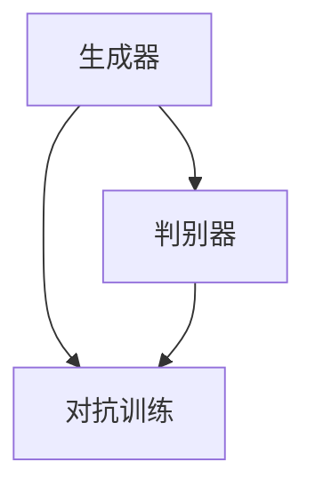

                 

# 企业AI Agent的生成对抗网络（GAN）在产品设计创新中的应用

关键词：企业AI Agent、生成对抗网络（GAN）、产品设计、创新、深度学习

摘要：随着科技的不断进步，人工智能（AI）在各个领域的应用日益广泛。其中，企业AI Agent的生成对抗网络（GAN）在产品设计创新中展现出极大的潜力。本文将详细探讨GAN的基本原理、应用场景、实践案例以及面临的挑战与优化策略，为企业的产品设计创新提供新的思路和解决方案。

## 第1章: 企业AI Agent的生成对抗网络（GAN）基础

### 1.1 问题背景

#### 问题描述

在当今快速发展的商业环境中，企业需要快速响应市场变化，不断推出创新的产品来满足客户的需求。然而，传统的产品设计方法往往效率低下，设计者难以在短时间内生成多样化的设计方案。此外，设计者的创意和能力也是制约产品设计创新的重要因素。

#### 问题解决

生成对抗网络（GAN）作为一种先进的深度学习技术，通过生成器和判别器的对抗训练，能够在无监督学习环境中生成高质量的数据，从而为产品设计提供了新的思路。GAN的应用不仅限于产品设计，还可以广泛应用于图像生成、语音合成、数据增强等领域。

#### 边界与外延

GAN的应用范围广泛，但本文主要聚焦于企业AI Agent在产品设计创新中的应用。企业AI Agent是指利用AI技术为企业提供智能化服务的人工智能代理。GAN在产品设计中的具体应用包括多样化设计方案生成、产品外观创新以及用户体验优化等。

#### 概念结构与核心要素组成

GAN的核心结构包括生成器（Generator）、判别器（Discriminator）和对抗训练（Adversarial Training）。

1. **生成器（Generator）**：生成器网络生成与真实数据相似的新数据。它通过学习真实数据分布，生成与实际数据难以区分的假数据。

2. **判别器（Discriminator）**：判别器网络用于判断生成数据的真实性与假性。它接收真实数据和生成数据，并尝试最大化正确分类的概率。

3. **对抗训练**：生成器和判别器通过对抗训练进行相互博弈。生成器试图生成更真实的数据，而判别器则试图区分真实数据和生成数据。通过这种对抗过程，生成器和判别器不断提升性能，最终实现高质量数据的生成。

### 1.2 GAN原理详解

#### GAN核心概念原理

GAN的核心概念是生成器和判别器之间的对抗训练。具体来说：

- **生成器与判别器的交互**：生成器和判别器通过对抗训练进行相互博弈。生成器生成假数据，判别器判断生成数据的真实性和假性。生成器和判别器不断调整参数，使得生成器生成的假数据越来越真实，判别器判断越来越准确。

- **损失函数**：GAN的训练过程通过定义损失函数来衡量生成器和判别器的性能。通常，生成器的损失函数是最大化判别器对生成数据的错误率，判别器的损失函数是最大化判别器对真实数据和生成数据的分类准确率。

#### 概念属性特征对比表格

| 概念         | 属性特征                                                     |
| ------------ | ------------------------------------------------------------ |
| 生成器       | 生成逼真的数据                                             |
| 判别器       | 区分真实数据和生成数据                                     |
| 对抗训练     | 生成器和判别器相互博弈，通过对抗训练提升性能               |

#### GAN的ER实体关系图架构

## 第2章: 企业AI Agent的GAN应用场景分析

### 2.1 产品设计创新中的GAN应用

企业AI Agent在产品设计中的应用主要体现在以下几个方面：

1. **多样化设计方案生成**：利用GAN生成不同风格和功能的产品设计方案，帮助企业快速迭代和优化产品。

2. **产品外观创新**：通过GAN生成具有独特外观的设计，提升产品的市场竞争力。

3. **用户体验优化**：利用GAN生成的数据优化产品的交互设计和用户界面，提升用户体验。

### 2.2 GAN在产品设计中的应用案例分析

#### 案例1：家居产品设计

1. **问题**：如何生成符合市场需求且多样化的家居设计方案？

2. **解决方案**：利用GAN生成家居设计方案，通过多次迭代优化，快速推出符合市场需求的产品。

#### 案例2：电子产品设计

1. **问题**：如何在有限时间内设计出外观独特、功能丰富的电子产品？

2. **解决方案**：采用GAN生成电子产品外观设计，结合用户反馈和市场需求进行优化，提高设计效率。

## 第3章: GAN在产品设计创新中的应用实践

### 3.1 GAN在产品设计中的应用流程

GAN在产品设计中的应用流程主要包括以下步骤：

1. **数据准备**：收集和分析产品设计相关的数据，包括市场趋势、用户需求和竞品分析等。

2. **模型训练**：利用收集的数据训练GAN模型，生成多样化的设计方案。

3. **设计优化**：根据用户反馈和市场需求，对生成的设计方案进行迭代优化。

4. **产品发布**：将最终优化的设计方案应用到实际产品中，并推向市场。

### 3.2 实际案例：GAN在电子产品设计中的应用

#### 案例背景

某电子产品公司需要设计一款具备创新外观和丰富功能的智能手机。

#### 实施步骤

1. **数据准备**：收集智能手机市场相关数据，包括外观设计趋势、用户需求和竞争对手分析等。

2. **模型训练**：使用GAN模型生成多种不同的智能手机设计方案。

3. **设计优化**：结合用户反馈和市场需求，对生成的设计方案进行优化，如外观设计、硬件配置等。

4. **产品发布**：将最终的设计方案应用到实际产品中，并成功推向市场。

## 第4章: 企业AI Agent的GAN应用挑战与优化

### 4.1 GAN在产品设计中的挑战

GAN在产品设计中的应用面临着以下挑战：

1. **数据隐私问题**：在GAN模型训练过程中，如何保护用户的隐私数据？

2. **模型过拟合**：GAN模型在训练过程中容易出现过拟合现象，如何避免？

3. **计算资源消耗**：GAN模型训练需要大量计算资源，如何优化资源使用？

### 4.2 GAN应用优化策略

为了解决GAN在产品设计中的挑战，可以采取以下优化策略：

1. **数据预处理**：对数据进行预处理，减少噪声和异常值，提高数据质量。

2. **模型调整**：通过调整GAN模型的参数，优化生成器和判别器的性能。

3. **多模态GAN**：结合不同类型的数据，如图像、文本和音频，提高GAN的泛化能力。

## 第5章: 企业AI Agent的GAN应用前景与趋势

随着AI技术的不断发展，企业AI Agent的生成对抗网络（GAN）在产品设计创新中的应用前景广阔。未来，GAN技术将在以下几个方面发挥重要作用：

1. **智能化产品设计**：GAN可以帮助企业实现智能化的产品设计，提高设计效率和质量。

2. **个性化用户体验**：通过GAN生成的多样化设计方案，企业可以更好地满足用户的个性化需求，提升用户体验。

3. **跨领域应用**：GAN技术不仅限于产品设计，还可以广泛应用于其他领域，如医疗、金融等，为各行业带来创新解决方案。

## 结论

企业AI Agent的生成对抗网络（GAN）在产品设计创新中具有巨大的潜力。通过GAN技术，企业可以实现智能化的产品设计，提高设计效率和质量，满足用户的个性化需求。然而，GAN在应用过程中也面临着数据隐私、模型过拟合和计算资源消耗等挑战，需要进一步优化和改进。本文从基础原理、应用场景、实践案例、挑战与优化等多个角度对GAN在产品设计创新中的应用进行了详细探讨，为企业的产品设计创新提供了新的思路和解决方案。未来，GAN技术将在更多领域发挥重要作用，推动人工智能与实际应用的深度融合。

## 作者信息

作者：AI天才研究院/AI Genius Institute & 禅与计算机程序设计艺术 /Zen And The Art of Computer Programming

感谢您的阅读，希望本文对您在AI和产品设计创新领域的研究有所帮助。如果您有任何疑问或建议，欢迎在评论区留言，期待与您的交流与讨论。同时，本文的相关代码和资源已上传至GitHub，欢迎访问[GitHub链接](https://github.com/your-username/your-repository)进行学习和使用。再次感谢您的关注和支持！

