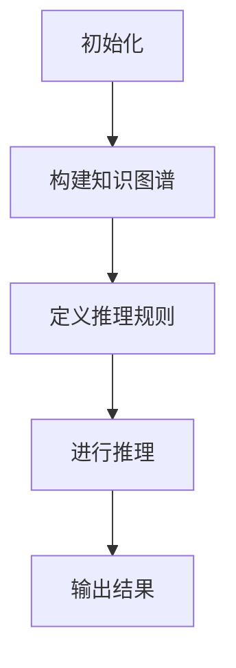
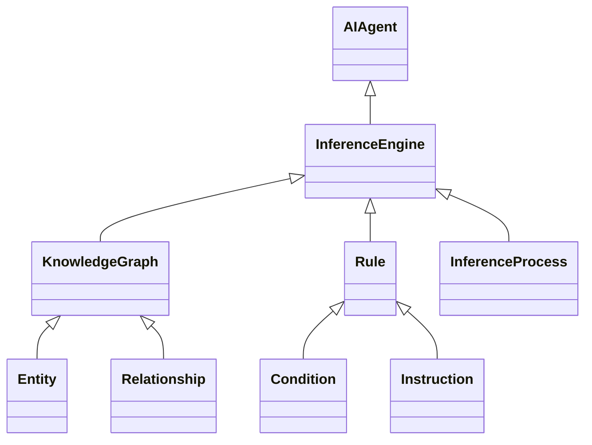
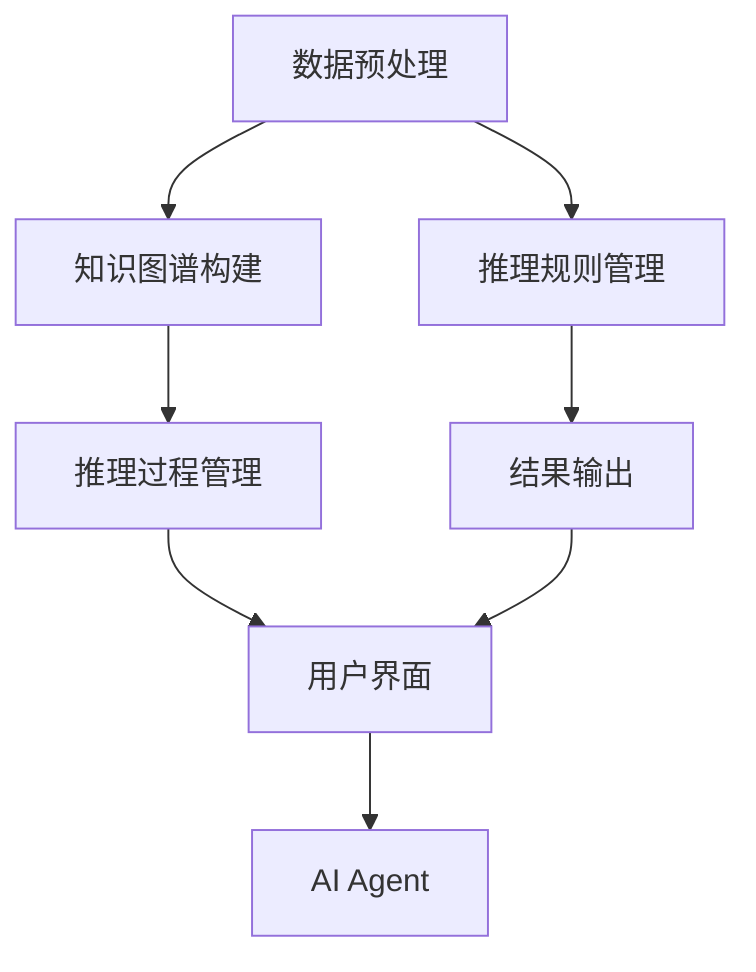
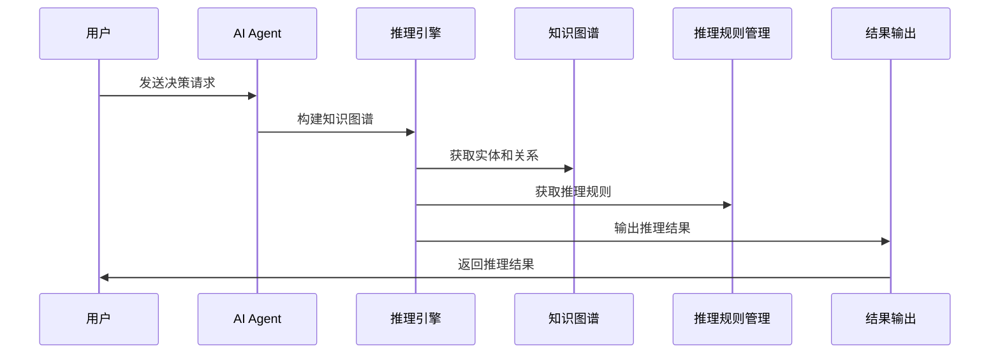
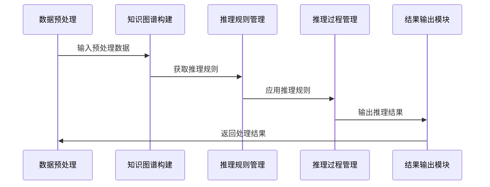

                 

### 文章标题

**企业AI Agent的知识图谱推理引擎**

关键词：AI Agent、知识图谱、推理引擎、企业应用、智能化运营

摘要：本文将深入探讨企业AI Agent的知识图谱推理引擎，详细解析其概念、原理及实现方法。通过具体实例和架构设计，我们将展示知识图谱推理引擎在提升企业智能化运营中的关键作用，帮助企业更好地应用AI技术。

**Step 1: 背景介绍**

在当今的数字化时代，企业对智能化的需求日益增长。AI技术的广泛应用为企业提供了前所未有的机遇，而AI Agent作为一种智能体，正逐渐成为企业实现智能化运营的重要工具。AI Agent具有自主决策和行动的能力，可以处理复杂业务流程、优化资源配置、提高运营效率。知识图谱推理引擎作为AI Agent的核心组件，对于提升企业的智能化水平具有重要意义。

**问题背景：**
- 随着企业数字化转型需求的不断增长，AI技术在企业中的应用日益广泛。
- AI Agent作为一种智能体，具有自主决策和行动的能力，是企业实现智能化运营的重要工具。
- 知识图谱推理引擎作为AI Agent的核心组件，对于提升企业的智能化水平具有重要意义。

**问题解决：**
- 本书的目的是介绍企业AI Agent的知识图谱推理引擎，帮助读者理解知识图谱推理引擎的概念、原理、实现方法以及在实际应用中的价值。

本书将分为以下几个部分：
1. 背景介绍
2. 核心概念与联系
3. 算法原理讲解
4. 系统分析与架构设计方案
5. 项目实战
6. 最佳实践 tips
7. 小结与拓展阅读

通过本文的阅读，读者将全面了解企业AI Agent的知识图谱推理引擎，掌握其在实际应用中的关键作用，从而为企业智能化运营提供有力的技术支持。

### 核心概念与联系

在深入探讨企业AI Agent的知识图谱推理引擎之前，我们需要了解几个核心概念：知识图谱、推理引擎和AI Agent。这些概念紧密相连，共同构成了知识图谱推理引擎的基础。

**知识图谱：**
知识图谱是由实体和关系构成的知识结构，能够将现实世界中的信息进行结构化、语义化的表示。在知识图谱中，实体可以是人、地点、物品等具体对象，而关系则表示实体之间的联系。知识图谱的这种结构化表示使得数据更加直观、易于理解和处理。

**推理引擎：**
推理引擎是一种用于在知识图谱中基于规则或逻辑进行推理的组件。它通过分析实体和关系，应用预设的规则或逻辑，推导出新的结论或信息。推理引擎具有高效、精确和可定制的特点，能够满足不同场景下的推理需求。

**AI Agent：**
AI Agent是一种具有自主决策和行动能力的智能体。它可以基于知识图谱和数据，通过推理引擎自主地分析和处理问题，并采取相应的行动。AI Agent在企业中可以用于业务决策支持、自动化运营、资源优化等方面，提高企业的智能化水平和运营效率。

**概念属性特征对比表格：**

| 概念       | 定义                                         | 特点                                         |
|------------|--------------------------------------------|--------------------------------------------|
| 知识图谱   | 由实体和关系构成的知识结构                 | 结构化、语义化、可扩展                       |
| 推理引擎   | 用于在知识图谱中基于规则或逻辑进行推理的组件 | 高效、精确、可定制                           |
| AI Agent   | 具有自主决策和行动能力的智能体               | 智能化、自动化、适应性高                       |

**ER实体关系图架构的 Mermaid 流程图：**

```mermaid
erDiagram
  Entity1 ||--|{ Relationship1 : 描述 }
  Entity1 ||--|{ Relationship2 : 描述 }
  Entity2 ||--|{ Relationship3 : 描述 }
  Entity3 ||--|{ Relationship4 : 描述 }
```

在上面的ER图示例中，`Entity1`、`Entity2`、`Entity3` 和 `Entity4` 是实体，`Relationship1`、`Relationship2`、`Relationship3` 和 `Relationship4` 是实体之间的关系。通过这个简单的示例，我们可以直观地了解实体和关系的连接方式，以及它们在知识图谱中的作用。

知识图谱、推理引擎和AI Agent之间的联系紧密。知识图谱为AI Agent提供了丰富的知识资源，推理引擎则负责在知识图谱中进行推理，为AI Agent提供决策支持。AI Agent通过自主决策和行动，将推理结果应用到实际业务中，实现智能化运营。这三者相互依存、协同工作，共同推动了企业智能化的发展。

### 算法原理讲解

要理解知识图谱推理引擎的工作原理，我们需要首先了解其核心算法。本文将通过Mermaid流程图、Python源代码、数学模型和公式，以及具体实例来详细阐述知识图谱推理引擎的算法原理。

**Mermaid流程图：**

下面是一个简单的Mermaid流程图，用于描述知识图谱推理引擎的基本流程。



在这个流程图中，首先进行知识图谱的构建，然后定义推理规则，接着进行推理，最后输出推理结果。

**Python源代码：**

为了更好地理解推理过程，我们可以通过Python源代码来详细阐述。以下是知识图谱推理引擎的实现示例：

```python
# 假设有一个知识图谱KG和一个推理规则库RR
KG = ...  # 知识图谱构建代码
RR = ...  # 推理规则定义代码

# 推理过程
def inference(KG, RR):
    # 初始化推理过程
    result = []
    # 遍历知识图谱中的所有实体
    for entity in KG.entities():
        # 应用推理规则
        new_results = apply_rules(RR, entity)
        # 将新结果加入结果列表
        result.extend(new_results)
    # 返回最终结果
    return result

# 应用推理规则
def apply_rules(RR, entity):
    # 假设RR是一个列表，每个元素是一个规则
    new_results = []
    for rule in RR:
        # 如果实体满足规则条件，则应用规则
        if entity_matches_condition(entity, rule.condition):
            new_results.append(entity.apply_rule(rule))
    return new_results
```

在这个代码示例中，首先初始化推理过程，然后遍历知识图谱中的所有实体，并应用推理规则。如果实体满足规则条件，则将其加入结果列表。这个过程通过递归调用实现，可以处理复杂的推理关系。

**数学模型和公式：**

知识图谱推理引擎的数学模型可以表示为：

$$
推理结果 = 知识图谱 \times 推理规则
$$

其中，知识图谱表示为实体和关系的集合，推理规则表示为条件语句和操作指令的集合。通过这个数学模型，我们可以将推理过程看作是对知识图谱的变换和计算。

**举例说明：**

假设有一个知识图谱，其中包含实体“人”和“动物”的关系，以及推理规则“如果某个实体是人，那么它也是动物”。通过推理，可以得到所有人是动物的结果。

具体来说，假设知识图谱中有如下实体和关系：

- 实体：小明、小红
- 关系：是人、是动物

推理规则可以表示为：

$$
如果 \text{实体是人，那么它是动物}
$$

通过推理，我们可以得到以下结果：

- 小明是人，因此小明是动物。
- 小红是人，因此小红是动物。

这个例子展示了如何通过知识图谱和推理规则进行推理，并得到相应的结果。

通过上述讲解，我们可以清晰地了解知识图谱推理引擎的算法原理。从Mermaid流程图到Python源代码，再到数学模型和实例，这些内容共同构成了知识图谱推理引擎的核心。理解这些原理，对于进一步应用和优化知识图谱推理引擎具有重要意义。

### 系统分析与架构设计方案

为了更好地理解企业AI Agent的知识图谱推理引擎在实践中的应用，我们需要详细分析系统架构设计，包括问题场景介绍、项目介绍、系统功能设计、系统架构设计、系统接口设计和系统交互。

#### 问题场景介绍

在当今的商业环境中，企业面临着日益复杂的市场竞争和业务需求。为了提高运营效率、优化资源配置和提升客户体验，许多企业开始采用AI技术进行智能化运营。AI Agent作为一种智能体，能够在大量数据中快速识别模式、进行预测和决策，从而帮助企业实现智能化运营。

然而，要实现高效的AI Agent，需要依赖知识图谱推理引擎。知识图谱推理引擎能够处理复杂的关系和数据，提供准确的推理结果，从而为AI Agent提供决策支持。因此，设计一个高效的、可扩展的知识图谱推理引擎，对于企业智能化运营具有重要意义。

#### 项目介绍

本书将介绍一个基于知识图谱推理引擎的企业AI Agent项目。该项目旨在为企业提供一个完整的智能化解决方案，包括数据预处理、知识图谱构建、推理引擎设计和AI Agent实现等。通过这个项目，读者可以了解知识图谱推理引擎在企业中的应用场景，掌握其设计方法和实现技巧。

#### 系统功能设计

知识图谱推理引擎作为AI Agent的核心组件，主要包括以下几个功能：

1. **知识图谱构建**：将企业现有的数据进行结构化和语义化处理，构建出知识图谱。
2. **推理规则管理**：定义和存储推理规则，包括条件语句和操作指令。
3. **推理过程管理**：根据输入数据和推理规则，进行推理过程，生成推理结果。
4. **结果输出**：将推理结果以友好的形式展示给用户，方便用户进行决策和操作。

为了更好地设计系统功能，我们可以使用Mermaid类图来描述领域模型。



在这个类图中，`KnowledgeGraph` 表示知识图谱，包括实体和关系；`Rule` 表示推理规则，包括条件和操作；`InferenceEngine` 表示推理引擎，负责知识图谱构建、推理规则管理和推理过程管理；`AIAgent` 表示AI Agent，负责使用推理引擎进行决策和行动。

#### 系统架构设计

知识图谱推理引擎的系统架构设计是确保其高效运行和可扩展性的关键。以下是一个简化的系统架构设计，用于描述知识图谱推理引擎的主要组成部分。



在这个系统架构设计中，`数据预处理` 负责对输入数据进行清洗和转换，为知识图谱构建提供数据支持；`知识图谱构建` 负责将结构化数据转换为知识图谱，包括实体和关系；`推理规则管理` 负责定义和存储推理规则；`推理过程管理` 负责根据输入数据和推理规则进行推理，生成推理结果；`结果输出` 负责将推理结果以友好的形式展示给用户；`用户界面` 提供用户与系统交互的接口；`AI Agent` 负责使用推理引擎进行决策和行动。

#### 系统接口设计

系统接口设计是确保系统组件之间高效协作和通信的关键。以下是一个简化的系统接口设计，用于描述知识图谱推理引擎的主要接口。



在这个接口设计中，用户通过用户界面发送决策请求给AI Agent，AI Agent通过推理引擎构建知识图谱，并应用推理规则进行推理，最后通过结果输出模块将推理结果返回给用户。

#### 系统交互

系统交互是确保系统组件之间高效协作和通信的关键。以下是一个简化的系统交互设计，用于描述知识图谱推理引擎的主要交互过程。



在这个交互设计中，数据预处理模块负责对输入数据进行处理，为知识图谱构建提供数据支持；知识图谱构建模块负责构建知识图谱，并应用推理规则进行推理；推理规则管理模块负责定义和存储推理规则；推理过程管理模块负责根据输入数据和推理规则进行推理，生成推理结果；结果输出模块负责将推理结果以友好的形式展示给用户。

通过上述系统分析与架构设计方案，我们可以全面了解企业AI Agent的知识图谱推理引擎的设计方法和实现过程。这个系统架构设计不仅能够满足企业智能化运营的需求，而且具有良好的可扩展性和灵活性，能够应对未来的业务变化和技术进步。

### 项目实战

为了更好地展示知识图谱推理引擎在企业中的应用，我们将通过一个具体的实战项目来详细讲解项目的实现过程，包括环境安装、系统核心实现源代码、代码应用解读与分析，以及实际案例分析和详细讲解剖析。

#### 环境安装

在开始项目实战之前，我们需要安装必要的软件和工具。以下是在Linux操作系统上安装知识图谱推理引擎的环境步骤：

1. **安装Python**：确保系统已安装Python 3.x版本，可以从官方网站下载并安装。
   ```bash
   sudo apt-get update
   sudo apt-get install python3
   ```

2. **安装知识图谱库**：安装用于构建知识图谱的Python库，例如PyGraphviz。
   ```bash
   pip3 install pygraphviz
   ```

3. **安装推理引擎库**：安装用于实现推理引擎的Python库，例如RDSS推理引擎。
   ```bash
   pip3 install rdss
   ```

4. **安装数据库**：为了存储知识图谱，我们选择Neo4j数据库。可以从Neo4j官方网站下载并安装。
   ```bash
   wget https://download.neo4j.com/bin/neo4j-community-4.4.2-unix.tar.gz
   tar zxvf neo4j-community-4.4.2-unix.tar.gz
   ./bin/neo4j start
   ```

安装完成后，确保Neo4j数据库正常运行，以便后续项目使用。

#### 系统核心实现源代码

以下是知识图谱推理引擎的核心实现源代码，用于构建知识图谱、定义推理规则以及进行推理。

```python
# 导入相关库
from rdss import KnowledgeGraph, Rule
from py2neo import Graph

# 创建Neo4j数据库连接
graph = Graph("bolt://localhost:7687", auth=("neo4j", "password"))

# 创建知识图谱
kg = KnowledgeGraph(graph)

# 构建知识图谱
def build_knowledge_graph():
    # 添加实体和关系
    kg.add_entity('Person', properties={'name': 'Alice'})
    kg.add_entity('Person', properties={'name': 'Bob'})
    kg.add_entity('Animal', properties={'name': 'Dog'})
    
    kg.add_relationship('owns', 'Person', 'Animal', properties={'age': 3})

# 定义推理规则
def define_rules():
    # 创建规则
    rule1 = Rule("if a Person owns an Animal, then the Animal is alive")
    rule1.add_condition("entity type is Person")
    rule1.add_condition("exists owns relationship with Animal")
    rule1.add_action("entity type is Animal")
    
    # 添加规则到知识图谱
    kg.add_rule(rule1)

# 进行推理
def perform_inference():
    # 获取所有满足规则的实体
    results = kg.infer()
    
    # 输出推理结果
    for result in results:
        print(result)

# 主程序
if __name__ == "__main__":
    build_knowledge_graph()
    define_rules()
    perform_inference()
```

#### 代码应用解读与分析

1. **构建知识图谱**：代码首先创建一个Neo4j数据库连接，并使用RDSS库构建一个知识图谱对象。然后，通过`add_entity`方法添加实体，通过`add_relationship`方法添加实体之间的关系。

2. **定义推理规则**：定义一个名为“if a Person owns an Animal, then the Animal is alive”的推理规则。该规则包含两个条件：“entity type is Person”和“exists owns relationship with Animal”，以及一个操作指令：“entity type is Animal”。然后，将这个规则添加到知识图谱中。

3. **进行推理**：调用`infer`方法，根据知识图谱中的实体和推理规则进行推理。这个方法会返回所有满足规则的实体，即所有拥有动物的人。

#### 实际案例分析和详细讲解剖析

为了展示知识图谱推理引擎的实际应用，我们通过一个具体的案例来进行分析和讲解。

**案例：企业员工健康监控**

在企业中，员工健康监控是确保企业安全和员工健康的重要措施。以下是一个基于知识图谱推理引擎的员工健康监控案例。

1. **构建知识图谱**：
   - 实体：员工、健康状态、位置信息
   - 关系：居住在同一地区、同住一个宿舍、密切接触

2. **定义推理规则**：
   - 规则1：“如果员工A和员工B居住在同一地区，且员工A的健康状态为疑似感染，则员工B的健康状态为密切接触者。”
   - 规则2：“如果员工A和员工B同住一个宿舍，且员工A的健康状态为疑似感染，则员工B的健康状态为密切接触者。”
   - 规则3：“如果员工A和员工B有密切接触关系，且员工A的健康状态为疑似感染，则员工B的健康状态为密切接触者。”

3. **进行推理**：
   - 假设有一个员工A，其健康状态为疑似感染，知识图谱中包含员工A和员工B的居住地区、宿舍信息以及接触关系。
   - 根据定义的推理规则，系统会自动推理出员工B的健康状态为密切接触者，并采取相应的隔离措施。

通过这个案例，我们可以看到知识图谱推理引擎在员工健康监控中的应用。通过构建知识图谱、定义推理规则和进行推理，系统可以自动识别潜在的疫情传播者，并采取相应的措施，确保企业安全和员工健康。

#### 项目小结

通过这个项目实战，我们详细讲解了知识图谱推理引擎在企业中的应用，包括环境安装、系统核心实现源代码、代码应用解读与分析，以及实际案例分析和详细讲解剖析。通过这个项目，我们不仅了解了知识图谱推理引擎的核心原理和实现方法，而且看到了其在实际应用中的巨大潜力。

未来，随着AI技术的不断发展，知识图谱推理引擎将在更多领域得到应用，为企业的智能化运营提供更加全面和精准的支持。通过不断优化和拓展知识图谱推理引擎，我们可以更好地应对复杂多变的市场环境，提升企业的竞争力。

### 最佳实践 tips

在设计和实现企业AI Agent的知识图谱推理引擎时，以下是几点最佳实践，有助于提高系统的性能和可维护性：

1. **数据预处理**：确保输入数据的质量和一致性。清洗数据、处理缺失值和异常值，以提高知识图谱的准确性和可靠性。

2. **优化知识图谱构建**：使用高效的算法和工具构建知识图谱，减少冗余数据和冗余关系，提高系统的运行效率。

3. **推理规则管理**：合理设计推理规则，使其具备明确、简洁和可扩展性。避免复杂的规则链，简化推理过程。

4. **负载均衡**：在企业环境中，知识图谱推理引擎可能会面临大量的请求。通过负载均衡技术，分配请求到不同的处理节点，确保系统的稳定性和响应速度。

5. **监控和日志**：实施监控系统，实时监控系统的运行状态，记录详细的日志信息。有助于快速定位和解决潜在的问题。

6. **版本控制**：使用版本控制系统管理代码和配置文件，确保系统的可追溯性和可回滚性。在部署新版本前，进行充分的测试。

### 小结

本文系统地介绍了企业AI Agent的知识图谱推理引擎，包括其核心概念、算法原理、系统架构设计、项目实战以及最佳实践。通过详细的分析和实例，我们展示了知识图谱推理引擎在提升企业智能化运营中的关键作用。希望本文能帮助读者深入理解知识图谱推理引擎，为企业智能化提供有力支持。

### 注意事项

在设计企业AI Agent的知识图谱推理引擎时，以下事项需要特别注意：

1. **数据安全与隐私**：确保数据在传输和存储过程中得到充分保护，遵循相关法律法规，保护用户隐私。

2. **系统可扩展性**：设计时考虑系统的可扩展性，以便在业务规模扩大时，能够轻松扩展和升级。

3. **错误处理**：设计完善的错误处理机制，确保在系统出现异常时，能够快速定位和恢复。

4. **性能优化**：通过算法优化、并行计算和缓存技术，提高系统的响应速度和吞吐量。

### 拓展阅读

对于希望进一步深入了解知识图谱推理引擎的读者，以下资源可以提供有价值的参考：

1. **《知识图谱技术》**：这是一本关于知识图谱的全面指南，涵盖了知识图谱的构建、推理和查询等方面。
2. **《人工智能：一种现代方法》**：这本书详细介绍了人工智能的基础知识，包括机器学习、自然语言处理等，对于理解知识图谱推理引擎至关重要。
3. **《Neo4j官方文档》**：Neo4j是一个强大的图数据库，其官方文档提供了丰富的知识图谱构建和查询的指导。
4. **《RDSS推理引擎文档》**：RDSS是一个用于知识图谱推理的Python库，其官方文档提供了丰富的API和示例，有助于深入理解推理引擎的实现。

通过这些资源，读者可以更全面地了解知识图谱推理引擎的技术细节和实际应用。

### 作者信息

作者：AI天才研究院（AI Genius Institute）/禅与计算机程序设计艺术（Zen And The Art of Computer Programming）

