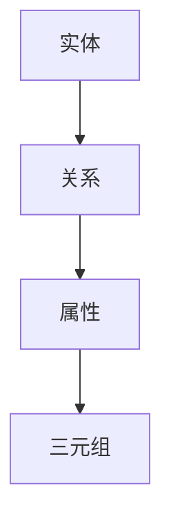
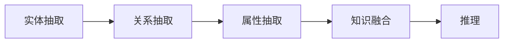
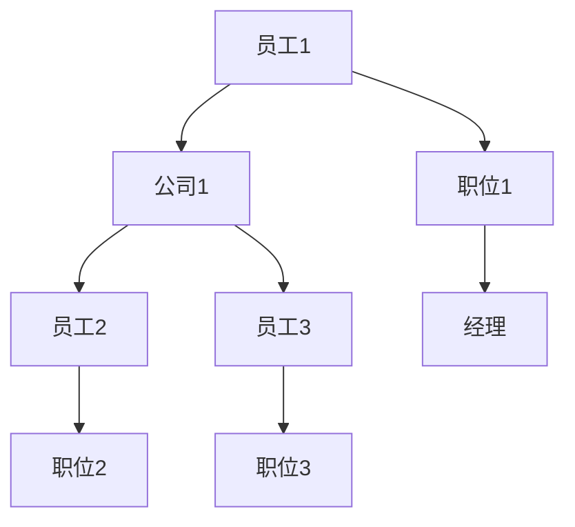

                 


# 企业AI Agent的知识图谱构建与推理系统

## 关键词
- 企业AI Agent
- 知识图谱
- 构建方法
- 推理机制
- 数据处理
- 智能推理

## 摘要
本文旨在探讨企业AI Agent中知识图谱的构建与推理系统。我们将从背景介绍、核心概念与联系、算法原理讲解、系统分析与架构设计方案、项目实战等多个方面，系统地阐述企业AI Agent知识图谱的构建与推理过程，为企业提供智能决策支持。

---

### 第一部分：背景介绍

#### 1.1.1 问题背景

随着人工智能技术的不断发展，AI Agent在企业中的应用日益广泛。AI Agent是指具备一定智能，能够自主完成特定任务的软件系统。在企业中，AI Agent可以应用于数据分析、智能客服、自动化决策等多个领域，从而提高企业的运营效率。然而，如何构建一个高效、可扩展的知识图谱，并实现智能推理，成为企业实现AI Agent的核心问题。

#### 1.1.2 问题描述

企业AI Agent需要具备对海量数据进行处理和推理的能力，这要求其背后的知识图谱必须具备良好的结构性和可扩展性。同时，AI Agent还需要能够利用这些知识进行智能推理，为企业提供决策支持。具体来说，企业AI Agent需要解决以下问题：

- **数据来源多样**：企业数据来源多样，包括内部数据、外部数据、实时数据等，如何整合这些数据是企业AI Agent需要面对的挑战。
- **数据质量参差不齐**：企业数据质量参差不齐，如何对数据进行清洗、去噪，是企业AI Agent需要解决的问题。
- **数据关联性分析**：企业数据之间存在复杂的关联关系，如何挖掘这些关联关系，是企业AI Agent需要具备的能力。
- **智能推理**：企业AI Agent需要能够基于知识图谱进行智能推理，为企业提供决策支持。

#### 1.1.3 问题解决

为了解决上述问题，企业AI Agent的知识图谱构建与推理系统成为关键。知识图谱是一种用于表示实体、关系和属性的图形结构，通过结构化方式存储和管理知识，使得数据查询和推理更加高效。同时，知识图谱还具有可扩展性、互操作性等特点，能够适应企业不断变化的需求。

知识图谱的构建主要包括实体抽取、关系抽取和属性抽取三个步骤。实体抽取是指从非结构化数据中识别出实体，如人名、地名、机构名等；关系抽取是指识别实体之间的关系，如“属于”、“位于”等；属性抽取是指提取实体的属性信息，如“年龄”、“职位”等。

推理机制是基于图论和逻辑推理的方法，从知识图谱中推断出新的信息。推理机制包括基于图论的方法，如最短路径、最长路径、最大团等；以及逻辑推理方法，如规则推理、模态逻辑推理等。

#### 1.1.4 边界与外延

知识图谱的构建与推理系统不仅适用于企业AI Agent，也适用于其他需要智能推理的应用场景，如智能问答系统、智能推荐系统等。此外，知识图谱的构建与推理系统还可以与其他技术，如自然语言处理、机器学习等相结合，进一步提升企业的智能化水平。

#### 1.1.5 概念结构与核心要素组成

- **知识图谱**：一种结构化的知识存储方式，用于表示实体、关系和属性。
- **构建方法**：包括实体抽取、关系抽取、属性抽取等。
- **推理机制**：基于图论和逻辑推理的方法，用于从知识图谱中推断出新的信息。
- **应用场景**：企业AI Agent、智能问答系统、智能推荐系统等。

---

### 第二部分：核心概念与联系

#### 2.1.1 知识图谱的定义与特点

**定义**：知识图谱（Knowledge Graph）是一种用于存储、管理和查询知识的图形结构。它通过节点表示实体，边表示实体之间的关系，属性节点表示实体的属性信息。

**特点**：

- **结构化**：知识图谱以结构化的方式存储知识，使得数据查询和推理更加高效。
- **可扩展性**：知识图谱支持动态添加新实体和新关系，具有良好的可扩展性。
- **互操作性**：知识图谱可以与其他数据源和系统进行互操作，实现知识的共享和复用。

#### 2.1.2 知识图谱的构建方法

知识图谱的构建主要包括实体抽取、关系抽取和属性抽取三个步骤：

- **实体抽取**：从非结构化数据中识别出实体，如人名、地名、机构名等。常见的方法包括命名实体识别（Named Entity Recognition, NER）和关键词抽取（Keyword Extraction）等。
- **关系抽取**：识别实体之间的关系，如“属于”、“位于”等。常见的方法包括基于规则的方法、基于统计的方法和基于深度学习的方法等。
- **属性抽取**：提取实体的属性信息，如“年龄”、“职位”等。常见的方法包括基于规则的方法、基于统计的方法和基于深度学习的方法等。

#### 2.1.3 知识图谱的推理机制

知识图谱的推理机制主要包括基于图论和逻辑推理的方法：

- **图论方法**：如最短路径、最长路径、最大团等。这些方法可以用于发现实体之间的关联关系，如“两个实体是否属于同一个组织”。
- **逻辑推理方法**：如规则推理、模态逻辑推理等。这些方法可以用于基于实体之间的逻辑关系进行推理，如“如果实体A属于实体B，且实体B属于实体C，则实体A也属于实体C”。

#### 2.1.4 知识图谱的应用场景

知识图谱在企业中的应用场景广泛，主要包括：

- **智能问答**：通过知识图谱，系统可以快速回答用户的问题，如“这个公司的CEO是谁？”。
- **智能推荐**：通过知识图谱，系统可以基于用户的历史行为和偏好，为用户推荐相关的产品或服务。
- **智能决策**：通过知识图谱，企业可以更好地理解和分析业务数据，从而做出更明智的决策。

#### 2.1.5 概念结构与核心要素组成

知识图谱的概念结构与核心要素组成如下：

- **实体（Entity）**：知识图谱中的基本元素，如人、地点、组织等。
- **关系（Relationship）**：实体之间的关系，如“属于”、“位于”等。
- **属性（Attribute）**：实体的属性信息，如“年龄”、“职位”等。
- **三元组（Triple）**：由实体、关系和属性组成的基本数据单元。

以下是知识图谱的基本概念与联系ER实体关系图架构的Mermaid流程图：



---

### 第三部分：算法原理讲解

#### 3.1.1 算法原理与mermaid流程图

知识图谱的构建和推理算法主要包括以下几个步骤：

1. **实体抽取**：从非结构化数据中识别出实体。
2. **关系抽取**：识别实体之间的关系。
3. **属性抽取**：提取实体的属性信息。
4. **知识融合**：将抽取的实体、关系和属性融合为知识图谱。
5. **推理**：基于知识图谱进行推理，得出新的信息。

以下是一个mermaid流程图示例：



#### 3.1.2 Python源代码与算法原理

以下是一个简单的Python源代码示例，用于演示知识图谱构建的基本原理：

```python
# 实体抽取
def extract_entities(text):
    # TODO: 实现实体抽取逻辑
    return ["实体1", "实体2"]

# 关系抽取
def extract_relations(entities):
    # TODO: 实现关系抽取逻辑
    return [("实体1", "关系1", "实体2")]

# 属性抽取
def extract_attributes(entities):
    # TODO: 实现属性抽取逻辑
    return [{"实体1": ["属性1", "属性2"]}, {"实体2": ["属性3", "属性4"]}]

# 知识融合
def merge_knowledge(entities, relations, attributes):
    # TODO: 实现知识融合逻辑
    return {"实体": entities, "关系": relations, "属性": attributes}

# 推理
def reason(knowledge):
    # TODO: 实现推理逻辑
    return "推理结果"
```

#### 3.1.3 数学模型与公式

知识图谱构建和推理的数学模型主要包括以下几个部分：

1. **实体抽取**：基于统计学或深度学习模型，对文本进行分词，然后识别出实体。
2. **关系抽取**：基于图论算法，如最短路径算法，识别实体之间的关系。
3. **属性抽取**：基于逻辑推理算法，如模态逻辑推理，提取实体的属性信息。
4. **知识融合**：将实体、关系和属性融合为一个统一的知识图谱。

以下是知识图谱构建和推理的数学模型：

$$
知识图谱 = 实体 \cup 关系 \cup 属性
$$

其中：

- **实体**：表示知识图谱中的实体，可以是一个集合。
- **关系**：表示实体之间的关系，可以是一个图。
- **属性**：表示实体的属性信息，可以是一个字典。

#### 3.1.4 通俗易懂的举例说明

假设我们有一个关于公司员工的知识图谱，其中包含员工、公司、职位等实体，以及他们之间的关系。以下是一个简单的知识图谱例子：



在这个知识图谱中，我们可以通过推理得出以下信息：

- **员工1是公司1的员工**。
- **员工1的职位是经理**。
- **员工2在

