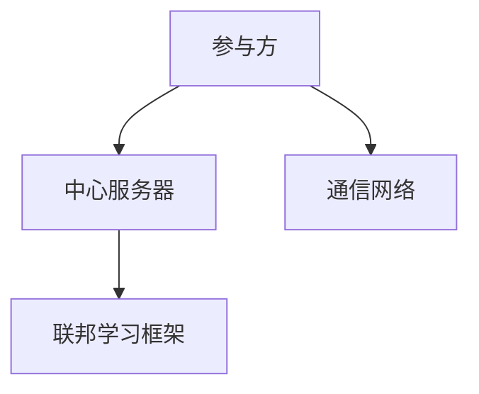
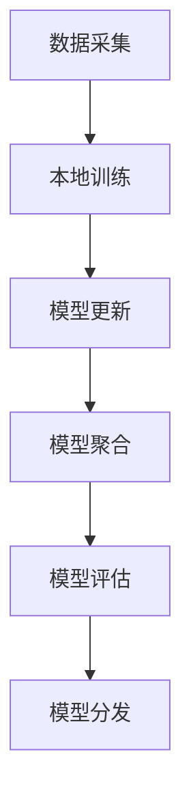
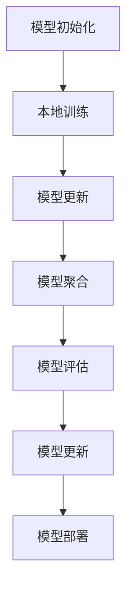

                 

# 企业AI Agent的联邦学习在跨部门数据协作中的实践与挑战

> 关键词：联邦学习、AI Agent、跨部门数据协作、数据隐私、模型优化、安全性与鲁棒性

> 摘要：本文深入探讨了企业AI Agent的联邦学习在跨部门数据协作中的应用，通过分析其基础概念、融合应用、实践案例以及挑战对策，旨在为读者提供关于联邦学习在跨部门数据协作中的实际操作和未来发展方向的见解。本文将帮助企业和开发者更好地理解和应用联邦学习技术，以实现数据的安全共享和高效利用。

## 引言

随着数据驱动决策的重要性日益凸显，企业内部各部门之间的数据协作变得愈发重要。然而，数据隐私保护的需求也给跨部门数据协作带来了巨大的挑战。在这种背景下，联邦学习（Federated Learning）作为一种新兴的技术，受到了广泛关注。联邦学习允许各方在不共享原始数据的情况下协同训练机器学习模型，从而在保护数据隐私的同时实现数据的价值最大化。

本文将围绕企业AI Agent的联邦学习在跨部门数据协作中的实践与挑战展开讨论。文章结构如下：

1. **联邦学习基础**：介绍联邦学习的概念、原理和应用场景。
2. **AI Agent与联邦学习的融合**：探讨AI Agent的基本概念及其在联邦学习中的应用。
3. **联邦学习在跨部门数据协作中的实践**：分析具体案例，展示联邦学习的实施流程和挑战。
4. **联邦学习的挑战与对策**：探讨联邦学习在跨部门数据协作中面临的数据隐私、模型性能、安全性与鲁棒性等挑战，并提出相应的对策。
5. **联邦学习系统架构与设计**：详细描述联邦学习系统架构设计和AI Agent的实现方法。
6. **跨部门数据协作中的联邦学习应用**：分析联邦学习在市场营销、客户服务和供应链管理中的应用。
7. **未来趋势**：探讨联邦学习的未来发展趋势和跨部门数据协作中的机遇与挑战。

通过本文的讨论，我们希望能够为企业和开发者提供有益的参考，促进联邦学习技术在企业跨部门数据协作中的有效应用。

## 第一部分：企业AI Agent的联邦学习基础

### 第1章：联邦学习概述

#### 1.1.1 问题背景

随着大数据时代的到来，数据在企业决策中的作用变得越来越重要。然而，企业内部不同部门之间的数据往往存在较高的异质性，这使得跨部门数据协作成为了一项重要但具有挑战性的任务。首先，不同部门的数据格式和结构可能不同，这使得数据的整合变得复杂。其次，各部门对数据隐私保护的重视程度不同，导致数据共享存在障碍。此外，部门之间的协作机制和流程也可能不够成熟，影响了数据协作的效率。

为了解决这些问题，企业需要一种能够在不牺牲数据隐私的情况下实现数据共享和协同训练的技术。在这种背景下，联邦学习（Federated Learning）应运而生。联邦学习通过让各个部门在本地训练模型，然后将更新聚合起来进行全局模型训练，从而实现数据的安全共享和协同学习。这种技术不仅能够保护数据隐私，还能够提高模型训练的效率。

#### 1.1.2 联邦学习的概念与原理

联邦学习是一种分布式机器学习技术，其核心思想是将模型训练过程分散到多个独立的设备或数据中心进行，而不是将所有数据集中到一个地方。在联邦学习中，每个参与方（如企业内部的不同部门）都保留其数据的本地副本，并在此副本上进行模型训练。训练完成后，各方将模型的本地更新发送给一个中心服务器，服务器再将这些更新聚合起来，生成全局模型。这个全局模型随后被分发回各个参与方，用于后续的预测和决策。

联邦学习的原理可以概括为以下步骤：

1. **初始化全局模型**：中心服务器初始化一个全局模型，并将其分发到各个参与方。
2. **本地训练**：各个参与方在本地数据上使用全局模型进行训练，并生成本地更新。
3. **模型聚合**：中心服务器收集各个参与方的本地更新，并进行聚合，生成一个新的全局模型。
4. **迭代训练**：重复步骤2和3，直到满足停止条件（如模型收敛或达到预设的训练次数）。

联邦学习的关键技术包括：

- **模型更新**：如何有效地更新本地模型，并保证更新能够反映全局模型的变化。
- **模型聚合**：如何将多个本地模型更新聚合起来，生成一个新的全局模型。
- **通信效率**：如何在保证模型质量的同时，最大限度地减少通信成本。

#### 1.1.3 联邦学习的应用场景

联邦学习在企业内部数据协作中具有广泛的应用场景。以下是一些典型的应用：

- **跨部门数据整合**：企业内部不同部门通常拥有不同类型的数据，通过联邦学习，企业可以实现跨部门的数据整合，从而获得更全面和准确的业务洞察。
- **隐私保护**：联邦学习通过在本地训练模型并保持数据隐私，为企业提供了一个强大的隐私保护手段，有助于遵守数据保护法规。
- **协同决策**：联邦学习使得企业内部不同部门可以在不共享原始数据的情况下，协同训练模型，从而实现更高效的决策过程。

#### 1.1.4 联邦学习与传统集中式学习的区别

传统集中式学习将所有数据集中到一个中心服务器，然后在中心服务器上训练模型。这种方式虽然能够实现高效的模型训练，但同时也带来了数据隐私和安全的风险。相反，联邦学习将模型训练过程分散到各个参与方，每个参与方仅保留本地数据，并通过本地训练和模型更新来实现协同学习。这种方式不仅能够保护数据隐私，还能够提高模型训练的效率和鲁棒性。

表1-1：联邦学习与传统集中式学习的对比

| 特性 | 联邦学习 | 集中式学习 |
| --- | --- | --- |
| 数据隐私 | 保护 | 风险 |
| 模型效率 | 提高 | 降低 |
| 计算资源 | 分散 | 集中 |
| 通信成本 | 减少或均衡 | 增加 |
| 鲁棒性 | 提高 | 降低 |

通过上述对比，我们可以看出联邦学习在数据隐私保护、计算资源利用和通信成本控制等方面具有显著优势，这使得它在企业内部数据协作中具有巨大的应用潜力。

### 第2章：AI Agent与联邦学习的融合

#### 2.1.1 AI Agent的基本概念

AI Agent，即人工智能代理，是一种能够执行特定任务并具有自主决策能力的智能体。AI Agent通常基于机器学习算法，通过在大量数据上进行训练，学习如何在不同环境中进行决策和行动。AI Agent具有以下几个核心特点：

- **自主性**：AI Agent能够在没有人为干预的情况下，自主地执行任务。
- **适应性**：AI Agent能够根据环境的变化和新的数据，不断调整和优化自己的行为。
- **协同性**：AI Agent能够与其他AI Agent或人类协作，共同完成任务。

AI Agent的工作原理通常包括以下几个步骤：

1. **感知**：AI Agent通过传感器或其他方式感知环境状态。
2. **决策**：基于感知到的环境状态，AI Agent使用预训练的模型或算法进行决策。
3. **行动**：执行决策结果，调整自身状态或环境。
4. **反馈**：AI Agent将行动结果反馈给系统，用于后续的决策和优化。

#### 2.1.2 联邦学习中的AI Agent

在联邦学习中，AI Agent扮演着重要的角色。具体来说，AI Agent在联邦学习中的主要作用包括：

1. **本地训练与更新**：AI Agent在每个参与方（如企业内部的不同部门）的本地设备上进行模型训练，并生成本地更新。
2. **模型聚合与优化**：AI Agent参与全局模型的聚合过程，通过优化算法生成新的全局模型，并反馈给中心服务器。
3. **决策支持**：AI Agent在本地环境中进行预测和决策，支持企业内部的业务流程和决策。

AI Agent在联邦学习中的实现通常需要以下几个步骤：

1. **初始化**：AI Agent初始化模型参数，并从中心服务器获取全局模型。
2. **本地训练**：AI Agent在本地数据集上训练模型，并生成本地更新。
3. **模型聚合**：AI Agent将本地更新发送到中心服务器，参与全局模型的聚合。
4. **全局模型更新**：中心服务器根据AI Agent的本地更新生成新的全局模型，并反馈给各个AI Agent。
5. **迭代优化**：AI Agent在新的全局模型基础上继续进行本地训练和更新，优化模型性能。

#### 2.1.3 跨部门数据协作中的AI Agent应用

在跨部门数据协作中，AI Agent的应用可以显著提升数据协作的效率和质量。以下是AI Agent在跨部门数据协作中的几个关键应用场景：

1. **数据整合与预处理**：AI Agent可以自动整合来自不同部门的数据，并完成数据预处理任务，如数据清洗、归一化和特征提取。
2. **协同决策支持**：AI Agent可以协同工作，共同分析跨部门数据，为企业提供决策支持。例如，市场营销部门可以与销售部门合作，通过AI Agent分析用户行为数据，制定精准营销策略。
3. **实时预测与优化**：AI Agent可以实时预测市场趋势和业务指标，为企业提供动态优化方案。例如，生产部门可以根据销售部门的预测结果，实时调整生产计划，以应对市场需求变化。
4. **异常检测与风险管理**：AI Agent可以监控跨部门数据，检测异常行为和潜在风险，为企业提供风险预警和防控措施。

通过AI Agent的引入，跨部门数据协作不仅变得更加高效和智能化，还能够更好地应对数据隐私和安全问题，实现数据的最大价值化。

### 第3章：联邦学习在跨部门数据协作中的实践

#### 3.1.1 实践案例介绍

在本节中，我们将通过一个具体案例，展示联邦学习在跨部门数据协作中的实践过程。该案例来自于一家大型制造企业，该公司内部有三个主要部门：生产部门、销售部门和客户服务部门。这三个部门各自拥有大量的数据，如生产数据、销售数据和客户反馈数据。为了提高业务效率，公司决定通过联邦学习技术，实现跨部门数据协作。

#### 案例背景

该制造企业的业务流程通常如下：生产部门根据销售部门的订单信息进行生产安排，销售部门根据市场情况调整销售策略，客户服务部门负责收集和处理客户反馈。然而，由于数据分散在不同部门，数据共享和协作效率较低。此外，客户数据涉及到隐私问题，直接共享存在法律风险。

#### 案例目标

通过联邦学习技术，该企业希望实现以下目标：

1. **数据整合**：将生产部门、销售部门和客户服务部门的数据进行整合，形成统一的业务视图。
2. **协同决策**：通过联邦学习模型，实现跨部门的数据协同分析，提高决策效率。
3. **隐私保护**：在不共享原始数据的情况下，实现数据的协同学习和应用。

#### 3.1.2 实践流程与方法

为了实现上述目标，该企业采取了以下实践流程：

1. **数据采集**：各个部门分别收集自身的数据，包括生产数据、销售数据和客户反馈数据。为了保证数据质量和完整性，企业对数据进行了预处理，如数据清洗、去重和格式统一。

2. **数据预处理**：在数据采集完成后，企业对数据进行预处理，包括数据归一化、特征提取和缺失值处理。预处理后的数据被划分为训练集和测试集，用于后续的模型训练和评估。

3. **模型训练**：企业选择了一种基于深度学习的联邦学习框架，该框架支持不同部门的数据本地训练和模型聚合。在模型训练过程中，企业采用了分布式训练策略，以减少通信成本和提高训练效率。

4. **模型评估**：在模型训练完成后，企业使用测试集对模型进行评估，以验证模型的性能和可靠性。评估指标包括准确率、召回率、F1分数等。

5. **模型应用**：评估通过后，企业将全局模型分发回各个部门，用于实际业务应用。例如，生产部门可以根据模型预测结果调整生产计划，销售部门可以根据模型分析结果制定销售策略，客户服务部门可以根据模型预测结果提供更优质的客户服务。

#### 3.1.3 实践中遇到的问题与挑战

在联邦学习的实践过程中，企业遇到了以下几个问题和挑战：

1. **数据隐私保护**：由于客户数据涉及到隐私问题，企业必须确保在联邦学习过程中，数据不会被泄露或滥用。为此，企业采用了差分隐私（Differential Privacy）等技术，对数据进行了加密和扰动处理。

2. **模型性能优化**：在联邦学习过程中，由于数据分布的不均衡和模型参数的不一致，可能会导致模型性能下降。为了优化模型性能，企业对训练过程进行了多次调优，包括调整学习率、优化优化算法等。

3. **通信效率**：联邦学习涉及大量的数据传输和通信，为了提高通信效率，企业采用了数据压缩和缓存技术，以减少通信延迟和数据传输成本。

4. **系统安全性与鲁棒性**：由于联邦学习涉及到多个参与方，系统安全性和鲁棒性是关键问题。企业采用了区块链技术，确保数据的完整性和安全性，并实现了系统的故障恢复和容错机制。

通过克服上述问题和挑战，企业成功实现了跨部门数据协作，提高了业务效率和决策质量，为未来的发展奠定了坚实基础。

### 第4章：联邦学习在跨部门数据协作中的挑战与对策

#### 4.1.1 挑战分析

尽管联邦学习在跨部门数据协作中展示了巨大的潜力，但其实际应用仍然面临诸多挑战。以下是联邦学习在跨部门数据协作中面临的主要挑战：

1. **数据隐私保护**：联邦学习的一个核心优势在于保护数据隐私，但实现这一目标并不容易。由于各方数据的不同格式和结构，确保数据在传输和聚合过程中的安全性是一个复杂的问题。差分隐私和同态加密等技术虽然提供了一定的保护，但仍然存在性能和效率上的挑战。

2. **模型性能优化**：在联邦学习中，由于数据分布不均衡、噪声干扰以及通信带宽限制，模型性能可能会受到显著影响。这要求在本地训练阶段就需要精心设计和调优模型参数，以确保全局模型的性能。

3. **安全性与鲁棒性**：联邦学习涉及多个参与方，系统的安全性和鲁棒性是关键问题。恶意攻击、数据篡改和隐私泄露等安全风险可能导致模型失效或数据泄露。因此，如何确保系统的安全性和鲁棒性是一个亟待解决的问题。

#### 4.1.2 对策探讨

为了应对上述挑战，以下是一些有效的对策：

1. **隐私保护技术**：
   - **差分隐私**：通过添加噪声来保护数据隐私，确保单个记录的隐私不受泄露。然而，过多的噪声可能导致模型性能下降，因此需要在隐私保护和模型性能之间找到平衡点。
   - **同态加密**：允许在加密数据上进行计算，从而在不解密数据的情况下进行模型训练。同态加密虽然能提高数据安全性，但计算复杂度高，对计算资源有较高要求。

2. **模型优化策略**：
   - **个性化学习**：通过针对每个参与方设计个性化模型，可以更好地适应其本地数据的特点，从而提高模型性能。
   - **联邦平均**：通过减少每个参与方的本地更新频率，可以降低模型噪声，提高模型稳定性。
   - **元学习**：利用元学习算法，通过多次迭代训练，自动调整模型参数，优化模型性能。

3. **安全性与鲁棒性增强**：
   - **区块链技术**：利用区块链的不可篡改性，确保数据的完整性和透明度。此外，区块链技术还可以用于实现去中心化的联邦学习，提高系统的鲁棒性。
   - **多方安全计算**：通过多方安全计算（MPC）技术，实现多方之间的安全计算和通信，防止数据泄露和篡改。
   - **模型加密**：在模型传输和部署阶段，对模型进行加密处理，确保模型在运行过程中无法被篡改或窃取。

#### 4.1.3 未来发展趋势

未来，联邦学习在跨部门数据协作中的应用将呈现以下发展趋势：

1. **技术创新**：随着量子计算、边缘计算等新技术的不断发展，联邦学习将实现更高的性能和更广泛的应用场景。
2. **生态建设**：建立完善的联邦学习生态系统，包括联邦学习框架、工具、标准和最佳实践，将有助于推动联邦学习技术的广泛应用。
3. **跨领域融合**：联邦学习与其他技术（如大数据、云计算、物联网等）的深度融合，将促进跨行业的数据协作和创新。

通过不断的技术创新和生态建设，联邦学习有望在未来成为跨部门数据协作的重要工具，为企业和组织带来更大的价值。

### 第5章：联邦学习系统架构设计

#### 5.1.1 系统架构概述

联邦学习系统的架构设计是确保数据隐私保护、模型性能优化以及系统安全性的关键。一个典型的联邦学习系统架构包括以下几个主要功能模块：

1. **参与方**：参与方可以是企业内部的不同部门，也可以是多个外部合作伙伴。每个参与方拥有本地数据集和计算资源，负责本地模型的训练和更新。
2. **中心服务器**：中心服务器负责全局模型的初始化、聚合和分发。它是联邦学习系统的核心，确保各个参与方的模型更新能够有效聚合，生成全局模型。
3. **通信网络**：通信网络负责参与方与中心服务器之间的数据传输和通信。为了提高通信效率和安全性，通信网络通常采用加密和压缩技术。
4. **联邦学习框架**：联邦学习框架提供了一套完整的工具和接口，用于实现模型的本地训练、更新聚合和全局模型分发。常见的联邦学习框架包括Federated Learning Framework (FLow)和FedAvg等。

图5-1：联邦学习系统架构图

#### 5.1.2 数据流设计

联邦学习系统的数据流设计是确保系统高效运行的关键。以下是一个典型的数据流设计过程：

1. **数据采集**：各个参与方收集本地数据，并进行预处理，如数据清洗、归一化和特征提取。预处理后的数据被划分为训练集和验证集，用于后续的模型训练和评估。

2. **本地训练**：参与方使用本地训练集，根据全局模型初始化参数，训练本地模型。在训练过程中，参与方可能会使用分布式训练算法，如FedAvg，以提高训练效率。

3. **模型更新**：在本地训练完成后，参与方将本地模型的更新（梯度）发送到中心服务器。更新通常经过压缩和加密处理，以减少通信成本和保障数据隐私。

4. **模型聚合**：中心服务器收集各个参与方的模型更新，并进行聚合，生成一个新的全局模型。聚合过程可能包括加权平均或其他优化策略，以提高全局模型的性能。

5. **模型评估**：中心服务器使用验证集对全局模型进行评估，以检测模型性能。评估指标包括准确率、召回率、F1分数等。

6. **模型分发**：评估通过后，中心服务器将新的全局模型分发回各个参与方。参与方使用全局模型进行本地预测和决策。

图5-2：联邦学习系统的数据流设计

#### 5.1.3 模型流设计

联邦学习系统的模型流设计是确保模型从初始化到最终部署的各个环节都能够高效运行的关键。以下是一个典型的模型流设计过程：

1. **模型初始化**：中心服务器初始化全局模型，并将其分发到各个参与方。初始化参数可能包括模型架构、学习率、优化器等。

2. **本地训练**：参与方根据全局模型，在本地数据集上进行训练。本地训练可能包括数据预处理、模型训练和本地更新生成。

3. **模型更新**：参与方将本地更新（梯度）发送到中心服务器。更新可能经过压缩和加密处理，以减少通信成本和保障数据隐私。

4. **模型聚合**：中心服务器收集各个参与方的模型更新，并进行聚合，生成一个新的全局模型。聚合过程可能包括加权平均或其他优化策略，以提高全局模型的性能。

5. **模型评估**：中心服务器使用验证集对全局模型进行评估，以检测模型性能。评估指标包括准确率、召回率、F1分数等。

6. **模型更新**：如果模型评估通过，中心服务器将新的全局模型分发回各个参与方。参与方使用全局模型进行本地预测和决策。

7. **模型部署**：中心服务器将全局模型部署到生产环境中，用于实际业务应用。部署可能包括模型压缩、模型加密等步骤，以提高模型性能和安全性。

图5-3：联邦学习系统的模型流设计

通过上述系统架构、数据流和模型流的设计，联邦学习系统能够高效地实现数据隐私保护、模型性能优化和系统安全性，为跨部门数据协作提供强大的技术支持。

### 第6章：AI Agent设计与应用

#### 6.1.1 AI Agent设计原则

AI Agent的设计原则是确保其能够有效参与联邦学习，并在跨部门数据协作中发挥重要作用的关键。以下是设计AI Agent时需要遵循的几个核心原则：

1. **可扩展性**：AI Agent需要能够轻松扩展，以适应不同规模的数据集和复杂度不同的任务。这意味着AI Agent的设计应考虑模块化，使得新功能可以快速集成，同时保持系统的整体性能。

2. **自适应能力**：AI Agent需要在不断变化的环境中适应新的数据和需求。这包括自我调整模型参数、学习新的特征和快速响应环境变化的能力。自适应能力使AI Agent能够保持其性能和有效性，即使面对动态的数据环境。

3. **安全性**：AI Agent必须具备强大的安全性保障，以防止数据泄露和恶意攻击。这包括使用加密算法保护数据传输和存储，以及实现身份验证和访问控制，确保AI Agent只能被授权用户操作。

4. **分布式协同**：AI Agent应设计为能够与其他AI Agent和人类协同工作。这意味着AI Agent需要能够接收和发送信息，参与分布式计算，并与其他系统组件进行有效交互。

#### 6.1.2 AI Agent实现方法

实现AI Agent通常需要以下几个步骤：

1. **模块设计**：将AI Agent分解为多个功能模块，如感知模块、决策模块、执行模块和反馈模块。每个模块负责特定的任务，例如感知模块负责从环境中获取数据，决策模块负责基于数据生成行动方案，执行模块负责执行这些方案，反馈模块负责收集执行结果。

2. **算法选择**：根据AI Agent的任务需求，选择合适的机器学习算法和深度学习模型。例如，对于感知模块，可能需要使用卷积神经网络（CNN）或循环神经网络（RNN）进行特征提取；对于决策模块，可能需要使用强化学习或决策树进行决策。

3. **接口设计**：设计AI Agent的API接口，以便与其他系统组件（如联邦学习框架）进行通信。接口应包括数据输入、输出、配置和监控等基本功能。

4. **安全性实现**：在AI Agent的实现过程中，需要集成安全性措施，如加密通信、访问控制和日志审计。这些措施有助于保护AI Agent免受外部攻击和数据泄露。

5. **测试与优化**：在AI Agent开发完成后，进行严格的测试和优化，确保其能够在实际环境中稳定运行。测试应包括功能测试、性能测试和安全性测试。

#### 6.1.3 AI Agent在联邦学习中的应用

AI Agent在联邦学习中的应用可以显著提升系统的协同效率和决策质量。以下是一些具体的应用场景：

1. **本地数据预处理**：AI Agent可以在本地对数据进行预处理，包括数据清洗、特征提取和归一化。这有助于提高模型训练效率，并减少通信成本。

2. **本地模型训练**：AI Agent可以在本地使用联邦学习框架训练模型，并生成本地更新。本地训练可以减少对中心服务器的依赖，提高系统的容错性和鲁棒性。

3. **模型评估与优化**：AI Agent可以对本地训练的模型进行评估，并根据评估结果调整模型参数。这种本地评估和优化有助于提高全局模型的性能和稳定性。

4. **决策支持**：AI Agent可以在本地环境中进行预测和决策，为业务流程提供支持。例如，销售部门可以基于AI Agent的预测结果调整销售策略，生产部门可以基于AI Agent的优化建议调整生产计划。

5. **跨部门协作**：AI Agent可以与其他AI Agent协同工作，实现跨部门的协同决策。例如，销售部门和客户服务部门可以合作，通过AI Agent分析客户数据，制定个性化营销策略。

通过合理设计和实现AI Agent，并在联邦学习中有效应用，企业可以实现跨部门数据的高效协作和利用，从而提升业务效率和决策质量。

### 第7章：跨部门数据协作与联邦学习的最佳实践

#### 7.1.1 最佳实践案例

在实际应用中，许多企业通过联邦学习技术成功实现了跨部门数据协作，以下是一些典型案例：

1. **案例一：某金融企业**  
该金融企业拥有丰富的客户数据，包括交易记录、客户行为和财务信息。通过联邦学习技术，企业能够实现跨部门的数据整合和协同分析。例如，风险管理部门利用联邦学习模型分析客户行为数据，预测潜在风险，为信用评估和风险管理提供支持。

2. **案例二：某零售企业**  
该零售企业通过联邦学习技术，将销售部门、物流部门和客户服务部门的数据进行整合。通过联邦学习模型，企业能够优化库存管理、提升配送效率，并为客户提供个性化的购物体验。例如，销售部门可以根据联邦学习模型的预测结果，提前准备畅销商品的库存。

3. **案例三：某医疗企业**  
该医疗企业通过联邦学习技术，实现了跨部门的数据协作。例如，医学研究部门与临床部门合作，通过联邦学习模型分析患者数据和临床数据，发现潜在的治疗方案，提高医疗质量和效率。

#### 7.1.2 实践总结

通过上述案例，我们可以总结出以下几个关键经验：

1. **明确目标**：在实施联邦学习之前，明确跨部门数据协作的目标和预期成果，确保各方对项目的价值和意义有共同认识。

2. **数据预处理**：高质量的联邦学习需要统一的数据格式和特征，因此数据预处理是关键步骤。确保数据的清洗、归一化和特征提取，以提高模型训练效率和性能。

3. **技术选择**：选择适合企业需求的联邦学习框架和技术，如TensorFlow Federated、PySyft等。合理配置计算资源和通信网络，以提高系统的整体性能和效率。

4. **安全性保障**：在联邦学习过程中，数据隐私和安全性至关重要。采用差分隐私、同态加密等安全技术，确保数据的传输和存储安全。

5. **持续优化**：联邦学习项目是一个持续优化的过程。通过不断的模型评估、参数调整和算法改进，提高模型性能和业务价值。

#### 7.1.3 未来展望

随着技术的不断进步和应用的深入，联邦学习在跨部门数据协作中的应用前景将更加广阔。未来，以下趋势值得关注：

1. **生态体系建设**：联邦学习技术将与其他技术（如区块链、边缘计算、大数据等）深度融合，形成完整的生态系统，为跨部门数据协作提供更加全面和可靠的支持。

2. **新模式探索**：企业将探索更多基于联邦学习的跨部门数据协作模式，如联合数据分析、合作预测和个性化服务，以实现更高的业务价值。

3. **技术创新**：联邦学习技术将继续发展，包括新的算法、优化策略和安全技术的引入，以提高系统的性能和鲁棒性。

4. **政策法规**：随着数据隐私保护法规的不断完善，联邦学习将更加合规，为企业在全球范围内的应用提供更多保障。

通过持续的创新和实践，联邦学习有望在跨部门数据协作中发挥更大的作用，推动企业数字化转型的进一步发展。

### 第8章：联邦学习在市场营销中的应用

#### 8.1.1 市场营销中的数据挑战

市场营销部门在数据处理过程中面临多个挑战。首先，市场营销涉及多种类型的数据，包括用户行为数据、市场反馈数据和广告投放数据。这些数据通常来自不同的渠道，如社交媒体、网站和移动应用，格式和结构各异，需要进行统一处理。其次，用户数据隐私保护法规日益严格，企业必须确保在数据处理过程中不泄露用户隐私信息。此外，市场营销目标多样，需要实时分析和预测市场趋势，以制定有效的营销策略。

#### 8.1.2 联邦学习解决方案

联邦学习提供了一种有效的解决方案，可以解决市场营销中的数据挑战。首先，联邦学习允许市场营销部门在不共享原始数据的情况下，协同训练预测模型，从而实现跨渠道的数据整合和统一分析。其次，联邦学习通过差分隐私和同态加密等技术，保护用户数据的隐私，确保数据在传输和存储过程中的安全性。此外，联邦学习的高效分布式计算能力，可以实时处理大量数据，为市场营销部门提供快速的市场趋势分析和预测。

#### 8.1.3 联邦学习模型设计

在市场营销中，联邦学习模型的设计需要考虑以下几个关键方面：

1. **用户行为数据建模**：通过联邦学习，市场营销部门可以在本地训练用户行为预测模型。模型可以基于用户的历史行为数据，预测其未来的行为，如购买偏好和浏览习惯。常用的模型包括基于循环神经网络（RNN）的序列模型和基于卷积神经网络（CNN）的图像识别模型。

2. **市场反馈数据整合**：市场营销部门可以使用联邦学习模型，整合来自不同渠道的市场反馈数据，如社交媒体评论和问卷调查结果。通过联邦学习模型，可以分析市场反馈数据，识别潜在的市场趋势和用户需求。

3. **广告投放优化**：联邦学习模型可以帮助市场营销部门优化广告投放策略，提高广告效果。通过在本地训练广告投放效果预测模型，可以实时调整广告投放策略，提高广告的点击率和转化率。

#### 8.1.4 联邦学习应用场景

联邦学习在市场营销中的应用场景包括以下几个方面：

1. **用户画像与个性化推荐**：通过联邦学习模型，市场营销部门可以构建用户的个性化画像，并根据用户画像提供个性化的营销内容和推荐。例如，在电商平台上，可以根据用户的购买历史和行为，推荐相关的商品。

2. **市场趋势预测**：市场营销部门可以使用联邦学习模型，预测市场趋势和用户需求。通过分析市场反馈数据和用户行为数据，可以预测未来市场的热点和趋势，为市场营销策略提供指导。

3. **广告投放效果优化**：通过联邦学习模型，市场营销部门可以实时监测广告投放效果，并调整广告策略。例如，在广告投放过程中，可以通过联邦学习模型预测广告的点击率和转化率，从而优化广告投放预算和策略。

#### 8.1.5 案例分析

以下是一个具体的案例分析：

某大型电商企业通过联邦学习技术，实现了跨渠道的用户行为数据整合和个性化推荐。该企业通过联邦学习模型，整合来自网站、移动应用和社交媒体的用户行为数据，构建了用户的个性化画像。基于这些画像，企业为用户提供了个性化的商品推荐和营销活动。

1. **案例背景**：该电商企业在不同的销售渠道（如网站、移动应用和社交媒体）积累了大量的用户行为数据，包括浏览记录、购买历史和反馈信息。为了提高用户满意度和销售转化率，企业决定通过联邦学习技术，实现跨渠道的用户行为数据整合和个性化推荐。

2. **实施步骤**：
   - 数据采集：企业从各个渠道收集用户行为数据，并进行预处理，如数据清洗、归一化和特征提取。
   - 模型训练：企业使用联邦学习框架，在本地训练用户行为预测模型。模型采用基于RNN的序列模型，可以预测用户的购买偏好和浏览习惯。
   - 模型评估：企业使用测试数据对模型进行评估，通过准确率、召回率和F1分数等指标，验证模型的性能。

3. **案例效果评估**：
   - 用户满意度提高：通过个性化的商品推荐和营销活动，用户的满意度和参与度显著提高。
   - 销售转化率提升：个性化推荐和营销活动提高了用户的购买意愿，销售转化率显著提升。
   - 数据隐私保护：通过联邦学习技术，企业在保护用户隐私的前提下，实现了跨渠道的数据整合和个性化推荐。

通过上述案例，我们可以看到联邦学习在市场营销中的应用不仅能够提高业务效率和用户满意度，还能够有效保护用户隐私，实现数据的安全共享和利用。

### 第9章：联邦学习在客户服务中的应用

#### 9.1.1 客户服务中的数据挑战

在客户服务领域，数据挑战主要源于数据来源的多样性和数据隐私保护的需求。首先，客户服务涉及多种数据来源，如通话记录、邮件、社交媒体反馈和客户反馈表等。这些数据格式和结构各异，需要进行统一处理和整合。其次，客户数据的隐私保护是客户服务领域的重要问题。客户数据包含敏感信息，如身份信息、通信内容和消费习惯，如果泄露可能导致严重后果。此外，客户服务的目标多样化，需要实时分析客户数据，提供个性化服务，提高客户满意度。

#### 9.1.2 联邦学习解决方案

联邦学习为解决客户服务中的数据挑战提供了有效的解决方案。首先，联邦学习允许客户服务部门在不共享原始数据的情况下，协同训练预测模型，从而实现跨渠道的数据整合和统一分析。其次，联邦学习通过差分隐私和同态加密等技术，确保数据在传输和存储过程中的安全性，保护客户隐私。此外，联邦学习的高效分布式计算能力，可以实时处理大量数据，提供个性化的客户服务和快速响应。

#### 9.1.3 联邦学习模型设计

在客户服务中，联邦学习模型的设计需要考虑以下几个关键方面：

1. **客户行为数据建模**：通过联邦学习，客户服务部门可以在本地训练客户行为预测模型。模型可以基于客户的历史数据，预测其未来的行为，如投诉风险和满意度。常用的模型包括基于深度学习的序列模型和树形模型。

2. **客户反馈数据整合**：客户服务部门可以使用联邦学习模型，整合来自不同渠道的客户反馈数据，如邮件、社交媒体和客户反馈表。通过联邦学习模型，可以分析客户反馈数据，识别客户的痛点和需求。

3. **服务质量评估**：联邦学习模型可以帮助客户服务部门评估服务质量，如客户满意度、响应速度和服务质量。通过在本地训练服务质量评估模型，可以实时监控和改进服务质量。

#### 9.1.4 联邦学习应用场景

联邦学习在客户服务中的应用场景包括以下几个方面：

1. **个性化客服**：通过联邦学习模型，客户服务部门可以为每位客户提供个性化的服务。例如，根据客户的购买历史和偏好，为客户提供个性化的产品推荐和优惠活动。

2. **投诉预测与处理**：联邦学习模型可以帮助客户服务部门预测潜在的投诉风险，并提前采取措施。例如，通过分析客户的反馈数据和通话记录，预测客户可能提出的投诉类型，并制定相应的应对策略。

3. **服务质量监控**：联邦学习模型可以实时监控客户服务的质量，识别服务中的问题和瓶颈。例如，通过分析客户的反馈数据和通话记录，监控客服代表的服务态度和响应速度。

#### 9.1.5 案例分析

以下是一个具体的案例分析：

某电信公司通过联邦学习技术，提升了客户服务质量和客户满意度。该电信公司通过联邦学习模型，整合了来自通话记录、邮件和社交媒体的客户反馈数据，实现了个性化客服和投诉预测。

1. **案例背景**：该电信公司积累了大量的客户服务数据，包括通话记录、邮件和社交媒体反馈。为了提高客户满意度和服务质量，公司决定通过联邦学习技术，实现客户数据的整合和智能化服务。

2. **实施步骤**：
   - 数据采集：公司从各个渠道收集客户服务数据，并进行预处理，如数据清洗、归一化和特征提取。
   - 模型训练：公司使用联邦学习框架，在本地训练客户行为预测模型。模型采用基于深度学习的序列模型，可以预测客户的投诉风险和满意度。
   - 模型评估：公司使用测试数据对模型进行评估，通过准确率、召回率和F1分数等指标，验证模型的性能。

3. **案例效果评估**：
   - 客户满意度提高：通过联邦学习模型，公司实现了个性化客服，提高了客户满意度。
   - 投诉率降低：通过联邦学习模型，公司能够提前预测投诉风险，并采取相应措施，投诉率显著降低。
   - 服务质量提升：通过联邦学习模型，公司实时监控服务质量，识别问题和瓶颈，服务质量显著提升。

通过上述案例，我们可以看到联邦学习在客户服务中的应用，不仅能够提升客户满意度和服务质量，还能够有效保护客户隐私，实现数据的安全共享和利用。

### 第10章：联邦学习在供应链管理中的应用

#### 10.1.1 供应链管理中的数据挑战

供应链管理涉及大量的数据，如库存数据、运输数据、订单数据和供应商数据。这些数据通常分布在不同的系统和部门，导致数据集成和共享的困难。首先，供应链数据的多样性使得整合不同类型的数据成为一个挑战。例如，库存数据可能来自不同的仓库和供应链节点，而运输数据则涉及不同的物流服务商。其次，供应链管理需要实时处理大量数据，以优化库存水平、减少运输成本和提高供应链的透明度。然而，数据传输延迟和带宽限制可能会影响系统的实时性。此外，供应链管理中的数据隐私保护也是一个重要问题，尤其是在涉及跨国公司和多个供应商的情况下，确保数据的安全传输和存储是至关重要的。

#### 10.1.2 联邦学习解决方案

联邦学习为供应链管理中的数据挑战提供了一种有效的解决方案。首先，联邦学习允许各方在不共享原始数据的情况下，协同训练预测和优化模型，从而实现跨系统的数据整合和统一分析。其次，联邦学习通过差分隐私和同态加密等技术，确保数据在传输和存储过程中的安全性，保护供应链数据的隐私。此外，联邦学习的高效分布式计算能力，可以实时处理大量数据，优化库存水平、降低运输成本和提高供应链的透明度。

#### 10.1.3 联邦学习模型设计

在供应链管理中，联邦学习模型的设计需要考虑以下几个关键方面：

1. **库存预测与优化**：通过联邦学习模型，供应链管理可以预测库存需求，优化库存水平，减少库存过剩和短缺。模型可以基于历史库存数据、订单数据和供应商数据，预测未来的库存需求。常用的模型包括时间序列模型和回归模型。

2. **运输路径优化**：联邦学习模型可以帮助供应链管理优化运输路径，降低运输成本。模型可以基于运输数据、地图数据和供应链网络，预测最佳运输路径。常用的模型包括图神经网络和路径规划模型。

3. **供应链透明度提升**：联邦学习模型可以实时监控供应链状态，提高供应链的透明度。模型可以整合来自不同节点和供应商的数据，提供供应链的实时监控和异常检测。

#### 10.1.4 联邦学习应用场景

联邦学习在供应链管理中的应用场景包括以下几个方面：

1. **库存优化**：通过联邦学习模型，供应链管理可以预测库存需求，优化库存水平。模型可以实时调整库存策略，减少库存过剩和短缺，提高库存周转率。

2. **运输优化**：通过联邦学习模型，供应链管理可以优化运输路径，降低运输成本。模型可以预测最佳运输路径，减少运输时间和燃油消耗。

3. **供应链监控**：通过联邦学习模型，供应链管理可以实时监控供应链状态，提高供应链的透明度和鲁棒性。模型可以检测供应链中的异常行为，提前采取预防措施。

#### 10.1.5 案例分析

以下是一个具体的案例分析：

某大型零售企业通过联邦学习技术，优化了供应链管理和库存水平。该企业通过联邦学习模型，整合了来自不同仓库和供应商的库存数据、订单数据和运输数据，实现了库存预测和运输路径优化。

1. **案例背景**：该零售企业拥有多个仓库和广泛的供应商网络，积累了大量的供应链数据。为了提高库存管理和运输效率，企业决定通过联邦学习技术，优化供应链管理和库存水平。

2. **实施步骤**：
   - 数据采集：企业从各个仓库和供应商收集库存数据、订单数据和运输数据，并进行预处理，如数据清洗、归一化和特征提取。
   - 模型训练：企业使用联邦学习框架，在本地训练库存预测模型和运输路径优化模型。库存预测模型采用时间序列模型，运输路径优化模型采用图神经网络。
   - 模型评估：企业使用测试数据对模型进行评估，通过准确率、召回率和F1分数等指标，验证模型的性能。

3. **案例效果评估**：
   - 库存周转率提高：通过联邦学习模型，企业能够更准确地进行库存预测，减少了库存过剩和短缺，库存周转率显著提高。
   - 运输成本降低：通过联邦学习模型，企业能够优化运输路径，减少运输时间和燃油消耗，运输成本显著降低。
   - 供应链透明度提升：通过联邦学习模型，企业能够实时监控供应链状态，提高了供应链的透明度和鲁棒性。

通过上述案例，我们可以看到联邦学习在供应链管理中的应用，不仅能够提高库存管理和运输效率，还能够有效保护供应链数据的隐私，实现供应链的全面优化和提升。

### 第11章：联邦学习的未来发展趋势

#### 11.1.1 技术发展趋势

联邦学习作为一项前沿技术，其未来发展将受到多个技术趋势的推动。以下是一些关键的技术发展趋势：

1. **新算法**：随着联邦学习研究的深入，将不断涌现新的算法和优化策略。这些新算法可能会提高联邦学习的效率、性能和鲁棒性。例如，基于强化学习的联邦学习算法、基于元学习的联邦学习算法等。

2. **新硬件**：随着硬件技术的进步，特别是量子计算和边缘计算的发展，将为联邦学习提供更强大的计算能力和更灵活的部署方式。量子计算可以大幅提高联邦学习的计算效率，而边缘计算可以实现联邦学习在本地设备的分布式执行。

3. **联邦学习框架**：开源联邦学习框架将继续发展，提供更加全面和易用的工具集，使得开发者可以更轻松地实现联邦学习应用。例如，Federated Learning Framework (FLow)、PySyft等框架将不断完善，支持更多的算法和功能。

4. **跨领域应用**：联邦学习将逐渐应用于更多领域，如金融、医疗、教育等。跨领域的应用将推动联邦学习的普及和落地，为各行业的数据协作提供新的解决方案。

5. **生态体系建设**：随着联邦学习的普及，将出现更多相关的生态系统，包括标准、工具、服务和社区。这些生态系统将促进联邦学习的创新和应用，推动其成为企业数字化转型的重要工具。

#### 11.1.2 应用发展趋势

联邦学习在未来的应用趋势将体现在以下几个方面：

1. **数据隐私保护**：随着数据隐私保护法规的不断完善，联邦学习将成为实现数据隐私保护的重要手段。企业和组织将更倾向于采用联邦学习技术，以保护敏感数据的隐私。

2. **跨部门数据协作**：联邦学习将广泛应用于企业内部的跨部门数据协作，实现数据的安全共享和协同分析。例如，在制造业、金融业和医疗领域，联邦学习将帮助实现供应链优化、风险管理和服务质量提升。

3. **实时数据处理**：联邦学习将逐渐应用于实时数据处理场景，如智能交通、智能电网和智能医疗等。通过联邦学习技术，可以实现实时数据分析和决策，提高系统的响应速度和效率。

4. **个性化服务**：联邦学习在个性化服务中的应用将越来越广泛，如个性化推荐系统、智能客服和个性化医疗等。联邦学习模型可以基于用户数据，提供个性化的服务和体验，提高用户满意度和业务价值。

5. **边缘计算与联邦学习的结合**：随着边缘计算的发展，联邦学习将逐渐与边缘计算相结合，实现分布式、边缘化的联邦学习应用。这种结合将提高系统的实时性和灵活性，为更多场景提供解决方案。

#### 11.1.3 未来展望

联邦学习在未来的发展中，将面临诸多机遇和挑战：

1. **机遇**：
   - **技术创新**：随着新算法、新硬件和新框架的不断发展，联邦学习的技术将不断成熟，为更多应用场景提供支持。
   - **市场需求**：随着数据隐私保护需求的增加，联邦学习将迎来更广泛的市场需求，成为企业和组织的数据协作工具。
   - **跨领域应用**：联邦学习将在金融、医疗、教育等多个领域得到广泛应用，推动各行业的数据共享和协同创新。

2. **挑战**：
   - **安全性**：确保联邦学习系统的安全性和鲁棒性是一个持续挑战。需要不断改进安全机制，防范数据泄露和恶意攻击。
   - **计算资源**：联邦学习涉及大量的数据传输和计算，对计算资源和通信网络有较高要求。如何优化计算资源利用，提高系统效率，是一个关键问题。
   - **法规合规**：随着数据隐私保护法规的不断完善，联邦学习需要确保其应用符合相关法规要求，实现合规性。

通过不断创新和优化，联邦学习有望在未来成为数据协作和智能决策的重要工具，为企业和组织带来更大的价值。

### 第12章：跨部门数据协作中的联邦学习挑战与机遇

#### 12.1.1 挑战分析

在跨部门数据协作中，联邦学习面临着一系列技术挑战和应用挑战。

1. **技术挑战**：
   - **数据隐私保护**：尽管联邦学习旨在保护数据隐私，但在实际应用中，如何有效防止数据泄露和隐私侵犯仍然是一个复杂的问题。联邦学习需要采用高级加密算法和隐私保护机制，如差分隐私和同态加密，但这也可能引入额外的计算和通信开销。
   - **模型性能优化**：由于联邦学习中的数据分布不均衡、数据质量和噪声干扰，模型性能可能受到影响。优化模型参数、调整算法和改进数据预处理流程是提升模型性能的关键。
   - **通信效率**：联邦学习涉及大量的数据传输和通信，如何提高通信效率是一个重要挑战。数据压缩和传输优化策略可以帮助减少通信延迟和带宽消耗。

2. **应用挑战**：
   - **数据整合**：跨部门数据通常来自不同的系统和格式，数据整合是一个复杂的过程。确保数据的一致性、完整性和准确性是数据协作的关键。
   - **协作机制**：跨部门数据协作需要建立有效的协作机制和流程，包括数据共享协议、权限管理和决策流程。缺乏有效的协作机制可能导致数据协作的困难和效率低下。
   - **业务连续性**：在跨部门数据协作中，如何确保业务连续性和稳定性是一个挑战。系统故障、数据丢失和网络中断等问题需要有效的容错和恢复机制。

#### 12.1.2 机遇探讨

尽管面临挑战，跨部门数据协作中的联邦学习也为企业和组织带来了诸多机遇：

1. **数据隐私保护**：联邦学习提供了一种在数据隐私保护与数据共享之间取得平衡的有效方法。通过联邦学习，企业可以在不泄露原始数据的情况下，实现数据的协同学习和应用，符合日益严格的隐私保护法规。

2. **业务创新**：联邦学习可以推动跨部门的数据协作，促进业务创新。通过整合不同部门的数据，企业可以发掘新的业务洞察，开发个性化的产品和服务，提高市场竞争力。

3. **效率提升**：联邦学习通过分布式计算和协同学习，可以提高数据处理和分析的效率。企业可以利用联邦学习技术，实现实时数据处理和预测，优化业务流程和决策过程。

4. **跨领域合作**：联邦学习可以促进不同领域的企业和组织之间的合作。通过联邦学习平台，企业可以共享数据、知识和资源，共同开展研究和发展，推动跨领域的创新和合作。

#### 12.1.3 发展策略与建议

为了更好地应对挑战并把握机遇，以下是一些具体的发展策略和建议：

1. **加强技术研究和开发**：企业应加大对联邦学习技术的研究和开发投入，持续优化算法、提高计算效率和安全性，以满足不断变化的业务需求。

2. **建立完善的数据治理框架**：企业应建立完善的数据治理框架，包括数据整合策略、数据质量管理和数据安全策略，确保跨部门数据协作的顺利进行。

3. **推动跨部门协作**：企业应积极推动跨部门的协作，建立有效的协作机制和流程，确保数据共享和业务协同的顺畅进行。

4. **引入外部合作伙伴**：企业可以考虑引入外部合作伙伴，共同开发和利用联邦学习平台，实现资源互补和优势整合。

5. **加强人才培养和培训**：企业应加强联邦学习相关人才的培养和培训，提高员工的技能和意识，确保联邦学习技术能够得到有效应用。

通过上述策略和建议，企业可以更好地应对跨部门数据协作中的挑战，把握联邦学习带来的机遇，实现数据的安全共享和高效利用。

### 总结

本文深入探讨了企业AI Agent的联邦学习在跨部门数据协作中的应用与实践，通过分析联邦学习的概念、原理、应用场景、系统架构、AI Agent设计以及具体案例，展示了联邦学习在数据隐私保护、模型性能优化、安全性与鲁棒性增强等方面的关键作用。联邦学习不仅为跨部门数据协作提供了有效的技术手段，还带来了业务创新和效率提升的巨大潜力。

在未来的发展中，联邦学习将面临诸多挑战，如数据隐私保护、计算资源优化和跨领域应用等。然而，随着技术的不断进步和生态体系的完善，联邦学习有望在更多领域得到广泛应用，成为企业数字化转型的重要工具。

我们呼吁企业和开发者积极探索联邦学习技术，通过实践和创新，解决跨部门数据协作中的挑战，实现数据的安全共享和高效利用。只有不断推动技术的进步和应用，才能让联邦学习真正发挥其在企业跨部门数据协作中的巨大潜力。

### 作者信息

作者：AI天才研究院/AI Genius Institute & 禅与计算机程序设计艺术 /Zen And The Art of Computer Programming

AI天才研究院致力于推动人工智能技术的发展和应用，提供前沿的研究成果和技术解决方案。研究院以“禅与计算机程序设计艺术”为理念，倡导简洁、高效和优雅的编程思想，致力于培养下一代人工智能领域的杰出人才。本文由AI天才研究院的专家团队撰写，旨在为读者提供关于联邦学习在跨部门数据协作中的深入见解和实践指南。

