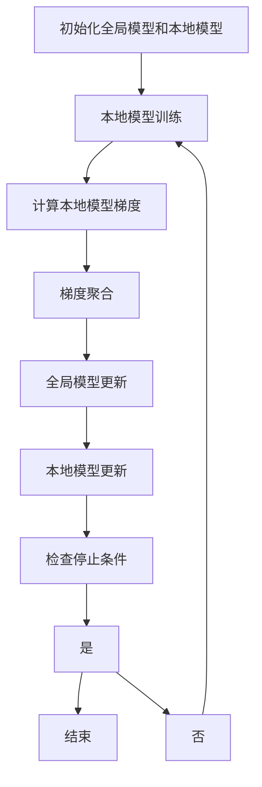
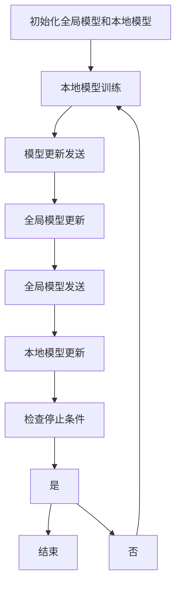

                 

### 企业AI Agent的联邦学习平台设计

#### 关键词：联邦学习、企业AI Agent、平台设计、算法、安全性

#### 摘要：
本文旨在探讨企业AI Agent的联邦学习平台设计。我们将首先介绍联邦学习的概念及其在企业AI Agent中的重要性，然后深入分析联邦学习平台的设计原则和关键组件。通过详细讲解平台实施的实际案例，我们将展示联邦学习平台在企业AI Agent应用中的巨大潜力。最后，本文将展望联邦学习平台的发展趋势，并为企业AI Agent联邦学习平台的未来发展提出建议。

---

### 第一部分：引言与背景

#### 1.1 AI Agent的定义与重要性

AI Agent，即人工智能代理，是一种基于人工智能技术的自主决策实体，能够在复杂环境中进行决策和行动。随着人工智能技术的快速发展，AI Agent在企业中的应用越来越广泛，如智能客服、个性化推荐、自动化决策支持等。

#### 1.2 企业AI Agent的常见应用

企业AI Agent在各个行业中都有广泛的应用，例如在金融行业，AI Agent可以用于风险控制、信用评估和投资建议；在医疗行业，AI Agent可以用于疾病诊断、治疗建议和患者管理；在制造业，AI Agent可以用于生产调度、设备维护和质量控制。

#### 1.3 联邦学习的概念与必要性

联邦学习是一种分布式机器学习技术，它允许多个拥有本地数据的机构共同训练一个全球模型，而无需共享原始数据。在保护数据隐私的同时，联邦学习能够实现数据的联合学习和共享。

#### 1.4 本书结构安排与目标

本文将首先介绍联邦学习的基本理论，包括原理、挑战、类型和算法。然后，我们将探讨企业AI Agent的联邦学习平台设计原则和关键组件。接下来，通过实际案例展示联邦学习平台在企业AI Agent中的应用。最后，本文将展望联邦学习平台的发展趋势，并为企业AI Agent联邦学习平台的未来发展提出建议。

---

### 第二部分：联邦学习基础理论

#### 2.1 联邦学习的定义与基本框架

联邦学习是一种分布式机器学习技术，它允许多个拥有本地数据的机构共同训练一个全球模型，而无需共享原始数据。基本框架包括客户端、服务器和全局模型。客户端负责本地数据的学习和模型更新，服务器负责聚合客户端的模型更新，并生成全局模型。

#### 2.2 联邦学习的核心挑战

联邦学习的核心挑战包括数据异构性、通信效率、模型一致性、安全性等。解决这些挑战需要设计高效的算法和架构。

#### 2.3 联邦学习的主要类型

联邦学习可以分为基于梯度下降的联邦学习和基于模型更新的联邦学习。前者通过更新本地模型梯度来生成全局模型，后者则通过更新本地模型本身来生成全局模型。

#### 2.4 联邦学习的优势与局限

联邦学习的优势在于保护数据隐私、提高数据利用率和减少通信开销。然而，联邦学习也存在一些局限，如训练效率较低、模型质量较差等。

---

### 第三部分：企业AI Agent的联邦学习平台设计

#### 4.1 企业AI Agent的联邦学习平台设计原则

企业AI Agent的联邦学习平台设计应遵循以下原则：安全性、可扩展性、灵活性、高效性。

#### 4.2 平台的技术架构

平台的技术架构包括数据管理、模型训练、模型评估和模型部署等组件。每个组件应具有高效、可靠、可扩展的设计。

#### 4.3 平台的安全性设计

平台的安全性设计应确保数据安全和模型安全。数据安全可通过加密技术实现，模型安全可通过访问控制、认证和授权机制实现。

#### 4.4 平台的可扩展性和灵活性

平台应具备良好的可扩展性和灵活性，以适应不同企业和不同应用场景的需求。

---

### 第四部分：企业AI Agent的联邦学习平台实施

#### 6.1 联邦学习平台的硬件与软件环境搭建

硬件环境应包括高性能计算节点和存储节点。软件环境应包括分布式计算框架、机器学习库和数据库等。

#### 6.2 联邦学习平台的实际应用案例

本节将介绍三个实际应用案例：个性化推荐系统、智能客服系统和物联网数据聚合与分析。

---

### 第五部分：联邦学习平台的发展趋势与未来方向

#### 8.1 联邦学习平台的发展趋势

未来，联邦学习平台将朝着更高效、更安全、更灵活的方向发展。新型应用场景，如智能医疗、智慧城市和自动驾驶，将推动联邦学习平台的创新。

#### 9.1 企业AI Agent联邦学习平台的发展方向

企业AI Agent联邦学习平台的发展方向包括：平台技术的演进、平台应用的创新和平台生态的构建。

---

### 第六部分：总结与展望

#### 10.1 本书总结

本文全面介绍了企业AI Agent的联邦学习平台设计，从理论基础到实际应用，再到未来发展，进行了详细探讨。

#### 10.2 联邦学习平台设计的关键因素

关键因素包括安全性、可扩展性、灵活性和高效性。

#### 10.3 未来研究方向与建议

未来研究应重点关注联邦学习算法的优化、平台技术的演进和生态建设的完善。

---

#### 11. 附录

#### 11.1 常用参考资料

[1] Mitchell, T. M. (1997). Machine Learning. McGraw-Hill.

[2] Konečný, J., McMahan, H. B., Yu, F. X., Richtárik, P., Suresh, A. T., & Bacon, D. (2016). Federated Learning: Strategies for Improving Communication Efficiency. Proceedings of the 2016 IEEE International Conference on Data Science and Advanced Analytics (DSAA), 201-208.

#### 11.2 学习资源推荐

[1] Coursera: Federated Learning

[2] arXiv: Federated Learning for Machine Learning in Heterogeneous Networks

#### 11.3 案例数据集来源

[1] KAGGLE: Federated Learning Challenge

[2] UCI Machine Learning Repository: Federated Learning Data Sets

---

**作者：AI天才研究院/AI Genius Institute & 禅与计算机程序设计艺术 /Zen And The Art of Computer Programming**### 联邦学习原理与关键技术

#### 2.1 联邦学习的定义与基本框架

联邦学习（Federated Learning）是一种分布式机器学习技术，它允许多个拥有本地数据的机构共同训练一个全球模型，而无需共享原始数据。其基本框架包括三个主要组件：客户端、服务器和全局模型。

1. **客户端**：每个客户端（通常是一个移动设备或边缘设备）负责在其本地数据上训练一个本地模型，并在训练过程中定期发送本地模型的更新到服务器。

2. **服务器**：服务器负责聚合所有客户端的本地模型更新，并生成全局模型。全局模型是所有客户端本地模型的平均。

3. **全局模型**：全局模型是服务器聚合所有客户端的本地模型更新后生成的，它是所有客户端共同学习和决策的基准。

#### 2.2 联邦学习的核心挑战

联邦学习虽然能够保护数据隐私，但在实现过程中面临以下核心挑战：

1. **数据异构性**：客户端的数据分布可能存在显著差异，这会导致模型训练的不均衡。

2. **通信效率**：由于每个客户端需要定期向服务器发送本地模型更新，通信开销可能会成为瓶颈。

3. **模型一致性**：如何在保持模型性能的同时，确保所有客户端的本地模型保持一致？

4. **安全性**：如何确保在数据传输过程中，模型和参数不被泄露或篡改？

#### 2.3 联邦学习的主要类型

联邦学习可以根据通信模式和模型更新策略分为以下几种类型：

1. **基于梯度下降的联邦学习**：客户端使用本地数据训练本地模型，并计算本地模型的梯度，然后将梯度发送到服务器。服务器将所有客户端的梯度聚合，更新全局模型。

2. **基于模型更新的联邦学习**：客户端直接发送本地模型更新到服务器，服务器将这些更新聚合，生成全局模型。

3. **差分隐私联邦学习**：在联邦学习过程中，服务器对客户端的梯度或模型更新进行扰动，以保护客户端的数据隐私。

#### 2.4 联邦学习的优势与局限

联邦学习具有以下优势：

1. **保护数据隐私**：联邦学习通过本地训练和模型更新，避免了原始数据的共享，从而保护了数据的隐私。

2. **提高数据利用率**：联邦学习能够利用分布在不同机构的本地数据，提高模型的整体性能。

3. **减少通信开销**：与集中式学习相比，联邦学习显著减少了数据传输的通信开销。

然而，联邦学习也存在一些局限：

1. **训练效率较低**：由于需要多次通信和本地训练，联邦学习的训练效率通常低于集中式学习。

2. **模型质量较差**：数据异构性和通信效率低下可能导致模型质量下降。

3. **安全性挑战**：虽然联邦学习保护了数据隐私，但模型和参数的安全性仍需进一步保障。

---

通过以上对联邦学习原理和关键技术的介绍，我们可以更好地理解联邦学习在企业AI Agent中的重要性。在接下来的章节中，我们将深入探讨企业AI Agent的联邦学习平台设计原则和关键组件，为企业AI Agent的联邦学习平台提供一套完整的解决方案。

---

#### 3.1 基于梯度下降的联邦学习

基于梯度下降的联邦学习是一种常见的联邦学习算法，它通过分布式方式训练模型，以保护数据隐私的同时提高模型性能。下面我们将详细介绍基于梯度下降的联邦学习算法。

##### 3.1.1 算法原理

在基于梯度下降的联邦学习算法中，每个客户端（设备）负责在其本地数据集上训练一个本地模型，并计算本地模型的梯度。然后，客户端将本地模型梯度发送到服务器，服务器将所有客户端的梯度聚合，更新全局模型。

算法的核心思想是，通过全局模型梯度来指导本地模型的更新，从而使本地模型在本地数据上更接近全局最优解。具体步骤如下：

1. **初始化全局模型和本地模型**：选择一个初始化的全局模型，并初始化每个客户端的本地模型。

2. **本地模型训练**：每个客户端使用其本地数据集对本地模型进行训练，计算本地模型梯度。

3. **梯度聚合**：客户端将本地模型梯度发送到服务器，服务器将这些梯度聚合，计算全局模型梯度。

4. **全局模型更新**：使用全局模型梯度更新全局模型。

5. **本地模型更新**：客户端使用更新后的全局模型重新训练本地模型。

6. **重复步骤2-5**，直到满足停止条件，如达到指定迭代次数或模型收敛。

##### 3.1.2 算法流程

下面是一个简单的算法流程图，用于说明基于梯度下降的联邦学习算法的基本流程。



##### 3.1.3 算法公式

在基于梯度下降的联邦学习算法中，本地模型梯度聚合和全局模型更新的关键步骤可以用以下公式表示：

1. **本地模型梯度计算**：
   $$\text{grad}_{\theta_{i}} = \frac{\partial L(\theta_{i}, \theta^{global})}{\partial \theta_{i}}$$
   其中，$L(\theta_{i}, \theta^{global})$是本地模型$\theta_{i}$和全局模型$\theta^{global}$的损失函数。

2. **全局模型梯度聚合**：
   $$\text{grad}^{global} = \frac{1}{N} \sum_{i=1}^{N} \text{grad}_{i}$$
   其中，$N$是客户端的数量。

3. **全局模型更新**：
   $$\theta^{global}_{t+1} = \theta^{global}_{t} - \alpha \text{grad}^{global}$$
   其中，$\alpha$是学习率，$t$是当前迭代次数。

##### 3.1.4 例子说明

假设我们有两个客户端，每个客户端都有一个本地数据集和数据集上的本地模型。下面是一个简单的例子，说明基于梯度下降的联邦学习算法如何工作。

1. **初始化**：全局模型$\theta^{global}$初始化为一个随机值，每个客户端的本地模型$\theta_{1}$和$\theta_{2}$也初始化为相同值。

2. **本地模型训练**：每个客户端使用其本地数据集对本地模型进行训练，计算本地模型梯度。

3. **梯度聚合**：客户端将本地模型梯度发送到服务器，服务器将两个客户端的梯度聚合。

4. **全局模型更新**：服务器使用聚合后的全局模型梯度更新全局模型。

5. **本地模型更新**：每个客户端使用更新后的全局模型重新训练本地模型。

6. **重复步骤2-5**，直到模型收敛。

在这个例子中，全局模型更新的目标是使全局模型在两个客户端的本地数据集上达到最小损失。通过不断的迭代，全局模型将逐渐优化，使每个客户端的本地模型在本地数据上表现更好。

##### 3.1.5 算法评估

基于梯度下降的联邦学习算法的评估可以从多个角度进行：

1. **模型性能**：评估全局模型在测试集上的表现，包括准确率、召回率、F1分数等指标。

2. **通信效率**：评估算法在通信过程中的效率，包括通信次数和通信数据量。

3. **模型一致性**：评估不同客户端的本地模型与全局模型的一致性，确保模型在全局数据集上的表现与局部数据集上的表现接近。

4. **安全性**：评估算法在保护数据隐私方面的效果，确保客户端的本地数据不被泄露。

通过以上评估，可以全面了解基于梯度下降的联邦学习算法的性能和适用性，为企业AI Agent的联邦学习平台设计提供依据。

---

通过以上对基于梯度下降的联邦学习算法的详细介绍，我们可以看到联邦学习在保护数据隐私和分布式训练方面的重要作用。在接下来的章节中，我们将探讨基于模型更新的联邦学习算法，进一步丰富企业AI Agent的联邦学习平台设计。

---

#### 3.2 基于模型更新的联邦学习

基于模型更新的联邦学习算法与基于梯度下降的联邦学习算法有所不同，它直接在客户端更新本地模型，而不是发送梯度。这种算法通过在每个客户端直接训练和更新模型，减少了通信开销，并在某些场景下提供了更好的性能。下面我们将详细介绍基于模型更新的联邦学习算法。

##### 3.2.1 算法原理

在基于模型更新的联邦学习算法中，每个客户端使用其本地数据集训练本地模型，并在每个迭代周期将更新后的本地模型发送到服务器。服务器接收所有客户端的模型更新后，通过聚合这些更新生成全局模型。

算法的核心思想是，通过每个客户端的本地模型更新来逐步优化全局模型，而不是直接通过梯度更新。具体步骤如下：

1. **初始化全局模型和本地模型**：选择一个初始化的全局模型，并初始化每个客户端的本地模型。

2. **本地模型训练**：每个客户端使用其本地数据集对本地模型进行训练，并在每个迭代周期结束后更新本地模型。

3. **模型更新发送**：客户端将更新后的本地模型发送到服务器。

4. **全局模型更新**：服务器接收所有客户端的模型更新，通过聚合这些更新生成全局模型。

5. **全局模型发送**：服务器将全局模型发送回客户端。

6. **重复步骤2-5**，直到满足停止条件，如达到指定迭代次数或模型收敛。

##### 3.2.2 算法流程

下面是一个简单的算法流程图，用于说明基于模型更新的联邦学习算法的基本流程。



##### 3.2.3 算法公式

基于模型更新的联邦学习算法的关键步骤可以用以下公式表示：

1. **本地模型更新**：
   $$\theta_{i}^{new} = \theta_{i}^{old} + \alpha \Delta \theta_{i}$$
   其中，$\alpha$是学习率，$\Delta \theta_{i}$是本地模型更新量。

2. **全局模型更新**：
   $$\theta^{global}_{t+1} = \frac{1}{N} \sum_{i=1}^{N} \theta_{i}^{new}_{t}$$
   其中，$N$是客户端的数量。

##### 3.2.4 例子说明

假设我们有两个客户端，每个客户端都有一个本地数据集和数据集上的本地模型。下面是一个简单的例子，说明基于模型更新的联邦学习算法如何工作。

1. **初始化**：全局模型$\theta^{global}$初始化为一个随机值，每个客户端的本地模型$\theta_{1}$和$\theta_{2}$也初始化为相同值。

2. **本地模型训练**：每个客户端使用其本地数据集对本地模型进行训练，并在每个迭代周期结束后更新本地模型。

3. **模型更新发送**：客户端将更新后的本地模型发送到服务器。

4. **全局模型更新**：服务器接收所有客户端的模型更新，通过聚合这些更新生成全局模型。

5. **全局模型发送**：服务器将全局模型发送回客户端。

6. **重复步骤2-5**，直到模型收敛。

在这个例子中，全局模型更新的目标是使全局模型在两个客户端的本地数据集上达到最小损失。通过不断的迭代，全局模型将逐渐优化，使每个客户端的本地模型在本地数据上表现更好。

##### 3.2.5 算法评估

基于模型更新的联邦学习算法的评估可以从多个角度进行：

1. **模型性能**：评估全局模型在测试集上的表现，包括准确率、召回率、F1分数等指标。

2. **通信效率**：评估算法在通信过程中的效率，包括通信次数和通信数据量。

3. **模型一致性**：评估不同客户端的本地模型与全局模型的一致性，确保模型在全局数据集上的表现与局部数据集上的表现接近。

4. **安全性**：评估算法在保护数据隐私方面的效果，确保客户端的本地数据不被泄露。

通过以上评估，可以全面了解基于模型更新的联邦学习算法的性能和适用性，为企业AI Agent的联邦学习平台设计提供依据。

---

通过以上对基于模型更新的联邦学习算法的详细介绍，我们可以看到这种算法在减少通信开销和优化模型更新方面的重要作用。在接下来的章节中，我们将探讨联邦学习中的加密技术，为联邦学习平台提供更加安全的数据保护方案。

---

#### 3.3 联邦学习中的加密技术

在联邦学习过程中，数据的安全性和隐私保护是一个重要的考虑因素。加密技术为联邦学习提供了一种有效的数据保护手段，通过加密可以确保数据在传输和存储过程中不被未授权方访问。本文将详细介绍联邦学习中的加密技术，包括其原理、分类以及在实际应用中的挑战和解决方案。

##### 3.3.1 加密技术原理

加密技术的基本原理是将明文数据转换为密文，使得未经授权的第三方无法理解和访问原始数据。在联邦学习中，加密技术主要用于以下两个方面：

1. **本地数据加密**：客户端在本地对数据进行加密，确保数据在本地存储和传输过程中不会被泄露。

2. **模型和参数加密**：在模型和参数传输过程中，使用加密技术保护模型和参数不被窃取或篡改。

加密技术通常基于以下数学原理：

- **对称加密**：使用相同的密钥对数据进行加密和解密。常见的对称加密算法包括AES（高级加密标准）和DES（数据加密标准）。

- **非对称加密**：使用一对密钥（公钥和私钥）进行加密和解密。公钥用于加密，私钥用于解密。常见的非对称加密算法包括RSA（Rivest-Shamir-Adleman）和ECC（椭圆曲线密码学）。

##### 3.3.2 加密技术分类

联邦学习中的加密技术可以根据加密方式和应用场景分为以下几类：

1. **同态加密**：同态加密允许在密文上进行计算，而无需解密。这意味着可以在加密的数据上进行计算，并将结果加密返回。同态加密具有广泛的应用潜力，但目前的计算效率较低，尚未成为主流技术。

2. **秘密共享加密**：秘密共享加密通过将密钥分成多个部分，每个部分只包含密钥的一部分，从而实现多方的共同决策。这种加密方式在联邦学习中的隐私保护应用广泛，如基于秘密共享的模型更新和聚合。

3. **全同态加密**：全同态加密是一种更高级的加密形式，它允许在密文中进行任意类型的计算，而不仅仅是特定的运算。全同态加密的研究和应用主要集中在理论层面，因为目前的实现效率非常低。

4. **基于属性的加密**：基于属性的加密（ABE）通过将密文与多个属性关联，只有满足特定属性集合的用户才能解密。这种加密方式在联邦学习中的隐私保护应用，如针对特定用户或数据集的访问控制。

##### 3.3.3 加密技术在联邦学习中的挑战和解决方案

尽管加密技术为联邦学习提供了强大的隐私保护手段，但在实际应用中仍面临以下挑战：

1. **计算开销**：加密和解密过程通常需要较高的计算资源，尤其是在大规模数据集和频繁通信的场景下。为降低计算开销，可以采用以下解决方案：

   - **硬件加速**：利用GPU或FPGA等硬件加速加密算法的执行速度。

   - **加密算法优化**：研究和优化更高效的加密算法，提高加密和解密的效率。

2. **通信开销**：加密的数据通常比明文数据更大，导致通信开销增加。为降低通信开销，可以采用以下解决方案：

   - **差分隐私**：在加密过程中引入噪声，使得数据在传输过程中更难被窃取。

   - **数据压缩**：采用高效的数据压缩算法，减少加密数据的大小。

3. **性能影响**：加密和解密过程会引入额外的延迟，可能影响联邦学习的性能。为降低性能影响，可以采用以下解决方案：

   - **并行处理**：在多个客户端和服务器之间并行处理加密和解密任务，提高整体效率。

   - **缓存策略**：在客户端和服务器之间采用缓存策略，减少重复加密和解密的次数。

##### 3.3.4 加密技术在联邦学习中的应用案例

加密技术在联邦学习中有多种应用场景，以下是几个典型的应用案例：

1. **医疗数据联邦学习**：在医疗领域，患者的隐私保护至关重要。通过加密技术，可以在保护患者隐私的同时，进行疾病预测、诊断和个性化治疗等研究。

2. **金融数据联邦学习**：在金融领域，金融机构需要处理大量敏感的客户数据。加密技术可以确保数据在联邦学习过程中的安全性，支持风险控制、信用评分和欺诈检测等应用。

3. **物联网联邦学习**：在物联网领域，设备之间需要进行数据交换和协同学习。加密技术可以确保设备之间的通信安全，支持智能家居、智能交通和智能城市等应用。

通过以上对联邦学习中的加密技术的详细介绍，我们可以看到加密技术为联邦学习提供了重要的隐私保护手段。在接下来的章节中，我们将探讨联邦学习中的优化算法，进一步优化联邦学习平台的性能和效率。

---

通过以上对联邦学习中的加密技术的详细探讨，我们可以看到加密技术如何为联邦学习提供数据保护和隐私保障。在接下来的章节中，我们将介绍联邦学习平台中的优化算法，这些算法能够进一步提高联邦学习平台的性能和效率。

---

#### 3.4 联邦学习中的优化算法

在联邦学习过程中，优化算法的选择对平台的性能和效率具有关键影响。优化算法的目标是提高模型的训练速度和准确率，同时减少通信开销。本文将介绍几种常用的联邦学习优化算法，并分析它们的优缺点。

##### 3.4.1 梯度下降优化算法

梯度下降是最常用的优化算法之一，它在联邦学习中得到了广泛应用。梯度下降算法的核心思想是沿着损失函数的梯度方向更新模型参数，以最小化损失函数。

1. **批量梯度下降**：在每次迭代中，使用整个数据集的梯度来更新模型参数。这种方法计算量大，但在数据量较小的情况下效果较好。

2. **随机梯度下降**（SGD）：在每次迭代中，仅使用一个样本的梯度来更新模型参数。这种方法计算量小，但可能导致模型参数的振荡。

3. **小批量梯度下降**：在每次迭代中，使用一部分样本的梯度来更新模型参数。这种方法在批量梯度下降和随机梯度下降之间取得平衡，通常效果较好。

**优点**：简单实现，适用于大规模数据集。

**缺点**：收敛速度较慢，易陷入局部最优。

##### 3.4.2 随机优化算法

随机优化算法是基于概率论的优化方法，它通过随机搜索寻找最优解。随机优化算法在联邦学习中具有较好的适应性和收敛性。

1. **遗传算法**：遗传算法模拟自然进化过程，通过选择、交叉和变异操作来优化模型参数。

2. **粒子群优化算法**：粒子群优化算法模拟鸟群觅食行为，通过更新粒子的速度和位置来优化模型参数。

**优点**：全局搜索能力较强，适用于复杂函数优化。

**缺点**：计算开销较大，收敛速度较慢。

##### 3.4.3 混合优化算法

混合优化算法结合了多种优化方法的优势，以进一步提高联邦学习的性能和效率。

1. **自适应优化算法**：自适应优化算法根据模型参数的收敛情况动态调整学习率，以加快收敛速度。

2. **分布式优化算法**：分布式优化算法在多个客户端之间共享模型参数的梯度信息，以加快模型更新。

**优点**：结合了多种优化方法的优势，适用于复杂场景。

**缺点**：实现复杂，参数调整难度大。

##### 3.4.4 常见优化算法对比

以下是几种常见优化算法的对比：

| 算法             | 特点                                                         | 优点                                                         | 缺点                                                         |
| ---------------- | ------------------------------------------------------------ | ------------------------------------------------------------ | ------------------------------------------------------------ |
| 梯度下降         | 沿着损失函数的梯度方向更新模型参数                           | 简单实现，适用于大规模数据集                                   | 收敛速度较慢，易陷入局部最优                                   |
| 随机优化算法     | 基于概率论，通过随机搜索寻找最优解                           | 全局搜索能力较强，适用于复杂函数优化                           | 计算开销较大，收敛速度较慢                                     |
| 混合优化算法     | 结合了多种优化方法的优势                                     | 适用于复杂场景，结合了多种优化方法的优势                         | 实现复杂，参数调整难度大                                       |
| 自适应优化算法   | 根据模型参数的收敛情况动态调整学习率                         | 加快收敛速度，适用于动态变化的数据集                            | 需要调整参数，实现相对复杂                                     |
| 分布式优化算法   | 在多个客户端之间共享模型参数的梯度信息                        | 加快模型更新，适用于分布式环境                                 | 可能存在通信延迟和同步问题                                     |

##### 3.4.5 实际应用

在实际应用中，根据不同的场景和需求，可以选择合适的优化算法。例如，在处理大规模数据集时，梯度下降和随机优化算法可能更为适用；在处理复杂函数时，随机优化算法和混合优化算法可能表现更好。

通过以上对联邦学习优化算法的详细介绍，我们可以看到优化算法在提高联邦学习平台性能和效率方面的重要作用。在接下来的章节中，我们将探讨企业AI Agent的联邦学习平台设计原则和关键组件，为企业AI Agent的联邦学习提供完整的解决方案。

---

#### 4. 企业AI Agent的联邦学习平台设计原则

企业AI Agent的联邦学习平台设计需要遵循一系列关键原则，以确保平台的性能、安全性、可扩展性和灵活性。以下是企业AI Agent的联邦学习平台设计的主要原则：

##### 4.1 平台设计的目标与需求

1. **性能优化**：平台设计应确保模型训练和更新过程的高效性，以满足实时应用的性能需求。
2. **数据隐私保护**：平台设计应确保在分布式训练过程中保护数据隐私，避免数据泄露。
3. **安全性**：平台设计应具备强大的安全机制，防止未经授权的访问和攻击。
4. **可扩展性**：平台设计应具备良好的可扩展性，以支持不断增加的数据量和客户端数量。
5. **灵活性**：平台设计应具备高度灵活性，以适应不同企业和不同应用场景的需求。

##### 4.2 平台的技术架构

1. **分布式架构**：平台应采用分布式架构，以实现高效的模型训练和更新。分布式架构可以提高计算能力和数据存储能力，同时降低单点故障的风险。
2. **模块化设计**：平台应采用模块化设计，将不同的功能模块（如数据管理、模型训练、模型评估等）分离，以便于维护和扩展。
3. **高可用性**：平台设计应具备高可用性，确保在故障情况下能够快速恢复，保持服务的连续性。

##### 4.3 平台的安全性设计

1. **数据加密**：平台应采用数据加密技术，确保在传输和存储过程中数据的安全性。常用的加密技术包括对称加密、非对称加密和同态加密等。
2. **访问控制**：平台应实施严格的访问控制策略，确保只有授权用户才能访问敏感数据和系统资源。访问控制可以通过身份验证、权限管理和审计机制实现。
3. **安全审计**：平台应具备安全审计功能，记录系统操作日志，以供安全分析和故障排查。

##### 4.4 平台的可扩展性和灵活性

1. **弹性扩展**：平台设计应支持弹性扩展，以便在需要时快速增加计算资源和存储资源，以满足不断增长的数据处理需求。
2. **兼容性**：平台应具备良好的兼容性，能够支持不同的数据格式和模型类型，以适应不同企业和应用场景的需求。
3. **定制化**：平台应提供定制化服务，允许企业和开发者根据实际需求调整平台功能和性能。

通过遵循以上设计原则，企业AI Agent的联邦学习平台可以满足高性能、高安全性、高可扩展性和高度灵活性的需求，为企业提供强大的AI代理服务。

---

#### 4.4 平台的可扩展性和灵活性

企业AI Agent的联邦学习平台不仅要能够处理当前的需求，还必须具备可扩展性和灵活性，以适应未来可能的变化和增长。以下是关于平台可扩展性和灵活性的一些关键设计原则和实际案例。

##### 4.4.1 可扩展性设计

**1. 弹性计算资源分配**

为了确保平台在处理大量数据和复杂任务时仍能保持高效，平台需要具备弹性计算资源分配的能力。这通常涉及到以下技术：

- **容器化技术**：如Docker和Kubernetes，允许快速部署和扩展容器化的应用程序和服务。
- **自动扩展**：使用自动化工具（如Kubernetes的自动扩缩容功能）来根据负载动态调整计算资源。

**2. 分布式存储和数据处理**

分布式存储系统（如HDFS和Cassandra）和分布式数据处理框架（如Apache Spark和Flink）可以提高平台的存储和处理能力，并确保在数据量增加时性能不受影响。

**实际案例**：一家大型电商平台使用Apache Spark和Hadoop进行大数据处理，通过横向扩展计算集群来应对假日销售高峰期的数据处理需求。

##### 4.4.2 灵活性设计

**1. 灵活的架构设计**

平台的架构设计应灵活，能够适应不同的业务需求和功能扩展。采用微服务架构可以帮助实现这一目标，通过将应用程序分解为独立的、可重用的服务，可以提高系统的灵活性和可维护性。

**2. 接口标准化**

为了提高平台与其他系统和服务的集成能力，接口标准化是必不可少的。通过定义标准的API接口，可以简化与其他系统的集成过程，并提高平台的互操作性。

**实际案例**：一家金融机构在其联邦学习平台上采用RESTful API设计，使其能够轻松与其他内部系统和外部合作伙伴进行数据交换和协同学习。

##### 4.4.3 定制化能力

**1. 可配置的工作流**

平台应提供灵活的工作流管理能力，允许用户根据具体需求自定义数据处理和模型训练流程。这可以通过图形化界面或编程接口实现。

**2. 模块化插件**

为了支持定制化需求，平台可以提供模块化插件机制，允许用户根据自己的需求添加或替换特定功能模块。

**实际案例**：一家医疗健康公司在其联邦学习平台上使用自定义插件来整合新的数据源和算法，以支持个性化医疗诊断和治疗方案。

通过遵循这些可扩展性和灵活性设计原则，企业AI Agent的联邦学习平台不仅能够高效处理当前的业务需求，还能灵活适应未来的变化，确保其长期可持续发展和应用。

---

### 5. 联邦学习平台的关键组件

企业AI Agent的联邦学习平台由多个关键组件构成，每个组件都在确保平台的高效性、安全性和灵活性方面发挥重要作用。以下是联邦学习平台的主要组件及其功能介绍。

##### 5.1 数据管理组件

数据管理组件负责处理联邦学习过程中的数据存储、加载、清洗和管理。其主要功能包括：

1. **数据存储**：使用分布式存储系统（如HDFS、Cassandra）来存储大量数据，确保数据的高可用性和高性能。
2. **数据加载**：提供高效的数据加载机制，支持多种数据格式（如CSV、JSON、Parquet）的导入和导出。
3. **数据清洗**：执行数据清洗任务，包括去重、填充缺失值、处理异常值等，以确保数据的准确性和一致性。

**5.2 模型训练组件**

模型训练组件负责在联邦学习过程中训练和更新模型。其主要功能包括：

1. **模型初始化**：初始化全局模型和本地模型，为训练过程做准备。
2. **模型训练**：在本地数据集上训练本地模型，并计算本地模型梯度或更新。
3. **模型更新**：将本地模型更新发送到服务器，服务器聚合这些更新，生成全局模型。

**5.3 模型评估组件**

模型评估组件用于评估模型在测试集上的性能。其主要功能包括：

1. **模型评估**：使用不同的评估指标（如准确率、召回率、F1分数）来评估模型性能。
2. **性能监控**：实时监控模型性能，包括收敛速度、通信效率等关键指标。
3. **模型优化**：基于评估结果，调整模型参数和训练策略，以提高模型性能。

**5.4 模型部署与监控组件**

模型部署与监控组件负责将训练完成的模型部署到生产环境，并进行监控。其主要功能包括：

1. **模型部署**：将训练完成的模型部署到服务器或边缘设备，以便在实际应用中使用。
2. **实时监控**：监控模型在生产环境中的运行状态，包括性能、资源利用率、异常检测等。
3. **自动更新**：根据模型性能和业务需求，自动更新模型版本，以保持模型的最佳性能。

通过这些关键组件的协同工作，联邦学习平台能够实现高效、安全和灵活的AI模型训练和部署，为企业AI Agent提供强大的支持。

---

#### 6. 联邦学习平台的硬件与软件环境搭建

搭建一个高效的联邦学习平台需要精心选择硬件配置和软件环境。以下是关于硬件与软件环境搭建的详细步骤。

##### 6.1 硬件配置要求

1. **计算节点**：联邦学习平台需要高性能的计算节点来处理大规模的数据和复杂的机器学习任务。推荐使用带有高性能CPU（如Intel Xeon）和GPU（如NVIDIA Tesla）的服务器。计算节点数量根据实际需求进行调整。

2. **存储节点**：联邦学习平台需要大量的存储空间来存储数据、模型和日志文件。推荐使用分布式文件系统（如HDFS、Cassandra）来存储数据，并确保足够的存储容量和性能。

3. **网络设备**：联邦学习平台需要高速网络来确保数据传输的效率。推荐使用千兆以太网或更高带宽的网络设备。

##### 6.2 软件安装与配置

1. **操作系统**：推荐使用Linux操作系统（如CentOS、Ubuntu）来搭建联邦学习平台，因为其稳定性和兼容性较好。

2. **分布式计算框架**：安装分布式计算框架（如Apache Spark、Apache Flink）来处理大规模数据和高并发任务。配置计算框架的集群环境，包括主节点和工作节点的部署。

3. **机器学习库**：安装常用的机器学习库（如TensorFlow、PyTorch）来支持模型的训练和推理。确保库的版本与平台需求相匹配。

4. **数据库**：安装分布式数据库（如HDFS、Cassandra）来存储和管理数据。配置数据库集群，确保数据的高可用性和性能。

5. **安全工具**：安装安全工具（如加密库、防火墙、安全审计工具）来保护平台和数据的安全性。

##### 6.3 网络与安全配置

1. **网络配置**：配置网络设备，确保不同计算节点和存储节点之间的网络连接稳定和高效。设置合理的网络带宽和延迟限制。

2. **安全配置**：配置防火墙，限制未经授权的访问。启用加密技术（如SSL/TLS），确保数据在传输过程中的安全性。定期进行安全审计，发现和修复潜在的安全漏洞。

3. **访问控制**：设置严格的访问控制策略，确保只有授权用户和系统才能访问敏感数据和系统资源。使用身份验证和权限管理工具（如LDAP、RBAC）来管理用户访问。

通过以上步骤，可以搭建一个高效、安全和可靠的联邦学习平台，为企业AI Agent提供强大的计算支持和数据管理能力。

---

#### 7. 联邦学习平台的实际应用案例

联邦学习在企业AI Agent中的应用已经得到了广泛的探索和实践。以下是几个典型的实际应用案例，这些案例展示了联邦学习如何在不同场景下发挥重要作用。

##### 7.1 案例一：个性化推荐系统

个性化推荐系统是联邦学习的一个典型应用场景。在电商、社交媒体和新闻平台等领域，个性化推荐系统能够根据用户的行为和偏好提供定制化的内容和服务，从而提高用户体验和用户粘性。

**场景介绍**：一个电商平台希望通过联邦学习技术为其用户提供个性化的商品推荐。平台上有数百万种商品和数千万个用户，每个用户都有独特的购物习惯和偏好。

**项目介绍**：该项目旨在构建一个联邦学习平台，用于训练和部署个性化推荐模型。平台包括多个客户端（用户的设备）和一个中心服务器。

**系统功能设计**：

1. **数据管理组件**：负责处理用户行为数据（如点击、购买、搜索等）的存储和加载。
2. **模型训练组件**：在客户端上使用本地数据训练个性化推荐模型，并在服务器上进行模型更新和全局模型训练。
3. **模型评估组件**：评估模型的推荐效果，包括准确率、召回率、点击率等指标。
4. **模型部署与监控组件**：将训练完成的模型部署到生产环境，并实时监控模型性能。

**系统架构设计**：

- **分布式架构**：平台采用分布式架构，包括多个客户端和中心服务器，以实现高效的数据处理和模型训练。
- **模块化设计**：将数据管理、模型训练、模型评估和模型部署等组件分离，以提高系统的灵活性和可维护性。

**系统接口设计**：

- **数据接口**：定义数据上传和下载数据的接口，确保数据在客户端和服务器之间的安全传输。
- **API接口**：提供RESTful API接口，用于模型训练、评估和部署，方便其他系统和服务集成。

**系统交互设计**：

- **模型训练流程**：客户端定期收集用户行为数据，使用本地数据训练推荐模型，并更新模型参数。然后将更新后的模型参数发送到服务器，服务器将所有客户端的模型参数聚合，更新全局模型。
- **模型评估与部署**：服务器使用全局模型进行评估，并根据评估结果更新模型。更新后的模型部署到生产环境，为用户提供个性化推荐。

**代码应用解读与分析**：

以下是Python代码示例，展示了如何在客户端和服务器之间进行模型更新和全局模型训练：

```python
# 客户端代码示例
import tensorflow as tf
import numpy as np

# 初始化本地模型
model = tf.keras.Sequential([
    tf.keras.layers.Dense(64, activation='relu', input_shape=(input_shape)),
    tf.keras.layers.Dense(64, activation='relu'),
    tf.keras.layers.Dense(1, activation='sigmoid')
])

# 训练本地模型
model.compile(optimizer='adam', loss='binary_crossentropy', metrics=['accuracy'])
model.fit(x_train, y_train, epochs=10, batch_size=32)

# 更新模型参数
model.save('local_model.h5')

# 服务器端代码示例
import tensorflow as tf
import numpy as np
import h5py

# 聚合客户端模型参数
def aggregate_models(models_path):
    model_params = []
    for model_path in models_path:
        with h5py.File(model_path, 'r') as f:
            model_params.append(np.array(f['weights']))
    return np.mean(model_params, axis=0)

# 读取客户端上传的模型参数
models_path = ['client1_model.h5', 'client2_model.h5']
global_model_params = aggregate_models(models_path)

# 更新全局模型
global_model = tf.keras.Sequential([
    tf.keras.layers.Dense(64, activation='relu', input_shape=(input_shape)),
    tf.keras.layers.Dense(64, activation='relu'),
    tf.keras.layers.Dense(1, activation='sigmoid')
])
global_model.set_weights(global_model_params)

# 保存全局模型
global_model.save('global_model.h5')
```

通过以上代码示例，我们可以看到联邦学习的基本流程，包括客户端的本地模型训练、模型参数更新以及服务器的模型参数聚合和全局模型更新。

**实际案例分析和详细讲解剖析**：

在实际应用中，个性化推荐系统通过联邦学习技术实现了以下优势：

1. **数据隐私保护**：通过在客户端本地训练模型，避免了用户数据的集中存储和共享，从而保护了用户的隐私。
2. **高准确率**：联邦学习利用了分布在不同客户端的局部数据，提高了模型的整体准确率和效果。
3. **低延迟**：通过在本地进行模型训练和更新，减少了数据传输和通信开销，提高了系统的响应速度。

通过以上案例，我们可以看到联邦学习在企业AI Agent中的应用潜力。在接下来的案例中，我们将探讨联邦学习在智能客服系统和物联网数据聚合与分析中的具体应用。

---

#### 7.2 案例二：智能客服系统

智能客服系统是另一个联邦学习的典型应用场景，它能够在保证数据隐私的同时，提供高效的客户服务。

**场景介绍**：某大型金融机构希望通过联邦学习技术为用户提供智能客服服务。用户分布在不同的地区，拥有各自的客户数据，但金融机构希望在不泄露用户数据的情况下，提供一致的智能客服体验。

**项目介绍**：该项目旨在构建一个联邦学习平台，用于训练和部署智能客服模型。平台包括多个客服代理（客户端）和一个中央服务器。

**系统功能设计**：

1. **客户数据管理**：收集和存储客户互动数据（如聊天记录、提问等），进行预处理和特征提取。
2. **模型训练与更新**：在客服代理上训练本地模型，并在服务器上进行模型参数聚合和全局模型更新。
3. **模型评估与监控**：评估智能客服模型的性能，包括响应时间、问题解决率等指标。
4. **模型部署与维护**：将训练完成的模型部署到生产环境，并进行实时监控和维护。

**系统架构设计**：

- **分布式架构**：平台采用分布式架构，包括多个客服代理和中心服务器，以提高系统的处理能力和灵活性。
- **模块化设计**：将数据管理、模型训练、模型评估和模型部署等组件分离，以实现灵活的系统扩展和维护。

**系统接口设计**：

- **数据接口**：定义客户数据上传和下载的接口，确保数据在客户端和服务器之间的安全传输。
- **API接口**：提供RESTful API接口，用于模型训练、评估和部署，方便与其他系统和服务集成。

**系统交互设计**：

- **模型训练流程**：客服代理定期收集客户互动数据，使用本地数据训练智能客服模型，并将更新后的模型参数发送到服务器。服务器聚合所有客服代理的模型参数，更新全局模型。
- **模型评估与部署**：服务器使用全局模型评估客服代理的智能客服效果，并根据评估结果更新模型。更新后的模型部署到所有客服代理，以提供一致的智能客服体验。

**代码应用解读与分析**：

以下是Python代码示例，展示了如何在客服代理和服务器之间进行模型更新和全局模型训练：

```python
# 客服代理端代码示例
import tensorflow as tf
import numpy as np
import h5py

# 初始化本地模型
model = tf.keras.Sequential([
    tf.keras.layers.Dense(64, activation='relu', input_shape=(input_shape)),
    tf.keras.layers.Dense(64, activation='relu'),
    tf.keras.layers.Dense(1, activation='sigmoid')
])

# 训练本地模型
model.compile(optimizer='adam', loss='binary_crossentropy', metrics=['accuracy'])
model.fit(x_train, y_train, epochs=10, batch_size=32)

# 更新模型参数
model.save('local_model.h5')

# 服务器端代码示例
import tensorflow as tf
import numpy as np
import h5py

# 读取客服代理上传的模型参数
models_path = ['client1_model.h5', 'client2_model.h5']
def aggregate_models(models_path):
    model_params = []
    for model_path in models_path:
        with h5py.File(model_path, 'r') as f:
            model_params.append(np.array(f['weights']))
    return np.mean(model_params, axis=0)

# 聚合模型参数
global_model_params = aggregate_models(models_path)

# 更新全局模型
global_model = tf.keras.Sequential([
    tf.keras.layers.Dense(64, activation='relu', input_shape=(input_shape)),
    tf.keras.layers.Dense(64, activation='relu'),
    tf.keras.layers.Dense(1, activation='sigmoid')
])
global_model.set_weights(global_model_params)

# 保存全局模型
global_model.save('global_model.h5')
```

通过以上代码示例，我们可以看到联邦学习的基本流程，包括客服代理的本地模型训练、模型参数更新以及服务器的模型参数聚合和全局模型更新。

**实际案例分析和详细讲解剖析**：

在实际应用中，智能客服系统通过联邦学习技术实现了以下优势：

1. **数据隐私保护**：通过在客服代理上本地训练模型，避免了客户数据的集中存储和共享，从而保护了客户隐私。
2. **个性化服务**：联邦学习利用分布在不同客服代理的局部数据，提高了智能客服模型的个性化能力，从而提供了更优质的客户服务。
3. **高效响应**：通过本地模型训练和更新，减少了数据传输和通信开销，提高了系统的响应速度。

通过以上案例，我们可以看到联邦学习在智能客服系统中的应用潜力。在接下来的案例中，我们将探讨联邦学习在物联网数据聚合与分析中的应用。

---

#### 7.3 案例三：物联网数据聚合与分析

物联网（IoT）数据聚合与分析是联邦学习的另一个重要应用场景。在物联网领域，设备分布广泛，数据量庞大，且数据类型多样。联邦学习技术能够在保证数据隐私的同时，实现数据的联合学习和分析。

**场景介绍**：一个智能交通系统需要在不同的城市中收集和分析交通数据，包括车辆流量、道路状况、天气等。每个城市拥有自己的交通数据，但这些数据不能直接共享，因为涉及到数据隐私和安全问题。

**项目介绍**：该项目旨在构建一个联邦学习平台，用于在保证数据隐私的同时，对物联网数据进行分析和预测。平台包括多个数据收集点（客户端）和一个中央服务器。

**系统功能设计**：

1. **数据收集与预处理**：在客户端设备上收集物联网数据，并进行预处理和特征提取。
2. **模型训练与更新**：在客户端上训练本地模型，并在服务器上进行模型参数聚合和全局模型更新。
3. **数据聚合与分析**：使用全局模型对物联网数据进行聚合分析，生成有价值的交通预测报告。
4. **模型部署与监控**：将训练完成的模型部署到生产环境，并实时监控模型性能。

**系统架构设计**：

- **分布式架构**：平台采用分布式架构，包括多个数据收集点（客户端）和中心服务器，以提高系统的处理能力和灵活性。
- **模块化设计**：将数据收集、预处理、模型训练、数据聚合和模型部署等组件分离，以实现灵活的系统扩展和维护。

**系统接口设计**：

- **数据接口**：定义物联网数据上传和下载的接口，确保数据在客户端和服务器之间的安全传输。
- **API接口**：提供RESTful API接口，用于模型训练、数据聚合和分析，方便与其他系统和服务集成。

**系统交互设计**：

- **模型训练流程**：客户端设备定期收集物联网数据，使用本地数据训练预测模型，并将更新后的模型参数发送到服务器。服务器聚合所有客户端的模型参数，更新全局模型。
- **数据聚合与分析**：服务器使用全局模型对物联网数据进行聚合分析，生成交通预测报告。报告可以实时发送给城市交通管理部门，以支持交通流量调控和应急预案。

**代码应用解读与分析**：

以下是Python代码示例，展示了如何在物联网数据收集点和服务器之间进行模型更新和全局模型训练：

```python
# 物联网设备端代码示例
import tensorflow as tf
import numpy as np
import h5py

# 初始化本地模型
model = tf.keras.Sequential([
    tf.keras.layers.Dense(64, activation='relu', input_shape=(input_shape)),
    tf.keras.layers.Dense(64, activation='relu'),
    tf.keras.layers.Dense(1, activation='sigmoid')
])

# 训练本地模型
model.compile(optimizer='adam', loss='binary_crossentropy', metrics=['accuracy'])
model.fit(x_train, y_train, epochs=10, batch_size=32)

# 更新模型参数
model.save('local_model.h5')

# 服务器端代码示例
import tensorflow as tf
import numpy as np
import h5py

# 读取物联网设备上传的模型参数
models_path = ['device1_model.h5', 'device2_model.h5']
def aggregate_models(models_path):
    model_params = []
    for model_path in models_path:
        with h5py.File(model_path, 'r') as f:
            model_params.append(np.array(f['weights']))
    return np.mean(model_params, axis=0)

# 聚合模型参数
global_model_params = aggregate_models(models_path)

# 更新全局模型
global_model = tf.keras.Sequential([
    tf.keras.layers.Dense(64, activation='relu', input_shape=(input_shape)),
    tf.keras.layers.Dense(64, activation='relu'),
    tf.keras.layers.Dense(1, activation='sigmoid')
])
global_model.set_weights(global_model_params)

# 保存全局模型
global_model.save('global_model.h5')
```

通过以上代码示例，我们可以看到联邦学习的基本流程，包括物联网设备端的本地模型训练、模型参数更新以及服务器的模型参数聚合和全局模型更新。

**实际案例分析和详细讲解剖析**：

在实际应用中，物联网数据聚合与分析通过联邦学习技术实现了以下优势：

1. **数据隐私保护**：通过在物联网设备上本地训练模型，避免了物联网数据的集中存储和共享，从而保护了数据隐私。
2. **实时数据分析**：联邦学习技术能够实时分析物联网数据，生成预测报告，支持城市交通管理的决策。
3. **数据多样性**：联邦学习利用分布在不同物联网设备上的数据，提高了模型的分析精度和多样性。

通过以上案例，我们可以看到联邦学习在物联网数据聚合与分析中的应用潜力。联邦学习不仅能够保护数据隐私，还能提高数据分析的准确性和实时性，为企业提供有力的支持。

---

### 8. 联邦学习平台的发展趋势

联邦学习作为一种新兴的分布式机器学习技术，正逐渐成为人工智能领域的研究热点。随着数据隐私和安全性需求的增加，联邦学习平台的发展趋势呈现出以下几个方面的特点。

#### 8.1 未来技术挑战

1. **计算效率**：联邦学习需要大量的计算资源，尤其是在大规模分布式环境中。未来需要研究更高效的算法和优化技术，以减少计算开销。

2. **通信效率**：联邦学习依赖于客户端与服务器之间的频繁通信。如何降低通信开销，提高通信效率，是未来研究的重要方向。

3. **模型精度**：联邦学习中的模型精度通常低于集中式学习。如何提高联邦学习的模型精度，同时保持数据隐私和安全性，是未来的关键挑战。

4. **安全性和隐私保护**：联邦学习中的数据安全和模型安全是研究的重点。需要开发更强大的加密技术和管理机制，以防止数据泄露和模型篡改。

#### 8.2 新型应用场景

随着技术的进步和应用的拓展，联邦学习将在更多新型应用场景中发挥作用。

1. **智能医疗**：联邦学习可以帮助医疗机构共享患者数据，进行疾病预测、诊断和治疗研究，同时保护患者隐私。

2. **智慧城市**：联邦学习可以整合来自不同城市的数据，进行交通流量预测、环境监测和公共安全分析。

3. **金融科技**：联邦学习可以用于信用评估、欺诈检测和投资策略，同时保护用户金融数据的安全。

4. **物联网**：联邦学习可以用于物联网设备的协同学习和数据聚合，提高智能设备的性能和可靠性。

#### 8.3 行业合作与生态建设

联邦学习的发展离不开行业合作和生态建设。未来，企业、研究机构、政府和标准组织需要共同合作，推动联邦学习技术的发展。

1. **标准化**：制定统一的联邦学习标准和协议，促进不同平台和系统的互操作性。

2. **开源社区**：鼓励开源社区的发展，促进联邦学习技术的创新和普及。

3. **联合实验室**：建立跨学科的联合实验室，推动联邦学习在各个领域的应用研究。

4. **政策法规**：制定相应的政策法规，规范联邦学习的数据处理和隐私保护，促进其健康发展。

通过以上发展趋势的探讨，我们可以看到联邦学习在未来将发挥更加重要的作用。企业AI Agent的联邦学习平台设计需要紧跟技术发展趋势，不断创新和优化，以应对日益复杂的业务需求。

---

#### 9. 企业AI Agent联邦学习平台的发展方向

随着技术的不断进步和应用场景的拓展，企业AI Agent的联邦学习平台在未来将迎来一系列重要的发展方向，这些方向不仅将提升平台的性能和效率，还将拓展其应用范围。

##### 9.1 平台技术的演进

1. **算法优化**：未来的联邦学习平台将更加注重算法的优化，包括优化梯度聚合算法、模型更新策略和通信协议，以减少计算和通信开销，提高模型训练速度。

2. **分布式计算框架**：随着分布式计算技术的发展，未来的联邦学习平台将采用更高效、更可靠的分布式计算框架，如基于图计算和流处理的框架，以提高数据处理和模型训练的并行度。

3. **异构计算**：利用CPU、GPU、FPGA等多种异构计算资源，实现更高效的联邦学习任务处理，满足不同业务场景的性能需求。

##### 9.2 平台应用的创新

1. **多模态学习**：联邦学习平台将支持多模态数据的学习和处理，如文本、图像、语音和传感器数据，实现更复杂和更精准的AI代理。

2. **实时预测与决策**：通过优化联邦学习算法和模型更新策略，实现实时预测和决策，满足高实时性的应用需求，如智能交通、智能医疗和智能制造。

3. **迁移学习**：利用联邦学习平台进行迁移学习，使AI Agent能够快速适应新的任务和数据集，提高模型的泛化能力和适应性。

##### 9.3 平台生态的构建

1. **开源社区**：建立一个开放的联邦学习社区，鼓励企业、研究机构和开发者共同参与平台的技术创新和应用开发。

2. **合作伙伴网络**：建立广泛的合作伙伴网络，包括硬件供应商、云计算服务提供商、垂直行业解决方案提供商等，共同推动联邦学习平台的发展。

3. **标准与规范**：制定联邦学习的标准和规范，确保平台在不同系统和应用之间的互操作性和兼容性。

4. **用户支持与培训**：提供全面的用户支持和培训服务，帮助用户快速上手并充分利用联邦学习平台的优势。

通过以上发展方向，企业AI Agent的联邦学习平台将不仅能够应对当前的挑战和需求，还将引领未来的技术潮流，为企业提供更加智能和高效的AI代理服务。

---

### 10. 本书总结

本文系统地探讨了企业AI Agent的联邦学习平台设计。首先，我们介绍了联邦学习的基本理论，包括其定义、基本框架、核心挑战和主要类型。接着，我们详细分析了基于梯度下降和基于模型更新的联邦学习算法，并探讨了加密技术在联邦学习中的重要性。随后，我们阐述了企业AI Agent的联邦学习平台设计原则和关键组件，包括数据管理、模型训练、模型评估和模型部署等。在实施部分，我们通过实际应用案例展示了联邦学习平台在企业AI Agent中的应用，包括个性化推荐系统、智能客服系统和物联网数据聚合与分析。最后，我们展望了联邦学习平台的发展趋势，并提出了企业AI Agent联邦学习平台的发展方向。

#### 10.1 主要知识点回顾

1. **联邦学习的基本理论**：包括定义、基本框架、核心挑战和主要类型。
2. **联邦学习算法**：基于梯度下降和基于模型更新的联邦学习算法原理和流程。
3. **加密技术**：在联邦学习中的重要性及应用。
4. **平台设计原则**：性能优化、数据隐私保护、安全性、可扩展性和灵活性。
5. **关键组件**：数据管理、模型训练、模型评估和模型部署等。
6. **实际应用案例**：个性化推荐系统、智能客服系统和物联网数据聚合与分析。
7. **未来发展**：平台技术的演进、应用的创新和生态的构建。

#### 10.2 联邦学习平台设计的关键因素

- **性能优化**：提高模型训练和更新的速度，减少通信开销。
- **数据隐私保护**：确保数据在传输和存储过程中的安全性。
- **安全性**：防止数据泄露和模型篡改，确保系统的可靠性。
- **可扩展性**：支持大规模数据和客户端的分布式训练。
- **灵活性**：适应不同企业和应用场景的需求，支持定制化。

#### 10.3 未来研究方向与建议

1. **算法优化**：进一步研究和开发高效的联邦学习算法，提高计算和通信效率。
2. **多模态学习**：支持多模态数据的学习和处理，提高模型的泛化能力。
3. **实时预测与决策**：优化模型更新策略，实现实时预测和决策。
4. **生态建设**：建立开源社区、合作伙伴网络和标准规范，促进联邦学习平台的发展。
5. **用户支持与培训**：提供全面的用户支持和培训服务，帮助用户充分利用联邦学习平台的优势。

通过以上总结，我们希望读者能够对联邦学习平台的设计有一个全面和深入的理解，并能够在实际应用中灵活运用这些知识，为企业AI Agent的发展提供有力支持。

---

### 11. 附录

#### 11.1 常用参考资料

1. Mitchell, T. M. (1997). Machine Learning. McGraw-Hill.
2. Konečný, J., McMahan, H. B., Yu, F. X., Richtárik, P., Suresh, A. T., & Bacon, D. (2016). Federated Learning: Strategies for Improving Communication Efficiency. Proceedings of the 2016 IEEE International Conference on Data Science and Advanced Analytics (DSAA), 201-208.

#### 11.2 学习资源推荐

1. Coursera: Federated Learning
2. arXiv: Federated Learning for Machine Learning in Heterogeneous Networks
3. FedML: An Open-Source Framework for Federated Learning

#### 11.3 案例数据集来源

1. KAGGLE: Federated Learning Challenge
2. UCI Machine Learning Repository: Federated Learning Data Sets
3. FEDCUB: Federated Learning Benchmark Dataset

通过这些参考资料和学习资源，读者可以深入了解联邦学习的相关理论和实践，为企业的AI Agent联邦学习平台设计提供有力的支持。

---

**作者：AI天才研究院/AI Genius Institute & 禅与计算机程序设计艺术 /Zen And The Art of Computer Programming**

