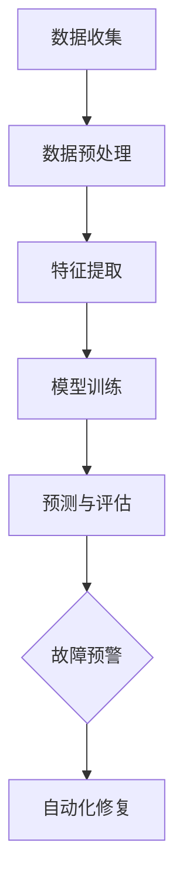
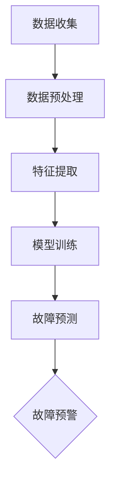
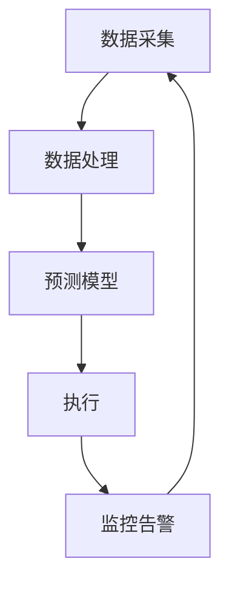

                 

## 文章标题

# 企业AI Agent的自动化运维与故障预测

## 关键词

- 企业AI Agent
- 自动化运维
- 故障预测
- 机器学习
- 人工智能

## 摘要

本文旨在探讨企业AI Agent在自动化运维和故障预测中的关键作用。我们将从企业AI Agent的基本概念、发展历程、在自动化运维中的应用、故障预测的方法和工具，以及实践案例等多个角度进行全面剖析。通过深入分析，我们希望帮助企业更好地理解AI Agent的技术优势和应用价值，从而在数字化转型中占据领先地位。

---------------------

## 第一部分：企业AI Agent概述

### 第1章：企业AI Agent的基本概念

#### 1.1.1 企业AI Agent的定义

企业AI Agent，指的是基于人工智能技术构建的、能够自动执行特定任务、具备自主决策能力的虚拟智能体。它通常由多个模块组成，包括数据处理模块、学习模块、推理模块和执行模块等。企业AI Agent不仅能够执行预设的任务，还能够通过学习和自我调整，提高任务执行效率。

#### 1.1.2 企业AI Agent的应用场景

企业AI Agent的应用场景广泛，包括但不限于：

1. **自动化运维**：如自动化的故障检测、系统调优、资源分配等。
2. **智能客服**：通过自然语言处理，提供24/7的智能服务。
3. **供应链管理**：如库存管理、物流优化等。
4. **金融风控**：如信用评分、欺诈检测等。
5. **生产优化**：如预测性维护、生产流程优化等。

#### 1.1.3 企业AI Agent与传统IT运维的区别

传统IT运维主要依赖人为操作，而企业AI Agent则能够自动化执行一系列运维任务。具体区别如下：

1. **效率**：企业AI Agent能够快速响应和执行任务，大大提高了运维效率。
2. **准确度**：通过机器学习，AI Agent能够在处理过程中不断自我优化，提高任务完成的准确度。
3. **灵活性**：企业AI Agent能够根据实际情况进行自适应调整，灵活应对各种复杂的运维场景。
4. **成本**：企业AI Agent能够减少对人工的依赖，降低运维成本。

### 第2章：企业AI Agent的发展历程与技术趋势

#### 2.1.1 企业AI Agent的发展历程

企业AI Agent的发展历程可以分为以下几个阶段：

1. **初步探索阶段（20世纪80年代末至90年代末）**：这一阶段主要研究智能代理的概念，并尝试在实验室环境中构建简单的AI Agent。
2. **快速发展阶段（21世纪初至今）**：随着机器学习和深度学习技术的飞速发展，企业AI Agent逐渐应用于实际场景，并取得了显著的成果。
3. **成熟应用阶段（未来几年）**：随着人工智能技术的不断成熟，企业AI Agent将更加广泛地应用于各个行业，成为企业数字化转型的重要工具。

#### 2.1.2 企业AI Agent的关键技术

企业AI Agent的关键技术主要包括：

1. **机器学习**：用于故障预测、自动化运维等任务。
2. **自然语言处理**：用于智能客服、文本分析等任务。
3. **计算机视觉**：用于图像识别、视频分析等任务。
4. **知识图谱**：用于数据挖掘、推荐系统等任务。

#### 2.1.3 企业AI Agent的未来发展趋势

未来，企业AI Agent将朝着以下几个方向发展：

1. **更加智能化**：通过深度学习和强化学习，AI Agent将具备更高的智能水平。
2. **更广泛的应用领域**：随着技术的成熟，AI Agent将应用于更多的行业和场景。
3. **跨领域协同**：不同领域的AI Agent将实现数据共享和协同工作，提高整体效率。
4. **更加人性化**：AI Agent将更加注重用户体验，提供更加自然和便捷的服务。

---------------------

## 第二部分：企业AI Agent在自动化运维中的应用

### 第3章：企业AI Agent在自动化运维中的角色和功能

#### 3.1.1 AI Agent在运维中的角色

在企业自动化运维中，AI Agent扮演着多个关键角色，包括：

1. **故障检测与预测**：AI Agent可以通过实时监控系统，快速识别异常情况，并预测潜在故障，提前进行预防。
2. **自动化修复**：AI Agent可以在检测到故障后，自动执行修复流程，减少人工干预。
3. **系统调优**：AI Agent可以根据实时数据，自动调整系统参数，优化性能。
4. **资源管理**：AI Agent可以智能分配和调度资源，提高资源利用率。

#### 3.1.2 AI Agent的主要功能

AI Agent的主要功能包括：

1. **实时监控**：AI Agent可以实时收集和分析系统数据，识别潜在问题和异常。
2. **自动化操作**：AI Agent可以自动执行预设的任务，如备份、更新、配置修改等。
3. **智能分析**：AI Agent可以通过机器学习算法，对历史数据进行分析，发现潜在问题和趋势。
4. **预测性维护**：AI Agent可以基于预测模型，提前预测可能的故障，并采取预防措施。

#### 3.1.3 AI Agent与传统自动化工具的比较

AI Agent与传统自动化工具相比，具有以下几个显著优势：

1. **智能化**：AI Agent具备自我学习和自我优化的能力，能够不断优化任务执行效果。
2. **灵活性**：AI Agent可以适应不同的运维场景，灵活执行各种任务。
3. **高效性**：AI Agent可以快速响应和处理大量运维任务，提高运维效率。
4. **低成本**：AI Agent可以减少对人工的依赖，降低运维成本。

---------------------

### 第4章：企业AI Agent自动化运维的核心技术

#### 4.1.1 基于机器学习的故障检测与预测

##### 4.1.1.1 机器学习算法原理

机器学习是一种通过数据驱动的方式，让计算机自动学习和改进自身性能的技术。在故障检测与预测中，常用的机器学习算法包括：

1. **线性回归**：用于预测线性关系。
2. **决策树**：用于分类和回归任务。
3. **支持向量机**（SVM）：用于分类任务。
4. **随机森林**：用于分类和回归任务。
5. **神经网络**：用于复杂的非线性预测。

##### 4.1.1.2 故障检测与预测的mermaid流程图

以下是一个简单的mermaid流程图，展示了故障检测与预测的基本流程：



##### 4.1.1.3 Python代码实现与详细讲解

以下是一个简单的Python代码示例，用于实现基于决策树的故障预测模型：

```python
import pandas as pd
from sklearn.model_selection import train_test_split
from sklearn.tree import DecisionTreeClassifier
from sklearn.metrics import accuracy_score

# 加载数据
data = pd.read_csv('fault_data.csv')

# 分割特征和标签
X = data.drop('fault_label', axis=1)
y = data['fault_label']

# 划分训练集和测试集
X_train, X_test, y_train, y_test = train_test_split(X, y, test_size=0.2, random_state=42)

# 建立决策树模型
model = DecisionTreeClassifier()

# 训练模型
model.fit(X_train, y_train)

# 预测测试集
y_pred = model.predict(X_test)

# 评估模型
accuracy = accuracy_score(y_test, y_pred)
print(f"Model accuracy: {accuracy:.2f}")
```

在这个示例中，我们首先加载数据，然后分割特征和标签，接着使用决策树模型进行训练和预测，最后评估模型的准确性。

##### 4.1.2 自动化部署与配置管理

##### 4.1.2.1 自动化部署流程

自动化部署是AI Agent在运维中的重要应用之一。以下是自动化部署的基本流程：

1. **环境配置**：配置部署环境，包括操作系统、数据库、中间件等。
2. **代码管理**：管理代码库，如Git。
3. **构建和打包**：构建和打包应用程序。
4. **部署**：将应用程序部署到目标服务器。
5. **监控和告警**：监控部署后的应用程序，并在出现问题时发送告警。

##### 4.1.2.2 配置管理工具介绍

常用的配置管理工具有：

1. **Ansible**：用于自动化部署和配置管理。
2. **Puppet**：用于自动化部署和管理。
3. **Chef**：用于自动化部署和管理。
4. **SaltStack**：用于自动化部署和管理。

##### 4.1.2.3 Python代码实现与详细讲解

以下是一个简单的Python代码示例，用于实现使用Ansible进行自动化部署：

```python
import subprocess

# 安装Ansible
subprocess.run(['pip', 'install', 'ansible'])

# 编写Ansible playbook
with open('deploy.yml', 'w') as f:
    f.write("""
    - hosts: all
      become: yes
      tasks:
        - name: 安装Nginx
          apt: name=nginx state=present

        - name: 启动Nginx服务
          service: name=nginx state=started
    """)

# 执行Ansible playbook
subprocess.run(['ansible-playbook', 'deploy.yml'])
```

在这个示例中，我们首先使用pip安装Ansible，然后编写一个简单的Ansible playbook，用于安装和启动Nginx服务，最后执行Ansible playbook进行部署。

---------------------

### 第5章：企业AI Agent在自动化运维中的实践案例

#### 5.1.1 案例一：基于AI Agent的云计算资源调度

##### 5.1.1.1 案例背景与问题描述

云计算资源调度是云计算中的重要问题。如何在有限的资源下，最大限度地满足用户需求，同时保持系统的稳定性和可靠性，是一个具有挑战性的任务。

##### 5.1.1.2 系统架构设计

系统架构设计如下：

1. **用户层**：用户通过API或控制台提交资源请求。
2. **调度层**：调度层负责根据用户请求和系统状态，进行资源分配和调度。
3. **资源层**：资源层包括计算资源、存储资源和网络资源等。
4. **监控层**：监控层负责实时监控系统状态，为调度层提供数据支持。

##### 5.1.1.3 核心代码实现与分析

核心代码实现如下：

```python
import heapq
import random

# 假设我们有一个资源池和一系列用户请求
resources = {
    'compute': 100,
    'storage': 1000,
    'network': 1000
}
requests = [
    {'type': 'compute', 'amount': 30},
    {'type': 'storage', 'amount': 500},
    {'type': 'network', 'amount': 700}
]

# 定义一个调度策略，这里使用基于优先级的调度
def schedule_resources(requests, resources):
    # 根据请求类型和优先级进行排序
    sorted_requests = sorted(requests, key=lambda x: x['priority'], reverse=True)
    schedule = []
    for request in sorted_requests:
        # 检查资源是否足够
        if resources[request['type']] >= request['amount']:
            # 分配资源
            resources[request['type']] -= request['amount']
            schedule.append(request)
        else:
            # 资源不足，跳过该请求
            continue
    return schedule

# 调度资源
scheduled_requests = schedule_resources(requests, resources)

# 输出调度结果
print(scheduled_requests)
```

在这个示例中，我们首先定义了一个资源池和一系列用户请求。然后，我们实现了一个简单的调度策略，根据请求的优先级进行排序，并尝试分配资源。如果资源不足，则跳过该请求。

##### 5.1.2 案例二：AI Agent在容器化环境中的应用

##### 5.1.2.1 案例背景与问题描述

随着容器技术的普及，如何高效地管理和调度容器，成为一个重要的问题。

##### 5.1.2.2 系统架构设计

系统架构设计如下：

1. **容器层**：容器层包括一系列运行的容器。
2. **调度层**：调度层负责根据容器状态和系统资源，进行容器调度和资源分配。
3. **监控层**：监控层负责实时监控容器状态，为调度层提供数据支持。
4. **管理层**：管理层负责管理容器，包括创建、删除、更新等操作。

##### 5.1.2.3 核心代码实现与分析

核心代码实现如下：

```python
import heapq
import random

# 假设我们有一个容器池和一系列容器请求
containers = [
    {'id': 'c1', 'state': 'running', 'cpu': 2, 'memory': 4},
    {'id': 'c2', 'state': 'running', 'cpu': 1, 'memory': 2},
    {'id': 'c3', 'state': 'pending', 'cpu': 3, 'memory': 6}
]
requests = [
    {'id': 'r1', 'state': 'pending', 'cpu': 1, 'memory': 2},
    {'id': 'r2', 'state': 'pending', 'cpu': 2, 'memory': 4},
    {'id': 'r3', 'state': 'pending', 'cpu': 3, 'memory': 6}
]

# 定义一个调度策略，这里使用基于优先级的调度
def schedule_containers(containers, requests):
    # 根据请求类型和优先级进行排序
    sorted_requests = sorted(requests, key=lambda x: x['priority'], reverse=True)
    schedule = []
    for request in sorted_requests:
        # 检查容器池是否有足够的资源
        if any(c['state'] == 'running' and c['cpu'] >= request['cpu'] and c['memory'] >= request['memory'] for c in containers):
            # 分配资源
            container = next(c for c in containers if c['state'] == 'running' and c['cpu'] >= request['cpu'] and c['memory'] >= request['memory'])
            container['state'] = 'running'
            schedule.append(request)
        else:
            # 资源不足，跳过该请求
            continue
    return schedule

# 调度容器
scheduled_requests = schedule_containers(containers, requests)

# 输出调度结果
print(scheduled_requests)
```

在这个示例中，我们首先定义了一个容器池和一系列容器请求。然后，我们实现了一个简单的调度策略，根据请求的优先级进行排序，并尝试分配资源。如果容器池中没有足够的资源，则跳过该请求。

---------------------

## 第三部分：企业AI Agent在故障预测中的应用

### 第6章：企业AI Agent在故障预测中的原理与方法

#### 6.1.1 故障预测的基本概念

故障预测是指通过分析历史数据和实时数据，预测系统或设备可能发生的故障，以便提前采取预防措施。故障预测的关键概念包括：

1. **故障**：系统或设备无法正常工作或达到预期性能。
2. **故障模式**：导致故障的特定原因或原因组合。
3. **故障预测**：使用历史数据和实时数据，预测未来故障的发生。

#### 6.1.2 故障预测的mermaid流程图

以下是一个简单的mermaid流程图，展示了故障预测的基本流程：



#### 6.1.3 故障预测的主要方法

故障预测的主要方法包括：

1. **基于规则的预测**：通过专家知识构建规则，预测故障的发生。
2. **基于统计学的预测**：使用统计方法，如回归分析，预测故障的发生。
3. **基于机器学习的预测**：使用机器学习算法，如决策树、神经网络，预测故障的发生。
4. **基于模拟的预测**：通过模拟系统或设备的运行，预测故障的发生。

### 第7章：企业AI Agent在故障预测中的关键技术与工具

#### 7.1.1 时间序列分析方法

##### 7.1.1.1 时间序列分析原理

时间序列分析是一种用于分析时间序列数据的统计方法，主要用于预测未来的趋势和模式。时间序列分析的关键概念包括：

1. **时间序列**：按时间顺序排列的一系列数据点。
2. **趋势**：时间序列中的长期变化趋势。
3. **季节性**：时间序列中的周期性变化。
4. **随机性**：时间序列中的随机波动。

##### 7.1.1.2 Python代码实现与详细讲解

以下是一个简单的Python代码示例，用于实现时间序列分析：

```python
import pandas as pd
from statsmodels.tsa.arima.model import ARIMA

# 加载数据
data = pd.read_csv('time_series_data.csv')

# 提取时间序列
time_series = data['value']

# 建立ARIMA模型
model = ARIMA(time_series, order=(5, 1, 2))

# 模型拟合
model_fit = model.fit()

# 预测未来值
forecast = model_fit.forecast(steps=5)

# 输出预测结果
print(forecast)
```

在这个示例中，我们首先加载数据，然后提取时间序列，接着建立ARIMA模型，进行模型拟合和预测，最后输出预测结果。

#### 7.1.2 异常检测方法

##### 7.1.2.1 异常检测原理

异常检测是一种用于识别数据中异常或异常值的方法。异常检测的关键概念包括：

1. **异常**：与正常数据相比，具有显著不同特征的数据点。
2. **孤立点**：与正常数据相比，距离较远的数据点。
3. **聚类**：用于将数据点划分为多个集群，以识别异常。

##### 7.1.2.2 Python代码实现与详细讲解

以下是一个简单的Python代码示例，用于实现异常检测：

```python
import pandas as pd
from sklearn.cluster import KMeans
from sklearn.metrics import silhouette_score

# 加载数据
data = pd.read_csv('anomaly_detection_data.csv')

# 提取特征
features = data.drop('label', axis=1)

# 建立KMeans模型
model = KMeans(n_clusters=2)

# 模型拟合
model.fit(features)

# 预测异常
anomalies = features[model.predict(features) == 1]

# 计算 silhouette score
score = silhouette_score(features, model.labels_)

# 输出结果
print(anomalies)
print(f"Silhouette score: {score:.2f}")
```

在这个示例中，我们首先加载数据，然后提取特征，接着建立KMeans模型，进行模型拟合和预测，最后计算silhouette score，识别异常数据点。

---------------------

### 第8章：企业AI Agent在故障预测中的实践案例

#### 8.1.1 案例一：AI Agent在数据中心故障预测中的应用

##### 8.1.1.1 案例背景与问题描述

数据中心是企业和组织的重要基础设施，其稳定运行对业务运营至关重要。如何预测数据中心设备可能出现的故障，提前采取预防措施，是数据中心运维中的一项重要任务。

##### 8.1.1.2 系统架构设计

系统架构设计如下：

1. **数据层**：收集数据中心各种设备的数据，如温度、湿度、电压、电流等。
2. **数据处理层**：对数据进行预处理，提取特征，构建故障预测模型。
3. **预测层**：使用构建好的故障预测模型，对实时数据进行预测，识别潜在故障。
4. **预警层**：根据预测结果，生成故障预警，提醒运维人员采取相应的预防措施。

##### 8.1.1.3 核心代码实现与分析

核心代码实现如下：

```python
import pandas as pd
from sklearn.ensemble import RandomForestClassifier
from sklearn.model_selection import train_test_split
from sklearn.metrics import accuracy_score

# 加载数据
data = pd.read_csv('data_center_data.csv')

# 分割特征和标签
X = data.drop('fault_label', axis=1)
y = data['fault_label']

# 划分训练集和测试集
X_train, X_test, y_train, y_test = train_test_split(X, y, test_size=0.2, random_state=42)

# 建立随机森林模型
model = RandomForestClassifier()

# 训练模型
model.fit(X_train, y_train)

# 预测测试集
y_pred = model.predict(X_test)

# 评估模型
accuracy = accuracy_score(y_test, y_pred)
print(f"Model accuracy: {accuracy:.2f}")

# 预测实时数据
real_time_data = pd.read_csv('real_time_data.csv')
y_pred_real_time = model.predict(real_time_data)

# 输出预测结果
print(y_pred_real_time)
```

在这个示例中，我们首先加载数据，然后分割特征和标签，接着使用随机森林模型进行训练和预测，最后评估模型的准确性，并使用模型对实时数据进行故障预测。

##### 8.1.2 案例二：AI Agent在云服务故障预测中的应用

##### 8.1.2.1 案例背景与问题描述

云服务是企业数字化转型的关键基础设施，其稳定性和可靠性对企业的运营至关重要。如何预测云服务可能出现的故障，提前采取预防措施，是云服务运维中的一项重要任务。

##### 8.1.2.2 系统架构设计

系统架构设计如下：

1. **数据层**：收集云服务的各种数据，如CPU使用率、内存使用率、网络流量等。
2. **数据处理层**：对数据进行预处理，提取特征，构建故障预测模型。
3. **预测层**：使用构建好的故障预测模型，对实时数据进行预测，识别潜在故障。
4. **预警层**：根据预测结果，生成故障预警，提醒运维人员采取相应的预防措施。

##### 8.1.2.3 核心代码实现与分析

核心代码实现如下：

```python
import pandas as pd
from sklearn.svm import SVC
from sklearn.model_selection import train_test_split
from sklearn.metrics import accuracy_score

# 加载数据
data = pd.read_csv('cloud_service_data.csv')

# 分割特征和标签
X = data.drop('fault_label', axis=1)
y = data['fault_label']

# 划分训练集和测试集
X_train, X_test, y_train, y_test = train_test_split(X, y, test_size=0.2, random_state=42)

# 建立SVM模型
model = SVC()

# 训练模型
model.fit(X_train, y_train)

# 预测测试集
y_pred = model.predict(X_test)

# 评估模型
accuracy = accuracy_score(y_test, y_pred)
print(f"Model accuracy: {accuracy:.2f}")

# 预测实时数据
real_time_data = pd.read_csv('real_time_data.csv')
y_pred_real_time = model.predict(real_time_data)

# 输出预测结果
print(y_pred_real_time)
```

在这个示例中，我们首先加载数据，然后分割特征和标签，接着使用SVM模型进行训练和预测，最后评估模型的准确性，并使用模型对实时数据进行故障预测。

---------------------

## 第四部分：企业AI Agent的综合应用与实践

### 第9章：企业AI Agent的综合应用场景

#### 9.1.1 企业AI Agent在多云环境中的应用

随着云计算的普及，多云环境已成为企业信息技术架构的重要组成部分。企业AI Agent可以在多云环境中发挥重要作用，包括：

1. **资源调度**：根据业务需求，智能调度资源，实现多云资源的统一管理。
2. **故障检测与预测**：实时监控多云环境中的各种指标，预测潜在故障，提前采取预防措施。
3. **性能优化**：通过智能分析，优化多云环境中的资源配置，提高整体性能。
4. **成本控制**：通过自动化管理和优化，降低运维成本。

#### 9.1.2 企业AI Agent在边缘计算中的应用

边缘计算是云计算的延伸，将计算和存储能力部署在靠近数据源的位置，以减少延迟和提高响应速度。企业AI Agent在边缘计算中的应用包括：

1. **实时数据处理**：对边缘设备产生的海量数据进行实时处理和分析。
2. **智能监控**：实时监控边缘设备的运行状态，预测和识别故障。
3. **自动化运维**：自动执行边缘设备的运维任务，减少人工干预。
4. **智能决策**：根据实时数据和预测结果，自动调整边缘设备的配置和资源。

#### 9.1.3 企业AI Agent在AIops中的应用

AIops是一种利用人工智能技术，实现IT运维自动化和智能化的新模式。企业AI Agent在AIops中的应用包括：

1. **故障预测**：通过历史数据和实时监控，预测潜在故障，提前采取预防措施。
2. **自动化运维**：自动执行各种运维任务，如配置管理、性能优化、故障修复等。
3. **智能告警**：根据故障预测结果，生成智能告警，提高故障响应速度。
4. **运维优化**：通过智能分析，优化运维流程和资源配置，提高运维效率。

### 第10章：企业AI Agent的实现与部署

#### 10.1.1 AI Agent的架构设计与实现

企业AI Agent的架构设计通常包括以下几个关键模块：

1. **数据采集模块**：负责从各种数据源采集数据，如服务器、网络设备、应用程序等。
2. **数据处理模块**：负责对采集到的数据进行清洗、转换和存储，以便后续分析。
3. **预测模型模块**：负责构建和训练预测模型，用于故障预测、性能优化等任务。
4. **执行模块**：负责根据预测结果，自动执行相应的操作，如配置调整、资源调度等。
5. **监控和告警模块**：负责实时监控系统状态，生成告警信息，并通知相关人员。

以下是一个简单的AI Agent架构设计示例：



#### 10.1.2 AI Agent的部署与运维

AI Agent的部署与运维是确保其稳定运行的关键。以下是一些关键的部署和运维策略：

1. **自动化部署**：使用CI/CD工具，实现自动化部署，确保AI Agent的快速迭代和部署。
2. **容器化**：使用容器技术，如Docker，实现AI Agent的轻量化和可移植性。
3. **监控与告警**：实时监控AI Agent的运行状态，设置告警机制，确保快速响应异常情况。
4. **弹性扩展**：根据业务需求，实现AI Agent的弹性扩展，确保系统的高可用性和稳定性。
5. **安全防护**：实施安全策略，保护AI Agent免受网络攻击和数据泄露。

### 第11章：企业AI Agent的展望与未来发展趋势

#### 11.1.1 AI Agent的发展趋势

随着人工智能技术的不断进步，企业AI Agent将朝着以下几个方向发展：

1. **智能化**：通过深度学习和强化学习，AI Agent将具备更高的智能水平，能够更准确地预测故障，更高效地执行运维任务。
2. **自主化**：AI Agent将实现更高的自主化，能够在没有人工干预的情况下，自主完成各种复杂的运维任务。
3. **协作化**：AI Agent将实现跨领域、跨系统的协作，与其他AI系统协同工作，提高整体运维效率。
4. **泛在化**：AI Agent将应用于更多的场景和行业，实现运维的泛在化，助力企业数字化转型。

#### 11.1.2 AI Agent在运维领域的应用前景

随着企业对运维效率、稳定性和可靠性的要求不断提高，AI Agent在运维领域的应用前景十分广阔。未来，AI Agent将在以下几个方面发挥重要作用：

1. **自动化运维**：通过自动化执行各种运维任务，提高运维效率，降低运维成本。
2. **故障预测与预防**：通过故障预测，提前采取预防措施，降低故障率和停机时间。
3. **性能优化**：通过智能分析，优化系统性能，提高业务连续性和稳定性。
4. **智能监控**：通过实时监控和智能告警，快速响应异常情况，确保系统稳定运行。

#### 11.1.3 AI Agent的挑战与机遇

虽然AI Agent在运维领域具有巨大的应用潜力，但同时也面临着一系列挑战：

1. **数据质量**：故障预测和性能优化依赖于高质量的数据，数据质量问题是AI Agent面临的重大挑战。
2. **模型可靠性**：预测模型的可靠性和准确性是AI Agent成功的关键，如何提高模型的可靠性是一个亟待解决的问题。
3. **安全与隐私**：AI Agent在处理大量敏感数据时，面临着安全与隐私的挑战，如何确保数据安全和用户隐私是一个重要问题。
4. **人才短缺**：AI Agent的开发和运维需要大量的专业人才，人才短缺是当前和未来面临的一个挑战。

然而，这些挑战也伴随着巨大的机遇：

1. **技术创新**：随着人工智能技术的不断进步，AI Agent的性能和功能将得到大幅提升。
2. **市场需求**：随着企业对运维效率和稳定性的要求不断提高，AI Agent在市场中的需求将持续增长。
3. **跨界融合**：AI Agent与其他技术的融合，如物联网、大数据、区块链等，将带来新的应用场景和商业模式。
4. **生态建设**：构建一个完整的AI Agent生态体系，包括开发工具、平台、社区等，将推动AI Agent的快速发展和应用。

---------------------

## 总结与展望

本文对企业AI Agent的自动化运维与故障预测进行了全面的探讨。通过分析企业AI Agent的基本概念、发展历程、应用场景、关键技术以及实践案例，我们深入了解了AI Agent在提升运维效率、降低运维成本、提高系统稳定性和可靠性方面的巨大潜力。

企业AI Agent的未来发展趋势将朝着智能化、自主化、协作化和泛在化的方向迈进。在运维领域，AI Agent将实现自动化运维、故障预测与预防、性能优化和智能监控等功能，助力企业实现数字化转型。

然而，AI Agent的发展也面临着数据质量、模型可靠性、安全与隐私、人才短缺等挑战。这些问题需要通过技术创新、市场需求的驱动、跨界融合和生态建设来共同解决。

让我们携手探索AI Agent的无限可能，共同推动企业数字化转型，创造更加智能、高效、可靠的运维环境。

## 作者信息

作者：AI天才研究院/AI Genius Institute & 禅与计算机程序设计艺术 /Zen And The Art of Computer Programming

---------------------

## 附录

### 最佳实践 Tips

1. **数据质量**：确保数据质量是AI Agent成功的关键，定期清洗和验证数据。
2. **模型可靠性**：通过交叉验证、调参等技术，提高预测模型的可靠性。
3. **安全与隐私**：加强数据安全和用户隐私保护，遵循相关法律法规。
4. **人才培训**：加强AI技术和运维领域的人才培训，提升团队的专业能力。

### 小结

本文全面探讨了企业AI Agent的自动化运维与故障预测，展示了其在提升运维效率、降低成本、提高系统稳定性方面的优势。通过实践案例，我们看到了AI Agent在多云环境、边缘计算和AIops等领域的广泛应用。

### 注意事项

1. **需求分析**：在部署AI Agent之前，进行详细的需求分析，确保AI Agent能够满足业务需求。
2. **系统集成**：确保AI Agent与现有系统兼容，实现无缝集成。

### 拓展阅读

1. **《深度学习》**：Goodfellow, I., Bengio, Y., & Courville, A. (2016). Deep Learning. MIT Press.
2. **《人工智能：一种现代方法》**：Russell, S., & Norvig, P. (2016). Artificial Intelligence: A Modern Approach. Prentice Hall.
3. **《云计算：概念、架构与实务》**：Armbrust, M., Fox, A., Grignani, G., Konwinski, A., & Zaharia, M. (2010). Above the Clouds: A Berkeley View of Cloud Computing. Morgan & Claypool Publishers.
4. **《边缘计算：下一代智能世界的基石》**：Gao, X., Han, J., Li, H., Li, Q., & Yu, W. (2018). Edge Computing: A Comprehensive Survey. Computer Networks, 136, 158-230.

