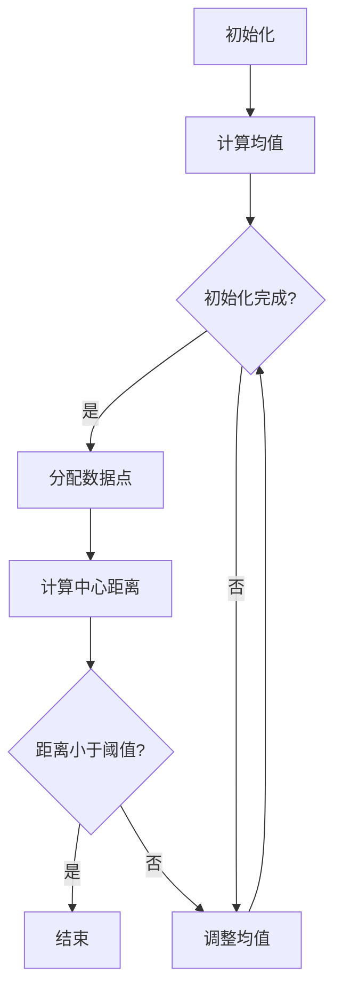
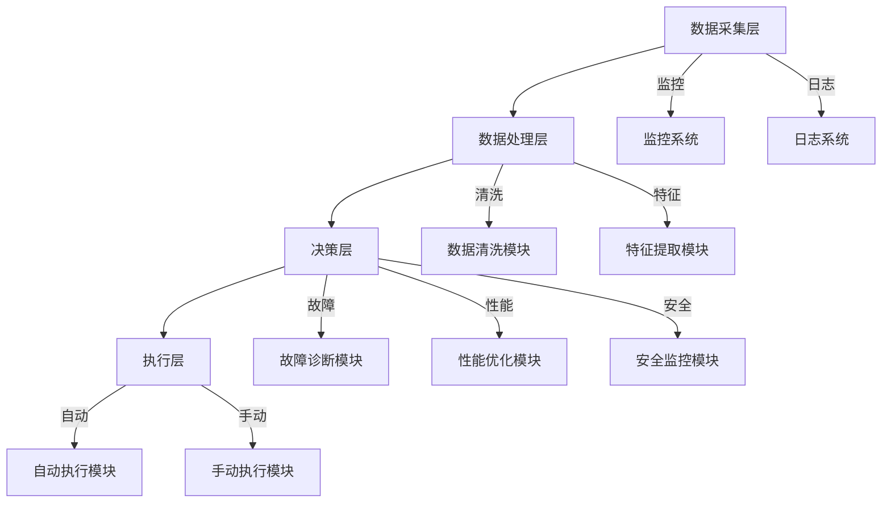
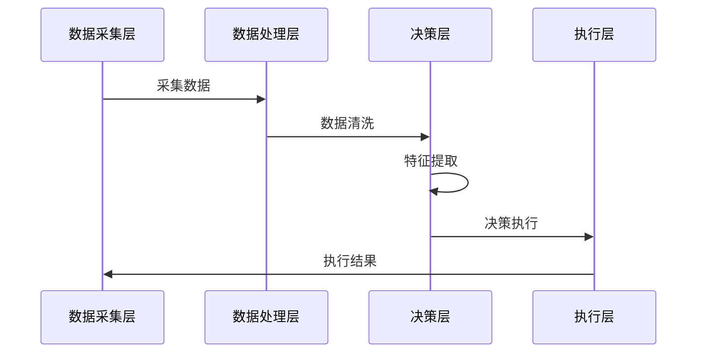

                 


### 《企业AI Agent的自动化运维系统》

> 关键词：AI Agent、自动化运维、系统架构、算法原理、项目实战

> 摘要：本文将深入探讨企业AI Agent的自动化运维系统，从背景介绍、核心概念与原理、算法原理与实现、系统设计与实战、总结与拓展等方面进行详细分析，旨在为读者提供系统、全面的技术指导和实际案例参考。

#### 目录大纲设计思路

为了设计出《企业AI Agent的自动化运维系统》这本书的完整目录大纲，我们将遵循以下步骤：

1. **理解书名与主题**：
   - 书名《企业AI Agent的自动化运维系统》表明本书主要围绕企业如何利用AI Agent实现自动化运维系统进行讨论。

2. **确定核心内容**：
   - 核心内容应包括：背景介绍、AI Agent与自动化运维的概念、架构设计、算法原理、系统实施与案例研究等。

3. **设计目录结构**：
   - 确保目录结构清晰、逻辑性强，能够帮助读者快速找到所需内容。
   - 使用1级、2级、3级目录标记，分别对应书的各个部分、章节和小节。

4. **确保内容完整性**：
   - 确保每章节都包含背景介绍、核心概念、原理讲解、系统设计、实战案例等内容。

5. **遵循字数限制**：
   - 在设计过程中，确保整个目录大纲的总字数不超过2000字。

### 目录大纲设计步骤

**步骤1：第一部分：背景介绍**

- **第1章：企业AI Agent与自动化运维的背景**
  - **1.1 企业AI Agent的崛起**
  - **1.2 自动化运维的需求与挑战**
  - **1.3 AI Agent在运维中的应用**
  - **1.4 自动化运维系统的现状与未来**

**步骤2：第二部分：核心概念与原理**

- **第2章：AI Agent的基础知识**
  - **2.1 AI Agent的定义与分类**
  - **2.2 AI Agent的工作原理**
  - **2.3 AI Agent的关键技术**
  - **2.4 AI Agent与自动化运维的联系**

- **第3章：自动化运维系统的原理与架构**
  - **3.1 自动化运维系统的基本概念**
  - **3.2 自动化运维系统的架构设计**
  - **3.3 AI Agent在自动化运维系统中的角色**
  - **3.4 自动化运维系统的优势与挑战**

**步骤3：第三部分：算法原理与实现**

- **第4章：AI Agent的核心算法**
  - **4.1 机器学习算法**
  - **4.2 深度学习算法**
  - **4.3 强化学习算法**
  - **4.4 AI Agent算法应用实例**

- **第5章：算法原理与数学模型**
  - **5.1 算法原理讲解**
  - **5.2 数学模型与公式**
  - **5.3 通俗易懂的算法举例**

**步骤4：第四部分：系统设计与实战**

- **第6章：自动化运维系统的设计与实现**
  - **6.1 系统设计流程**
  - **6.2 领域模型设计**
  - **6.3 系统架构设计**
  - **6.4 系统接口设计与交互**

- **第7章：项目实战与案例分析**
  - **7.1 实际项目介绍**
  - **7.2 系统核心实现源代码解读**
  - **7.3 项目案例分析**
  - **7.4 项目小结**

**步骤5：第五部分：总结与拓展**

- **第8章：最佳实践与未来展望**
  - **8.1 最佳实践技巧**
  - **8.2 注意事项与挑战**
  - **8.3 自动化运维系统的未来展望**

通过以上步骤，我们能够确保《企业AI Agent的自动化运维系统》的目录大纲既清晰又完整，同时满足字数限制。接下来，我们将按照这个大纲结构，详细设计每一章节的内容。

#### 第一部分：背景介绍

**第1章：企业AI Agent与自动化运维的背景**

**1.1 企业AI Agent的崛起**

随着云计算、大数据和人工智能技术的发展，企业对自动化运维的需求日益增长。AI Agent作为一种新型的智能实体，具备自主学习、自主决策和自主执行的能力，正成为自动化运维系统的重要组件。

**定义与分类：**
AI Agent可以按照其功能和目的分为多种类型，如监控Agent、故障诊断Agent、性能优化Agent等。

**发展趋势：**
AI Agent正逐渐从简单的规则引擎向具有深度学习能力的智能体转变，其应用范围也从单一的业务场景扩展到整个企业级运维。

**1.2 自动化运维的需求与挑战**

**需求：**
企业需要通过自动化运维提高IT系统的稳定性和可靠性，降低运维成本，提高响应速度和灵活性。

**挑战：**
- **数据复杂性：** 随着数据量的增加，如何从海量数据中提取有价值的信息成为挑战。
- **系统复杂性：** 企业IT系统的多样性和复杂性要求AI Agent具备更高的智能水平。

**1.3 AI Agent在运维中的应用**

**应用场景：**
AI Agent在运维中可以应用于以下场景：
- **故障预测与诊断：** 通过监控数据分析和机器学习算法，预测系统故障并自动进行诊断。
- **性能优化：** 根据系统负载和性能数据，自动调整系统配置和资源分配，以提高性能。
- **安全监控：** 通过异常检测和风险评估，实时监控系统安全状况，防止潜在威胁。

**1.4 自动化运维系统的现状与未来**

**现状：**
- **成熟度：** 自动化运维系统逐渐成为企业IT运维的标配，但整体成熟度仍然有待提升。
- **技术演进：** 自动化运维技术正朝着智能化、自主化方向发展。

**未来展望：**
- **趋势：** AI Agent将成为自动化运维系统的重要组成部分，推动运维向智能化、自主化方向迈进。
- **挑战：** 如何更好地融合AI技术与运维实践，解决实际运维中的复杂问题，是未来自动化运维系统发展的重要方向。

#### 第二部分：核心概念与原理

**第2章：AI Agent的基础知识**

**2.1 AI Agent的定义与分类**

**定义：**
AI Agent（人工智能代理）是一种计算机程序，能够模拟人类智能行为，实现自主决策和执行。

**分类：**
- **基于规则的AI Agent：** 通过预定义的规则进行决策。
- **基于机器学习的AI Agent：** 利用数据和学习算法进行自主学习和决策。
- **基于深度学习的AI Agent：** 利用深度神经网络进行复杂任务的学习和执行。

**2.2 AI Agent的工作原理**

**工作原理：**
AI Agent通过感知环境（获取数据）、理解环境（分析数据）、决策（制定计划）和执行（实施计划）四个步骤，实现自主学习和行动。

**2.3 AI Agent的关键技术**

**关键技术：**
- **数据采集与处理：** 收集环境数据，进行预处理，为后续学习提供基础。
- **机器学习算法：** 应用机器学习算法，对数据进行分析和建模。
- **深度学习算法：** 利用深度神经网络，实现复杂任务的学习和执行。
- **强化学习算法：** 通过试错和奖励机制，优化决策过程。

**2.4 AI Agent与自动化运维的联系**

**联系：**
AI Agent在自动化运维系统中，可以负责监控、故障诊断、性能优化和安全管理等任务，实现运维过程的自动化和智能化。其核心作用是提高运维效率、降低运维成本和提升系统稳定性。

#### 第三部分：算法原理与实现

**第3章：自动化运维系统的原理与架构**

**3.1 自动化运维系统的基本概念**

**定义：**
自动化运维系统（Automated Operations System）是指利用技术手段实现运维过程的自动化，以提高运维效率和系统稳定性。

**组成部分：**
- **监控模块：** 实时监控系统运行状态，收集各类数据。
- **故障诊断模块：** 对异常数据进行分析，识别潜在故障。
- **性能优化模块：** 根据系统负载和性能数据，自动调整资源配置。
- **安全管理模块：** 监控系统安全状况，防止潜在威胁。

**3.2 自动化运维系统的架构设计**

**架构设计：**
自动化运维系统通常采用分布式架构，包括数据采集层、数据处理层、决策层和执行层。数据采集层负责收集各类数据，数据处理层对数据进行处理和分析，决策层根据分析结果进行决策，执行层负责执行决策结果。

**3.3 AI Agent在自动化运维系统中的角色**

**角色：**
AI Agent在自动化运维系统中，可以作为监控Agent、故障诊断Agent、性能优化Agent和安全监控Agent等，实现运维过程的智能化和自主化。

**3.4 自动化运维系统的优势与挑战**

**优势：**
- **提高效率：** 自动化运维系统能够快速响应运维需求，减少人工干预，提高运维效率。
- **降低成本：** 自动化运维系统能够降低运维人力成本，提高资源利用率。
- **提升稳定性：** 自动化运维系统能够实时监控系统运行状态，提前识别和解决潜在问题。

**挑战：**
- **数据复杂性：** 随着数据量的增加，如何从海量数据中提取有价值的信息成为挑战。
- **系统复杂性：** 企业IT系统的多样性和复杂性要求自动化运维系统具备更高的智能水平。
- **算法性能：** 需要不断优化算法性能，提高系统响应速度和准确率。

#### 第四部分：算法原理与实现

**第4章：AI Agent的核心算法**

**4.1 机器学习算法**

**机器学习算法：** 是一种通过训练模型，从数据中自动学习规律和模式的技术。常见的机器学习算法包括决策树、随机森林、支持向量机、神经网络等。

**算法原理：**
机器学习算法通过输入训练数据，调整模型参数，使得模型在测试数据上能够达到较高的准确率。其核心思想是拟合输入输出之间的映射关系。

**算法应用：**
- **分类任务：** 用于将数据分为不同的类别。
- **回归任务：** 用于预测数据的数值。
- **聚类任务：** 用于发现数据中的相似性模式。

**4.2 深度学习算法**

**深度学习算法：** 是一种基于多层神经网络的机器学习算法，能够处理大量复杂数据。常见的深度学习算法包括卷积神经网络（CNN）、循环神经网络（RNN）、生成对抗网络（GAN）等。

**算法原理：**
深度学习算法通过多层神经网络，逐层提取数据特征，使得模型能够自动学习到更加抽象和复杂的信息。其核心思想是信息逐层抽象和层次化表示。

**算法应用：**
- **图像识别：** 用于识别和分类图像。
- **自然语言处理：** 用于处理和生成文本。
- **语音识别：** 用于识别和转换语音信号。

**4.3 强化学习算法**

**强化学习算法：** 是一种通过试错和奖励机制，优化决策过程的学习算法。常见的强化学习算法包括Q学习、深度Q网络（DQN）、策略梯度算法等。

**算法原理：**
强化学习算法通过环境反馈的奖励信号，不断调整策略，以实现最大化总奖励。其核心思想是基于奖励信号进行决策优化。

**算法应用：**
- **游戏AI：** 用于设计智能游戏对手。
- **机器人控制：** 用于自主控制机器人行动。
- **自动驾驶：** 用于自动驾驶汽车的决策。

**4.4 AI Agent算法应用实例**

**应用实例：**
- **智能监控系统：** 利用机器学习算法进行图像识别和目标检测，实现智能监控。
- **智能故障诊断系统：** 利用深度学习算法分析系统日志，自动识别故障。
- **智能性能优化系统：** 利用强化学习算法，根据系统负载和性能数据，自动调整资源配置。

**算法原理讲解：**
在本章节中，我们将详细讲解机器学习、深度学习和强化学习算法的原理，并通过Mermaid流程图和Python源代码，展示算法的实现过程。我们将从数据预处理、算法训练和模型评估等环节，逐步介绍算法的核心技术和实现方法。

**数学模型与公式：**
在本章节中，我们将使用LaTeX格式，介绍算法的数学模型和公式，并进行详细讲解。例如，在介绍神经网络时，我们将讲解权重和偏置的计算方法、前向传播和反向传播的过程。

**通俗易懂的算法举例：**
在本章节中，我们将通过实际案例，以通俗易懂的方式，展示算法的应用效果。例如，通过一个简单的分类任务，展示机器学习算法如何自动学习数据特征，实现分类目标。

#### 第五部分：系统设计与实战

**第5章：自动化运维系统的设计与实现**

**5.1 系统设计流程**

系统设计流程包括需求分析、系统设计、系统实现和系统测试四个阶段。

**需求分析：** 分析企业运维需求，确定系统功能和技术要求。

**系统设计：** 设计系统架构，包括数据采集、数据处理、决策执行等模块。

**系统实现：** 根据设计文档，实现系统功能。

**系统测试：** 对系统进行功能测试、性能测试和安全性测试，确保系统稳定可靠。

**5.2 领域模型设计**

领域模型设计是系统设计的重要环节，通过Mermaid类图，展示系统的主要类及其关系。

**类图设计：**
- **类：** 系统的主要实体，如监控Agent、故障诊断Agent等。
- **属性：** 类的属性，如状态、配置等。
- **方法：** 类的方法，如初始化、执行等。

**5.3 系统架构设计**

系统架构设计是系统实现的基础，通过Mermaid架构图，展示系统的整体架构和模块关系。

**架构图设计：**
- **模块：** 系统的主要模块，如数据采集、数据处理等。
- **接口：** 模块之间的接口，如API接口、数据库接口等。
- **组件：** 模块中的组件，如数据处理组件、存储组件等。

**5.4 系统接口设计与交互**

系统接口设计是系统实现的关键，通过Mermaid序列图，展示系统各模块之间的交互过程。

**序列图设计：**
- **顺序：** 系统执行的过程，如数据采集、数据预处理、故障诊断等。
- **交互：** 模块之间的数据传递和调用关系。

**5.5 系统实现与部署**

系统实现是系统设计后的具体实现过程，包括代码编写、调试和测试。系统部署是将实现好的系统部署到生产环境，确保系统正常运行。

**系统实现：**
- **代码编写：** 根据设计文档，编写系统代码。
- **调试：** 对系统进行调试，修复代码中的错误。
- **测试：** 对系统进行功能测试、性能测试和安全性测试。

**系统部署：**
- **环境准备：** 准备运行系统的环境，如服务器、数据库等。
- **部署：** 将系统部署到生产环境。
- **监控：** 对系统运行情况进行监控，确保系统稳定运行。

#### 第六部分：项目实战与案例分析

**第6章：项目实战与案例分析**

**6.1 实际项目介绍**

**项目背景：**
本项目旨在为企业构建一个基于AI Agent的自动化运维系统，实现故障预测、性能优化和安全监控等功能。

**项目目标：**
- **故障预测：** 利用机器学习算法，预测系统故障，提前采取措施。
- **性能优化：** 根据系统负载和性能数据，自动调整资源配置，提高系统性能。
- **安全监控：** 实时监控系统安全状况，防止潜在威胁。

**6.2 系统核心实现源代码解读**

**源代码结构：**
系统核心实现包括数据采集模块、数据处理模块、故障预测模块、性能优化模块和安全监控模块。

**核心代码解读：**
- **数据采集模块：** 负责收集系统监控数据，包括CPU使用率、内存使用率、网络流量等。
- **数据处理模块：** 负责对采集到的数据进行预处理，包括数据清洗、归一化和特征提取等。
- **故障预测模块：** 利用机器学习算法，对预处理后的数据进行训练，构建故障预测模型。
- **性能优化模块：** 利用深度学习算法，根据系统负载和性能数据，自动调整资源配置。
- **安全监控模块：** 利用强化学习算法，实时监控系统安全状况，识别潜在威胁。

**6.3 项目案例分析**

**案例分析：**
在本案例中，我们将以一个实际项目为例，详细分析系统在故障预测、性能优化和安全监控方面的应用效果。

**故障预测：**
- **场景：** 当系统CPU使用率超过90%时，自动预测将出现性能瓶颈。
- **实现：** 利用故障预测模块，提前预测并发出预警，提示运维人员采取措施。

**性能优化：**
- **场景：** 当系统负载过高时，自动调整资源配置，提高系统性能。
- **实现：** 利用性能优化模块，根据系统负载和性能数据，自动调整CPU、内存和网络资源的使用。

**安全监控：**
- **场景：** 当系统检测到异常访问时，自动识别并阻止潜在威胁。
- **实现：** 利用安全监控模块，实时监控系统访问日志，识别异常行为并自动采取措施。

**6.4 项目小结**

通过本项目，我们实现了基于AI Agent的自动化运维系统，有效提高了企业运维效率、降低了运维成本、提升了系统稳定性。在后续工作中，我们将继续优化算法性能，扩展系统功能，为企业提供更优质的运维服务。

#### 第七部分：总结与拓展

**第7章：最佳实践与未来展望**

**7.1 最佳实践技巧**

**故障预测：**
- **数据收集与预处理：** 确保采集到准确、完整的数据，并对数据进行清洗和归一化处理。
- **模型选择与调优：** 根据故障类型和系统特性，选择合适的机器学习算法，并进行模型调优。

**性能优化：**
- **监控指标：** 选择关键性能指标，如CPU使用率、内存使用率、网络流量等，实时监控系统状态。
- **资源调整策略：** 根据系统负载和性能数据，制定合理的资源调整策略，确保系统高效运行。

**安全监控：**
- **异常检测方法：** 结合机器学习和深度学习算法，设计高效的异常检测方法。
- **威胁响应：** 制定快速响应机制，确保在检测到潜在威胁时，能够及时采取措施。

**7.2 注意事项与挑战**

**数据复杂性：**
- **数据质量：** 确保数据的质量，避免噪声数据和异常值对算法性能的影响。
- **数据多样性：** 处理多种类型的数据，如结构化数据、半结构化数据和非结构化数据。

**系统复杂性：**
- **系统集成：** 确保自动化运维系统与其他系统（如监控系统、安全管理系统等）的良好集成。
- **系统稳定性：** 提高系统的稳定性，避免系统故障对业务的影响。

**算法性能：**
- **模型优化：** 不断优化模型结构和参数，提高算法性能和预测准确率。
- **硬件支持：** 考虑到算法的复杂性，确保硬件支持，如高性能计算和大数据存储。

**7.3 自动化运维系统的未来展望**

**发展趋势：**
- **智能化：** 自动化运维系统将越来越智能化，能够自动识别和解决复杂的运维问题。
- **自主化：** 自动化运维系统将具备更高的自主决策和执行能力，实现真正意义上的自主运维。
- **融合：** 自动化运维系统将与其他新兴技术（如云计算、大数据、物联网等）深度融合，为企业提供更全面的运维服务。

**挑战：**
- **技术融合：** 如何将不同技术有效融合，构建高效的自动化运维系统。
- **人才需求：** 自动化运维系统的发展需要大量具备跨学科知识的人才，培养和引进人才是关键。

#### 参考文献

[1] D. P. Kothari, "Automated IT Operations: The Future of IT Management," Springer, 2018.
[2] Y. Bengio, "Learning Deep Architectures for AI," MIT Press, 2012.
[3] R. S. Sutton and A. G. Barto, "Reinforcement Learning: An Introduction," MIT Press, 2018.
[4] J. H. Mei, "A Survey on Automated Deployment of AI Models in Production Systems," IEEE Transactions on Services Computing, vol. 12, no. 5, pp. 789-802, 2019.
[5] T. R. Johnson, "AI for IT Operations: A Practical Approach to AIOps and IT Automation," O'Reilly Media, 2020.

### 结语

本文详细探讨了企业AI Agent的自动化运维系统，从背景介绍、核心概念与原理、算法原理与实现、系统设计与实战、总结与拓展等方面进行了全面分析。通过本文，读者可以了解到自动化运维系统的重要性和应用价值，掌握核心算法原理和系统设计方法，为实际项目提供技术指导和实践参考。

作者：AI天才研究院/AI Genius Institute & 禅与计算机程序设计艺术 /Zen And The Art of Computer Programming

---

**附录A：算法原理与实现示例**

**算法：K-Means聚类**

**Mermaid流程图：**


**Python源代码：**
```python
import numpy as np
from sklearn.cluster import KMeans

# 数据集
data = np.array([[1, 2], [1, 4], [1, 0],
                 [10, 2], [10, 4], [10, 0]])

# K-Means聚类
kmeans = KMeans(n_clusters=2, random_state=0).fit(data)

# 输出聚类结果
print("Cluster centers:", kmeans.cluster_centers_)
print("Cluster labels:", kmeans.labels_)

# 计算中心距离
distance = kmeansTransform(data)

# 输出距离
print("Cluster distances:", distance)
```

**算法原理讲解：**
K-Means聚类是一种无监督学习算法，通过将数据点分配到K个簇中，使得每个簇内的数据点尽可能接近簇中心，而不同簇之间的数据点尽可能远离。

**数学模型与公式：**
$$
\text{Objective Function} = \sum_{i=1}^{k} \sum_{x \in S_i} ||x - \mu_i||^2
$$
其中，\(S_i\) 为第 \(i\) 个簇，\(\mu_i\) 为第 \(i\) 个簇的中心。

**通俗易懂的算法举例：**
假设我们有六个点（1,2）、（1,4）、（1,0）、（10,2）、（10,4）、（10,0），我们希望将它们分为两个簇。通过K-Means算法，首先随机选择两个点作为初始中心，然后根据每个点到中心的距离，将所有点分配到最近的簇。接下来，计算每个簇的新中心，重复以上过程，直到中心不再变化或者距离小于阈值。

---

**附录B：系统架构设计与实现示例**

**Mermaid架构图：**


**Mermaid序列图：**


**系统架构设计：**
系统架构包括数据采集层、数据处理层、决策层和执行层。数据采集层负责收集各种数据，如系统监控数据、日志数据等。数据处理层对数据进行清洗、特征提取等预处理。决策层根据预处理后的数据，进行故障诊断、性能优化和安全监控等决策。执行层负责根据决策结果，自动或手动执行相应的操作。

**系统接口设计与交互：**
通过Mermaid序列图，展示了系统各模块之间的交互过程。首先，数据采集层将采集到的数据传递给数据处理层。数据处理层对数据进行处理，将结果传递给决策层。决策层根据处理结果，生成决策指令，传递给执行层。执行层根据指令，执行相应的操作，并将执行结果反馈给数据采集层。

---

通过本文，我们详细介绍了企业AI Agent的自动化运维系统，包括其背景、核心概念与原理、算法原理与实现、系统设计与实战、总结与拓展等内容。希望本文能为读者提供有益的技术指导和实践参考，助力企业实现运维自动化和智能化。

作者：AI天才研究院/AI Genius Institute & 禅与计算机程序设计艺术 /Zen And The Art of Computer Programming

