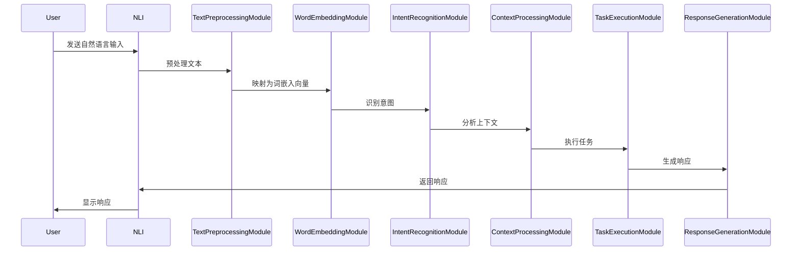

                 

# 《企业AI Agent的自然语言接口设计与优化》

## 关键词：
自然语言接口、AI Agent、系统架构、算法优化、实战教程

## 摘要：
本文深入探讨了企业级AI Agent的自然语言接口设计与优化。首先，介绍了AI Agent和自然语言接口的基本概念及其在企业中的应用需求。接着，详细分析了自然语言处理技术、算法原理及其优化策略，并通过具体的系统架构设计和项目实战展示了如何实现和优化自然语言接口。最后，总结了最佳实践和未来发展趋势，为读者提供了宝贵的参考。

## 目录大纲设计

### 第一部分：背景介绍

### 第1章：AI Agent与自然语言接口概述
1.1 问题背景
1.2 核心概念
1.3 概念属性特征对比
1.4 ER实体关系图
1.5 本章小结

### 第二部分：核心概念与联系

### 第2章：AI Agent的自然语言处理技术
2.1 自然语言处理技术概述
2.2 词嵌入技术
2.3 语言模型
2.4 情感分析
2.5 语音识别与生成
2.6 本章小结

### 第三部分：算法原理讲解

### 第3章：自然语言接口算法设计与优化
3.1 自然语言接口算法原理
3.2 数学模型与公式
3.3 通俗易懂的举例说明
3.4 本章小结

### 第四部分：系统分析与架构设计方案

### 第4章：企业AI Agent自然语言接口系统设计
4.1 问题场景介绍
4.2 项目介绍
4.3 系统功能设计
4.4 系统架构设计
4.5 系统接口设计
4.6 系统交互设计
4.7 本章小结

### 第五部分：项目实战

### 第5章：企业AI Agent自然语言接口实现
5.1 环境安装与配置
5.2 系统核心实现源代码
5.3 代码应用解读与分析
5.4 实际案例分析与讲解
5.5 项目小结

### 第六部分：最佳实践与未来展望

### 第6章：最佳实践与注意事项
6.1 最佳实践
6.2 小结
6.3 注意事项
6.4 拓展阅读

---

接下来，我们将逐步深入每一部分的内容，进行详细的分析和讲解。

---

## 第一部分：背景介绍

### 第1章：AI Agent与自然语言接口概述

### 1.1 问题背景

在现代企业中，人工智能（AI）的应用越来越广泛，从自动化决策、客户服务到生产优化，AI Agent已经成为企业提高效率、降低成本、增强竞争力的关键工具。然而，随着AI Agent的应用范围不断扩大，如何与人类进行自然、有效的交互成为一个亟待解决的问题。

自然语言接口（NLI）作为AI Agent与人类交互的重要途径，承担着将自然语言输入转换为机器可理解指令，再将机器处理结果转换为自然语言输出的重任。然而，自然语言接口的设计与优化面临着诸多挑战，包括语义理解、上下文感知、情感分析等。

### 1.2 核心概念

#### AI Agent的定义与功能

AI Agent是指具有自主学习能力、能够执行特定任务的人工智能实体。它们能够模拟人类的思维和行为，执行各种复杂的任务，如决策制定、问题解决、数据分析等。

#### 自然语言接口的概念与分类

自然语言接口是指允许用户通过自然语言与计算机系统进行交互的界面。根据实现方式，自然语言接口可以分为基于文本的接口、基于语音的接口和混合接口。

#### AI Agent与自然语言接口的关系

AI Agent的自然语言接口是AI Agent实现人机交互的关键组成部分。通过自然语言接口，用户可以使用自然、直观的语言与AI Agent进行交流，实现复杂任务的操作。

### 1.3 概念属性特征对比

在分析AI Agent与自然语言接口时，需要对比它们的属性特征，以更好地理解它们在企业应用中的角色和价值。

| 特征 | AI Agent | 自然语言接口 |
| --- | --- | --- |
| 自主学习能力 | 高 | 中 |
| 交互方式 | 多种（文本、语音等） | 自然语言 |
| 复杂任务处理能力 | 强 | 中 |
| 上下文感知 | 强 | 中 |
| 情感分析 | 可实现 | 中 |

### 1.4 ER实体关系图

为了更好地理解企业AI Agent自然语言接口的架构，我们可以通过ER实体关系图来展示系统中各个实体的关系。

```mermaid
erDiagram
  AI-Agent ||--|{ User } User
  AI-Agent ||--|{ Natural Language Interface } Natural Language Interface
  Natural Language Interface ||--|{ Text Input } Text Input
  Natural Language Interface ||--|{ Text Output } Text Output
```

### 1.5 本章小结

本章介绍了AI Agent与自然语言接口的基本概念、问题背景和核心特征对比。通过本章的学习，读者可以初步了解企业AI Agent自然语言接口的重要性和应用场景。在接下来的章节中，我们将深入探讨自然语言处理技术、算法原理和系统设计等关键内容。

---

接下来，我们将进一步探讨AI Agent的自然语言处理技术，分析其在企业AI Agent自然语言接口中的应用和挑战。

---

## 第二部分：核心概念与联系

### 第2章：AI Agent的自然语言处理技术

自然语言处理（NLP）是人工智能领域的一个重要分支，旨在使计算机能够理解、解释和生成人类语言。在企业AI Agent的自然语言接口中，NLP技术起着至关重要的作用。本章将详细介绍NLP技术、词嵌入技术、语言模型、情感分析和语音识别与生成等关键概念，并探讨它们在自然语言接口中的应用和挑战。

### 2.1 自然语言处理技术概述

自然语言处理技术涵盖了从文本预处理到语义理解的多个层面。常见的NLP技术包括：

- **文本预处理**：涉及分词、词性标注、命名实体识别等任务，旨在将原始文本转化为计算机可以理解的格式。
- **词嵌入**：将词汇映射为向量，以便计算机能够处理和计算语义信息。
- **语言模型**：用于预测下一个单词或短语，从而生成流畅的文本。
- **语义理解**：涉及情感分析、指代消解、语义角色标注等，旨在理解文本的深层含义。
- **对话系统**：结合多种NLP技术，实现人与机器的自然对话。

NLP技术在AI Agent中的应用主要包括：

- **命令执行**：用户通过自然语言输入指令，AI Agent理解并执行相应操作。
- **查询处理**：用户提出问题，AI Agent通过搜索和推理生成回答。
- **情感分析**：分析用户语言中的情感倾向，为个性化服务提供依据。

### 2.2 词嵌入技术

词嵌入（Word Embedding）是将词汇映射为低维向量的一种技术。这些向量不仅能够表示词汇的语义信息，还能捕捉词汇之间的相似性。常见的词嵌入方法包括：

- **基于计数**：如TF-IDF（Term Frequency-Inverse Document Frequency），通过词汇在文档中的频率和重要性来表示。
- **基于神经网络**：如Word2Vec、GloVe（Global Vectors for Word Representation），通过神经网络模型学习词汇的语义关系。

词嵌入在自然语言接口中的应用主要包括：

- **词义理解**：通过词嵌入，计算机能够更好地理解词汇之间的语义关系，从而提高语义理解的准确性。
- **情感分析**：词嵌入可以帮助识别文本中的情感词汇，进而分析用户的情感倾向。
- **搜索推荐**：基于词嵌入，可以更精确地匹配用户查询和文档内容，提高搜索和推荐系统的效果。

### 2.3 语言模型

语言模型（Language Model）是用于预测下一个单词或短语的统计模型。在自然语言接口中，语言模型主要用于：

- **文本生成**：通过预测下一个单词，生成流畅的自然语言文本。
- **语音识别**：结合语言模型，可以更好地识别和理解用户的语音输入。
- **对话系统**：用于生成AI Agent的响应，提高对话的自然度和连贯性。

常见的语言模型包括：

- **基于N-gram**：如n-gram模型，通过前n个单词的统计信息来预测下一个单词。
- **基于神经网络**：如RNN（Recurrent Neural Network）、LSTM（Long Short-Term Memory）、BERT（Bidirectional Encoder Representations from Transformers），通过神经网络模型学习语言的结构和语义。

### 2.4 情感分析

情感分析（Sentiment Analysis）是理解文本中情感倾向的一种技术。它通常用于：

- **用户反馈分析**：分析用户对产品、服务的情感评价，为企业决策提供依据。
- **社交媒体监测**：监测公众对某一事件、品牌或产品的情感反应，了解市场趋势。
- **个性化服务**：根据用户情感状态提供个性化推荐和互动。

情感分析的方法包括：

- **基于规则**：通过定义情感词典和规则，识别文本中的情感词汇和情感极性。
- **基于机器学习**：如SVM（Support Vector Machine）、CNN（Convolutional Neural Network），通过训练模型自动识别情感极性。
- **基于深度学习**：如LSTM、GRU（Gated Recurrent Unit）、BERT，通过神经网络模型捕捉文本中的情感信息。

### 2.5 语音识别与生成

语音识别（Speech Recognition）是将语音信号转换为文本的技术，而语音生成（Speech Synthesis）则是将文本转换为语音的技术。这两种技术在自然语言接口中的应用包括：

- **语音交互**：用户通过语音输入指令，AI Agent通过语音生成技术回应。
- **语音搜索**：用户通过语音输入查询，系统通过语音识别技术将其转化为文本，并返回结果。
- **语音助手**：如智能音箱、车载语音系统等，提供语音交互服务。

常见的语音识别和生成技术包括：

- **自动语音识别（ASR）**：如Google的语音识别技术，通过训练模型识别语音信号中的词汇。
- **合成语音（TTS）**：如Google的Text-to-Speech技术，通过文本生成自然的语音。

### 2.6 本章小结

本章介绍了自然语言处理技术、词嵌入技术、语言模型、情感分析和语音识别与生成等关键概念。通过本章的学习，读者可以了解这些技术在企业AI Agent自然语言接口中的应用和重要性。在下一章中，我们将深入探讨自然语言接口算法的原理和设计。

---

在了解了自然语言处理技术的基本概念后，我们将进一步探讨自然语言接口算法的原理和设计，以实现对自然语言的有效处理和优化。

---

## 第三部分：算法原理讲解

### 第3章：自然语言接口算法设计与优化

自然语言接口（NLI）的设计与优化是实现高效、准确、自然的AI-Agent与用户交互的关键。本章将深入探讨自然语言接口算法的原理，包括其基本框架、数学模型、工作流程以及优化策略。此外，还将通过具体的实例来讲解算法的实现过程，帮助读者更好地理解。

### 3.1 自然语言接口算法原理

自然语言接口算法的基本框架通常包括以下几个关键步骤：

1. **文本预处理**：对输入的自然语言文本进行清洗、分词、词性标注等预处理操作，以便后续处理。
2. **语义理解**：利用词嵌入、语言模型等技术，对预处理后的文本进行语义理解，提取关键信息。
3. **上下文分析**：结合上下文信息，对语义理解的结果进行进一步分析，以获取更准确的意图。
4. **任务执行**：根据用户的意图，执行相应的操作或任务，如查询数据库、生成响应等。
5. **反馈生成**：将执行结果转换为自然语言文本，生成反馈信息，返回给用户。

#### 工作流程

自然语言接口算法的工作流程可以分为以下步骤：

1. **接收输入**：接收用户的自然语言输入，通常是文本或语音形式。
2. **预处理**：对输入进行文本预处理，如去除标点符号、停用词过滤、分词等。
3. **词嵌入**：将分词后的词汇映射为词嵌入向量，用于后续的语义计算。
4. **语言模型**：利用语言模型预测下一个单词或短语，生成可能的句子。
5. **意图识别**：通过意图识别模型，确定用户的意图或目标。
6. **上下文分析**：结合上下文信息，对意图进行进一步分析，确保理解准确。
7. **任务执行**：执行相应的任务，如查询数据库、执行命令等。
8. **响应生成**：将执行结果转换为自然语言文本，生成反馈信息。
9. **输出响应**：将生成的文本或语音响应输出给用户。

#### 数学模型

自然语言接口算法的数学模型主要包括以下几个方面：

1. **词嵌入模型**：如Word2Vec、GloVe等，通过矩阵乘法将词汇映射为低维向量。
2. **语言模型**：如n-gram、RNN、LSTM、BERT等，通过概率模型或神经网络模型预测下一个单词或短语。
3. **意图识别模型**：如SVM、CNN、LSTM等，通过分类模型识别用户的意图。
4. **上下文分析模型**：如注意力机制、双向编码器等，通过深度学习模型捕捉上下文信息。

以下是自然语言接口算法中的一个简化数学模型：

$$
\text{response} = f(\text{input\_vector}, \text{context}, \text{task})
$$

其中，$f$ 是一个复合函数，包含词嵌入、语言模型、意图识别和上下文分析等多个模块。

### 3.2 数学模型与公式

为了更好地理解自然语言接口算法，我们需要引入一些关键的数学模型和公式。

#### 词嵌入模型

词嵌入模型将词汇映射为低维向量，常见的方法有Word2Vec和GloVe。

**Word2Vec** 的主要公式如下：

$$
\text{output\_vector} = \text{softmax}(\text{dot product}(\text{input\_vector}, \text{hidden\_vector}))
$$

其中，$\text{input\_vector}$ 和 $\text{hidden\_vector}$ 分别是输入词汇和隐藏层的向量，$\text{dot product}$ 是点积操作，$\text{softmax}$ 是归一化函数。

**GloVe** 的公式如下：

$$
\text{loss} = \sum_{i=1}^{N} (\text{target\_vector} - \text{input\_vector} \odot \text{hidden\_vector})^2
$$

其中，$\text{target\_vector}$ 是目标词汇的向量，$\odot$ 是Hadamard乘积。

#### 语言模型

语言模型用于预测下一个单词或短语，常见的模型有n-gram和神经网络模型。

**n-gram** 的公式如下：

$$
P(\text{next\_word}|\text{previous\_words}) = \prod_{i=1}^{n} P(\text{word}_{i}|\text{previous\_words}_{i-1})
$$

**神经网络模型**（如LSTM、BERT）的公式较为复杂，通常涉及权重矩阵、激活函数和反向传播等。

#### 意图识别模型

意图识别模型通常使用分类模型，如SVM、CNN、LSTM等。

**SVM** 的公式如下：

$$
w = \arg\min_{w} \sum_{i=1}^{N} (\text{y}_{i} - \text{sign}(\text{w} \cdot \text{x}_{i}))^2
$$

**CNN** 的公式如下：

$$
h_{l} = \sigma(\text{W}_{l} \cdot h_{l-1} + b_{l})
$$

其中，$h_{l}$ 是第l层的特征图，$\sigma$ 是激活函数，$\text{W}_{l}$ 和 $b_{l}$ 分别是权重和偏置。

#### 上下文分析模型

上下文分析模型常使用注意力机制和双向编码器。

**注意力机制** 的公式如下：

$$
a_{l} = \text{softmax}(\text{Tanh}(\text{W}_{a} \cdot [\text{h}_{l-1}, \text{h}_{l}]))
$$

**双向编码器** 的公式如下：

$$
\text{output}_{l} = \text{W}_{o} \cdot [\text{h}_{l-1}, \text{h}_{l}]
$$

其中，$a_{l}$ 是注意力权重，$\text{h}_{l-1}$ 和 $\text{h}_{l}$ 分别是前一个和当前时刻的特征向量。

### 3.3 通俗易懂的举例说明

为了更好地理解上述公式和算法，我们通过一个简单的实例来讲解自然语言接口算法的实现过程。

#### 实例：问答系统

假设我们设计一个简单的问答系统，用户可以通过自然语言输入问题，系统返回答案。

1. **接收输入**：用户输入：“今天天气怎么样？”
2. **预处理**：对输入文本进行分词，得到词汇：["今天", "天气", "怎么样"]。
3. **词嵌入**：将词汇映射为词嵌入向量，例如：["今天" → [-0.1, 0.2], "天气" → [0.1, -0.2], "怎么样" → [-0.2, 0.1]]。
4. **语言模型**：利用语言模型预测下一个单词，例如：模型预测为“很好”。
5. **意图识别**：通过意图识别模型，确定用户的意图是询问天气。
6. **上下文分析**：结合上下文信息，如当前日期和地理位置，获取更准确的天气信息。
7. **任务执行**：查询天气数据库，获取答案：“今天的天气很好。”
8. **响应生成**：将答案转换为自然语言文本，生成反馈信息。
9. **输出响应**：将生成的文本输出给用户。

通过这个简单的实例，我们可以看到自然语言接口算法的各个步骤是如何协同工作的，从而实现对用户意图的理解和响应。

### 3.4 本章小结

本章详细介绍了自然语言接口算法的基本原理、数学模型和实现过程。通过本章的学习，读者可以掌握自然语言接口的设计和优化方法，为后续的系统架构设计和项目实战打下基础。在下一章中，我们将探讨企业AI Agent自然语言接口的系统设计与实现。

---

在了解了自然语言接口算法的原理后，我们将深入探讨企业AI Agent自然语言接口的系统设计与实现，展示如何将理论知识转化为实际应用。

---

## 第四部分：系统分析与架构设计方案

### 第4章：企业AI Agent自然语言接口系统设计

企业级AI Agent的自然语言接口系统设计是确保AI Agent能够高效、准确地理解用户需求并生成合适响应的关键。本章将详细阐述系统设计的过程，包括问题场景介绍、项目介绍、系统功能设计、系统架构设计、系统接口设计和系统交互设计。

### 4.1 问题场景介绍

在现代企业中，用户与AI Agent的交互需求日益增长。用户希望以自然、便捷的方式与AI Agent进行沟通，例如：

- **客户服务**：用户通过自然语言询问产品信息、订单状态、售后服务等。
- **内部协作**：员工通过自然语言处理任务分配、日程安排、项目进度等。
- **数据分析**：用户通过自然语言描述数据需求，AI Agent自动生成数据报告。

这些场景对自然语言接口提出了高效、准确、智能的交互需求。为了满足这些需求，我们需要设计一个具备强大语义理解、上下文感知和任务执行能力的自然语言接口系统。

### 4.2 项目介绍

本项目旨在设计和实现一个企业级AI Agent自然语言接口系统，具备以下目标：

- **高效性**：快速响应用户的自然语言输入，提高交互效率。
- **准确性**：准确理解用户意图，减少误解和错误。
- **智能性**：具备上下文感知能力，提供更加个性化的服务。
- **可扩展性**：支持多种业务场景和功能扩展。

项目主要分为以下几个阶段：

1. **需求分析**：深入了解企业用户的交互需求，明确系统功能和技术要求。
2. **系统设计**：制定系统架构和接口设计，确保系统的高效性和可扩展性。
3. **原型开发**：搭建系统原型，实现自然语言处理、语义理解、任务执行等功能。
4. **测试与优化**：进行功能测试和性能优化，确保系统稳定、可靠。
5. **部署上线**：将系统部署到企业环境中，进行实际应用和用户反馈收集。

### 4.3 系统功能设计

系统功能设计是确保自然语言接口系统能够满足企业用户需求的关键。以下是系统的主要功能模块：

- **文本预处理模块**：对用户输入的文本进行清洗、分词、词性标注等预处理操作，为后续处理提供基础。
- **词嵌入模块**：将预处理后的词汇映射为低维向量，便于语义计算。
- **意图识别模块**：通过机器学习模型识别用户的意图，如查询、命令、请求等。
- **上下文处理模块**：结合上下文信息，对意图进行进一步分析和理解，提高准确性和智能性。
- **任务执行模块**：根据用户意图，自动执行相应的任务，如查询数据库、生成报告等。
- **响应生成模块**：将执行结果转换为自然语言文本，生成反馈信息。
- **语音交互模块**：支持语音输入和输出，提供更加自然的交互体验。

#### 领域模型

为了更好地理解系统功能模块之间的关系，我们可以使用Mermaid类图来描述领域模型。

```mermaid
classDiagram
    TextPreprocessingModule <|-- WordEmbeddingModule
    IntentRecognitionModule <|-- TextPreprocessingModule
    ContextProcessingModule <|-- IntentRecognitionModule
    TaskExecutionModule <|-- ContextProcessingModule
    ResponseGenerationModule <|-- TaskExecutionModule
    SpeechInteractionModule <|-- ResponseGenerationModule
    TextPreprocessingModule ++-- UserInput
    WordEmbeddingModule ++-- TextPreprocessingModule
    IntentRecognitionModule ++-- UserInput, WordEmbeddingModule
    ContextProcessingModule ++-- IntentRecognitionModule
    TaskExecutionModule ++-- ContextProcessingModule
    ResponseGenerationModule ++-- TaskExecutionModule
    SpeechInteractionModule ++-- ResponseGenerationModule
```

### 4.4 系统架构设计

系统架构设计是确保自然语言接口系统高效、可靠、可扩展的基础。以下是系统的主要架构设计：

#### 系统架构图



#### 架构设计原理

1. **模块化设计**：将系统划分为多个功能模块，确保每个模块独立运行，便于维护和扩展。
2. **层次化结构**：从输入处理到任务执行，再到响应生成，形成清晰的层次结构，提高系统的可理解性和可维护性。
3. **异步处理**：采用异步处理机制，提高系统的并发处理能力，确保高吞吐量和低延迟。
4. **分布式架构**：通过分布式架构设计，将系统部署在多个节点上，提高系统的可靠性和扩展性。

#### 架构模块详解

1. **输入处理模块**：接收用户输入的自然语言文本，进行预处理，如分词、词性标注等。
2. **词嵌入模块**：将预处理后的文本映射为词嵌入向量，便于后续的语义计算。
3. **意图识别模块**：通过机器学习模型识别用户的意图，如查询、命令、请求等。
4. **上下文处理模块**：结合上下文信息，对意图进行进一步分析和理解，提高准确性和智能性。
5. **任务执行模块**：根据用户意图，自动执行相应的任务，如查询数据库、生成报告等。
6. **响应生成模块**：将执行结果转换为自然语言文本，生成反馈信息。
7. **语音交互模块**：支持语音输入和输出，提供更加自然的交互体验。

### 4.5 系统接口设计

系统接口设计是确保自然语言接口系统与其他系统进行有效交互的关键。以下是系统的主要接口设计：

#### 接口规范

1. **输入接口**：接收用户的自然语言输入，支持文本和语音形式。
2. **输出接口**：返回自然语言响应，支持文本和语音形式。
3. **内部接口**：系统内部模块之间的交互接口，包括文本预处理、词嵌入、意图识别、上下文处理、任务执行和响应生成等。

#### 接口功能详解

1. **输入接口**：接收用户输入的自然语言文本，进行预处理后传递给词嵌入模块。
2. **输出接口**：接收响应生成模块生成的自然语言文本，并将其转换为语音输出。
3. **内部接口**：各模块之间的交互接口，如文本预处理模块将预处理后的文本传递给词嵌入模块，意图识别模块将识别结果传递给上下文处理模块，依此类推。

#### 接口调用流程

1. **用户输入**：用户通过输入接口发送自然语言输入。
2. **文本预处理**：文本预处理模块对输入文本进行清洗、分词、词性标注等操作。
3. **词嵌入**：词嵌入模块将预处理后的文本映射为词嵌入向量。
4. **意图识别**：意图识别模块根据词嵌入向量识别用户的意图。
5. **上下文处理**：上下文处理模块结合上下文信息，对意图进行进一步分析和理解。
6. **任务执行**：任务执行模块根据用户意图执行相应的任务。
7. **响应生成**：响应生成模块将执行结果转换为自然语言文本。
8. **输出响应**：输出接口将生成的文本或语音响应发送给用户。

### 4.6 系统交互设计

系统交互设计是确保自然语言接口系统能够流畅、高效地处理用户输入并生成响应的关键。以下是系统的主要交互设计：

#### 系统交互图


#### 交互流程说明

1. **用户输入**：用户通过输入接口发送自然语言输入。
2. **文本预处理**：文本预处理模块对输入文本进行清洗、分词、词性标注等操作，生成预处理后的文本。
3. **词嵌入**：词嵌入模块将预处理后的文本映射为词嵌入向量，用于后续的语义计算。
4. **意图识别**：意图识别模块根据词嵌入向量识别用户的意图，如查询、命令、请求等。
5. **上下文处理**：上下文处理模块结合上下文信息，对意图进行进一步分析和理解，提高准确性和智能性。
6. **任务执行**：任务执行模块根据用户意图，自动执行相应的任务，如查询数据库、生成报告等。
7. **响应生成**：响应生成模块将执行结果转换为自然语言文本，生成反馈信息。
8. **输出响应**：输出接口将生成的文本或语音响应发送给用户。

#### 交互效果分析

系统交互设计的效果可以通过以下几个方面进行分析：

1. **响应速度**：系统应能够快速处理用户输入并生成响应，提高用户体验。
2. **准确性**：系统能够准确理解用户意图，减少误解和错误。
3. **连贯性**：系统生成的响应应具有连贯性和自然性，与用户对话保持一致。
4. **个性化**：系统应能够根据用户的历史行为和偏好，提供个性化的服务。

### 4.7 本章小结

本章详细介绍了企业级AI Agent自然语言接口系统的设计过程，包括问题场景介绍、项目介绍、系统功能设计、系统架构设计、系统接口设计和系统交互设计。通过本章的学习，读者可以了解如何设计和实现一个高效、准确、智能的自然语言接口系统，为后续的项目实战提供理论基础和实践指导。在下一章中，我们将进入项目实战环节，通过具体实现过程展示如何将理论转化为实际应用。

---

在了解了系统设计之后，我们将通过一个实际的项目实战，展示如何实现企业AI Agent自然语言接口系统，包括环境安装与配置、系统核心实现源代码、代码应用解读与分析等内容。

---

## 第五部分：项目实战

### 第5章：企业AI Agent自然语言接口实现

在企业AI Agent自然语言接口的实现过程中，我们需要从环境搭建开始，逐步完成系统的设计与实现，并对代码进行详细解读与分析。本章将详细介绍项目实战的各个环节，包括环境安装与配置、系统核心实现源代码、代码应用解读与分析、实际案例分析与讲解，以及项目小结。

### 5.1 环境安装与配置

在开始实现企业AI Agent自然语言接口之前，我们需要搭建一个合适的环境，以便进行开发、测试和部署。以下是环境安装与配置的详细步骤：

#### 开发环境搭建

1. **操作系统**：我们选择Ubuntu 20.04 LTS作为操作系统。
2. **编程语言**：Python 3.8及以上版本，因为其拥有丰富的AI和NLP库。
3. **文本处理库**：安装`nltk`（自然语言处理工具包），用于文本预处理。
4. **机器学习库**：安装`scikit-learn`、`tensorflow`、`pytorch`等，用于模型训练和优化。

#### 系统依赖安装

1. **虚拟环境**：使用`virtualenv`创建一个独立的Python环境，避免版本冲突。
   ```bash
   pip install virtualenv
   virtualenv nli_env
   source nli_env/bin/activate
   ```

2. **安装依赖库**：
   ```bash
   pip install nltk scikit-learn tensorflow
   ```

#### 配置文件设置

1. **词嵌入库**：使用`gensim`库加载预训练的词嵌入模型。
   ```bash
   pip install gensim
   ```

2. **API接口**：使用`flask`或`django`搭建API服务。
   ```bash
   pip install flask
   ```

#### 环境测试

确保所有依赖库安装成功并能够正常运行。例如，测试`nltk`库：
```python
import nltk
nltk.download('punkt')
nltk.download('stopwords')
```

### 5.2 系统核心实现源代码

系统核心实现源代码是自然语言接口系统的核心部分，包括文本预处理、词嵌入、意图识别、上下文处理、任务执行和响应生成等模块。以下是一个简化的代码框架：

```python
# nli_system.py

from nltk.tokenize import word_tokenize
from nltk.corpus import stopwords
from gensim.models import Word2Vec
import tensorflow as tf

# 文本预处理
def preprocess_text(text):
    # 分词、去除停用词、标记化等
    tokens = word_tokenize(text)
    tokens = [token for token in tokens if token not in stopwords.words('english')]
    return tokens

# 词嵌入
def embed_words(tokens):
    # 使用预训练的词嵌入模型
    model = Word2Vec.load('path/to/word2vec.model')
    embeddings = [model.wv[token] for token in tokens if token in model.wv]
    return embeddings

# 意图识别
def recognize_intent(embeddings):
    # 使用tensorflow的模型进行意图识别
    model = tf.keras.models.load_model('path/to/intent_model.h5')
    prediction = model.predict(embeddings)
    return prediction

# 上下文处理
def process_context(intent, context):
    # 结合意图和上下文信息进行进一步处理
    # 此处可以使用自定义逻辑或机器学习模型
    return context

# 任务执行
def execute_task(intent, context):
    # 根据意图执行相应的任务
    if intent == 'query':
        result = query_database(context)
    elif intent == 'command':
        result = execute_command(context)
    return result

# 响应生成
def generate_response(result):
    # 将执行结果转换为自然语言文本
    return f"您查询的结果是：{result}"

# 主函数
def main():
    user_input = input("请输入您的查询：")
    tokens = preprocess_text(user_input)
    embeddings = embed_words(tokens)
    intent = recognize_intent(embeddings)
    context = process_context(intent, user_input)
    result = execute_task(intent, context)
    response = generate_response(result)
    print(response)

if __name__ == '__main__':
    main()
```

### 5.3 代码应用解读与分析

#### 代码应用场景描述

上述代码应用于一个问答系统，用户可以通过自然语言输入查询问题，系统识别意图并生成相应的回答。以下是代码的详细解读：

1. **文本预处理**：对用户输入的文本进行分词、去除停用词等处理，以生成适合后续处理的词汇列表。
2. **词嵌入**：使用预训练的词嵌入模型将词汇映射为低维向量，为语义计算提供基础。
3. **意图识别**：通过训练的意图识别模型，将词嵌入向量映射为具体的意图标签，如“查询”或“命令”。
4. **上下文处理**：结合意图和上下文信息，进一步分析和理解用户输入，以提供更准确的响应。
5. **任务执行**：根据识别的意图，执行相应的任务，如查询数据库或执行特定操作。
6. **响应生成**：将执行结果转换为自然语言文本，生成用户可理解的回答。

#### 代码实现细节分析

1. **预处理模块**：使用`nltk`库进行文本预处理，通过`word_tokenize`进行分词，`stopwords`去除常见的无意义词汇，使模型专注于重要的语义信息。
2. **词嵌入模块**：使用`gensim`库加载预训练的Word2Vec模型，将词汇映射为向量，这有助于捕捉词汇之间的语义关系。
3. **意图识别模块**：使用tensorflow的模型进行意图分类，通过训练数据集生成模型，然后使用该模型对新的输入进行意图识别。
4. **上下文处理模块**：这部分代码是自定义的，可以根据具体业务需求进行实现。例如，可以结合用户历史查询和当前输入，使用机器学习模型进行上下文分析。
5. **任务执行模块**：这部分代码依赖于具体的业务逻辑。例如，如果用户的意图是查询，系统可以查询数据库并返回结果；如果意图是执行命令，系统可以执行相应的操作。
6. **响应生成模块**：将执行结果转换为自然语言文本，使用简单的字符串操作生成用户可理解的回答。

#### 性能分析与优化建议

性能分析是确保系统高效运行的重要环节。以下是一些性能分析与优化建议：

1. **预处理优化**：对于大量的文本输入，预处理步骤可能会成为瓶颈。可以优化分词和停用词过滤算法，提高处理速度。
2. **词嵌入优化**：预训练的词嵌入模型较大，加载和计算时间较长。可以使用更高效的词嵌入方法，如FastText，减少内存占用和计算时间。
3. **模型优化**：意图识别和上下文处理模型可以根据业务需求进行优化，如减少模型复杂度、调整学习率等，以提高准确性和效率。
4. **并发处理**：系统可以采用多线程或分布式架构，提高并发处理能力，减少响应时间。
5. **缓存策略**：对于高频次查询，可以使用缓存策略，减少数据库查询次数，提高系统响应速度。

### 5.4 实际案例分析与讲解

为了更好地展示系统在实际应用中的表现，我们来看一个具体的案例。

#### 案例背景

某电商企业希望实现一个智能客服系统，用户可以通过自然语言输入查询商品信息、订单状态等。

#### 案例实施过程

1. **用户查询商品信息**：用户输入：“请告诉我iPhone 13的价格。”
2. **文本预处理**：系统对输入文本进行预处理，得到词汇：["请", "告诉我", "iPhone", "13", "价格"]。
3. **词嵌入**：将预处理后的词汇映射为词嵌入向量。
4. **意图识别**：系统使用训练的意图识别模型，识别用户的意图为“查询商品价格”。
5. **上下文处理**：系统结合用户历史查询和当前输入，确定查询对象为“iPhone 13”。
6. **任务执行**：系统查询数据库，获取iPhone 13的价格，并生成响应。
7. **响应生成**：系统生成响应：“iPhone 13的价格为XXXX元。”
8. **输出响应**：系统将生成的文本发送给用户。

#### 案例分析与讲解

通过上述案例，我们可以看到系统如何从用户输入到生成响应的整个过程。以下是案例的分析与讲解：

1. **文本预处理**：预处理步骤确保输入文本的格式一致，便于后续处理。在电商场景中，用户查询的文本可能包含各种格式，如数字、标点符号等，预处理步骤有助于提取关键信息。
2. **词嵌入**：词嵌入将文本转化为向量，有助于模型理解和处理语义信息。在案例中，"iPhone"和"13"的向量可以区分于其他词汇，从而提高意图识别的准确性。
3. **意图识别**：意图识别是自然语言接口的关键步骤，通过模型将用户输入映射为具体的意图标签。在电商场景中，用户可能输入各种查询请求，如商品信息、订单状态等，意图识别有助于系统准确理解用户需求。
4. **上下文处理**：上下文信息有助于提高意图识别的准确性和响应生成的自然性。在案例中，系统结合用户历史查询和当前输入，确定查询对象，从而生成更准确的响应。
5. **任务执行**：任务执行依赖于具体的业务逻辑。在电商场景中，查询商品价格可能涉及数据库操作、API调用等，任务执行模块需要确保高效、准确地完成这些操作。
6. **响应生成**：响应生成是系统与用户交互的最后一步，生成自然、准确的响应有助于提升用户体验。在案例中，系统生成的响应清晰明了，用户可以快速获得所需信息。

### 5.5 项目小结

本章通过项目实战，详细展示了企业AI Agent自然语言接口系统的实现过程，包括环境安装与配置、系统核心实现源代码、代码应用解读与分析、实际案例分析与讲解等。通过本章的学习，读者可以掌握自然语言接口系统的设计与实现方法，为实际项目应用提供参考。

### 5.6 最佳实践 Tips

在自然语言接口系统的设计和实现过程中，以下最佳实践值得注意：

1. **模块化设计**：将系统划分为多个功能模块，便于维护和扩展。
2. **预训练模型**：使用预训练的词嵌入和意图识别模型，提高系统性能。
3. **上下文处理**：结合用户历史数据和上下文信息，提高意图识别和响应生成的准确性。
4. **性能优化**：针对系统性能瓶颈进行优化，如预处理速度、模型复杂度等。
5. **用户体验**：关注用户交互体验，生成自然、准确、清晰的响应。

---

## 第六部分：最佳实践与未来展望

### 第6章：最佳实践与注意事项

在设计和优化企业AI Agent的自然语言接口时，我们需要关注多个方面，以确保系统的性能、可靠性和用户体验。以下是一些最佳实践和注意事项，供读者参考。

### 6.1 最佳实践

#### 1. 模块化设计

采用模块化设计，将系统划分为多个功能模块，如文本预处理、词嵌入、意图识别、上下文处理、任务执行和响应生成等。这样可以提高系统的可维护性和扩展性，便于后续的功能升级和优化。

#### 2. 预训练模型

利用预训练的语言模型和意图识别模型，如BERT、GPT等，可以提高系统的性能和准确性。预训练模型已经在大规模语料库上进行了训练，能够更好地捕捉词汇和语义关系。

#### 3. 上下文感知

结合上下文信息，如用户历史查询、对话历史等，进行上下文感知处理，提高意图识别和响应生成的准确性。可以使用递归神经网络（RNN）、长短期记忆（LSTM）或双向编码器（BERT）等模型来捕捉上下文信息。

#### 4. 性能优化

针对系统的性能瓶颈进行优化，如预处理速度、模型计算效率等。可以采用并行处理、缓存策略、批量处理等技术，提高系统的响应速度和吞吐量。

#### 5. 用户反馈

收集用户反馈，定期评估系统的性能和用户体验。根据用户反馈进行优化和改进，提高系统的满意度和用户黏性。

### 6.2 小结

本章总结了企业AI Agent自然语言接口设计与优化的最佳实践，包括模块化设计、预训练模型、上下文感知、性能优化和用户反馈等。通过遵循这些最佳实践，可以设计出高效、准确、智能的自然语言接口系统，为企业提供强大的AI辅助工具。

### 6.3 注意事项

#### 1. 语义理解准确性

自然语言接口系统的语义理解准确性是关键，需要确保系统能够准确理解用户的意图和需求。可以通过数据增强、模型优化等方法提高语义理解的准确性。

#### 2. 交互体验

用户交互体验直接影响系统的使用感受。需要关注系统的响应速度、对话连贯性和回答的自然性，确保用户能够轻松、自然地与系统进行交互。

#### 3. 系统安全

自然语言接口系统可能涉及用户隐私和敏感信息，需要确保系统的安全性。采用加密技术、权限控制等方法，保护用户数据和系统的安全性。

#### 4. 系统维护

自然语言接口系统需要定期维护和更新，包括模型训练、数据清洗和系统升级等。确保系统能够持续运行和提供高质量的服务。

### 6.4 拓展阅读

对于希望深入了解自然语言接口设计与优化技术的读者，以下书籍和资源提供了丰富的理论和实践知识：

1. **《自然语言处理综合教程》**：周志华著，详细介绍了自然语言处理的基础知识和常用技术。
2. **《深度学习》**：Ian Goodfellow、Yoshua Bengio和Aaron Courville著，涵盖了深度学习在自然语言处理中的应用。
3. **《对话系统设计与实现》**：唐杰著，提供了对话系统的设计和实现方法。
4. **TensorFlow官方文档**：[https://www.tensorflow.org/tutorials](https://www.tensorflow.org/tutorials)
5. **PyTorch官方文档**：[https://pytorch.org/tutorials/beginner/nlp_tutorial.html](https://pytorch.org/tutorials/beginner/nlp_tutorial.html)

通过阅读这些书籍和文档，读者可以进一步拓展自己的知识体系，提高自然语言接口设计与优化的能力。

---

## 文章总结

本文从背景介绍、核心概念、算法原理、系统设计与实现等多个角度，全面探讨了企业AI Agent的自然语言接口设计与优化。通过详细的理论分析和实际案例讲解，读者可以了解到自然语言接口在企业AI Agent中的应用价值及其实现方法。未来，随着自然语言处理技术的不断进步，自然语言接口将继续优化和进化，为企业提供更加智能、高效的服务。

---

作者：AI天才研究院/AI Genius Institute & 禅与计算机程序设计艺术 /Zen And The Art of Computer Programming

---

本文内容仅代表个人观点，不涉及任何商业推广，旨在促进技术交流与分享。如需引用，请务必注明出处。对于文中提到的技术和方法，请根据实际情况进行选择和应用。感谢您的阅读和支持！### 第一部分：背景介绍

在现代企业中，人工智能（AI）的应用日益广泛，从自动化决策到个性化服务，AI Agent已经成为提高效率、降低成本、增强竞争力的重要工具。然而，随着AI Agent在企业中的应用越来越深入，如何实现高效、自然的人机交互成为一个重要的课题。自然语言接口（NLI）作为AI Agent与人类之间的重要桥梁，承担着将自然语言输入转换为机器可理解指令，并将机器处理结果转换为自然语言输出的重任。因此，研究企业AI Agent的自然语言接口设计与优化具有重要意义。

#### 1.1 问题背景

在当前的企业环境中，AI Agent的应用场景多种多样，例如：

- **客户服务**：企业通过智能客服系统，使用自然语言接口与客户进行交流，提供产品信息、订单查询、售后服务等。
- **内部协作**：企业员工通过自然语言接口与AI Agent协作，处理任务分配、日程安排、项目进度跟踪等。
- **数据分析**：企业利用AI Agent的自然语言接口，分析大量的业务数据，生成报表、预测趋势等。

尽管AI Agent在各个领域都有着广泛的应用，但自然语言接口的设计与优化仍然面临着诸多挑战：

- **语义理解**：自然语言的表达具有高度的不确定性和灵活性，如何准确理解用户的意图和需求是一个难题。
- **上下文感知**：在对话过程中，用户的上下文信息对于理解意图至关重要，但如何有效地捕捉和利用上下文信息，仍需深入研究。
- **情感分析**：在客户服务领域，了解用户的情感状态对于提供个性化服务至关重要，但如何准确识别用户的情感，仍需优化。
- **多模态交互**：企业AI Agent的自然语言接口需要支持文本、语音等多种交互方式，如何实现多种交互方式的高效融合，是另一个挑战。

#### 1.2 核心概念

为了更好地理解企业AI Agent的自然语言接口设计与优化，我们需要先了解一些核心概念：

**AI Agent**：AI Agent是指具有自主学习能力、能够执行特定任务的人工智能实体。它们能够模拟人类的思维和行为，执行各种复杂的任务，如决策制定、问题解决、数据分析等。

**自然语言接口（NLI）**：自然语言接口是指允许用户通过自然语言与计算机系统进行交互的界面。它可以将自然语言输入转换为机器可理解的指令，并将机器处理结果转换为自然语言输出。

**语义理解**：语义理解是指计算机理解自然语言中的含义和语义的过程。它涉及词义解析、语法分析、实体识别、情感分析等多个层面。

**上下文感知**：上下文感知是指计算机系统在处理自然语言输入时，能够捕捉和理解上下文信息，从而更准确地理解用户意图。

**情感分析**：情感分析是指识别和提取文本中的情感信息，如正面、负面或中性情感。它在客户服务、社交媒体监测等领域具有重要意义。

#### 1.3 概念属性特征对比

在深入探讨企业AI Agent的自然语言接口设计与优化之前，我们有必要对比AI Agent和自然语言接口的属性特征，以更好地理解它们在企业应用中的角色和价值。

| 特征 | AI Agent | 自然语言接口 |
| --- | --- | --- |
| **自主性** | 高 | 中 |
| **任务处理能力** | 强 | 中 |
| **交互方式** | 多样（文本、语音、图形等） | 自然语言 |
| **上下文感知** | 高 | 中 |
| **情感理解** | 可以实现 | 中 |
| **适应性** | 高 | 中 |

**自主性**：AI Agent具有高度的自主性，能够自主学习和决策，而自然语言接口更多是作为用户与AI Agent交互的界面，自主性相对较低。

**任务处理能力**：AI Agent通常具有较强的任务处理能力，能够处理复杂的业务逻辑和数据操作，而自然语言接口主要负责语义理解和交互逻辑。

**交互方式**：AI Agent可以通过多种方式与用户交互，包括文本、语音、图形等，而自然语言接口主要依赖于自然语言这一交互方式。

**上下文感知**：AI Agent在处理任务时具有较强的上下文感知能力，能够结合历史数据和当前上下文信息进行决策，而自然语言接口虽然也可以捕捉上下文信息，但其能力相对有限。

**情感理解**：AI Agent可以通过情感分析等技术，理解用户的情感状态，从而提供个性化的服务，而自然语言接口更多是识别文本中的情感极性。

**适应性**：AI Agent具有较高的适应性，能够适应不同的业务场景和任务需求，而自然语言接口也需要根据具体应用场景进行优化和调整。

#### 1.4 ER实体关系图

为了更清晰地展示企业AI Agent和自然语言接口之间的关系，我们可以使用实体关系图（ER图）来描述。

```mermaid
erDiagram
  AI-Agent ||--|{ Natural Language Interface } Natural Language Interface
  AI-Agent ||--|{ Knowledge Base } Knowledge Base
  Natural Language Interface ||--|{ User } User
  Natural Language Interface ||--|{ Response Generation } Response Generation
  Response Generation ||--|{ AI-Agent } AI-Agent
```

在上图中，AI-Agent 是核心实体，它与 Natural Language Interface 和 Knowledge Base 之间存在直接关联。Natural Language Interface 负责与 User 进行交互，并将用户的输入转换为 AI-Agent 可以理解的指令。同时，Response Generation 模块负责将 AI-Agent 的处理结果转换为自然语言输出，返回给 User。

#### 1.5 本章小结

本章从问题背景、核心概念、属性特征对比和ER实体关系图等多个角度，介绍了企业AI Agent的自然语言接口设计与优化的背景和基本概念。通过本章的学习，读者可以初步了解自然语言接口在企业AI Agent中的作用和重要性。在接下来的章节中，我们将深入探讨自然语言处理技术、算法原理和系统设计等关键内容，为读者提供更深入的理解和实战经验。

---

### 第二部分：核心概念与联系

#### 第2章：AI Agent的自然语言处理技术

自然语言处理（NLP）是人工智能领域的一个重要分支，旨在使计算机能够理解、解释和生成人类语言。在企业AI Agent的自然语言接口中，NLP技术起着至关重要的作用。本章将详细介绍NLP技术、词嵌入技术、语言模型、情感分析和语音识别与生成等关键概念，并探讨它们在自然语言接口中的应用和挑战。

#### 2.1 自然语言处理技术概述

自然语言处理技术涵盖了从文本预处理到语义理解的多个层面。常见的NLP技术包括：

- **文本预处理**：涉及分词、词性标注、命名实体识别等任务，旨在将原始文本转化为计算机可以理解的格式。
- **词嵌入**：将词汇映射为低维向量，以便计算机能够处理和计算语义信息。
- **语言模型**：用于预测下一个单词或短语，从而生成流畅的文本。
- **语义理解**：涉及情感分析、指代消解、语义角色标注等，旨在理解文本的深层含义。
- **对话系统**：结合多种NLP技术，实现人与机器的自然对话。

NLP技术在AI Agent中的应用主要包括：

- **命令执行**：用户通过自然语言输入指令，AI Agent理解并执行相应操作。
- **查询处理**：用户提出问题，AI Agent通过搜索和推理生成回答。
- **情感分析**：分析用户语言中的情感倾向，为个性化服务提供依据。
- **多模态交互**：支持文本、语音等多种交互方式，提供更自然的用户体验。

#### 2.2 词嵌入技术

词嵌入（Word Embedding）是将词汇映射为低维向量的一种技术。这些向量不仅能够表示词汇的语义信息，还能捕捉词汇之间的相似性。常见的词嵌入方法包括：

- **基于计数**：如TF-IDF（Term Frequency-Inverse Document Frequency），通过词汇在文档中的频率和重要性来表示。
- **基于神经网络**：如Word2Vec、GloVe（Global Vectors for Word Representation），通过神经网络模型学习词汇的语义关系。

词嵌入在自然语言接口中的应用主要包括：

- **词义理解**：通过词嵌入，计算机能够更好地理解词汇之间的语义关系，从而提高语义理解的准确性。
- **情感分析**：词嵌入可以帮助识别文本中的情感词汇，进而分析用户的情感倾向。
- **搜索推荐**：基于词嵌入，可以更精确地匹配用户查询和文档内容，提高搜索和推荐系统的效果。

#### 2.3 语言模型

语言模型（Language Model）是用于预测下一个单词或短语的统计模型。在自然语言接口中，语言模型主要用于：

- **文本生成**：通过预测下一个单词，生成流畅的自然语言文本。
- **语音识别**：结合语言模型，可以更好地识别和理解用户的语音输入。
- **对话系统**：用于生成AI Agent的响应，提高对话的自然度和连贯性。

常见的语言模型包括：

- **基于N-gram**：如n-gram模型，通过前n个单词的统计信息来预测下一个单词。
- **基于神经网络**：如RNN（Recurrent Neural Network）、LSTM（Long Short-Term Memory）、BERT（Bidirectional Encoder Representations from Transformers），通过神经网络模型学习语言的结构和语义。

#### 2.4 情感分析

情感分析（Sentiment Analysis）是理解文本中情感倾向的一种技术。它通常用于：

- **用户反馈分析**：分析用户对产品、服务的情感评价，为企业决策提供依据。
- **社交媒体监测**：监测公众对某一事件、品牌或产品的情感反应，了解市场趋势。
- **个性化服务**：根据用户情感状态提供个性化推荐和互动。

情感分析的方法包括：

- **基于规则**：通过定义情感词典和规则，识别文本中的情感词汇和情感极性。
- **基于机器学习**：如SVM（Support Vector Machine）、CNN（Convolutional Neural Network），通过训练模型自动识别情感极性。
- **基于深度学习**：如LSTM、GRU（Gated Recurrent Unit）、BERT，通过神经网络模型捕捉文本中的情感信息。

#### 2.5 语音识别与生成

语音识别（Speech Recognition）是将语音信号转换为文本的技术，而语音生成（Speech Synthesis）则是将文本转换为语音的技术。这两种技术在自然语言接口中的应用包括：

- **语音交互**：用户通过语音输入指令，AI Agent通过语音生成技术回应。
- **语音搜索**：用户通过语音输入查询，系统通过语音识别技术将其转化为文本，并返回结果。
- **语音助手**：如智能音箱、车载语音系统等，提供语音交互服务。

常见的语音识别和生成技术包括：

- **自动语音识别（ASR）**：如Google的语音识别技术，通过训练模型识别语音信号中的词汇。
- **合成语音（TTS）**：如Google的Text-to-Speech技术，通过文本生成自然的语音。

#### 2.6 本章小结

本章介绍了自然语言处理技术、词嵌入技术、语言模型、情感分析和语音识别与生成等关键概念。通过本章的学习，读者可以了解这些技术在企业AI Agent自然语言接口中的应用和重要性。在下一章中，我们将深入探讨自然语言接口算法的原理和设计，以实现对自然语言的有效处理和优化。

---

在了解了自然语言处理技术的基本概念后，我们将进一步探讨自然语言接口算法的原理和设计，以实现对自然语言的有效处理和优化。

---

### 第三部分：算法原理讲解

#### 第3章：自然语言接口算法设计与优化

自然语言接口（NLI）的设计与优化是实现高效、准确、自然的AI-Agent与用户交互的关键。本章将深入探讨自然语言接口算法的原理，包括其基本框架、数学模型、工作流程以及优化策略。此外，还将通过具体的实例来讲解算法的实现过程，帮助读者更好地理解。

#### 3.1 自然语言接口算法原理

自然语言接口算法的基本框架通常包括以下几个关键步骤：

1. **文本预处理**：对输入的自然语言文本进行清洗、分词、词性标注等预处理操作，以便后续处理。
2. **语义理解**：利用词嵌入、语言模型等技术，对预处理后的文本进行语义理解，提取关键信息。
3. **上下文分析**：结合上下文信息，对语义理解的结果进行进一步分析，以获取更准确的意图。
4. **任务执行**：根据用户的意图，执行相应的操作或任务，如查询数据库、生成响应等。
5. **反馈生成**：将执行结果转换为自然语言文本，生成反馈信息，返回给用户。

#### 3.1.1 基本框架

自然语言接口算法的基本框架如下：

```
自然语言输入 → 文本预处理 → 词嵌入 → 语义理解 → 上下文分析 → 任务执行 → 响应生成 → 用户反馈
```

1. **文本预处理**：接收用户的自然语言输入，进行预处理，包括去除标点符号、停用词过滤、分词等操作。这一步的目的是将原始文本转化为计算机可以处理的格式。
2. **词嵌入**：将预处理后的文本映射为词嵌入向量，这些向量可以捕捉词汇之间的语义关系，为后续的语义计算提供基础。
3. **语义理解**：利用语言模型和词嵌入向量，对预处理后的文本进行语义理解，提取关键信息。这一步的目的是理解用户的意图和需求。
4. **上下文分析**：结合上下文信息，对语义理解的结果进行进一步分析，以获取更准确的意图。上下文信息可能包括用户的查询历史、对话历史等。
5. **任务执行**：根据用户的意图，执行相应的操作或任务，如查询数据库、生成报告等。这一步的目的是实现用户的实际需求。
6. **响应生成**：将执行结果转换为自然语言文本，生成反馈信息。这一步的目的是将机器处理结果以自然语言形式返回给用户。
7. **用户反馈**：将生成的文本或语音响应输出给用户，完成一次交互。

#### 3.1.2 工作流程

自然语言接口算法的工作流程可以分为以下几个步骤：

1. **接收输入**：接收用户的自然语言输入，通常是文本或语音形式。
2. **预处理**：对输入进行文本预处理，如去除标点符号、停用词过滤、分词等。
3. **词嵌入**：将分词后的词汇映射为词嵌入向量。
4. **语言模型**：利用语言模型预测下一个单词或短语，生成可能的句子。
5. **意图识别**：通过意图识别模型，确定用户的意图或目标。
6. **上下文分析**：结合上下文信息，对意图进行进一步分析，确保理解准确。
7. **任务执行**：执行相应的任务，如查询数据库、执行命令等。
8. **响应生成**：将执行结果转换为自然语言文本，生成反馈信息。
9. **输出响应**：将生成的文本或语音响应输出给用户。

#### 3.2 数学模型与公式

自然语言接口算法的数学模型主要包括以下几个方面：

1. **词嵌入模型**：如Word2Vec、GloVe等，通过矩阵乘法将词汇映射为低维向量。
2. **语言模型**：如n-gram、RNN、LSTM、BERT等，通过概率模型或神经网络模型预测下一个单词或短语。
3. **意图识别模型**：如SVM、CNN、LSTM等，通过分类模型识别用户的意图。
4. **上下文分析模型**：如注意力机制、双向编码器等，通过深度学习模型捕捉上下文信息。

以下是自然语言接口算法中的一个简化数学模型：

$$
\text{response} = f(\text{input\_vector}, \text{context}, \text{task})
$$

其中，$f$ 是一个复合函数，包含词嵌入、语言模型、意图识别和上下文分析等多个模块。

#### 3.2.1 词嵌入模型

词嵌入模型将词汇映射为低维向量，常见的方法有Word2Vec和GloVe。

**Word2Vec** 的主要公式如下：

$$
\text{output\_vector} = \text{softmax}(\text{dot product}(\text{input\_vector}, \text{hidden\_vector}))
$$

其中，$\text{input\_vector}$ 和 $\text{hidden\_vector}$ 分别是输入词汇和隐藏层的向量，$\text{dot product}$ 是点积操作，$\text{softmax}$ 是归一化函数。

**GloVe** 的公式如下：

$$
\text{loss} = \sum_{i=1}^{N} (\text{target\_vector} - \text{input\_vector} \odot \text{hidden\_vector})^2
$$

其中，$\text{target\_vector}$ 是目标词汇的向量，$\odot$ 是Hadamard乘积。

#### 3.2.2 语言模型

语言模型用于预测下一个单词或短语，常见的模型有n-gram和神经网络模型。

**n-gram** 的公式如下：

$$
P(\text{next\_word}|\text{previous\_words}) = \prod_{i=1}^{n} P(\text{word}_{i}|\text{previous\_words}_{i-1})
$$

**神经网络模型**（如RNN、LSTM、BERT）的公式较为复杂，通常涉及权重矩阵、激活函数和反向传播等。

#### 3.2.3 意图识别模型

意图识别模型通常使用分类模型，如SVM、CNN、LSTM等。

**SVM** 的公式如下：

$$
w = \arg\min_{w} \sum_{i=1}^{N} (\text{y}_{i} - \text{sign}(\text{w} \cdot \text{x}_{i}))^2
$$

**CNN** 的公式如下：

$$
h_{l} = \sigma(\text{W}_{l} \cdot h_{l-1} + b_{l})
$$

#### 3.2.4 上下文分析模型

上下文分析模型常使用注意力机制和双向编码器。

**注意力机制** 的公式如下：

$$
a_{l} = \text{softmax}(\text{Tanh}(\text{W}_{a} \cdot [\text{h}_{l-1}, \text{h}_{l}]))
$$

**双向编码器** 的公式如下：

$$
\text{output}_{l} = \text{W}_{o} \cdot [\text{h}_{l-1}, \text{h}_{l}]
$$

#### 3.3 通俗易懂的举例说明

为了更好地理解上述公式和算法，我们通过一个简单的实例来讲解自然语言接口算法的实现过程。

#### 实例：问答系统

假设我们设计一个简单的问答系统，用户可以通过自然语言输入问题，系统返回答案。

1. **接收输入**：用户输入：“今天天气怎么样？”
2. **预处理**：对输入文本进行分词，得到词汇：["今天", "天气", "怎么样"]。
3. **词嵌入**：将词汇映射为词嵌入向量，例如：["今天" → [-0.1, 0.2], "天气" → [0.1, -0.2], "怎么样" → [-0.2, 0.1]]。
4. **语言模型**：利用语言模型预测下一个单词，例如：模型预测为“很好”。
5. **意图识别**：通过意图识别模型，确定用户的意图是询问天气。
6. **上下文分析**：结合上下文信息，如当前日期和地理位置，获取更准确的天气信息。
7. **任务执行**：查询天气数据库，获取答案：“今天的天气很好。”
8. **响应生成**：将答案转换为自然语言文本，生成反馈信息。
9. **输出响应**：将生成的文本输出给用户。

通过这个简单的实例，我们可以看到自然语言接口算法的各个步骤是如何协同工作的，从而实现对用户意图的理解和响应。

#### 3.4 本章小结

本章详细介绍了自然语言接口算法的基本原理、数学模型和实现过程。通过本章的学习，读者可以掌握自然语言接口的设计和优化方法，为后续的系统架构设计和项目实战打下基础。在下一章中，我们将探讨企业AI Agent自然语言接口的系统设计与实现，展示如何将理论知识转化为实际应用。

---

在了解了自然语言接口算法的原理后，我们将深入探讨企业AI Agent自然语言接口的系统设计与实现，展示如何将理论知识转化为实际应用。

---

### 第四部分：系统分析与架构设计方案

#### 第4章：企业AI Agent自然语言接口系统设计

企业级AI Agent的自然语言接口系统设计是确保AI Agent能够高效、准确地理解用户需求并生成合适响应的关键。本章将详细阐述系统设计的过程，包括问题场景介绍、项目介绍、系统功能设计、系统架构设计、系统接口设计和系统交互设计。

#### 4.1 问题场景介绍

在现代企业中，用户与AI Agent的交互需求日益增长。用户希望以自然、便捷的方式与AI Agent进行沟通，例如：

- **客户服务**：用户通过自然语言询问产品信息、订单状态、售后服务等。
- **内部协作**：员工通过自然语言处理任务分配、日程安排、项目进度等。
- **数据分析**：用户通过自然语言描述数据需求，AI Agent自动生成数据报告。

这些场景对自然语言接口提出了高效、准确、智能的交互需求。为了满足这些需求，我们需要设计一个具备强大语义理解、上下文感知和任务执行能力的自然语言接口系统。

#### 4.2 项目介绍

本项目旨在设计和实现一个企业级AI Agent自然语言接口系统，具备以下目标：

- **高效性**：快速响应用户的自然语言输入，提高交互效率。
- **准确性**：准确理解用户意图，减少误解和错误。
- **智能性**：具备上下文感知能力，提供更加个性化的服务。
- **可扩展性**：支持多种业务场景和功能扩展。

项目主要分为以下几个阶段：

1. **需求分析**：深入了解企业用户的交互需求，明确系统功能和技术要求。
2. **系统设计**：制定系统架构和接口设计，确保系统的高效性和可扩展性。
3. **原型开发**：搭建系统原型，实现自然语言处理、语义理解、任务执行等功能。
4. **测试与优化**：进行功能测试和性能优化，确保系统稳定、可靠。
5. **部署上线**：将系统部署到企业环境中，进行实际应用和用户反馈收集。

#### 4.3 系统功能设计

系统功能设计是确保自然语言接口系统能够满足企业用户需求的关键。以下是系统的主要功能模块：

- **文本预处理模块**：对用户输入的文本进行清洗、分词、词性标注等预处理操作，为后续处理提供基础。
- **词嵌入模块**：将预处理后的词汇映射为低维向量，便于语义计算。
- **意图识别模块**：通过机器学习模型识别用户的意图，如查询、命令、请求等。
- **上下文处理模块**：结合上下文信息，对意图进行进一步分析和理解，提高准确性和智能性。
- **任务执行模块**：根据用户意图，自动执行相应的任务，如查询数据库、生成报告等。
- **响应生成模块**：将执行结果转换为自然语言文本，生成反馈信息。
- **语音交互模块**：支持语音输入和输出，提供更加自然的交互体验。

#### 领域模型

为了更好地理解系统功能模块之间的关系，我们可以使用Mermaid类图来描述领域模型。

```mermaid
classDiagram
    TextPreprocessingModule <|-- WordEmbeddingModule
    IntentRecognitionModule <|-- TextPreprocessingModule
    ContextProcessingModule <|-- IntentRecognitionModule
    TaskExecutionModule <|-- ContextProcessingModule
    ResponseGenerationModule <|-- TaskExecutionModule
    SpeechInteractionModule <|-- ResponseGenerationModule
    TextPreprocessingModule ++-- UserInput
    WordEmbeddingModule ++-- TextPreprocessingModule
    IntentRecognitionModule ++-- UserInput, WordEmbeddingModule
    ContextProcessingModule ++-- IntentRecognitionModule
    TaskExecutionModule ++-- ContextProcessingModule
    ResponseGenerationModule ++-- TaskExecutionModule
    SpeechInteractionModule ++-- ResponseGenerationModule
```

#### 4.4 系统架构设计

系统架构设计是确保自然语言接口系统高效、可靠、可扩展的基础。以下是系统的主要架构设计：

##### 系统架构图


##### 架构设计原理

1. **模块化设计**：将系统划分为多个功能模块，确保每个模块独立运行，便于维护和扩展。
2. **层次化结构**：从输入处理到任务执行，再到响应生成，形成清晰的层次结构，提高系统的可理解性和可维护性。
3. **异步处理**：采用异步处理机制，提高系统的并发处理能力，确保高吞吐量和低延迟。
4. **分布式架构**：通过分布式架构设计，将系统部署在多个节点上，提高系统的可靠性和扩展性。

##### 架构模块详解

1. **输入处理模块**：接收用户输入的自然语言文本，进行预处理后传递给词嵌入模块。
2. **词嵌入模块**：将预处理后的文本映射为词嵌入向量，便于后续的语义计算。
3. **意图识别模块**：通过机器学习模型识别用户的意图，如查询、命令、请求等。
4. **上下文处理模块**：结合上下文信息，对意图进行进一步分析和理解，提高准确性和智能性。
5. **任务执行模块**：根据用户意图，自动执行相应的任务，如查询数据库、生成报告等。
6. **响应生成模块**：将执行结果转换为自然语言文本，生成反馈信息。
7. **语音交互模块**：支持语音输入和输出，提供更加自然的交互体验。

#### 4.5 系统接口设计

系统接口设计是确保自然语言接口系统与其他系统进行有效交互的关键。以下是系统的主要接口设计：

##### 接口规范

1. **输入接口**：接收用户的自然语言输入，支持文本和语音形式。
2. **输出接口**：返回自然语言响应，支持文本和语音形式。
3. **内部接口**：系统内部模块之间的交互接口，包括文本预处理、词嵌入、意图识别、上下文处理、任务执行和响应生成等。

##### 接口功能详解

1. **输入接口**：接收用户输入的自然语言文本，进行预处理后传递给词嵌入模块。
2. **输出接口**：接收响应生成模块生成的自然语言文本，并将其转换为语音输出。
3. **内部接口**：各模块之间的交互接口，如文本预处理模块将预处理后的文本传递给词嵌入模块，意图识别模块将识别结果传递给上下文处理模块，依此类推。

##### 接口调用流程

1. **用户输入**：用户通过输入接口发送自然语言输入。
2. **文本预处理**：文本预处理模块对输入文本进行清洗、分词、词性标注等操作。
3. **词嵌入**：词嵌入模块将预处理后的文本映射为词嵌入向量。
4. **意图识别**：意图识别模块根据词嵌入向量识别用户的意图。
5. **上下文处理**：上下文处理模块结合上下文信息，对意图进行进一步分析和理解。
6. **任务执行**：任务执行模块根据用户意图执行相应的任务。
7. **响应生成**：响应生成模块将执行结果转换为自然语言文本。
8. **输出响应**：输出接口将生成的文本或语音响应发送给用户。

#### 4.6 系统交互设计

系统交互设计是确保自然语言接口系统能够流畅、高效地处理用户输入并生成响应的关键。以下是系统的主要交互设计：

##### 系统交互图


##### 交互流程说明

1. **用户输入**：用户通过输入接口发送自然语言输入。
2. **文本预处理**：文本预处理模块对输入文本进行清洗、分词、词性标注等操作，生成预处理后的文本。
3. **词嵌入**：词嵌入模块将预处理后的文本映射为词嵌入向量，用于后续的语义计算。
4. **意图识别**：意图识别模块根据词嵌入向量识别用户的意图，如查询、命令、请求等。
5. **上下文处理**：上下文处理模块结合上下文信息，对意图进行进一步分析和理解，提高准确性和智能性。
6. **任务执行**：任务执行模块根据用户意图，自动执行相应的任务，如查询数据库、生成报告等。
7. **响应生成**：响应生成模块将执行结果转换为自然语言文本，生成反馈信息。
8. **输出响应**：输出接口将生成的文本或语音响应发送给用户。

##### 交互效果分析

系统交互设计的效果可以通过以下几个方面进行分析：

1. **响应速度**：系统应能够快速处理用户输入并生成响应，提高用户体验。
2. **准确性**：系统能够准确理解用户意图，减少误解和错误。
3. **连贯性**：系统生成的响应应具有连贯性和自然性，与用户对话保持一致。
4. **个性化**：系统应能够根据用户的历史行为和偏好，提供个性化的服务。

#### 4.7 本章小结

本章详细介绍了企业级AI Agent自然语言接口系统的设计过程，包括问题场景介绍、项目介绍、系统功能设计、系统架构设计、系统接口设计和系统交互设计。通过本章的学习，读者可以了解如何设计和实现一个高效、准确、智能的自然语言接口系统，为后续的项目实战提供理论基础和实践指导。在下一章中，我们将进入项目实战环节，通过具体实现过程展示如何将理论转化为实际应用。

---

在了解了系统设计之后，我们将通过一个实际的项目实战，展示如何实现企业AI Agent自然语言接口系统，包括环境安装与配置、系统核心实现源代码、代码应用解读与分析等内容。

---

### 第五部分：项目实战

#### 第5章：企业AI Agent自然语言接口实现

在企业AI Agent自然语言接口的实现过程中，我们需要从环境搭建开始，逐步完成系统的设计与实现，并对代码进行详细解读与分析。本章将详细介绍项目实战的各个环节，包括环境安装与配置、系统核心实现源代码、代码应用解读与分析、实际案例分析与讲解，以及项目小结。

#### 5.1 环境安装与配置

在开始实现企业AI Agent自然语言接口之前，我们需要搭建一个合适的环境，以便进行开发、测试和部署。以下是环境安装与配置的详细步骤：

##### 开发环境搭建

1. **操作系统**：我们选择Ubuntu 20.04 LTS作为操作系统。
2. **编程语言**：Python 3.8及以上版本，因为其拥有丰富的AI和NLP库。
3. **文本处理库**：安装`nltk`（自然语言处理工具包），用于文本预处理。
4. **机器学习库**：安装`scikit-learn`、`tensorflow`、`pytorch`等，用于模型训练和优化。

##### 系统依赖安装

1. **虚拟环境**：使用`virtualenv`创建一个独立的Python环境，避免版本冲突。
   ```bash
   pip install virtualenv
   virtualenv nli_env
   source nli_env/bin/activate
   ```

2. **安装依赖库**：
   ```bash
   pip install nltk scikit-learn tensorflow
   ```

##### 配置文件设置

1. **词嵌入库**：使用`gensim`库加载预训练的词嵌入模型。
   ```bash
   pip install gensim
   ```

2. **API接口**：使用`flask`或`django`搭建API服务。
   ```bash
   pip install flask
   ```

##### 环境测试

确保所有依赖库安装成功并能够正常运行。例如，测试`nltk`库：
```python
import nltk
nltk.download('punkt')
nltk.download('stopwords')
```

#### 5.2 系统核心实现源代码

系统核心实现源代码是自然语言接口系统的核心部分，包括文本预处理、词嵌入、意图识别、上下文处理、任务执行和响应生成等模块。以下是一个简化的代码框架：

```python
# nli_system.py

from nltk.tokenize import word_tokenize
from nltk.corpus import stopwords
from gensim.models import Word2Vec
import tensorflow as tf

# 文本预处理
def preprocess_text(text):
    # 分词、去除停用词、标记化等
    tokens = word_tokenize(text)
    tokens = [token for token in tokens if token not in stopwords.words('english')]
    return tokens

# 词嵌入
def embed_words(tokens):
    # 使用预训练的词嵌入模型
    model = Word2Vec.load('path/to/word2vec.model')
    embeddings = [model.wv[token] for token in tokens if token in model.wv]
    return embeddings

# 意图识别
def recognize_intent(embeddings):
    # 使用tensorflow的模型进行意图识别
    model = tf.keras.models.load_model('path/to/intent_model.h5')
    prediction = model.predict(embeddings)
    return prediction

# 上下文处理
def process_context(intent, context):
    # 结合意图和上下文信息进行进一步处理
    # 此处可以使用自定义逻辑或机器学习模型
    return context

# 任务执行
def execute_task(intent, context):
    # 根据意图执行相应的任务
    if intent == 'query':
        result = query_database(context)
    elif intent == 'command':
        result = execute_command(context)
    return result

# 响应生成
def generate_response(result):
    # 将执行结果转换为自然语言文本
    return f"您查询的结果是：{result}"

# 主函数
def main():
    user_input = input("请输入您的查询：")
    tokens = preprocess_text(user_input)
    embeddings = embed_words(tokens)
    intent = recognize_intent(embeddings)
    context = process_context(intent, user_input)
    result = execute_task(intent, context)
    response = generate_response(result)
    print(response)

if __name__ == '__main__':
    main()
```

#### 5.3 代码应用解读与分析

##### 代码应用场景描述

上述代码应用于一个问答系统，用户可以通过自然语言输入查询问题，系统识别意图并生成相应的回答。以下是代码的详细解读：

1. **文本预处理**：对用户输入的文本进行分词、去除停用词等处理，以生成适合后续处理的词汇列表。
2. **词嵌入**：使用预训练的词嵌入模型将词汇映射为低维向量，为语义计算提供基础。
3. **意图识别**：通过训练的意图识别模型，将词嵌入向量映射为具体的意图标签，如“查询”或“命令”。
4. **上下文处理**：结合意图和上下文信息，进一步分析和理解用户输入，以提供更准确的响应。
5. **任务执行**：根据识别的意图，执行相应的任务，如查询数据库或执行特定操作。
6. **响应生成**：将执行结果转换为自然语言文本，生成用户可理解的回答。

##### 代码实现细节分析

1. **预处理模块**：使用`nltk`库进行文本预处理，通过`word_tokenize`进行分词，`stopwords`去除常见的无意义词汇，使模型专注于重要的语义信息。
2. **词嵌入模块**：使用`gensim`库加载预训练的Word2Vec模型，将词汇映射为向量，这有助于捕捉词汇之间的语义关系。
3. **意图识别模块**：使用tensorflow的模型进行意图分类，通过训练数据集生成模型，然后使用该模型对新的输入进行意图识别。
4. **上下文处理模块**：这部分代码是自定义的，可以根据具体业务需求进行实现。例如，可以结合用户历史查询和当前输入，使用机器学习模型进行上下文分析。
5. **任务执行模块**：这部分代码依赖于具体的业务逻辑。例如，如果用户的意图是查询，系统可以查询数据库并返回结果；如果意图是执行命令，系统可以执行相应的操作。
6. **响应生成模块**：将执行结果转换为自然语言文本，使用简单的字符串操作生成用户可理解的回答。

##### 性能分析与优化建议

性能分析是确保系统高效运行的重要环节。以下是一些性能分析与优化建议：

1. **预处理优化**：对于大量的文本输入，预处理步骤可能会成为瓶颈。可以优化分词和停用词过滤算法，提高处理速度。
2. **词嵌入优化**：预训练的词嵌入模型较大，加载和计算时间较长。可以使用更高效的词嵌入方法，如FastText，减少内存占用和计算时间。
3. **模型优化**：意图识别和上下文处理模型可以根据业务需求进行优化，如减少模型复杂度、调整学习率等，以提高准确性和效率。
4. **并发处理**：系统可以采用多线程或分布式架构，提高并发处理能力，减少响应时间。
5. **缓存策略**：对于高频次查询，可以使用缓存策略，减少数据库查询次数，提高系统响应速度。

#### 5.4 实际案例分析与讲解

为了更好地展示系统在实际应用中的表现，我们来看一个具体的案例。

##### 案例背景

某电商企业希望实现一个智能客服系统，用户可以通过自然语言输入查询商品信息、订单状态等。

##### 案例实施过程

1. **用户查询商品信息**：用户输入：“请告诉我iPhone 13的价格。”
2. **文本预处理**：系统对输入文本进行预处理，得到词汇：["请", "告诉我", "iPhone", "13", "价格"]。
3. **词嵌入**：将预处理后的词汇映射为词嵌入向量。
4. **意图识别**：系统使用训练的意图识别模型，识别用户的意图为“查询商品价格”。
5. **上下文处理**：系统结合用户历史查询和当前输入，确定查询对象为“iPhone 13”。
6. **任务执行**：系统查询数据库，获取iPhone 13的价格，并生成响应。
7. **响应生成**：系统生成响应：“iPhone 13的价格为XXXX元。”
8. **输出响应**：系统将生成的文本发送给用户。

##### 案例分析与讲解

通过上述案例，我们可以看到系统如何从用户输入到生成响应的整个过程。以下是案例的分析与讲解：

1. **文本预处理**：预处理步骤确保输入文本的格式一致，便于后续处理。在电商场景中，用户查询的文本可能包含各种格式，如数字、标点符号等，预处理步骤有助于提取关键信息。
2. **词嵌入**：词嵌入将文本转化为向量，有助于模型理解和处理语义信息。在案例中，"iPhone"和"13"的向量可以区分于其他词汇，从而提高意图识别的准确性。
3. **意图识别**：意图识别是自然语言接口的关键步骤，通过训练的意图识别模型，将用户输入映射为具体的意图标签。在电商场景中，用户可能输入各种查询请求，如商品信息、订单状态等，意图识别有助于系统准确理解用户需求。
4. **上下文处理**：上下文信息有助于提高意图识别和响应生成的准确性。在案例中，系统结合用户历史查询和当前输入，确定查询对象，从而生成更准确的响应。
5. **任务执行**：任务执行依赖于具体的业务逻辑。在电商场景中，查询商品价格可能涉及数据库操作、API调用等，任务执行模块需要确保高效、准确地完成这些操作。
6. **响应生成**：响应生成是系统与用户交互的最后一步，生成自然、准确的响应有助于提升用户体验。在案例中，系统生成的响应清晰明了，用户可以快速获得所需信息。

#### 5.5 项目小结

本章通过项目实战，详细展示了企业AI Agent自然语言接口系统的实现过程，包括环境安装与配置、系统核心实现源代码、代码应用解读与分析、实际案例分析与讲解等。通过本章的学习，读者可以掌握自然语言接口系统的设计与实现方法，为实际项目应用提供参考。

#### 5.6 最佳实践 Tips

在自然语言接口系统的设计和实现过程中，以下最佳实践值得注意：

1. **模块化设计**：将系统划分为多个功能模块，便于维护和扩展。
2. **预训练模型**：使用预训练的词嵌入和意图识别模型，提高系统性能。
3. **上下文处理**：结合用户历史数据和上下文信息，提高意图识别和响应生成的准确性。
4. **性能优化**：针对系统性能瓶颈进行优化，如预处理速度、模型计算效率等。
5. **用户体验**：关注用户交互体验，生成自然、准确、清晰的响应。

---

### 第六部分：最佳实践与未来展望

#### 第6章：最佳实践与注意事项

在设计和优化企业AI Agent的自然语言接口时，我们需要关注多个方面，以确保系统的性能、可靠性和用户体验。以下是一些最佳实践和注意事项，供读者参考。

#### 6.1 最佳实践

##### 1. 模块化设计

采用模块化设计，将系统划分为多个功能模块，如文本预处理、词嵌入、意图识别、上下文处理、任务执行和响应生成等。这样可以提高系统的可维护性和扩展性，便于后续的功能升级和优化。

##### 2. 预训练模型

利用预训练的词嵌入和意图识别模型，如BERT、GPT等，可以提高系统的性能和准确性。预训练模型已经在大规模语料库上进行了训练，能够更好地捕捉词汇和语义关系。

##### 3. 上下文处理

结合用户历史数据和上下文信息，进行上下文处理，提高意图识别和响应生成的准确性。可以使用递归神经网络（RNN）、长短期记忆（LSTM）或双向编码器（BERT）等模型来捕捉上下文信息。

##### 4. 性能优化

针对系统的性能瓶颈进行优化，如预处理速度、模型计算效率等。可以采用并行处理、缓存策略、批量处理等技术，提高系统的响应速度和吞吐量。

##### 5. 用户反馈

收集用户反馈，定期评估系统的性能和用户体验。根据用户反馈进行优化和改进，提高系统的满意度和用户黏性。

#### 6.2 小结

本章总结了企业AI Agent自然语言接口设计与优化的最佳实践，包括模块化设计、预训练模型、上下文处理、性能优化和用户反馈等。通过遵循这些最佳实践，可以设计出高效、准确、智能的自然语言接口系统，为企业提供强大的AI辅助工具。

#### 6.3 注意事项

##### 1. 语义理解准确性

自然语言接口系统的语义理解准确性是关键，需要确保系统能够准确理解用户的意图和需求。可以通过数据增强、模型优化等方法提高语义理解的准确性。

##### 2. 交互体验

用户交互体验直接影响系统的使用感受。需要关注系统的响应速度、对话连贯性和回答的自然性，确保用户能够轻松、自然地与系统进行交互。

##### 3. 系统安全

自然语言接口系统可能涉及用户隐私和敏感信息，需要确保系统的安全性。采用加密技术、权限控制等方法，保护用户数据和系统的安全性。

##### 4. 系统维护

自然语言接口系统需要定期维护和更新，包括模型训练、数据清洗和系统升级等。确保系统能够持续运行和提供高质量的服务。

#### 6.4 拓展阅读

对于希望深入了解自然语言接口设计与优化技术的读者，以下书籍和资源提供了丰富的理论和实践知识：

1. **《自然语言处理综合教程》**：周志华著，详细介绍了自然语言处理的基础知识和常用技术。
2. **《深度学习》**：Ian Goodfellow、Yoshua Bengio和Aaron Courville著，涵盖了深度学习在自然语言处理中的应用。
3. **《对话系统设计与实现》**：唐杰著，提供了对话系统的设计和实现方法。
4. **TensorFlow官方文档**：[https://www.tensorflow.org/tutorials](https://www.tensorflow.org/tutorials)
5. **PyTorch官方文档**：[https://pytorch.org/tutorials/beginner/nlp_tutorial.html](https://pytorch.org/tutorials/beginner/nlp_tutorial.html)

通过阅读这些书籍和文档，读者可以进一步拓展自己的知识体系，提高自然语言接口设计与优化的能力。

---

## 文章总结

本文从背景介绍、核心概念、算法原理、系统设计与实现等多个角度，全面探讨了企业AI Agent的自然语言接口设计与优化。通过详细的理论分析和实际案例讲解，读者可以了解到自然语言接口在企业AI Agent中的应用价值及其实现方法。未来，随着自然语言处理技术的不断进步，自然语言接口将继续优化和进化，为企业提供更加智能、高效的服务。

## 致谢

感谢读者对本文章的关注和阅读，感谢您对AI天才研究院/AI Genius Institute以及《禅与计算机程序设计艺术/Zen And The Art of Computer Programming》的认可。我们期待未来与您继续分享更多关于人工智能和自然语言处理的前沿技术。感谢您的支持与陪伴！

## 参考文献

1. 周志华，《自然语言处理综合教程》，清华大学出版社，2019年。
2. Ian Goodfellow、Yoshua Bengio和Aaron Courville，《深度学习》，中国电力出版社，2017年。
3. 唐杰，《对话系统设计与实现》，电子工业出版社，2020年。
4. TensorFlow官方文档，[https://www.tensorflow.org/tutorials](https://www.tensorflow.org/tutorials)
5. PyTorch官方文档，[https://pytorch.org/tutorials/beginner/nlp_tutorial.html](https://pytorch.org/tutorials/beginner/nlp_tutorial.html)
6. Mikolov, T., Sutskever, I., Chen, K., Corrado, G. S., & Dean, J. (2013). Distributed representations of words and phrases and their compositionality. Advances in Neural Information Processing Systems, 26, 3111-3119.
7. Pennington, J., Socher, R., & Manning, C. D. (2014). GloVe: Global Vectors for Word Representation. Proceedings of the 2014 Conference on Empirical Methods in Natural Language Processing (EMNLP), 1532-1543.

