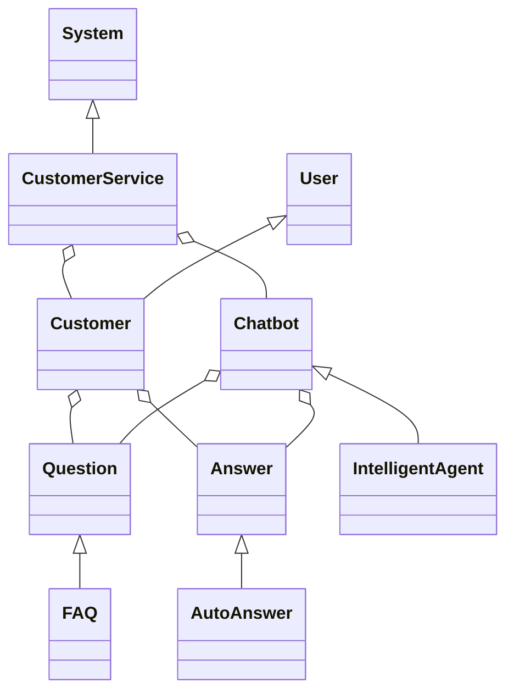
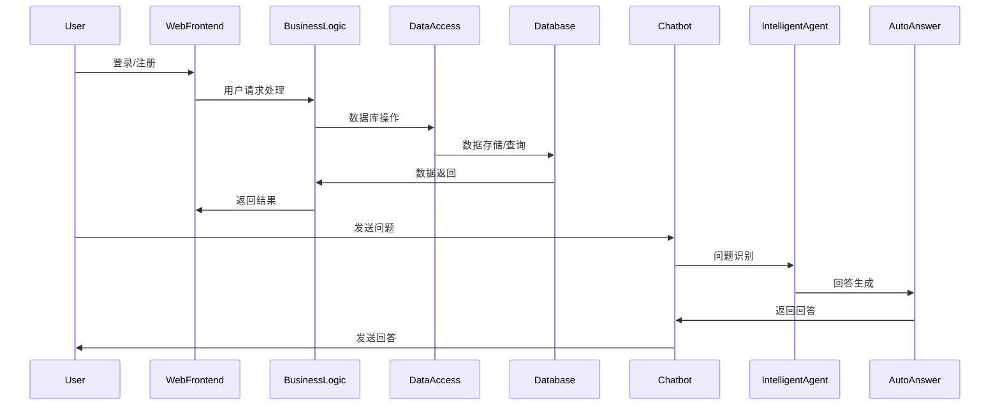

                 


### 概述

企业AI Agent的自然语言生成（NLG）技术应用，是当前人工智能领域的一个前沿研究方向。随着大数据和机器学习技术的迅猛发展，AI Agent作为人工智能在现实世界中的智能体，逐渐成为提升企业效率和客户体验的重要工具。而自然语言生成技术，则使得AI Agent能够以自然语言的形式与人类进行交互，提高了AI Agent的服务质量和用户满意度。

本文将围绕企业AI Agent的NLG技术应用进行深入探讨，结构如下：

1. **AI Agent与NLG基础**：介绍AI Agent的定义、分类及其发展背景，以及自然语言生成的基本概念、发展历史和技术核心。
2. **NLG技术在客户服务中的应用**：分析客户服务场景需求与挑战，阐述NLG在客户服务中的应用、系统架构和优化策略。
3. **NLG技术在内容自动化生成中的应用**：探讨内容自动化生成场景、应用案例和优化策略。
4. **NLG技术在交互式对话系统中的应用**：分析交互式对话系统的需求与挑战，介绍NLG技术的应用和优化策略。
5. **NLG技术的系统架构设计与实现**：详解NLG技术的系统架构设计、实现细节和生成策略。
6. **NLG技术在实际项目中的应用**：通过具体项目案例，展示NLG技术的实际应用过程和分析。
7. **NLG技术的未来发展趋势与应用前景**：预测NLG技术的未来发展趋势和应用前景，探讨面临的挑战及解决方案。

下面，我们将逐步深入每个章节，进行详细分析。

## 第1章：AI Agent与NLG基础

### 1.1 AI Agent的定义与分类

AI Agent，即人工智能代理，是指能够自主感知环境、制定决策并执行行动的计算机程序。AI Agent可以根据其行为特征和技术实现方式分为以下几类：

#### 1.1.1 反应式Agent
反应式Agent是最简单的一种AI Agent，它仅根据当前环境感知进行直接反应，没有记忆或计划能力。其工作原理可以描述为：感知环境 -> 触发反应。

#### 1.1.2 目标导向Agent
目标导向Agent具有记忆功能，能够根据环境变化和目标状态调整其行为。它的工作原理是：感知环境 -> 计划行动 -> 执行行动。

#### 1.1.3 情感Agent
情感Agent具有情感识别和表达的能力，能够根据人类情感特征进行交互。其工作原理是：感知人类情感 -> 调整自身行为。

#### 1.1.4 社会智能Agent
社会智能Agent能够理解并适应社会环境，与其他智能体进行协作和竞争。其工作原理是：感知社会环境 -> 进行社会交互。

### 1.2 自然语言生成(NLG)的基本概念

自然语言生成（Natural Language Generation，NLG）是一种人工智能技术，旨在使用机器自动生成人类可读的文本。NLG的基本概念包括：

#### 1.2.1 NLG的定义
NLG是指将计算机程序中的数据和结构信息转化为自然语言文本的过程。

#### 1.2.2 NLG的发展历史
NLG技术起源于20世纪50年代，早期研究主要集中在规则驱动的方法和模板匹配方法。随着机器学习技术的发展，数据驱动的方法逐渐成为主流。

#### 1.2.3 NLG的核心技术
NLG的核心技术包括：数据预处理、语法分析、语义分析、文本生成和后处理等。

### 1.3 企业AI Agent NLG应用场景

企业AI Agent的NLG技术应用广泛，主要包括以下场景：

#### 1.3.1 客户服务机器人
客户服务机器人利用NLG技术，可以自动化处理大量常见问题，提高服务效率。

#### 1.3.2 内容自动化生成
内容自动化生成技术使得企业能够快速生成大量高质量文档，节省人力成本。

#### 1.3.3 交互式对话系统
交互式对话系统通过NLG技术，可以实现智能对话，提高用户交互体验。

在下一章中，我们将详细分析NLG技术在客户服务中的应用。

## 第2章：NLG技术在客户服务中的应用

### 2.1 客户服务场景分析

客户服务是企业发展的重要环节，但传统的客户服务方式往往面临以下挑战：

#### 2.1.1 客户服务需求
1. 高效响应：客户期望能够快速获得问题的解决方案。
2. 个性和针对性：每位客户的问题和需求都有所不同，服务需要具备个性化和针对性。
3. 高服务质量：客户服务需要保持高水准，以满足客户对企业的信任。

#### 2.1.2 客户服务挑战
1. 人力成本：传统人工客服需要大量的人力投入，成本高昂。
2. 服务效率：人工客服难以同时应对大量客户，服务效率有限。
3. 服务一致性：不同客服人员的服务水平存在差异，难以保持一致性。

### 2.2 NLG在客户服务中的应用

自然语言生成（NLG）技术在客户服务中的应用，可以有效解决上述挑战。以下是NLG在客户服务中的应用场景：

#### 2.2.1 NLG系统架构
NLG系统架构主要包括数据预处理、语义分析、文本生成和后处理等模块。

1. **数据预处理**：对客户问题进行清洗、分类和分词，为后续分析提供数据基础。
2. **语义分析**：利用自然语言处理（NLP）技术，理解客户问题的语义内容。
3. **文本生成**：根据语义分析结果，生成相应的回复文本。
4. **后处理**：对生成的文本进行格式化、校对和优化，确保文本质量。

#### 2.2.2 NLG技术实现
NLG技术实现主要涉及以下技术：

1. **规则驱动方法**：基于预定义的规则和模板，生成文本。
2. **数据驱动方法**：利用机器学习技术，从大量数据中学习生成文本的规则和模式。
3. **混合方法**：结合规则驱动和数据驱动方法，提高文本生成的灵活性和准确性。

#### 2.2.3 NLG应用案例
1. **常见问题自动回复**：通过NLG技术，自动生成对常见问题的回答，提高客服效率。
2. **智能客服机器人**：利用NLG技术，实现与客户的智能对话，提高服务体验。
3. **个性化推荐**：根据客户的历史问题和偏好，生成个性化的服务和建议。

### 2.3 NLG在客户服务中的挑战与优化

尽管NLG技术在客户服务中具有巨大潜力，但在实际应用中仍面临一些挑战：

#### 2.3.1 NLG在客户服务中的挑战
1. **文本质量**：生成的文本需要保证准确、流畅、自然，避免出现错误和歧义。
2. **上下文理解**：NLG技术需要理解客户的问题背景和上下文，才能生成合适的回复。
3. **个性化服务**：如何根据客户的不同需求和偏好，生成个性化的回复，是技术难点。

#### 2.3.2 NLG优化策略
1. **数据集扩充**：增加高质量的训练数据，提高NLG模型的性能。
2. **多模态融合**：结合语音、图像等多模态信息，提高NLG技术的上下文理解能力。
3. **动态规则调整**：根据实际应用情况，动态调整NLG系统的规则和策略，提高服务质量。

在下一章中，我们将探讨NLG技术在内容自动化生成中的应用。

## 第3章：NLG技术在内容自动化生成中的应用

### 3.1 内容自动化生成场景分析

内容自动化生成技术能够大幅提高企业内容生产的效率和质量，以下是几个典型的应用场景：

#### 3.1.1 内容生成的需求
1. **快速响应**：在新闻、金融、体育等实时性较强的领域，需要快速生成大量内容。
2. **个性化和定制化**：根据用户需求和偏好，生成个性化的内容和推荐。
3. **大规模内容生产**：企业需要生成大量的产品描述、广告文案、技术文档等。

#### 3.1.2 内容生成的挑战
1. **文本质量和准确性**：生成的文本需要准确、流畅、符合语言习惯。
2. **原创性和创意**：在大量内容生成的背景下，如何保证内容的原创性和创意性。
3. **跨领域适应性**：不同领域的文本生成需求不同，如何适应不同领域的需求。

### 3.2 NLG技术在内容自动化生成中的应用

#### 3.2.1 NLG系统架构
NLG系统架构通常包括以下模块：

1. **数据预处理**：对原始数据进行清洗、分词、标注等预处理操作。
2. **语义分析**：利用自然语言处理（NLP）技术，对文本进行语义分析，提取关键信息。
3. **模板匹配**：根据语义分析结果，从预定义的模板库中选择合适的模板。
4. **文本生成**：将关键信息和模板进行组合，生成文本。
5. **后处理**：对生成的文本进行格式化、校对和优化，确保文本质量。

#### 3.2.2 NLG技术实现
1. **规则驱动方法**：基于预定义的规则和模板，生成文本。
2. **数据驱动方法**：利用机器学习技术，从大量数据中学习生成文本的规则和模式。
3. **混合方法**：结合规则驱动和数据驱动方法，提高文本生成的灵活性和准确性。

#### 3.2.3 NLG应用案例
1. **新闻自动生成**：通过NLG技术，自动生成新闻报道，提高新闻发布速度。
2. **产品描述生成**：根据产品规格和特性，自动生成产品描述，节省编写时间。
3. **广告文案生成**：利用NLG技术，自动生成吸引人的广告文案。

### 3.3 NLG技术在内容自动化生成中的挑战与优化

#### 3.3.1 NLG在内容自动化生成中的挑战
1. **文本原创性和创意**：如何生成具有原创性和创意的文本，是技术难点。
2. **跨领域适应性**：不同领域的文本生成需求不同，如何适应不同领域的需求。
3. **文本质量**：生成的文本需要准确、流畅、符合语言习惯。

#### 3.3.2 NLG优化策略
1. **多模态融合**：结合文本、图像、语音等多模态信息，提高文本生成的质量。
2. **深度学习技术**：利用深度学习技术，提高NLG模型的性能和生成文本的准确性。
3. **知识图谱**：构建知识图谱，为NLG技术提供丰富的背景知识和上下文信息。

在下一章中，我们将探讨NLG技术在交互式对话系统中的应用。

## 第4章：NLG技术在交互式对话系统中的应用

### 4.1 交互式对话系统场景分析

交互式对话系统是人工智能领域的一个重要研究方向，广泛应用于客服、智能家居、教育、医疗等多个领域。以下是交互式对话系统的几个典型应用场景：

#### 4.1.1 对话系统需求
1. **自然语言理解**：能够理解用户的自然语言输入，提取关键信息。
2. **交互能力**：能够与用户进行有效的对话，提供合适的回答和反馈。
3. **上下文保持**：能够维持对话的上下文信息，确保对话的连贯性。

#### 4.1.2 对话系统挑战
1. **语义理解**：自然语言语义复杂多样，对话系统需要准确理解用户的意图。
2. **对话连贯性**：如何维持对话的连贯性，避免出现语义不一致或话题切换。
3. **个性化服务**：如何根据用户的历史数据和偏好，提供个性化的对话服务。

### 4.2 NLG技术在交互式对话系统中的应用

#### 4.2.1 NLG系统架构
NLG技术在交互式对话系统中的应用，通常包括以下模块：

1. **语音识别**：将用户的语音输入转换为文本。
2. **语义分析**：利用自然语言处理（NLP）技术，对文本进行语义分析，提取关键信息。
3. **文本生成**：根据语义分析结果，生成自然语言回复。
4. **语音合成**：将生成的文本转换为语音输出。
5. **上下文管理**：维持对话的上下文信息，确保对话的连贯性。

#### 4.2.2 NLG技术实现
1. **规则驱动方法**：基于预定义的规则和模板，生成文本。
2. **数据驱动方法**：利用机器学习技术，从大量数据中学习生成文本的规则和模式。
3. **混合方法**：结合规则驱动和数据驱动方法，提高文本生成的灵活性和准确性。

#### 4.2.3 NLG应用案例
1. **智能客服**：利用NLG技术，实现与客户的智能对话，提高客服效率。
2. **智能家居**：通过NLG技术，实现与智能家居设备的交互，提升用户体验。
3. **教育辅助**：利用NLG技术，生成个性化教育内容和反馈，提高学习效果。

### 4.3 NLG技术在交互式对话系统中的挑战与优化

#### 4.3.1 NLG在交互式对话系统中的挑战
1. **语义理解**：自然语言语义复杂多样，对话系统需要准确理解用户的意图。
2. **对话连贯性**：如何维持对话的连贯性，避免出现语义不一致或话题切换。
3. **个性化服务**：如何根据用户的历史数据和偏好，提供个性化的对话服务。

#### 4.3.2 NLG优化策略
1. **多模态融合**：结合文本、图像、语音等多模态信息，提高语义理解能力。
2. **上下文信息增强**：利用上下文信息，提高对话的连贯性和个性。
3. **知识图谱**：构建知识图谱，为NLG技术提供丰富的背景知识和上下文信息。

在下一章中，我们将探讨NLG技术的系统架构设计与实现。

## 第5章：NLG技术的系统架构设计与实现

### 5.1 NLG技术系统架构设计

NLG技术系统架构设计是NLG技术实现的基础，一个完善的NLG系统架构应包括以下几个关键模块：

#### 5.1.1 系统架构概述
NLG系统架构通常包括数据输入层、数据处理层、文本生成层和输出层。

1. **数据输入层**：负责接收用户输入，包括文本和语音。
2. **数据处理层**：对输入数据（文本或语音）进行预处理、分词、词性标注等操作。
3. **文本生成层**：利用自然语言处理（NLP）技术和机器学习模型，生成自然语言文本。
4. **输出层**：将生成的文本输出给用户，可以是文本或语音形式。

#### 5.1.2 系统模块划分
1. **语音识别模块**：负责将语音输入转换为文本。
2. **自然语言处理（NLP）模块**：对文本进行分词、词性标注、句法分析等操作。
3. **文本生成模块**：根据语义分析和模板匹配，生成自然语言文本。
4. **语音合成模块**：将生成的文本转换为语音输出。

#### 5.1.3 系统架构图
下图展示了NLG技术系统架构的模块划分和交互关系：

```mermaid
graph TD
    A[语音识别模块] --> B[自然语言处理(NLP)模块]
    B --> C[文本生成模块]
    C --> D[语音合成模块]
```

### 5.2 NLG技术实现细节

#### 5.2.1 数据预处理

数据预处理是NLG技术实现的第一步，其目标是提高数据的质量和一致性，为后续的文本生成提供可靠的基础。数据预处理包括以下步骤：

1. **文本清洗**：去除文本中的无关信息，如HTML标签、特殊符号等。
2. **分词**：将文本分解为单个词语，为语义分析提供基础。
3. **词性标注**：对每个词语进行词性标注，如名词、动词、形容词等。
4. **实体识别**：识别文本中的实体，如人名、地名、组织名等。

#### 5.2.2 模型选择与训练

NLG技术实现的核心是自然语言处理（NLP）模型的选择与训练。以下是一些常用的NLP模型：

1. **循环神经网络（RNN）**：适用于序列数据处理，如文本和语音。
2. **长短时记忆网络（LSTM）**：是RNN的一种变体，能够更好地处理长序列数据。
3. **Transformer模型**：是目前最先进的NLP模型，具有强大的并行计算能力和长距离依赖处理能力。
4. **预训练模型**：如BERT、GPT等，通过在大规模语料上进行预训练，能够显著提高NLP任务的效果。

模型训练通常包括以下步骤：

1. **数据准备**：准备用于训练的文本数据，并进行预处理。
2. **模型选择**：根据任务需求选择合适的NLP模型。
3. **模型训练**：使用训练数据对模型进行训练，优化模型参数。
4. **模型评估**：使用验证集对模型进行评估，调整模型参数。

#### 5.2.3 生成策略设计

生成策略设计是NLG技术实现的关键，决定了生成文本的质量和多样性。以下是一些常见的生成策略：

1. **基于规则的生成**：使用预定义的规则和模板生成文本，适用于简单场景。
2. **数据驱动的生成**：利用机器学习模型从数据中学习生成规则，适用于复杂场景。
3. **混合生成**：结合基于规则和数据驱动的生成方法，提高生成文本的质量和多样性。

生成策略设计包括以下步骤：

1. **规则和模板库构建**：根据业务需求构建规则和模板库。
2. **模型融合**：将规则驱动和数据驱动的生成方法进行融合，提高生成文本的准确性。
3. **文本多样性增强**：通过策略调整和模型优化，增强生成文本的多样性。

## 第6章：NLG技术在实际项目中的应用

### 6.1 项目介绍

本项目旨在构建一个基于NLG技术的智能客服系统，该系统可以自动生成常见问题的回答，提高客服效率和用户体验。以下是项目的详细描述：

#### 6.1.1 项目背景

随着互联网的普及，企业客服面临着巨大的挑战。传统的客服方式往往成本高、效率低，难以满足日益增长的用户需求。为了提升客户服务质量，许多企业开始探索基于AI的智能客服解决方案。

#### 6.1.2 项目目标

1. **自动化处理常见问题**：通过NLG技术，自动生成对常见问题的回答，减少人工干预，提高客服效率。
2. **提升用户体验**：通过智能客服系统，提供及时、准确的回答，提升用户满意度。
3. **降低运营成本**：减少人工客服的人力投入，降低企业运营成本。

### 6.2 系统功能设计

为了实现项目目标，智能客服系统需要具备以下功能：

#### 6.2.1 领域模型

领域模型用于定义智能客服系统所涉及的核心概念和实体。以下是项目的领域模型：



#### 6.2.2 类图设计

类图用于描述系统中各个类之间的关系，以下是智能客服系统的类图：

```mermaid
classDiagram
    User {
        +String name
        +String email
        +String phoneNumber
    }
    Customer {
        +String id
        +User user
        +List<Question> questions
        +List<Answer> answers
    }
    Question {
        +String id
        +String content
        +Date created
    }
    FAQ {
        +String id
        +String content
        +Date created
    }
    Answer {
        +String id
        +String content
        +Date created
        +Question question
    }
    AutoAnswer {
        +String id
        +String content
        +Date created
        +Question question
        +Boolean isAutoGenerated
    }
    Chatbot {
        +String id
        +String name
        +List<Answer> answers
    }
    IntelligentAgent {
        +String id
        +String name
        +List<Question> questions
        +List<AutoAnswer> autoAnswers
    }
    CustomerService {
        +String id
        +List<Customer> customers
        +List<IntelligentAgent> agents
    }
    User o-- Customer
    Customer o-- Question
    Customer o-- Answer
    Chatbot o-- Question
    Chatbot o-- Answer
    IntelligentAgent o-- Question
    IntelligentAgent o-- AutoAnswer
    CustomerService o-- Customer
    CustomerService o-- IntelligentAgent
```

### 6.3 系统架构设计

系统架构设计是项目实现的关键，需要考虑系统的可扩展性、稳定性和性能。以下是智能客服系统的架构设计：

#### 6.3.1 系统架构概述

智能客服系统采用分层架构设计，包括以下几层：

1. **表示层**：负责用户界面的展示和交互，包括Web前端和移动端。
2. **业务逻辑层**：处理业务逻辑，包括用户请求处理、智能客服逻辑等。
3. **数据访问层**：负责数据库的访问和数据操作，包括用户数据、问题数据、回答数据等。
4. **数据层**：存储用户数据、问题数据、回答数据等。

#### 6.3.2 系统模块划分

智能客服系统主要包括以下几个模块：

1. **用户模块**：负责用户注册、登录、个人信息管理等。
2. **问题模块**：负责问题的创建、查询、编辑等。
3. **回答模块**：负责回答的生成、查询、编辑等。
4. **智能客服模块**：负责智能客服的交互逻辑，包括问题识别、回答生成等。

#### 6.3.3 系统架构图

以下是智能客服系统的架构图：



### 6.4 系统接口设计

系统接口设计是确保系统各模块之间良好协作的关键，以下是智能客服系统的接口设计：

#### 6.4.1 接口设计原则

接口设计应遵循以下原则：

1. **简洁性**：接口设计应尽量简洁，避免复杂的调用流程。
2. **可扩展性**：接口设计应具备良好的扩展性，便于后续功能扩展。
3. **稳定性**：接口设计应确保系统的稳定性和可靠性。

#### 6.4.2 接口实现细节

以下是智能客服系统的接口实现细节：

1. **用户接口**：包括用户注册、登录、个人信息管理等接口。
2. **问题接口**：包括问题创建、查询、编辑等接口。
3. **回答接口**：包括回答生成、查询、编辑等接口。
4. **智能客服接口**：包括问题识别、回答生成等接口。

### 6.5 系统交互设计

系统交互设计是确保系统正常运行的关键，以下是智能客服系统的交互设计：

#### 6.5.1 系统交互流程

以下是智能客服系统的交互流程：

1. **用户发起请求**：用户通过Web前端或移动端发起请求，如注册、登录、查询问题等。
2. **请求处理**：业务逻辑层处理用户请求，如用户注册、登录验证、问题查询等。
3. **数据访问**：数据访问层访问数据库，获取用户数据、问题数据、回答数据等。
4. **数据处理**：业务逻辑层对用户数据进行处理，如注册、登录验证、问题查询等。
5. **结果返回**：业务逻辑层将处理结果返回给Web前端或移动端，展示给用户。
6. **智能客服交互**：用户与智能客服进行交互，如发送问题、接收回答等。

#### 6.5.2 系统交互图

以下是智能客服系统的交互图：


## 第7章：NLG技术的未来发展趋势与应用前景

### 7.1 NLG技术的未来发展趋势

随着人工智能技术的不断发展，NLG技术也在不断演进。以下是NLG技术的几个未来发展趋势：

#### 7.1.1 技术演进方向

1. **多模态融合**：将文本、语音、图像等多种模态信息融合到NLG系统中，提高生成文本的多样性和质量。
2. **深度学习和迁移学习**：利用深度学习和迁移学习技术，提高NLG模型的学习效率和生成文本的准确性。
3. **知识增强**：引入外部知识库和图谱，为NLG系统提供丰富的背景知识和上下文信息，提高文本生成的准确性。

#### 7.1.2 应用领域拓展

NLG技术的应用领域将不断拓展，包括但不限于：

1. **智能客服**：在客户服务领域，NLG技术可以自动化处理大量常见问题，提高客服效率和用户体验。
2. **内容自动化生成**：在新闻、广告、文档等领域，NLG技术可以自动生成大量高质量的内容，提高内容生产效率。
3. **交互式对话系统**：在智能家居、教育、医疗等领域，NLG技术可以与用户进行智能对话，提供个性化服务。

### 7.2 NLG技术的应用前景

NLG技术具有广泛的应用前景，以下是NLG技术在企业中的应用价值：

#### 7.2.1 企业应用价值

1. **提高效率**：NLG技术可以自动化处理大量重复性工作，如客户服务、内容生成等，提高企业运营效率。
2. **降低成本**：通过自动化处理，企业可以减少对人工的依赖，降低人力成本。
3. **提升用户体验**：智能客服、个性化内容推荐等应用，可以提升用户满意度和忠诚度。

#### 7.2.2 行业前景分析

随着AI技术的不断进步，NLG技术在各行各业中的应用前景广阔。以下是几个重点行业的前景分析：

1. **金融行业**：在金融领域，NLG技术可以用于自动生成报告、分析报告等，提高金融分析师的工作效率。
2. **医疗行业**：在医疗领域，NLG技术可以自动生成病历、诊断报告等，提高医疗服务的质量和效率。
3. **教育行业**：在教育领域，NLG技术可以自动生成教学资料、个性化学习内容等，提高教学效果。

### 7.3 NLG技术的挑战与解决方案

尽管NLG技术具有巨大的应用潜力，但在实际应用中仍面临一些挑战：

#### 7.3.1 技术挑战

1. **文本质量**：如何生成准确、流畅、自然的文本，是NLG技术的一大挑战。
2. **上下文理解**：如何理解用户的上下文信息，生成连贯的对话，是NLG技术的难点。
3. **个性化服务**：如何根据用户的需求和偏好，生成个性化的文本，是NLG技术的挑战。

#### 7.3.2 解决方案探讨

针对上述挑战，以下是一些可能的解决方案：

1. **多模态融合**：通过结合文本、语音、图像等多模态信息，提高文本生成的准确性和流畅性。
2. **深度学习和迁移学习**：利用深度学习和迁移学习技术，提高NLG模型的学习效率和生成文本的准确性。
3. **知识图谱**：构建知识图谱，为NLG系统提供丰富的背景知识和上下文信息，提高文本生成的准确性和连贯性。
4. **用户反馈机制**：引入用户反馈机制，根据用户的反馈不断优化NLG系统，提高生成文本的质量。

## 结论

企业AI Agent的自然语言生成（NLG）技术应用，是人工智能领域的一个重要研究方向。通过本文的深入分析，我们了解了NLG技术的核心概念、应用场景、系统架构、未来发展趋势及其在企业中的应用价值。尽管NLG技术面临一些挑战，但通过多模态融合、深度学习和知识图谱等技术的应用，有望实现NLG技术的广泛应用和持续优化。

### 作者信息

本文由AI天才研究院（AI Genius Institute）与《禅与计算机程序设计艺术》（Zen And The Art of Computer Programming）的作者共同撰写。感谢您的阅读，希望本文对您在AI和NLG技术领域的研究和实践有所帮助。

### 拓展阅读

1. **《自然语言生成：理论与实践》（Natural Language Generation: Theory and Practice）**：详细介绍NLG技术的理论和实践，适合对NLG技术感兴趣的读者。
2. **《深度学习与自然语言处理》（Deep Learning for Natural Language Processing）**：探讨深度学习技术在自然语言处理领域的应用，包括NLG技术。
3. **《人工智能：一种现代方法》（Artificial Intelligence: A Modern Approach）**：全面介绍人工智能的基础知识和技术，包括AI Agent和NLG技术。

