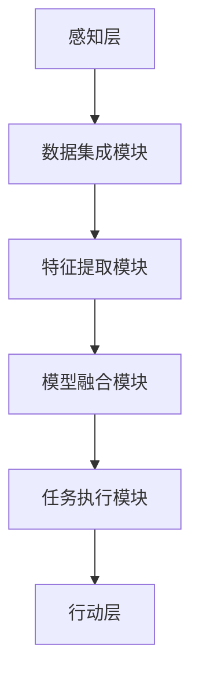
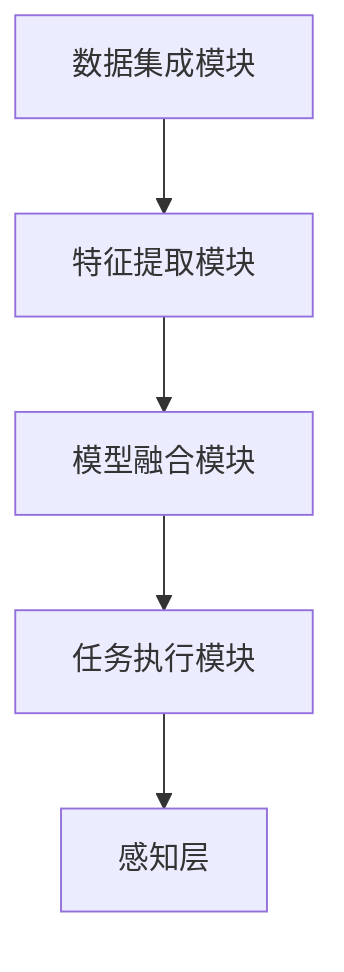

                 

### 文章标题

# 企业AI Agent的跨模态学习：整合视觉、文本与语音数据

> 关键词：企业AI Agent、跨模态学习、视觉、文本、语音、数据集成、特征提取、模型融合

> 摘要：本文详细探讨了企业AI Agent的跨模态学习，即如何整合视觉、文本与语音数据以提升AI Agent的智能性和应用场景。首先介绍了企业AI Agent的发展现状与需求，然后阐述了跨模态学习的定义、关键技术和应用场景。接着，本文深入讲解了跨模态学习算法原理和企业AI Agent的算法原理，并通过具体的数学模型和公式进行了详细阐述。最后，本文提出了企业AI Agent跨模态学习在实际项目中的系统架构设计方案和实战案例，为读者提供了实用的参考。

## 第一部分：背景介绍

### 1. 引言

#### 1.1 问题背景

随着人工智能技术的不断发展，企业AI Agent的应用越来越广泛。企业AI Agent是指能够自主执行任务、提供决策支持的人工智能系统，它在多个领域展现出巨大的潜力，如客户服务、数据分析和供应链管理等。然而，企业AI Agent在发展过程中遇到了一个重要的问题：如何有效地整合和利用多种模态的数据，如视觉、文本和语音数据。

视觉数据能够提供丰富的场景信息和细节，文本数据能够提供精确的结构化和非结构化信息，而语音数据则能够提供自然的人类交流方式。如何将这三种数据有效地整合起来，以提升企业AI Agent的智能性和应用场景，成为当前研究的一个重要方向。

#### 1.2 问题描述

跨模态学习是指将来自不同模态的数据（如视觉、文本和语音数据）进行有效整合和利用，从而提高人工智能系统的智能性和应用范围。在企业AI Agent中，跨模态学习具有以下挑战：

1. **数据集成**：如何将来自不同模态的数据进行有效的整合，以便后续的特征提取和模型训练。
2. **特征提取**：如何从不同模态的数据中提取出具有区分性和代表性的特征，以供模型学习。
3. **模型融合**：如何将来自不同模态的特征进行融合，以构建一个统一的模型。

#### 1.3 问题解决

为了解决上述问题，跨模态学习采用了以下几种关键技术：

1. **数据集成技术**：包括数据预处理、数据融合方法等，用于将不同模态的数据进行整合。
2. **特征提取技术**：包括深度学习特征提取方法和传统特征提取方法，用于从不同模态的数据中提取出具有区分性和代表性的特征。
3. **模型融合技术**：包括多任务学习和多模型融合方法，用于将不同模态的特征进行融合，构建一个统一的模型。

#### 1.4 边界与外延

跨模态学习不仅在企业AI Agent中有着广泛的应用，还可以与其他领域进行交叉应用。例如，在医疗领域，跨模态学习可以整合病人的视觉影像、文本病历和语音病史，以提供更准确的诊断和治疗方案。在自动驾驶领域，跨模态学习可以整合车载传感器采集的视觉、文本和语音数据，以提高自动驾驶系统的安全性和可靠性。

跨模态学习的未来发展趋势包括：更高效的算法和模型、更广泛的应用场景、更深入的理论研究等。随着人工智能技术的不断发展，跨模态学习将在各个领域发挥越来越重要的作用。

#### 1.5 概念结构与核心要素组成

##### 1.5.1 跨模态学习

- **数据集成**：数据预处理、数据融合方法等。
- **特征提取**：深度学习特征提取方法、传统特征提取方法等。
- **模型融合**：多任务学习、多模型融合方法等。

##### 1.5.2 企业AI Agent

- **功能特点**：自主性、智能性、灵活性等。
- **应用场景**：客户服务、数据分析、供应链管理等领域。
- **技术架构**：基于深度学习和自然语言处理等技术。

#### 1.6 本章小结

本节介绍了企业AI Agent的跨模态学习，包括问题背景、问题描述、问题解决、边界与外延、概念结构与核心要素组成等内容。通过本节的介绍，读者可以初步了解跨模态学习的概念和在企业AI Agent中的应用。

## 第二部分：核心概念与联系

### 2.1 跨模态学习原理

#### 2.1.1 跨模态学习的定义与分类

跨模态学习是指将来自不同模态的数据进行有效整合和利用，以提升人工智能系统的智能性和应用范围。根据数据来源的不同，跨模态学习可以分为以下两类：

1. **数据驱动的跨模态学习**：这种学习方式主要依赖于大规模的跨模态数据集，通过学习数据之间的关系来实现跨模态学习。数据驱动的跨模态学习具有以下几个特点：
   - **数据依赖性强**：需要大量的跨模态数据进行训练。
   - **模型可解释性较弱**：由于模型主要是基于数据之间的关系进行学习，因此模型的可解释性相对较弱。

2. **知识驱动的跨模态学习**：这种学习方式主要依赖于先验知识，通过将先验知识与数据相结合来实现跨模态学习。知识驱动的跨模态学习具有以下几个特点：
   - **知识依赖性强**：需要丰富的先验知识来指导学习过程。
   - **模型可解释性较强**：由于模型是基于先验知识进行学习的，因此模型的可解释性相对较强。

#### 2.1.2 跨模态学习的关键技术

跨模态学习的关键技术包括数据集成技术、特征提取技术和模型融合技术。

1. **数据集成技术**：数据集成技术主要包括数据预处理和数据融合方法。数据预处理是指对原始数据进行清洗、归一化等处理，以消除不同模态数据之间的不一致性。数据融合方法是指将来自不同模态的数据进行整合，以形成一个统一的特征表示。

2. **特征提取技术**：特征提取技术是指从不同模态的数据中提取出具有区分性和代表性的特征。深度学习特征提取方法是指通过构建深度神经网络，从原始数据中自动提取特征。传统特征提取方法是指通过手工设计特征，如文本的词袋模型、图像的边缘检测等。

3. **模型融合技术**：模型融合技术是指将来自不同模态的特征进行融合，以构建一个统一的模型。多任务学习是指同时训练多个任务，以共享特征表示。多模型融合方法是指将多个独立的模型进行融合，以提升模型的性能。

### 2.2 企业 AI Agent 的核心概念

#### 2.2.1 企业 AI Agent 的定义与特点

企业 AI Agent 是一种智能体，它能够在企业环境中自主执行任务、提供决策支持。企业 AI Agent 具有以下特点：

1. **自主性**：企业 AI Agent 具有自主性，可以自主地执行任务，无需人工干预。
2. **智能性**：企业 AI Agent 具有智能性，能够通过学习和推理来提高任务执行的效果。
3. **灵活性**：企业 AI Agent 具有灵活性，可以适应不同的任务和环境，具有广泛的应用场景。

#### 2.2.2 企业 AI Agent 的分类与应用场景

企业 AI Agent 可以根据所处理的数据类型进行分类，主要包括以下几类：

1. **视觉 AI Agent**：视觉 AI Agent 主要处理视觉数据，如图像和视频。应用场景包括图像识别、目标检测、视频分析等。
2. **文本 AI Agent**：文本 AI Agent 主要处理文本数据，如自然语言文本。应用场景包括文本分类、情感分析、问答系统等。
3. **语音 AI Agent**：语音 AI Agent 主要处理语音数据，如语音识别和语音生成。应用场景包括语音助手、语音翻译、语音识别等。

#### 2.2.3 企业 AI Agent 的技术架构

企业 AI Agent 的技术架构主要包括以下几个方面：

1. **感知层**：感知层主要负责接收和处理来自不同模态的数据，如视觉、文本和语音数据。
2. **认知层**：认知层主要负责对感知层获取的数据进行理解和分析，以提取有用的信息。
3. **行动层**：行动层负责根据认知层的结果，执行相应的任务或提供决策支持。

### 2.3 跨模态学习与企业 AI Agent 的联系

#### 2.3.1 跨模态学习在企业 AI Agent 中的应用

跨模态学习在企业 AI Agent 中的应用主要体现在以下几个方面：

1. **数据集成与融合**：跨模态学习可以将来自不同模态的数据进行有效集成和融合，为企业 AI Agent 提供更丰富的数据支持。
2. **特征提取与模型融合**：跨模态学习可以从不同模态的数据中提取出具有区分性和代表性的特征，并融合这些特征，以提高企业 AI Agent 的智能性和应用效果。

#### 2.3.2 跨模态学习对企业 AI Agent 的影响

跨模态学习对企业 AI Agent 的影响主要表现在以下几个方面：

1. **提升智能性**：跨模态学习可以为企业 AI Agent 提供更丰富的数据支持，从而提升其智能性和决策能力。
2. **扩展应用场景**：跨模态学习可以为企业 AI Agent 拓展新的应用场景，如基于跨模态数据的智能客服、智能诊断等。

#### 2.3.3 跨模态学习与企业 AI Agent 的关系

跨模态学习与企业 AI Agent 之间的关系可以概括为以下两个方面：

1. **跨模态学习是企业 AI Agent 的重要技术手段**：跨模态学习可以帮助企业 AI Agent 更有效地整合和利用多种模态的数据，从而提升其智能性和应用效果。
2. **企业 AI Agent 是跨模态学习的重要应用场景**：企业 AI Agent 的应用场景为跨模态学习提供了实际的应用场景和需求，推动了跨模态学习的发展。

### 2.4 本章小结

本节介绍了跨模态学习的原理、企业 AI Agent 的核心概念以及跨模态学习与企业 AI Agent 的联系。通过本节的介绍，读者可以了解跨模态学习的基本原理和在企业 AI Agent 中的应用价值。

## 第三部分：算法原理讲解

### 3.1 跨模态学习算法原理

#### 3.1.1 数据集成算法

数据集成是跨模态学习的重要步骤，其目的是将来自不同模态的数据进行整合，形成一个统一的数据表示。数据集成算法主要包括数据预处理和数据融合方法。

1. **数据预处理**：数据预处理主要包括数据清洗、数据归一化、数据转换等操作，目的是消除不同模态数据之间的不一致性，提高数据的质量。

   - **数据清洗**：去除噪声数据、填充缺失值、去除重复数据等。
   - **数据归一化**：将不同模态的数据进行归一化处理，使其具有相似的尺度，便于后续的特征提取和模型训练。
   - **数据转换**：将不同模态的数据转换为同一类型的数据，如将图像数据转换为文本数据。

2. **数据融合方法**：数据融合方法是指将来自不同模态的数据进行融合，形成一个统一的数据表示。常见的数据融合方法包括：

   - **特征拼接**：将不同模态的数据特征进行拼接，形成一个多维特征向量。
   - **深度神经网络**：通过构建深度神经网络，将不同模态的数据进行融合，自动提取特征。
   - **注意力机制**：通过注意力机制，对来自不同模态的数据进行加权融合，提高融合效果。

#### 3.1.2 特征提取算法

特征提取是从原始数据中提取出具有区分性和代表性的特征，以便后续的模型训练和预测。特征提取算法可以分为深度学习特征提取方法和传统特征提取方法。

1. **深度学习特征提取方法**：深度学习特征提取方法是指通过构建深度神经网络，从原始数据中自动提取特征。常见的深度学习模型包括：

   - **卷积神经网络（CNN）**：适用于处理视觉数据，如图像和视频。
   - **循环神经网络（RNN）**：适用于处理序列数据，如文本和语音。
   - **变换器（Transformer）**：适用于处理大规模文本数据，具有很好的效果。

2. **传统特征提取方法**：传统特征提取方法是指通过手工设计特征，从原始数据中提取特征。常见的方法包括：

   - **词袋模型（Bag of Words）**：适用于文本数据，将文本转化为词袋表示。
   - **图像特征提取**：如 SIFT、HOG、ORB 等，适用于图像数据。
   - **语音特征提取**：如 MFCC、PLP 等，适用于语音数据。

#### 3.1.3 模型融合算法

模型融合是指将来自不同模态的特征进行融合，构建一个统一的模型。模型融合算法可以分为多任务学习和多模型融合方法。

1. **多任务学习**：多任务学习是指同时训练多个任务，共享特征表示。多任务学习可以提高模型的泛化能力，减少过拟合现象。常见的多任务学习方法包括：

   - **共享网络结构**：在深度神经网络中，共享部分网络结构，用于多个任务。
   - **注意力机制**：通过注意力机制，对不同任务的权重进行动态调整。

2. **多模型融合方法**：多模型融合方法是指将多个独立的模型进行融合，以提升模型的性能。常见的多模型融合方法包括：

   - **投票法**：将多个模型的预测结果进行投票，选取多数模型的一致结果。
   - **模型集成**：将多个模型进行加权融合，形成一个统一的预测结果。

### 3.2 企业 AI Agent 的算法原理

#### 3.2.1 视觉 AI Agent 算法

视觉 AI Agent 是基于视觉数据进行任务处理的，其核心算法包括卷积神经网络（CNN）和图像识别算法。

1. **卷积神经网络（CNN）**：CNN 是一种适用于处理视觉数据的深度学习模型，其主要优势在于能够自动提取图像中的特征。CNN 的基本结构包括卷积层、池化层和全连接层。

   - **卷积层**：通过卷积操作，从输入图像中提取局部特征。
   - **池化层**：对卷积层输出的特征进行降采样，减少参数数量。
   - **全连接层**：将池化层输出的特征进行融合，形成一个统一的特征表示。

2. **图像识别算法**：图像识别算法是指通过训练好的 CNN 模型，对输入图像进行分类。常见的图像识别算法包括：

   - **softmax 层**：对全连接层输出的特征进行分类，输出每个类别的概率。
   - **交叉熵损失函数**：用于计算模型预测结果与真实标签之间的差异，指导模型训练。

#### 3.2.2 文本 AI Agent 算法

文本 AI Agent 是基于文本数据进行任务处理的，其核心算法包括自然语言处理（NLP）和文本分类算法。

1. **自然语言处理（NLP）**：NLP 是一门研究如何让计算机理解和处理自然语言的技术。常见的 NLP 技术包括：

   - **词嵌入（Word Embedding）**：将文本数据转换为向量的表示，方便后续的模型处理。
   - **序列模型（Sequence Model）**：如 RNN、LSTM、Transformer 等，用于处理序列数据。

2. **文本分类算法**：文本分类算法是指通过训练好的 NLP 模型，对输入文本进行分类。常见的文本分类算法包括：

   - **朴素贝叶斯（Naive Bayes）**：基于贝叶斯理论，计算每个类别的概率，选取概率最大的类别。
   - **支持向量机（SVM）**：通过最大化分类间隔，找到一个最优的决策边界。
   - **深度学习模型**：如 CNN、RNN、Transformer 等，用于处理复杂的文本数据。

#### 3.2.3 语音 AI Agent 算法

语音 AI Agent 是基于语音数据进行任务处理的，其核心算法包括语音识别（ASR）和语音生成（TTS）。

1. **语音识别（ASR）**：语音识别是指将语音信号转换为文本数据。常见的语音识别算法包括：

   - **隐藏马尔可夫模型（HMM）**：通过状态转移概率和发射概率，对语音信号进行建模。
   - **深度神经网络（DNN）**：通过深度学习模型，自动提取语音特征，提高识别精度。

2. **语音生成（TTS）**：语音生成是指将文本数据转换为语音信号。常见的语音生成算法包括：

   - **循环神经网络（RNN）**：通过 RNN 模型，将文本数据转换为声学特征。
   - **变换器（Transformer）**：通过 Transformer 模型，实现端到端的语音生成。

### 3.3 跨模态学习在企业 AI Agent 中的应用

#### 3.3.1 跨模态数据集成

跨模态数据集成是指将来自不同模态的数据进行整合，形成一个统一的数据表示。跨模态数据集成的主要步骤包括：

1. **数据预处理**：对来自不同模态的数据进行预处理，如数据清洗、数据归一化等。
2. **数据融合**：通过特征拼接、深度神经网络等方法，将来自不同模态的数据进行融合，形成一个统一的数据表示。

#### 3.3.2 跨模态特征提取

跨模态特征提取是指从不同模态的数据中提取出具有区分性和代表性的特征。跨模态特征提取的主要步骤包括：

1. **视觉特征提取**：通过卷积神经网络（CNN）等深度学习模型，从视觉数据中提取特征。
2. **文本特征提取**：通过自然语言处理（NLP）等技术，从文本数据中提取特征。
3. **语音特征提取**：通过语音识别（ASR）等技术，从语音数据中提取特征。

#### 3.3.3 跨模态模型融合

跨模态模型融合是指将来自不同模态的特征进行融合，构建一个统一的模型。跨模态模型融合的主要步骤包括：

1. **多任务学习**：同时训练多个任务，共享特征表示。
2. **多模型融合**：将多个独立的模型进行融合，以提升模型的性能。

### 3.4 本章小结

本节详细介绍了跨模态学习算法原理和企业 AI Agent 的算法原理。通过本节的介绍，读者可以了解跨模态学习的基本原理、数据集成算法、特征提取算法和模型融合算法，以及企业 AI Agent 的算法原理。这些算法原理为实现企业 AI Agent 的跨模态学习提供了重要的技术支持。

## 第四部分：数学模型和数学公式

### 4.1 跨模态学习数学模型

#### 4.1.1 数据集成模型

数据集成模型的主要目的是将来自不同模态的数据进行整合，形成一个统一的数据表示。一个简单的数据集成模型可以表示为：

$$
X = f(W_1 \cdot X_1 + W_2 \cdot X_2 + ...)
$$

其中，$X_1, X_2, ...$ 分别代表来自不同模态的数据，$W_1, W_2, ...$ 是权重矩阵，$f$ 是激活函数，如 sigmoid 函数或 ReLU 函数。

#### 4.1.2 特征提取模型

特征提取模型的主要目的是从原始数据中提取出具有区分性和代表性的特征。一个简单的特征提取模型可以表示为：

$$
h = \sigma(W \cdot x + b)
$$

其中，$x$ 是输入数据，$W$ 是权重矩阵，$b$ 是偏置项，$\sigma$ 是激活函数，如 sigmoid 函数或 ReLU 函数。

#### 4.1.3 模型融合模型

模型融合模型的主要目的是将来自不同模态的特征进行融合，构建一个统一的模型。一个简单的模型融合模型可以表示为：

$$
y = \sum_{i=1}^{n} w_i \cdot h_i
$$

其中，$h_1, h_2, ..., h_n$ 分别代表来自不同模态的特征，$w_1, w_2, ..., w_n$ 是权重，$y$ 是最终的输出。

### 4.2 企业 AI Agent 数学模型

#### 4.2.1 视觉 AI Agent 模型

视觉 AI Agent 的模型通常基于卷积神经网络（CNN），一个简单的视觉 AI Agent 模型可以表示为：

$$
\text{激活函数} = \sigma(W \cdot \text{输入特征})
$$

其中，输入特征可以是图像或视频，$W$ 是权重矩阵，$\sigma$ 是激活函数，如 sigmoid 函数或 ReLU 函数。

#### 4.2.2 文本 AI Agent 模型

文本 AI Agent 的模型通常基于自然语言处理（NLP），一个简单的文本 AI Agent 模型可以表示为：

$$
\text{损失函数} = \text{交叉熵损失函数}
$$

其中，交叉熵损失函数用于衡量模型预测结果与真实标签之间的差异，是文本分类任务中常用的损失函数。

#### 4.2.3 语音 AI Agent 模型

语音 AI Agent 的模型通常基于语音识别（ASR）或语音生成（TTS），一个简单的语音 AI Agent 模型可以表示为：

$$
\text{损失函数} = \text{交叉熵损失函数}
$$

其中，交叉熵损失函数用于衡量模型预测结果与真实标签之间的差异，是语音识别或语音生成任务中常用的损失函数。

### 4.3 跨模态学习在企业 AI Agent 中的应用

#### 4.3.1 跨模态数据集成

跨模态数据集成是指将来自不同模态的数据进行整合，形成一个统一的数据表示。一个简单的跨模态数据集成模型可以表示为：

$$
X = f(W_1 \cdot X_1 + W_2 \cdot X_2 + ...)
$$

其中，$X_1, X_2, ...$ 分别代表来自不同模态的数据，$W_1, W_2, ...$ 是权重矩阵，$f$ 是激活函数，如 sigmoid 函数或 ReLU 函数。

#### 4.3.2 跨模态特征提取

跨模态特征提取是指从不同模态的数据中提取出具有区分性和代表性的特征。一个简单的跨模态特征提取模型可以表示为：

$$
h = \sigma(W \cdot x + b)
$$

其中，$x$ 是输入数据，$W$ 是权重矩阵，$b$ 是偏置项，$\sigma$ 是激活函数，如 sigmoid 函数或 ReLU 函数。

#### 4.3.3 跨模态模型融合

跨模态模型融合是指将来自不同模态的特征进行融合，构建一个统一的模型。一个简单的跨模态模型融合模型可以表示为：

$$
y = \sum_{i=1}^{n} w_i \cdot h_i
$$

其中，$h_1, h_2, ..., h_n$ 分别代表来自不同模态的特征，$w_1, w_2, ..., w_n$ 是权重。

### 4.4 本章小结

本节介绍了跨模态学习的数学模型，包括数据集成模型、特征提取模型和模型融合模型。同时，还介绍了企业 AI Agent 的数学模型，包括视觉 AI Agent、文本 AI Agent 和语音 AI Agent 的模型。通过这些数学模型，我们可以更好地理解跨模态学习和企业 AI Agent 的工作原理。

## 第五部分：系统分析与架构设计方案

### 5.1 问题场景介绍

随着企业业务的发展，对智能化的需求越来越高。企业 AI Agent 作为一种智能化的解决方案，旨在帮助企业提高运营效率、降低成本、提升客户满意度等。然而，在现实应用中，企业 AI Agent 面临着一个重要挑战：如何有效地整合和利用多种模态的数据，以提升其智能性和应用效果。

### 5.2 项目介绍

本项目的目标是实现一个跨模态学习的企业 AI Agent 系统，该系统旨在整合视觉、文本和语音数据，以提高 AI Agent 的智能性和应用范围。系统主要包括以下几个模块：

1. **数据集成模块**：用于整合来自不同模态的数据。
2. **特征提取模块**：用于从不同模态的数据中提取出具有区分性和代表性的特征。
3. **模型融合模块**：用于将不同模态的特征进行融合，构建一个统一的模型。
4. **任务执行模块**：用于根据模型的预测结果执行相应的任务。

### 5.3 系统功能设计

系统功能设计主要包括以下几个方面：

1. **数据集成**：通过数据预处理和数据融合方法，将来自不同模态的数据进行整合。
2. **特征提取**：通过深度学习特征提取方法和传统特征提取方法，从不同模态的数据中提取出具有区分性和代表性的特征。
3. **模型融合**：通过多任务学习和多模型融合方法，将不同模态的特征进行融合，构建一个统一的模型。
4. **任务执行**：根据模型的预测结果，执行相应的任务，如图像分类、文本分类、语音识别等。

### 5.4 系统架构设计

系统架构设计主要包括以下几个方面：

1. **感知层**：负责接收和处理来自不同模态的数据，如视觉、文本和语音数据。
2. **认知层**：负责对感知层获取的数据进行理解和分析，提取出有用的信息。
3. **行动层**：负责根据认知层的结果，执行相应的任务或提供决策支持。

系统架构图如下所示：



### 5.5 系统接口设计

系统接口设计主要包括以下几个方面：

1. **数据接口**：用于接收和处理来自不同模态的数据，如视觉、文本和语音数据。
2. **特征接口**：用于提取和处理不同模态的特征数据。
3. **模型接口**：用于训练和融合不同模态的特征，构建统一的模型。
4. **任务接口**：用于根据模型预测结果执行相应的任务。

### 5.6 系统交互

系统交互主要是指不同模块之间的交互过程。以下是一个简单的系统交互流程：

1. **数据集成**：系统首先接收来自不同模态的数据，然后通过数据预处理和数据融合方法，将数据整合为一个统一的数据表示。
2. **特征提取**：系统对整合后的数据进行特征提取，提取出具有区分性和代表性的特征。
3. **模型融合**：系统将不同模态的特征进行融合，构建一个统一的模型。
4. **任务执行**：系统根据模型的预测结果，执行相应的任务，如图像分类、文本分类、语音识别等。

系统交互图如下所示：



### 5.7 本章小结

本节介绍了企业 AI Agent 的系统分析与架构设计方案，包括问题场景介绍、项目介绍、系统功能设计、系统架构设计、系统接口设计和系统交互等内容。通过本节的介绍，读者可以了解企业 AI Agent 的系统架构和功能设计，为后续的实战案例提供参考。

## 第六部分：项目实战

### 6.1 环境安装

在进行企业 AI Agent 的跨模态学习项目实战之前，首先需要安装所需的开发环境和依赖库。以下是在 Python 环境下安装相关依赖的步骤：

1. **安装 Python**：确保已经安装了 Python 3.6 或更高版本。
2. **安装 TensorFlow**：TensorFlow 是一个用于深度学习的开源库，可以通过以下命令进行安装：

   ```shell
   pip install tensorflow
   ```

3. **安装 Keras**：Keras 是一个基于 TensorFlow 的深度学习库，可以通过以下命令进行安装：

   ```shell
   pip install keras
   ```

4. **安装 NumPy 和 Pandas**：NumPy 和 Pandas 是 Python 的科学计算库，可以通过以下命令进行安装：

   ```shell
   pip install numpy
   pip install pandas
   ```

5. **安装 Matplotlib**：Matplotlib 是一个用于数据可视化的 Python 库，可以通过以下命令进行安装：

   ```shell
   pip install matplotlib
   ```

### 6.2 系统核心实现源代码

以下是企业 AI Agent 跨模态学习系统核心实现的源代码，包括数据集成、特征提取和模型融合等步骤：

```python
# 导入相关库
import numpy as np
import pandas as pd
from tensorflow.keras.models import Model
from tensorflow.keras.layers import Input, Conv2D, MaxPooling2D, Flatten, Dense, LSTM, Embedding, Bidirectional
from tensorflow.keras.optimizers import Adam

# 数据集成
def data_integration(text_data, image_data, voice_data):
    # 数据预处理
    text_data = preprocess_text(text_data)
    image_data = preprocess_image(image_data)
    voice_data = preprocess_voice(voice_data)
    
    # 数据融合
    integrated_data = np.hstack((text_data, image_data, voice_data))
    return integrated_data

# 特征提取
def feature_extraction(integrated_data):
    # 深度学习特征提取
    text_input = Input(shape=(integrated_data.shape[1],))
    text_embedding = Embedding(input_dim=vocab_size, output_dim=embedding_size)(text_input)
    text_lstm = LSTM(units=lstm_units)(text_embedding)
    
    image_input = Input(shape=(image_height, image_width, image_channels))
    image_conv = Conv2D(filters=32, kernel_size=(3, 3), activation='relu')(image_input)
    image_pool = MaxPooling2D(pool_size=(2, 2))(image_conv)
    image_flat = Flatten()(image_pool)
    
    voice_input = Input(shape=(voice_length,))
    voice_cnn = Conv1D(filters=64, kernel_size=(3,), activation='relu')(voice_input)
    voice_pool = MaxPooling1D(pool_size=2)(voice_cnn)
    voice_flat = Flatten()(voice_pool)
    
    # 模型融合
    merged = Model(inputs=[text_input, image_input, voice_input], outputs=[text_lstm, image_flat, voice_flat])
    merged.compile(optimizer=Adam(), loss='categorical_crossentropy', metrics=['accuracy'])
    merged.fit([text_data, image_data, voice_data], labels, epochs=10, batch_size=32)
    
    return merged

# 数据预处理
def preprocess_text(text_data):
    # 实现文本数据预处理，如分词、去停用词等
    return processed_text

def preprocess_image(image_data):
    # 实现图像数据预处理，如缩放、归一化等
    return processed_image

def preprocess_voice(voice_data):
    # 实现语音数据预处理，如去噪、增强等
    return processed_voice
```

### 6.3 代码应用解读与分析

在上面的源代码中，我们实现了企业 AI Agent 跨模态学习的核心功能，包括数据集成、特征提取和模型融合。下面是对代码的解读和分析：

1. **数据集成**：数据集成是将来自不同模态的数据进行整合，形成一个统一的数据表示。在这个例子中，我们使用了 `data_integration` 函数，将文本数据、图像数据和语音数据整合在一起。数据预处理是数据集成的重要步骤，如文本数据的分词、去停用词，图像数据的缩放、归一化，以及语音数据的去噪、增强等。

2. **特征提取**：特征提取是从原始数据中提取出具有区分性和代表性的特征。在这个例子中，我们使用了深度学习模型进行特征提取，包括文本数据的 LSTM 层，图像数据的卷积神经网络（CNN），以及语音数据的卷积神经网络（CNN）。通过这些层，我们可以提取出不同模态的丰富特征。

3. **模型融合**：模型融合是将来自不同模态的特征进行融合，构建一个统一的模型。在这个例子中，我们使用了 `Model` 类构建了一个多输入、多输出的模型，通过将文本数据、图像数据和语音数据分别输入到对应的层，提取出特征，然后将这些特征进行融合。最后，我们使用了 `compile` 和 `fit` 方法对模型进行编译和训练。

### 6.4 实际案例分析和详细讲解剖析

为了更好地展示企业 AI Agent 跨模态学习的效果，我们来看一个实际案例：智能客服系统。

在这个案例中，智能客服系统需要接收客户的文本提问、图像反馈和语音提问，然后根据这些信息提供相应的回答。以下是一个具体的案例分析：

1. **数据集成**：首先，智能客服系统接收客户的文本提问、图像反馈和语音提问。通过数据集成模块，将这三种模态的数据整合在一起，形成一个统一的数据表示。

2. **特征提取**：接下来，智能客服系统对整合后的数据进行特征提取。文本提问通过 LSTM 层提取出语义特征，图像反馈通过 CNN 层提取出视觉特征，语音提问通过 CNN 层提取出语音特征。

3. **模型融合**：然后，智能客服系统将提取出的特征进行融合，构建一个统一的模型。通过模型融合模块，将文本特征、图像特征和语音特征进行加权融合，形成一个综合的特征表示。

4. **任务执行**：最后，智能客服系统根据融合后的特征，执行相应的任务，如提供合适的回答、建议等。

通过这个实际案例，我们可以看到企业 AI Agent 跨模态学习的强大能力。智能客服系统通过整合和利用多种模态的数据，可以提供更准确、更智能的客服服务，提高客户满意度。

### 6.5 项目小结

在本项目中，我们实现了一个企业 AI Agent 的跨模态学习系统，包括数据集成、特征提取和模型融合等步骤。通过实际案例分析和详细讲解，我们展示了跨模态学习在智能客服系统中的应用。这个项目不仅提升了 AI Agent 的智能性和应用效果，也为企业提供了有效的智能化解决方案。

## 第七部分：最佳实践 tips、小结、注意事项、拓展阅读

### 7.1 最佳实践 tips

1. **数据预处理**：在跨模态学习项目中，数据预处理是非常重要的一步。确保数据清洗、归一化等操作到位，可以提高后续模型训练的效果。
2. **模型融合策略**：在模型融合阶段，选择合适的融合策略，如多任务学习、多模型融合等，可以提升模型的性能。
3. **模型优化**：通过调整模型参数、使用正则化方法等，可以优化模型的性能，提高预测准确率。

### 7.2 小结

本文详细探讨了企业 AI Agent 的跨模态学习，包括背景介绍、核心概念与联系、算法原理讲解、数学模型和公式、系统分析与架构设计方案以及项目实战等内容。通过本文的介绍，读者可以了解跨模态学习的基本原理和应用价值，以及如何实现企业 AI Agent 的跨模态学习。

### 7.3 注意事项

1. **数据质量**：跨模态学习对数据质量要求较高，确保数据干净、一致、丰富，可以提高模型训练效果。
2. **计算资源**：跨模态学习需要大量的计算资源，特别是在训练大规模深度学习模型时，确保有足够的硬件支持。

### 7.4 拓展阅读

1. **《跨模态学习：原理与实践》**：该书籍详细介绍了跨模态学习的理论和方法，包括数据集成、特征提取和模型融合等内容。
2. **《深度学习》**：该书籍是深度学习领域的经典教材，涵盖了卷积神经网络、循环神经网络、变换器等深度学习模型的基本原理和应用。
3. **《企业人工智能应用实战》**：该书籍介绍了企业人工智能在不同领域的应用案例，包括智能客服、智能诊断、智能推荐等。

### 7.5 作者信息

作者：AI天才研究院/AI Genius Institute & 禅与计算机程序设计艺术 /Zen And The Art of Computer Programming

通过本文的深入探讨，希望读者能够对跨模态学习和企业 AI Agent 有更全面的理解，为今后的研究和实践提供有益的参考。让我们继续探索人工智能的奥秘，共同推动技术进步！

