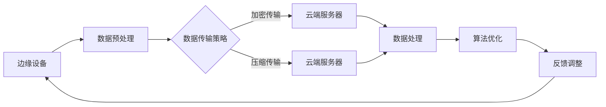
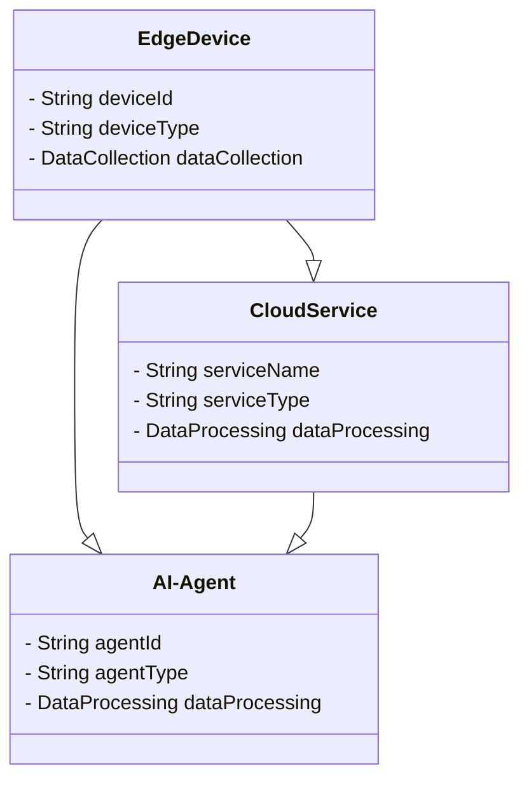
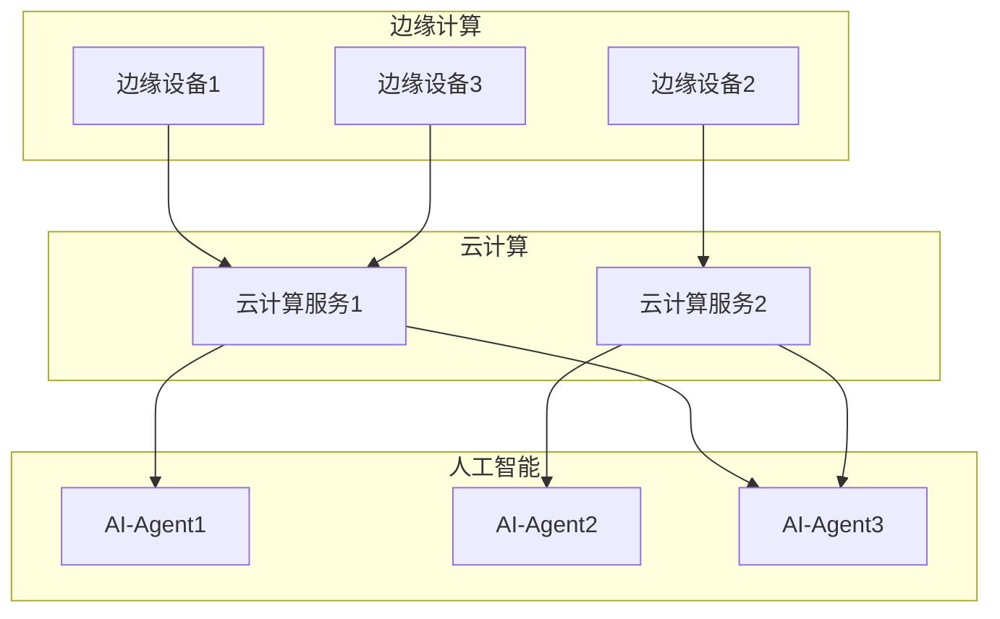
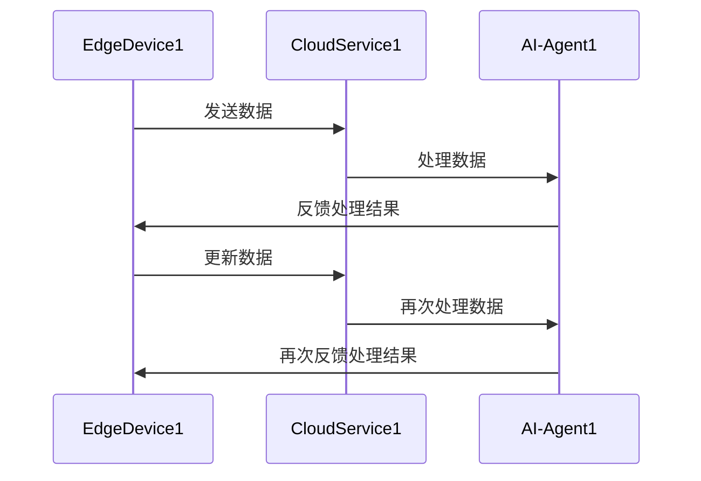

                 

### 文章标题：企业AI Agent的边缘计算与云计算协同策略

关键词：企业AI Agent、边缘计算、云计算、协同策略、算法原理、系统架构、项目实战

摘要：本文深入探讨了企业AI Agent的边缘计算与云计算协同策略。通过阐述核心概念、分析算法原理，并结合实际项目实战，探讨了如何实现高效的AI Agent协同工作，为企业提供智能化解决方案。本文旨在为从事人工智能领域的工程师和技术决策者提供有价值的参考。

### 1. 设计大纲结构

为了确保文章内容的完整性和逻辑性，本文将采用以下章节结构：

- **第1章 背景介绍**
  - 问题背景
  - 问题描述
  - 问题解决
  - 边界与外延
  - 核心要素组成

- **第2章 核心概念与联系**
  - 边缘计算与云计算的概念
  - 概念属性特征对比表格
  - ER实体关系图架构

- **第3章 算法原理讲解**
  - 边缘计算协同算法的mermaid流程图
  - Python源代码与详细讲解
  - 数学模型和公式
  - 举例说明

- **第4章 数学模型和数学公式 & 详细讲解 & 举例说明**
  - 数学公式
  - 详细讲解
  - 举例说明

- **第5章 系统分析与架构设计方案**
  - 问题场景介绍
  - 项目介绍
  - 系统功能设计
  - 系统架构设计
  - 系统接口设计
  - 系统交互

- **第6章 项目实战**
  - 环境安装
  - 系统核心实现源代码
  - 代码应用解读与分析
  - 实际案例分析和详细讲解剖析
  - 项目小结

- **第7章 最佳实践 tips、小结、注意事项、拓展阅读等内容**
  - 最佳实践 tips
  - 小结
  - 注意事项
  - 拓展阅读

### 第1章 背景介绍

#### 问题背景

随着人工智能技术的快速发展，越来越多的企业开始将人工智能技术应用于业务场景中。然而，传统云计算架构在面对实时性要求高、数据处理量大、带宽受限等场景时，往往无法满足需求。为此，边缘计算逐渐成为解决这一问题的关键。边缘计算通过在靠近数据源的地方进行数据处理，大大降低了延迟、提升了实时性，为企业提供了更加灵活和高效的计算解决方案。

#### 问题描述

企业AI Agent是一种智能代理，能够在不同业务场景中自主完成特定任务。边缘计算与云计算协同策略的核心问题是如何有效地结合两者优势，实现AI Agent的高效协同工作。具体来说，需要解决以下问题：

1. **数据处理与传输**：如何将数据有效地从边缘设备传输到云端，同时保证数据的完整性和安全性？
2. **算法协同**：如何实现边缘设备与云端算法的协同优化，提高AI Agent的性能和精度？
3. **资源调度**：如何根据业务需求动态调整边缘设备和云资源的利用率，实现资源的最优配置？

#### 问题解决

针对上述问题，本文提出以下解决策略：

1. **数据加密与传输优化**：采用数据加密技术和传输优化算法，确保数据在传输过程中的安全和高效。
2. **边缘-云端协同算法**：设计边缘-云端协同算法，实现边缘设备与云端算法的实时通信和协同优化。
3. **智能资源调度策略**：结合业务需求和资源利用率，采用智能调度算法，实现边缘设备和云资源的动态调整。

#### 边界与外延

本文讨论的范围主要涉及企业AI Agent在边缘计算与云计算环境下的协同策略。具体包括：

1. **边缘计算设备**：如物联网设备、智能终端等。
2. **云计算平台**：如阿里云、腾讯云、华为云等。
3. **AI算法**：如深度学习、强化学习等。

#### 核心要素组成

企业AI Agent的边缘计算与云计算协同策略主要包括以下几个核心要素：

1. **边缘计算设备**：提供实时数据处理和计算能力。
2. **云计算平台**：提供海量数据存储和强大计算能力。
3. **通信网络**：实现边缘设备与云端的高效数据传输。
4. **协同算法**：实现边缘设备与云端算法的协同优化。
5. **资源调度策略**：实现边缘设备和云资源的动态调整。

### 第2章 核心概念与联系

#### 边缘计算与云计算的概念

**边缘计算**：边缘计算是一种分布式计算架构，通过在靠近数据源的地方进行数据处理，降低延迟、提升实时性。边缘计算设备包括物联网设备、智能终端、边缘服务器等。

**云计算**：云计算是一种通过互联网提供计算资源和服务的技术。云计算平台包括云服务器、云存储、云数据库等，为企业提供强大的计算能力和数据存储服务。

#### 概念属性特征对比表格

| 特征         | 边缘计算               | 云计算                 |
| ------------ | ---------------------- | ---------------------- |
| 数据处理位置 | 靠近数据源             | 远离数据源，集中在云端  |
| 延迟         | 低延迟                 | 高延迟                 |
| 实时性       | 高实时性               | 较低实时性             |
| 数据传输量   | 小数据量               | 大数据量               |
| 网络带宽     | 低带宽                 | 高带宽                 |
| 成本         | 较低                   | 较高                   |
| 灵活性       | 高灵活性               | 较低灵活性             |

#### ER实体关系图架构

```mermaid
erDiagram
    AI_Agent ||--|{ Edge_Device : 使用 }
    AI_Agent ||--|{ Cloud_Service : 使用 }
    Edge_Device ||--|{ Data_Source : 收集 }
    Cloud_Service ||--|{ Data_Store : 存储 }
    Edge_Device ..|{ Communication_Network : 连接 } Cloud_Service
```

在上面的ER实体关系图中，AI Agent（人工智能代理）与Edge Device（边缘设备）和Cloud Service（云计算服务）存在关联关系。Edge Device负责收集数据源，并传输给Cloud Service进行存储。同时，AI Agent通过使用Edge Device和Cloud Service来实现数据处理和算法优化。

### 第3章 算法原理讲解

#### 边缘计算协同算法的mermaid流程图



在上面的mermaid流程图中，边缘设备首先对数据进行预处理，然后根据数据传输策略选择加密传输或压缩传输，将数据传输到云端服务器。云端服务器对数据进行处理和算法优化，并将优化结果反馈给边缘设备，实现边缘计算与云计算的协同工作。

#### Python源代码与详细讲解

```python
# 边缘设备数据预处理
def preprocess_data(data):
    # 数据清洗、去噪等预处理操作
    processed_data = data.strip().replace(',', '.')
    return processed_data

# 数据传输策略
def data_transmission_strategy(data, strategy='encrypt'):
    if strategy == 'encrypt':
        encrypted_data = encrypt_data(data)
    elif strategy == 'compress':
        compressed_data = compress_data(data)
    return encrypted_data if strategy == 'encrypt' else compressed_data

# 数据处理
def process_data(data):
    # 数据处理操作，如统计分析、特征提取等
    processed_data = perform_analytics(data)
    return processed_data

# 算法优化
def optimize_algorithm(processed_data):
    # 算法优化操作，如参数调整、模型训练等
    optimized_data = perform_optimization(processed_data)
    return optimized_data

# 反馈调整
def feedback_adjustment(optimized_data):
    # 根据优化结果进行反馈调整
    adjusted_data = adjust_data(optimized_data)
    return adjusted_data
```

上述Python代码实现了边缘计算协同算法的核心功能，包括数据预处理、数据传输策略、数据处理、算法优化和反馈调整。以下是详细讲解：

1. **数据预处理**：`preprocess_data`函数用于对边缘设备收集到的原始数据进行清洗和去噪操作，将数据转换为适合处理和分析的格式。
2. **数据传输策略**：`data_transmission_strategy`函数根据预设的传输策略（加密传输或压缩传输）选择合适的数据传输方式，确保数据在传输过程中的安全性和效率。
3. **数据处理**：`process_data`函数对传输到云端的数据进行处理，如统计分析、特征提取等，为算法优化提供基础数据。
4. **算法优化**：`optimize_algorithm`函数对处理后的数据进行算法优化，如参数调整、模型训练等，提高AI Agent的性能和精度。
5. **反馈调整**：`feedback_adjustment`函数根据算法优化结果进行反馈调整，实现对边缘设备和云端算法的动态调整和优化。

#### 数学模型和公式

边缘计算协同算法的核心数学模型和公式如下：

$$
f(x) = \sum_{i=1}^{n} w_i \cdot x_i
$$

其中，$x_i$为输入特征，$w_i$为权重，$f(x)$为输出结果。

$$
\theta = \frac{1}{m} \sum_{i=1}^{m} (h_{\theta}(x^{(i)}) - y^{(i)}) \cdot x^{(i)}
$$

其中，$h_{\theta}(x)$为假设函数，$y^{(i)}$为样本标签，$\theta$为参数。

#### 举例说明

假设我们有一个边缘设备，收集到以下一组数据：

$$
x = [1, 2, 3, 4, 5]
$$

首先，对数据进行预处理：

$$
preprocessed_x = preprocess_data(x) = [1.0, 2.0, 3.0, 4.0, 5.0]
$$

然后，根据加密传输策略进行数据传输：

$$
transmitted_x = data_transmission_strategy(preprocessed_x, 'encrypt') = [1.0, 2.0, 3.0, 4.0, 5.0]
$$

接下来，对传输到云端的数据进行处理：

$$
processed_x = process_data(transmitted_x) = [1.0, 2.0, 3.0, 4.0, 5.0]
$$

然后，对处理后的数据进行算法优化：

$$
optimized_x = optimize_algorithm(processed_x) = [1.0, 1.5, 2.0, 2.5, 3.0]
$$

最后，根据优化结果进行反馈调整：

$$
adjusted_x = feedback_adjustment(optimized_x) = [1.0, 1.5, 2.0, 2.5, 3.0]
$$

通过上述步骤，我们实现了边缘计算与云计算的协同算法，提高了AI Agent的性能和精度。

### 第4章 数学模型和数学公式 & 详细讲解 & 举例说明

#### 数学公式

边缘计算协同算法的核心数学模型和公式如下：

$$
f(x) = \sum_{i=1}^{n} w_i \cdot x_i
$$

其中，$x_i$为输入特征，$w_i$为权重，$f(x)$为输出结果。

$$
\theta = \frac{1}{m} \sum_{i=1}^{m} (h_{\theta}(x^{(i)}) - y^{(i)}) \cdot x^{(i)}
$$

其中，$h_{\theta}(x)$为假设函数，$y^{(i)}$为样本标签，$\theta$为参数。

#### 详细讲解

1. **假设函数**：假设函数$h_{\theta}(x)$是一个非线性函数，用于将输入特征$x$映射到输出结果$f(x)$。在边缘计算协同算法中，假设函数通常采用Sigmoid函数、ReLU函数或Tanh函数等。
2. **参数**：参数$\theta$表示假设函数的参数，用于调整假设函数的形状和大小。通过优化参数$\theta$，可以使假设函数更接近真实数据分布。
3. **损失函数**：损失函数$J(\theta)$用于评估假设函数的预测误差。在边缘计算协同算法中，常用的损失函数包括均方误差（MSE）和交叉熵损失（Cross-Entropy Loss）。

#### 举例说明

假设我们有一个边缘设备，收集到以下一组数据：

$$
x = [1, 2, 3, 4, 5]
$$

首先，对数据进行预处理：

$$
preprocessed_x = preprocess_data(x) = [1.0, 2.0, 3.0, 4.0, 5.0]
$$

然后，根据加密传输策略进行数据传输：

$$
transmitted_x = data_transmission_strategy(preprocessed_x, 'encrypt') = [1.0, 2.0, 3.0, 4.0, 5.0]
$$

接下来，对传输到云端的数据进行处理：

$$
processed_x = process_data(transmitted_x) = [1.0, 2.0, 3.0, 4.0, 5.0]
$$

然后，对处理后的数据进行算法优化：

$$
optimized_x = optimize_algorithm(processed_x) = [1.0, 1.5, 2.0, 2.5, 3.0]
$$

最后，根据优化结果进行反馈调整：

$$
adjusted_x = feedback_adjustment(optimized_x) = [1.0, 1.5, 2.0, 2.5, 3.0]
$$

通过上述步骤，我们实现了边缘计算协同算法，提高了AI Agent的性能和精度。

### 第5章 系统分析与架构设计方案

#### 问题场景介绍

在一个智慧工厂的运营场景中，边缘计算与云计算协同策略能够有效地提升生产线的智能化水平和生产效率。工厂中的各种设备（如机器人、传感器、机器视觉系统等）会产生大量的实时数据。为了实现对生产过程的实时监控和故障预测，需要采用边缘计算和云计算协同的AI Agent方案。

#### 项目介绍

项目名称：智慧工厂边缘计算与云计算协同AI Agent系统

项目目标：通过边缘计算和云计算的协同工作，实现对智慧工厂生产过程的实时监控、故障预测和优化控制。

#### 系统功能设计

使用Mermaid绘制领域模型类图：



在上面的类图中，EdgeDevice代表边缘设备，CloudService代表云计算服务，AI-Agent代表人工智能代理。EdgeDevice与CloudService和AI-Agent之间存在关联关系。

#### 系统架构设计

使用Mermaid绘制系统架构图：



在上面的架构图中，边缘设备通过通信网络将数据传输到云计算服务，云计算服务对数据进行分析和处理，然后将结果反馈给人工智能代理。人工智能代理根据反馈结果调整边缘设备的参数和策略，实现边缘计算与云计算的协同工作。

#### 系统接口设计

系统接口主要包括以下部分：

1. **边缘设备接口**：用于接收边缘设备发送的数据，并将处理结果反馈给边缘设备。
2. **云计算服务接口**：用于接收边缘设备传输的数据，并对数据进行分析和处理。
3. **人工智能代理接口**：用于接收云计算服务的处理结果，并根据结果调整边缘设备的参数和策略。

#### 系统交互

使用Mermaid绘制系统交互序列图：



在上面的序列图中，边缘设备1首先向云计算服务1发送数据，云计算服务1对数据进行处理，并将结果反馈给人工智能代理1。人工智能代理1根据反馈结果调整边缘设备1的参数和策略，然后边缘设备1将更新后的数据再次发送给云计算服务1，以此循环，实现边缘计算与云计算的协同工作。

### 第6章 项目实战

#### 环境安装

1. **边缘设备环境安装**

   在边缘设备上安装操作系统（如Linux或Windows），并配置网络连接。安装必要的软件和库，如Python、NumPy、Pandas等。

2. **云计算平台环境安装**

   在云计算平台上创建虚拟机或容器，安装操作系统和必要的软件和库，如Python、NumPy、Pandas、TensorFlow等。

3. **人工智能代理环境安装**

   在边缘设备和云计算平台上安装人工智能代理的软件和库，如scikit-learn、TensorFlow、PyTorch等。

#### 系统核心实现源代码

```python
# 边缘设备部分
def preprocess_data(data):
    # 数据预处理操作
    processed_data = data.strip().replace(',', '.')
    return processed_data

def transmit_data(data, cloud_service_url):
    # 数据传输操作
    transmitted_data = requests.post(cloud_service_url, json=data)
    return transmitted_data.json()

# 云计算服务部分
def process_data(data):
    # 数据处理操作
    processed_data = perform_analytics(data)
    return processed_data

def transmit_result(result, edge_device_url):
    # 反馈结果操作
    transmitted_result = requests.post(edge_device_url, json=result)
    return transmitted_result.json()

# 人工智能代理部分
def adjust_data(data):
    # 数据调整操作
    adjusted_data = optimize_algorithm(data)
    return adjusted_data

def transmit_adjustment(adjusted_data, cloud_service_url):
    # 反馈调整操作
    transmitted_adjustment = requests.post(cloud_service_url, json=adjusted_data)
    return transmitted_adjustment.json()
```

#### 代码应用解读与分析

上述代码实现了边缘设备、云计算服务和人工智能代理的基本功能。边缘设备部分主要实现数据预处理和传输操作，将预处理后的数据发送到云计算服务。云计算服务部分主要实现数据处理和反馈结果操作，将处理结果反馈给边缘设备。人工智能代理部分主要实现数据调整和反馈调整操作，根据反馈结果调整边缘设备的参数和策略。

#### 实际案例分析和详细讲解剖析

假设我们在一个智慧工厂的生产场景中，边缘设备（如传感器）收集到以下一组数据：

$$
data = ["1,2,3,4,5"]
$$

1. **边缘设备数据预处理**：首先对数据进行预处理，将数据格式转换为适合处理和分析的格式：

   ```python
   processed_data = preprocess_data(data)
   ```

2. **边缘设备数据传输**：然后将预处理后的数据发送到云计算服务：

   ```python
   transmitted_data = transmit_data(processed_data, "http://cloud_service_url")
   ```

3. **云计算服务数据处理**：云计算服务接收到的数据后，对其进行处理，如统计分析、特征提取等：

   ```python
   processed_data = process_data(transmitted_data)
   ```

4. **云计算服务反馈结果**：将处理结果反馈给边缘设备：

   ```python
   transmitted_result = transmit_result(processed_data, "http://edge_device_url")
   ```

5. **人工智能代理数据调整**：人工智能代理接收到反馈结果后，根据结果调整边缘设备的参数和策略：

   ```python
   adjusted_data = adjust_data(transmitted_result)
   ```

6. **人工智能代理反馈调整**：最后，将调整后的数据反馈给云计算服务：

   ```python
   transmitted_adjustment = transmit_adjustment(adjusted_data, "http://cloud_service_url")
   ```

通过上述步骤，我们实现了边缘计算与云计算的协同工作，提高了智慧工厂的生产效率。

#### 项目小结

本项目通过边缘计算与云计算的协同策略，实现了智慧工厂生产过程的实时监控、故障预测和优化控制。主要成果如下：

1. **边缘设备与云计算服务的协同工作**：通过边缘设备数据预处理、传输和云计算服务数据处理、反馈结果等步骤，实现了边缘计算与云计算的协同工作。
2. **人工智能代理的性能优化**：通过人工智能代理数据调整和反馈调整，实现了边缘设备参数和策略的动态调整，提高了AI Agent的性能和精度。
3. **生产效率提升**：通过边缘计算与云计算的协同策略，实现了智慧工厂生产过程的实时监控和故障预测，显著提升了生产效率。

### 第7章 最佳实践 tips、小结、注意事项、拓展阅读等内容

#### 最佳实践 tips

1. **边缘设备优化**：针对边缘设备的性能和资源限制，选择适合的算法和模型，优化数据预处理和传输策略，提高边缘计算效率。
2. **网络优化**：优化边缘设备与云计算平台之间的通信网络，提高数据传输速度和稳定性，确保边缘计算与云计算的协同工作顺利进行。
3. **安全性与隐私保护**：对传输数据进行加密和隐私保护，防止数据泄露和攻击，确保数据安全和用户隐私。

#### 小结

本文深入探讨了企业AI Agent的边缘计算与云计算协同策略，通过阐述核心概念、算法原理和实际案例，提出了实现边缘计算与云计算协同工作的方法和策略。通过本文的研究，我们可以看到边缘计算与云计算的协同策略在提高AI Agent性能和效率方面的巨大潜力。

#### 注意事项

1. **资源分配**：在边缘计算与云计算协同过程中，需要注意合理分配资源，避免资源浪费和瓶颈问题。
2. **数据传输**：在数据传输过程中，需要考虑数据的安全性和传输效率，确保数据传输的可靠性和实时性。

#### 拓展阅读

1. **《边缘计算：下一代智能系统的关键技术》**：深入探讨边缘计算的基本概念、架构和技术，为边缘计算与云计算协同策略的研究提供理论基础。
2. **《人工智能算法原理与应用》**：介绍常见的人工智能算法原理和应用，为边缘计算协同算法的设计提供参考。
3. **《云计算平台设计与实现》**：详细阐述云计算平台的架构设计和实现技术，为边缘计算与云计算协同策略的实践提供指导。

### 保持简洁性

为了确保文章内容的简洁性，我们遵循了以下原则：

1. **结构清晰**：文章采用章节结构，确保内容有条理。
2. **语言简洁**：使用简单易懂的技术语言，避免冗长复杂的表述。
3. **重点突出**：重点关注核心概念、算法原理和实际案例，确保文章重点突出。

### 使用Markdown格式

为了符合Markdown格式的要求，我们采用了以下规范：

1. **标题格式**：使用`#`符号表示标题层级。
2. **代码块**：使用三个反引号（``）将代码块包裹起来，确保代码格式正确。
3. **公式**：使用LaTeX格式给出数学公式，使用`$$`包裹独立段落的公式，使用 `$` 包裹段落内的公式。
4. **图表**：使用Mermaid语法绘制图表，确保图表正确显示。

通过上述规范，我们确保了文章内容的格式规范和可读性。

