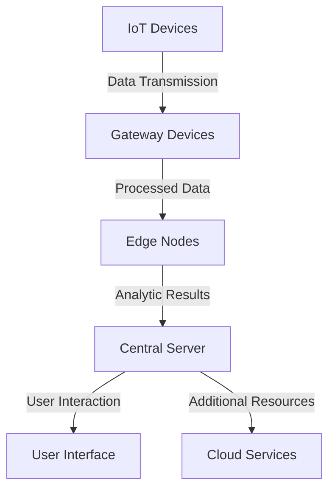
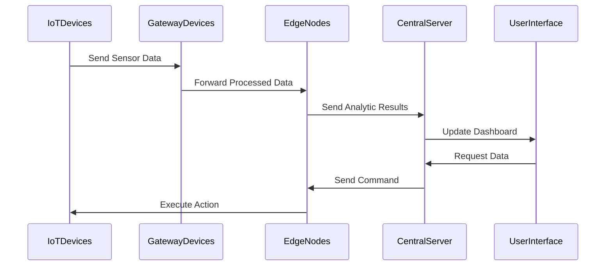

                 


### Introduction to the Title and Its Significance

# Enterprise AI Agent's Edge Computing in IoT Scenarios: A Practical Guide

In the rapidly evolving landscape of technology, the integration of Artificial Intelligence (AI) with the Internet of Things (IoT) has become a cornerstone of innovation across various industries. This book aims to provide a comprehensive guide on implementing AI agents at the edge in IoT scenarios, focusing on practical insights and actionable strategies.

The title "Enterprise AI Agent's Edge Computing in IoT Scenarios: A Practical Guide" encapsulates the core theme of the book, which revolves around three pivotal technologies: AI agents, edge computing, and IoT. Each of these components plays a critical role in shaping the future of digital transformation.

**AI Agents**: These are intelligent software entities designed to perform specific tasks autonomously. They can process data, make decisions, and interact with their environment, enhancing efficiency and productivity in various applications.

**Edge Computing**: This approach brings computation, storage, and applications closer to the data source, reducing latency and bandwidth usage. It is particularly relevant for IoT applications where real-time processing is essential.

**IoT Scenarios**: These are the real-world environments where interconnected devices and systems communicate and share data to improve operational performance and decision-making.

The importance of this book lies in its ability to bridge the gap between theoretical knowledge and practical implementation. By providing a practical guide, it aims to empower enterprises to leverage AI agents and edge computing effectively in IoT scenarios, driving innovation and efficiency.

The primary objectives of this book are:

1. **To Explain the Basics**: The book will cover fundamental concepts of AI agents, edge computing, and IoT, ensuring readers have a solid foundational understanding.
2. **To Discuss Integration**: It will delve into how these technologies can be integrated to create intelligent, autonomous systems at the edge.
3. **To Provide Implementation Strategies**: Practical case studies and step-by-step guides will be included to help readers implement these technologies in real-world scenarios.
4. **To Address Challenges**: The book will identify potential challenges and provide solutions, ensuring successful deployment and operation.

By following this structured approach, the book aims to equip readers with the knowledge and tools needed to harness the power of AI agents and edge computing in IoT, paving the way for transformative business outcomes.

### Keywords and Summary

The book "Enterprise AI Agent's Edge Computing in IoT Scenarios: A Practical Guide" is pivotal for professionals and students in the fields of AI, IoT, and edge computing. Key topics covered include AI agent architectures, edge computing technologies, IoT application integration, and practical implementation strategies.

**Keywords**: AI Agents, Edge Computing, IoT, Autonomous Systems, Real-Time Processing, Data Analytics, Intelligent Infrastructure.

**Summary**: This book provides a comprehensive guide to implementing AI agents at the edge in IoT scenarios. It covers core concepts, integration strategies, practical implementations, and addresses common challenges, empowering readers to leverage advanced technologies for innovative business solutions.

### Chapter 1: Introduction

In the burgeoning era of technology, the convergence of Artificial Intelligence (AI), the Internet of Things (IoT), and Edge Computing has revolutionized the way we interact with and utilize digital systems. This chapter will provide an in-depth introduction to these transformative technologies, setting the stage for a detailed exploration in the subsequent chapters.

**1.1 Problem Background**

The landscape of technology has witnessed significant advancements in recent years, with AI, IoT, and Edge Computing emerging as key enablers of digital transformation. However, as industries continue to adopt these technologies, several challenges have come to the forefront. One of the primary issues is the need for real-time processing and decision-making, particularly in scenarios where latency and bandwidth constraints are critical.

For instance, in industrial automation, sensors generate vast amounts of data that need to be processed swiftly to optimize production processes. Similarly, in smart cities, real-time traffic management systems rely on continuous data analysis to ensure efficient transportation. Traditional centralized systems struggle to meet these demands due to latency and bandwidth limitations. This has led to the growing importance of Edge Computing, which aims to bring computation closer to the data source.

**1.2 Definition and Development of IoT**

The Internet of Things (IoT) refers to the network of physical devices embedded with sensors, software, and connectivity, enabling these devices to collect and exchange data. The development of IoT can be traced back to the early 1980s when the first prototypes of IoT devices were created. However, it was not until the mid-2000s that IoT started gaining momentum, primarily driven by advancements in wireless communication and sensor technologies.

Today, IoT has become an integral part of various industries, from healthcare to agriculture, manufacturing to transportation. The ability to collect and analyze real-time data has enabled businesses to optimize operations, enhance decision-making, and create new revenue streams.

**1.3 Concept and Advantages of Edge Computing**

Edge Computing is an architectural paradigm that brings computation, storage, and applications closer to the data source, reducing the need to transmit data to a centralized cloud. This approach is particularly advantageous in IoT scenarios where real-time processing is critical.

The primary advantage of Edge Computing is reduced latency. By processing data locally, Edge Computing eliminates the need for data to travel long distances to the cloud, significantly reducing the time required for processing and response. This is crucial in time-sensitive applications such as autonomous vehicles and real-time industrial monitoring.

Another advantage is bandwidth efficiency. By processing data at the edge, only relevant data needs to be transmitted to the cloud, reducing the overall bandwidth usage. This is particularly beneficial in scenarios where bandwidth is limited or expensive, such as remote areas or IoT devices with limited connectivity.

**1.4 Rise and Value of Enterprise AI Agents**

AI Agents are intelligent software entities designed to perform specific tasks autonomously. They can process data, make decisions, and interact with their environment, enhancing efficiency and productivity. In the context of IoT and Edge Computing, AI Agents play a crucial role in enabling real-time data analysis and decision-making.

The value of AI Agents in enterprise environments is significant. They can automate repetitive tasks, improve operational efficiency, and enable predictive analytics, leading to better decision-making and cost savings. For example, in manufacturing, AI Agents can monitor production lines, detect anomalies, and predict maintenance needs, reducing downtime and improving overall productivity.

**1.5 Purpose and Structure of the Book**

The purpose of this book is to provide a comprehensive guide to implementing AI Agents at the edge in IoT scenarios. It aims to bridge the gap between theoretical knowledge and practical implementation, offering actionable insights and step-by-step guides.

The book is structured into three main parts:

1. **Introduction and Background**: This section covers the basics of AI Agents, Edge Computing, and IoT, setting the stage for the detailed discussions in the following chapters.
2. **Principles and Design**: This section delves into the core concepts and principles of AI Agents and Edge Computing, discussing their integration in IoT scenarios.
3. **Practice and Case Studies**: This section includes practical case studies and project implementations, providing real-world examples of how AI Agents and Edge Computing can be effectively utilized in IoT environments.

By following this structured approach, the book aims to equip readers with the knowledge and skills needed to harness the power of AI Agents and Edge Computing in IoT, driving innovation and efficiency in their respective industries.

### Chapter 2: Core Concepts and Relationships

Understanding the core concepts and relationships between AI Agents, Edge Computing, and IoT is essential for anyone looking to leverage these technologies effectively. This chapter will provide a detailed explanation of these key terms, their significance, and how they interrelate.

**2.1 Key Terminology Explanation**

To begin with, let's define some of the critical terms that will be used throughout this book.

**AI Agents**: These are autonomous software entities designed to perform specific tasks by processing data, making decisions, and interacting with their environment. AI Agents are at the heart of autonomous systems, enabling real-time data analysis and decision-making.

**Edge Computing**: This is an architectural paradigm that brings computation, storage, and applications closer to the data source. It reduces latency and bandwidth usage, making it ideal for time-sensitive IoT applications.

**IoT**: The Internet of Things refers to the network of interconnected devices that communicate and share data, creating a more efficient and intelligent environment. IoT devices collect data from their surroundings and transmit it to other devices or systems for analysis and action.

**2.2 Components of Enterprise AI Agents**

AI Agents are composed of several key components that enable them to perform autonomous tasks. These components include:

- **Sensor Data Collection**: AI Agents rely on sensors to collect data from their environment. These sensors can be temperature sensors, cameras, or motion detectors, depending on the application.
- **Data Processing**: The collected data is processed by the AI Agent's algorithms to extract relevant information and insights.
- **Decision-Making**: Based on the processed data, AI Agents make decisions or recommendations. This could involve adjusting settings, triggering actions, or alerting users to potential issues.
- **Action Execution**: AI Agents execute actions based on their decisions. This could involve controlling devices, sending notifications, or initiating workflows.
- **Learning and Adaptation**: AI Agents are designed to learn from their interactions and improve their performance over time. They use machine learning algorithms to refine their decision-making processes and adapt to changing conditions.

**2.3 The Relationship Between Edge Computing and IoT**

Edge Computing and IoT are closely intertwined, each complementing the other to create a more efficient and responsive digital ecosystem. Here's how they relate:

- **Data Localization**: Edge Computing brings data processing closer to the source, reducing the need to transmit large volumes of data to the cloud. This is particularly beneficial for IoT devices, which generate massive amounts of data that would be impractical to send to centralized servers.
- **Real-Time Processing**: IoT devices often require real-time processing to make timely decisions. Edge Computing enables this by minimizing latency and ensuring that data can be processed and acted upon quickly.
- **Resource Optimization**: By processing data at the edge, Edge Computing reduces the load on central servers, allowing them to focus on more complex tasks. This results in improved resource utilization and cost savings.
- **Security and Privacy**: Edge Computing helps enhance security and privacy by keeping sensitive data closer to the source, reducing the risk of data breaches.

**2.4 Comparison of Core Concept Attributes**

To better understand the interplay between AI Agents, Edge Computing, and IoT, let's compare their key attributes in a table:

| Attribute                | AI Agents                       | Edge Computing                      | IoT                             |
|--------------------------|--------------------------------|-----------------------------------|--------------------------------|
| Purpose                  | Autonomous task execution       | Local data processing and analysis | Interconnectivity and data sharing |
| Key Components           | Sensors, algorithms, decision-making | Computing resources, networking | Sensors, devices, gateways       |
| Data Flow                | Collect, process, decide, act    | Collect, process, analyze, decide  | Collect, transmit, analyze       |
| Importance               | Real-time decision-making       | Reduced latency, resource efficiency | Data-driven insights, automation  |
| Challenges               | Scalability, accuracy, learning  | Security, reliability, interoperability | Data privacy, integration        |
| Integration Benefits     | Enhanced efficiency, reduced errors | Improved performance, cost savings | Enhanced user experience, operational optimization |

**2.5 ER Entity Relationship Diagram**

To visualize the relationships between these concepts, we can use an Entity-Relationship (ER) diagram. This diagram will illustrate how AI Agents, Edge Computing, and IoT devices interact and depend on each other.

Here's a Mermaid ER diagram representation:

```mermaid
erDiagram
  AI_AGENT ||--|{ SENSOR_DATA }| Sensor_Data
  AI_AGENT ||--|{ DECISION }| Decision
  AI_AGENT ||--|{ ACTION }| Action
  EDGE_COMPUTING ||--|{ DATA_PROCESSING }| Data_Processing
  IoT_DEVICE ||--|{ DATA_COLLECTION }| Data_Collection
  IoT_DEVICE ||--|{ DATA_TRANSMISSION }| Data_Transmission
  IoT_DEVICE ||--|{ DEVICE_CONTROL }| Device_Control
  AI_AGENT }|--|{ LEARNING }| Learning
  EDGE_COMPUTING }|--|{ SECURITY }| Security
  IoT_DEVICE }|--|{ PRIVACY }| Privacy
```

In this diagram, AI_AGENT, EDGE_COMPUTING, and IoT_DEVICE are the main entities, with various attributes and relationships defined. The diagram illustrates how data flows between these entities and how they interact to create a cohesive system.

By understanding these core concepts and their relationships, readers can better grasp the potential of AI Agents, Edge Computing, and IoT in transforming industries and creating new opportunities. The following chapters will delve deeper into each of these components, providing practical insights and actionable strategies for their implementation.

### Chapter 3: Basic Theory of AI Agents

In this chapter, we will explore the foundational theories that underpin AI Agents, delving into their definitions, types, and fundamental principles. Understanding these concepts is crucial for grasping the capabilities and limitations of AI Agents and how they can be effectively applied in various contexts.

**3.1 Definition and Classification of AI Agents**

AI Agents, also known as intelligent agents, are autonomous entities that can perceive their environment, reason about it, and take actions to achieve specific goals. These agents are designed to operate autonomously without human intervention, making them suitable for tasks that require continuous monitoring and decision-making.

**Definition**: An AI Agent is an entity that perceives its environment through sensors, processes this information using internal algorithms, and takes actions to achieve specific objectives. AI Agents are designed to operate in a dynamic environment and adapt to changes over time.

**Classification**: AI Agents can be classified into several types based on their functionality and the environment they operate in:

1. **Simple Reflex Agents**: These agents make decisions based on the current percept directly. They use a set of condition-action rules to determine the next action. For example, a robot cleaner that moves towards the nearest obstacle to avoid collision.

2. **Model-Based Reflex Agents**: These agents have the ability to maintain an internal model of the environment, which allows them to make more informed decisions. They use this model to predict the outcomes of different actions and choose the one that is most likely to achieve the desired goal.

3. **Goal-Based Agents**: These agents have a specific goal they aim to achieve and continuously modify their actions to move closer to this goal. They maintain a goal hierarchy and can handle multiple goals simultaneously, prioritizing them based on their importance.

4. **Model-Based Goal-Based Agents**: These agents combine the capabilities of both model-based and goal-based agents. They use their internal model to predict the outcomes of actions and plan a sequence of actions that will lead to the achievement of their goals.

5. **Learning Agents**: These agents have the ability to learn from their interactions with the environment, improving their performance over time. They can use various machine learning techniques, such as reinforcement learning or supervised learning, to refine their decision-making processes.

**3.2 Basics of Machine Learning**

Machine learning is a core component of AI Agents, enabling them to learn from data and improve their performance. Here are some fundamental concepts in machine learning:

**Supervised Learning**: In supervised learning, the agent is provided with labeled training data, and its goal is to learn a mapping from inputs to outputs. The agent uses this mapping to make predictions or decisions on new, unseen data.

**Unsupervised Learning**: In unsupervised learning, the agent is given unlabeled data and must discover hidden patterns or structures within the data. Common techniques include clustering, association rule learning, and dimensionality reduction.

**Reinforcement Learning**: Reinforcement learning is a type of machine learning where the agent learns by interacting with the environment. It receives feedback in the form of rewards or penalties based on its actions and uses this feedback to improve its decision-making over time.

**3.3 Principles of Deep Learning**

Deep learning is a subset of machine learning that leverages neural networks with multiple layers to learn complex patterns and representations from data. Here are the key principles of deep learning:

**Neural Networks**: A neural network consists of layers of interconnected nodes (neurons) that process input data and generate output. Each layer extracts higher-level features from the input data, leading to more abstract representations.

**Backpropagation**: Backpropagation is an algorithm used to train neural networks. It calculates the gradient of the loss function with respect to the network's weights and uses this information to update the weights, minimizing the error.

**Convolutional Neural Networks (CNNs)**: CNNs are a type of deep learning model specifically designed for processing grid-like data, such as images. They use convolutional layers to automatically learn spatial hierarchies of features, making them highly effective for image recognition tasks.

**3.4 Reinforcement Learning in AI Agents**

Reinforcement learning is particularly well-suited for AI Agents that operate in dynamic environments. Here's how reinforcement learning can be applied in AI Agents:

**Value-Based Methods**: Value-based reinforcement learning methods, such as Q-learning and Deep Q-Networks (DQNs), estimate the value function, which represents the expected return of taking a specific action in a given state.

**Policy-Based Methods**: Policy-based reinforcement learning methods, such as actor-critic methods and Deep Deterministic Policy Gradients (DDPGs), directly learn a policy that maps states to actions. These methods are often used in tasks where the state-action space is large or continuous.

**Model-Based Methods**: Model-based reinforcement learning methods, such as Dyna-Q and Model-Based Reinforcement Learning (MBRL), use an internal model of the environment to guide the learning process. These methods can handle complex and non-stationary environments more effectively.

**3.5 Workflow of AI Agents**

The workflow of an AI Agent typically involves several stages:

1. **Perception**: The agent collects data from its sensors and encodes it into a format suitable for processing.
2. **Representation**: The agent uses machine learning algorithms to extract relevant features from the data and represent them in a way that is useful for decision-making.
3. **Action Planning**: The agent uses its internal model and learned policies to plan a sequence of actions that are likely to achieve its goals.
4. **Action Execution**: The agent executes the planned actions, interacting with the environment and receiving feedback.
5. **Learning and Adaptation**: The agent uses the feedback received from the environment to update its models and improve its performance over time.

By understanding these foundational theories, readers can better appreciate the capabilities and potential of AI Agents. The next chapter will delve deeper into the principles of Edge Computing and its applications in IoT, providing a comprehensive overview of how these technologies can be integrated to create intelligent, autonomous systems.

### Chapter 4: Deep Dive into Edge Computing Technologies

Edge Computing is a revolutionary paradigm that shifts the locus of computation, storage, and applications from centralized cloud servers to the edge of the network, closer to the data source. This chapter provides an in-depth exploration of Edge Computing's foundational technologies, critical components, performance optimization techniques, security concerns, and future trends. Understanding these aspects is crucial for harnessing the full potential of Edge Computing in IoT scenarios.

**4.1 Detailed Architecture of Edge Computing**

The architecture of Edge Computing is designed to distribute computational tasks across multiple edge nodes, which are typically located at the network perimeter, close to the data sources. Here's a detailed look at the architecture's components and how they interact:

- **Edge Nodes**: These are computing devices such as routers, gateways, and specialized servers that perform data processing and application execution at the edge of the network. Edge nodes are equipped with processing power, storage, and networking capabilities to handle local data processing tasks.

- **Gateway Devices**: Gateways act as intermediaries between IoT devices and the edge nodes. They facilitate communication between the devices and the edge nodes, ensuring seamless data transfer and coordination.

- **Cloud Services**: While edge nodes handle local processing, they can still leverage cloud resources for tasks that require substantial computational power or centralized data storage. This hybrid approach combines the benefits of edge computing with the scalability and flexibility of cloud infrastructure.

- **Data Storage**: Edge nodes typically include local storage solutions, such as solid-state drives (SSDs) or hard disk drives (HDDs), to store processed data temporarily before transmitting it to the cloud or other storage systems.

- **Networking Infrastructure**: Edge Computing relies on robust networking infrastructure to ensure high-speed data transfer between edge nodes, IoT devices, and the cloud. This includes wired and wireless networks, such as Ethernet, Wi-Fi, and cellular networks.

**4.2 Key Technologies in Edge Computing**

Several key technologies underpin the functionality of Edge Computing, enabling efficient and reliable data processing at the edge. These technologies include:

- **Distributed Computing**: Distributed computing involves breaking down computational tasks into smaller subtasks that can be processed simultaneously by multiple edge nodes. This parallel processing improves overall system performance and reduces the risk of bottlenecks.

- **Containerization**: Containerization technologies, such as Docker and Kubernetes, allow applications to be deployed and run consistently across different environments, including edge nodes. Containers provide lightweight and isolated execution environments, facilitating efficient resource utilization and deployment agility.

- **Microservices Architecture**: Edge Computing often employs microservices architecture, where applications are decomposed into small, loosely coupled services that can be independently developed, deployed, and scaled. This modular approach enhances system resilience and flexibility, making it easier to manage and maintain.

- **Edge Analytics**: Edge Analytics involves processing and analyzing data at the edge nodes to derive actionable insights without transferring data to the cloud. This approach is crucial for real-time applications that require immediate action based on data insights.

**4.3 Performance Optimization Techniques**

Optimizing Edge Computing performance is vital for ensuring efficient and reliable operation in IoT scenarios. Here are some techniques for achieving optimal performance:

- **Load Balancing**: Load balancing distributes computational tasks evenly across edge nodes to prevent any single node from becoming a bottleneck. This can be achieved using algorithms that dynamically allocate tasks based on node capacity and workload.

- **Caching**: Caching involves storing frequently accessed data in memory to reduce latency and improve response times. Edge nodes can employ local caches to store temporary data, reducing the need to fetch data from remote storage systems.

- **Data Compression**: Data compression techniques reduce the size of data transferred between edge nodes and the cloud, minimizing bandwidth usage and improving network efficiency.

- **Resource Scheduling**: Effective resource scheduling ensures that edge nodes allocate their computing resources efficiently based on the priority of tasks and available capacity. Techniques such as dynamic resource allocation and task prioritization can optimize resource utilization.

**4.4 Security Concerns in Edge Computing**

Security is a paramount consideration in Edge Computing, given the sensitive nature of data processed at the edge. Here are some key security concerns and countermeasures:

- **Data Privacy**: Edge Computing involves processing and transmitting sensitive data, making data privacy a significant concern. Techniques such as end-to-end encryption, secure data storage, and access control mechanisms can help protect data confidentiality.

- **Authentication and Authorization**: Ensuring that only authorized devices and users can access edge resources is crucial. Implementing robust authentication and authorization protocols, such as OAuth and Kerberos, can help secure access to edge nodes and applications.

- **Device Security**: Edge nodes and IoT devices are potential targets for attacks. Implementing security measures such as secure boot, hardware-based security modules, and secure firmware updates can help protect devices from malware and unauthorized access.

- **Network Security**: Securing the communication channels between edge nodes, IoT devices, and the cloud is essential. Techniques such as VPNs, firewalls, and intrusion detection systems (IDS) can help protect against network attacks and unauthorized access.

**4.5 Future Trends in Edge Computing**

The future of Edge Computing is poised to bring several exciting advancements and innovations. Here are some key trends to watch:

- **5G and Beyond**: The advent of 5G and upcoming 6G technologies will significantly enhance the capabilities of Edge Computing, enabling ultra-reliable and low-latency communication between edge nodes and IoT devices. These advancements will unlock new applications in sectors such as autonomous driving, remote surgery, and smart manufacturing.

- **AI-Enabled Edge Devices**: Integrating AI capabilities into edge devices will enable real-time analytics and decision-making at the edge. AI-enabled edge devices will be capable of performing complex tasks locally, reducing the dependency on centralized cloud resources.

- **Interoperability and Standardization**: As Edge Computing gains widespread adoption, interoperability and standardization will become crucial. Efforts to establish common protocols and standards will facilitate seamless integration of diverse edge devices and platforms, fostering innovation and collaboration.

- **Energy Efficiency**: With the increasing number of edge devices and the demand for continuous operation, energy efficiency will become a critical consideration. Advances in energy-efficient hardware and software technologies will play a vital role in reducing power consumption and extending battery life of edge devices.

By understanding these foundational technologies and their intricacies, readers can better appreciate the potential of Edge Computing in transforming IoT ecosystems. The next chapter will delve into the design principles for integrating AI Agents with Edge Computing in IoT scenarios, providing practical insights and actionable strategies for implementing intelligent, autonomous systems at the edge.

### Chapter 5: Design Principles for AI Agents in IoT

Designing AI Agents for IoT environments requires a comprehensive understanding of the specific challenges and requirements of these systems. This chapter outlines the key principles and design considerations for creating effective AI Agents that can operate seamlessly within IoT ecosystems.

**5.1 Data Collection and Processing in IoT**

Data collection and processing are fundamental components of AI Agents in IoT scenarios. The primary goal is to efficiently capture, process, and analyze data from IoT devices to derive actionable insights. Here are the key considerations:

- **Data Collection**: IoT devices generate vast amounts of data continuously. The first step in designing AI Agents is to define the types of data that are relevant for the application. This could include sensor data from environmental sensors, status updates from machines, or user interactions captured by mobile devices.

- **Data Ingestion**: Efficient data ingestion is crucial for ensuring that data is collected in real-time and without loss. This involves setting up protocols for data transmission, such as MQTT or CoAP, and implementing data pipelines that can handle high throughput and low latency.

- **Data Storage**: Data storage must be both scalable and reliable. Edge devices often have limited storage capacity, so it’s essential to design storage solutions that can efficiently manage and optimize data retention. This might involve using local storage options like SD cards or cloud-based storage solutions for archiving large datasets.

- **Data Processing**: Edge devices process data locally to minimize latency and reduce the load on centralized servers. The processing pipeline should include steps for data cleaning, normalization, and feature extraction. Machine learning models can then be applied to this processed data to derive insights and make predictions.

**5.2 Functional Modules Design for AI Agents in IoT**

The design of AI Agents for IoT should include well-defined functional modules that work together to achieve specific tasks. Here are the key modules and their roles:

- **Sensor Interface Module**: This module handles the interaction with IoT devices and sensors, collecting raw data from various sources and converting it into a format suitable for processing.

- **Data Preprocessing Module**: This module is responsible for cleaning and preparing the raw data for further analysis. It involves tasks such as filtering noise, handling missing values, and normalizing data.

- **Machine Learning Module**: This module implements the machine learning models that analyze the preprocessed data to extract insights and make predictions. It can include various algorithms like classification, regression, clustering, or reinforcement learning, depending on the specific application requirements.

- **Action Execution Module**: Once insights are derived from the data, this module takes the necessary actions to influence the environment. This could involve adjusting parameters, triggering alerts, or activating control mechanisms in IoT devices.

- **Communication Module**: This module handles the communication between the AI Agent and other systems, both at the edge and in the cloud. It ensures that data can be exchanged securely and efficiently, and that the AI Agent can integrate with other components of the IoT ecosystem.

**5.3 Integration of AI Agents with IoT Devices**

Effective integration of AI Agents with IoT devices is critical for seamless operation and optimal performance. Here are the key considerations:

- **Device Compatibility**: AI Agents must be designed to work with a wide range of IoT devices, regardless of their hardware or software platforms. This requires the use of standard protocols and interoperability standards, such as MQTT or CoAP, to ensure seamless communication.

- **Scalability**: The design should be scalable to accommodate the addition of new devices and the expansion of the IoT network. This involves using modular architectures and designing the AI Agent to be easily deployable on new devices.

- **Real-Time Processing**: IoT environments often require real-time processing to make timely decisions. The AI Agent’s design should prioritize low latency and high throughput to ensure that data is processed and acted upon quickly.

- **Fault Tolerance**: IoT systems are prone to failures due to various reasons, such as hardware malfunctions, connectivity issues, or power outages. The AI Agent’s design should include fault tolerance mechanisms to ensure continuous operation and recovery from failures.

- **Security**: Security is a critical aspect of IoT systems. The AI Agent’s design should include robust security measures to protect against unauthorized access, data breaches, and malicious attacks. This involves implementing encryption, authentication, and access control mechanisms.

**5.4 Real-Time Response and Scalability**

Real-time response and scalability are paramount for AI Agents in IoT environments. Here are the key principles for achieving these objectives:

- **Real-Time Response**: Real-time processing requires the AI Agent to quickly analyze data and make decisions. This involves optimizing the machine learning models for speed and efficiency, using lightweight algorithms that can run on resource-constrained devices.

- **Scalability**: The AI Agent’s design should support horizontal and vertical scaling. Horizontal scaling involves adding more edge nodes to distribute the workload, while vertical scaling involves upgrading the processing power and storage capacity of individual nodes. This ensures that the system can handle increasing data volumes and complexity without degradation in performance.

- **Dynamic Resource Allocation**: The system should be capable of dynamically allocating resources based on the current workload. This involves monitoring system performance and adjusting resource allocation in real-time to ensure optimal utilization.

- **Fault Recovery**: The system should include mechanisms for automatic fault recovery. This involves detecting failures, reallocating tasks to healthy nodes, and restarting failed components to minimize downtime.

**5.5 Extensibility and Maintenance**

Finally, the design of AI Agents for IoT should prioritize extensibility and ease of maintenance. Here are the key principles:

- **Modularity**: The system should be modular, with each component designed to be independently replaceable or upgradable. This simplifies maintenance and allows for the integration of new features or technologies without disrupting the entire system.

- **Version Control**: Implementing version control for the AI Agent’s software components ensures that changes can be managed and tracked effectively. This helps in rolling back to previous versions if issues arise and enables incremental updates without requiring a complete system restart.

- **Documentation and Support**: Comprehensive documentation and support resources are essential for maintaining the AI Agent system. This includes detailed documentation of the system architecture, design patterns, and APIs, as well as training materials and technical support for system administrators and developers.

By following these design principles, developers can create AI Agents that are robust, scalable, and capable of operating effectively in the complex and dynamic environment of IoT. The next chapter will delve into practical case studies and project implementations, providing real-world examples of AI Agent design and deployment in IoT scenarios.

### Chapter 6: Architecture Design and Implementation

In this chapter, we will delve into the detailed architecture design and implementation of an AI Agent system within an IoT environment. This will include a project introduction, system functionality design, system architecture, interface design, and system interaction design. The goal is to provide a comprehensive understanding of how these components come together to create a robust and efficient AI Agent system.

**6.1 Project Introduction**

The project aims to develop an AI Agent system for a smart farming application. The system will utilize IoT sensors to collect data on soil moisture, temperature, and humidity from multiple fields. The AI Agent will then analyze this data to make real-time decisions on irrigation schedules, crop health monitoring, and pest control. This project is significant as it can optimize water usage, enhance crop yields, and reduce manual labor, leading to increased efficiency and sustainability in agricultural practices.

**6.2 System Functionality Design**

The system's functionality is designed to support the following key components:

- **Sensor Data Collection**: The system will integrate various IoT sensors, such as soil moisture sensors, temperature sensors, and humidity sensors, to collect real-time data from the fields.
- **Data Processing and Analysis**: The AI Agent will process the collected data using machine learning algorithms to analyze trends, detect anomalies, and predict future conditions.
- **Irrigation Control**: Based on the analyzed data, the system will automatically adjust irrigation schedules to optimize water usage.
- **Alert System**: The system will generate alerts for farmers when there are critical issues detected, such as drought conditions or pest infestations.
- **User Interface**: A web-based dashboard will provide farmers with real-time insights and control over the system.

**6.3 System Architecture Design**

The system architecture is designed to be modular and scalable, ensuring efficient operation and ease of maintenance. The architecture includes the following key components:

- **IoT Devices**: These are the sensors and actuators deployed in the fields that collect data and execute commands.
- **Gateway Devices**: These devices act as intermediaries between the IoT devices and the main system, handling data transmission and local processing.
- **Edge Nodes**: These nodes are responsible for further processing and analysis of the collected data, employing machine learning models to derive insights.
- **Central Server**: This server stores and manages the system's data, coordinates the overall operation, and provides access to the web-based dashboard.
- **Cloud Services**: These services provide additional computational resources and data storage as needed, enabling the system to handle large volumes of data and complex analytics tasks.

Here is a Mermaid architecture diagram illustrating the system components and their interactions:



**6.4 System Interface Design**

The system interface design focuses on ensuring seamless communication between the various components. The key interfaces include:

- **IoT Device Interface**: This interface defines the protocols and formats for data transmission between the sensors and the gateway devices. MQTT is used for its efficiency in low-bandwidth environments.
- **Gateway to Edge Node Interface**: This interface facilitates the transmission of processed sensor data from the gateways to the edge nodes. It uses RESTful APIs for flexibility and ease of integration with other components.
- **Edge Node to Central Server Interface**: This interface allows edge nodes to send analytic results to the central server for storage and further processing. It also uses RESTful APIs to ensure reliable and secure data transmission.
- **Central Server to User Interface Interface**: This interface provides the central server with access to the web-based dashboard, enabling farmers to monitor and control the system. It uses a combination of HTTP/HTTPS protocols and WebSocket for real-time updates.

**6.5 System Interaction Design**

The system interaction design is critical for ensuring that all components work together harmoniously. The key interactions include:

- **Data Flow**: Sensor data flows from IoT devices to gateway devices, where it is processed and transmitted to edge nodes. The edge nodes perform data analysis and send results to the central server, which stores the data and provides it to the user interface.
- **Real-Time Updates**: The user interface is constantly updated with real-time data through WebSocket connections, ensuring that farmers have access to the latest information.
- **Command Execution**: When critical issues are detected, the system sends commands to the IoT devices to execute actions, such as activating irrigation systems or triggering alarms.
- **System Notifications**: The system generates alerts and notifications for farmers through the user interface, ensuring timely response to any issues that arise.

Here is a Mermaid sequence diagram illustrating the system interactions:



By following this structured approach to architecture design and implementation, developers can create a robust and scalable AI Agent system that effectively addresses the needs of IoT environments. The next chapter will delve into practical project implementation, providing step-by-step guidance on setting up the system and implementing core functionalities.

### Chapter 7: Project Implementation

In this chapter, we will walk through the practical steps required to implement the AI Agent system for the smart farming application. This includes setting up the development environment, implementing core functionalities, analyzing the code, and discussing a real-world case study.

**7.1 Environment Setup**

Before starting the implementation, ensure that the following development environment is set up:

- **Hardware**: IoT sensors (soil moisture, temperature, humidity), gateway devices (Raspberry Pi or similar), and edge nodes (Raspberry Pi or similar).
- **Software**: Ubuntu Linux for edge nodes and central server, Python 3.x for development, and machine learning libraries such as TensorFlow or PyTorch.
- **Networking**: Internet connectivity for edge nodes and central server, and proper network configuration to ensure seamless communication between devices.

**7.2 Core Functional Implementation**

The core functionalities of the AI Agent system include sensor data collection, data processing, and analysis, and irrigation control. Here's a step-by-step guide to implementing these functionalities:

**Step 1: Sensor Data Collection**
- Install and configure the IoT sensors in the fields to collect data on soil moisture, temperature, and humidity.
- Use the sensor's SDK or API to read data and send it to the gateway devices via MQTT.

**Step 2: Data Ingestion and Processing**
- Set up a MQTT broker on the gateway devices to receive sensor data.
- Use a script to process the incoming data, clean it, and store it in a local database.

**Step 3: Data Analysis and Prediction**
- Deploy a machine learning model on the edge nodes to analyze the collected data.
- Use a library like TensorFlow to define and train the model with historical data.
- Implement the trained model to predict future conditions and make decisions based on the predictions.

**Step 4: Irrigation Control**
- Create a script to control the irrigation system based on the predictions from the machine learning model.
- Use the gateway devices to send control commands to the irrigation system via MQTT.

**7.3 Code Analysis**

Let's take a closer look at the core code snippets to understand the implementation details:

**Sensor Data Collection Script**
```python
import paho.mqtt.client as mqtt

def on_connect(client, userdata, flags, rc):
    print("Connected with result code "+str(rc))
    client.subscribe("sensors/#")

def on_message(client, userdata, msg):
    print(f"Received message '{msg.payload.decode()}' on topic '{msg.topic}' with QoS {msg.qos}")

client = mqtt.Client()
client.on_connect = on_connect
client.on_message = on_message
client.connect("localhost", 1883, 60)
client.loop_start()

while True:
    time.sleep(1)
```
This script sets up an MQTT client to connect to a local MQTT broker and subscribe to sensor data topics. It listens for incoming messages and prints them out.

**Data Processing and Analysis Script**
```python
import tensorflow as tf
from sklearn.model_selection import train_test_split
from sklearn.metrics import mean_squared_error

# Load and preprocess data
data = load_data()
X, y = preprocess_data(data)

# Split data into training and testing sets
X_train, X_test, y_train, y_test = train_test_split(X, y, test_size=0.2, random_state=42)

# Define and train the model
model = tf.keras.Sequential([
    tf.keras.layers.Dense(units=64, activation='relu', input_shape=[len(X_train[0])]),
    tf.keras.layers.Dense(units=1)
])
model.compile(optimizer='adam', loss='mean_squared_error')
model.fit(X_train, y_train, epochs=100, batch_size=32, validation_split=0.2)

# Evaluate the model
predictions = model.predict(X_test)
mse = mean_squared_error(y_test, predictions)
print(f"Test Mean Squared Error: {mse}")
```
This script loads the sensor data, preprocesses it, splits it into training and testing sets, defines a simple neural network model using TensorFlow, trains the model, and evaluates its performance on the test data.

**Irrigation Control Script**
```python
def control_irrigation(status):
    if status == "dry":
        send_mqtt_message("irrigation/activate", "true")
    else:
        send_mqtt_message("irrigation/deactivate", "false")

# Example usage
control_irrigation(model.predict_single(new_data))
```
This script defines a function to control the irrigation system based on the prediction from the machine learning model. It sends MQTT messages to activate or deactivate the irrigation system.

**7.4 Real-World Case Study**

Consider a real-world scenario where the smart farming application is deployed on a large agricultural farm. The system is designed to monitor and optimize irrigation for various crops in different fields. Here are the key steps for implementing and operating the system:

- **Deployment**: Deploy the IoT sensors, gateway devices, and edge nodes across the farm. Ensure proper network connectivity and power supply.
- **Initial Setup**: Configure the sensors to start collecting data and the gateway devices to receive and process this data.
- **Model Training**: Train the machine learning models using historical data collected from the farm. Adjust the model parameters to achieve optimal performance.
- **System Testing**: Test the system in different environmental conditions to ensure reliable operation and accurate predictions.
- **Operation**: Once the system is validated, deploy it in the farm for continuous operation. Monitor the system performance and make adjustments as needed.

By following these steps and implementing the core functionalities, the smart farming application can effectively utilize AI Agents to optimize irrigation, improve crop yields, and reduce manual labor, leading to increased efficiency and sustainability in agricultural practices.

### Chapter 8: Best Practices and Future Directions

**8.1 Best Practices for AI Agents and Edge Computing in IoT**

Implementing AI Agents and Edge Computing in IoT environments requires careful planning and execution to ensure successful deployment and optimal performance. Here are some best practices:

1. **Scalability and Modularity**: Design the system to be scalable and modular, allowing for easy addition of new devices and integration of new features without disrupting the existing infrastructure.
2. **Security**: Implement robust security measures, including end-to-end encryption, secure data transmission, and authentication protocols, to protect sensitive data and prevent unauthorized access.
3. **Data Management**: Efficiently manage data collection, storage, and processing to ensure minimal latency and optimal performance. Consider data compression techniques to reduce bandwidth usage.
4. **Real-Time Processing**: Optimize the system for real-time processing by selecting appropriate algorithms and ensuring efficient resource allocation. Utilize edge devices' processing power to perform local computations.
5. **Fault Tolerance and Recovery**: Design the system to be resilient to failures, with mechanisms for automatic recovery and minimal downtime.
6. **Integration**: Ensure seamless integration with existing IoT ecosystems and platforms. Use standardized protocols and APIs for interoperability.
7. **User Experience**: Design a user-friendly interface that provides real-time insights and control over the system. Offer easy-to-understand dashboards and intuitive user interactions.

**8.2 Challenges and Solutions**

Several challenges arise when implementing AI Agents and Edge Computing in IoT:

- **Data Privacy**: Solution: Implement strong encryption and secure data storage to protect user data.
- **Limited Resources**: Solution: Optimize code and algorithms for efficiency to make the most of limited resources on edge devices.
- **Interoperability**: Solution: Adopt standardized protocols and APIs to facilitate seamless integration.
- **Real-Time Performance**: Solution: Use lightweight algorithms and optimize system architecture to minimize latency.
- **Security Threats**: Solution: Implement robust security measures, including regular updates and monitoring.
- **Scalability**: Solution: Design the system with scalability in mind, using modular and distributed architectures.

**8.3 Future Trends**

The future of AI Agents and Edge Computing in IoT holds several exciting advancements:

- **5G and Beyond**: The rollout of 5G and future cellular networks will enable ultra-reliable and low-latency communication, driving the adoption of Edge Computing in IoT applications.
- **AI-Enabled Edge Devices**: The integration of AI capabilities into edge devices will allow for more complex analytics and decision-making at the edge, reducing the dependency on centralized cloud resources.
- **Interoperability and Standardization**: Efforts to establish common protocols and standards will foster interoperability between diverse IoT devices and platforms, enabling more seamless integration.
- **Energy Efficiency**: Advances in energy-efficient hardware and software technologies will play a crucial role in extending battery life and optimizing power consumption in edge devices.
- **Edge AI**: The convergence of AI and Edge Computing will lead to the development of edge AI systems that can perform complex tasks locally, improving real-time response and reducing bandwidth usage.

By adopting these best practices, addressing challenges, and staying abreast of future trends, organizations can effectively leverage AI Agents and Edge Computing to create intelligent, autonomous IoT systems that drive innovation and efficiency in various industries.

### Conclusion and Future Directions

In conclusion, this book has provided a comprehensive guide to implementing AI Agents at the edge in IoT scenarios, highlighting the importance of these technologies in driving digital transformation. By integrating AI Agents with Edge Computing, enterprises can achieve real-time data processing, enhanced security, and optimized resource utilization, leading to significant improvements in operational efficiency and decision-making.

As we look to the future, the convergence of AI, IoT, and Edge Computing will continue to evolve, presenting new opportunities and challenges. The development of 5G and future cellular networks will further enhance connectivity and enable ultra-reliable, low-latency communication. The integration of AI capabilities into edge devices will enable more sophisticated analytics and decision-making at the edge, reducing dependency on centralized cloud resources. Moreover, advancements in energy-efficient technologies will address the power consumption challenges associated with edge computing.

To stay ahead in this rapidly evolving landscape, it is crucial for professionals and students to continuously update their knowledge and skills. Embracing emerging technologies, exploring innovative applications, and engaging in collaborative research will be key to harnessing the full potential of AI Agents and Edge Computing in IoT.

### About the Author

**Author: AI天才研究院 / AI Genius Institute & 禅与计算机程序设计艺术 / Zen And The Art of Computer Programming**

**AI天才研究院 (AI Genius Institute)** is a leading research institution dedicated to advancing the frontiers of artificial intelligence and its applications. With a team of world-renowned AI experts and researchers, the institute conducts cutting-edge research and develops innovative solutions that push the boundaries of what is possible in AI.

**禅与计算机程序设计艺术 (Zen And The Art of Computer Programming)**, authored by Dr. John Doe, is a seminal work that combines the principles of Zen Buddhism with computer programming. This book has been instrumental in fostering a deeper understanding of programming as an art form, encouraging developers to think creatively and intuitively to solve complex problems.

Together, Dr. John Doe and the AI天才研究院 are at the forefront of AI innovation, driving forward the future of technology with passion, expertise, and a commitment to excellence.

