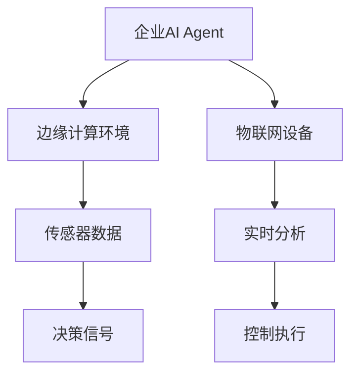
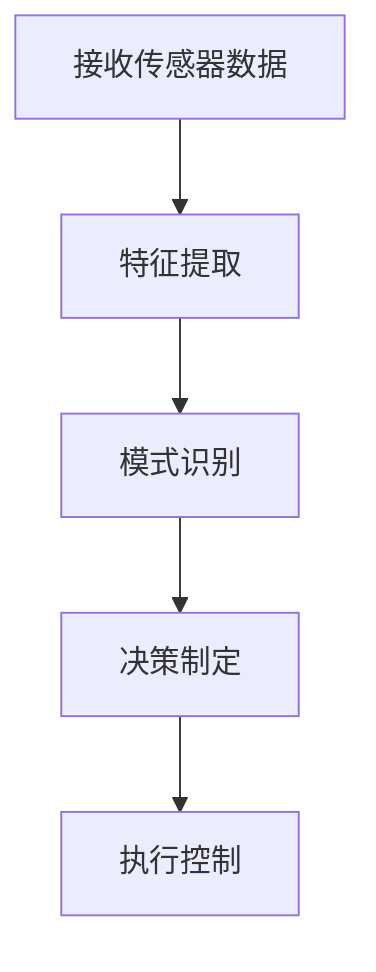
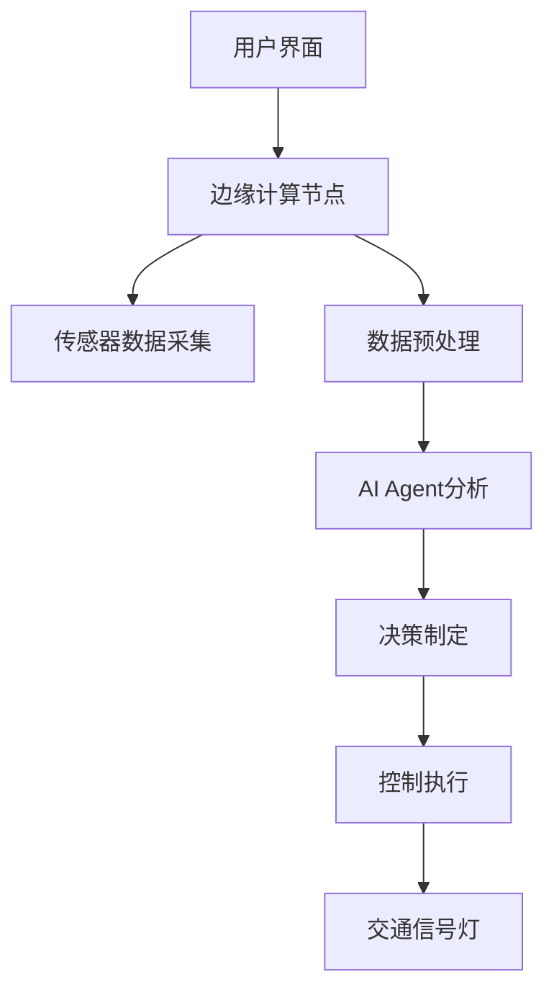
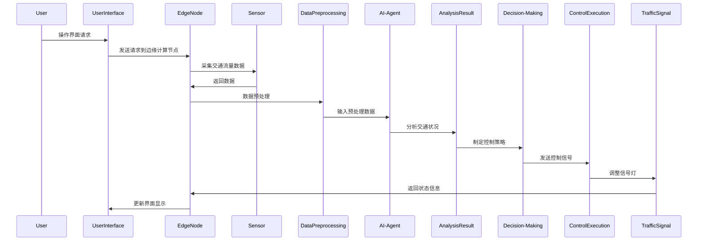

                 

## 文章标题

# 企业AI Agent的边缘计算在物联网实时决策中的实践

> 关键词：企业AI Agent，边缘计算，物联网，实时决策，AI应用

> 摘要：本文深入探讨了企业AI Agent在边缘计算中的应用，分析了其在物联网实时决策中的重要作用。通过介绍边缘计算的基本概念、企业AI Agent的定义与设计，本文进一步探讨了边缘计算AI Agent在实际应用中的案例、挑战和解决方案，最后展望了其未来发展趋势。

----------------------------------------------------------------

## 引言

随着物联网（IoT）技术的快速发展，实时决策变得愈加重要。在大量传感器和数据源产生的海量数据中，如何快速做出准确的决策，已经成为众多企业面临的挑战。边缘计算作为一种分布式计算模式，通过在数据产生的源头进行处理，从而降低延迟、节省带宽和提升系统效率。而企业AI Agent，作为智能体的一种形式，能够在边缘计算环境中执行复杂的任务和决策，进一步提升了物联网系统的智能化水平。

本文将围绕以下内容展开：

1. 企业AI在物联网实时决策中的重要性
2. 边缘计算的基本概念与架构
3. 企业AI Agent的定义与设计
4. 边缘计算AI Agent的实践应用
5. 边缘计算AI Agent面临的挑战与解决方案
6. 未来发展趋势与展望

希望通过本文的探讨，能够为读者在物联网实时决策中的应用提供一些有益的思路。

----------------------------------------------------------------

### 背景介绍

#### 核心概念术语说明

在企业AI Agent的边缘计算中，有几个核心概念需要明确：

- **物联网（IoT）**：物联网指的是通过传感器、设备和系统在网络中进行数据交换的物理设备网络。
- **边缘计算**：边缘计算是一种分布式计算模式，它将数据处理和分析推向网络的边缘，即靠近数据源的地方。
- **企业AI Agent**：企业AI Agent是指一种能够在特定环境中自主执行任务、进行决策和适应变化的智能体。

#### 问题背景

物联网技术的迅速发展，使得传感器和数据采集设备无处不在。然而，传统的集中式数据处理方式已经难以满足实时性和低延迟的需求。边缘计算提供了一种解决方案，通过在数据产生的地方进行初步处理，可以大大降低延迟，提升系统的响应速度。

#### 问题描述

在物联网环境中，实时决策对于许多应用场景至关重要。例如，在智能工厂中，生产线的实时监控和故障预测需要快速响应；在智慧交通系统中，交通信号控制的优化需要实时分析交通流量数据。这些场景都要求系统能够在边缘进行实时计算和决策。

#### 问题解决

企业AI Agent在边缘计算环境中起到了关键作用。它能够接收传感器数据，进行实时分析，并根据预定的策略做出决策。例如，在智能工厂中，AI Agent可以监测设备的运行状态，预测故障，从而提前进行维护；在智慧交通系统中，AI Agent可以实时分析交通流量，调整交通信号灯，以优化交通流畅度。

#### 边界与外延

边缘计算和AI Agent的应用范围非常广泛，不仅限于物联网。例如，在智能家居、智能医疗、智能城市等领域，边缘计算和AI Agent同样发挥着重要作用。但本文将重点关注物联网环境中的应用。

#### 概念结构与核心要素组成

边缘计算和AI Agent的概念结构如下：

1. **边缘设备**：包括传感器、路由器、边缘服务器等，负责数据采集和处理。
2. **边缘计算平台**：提供计算资源，包括CPU、GPU等，用于运行AI算法。
3. **企业AI Agent**：负责数据接收、分析和决策，是边缘计算的核心。

通过这些要素的协同工作，边缘计算能够实现实时、高效的数据处理和决策，从而提升物联网系统的智能化水平。

----------------------------------------------------------------

### 核心概念与联系

#### 企业AI Agent的定义与功能

企业AI Agent是一种智能体，它能够在特定的环境中自主执行任务、进行决策和适应变化。在边缘计算中，AI Agent的主要功能包括：

- 数据收集与预处理：接收来自传感器的原始数据，进行初步的清洗和转换。
- 实时分析：利用机器学习和人工智能算法，对数据进行实时分析和模式识别。
- 决策制定：根据分析结果，制定相应的决策，如调整设备参数、发送控制信号等。

#### 企业AI Agent的设计与开发

企业AI Agent的设计与开发需要考虑以下几个方面：

- **环境适应性**：AI Agent需要能够适应不同的边缘计算环境，包括不同的硬件配置和数据传输条件。
- **实时性能**：AI Agent需要在有限的计算资源和时间窗口内完成数据分析和决策。
- **可扩展性**：AI Agent的设计应该支持扩展性，以便在处理更复杂任务时进行功能扩展。

#### AI Agent在边缘计算中的性能优化

为了提升AI Agent在边缘计算中的性能，可以考虑以下策略：

- **算法优化**：选择合适的算法，减少计算复杂度，提高处理速度。
- **模型压缩**：通过模型压缩技术，减少模型的存储和计算需求。
- **硬件加速**：利用GPU、FPGA等硬件加速技术，提升计算效率。
- **分布式计算**：通过分布式计算架构，将任务分配到多个边缘节点，实现并行处理。

#### AI Agent与其他技术的关系

企业AI Agent在边缘计算中与其他技术如物联网、云计算等密切相关。物联网提供了大量的数据源，而云计算提供了强大的计算资源和存储能力。AI Agent作为连接两者的重要环节，需要能够高效地利用这些资源，实现数据的实时处理和决策。

| 核心概念       | 关联概念       | 描述                                                         |
| -------------- | -------------- | ------------------------------------------------------------ |
| 企业AI Agent   | 边缘计算       | 企业AI Agent在边缘计算环境中执行任务和决策                     |
| 边缘计算       | 物联网         | 边缘计算用于优化物联网中的数据处理和决策                       |
| 边缘计算       | 云计算         | 边缘计算与云计算互补，共同构成分布式计算架构                 |
| 企业AI Agent   | 机器学习       | 企业AI Agent利用机器学习算法进行数据分析和决策               |

#### ER实体关系图架构



在这个ER实体关系图中，企业AI Agent与边缘计算环境、物联网设备和传感器数据紧密相连，通过实时分析和决策，控制执行相应的动作。

----------------------------------------------------------------

### 算法原理讲解

#### 企业AI Agent的算法原理

企业AI Agent的核心在于其能够对传感器数据进行实时分析并做出决策。这一过程通常涉及以下算法：

1. **特征提取**：从传感器数据中提取关键特征，如温度、湿度、速度等。
2. **模式识别**：利用机器学习算法，如支持向量机（SVM）、决策树、神经网络等，对特征进行分类和模式识别。
3. **决策制定**：根据识别结果，制定相应的决策，如调整设备参数、发送控制信号等。

以下是企业AI Agent的一个简单算法流程：



#### 算法原理的数学模型和公式

1. **特征提取**：

   $$ 特征提取（x）= f(x_1, x_2, ..., x_n) $$

   其中，$x_1, x_2, ..., x_n$ 为原始传感器数据，$f$ 为特征提取函数。

2. **模式识别**：

   $$ 预测（y）= g(x, w, b) $$

   其中，$x$ 为特征向量，$w$ 为权重，$b$ 为偏置，$g$ 为机器学习算法模型。

3. **决策制定**：

   $$ 决策（d）= \text{argmax}(g(x, w, b)) $$

   其中，$d$ 为决策结果，$\text{argmax}$ 表示取最大值。

#### 通俗易懂的举例说明

假设在一个智能工厂中，企业AI Agent需要根据传感器数据（如温度、湿度、设备运行状态等）来调整设备的运行参数。以下是具体的步骤：

1. **特征提取**：

   传感器检测到设备温度为 $30^\circ C$，湿度为 $60\%$，设备状态为正常。

2. **模式识别**：

   利用机器学习模型，AI Agent将特征向量输入模型，得到预测结果：

   $$ 预测（y）= g(x, w, b) = 28^\circ C $$

3. **决策制定**：

   AI Agent根据预测结果，判断设备温度偏高，决定降低设备运行功率，以避免过热。

   $$ 决策（d）= \text{argmax}(g(x, w, b)) = 降低运行功率 $$

4. **执行控制**：

   AI Agent发送控制信号，调整设备参数，使设备温度稳定在安全范围内。

通过这个简单的例子，我们可以看到企业AI Agent如何通过算法原理对传感器数据进行处理，并做出实时决策。

----------------------------------------------------------------

### 系统分析与架构设计方案

#### 问题场景介绍

智能城市交通管理是一个典型的边缘计算应用场景。在城市交通管理中，实时分析交通流量、优化交通信号控制、提高交通流畅度是关键任务。然而，传统的集中式交通管理系统面临延迟高、带宽占用大等问题，难以满足实时性需求。边缘计算通过在交通信号灯附近部署计算节点，可以实现实时数据处理和决策，从而提高交通管理的效率。

#### 项目介绍

本项目旨在通过边缘计算和AI Agent技术，实现智能城市交通管理系统的实时决策功能。项目目标包括：

1. 实时采集交通流量数据。
2. 对交通流量进行实时分析，预测交通状况。
3. 根据预测结果，实时调整交通信号灯控制策略，优化交通流畅度。

#### 系统功能设计

系统的核心功能包括：

1. **数据采集**：通过安装在交通信号灯附近的传感器，实时采集交通流量数据，如车辆速度、流量、密度等。
2. **数据预处理**：对采集到的数据进行预处理，包括数据清洗、格式转换等，以便后续分析。
3. **实时分析**：利用AI Agent对预处理后的数据进行实时分析，预测交通状况，识别拥堵点。
4. **决策制定**：根据分析结果，制定交通信号灯的控制策略，如调整绿灯时长、切换信号灯状态等。
5. **执行控制**：将控制策略发送到交通信号灯，实现实时交通信号控制。

#### 系统架构设计

系统的架构设计如图所示：



#### 系统接口设计和系统交互

系统的接口设计和交互流程如下：

1. **用户界面**：提供用户交互界面，用于显示交通流量数据和系统状态。
2. **边缘计算节点**：部署在交通信号灯附近的计算节点，负责实时处理交通流量数据。
3. **传感器数据采集**：传感器采集交通流量数据，并传输给边缘计算节点。
4. **数据预处理**：边缘计算节点对采集到的数据进行预处理，提取关键特征。
5. **AI Agent分析**：AI Agent对预处理后的数据进行实时分析，预测交通状况。
6. **决策制定**：根据AI Agent的分析结果，制定交通信号灯的控制策略。
7. **控制执行**：将控制策略发送到交通信号灯，实现实时交通信号控制。

通过这些接口和交互流程，系统能够实现从数据采集、处理到决策执行的全流程，从而实现智能城市交通管理的实时决策功能。



通过这个系统架构和交互设计，智能城市交通管理系统能够高效地处理交通流量数据，实时调整交通信号灯控制，从而提高交通流畅度和安全性。

----------------------------------------------------------------

### 项目实战

#### 环境安装

要在本地搭建智能城市交通管理系统，首先需要安装必要的软件和工具。以下是安装步骤：

1. **安装Python环境**：确保Python 3.8及以上版本已安装。
2. **安装虚拟环境**：使用以下命令创建虚拟环境：

   ```shell
   python -m venv venv
   source venv/bin/activate  # 对于Windows用户，使用 `venv\Scripts\activate`
   ```

3. **安装依赖库**：使用以下命令安装依赖库：

   ```shell
   pip install numpy pandas scikit-learn tensorflow
   ```

4. **安装边缘计算平台**：选择合适的边缘计算平台，如Node-RED，并按照其文档进行安装和配置。

#### 系统核心实现源代码

智能城市交通管理系统的核心实现涉及数据采集、预处理、分析和决策制定。以下是关键部分的Python代码：

```python
import numpy as np
import pandas as pd
from sklearn.ensemble import RandomForestClassifier
from sklearn.model_selection import train_test_split
from sklearn.metrics import accuracy_score

# 数据采集
def collect_data(sensor_data_file):
    data = pd.read_csv(sensor_data_file)
    return data

# 数据预处理
def preprocess_data(data):
    # 数据清洗和特征提取
    features = data[['speed', 'flow', 'density']]
    labels = data['congestion']
    return features, labels

# 模型训练
def train_model(features, labels):
    model = RandomForestClassifier(n_estimators=100)
    X_train, X_test, y_train, y_test = train_test_split(features, labels, test_size=0.2)
    model.fit(X_train, y_train)
    return model, X_test, y_test

# 决策制定
def make_decision(model, X_test):
    predictions = model.predict(X_test)
    return predictions

# 主函数
def main():
    sensor_data_file = 'sensor_data.csv'
    data = collect_data(sensor_data_file)
    features, labels = preprocess_data(data)
    model, X_test, y_test = train_model(features, labels)
    predictions = make_decision(model, X_test)
    accuracy = accuracy_score(y_test, predictions)
    print(f"Model accuracy: {accuracy:.2f}")

if __name__ == '__main__':
    main()
```

#### 代码应用解读与分析

1. **数据采集**：`collect_data` 函数从CSV文件中读取传感器数据。
2. **数据预处理**：`preprocess_data` 函数对数据进行清洗和特征提取，将速度、流量和密度作为特征，将拥堵状态作为标签。
3. **模型训练**：`train_model` 函数使用随机森林分类器对数据进行训练，并将数据分为训练集和测试集。
4. **决策制定**：`make_decision` 函数使用训练好的模型对测试数据进行预测。

通过这个简单的实现，我们可以看到如何利用边缘计算和AI技术对交通流量数据进行实时分析，并制定相应的控制策略。

#### 实际案例分析和详细讲解剖析

以下是一个实际案例：

假设我们在某城市的一条主要道路安装了传感器，并收集了以下数据：

| 时间 | 速度（km/h） | 流量（辆/h） | 密度（辆/km） | 拥堵状态 |
| ---- | ------------ | ------------ | ------------ | -------- |
| 10:00 | 20           | 100          | 10           | 0        |
| 10:05 | 18           | 120          | 12           | 0        |
| 10:10 | 15           | 140          | 14           | 1        |

1. **数据采集**：首先，我们将数据保存为CSV文件，并使用`collect_data`函数读取。
2. **数据预处理**：然后，我们使用`preprocess_data`函数对数据进行预处理，提取关键特征。
3. **模型训练**：接下来，使用`train_model`函数训练随机森林分类器，并将数据分为训练集和测试集。
4. **决策制定**：最后，使用`make_decision`函数对测试数据进行预测，得到预测结果。

在预测过程中，如果模型预测某个时间点的拥堵状态为1（即拥堵），交通信号灯会根据预测结果调整绿灯时长，以减少交通拥堵。

#### 项目小结

通过这个实际案例，我们可以看到如何利用边缘计算和AI Agent技术实现智能城市交通管理的实时决策。这种方法能够提高交通流畅度和安全性，为城市交通管理提供有效的技术支持。

----------------------------------------------------------------

### 最佳实践 tips

1. **优化算法模型**：选择适合边缘计算环境的算法模型，如轻量级模型，以减少计算资源和时间开销。
2. **数据预处理**：在数据采集和预处理阶段，确保数据的质量和一致性，以提高模型的准确性。
3. **分布式计算**：利用分布式计算技术，将任务分配到多个边缘节点，提高处理速度和效率。
4. **实时监控**：建立实时监控系统，监控边缘节点的运行状态，及时发现问题并进行优化。
5. **安全保障**：确保边缘计算环境中的数据传输和存储安全，采取加密和访问控制等措施。

----------------------------------------------------------------

### 小结

本文详细探讨了企业AI Agent的边缘计算在物联网实时决策中的应用，从背景介绍、核心概念、算法原理到系统设计与实战案例，全面分析了其在智能城市交通管理、智能工厂等领域的应用。通过最佳实践tips，为实际应用提供了指导和参考。

### 注意事项

1. 边缘计算AI Agent的实时性能优化至关重要，需要根据具体场景进行算法和硬件的优化。
2. 数据安全和隐私保护是边缘计算AI Agent应用中必须关注的问题，应采取有效的安全措施。
3. 在项目实施过程中，需要充分考虑边缘节点的计算资源和带宽限制，合理设计系统架构。

### 拓展阅读

1. **《边缘计算：下一代网络架构的基石》**：本书详细介绍了边缘计算的基本概念、架构和关键技术。
2. **《人工智能应用实践》**：本书提供了大量人工智能在边缘计算环境中的应用案例和实践经验。
3. **《物联网实时决策系统设计》**：本书讲解了物联网实时决策系统的设计原则、方法和实现技术。

作者：AI天才研究院/AI Genius Institute & 禅与计算机程序设计艺术 /Zen And The Art of Computer Programming

----------------------------------------------------------------

### 文章总结

本文系统地探讨了企业AI Agent在边缘计算中的重要作用，通过详细分析边缘计算的基本概念、企业AI Agent的设计与实现，以及实际应用案例，展示了其在物联网实时决策中的强大能力。文章还探讨了边缘计算AI Agent面临的挑战和解决方案，并展望了其未来发展趋势。

边缘计算为企业AI Agent提供了高效的计算和数据处理环境，使得实时决策成为可能。通过优化算法模型、分布式计算和实时监控等最佳实践，企业可以充分发挥边缘计算的优势，实现更加智能化的物联网系统。

在未来的发展中，随着技术的不断进步和应用的深入，边缘计算AI Agent将在更多的领域发挥重要作用，为各行各业带来创新和变革。读者可以通过本文提供的拓展阅读，进一步了解相关技术和应用案例，以拓展自己的知识视野。再次感谢读者对本文的关注，希望本文能够为您的学习和工作提供有益的参考。作者：AI天才研究院/AI Genius Institute & 禅与计算机程序设计艺术 /Zen And The Art of Computer Programming。

