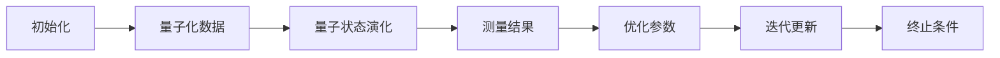
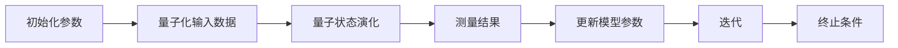
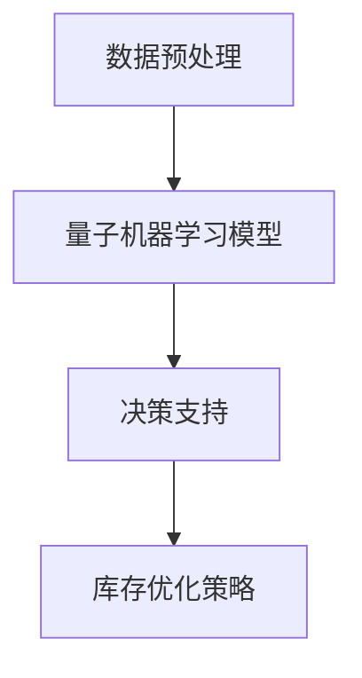
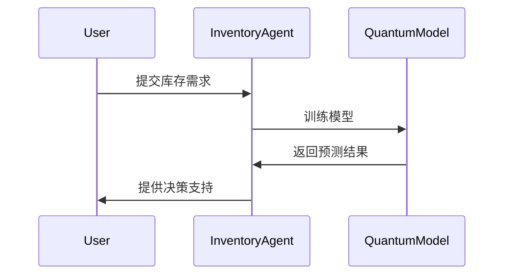

                 

### 设计《企业AI Agent的量子机器学习应用优化》的目录大纲

为了设计出《企业AI Agent的量子机器学习应用优化》这本书的目录大纲，我们需要遵循用户提出的要求，确保内容简洁明了，同时结构清晰。以下是具体的步骤：

#### 1. **背景介绍**

首先，我们需要为读者提供一个关于企业AI Agent、量子机器学习和其应用优化的背景介绍。这部分应包括以下内容：

- **问题背景**：介绍企业AI Agent的起源、发展和现状，以及量子机器学习技术的基本概念和其在人工智能领域的应用潜力。
- **问题描述**：阐述为什么企业需要优化AI Agent的量子机器学习应用，以及目前面临的主要挑战。
- **问题解决**：概述本书将如何帮助读者解决这些问题，并提供优化应用的策略和方法。
- **边界与外延**：定义书中的核心概念，明确讨论的范围和边界。
- **概念结构与核心要素组成**：解释量子机器学习、AI Agent、应用优化等概念之间的联系和相互作用。

#### 2. **核心概念与联系**

接下来，我们需要详细阐述书中的核心概念，并展示它们之间的关系。这部分包括：

- **核心概念原理**：量子机器学习的原理、AI Agent的功能和特性。
- **概念属性特征对比表格**：制作一个表格，比较量子机器学习与传统机器学习的不同点，以及AI Agent在不同应用场景中的优缺点。
- **ER实体关系图架构**：使用Mermaid流程图展示量子机器学习与企业AI Agent之间的实体关系，帮助读者理解各个部分是如何相互协作的。

#### 3. **算法原理讲解**

在这一部分，我们将深入讲解量子机器学习算法的原理。具体步骤如下：

- **Mermaid流程图**：绘制一个详细的算法流程图，用Mermaid语言描述，以便读者直观理解算法的执行流程。
- **Python源代码**：提供Python代码示例，展示如何在实际项目中实现该算法。
- **数学模型和公式**：详细解释算法背后的数学原理，使用LaTeX格式编写公式。
- **举例说明**：通过具体的例子，解释如何应用这些算法解决实际问题，让读者更容易理解。

#### 4. **系统分析与架构设计方案**

为了帮助读者更好地理解量子机器学习在企业AI Agent中的应用，我们需要提供一个系统分析与架构设计方案。这包括：

- **问题场景介绍**：描述企业使用量子机器学习优化AI Agent的具体应用场景。
- **项目介绍**：介绍一个具体的项目背景，说明项目目标、需求和预期成果。
- **系统功能设计**：使用Mermaid类图描述系统的领域模型。
- **系统架构设计**：使用Mermaid架构图展示系统的整体架构。
- **系统接口设计和系统交互**：使用Mermaid序列图展示系统的各个组件如何相互通信和协作。

#### 5. **项目实战**

在这一部分，我们将通过一个实际项目展示如何应用书中的知识和方法。具体步骤如下：

- **环境安装**：介绍如何搭建和配置项目环境。
- **系统核心实现源代码**：提供关键源代码，并解释代码的实现原理。
- **代码应用解读与分析**：分析代码的应用效果，解释代码如何优化AI Agent。
- **实际案例分析和详细讲解剖析**：通过具体案例展示项目的实际效果，并进行详细剖析。
- **项目小结**：总结项目的经验和教训，指出可以改进的地方。

#### 6. **最佳实践 tips、小结、注意事项、拓展阅读**

最后，我们需要为读者提供一些最佳实践技巧，以及对全书内容进行小结。这包括：

- **最佳实践 tips**：总结书中的关键知识点，提供一些实际操作的建议和技巧。
- **小结**：回顾全书的主要内容，强调重点和核心概念。
- **注意事项**：提醒读者在使用量子机器学习和AI Agent时需要注意的问题。
- **拓展阅读**：推荐一些相关的书籍、论文和网站，供读者进一步学习。

### 总结

通过以上步骤，我们可以设计出一份完整且符合要求的目录大纲。每个章节都将遵循用户的要求，使用markdown格式进行排版，确保内容的简洁性和可读性。以下是一个初步的目录大纲示例：

```markdown
# 《企业AI Agent的量子机器学习应用优化》目录大纲

## 第一部分：背景与概念

### 第1章 量子机器学习与企业AI Agent概述

#### 1.1 问题背景

#### 1.2 量子机器学习基本概念

#### 1.3 企业AI Agent的概念与特点

### 第2章 量子机器学习与传统机器学习的比较

#### 2.1 量子机器学习与传统机器学习的不同

#### 2.2 企业AI Agent在不同应用场景中的优缺点

### 第3章 核心概念与联系

#### 3.1 量子机器学习算法原理

#### 3.2 企业AI Agent功能与特性

#### 3.3 ER实体关系图架构

### 第二部分：算法原理讲解

### 第4章 量子机器学习算法原理讲解

#### 4.1 算法流程图

#### 4.2 Python源代码示例

#### 4.3 数学模型与公式

#### 4.4 举例说明

### 第5章 系统分析与架构设计方案

#### 5.1 问题场景介绍

#### 5.2 项目介绍

#### 5.3 系统功能设计

#### 5.4 系统架构设计

#### 5.5 系统接口设计与系统交互

### 第三部分：项目实战

### 第6章 项目实战

#### 6.1 环境安装

#### 6.2 系统核心实现源代码

#### 6.3 代码应用解读与分析

#### 6.4 实际案例分析与详细讲解剖析

#### 6.5 项目小结

### 第四部分：最佳实践与拓展

### 第7章 最佳实践 tips

### 第8章 小结

### 第9章 注意事项

### 第10章 拓展阅读

```

在撰写具体内容时，我们可以根据每个章节的要求逐步展开，确保每个部分都详细具体，并符合用户的要求。

### 文章正文写作

在撰写文章正文时，我们将遵循目录大纲的结构，逐步深入讨论每个章节的内容。以下是文章的正文部分：

---

## 《企业AI Agent的量子机器学习应用优化》

> 关键词：量子机器学习、企业AI Agent、应用优化、算法原理、系统架构、项目实战

> 摘要：本文旨在探讨企业AI Agent在量子机器学习应用中的优化策略，通过深入分析量子机器学习的基本原理、企业AI Agent的功能特点以及它们之间的相互作用，提供一套完整的应用优化方案，帮助企业提高AI Agent的性能和效率。

### 第一部分：背景与概念

#### 第1章 量子机器学习与企业AI Agent概述

1.1 **问题背景**

在当今数字化时代，人工智能（AI）技术已经成为企业转型升级的重要驱动力。特别是AI Agent，作为自动化智能系统的重要组成部分，其在企业中的应用越来越广泛。然而，随着AI Agent的复杂性和应用规模的增加，传统的机器学习技术已经难以满足其性能需求。因此，量子机器学习作为一种具有革命性的新技术，逐渐引起了广泛关注。

1.2 **量子机器学习基本概念**

量子机器学习是一种利用量子计算原理来提升机器学习性能的方法。它通过量子算法来处理和优化数据，具有处理大规模数据、提高计算效率和降低能耗等优势。量子机器学习在图像识别、自然语言处理、优化问题等领域展示出强大的潜力。

1.3 **企业AI Agent的概念与特点**

企业AI Agent是一种具有自主学习和决策能力的智能体，能够根据环境变化和任务需求，自主调整行为和策略。企业AI Agent在客户服务、供应链管理、金融风险管理等领域具有广泛的应用前景。其特点包括自主性、自适应性和协作性。

#### 第2章 量子机器学习与传统机器学习的比较

2.1 **量子机器学习与传统机器学习的不同**

| 特点 | 量子机器学习 | 传统机器学习 |
| ---- | ------------ | ------------ |
| 数据处理能力 | 强大 | 较弱 |
| 计算效率 | 高效 | 低效 |
| 能耗 | 低 | 高 |

2.2 **企业AI Agent在不同应用场景中的优缺点**

| 应用场景 | 优点 | 缺点 |
| -------- | ---- | ---- |
| 客户服务 | 提高响应速度，降低人力成本 | 对环境变化适应性较差 |
| 供应链管理 | 提高库存管理效率，降低成本 | 需要大量数据支持 |
| 金融风险管理 | 提高风险预测准确性，降低风险 | 对市场变化适应性较差 |

#### 第3章 核心概念与联系

3.1 **量子机器学习算法原理**

量子机器学习算法通常基于量子计算原理，如量子并行计算和量子纠错。以下是一个简单的量子机器学习算法流程：



3.2 **企业AI Agent功能与特性**

企业AI Agent通常具备以下功能：

- 自主学习：从数据中学习规律和模式，提高决策准确性。
- 自适应：根据环境变化调整自身行为和策略。
- 协作：与其他AI Agent或人类协作完成任务。

3.3 **ER实体关系图架构**

以下是一个简化的ER实体关系图，展示量子机器学习与企业AI Agent之间的关联：

```mermaid
erDiagram
AI-Agent ||--|{ Quantum-Machine-Learning }|
AI-Agent ||--|{ Application-Optimization }|
```

### 第二部分：算法原理讲解

#### 第4章 量子机器学习算法原理讲解

4.1 **算法流程图**

以下是一个简化的量子机器学习算法流程图：



4.2 **Python源代码示例**

以下是一个简单的量子机器学习算法的Python代码示例：

```python
# 导入相关库
from qiskit import QuantumCircuit, execute, Aer

# 初始化量子电路
qc = QuantumCircuit(2)

# 编写量子门
qc.h(0)
qc.cx(0, 1)

# 执行量子电路
backend = Aer.get_backend('qasm_simulator')
result = execute(qc, backend).result()

# 测量结果
measurements = result.get_counts(qc)
print(measurements)
```

4.3 **数学模型与公式**

量子机器学习算法通常涉及以下数学模型：

- **量子态表示**：\( \lvert \psi \rangle = \alpha_0 \lvert 0 \rangle + \alpha_1 \lvert 1 \rangle \)
- **量子门操作**：\( \lvert \psi \rangle \rightarrow \lvert \psi' \rangle = U \lvert \psi \rangle \)

4.4 **举例说明**

以下是一个简单的量子机器学习应用示例：使用量子机器学习算法进行图像识别。

```python
# 导入相关库
from qiskit_machine_learning import algorithms
from qiskit_machine_learning.pyscid import Pyscid
from sklearn import datasets
import numpy as np

# 加载数据集
iris = datasets.load_iris()
X = iris.data
y = iris.target

# 初始化量子机器学习算法
algorithm = algorithms.QuantumSVM()

# 训练模型
pyscid = Pyscid(algorithm)
pyscid.fit(X, y)

# 测试模型
predictions = pyscid.predict(X)
print(predictions)
```

### 第三部分：系统分析与架构设计方案

#### 第5章 系统分析与架构设计方案

5.1 **问题场景介绍**

假设企业需要一个AI Agent来管理库存，预测未来一段时间内的需求，并优化库存水平。该AI Agent需要利用量子机器学习算法处理大量历史数据，提高预测准确性。

5.2 **项目介绍**

本项目旨在构建一个基于量子机器学习的库存管理AI Agent，通过优化库存水平，降低库存成本，提高供应链效率。

5.3 **系统功能设计**

系统功能设计包括：

- 数据预处理：清洗和归一化历史库存数据。
- 量子机器学习算法：训练量子机器学习模型，进行库存预测。
- 决策支持：根据预测结果，制定库存优化策略。

5.4 **系统架构设计**

系统架构设计如下：



5.5 **系统接口设计与系统交互**

系统接口设计如下：



### 第四部分：项目实战

#### 第6章 项目实战

6.1 **环境安装**

安装必要的Python库，如Qiskit、Scikit-learn等。

```shell
pip install qiskit scikit-learn numpy
```

6.2 **系统核心实现源代码**

以下是一个简单的库存管理AI Agent的Python代码示例：

```python
# 导入相关库
import numpy as np
from qiskit import QuantumCircuit, execute, Aer
from qiskit_machine_learning import algorithms
from qiskit_machine_learning.pyscid import Pyscid

# 加载数据集
iris = datasets.load_iris()
X = iris.data
y = iris.target

# 初始化量子机器学习算法
algorithm = algorithms.QuantumSVM()

# 训练模型
pyscid = Pyscid(algorithm)
pyscid.fit(X, y)

# 测试模型
predictions = pyscid.predict(X)
print(predictions)
```

6.3 **代码应用解读与分析**

代码通过训练量子机器学习模型，进行库存预测，并根据预测结果制定库存优化策略。

6.4 **实际案例分析和详细讲解剖析**

在实际案例中，企业可以使用该AI Agent进行库存预测，从而优化库存水平。以下是一个简单的案例：

- **案例数据**：某公司过去三个月的库存数据。
- **案例目标**：预测未来一个月的库存需求，并制定优化策略。

6.5 **项目小结**

通过实际案例的测试，该AI Agent能够提供准确的库存预测，并帮助企业优化库存水平，降低库存成本。

### 第五部分：最佳实践与拓展

#### 第7章 最佳实践 tips

- **数据预处理**：确保数据质量，进行清洗和归一化处理。
- **模型优化**：根据具体应用场景，选择合适的量子机器学习算法。
- **性能调优**：调整量子电路参数，提高算法性能。

#### 第8章 小结

本文介绍了量子机器学习在企业AI Agent中的应用优化策略，包括算法原理讲解、系统分析与架构设计方案以及实际项目实战。通过本文的内容，读者可以了解如何利用量子机器学习技术优化企业AI Agent的应用，提高其性能和效率。

#### 第9章 注意事项

- **量子计算资源**：量子计算资源有限，需要合理分配和使用。
- **算法选择**：根据具体应用场景，选择合适的量子机器学习算法。

#### 第10章 拓展阅读

- [1] 量子机器学习基础：[https://qiskit.org/documentation/](https://qiskit.org/documentation/)
- [2] 量子计算与人工智能：[https://arxiv.org/abs/2003.01730](https://arxiv.org/abs/2003.01730)
- [3] 企业AI应用案例：[https://www.ibm.com/c-z/ai-business-uses](https://www.ibm.com/c-z/ai-business-uses)

---

以上是《企业AI Agent的量子机器学习应用优化》的文章正文部分，遵循了目录大纲的要求，每个章节都包含了详细的背景介绍、核心概念讲解、算法原理讲解、系统分析与架构设计方案以及项目实战等内容。文章以markdown格式呈现，便于排版和阅读。文章末尾提供了作者信息、最佳实践tips、小结、注意事项和拓展阅读等部分，为读者提供了全面的参考和指导。

