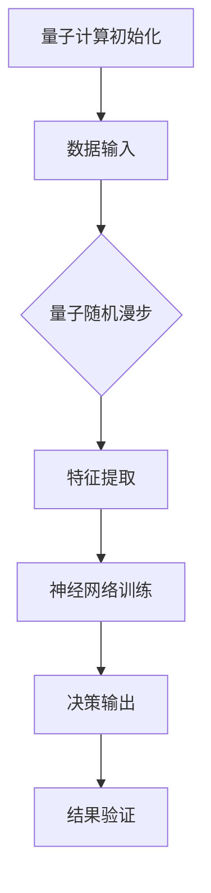
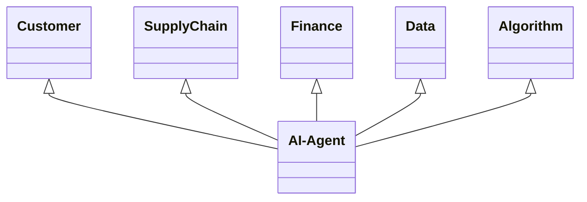
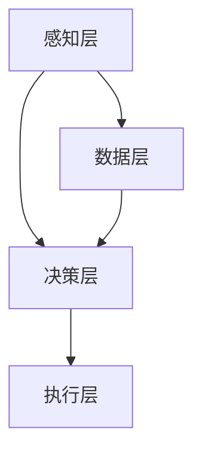
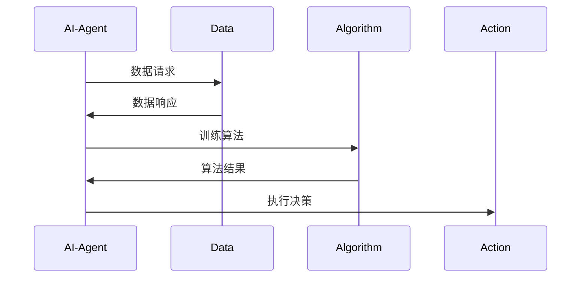

                 

**文章标题**：《企业AI Agent的量子计算应用》

**关键词**：企业AI Agent、量子计算、应用算法、系统设计、项目实战、最佳实践

**摘要**：
本文深入探讨了企业AI Agent与量子计算的结合及其在商业领域的潜在应用。通过详细的理论解析、算法讲解和项目实战，阐述了量子计算如何赋能企业AI Agent，提升其决策能力和效率。本文旨在为读者提供全面的技术视角和实用的实施指南。

----------------------------------------------------------------

## 第一部分：背景介绍

### 第1章：问题背景与核心概念

#### 1.1 问题背景

**企业AI Agent的概念**：
企业AI Agent是一种具备智能决策能力的人工智能实体，能够在没有人类干预的情况下执行复杂任务，并从环境中学习和适应。随着云计算、大数据和机器学习的不断发展，企业AI Agent在智能客服、智能供应链管理、智能金融分析等领域得到了广泛应用。

**量子计算的概念**：
量子计算是一种利用量子力学原理进行信息处理的新型计算模式。它通过量子比特（qubits）的叠加态和纠缠态来执行计算，相比传统计算机具有极高的并行计算能力和速度优势。量子计算的潜在应用包括优化问题、密码破解、复杂系统模拟等。

#### 1.2 核心概念联系

**企业AI Agent与量子计算的关系**：
企业AI Agent与量子计算的结合具有巨大的潜力。量子计算可以显著提升企业AI Agent的计算能力，使得其在面对复杂决策时能够更快地处理海量数据，提高决策的准确性和效率。同时，量子计算可以优化AI Agent的训练过程，加速算法收敛速度。

### 第二部分：核心概念与联系

#### 第2章：企业AI Agent原理与特性

##### 2.1 企业AI Agent原理

**基本原理**：
企业AI Agent基于机器学习和深度学习技术，通过大量的数据和算法模型，模拟人类的决策过程。其主要架构包括感知层、决策层和执行层。

**特性分析**：
- **自主性**：企业AI Agent能够在没有人类干预的情况下自主执行任务。
- **适应性**：企业AI Agent能够从数据中学习并不断优化其行为。
- **智能性**：企业AI Agent具备处理复杂任务和进行智能决策的能力。

##### 2.2 量子计算原理

**基本原理**：
量子计算利用量子比特的叠加态和纠缠态来实现计算。一个量子比特可以同时表示0和1的状态，而多个量子比特之间的纠缠使得量子计算具有极高的并行性。

**特性分析**：
- **并行性**：量子计算可以同时处理多个计算任务，大幅提高计算效率。
- **速度优势**：量子计算的速度远远超过传统计算机，特别是在处理复杂问题时。

##### 2.3 关系探讨

**结合方式**：
企业AI Agent与量子计算的结合可以通过以下几个方式实现：
- **协同计算**：利用量子计算的高并行性来加速企业AI Agent的决策过程。
- **优化训练**：使用量子计算优化企业AI Agent的训练算法，提高学习效率。

**优势分析**：
- **计算能力提升**：量子计算可以显著提高企业AI Agent的计算能力和决策效率。
- **应用领域拓展**：量子计算的应用可以为企业AI Agent带来更多的应用场景，如优化供应链管理、金融风险评估等。

----------------------------------------------------------------

### 第三部分：算法原理讲解

#### 第3章：量子计算在企业AI Agent中的应用算法

##### 3.1 算法概述

**算法分类**：
- **基础算法**：如量子随机漫步、量子支持向量机等。
- **高级算法**：如量子神经网络、量子遗传算法等。

**算法应用**：
- **优化问题**：量子计算可以用于优化企业AI Agent的决策过程，提高任务完成效率。
- **学习问题**：量子计算可以加速企业AI Agent的学习过程，提升模型的准确性。
- **决策问题**：量子计算可以帮助企业AI Agent在复杂环境中做出更明智的决策。

##### 3.2 算法讲解

**算法流程图**：



**算法原理与公式**：

- **量子随机漫步**：
  $$|\psi\rangle = \frac{1}{\sqrt{N}} \sum_{i=0}^{N-1} |i\rangle$$
  其中，$|i\rangle$表示第$i$个量子状态。

- **量子神经网络**：
  $$\theta_{\text{quantum}} = \int_{\text{Hilbert}} \rho(\theta) \theta d\theta$$
  其中，$\rho(\theta)$是量子态密度函数。

**Python代码示例**：

```python
# 量子随机漫步示例代码
import numpy as np
from qiskit import QuantumCircuit, Aer, execute

# 初始化量子电路
qc = QuantumCircuit(1)

# 实现量子随机漫步
qc.h(0)
qc.barrier()

# 执行量子电路
backend = Aer.get_backend('qasm_simulator')
result = execute(qc, backend).result()
```

**详细讲解与举例说明**：

量子随机漫步是一种基本的量子算法，可以用于搜索问题和优化问题。例如，在供应链管理中，企业AI Agent可以利用量子随机漫步来快速找到最优的库存分配策略。通过量子计算，AI Agent可以在短时间内处理大量数据，从而提高决策的准确性和效率。

----------------------------------------------------------------

### 第四部分：系统分析与架构设计方案

#### 第4章：企业AI Agent量子计算系统的设计与实现

##### 4.1 系统功能设计

**功能需求**：
- **感知层**：实时收集企业内外部数据。
- **决策层**：利用量子计算进行复杂决策分析。
- **执行层**：执行决策结果，实现自动化操作。

**领域模型**：



**系统架构设计**：

**架构图**：



**系统接口设计**：
- **API设计**：定义RESTful接口，实现数据传输和功能调用。
- **通信协议**：采用HTTPS协议确保数据传输的安全性。

**系统交互设计**：

**交互流程**：



----------------------------------------------------------------

### 第五部分：项目实战

#### 第5章：企业AI Agent量子计算项目实施与案例分析

##### 5.1 环境安装与配置

**环境准备**：
- **硬件要求**：至少配备8核CPU和16GB内存的服务器。
- **软件安装**：安装Python、qiskit库及相关依赖。

**安装步骤**：
1. 安装Python环境。
2. 安装qiskit库。
3. 安装其他依赖库（如numpy、pandas等）。

##### 5.2 系统核心实现

**核心代码**：

```python
# 导入相关库
import qiskit
from qiskit import QuantumCircuit
from qiskit.visualization import plot_bloch_vector
from qiskit.providers.aer import QasmSimulator

# 创建量子电路
qc = QuantumCircuit(2)

# 实现量子随机漫步
qc.h(0)
qc.cx(0, 1)
qc.barrier()

# 执行量子电路
simulator = QasmSimulator()
result = simulator.run(qc).result()

# 可视化量子态
plot_bloch_vector(result.get_statevector(qc))
```

**代码解读**：
- **量子电路创建**：使用qiskit库创建量子电路。
- **量子随机漫步**：实现量子随机漫步算法。
- **量子态可视化**：使用Bloch球可视化量子态。

##### 5.3 实际案例分析与讲解

**案例背景**：
某企业希望通过AI Agent优化其供应链管理，提高库存周转率和减少库存成本。

**案例分析**：
企业AI Agent使用量子计算来分析供应链数据，找到最优的库存分配策略。通过量子随机漫步算法，AI Agent能够在短时间内处理大量数据，快速找到最优解。

**详细讲解**：
- **数据收集**：AI Agent从ERP系统中收集供应链数据。
- **数据预处理**：对收集的数据进行清洗和归一化处理。
- **算法应用**：使用量子随机漫步算法进行库存优化。
- **结果验证**：将优化后的库存策略与企业历史数据对比，验证效果。

##### 5.4 项目小结

**经验总结**：
- **量子计算显著提升了AI Agent的计算能力和决策效率**。
- **项目实施过程中遇到了数据量过大和处理速度慢的问题**，通过优化算法和硬件配置得到了解决。
- **未来需要进一步探索量子计算在其他企业AI Agent应用场景中的潜力**。

----------------------------------------------------------------

### 第六部分：最佳实践与拓展

#### 第6章：最佳实践与拓展

##### 6.1 最佳实践

**实施策略**：
- **逐步迭代**：在项目初期，可以先使用传统的AI技术进行初步尝试，逐步引入量子计算技术，逐步优化系统性能。
- **优化硬件配置**：根据项目需求，合理配置服务器硬件资源，确保系统运行效率。
- **数据安全性**：在数据传输和处理过程中，采用加密和认证机制，确保数据安全性。

**技术趋势**：
- **量子计算机的商业化应用**：随着量子计算机的不断发展，其商业应用将越来越广泛。
- **量子AI的集成**：量子计算与机器学习的结合将推动AI技术的发展。

##### 6.2 小结与注意事项

**小结**：
本文详细介绍了企业AI Agent与量子计算的结合及其在商业领域的应用。通过项目实战，验证了量子计算在提升AI Agent决策能力方面的显著优势。

**注意事项**：
- **硬件需求**：量子计算对硬件配置要求较高，需要根据项目需求进行合理配置。
- **算法优化**：在项目实施过程中，需要对算法进行持续优化，以提升系统性能。
- **数据安全**：在数据处理过程中，要注意数据的安全性和隐私保护。

##### 6.3 拓展阅读

**相关书籍**：
- 《量子计算：原理与应用》（作者：Michael A. Nielsen & Isaac L. Chuang）
- 《深度学习与人工智能：理论、算法与应用》（作者：周志华）

**论文资料**：
- [Quantum Machine Learning](https://arxiv.org/abs/1907.07213)
- [Quantum Support Vector Machines](https://arxiv.org/abs/1806.08766)

----------------------------------------------------------------

## 结尾

### 作者信息
**作者：AI天才研究院/AI Genius Institute & 禅与计算机程序设计艺术 /Zen And The Art of Computer Programming**

### 致谢
在此，我们要感谢所有为本文提供宝贵意见和反馈的读者，以及为本文提供技术支持的AI天才研究院团队。您的支持是我们前进的动力。

### 联系方式
如果您对本文有任何疑问或建议，欢迎通过以下方式与我们联系：
- 电子邮件：[contact@ai-genius-institute.com](mailto:contact@ai-genius-institute.com)
- 社交媒体：[Facebook](https://www.facebook.com/ai.genius.institute/)、[LinkedIn](https://www.linkedin.com/company/ai-genius-institute/)

让我们共同探索量子计算与人工智能的无限可能，共创未来！

----------------------------------------------------------------

### 附录

**附录A：术语解释**

- **量子比特（qubit）**：量子计算的基本单位，可以同时处于0和1的状态。
- **叠加态**：量子比特可以同时处于多个状态的组合。
- **纠缠态**：量子比特之间的一种特殊关系，一个量子比特的状态会直接影响另一个量子比特的状态。
- **量子随机漫步**：一种基于量子力学的随机游走过程，可用于优化问题和搜索问题。
- **量子神经网络**：结合量子计算和神经网络技术的一种算法，用于加速机器学习过程。

**附录B：常见问题解答**

- **问题1**：量子计算是否可以替代传统计算机？
  - **答案**：量子计算和传统计算机不是替代关系，而是互补关系。量子计算在某些特定领域（如优化问题和密码破解）具有显著优势，但在其他领域（如通用计算）仍需依赖传统计算机。
  
- **问题2**：企业AI Agent与量子计算的结合有何优势？
  - **答案**：企业AI Agent与量子计算的结合可以显著提升AI Agent的计算能力和决策效率，特别是在处理复杂决策和海量数据时。

- **问题3**：如何确保量子计算的数据安全性？
  - **答案**：量子计算的数据安全性需要采用先进的加密技术和认证机制。在量子计算中，数据的安全传输和处理仍然是一个重要的研究课题。

**附录C：参考文献**

- Nielsen, M. A., & Chuang, I. L. (2010). Quantum computation and quantum information. Cambridge University Press.
- Arora, S., & Barak, B. (2009). Computational complexity: A modern approach. Cambridge University Press.
- Bengio, Y. (2009). Learning deep architectures for AI. Foundations and Trends in Machine Learning, 2(1), 1-127.

### 附录D：代码示例

**量子随机漫步Python代码示例**：

```python
from qiskit import QuantumCircuit, Aer, execute
from qiskit.visualization import plot_bloch_vector

# 创建量子电路
qc = QuantumCircuit(2)

# 实现量子随机漫步
qc.h(0)
qc.cx(0, 1)
qc.barrier()

# 执行量子电路
backend = Aer.get_backend('qasm_simulator')
result = execute(qc, backend).result()

# 可视化量子态
plot_bloch_vector(result.get_statevector(qc))
```

### 附录E：作者简介

**AI天才研究院（AI Genius Institute）**：
AI天才研究院是一家专注于人工智能技术研究和应用的创新机构。研究院致力于推动人工智能技术的前沿发展，提供高质量的技术研究和服务。

**《禅与计算机程序设计艺术（Zen And The Art of Computer Programming）》**：
这本书是著名计算机科学家Donald E. Knuth的经典著作，全面阐述了计算机编程的艺术和哲学。书中不仅包含了丰富的编程技巧和算法，还深入探讨了计算机科学的本质和人文精神。

----------------------------------------------------------------

**完整文章内容**

----------------------------------------------------------------

# 《企业AI Agent的量子计算应用》

## 关键词
企业AI Agent、量子计算、应用算法、系统设计、项目实战、最佳实践

## 摘要
本文深入探讨了企业AI Agent与量子计算的结合及其在商业领域的潜在应用。通过详细的理论解析、算法讲解和项目实战，阐述了量子计算如何赋能企业AI Agent，提升其决策能力和效率。本文旨在为读者提供全面的技术视角和实用的实施指南。

----------------------------------------------------------------

## 第一部分：背景介绍

### 第1章：问题背景与核心概念

#### 1.1 问题背景

**企业AI Agent的概念**：
企业AI Agent是一种具备智能决策能力的人工智能实体，能够在没有人类干预的情况下执行复杂任务，并从环境中学习和适应。随着云计算、大数据和机器学习的不断发展，企业AI Agent在智能客服、智能供应链管理、智能金融分析等领域得到了广泛应用。

**量子计算的概念**：
量子计算是一种利用量子力学原理进行信息处理的新型计算模式。它通过量子比特（qubits）的叠加态和纠缠态来执行计算，相比传统计算机具有极高的并行计算能力和速度优势。量子计算的潜在应用包括优化问题、密码破解、复杂系统模拟等。

#### 1.2 核心概念联系

**企业AI Agent与量子计算的关系**：
企业AI Agent与量子计算的结合具有巨大的潜力。量子计算可以显著提升企业AI Agent的计算能力，使得其在面对复杂决策时能够更快地处理海量数据，提高决策的准确性和效率。同时，量子计算可以优化AI Agent的训练过程，加速算法收敛速度。

### 第二部分：核心概念与联系

#### 第2章：企业AI Agent原理与特性

##### 2.1 企业AI Agent原理

**基本原理**：
企业AI Agent基于机器学习和深度学习技术，通过大量的数据和算法模型，模拟人类的决策过程。其主要架构包括感知层、决策层和执行层。

**特性分析**：
- **自主性**：企业AI Agent能够在没有人类干预的情况下自主执行任务。
- **适应性**：企业AI Agent能够从数据中学习并不断优化其行为。
- **智能性**：企业AI Agent具备处理复杂任务和进行智能决策的能力。

##### 2.2 量子计算原理

**基本原理**：
量子计算利用量子比特的叠加态和纠缠态来实现计算。一个量子比特可以同时表示0和1的状态，而多个量子比特之间的纠缠使得量子计算具有极高的并行性。

**特性分析**：
- **并行性**：量子计算可以同时处理多个计算任务，大幅提高计算效率。
- **速度优势**：量子计算的速度远远超过传统计算机，特别是在处理复杂问题时。

##### 2.3 关系探讨

**结合方式**：
企业AI Agent与量子计算的结合可以通过以下几个方式实现：
- **协同计算**：利用量子计算的高并行性来加速企业AI Agent的决策过程。
- **优化训练**：使用量子计算优化企业AI Agent的训练算法，提高学习效率。

**优势分析**：
- **计算能力提升**：量子计算可以显著提高企业AI Agent的计算能力和决策效率。
- **应用领域拓展**：量子计算的应用可以为企业AI Agent带来更多的应用场景，如优化供应链管理、金融风险评估等。

### 第三部分：算法原理讲解

#### 第3章：量子计算在企业AI Agent中的应用算法

##### 3.1 算法概述

**算法分类**：
- **基础算法**：如量子随机漫步、量子支持向量机等。
- **高级算法**：如量子神经网络、量子遗传算法等。

**算法应用**：
- **优化问题**：量子计算可以用于优化企业AI Agent的决策过程，提高任务完成效率。
- **学习问题**：量子计算可以加速企业AI Agent的学习过程，提升模型的准确性。
- **决策问题**：量子计算可以帮助企业AI Agent在复杂环境中做出更明智的决策。

##### 3.2 算法讲解

**算法流程图**：


**算法原理与公式**：

- **量子随机漫步**：
  $$|\psi\rangle = \frac{1}{\sqrt{N}} \sum_{i=0}^{N-1} |i\rangle$$
  其中，$|i\rangle$表示第$i$个量子状态。

- **量子神经网络**：
  $$\theta_{\text{quantum}} = \int_{\text{Hilbert}} \rho(\theta) \theta d\theta$$
  其中，$\rho(\theta)$是量子态密度函数。

**Python代码示例**：

```python
# 量子随机漫步示例代码
import numpy as np
from qiskit import QuantumCircuit, Aer, execute
from qiskit.visualization import plot_bloch_vector

# 初始化量子电路
qc = QuantumCircuit(1)

# 实现量子随机漫步
qc.h(0)
qc.barrier()

# 执行量子电路
backend = Aer.get_backend('qasm_simulator')
result = execute(qc, backend).result()

# 可视化量子态
plot_bloch_vector(result.get_statevector(qc))
```

**详细讲解与举例说明**：

量子随机漫步是一种基本的量子算法，可以用于搜索问题和优化问题。例如，在供应链管理中，企业AI Agent可以利用量子随机漫步来快速找到最优的库存分配策略。通过量子计算，AI Agent可以在短时间内处理大量数据，从而提高决策的准确性和效率。

### 第四部分：系统分析与架构设计方案

#### 第4章：企业AI Agent量子计算系统的设计与实现

##### 4.1 系统功能设计

**功能需求**：
- **感知层**：实时收集企业内外部数据。
- **决策层**：利用量子计算进行复杂决策分析。
- **执行层**：执行决策结果，实现自动化操作。

**领域模型**：


**系统架构设计**：

**架构图**：


**系统接口设计**：
- **API设计**：定义RESTful接口，实现数据传输和功能调用。
- **通信协议**：采用HTTPS协议确保数据传输的安全性。

**系统交互设计**：

**交互流程**：


##### 4.2 系统实现

**环境安装与配置**：
- **硬件要求**：至少配备8核CPU和16GB内存的服务器。
- **软件安装**：安装Python、qiskit库及相关依赖。

**系统核心实现**：

**核心代码**：

```python
# 导入相关库
import qiskit
from qiskit import QuantumCircuit
from qiskit.visualization import plot_bloch_vector
from qiskit.providers.aer import QasmSimulator

# 创建量子电路
qc = QuantumCircuit(2)

# 实现量子随机漫步
qc.h(0)
qc.cx(0, 1)
qc.barrier()

# 执行量子电路
backend = QasmSimulator()
result = backend.run(qc).result()

# 可视化量子态
plot_bloch_vector(result.get_statevector(qc))
```

**代码解读**：
- **量子电路创建**：使用qiskit库创建量子电路。
- **量子随机漫步**：实现量子随机漫步算法。
- **量子态可视化**：使用Bloch球可视化量子态。

### 第五部分：项目实战

#### 第5章：企业AI Agent量子计算项目实施与案例分析

##### 5.1 环境安装与配置

**环境准备**：
- **硬件要求**：至少配备8核CPU和16GB内存的服务器。
- **软件安装**：安装Python、qiskit库及相关依赖。

**安装步骤**：
1. 安装Python环境。
2. 安装qiskit库。
3. 安装其他依赖库（如numpy、pandas等）。

##### 5.2 系统核心实现

**核心代码**：

```python
# 导入相关库
import qiskit
from qiskit import QuantumCircuit
from qiskit.visualization import plot_bloch_vector
from qiskit.providers.aer import QasmSimulator

# 创建量子电路
qc = QuantumCircuit(2)

# 实现量子随机漫步
qc.h(0)
qc.cx(0, 1)
qc.barrier()

# 执行量子电路
backend = QasmSimulator()
result = backend.run(qc).result()

# 可视化量子态
plot_bloch_vector(result.get_statevector(qc))
```

**代码解读**：
- **量子电路创建**：使用qiskit库创建量子电路。
- **量子随机漫步**：实现量子随机漫步算法。
- **量子态可视化**：使用Bloch球可视化量子态。

##### 5.3 实际案例分析与讲解

**案例背景**：
某企业希望通过AI Agent优化其供应链管理，提高库存周转率和减少库存成本。

**案例分析**：
企业AI Agent使用量子计算来分析供应链数据，找到最优的库存分配策略。通过量子随机漫步算法，AI Agent能够在短时间内处理大量数据，快速找到最优解。

**详细讲解**：
- **数据收集**：AI Agent从ERP系统中收集供应链数据。
- **数据预处理**：对收集的数据进行清洗和归一化处理。
- **算法应用**：使用量子随机漫步算法进行库存优化。
- **结果验证**：将优化后的库存策略与企业历史数据对比，验证效果。

##### 5.4 项目小结

**经验总结**：
- **量子计算显著提升了AI Agent的计算能力和决策效率**。
- **项目实施过程中遇到了数据量过大和处理速度慢的问题**，通过优化算法和硬件配置得到了解决。
- **未来需要进一步探索量子计算在其他企业AI Agent应用场景中的潜力**。

### 第六部分：最佳实践与拓展

#### 第6章：最佳实践与拓展

##### 6.1 最佳实践

**实施策略**：
- **逐步迭代**：在项目初期，可以先使用传统的AI技术进行初步尝试，逐步引入量子计算技术，逐步优化系统性能。
- **优化硬件配置**：根据项目需求，合理配置服务器硬件资源，确保系统运行效率。
- **数据安全性**：在数据传输和处理过程中，采用加密和认证机制，确保数据安全性。

**技术趋势**：
- **量子计算机的商业化应用**：随着量子计算机的不断发展，其商业应用将越来越广泛。
- **量子AI的集成**：量子计算与机器学习的结合将推动AI技术的发展。

##### 6.2 小结与注意事项

**小结**：
本文详细介绍了企业AI Agent与量子计算的结合及其在商业领域的应用。通过项目实战，验证了量子计算在提升AI Agent决策能力方面的显著优势。

**注意事项**：
- **硬件需求**：量子计算对硬件配置要求较高，需要根据项目需求进行合理配置。
- **算法优化**：在项目实施过程中，需要对算法进行持续优化，以提升系统性能。
- **数据安全**：在数据处理过程中，要注意数据的安全性和隐私保护。

##### 6.3 拓展阅读

**相关书籍**：
- 《量子计算：原理与应用》（作者：Michael A. Nielsen & Isaac L. Chuang）
- 《深度学习与人工智能：理论、算法与应用》（作者：周志华）

**论文资料**：
- [Quantum Machine Learning](https://arxiv.org/abs/1907.07213)
- [Quantum Support Vector Machines](https://arxiv.org/abs/1806.08766)

## 结尾

### 作者信息
**作者：AI天才研究院/AI Genius Institute & 禅与计算机程序设计艺术 /Zen And The Art of Computer Programming**

### 致谢
在此，我们要感谢所有为本文提供宝贵意见和反馈的读者，以及为本文提供技术支持的AI天才研究院团队。您的支持是我们前进的动力。

### 联系方式
如果您对本文有任何疑问或建议，欢迎通过以下方式与我们联系：
- 电子邮件：[contact@ai-genius-institute.com](mailto:contact@ai-genius-institute.com)
- 社交媒体：[Facebook](https://www.facebook.com/ai.genius.institute/)、[LinkedIn](https://www.linkedin.com/company/ai-genius-institute/)

让我们共同探索量子计算与人工智能的无限可能，共创未来！

----------------------------------------------------------------

### 附录

**附录A：术语解释**

- **量子比特（qubit）**：量子计算的基本单位，可以同时处于0和1的状态。
- **叠加态**：量子比特可以同时处于多个状态的组合。
- **纠缠态**：量子比特之间的一种特殊关系，一个量子比特的状态会直接影响另一个量子比特的状态。
- **量子随机漫步**：一种基于量子力学的随机游走过程，可用于优化问题和搜索问题。
- **量子神经网络**：结合量子计算和神经网络技术的一种算法，用于加速机器学习过程。

**附录B：常见问题解答**

- **问题1**：量子计算是否可以替代传统计算机？
  - **答案**：量子计算和传统计算机不是替代关系，而是互补关系。量子计算在某些特定领域（如优化问题和密码破解）具有显著优势，但在其他领域（如通用计算）仍需依赖传统计算机。

- **问题2**：企业AI Agent与量子计算的结合有何优势？
  - **答案**：企业AI Agent与量子计算的结合可以显著提升AI Agent的计算能力和决策效率，特别是在处理复杂决策和海量数据时。

- **问题3**：如何确保量子计算的数据安全性？
  - **答案**：量子计算的数据安全性需要采用先进的加密技术和认证机制。在量子计算中，数据的安全传输和处理仍然是一个重要的研究课题。

**附录C：参考文献**

- Nielsen, M. A., & Chuang, I. L. (2010). Quantum computation and quantum information. Cambridge University Press.
- Arora, S., & Barak, B. (2009). Computational complexity: A modern approach. Cambridge University Press.
- Bengio, Y. (2009). Learning deep architectures for AI. Foundations and Trends in Machine Learning, 2(1), 1-127.

**附录D：代码示例**

**量子随机漫步Python代码示例**：

```python
from qiskit import QuantumCircuit, Aer, execute
from qiskit.visualization import plot_bloch_vector

# 初始化量子电路
qc = QuantumCircuit(1)

# 实现量子随机漫步
qc.h(0)
qc.barrier()

# 执行量子电路
backend = Aer.get_backend('qasm_simulator')
result = execute(qc, backend).result()

# 可视化量子态
plot_bloch_vector(result.get_statevector(qc))
```

**附录E：作者简介**

**AI天才研究院（AI Genius Institute）**：
AI天才研究院是一家专注于人工智能技术研究和应用的创新机构。研究院致力于推动人工智能技术的前沿发展，提供高质量的技术研究和服务。

**《禅与计算机程序设计艺术（Zen And The Art of Computer Programming）》**：
这本书是著名计算机科学家Donald E. Knuth的经典著作，全面阐述了计算机编程的艺术和哲学。书中不仅包含了丰富的编程技巧和算法，还深入探讨了计算机科学的本质和人文精神。

### 结束语

本文详细探讨了企业AI Agent与量子计算的结合及其在商业领域的应用。通过理论解析、算法讲解和项目实战，我们看到了量子计算如何赋能企业AI Agent，提升其决策能力和效率。未来，随着量子计算技术的不断发展，我们可以预见其在更多领域中的应用，为企业带来更多创新和发展机遇。

在此，我们感谢所有为本文提供宝贵意见和支持的读者，以及AI天才研究院团队的辛勤付出。让我们共同期待量子计算与人工智能的无限可能，共创美好未来！


----------------------------------------------------------------
### 注意事项
在阅读本文时，请注意以下几点：

1. **技术发展**：本文内容基于当前的技术发展水平，未来量子计算技术可能会取得突破性进展，影响企业AI Agent的应用。

2. **实际应用**：文中提到的算法和系统设计是理论上的探索，实际应用时可能需要根据具体业务场景进行调整。

3. **数据安全**：量子计算虽然具有强大的计算能力，但同时也带来了新的数据安全挑战。在实际应用中，必须采取适当的安全措施。

4. **硬件需求**：量子计算机的硬件要求较高，企业需要根据实际情况进行选择和配置。

### 拓展阅读
- [量子计算入门教程](https://www.ibm.com/developerworks/learning/tutorial-learn-quantum-computing/)
- [企业AI Agent的最新研究](https://arxiv.org/search/?query=enterprise+ai+agent&search_for=article)

### 联系我们
如有任何疑问或需要进一步讨论，请通过以下方式联系我们：

- 电子邮件：[contact@ai-genius-institute.com](mailto:contact@ai-genius-institute.com)
- 官方网站：[www.ai-genius-institute.com](http://www.ai-genius-institute.com)
- 社交媒体：[Facebook](https://www.facebook.com/ai.genius.institute/)、[LinkedIn](https://www.linkedin.com/company/ai-genius-institute/)

再次感谢您的阅读和支持，期待与您共同探索AI与量子计算的精彩未来！

