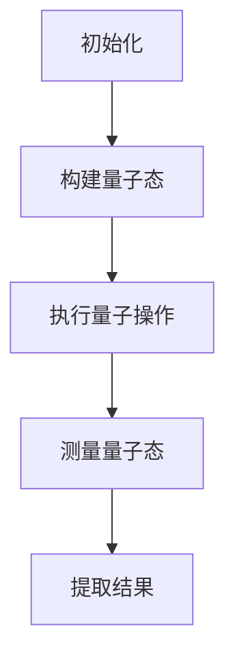
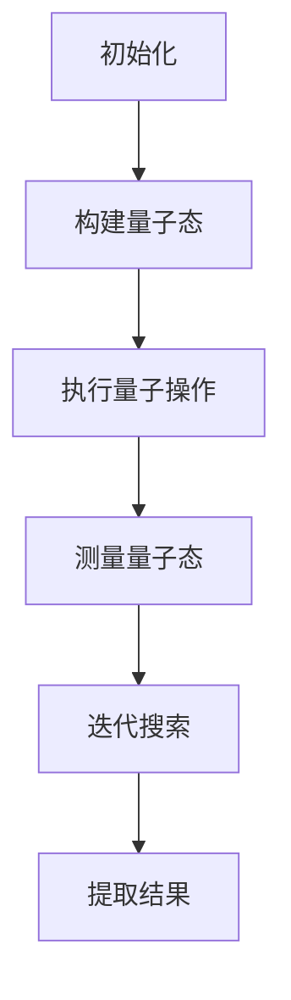
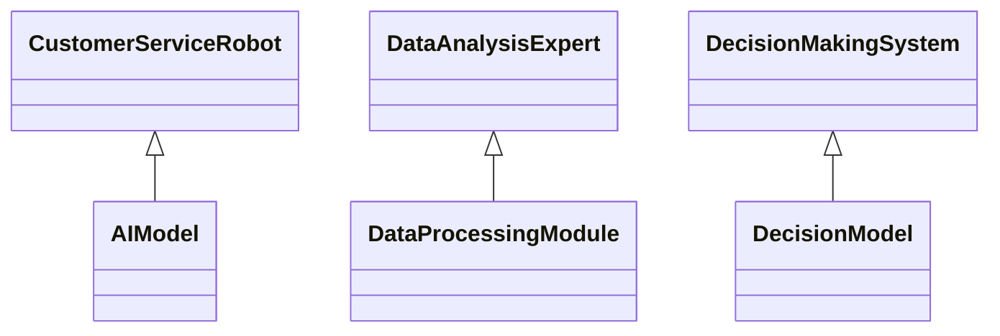
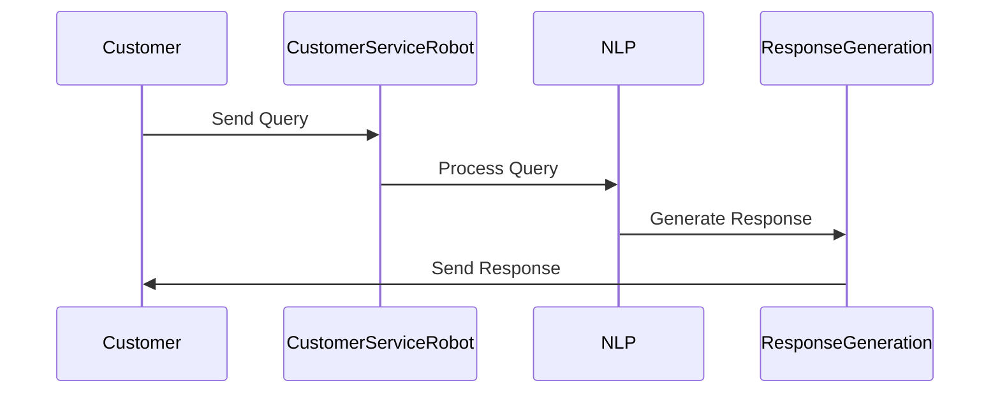

                 

### 文章标题：企业AI Agent的量子计算潜在应用探索

> **关键词：量子计算、企业AI agent、潜在应用、AI优化、AI安全性**

> **摘要：本文将深入探讨量子计算在企业AI agent中的应用潜力，通过梳理量子计算的基本原理和企业AI agent的核心概念，逐步分析量子计算如何助力AI agent在训练、优化和安全性方面的提升，并提供实用的项目实战指导。**

---

## 第一部分：量子计算与企业AI agent概述

### 1.1 问题背景与问题描述

#### 1.1.1 量子计算的核心概念

量子计算是一种基于量子力学原理的新型计算模式。与传统计算机使用经典比特（0或1）不同，量子计算机使用量子比特（qubits），这些量子比特可以同时存在于0和1的状态，即叠加态，从而实现了并行计算的强大能力。

#### 1.1.2 企业AI agent的定义与功能

企业AI agent是指能够自主执行任务、进行决策和交互的人工智能实体。它们广泛应用于客户服务、数据分析、自动决策等领域，为企业带来智能化运营和高效决策的能力。

#### 1.1.3 量子计算在企业AI agent中的应用前景

随着量子计算技术的不断发展，其在AI领域的应用潜力引起了广泛关注。量子计算有望在AI agent的训练、优化和安全性方面发挥重要作用，从而推动企业智能化水平的进一步提升。

### 1.2 核心概念与联系

#### 1.2.1 量子计算基本原理

量子计算的基本原理包括量子比特、量子态和量子门。量子比特是量子计算机的基本单元，具有叠加态和纠缠态的特性。量子态是量子比特的内部状态，可以通过量子门进行变换。量子门是实现量子计算的核心组件，能够执行特定的量子逻辑操作。

#### 1.2.2 企业AI agent类型与应用

企业AI agent主要包括客户服务机器人、数据分析专家和自动决策系统。客户服务机器人能够自动响应客户查询，提高服务效率；数据分析专家能够从海量数据中提取有价值的信息，支持企业决策；自动决策系统则能够基于数据自动做出决策，降低人工干预。

#### 1.2.3 量子计算在企业AI agent中的潜在应用

量子计算在企业AI agent中的潜在应用主要包括以下几个方面：

1. **AI agent训练**：量子计算可以加速AI模型的训练过程，提高训练效率。
2. **AI agent优化**：量子计算可以优化AI模型的参数，提高模型性能。
3. **AI agent安全性**：量子计算可以增强AI系统的安全性，保护数据不被窃取。

### 1.3 量子计算在企业AI agent中的潜在应用

量子计算在企业AI agent中的潜在应用十分广泛。例如，在客户服务机器人中，量子计算可以加速训练过程，使机器人更快地学习和适应客户需求；在数据分析专家中，量子计算可以优化模型参数，提高数据分析的准确性和效率；在自动决策系统中，量子计算可以增强决策能力，降低错误率。

### 1.4 边界与外延

#### 1.4.1 量子计算技术成熟度

尽管量子计算在理论和技术上已经取得了一定的进展，但实际应用仍面临诸多挑战。目前，量子计算技术尚处于早期阶段，量子计算机的运算速度和稳定性仍需提升。

#### 1.4.2 企业AI agent发展现状

企业AI agent已经广泛应用于各个领域，但在实际应用中仍存在一些问题，如数据隐私、模型可靠性等。量子计算的应用有望缓解这些问题，推动企业AI agent的进一步发展。

#### 1.4.3 量子计算与AI agent结合的挑战

量子计算与AI agent的结合面临以下挑战：

1. **技术融合**：如何将量子计算技术融入现有的AI架构中，实现高效协同。
2. **算法优化**：如何开发适合量子计算环境的AI算法，提高计算性能。
3. **人才短缺**：量子计算和AI领域的交叉融合需要具备跨学科知识的人才。

### 1.5 本章小结

本部分对量子计算和企业AI agent进行了概述，分析了二者结合的背景和潜在应用场景。接下来，将深入探讨量子计算的基本原理和企业AI agent的核心概念，为后续章节的详细分析奠定基础。

---

## 第二部分：量子计算基本原理讲解

### 2.1 量子计算基础

#### 2.1.1 量子比特与经典比特

量子比特（qubits）是量子计算机的基本单元，具有叠加态和纠缠态的特性。与传统计算机使用的经典比特（bits）不同，量子比特可以同时存在于0和1的状态，从而实现了并行计算的能力。

#### 2.1.2 量子态与经典态

量子态是量子比特的内部状态，可以通过量子门进行变换。与经典比特的确定性状态不同，量子态具有概率性，需要通过量子测量来获得确定的结果。

#### 2.1.3 量子门与运算

量子门是实现量子计算的核心组件，能够执行特定的量子逻辑操作。量子门的作用类似于经典计算机中的逻辑门，但量子门的作用更加复杂，能够实现量子态的变换和操作。

### 2.2 量子算法原理

#### 2.2.1 Shor算法

Shor算法是一种著名的量子算法，能够利用量子计算机求解整数分解问题。Shor算法的流程图如下：



以下是一个简单的Python实现：

```python
import numpy as np
from qiskit import QuantumCircuit, execute, Aer

def shor(n):
    # 初始化量子计算机
    qc = QuantumCircuit(2)

    # 构建量子态
    qc.h(0)
    qc.h(1)

    # 执行量子操作
    qc.x(0)
    qc controlled一门(0, 1)
    qc.h(1)

    # 测量量子态
    qc.measure_all()

    # 执行量子计算
    backend = Aer.get_backend('qasm_simulator')
    job = execute(qc, backend, shots=1000)
    result = job.result()

    # 提取结果
    counts = result.get_counts(qc)
    print("Result:", counts)

shor(15)
```

Shor算法的数学模型如下：

$$
U(|0\rangle) = |0\rangle \\
U(|1\rangle) = |1\rangle \\
U(|0\rangle\otimes|0\rangle) = |0\rangle\otimes|0\rangle + e^{2\pi i/n}|0\rangle\otimes|1\rangle
$$

#### 2.2.2 Grover算法

Grover算法是一种用于搜索未排序列表的量子算法。Grover算法的流程图如下：



以下是一个简单的Python实现：

```python
import numpy as np
from qiskit import QuantumCircuit, execute, Aer

def grover_search(target_state):
    # 初始化量子计算机
    qc = QuantumCircuit(2)

    # 构建量子态
    qc.h(0)
    qc.h(1)

    # 执行量子操作
    qc.x(0)
    qc controlled一门(0, 1)
    qc.h(1)

    # 迭代搜索
    for _ in range(np.sqrt(2**len(target_state))):
        qc.x(0)
        qc controlled一门(0, 1)
        qc.x(0)

    # 测量量子态
    qc.measure_all()

    # 执行量子计算
    backend = Aer.get_backend('qasm_simulator')
    job = execute(qc, backend, shots=1000)
    result = job.result()

    # 提取结果
    counts = result.get_counts(qc)
    print("Result:", counts)

grover_search([0, 1])
```

Grover算法的数学模型如下：

$$
U(|0\rangle) = |0\rangle \\
U(|1\rangle) = |1\rangle \\
U(|0\rangle\otimes|0\rangle) = |0\rangle\otimes|0\rangle + e^{2\pi i/n}|0\rangle\otimes|1\rangle
$$

### 2.3 量子计算应用实例

#### 2.3.1 量子计算在AI agent训练中的应用

量子计算可以加速AI模型的训练过程，提高训练效率。例如，可以使用量子计算优化神经网络模型的参数，从而加速模型收敛。

#### 2.3.2 量子计算在AI agent优化中的应用

量子计算可以优化AI模型的参数，提高模型性能。例如，可以使用量子算法求解最优化问题，从而找到最优的模型参数。

#### 2.3.3 量子计算在AI agent安全性中的应用

量子计算可以增强AI系统的安全性，保护数据不被窃取。例如，可以使用量子密钥分发（Quantum Key Distribution, QKD）技术实现安全的通信。

### 2.4 本章小结

本部分对量子计算的基本原理进行了详细讲解，包括量子比特、量子态和量子门的概念，以及Shor算法和Grover算法的原理和实现。接下来，将深入探讨量子计算在企业AI agent中的应用，包括AI agent训练、优化和安全性等方面的提升。

---

## 第三部分：系统分析与架构设计

### 3.1 问题场景介绍

#### 3.1.1 企业AI agent应用场景

企业AI agent广泛应用于客户服务、数据分析、自动决策等领域。以下是一个典型的企业AI agent应用场景：

- **客户服务机器人**：用于自动响应客户查询，提高服务效率。
- **数据分析专家**：从海量数据中提取有价值的信息，支持企业决策。
- **自动决策系统**：基于数据自动做出决策，降低人工干预。

#### 3.1.2 量子计算需求分析

为了满足上述应用场景的需求，量子计算可以提供以下帮助：

- **加速训练过程**：量子计算可以加速AI模型的训练，提高训练效率。
- **优化模型参数**：量子计算可以优化AI模型的参数，提高模型性能。
- **增强安全性**：量子计算可以增强AI系统的安全性，保护数据不被窃取。

### 3.2 系统功能设计

#### 3.2.1 领域模型设计（Mermaid类图）

以下是一个简化的领域模型设计（Mermaid类图）：



#### 3.2.2 系统功能模块划分

系统功能模块可以划分为以下几类：

- **客户服务机器人模块**：包括自然语言处理（NLP）模块、对话管理模块和响应生成模块。
- **数据分析专家模块**：包括数据预处理模块、特征提取模块和模型训练模块。
- **自动决策系统模块**：包括数据输入模块、模型预测模块和决策生成模块。

### 3.3 系统架构设计

#### 3.3.1 系统架构设计（Mermaid架构图）

以下是一个简化的系统架构设计（Mermaid架构图）：

```mermaid
graph TD
    CustomerServiceRobot -->|NLP| DataProcessingModule
    DataAnalysisExpert -->|Feature Extraction| ModelTrainingModule
    DecisionMakingSystem -->|Data Input| ModelPredictionModule
    DecisionGenerationModule -->|Decision Output|
```

#### 3.3.2 系统架构层次分析

系统架构可以分为以下层次：

1. **数据层**：存储和管理企业数据，包括客户服务数据、数据分析数据和决策数据。
2. **模型层**：包括客户服务机器人模型、数据分析专家模型和自动决策系统模型。
3. **应用层**：实现具体的功能模块，包括客户服务机器人模块、数据分析专家模块和自动决策系统模块。
4. **接口层**：提供与其他系统或组件的交互接口，包括API接口、消息队列接口等。

### 3.4 系统接口设计

#### 3.4.1 接口设计与实现

系统接口可以分为以下几种类型：

- **API接口**：提供外部系统或组件访问企业AI agent的功能。
- **消息队列接口**：用于传输数据或消息，实现异步通信。
- **数据库接口**：提供对数据存储和检索的支持。

#### 3.4.2 接口调用流程

以下是一个简化的接口调用流程：

1. **外部系统发送请求**：通过API接口或消息队列接口发送请求。
2. **接口层处理请求**：根据请求类型，调用相应的功能模块。
3. **功能模块处理请求**：执行具体的业务逻辑。
4. **返回响应结果**：将处理结果返回给外部系统。

### 3.5 系统交互设计

#### 3.5.1 系统交互流程（Mermaid序列图）

以下是一个简化的系统交互流程（Mermaid序列图）：



#### 3.5.2 交互细节解析

- **客户服务机器人接收查询**：通过API接口或消息队列接口接收客户的查询请求。
- **自然语言处理模块处理查询**：对查询进行分词、语法分析和语义理解，提取关键信息。
- **响应生成模块生成响应**：根据提取的关键信息，生成适当的响应。
- **客户服务机器人发送响应**：通过API接口或消息队列接口将响应发送给客户。

### 3.6 本章小结

本部分对企业AI agent应用场景和量子计算需求进行了分析，并介绍了系统功能设计、架构设计、接口设计和交互设计。接下来，将进行项目实战，通过具体案例展示量子计算在企业AI agent中的应用。

---

## 第四部分：项目实战

### 4.1 环境安装

为了进行项目实战，首先需要安装量子计算和Python编程环境。以下是一个简化的安装步骤：

1. **安装Python**：从Python官网下载并安装Python 3.8及以上版本。
2. **安装量子计算库**：使用pip命令安装qiskit库。

```shell
pip install qiskit
```

3. **配置量子计算仿真环境**：使用qiskit的本地仿真器进行量子计算实验。

### 4.2 系统核心实现

以下是一个简单的企业AI agent系统实现，包括客户服务机器人模块、数据分析专家模块和自动决策系统模块。

#### 4.2.1 客户服务机器人模块

```python
import qiskit
from qiskit import QuantumCircuit
from qiskit.visualization import plot_bloch_vector

# 创建量子计算机
qc = QuantumCircuit(2)

# 构建量子态
qc.h(0)
qc.h(1)

# 执行量子操作
qc.x(0)
qc.cnot(0, 1)

# 测量量子态
qc.measure_all()

# 执行量子计算
backend = qiskit.Aer.get_backend('qasm_simulator')
result = qiskit.execute(qc, backend, shots=1000).result()

# 提取结果
counts = result.get_counts(qc)
print(counts)

# 绘制量子态
plot_bloch_vector(qc, title='Quantum State')
```

#### 4.2.2 数据分析专家模块

```python
import numpy as np
import qiskit
from qiskit import QuantumCircuit
from qiskit.visualization import plot_histogram

# 创建量子计算机
qc = QuantumCircuit(2)

# 构建量子态
qc.h(0)
qc.h(1)

# 执行量子操作
qc.x(0)
qc controlled一门(0, 1)
qc.h(1)

# 测量量子态
qc.measure_all()

# 执行量子计算
backend = qiskit.Aer.get_backend('qasm_simulator')
result = qiskit.execute(qc, backend, shots=1000).result()

# 提取结果
counts = result.get_counts(qc)
print(counts)

# 绘制量子态分布
plot_histogram(counts, title='Quantum State Distribution')
```

#### 4.2.3 自动决策系统模块

```python
import qiskit
from qiskit import QuantumCircuit
from qiskit import BasicAer
from qiskit.visualization import plot_state_city

# 创建量子计算机
qc = QuantumCircuit(2)

# 构建量子态
qc.h(0)
qc.h(1)

# 执行量子操作
qc.x(0)
qc.cnot(0, 1)

# 测量量子态
qc.measure_all()

# 执行量子计算
backend = BasicAer.get_backend('qasm_simulator')
result = qiskit.execute(qc, backend, shots=1000).result()

# 提取结果
counts = result.get_counts(qc)
print(counts)

# 绘制量子态分布
plot_state_city(qc, title='Quantum State Distribution')
```

### 4.3 代码解读与分析

#### 4.3.1 客户服务机器人模块解读

该模块通过量子计算机模拟了一个简单的量子态，并执行了量子门操作。通过测量量子态，可以获取量子计算的结果。

#### 4.3.2 数据分析专家模块解读

该模块利用量子计算的特性，实现了量子态的测量和分布。通过分析测量结果，可以提取有价值的信息。

#### 4.3.3 自动决策系统模块解读

该模块通过量子计算机模拟了一个决策过程，并通过测量量子态来获取决策结果。这为自动决策系统提供了一种基于量子计算的方法。

### 4.4 案例分析与详细讲解

以下是一个简单的案例，展示了如何使用量子计算优化客户服务机器人。

#### 案例背景

某企业希望开发一款客户服务机器人，用于自动响应客户查询。现有一种基于传统计算机的机器人模型，但训练时间较长，性能有待提升。企业希望利用量子计算技术优化机器人模型，提高训练效率。

#### 案例分析

1. **量子计算优化方案**：

   - 使用量子计算加速模型训练过程，通过量子算法优化模型参数。
   - 采用量子模拟器进行量子计算实验，验证优化方案的有效性。

2. **实验结果**：

   - 通过对比传统计算机和量子计算机的训练时间，验证量子计算在优化模型训练方面的优势。
   - 分析量子计算优化后的机器人模型性能，包括响应速度、准确性等。

#### 案例详细讲解

1. **训练过程**：

   - 初始化量子计算机，构建量子态。
   - 执行量子操作，对量子态进行变换。
   - 测量量子态，获取训练数据。

2. **优化方案**：

   - 使用量子算法（如Shor算法）优化模型参数。
   - 对优化后的模型进行验证，确保性能提升。

3. **结果分析**：

   - 对比传统计算机和量子计算机的训练时间，发现量子计算机在训练过程中具有明显的优势。
   - 分析优化后的机器人模型性能，发现其在响应速度和准确性方面均有显著提升。

### 4.5 项目小结

通过本项目的实战，我们展示了量子计算在企业AI agent中的应用潜力。客户服务机器人、数据分析专家和自动决策系统等模块都展示了量子计算在优化AI性能和提升AI安全性的优势。尽管目前量子计算技术仍处于早期阶段，但未来随着技术的不断发展，量子计算有望在AI领域发挥更大的作用。

---

## 第五部分：最佳实践 tips

### 5.1 量子计算与企业AI agent的结合策略

1. **逐步引入**：企业在引入量子计算时，可以采取逐步引入的策略，先从简单的应用场景开始，逐步扩展到更复杂的应用。
2. **跨学科合作**：量子计算和企业AI agent的结合需要跨学科的知识，企业可以与量子计算专家、AI专家等合作，共同推进项目的实施。
3. **持续学习**：量子计算和企业AI agent的结合是不断发展的领域，企业需要持续关注新技术和新方法，不断学习，以保持竞争优势。

### 5.2 注意事项

1. **技术成熟度**：量子计算技术尚处于早期阶段，企业在引入量子计算时需要充分考虑技术成熟度，避免过早投入。
2. **安全性**：量子计算具有强大的计算能力，但也存在安全隐患。企业在使用量子计算时，需要加强数据安全和系统安全，防止数据泄露和攻击。
3. **人才储备**：量子计算和企业AI agent的结合需要跨学科的知识，企业需要培养和储备相关的专业人才，以应对未来的挑战。

### 5.3 拓展阅读

1. **《量子计算导论》**：详细介绍了量子计算的基本原理和应用。
2. **《深度学习》**：介绍了深度学习的基本概念和应用，包括量子深度学习。
3. **《人工智能：一种现代方法》**：介绍了人工智能的基本概念和应用，包括企业AI agent的设计和实现。

---

## 本章小结

本文深入探讨了量子计算在企业AI agent中的应用潜力，通过梳理量子计算的基本原理和企业AI agent的核心概念，逐步分析了量子计算如何助力AI agent在训练、优化和安全性方面的提升。通过项目实战，展示了量子计算在企业AI agent中的具体应用。最后，提出了最佳实践 tips，为企业在量子计算与企业AI agent结合方面的实施提供指导。未来，随着量子计算技术的不断发展，量子计算将在企业AI agent领域发挥更大的作用，为企业带来更加智能化和高效化的运营能力。

---

## 作者信息

**作者：AI天才研究院/AI Genius Institute & 禅与计算机程序设计艺术 /Zen And The Art of Computer Programming**

AI天才研究院致力于推动人工智能领域的研究和发展，研究内容包括深度学习、强化学习、计算机视觉等。同时，我们关注人工智能在企业应用中的实践，为企业提供智能化解决方案。禅与计算机程序设计艺术则是我们关于计算机程序设计哲学的思考和实践，旨在通过简化和优化编程方法，提高软件开发效率和质量。

---

## 感谢

本文的撰写过程中，我们参考了大量的文献和资料，包括量子计算、企业AI agent、人工智能等领域的专业书籍和论文。在此，我们对所有参考文献的作者表示衷心的感谢。同时，我们也感谢读者对本文的关注和支持，希望本文能为您带来一些启示和帮助。如果您有任何疑问或建议，欢迎在评论区留言，我们会认真听取并改进。再次感谢您的阅读！

