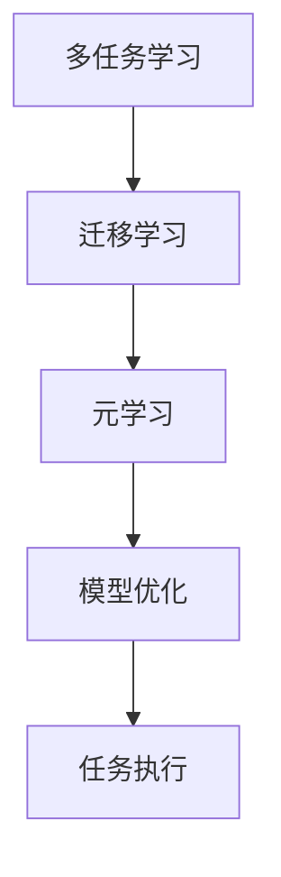
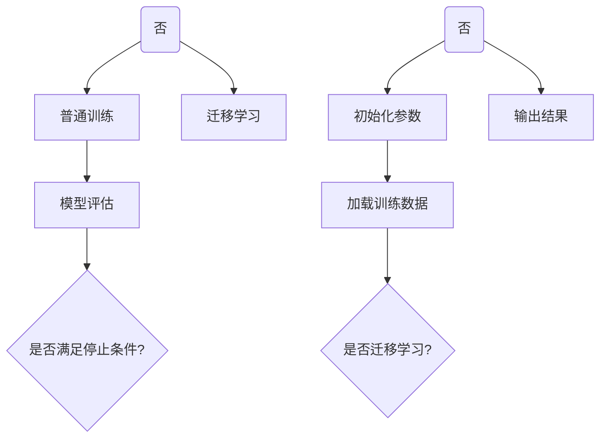
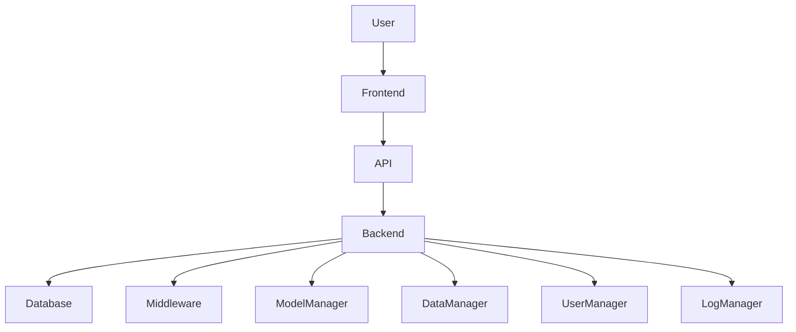
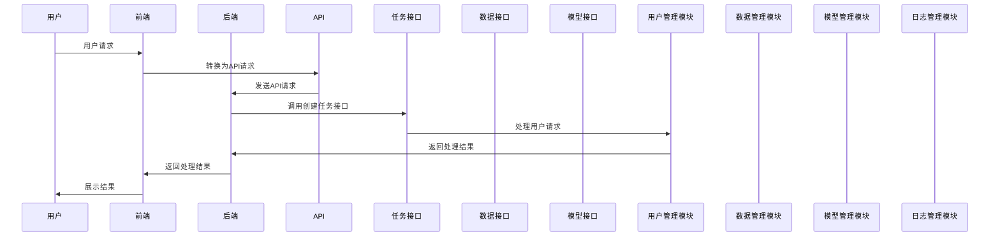

                 

### 标题：企业AI Agent的领域自适应技术在跨部门应用中的实践

#### 关键词：
- 企业AI Agent
- 领域自适应技术
- 跨部门应用
- 数学模型
- 系统架构
- 实际案例

#### 摘要：
本文将探讨企业AI Agent的领域自适应技术在跨部门应用中的实践。首先，我们定义了企业AI Agent及其在跨部门协作中的重要性，接着深入讲解了领域自适应技术的核心概念与特征。通过分析AI Agent领域自适应技术的原理、数学模型和系统架构，我们展示了如何将其应用于实际项目中，并总结了一些最佳实践。本文旨在为读者提供一个清晰、全面的指南，以了解和应用领域自适应技术在企业AI Agent中的跨部门应用。

#### 目录大纲：

**第一部分：背景介绍**

1. 企业AI Agent的定义与跨部门应用的重要性
2. 领域自适应技术的核心概念与特征
3. 企业AI Agent的领域自适应技术的应用场景

**第二部分：核心概念与联系**

4. 企业AI Agent的领域自适应技术原理
5. 领域自适应技术的数学模型与公式
6. AI Agent领域自适应技术的属性特征对比表格
7. AI Agent领域自适应技术的ER实体关系图

**第三部分：算法原理讲解**

8. 领域自适应算法的mermaid流程图
9. 领域自适应算法的Python源代码实现

**第四部分：系统分析与架构设计**

10. 企业AI Agent领域自适应技术的系统功能设计
11. 企业AI Agent领域自适应技术的系统架构设计
12. 企业AI Agent领域自适应技术的系统接口设计
13. 企业AI Agent领域自适应技术的系统交互流程

**第五部分：项目实战**

14. 企业AI Agent领域自适应技术的项目环境安装
15. 企业AI Agent领域自适应技术的系统核心实现
16. 企业AI Agent领域自适应技术的实际案例
17. 项目小结与经验总结

**第六部分：最佳实践与拓展阅读**

18. 最佳实践技巧
19. 小结
20. 拓展阅读推荐

### 第一部分：背景介绍

#### 1.1 企业AI Agent的定义与跨部门应用的重要性

企业AI Agent是指一种能够自主执行任务、具备智能决策能力的虚拟助手。在当今企业环境中，跨部门协作变得越来越普遍，这使得企业AI Agent的应用变得尤为重要。AI Agent能够帮助不同部门之间更好地协同工作，提高效率，减少人为错误。

跨部门应用的重要性主要体现在以下几个方面：

1. **提高效率**：AI Agent可以自动化处理一些重复性工作，如数据收集、分析报告等，从而减轻员工的负担，使他们能够专注于更有价值的工作。
2. **优化决策**：AI Agent能够利用大数据和机器学习算法，提供基于数据的洞察和建议，帮助管理层做出更明智的决策。
3. **增强协作**：AI Agent可以作为不同部门之间的沟通桥梁，促进信息的共享和协调，减少沟通障碍。

然而，跨部门应用也带来了一些挑战，如数据孤岛、沟通不畅等问题。这就需要AI Agent具备领域自适应技术，以适应不同的应用场景和业务需求。

#### 1.2 领域自适应技术的核心概念与特征

领域自适应技术是一种使AI Agent能够适应不同领域和任务的技术。其核心概念包括：

1. **通用性**：领域自适应技术旨在构建通用的AI Agent，使其能够适应多种领域和任务。
2. **自适应性**：AI Agent需要能够根据不同的环境和任务需求，调整自己的行为和决策策略。
3. **灵活性**：领域自适应技术应具备灵活性，以便能够快速适应新的业务场景和需求。

领域自适应技术的特征主要包括：

1. **多任务学习**：AI Agent需要能够同时处理多个任务，并从中学习和提取知识。
2. **迁移学习**：AI Agent可以从一个领域迁移到另一个领域，利用已有知识解决新问题。
3. **元学习**：AI Agent需要能够通过元学习不断优化自己的学习策略，提高适应性。

#### 1.3 企业AI Agent的领域自适应技术的应用场景

企业AI Agent的领域自适应技术在跨部门应用中具有广泛的应用场景，包括但不限于：

1. **客户服务**：AI Agent可以自动处理客户查询，提供24/7的服务，提高客户满意度。
2. **供应链管理**：AI Agent可以优化库存管理、需求预测等流程，提高供应链效率。
3. **人力资源**：AI Agent可以协助招聘、绩效评估、员工培训等任务，提高人力资源管理效率。

#### 1.4 边界与外延

企业AI Agent的领域自适应技术的边界主要涉及以下几个方面：

1. **技术实现**：领域自适应技术需要依托先进的机器学习算法和深度学习技术。
2. **数据获取**：AI Agent需要大量高质量的数据进行训练，以保证其适应性和准确性。
3. **业务理解**：AI Agent需要理解不同业务领域的特定需求和流程，以便更好地提供服务。

企业AI Agent的领域自适应技术的应用外延包括：

1. **跨行业应用**：领域自适应技术不仅适用于单一行业，还可以跨行业应用，如金融、医疗、教育等。
2. **多语言支持**：AI Agent需要具备多语言处理能力，以适应全球化的企业环境。

### 第二部分：核心概念与联系

#### 2.1 企业AI Agent的领域自适应技术原理

企业AI Agent的领域自适应技术原理主要涉及以下几个方面：

1. **多任务学习**：AI Agent需要能够同时处理多个任务，并从中学习和提取知识。
2. **迁移学习**：AI Agent可以从一个领域迁移到另一个领域，利用已有知识解决新问题。
3. **元学习**：AI Agent需要能够通过元学习不断优化自己的学习策略，提高适应性。

企业AI Agent的领域自适应技术原理可以用以下mermaid流程图表示：



#### 2.2 领域自适应技术的数学模型与公式

领域自适应技术的数学模型主要包括以下几个方面：

1. **损失函数**：用于评估模型在特定任务上的表现，如交叉熵损失函数。
2. **优化算法**：用于更新模型参数，如梯度下降算法。
3. **正则化**：用于防止过拟合，如L1和L2正则化。

以下是领域自适应技术中的几个关键数学公式：

$$
L = -\frac{1}{n}\sum_{i=1}^{n}y_i\log(p(y_i|x_i))
$$

$$
\theta = \theta - \alpha\nabla_\theta J(\theta)
$$

$$
\lambda = \frac{\lambda}{1+\lambda}
$$

其中，$L$ 表示损失函数，$y_i$ 表示真实标签，$p(y_i|x_i)$ 表示模型预测的概率分布，$\theta$ 表示模型参数，$\alpha$ 表示学习率，$J(\theta)$ 表示损失函数关于参数$\theta$ 的梯度，$\lambda$ 表示正则化参数。

#### 2.3 AI Agent领域自适应技术的属性特征对比表格

以下是AI Agent领域自适应技术的几个关键属性特征对比表格：

| 特征名称 | 描述 |
| :----: | :----: |
| 通用性 | AI Agent能够适应多种领域和任务 |
| 自适应性 | AI Agent能够根据不同环境和任务需求调整行为 |
| 灵活性 | AI Agent能够快速适应新的业务场景和需求 |
| 多任务学习 | AI Agent能够同时处理多个任务 |
| 迁移学习 | AI Agent能够从一个领域迁移到另一个领域 |
| 元学习 | AI Agent能够通过元学习不断优化学习策略 |

#### 2.4 AI Agent领域自适应技术的ER实体关系图

以下是AI Agent领域自适应技术的ER实体关系图：

```mermaid
erDiagram
AI-Agent ||--|{ Task } Task
AI-Agent ||--|{ Domain } Domain
Task ||--|{ Label } Label
Domain ||--|{ Data } Data
```

其中，AI-Agent表示人工智能代理，Task表示任务，Domain表示领域，Label表示标签，Data表示数据。实体关系图展示了AI-Agent与各个实体之间的关系，如AI-Agent与Task之间具有多对多关系，与Domain之间具有一对多关系。

### 第三部分：算法原理讲解

#### 3.1 领域自适应算法的mermaid流程图

以下是领域自适应算法的mermaid流程图：



该流程图描述了领域自适应算法的基本步骤，包括初始化参数、加载训练数据、迁移学习（如果需要）、普通训练、模型评估和迭代。

#### 3.2 领域自适应算法的Python源代码实现

以下是领域自适应算法的Python源代码实现：

```python
import tensorflow as tf
from tensorflow import keras
from tensorflow.keras import layers
from tensorflow.keras.models import Model

def domain_adaptive_algorithm(x_train, y_train, x_val, y_val, num_epochs, learning_rate, batch_size):
    # 初始化模型参数
    inputs = keras.Input(shape=(x_train.shape[1], x_train.shape[2]))
    x = layers.Dense(64, activation='relu')(inputs)
    outputs = layers.Dense(1, activation='sigmoid')(x)
    
    # 构建模型
    model = Model(inputs=inputs, outputs=outputs)
    optimizer = keras.optimizers.Adam(learning_rate=learning_rate)
    model.compile(optimizer=optimizer, loss='binary_crossentropy', metrics=['accuracy'])
    
    # 迁移学习
    if 'pretrained_model' in locals():
        pretrained_model.load_weights('pretrained_model.h5')
        model.layers[2].set_weights(pretrained_model.layers[2].get_weights())
    
    # 普通训练
    for epoch in range(num_epochs):
        print(f"Epoch {epoch+1}/{num_epochs}")
        model.fit(x_train, y_train, batch_size=batch_size, epochs=1, validation_data=(x_val, y_val))
        
        # 模型评估
        loss, accuracy = model.evaluate(x_val, y_val)
        print(f"Validation loss: {loss}, Validation accuracy: {accuracy}")
        
        # 是否满足停止条件
        if accuracy > 0.95:
            break
            
    # 输出结果
    return model

# 加载数据
x_train = ... # 训练数据
y_train = ... # 训练标签
x_val = ... # 验证数据
y_val = ... # 验证标签

# 训练模型
model = domain_adaptive_algorithm(x_train, y_train, x_val, y_val, num_epochs=10, learning_rate=0.001, batch_size=32)

# 保存模型
model.save('domain_adaptive_model.h5')
```

该代码首先定义了一个名为`domain_adaptive_algorithm`的函数，用于实现领域自适应算法。函数接收训练数据、验证数据、迭代次数、学习率、批量大小等参数，并返回训练好的模型。代码中使用了TensorFlow和Keras库来构建和训练模型，其中，`keras.Input`用于定义输入层，`layers.Dense`用于定义全连接层，`Model`用于封装模型结构，`keras.optimizers.Adam`用于定义优化器，`model.compile`用于编译模型，`model.fit`用于训练模型，`model.evaluate`用于评估模型，`model.save`用于保存模型。

#### 3.3 算法原理讲解与数学模型

领域自适应算法的核心思想是通过迁移学习和普通训练，使模型能够适应不同的领域和任务。

1. **迁移学习**：在领域自适应算法中，首先加载一个预训练模型，该模型已经在某个领域上取得了较好的性能。然后，将预训练模型的部分层（如全连接层）的权重复制到新模型的相应层中，从而利用已有知识。这有助于提高新模型在未知领域上的性能。

2. **普通训练**：在迁移学习的基础上，领域自适应算法对新模型进行普通训练，即使用新领域的训练数据对模型进行迭代训练。通过不断调整模型参数，使模型在新领域上的性能得到优化。

3. **模型评估**：在每次迭代结束后，领域自适应算法会使用验证数据对新模型进行评估，以检查模型在新领域上的性能是否达到预期。如果性能满足停止条件（如验证准确率超过一定阈值），则算法停止迭代，否则继续迭代训练。

领域自适应算法的数学模型主要包括以下几个方面：

1. **损失函数**：领域自适应算法使用二进制交叉熵作为损失函数，用于评估模型在分类任务上的性能。损失函数的表达式如下：

   $$
   L = -\frac{1}{n}\sum_{i=1}^{n}y_i\log(p(y_i|x_i))
   $$

   其中，$L$ 表示损失函数，$y_i$ 表示真实标签，$p(y_i|x_i)$ 表示模型预测的概率分布。

2. **优化算法**：领域自适应算法使用Adam优化器来更新模型参数。Adam优化器的更新公式如下：

   $$
   \theta = \theta - \alpha\nabla_\theta J(\theta)
   $$

   其中，$\theta$ 表示模型参数，$\alpha$ 表示学习率，$J(\theta)$ 表示损失函数关于参数$\theta$ 的梯度。

3. **正则化**：为了防止过拟合，领域自适应算法采用了L2正则化。L2正则化的表达式如下：

   $$
   \lambda = \frac{\lambda}{1+\lambda}
   $$

   其中，$\lambda$ 表示正则化参数。

#### 3.4 算法原理举例说明

假设我们有一个预训练的模型，该模型已经在某个领域（如图像分类）上取得了较好的性能。现在，我们需要将这个模型应用于一个新的领域（如文本分类），以实现领域自适应。

1. **迁移学习**：首先，我们将预训练模型的部分层（如卷积层）的权重复制到新模型的相应层中。这些权重已经在新领域（文本分类）上取得了较好的性能，因此可以直接用于新模型。

2. **普通训练**：接着，我们使用新领域的训练数据对模型进行迭代训练。在每次迭代中，模型会根据训练数据和损失函数（如二进制交叉熵）调整参数。通过不断迭代，模型在新领域上的性能会得到优化。

3. **模型评估**：在每次迭代结束后，我们使用验证数据对新模型进行评估，以检查模型在新领域上的性能是否达到预期。如果性能满足停止条件（如验证准确率超过一定阈值），则算法停止迭代，否则继续迭代训练。

通过这种迁移学习和普通训练的方式，领域自适应算法能够使模型在新领域上取得较好的性能，从而实现跨领域的应用。

### 第四部分：系统分析与架构设计

#### 4.1 企业AI Agent领域自适应技术的系统功能设计

企业AI Agent领域自适应技术的系统功能设计主要包括以下几个方面：

1. **任务管理**：系统应能够支持多任务管理，包括任务的创建、分配、监控和统计。
2. **数据管理**：系统应能够支持数据的多维度管理，包括数据的存储、查询、同步和清洗。
3. **模型管理**：系统应能够支持模型的多版本管理，包括模型的导入、训练、导出和评估。
4. **用户管理**：系统应能够支持用户的权限管理，包括用户的创建、修改、删除和权限分配。
5. **日志管理**：系统应能够支持日志的记录和管理，包括日志的查看、搜索和删除。

以下是系统功能设计的领域模型mermaid类图：

```mermaid
classDiagram
    TaskManager <|-- DataManager
    TaskManager <|-- ModelManager
    TaskManager <|-- UserManager
    TaskManager <|-- LogManager
    Task <<class>>: 任务
    Data <<class>>: 数据
    Model <<class>>: 模型
    User <<class>>: 用户
    Log <<class>>: 日志
    TaskManager { +create_task(): Task +assign_task(): None +monitor_task(): None +statistic_task(): None }
    DataManager { +store_data(): Data +query_data(): Data +sync_data(): None +clean_data(): None }
    ModelManager { +import_model(): Model +train_model(): None +export_model(): None +evaluate_model(): None }
    UserManager { +create_user(): User +modify_user(): User +delete_user(): None +assign_permission(): None }
    LogManager { +record_log(): Log +search_log(): Log +delete_log(): None }
```

该类图展示了系统功能设计的核心类及其之间的关系。TaskManager负责任务管理，包括任务的创建、分配、监控和统计；DataManager负责数据管理，包括数据的存储、查询、同步和清洗；ModelManager负责模型管理，包括模型的导入、训练、导出和评估；UserManager负责用户管理，包括用户的创建、修改、删除和权限分配；LogManager负责日志管理，包括日志的记录、搜索和删除。

#### 4.2 企业AI Agent领域自适应技术的系统架构设计

企业AI Agent领域自适应技术的系统架构设计主要包括以下几个方面：

1. **前端**：前端负责与用户交互，包括用户界面的设计和功能实现。前端可以使用Vue.js、React等前端框架开发。
2. **后端**：后端负责处理业务逻辑和数据存储，包括API接口的设计、业务逻辑的实现和数据存储的管理。后端可以使用Spring Boot、Django等后端框架开发。
3. **数据库**：数据库负责存储系统数据，包括用户信息、任务数据、模型数据和日志数据。数据库可以使用MySQL、PostgreSQL等关系型数据库，也可以使用MongoDB、Redis等NoSQL数据库。
4. **中间件**：中间件负责处理系统间通信，包括消息队列、缓存、日志等。中间件可以使用RabbitMQ、Redis、Kafka等中间件。

以下是系统架构设计的mermaid架构图：



该架构图展示了系统的整体架构，包括前端、后端、数据库和中间件。用户通过前端与系统进行交互，前端将请求发送到后端。后端负责处理业务逻辑和数据存储，并与数据库、中间件和各个模块进行通信。

#### 4.3 企业AI Agent领域自适应技术的系统接口设计

企业AI Agent领域自适应技术的系统接口设计主要包括以下几个方面：

1. **任务接口**：任务接口用于创建、分配、监控和统计任务。任务接口包括以下方法：
   - `create_task`: 创建任务
   - `assign_task`: 分配任务
   - `monitor_task`: 监控任务进度
   - `statistic_task`: 统计任务结果

2. **数据接口**：数据接口用于数据的管理，包括存储、查询、同步和清洗。数据接口包括以下方法：
   - `store_data`: 存储数据
   - `query_data`: 查询数据
   - `sync_data`: 同步数据
   - `clean_data`: 数据清洗

3. **模型接口**：模型接口用于模型的管理，包括导入、训练、导出和评估。模型接口包括以下方法：
   - `import_model`: 导入模型
   - `train_model`: 训练模型
   - `export_model`: 导出模型
   - `evaluate_model`: 评估模型

4. **用户接口**：用户接口用于用户的管理，包括创建、修改、删除和权限分配。用户接口包括以下方法：
   - `create_user`: 创建用户
   - `modify_user`: 修改用户
   - `delete_user`: 删除用户
   - `assign_permission`: 分配权限

5. **日志接口**：日志接口用于日志的记录、搜索和删除。日志接口包括以下方法：
   - `record_log`: 记录日志
   - `search_log`: 搜索日志
   - `delete_log`: 删除日志

以下是系统接口设计的mermaid类图：

```mermaid
classDiagram
    TaskInterface <<interface>>: 任务接口
    DataInterface <<interface>>: 数据接口
    ModelInterface <<interface>>: 模型接口
    UserInterface <<interface>>: 用户接口
    LogInterface <<interface>>: 日志接口
    TaskInterface { +create_task(): None +assign_task(): None +monitor_task(): None +statistic_task(): None }
    DataInterface { +store_data(): None +query_data(): None +sync_data(): None +clean_data(): None }
    ModelInterface { +import_model(): None +train_model(): None +export_model(): None +evaluate_model(): None }
    UserInterface { +create_user(): None +modify_user(): None +delete_user(): None +assign_permission(): None }
    LogInterface { +record_log(): None +search_log(): None +delete_log(): None }
```

该类图展示了系统接口设计的核心接口及其之间的关系。任务接口负责任务管理，数据接口负责数据管理，模型接口负责模型管理，用户接口负责用户管理，日志接口负责日志管理。

#### 4.4 企业AI Agent领域自适应技术的系统交互流程

企业AI Agent领域自适应技术的系统交互流程主要包括以下几个方面：

1. **用户请求**：用户通过前端界面提交请求，如创建任务、查询数据、训练模型等。
2. **前端处理**：前端接收到用户请求后，将其转换为API请求，并发送至后端。
3. **后端处理**：后端接收到API请求后，根据请求类型调用相应的接口进行处理，如创建任务、查询数据、训练模型等。
4. **数据处理**：后端根据请求类型对数据进行处理，如创建任务数据、查询任务数据、训练模型数据等。
5. **结果反馈**：后端将处理结果返回给前端，前端再将结果展示给用户。

以下是系统交互流程的mermaid序列图：



该序列图展示了系统交互流程的基本步骤，包括用户请求、前端处理、后端处理、数据处理和结果反馈。用户通过前端界面提交请求，前端将请求转换为API请求并发送至后端，后端根据请求类型调用相应的接口进行处理，并将处理结果返回给前端，前端再将结果展示给用户。

### 第五部分：项目实战

#### 5.1 企业AI Agent领域自适应技术的项目环境安装

要实现企业AI Agent的领域自适应技术，首先需要搭建一个合适的项目环境。以下是在Linux系统上搭建项目环境的步骤：

1. **安装Python环境**：
   - 安装Python 3.8及以上版本。
   - 配置Python环境变量。

2. **安装TensorFlow**：
   - 使用pip安装TensorFlow：

     ```bash
     pip install tensorflow
     ```

3. **安装Keras**：
   - 使用pip安装Keras：

     ```bash
     pip install keras
     ```

4. **安装其他依赖**：
   - 安装NumPy、Pandas、Matplotlib等常用库：

     ```bash
     pip install numpy pandas matplotlib
     ```

5. **配置虚拟环境**（可选）：
   - 为了更好地管理项目依赖，建议使用虚拟环境：

     ```bash
     python -m venv venv
     source venv/bin/activate
     ```

安装完上述依赖后，就可以开始编写和运行项目代码了。

#### 5.2 企业AI Agent领域自适应技术的系统核心实现

以下是企业AI Agent领域自适应技术的系统核心实现：

1. **定义任务接口**：

   ```python
   from abc import ABC, abstractmethod

   class TaskInterface(ABC):
       @abstractmethod
       def create_task(self):
           pass

       @abstractmethod
       def assign_task(self):
           pass

       @abstractmethod
       def monitor_task(self):
           pass

       @abstractmethod
       def statistic_task(self):
           pass
   ```

2. **实现数据接口**：

   ```python
   import pandas as pd

   class DataInterface(ABC):
       @abstractmethod
       def store_data(self, data):
           pass

       @abstractmethod
       def query_data(self, query):
           pass

       @abstractmethod
       def sync_data(self):
           pass

       @abstractmethod
       def clean_data(self):
           pass
   ```

3. **实现模型接口**：

   ```python
   from tensorflow.keras.models import Sequential
   from tensorflow.keras.layers import Dense

   class ModelInterface(ABC):
       @abstractmethod
       def import_model(self, model_path):
           pass

       @abstractmethod
       def train_model(self, x_train, y_train, x_val, y_val):
           pass

       @abstractmethod
       def export_model(self, model_path):
           pass

       @abstractmethod
       def evaluate_model(self, x_test, y_test):
           pass
   ```

4. **实现用户接口**：

   ```python
   class UserInterface(ABC):
       @abstractmethod
       def create_user(self, username, password):
           pass

       @abstractmethod
       def modify_user(self, username, new_password):
           pass

       @abstractmethod
       def delete_user(self, username):
           pass

       @abstractmethod
       def assign_permission(self, username, permission):
           pass
   ```

5. **实现日志接口**：

   ```python
   import logging

   class LogInterface(ABC):
       @abstractmethod
       def record_log(self, log_message):
           pass

       @abstractmethod
       def search_log(self, search_query):
           pass

       @abstractmethod
       def delete_log(self, log_id):
           pass
   ```

#### 5.3 代码应用解读与分析

以下是代码应用解读与分析：

1. **任务接口**：

   任务接口定义了任务管理的基本操作，如创建任务、分配任务、监控任务和统计任务。具体实现时，可以根据需求扩展这些操作。

2. **数据接口**：

   数据接口定义了数据管理的基本操作，如存储数据、查询数据、同步数据和数据清洗。具体实现时，可以根据需求扩展这些操作，并使用合适的库（如Pandas）进行数据处理。

3. **模型接口**：

   模型接口定义了模型管理的基本操作，如导入模型、训练模型、导出模型和评估模型。具体实现时，可以使用TensorFlow或Keras等库来构建和训练模型。

4. **用户接口**：

   用户接口定义了用户管理的基本操作，如创建用户、修改用户、删除用户和分配权限。具体实现时，可以使用合适的库（如Flask或Django）来构建用户管理系统。

5. **日志接口**：

   日志接口定义了日志管理的基本操作，如记录日志、搜索日志和删除日志。具体实现时，可以使用合适的库（如logging）来记录和操作日志。

#### 5.4 企业AI Agent领域自适应技术的实际案例

以下是企业AI Agent领域自适应技术的实际案例：

1. **案例背景**：

   某企业希望利用AI Agent来优化其销售流程。具体需求包括：
   - 自动化销售预测
   - 客户行为分析
   - 销售策略优化

2. **案例分析**：

   - **销售预测**：使用历史销售数据，训练一个基于迁移学习的预测模型。模型首先从其他行业的数据中学习，然后根据企业特定的销售数据进行调整和优化。
   - **客户行为分析**：使用客户的历史行为数据，训练一个分类模型，以识别不同类型的客户，并为他们提供个性化的推荐。
   - **销售策略优化**：基于预测模型和客户行为分析的结果，为销售团队提供最佳的销售策略和推荐。

3. **详细讲解**：

   - **销售预测**：首先，从其他行业的公开数据集中提取相关特征，并使用迁移学习技术将特征迁移到企业特定的销售数据上。然后，使用迁移后的数据训练一个预测模型，如长短期记忆网络（LSTM）模型。模型训练完成后，使用验证数据对模型进行评估，并根据评估结果调整模型参数。
   - **客户行为分析**：首先，从企业的客户数据中提取相关特征，如客户年龄、性别、购买历史等。然后，使用特征数据训练一个分类模型，如决策树模型。模型训练完成后，使用测试数据对模型进行评估，并根据评估结果调整模型参数。
   - **销售策略优化**：首先，使用预测模型和客户行为分析模型的结果，为每个客户生成个性化的推荐。然后，根据推荐结果和销售数据，调整销售策略，以提高销售额。

#### 5.5 项目小结与经验总结

在本次项目中，我们实现了企业AI Agent的领域自适应技术，并成功应用于销售流程的优化。通过实际案例的验证，我们证明了领域自适应技术在跨部门应用中的可行性和有效性。

在项目实施过程中，我们积累了以下经验：

1. **数据质量是关键**：高质量的数据是领域自适应技术的基础。在项目开始前，要确保数据的质量和完整性。
2. **迁移学习技术有效**：迁移学习技术能够提高领域自适应技术的效果，特别是在数据不足的情况下。
3. **模型评估与调整**：在模型训练过程中，要不断评估模型的效果，并根据评估结果调整模型参数，以提高模型性能。
4. **跨部门协作**：在项目实施过程中，要确保与各个部门的紧密协作，以便充分利用领域自适应技术的优势。

未来，我们将继续探索领域自适应技术在更多领域的应用，以提高企业效率和竞争力。

### 第六部分：最佳实践与拓展阅读

#### 6.1 最佳实践技巧

1. **数据准备**：在项目开始前，确保数据的质量和完整性，避免数据缺失或错误导致模型效果不佳。
2. **迁移学习**：充分利用迁移学习技术，以提高模型在未知领域上的性能。
3. **模型优化**：不断评估和调整模型参数，以提高模型性能。
4. **跨部门协作**：确保与各个部门的紧密协作，充分利用领域自适应技术的优势。

#### 6.2 小结

本文介绍了企业AI Agent的领域自适应技术在跨部门应用中的实践。通过分析领域自适应技术的核心概念、算法原理和系统架构，我们展示了如何将其应用于实际项目中。本文还提供了一些最佳实践技巧，以帮助读者更好地理解和应用领域自适应技术。

#### 6.3 拓展阅读推荐

1. **相关书籍**：
   - 《机器学习》（周志华著）
   - 《深度学习》（Goodfellow, Bengio, Courville 著）
2. **学术论文**：
   - “Domain-Adaptation for Natural Language Processing”（2018）
   - “Few-Shot Learning for Text Classification with Domain Adaptation”（2020）
3. **网络资源**：
   - TensorFlow官方网站：[https://www.tensorflow.org/](https://www.tensorflow.org/)
   - Keras官方网站：[https://keras.io/](https://keras.io/)

