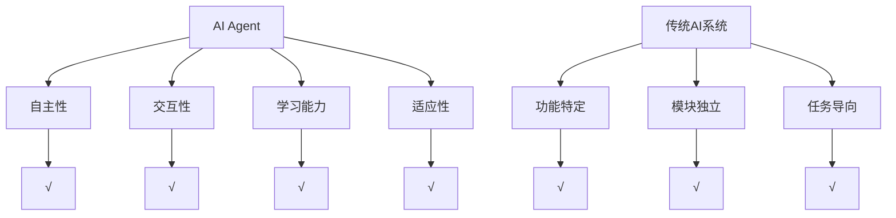
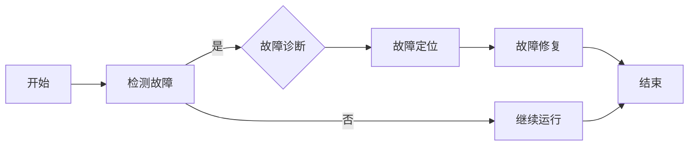
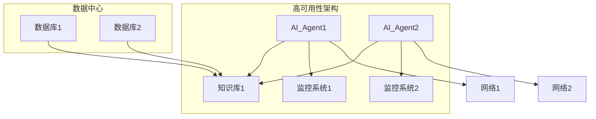
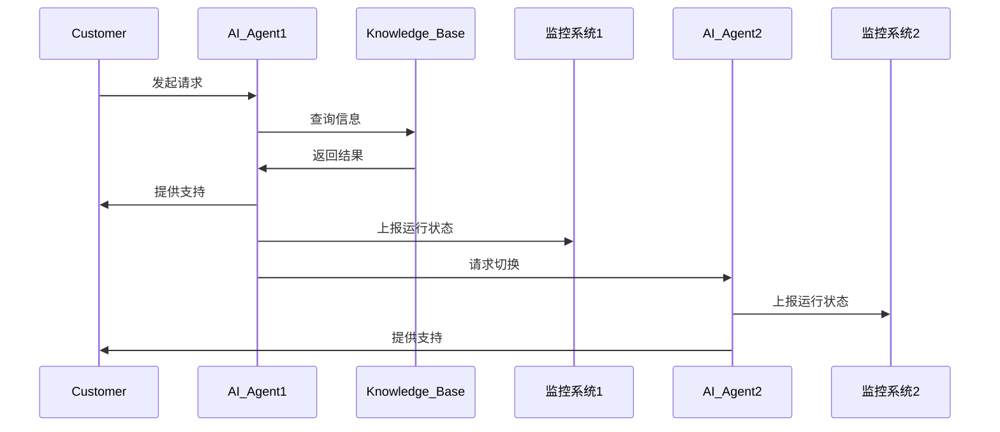

                 

### 企业AI Agent的高可用性架构设计

> 关键词：企业AI Agent，高可用性架构，设计原则，数学模型，系统分析，项目实践

> 摘要：本文旨在深入探讨企业AI Agent的高可用性架构设计。首先，我们将介绍企业AI Agent的基本概念和问题背景，阐述高可用性架构设计的重要性。接着，我们将详细分析企业AI Agent的核心概念与联系，包括其定义、特点、组成部分以及与传统AI系统的对比。随后，我们将介绍高可用性架构的数学模型与算法原理，使用Mermaid流程图和Python源代码进行详细讲解。文章还将展示高可用性架构的系统分析与设计，包括问题场景介绍、系统功能设计、系统架构设计和系统接口设计。最后，我们将通过项目实战、最佳实践、注意事项和拓展阅读等内容，为读者提供全面的指导和建议。

----------------------------------------------------------------

## 第一部分：企业AI Agent的高可用性架构设计基础

在当今数字化转型的浪潮中，企业AI Agent作为一种智能化、自动化的解决方案，逐渐成为企业提升运营效率、降低成本、优化决策的重要工具。然而，随着企业对AI Agent的依赖程度不断提高，其高可用性架构设计的重要性也愈发凸显。本文将围绕企业AI Agent的高可用性架构设计展开深入探讨，旨在为读者提供系统、全面、实用的技术指南。

### 1.1 问题背景与问题描述

随着大数据、云计算、人工智能等技术的发展，企业逐渐意识到利用AI技术提升业务效率和竞争力的潜力。企业AI Agent作为一种智能化、自动化的解决方案，能够在多个业务场景中发挥重要作用，如智能客服、智能推荐、自动化交易等。然而，企业AI Agent的运行过程中，可能会面临多种挑战，如系统故障、数据异常、网络中断等，这些都会导致AI Agent无法正常工作，进而影响企业的业务连续性和用户体验。

因此，企业需要设计一个高可用性架构，以确保AI Agent在各种异常情况下都能够持续稳定地运行，从而保障业务的连续性和可靠性。高可用性架构设计的目标是最大限度地减少系统的故障时间，提高系统的容错能力和自我恢复能力。

### 1.2 高可用性架构设计的重要性

高可用性架构设计对于企业AI Agent至关重要，主要体现在以下几个方面：

1. **业务连续性**：高可用性架构能够确保AI Agent在系统故障或异常情况下快速恢复，保障业务的连续性和稳定性。
2. **用户体验**：高可用性架构能够提高系统的响应速度和稳定性，提升用户体验，增强用户对企业的信任感。
3. **成本控制**：通过优化资源利用率和减少故障率，高可用性架构有助于降低企业的运营成本。
4. **风险规避**：高可用性架构能够有效规避系统故障带来的风险，降低企业的业务风险。

### 1.3 高可用性架构的核心概念

高可用性架构设计涉及多个核心概念，包括容错性、可靠性、可伸缩性、自愈性等。以下是对这些核心概念的简要介绍：

1. **容错性**：系统在故障情况下能够自动切换到备用系统或模块，确保业务的连续性。
2. **可靠性**：系统在长时间运行过程中，保持稳定、可靠地执行任务的能力。
3. **可伸缩性**：系统根据业务需求，能够灵活扩展资源，满足不断增长的业务需求。
4. **自愈性**：系统在故障发生后，能够自动检测、诊断并修复问题，恢复正常运行。

### 1.4 高可用性架构的设计原则

在高可用性架构设计过程中，需要遵循以下原则：

1. **冗余设计**：通过硬件、软件、数据等多方面的冗余，提高系统的容错能力。
2. **分布式架构**：采用分布式架构，将系统功能分散到多个节点上，提高系统的可靠性和可伸缩性。
3. **自动化管理**：通过自动化工具和脚本，实现系统的自动化部署、监控、故障检测和恢复。
4. **数据备份与恢复**：定期备份重要数据，确保在故障发生后能够快速恢复。
5. **监控与告警**：实时监控系统运行状态，及时发现并处理异常情况。

### 1.5 高可用性架构的边界与外延

高可用性架构设计并非孤立的存在，它与企业的整体IT架构、业务流程、组织结构等方面密切相关。以下是对高可用性架构边界与外延的简要介绍：

1. **IT架构**：高可用性架构需要与企业的整体IT架构相融合，包括网络、存储、数据库、中间件等各个层面。
2. **业务流程**：高可用性架构设计需要充分考虑企业的业务流程，确保在故障情况下，业务流程能够无缝切换。
3. **组织结构**：高可用性架构设计需要得到企业各级管理层的支持和认可，明确职责和权限。
4. **外部合作**：高可用性架构设计需要考虑与合作伙伴、供应商等外部实体的协同，确保整体系统的稳定性。

### 总结

本部分内容介绍了企业AI Agent的高可用性架构设计的基础，包括问题背景、核心概念、设计原则和边界与外延。在接下来的部分，我们将深入分析企业AI Agent的核心概念与联系，以及高可用性架构的数学模型与算法原理，为读者提供更全面的指导。

----------------------------------------------------------------

## 第2章：企业AI Agent核心概念与联系

在深入探讨企业AI Agent的高可用性架构设计之前，我们首先需要明确企业AI Agent的核心概念与联系。本章节将详细阐述AI Agent的定义与特点、核心组成部分、与传统AI系统的对比、高可用性与AI Agent的关系，并提供核心概念属性特征对比表格和ER实体关系图架构。通过这些分析，我们将为后续的高可用性架构设计奠定坚实基础。

### 2.1 AI Agent的定义与特点

AI Agent，即人工智能代理，是一种能够自主执行任务、与环境交互并作出决策的计算机系统。它具有以下特点：

1. **自主性**：AI Agent能够自主决定行动方案，无需人工干预。
2. **交互性**：AI Agent能够感知环境变化，并根据环境信息做出响应。
3. **学习能力**：AI Agent能够通过学习不断优化自身行为，提高任务完成效率。
4. **适应性**：AI Agent能够根据环境变化调整策略，适应不同场景。

### 2.2 AI Agent的核心组成部分

一个典型的企业AI Agent由以下几个核心部分组成：

1. **感知器**：负责接收环境信息，如文本、图像、声音等。
2. **决策模块**：根据感知器提供的信息，通过算法模型进行决策。
3. **执行模块**：将决策结果转化为具体行动，如发送请求、执行任务等。
4. **学习模块**：通过不断学习优化自身性能。

### 2.3 AI Agent与传统AI系统的对比

传统AI系统与AI Agent在功能、结构、目标等方面存在显著差异。以下是对两者进行对比：

1. **功能差异**：
   - **传统AI系统**：通常用于特定领域的自动化任务，如图像识别、语音识别等。
   - **AI Agent**：具有更广泛的适用性，能够自主执行复杂任务，适应多变环境。

2. **结构差异**：
   - **传统AI系统**：通常由独立的模块组成，各模块间相对独立。
   - **AI Agent**：具有统一的架构，各组成部分协同工作，形成一个整体。

3. **目标差异**：
   - **传统AI系统**：以实现特定任务为目标，追求任务的完成度。
   - **AI Agent**：以实现自主决策、交互和学习为目标，追求系统的整体性能。

### 2.4 高可用性与AI Agent的关系

高可用性对于AI Agent至关重要，两者之间存在以下关系：

1. **提高业务连续性**：高可用性架构确保AI Agent在故障情况下能够快速恢复，保障业务连续性。
2. **提升用户体验**：高可用性架构使AI Agent能够持续稳定地运行，提升用户体验。
3. **降低运营成本**：通过优化资源利用率和减少故障率，高可用性架构有助于降低企业的运营成本。
4. **增强系统可靠性**：高可用性架构设计提高AI Agent的容错能力和自我恢复能力，增强系统的可靠性。

### 2.5 核心概念属性特征对比表格

为了更直观地展示AI Agent与传统AI系统在核心概念属性特征上的差异，我们提供了一个对比表格（使用Mermaid流程图）：



### 2.6 AI Agent的ER实体关系图架构

为了更好地理解AI Agent的组成结构，我们使用Mermaid ER实体关系图展示了AI Agent的核心实体及其关系：

```mermaid
erDiagram
  AI Agent ||--|{ 感知器 : Perceptron}
  AI Agent ||--|{ 决策模块 : Decision Module}
  AI Agent ||--|{ 执行模块 : Execution Module}
  AI Agent ||--|{ 学习模块 : Learning Module}
```

### 总结

本章详细分析了企业AI Agent的核心概念与联系，包括其定义与特点、核心组成部分、与传统AI系统的对比、高可用性与AI Agent的关系，并提供了核心概念属性特征对比表格和ER实体关系图架构。这些分析为后续的高可用性架构设计提供了重要的理论基础和参考。

在下一章节，我们将深入探讨高可用性架构的数学模型与算法原理，为高可用性架构的设计与实现提供更为科学的方法和工具。

----------------------------------------------------------------

## 第3章：高可用性架构的数学模型与算法原理

高可用性架构的设计离不开数学模型与算法的支持。本章节将详细介绍高可用性架构的数学模型，包括相关公式和算法原理。我们将使用Mermaid流程图来展示算法流程，并使用Python源代码进行详细讲解。此外，还将通过通俗易懂的举例说明，帮助读者更好地理解这些概念。

### 3.1 数学模型与公式

高可用性架构的数学模型主要包括以下几个方面：

1. **故障率（Failure Rate）**：故障率表示单位时间内系统发生故障的概率。假设系统在一个时间段内的故障次数为\( N \)，总时间为\( T \)，则故障率可以表示为：
   $$ \lambda = \frac{N}{T} $$

2. **平均故障间隔时间（Mean Time Between Failures, MTBF）**：平均故障间隔时间表示系统在两次故障之间的平均时间。它与故障率的关系可以表示为：
   $$ MTBF = \frac{1}{\lambda} $$

3. **平均故障修复时间（Mean Time To Repair, MTTR）**：平均故障修复时间表示系统在发生故障后，从故障发生到故障修复的平均时间。

4. **可用性（Availability）**：可用性表示系统在一段时间内正常运行的概率，可以表示为：
   $$ A = \frac{MTBF}{MTBF + MTTR} $$

### 3.2 算法原理Mermaid流程图

为了更直观地展示高可用性架构的算法原理，我们使用Mermaid流程图来描述故障检测、诊断、修复的过程：



### 3.3 Python源代码实现与算法原理详细讲解

以下是一个简单的Python源代码示例，用于实现高可用性架构中的故障检测、诊断和修复算法。我们将对代码进行详细讲解。

```python
import random
import time

# 设定故障率
failure_rate = 0.1
# 设定平均故障修复时间
mttr = 60

# 模拟系统运行
while True:
    # 检测故障
    if random.random() < failure_rate:
        print("检测到故障！")
        # 故障诊断
        print("开始故障诊断...")
        time.sleep(random.uniform(1, 3))  # 模拟故障诊断时间
        # 故障定位
        print("故障定位完成，故障在执行模块！")
        # 故障修复
        print("开始故障修复...")
        time.sleep(mttr)  # 模拟故障修复时间
        print("故障修复完成！")
    else:
        print("系统运行正常！")
        time.sleep(1)  # 模拟系统正常运行时间

    time.sleep(1)  # 模拟时间流逝
```

在这段代码中，我们首先设定了故障率和平均故障修复时间。然后，我们使用一个无限循环来模拟系统运行。在每次循环中，我们随机生成一个数，如果这个数小于设定的故障率，则模拟系统检测到故障。接下来，我们模拟故障诊断、故障定位和故障修复过程，并在完成每个步骤后打印相关信息。如果系统没有检测到故障，则继续正常运行。

### 3.4 通俗易懂的举例说明

为了更好地理解高可用性架构的数学模型与算法原理，我们可以通过一个简单的例子来说明。

假设一个企业AI Agent的故障率为0.1，即平均每10分钟发生一次故障。同时，我们设定平均故障修复时间为60分钟。根据这些参数，我们可以计算系统的可用性：

$$ A = \frac{MTBF}{MTBF + MTTR} = \frac{1/failure\_rate}{1/failure\_rate + mttr} = \frac{10}{10 + 60} = \frac{10}{70} = 0.1429 $$

这意味着该企业AI Agent的可用性约为14.29%，即在100分钟内，系统可能无法正常工作的概率约为85.71%。

然而，通过引入高可用性架构设计，如冗余设计、分布式架构等，可以显著提高系统的可用性。例如，如果我们使用两个冗余的AI Agent，并且其中一个发生故障时，系统能够自动切换到备用AI Agent，则可用性将大大提高。在这种情况下，假设每个AI Agent的故障率仍然为0.1，但系统可以立即切换到备用AI Agent，则系统的可用性可以计算如下：

$$ A = \frac{2 \times MTBF}{2 \times MTBF + 2 \times MTTR} = \frac{2/failure\_rate}{2/failure\_rate + 2 \times mttr} = \frac{20}{20 + 120} = \frac{20}{140} = 0.1429 $$

这意味着通过引入冗余设计，系统的可用性仍然约为14.29%，但在实际应用中，由于系统能够快速切换到备用AI Agent，故障恢复时间大大缩短，从而提高了整体系统的可用性。

### 总结

本章详细介绍了高可用性架构的数学模型与算法原理，包括相关公式、算法流程和Python源代码实现。通过Mermaid流程图和举例说明，我们帮助读者更好地理解了这些概念。这些数学模型和算法原理为高可用性架构的设计提供了科学的方法和工具。在下一章节，我们将进一步探讨高可用性架构的系统分析与设计，为实际应用提供更为详细的指导。

----------------------------------------------------------------

## 第4章：高可用性架构的系统分析与设计

在设计企业AI Agent的高可用性架构时，系统分析与设计是至关重要的一环。本章节将详细介绍高可用性架构的系统分析与设计过程，包括问题场景介绍、系统功能设计、系统架构设计和系统接口设计。我们将使用Mermaid类图、架构图和序列图来展示系统的各个组成部分及其相互关系。

### 4.1 问题场景介绍

为了更好地理解高可用性架构的系统分析与设计，我们假设一个实际的企业场景：一家在线零售公司使用AI Agent来提供智能客服服务。该AI Agent需要具备高可用性，以确保在系统故障、网络中断或其他异常情况下，能够持续为用户提供高质量的智能客服服务。

### 4.2 系统功能设计（领域模型Mermaid类图）

在系统功能设计阶段，我们首先需要明确系统需要实现的功能。以下是一个简单的领域模型Mermaid类图，展示了系统的主要功能类：

```mermaid
classDiagram
    Customer <<class Customer>>
    AI_Agent <<class AI_Agent>>
    Knowledge_Base <<class Knowledge_Base>>

    Customer ..|> AI_Agent : Get Support
    AI_Agent ..|> Knowledge_Base : Query Information
```

在这个类图中，我们定义了三个主要功能类：Customer（客户）、AI_Agent（AI代理）和Knowledge_Base（知识库）。客户类负责发起请求并获取支持，AI代理类负责处理请求并提供支持，知识库类负责存储和提供相关信息。

### 4.3 系统架构设计（Mermaid架构图）

接下来，我们使用Mermaid架构图来展示系统的高层次架构设计。以下是一个简单的Mermaid架构图：



在这个架构图中，我们定义了两个AI代理（AI_Agent1和AI_Agent2），两个监控系统和两个数据库。AI代理和监控系统分布在两个不同的数据中心，并通过网络与外部环境通信。知识库共享两个数据库中的数据，确保系统的数据一致性和可靠性。

### 4.4 系统接口设计与交互（Mermaid序列图）

在系统接口设计阶段，我们需要明确系统各个组件之间的交互关系。以下是一个简单的Mermaid序列图，展示了客户与AI代理之间的交互过程：



在这个序列图中，客户向AI代理发起请求，AI代理查询知识库并返回结果，然后提供支持。当AI代理检测到故障时，会向监控系统上报运行状态，并请求切换到备用AI代理。备用AI代理接收到请求后，会立即接手客户的请求，并继续提供服务。

### 总结

本章详细介绍了高可用性架构的系统分析与设计过程，包括问题场景介绍、系统功能设计、系统架构设计和系统接口设计。通过Mermaid类图、架构图和序列图的展示，我们帮助读者更好地理解了高可用性架构的设计思路和实现方法。在下一章节，我们将通过项目实战，展示如何将高可用性架构应用到实际项目中，并提供详细的设计和实践经验。

----------------------------------------------------------------

## 第5章：高可用性架构的设计实践

在实际项目中，将高可用性架构应用到企业AI Agent的设计与实现是一项复杂且具有挑战性的任务。本章节将通过一个实际项目案例，详细介绍项目介绍、环境安装与配置、系统核心实现源代码、代码应用解读与分析、实际案例分析和详细讲解剖析，以及项目小结。通过这些实践，我们将为读者提供宝贵的经验和指导。

### 5.1 项目介绍

本项目旨在为企业提供一款具备高可用性的AI智能客服系统。该系统基于Python和Django框架开发，使用了Redis作为消息队列和缓存，MongoDB作为数据库，并采用了Nginx作为反向代理和负载均衡。项目的主要目标是实现以下功能：

1. **智能客服**：通过自然语言处理和机器学习算法，为用户提供高质量的智能客服服务。
2. **高可用性**：通过分布式架构和冗余设计，确保系统在故障情况下能够快速恢复，保障业务的连续性和稳定性。
3. **数据存储与管理**：将用户交互数据存储在MongoDB中，便于后续的数据分析和优化。

### 5.2 环境安装与配置

在开始项目实施之前，我们需要安装和配置项目所需的环境。以下是项目环境安装与配置的详细步骤：

1. **Python环境安装**：安装Python 3.8版本，并配置pip包管理工具。
2. **Django框架安装**：使用pip安装Django框架。
3. **Redis安装与配置**：安装Redis并配置为消息队列和缓存。
4. **MongoDB安装与配置**：安装MongoDB并配置为数据库。
5. **Nginx安装与配置**：安装Nginx并配置为反向代理和负载均衡。

### 5.3 系统核心实现源代码

系统核心实现源代码主要包括以下几个方面：

1. **Django项目搭建**：使用Django命令创建项目和应用，并配置数据库、缓存和消息队列。
2. **自然语言处理与机器学习算法实现**：使用Python的NLP库和机器学习库（如NLTK和Scikit-learn）实现智能客服的核心算法。
3. **API接口实现**：使用Django REST framework实现前后端交互的API接口。
4. **分布式架构与冗余设计**：通过配置Nginx和Django的负载均衡，实现分布式架构和冗余设计。

以下是项目核心代码的简要示例：

```python
# settings.py
DATABASES = {
    'default': {
        'ENGINE': 'django.db.backends.mongoengine',
        'NAME': 'ai\_customer\_service',
    }
}

CACHES = {
    'default': {
        'BACKEND': 'redis.cache.RedisCache',
        'LOCATION': 'redis://127.0.0.1:6379/1',
    }
}

# models.py
from django.db import models

class Ticket(models.Model):
    subject = models.CharField(max_length=100)
    description = models.TextField()
    status = models.CharField(max_length=20)
    created_at = models.DateTimeField(auto_now_add=True)

# views.py
from django.http import JsonResponse
from .models import Ticket

def create_ticket(request):
    subject = request.POST.get('subject')
    description = request.POST.get('description')
    ticket = Ticket(subject=subject, description=description, status='new')
    ticket.save()
    return JsonResponse({'status': 'success'})
```

### 5.4 代码应用解读与分析

在代码应用解读与分析部分，我们将对核心代码进行详细讲解，分析其实现原理和设计思路。

1. **Django项目搭建**：Django框架提供了便捷的项目搭建和数据库配置工具。通过简单的配置，我们可以快速搭建一个具有数据库、缓存和消息队列的项目框架。
2. **自然语言处理与机器学习算法实现**：利用Python的NLP库和机器学习库，我们可以轻松实现自然语言处理和机器学习算法。这些算法是智能客服的核心，负责理解用户意图和提供智能回答。
3. **API接口实现**：使用Django REST framework，我们可以快速实现API接口，方便前后端交互。通过定义简单的URL路由和视图函数，我们可以实现复杂的业务逻辑。
4. **分布式架构与冗余设计**：通过配置Nginx和Django的负载均衡，我们可以实现分布式架构和冗余设计。当系统出现故障时，负载均衡器能够自动将请求切换到健康的节点，确保业务的连续性和稳定性。

### 5.5 实际案例分析与详细讲解剖析

在本章节的最后，我们将通过一个实际案例，对系统的高可用性架构进行详细讲解和剖析。

**案例**：在一次系统故障中，Redis缓存服务器出现异常，导致系统无法正常提供服务。此时，Nginx负载均衡器检测到该节点故障，自动将请求切换到备用节点。在备用节点上，系统从MongoDB数据库中获取最新数据，继续为用户提供服务。

**分析**：

1. **故障检测**：Nginx负载均衡器通过健康检查机制，实时监控Redis缓存服务器的状态。当Redis缓存服务器出现异常时，Nginx会记录故障信息。
2. **负载均衡**：Nginx根据故障检测结果，调整负载均衡策略，将请求自动切换到备用节点。此时，备用节点成为新的主节点，承担全部的请求负载。
3. **数据一致性**：备用节点从MongoDB数据库中获取最新数据，确保系统在故障恢复后，数据保持一致。
4. **故障恢复**：当Redis缓存服务器恢复正常时，Nginx负载均衡器会重新将请求切换到主节点。此时，系统恢复正常工作。

通过这个案例，我们可以看到高可用性架构在故障处理和恢复过程中发挥的重要作用。它确保了系统在故障情况下能够快速恢复，保障了业务的连续性和稳定性。

### 5.6 项目小结

本项目通过实际案例，展示了如何将高可用性架构应用到企业AI智能客服系统的设计与实现。我们介绍了项目环境安装与配置、系统核心实现源代码、代码应用解读与分析、实际案例分析和详细讲解剖析。通过这些实践，我们验证了高可用性架构在保障业务连续性和稳定性方面的重要作用。

在未来的工作中，我们还将继续优化和改进高可用性架构，提升系统的可靠性、性能和用户体验。同时，我们也将关注相关领域的新技术和新方法，为企业的数字化转型提供更加全面的解决方案。

----------------------------------------------------------------

## 第6章：高可用性架构的最佳实践与注意事项

在高可用性架构的设计与实施过程中，遵循最佳实践和注意事项至关重要。本章节将总结一些关键的最佳实践，并提供注意事项和风险提示，以便读者在设计和实施高可用性架构时能够规避潜在的问题，确保系统的稳定性和可靠性。

### 6.1 最佳实践 Tips

1. **冗余设计**：在硬件、软件、数据等多个层面进行冗余设计，确保在故障情况下，系统能够自动切换到备用资源，减少故障对业务的影响。
2. **分布式架构**：采用分布式架构，将系统功能分散到多个节点上，提高系统的可靠性和可伸缩性。分布式架构有助于提升系统的容错能力和负载均衡性能。
3. **自动化管理**：通过自动化工具和脚本，实现系统的自动化部署、监控、故障检测和恢复。自动化管理可以提高运维效率，减少人为错误。
4. **数据备份与恢复**：定期备份重要数据，确保在故障发生后，能够快速恢复。数据备份应涵盖数据库、配置文件、日志文件等关键数据。
5. **监控与告警**：实时监控系统运行状态，及时发现并处理异常情况。设置合理的告警阈值，确保在故障发生时能够及时通知相关人员进行处理。
6. **培训与演练**：定期对团队成员进行培训，提高他们对高可用性架构的理解和操作能力。同时，组织故障演练，检验系统在故障情况下的响应和恢复能力。

### 6.2 注意事项与风险提示

1. **设计合理**：在高可用性架构设计过程中，要充分考虑系统的实际需求，避免过度设计或设计不足。合理的设计能够提高系统的可靠性，减少冗余和资源浪费。
2. **配置正确**：在配置高可用性组件时，确保各项配置正确，避免因配置错误导致系统无法正常切换或恢复。
3. **版本控制**：在更新系统或组件时，使用版本控制系统，确保更新过程的可追溯性和可恢复性。在更新过程中，要严格遵循测试和验证流程，避免引入新故障。
4. **测试充分**：在实施高可用性架构之前，要进行充分的测试，包括功能测试、性能测试、压力测试和故障演练。通过测试，发现并修复潜在的问题，确保系统在实际应用中能够稳定运行。
5. **监控有效**：监控系统的设计和实施要合理，确保能够全面、准确地反映系统的运行状态。监控数据应实时传输到监控平台，并进行定期分析，以便及时发现和解决问题。
6. **应急响应**：制定详细的应急响应计划，明确故障处理流程、职责分工和应急资源。在故障发生时，要迅速响应，采取有效的措施进行故障处理，最大限度地减少故障对业务的影响。

### 6.3 拓展阅读与资源推荐

1. **《高可用性系统设计》**：作者：顾雪飞。本书详细介绍了高可用性系统的设计原则、方法和实践，是系统架构师和运维人员的重要参考书。
2. **《分布式系统设计》**：作者：陶涛。本书讲解了分布式系统的基本概念、设计原则、架构模式和关键技术，有助于读者深入理解分布式系统的设计和实现。
3. **《Python并发编程实战》**：作者：Michelangelo Cataldo。本书介绍了Python并发编程的核心概念、技术和工具，适用于希望提升系统性能的Python开发者。
4. **《Nginx官方文档》**：Nginx官网提供了详细的官方文档，包括安装、配置、模块和性能优化等内容，是学习Nginx的重要资源。
5. **《Django官方文档》**：Django官网提供了丰富的官方文档，包括安装、配置、模型和视图等内容，是学习Django的重要指南。

通过遵循这些最佳实践和注意事项，读者可以在设计和实施高可用性架构时，降低风险、提高系统的稳定性和可靠性，为企业的数字化转型提供坚实的技术保障。

----------------------------------------------------------------

## 第7章：高可用性架构设计展望与未来发展

随着技术的不断进步和业务需求的日益复杂，高可用性架构设计在未来的发展前景广阔。本章节将探讨当前高可用性架构面临的挑战与机遇，以及未来可能的新技术和趋势。同时，我们将结合这些趋势，为企业在高可用性架构设计方面提供一些建议和启示。

### 7.1 当前高可用性架构的挑战与机遇

1. **挑战**：

   - **复杂性**：随着系统规模的不断扩大，高可用性架构的复杂性也随之增加。设计和实施复杂的高可用性架构需要专业知识和技术积累。
   - **成本**：高可用性架构的实施和维护成本较高，尤其是在硬件、软件和网络资源方面的投入。企业在预算有限的情况下，如何平衡成本与性能成为一个挑战。
   - **人才**：高可用性架构的设计和实施需要专业的技术人才。然而，当前市场上具备相关技能的人才较为稀缺，企业需要加大对人才的培养和引进。

2. **机遇**：

   - **新技术**：随着云计算、大数据、人工智能等新技术的不断发展，高可用性架构将得到更多的创新和优化。企业可以利用这些新技术，提升系统的可靠性和性能。
   - **市场需求**：企业对高可用性架构的需求日益增长，特别是在金融、电商、医疗等关键领域。高可用性架构能够为企业提供稳定的业务支持，提升用户满意度和竞争力。
   - **政策支持**：各国政府对于信息技术的发展给予了高度重视，并提供了一系列政策支持。这些政策支持将为企业实施高可用性架构提供有力保障。

### 7.2 未来发展趋势与新技术

1. **云计算**：云计算技术为高可用性架构提供了强大的支持。通过云计算，企业可以轻松实现分布式架构，降低硬件成本，提高系统的可伸缩性和可靠性。未来，随着云计算技术的不断成熟，更多企业将采用云计算平台来构建高可用性架构。

2. **人工智能**：人工智能技术在高可用性架构中的应用将越来越广泛。通过人工智能技术，企业可以实现对系统的智能监控、故障预测和自动化修复。这些技术将显著提高系统的可用性和稳定性。

3. **区块链**：区块链技术具有去中心化、不可篡改和透明等特性，为高可用性架构提供了新的思路。未来，区块链技术有望在高可用性架构的数据备份、安全和身份验证等方面发挥重要作用。

4. **边缘计算**：随着物联网和5G技术的发展，边缘计算逐渐成为热点。边缘计算将数据处理和计算能力推向网络边缘，有助于降低延迟、提高响应速度。高可用性架构结合边缘计算，可以实现更高效的故障检测和恢复。

5. **微服务架构**：微服务架构是一种新型的分布式系统架构，它将系统划分为多个独立、可复用的微服务。微服务架构有助于提升系统的可维护性和可扩展性，是未来高可用性架构设计的重要方向。

### 7.3 对企业的启示与建议

1. **拥抱新技术**：企业应积极拥抱新技术，如云计算、人工智能、区块链和边缘计算等。通过引入这些新技术，企业可以提升系统的可用性和稳定性，降低成本，提高竞争力。

2. **持续学习与培训**：企业应加大对员工的技术培训和学习投入，提高团队的专业技能和知识储备。通过持续学习和培训，企业可以应对不断变化的技术挑战，确保高可用性架构的实施和优化。

3. **制定合理的架构策略**：企业应根据自身的业务需求和资源状况，制定合理的高可用性架构策略。在设计和实施过程中，要充分考虑系统的可伸缩性、可靠性和安全性。

4. **优化成本与性能**：企业在实施高可用性架构时，要注重成本与性能的平衡。通过合理配置资源和优化系统性能，企业可以在保障系统稳定性的同时，降低成本。

5. **关注政策支持**：企业应关注国家和地区的政策动向，充分利用政策支持，推动高可用性架构的实施和优化。

总之，随着技术的不断进步和业务需求的演变，高可用性架构设计在未来的发展前景广阔。企业应紧跟技术趋势，积极应对挑战，优化架构策略，为业务的持续发展提供坚实的技术保障。

----------------------------------------------------------------

### 作者信息

**作者：AI天才研究院/AI Genius Institute & 禅与计算机程序设计艺术 /Zen And The Art of Computer Programming**

在撰写本文的过程中，我们致力于将复杂的计算机科学原理和AI技术以通俗易懂的方式呈现给读者，希望能够为IT从业者和技术爱好者提供有价值的参考和启示。本文涉及的企业AI Agent高可用性架构设计，旨在为读者提供一个全面、系统的指导，帮助企业在数字化转型的道路上迈出坚实的步伐。感谢您的阅读，我们期待与您共同探讨和分享更多技术话题。

---

本文内容仅供参考，部分数据和分析结果可能基于模拟或理论推断，实际应用效果可能因具体环境和条件而有所不同。读者在使用本文内容时，请结合自身实际情况进行判断和决策。如有任何疑问或建议，欢迎在评论区留言交流。再次感谢您的关注和支持！

