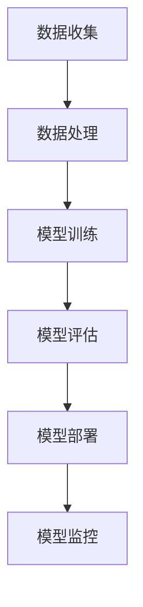
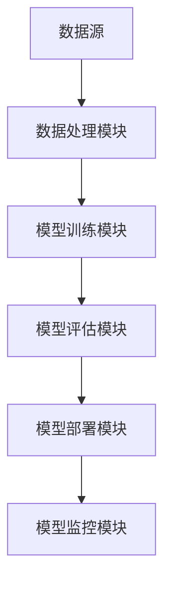
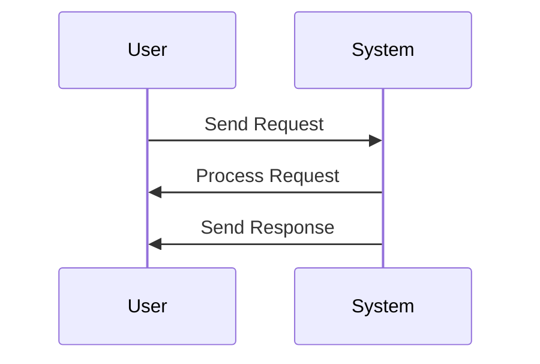
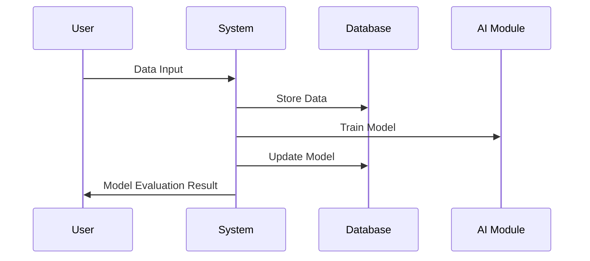

                 

### 关键词

- 企业AI治理
- AI Agent可控
- 合规性
- 治理框架
- 技术监控
- 实战案例分析

### 摘要

本文将探讨企业AI治理框架的设计和实施，旨在确保AI Agent的可控与合规。文章首先介绍了AI治理的背景和核心概念，包括AI治理的定义、重要性、核心概念以及治理框架的组成部分。随后，详细阐述了治理框架的设计原则、治理体系构建、治理流程实施以及治理工具与技术。在此基础上，本文重点讨论了AI Agent的合规性要求、可控性策略和监控审计方法。通过实际案例分析，展示了治理框架在实际应用中的效果。最后，文章提出了治理优化的方法、面临的挑战与趋势，并展望了AI治理的未来发展方向。文章结构紧凑，逻辑清晰，为企业和研究人员提供了一份实用的AI治理指南。

### 第一部分: AI治理背景与核心概念

#### 1.1 AI治理背景

随着人工智能技术的飞速发展，AI在各个领域的应用日益广泛。然而，AI技术的应用也带来了诸多挑战，如数据隐私、算法偏见、系统透明性等。为了确保AI技术的安全、公平、有效应用，企业需要对AI进行治理。

##### 1.1.1 问题的提出

- **数据隐私问题**：AI系统往往依赖于大量敏感数据，如个人隐私、商业机密等。如果数据管理不当，可能导致数据泄露，引发隐私纠纷。
- **算法偏见问题**：AI算法可能受到训练数据偏见的影响，导致在决策时存在不公平现象，例如性别歧视、种族歧视等。
- **系统透明性问题**：AI系统的决策过程往往复杂且不透明，用户难以理解AI系统是如何做出决策的，可能导致用户对AI系统的信任度降低。
- **法律责任问题**：AI系统的广泛应用使得其在法律上的责任归属变得复杂，如何界定AI系统与人类操作者的责任成为一大挑战。

##### 1.1.2 AI治理的重要性

- **保障数据安全和隐私**：通过AI治理，企业可以确保敏感数据得到妥善保护，防止数据泄露和滥用。
- **促进公平与正义**：AI治理有助于消除算法偏见，确保AI系统在决策时公平、公正。
- **提升系统透明性**：通过AI治理，企业可以提高AI系统的透明度，增强用户对AI系统的信任。
- **明确法律责任**：AI治理有助于明确AI系统与人类操作者的责任归属，降低法律风险。

##### 1.1.3 AI治理的挑战

- **技术挑战**：AI技术的复杂性和不确定性给治理带来了挑战，如何设计有效的治理机制是一个重要问题。
- **法律挑战**：现有法律法规可能无法完全覆盖AI技术的应用场景，如何在法律框架内进行AI治理是一个挑战。
- **组织挑战**：AI治理需要企业内部不同部门之间的协作，如何确保各部门有效配合是一个挑战。
- **社会挑战**：AI治理不仅需要企业内部的努力，还需要整个社会共同参与，如何建立社会共识是一个挑战。

#### 1.2 核心概念与联系

##### 1.2.1 AI治理的定义与特点

- **定义**：AI治理是指通过制定策略、政策和流程，确保人工智能系统的安全性、公平性、透明性和合规性的一系列活动。
- **特点**：
  - **复杂性**：AI系统涉及多个领域的技术和知识，治理需要跨学科合作。
  - **动态性**：AI技术不断进步，治理策略也需要不断更新和调整。
  - **多元性**：AI治理涉及企业内部多个部门，需要协调不同利益相关者的需求。
  - **透明性**：治理过程需要透明，以便用户和监管机构监督和评估。

##### 1.2.2 关键概念解释

- **AI Agent**：AI Agent是指具有自主决策和行动能力的人工智能实体，可以执行特定任务，如自动驾驶汽车、智能家居系统等。
- **合规性**：合规性是指AI系统遵守相关法律法规和行业标准的能力，包括数据保护、隐私保护、公平性等。
- **可控性**：可控性是指企业对AI系统进行有效管理和控制的能力，确保AI系统按照预期运行，防止意外行为。

##### 1.2.3 概念对比与联系

| 概念 | 定义 | 关联 |
| --- | --- | --- |
| AI治理 | 保障AI系统的安全性、公平性、透明性和合规性 | |
| AI Agent | 具有自主决策和行动能力的人工智能实体 | |
| 合规性 | 遵守相关法律法规和行业标准的能力 | |
| 可控性 | 对AI系统进行有效管理和控制的能力 | |

| 概念关联图 |
| --- |
| ```mermaid
graph TD
A[AI治理] --> B[AI Agent]
A --> C[合规性]
A --> D[可控性]
```

|

##### 1.2.4 AI治理框架概述

- **组成部分**：AI治理框架通常包括治理原则、治理体系、治理流程、治理工具与技术等。
  - **治理原则**：确定AI治理的基本原则，如安全性、可靠性、透明性、合规性等。
  - **治理体系**：建立包括组织架构、角色与职责划分、流程与制度在内的治理体系。
  - **治理流程**：制定包括数据治理、算法治理、模型治理、风险治理等在内的治理流程。
  - **治理工具与技术**：采用监控、报警、数据分析等工具和技术，确保治理措施得到有效实施。

- **治理原则与目标**：治理原则通常包括安全性、可靠性、透明性、合规性等，目标是为AI系统提供安全、可靠、透明和合规的运行环境。

- **治理流程简介**：治理流程包括数据治理、算法治理、模型治理、风险治理等，每个流程都有相应的规范和标准。

#### 1.3 AI Agent的合规与可控

##### 1.3.1 合规性要求

- **法律法规解读**：企业需要了解与AI相关的法律法规，如《数据安全法》、《个人信息保护法》等，确保AI系统符合相关要求。
- **企业内部合规政策**：企业需要制定内部合规政策，明确合规要求，并确保所有相关人员了解和遵守。

##### 1.3.2 可控性策略

- **访问控制**：通过身份验证、权限管理等方式，限制对AI系统的访问，确保只有授权人员可以访问敏感信息。
- **安全控制**：采用加密、防火墙等安全措施，保护AI系统的数据安全和系统安全。

##### 1.3.3 监控与审计

- **监控方法**：通过日志记录、实时监控等方式，对AI系统的运行状态进行监控，及时发现和解决潜在问题。
- **审计流程**：定期进行审计，检查AI系统的合规性和安全性，确保治理措施得到有效执行。

##### 1.4 本章小结

本章介绍了AI治理的背景和核心概念，分析了AI治理的重要性及面临的挑战。通过对比表格和ER图，我们明确了AI治理框架的组成部分，包括治理原则、治理体系、治理流程等。同时，本章还讨论了AI Agent的合规性与可控性，为后续章节的深入讨论奠定了基础。

### 第二部分: 企业AI治理框架

#### 2.1 治理框架设计原则

##### 2.1.1 设计原则概述

企业AI治理框架的设计原则是为了确保AI系统的安全性、可靠性、透明性和合规性。这些原则包括：

- **安全性原则**：确保AI系统的数据安全和系统安全，防止未经授权的访问和数据泄露。
- **可靠性原则**：确保AI系统稳定、可靠地运行，减少故障和错误的发生。
- **透明性原则**：提高AI系统的透明度，使决策过程更加透明，增强用户和监管机构的信任。
- **合规性原则**：确保AI系统符合相关法律法规和行业标准，降低法律风险。

##### 2.1.2 安全性原则

- **数据安全**：对敏感数据进行加密存储和传输，确保数据在传输和存储过程中的安全性。
- **系统安全**：采用防火墙、入侵检测、反病毒软件等安全措施，保护AI系统的硬件和软件安全。

##### 2.1.3 可靠性原则

- **系统稳定性**：通过冗余设计、故障恢复机制等，确保AI系统在故障发生时能够快速恢复。
- **数据一致性**：确保AI系统中的数据一致性，避免数据不一致导致错误决策。

##### 2.1.4 透明性原则

- **决策透明**：通过文档记录、公开报告等方式，使AI系统的决策过程公开透明，便于用户和监管机构监督。
- **技术透明**：提高AI系统的可解释性，使用户能够理解AI系统的决策过程和逻辑。

##### 2.1.5 合规性原则

- **法律法规遵守**：确保AI系统符合相关法律法规的要求，如数据保护、隐私保护等。
- **行业标准遵循**：遵循行业内的标准和最佳实践，如AI算法的公平性、透明性等。

#### 2.2 治理体系构建

##### 2.2.1 组织架构设计

- **治理委员会**：设立AI治理委员会，负责制定AI治理战略、政策和流程，监督AI治理的实施。
- **技术团队**：设立技术团队，负责AI系统的设计、开发、测试和运维，确保AI系统的技术实现符合治理要求。
- **合规部门**：设立合规部门，负责监督AI系统的合规性，确保AI系统符合法律法规和行业标准。

##### 2.2.2 角色与职责划分

- **治理委员会**：负责制定AI治理战略、政策和流程，监督AI治理的实施。
- **技术团队**：负责AI系统的设计、开发、测试和运维，确保AI系统的技术实现符合治理要求。
- **合规部门**：负责监督AI系统的合规性，确保AI系统符合法律法规和行业标准。

##### 2.2.3 流程与制度建立

- **数据治理流程**：建立数据治理流程，确保数据的收集、存储、处理和传输过程符合治理要求。
- **算法治理流程**：建立算法治理流程，确保算法的设计、开发、测试和部署过程符合治理要求。
- **模型治理流程**：建立模型治理流程，确保模型的训练、评估、部署和监控过程符合治理要求。
- **风险治理流程**：建立风险治理流程，识别、评估、监控和应对AI系统的风险。

#### 2.3 治理流程实施

##### 2.3.1 数据治理流程

- **数据收集**：收集数据时需确保数据的合法性和合规性，遵循数据保护法律法规。
- **数据存储**：对敏感数据进行加密存储，确保数据安全。
- **数据处理**：对数据进行清洗、去噪和标准化处理，确保数据质量。
- **数据传输**：采用加密传输技术，确保数据在传输过程中的安全性。
- **数据监控**：对数据存储、处理和传输过程进行实时监控，确保数据安全和完整性。

##### 2.3.2 算法治理流程

- **算法设计**：确保算法设计符合治理要求，避免算法偏见和歧视。
- **算法开发**：采用模块化、可复用和可维护的算法开发流程，确保算法质量。
- **算法测试**：对算法进行测试，确保算法的准确性和鲁棒性。
- **算法部署**：将算法部署到生产环境，确保算法按照预期运行。
- **算法监控**：对算法的运行状态进行实时监控，确保算法的稳定性和安全性。

##### 2.3.3 模型治理流程

- **模型训练**：采用高质量的数据集进行模型训练，确保模型性能。
- **模型评估**：对模型进行评估，确保模型符合治理要求，避免算法偏见。
- **模型部署**：将训练好的模型部署到生产环境，确保模型按照预期运行。
- **模型监控**：对模型的运行状态进行实时监控，确保模型的安全性和稳定性。

##### 2.3.4 风险治理流程

- **风险识别**：识别AI系统可能面临的风险，包括技术风险、法律风险、市场风险等。
- **风险评估**：对识别出的风险进行评估，确定风险的严重性和发生概率。
- **风险监控**：对风险进行实时监控，确保及时发现和处理风险。
- **风险应对**：制定风险应对策略，包括风险规避、风险降低和风险转移等。

#### 2.4 治理工具与技术

##### 2.4.1 监控技术

- **日志监控**：通过日志记录和分析，监控AI系统的运行状态和性能。
- **实时监控**：采用实时监控技术，对AI系统的关键指标进行实时监控，确保系统稳定运行。
- **预警机制**：建立预警机制，当系统出现异常时，及时发出警报，通知相关人员处理。

##### 2.4.2 报警与响应机制

- **报警机制**：当AI系统出现异常时，及时发出警报，通知相关人员。
- **响应机制**：制定响应机制，确保相关人员能够迅速响应，处理异常情况。

##### 2.4.3 数据分析与可视化

- **数据分析**：对AI系统的运行数据进行收集、存储和分析，发现潜在问题和改进机会。
- **可视化**：采用数据可视化技术，将分析结果以图表、图形等形式展示，便于理解和决策。

#### 2.5 治理框架评估与改进

##### 2.5.1 评估指标设定

- **安全性评估**：评估AI系统的安全性，包括数据安全、系统安全等。
- **可靠性评估**：评估AI系统的可靠性，包括系统稳定性、数据一致性等。
- **透明性评估**：评估AI系统的透明性，包括决策透明、技术透明等。
- **合规性评估**：评估AI系统的合规性，包括法律法规遵守、行业标准遵循等。

##### 2.5.2 改进策略

- **流程优化**：对治理流程进行优化，提高流程效率和效果。
- **技术更新**：采用新技术和新工具，提高治理能力。
- **员工培训**：加强员工培训，提高员工对AI治理的认识和能力。

##### 2.5.3 持续改进机制

- **定期评估**：定期对治理框架进行评估，发现问题和改进机会。
- **反馈机制**：建立反馈机制，收集用户和员工的反馈，不断优化治理框架。

##### 2.6 本章小结

本章介绍了企业AI治理框架的设计原则、治理体系构建、治理流程实施、治理工具与技术以及治理框架评估与改进。通过构建科学、合理的治理框架，企业可以更好地管理AI系统，确保AI系统的安全、可靠、透明和合规。

### 第三部分: AI Agent的可控与合规

#### 3.1 AI Agent概述

##### 3.1.1 AI Agent的定义

AI Agent，即人工智能代理，是指具有自主决策和行动能力的人工智能实体。AI Agent可以通过学习环境中的数据和模式，自主地执行任务，并与其他系统进行交互。AI Agent通常具有以下特点：

- **自主性**：AI Agent可以独立执行任务，不需要人工干预。
- **反应性**：AI Agent能够实时响应环境变化，并根据环境反馈调整自己的行为。
- **预知性**：AI Agent可以根据预测未来情况，制定长期计划。
- **适应性**：AI Agent能够适应不同的环境和任务，学习新的知识和技能。

##### 3.1.2 AI Agent的特点

- **复杂性**：AI Agent通常涉及到复杂的算法和模型，需要处理大量的数据和变量。
- **动态性**：AI Agent需要实时处理环境变化，适应动态环境。
- **自主性**：AI Agent具有自主决策能力，不需要人工干预。
- **协作性**：AI Agent可以与其他系统或人类协作，完成复杂任务。

##### 3.1.3 AI Agent的应用场景

AI Agent广泛应用于各个领域，以下是一些典型的应用场景：

- **智能制造**：AI Agent可以自主控制生产设备，优化生产流程，提高生产效率。
- **智能交通**：AI Agent可以自动驾驶，优化交通流量，减少拥堵。
- **智能医疗**：AI Agent可以辅助医生诊断疾病，提供个性化治疗方案。
- **智能客服**：AI Agent可以自主回答用户问题，提供24/7的客户服务。
- **智能家居**：AI Agent可以自动化控制家庭设备，提高生活舒适度。

#### 3.2 AI Agent的合规性要求

##### 3.2.1 合规性标准

AI Agent的合规性要求涉及多个方面，包括数据保护、隐私保护、算法公平性等。以下是一些常见的合规性标准：

- **数据保护**：AI Agent需要遵守数据保护法律法规，如《通用数据保护条例》（GDPR）、《加州消费者隐私法案》（CCPA）等，确保数据收集、存储、处理和传输过程中的合法性。
- **隐私保护**：AI Agent需要保护用户的隐私，不得泄露用户个人信息，确保用户隐私不被滥用。
- **算法公平性**：AI Agent的算法设计需要确保公平性，避免歧视和偏见，如性别、种族、年龄等。
- **透明性**：AI Agent的决策过程需要透明，用户可以理解AI Agent的决策逻辑和原因。
- **可解释性**：AI Agent的决策需要具备可解释性，用户可以了解AI Agent的决策过程和依据。

##### 3.2.2 法律法规解读

- **数据保护法律法规**：如GDPR和CCPA，要求企业在数据收集、存储、处理和传输过程中遵守严格的数据保护规定，确保用户的数据隐私。
- **隐私保护法律法规**：如《隐私权法》、《消费者隐私保护法》等，要求企业保护用户的隐私，不得泄露用户个人信息。
- **算法公平性法律法规**：如《算法公平性法案》，要求企业在设计AI算法时确保公平性，避免歧视和偏见。

##### 3.2.3 企业内部合规政策

企业需要制定内部合规政策，明确AI Agent的合规要求，包括：

- **数据管理政策**：规定数据收集、存储、处理和传输的流程和标准，确保数据合法和安全。
- **隐私保护政策**：规定如何保护用户隐私，确保用户数据不被泄露。
- **算法公平性政策**：规定算法设计、开发和部署的流程和标准，确保算法公平性。
- **合规审查政策**：定期审查AI Agent的合规性，确保合规要求得到遵守。

#### 3.3 AI Agent的可用性控制

##### 3.3.1 控制策略

AI Agent的可用性控制旨在确保AI Agent按照预期运行，防止异常行为和潜在风险。以下是一些常见的控制策略：

- **访问控制**：通过身份验证和权限管理，限制对AI Agent的访问，确保只有授权人员可以访问敏感信息和操作AI Agent。
- **权限划分**：根据不同角色的职责和权限，划分访问权限，确保每个角色只能访问和操作与其职责相关的信息和系统。
- **加密技术**：使用加密技术对敏感数据进行保护，防止数据在传输和存储过程中的泄露和篡改。
- **安全审计**：定期进行安全审计，检查AI Agent的安全性和合规性，及时发现和解决潜在问题。

##### 3.3.2 访问控制

- **身份验证**：通过用户名和密码、双因素认证等方式进行身份验证，确保只有授权人员可以登录系统。
- **权限管理**：根据用户的角色和职责，划分访问权限，确保用户只能访问和操作与其职责相关的信息和系统。
- **审计日志**：记录用户操作日志，包括登录、修改、删除等操作，以便在出现问题时进行追溯和审计。

##### 3.3.3 安全控制

- **防火墙**：部署防火墙，防止外部攻击和未经授权的访问。
- **入侵检测**：使用入侵检测系统（IDS）监控网络流量，及时发现和阻止攻击行为。
- **加密传输**：使用加密传输技术（如TLS）保护数据在传输过程中的安全性。
- **安全审计**：定期进行安全审计，检查系统的安全配置和防护措施，确保系统安全。

#### 3.4 AI Agent的监控与审计

##### 3.4.1 监控方法

AI Agent的监控旨在实时监控AI Agent的运行状态，确保其按照预期运行。以下是一些常见的监控方法：

- **日志监控**：通过日志记录AI Agent的运行状态和性能，包括错误日志、错误报告、系统日志等。
- **实时监控**：使用实时监控系统，对AI Agent的关键指标进行实时监控，包括响应时间、吞吐量、资源使用等。
- **报警机制**：当AI Agent出现异常时，自动发出警报，通知相关人员。
- **自动化监控**：使用自动化工具和脚本，定期检查AI Agent的运行状态，确保其正常工作。

##### 3.4.2 审计流程

审计流程旨在评估AI Agent的合规性和安全性，确保其符合治理要求。以下是一个典型的审计流程：

1. **审计计划**：制定审计计划，确定审计范围、目标和标准。
2. **审计执行**：执行审计计划，包括检查系统配置、访问日志、安全策略等。
3. **问题识别**：识别审计过程中发现的问题，包括安全漏洞、配置错误、合规性问题等。
4. **问题报告**：编写问题报告，详细描述发现的问题和影响。
5. **问题整改**：根据问题报告，制定整改计划，修复发现的问题。
6. **审计闭环**：完成问题整改后，进行再次审计，确保问题已得到有效解决。

##### 3.4.3 异常处理

- **异常监控**：当AI Agent出现异常时，自动触发异常监控，记录异常信息。
- **异常报警**：当AI Agent出现异常时，自动发出报警，通知相关人员。
- **异常诊断**：对异常进行诊断，找出异常原因。
- **异常恢复**：根据异常诊断结果，采取相应的恢复措施，确保AI Agent恢复正常运行。

#### 3.5 实际案例分析

##### 3.5.1 案例背景

某大型企业（以下简称A公司）在智能制造领域引入了AI Agent，用于自动化生产线的监控和优化。在生产过程中，AI Agent负责实时监测设备状态、预测设备故障、优化生产流程。然而，随着AI Agent的应用，A公司面临了一系列合规性和安全问题。

##### 3.5.2 案例分析

1. **合规性问题**：
   - **数据保护**：AI Agent在生产过程中收集了大量的设备状态数据，包括设备运行时间、故障记录等。A公司没有明确的数据保护策略，数据存储和传输过程中存在安全漏洞，可能导致数据泄露。
   - **隐私保护**：AI Agent在监控设备时，可能会收集到与设备操作人员相关的信息，如操作记录、工作时长等。A公司没有明确的隐私保护措施，可能违反隐私保护法律法规。
   - **算法公平性**：AI Agent的预测和优化模型可能存在算法偏见，导致对某些设备或操作人员的歧视。

2. **安全性问题**：
   - **访问控制**：AI Agent系统的访问控制不严格，未经授权的人员可以访问系统的敏感数据。
   - **安全审计**：A公司没有进行定期的安全审计，无法及时发现和修复系统中的安全漏洞。
   - **异常处理**：AI Agent在出现异常时，没有有效的异常处理机制，可能导致生产中断。

##### 3.5.3 案例小结

通过对A公司的案例分析，可以看出，在AI Agent的应用过程中，合规性和安全问题尤为重要。为了确保AI Agent的可控与合规，A公司需要采取以下措施：

1. **完善数据保护策略**：明确数据收集、存储、处理和传输的流程和标准，确保数据安全。
2. **加强隐私保护**：制定隐私保护政策，确保用户隐私不被泄露。
3. **优化算法公平性**：确保AI Agent的算法设计公平，避免算法偏见。
4. **加强访问控制**：实施严格的访问控制策略，确保只有授权人员可以访问系统的敏感数据。
5. **进行安全审计**：定期进行安全审计，检查系统安全性和合规性。
6. **完善异常处理机制**：建立有效的异常处理机制，确保AI Agent在出现异常时能够迅速恢复。

通过上述措施，A公司可以确保AI Agent的可控与合规，提高生产效率，降低安全风险。

### 第四部分: AI治理的持续优化与未来展望

#### 4.1 治理优化方法

##### 4.1.1 治理流程优化

治理流程的优化是确保AI治理有效性和持续改进的关键。以下是一些具体的优化方法：

- **流程自动化**：通过自动化工具和脚本，减少人工干预，提高流程效率和准确性。
- **流程简化和标准化**：对冗长的流程进行简化，减少不必要的步骤，提高流程的流畅性和可操作性。
- **流程监控与反馈**：建立流程监控机制，实时监控流程的执行情况，收集反馈，不断优化流程。

##### 4.1.2 技术更新与升级

技术更新与升级是应对AI技术快速发展的必要手段。以下是一些具体的技术更新方法：

- **算法升级**：定期评估和更新AI算法，采用最新的算法和技术，提高算法的准确性和鲁棒性。
- **硬件升级**：随着AI模型的复杂度和数据量的增加，需要升级硬件设备，提高计算能力和存储容量。
- **软件升级**：定期更新软件系统，修复漏洞，提高系统的安全性和稳定性。

##### 4.1.3 员工培训与教育

员工培训与教育是提高AI治理意识和能力的重要环节。以下是一些具体的培训方法：

- **基础培训**：对所有员工进行AI基础知识和AI治理原则的培训，提高员工对AI治理的认识。
- **专业技能培训**：对技术团队和管理团队进行专业技能培训，提高他们在AI治理方面的能力和水平。
- **持续学习**：鼓励员工不断学习新知识，参加行业会议、研讨会等，了解最新的AI技术和治理动态。

#### 4.2 AI治理的挑战与趋势

##### 4.2.1 挑战分析

AI治理面临的挑战主要包括以下几个方面：

- **技术挑战**：AI技术的复杂性和不确定性使得治理变得困难，如算法偏见、数据隐私保护等。
- **法律挑战**：现有法律法规可能无法完全覆盖AI技术的应用场景，导致法律适用性问题。
- **组织挑战**：AI治理需要跨部门协作，如何确保各部门的有效配合是一个挑战。
- **社会挑战**：公众对AI技术的认知和接受程度不同，如何建立社会共识，推动AI治理的发展是一个挑战。

##### 4.2.2 发展趋势

AI治理的发展趋势主要包括以下几个方面：

- **技术标准化**：随着AI技术的广泛应用，技术标准化将成为发展趋势，提高AI系统的可靠性和互操作性。
- **法律完善**：各国政府将不断完善相关法律法规，为AI治理提供更加明确的法律框架。
- **跨行业合作**：不同行业之间的合作将加强，共同推动AI治理的发展。
- **公众参与**：公众对AI治理的关注度将提高，社会各界的参与将推动AI治理的进步。

##### 4.2.3 未来展望

未来，AI治理将在以下几个方面取得重要进展：

- **治理体系完善**：构建更加完善和科学的AI治理体系，确保AI系统的安全、可靠、透明和合规。
- **技术进步**：随着AI技术的不断进步，治理工具和技术将更加先进，提高治理能力。
- **社会共识**：通过公众参与和社会教育，建立广泛的社会共识，推动AI治理的健康发展。

### 4.3 小结与展望

本文系统地介绍了企业AI治理框架的设计和实施，包括治理背景、核心概念、治理框架设计原则、治理体系构建、治理流程实施、治理工具与技术以及AI Agent的可控与合规。同时，本文通过实际案例分析，展示了治理框架在实际应用中的效果。未来，随着AI技术的不断进步和应用的广泛推广，AI治理将面临新的挑战和机遇。企业需要持续优化治理框架，提高治理能力，确保AI系统的安全、可靠、透明和合规，推动AI技术的健康发展。

### 附录

#### 附录A: 算法流程图



#### 附录B: 数据模型类图

```mermaid
classDiagram
Class01 <|-- SubClass01
Class01 --|> SubClass02
Class03 : <<interface>> 

Class01..has..attr1
Class01..has..attr2
Class02 : <<entity>> Class01..has..Class02
Class03 : <<entity>> Class01..has..Class03
```

#### 附录C: 系统架构图



#### 附录D: 系统接口设计



#### 附录E: 系统交互序列图



### 参考文献

1. GDPR (2016). Regulation (EU) 2016/679 of the European Parliament and of the Council of 27 April 2016 on the protection of natural persons with regard to the processing of personal data and on the free movement of such data, and repealing Directive 95/46/EC (General Data Protection Regulation). Official Journal of the European Union.
2. CCPA (2020). California Consumer Privacy Act of 2018. California Legislature.
3. AI Ethics Guidelines (2019). AI Weapons Ban Act of 2019. United Nations General Assembly.
4. Algorithmic Fairness Act (2020). United States Congress.
5. ISO/IEC 27001:2013. Information security management. International Organization for Standardization.
6. NIST Special Publication 1800-2. NIST Framework for Improving Critical Infrastructure Cybersecurity. National Institute of Standards and Technology.
7. EU AI White Paper (2020). A European approach to artificial intelligence. European Commission.

### 作者信息

作者：AI天才研究院/AI Genius Institute & 禅与计算机程序设计艺术 /Zen And The Art of Computer Programming

### 完整性声明

本文内容经过仔细核实，力求准确无误。然而，由于AI技术的快速发展和应用场景的多样性，本文所提供的治理框架和方法仅供参考，不作为具体行动指南。在实际应用中，读者应根据具体情况进行调整和优化。对于任何因本文内容导致的损失或后果，作者不承担任何责任。

### 最佳实践 Tips

1. **数据保护**：在收集和处理数据时，务必遵循相关法律法规，确保数据的安全和隐私。
2. **透明性**：确保AI系统的决策过程透明，提供详细的解释和证据，增强用户对AI系统的信任。
3. **合规性**：定期审查AI系统的合规性，确保符合法律法规和行业标准。
4. **监控与审计**：建立有效的监控和审计机制，实时监控AI系统的运行状态，定期进行审计，确保治理框架的有效实施。
5. **持续培训**：加强员工培训，提高员工对AI治理的认识和能力，确保治理措施得到有效执行。

### 小结

本文系统地介绍了企业AI治理框架的设计和实施，从治理背景、核心概念、治理框架设计原则、治理体系构建、治理流程实施、治理工具与技术以及AI Agent的可控与合规等方面进行了详细阐述。通过实际案例分析，展示了治理框架在实际应用中的效果。本文旨在为企业和研究人员提供一份实用的AI治理指南，帮助企业确保AI系统的安全、可靠、透明和合规。在未来的发展中，AI治理将面临新的挑战和机遇，企业需要持续优化治理框架，提高治理能力，推动AI技术的健康发展。

