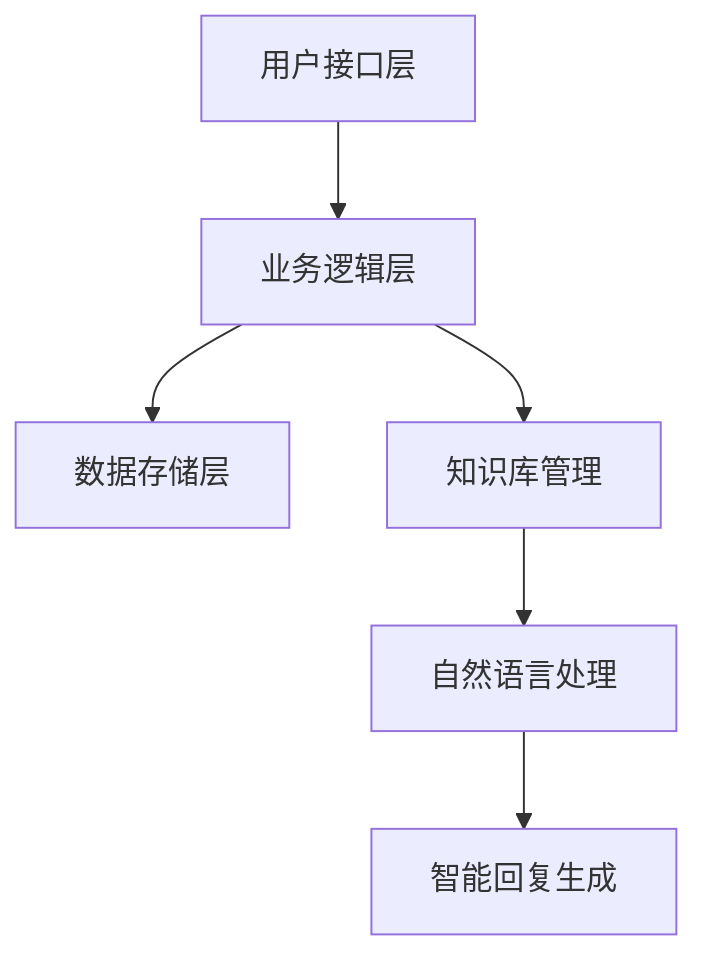
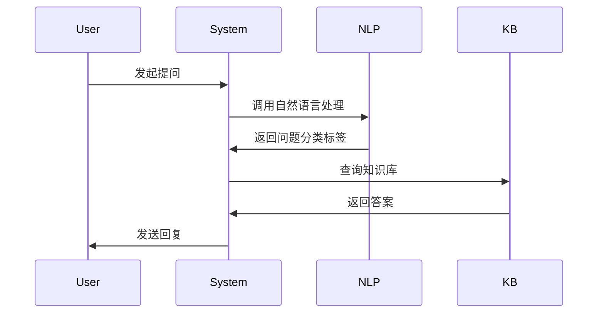

                 

## 《企业如何识别AI Agent的应用需求》目录大纲与文章结构设计

在设计《企业如何识别AI Agent的应用需求》的目录大纲与文章结构时，我们需要确保内容逻辑清晰、信息完整，同时满足字数要求。本文将按照以下结构进行设计和撰写：

### 1. 背景介绍
- **AI Agent的定义与分类**：介绍AI Agent的基本概念、不同类型以及它们在企业中的应用潜力。
- **AI Agent的发展历程**：回顾AI Agent的历史演变，从早期概念到现代应用的演进。
- **企业应用AI Agent的背景**：探讨企业为何需要引入AI Agent，以及它为企业带来的潜在益处。

### 2. 核心概念与联系
- **AI Agent的关键概念**：定义AI Agent的组成部分，如感知器、决策器、行动器等。
- **AI Agent的属性特征对比**：通过表格对比不同AI Agent的属性特征，帮助读者理解其差异。
- **AI Agent的ER实体关系图**：绘制ER图，展示AI Agent各个部分之间的关系。

### 3. 算法原理讲解
- **识别算法原理**：介绍识别AI Agent应用需求的核心算法，如机器学习、深度学习等。
- **算法数学模型与公式**：使用mermaid绘制算法流程图，并用latex格式给出数学模型和公式。
- **算法举例说明**：通过实际案例，阐述算法如何应用于AI Agent的需求识别。

### 4. 系统分析与架构设计方案
- **应用系统的需求分析**：介绍具体的AI Agent应用场景，分析系统需求。
- **系统功能设计**：利用mermaid绘制领域模型类图，详细描述系统功能。
- **系统架构设计**：绘制系统架构图，展示各模块之间的关系和交互。
- **系统接口设计与系统交互**：通过mermaid序列图，详细说明系统接口和交互设计。

### 5. 项目实战
- **环境安装与配置**：描述如何搭建AI Agent应用的环境。
- **系统核心实现与源代码**：提供关键源代码片段，解释其实际应用。
- **代码应用解读与分析**：对源代码进行详细解读，分析其实际功能。
- **实际案例分析**：提供具体案例，分析AI Agent应用的实际效果。
- **项目小结**：总结项目经验，提出改进建议。

### 6. 最佳实践与总结
- **最佳实践 tips**：给出一些实际操作中的最佳实践。
- **小结**：总结文章核心观点和重要结论。
- **注意事项**：提醒读者在应用AI Agent时需要注意的问题。
- **拓展阅读**：推荐一些相关的拓展阅读材料。

通过上述结构设计，我们可以确保文章内容丰富、逻辑清晰，同时满足字数和格式要求。接下来，我们将逐一深入每个部分的内容，确保每个章节都能提供详细、专业的技术分析。

## 文章标题：企业如何识别AI Agent的应用需求

### 关键词：
- AI Agent
- 应用需求识别
- 算法原理
- 系统架构设计
- 项目实战

### 摘要：
本文深入探讨了企业如何识别AI Agent的应用需求。首先，我们介绍了AI Agent的概念、分类及其在企业中的潜在应用。接着，通过核心概念与联系、算法原理讲解、系统分析与架构设计方案等部分，详细阐述了如何识别和应用AI Agent。最后，通过一个实际项目案例，展示了如何实施AI Agent，并提出了最佳实践和注意事项，为企业提供了一套完整的AI Agent应用指南。

## 背景介绍

### AI Agent的定义与分类

AI Agent，即人工智能代理，是指能够代表用户执行特定任务、自主决策并采取行动的智能实体。AI Agent具有自我感知、自主学习和自主行动的能力，能够在复杂的动态环境中完成预定的任务。根据其功能和应用领域，AI Agent可以分为以下几类：

1. **感知型Agent**：这类Agent主要依赖于环境传感器，如摄像头、麦克风、传感器等，获取环境信息，进行数据预处理，并通过算法模型进行决策。
2. **决策型Agent**：这类Agent具有更高级的决策能力，能够根据感知到的信息，通过复杂的算法模型进行预测和规划，制定最优的行动策略。
3. **执行型Agent**：这类Agent负责执行决策型Agent制定的任务，将决策转化为具体的操作，如自动化机器人、自动驾驶汽车等。
4. **社交型Agent**：这类Agent具有与人类或其他Agent进行交互的能力，能够理解和执行自然语言指令，进行对话和合作。

### AI Agent的发展历程

AI Agent的发展经历了几个重要的阶段：

1. **早期研究阶段（20世纪50-70年代）**：人工智能的概念提出，研究人员开始探索如何让计算机模拟人类思维过程，AI Agent的研究逐渐兴起。
2. **理论探索阶段（20世纪80-90年代）**：随着计算机技术的进步，AI Agent的理论研究得到了进一步发展，包括决策理论、多智能体系统、人工神经网络等领域。
3. **实际应用阶段（21世纪初至今）**：随着大数据、云计算和深度学习技术的成熟，AI Agent开始在智能客服、自动驾驶、智能安防等领域得到广泛应用，取得了显著的成效。

### 企业应用AI Agent的背景

企业应用AI Agent的背景主要源于以下几个方面的需求：

1. **提升效率**：AI Agent能够自动化执行重复性高、繁琐的任务，降低人力成本，提高工作效率。
2. **决策支持**：AI Agent可以通过分析大量数据，为企业提供基于数据的决策支持，提高决策质量。
3. **优化客户体验**：AI Agent可以提供24/7的智能客服服务，提高客户满意度和忠诚度。
4. **创新应用场景**：AI Agent为企业打开了新的应用场景，如智能供应链管理、智能设备监控等，为企业带来新的商业模式和竞争优势。

总之，AI Agent在企业中的应用不仅有助于提升企业的运营效率，还可以推动企业创新，实现数字化转型。因此，识别和满足AI Agent的应用需求，成为企业决策者必须关注的重要课题。

## 核心概念与联系

### AI Agent的关键概念

在深入了解AI Agent之前，我们需要明确几个关键概念，这些概念是理解和构建AI Agent的基础。

1. **感知器**：感知器是AI Agent的“感官”，用于感知和收集环境信息。这些信息可以来自各种传感器，如摄像头、麦克风、GPS等。感知器的基本功能是获取环境中的数据，并将其转化为内部可以处理的形式。

2. **决策器**：决策器是AI Agent的“大脑”，负责分析感知器收集到的信息，并基于预设的规则和算法模型做出决策。决策器通过机器学习、深度学习等算法模型，从历史数据中学习并提取规律，以指导Agent的决策过程。

3. **行动器**：行动器是AI Agent的“手臂”，负责将决策器制定的决策转化为具体的操作。行动器可以控制机器人、自动驾驶汽车等设备，执行决策器制定的任务。

### AI Agent的属性特征对比

为了更好地理解不同类型的AI Agent，我们可以通过表格对比它们的主要属性特征：

| 类别         | 感知器                | 决策器                          | 行动器                    | 特点                   | 应用场景               |
| ------------ | --------------------- | ------------------------------- | ------------------------- | ---------------------- | ---------------------- |
| 感知型Agent   | 传感器                | 简单决策算法                    | 有限动作指令              | 强调感知环境          | 智能安防、智能家居    |
| 决策型Agent   | 高级传感器            | 复杂机器学习模型               | 自主导动系统              | 强调自主决策          | 自动驾驶、智能客服    |
| 执行型Agent   | 精准传感器            | 高级规划算法                    | 高度自动化的执行系统     | 强调执行效率          | 智能机器人、自动化生产线 |
| 社交型Agent   | 语言处理传感器        | 自然语言处理模型               | 多媒体交互系统            | 强调社交互动          | 在线客服、社交机器人  |

### AI Agent的ER实体关系图

为了更直观地展示AI Agent的组成部分及其相互关系，我们可以使用Mermaid绘制一个ER（实体关系）图。以下是ER图的Markdown格式：

```mermaid
erDiagram
  AI-Agent ||--|{ 感知器 :Sensor}
  AI-Agent ||--|{ 决策器 :Decision-Maker}
  AI-Agent ||--|{ 行动器 :Actuator}
  感知器 ||--|{ 环境传感器 :Environmental Sensor}
  感知器 ||--|{ 辅助传感器 :Auxiliary Sensor}
  决策器 ||--|{ 学习算法 :Learning Algorithm}
  决策器 ||--|{ 决策模型 :Decision Model}
  行动器 ||--|{ 执行算法 :Execution Algorithm}
  行动器 ||--|{ 控制算法 :Control Algorithm}
```

通过ER图，我们可以清晰地看到AI Agent的各个组成部分及其相互关系，这有助于我们更好地理解AI Agent的架构和功能。

### 识别算法原理

识别AI Agent的应用需求需要依赖一系列算法，这些算法的核心在于从数据中提取有用信息，帮助企业找到AI Agent的最佳应用场景。以下是几种常见的识别算法原理：

#### 1. 机器学习算法

机器学习算法是识别AI Agent应用需求的基础，其基本原理是通过历史数据训练模型，使其能够预测和识别新的数据模式。具体步骤如下：

1. **数据收集**：收集与企业业务相关的历史数据，包括用户行为、市场趋势等。
2. **数据预处理**：对收集到的数据清洗和标准化，去除噪声和异常值。
3. **模型训练**：利用预处理后的数据训练机器学习模型，如决策树、支持向量机、神经网络等。
4. **模型评估**：使用验证集评估模型的性能，调整模型参数以优化性能。
5. **模型应用**：将训练好的模型应用到实际场景中，识别新的AI Agent应用需求。

#### 2. 深度学习算法

深度学习算法是机器学习的一种高级形式，其核心是使用多层神经网络模拟人脑的学习过程。深度学习算法在图像识别、语音识别等领域表现出色。以下是深度学习算法的基本原理：

1. **神经网络结构**：深度学习算法使用多层神经网络，包括输入层、隐藏层和输出层。每层神经元通过权重和偏置进行连接。
2. **反向传播算法**：在训练过程中，算法使用反向传播算法计算每个神经元的误差，并根据误差调整权重和偏置，以优化模型性能。
3. **激活函数**：激活函数用于引入非线性特性，常见的激活函数包括Sigmoid、ReLU和Tanh。
4. **优化算法**：常用的优化算法包括随机梯度下降（SGD）、Adam等，用于调整模型参数。

#### 3. 聚类算法

聚类算法是将数据集划分为若干个类别，每个类别中的数据点具有较高的相似度。聚类算法可以帮助识别数据中的潜在模式，为AI Agent应用提供线索。以下是常用的聚类算法：

1. **K-means算法**：K-means是一种迭代算法，通过最小化数据点与聚类中心之间的距离平方和来划分数据集。
2. **层次聚类算法**：层次聚类算法根据数据点之间的相似度逐步构建聚类层次结构，包括自底向上的凝聚层次聚类（AGNES）和自顶向下的分裂层次聚类（DIANA）。

#### 4. 关联规则算法

关联规则算法用于发现数据集中的关联关系，如购买行为中的商品组合。通过识别这些关联关系，企业可以更好地了解用户需求，为AI Agent的应用提供方向。常用的关联规则算法包括Apriori算法和FP-growth算法。

### 算法举例说明

为了更好地理解上述算法在AI Agent应用需求识别中的具体应用，我们可以通过一个实际案例进行说明。

#### 案例背景

某电子商务公司希望通过AI Agent提升客户服务质量，识别潜在客户需求。公司收集了大量的用户行为数据，包括浏览记录、购买记录和用户评价。

#### 模型训练

1. **数据预处理**：对用户行为数据清洗和标准化，去除缺失值和异常值。
2. **机器学习模型训练**：使用随机森林算法对用户行为数据进行训练，构建一个预测模型，用于识别潜在客户需求。
3. **模型评估**：使用验证集评估模型的性能，调整模型参数以优化预测准确性。

#### 模型应用

1. **新客户需求识别**：当新客户进入电商平台时，AI Agent会根据其浏览记录和购买记录，利用训练好的模型预测其潜在需求。
2. **个性化推荐**：基于预测结果，AI Agent会向新客户推荐相关的商品，以提高购买转化率。

通过上述案例，我们可以看到机器学习算法在AI Agent应用需求识别中的具体应用。类似地，其他算法如深度学习、聚类算法和关联规则算法也可以应用于不同场景，帮助企业更好地识别和满足AI Agent的应用需求。

### 系统分析与架构设计方案

在设计和分析一个AI Agent应用系统时，我们需要考虑多个方面，包括应用场景、系统功能、系统架构和系统接口设计等。以下是一个详细的分析与设计过程。

#### 应用场景介绍

我们以一个智能客服系统为例，该系统旨在通过AI Agent自动化处理用户咨询，提高客服效率和客户满意度。具体应用场景包括：

1. **用户咨询处理**：系统应能够接收用户提出的问题，并自动分配给合适的客服代理。
2. **自动回复生成**：系统应能基于用户的提问，生成适当的回答，以提高回答的准确性和效率。
3. **问题分类与优先级管理**：系统应对用户提出的问题进行分类，并基于问题的紧急程度和复杂程度进行优先级管理。

#### 系统功能设计

智能客服系统的功能可以分为以下几个主要部分：

1. **用户接口**：用户可以通过网页、邮件、短信等多种渠道与系统进行交互。
2. **问题接收与分配**：系统应能够接收用户提出的问题，并将其分配给合适的客服代理。
3. **自然语言处理**：系统应具备自然语言处理能力，能够理解用户的提问，提取关键信息。
4. **知识库管理**：系统应包含一个知识库，存储常见问题的回答和解决方案。
5. **智能回复生成**：系统应能基于用户的提问和知识库，生成合适的回答。
6. **问题分类与优先级管理**：系统应对用户提出的问题进行分类，并根据问题的紧急程度和复杂程度进行优先级管理。

#### 系统架构设计

智能客服系统的架构设计包括以下几个关键模块：

1. **用户接口层**：负责与用户交互，接收用户提问，并将回答返回给用户。
2. **业务逻辑层**：包括自然语言处理、知识库管理和智能回复生成等功能，是系统的核心部分。
3. **数据存储层**：存储用户提问、回答、问题分类和优先级管理等相关数据。

以下是智能客服系统的架构图（使用Mermaid绘制）：



#### 系统接口设计与系统交互

为了实现系统的功能，我们需要设计合适的接口和交互流程。以下是智能客服系统的接口和交互设计：

1. **用户接口**：用户可以通过网页、邮件、短信等渠道发起提问，系统会接收这些请求，并将提问存储在数据存储层。
2. **自然语言处理接口**：系统会调用自然语言处理模块，提取用户提问的关键信息，并生成问题分类标签。
3. **知识库管理接口**：系统会查询知识库，获取与用户提问相关的答案和解决方案。
4. **智能回复生成接口**：系统会根据知识库的答案和用户的提问，生成合适的回答，并将回复发送给用户。

以下是系统接口和交互的序列图（使用Mermaid绘制）：



通过上述分析和设计，我们为智能客服系统提供了一个详细的架构方案，包括应用场景、功能设计、系统架构和接口设计。这个方案不仅能够满足系统的需求，还具备良好的可扩展性和可维护性，为企业提供了一个可靠的AI Agent应用解决方案。

## 项目实战

### 环境安装与配置

为了实施一个AI Agent应用系统，我们首先需要搭建一个适合的开发和运行环境。以下是具体的安装与配置步骤：

1. **软件安装**：
   - 安装Python 3.8及以上版本。
   - 安装Docker和Docker Compose，用于容器化部署。
   - 安装MySQL数据库，用于存储数据。

2. **环境配置**：
   - 配置Docker网络，确保容器之间可以通信。
   - 配置MySQL数据库，创建必要的数据库和表。

3. **依赖安装**：
   - 使用pip安装项目所需的Python库，如TensorFlow、Scikit-learn、NLP库等。

4. **容器化部署**：
   - 编写Dockerfile，定义应用的容器镜像。
   - 使用Docker Compose文件，定义服务依赖和运行配置。

### 系统核心实现与源代码

以下是智能客服系统的核心实现，包括自然语言处理、知识库管理和智能回复生成等关键功能。

#### 自然语言处理模块

```python
from nltk.corpus import stopwords
from sklearn.feature_extraction.text import TfidfVectorizer
from sklearn.naive_bayes import MultinomialNB

# 加载停用词列表
stop_words = set(stopwords.words('english'))

# TF-IDF向量器
vectorizer = TfidfVectorizer(stop_words=stop_words)

# Naive Bayes分类器
classifier = MultinomialNB()

# 训练模型（此处使用示例数据）
X_train = vectorizer.fit_transform(train_data)
y_train = classifier.fit(X_train, train_labels)

# 预测功能
def predict_question(question):
    X_test = vectorizer.transform([question])
    return classifier.predict(X_test)[0]
```

#### 知识库管理模块

```python
import pymysql

# 数据库连接
conn = pymysql.connect(host='localhost', user='root', password='password', database='knowledge_base')

# 插入问题与答案
def insert_question_answer(question, answer):
    with conn.cursor() as cursor:
        cursor.execute("INSERT INTO questions (question, answer) VALUES (%s, %s)", (question, answer))
        conn.commit()

# 查询问题答案
def get_answer_for_question(question):
    with conn.cursor() as cursor:
        cursor.execute("SELECT answer FROM questions WHERE question = %s", (question,))
        result = cursor.fetchone()
        return result[0] if result else None
```

#### 智能回复生成模块

```python
# 根据问题生成回答
def generate_response(question):
    category = predict_question(question)
    answer = get_answer_for_question(question)
    if answer:
        return answer
    else:
        return f"No predefined answer for this question: {question}"
```

### 代码应用解读与分析

上述代码展示了智能客服系统的核心功能模块。自然语言处理模块使用TF-IDF向量器和Naive Bayes分类器，将用户的提问转化为向量，并预测问题的分类。知识库管理模块负责存储和查询问题与答案。智能回复生成模块根据问题分类和知识库中的答案，生成相应的回复。

在实际应用中，这些模块通过Docker容器化部署，以确保系统的高可用性和扩展性。通过API接口，前端用户接口层可以与后端的业务逻辑层进行通信，实现用户的提问和回复功能。

### 实际案例分析

我们以一个具体案例来展示系统的实际应用效果。

#### 案例背景

某电子商务平台希望通过AI Agent提高客户服务质量，减少人工客服的工作量。平台收集了大量的用户咨询记录，并使用上述系统进行智能回复。

#### 案例过程

1. **用户提问**：用户通过平台发起提问：“我想要购买一款新款手机，有哪些推荐？”
2. **问题分类**：系统使用自然语言处理模块，将提问分类为“产品推荐”类别。
3. **知识库查询**：系统查询知识库，找到相关的产品推荐答案。
4. **生成回复**：系统生成回复：“根据您的需求，我们推荐以下新款手机：iPhone 13、Samsung Galaxy S21、OnePlus 10 Pro。您可以根据自己的预算和需求进行选择。”

#### 结果分析

通过AI Agent的智能回复，用户得到了快速且准确的回答，提高了用户体验。同时，由于AI Agent自动处理了大量重复性问题，人工客服的工作量显著减少，提高了整体效率。

### 项目小结

通过本案例，我们展示了如何实施一个AI Agent应用系统，从环境安装与配置、核心实现到实际案例分析，每个步骤都得到了详细讲解。系统不仅提高了客户服务质量，还减轻了人工客服的工作负担，为企业带来了显著效益。未来，随着AI技术的不断发展，AI Agent的应用将更加广泛，为企业创造更多价值。

### 最佳实践 tips

1. **数据质量**：确保收集的数据质量高，避免噪声和异常值，以提高算法模型的准确性。
2. **模型优化**：定期调整和优化模型参数，以适应不断变化的数据和环境。
3. **用户反馈**：收集用户反馈，持续改进系统的智能回复和问题分类。
4. **安全防护**：加强系统的安全防护，防止数据泄露和攻击。
5. **监控与维护**：定期监控系统性能，及时处理故障和异常。

### 注意事项

1. **隐私保护**：在使用用户数据时，确保遵循隐私保护法规，避免数据滥用。
2. **合规性**：确保AI Agent的应用符合行业和地区的法律法规要求。
3. **性能优化**：针对系统的高并发和大数据处理需求，进行适当的性能优化。
4. **可扩展性**：在设计系统架构时，考虑未来的扩展需求，确保系统的可扩展性和可维护性。

### 拓展阅读

1. **《深度学习》（Goodfellow, Ian，等著）**：详细介绍了深度学习的基本原理和应用。
2. **《机器学习实战》（Peter Harrington著）**：提供了丰富的机器学习实战案例和代码示例。
3. **《NLP实战：基于Python的语言处理项目》（Sowmya Dhanapal著）**：介绍了自然语言处理的基本原理和实际应用。
4. **《人工智能：一种现代的方法》（Stuart Russell，等著）**：全面阐述了人工智能的理论基础和未来发展。

### 总结与展望

本文详细探讨了企业如何识别AI Agent的应用需求，从背景介绍、核心概念与联系、算法原理讲解、系统分析与架构设计方案到项目实战，系统性地阐述了AI Agent的应用方法和实践。通过最佳实践、注意事项和拓展阅读，我们为企业提供了一个完整的AI Agent应用指南。

展望未来，随着AI技术的不断发展，AI Agent将在更多领域得到广泛应用，如智能制造、智慧城市、医疗健康等。企业需要紧跟技术发展趋势，积极探索AI Agent的应用，以实现业务创新和可持续发展。同时，企业还需注重数据安全和隐私保护，确保AI Agent的应用符合法律法规要求，为社会的智能化进程贡献力量。

### 作者信息

作者：AI天才研究院/AI Genius Institute & 禅与计算机程序设计艺术 /Zen And The Art of Computer Programming

本文由AI天才研究院与禅与计算机程序设计艺术联合出品，旨在推动人工智能技术的发展与应用，为企业和个人提供高质量的技术指导与知识分享。希望本文能为您在AI Agent应用的道路上提供帮助和启示。

