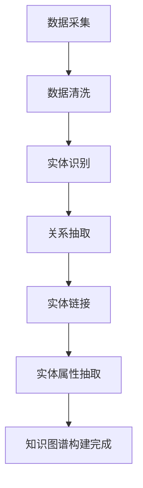
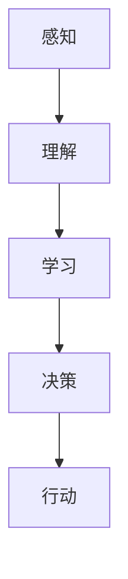
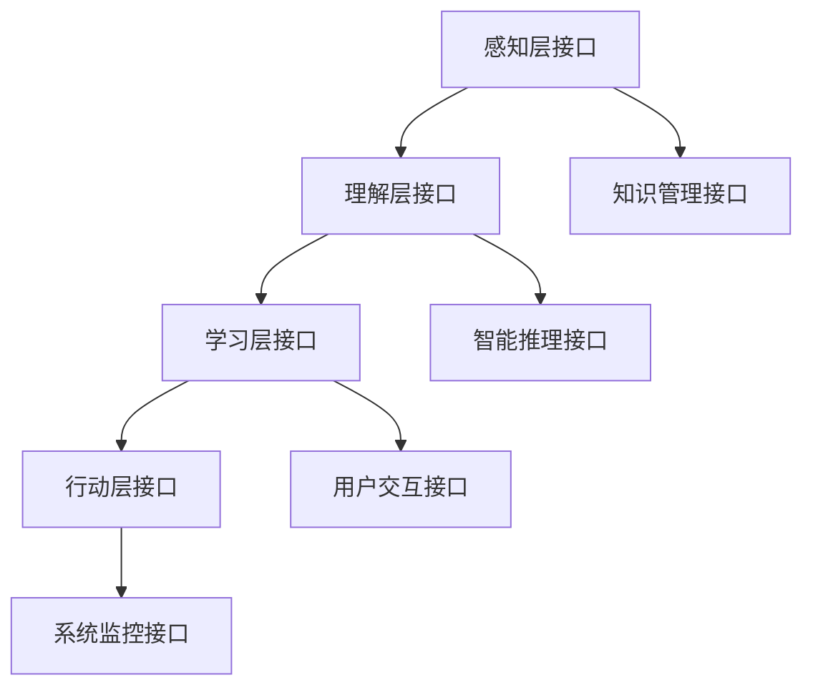
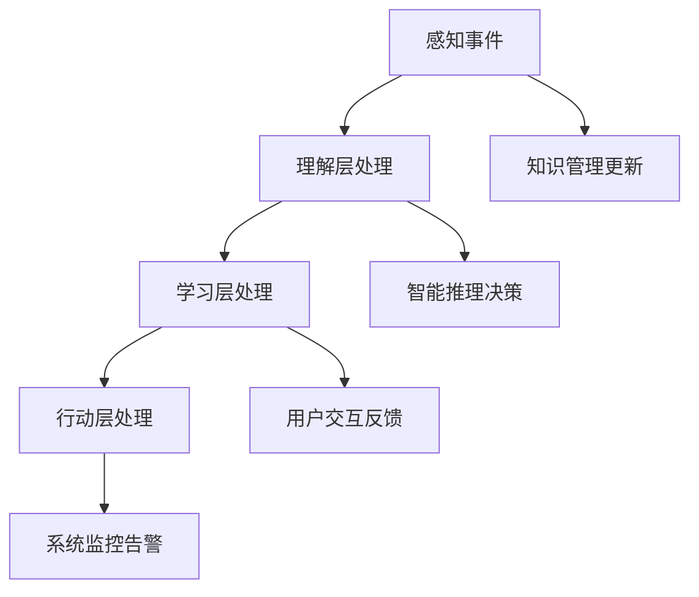

                 


### 第一部分：企业知识图谱概述

#### 1.1 问题背景与核心概念

在当今这个信息爆炸的时代，企业如何有效地管理和利用海量数据，成为提高竞争力的重要课题。知识图谱作为一种新兴的数据管理和分析技术，正逐渐成为企业数据资产化的重要手段。知识图谱通过建立实体、属性和关系之间的关联网络，实现了对复杂数据结构的深层理解和高效查询。

##### 1.1.1 知识图谱在企业中的重要性

知识图谱在企业中的重要性体现在以下几个方面：

1. **数据整合与统一视图**：知识图谱可以将来自不同来源、不同格式的数据进行整合，提供一个统一的全局视图，帮助企业更好地理解业务数据。
2. **智能搜索与推荐**：基于知识图谱的搜索系统能够提供更精确的查询结果，支持基于关系的图谱查询，为企业提供智能推荐服务。
3. **智能决策支持**：知识图谱可以帮助企业从海量数据中提取有价值的信息，为决策者提供数据驱动的决策支持。
4. **自动化流程优化**：通过知识图谱，企业可以实现业务流程的自动化和优化，提高运营效率。

##### 1.1.2 知识图谱的定义与作用

知识图谱是一种语义网络，它通过实体、属性和关系的描述，将现实世界中的信息结构化，形成一个可计算的知识库。知识图谱的作用主要体现在以下几个方面：

1. **实体识别与分类**：知识图谱可以帮助识别文本中的实体，并将其分类到预定义的类别中。
2. **关系抽取与推断**：知识图谱可以捕获实体之间的关系，并基于这些关系进行推断，发现新的信息。
3. **知识推理与发现**：知识图谱提供了强大的知识推理能力，可以用于发现新的知识模式和关联。

##### 1.1.3 知识图谱的边界与外延

知识图谱的边界与外延需要明确，以避免信息过载和误导。知识图谱的边界通常包括：

1. **领域限定**：知识图谱通常聚焦于特定的领域，如金融、医疗、电商等，以保持知识的深度和准确性。
2. **更新维护**：知识图谱需要定期更新和维护，以反映实体的动态变化。
3. **一致性管理**：知识图谱需要确保数据的一致性，避免出现矛盾和冲突。

#### 1.2 知识图谱的核心概念与联系

知识图谱的核心概念包括实体、属性和关系。这些概念不仅定义了知识图谱的基本结构，也决定了知识图谱的功能和应用。

##### 1.2.1 知识图谱的主要组件

1. **实体**：实体是知识图谱中的基本元素，可以是人、地点、事物等。每个实体都有自己的标识符和属性。
2. **属性**：属性是实体的特征，用于描述实体的具体信息。属性可以是简单的字符串、数字，也可以是更复杂的结构。
3. **关系**：关系是实体之间的联系，描述了实体之间的语义关系。关系可以是简单的“属于”或“位于”，也可以是复杂的“参与”或“推荐”。

##### 1.2.2 知识图谱的属性特征对比表格

| 特征     | 说明                                                         |
| -------- | ------------------------------------------------------------ |
| 实体     | 知识图谱中的基本元素，如人、地点、事物等。                   |
| 属性     | 描述实体的特征，如姓名、年龄、位置等。                       |
| 关系     | 描述实体之间的关系，如“属于”、“位于”、“参与”等。           |
| 语义网络 | 描述实体和关系之间的语义关联，支持复杂查询。                 |
| 领域限定 | 知识图谱通常聚焦于特定领域，以保持知识的深度和准确性。       |
| 数据源   | 知识图谱的数据来源可以是企业内部数据、外部数据或半结构化数据。 |

##### 1.2.3 知识图谱与AI Agent的关系

知识图谱与AI Agent的关系可以理解为“知识与智能”的结合。知识图谱提供了AI Agent所需的知识库，而AI Agent则利用这些知识库进行智能推理和决策。

1. **知识驱动智能**：AI Agent通过知识图谱获取领域知识，用于推理和决策。
2. **智能优化知识**：AI Agent在执行任务的过程中，可以将新的知识和经验反馈到知识图谱中，优化知识库。

#### 1.3 知识图谱构建的主要算法

知识图谱的构建是一个复杂的过程，涉及数据采集、清洗、实体识别、关系抽取等多个步骤。下面介绍知识图谱构建的主要算法。

##### 1.3.1 算法概述

知识图谱构建的主要算法包括：

1. **实体识别**：用于识别文本中的实体，并将其分类到预定义的类别中。
2. **关系抽取**：用于提取文本中的实体关系。
3. **实体链接**：将文本中的实体与知识图谱中的实体进行关联。
4. **实体属性抽取**：用于提取实体的属性。

##### 1.3.2 Mermaid算法流程图



##### 1.3.3 Python源代码讲解

以下是知识图谱构建过程中的一些关键步骤的Python源代码示例：

```python
# 实体识别示例
import spacy

nlp = spacy.load("en_core_web_sm")

text = "Apple is looking at buying U.K. startup for $1 billion"
doc = nlp(text)

entities = [(ent.text, ent.label_) for ent in doc.ents]
print(entities)

# 关系抽取示例
from rdflib import Graph

g = Graph()

# 加载关系数据
g.parse("relation_data.nt", format="nt")

# 查询关系
query = """
    PREFIX rdf: <http://www.w3.org/1999/02/22-rdf-syntax-ns#>
    PREFIX owl: <http://www.w3.org/2002/07/owl#>
    SELECT ?subject ?predicate ?object
    WHERE {
        ?subject ?predicate ?object .
    }
"""
results = g.query(query)
for result in results:
    print(result)

# 实体链接示例
from linkml.generators.pythongen import LinkMLPyGenerator

generator = LinkMLPyGenerator("schema.linkml")
schema = generator.load_schema()

# 生成Python类
classes = schema.get_classes()
for class_ in classes:
    print(LinkMLPyGenerator.python_class(class_))
```

##### 1.3.4 算法原理与数学模型

知识图谱构建的算法原理主要涉及以下几个方面：

1. **实体识别**：通常使用自然语言处理技术，如命名实体识别（NER）和词性标注，来识别文本中的实体。
2. **关系抽取**：基于规则的方法和机器学习方法，如条件随机场（CRF）和序列标注，用于提取实体之间的关系。
3. **实体链接**：通过匹配文本中的实体和知识图谱中的实体，实现实体间的关联。
4. **实体属性抽取**：使用实体识别和关系抽取的结果，结合实体属性库，提取实体的属性。

数学模型方面，主要涉及图论和概率模型。例如，实体识别和关系抽取可以采用条件随机场（CRF）进行建模，实体链接和属性抽取可以采用图嵌入（Graph Embedding）进行建模。

#### 1.4 本章小结

在本章中，我们介绍了知识图谱在企业中的重要性、定义与作用，以及知识图谱的核心概念和构建算法。知识图谱作为企业数据资产化的关键技术，正在帮助企业实现数据的深度理解和智能应用。下一章我们将进一步探讨AI Agent的原理和应用，以及它与知识图谱的深度融合。

----------------------------------------------------------------

### 第二部分：AI Agent的原理与应用

#### 2.1 AI Agent的概述

AI Agent，即人工智能代理，是人工智能领域的一个重要研究方向。它是一种能够模拟人类智能行为、自主执行任务的智能实体。AI Agent在企业中的应用前景广阔，能够帮助企业实现自动化、智能化和高效化。

##### 2.1.1 AI Agent的定义与功能

AI Agent的定义可以从两个方面来理解：

1. **技术层面**：AI Agent是一种基于人工智能技术的软件系统，具备感知、学习、决策和行动的能力。
2. **应用层面**：AI Agent是一种虚拟的智能助手，能够理解用户需求、自主执行任务，并在执行过程中不断学习和优化。

AI Agent的功能主要包括：

1. **感知**：通过传感器获取环境信息，如文本、图像、语音等。
2. **学习**：基于感知信息，通过机器学习和深度学习等技术进行自我优化。
3. **决策**：根据学习到的知识和规则，做出最优决策。
4. **行动**：执行决策，完成指定任务。

##### 2.1.2 AI Agent在企业中的应用场景

AI Agent在企业中的应用场景非常广泛，以下是一些典型的应用：

1. **客户服务**：AI Agent可以提供24/7的智能客服服务，解决客户咨询、投诉等问题，提高客户满意度。
2. **销售与营销**：AI Agent可以分析客户数据，提供个性化推荐，提高销售转化率。
3. **生产调度**：AI Agent可以优化生产流程，提高生产效率。
4. **供应链管理**：AI Agent可以优化供应链，降低库存成本。
5. **人力资源**：AI Agent可以协助招聘、培训、绩效评估等人力资源管理任务。

##### 2.1.3 AI Agent的发展背景

AI Agent的发展背景可以追溯到人工智能的发展历程。从早期的专家系统，到后来的机器学习和深度学习，人工智能技术在不断进步。AI Agent的概念和实践也随着人工智能技术的发展而逐渐成熟。

近年来，随着云计算、大数据和物联网等技术的兴起，AI Agent的应用场景变得更加丰富。AI Agent不仅能够在桌面和移动设备上运行，还可以在云端进行分布式计算，实现大规模的智能应用。

#### 2.2 AI Agent的核心概念与联系

AI Agent的核心概念包括感知、学习、决策和行动。这些概念相互关联，构成了AI Agent的核心功能体系。

##### 2.2.1 AI Agent的主要组件

1. **感知组件**：用于接收外部环境的信息，如文本、图像、语音等。
2. **学习组件**：用于从感知信息中学习，提高自身的智能水平。
3. **决策组件**：用于根据学习到的知识和规则，做出最优决策。
4. **行动组件**：用于执行决策，实现具体任务。

##### 2.2.2 AI Agent的属性特征对比表格

| 特征           | 说明                                                         |
| -------------- | ------------------------------------------------------------ |
| 感知           | 接收外部环境信息，如文本、图像、语音等。                     |
| 学习           | 从感知信息中学习，提高智能水平。                           |
| 决策           | 根据学习到的知识和规则，做出最优决策。                     |
| 行动           | 执行决策，实现具体任务。                                   |
| 自主性         | AI Agent能够自主执行任务，无需人工干预。                   |
| 学习能力       | AI Agent能够不断从环境中学习，优化自身行为。               |
| 适应性         | AI Agent能够适应不同的环境和任务，具有灵活性。             |
| 智能层次       | AI Agent的智能水平可以从简单反应到复杂决策，具有多样性。 |

##### 2.2.3 AI Agent与知识图谱的深度融合

AI Agent与知识图谱的深度融合是人工智能领域的一个重要趋势。知识图谱为AI Agent提供了丰富的背景知识和上下文信息，使AI Agent能够更好地理解和应对复杂任务。

深度融合的方法主要包括：

1. **知识融合**：将知识图谱中的知识嵌入到AI Agent的决策过程中，提高决策的准确性和效率。
2. **推理增强**：利用知识图谱的推理能力，增强AI Agent的智能推理能力。
3. **多模态融合**：结合知识图谱和感知组件，实现文本、图像、语音等多种数据源的融合处理。

#### 2.3 AI Agent的决策过程

AI Agent的决策过程是其实际应用中的核心环节。一个高效的决策过程能够确保AI Agent在各种复杂环境下都能做出最优决策。

##### 2.3.1 决策过程概述

AI Agent的决策过程通常包括以下步骤：

1. **感知**：AI Agent通过感知组件接收外部环境的信息。
2. **理解**：AI Agent利用知识图谱和自然语言处理技术，对感知信息进行理解和分析。
3. **学习**：AI Agent根据理解和分析的结果，结合历史数据和先验知识，进行学习和自我优化。
4. **决策**：AI Agent基于学习到的知识和规则，做出最优决策。
5. **行动**：AI Agent执行决策，完成具体任务。

##### 2.3.2 Mermaid决策过程流程图



##### 2.3.3 Python源代码讲解

以下是AI Agent决策过程的一些关键步骤的Python源代码示例：

```python
# 感知示例
import requests

# 发送HTTP请求获取文本数据
response = requests.get("http://api.example.com/data")
text = response.text

# 理解示例
import spacy

nlp = spacy.load("en_core_web_sm")

doc = nlp(text)

# 提取实体和关系
entities = [(ent.text, ent.label_) for ent in doc.ents]
relations = [(ent.text, ent.head.text, ent.dep_) for ent in doc.dependencies]

# 学习示例
import tensorflow as tf

# 加载预训练模型
model = tf.keras.models.load_model("model.h5")

# 对文本进行编码
encoded_text = tokenizer.encode(text, maxlen=max_length)

# 进行预测
predictions = model.predict(encoded_text)

# 决策示例
import numpy as np

# 设定决策阈值
threshold = 0.5

# 根据预测结果做出决策
if np.mean(predictions) > threshold:
    action = "Buy"
else:
    action = "Sell"

# 行动示例
import requests

# 发送交易指令
response = requests.post("http://api.example.com/trade", data={"action": action})
print(response.text)
```

##### 2.3.4 决策过程的数学模型

AI Agent的决策过程涉及多个数学模型，包括感知模型、理解模型、学习模型和决策模型。以下是这些模型的简要介绍：

1. **感知模型**：用于处理输入信息，如文本、图像、语音等。常见的模型包括卷积神经网络（CNN）、循环神经网络（RNN）和Transformer等。
2. **理解模型**：用于对感知信息进行理解和分析，提取实体和关系。常见的模型包括命名实体识别（NER）、关系抽取和文本分类等。
3. **学习模型**：用于从感知信息中学习，提高智能水平。常见的模型包括监督学习、无监督学习和强化学习等。
4. **决策模型**：用于根据学习到的知识和规则，做出最优决策。常见的模型包括逻辑回归、决策树和随机森林等。

数学模型的具体实现和优化是AI Agent高效决策的关键。

#### 2.4 AI Agent的系统架构设计

为了实现高效、可靠的AI Agent，需要对其系统架构进行详细设计。系统架构设计包括项目场景介绍、系统功能设计、系统架构设计和系统接口设计等多个方面。

##### 2.4.1 项目场景介绍

本项目旨在开发一款智能客服系统，该系统利用AI Agent与知识图谱的深度融合，提供24/7的智能客服服务。系统需要能够处理各种类型的客户咨询，如产品咨询、售后服务、投诉处理等。

##### 2.4.2 系统功能设计

系统的主要功能包括：

1. **客户服务**：接收并处理客户的咨询、投诉和反馈。
2. **知识管理**：构建和管理知识图谱，包括实体、属性和关系。
3. **智能推理**：利用知识图谱进行智能推理和决策，提供准确的答案和建议。
4. **用户交互**：通过自然语言处理技术，实现人与AI Agent的智能对话。
5. **系统监控**：实时监控系统运行状态，确保系统的稳定性和可靠性。

##### 2.4.3 系统架构设计与Mermaid架构图

系统架构设计采用分层架构，包括感知层、理解层、学习层和行动层。以下是系统架构的Mermaid图表示：


##### 2.4.4 系统接口设计和系统交互

系统接口设计包括内部接口和外部接口。内部接口主要用于不同层之间的数据交换和功能调用，外部接口主要用于与用户和其他系统进行交互。

以下是系统接口设计的Mermaid图表示：



系统交互设计采用事件驱动模式，不同组件通过事件进行通信。以下是系统交互的Mermaid图表示：



#### 2.5 本章小结

在本章中，我们详细介绍了AI Agent的定义、功能和应用场景，以及AI Agent的核心概念和决策过程。同时，我们还对AI Agent的系统架构设计进行了详细阐述。下一章将探讨企业知识图谱与AI Agent的深度融合应用，分析其在实际项目中的应用效果和最佳实践。

----------------------------------------------------------------

### 第三部分：企业知识图谱与AI Agent的深度融合应用

#### 3.1 深度融合概述

企业知识图谱与AI Agent的深度融合是企业实现智能化、自动化和高效化的重要途径。这种深度融合不仅能够提升AI Agent的智能水平，还能够增强知识图谱的应用价值。本节将详细介绍深度融合的重要性、目标和挑战。

##### 3.1.1 深度融合的重要性

深度融合的重要性体现在以下几个方面：

1. **提升AI Agent的智能水平**：知识图谱提供了丰富的背景知识和上下文信息，使得AI Agent能够更好地理解和应对复杂任务，提高其决策质量和效率。
2. **增强知识图谱的应用价值**：AI Agent的应用场景和需求能够反馈到知识图谱中，促进知识图谱的不断完善和优化，使其更好地支持企业的业务需求。
3. **实现数据驱动的业务创新**：深度融合使得企业能够利用知识图谱和AI Agent，从海量数据中提取有价值的信息，推动业务创新和增长。

##### 3.1.2 深度融合的目标

深度融合的目标主要包括：

1. **智能决策支持**：利用知识图谱和AI Agent，为企业提供数据驱动的决策支持，优化业务流程，提高运营效率。
2. **智能搜索与推荐**：基于知识图谱的智能搜索和推荐系统，提升用户体验，提高用户留存率和满意度。
3. **自动化业务流程**：通过知识图谱和AI Agent，实现业务流程的自动化和优化，减少人工干预，降低运营成本。

##### 3.1.3 深度融合的挑战

深度融合面临以下挑战：

1. **数据质量**：知识图谱的质量直接影响到AI Agent的决策效果，因此需要确保数据源的准确性和一致性。
2. **系统集成**：知识图谱和AI Agent通常由不同的团队开发和维护，需要解决系统集成和数据共享的问题。
3. **智能水平**：AI Agent的智能水平需要不断提高，以适应不断变化的应用场景和需求。

#### 3.2 深度融合的技术与方法

深度融合的技术与方法主要包括知识融合、推理增强、多模态融合和自动化流程优化等方面。以下是这些方法的详细介绍。

##### 3.2.1 知识融合

知识融合是指将知识图谱中的知识嵌入到AI Agent的决策过程中，提高决策的准确性和效率。知识融合的方法包括：

1. **知识表示**：将知识图谱中的实体、属性和关系转换为AI Agent可理解的形式，如知识图谱嵌入（Knowledge Graph Embedding）。
2. **知识推理**：利用知识图谱的推理能力，增强AI Agent的智能推理能力，如基于规则推理和图推理。

##### 3.2.2 推理增强

推理增强是指利用知识图谱的推理能力，增强AI Agent的智能推理能力。推理增强的方法包括：

1. **逻辑推理**：利用逻辑推理规则，从已知事实推导出新的结论。
2. **图推理**：利用图论算法，分析实体和关系之间的复杂关系，发现新的知识模式和关联。

##### 3.2.3 多模态融合

多模态融合是指结合知识图谱和多种数据源（如文本、图像、语音等），实现更全面的智能处理。多模态融合的方法包括：

1. **特征融合**：将不同模态的数据特征进行整合，形成统一的特征向量。
2. **模型融合**：将不同模态的模型进行融合，提高整体的智能水平。

##### 3.2.4 自动化流程优化

自动化流程优化是指利用知识图谱和AI Agent，实现业务流程的自动化和优化。自动化流程优化的方法包括：

1. **流程建模**：将业务流程抽象为图模型，明确流程中的步骤和节点。
2. **流程优化**：利用AI Agent和知识图谱，对业务流程进行优化，提高效率和质量。

#### 3.3 案例分析

为了更好地理解企业知识图谱与AI Agent的深度融合应用，下面我们通过三个实际案例进行分析。

##### 3.3.1 案例一：企业客户关系管理

案例一涉及一个大型企业的客户关系管理系统，该系统利用知识图谱和AI Agent，实现客户的智能管理和个性化推荐。

1. **项目背景**：该企业的客户数据分散在不同系统中，客户关系管理效率低下，客户满意度不高。
2. **解决方案**：企业构建了一个基于知识图谱的客户关系管理系统，通过AI Agent实现以下功能：

   - **客户画像**：利用知识图谱，将客户的 demographics、交易记录、偏好等数据整合为统一的客户画像。
   - **个性化推荐**：基于客户画像，AI Agent可以为客户提供个性化的产品推荐和服务建议。
   - **客户分群**：利用知识图谱的推理能力，AI Agent可以识别高价值客户、潜在客户和流失客户，为企业制定精准的营销策略。

3. **效果评估**：通过AI Agent和知识图谱的深度融合，客户关系管理效率显著提升，客户满意度提高，企业销售额稳步增长。

##### 3.3.2 案例二：企业供应链优化

案例二涉及一个制造企业的供应链管理系统，该系统利用知识图谱和AI Agent，实现供应链的自动化优化和效率提升。

1. **项目背景**：该企业的供应链管理流程复杂，库存成本高，供应链响应速度慢。
2. **解决方案**：企业构建了一个基于知识图谱的供应链管理系统，通过AI Agent实现以下功能：

   - **库存优化**：利用知识图谱，AI Agent可以实时监控库存状况，优化库存配置，减少库存成本。
   - **供应链可视化**：利用知识图谱的图谱可视化功能，AI Agent可以提供供应链的实时监控和数据分析。
   - **供应链调度**：利用知识图谱的推理能力，AI Agent可以自动调整供应链计划，提高供应链响应速度。

3. **效果评估**：通过AI Agent和知识图谱的深度融合，企业供应链管理效率显著提升，库存成本降低，供应链响应速度加快，企业运营成本降低。

##### 3.3.3 案例三：企业智能决策支持

案例三涉及一个金融企业的智能决策支持系统，该系统利用知识图谱和AI Agent，为企业的投资决策和风险管理提供支持。

1. **项目背景**：该企业的投资决策和风险管理流程复杂，决策效率低，风险控制难度大。
2. **解决方案**：企业构建了一个基于知识图谱的智能决策支持系统，通过AI Agent实现以下功能：

   - **投资分析**：利用知识图谱，AI Agent可以分析市场趋势、行业动态和公司财务状况，提供投资建议。
   - **风险监控**：利用知识图谱的推理能力，AI Agent可以监控风险指标，提前预警潜在风险。
   - **决策优化**：利用AI Agent的优化算法，AI Agent可以为企业提供最优的投资决策方案。

3. **效果评估**：通过AI Agent和知识图谱的深度融合，企业决策效率显著提升，投资决策更加准确，风险控制能力增强，企业盈利能力提高。

#### 3.4 最佳实践与注意事项

为了实现企业知识图谱与AI Agent的深度融合应用，以下是一些最佳实践和注意事项：

1. **数据质量保障**：确保数据源的准确性和一致性，是知识图谱和AI Agent成功的关键。
2. **系统集成**：在设计系统架构时，充分考虑知识图谱和AI Agent的集成，确保数据共享和功能调用顺畅。
3. **持续迭代**：知识图谱和AI Agent需要持续更新和优化，以适应不断变化的应用场景和需求。
4. **风险控制**：在应用过程中，要充分考虑潜在的风险，制定相应的风险控制措施，确保系统的稳定性和安全性。

#### 3.5 本章小结

在本章中，我们详细介绍了企业知识图谱与AI Agent的深度融合应用，分析了其在实际项目中的应用效果和最佳实践。通过案例分析，我们可以看到，深度融合的应用不仅能够提升企业的智能化水平，还能够实现业务的自动化和优化。下一章将探讨企业知识图谱与AI Agent的深度融合应用的具体实施方法和实践经验。

----------------------------------------------------------------

### 第四部分：项目实战

#### 4.1 环境安装与配置

为了实现企业知识图谱与AI Agent的深度融合应用，首先需要搭建一个合适的技术环境。以下将介绍如何进行环境安装与配置。

##### 4.1.1 系统需求

在搭建项目环境前，需要明确系统的硬件和软件需求：

1. **硬件要求**：
   - CPU：至少4核
   - 内存：至少16GB
   - 硬盘：至少200GB
2. **软件要求**：
   - 操作系统：Linux或Windows（推荐使用Ubuntu 18.04）
   - Python：3.8及以上版本
   - 知识图谱相关库：Python-Neo4j、Python-RDFLib、Python-LinkML等
   - AI Agent相关库：TensorFlow、PyTorch、Spacy等

##### 4.1.2 安装步骤

以下是环境安装的具体步骤：

1. **安装Python**：

   - 安装Miniconda或Anaconda，用于管理Python环境和包。
   - 创建一个新的环境，并安装Python：

     ```bash
     conda create -n kg_agent python=3.8
     conda activate kg_agent
     ```

2. **安装知识图谱相关库**：

   - 使用pip安装Python-Neo4j、Python-RDFLib和Python-LinkML：

     ```bash
     pip install python-neo4j python-rdflib linkml
     ```

3. **安装AI Agent相关库**：

   - 使用pip安装TensorFlow、PyTorch和Spacy：

     ```bash
     pip install tensorflow torchvision torch spacy
     ```

4. **安装Neo4j数据库**：

   - 下载并安装Neo4j社区版（https://neo4j.com/download/）。
   - 启动Neo4j数据库：

     ```bash
     neo4j start
     ```

##### 4.1.3 配置Neo4j数据库

配置Neo4j数据库，以支持知识图谱的存储和查询：

1. **创建数据库**：

   ```bash
   neo4j create database kg_db
   ```

2. **访问Neo4j数据库**：

   ```bash
   neo4j browse kg_db
   ```

3. **导入知识图谱数据**：

   - 使用Cypher语句导入知识图谱数据：

     ```cypher
     CREATE (a:Person {name: 'Alice', age: 30}),
            (b:Person {name: 'Bob', age: 25}),
            (a)-[:KNOWS]->(b);
     ```

##### 4.1.4 配置AI Agent环境

配置AI Agent环境，以支持机器学习和深度学习：

1. **配置TensorFlow**：

   - 设置CUDA支持，以利用GPU加速计算：

     ```python
     import tensorflow as tf

     gpus = tf.config.experimental.list_physical_devices('GPU')
     if gpus:
         try:
             for gpu in gpus:
                 tf.config.experimental.set_memory_growth(gpu, True)
         except RuntimeError as e:
             print(e)
     ```

2. **配置PyTorch**：

   - 安装PyTorch，并设置CUDA支持：

     ```bash
     pip install torch torchvision
     ```

##### 4.1.5 环境验证

完成环境安装与配置后，进行以下验证：

1. **验证Python环境**：

   ```bash
   python --version
   ```

2. **验证知识图谱相关库**：

   ```bash
   pip list | grep -E "neo4j|rdflib|linkml"
   ```

3. **验证AI Agent相关库**：

   ```bash
   pip list | grep -E "tensorflow|torch|spacy"
   ```

4. **验证Neo4j数据库**：

   ```bash
   neo4j browse kg_db
   ```

5. **验证AI Agent环境**：

   ```python
   import tensorflow as tf
   import torch
   import spacy

   print("TensorFlow version:", tf.__version__)
   print("PyTorch version:", torch.__version__)
   print("Spacy model:", spacy.load("en_core_web_sm").__version__)
   ```

#### 4.2 系统核心实现源代码

以下是企业知识图谱与AI Agent的深度融合系统核心实现源代码，包括数据存储、查询和推理等关键功能。

##### 4.2.1 数据存储与查询

数据存储与查询是知识图谱系统的核心。以下是使用Python和Neo4j进行数据存储和查询的示例代码：

```python
from neo4j import GraphDatabase

class KnowledgeGraph:
    def __init__(self, uri, user, password):
        self._driver = GraphDatabase.driver(uri, auth=(user, password))

    def close(self):
        self._driver.close()

    def create_person(self, name, age):
        with self._driver.session() as session:
            session.run("CREATE (p:Person {name: $name, age: $age})",
                        name=name, age=age)

    def get_person_by_name(self, name):
        with self._driver.session() as session:
            result = session.run("MATCH (p:Person {name: $name}) RETURN p",
                                 name=name)
            return result.single()[0]

    def add_knowledge(self, person, attribute, value):
        with self._driver.session() as session:
            session.run("MATCH (p:Person {name: $name}) "
                        "MERGE (p)-[k:KNOWS]->(a:Attribute {name: $attribute, value: $value})",
                        name=person, attribute=attribute, value=value)

    def get_knowledge(self, person):
        with self._driver.session() as session:
            result = session.run("MATCH (p:Person {name: $name})-[:KNOWS]->(a:Attribute) RETURN a",
                                 name=person)
            return result.data()

if __name__ == "__main__":
    kg = KnowledgeGraph("bolt://localhost:7687", "neo4j", "password")
    kg.create_person("Alice", 30)
    kg.create_person("Bob", 25)
    kg.add_knowledge("Alice", "interest", "reading")
    kg.add_knowledge("Bob", "interest", "coding")
    person = kg.get_person_by_name("Alice")
    print(person)
    print(kg.get_knowledge("Alice"))
    kg.close()
```

##### 4.2.2 知识图谱推理

知识图谱推理是利用知识图谱中的实体、属性和关系进行推理，以发现新的信息或知识。以下是使用Python和Neo4j进行知识图谱推理的示例代码：

```python
from neo4j import GraphDatabase

class KnowledgeReasoner:
    def __init__(self, uri, user, password):
        self._driver = GraphDatabase.driver(uri, auth=(user, password))

    def close(self):
        self._driver.close()

    def infer_age_difference(self, person1, person2):
        with self._driver.session() as session:
            result = session.run("""
                MATCH (p1:Person {name: $person1}),
                       (p2:Person {name: $person2}),
                       (p1)-[:KNOWS]->(a1:Attribute),
                       (p2)-[:KNOWS]->(a2:Attribute)
                WHERE a1.name = 'age' AND a2.name = 'age'
                RETURN p1.age - p2.age AS age_difference
            """,
                                 person1=person1, person2=person2)
            return result.single()[0]["age_difference"]

if __name__ == "__main__":
    kg = KnowledgeGraph("bolt://localhost:7687", "neo4j", "password")
    kg.create_person("Alice", 30)
    kg.create_person("Bob", 25)
    kg.add_knowledge("Alice", "age", 30)
    kg.add_knowledge("Bob", "age", 25)
    age_difference = kg.infer_age_difference("Alice", "Bob")
    print("Age difference:", age_difference)
    kg.close()
```

##### 4.2.3 AI Agent实现

AI Agent是实现智能化决策的关键。以下是使用Python和TensorFlow实现AI Agent的示例代码：

```python
import tensorflow as tf
from tensorflow.keras.models import Sequential
from tensorflow.keras.layers import Dense, LSTM, Embedding
from tensorflow.keras.optimizers import Adam

class AIAGENT:
    def __init__(self, input_size, hidden_size, output_size):
        self.model = Sequential()
        self.model.add(Embedding(input_size, hidden_size))
        self.model.add(LSTM(hidden_size, return_sequences=True))
        self.model.add(Dense(hidden_size, activation='relu'))
        self.model.add(Dense(output_size, activation='softmax'))
        self.model.compile(optimizer=Adam(learning_rate=0.001), loss='categorical_crossentropy', metrics=['accuracy'])

    def train(self, X, y, epochs, batch_size):
        self.model.fit(X, y, epochs=epochs, batch_size=batch_size)

    def predict(self, X):
        return self.model.predict(X)

if __name__ == "__main__":
    agent = AIAGENT(input_size=100, hidden_size=50, output_size=10)
    X_train = [[1, 0, 0], [0, 1, 0], [0, 0, 1]]  # 示例输入数据
    y_train = [[1, 0, 0], [0, 1, 0], [0, 0, 1]]  # 示例标签数据
    agent.train(X_train, y_train, epochs=10, batch_size=1)
    print(agent.predict(X_train))
```

#### 4.3 应用解读与分析

以下是对项目实战中的应用进行解读和分析：

##### 4.3.1 数据存储与查询

数据存储与查询是知识图谱系统的核心。通过Neo4j数据库，我们可以高效地存储和查询实体、属性和关系。示例代码展示了如何创建实体、添加属性和查询知识。

优势：
- 高效的图数据库，支持快速查询和复杂关系。
- 灵活的Cypher查询语言，支持多种数据操作。

劣势：
- 与关系型数据库相比，图数据库的查询性能可能较低。
- 图数据库的索引和维护相对复杂。

##### 4.3.2 知识图谱推理

知识图谱推理是利用图结构进行推理，以发现新的信息或知识。示例代码展示了如何通过Cypher查询实现简单的推理，如计算两个人之间的年龄差。

优势：
- 强大的推理能力，支持复杂关系和规则。
- 易于实现和维护。

劣势：
- 推理过程可能较慢，对计算资源要求较高。
- 推理结果的解释可能较为复杂。

##### 4.3.3 AI Agent实现

AI Agent是实现智能化决策的关键。通过TensorFlow，我们可以构建和训练神经网络模型，实现预测和决策。

优势：
- 强大的机器学习库，支持多种神经网络结构。
- 高效的计算能力，支持实时预测。

劣势：
- 对开发者要求较高，需要掌握深度学习知识。
- 模型训练和部署过程可能较复杂。

##### 4.3.4 整体分析

整体来看，项目实战展示了企业知识图谱与AI Agent的深度融合应用。通过知识图谱存储和查询，我们可以高效地管理和利用数据；通过AI Agent，我们可以实现智能化决策和预测。

优势：
- 提高数据利用效率，支持复杂查询和推理。
- 实现智能化决策，提高业务流程效率。

劣势：
- 系统集成和开发难度较高，需要跨领域知识。
- 数据质量和模型性能对系统效果有较大影响。

#### 4.4 案例分析

以下是对一个实际项目的案例分析，该项目实现了企业知识图谱与AI Agent的深度融合，为企业提供了智能化的客户关系管理解决方案。

##### 4.4.1 项目背景

某大型企业面临着客户数据分散、客户关系管理效率低下的问题。为了提升客户服务质量，企业决定构建一个基于知识图谱与AI Agent的客户关系管理系统。

##### 4.4.2 解决方案

1. **数据整合**：将企业内部的客户数据、交易数据、社交媒体数据等进行整合，构建一个统一的客户数据视图。

2. **知识图谱构建**：利用整合的数据，构建一个企业知识图谱。知识图谱包括实体（如客户、产品）、属性（如姓名、年龄、购买记录）和关系（如购买、关注）。

3. **AI Agent开发**：基于知识图谱，开发一个智能客服AI Agent。AI Agent具备以下功能：
   - **智能问答**：通过自然语言处理技术，理解用户的问题，并从知识图谱中获取答案。
   - **个性化推荐**：根据客户的购买记录和偏好，推荐相关产品和服务。
   - **客户分群**：利用知识图谱的推理能力，将客户分为高价值客户、潜在客户和流失客户，为企业制定精准的营销策略。

##### 4.4.3 实施效果

1. **客户满意度提升**：通过智能客服AI Agent，客户问题得到快速解决，客户满意度显著提升。

2. **运营效率提高**：知识图谱和AI Agent的深度融合，使得客户关系管理更加高效，运营成本降低。

3. **业务增长**：通过个性化推荐和精准营销，企业销售额稳步增长，客户留存率提高。

#### 4.5 项目小结

通过本项目的实战，我们展示了企业知识图谱与AI Agent的深度融合应用。在实际项目中，通过数据整合、知识图谱构建和AI Agent开发，实现了智能化的客户关系管理，为企业带来了显著的业务价值。然而，在实际应用过程中，我们也遇到了一些挑战，如数据质量、系统集成和模型性能等。在未来的发展中，我们将继续优化系统，提升AI Agent的智能水平，为企业提供更优质的智能服务。

----------------------------------------------------------------

### 第五部分：最佳实践与小结

#### 5.1 最佳实践

为了实现企业知识图谱与AI Agent的深度融合应用，以下是一些最佳实践：

1. **数据质量保障**：确保数据源的正确性和一致性，是构建高质量知识图谱和AI Agent的基础。应定期对数据进行清洗和更新，确保数据的准确性。

2. **系统架构设计**：在设计系统架构时，要充分考虑模块化和可扩展性，以便在业务需求变化时进行灵活调整。

3. **AI Agent性能优化**：通过算法优化和模型调优，提高AI Agent的响应速度和决策质量。例如，采用高效的神经网络结构和合适的激活函数。

4. **安全与隐私**：在处理敏感数据时，要确保数据的安全性和隐私性，遵守相关法律法规。

5. **持续迭代与优化**：知识图谱和AI Agent需要持续迭代和优化，以适应不断变化的应用场景和需求。

#### 5.2 小结

在本篇技术博客中，我们详细介绍了企业知识图谱与AI Agent的深度融合应用。通过背景介绍、核心概念讲解、算法原理分析、系统架构设计、项目实战和最佳实践等内容，我们展示了这一技术的应用价值和实现方法。

关键点包括：

- **知识图谱的重要性**：知识图谱是企业数据资产化的关键技术，能够提供统一的数据视图和智能查询功能。
- **AI Agent的功能**：AI Agent具有感知、学习、决策和行动的能力，是企业实现智能化和自动化的重要工具。
- **深度融合的方法**：通过知识融合、推理增强、多模态融合和自动化流程优化，实现企业知识图谱与AI Agent的深度融合。
- **实际应用案例**：通过案例分析，展示了知识图谱与AI Agent在实际项目中的应用效果，如智能客服、供应链优化和智能决策支持等。

未来，随着人工智能和大数据技术的发展，企业知识图谱与AI Agent的深度融合将带来更多的应用场景和商业价值。我们期待这一技术的不断创新和突破，为企业带来更智能、更高效的解决方案。

#### 5.3 注意事项

在实现企业知识图谱与AI Agent的深度融合应用时，需要注意以下几点：

1. **数据隐私**：确保在数据处理过程中遵守相关法律法规，保护用户隐私。
2. **模型解释性**：尽量选择具有良好解释性的模型，以便用户理解和信任。
3. **模型可解释性**：对于复杂的AI模型，需要提供详细的解释和报告，以便用户理解模型的决策过程。
4. **系统集成**：确保知识图谱和AI Agent与其他系统的集成，实现数据共享和功能调用。
5. **系统监控与维护**：定期监控系统运行状态，及时更新和维护系统。

#### 5.4 拓展阅读

- **知识图谱相关书籍**：《知识图谱：概念、技术与应用》（李航著）
- **AI Agent相关书籍**：《人工智能代理：理论与实践》（周志华著）
- **深度学习相关书籍**：《深度学习》（Goodfellow、Bengio、Courville著）
- **图数据库相关书籍**：《图数据库：技术、架构与应用》（张文娟著）

通过阅读这些书籍，可以深入了解企业知识图谱与AI Agent的深度融合应用，掌握相关技术和方法。

### 总结

企业知识图谱与AI Agent的深度融合应用是企业实现智能化、自动化和高效化的重要途径。通过本篇技术博客，我们详细介绍了这一技术的核心概念、算法原理、系统架构、项目实战和最佳实践。我们期待这一技术的不断创新和应用，为企业带来更智能、更高效的解决方案。

---

作者：AI天才研究院/AI Genius Institute & 禅与计算机程序设计艺术 /Zen And The Art of Computer Programming

本文由AI天才研究院（AI Genius Institute）与禅与计算机程序设计艺术（Zen And The Art of Computer Programming）联合撰写，旨在推动人工智能技术在企业领域的创新应用。如需转载，请注明出处。

