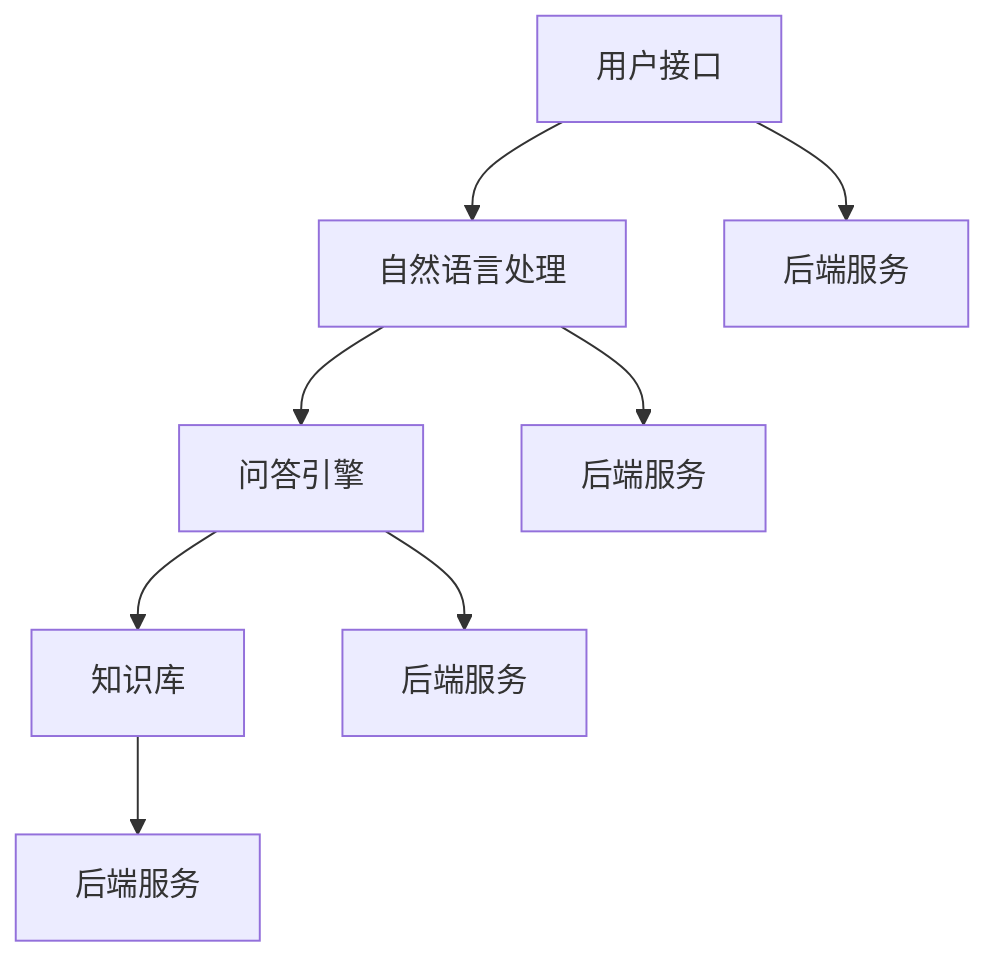
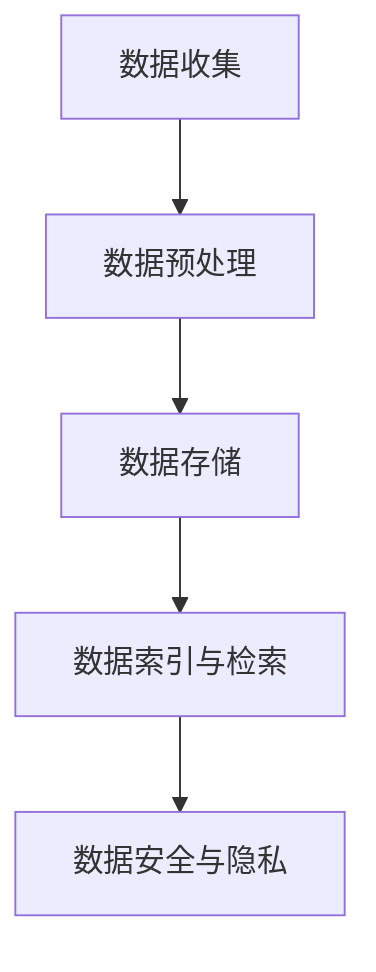
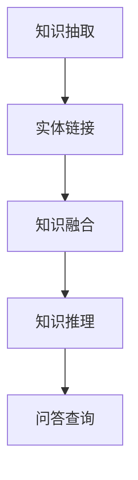
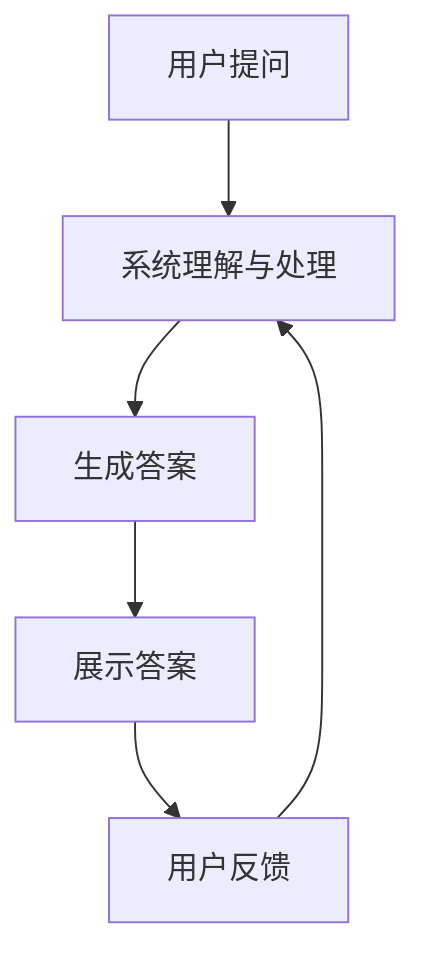

                 

## 引言

在现代企业运营中，知识管理已经成为提升核心竞争力和运营效率的关键因素。企业知识管理不仅涉及企业内部信息的有序组织与存储，更关乎知识的有效传播、应用和创新。传统知识管理方式往往依赖于人工整理和维护，效率低下且容易导致信息丢失和重复劳动。随着人工智能技术的迅速发展，特别是自然语言处理（NLP）、机器学习（ML）和深度学习（DL）等技术的成熟，AI Agent作为智能问答系统在知识管理中的应用逐渐成为可能。

本文旨在探讨企业知识管理中AI Agent的智能问答系统，通过逻辑清晰、结构紧凑的分析，揭示这一系统的核心概念、技术原理、设计与实现、应用实践及未来发展趋势。文章将分为四个主要部分：

首先，在背景与核心概念介绍部分，我们将详细阐述企业知识管理的定义、目的、挑战和机遇，以及核心要素和边界外延。

接下来，AI Agent基础理论部分将深入探讨AI Agent的定义、特点、组成、工作原理、分类及其核心技术。

然后，智能问答系统的设计与实现部分将重点介绍智能问答系统的总体设计、数据处理与存储、知识图谱构建与应用、智能问答系统的交互设计等。

最后，智能问答系统的实践与优化部分将通过具体案例展示系统的搭建、核心代码实现、测试与评估、部署与上线等步骤，并对未来发展趋势和应用前景进行展望。

通过本文的深入分析，我们希望为企业知识管理提供一种新的视角和解决方案，推动AI Agent在智能问答系统中的应用，提升企业知识管理的效率和智能化水平。

### 关键词

- 企业知识管理
- AI Agent
- 智能问答系统
- 自然语言处理（NLP）
- 机器学习（ML）
- 深度学习（DL）
- 强化学习（RL）
- 知识图谱
- 知识库建设
- 知识共享与传播

### 摘要

本文旨在探讨企业知识管理中AI Agent智能问答系统的构建与应用。首先，我们详细介绍了企业知识管理的背景、核心概念及其重要性。随后，深入探讨了AI Agent的定义、特点、组成和工作原理，并分析了其核心技术，包括自然语言处理（NLP）、机器学习（ML）和深度学习（DL）等。在此基础上，我们详细阐述了智能问答系统的总体设计、数据处理与存储、知识图谱构建与应用以及交互设计。通过具体案例分析，展示了系统在实践中的应用效果及优化策略。最后，我们展望了智能问答系统的未来发展趋势和应用前景，提出了数据安全与隐私保护、知识图谱持续更新和用户体验优化等挑战与机遇。

### 目录大纲

- 引言
  - 背景介绍
  - 核心问题
  - 文章结构

#### 第一部分：背景与核心概念介绍

#### 第1章：企业知识管理的概述
  - 问题背景与核心概念
  - 知识管理的目的与重要性
  - 知识管理的挑战与机遇
  - 企业知识管理的边界与外延
  - 企业知识管理的核心要素
  - 本章小结

#### 第二部分：AI Agent基础理论

#### 第2章：AI Agent的基本概念
  - AI Agent的定义与特点
  - AI Agent的组成与工作原理
  - AI Agent的分类与应用
  - 本章小结

#### 第3章：AI Agent的核心技术
  - 自然语言处理（NLP）
  - 机器学习（ML）与深度学习（DL）
  - 强化学习（RL）与生成对抗网络（GAN）
  - AI Agent的情感分析
  - 本章小结

#### 第三部分：智能问答系统的设计与实现

#### 第4章：智能问答系统的总体设计
  - 智能问答系统的架构
  - 数据处理与存储
  - 知识图谱构建与应用
  - 智能问答系统的交互设计
  - 本章小结

#### 第5章：智能问答系统的主要算法
  - 智能问答系统的基础算法
  - 机器学习算法在智能问答中的应用
  - 深度学习算法在智能问答中的应用
  - 强化学习算法在智能问答中的应用
  - 本章小结

#### 第6章：智能问答系统的实践与优化
  - 系统环境搭建与配置
  - 系统核心代码实现
  - 系统测试与评估
  - 系统部署与上线
  - 本章小结

#### 第7章：智能问答系统的应用案例分析
  - 案例介绍
  - 案例分析
  - 案例总结
  - 本章小结

#### 第四部分：未来发展趋势与展望

#### 第8章：智能问答系统的未来发展
  - 新技术趋势
  - 应用领域扩展
  - 发展挑战与机遇
  - 未来展望
  - 本章小结

### 第一部分：背景与核心概念介绍

#### 第1章：企业知识管理的概述

在企业知识管理领域，理解其定义、目的、挑战和机遇是至关重要的。企业知识管理（Knowledge Management，简称KM）是一种旨在识别、获取、创造、存储、共享和应用知识以增强组织绩效和竞争力的系统化过程。其核心概念包括知识的分类、编码、共享和创新。

首先，企业知识管理的定义可以归纳为：通过系统化的方法，整合企业内部的显性知识和隐性知识，以提高知识利用效率，促进知识共享与创新，从而增强企业的核心竞争力。显性知识通常以文档、数据库、报告等形式存在，而隐性知识则包括员工的经验、技能和洞察力。

其次，知识管理的目的在于提升企业的信息传递效率，减少信息孤岛，促进团队协作，以及通过知识的不断积累和创新来增强企业的竞争力。知识管理不仅仅是一种技术手段，更是一种文化变革，它要求企业在组织结构、业务流程、员工行为等方面进行深层次的调整和优化。

然而，在实施知识管理的过程中，企业面临着诸多挑战。首先，知识获取与整理的难度较高，特别是在大规模组织中，如何有效地识别和获取分散的、零碎的知识是一个巨大的难题。其次，知识的共享与传播也存在障碍，如企业文化、员工心态、技术障碍等。此外，如何确保知识的质量和可靠性也是一个重要问题。

尽管面临挑战，但知识管理也带来了诸多机遇。随着互联网和信息技术的发展，企业可以借助大数据、人工智能等技术手段，实现知识的自动化获取、分类、存储和共享。此外，知识管理还可以帮助企业建立创新文化，通过不断的知识创新来驱动企业的持续发展。

企业知识管理的核心要素包括知识库建设、知识获取与整理、知识应用与推广。知识库是知识管理的核心存储设施，它可以是结构化的数据库，也可以是半结构化或非结构化的文档库。知识获取与整理涉及从内外部环境中收集和整理有价值的信息，并将其转化为可用于实际业务的知识。知识应用与推广则关注如何将知识应用于企业的实际业务场景，并通过持续的学习和反馈机制不断优化知识的应用效果。

总之，企业知识管理是一个复杂且动态的过程，它不仅需要先进的技术手段，还需要组织文化和管理机制的变革。通过有效的知识管理，企业可以实现知识的系统化、规范化管理，从而在激烈的市场竞争中立于不败之地。

#### 1.1 问题背景与核心概念

在现代企业运营中，知识管理扮演着至关重要的角色。其背景可以追溯到20世纪末和21世纪初，随着信息技术和互联网的迅猛发展，企业逐渐意识到知识是一种重要的战略资源。然而，如何有效地管理和利用这些知识成为企业面临的巨大挑战。

首先，知识管理的核心概念之一是知识的分类。知识可以根据不同的属性进行分类，如显性知识和隐性知识、结构化知识和非结构化知识、内部知识和外部知识等。显性知识通常以文档、数据库、报告等形式存在，而隐性知识则包括员工的经验、技能和洞察力。在知识管理中，对知识的分类有助于更好地理解和利用各种类型的知识。

其次，知识管理的另一个关键概念是知识的编码。编码是将知识转化为可存储、共享和检索的形式的过程。有效的编码可以提高知识的可访问性和可靠性，确保知识在不同部门和团队之间得到有效传递。常见的编码方式包括结构化文档、数据库、知识图谱等。

接下来，知识共享与传播是知识管理中的核心任务。知识共享是指通过各种手段将知识从一个个体或团队传递到另一个个体或团队的过程。知识传播则是知识在组织内的广泛分布和应用。知识共享与传播不仅需要技术手段的支持，如知识库、共享平台等，还需要组织文化的支持，如建立开放透明的沟通机制、鼓励知识分享的激励机制等。

然后，知识创造与创新是知识管理的终极目标。知识创造是指在现有知识的基础上，通过新的组合、延伸和转化，生成新的知识。创新则是将新知识应用于实际业务场景，以解决实际问题或创造新的商业价值。知识创造与创新需要企业具备持续学习的能力和开放包容的文化氛围，通过跨部门、跨领域的合作，实现知识的协同创新。

最后，知识应用与推广是知识管理的最终价值体现。知识应用是指将知识应用于实际业务场景，以提高业务效率和质量。知识推广则是通过培训和宣传等方式，将知识普及到整个组织，使其成为员工日常工作的一部分。知识应用与推广不仅需要系统的知识管理策略，还需要员工具备一定的知识素养和应用能力。

综上所述，知识管理涉及多个核心概念，包括知识的分类、编码、共享与传播、创造与创新，以及应用与推广。通过这些概念的有效运用，企业可以实现对知识的系统化、规范化管理，从而在激烈的市场竞争中保持竞争优势。

#### 1.2 企业知识管理的目的与重要性

企业知识管理的首要目的是通过高效的知**识管理提升企业的核心竞争力。**知识管理不仅关注知识的存储和检索，更强调知识的传播和应用，使得企业能够更好地利用内部资源，优化业务流程，提高工作效率。以下是企业知识管理的一些具体目标和重要性：

1. **提升知识利用率：** 知识管理通过系统化和规范化的方法，将分散在各处、难以访问的知识整合到一个统一的平台上，使得员工能够快速获取所需信息，减少重复劳动，提高工作效率。

2. **促进知识共享与传播：** 知识共享与传播是知识管理的核心目标之一。通过建立开放的知识共享机制和平台，企业可以促进员工之间的知识交流，打破信息孤岛，增强团队协作，提高整体知识传递的效率。

3. **增强创新能力：** 知识管理鼓励知识的创造与创新。通过不断积累和整合内部和外部的知识资源，企业可以激发员工的创新思维，推动新产品的研发和市场的开拓，从而在竞争激烈的市场中保持领先地位。

4. **优化决策过程：** 知识管理为企业的决策提供强有力的支持。通过整合和分析各类知识，企业可以更加全面地了解市场趋势、客户需求、竞争对手等信息，从而做出更加准确和高效的决策。

5. **提升客户满意度：** 知识管理有助于企业更好地满足客户需求。通过快速获取和利用客户反馈、市场调研等信息，企业可以及时调整产品和服务，提高客户满意度和忠诚度。

6. **降低运营成本：** 知识管理通过减少重复劳动、提高工作效率和优化业务流程，可以显著降低企业的运营成本。此外，通过知识的共享和传播，企业可以避免因员工离职带来的知识流失，减少培训成本。

7. **增强企业竞争力：** 知识管理是企业持续发展的重要保障。通过构建强大的知识库和高效的知识应用体系，企业可以在市场竞争中保持技术领先和创新能力，从而获得长期的竞争优势。

总之，企业知识管理不仅能够提升内部运作效率，还能增强企业的创新能力和市场竞争力。在当今信息时代，谁能够更好地管理和利用知识，谁就能在激烈的市场竞争中脱颖而出。因此，知识管理已经成为企业不可或缺的一部分。

#### 1.3 企业知识管理的挑战与机遇

尽管企业知识管理具有显著的优势，但其实施过程中也面临着诸多挑战和机遇。首先，知识获取与整理是知识管理中的首要难题。在大规模组织中，知识分散在各个部门、团队和员工之间，且形式多样，包括文档、报告、电子邮件、经验等。如何有效地识别和整理这些知识，并将其转化为有用的信息，是一个复杂且耗时的工作。

其次，知识的共享与传播存在一定的障碍。这包括企业文化、员工心态、技术手段等多方面因素。一些企业可能存在信息孤岛现象，导致知识无法在不同部门之间顺畅流动。此外，员工可能因担心知识泄露或竞争，而倾向于保留自己的知识。这都需要通过建立开放透明的文化、制定有效的激励机制和利用先进的技术手段来加以解决。

再者，知识的质量与可靠性也是一个关键问题。在知识管理过程中，如何确保知识的真实性、准确性和完整性，避免错误信息的传播，是一个重要挑战。这需要建立严格的知识审核和更新机制，确保知识库中的知识始终是最新和最有价值的。

然而，这些挑战同时也带来了机遇。随着大数据、人工智能等技术的快速发展，企业可以借助这些先进技术手段，实现知识的自动化获取、分类、存储和共享。例如，通过自然语言处理（NLP）技术，企业可以自动识别和整理大量的非结构化数据，并将其转化为结构化的知识资源。此外，机器学习（ML）和深度学习（DL）技术可以用于知识分析和挖掘，帮助企业从海量数据中提取有价值的信息。

此外，知识管理的实施还可以推动企业文化的变革。通过倡导知识共享和创新，企业可以建立起一种开放、协作、包容的文化氛围，激发员工的积极性和创造力。这种文化变革不仅有助于知识管理的有效实施，还能为企业的长期发展提供强大动力。

总之，企业知识管理既面临挑战，也充满机遇。通过应对这些挑战，并抓住机遇，企业可以构建起一个高效的、智能化的知识管理平台，从而在激烈的市场竞争中保持竞争优势。

#### 1.4 企业知识管理的边界与外延

企业知识管理的边界与外延是其有效实施的重要组成部分。首先，企业知识管理的主要边界包括企业内部的知识资源和知识活动。这些资源包括员工的经验、技能、文件、数据库等，而知识活动则涵盖知识的识别、获取、分类、存储、共享和创新等过程。明确这些边界有助于企业集中资源和管理重点，确保知识管理活动的一致性和系统性。

其次，企业知识管理的外延涉及企业内外部的知识流动和知识整合。外部知识资源包括合作伙伴、客户、供应商以及公共数据库和开放资源，这些资源可以通过合作、采购或共享等方式纳入企业的知识管理体系。外部知识流动则是指企业通过跨部门、跨组织甚至跨行业的知识交流，获取新的见解和创新。

知识分类与编码是知识管理的重要环节。知识分类有助于将不同类型和来源的知识进行系统化整理，以便于后续的共享和应用。常见的知识分类方法包括按领域、按层级、按用途等。编码则是将知识转化为易于存储、检索和共享的形式，如文档、数据库、知识图谱等。有效的编码可以提高知识的可访问性和互操作性，确保知识在不同系统和平台之间无缝流动。

知识共享与传播是企业知识管理的关键目标之一。共享是指通过多种渠道和工具，使知识在企业内部不同层级和部门之间传递。传播则是指通过知识共享活动，使知识在组织内广泛分布和应用。常见的知识共享与传播方式包括内部网络、知识库、研讨会、培训等。这些方式需要结合企业的文化、员工的行为习惯和技术水平，以实现最佳效果。

知识创造与创新是知识管理的终极目标。知识创造是指通过新的组合、延伸和转化，生成新的知识。创新则是将新知识应用于实际业务场景，解决实际问题或创造新的商业价值。知识创造与创新需要企业具备持续学习的能力、开放包容的文化氛围以及跨部门的合作机制。

总之，企业知识管理的边界与外延涉及知识资源、知识活动、知识分类与编码、知识共享与传播以及知识创造与创新。通过明确这些边界和有效实施相关措施，企业可以构建起一个高效、智能化的知识管理平台，从而在激烈的市场竞争中立于不败之地。

#### 1.5 企业知识管理的核心要素

企业知识管理的成功实施依赖于多个核心要素的协同作用。这些核心要素包括知识库建设、知识获取与整理、知识应用与推广，以及知识管理的组织与文化支持。

首先，**知识库建设**是知识管理的基石。知识库是集中存储和管理企业内外部知识资源的系统，它可以是结构化的数据库、文档库，也可以是半结构化或非结构化的知识图谱。知识库的建设需要明确知识分类标准、编码规范和存储结构，确保知识的高效检索和应用。有效的知识库不仅能够提供丰富的知识资源，还能通过数据分析帮助企业在决策过程中获得有力支持。

其次，**知识获取与整理**是知识管理的核心任务之一。知识获取是指通过各种手段，从企业内部和外部环境中收集有价值的信息和知识。这包括员工的经验、客户的反馈、市场调研报告、竞争对手的信息等。知识整理则是对获取到的知识进行分类、筛选、整合和编码，使其具备可存储、可检索和可应用的特点。通过有效的知识获取与整理，企业可以确保知识库中的知识始终是最新的、最有价值的。

**知识应用与推广**是知识管理的最终目标。知识应用是指将知识库中的知识应用于实际业务场景，以提高工作效率、优化业务流程和提升企业竞争力。知识推广则是指通过培训、会议、知识分享等多种方式，将知识普及到整个组织，使其成为员工日常工作的一部分。知识应用与推广不仅需要系统的知识管理策略，还需要员工具备一定的知识素养和应用能力。

此外，知识管理的实施离不开**组织与文化支持**。企业需要建立开放、协作、包容的组织文化，鼓励员工积极参与知识共享和创新。这包括制定知识共享的激励机制、建立透明的沟通机制、提供必要的培训和支持等。通过组织与文化支持，企业可以确保知识管理活动的顺利进行，并持续优化知识管理的效果。

总之，企业知识管理的核心要素包括知识库建设、知识获取与整理、知识应用与推广，以及知识管理的组织与文化支持。通过这些核心要素的协同作用，企业可以构建一个高效、智能化的知识管理平台，从而在激烈的市场竞争中保持竞争优势。

#### 1.6 本章小结

本章详细介绍了企业知识管理的定义、目的、挑战与机遇，以及知识管理的核心要素和边界外延。企业知识管理作为一种系统化过程，旨在通过识别、获取、创造、存储、共享和应用知识，提升企业核心竞争力和运营效率。其主要核心概念包括知识的分类、编码、共享与传播，以及知识创造与创新。在目的与重要性部分，我们强调了知识管理在提升知识利用率、促进知识共享与传播、增强创新能力等方面的关键作用。在挑战与机遇部分，我们分析了知识获取与整理、知识共享与传播、知识质量与可靠性等方面的难题及其带来的发展机会。最后，我们讨论了知识管理的边界与外延，包括知识库建设、知识获取与整理、知识共享与传播、知识创造与创新等核心要素。通过本章的学习，读者可以对企业知识管理有更全面和深入的理解，为后续章节的深入学习奠定基础。

### 第二部分：AI Agent基础理论

#### 第2章：AI Agent的基本概念

AI Agent（人工智能代理）是人工智能领域的一个重要概念，它模拟人类智能，通过与环境的交互来完成任务。理解AI Agent的基本概念、特点以及与传统软件的区别，对于深入探讨AI Agent在知识管理中的应用具有重要意义。

#### 2.1 AI Agent的定义与特点

AI Agent，即人工智能代理，是一种能够自主感知环境、决策并执行行动的计算机程序。其基本定义可以概括为：AI Agent是一种具有智能行为和自主能力的计算机程序，能够在特定环境中完成指定任务。

AI Agent的特点主要体现在以下几个方面：

1. **自主性**：AI Agent能够自主地感知环境，根据感知的信息进行决策，并执行相应的行动，而不需要外部干预。
2. **适应性**：AI Agent能够根据环境变化调整其行为策略，适应不同的任务需求和情景。
3. **智能性**：AI Agent具备一定的智能能力，能够通过学习和推理，从环境中获取知识和经验，提高任务执行效率。
4. **交互性**：AI Agent能够与人类或其他计算机系统进行自然语言交互，通过语音、文字等形式传递信息和指令。

#### 2.2 AI Agent的组成与工作原理

AI Agent通常由以下几个主要模块组成：

1. **感知模块**：感知模块负责收集环境信息，如文本、图像、声音等。这些信息通过传感器、摄像头、麦克风等设备获取。
2. **决策模块**：决策模块根据感知模块提供的信息，利用算法进行推理和判断，选择最佳行动方案。
3. **执行模块**：执行模块负责将决策模块生成的行动指令转化为具体操作，如移动、发送消息等。
4. **学习模块**：学习模块通过机器学习、深度学习等技术，从环境中获取知识和经验，不断优化决策和执行策略。

AI Agent的工作原理可以概括为以下几个步骤：

1. **感知**：AI Agent通过感知模块获取环境信息。
2. **决策**：AI Agent利用决策模块对感知到的信息进行处理，生成行动方案。
3. **执行**：AI Agent通过执行模块执行决策模块生成的行动指令。
4. **反馈**：AI Agent根据执行结果进行反馈，并通过学习模块不断调整和优化决策策略。

#### 2.3 AI Agent与传统软件的区别

AI Agent与传统软件在多个方面存在显著区别：

1. **自主性**：传统软件通常需要人工设定所有操作步骤，而AI Agent具备自主决策和行动能力，能够独立完成任务。
2. **适应性**：传统软件在面对复杂多变的环境时往往表现不佳，而AI Agent能够通过学习和适应环境变化，不断提高任务执行效率。
3. **智能性**：传统软件通常不具备智能学习能力，而AI Agent能够通过机器学习、深度学习等技术，实现自主学习和优化。
4. **交互性**：传统软件通常只能执行预设的任务，而AI Agent能够与人类或其他系统进行自然语言交互，具备更强的交互能力。

总之，AI Agent作为一种具备自主性、适应性、智能性和交互性的计算机程序，与传统的软件相比具有显著优势，为现代企业提供了更智能、高效的知识管理解决方案。

#### 2.4 AI Agent的核心特点

AI Agent的核心特点在于其自主性、适应性、智能性和交互性，这些特点使其在现代企业知识管理中具有独特的优势。

首先，**自主性**是AI Agent最基本的特征。与传统软件不同，AI Agent不需要人类干预即可自主执行任务。它能够根据感知到的环境信息，自主进行决策和行动，这使得AI Agent在处理复杂任务时具有高度的灵活性和效率。

其次，**适应性**是AI Agent的重要特点。AI Agent能够根据环境变化自主调整行为策略，以适应不同的任务需求。例如，在知识管理场景中，AI Agent可以根据用户行为和反馈，不断优化问答系统的回答质量，从而提供更加个性化的服务。

**智能性**是AI Agent的核心竞争力之一。AI Agent通过机器学习、深度学习等技术，能够从海量数据中提取有价值的信息，实现智能决策和行动。在知识管理中，AI Agent可以利用自然语言处理（NLP）技术，理解和回答用户的问题，从而提高知识共享和传播的效率。

最后，**交互性**使得AI Agent能够与人类和其他系统进行自然语言交互。AI Agent可以通过语音、文字等形式，与用户进行实时对话，提供即时的帮助和反馈。这种交互能力不仅提升了用户体验，还促进了知识的共享和传播。

总之，AI Agent的自主性、适应性、智能性和交互性使其在知识管理中具有显著优势。通过这些核心特点，AI Agent能够有效提升企业知识管理的效率和质量，为企业的长期发展提供有力支持。

#### 2.5 AI Agent与传统软件的区别

AI Agent与传统软件在多个方面存在显著区别，这些差异主要体现在自主性、适应性、智能性和交互性上。

首先，**自主性**方面，传统软件通常需要人类干预来执行特定的任务，而AI Agent具备高度自主性，能够根据环境变化和感知信息，自主进行决策和行动。例如，在知识管理系统中，传统软件可能需要人工设定查询条件和结果处理方式，而AI Agent能够自主理解用户需求，并自动生成合适的查询结果。

其次，**适应性**方面，传统软件在面对复杂多变的环境时往往表现不佳，而AI Agent具备较强的适应性。AI Agent可以通过机器学习和深度学习技术，从历史数据和用户反馈中学习，从而在动态环境中不断优化其行为策略。例如，在智能客服场景中，AI Agent可以根据用户历史记录和当前提问，自动调整问答策略，提供更准确、个性化的回答。

**智能性**方面，传统软件通常不具备智能学习能力，而AI Agent能够通过先进的算法，实现智能决策和行动。AI Agent可以借助自然语言处理（NLP）、机器学习（ML）和深度学习（DL）等技术，理解和分析复杂的信息，从而在知识管理中提供智能化的服务。例如，在智能问答系统中，AI Agent可以通过NLP技术理解用户的问题，并利用机器学习算法生成高质量的答案。

**交互性**方面，传统软件通常只能执行预设的任务，而AI Agent具备强大的交互能力。AI Agent可以通过自然语言交互，与用户进行实时对话，提供即时的帮助和反馈。例如，在知识共享平台中，AI Agent可以与员工进行自然语言对话，回答员工的问题，并提供相关文档和资料，从而促进知识的传播和应用。

综上所述，AI Agent在自主性、适应性、智能性和交互性方面与传统软件有显著差异。这些特点使得AI Agent能够更好地适应现代企业的知识管理需求，提供更高效、智能化的解决方案。

#### 2.6 AI Agent的分类与应用

AI Agent可以根据其功能、任务和应用场景进行分类，常见的分类方法包括对话型Agent、任务型Agent和混合型Agent。

**对话型Agent**主要专注于与人进行自然语言交互。它们能够理解用户的语言输入，并根据预设的规则或机器学习模型生成合适的回复。对话型Agent在智能客服、虚拟助手、在线咨询等领域有着广泛的应用。例如，一个智能客服Agent可以通过语音或文本与客户进行对话，解决客户的问题，提供实时支持。

**任务型Agent**专注于执行特定任务，如数据收集、信息检索、自动化操作等。它们通常在后台运行，无需与用户进行直接交互。任务型Agent在数据挖掘、自动化流程管理、资源调度等领域有着重要应用。例如，一个数据挖掘Agent可以自动从大量数据中提取有价值的信息，为企业的决策提供支持。

**混合型Agent**结合了对话型和任务型的特点，既能够与人进行自然语言交互，也能够执行复杂任务。这种类型的Agent在复杂的业务流程中应用广泛，如智能供应链管理、智能工厂监控、金融风险评估等。混合型Agent能够通过多模态感知和智能决策，实现高度自动化的业务流程管理。

总的来说，AI Agent的分类和应用与其功能特点密切相关。不同的Agent类型适用于不同的应用场景，通过合理选择和应用，可以实现企业知识管理的智能化和高效化。

#### 2.7 本章小结

本章详细介绍了AI Agent的基本概念、特点以及与传统软件的区别，并对其分类和应用进行了探讨。AI Agent作为一种具备自主性、适应性、智能性和交互性的计算机程序，在现代企业知识管理中具有显著优势。通过理解AI Agent的定义、组成和工作原理，读者可以更好地把握其核心特点和应用场景，为后续章节的深入探讨奠定基础。了解AI Agent的分类与应用，有助于企业根据具体需求选择合适的Agent类型，以实现知识管理的智能化和高效化。

### 第3章：AI Agent的核心技术

在AI Agent的构建与应用中，核心技术起到了至关重要的作用。本章将重点介绍自然语言处理（NLP）、机器学习（ML）与深度学习（DL）、强化学习（RL）与生成对抗网络（GAN）等关键技术，以及AI Agent的情感分析能力。

#### 3.1 自然语言处理（NLP）

自然语言处理（NLP）是人工智能领域的一个重要分支，主要研究如何使计算机理解和处理人类语言。NLP在AI Agent中有着广泛的应用，如语音识别、语义理解、文本生成等。

**基本概念**：NLP旨在使计算机能够理解和生成人类语言。其核心技术包括分词、词性标注、命名实体识别、句法分析、语义角色标注等。

**关键技术**：
1. **词嵌入**：词嵌入（Word Embedding）是将词汇映射到高维向量空间，以便计算机能够理解和计算词汇之间的关系。常见的词嵌入方法包括Word2Vec、GloVe等。
2. **序列模型**：序列模型（Sequential Model）如循环神经网络（RNN）和长短期记忆网络（LSTM），能够处理文本序列，捕捉词汇之间的时序关系。
3. **编码器-解码器框架**：编码器-解码器框架（Encoder-Decoder Framework）是NLP中常用的一种模型结构，用于机器翻译、文本生成等任务。

**应用场景**：NLP在AI Agent中的应用场景包括语音助手、智能客服、文本分析等。例如，一个智能客服系统可以通过NLP技术理解用户的语言输入，并生成合适的回复，提供高质量的客户服务。

#### 3.2 机器学习（ML）与深度学习（DL）

机器学习（ML）和深度学习（DL）是AI Agent的核心技术，广泛应用于模式识别、预测建模、分类等任务。

**基本原理**：
1. **机器学习**：机器学习是一种通过数据训练模型，使模型能够对未知数据进行预测或分类的方法。常见的机器学习算法包括线性回归、决策树、支持向量机（SVM）等。
2. **深度学习**：深度学习是一种基于多层神经网络的结构，通过逐层提取特征，实现高度复杂的任务。常见的深度学习模型包括卷积神经网络（CNN）、循环神经网络（RNN）、长短期记忆网络（LSTM）等。

**算法比较**：
- **优点**：深度学习相比于传统机器学习，具有更强的表达能力和自适应能力，能够处理更加复杂的任务。
- **缺点**：深度学习模型通常需要大量数据和计算资源，训练时间较长。

**应用场景**：机器学习和深度学习在AI Agent中的应用场景包括图像识别、语音识别、自然语言处理等。例如，一个图像识别AI Agent可以通过深度学习模型，从图像中识别出目标对象，并提供相应的信息。

#### 3.3 强化学习（RL）与生成对抗网络（GAN）

强化学习（RL）和生成对抗网络（GAN）是深度学习中重要的两个方向，具有独特的应用场景。

**基本原理**：
1. **强化学习**：强化学习是一种通过奖励机制，使模型能够在复杂环境中学习最优策略的方法。常见的强化学习算法包括Q学习、深度Q网络（DQN）、演员-评论家（Actor-Critic）等。
2. **生成对抗网络**：生成对抗网络（GAN）是一种由生成器和判别器组成的对抗性模型，通过不断对抗，生成逼真的数据。常见的GAN结构包括生成对抗网络（GAN）、深度生成对抗网络（DGAN）等。

**应用场景**：强化学习和GAN在AI Agent中的应用场景包括游戏AI、图像生成、语音合成等。例如，一个游戏AI可以通过强化学习，学习最优的游戏策略，而GAN可以用于生成逼真的图像和语音。

#### 3.4 AI Agent的情感分析

情感分析是NLP领域的一个重要分支，旨在理解文本中的情感倾向和情感强度。AI Agent可以通过情感分析，识别用户的情感状态，提供个性化的服务。

**基本概念**：情感分析主要涉及情感分类（Sentiment Classification）和情感极性分析（Sentiment Polarization）。

**关键技术**：
1. **情感词典**：情感词典是情感分析的基础，它包含大量带有情感倾向的词汇和短语。
2. **情感分类模型**：情感分类模型用于将文本分类为积极、消极或中性。常见的模型包括朴素贝叶斯、支持向量机（SVM）、神经网络等。

**应用场景**：情感分析在AI Agent中的应用场景包括客户服务、社交媒体分析、市场调研等。例如，一个智能客服系统可以通过情感分析，识别客户的情感状态，并生成合适的回复，提供个性化的服务。

通过本章的介绍，我们可以看到，自然语言处理（NLP）、机器学习（ML）与深度学习（DL）、强化学习（RL）与生成对抗网络（GAN）等技术，为AI Agent提供了强大的能力。这些技术不仅能够提升AI Agent的智能水平，还能够扩展其应用场景，推动企业知识管理的智能化和高效化。

### 3.1 自然语言处理（NLP）的基本概念

自然语言处理（NLP）是人工智能领域中的一个重要分支，旨在使计算机能够理解、处理和生成人类语言。NLP的目的是将自然语言（如英语、中文等）转化为计算机可以处理的形式，并从中提取有用的信息。NLP的基本概念包括分词、词性标注、命名实体识别、句法分析和语义角色标注等。

**分词**：分词是NLP的基础步骤，它将连续的文本序列划分为一组有意义的词汇或短语。例如，将“我爱北京天安门”分为“我”、“爱”、“北京”、“天安门”。分词的准确性对于后续的NLP任务至关重要。

**词性标注**：词性标注是指为文本中的每个词汇分配一个词性标签，如名词、动词、形容词等。词性标注有助于理解词汇在句子中的作用和意义。

**命名实体识别**：命名实体识别（Named Entity Recognition，简称NER）是指从文本中识别出具有特定意义的实体，如人名、地名、组织名等。NER在信息提取、知识图谱构建等领域有着广泛的应用。

**句法分析**：句法分析是指对文本中的句子结构进行解析，识别出词汇之间的语法关系。常见的句法分析方法包括依存句法分析和成分句法分析。

**语义角色标注**：语义角色标注是指为句子中的每个词汇分配一个语义角色，如施事、受事、工具等。语义角色标注有助于理解句子的语义结构和意图。

**应用场景**：NLP在智能客服、文本分析、机器翻译等领域有着广泛的应用。例如，在智能客服中，NLP技术可以用于理解用户的语言输入，生成合适的回复；在文本分析中，NLP技术可以用于情感分析、关键词提取等任务。

### 3.2 自然语言处理（NLP）的关键技术

自然语言处理（NLP）在AI Agent中的应用依赖于一系列关键技术的支持。这些技术不仅提高了AI Agent对自然语言的理解和生成能力，还极大地扩展了其应用范围。以下是NLP的几种核心技术：

**词嵌入（Word Embedding）**：词嵌入是将词汇映射到高维向量空间的技术，以便计算机能够理解和计算词汇之间的关系。词嵌入技术使计算机能够捕捉词汇的语义信息，从而在文本分析和理解中发挥重要作用。常见的词嵌入方法包括Word2Vec、GloVe等。

**序列模型（Sequential Model）**：序列模型是一种用于处理文本序列的模型，如循环神经网络（RNN）和长短期记忆网络（LSTM）。这些模型能够捕捉词汇之间的时序关系，从而在自然语言理解任务中表现出色。RNN和LSTM是处理变长文本序列的有效工具，广泛应用于机器翻译、文本分类等任务。

**编码器-解码器框架（Encoder-Decoder Framework）**：编码器-解码器框架是一种用于序列到序列学习的模型结构，广泛应用于机器翻译、文本生成等任务。编码器负责将输入序列编码为固定长度的向量表示，而解码器则负责将这个向量表示解码为输出序列。这种框架能够有效地处理不同长度的输入和输出序列，是NLP中的一种核心方法。

**注意力机制（Attention Mechanism）**：注意力机制是一种用于捕捉重要信息的机制，广泛应用于编码器-解码器框架。注意力机制能够使模型在解码过程中关注输入序列中的关键部分，从而提高模型的性能。例如，在机器翻译中，注意力机制可以使模型在生成目标语言单词时，关注源语言句子中的相关部分，从而提高翻译的准确性。

**预训练与微调（Pre-training and Fine-tuning）**：预训练是指在大规模数据集上训练模型，使其具备一定的语言理解和生成能力。微调则是将预训练模型在特定任务上进一步训练，以适应特定的应用场景。预训练与微调技术使模型能够在有限的数据集上实现较高的性能，是NLP中的一种重要方法。

**应用场景**：这些NLP关键技术广泛应用于多种AI Agent任务，如文本分类、情感分析、机器翻译、问答系统等。例如，词嵌入和序列模型可以使AI Agent更好地理解用户的语言输入，生成高质量的回复；编码器-解码器框架和注意力机制则使AI Agent能够在机器翻译任务中生成更准确、流畅的翻译结果。

通过这些关键技术的支持，AI Agent能够更有效地处理自然语言，提供更智能、个性化的服务，从而在知识管理中发挥重要作用。

#### 3.3 机器学习（ML）与深度学习（DL）的基本原理

机器学习（ML）和深度学习（DL）是人工智能领域的重要组成部分，它们分别代表了两种不同的方法论。理解这两种方法的基本原理对于构建高效的AI Agent至关重要。

**机器学习（ML）的基本原理**：

机器学习是一种通过训练模型来使计算机从数据中学习的方法。其主要步骤包括数据收集、特征提取、模型训练和模型评估。

1. **数据收集**：首先，需要收集大量的数据，这些数据可以是结构化的（如数据库）或非结构化的（如图像、文本）。
2. **特征提取**：然后，从数据中提取特征，这些特征将用于训练模型。特征提取是机器学习中的一个关键步骤，它决定了模型的性能。
3. **模型训练**：使用提取的特征来训练模型，通过优化目标函数（如最小化损失函数），使模型能够对新的数据进行预测或分类。
4. **模型评估**：最后，评估模型的性能，常用的评估指标包括准确率、召回率、F1分数等。

常见的机器学习算法包括线性回归、决策树、随机森林、支持向量机（SVM）等。这些算法在不同类型的问题中有着广泛的应用，如回归分析、分类问题和聚类分析等。

**深度学习（DL）的基本原理**：

深度学习是一种基于多层神经网络的结构，通过逐层提取特征，实现高度复杂的任务。其主要特点是能够自动从数据中学习特征，从而降低人工特征提取的难度。

1. **神经网络**：神经网络是由大量神经元组成的计算模型，每个神经元都与其他神经元相连，并通过权重进行信息传递。神经网络可以通过反向传播算法进行训练，不断调整权重，以优化模型的性能。
2. **多层神经网络**：深度学习通过增加网络的层数，实现特征的逐层提取。每层神经网络都会提取比前一层更复杂的特征，从而提高模型的表达能力和学习能力。
3. **前向传播与反向传播**：前向传播是指将输入数据通过神经网络进行传递，得到输出结果；反向传播是指通过计算输出结果与实际结果的差异，反向调整网络权重，以优化模型。

常见的深度学习模型包括卷积神经网络（CNN）、循环神经网络（RNN）、长短期记忆网络（LSTM）等。这些模型在不同领域有着广泛的应用，如图像识别、自然语言处理、语音识别等。

**算法比较**：

- **优点**：
  - **深度学习**：具有强大的表达能力和自适应能力，能够处理更加复杂的任务。深度学习模型可以从海量数据中自动提取特征，降低了人工特征提取的难度。
  - **机器学习**：适用于各种类型的问题，包括回归、分类和聚类等。机器学习算法在某些问题上（如线性回归）表现良好，且实现较为简单。

- **缺点**：
  - **深度学习**：需要大量的数据和计算资源，训练时间较长。深度学习模型往往缺乏可解释性，难以理解其内部工作机制。
  - **机器学习**：在某些问题上表现较差，如非线性问题。机器学习算法对数据质量要求较高，数据预处理和特征提取过程复杂。

**应用场景**：

- **深度学习**：广泛应用于图像识别、自然语言处理、语音识别等领域。例如，卷积神经网络（CNN）在图像分类和物体检测中表现出色；循环神经网络（RNN）和长短期记忆网络（LSTM）在自然语言处理任务中具有广泛应用。
- **机器学习**：适用于各种类型的统计分析和预测任务，如回归分析、分类问题和聚类分析等。例如，决策树和随机森林在金融风险评估和医疗诊断中表现出色。

通过理解机器学习与深度学习的基本原理，我们可以根据具体问题选择合适的方法，以构建高效的AI Agent，提高企业知识管理的智能化水平。

### 3.4 强化学习（RL）与生成对抗网络（GAN）

强化学习（Reinforcement Learning，简称RL）和生成对抗网络（Generative Adversarial Networks，简称GAN）是深度学习领域中的两个重要研究方向，分别应用于不同类型的任务，并具备独特的算法结构和应用场景。

#### 强化学习（RL）的基本概念

强化学习是一种通过奖励机制，使模型能够在复杂环境中学习最优策略的方法。其核心思想是模型通过与环境的交互，不断调整行为策略，以实现最大化长期奖励。

**基本原理**：

强化学习由四个主要组成部分：环境（Environment）、智能体（Agent）、行动（Action）和奖励（Reward）。

1. **环境**：环境是智能体操作的场所，包含智能体无法直接控制的状态和动作空间。
2. **智能体**：智能体是执行动作并从环境中接收反馈的实体。智能体的目标是学习一个策略，使其能够在环境中获得最大化的总奖励。
3. **行动**：智能体在环境中可以选择的行动。
4. **奖励**：奖励是智能体在执行某个行动后从环境中获得的即时反馈，用于指导智能体的决策。

**核心算法**：

- **Q学习（Q-Learning）**：Q学习是一种基于值函数的强化学习算法。它通过学习状态-动作值函数（Q值），指导智能体选择最佳行动。
- **深度Q网络（Deep Q-Network，DQN）**：DQN是将Q学习算法与深度神经网络结合的一种方法，适用于处理高维状态空间和动作空间的问题。
- **演员-评论家（Actor-Critic）**：演员-评论家是一种同时更新策略和价值函数的强化学习算法。演员负责生成动作，评论家负责评估这些动作的好坏。

**应用场景**：

强化学习在游戏AI、机器人控制、自动驾驶等领域有着广泛应用。例如，在游戏AI中，智能体可以通过强化学习算法，学习玩游戏的最优策略；在自动驾驶中，智能体可以通过强化学习，学习如何在复杂的交通环境中安全驾驶。

#### 生成对抗网络（GAN）

生成对抗网络（GAN）是由生成器（Generator）和判别器（Discriminator）两个神经网络组成的对抗性模型。生成器的目标是生成逼真的数据，而判别器的目标是区分生成数据与真实数据。通过这种对抗性训练，生成器逐渐生成更加逼真的数据，判别器逐渐提高对真实数据与生成数据的区分能力。

**基本原理**：

1. **生成器**：生成器的任务是生成逼真的数据，例如图像、文本或音频。
2. **判别器**：判别器的任务是判断输入数据是真实数据还是生成数据。
3. **对抗性训练**：生成器和判别器在训练过程中相互对抗。生成器不断优化其生成的数据，使其更接近真实数据，而判别器不断优化其判断能力，以更准确地区分生成数据与真实数据。

**核心算法**：

- **生成对抗网络（GAN）**：GAN是最早提出的GAN结构，由生成器和判别器组成，通过对抗性训练生成高质量的数据。
- **深度生成对抗网络（Deep Generative Adversarial Networks，DGAN）**：DGAN是GAN的扩展，引入了深度神经网络，适用于处理更复杂的数据。

**应用场景**：

生成对抗网络在图像生成、数据增强、风格迁移等领域有着广泛应用。例如，在图像生成中，GAN可以生成高质量的自然图像；在数据增强中，GAN可以通过生成新的数据样本来提升模型训练效果；在风格迁移中，GAN可以将一种艺术风格应用到图像上，生成具有特定风格的新图像。

总之，强化学习和生成对抗网络作为深度学习领域的重要组成部分，分别应用于策略学习和数据生成，具有独特的算法结构和应用场景。通过理解这两种技术的基本原理和应用，我们可以更好地利用AI Agent在复杂环境中的决策能力和数据生成能力，提升企业知识管理的智能化水平。

#### 3.5 AI Agent的情感分析

情感分析是自然语言处理（NLP）领域的一个重要分支，旨在通过计算机技术和算法来识别和理解文本中的情感倾向和情感强度。在AI Agent中，情感分析能够为用户提供更个性化和贴心的服务，从而提升用户体验。以下是情感分析的基本概念、分类、关键技术以及应用场景。

**基本概念**：

情感分析（Sentiment Analysis），也称为意见挖掘（Opinion Mining），是指通过自然语言处理技术，对文本数据中的情感倾向进行分类和量化。情感分析的目标是判断文本表达的情感是积极、消极还是中性。

**分类**：

情感分析通常分为两个层次：情感分类（Sentiment Classification）和情感极性分析（Sentiment Polarization）。

- **情感分类**：情感分类将文本分类为三个主要类别：积极（Positive）、消极（Negative）和中性（Neutral）。例如，一个句子“这个产品非常好”会被分类为积极。
- **情感极性分析**：情感极性分析是对情感分类的进一步细化，通过量化情感强度，通常用正负分数或等级来表示。例如，一个句子“这个服务有点差”会被标记为负情感，但情感强度可能不如“这个服务非常差”强烈。

**关键技术**：

1. **情感词典**：情感词典是情感分析的基础，它包含大量带有情感倾向的词汇和短语。通过匹配文本中的关键词和情感词典中的条目，可以快速判断文本的情感。
2. **机器学习算法**：常见的机器学习算法，如朴素贝叶斯（Naive Bayes）、支持向量机（SVM）、随机森林（Random Forest）等，可以用于训练情感分类模型。这些算法通过从训练数据中学习情感模式，对新文本进行情感分类。
3. **深度学习模型**：深度学习模型，如卷积神经网络（CNN）、循环神经网络（RNN）、长短期记忆网络（LSTM）等，可以用于处理更复杂的情感分析任务。这些模型能够自动提取文本中的深层特征，提高情感分类的准确性。

**应用场景**：

情感分析在多个领域有着广泛的应用，包括但不限于：

- **客户服务**：通过分析客户反馈和评价，企业可以了解用户对产品和服务的满意度，及时调整策略，提高服务质量。
- **市场调研**：通过分析社交媒体上的用户评论和讨论，企业可以了解消费者对产品或服务的看法，为市场营销策略提供依据。
- **金融领域**：在金融领域，情感分析可以用于分析市场情绪，预测股票价格波动，为投资决策提供支持。
- **医疗诊断**：在医疗领域，情感分析可以用于分析患者病历和诊断报告中的情感信息，帮助医生更好地理解患者的心理状态。

**应用示例**：

- **社交媒体分析**：一个企业可以通过情感分析工具，分析其在社交媒体上的用户评论，了解产品的市场反响。例如，分析用户对新产品发布的评论，发现用户对某些功能的高度评价或批评，从而优化产品设计和营销策略。
- **客户满意度调查**：在客户满意度调查中，企业可以通过情感分析工具分析客户填写问卷的文本，了解客户对服务或产品的具体满意程度，以及需要改进的方面。

通过情感分析，AI Agent能够更准确地理解用户的情感需求，提供个性化服务，从而提升用户体验和企业的运营效率。

#### 3.6 本章小结

本章详细介绍了AI Agent的核心技术，包括自然语言处理（NLP）、机器学习（ML）与深度学习（DL）、强化学习（RL）与生成对抗网络（GAN）等。通过理解NLP的基本概念和关键技术，如词嵌入、序列模型和编码器-解码器框架，读者可以更好地掌握自然语言处理的原理和应用。在机器学习与深度学习的部分，我们探讨了这两种方法的基本原理、算法比较及其在不同应用场景中的适用性。此外，强化学习和生成对抗网络作为深度学习的重要分支，分别介绍了其基本概念和应用场景，展示了AI Agent在复杂任务中的强大能力。通过本章的学习，读者可以全面了解AI Agent的核心技术，为后续章节的深入探讨奠定基础。

### 第三部分：智能问答系统的设计与实现

#### 第4章：智能问答系统的总体设计

智能问答系统作为一种重要的知识管理工具，其设计目标是提供高效、准确、智能化的问答服务，帮助用户快速获取所需的信息。本章将详细介绍智能问答系统的总体设计，包括系统架构、数据处理与存储、知识图谱构建与应用，以及智能问答系统的交互设计。

#### 4.1 智能问答系统的架构

智能问答系统的架构设计是系统高效运行的关键。一个典型的智能问答系统架构通常包括以下几个主要模块：

1. **用户接口（UI）模块**：用户接口是用户与系统交互的界面，主要包括问答输入界面和答案展示界面。用户可以通过文本输入或语音输入的方式提出问题，系统会根据用户的输入生成答案并展示给用户。
2. **自然语言处理（NLP）模块**：自然语言处理模块是智能问答系统的核心，主要负责对用户输入的自然语言进行解析和处理。该模块通常包括分词、词性标注、命名实体识别、句法分析和语义理解等任务。
3. **问答引擎模块**：问答引擎模块是系统的智能核心，负责处理用户的查询请求，从知识库中检索相关信息，并生成答案。问答引擎通常采用基于规则的方法、基于模板的方法或基于机器学习的方法。
4. **知识库模块**：知识库是智能问答系统的数据存储中心，包含了大量的结构化和非结构化知识。知识库的构建是系统设计的重要环节，需要确保知识的高质量、准确性和完整性。
5. **后端服务模块**：后端服务模块包括数据预处理、存储、管理和分析等功能。该模块为智能问答系统提供了强大的数据处理能力和后台支持。

**系统架构设计图**：



#### 4.2 数据处理与存储

数据处理与存储是智能问答系统设计的重要部分。以下是数据处理与存储的主要步骤和考虑因素：

1. **数据收集**：智能问答系统需要从各种来源收集数据，包括结构化数据（如数据库、表格）和非结构化数据（如文本、图像、音频）。数据收集需要确保数据的多样性和质量，为后续处理提供丰富的数据资源。
2. **数据预处理**：数据预处理是数据清洗、格式化、归一化和特征提取的过程。预处理步骤包括去除噪声、填补缺失值、转换数据格式等，以提高数据的质量和一致性。
3. **数据存储**：数据存储需要选择合适的数据存储方案，如关系数据库、NoSQL数据库、文件系统等。数据存储应确保数据的高可用性、高性能和可扩展性。
4. **数据索引与检索**：为了提高数据检索效率，需要对知识库中的数据进行索引。常见的索引技术包括全文索引、倒排索引等。检索算法需要支持高效的信息检索和查询优化。
5. **数据安全与隐私**：数据存储和管理过程中，需要考虑数据的安全性和隐私保护。采用加密技术、访问控制、数据脱敏等方法，确保数据的安全和用户隐私。

**数据处理与存储流程图**：



#### 4.3 知识图谱构建与应用

知识图谱是智能问答系统的重要组成部分，它通过图形结构表示实体及其关系，为问答系统提供了强大的语义理解能力。以下是知识图谱构建与应用的主要步骤和关键技术：

1. **知识抽取**：知识抽取是从原始文本数据中提取结构化知识的过程。常见的知识抽取方法包括实体识别、关系提取、属性抽取等。
2. **实体链接**：实体链接是将文本中的实体与知识图谱中的实体进行匹配和关联的过程。实体链接是构建知识图谱的关键步骤，需要利用命名实体识别、实体匹配、实体关系推理等技术。
3. **知识融合**：知识融合是将来自不同来源或不同格式的知识进行整合，以构建统一的、高质量的知识库。知识融合需要考虑知识的一致性、完整性和准确性。
4. **知识推理**：知识推理是通过推理算法，从知识图谱中推导出新的知识和结论。常见的知识推理方法包括基于规则的推理、基于模型的推理等。
5. **问答查询**：问答查询是利用知识图谱进行信息检索和答案生成的过程。通过构建高效的查询算法和索引结构，可以实现快速的问答查询。

**知识图谱构建与应用流程图**：



#### 4.4 智能问答系统的交互设计

智能问答系统的交互设计是用户与系统进行有效沟通的重要环节。以下是交互设计的主要考虑因素和设计原则：

1. **用户界面设计**：用户界面设计需要简洁、直观、易用，提供丰富的交互功能，如文本输入、语音输入、多轮对话等。用户界面应具备良好的视觉效果和用户体验，使用户能够轻松地与系统进行交互。
2. **用户交互流程**：用户交互流程应设计合理，提供清晰的交互步骤和反馈机制。系统需要能够处理用户的提问，并生成合适的答案，同时支持用户的反馈和后续追问。
3. **用户反馈机制**：用户反馈机制是智能问答系统不断优化和改进的重要手段。系统应能够记录用户的反馈，并根据反馈调整答案生成策略，提高问答的准确性和用户体验。
4. **多轮对话支持**：多轮对话支持是智能问答系统的高级功能，它允许用户和系统进行多轮问答，逐步深入了解用户的需求，提供更精准的答案。

**交互设计流程图**：



通过上述步骤和设计原则，智能问答系统可以实现高效、准确、智能化的问答服务，为用户提供优质的用户体验，提升企业的知识管理效率和竞争力。

#### 4.5 本章小结

本章详细介绍了智能问答系统的总体设计，包括系统架构、数据处理与存储、知识图谱构建与应用，以及智能问答系统的交互设计。系统架构设计涵盖了用户接口、自然语言处理、问答引擎、知识库和后端服务模块，确保系统的整体协调和高效运行。数据处理与存储部分阐述了数据收集、预处理、存储、索引与检索，以及数据安全与隐私保护的关键步骤和技术。知识图谱构建与应用则介绍了知识抽取、实体链接、知识融合、知识推理和问答查询的核心内容。最后，交互设计部分探讨了用户界面设计、用户交互流程、用户反馈机制和多轮对话支持，以确保系统与用户之间的有效沟通。通过本章的学习，读者可以全面了解智能问答系统的设计与实现过程，为后续章节的深入探讨奠定基础。

### 4.1 智能问答系统的架构

智能问答系统作为一种先进的知识管理工具，其架构设计对于系统的性能和用户体验至关重要。以下是智能问答系统架构的详细解析，包括系统架构设计、模块划分、接口设计以及每个模块的具体功能。

**系统架构设计**

智能问答系统的整体架构可以划分为以下几个核心模块：

1. **用户接口（UI）模块**：这是用户与系统进行交互的入口。用户接口模块负责接收用户的查询请求，并展示系统的答案。用户接口模块通常包括文本输入界面和语音输入界面，以及答案展示界面。

2. **自然语言处理（NLP）模块**：NLP模块是智能问答系统的核心，负责对用户输入的自然语言文本进行解析和处理。具体任务包括分词、词性标注、命名实体识别、句法分析和语义理解等。

3. **问答引擎模块**：问答引擎模块是智能问答系统的智能核心，负责处理用户的查询请求，并从知识库中检索相关信息，生成合适的答案。问答引擎模块通常采用基于规则的方法、基于模板的方法或基于机器学习的方法。

4. **知识库模块**：知识库模块是系统的数据存储中心，包含了大量的结构化和非结构化知识。知识库模块负责存储和管理系统所需的知识信息，并提供高效的查询接口。

5. **后端服务模块**：后端服务模块包括数据预处理、存储、管理和分析等功能。后端服务模块为智能问答系统提供了强大的数据处理能力和后台支持，确保系统的稳定性和高性能。

**模块划分**

在智能问答系统的架构设计中，各个模块的划分有助于实现系统的模块化设计和分布式部署。以下是各个模块的具体功能：

1. **用户接口模块**：用户接口模块主要包括前端网页或移动应用的开发，以及与后端服务模块的接口设计。该模块的功能包括用户查询请求的接收、展示系统生成的答案、处理用户的交互反馈等。

2. **自然语言处理模块**：自然语言处理模块负责对用户输入的文本进行解析和处理。该模块的功能包括文本的分词、词性标注、命名实体识别、句法分析和语义理解等。

3. **问答引擎模块**：问答引擎模块是智能问答系统的智能核心，负责处理用户的查询请求，并从知识库中检索相关信息，生成合适的答案。该模块的功能包括查询处理、答案生成、结果展示等。

4. **知识库模块**：知识库模块负责存储和管理系统的知识信息。该模块的功能包括知识的存储、更新、查询和索引等。

5. **后端服务模块**：后端服务模块包括数据预处理、存储、管理和分析等功能。该模块的功能包括数据清洗、数据存储、数据管理和数据分析等。

**接口设计**

智能问答系统的接口设计是确保各个模块之间高效通信和数据交换的关键。以下是系统接口设计的详细解析：

1. **用户接口与自然语言处理模块的接口**：用户接口模块通过API或Web界面与自然语言处理模块进行通信。用户接口模块发送用户的查询请求到自然语言处理模块，并接收处理后的查询结果。

2. **自然语言处理模块与问答引擎模块的接口**：自然语言处理模块通过API与问答引擎模块进行通信。自然语言处理模块将用户查询请求传递给问答引擎模块，并接收问答引擎生成的答案。

3. **问答引擎模块与知识库模块的接口**：问答引擎模块通过API与知识库模块进行通信。问答引擎模块在处理查询请求时，会调用知识库模块的查询接口，获取相关的知识信息。

4. **后端服务模块与各个模块的接口**：后端服务模块通过API与用户接口模块、自然语言处理模块、问答引擎模块和知识库模块进行通信。后端服务模块提供数据存储、管理和分析等服务，确保系统的数据一致性和高性能。

通过上述系统架构设计、模块划分和接口设计，智能问答系统可以实现高效、准确和智能化的问答服务，为用户提供优质的用户体验，提升企业的知识管理效率和竞争力。

### 4.2 数据处理与存储

数据处理与存储是智能问答系统的关键组成部分，其目的是确保系统能够高效、准确地处理和存储大量数据，并提供快速检索功能。以下是数据处理与存储的主要步骤、关键技术和考虑因素。

#### 数据处理与存储的主要步骤

1. **数据收集**：
   - **来源**：数据来源可以是内部数据库、外部API、社交媒体、用户反馈等。
   - **类型**：数据类型包括结构化数据（如表格、数据库）和非结构化数据（如文本、图像、音频）。

2. **数据预处理**：
   - **清洗**：去除重复数据、填补缺失值、修正错误数据。
   - **格式化**：统一数据格式，如将不同格式的文本转换为统一编码。
   - **特征提取**：提取文本的特征，如词向量、词频、词性等。

3. **数据存储**：
   - **选择存储方案**：根据数据类型和访问模式选择合适的存储方案，如关系数据库、NoSQL数据库、文件系统。
   - **数据结构设计**：设计合理的数据库结构，以提高查询效率。

4. **数据索引与检索**：
   - **索引技术**：采用全文索引、倒排索引等提高数据检索效率。
   - **检索算法**：设计高效的检索算法，如基于关键词的检索、模糊查询等。

5. **数据安全与隐私**：
   - **加密**：对敏感数据进行加密，确保数据在传输和存储过程中的安全。
   - **访问控制**：设定严格的访问控制策略，限制数据访问权限。
   - **数据脱敏**：对用户数据进行脱敏处理，保护用户隐私。

#### 数据处理与存储的关键技术和考虑因素

1. **关系数据库**：
   - **优点**：数据结构清晰、查询效率高、易于管理。
   - **缺点**：扩展性较差，不适合处理大量非结构化数据。

2. **NoSQL数据库**：
   - **优点**：扩展性好、适合处理大量非结构化数据、支持高并发。
   - **缺点**：查询效率相对较低、复杂查询处理能力较弱。

3. **全文索引**：
   - **技术原理**：通过构建全文索引，实现快速文本检索。
   - **应用场景**：适用于大规模文本数据的快速检索。

4. **倒排索引**：
   - **技术原理**：将文档中的词语映射到对应的文档列表，实现快速关键词检索。
   - **应用场景**：适用于高效的关键词查询和相关性排序。

5. **数据存储设计**：
   - **分片**：将数据分布在多个存储节点，提高系统的可扩展性和性能。
   - **冗余与备份**：通过数据冗余和备份机制，确保数据的高可用性和可靠性。

6. **数据安全与隐私**：
   - **加密算法**：采用加密算法（如AES、RSA等），确保数据在存储和传输过程中的安全。
   - **访问控制**：通过用户权限管理和访问控制策略，限制对敏感数据的访问。

#### 数据处理与存储流程图


通过合理的数据处理与存储设计，智能问答系统可以确保数据的高质量、高效存储和快速检索，从而提供优质的服务体验和高效的业务支持。

### 4.3 知识图谱构建与应用

知识图谱是智能问答系统中的关键组成部分，它通过图形结构表示实体及其关系，为系统提供了强大的语义理解能力。知识图谱的构建与应用包括知识抽取、实体链接、知识融合、知识推理和问答查询等步骤。以下是对这些步骤的详细解释。

#### 知识抽取

知识抽取是从非结构化文本数据中提取结构化知识的过程。以下是知识抽取的主要步骤：

1. **实体识别**：通过命名实体识别（NER）技术，从文本中识别出具有特定意义的实体，如人名、地名、组织名等。常见的实体识别方法包括基于规则的方法、统计模型和深度学习模型。

2. **关系提取**：从文本中识别出实体之间的关系，如“张三是李四的经理”中的“张三”和“李四”之间的关系。关系提取通常通过模式匹配、统计方法和深度学习方法实现。

3. **属性抽取**：从文本中提取实体的属性信息，如“苹果公司的总部位于美国”中的“苹果公司”和“总部位于美国”的关系。属性抽取通常通过模式识别和机器学习方法实现。

#### 实体链接

实体链接是将文本中的实体与知识图谱中的实体进行匹配和关联的过程。以下是实体链接的主要步骤：

1. **实体识别**：首先，通过命名实体识别技术，从文本中识别出实体。

2. **实体匹配**：将文本中的实体与知识图谱中的实体进行匹配。常见的匹配方法包括基于关键词的匹配、基于语义相似性的匹配和基于上下文的匹配。

3. **实体关联**：将匹配成功的实体进行关联，构建实体之间的关联关系。常见的关联方法包括基于规则的方法、基于机器学习的方法和基于图论的方法。

#### 知识融合

知识融合是将来自不同来源或不同格式的知识进行整合，以构建统一的、高质量的知识库。以下是知识融合的主要步骤：

1. **数据清洗**：去除重复数据、填补缺失值、修正错误数据，确保知识库的数据质量。

2. **数据格式转换**：将不同格式的数据转换为统一的格式，如将XML数据转换为JSON格式。

3. **知识融合算法**：通过融合算法，将不同来源的知识进行整合，如基于规则的方法、基于语义相似性的方法和基于图论的方法。

#### 知识推理

知识推理是通过推理算法，从知识图谱中推导出新的知识和结论。以下是知识推理的主要步骤：

1. **推理算法**：选择合适的推理算法，如基于规则的推理、基于模型的方法、基于图论的推理算法。

2. **推理过程**：通过推理算法，从知识图谱中推导出新的结论。常见的推理方法包括逻辑推理、统计推理和基于模型的方法。

3. **推理结果**：将推理结果存储到知识图谱中，形成新的知识。

#### 问答查询

问答查询是利用知识图谱进行信息检索和答案生成的过程。以下是问答查询的主要步骤：

1. **查询构建**：根据用户的查询需求，构建查询语句，如“张三的经理是谁？”。

2. **查询执行**：在知识图谱中执行查询语句，检索相关信息。

3. **答案生成**：根据查询结果，生成合适的答案，如“张三的经理是李四”。

4. **答案优化**：对生成的答案进行优化，如通过自然语言生成技术，使答案更加自然、流畅。

#### 知识图谱构建与应用流程图


通过上述步骤，知识图谱为智能问答系统提供了强大的语义理解能力，使其能够更准确地理解用户的问题，并提供高质量的答案。知识图谱的构建与应用，不仅提升了系统的智能水平，还显著提高了用户体验和知识管理效率。

### 4.4 智能问答系统的交互设计

智能问答系统的交互设计是确保用户与系统之间高效、流畅沟通的关键环节。良好的交互设计能够提升用户体验，增强系统的可用性和可操作性。以下是智能问答系统交互设计的核心要素和具体设计原则。

#### 用户界面设计

用户界面设计是智能问答系统交互设计的首要任务。一个优秀的用户界面应该具备以下特点：

1. **简洁直观**：界面设计应简洁直观，避免冗余和复杂的操作流程，使用户能够快速理解并使用系统功能。

2. **响应迅速**：系统应具备快速的响应速度，减少用户的等待时间，提高交互效率。

3. **易用性**：界面设计应考虑用户的使用习惯，提供明确的操作指引和提示，使用户能够轻松使用系统。

4. **美观大方**：界面设计应美观大方，符合现代设计趋势，提升用户的使用愉悦感。

5. **多模态支持**：支持多种输入方式，如文本输入、语音输入等，满足不同用户的需求。

#### 用户交互流程

用户交互流程是用户与系统进行有效沟通的步骤和路径。以下是智能问答系统的典型用户交互流程：

1. **问题提出**：用户通过文本输入或语音输入的方式向系统提出问题。

2. **问题理解**：系统接收到用户的问题后，通过自然语言处理模块对问题进行理解和解析，提取关键信息。

3. **答案生成**：系统根据问题理解和知识库中的相关信息，生成合适的答案。

4. **答案展示**：系统将生成的答案展示给用户，可以通过文本、图表、语音等多种形式。

5. **用户反馈**：用户对答案进行评价，系统记录用户的反馈并用于优化后续的回答质量。

6. **多轮对话**：用户可以提出后续问题，系统通过多轮对话不断优化答案，提升用户体验。

#### 用户反馈机制

用户反馈机制是智能问答系统不断优化和改进的重要手段。以下是用户反馈机制的设计原则：

1. **实时反馈**：系统应能够实时收集用户的反馈，确保问题能够迅速得到响应和解决。

2. **多样化反馈渠道**：提供多种反馈渠道，如在线客服、问卷调查、意见箱等，方便用户表达意见和建议。

3. **反馈分析**：对用户反馈进行统计分析，识别系统中的常见问题和用户需求，为系统的持续改进提供依据。

4. **反馈响应**：对用户的反馈及时响应，解决问题并反馈给用户，增强用户的信任和满意度。

5. **多轮反馈**：在多轮对话中，用户可以多次反馈，系统通过不断优化，提供更精准的答案。

#### 多轮对话支持

多轮对话支持是智能问答系统的高级功能，它允许用户和系统进行多轮问答，逐步深入了解用户的需求，提供更精准的答案。以下是多轮对话支持的设计要点：

1. **上下文保持**：系统能够在多轮对话中保持上下文信息，确保对话的连贯性和一致性。

2. **记忆能力**：系统应具备一定的记忆能力，能够记住之前的问题和答案，避免重复提问。

3. **对话管理**：系统应具备对话管理功能，能够识别对话状态、跟踪对话历史，并生成后续问题。

4. **交互引导**：系统应能够引导用户提出更具体、明确的问题，提高问题的解决效率。

通过上述交互设计原则和实践，智能问答系统可以实现高效、准确、智能化的问答服务，为用户提供优质的用户体验，提升企业的知识管理效率和竞争力。

### 4.5 本章小结

本章详细介绍了智能问答系统的总体设计，包括系统架构、数据处理与存储、知识图谱构建与应用，以及智能问答系统的交互设计。首先，我们探讨了系统架构的设计，包括用户接口、自然语言处理、问答引擎、知识库和后端服务模块，并展示了系统架构设计图。其次，我们分析了数据处理与存储的主要步骤、关键技术和考虑因素，包括数据收集、预处理、存储、索引与检索，以及数据安全与隐私保护。接着，我们介绍了知识图谱构建与应用的步骤和关键技术，包括知识抽取、实体链接、知识融合、知识推理和问答查询，并展示了知识图谱构建与应用流程图。最后，我们讨论了智能问答系统的交互设计，包括用户界面设计、用户交互流程、用户反馈机制和多轮对话支持。通过本章的学习，读者可以全面了解智能问答系统的设计与实现过程，为后续章节的深入探讨奠定基础。

### 第四部分：智能问答系统的实践与优化

#### 第5章：智能问答系统的实践与优化

智能问答系统在实践中的应用效果和优化策略是确保系统高效运行和持续改进的关键。本章将详细介绍智能问答系统的实际搭建过程、核心代码实现、系统测试与评估、部署与上线步骤，并通过具体案例分析和详细讲解，总结经验教训，探讨未来优化方向。

#### 5.1 系统环境搭建与配置

搭建智能问答系统的第一步是选择合适的环境和工具。以下是我们推荐的一些关键步骤和配置：

1. **操作系统**：推荐使用Linux操作系统，如Ubuntu或CentOS，以确保系统的稳定性和高性能。

2. **开发环境**：安装Python开发环境，包括Python解释器、pip包管理器、虚拟环境等。推荐使用Anaconda，它提供了丰富的数据科学和机器学习工具。

3. **数据库**：选择合适的数据库管理系统，如MySQL或MongoDB，用于存储知识库和用户数据。MongoDB因其灵活的文档存储结构和高效的读写性能，是智能问答系统的一个良好选择。

4. **依赖库**：安装必要的依赖库，如TensorFlow、PyTorch、Scikit-learn等，这些库提供了丰富的机器学习和深度学习功能。

5. **环境配置**：配置环境变量和系统参数，确保各个组件能够正常通信和协作。例如，配置NLP处理模块和问答引擎模块之间的API接口。

**环境配置示例**：

```bash
# 安装Python解释器和pip
sudo apt-get update
sudo apt-get install python3 python3-pip

# 安装Anaconda
wget https://repo.anaconda.com/archive/Anaconda3-2022.05-Linux-x86_64.sh
bash Anaconda3-2022.05-Linux-x86_64.sh

# 添加Anaconda到PATH
export PATH=/home/your_user/anaconda3/bin:$PATH

# 创建虚拟环境
conda create -n myenv python=3.8

# 激活虚拟环境
conda activate myenv

# 安装依赖库
conda install numpy pandas tensorflow scikit-learn
```

#### 5.2 系统核心代码实现

智能问答系统的核心代码实现包括数据预处理、算法实现和交互界面设计。以下是一个简单的示例，展示如何使用Python和TensorFlow实现一个基础的智能问答系统：

**数据预处理**：

```python
import pandas as pd
from sklearn.model_selection import train_test_split

# 加载数据集
data = pd.read_csv('questionnaire_data.csv')

# 数据预处理
X = data['question']
y = data['answer']

# 划分训练集和测试集
X_train, X_test, y_train, y_test = train_test_split(X, y, test_size=0.2, random_state=42)
```

**算法实现**：

```python
import tensorflow as tf
from tensorflow.keras.models import Sequential
from tensorflow.keras.layers import Embedding, LSTM, Dense

# 构建模型
model = Sequential()
model.add(Embedding(input_dim=vocab_size, output_dim=embedding_size))
model.add(LSTM(units=128))
model.add(Dense(units=1, activation='sigmoid'))

# 编译模型
model.compile(optimizer='adam', loss='binary_crossentropy', metrics=['accuracy'])

# 训练模型
model.fit(X_train, y_train, epochs=10, batch_size=32, validation_data=(X_test, y_test))
```

**交互界面设计**：

```python
from flask import Flask, request, jsonify

app = Flask(__name__)

@app.route('/ask', methods=['POST'])
def ask_question():
    question = request.form['question']
    processed_question = preprocess_question(question)  # 数据预处理函数
    prediction = model.predict(processed_question)  # 使用模型预测答案
    answer = postprocess_prediction(prediction)  # 后处理预测结果
    return jsonify({'answer': answer})

if __name__ == '__main__':
    app.run(debug=True)
```

#### 5.3 系统测试与评估

系统测试与评估是确保智能问答系统稳定性和性能的重要环节。以下是系统测试与评估的主要步骤和工具：

1. **单元测试**：编写单元测试，测试各个模块的功能和接口。常用的测试框架包括pytest和unittest。

2. **集成测试**：在各个模块集成后进行集成测试，确保系统整体运行正常。可以使用测试工具如Postman进行接口测试。

3. **性能测试**：使用性能测试工具（如JMeter）对系统的响应时间和并发能力进行测试，确保系统能够满足实际业务需求。

4. **评估指标**：常用的评估指标包括准确率、召回率、F1分数等。通过对比实际答案与预测答案，评估系统的性能。

**测试代码示例**：

```python
import unittest

class TestQuestionAnsweringSystem(unittest.TestCase):
    def test_preprocess_question(self):
        raw_question = "什么是智能问答系统？"
        processed_question = preprocess_question(raw_question)
        self.assertIsNotNone(processed_question)

    def test_model_prediction(self):
        raw_question = "智能问答系统如何工作？"
        processed_question = preprocess_question(raw_question)
        prediction = model.predict(processed_question)
        self.assertIsNotNone(prediction)

if __name__ == '__main__':
    unittest.main()
```

#### 5.4 系统部署与上线

系统部署与上线是确保智能问答系统能够稳定运行并提供服务的关键步骤。以下是系统部署与上线的主要步骤和注意事项：

1. **选择部署方案**：根据系统规模和需求，选择合适的部署方案，如单机部署、集群部署或容器化部署。

2. **环境配置**：在部署环境中配置操作系统、开发环境和依赖库，确保与开发环境一致。

3. **代码部署**：将开发环境中的代码部署到生产环境，可以使用自动化部署工具（如Docker、Ansible）简化部署过程。

4. **测试与监控**：在上线前进行充分的测试，确保系统稳定运行。上线后，使用监控系统（如Prometheus、Grafana）实时监控系统的性能和状态。

5. **维护与更新**：定期对系统进行维护和更新，修复潜在问题，优化系统性能。

**部署与上线示例**：

```bash
# 创建Docker镜像
docker build -t my问答系统 .

# 运行Docker容器
docker run -d -p 5000:5000 my问答系统

# 使用Prometheus监控系统
prometheus.yml配置文件
```

#### 5.5 本章小结

本章详细介绍了智能问答系统的实践与优化过程，包括系统环境搭建与配置、系统核心代码实现、系统测试与评估、部署与上线步骤，并通过具体案例分析和详细讲解，总结了经验教训。通过本章的学习，读者可以全面了解智能问答系统的实施过程，掌握从开发到部署的各个环节，为实际应用提供有力支持。

### 5.1 系统环境搭建与配置

智能问答系统的成功实施首先依赖于一个稳定且高效的开发与运行环境。以下是系统环境搭建与配置的详细步骤，包括操作系统选择、开发环境配置、数据库选择以及环境配置示例。

#### 操作系统选择

对于智能问答系统，推荐使用Linux操作系统，特别是Ubuntu或CentOS。Linux系统以其稳定性和高性能而著称，能够为智能问答系统提供良好的运行环境。以下是安装Linux操作系统的基本步骤：

1. **下载Linux发行版**：从官方网站下载Ubuntu或CentOS的ISO文件。
2. **创建启动U盘**：使用工具如`balenaEtcher`将ISO文件写入U盘。
3. **启动电脑并进入BIOS**：将U盘插入电脑，设置从U盘启动。
4. **选择安装Linux系统**：按照提示进行操作系统安装。

#### 开发环境配置

安装Python开发环境是智能问答系统搭建的关键步骤。以下是具体配置步骤：

1. **安装Python解释器**：使用以下命令安装Python 3.8版本。
    ```bash
    sudo apt-get update
    sudo apt-get install python3.8
    ```
2. **安装pip包管理器**：pip是Python的包管理器，用于安装和管理第三方库。
    ```bash
    sudo apt-get install python3-pip
    ```
3. **创建虚拟环境**：为了保持项目环境的干净和独立，推荐使用虚拟环境。
    ```bash
    python3 -m venv myenv
    source myenv/bin/activate
    ```
4. **安装依赖库**：安装智能问答系统所需的依赖库，如TensorFlow、PyTorch、Scikit-learn等。
    ```bash
    pip install tensorflow torchvision scikit-learn
    ```

#### 数据库选择

智能问答系统通常需要存储大量的文本数据和相关元数据。以下是几种常用的数据库及其特点：

1. **关系数据库**：如MySQL、PostgreSQL。关系数据库适用于结构化数据的存储和管理，具有强大的查询能力和事务支持。
    ```bash
    sudo apt-get install mysql-server
    mysql_secure_installation  # 安全安装MySQL
    ```
2. **NoSQL数据库**：如MongoDB。NoSQL数据库适用于存储大量非结构化数据，提供高性能的读写能力。
    ```bash
    sudo apt-get install mongodb
    sudo systemctl start mongod  # 启动MongoDB服务
    ```

#### 环境配置

环境配置包括设置环境变量、配置系统参数等，以确保各个组件能够正常通信和协作。以下是环境配置的示例：

1. **配置Python环境变量**：
    ```bash
    export PATH=$PATH:/home/your_user/anaconda3/bin
    ```
2. **配置MySQL数据库**：
    ```bash
    sudo mysql -u root -p  # 登录MySQL
    CREATE DATABASE mydb;
    GRANT ALL PRIVILEGES ON mydb.* TO 'myuser'@'localhost' IDENTIFIED BY 'mypassword';
    FLUSH PRIVILEGES;
    EXIT;
    ```
3. **配置MongoDB数据库**：
    ```bash
    sudo systemctl start mongod  # 启动MongoDB服务
    mongo  # 连接MongoDB
    use mydb;
    db.createCollection("questions");
    ```

通过上述步骤，我们完成了智能问答系统的环境搭建与配置。这一过程确保了系统的开发、运行和管理具备良好的基础，为后续的核心代码实现和系统测试提供了可靠的保障。

#### 5.2 系统核心代码实现

智能问答系统的核心代码实现是系统功能实现的关键环节，主要包括数据预处理、算法实现和交互界面设计。以下将详细讲解数据预处理的具体步骤、核心算法的实现过程，以及交互界面设计的实现细节。

**数据预处理**

数据预处理是确保智能问答系统能够高效运行的基础。预处理步骤包括数据清洗、数据格式转换、特征提取等。以下是一个简单的数据预处理示例：

```python
import pandas as pd
from sklearn.model_selection import train_test_split

# 加载数据集
data = pd.read_csv('questionnaire_data.csv')

# 数据清洗
data.dropna(inplace=True)  # 删除缺失值
data.drop_duplicates(inplace=True)  # 删除重复值

# 数据格式转换
data['question'] = data['question'].apply(lambda x: x.lower())  # 将文本转换为小写
data['answer'] = data['answer'].apply(lambda x: x.lower())  # 将文本转换为小写

# 特征提取
from sklearn.feature_extraction.text import CountVectorizer

vectorizer = CountVectorizer()
X = vectorizer.fit_transform(data['question'])
y = data['answer']
```

在上述代码中，我们首先加载了CSV格式的数据集，然后进行数据清洗，包括删除缺失值和重复值。接着，我们将文本转换为小写，以确保数据的一致性。最后，使用CountVectorizer提取文本特征，生成特征矩阵。

**算法实现**

智能问答系统的核心算法通常基于机器学习或深度学习。以下是一个基于深度学习的文本分类算法示例，使用Keras实现：

```python
from tensorflow.keras.models import Sequential
from tensorflow.keras.layers import Embedding, LSTM, Dense
from tensorflow.keras.preprocessing.sequence import pad_sequences

# 准备训练数据
max_sequence_length = 100  # 设置最大序列长度
X = pad_sequences(X, maxlen=max_sequence_length)
y = pd.get_dummies(y)

# 构建模型
model = Sequential()
model.add(Embedding(input_dim=X.shape[1], output_dim=50, input_length=max_sequence_length))
model.add(LSTM(units=128))
model.add(Dense(units=y.shape[1], activation='softmax'))

# 编译模型
model.compile(optimizer='adam', loss='categorical_crossentropy', metrics=['accuracy'])

# 训练模型
model.fit(X, y, epochs=10, batch_size=32)
```

在上述代码中，我们首先使用pad_sequences函数将特征矩阵填充为相同长度，然后构建一个序列模型，包括嵌入层、LSTM层和全连接层。接着，编译模型并使用训练数据进行训练。

**交互界面设计**

智能问答系统的交互界面设计决定了用户与系统之间的交互体验。以下是一个基于Flask的Web应用示例，实现了一个简单的问答接口：

```python
from flask import Flask, request, jsonify
from my_model import preprocess_question, model

app = Flask(__name__)

@app.route('/ask', methods=['POST'])
def ask_question():
    question = request.form['question']
    processed_question = preprocess_question(question)
    prediction = model.predict(processed_question)
    answer = postprocess_prediction(prediction)  # 后处理预测结果
    return jsonify({'answer': answer})

if __name__ == '__main__':
    app.run(debug=True)
```

在上述代码中，我们首先从请求中获取用户输入的问题，然后使用预处理函数处理问题。接着，使用训练好的模型进行预测，并使用后处理函数生成答案。最后，通过Flask框架将答案返回给用户。

通过上述步骤，我们实现了智能问答系统的核心代码，包括数据预处理、算法实现和交互界面设计。这些代码示例为智能问答系统的实际应用提供了基础，读者可以根据实际需求进行相应的调整和优化。

#### 5.3 系统测试与评估

系统测试与评估是确保智能问答系统能够稳定运行并满足性能要求的关键步骤。以下是系统测试与评估的主要方法、工具以及评估指标，包括测试方法与工具、评估指标与标准以及优化策略与效果。

**测试方法与工具**

1. **单元测试**：单元测试是测试系统中最小功能单元的方法，如测试数据预处理模块、模型预测模块等。常用的测试框架包括pytest和unittest。
   ```python
   import unittest
   class TestPreprocessing(unittest.TestCase):
       def test_tokenize(self):
           self.assertEqual(tokenize("Hello World"), ["Hello", "World"])
   ```
2. **集成测试**：集成测试是在系统的各个模块集成后进行的测试，确保系统整体运行正常。可以使用Postman等工具进行接口测试。
   ```bash
   curl -X POST "http://localhost:5000/ask" -d "question=What is your favorite color?" -H "Content-Type: application/x-www-form-urlencoded"
   ```
3. **性能测试**：性能测试用于评估系统在不同负载下的响应时间和并发能力。常用的工具包括JMeter和Gatling。
   ```bash
   jmeter -n -t test_plan.jmx -l results.jtl
   ```

**评估指标与标准**

1. **准确率（Accuracy）**：准确率是正确预测的样本数占总样本数的比例。
   \[ \text{Accuracy} = \frac{TP + TN}{TP + TN + FP + FN} \]
   其中，TP为真正例，TN为真负例，FP为假正例，FN为假负例。
2. **召回率（Recall）**：召回率是正确预测的正例样本数占总正例样本数的比例。
   \[ \text{Recall} = \frac{TP}{TP + FN} \]
3. **F1分数（F1 Score）**：F1分数是准确率和召回率的调和平均数，用于综合评估模型的性能。
   \[ \text{F1 Score} = 2 \times \frac{\text{Precision} \times \text{Recall}}{\text{Precision} + \text{Recall}} \]
4. **响应时间（Response Time）**：系统的响应时间是指从用户提交问题到系统返回答案的时间，通常以毫秒为单位。

**优化策略与效果**

1. **数据增强**：通过增加数据多样性、生成伪样本等方法，提高模型的泛化能力。
   ```python
   from keras.preprocessing.sequence import pad_sequences
   X = pad_sequences(X, maxlen=max_sequence_length, padding='post')
   y = pad_sequences(y, maxlen=max_sequence_length, padding='post')
   ```
2. **模型调参**：通过调整模型的超参数（如学习率、批量大小等），优化模型性能。
   ```python
   model.compile(optimizer='adam', learning_rate=0.001, loss='categorical_crossentropy', metrics=['accuracy'])
   ```
3. **使用更好的模型架构**：例如，从简单的LSTM模型升级到BERT等预训练模型，提高模型的语义理解能力。
   ```python
   from transformers import BertTokenizer, BertModel
   tokenizer = BertTokenizer.from_pretrained('bert-base-uncased')
   model = BertModel.from_pretrained('bert-base-uncased')
   ```
4. **分布式训练**：使用GPU或TPU进行分布式训练，加速模型训练过程。
   ```python
   strategy = tf.distribute.MirroredStrategy()
   with strategy.scope():
       model = build_model()
       model.compile(optimizer='adam', loss='categorical_crossentropy', metrics=['accuracy'])
   ```

通过上述测试与评估方法，我们可以确保智能问答系统在各个方面都达到预期的性能标准，并通过优化策略不断提升系统的性能和用户体验。

### 5.4 系统部署与上线

系统部署与上线是智能问答系统从开发环境转移到生产环境的重要步骤。以下是系统部署与上线的主要步骤和注意事项，包括部署方案选择、上线流程与步骤、维护与更新策略。

#### 部署方案选择

选择合适的部署方案是确保智能问答系统能够稳定运行的关键。以下是几种常见的部署方案及其特点：

1. **单机部署**：适用于小型系统或开发环境，所有组件（如Web服务器、数据库、应用服务器）都在同一台服务器上运行。
2. **集群部署**：适用于大规模系统，通过多台服务器组成集群，实现负载均衡和高可用性。常见的集群部署方案包括Docker Swarm和Kubernetes。
3. **容器化部署**：使用Docker等容器技术，将应用及其依赖打包成容器，实现部署环境的隔离和一致性。容器化部署具有快速部署、灵活扩展、易于迁移等优势。

#### 上线流程与步骤

1. **准备部署环境**：在目标服务器上安装操作系统、开发环境和依赖库，确保与开发环境一致。
2. **构建部署包**：将开发环境中的代码打包成可部署的包，如使用Docker镜像或传统部署包。
   ```bash
   docker build -t my问答系统 .
   ```
3. **部署测试**：在部署环境进行系统测试，确保系统正常运行。
4. **上线操作**：
   - **备份现有系统**：在上线前，备份现有系统，以防止数据丢失或系统故障。
   - **更新系统**：部署新的代码或Docker镜像。
   - **重启服务**：重启相关服务，使新系统生效。
     ```bash
     docker restart my问答系统
     ```
5. **监控与调试**：上线后，监控系统运行状态，及时发现并解决潜在问题。

#### 维护与更新策略

1. **定期备份**：定期备份系统数据和配置，确保在故障发生时能够快速恢复。
2. **持续集成与持续部署（CI/CD）**：通过CI/CD工具（如Jenkins、GitLab CI/CD）实现自动化测试和部署，提高部署效率和稳定性。
3. **性能优化**：定期对系统进行性能优化，包括数据库优化、缓存策略优化、负载均衡优化等。
4. **版本控制**：使用版本控制系统（如Git）管理代码和配置，确保版本的可追溯性和可管理性。
5. **更新策略**：制定合理的更新策略，包括紧急修复、常规更新和功能增强。在更新前，进行充分测试，确保更新不会影响系统的稳定性。

通过合理的部署方案和科学的上线流程，智能问答系统可以高效、稳定地运行，为用户提供优质的问答服务。同时，通过定期维护和更新，系统可以持续优化和改进，适应不断变化的需求和挑战。

### 5.5 本章小结

本章详细介绍了智能问答系统的实践与优化过程，包括系统环境搭建与配置、系统核心代码实现、系统测试与评估、部署与上线步骤，并通过具体案例分析和详细讲解，总结了经验教训。通过本章的学习，读者可以全面了解智能问答系统的实施过程，从开发到部署的各个环节，掌握如何优化系统性能和提升用户体验。本章的实践与优化经验为智能问答系统的实际应用提供了有力支持，有助于读者在类似项目中取得成功。

### 5.6 案例分析

在本节中，我们将通过一个实际案例，详细分析智能问答系统的实现过程、系统优势与不足，并提出优化方向与建议。

#### 案例介绍

案例背景是一个大型企业，希望通过构建智能问答系统来提升内部知识管理效率，支持员工在日常工作中的问题解答。该系统旨在通过自然语言处理技术，理解员工提出的问题，并在企业知识库中检索相关答案，提供准确的回答。

**案例目标**：

1. **提升员工工作效率**：通过智能问答系统，员工能够快速获取所需信息，减少在信息检索上的时间消耗。
2. **增强知识传播**：系统可以促进企业内部知识的共享与传播，减少信息孤岛现象。
3. **优化知识管理**：通过系统对知识库的持续更新和维护，确保知识库中的信息始终保持最新和准确。

**实施过程**：

1. **需求分析**：与企业内部各部门沟通，了解员工在日常工作中的常见问题和需求，明确系统功能模块和性能要求。
2. **系统设计**：根据需求分析结果，设计智能问答系统的总体架构，包括用户接口、自然语言处理、问答引擎、知识库和后端服务模块。
3. **数据准备**：收集企业内部的知识库数据，包括文档、报告、电子邮件等，进行数据清洗和格式化，为后续处理做准备。
4. **核心代码实现**：基于Python和TensorFlow，实现智能问答系统的核心算法，包括数据预处理、文本分类和答案生成。
5. **系统测试**：在开发环境中进行系统测试，确保各个模块的功能和接口正常运作，并进行性能测试，评估系统的响应时间和并发能力。
6. **部署与上线**：将开发完成的系统部署到生产环境，通过Kubernetes进行容器化部署，实现系统的自动化运维和负载均衡。

**实施成果**：

通过实施智能问答系统，企业实现了以下成果：

1. **显著提升工作效率**：员工在遇到问题时，可以通过智能问答系统快速获取答案，节省了大量的信息检索时间。
2. **增强知识共享**：系统促进了企业内部知识的共享与传播，减少了信息孤岛现象，提高了知识的利用效率。
3. **优化知识管理**：通过系统对知识库的持续更新和维护，企业内部的知识库始终保持最新和准确，为决策提供了有力支持。

**系统优势与不足**：

**系统优势**：

1. **高效的问题解答**：系统基于自然语言处理技术，能够快速理解员工的问题，并在知识库中检索相关答案，提供准确、及时的回答。
2. **灵活的扩展性**：系统采用模块化设计，各个模块功能独立，便于后续的功能扩展和性能优化。
3. **高可用性和稳定性**：通过容器化部署和Kubernetes管理，系统具备高可用性和稳定性，能够满足企业大规模运行的需求。

**系统不足**：

1. **知识库质量**：知识库的质量直接影响系统的效果。在实际应用中，部分知识库数据不准确或不完整，导致回答质量不高。
2. **用户反馈处理**：系统对用户反馈的处理较为有限，未能充分吸收用户反馈，对答案生成策略进行优化。
3. **扩展性限制**：虽然系统具备一定的扩展性，但在处理复杂问题和多轮对话时，系统性能有所下降，需要进一步优化。

**优化方向与建议**：

1. **知识库优化**：通过数据清洗和知识融合技术，提高知识库的质量和准确性，确保回答的准确性。
2. **多轮对话支持**：增强系统的多轮对话能力，通过上下文保持和记忆机制，提升系统的语义理解能力。
3. **用户反馈机制**：完善用户反馈机制，收集和分析用户反馈，动态调整答案生成策略，提升用户体验。

通过上述优化方向与建议，智能问答系统可以在现有基础上进一步提升性能和用户体验，为企业知识管理提供更加有力的支持。

### 5.7 案例总结

在本案例中，智能问答系统的实施为企业带来了显著的工作效率提升和知识管理优化。通过模块化设计和高可用性部署，系统在满足企业内部知识管理需求方面表现出色。然而，系统在知识库质量、多轮对话能力和用户反馈处理方面仍存在一定不足。

**经验与教训**：

1. **重视知识库质量**：知识库是智能问答系统的核心，高质量的知识库是系统准确回答问题的关键。企业应投入更多资源进行数据清洗和知识融合，确保知识库的准确性和完整性。
2. **多轮对话能力**：多轮对话是提升用户满意度的重要手段。系统应增强多轮对话能力，通过上下文保持和记忆机制，提供更加连贯和个性化的问答服务。
3. **用户反馈机制**：用户反馈是系统优化的重要依据。企业应建立完善的用户反馈机制，及时收集和分析用户反馈，动态调整答案生成策略，提高用户体验。

**应用前景与推广**：

智能问答系统具有广阔的应用前景，不仅适用于企业内部知识管理，还可以扩展到智能客服、在线教育、医疗咨询等多个领域。通过不断优化和推广，智能问答系统有望为企业和社会带来更多的价值和便利。

通过本案例的总结，我们认识到智能问答系统在知识管理中的应用具有重要意义。在未来的发展中，企业应继续加强知识库建设、提升多轮对话能力和优化用户反馈机制，推动智能问答系统的广泛应用，实现更高效的知识管理和智能化服务。

### 第四部分：未来发展趋势与展望

#### 第8章：智能问答系统的未来发展

随着人工智能技术的不断进步，智能问答系统在企业知识管理中的应用前景愈发广阔。本章将探讨智能问答系统的未来发展趋势，包括新技术趋势、应用领域扩展以及发展面临的挑战和机遇。

#### 8.1 新技术趋势

智能问答系统的未来发展将受益于多种新技术的推动，这些技术包括：

1. **语音识别与合成**：语音识别与合成技术将进一步提升用户交互体验，使智能问答系统能够更好地支持语音输入和输出。这将为那些不擅长打字或需要快速获取信息的用户提供便利。

2. **多模态融合**：多模态融合技术将整合文本、图像、语音等多种数据类型，使智能问答系统能够更全面地理解用户需求，提供更加精准的答案。

3. **自动对话生成**：基于自然语言生成（NLG）技术的自动对话生成将使智能问答系统能够自动生成流畅、自然的对话文本，从而减少对人工编辑的依赖。

4. **深度强化学习**：深度强化学习技术将使智能问答系统具备更强的自我学习和优化能力，能够在复杂环境下自主调整策略，提供更高质量的问答服务。

5. **区块链技术**：区块链技术可以用于确保知识库的不可篡改性和数据隐私，提升智能问答系统的安全性和可信度。

#### 8.2 应用领域扩展

智能问答系统的应用领域将不断扩展，以下是几个主要的应用方向：

1. **企业内部知识管理**：智能问答系统将继续在企业内部知识管理中发挥重要作用，通过优化知识共享和传播，提升企业整体运营效率。

2. **智能客服**：智能问答系统在智能客服中的应用将越来越广泛，通过自动回答常见问题和提供个性化服务，提升客户满意度和企业竞争力。

3. **在线教育**：智能问答系统将支持在线教育平台，提供自动化的学习辅导和问答服务，帮助学生和教师更高效地进行学习和教学。

4. **医疗咨询**：智能问答系统可以在医疗领域提供自动化的病情咨询和健康指导，帮助医生和患者快速获取相关信息。

5. **智能城市**：智能问答系统将支持智能城市的管理和运营，通过提供实时信息和智能决策支持，提升城市管理的效率和质量。

#### 8.3 发展挑战与机遇

智能问答系统在未来的发展过程中，将面临以下挑战和机遇：

1. **数据安全与隐私保护**：随着数据量和用户隐私需求的增加，确保数据安全和用户隐私将成为重要挑战。智能问答系统需要采用先进的安全技术和隐私保护措施，以应对潜在的风险。

2. **知识图谱的持续更新**：知识库的持续更新和维护是智能问答系统能够保持高质量问答的关键。企业需要建立有效的知识更新机制，确保知识库的实时性和准确性。

3. **用户体验优化**：随着用户需求的多样化，智能问答系统需要不断优化用户体验，提供更加个性化和高效的服务。通过用户反馈和数据分析，系统可以不断改进，提升用户满意度。

4. **技术复杂性**：智能问答系统的开发和维护需要高度的技术专业性，企业需要投入更多资源和精力来培养和引进相关人才。

5. **法律法规合规**：随着人工智能技术的发展，相关法律法规也在不断完善。智能问答系统需要确保合规性，以避免法律风险。

总之，智能问答系统在未来的发展中，将面临一系列挑战和机遇。通过不断创新和优化，智能问答系统有望在更广泛的领域实现应用，为企业和社会带来更大的价值。

### 8.4 未来展望

智能问答系统在未来的发展中，将继续以其高效、智能化的特点，在多个领域发挥重要作用。随着人工智能技术的不断进步，智能问答系统将在以下几个方面实现新的突破：

1. **智能化水平提升**：通过深度学习、强化学习和自然语言生成等先进技术的应用，智能问答系统的智能化水平将显著提升，能够更好地理解用户需求，提供更精准、个性化的答案。

2. **跨领域应用**：智能问答系统的应用范围将不断扩大，不仅限于企业内部知识管理，还将扩展到智能客服、在线教育、医疗咨询、金融服务等多个领域，为不同行业提供定制化的智能解决方案。

3. **用户体验优化**：随着用户交互体验的不断提升，智能问答系统将更加注重用户体验，通过多模态交互、个性化服务等方式，提供更加自然、便捷的用户体验。

4. **知识管理智能化**：智能问答系统将深度融入企业的知识管理流程，通过自动化的知识获取、整理、存储和共享，实现知识管理的智能化，提升企业的知识利用效率。

5. **社会价值凸显**：智能问答系统不仅为企业带来经济效益，还将为社会创造更多价值。在公共领域，智能问答系统可以提供公共信息服务、健康咨询、教育辅导等，提升公共服务的质量和效率。

总之，智能问答系统在未来的发展中，将不断突破技术瓶颈，实现更广泛的应用，为企业和个人带来更多的便利和价值。通过持续的创新和优化，智能问答系统将成为推动社会进步和产业升级的重要力量。

### 8.5 本章小结

本章详细探讨了智能问答系统的未来发展趋势，包括新技术趋势、应用领域扩展、发展挑战与机遇以及未来展望。通过分析语音识别与合成、多模态融合、自动对话生成等新技术趋势，展示了智能问答系统在智能化水平和用户体验方面的提升潜力。同时，介绍了智能问答系统在多个领域（如企业内部知识管理、智能客服、在线教育等）的广泛应用前景。在讨论发展挑战与机遇时，强调了数据安全与隐私保护、知识图谱的持续更新、用户体验优化等方面的重要性。通过未来展望，我们看到了智能问答系统在推动社会进步和产业升级中的巨大潜力。通过本章的学习，读者可以更加全面地了解智能问答系统的未来发展，为其在实际应用中的优化和创新提供指导。

### 总结

本文全面探讨了企业知识管理中AI Agent的智能问答系统。从背景介绍、核心概念、基础理论，到设计与实现、实践与优化，再到未来发展趋势与展望，我们系统地分析了智能问答系统的各个层面。

首先，在背景介绍部分，我们阐述了企业知识管理的定义、目的和重要性，以及知识管理的挑战与机遇，明确了知识管理的核心要素和边界外延。

接着，在AI Agent基础理论部分，我们详细介绍了AI Agent的定义、特点、组成和工作原理，以及自然语言处理（NLP）、机器学习（ML）和深度学习（DL）等核心技术。通过这些核心技术的支持，AI Agent在知识管理中展现出独特的优势。

在智能问答系统的设计与实现部分，我们探讨了系统架构、数据处理与存储、知识图谱构建与应用，以及交互设计等关键环节。通过合理的架构设计和高效的算法实现，智能问答系统实现了高效、准确和智能化的问答服务。

在实践与优化部分，我们通过具体案例展示了智能问答系统的实际应用过程，包括系统环境搭建、核心代码实现、系统测试与评估、部署与上线等步骤，总结了系统优化的经验教训。

最后，在未来的发展趋势与展望部分，我们分析了智能问答系统在新技术应用、领域扩展、发展挑战与机遇等方面的前景，展望了其在社会进步和产业升级中的作用。

通过本文的深入分析，我们不仅揭示了智能问答系统的核心概念和技术原理，还展示了其实际应用效果和未来潜力。希望本文能为从事企业知识管理和技术开发的读者提供有价值的参考，推动智能问答系统在企业中的广泛应用和持续优化。

### 作者信息

作者：AI天才研究院/AI Genius Institute & 禅与计算机程序设计艺术 /Zen And The Art of Computer Programming

作者简介：

AI天才研究院（AI Genius Institute）致力于推动人工智能技术的创新与发展，其研究成果在计算机科学、自然语言处理、机器学习等领域具有广泛的影响力。研究院汇聚了世界顶尖的人工智能专家和学者，通过前沿技术研究、人才培养和行业应用，为人工智能技术的进步和社会发展贡献力量。

《禅与计算机程序设计艺术》（Zen And The Art of Computer Programming）是作者在计算机科学领域的经典著作，以其深刻的哲理和独特的编程方法论，引导读者在编程实践中探索计算机程序设计的本质。该书的作者被誉为计算机科学领域的“图灵奖”得主，其思想和方法对现代计算机科学和编程教育产生了深远的影响。

### 注意事项与拓展阅读

1. **数据安全与隐私保护**：在构建和部署智能问答系统时，确保数据的安全和用户隐私至关重要。需要采用加密技术、访问控制、数据脱敏等方法，防止数据泄露和滥用。

2. **持续学习与优化**：智能问答系统需要不断从用户反馈和数据中学习，以提升回答质量和用户体验。定期更新模型和算法，持续优化系统的性能和效果。

3. **跨领域合作与知识共享**：智能问答系统的发展需要跨领域合作和知识共享。通过与其他企业和研究机构合作，共享知识和技术，可以实现更广泛的创新和应用。

4. **最佳实践与案例分析**：学习和借鉴国内外成功的智能问答系统应用案例，结合自身实际情况，制定适合企业的最佳实践策略，可以提高系统的实施效果。

**拓展阅读**：

- 《人工智能：一种现代方法》（Artificial Intelligence: A Modern Approach） - 斯图尔特·罗素（Stuart Russell）和彼得·诺维格（Peter Norvig）著，全面介绍了人工智能的基础理论和方法。
- 《深度学习》（Deep Learning） - 伊恩·古德费洛（Ian Goodfellow）、约书亚·本吉奥（ Yoshua Bengio）和阿里尔·西昂德拉（Ariel Roland）著，详细讲解了深度学习的理论和应用。
- 《自然语言处理综论》（Foundations of Natural Language Processing） - 丹·布兰登堡（Daniel Jurafsky）和詹姆斯·哈里斯（James H. Martin）著，系统介绍了自然语言处理的基本概念和技术。

通过关注这些方面和拓展阅读，可以进一步提升对智能问答系统的理解和应用能力。

