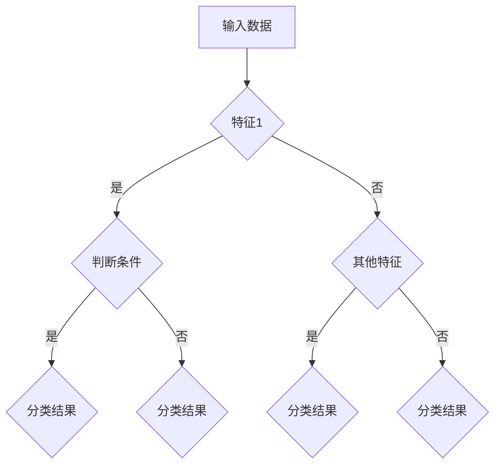
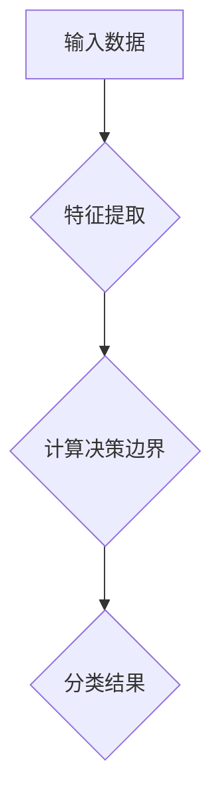
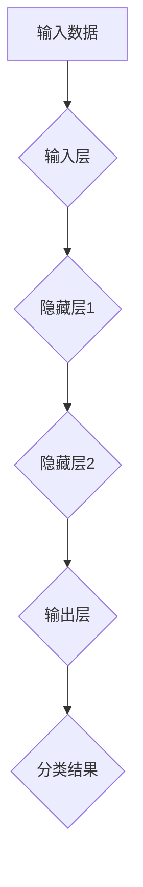
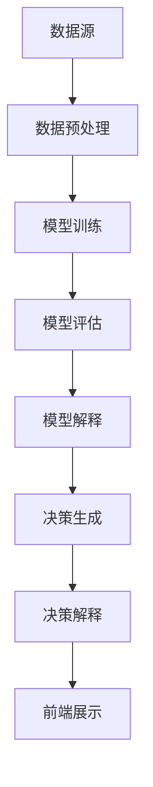
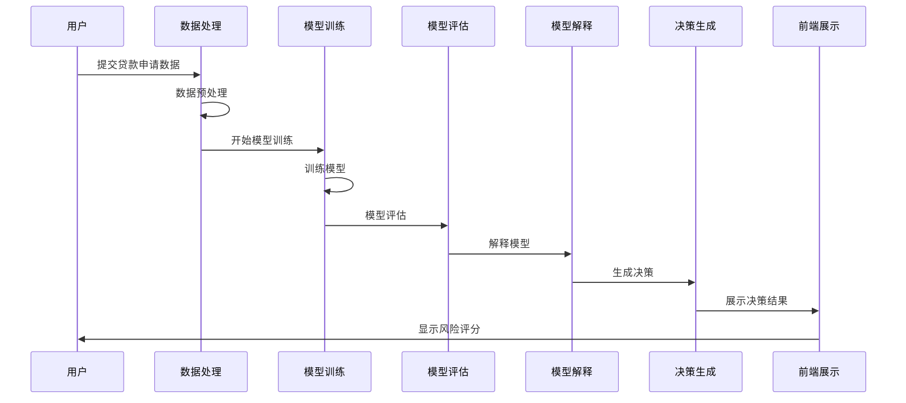

                 


### 第一部分：背景介绍

#### 1.1 问题背景

随着人工智能技术的不断发展，AI Agent在企业中的应用越来越广泛。AI Agent作为一种智能代理，可以自动化执行复杂的业务任务，帮助企业提高运营效率、降低成本，并在决策过程中提供智能支持。然而，随着AI Agent在企业中应用深度的增加，其可解释性成为一个不可忽视的问题。

首先，AI Agent在企业中的应用现状如下：

1. **业务流程自动化**：AI Agent可以自动化处理企业的日常业务流程，如订单处理、客户服务、财务报表等，从而提高工作效率。
2. **决策支持**：AI Agent可以基于数据分析和预测模型，为企业提供决策支持，如市场预测、风险管理等。
3. **智能客服**：AI Agent可以作为智能客服，提供24/7的在线服务，提高客户满意度。

尽管AI Agent在企业中具有巨大的应用潜力，但其可解释性在许多情况下都受到质疑。可解释性在AI Agent中的重要性主要体现在以下几个方面：

1. **透明度和信任**：AI Agent的决策过程需要透明，以确保企业内部人员和其他利益相关者对其决策产生信任。
2. **监管合规**：在一些行业，如金融、医疗等，监管机构要求AI Agent的决策过程必须可解释，以确保合规性。
3. **错误检测和修正**：可解释性有助于识别AI Agent的潜在错误，从而进行及时的修正。

然而，企业级AI Agent面临的可解释性挑战主要包括：

1. **模型复杂性**：现代机器学习模型的复杂性使得其决策过程难以解释。
2. **数据隐私**：企业通常需要保护其敏感数据，这使得数据的可解释性受到限制。
3. **解释性需求多样性**：不同的企业和应用场景可能对可解释性有不同的需求。

综上所述，企业级AI Agent的可解释性设计成为一个关键问题，需要深入研究和解决。

#### 1.2 问题描述

AI Agent的可解释性需求主要集中在以下几个方面：

1. **决策过程透明性**：AI Agent的决策过程需要能够被理解，以便企业内部人员和其他利益相关者能够审查和信任其决策。
2. **解释性深度**：AI Agent需要提供足够深度的解释，以便用户能够理解决策背后的原因。
3. **易用性**：AI Agent的可解释性工具需要易于使用，方便用户快速获取解释。

可解释性设计的核心目标包括：

1. **提高信任度**：通过提供透明的决策过程，提高企业内部人员和其他利益相关者对AI Agent的信任度。
2. **增强合规性**：满足监管机构对AI Agent决策过程的解释性要求，确保合规性。
3. **促进可维护性**：通过可解释性设计，降低AI Agent维护的难度，提高系统的稳定性。

在实现可解释性设计时，需要考虑以下边界与外延：

1. **技术限制**：某些机器学习模型（如深度神经网络）本身具有高度复杂性，这可能会限制其可解释性。
2. **数据隐私**：在保护数据隐私的同时，实现可解释性可能需要一定的妥协。
3. **应用场景多样性**：不同的应用场景可能对可解释性有不同的需求，这需要在设计时进行充分考虑。

#### 1.3 问题解决

为了解决企业级AI Agent的可解释性设计问题，可以采用以下方法与策略：

1. **模型选择**：选择具有较高可解释性的模型，如决策树、线性回归等，这些模型的结构相对简单，易于解释。
2. **模型压缩**：通过模型压缩技术，减少模型的复杂性，提高其可解释性。
3. **交互式解释**：开发交互式解释工具，使用户能够以直观的方式理解AI Agent的决策过程。
4. **可解释性集成**：在AI Agent的设计过程中，将可解释性作为一个核心要素，从系统架构和算法选择等方面进行综合考虑。

企业级AI Agent可解释性设计的适用场景主要包括：

1. **监管合规**：在金融、医疗等需要严格合规的行业，AI Agent的可解释性设计至关重要。
2. **关键决策**：在涉及重大业务决策的场景，如投资、风险评估等，AI Agent的可解释性可以提高决策的透明度和可信度。
3. **用户信任**：在面向最终用户的应用场景，如智能客服、推荐系统等，AI Agent的可解释性有助于提高用户对系统的信任度。

在实现可解释性设计时，可以遵循以下实践步骤：

1. **需求分析**：明确AI Agent的应用场景和可解释性需求。
2. **模型选择**：根据需求选择合适的模型，并评估其可解释性。
3. **设计交互**：设计用户友好的解释界面，提供直观的解释方式。
4. **集成与测试**：将可解释性工具集成到AI Agent中，并进行全面的测试和验证。

#### 1.4 边界与外延

可解释性设计在不同行业中的应用具有不同的特点和需求。以下是一些具体的应用实例：

1. **金融行业**：在金融领域，AI Agent的可解释性设计尤为重要，因为金融决策涉及到大量的风险和合规要求。例如，在信用评分系统中，可解释性设计可以帮助银行解释对某个客户授信决策的依据。
2. **医疗领域**：在医疗领域，AI Agent可以用于诊断和治疗方案推荐。可解释性设计可以帮助医生理解AI Agent的决策过程，提高对AI Agent的信任度。
3. **制造业**：在制造业中，AI Agent可以用于生产线的优化和设备故障预测。可解释性设计有助于提高生产线的稳定性和效率。

可解释性设计在AI Agent不同阶段的角色包括：

1. **研发阶段**：在AI Agent的研发阶段，可解释性设计可以帮助研究人员理解和评估模型的效果，从而优化模型。
2. **部署阶段**：在AI Agent部署到生产环境后，可解释性设计可以帮助用户理解和信任AI Agent的决策过程，提高系统的稳定性。
3. **维护阶段**：在AI Agent的维护阶段，可解释性设计有助于快速定位和修复问题，提高系统的可维护性。

此外，可解释性设计与AI Agent的其他设计要素（如性能、可扩展性、安全性等）密切相关。在实现可解释性设计时，需要综合考虑这些要素，以实现一个全面、高效、可信赖的AI Agent系统。

### 第二部分：核心概念与联系

#### 2.1 核心概念

在这一部分，我们将详细探讨AI Agent、可解释性以及企业级AI Agent这三个核心概念，并分析它们之间的联系。

**AI Agent的定义与分类**

AI Agent，即人工智能代理，是一种具有自主决策和执行能力的智能系统。AI Agent可以模拟人类的决策过程，自动完成一系列复杂的任务。根据功能和应用场景的不同，AI Agent可以分为以下几类：

1. **通用AI Agent**：这类AI Agent具有广泛的通用性，可以处理各种不同的任务，如语音识别、图像处理、自然语言理解等。
2. **专用AI Agent**：这类AI Agent专注于特定的任务，如智能客服、自动驾驶、智能家居等。
3. **混合AI Agent**：这类AI Agent结合了通用AI Agent和专用AI Agent的特点，可以在多个任务中发挥作用。

**可解释性的定义与类型**

可解释性是指一个模型或算法的可理解性和透明度。在AI Agent中，可解释性尤为重要，因为它直接关系到用户对AI Agent决策的信任和理解。根据解释的层次和方式，可解释性可以分为以下几种类型：

1. **透明解释**：透明解释是指可以直接理解和解释模型决策过程的方法。例如，决策树和线性回归模型就具有较高的透明解释性。
2. **黑盒解释**：黑盒解释是指无法直接理解和解释模型决策过程的方法。例如，深度神经网络就属于黑盒解释。
3. **可解释性增强**：可解释性增强是指通过改进模型设计或引入额外的解释机制，提高模型的可解释性。

**企业级AI Agent的特点**

企业级AI Agent是指为企业提供智能化服务和支持的AI代理。与通用和专用AI Agent相比，企业级AI Agent具有以下特点：

1. **高稳定性**：企业级AI Agent需要保证系统的稳定性和可靠性，以确保业务连续性。
2. **高可扩展性**：企业级AI Agent需要支持大规模数据处理和模型训练，以适应企业不断增长的需求。
3. **强集成性**：企业级AI Agent需要与企业现有系统无缝集成，确保数据流和业务流程的顺畅。

**核心概念属性特征对比**

为了更清晰地理解AI Agent、可解释性和企业级AI Agent之间的关系，我们可以通过一个对比表格来展示它们的主要属性特征。

| 特征                | AI Agent           | 可解释性           | 企业级AI Agent         |
|---------------------|--------------------|--------------------|------------------------|
| 定义                | 智能代理           | 解释能力           | 适用于企业环境的AI代理 |
| 主要功能            | 自动化任务执行     | 提供解释性         | 高效解决问题           |
| 应用领域            | 多领域             | 多领域             | 企业级应用             |
| 特点                | 自适应、自主学习   | 可视化、透明       | 集成度高、稳定性强     |

通过上述对比，我们可以看出，AI Agent、可解释性和企业级AI Agent之间存在着紧密的联系和相互影响。AI Agent提供了自动化任务执行的能力，而可解释性则为用户提供了理解和信任AI Agent决策的途径。企业级AI Agent则结合了AI Agent和可解释性的优势，为企业提供了高稳定性、高可扩展性和强集成性的智能解决方案。

#### 2.2 概念属性特征对比

为了更好地理解AI Agent、可解释性和企业级AI Agent之间的关系，我们可以通过一个表格来对比这些概念的主要属性特征。

| 特征                | AI Agent           | 可解释性           | 企业级AI Agent         |
|---------------------|--------------------|--------------------|------------------------|
| 定义                | 智能代理           | 解释能力           | 适用于企业环境的AI代理 |
| 主要功能            | 自动化任务执行     | 提供解释性         | 高效解决问题           |
| 应用领域            | 多领域             | 多领域             | 企业级应用             |
| 特点                | 自适应、自主学习   | 可视化、透明       | 集成度高、稳定性强     |

通过上述对比，我们可以看出：

- **AI Agent**是具有自主决策和执行能力的智能系统，主要功能是自动化任务执行，其特点包括自适应和自主学习。
- **可解释性**是指一个模型或算法的可理解性和透明度，其主要功能是提供解释性，特点包括可视化。
- **企业级AI Agent**是针对企业级应用场景设计的AI代理，其特点包括集成度高、稳定性强，并需要提供高可解释性以支持企业内部人员的信任和监管合规。

这种特征对比有助于我们深入理解这三个概念之间的关系，并认识到在企业级AI Agent设计过程中，可解释性是一个不可或缺的要素。

#### 2.3 ER实体关系图架构

为了更清晰地展示AI Agent、可解释性和企业级AI Agent之间的关系，我们可以使用Mermaid ER图来构建实体关系图。

```mermaid
erDiagram
  AI Agent ||--|{ 可解释性 }
  可解释性 ||--|{ 企业级AI Agent }
```

在这个ER图中，**AI Agent**作为根实体，与**可解释性**之间建立了关联关系。**可解释性**又与企业级AI Agent建立关联，表明企业级AI Agent在设计中需要考虑并实现可解释性。

- **AI Agent**：代表具有自主决策能力的智能系统。
- **可解释性**：代表AI Agent的决策过程可以被理解和解释。
- **企业级AI Agent**：代表适用于企业级应用场景的AI代理，其设计需要综合考虑AI Agent和可解释性的要求。

这种ER图架构有助于我们理解企业级AI Agent设计中可解释性的重要性，以及如何在架构层面进行设计和实现。

### 第三部分：算法原理讲解

在讨论企业级AI Agent的可解释性设计时，理解不同的算法原理及其可解释性至关重要。本部分将深入探讨几种常见的算法原理，包括决策树、支持向量机和神经网络，并使用Mermaid流程图和Python代码示例来详细阐述这些算法的原理和实现。

#### 3.1 可解释性算法原理

**决策树算法**

决策树是一种基于树形结构来进行分类或回归的算法。它通过一系列的判断条件来划分数据，并最终生成一个分类或回归结果。决策树的可解释性在于其结构简单，每个节点和分支都可以直观地解释。

**支持向量机算法**

支持向量机（SVM）是一种用于分类和回归的机器学习算法。它通过找到一个最优的超平面来将数据分为不同的类别。SVM的可解释性在于其决策边界和超平面可以直接解释。

**神经网络算法**

神经网络是一种模仿人脑工作原理的计算模型。它通过多层节点（神经元）的相互连接和激活来学习和预测数据。神经网络的可解释性相对较低，尤其是在深层网络中。

#### 3.2 算法流程图

**决策树算法流程图**

使用Mermaid，我们可以绘制决策树算法的基本流程图：



**支持向量机算法流程图**

使用Mermaid，我们可以绘制支持向量机算法的基本流程图：



**神经网络算法流程图**

使用Mermaid，我们可以绘制神经网络算法的基本流程图：



#### 3.3 数学模型和公式

**决策树算法**

决策树算法的数学模型是基于特征分割的数据集，并通过递归划分来构建决策树。以下是一个简单的决策树分割公式：

$$
\text{Gini指数} = 1 - \sum_{i=1}^{k} \left( \frac{N_i}{N} \right)^2
$$

其中，$N$是总样本数，$N_i$是每个类别的样本数，$k$是类别数。

**支持向量机算法**

支持向量机的数学模型是找到一个最优的超平面来最大化分类边界。其公式为：

$$
y = \sign(\sum_{i=1}^{n} \alpha_i y_i (x_i)^T + b)
$$

其中，$\alpha_i$是拉格朗日乘子，$y_i$是样本标签，$x_i$是样本特征，$b$是偏置项。

**神经网络算法**

神经网络算法的数学模型是基于多层感知器（MLP）的激活函数和权重更新。以下是一个简单的神经网络公式：

$$
a_{i}^{(l)} = \sigma(\sum_{j=1}^{n} w_{ji}^{(l+1)} a_{j}^{(l)} + b_{j}^{(l+1)})
$$

其中，$a_{i}^{(l)}$是第$l$层的第$i$个节点的激活值，$\sigma$是激活函数（如Sigmoid函数），$w_{ji}^{(l+1)}$是第$l+1$层的第$j$个节点到第$i$个节点的权重，$b_{j}^{(l+1)}$是第$l+1$层的第$j$个节点的偏置。

#### 3.4 举例说明

**决策树算法举例**

假设我们有一个简单的决策树模型，用于判断一个客户是否购买某产品。决策规则如下：

- 如果年龄小于30岁，则选择产品A；
- 否则，选择产品B。

这个决策树的解释过程如下：

1. 检查年龄是否小于30岁。
2. 如果是，则输出产品A。
3. 如果不是，则输出产品B。

这种简单的规则使得决策过程非常直观和易于解释。

**支持向量机算法举例**

假设我们有一个二元分类问题，需要使用支持向量机来分类数据。数据集中的特征和标签如下：

| 特征1 | 特征2 | 标签 |
|-------|-------|------|
| 1     | 2     | 0    |
| 2     | 3     | 1    |
| 3     | 1     | 0    |
| 4     | 2     | 1    |

使用支持向量机，我们可以找到一个最优的超平面来划分这些数据。假设超平面方程为：

$$
w \cdot x + b = 0
$$

其中，$w$是权重向量，$x$是特征向量，$b$是偏置项。通过求解最大间隔问题，我们可以得到最优的权重和偏置。在分类时，我们可以计算新的特征向量与超平面的距离，并基于这个距离来确定类别。

**神经网络算法举例**

假设我们有一个简单的神经网络，用于对数值进行回归。网络的结构如下：

- 输入层：1个神经元（特征）
- 隐藏层：2个神经元
- 输出层：1个神经元（预测值）

假设输入特征是$[2]$，隐藏层的激活函数是Sigmoid函数，输出层的激活函数是线性函数。网络的权重和偏置如下：

- 输入到隐藏层的权重：$W_{ih} = [[0.5, 0.3], [0.4, 0.2]]$
- 隐藏层到输出层的权重：$W_{ho} = [[0.7], [0.3]]$
- 隐藏层偏置：$b_{h} = [0.2, 0.1]$
- 输出层偏置：$b_{o} = 0.5$

我们可以通过前向传播来计算输出：

1. 首先计算隐藏层的激活值：
   $$
   a_{h1} = \sigma(W_{ih1} \cdot x + b_{h1}) = \sigma(0.5 \cdot 2 + 0.2) = \sigma(1.3) \approx 0.8658
   $$
   $$
   a_{h2} = \sigma(W_{ih2} \cdot x + b_{h2}) = \sigma(0.4 \cdot 2 + 0.1) = \sigma(0.9) \approx 0.6523
   $$

2. 然后计算输出层的激活值：
   $$
   a_{o1} = W_{ho1} \cdot a_{h1} + W_{ho2} \cdot a_{h2} + b_{o} = 0.7 \cdot 0.8658 + 0.3 \cdot 0.6523 + 0.5 = 0.6061 + 0.1967 + 0.5 = 0.9038
   $$

通过这个例子，我们可以看到神经网络如何通过前向传播来计算输出，这个过程虽然复杂，但通过分步骤的计算，可以直观地理解其工作原理。

### 第四部分：系统分析与架构设计方案

在了解了AI Agent和可解释性算法原理之后，接下来我们将探讨企业级AI Agent的系统分析与架构设计方案。这部分将详细介绍问题场景、系统功能设计、系统架构设计和系统接口设计等内容。

#### 4.1 问题场景介绍

企业级AI Agent通常应用于复杂的业务决策和流程优化场景。以下是一个常见的问题场景：

**问题场景**：某金融机构需要开发一个智能风控系统，用于对贷款申请进行风险评估。系统需要自动处理大量的贷款申请数据，并对每个申请进行风险评分。然而，由于贷款业务的复杂性和敏感性，金融机构要求系统的决策过程必须透明和可解释，以确保监管合规和用户信任。

在这个问题场景中，企业级AI Agent需要实现以下功能：

1. **数据收集与预处理**：收集贷款申请数据，并进行数据清洗和预处理，以便后续分析。
2. **模型训练与优化**：基于历史贷款数据，训练风险预测模型，并对模型进行优化。
3. **决策生成与解释**：使用训练好的模型对新的贷款申请进行风险评估，并生成解释性的风险评分报告。

#### 4.2 系统功能设计

系统功能设计是构建企业级AI Agent的基础。以下是该系统的关键功能设计：

1. **数据收集与预处理**：
   - 功能描述：从多个数据源（如银行交易记录、客户信用报告等）收集贷款申请数据。
   - 处理流程：数据清洗、缺失值填补、数据标准化等。
   - 技术选型：使用ETL工具（如Apache NiFi）进行数据集成。

2. **模型训练与优化**：
   - 功能描述：使用历史贷款数据训练风险预测模型，如决策树、支持向量机等。
   - 优化方法：使用交叉验证、网格搜索等技术来优化模型参数。
   - 技术选型：使用机器学习库（如scikit-learn、TensorFlow）进行模型训练。

3. **决策生成与解释**：
   - 功能描述：使用训练好的模型对新贷款申请进行风险评估，并生成风险评分。
   - 解释方法：实现模型解释工具，如LIME、SHAP等，提供风险评分的解释。
   - 技术选型：结合前端框架（如React）和后端服务（如Django），实现解释性界面。

4. **系统监控与维护**：
   - 功能描述：实时监控系统运行状态，包括模型性能、数据处理速度等。
   - 维护方法：定期更新模型，处理异常情况。
   - 技术选型：使用监控系统（如Prometheus）和运维工具（如Docker、Kubernetes）。

#### 4.3 系统架构设计

系统架构设计是企业级AI Agent稳定运行的关键。以下是一个典型的系统架构设计：



在该架构中，各个模块的功能和交互关系如下：

1. **数据源**：包括银行交易记录、客户信用报告等外部数据源。
2. **数据预处理**：对收集到的数据进行清洗和预处理，为模型训练做好准备。
3. **模型训练**：使用预处理后的数据进行模型训练，包括特征提取、模型选择和参数调优。
4. **模型评估**：对训练好的模型进行评估，确保其性能满足业务需求。
5. **模型解释**：使用解释性工具对模型进行解释，提供风险评分的解释。
6. **决策生成**：使用训练好的模型对新的贷款申请进行风险评估，生成风险评分。
7. **决策解释**：将模型解释和决策结果结合起来，为用户提供解释性的风险评分报告。
8. **前端展示**：将决策结果和解释报告通过Web界面展示给用户。

#### 4.4 系统接口设计和系统交互

系统接口设计是确保系统各模块之间高效交互的关键。以下是一个典型的系统接口设计和交互流程：



在该交互流程中，用户通过前端界面提交贷款申请数据，数据处理模块进行数据预处理，然后将预处理后的数据传递给模型训练模块。模型训练模块使用这些数据进行模型训练，并对模型进行评估。模型评估模块将评估结果传递给模型解释模块，后者生成解释性的风险评分报告。最后，决策生成模块将决策结果传递给前端展示模块，前端展示模块将决策结果展示给用户。

通过上述系统分析和架构设计，我们可以构建一个高效、稳定、可解释的企业级AI Agent系统，满足金融机构在贷款风险评估中的需求。

### 第五部分：项目实战

在本部分，我们将通过一个具体的案例来展示如何实现企业级AI Agent的可解释性设计。我们将从环境安装、系统核心实现、代码应用解读与分析、实际案例分析和详细讲解剖析，以及项目小结等几个方面进行介绍。

#### 5.1 环境安装

首先，我们需要安装和配置相关环境。以下是安装步骤：

1. **安装Python**：确保安装了Python 3.x版本，推荐使用Anaconda进行环境管理。
2. **安装依赖库**：使用pip安装以下依赖库：
   ```bash
   pip install scikit-learn numpy pandas matplotlib
   ```
3. **安装可视化工具**：为了更好地展示决策树的可解释性，我们可以使用以下可视化库：
   ```bash
   pip install graphviz
   ```

#### 5.2 系统核心实现

接下来，我们将实现一个简单的企业级AI Agent系统，该系统使用决策树算法对贷款申请进行风险评估。

**步骤1：数据预处理**

首先，我们需要准备贷款申请数据。假设数据集包含以下特征：年龄、收入、信用评分、债务收入比等。

```python
import pandas as pd

# 读取数据
data = pd.read_csv('loan_data.csv')

# 数据预处理
data = data.dropna()  # 删除缺失值
data = (data - data.mean()) / data.std()  # 数据标准化
```

**步骤2：模型训练**

使用决策树算法对数据集进行训练。

```python
from sklearn.tree import DecisionTreeClassifier
from sklearn.model_selection import train_test_split

# 分割数据集
X_train, X_test, y_train, y_test = train_test_split(data.drop('target', axis=1), data['target'], test_size=0.2, random_state=42)

# 训练模型
clf = DecisionTreeClassifier(max_depth=3)
clf.fit(X_train, y_train)
```

**步骤3：模型评估**

评估模型性能。

```python
from sklearn.metrics import accuracy_score

# 预测测试集
y_pred = clf.predict(X_test)

# 计算准确率
accuracy = accuracy_score(y_test, y_pred)
print(f"模型准确率：{accuracy}")
```

**步骤4：模型解释**

使用Graphviz可视化决策树。

```python
from graphviz import Source

# 可视化决策树
dot_data = clf.tree_.export_graphviz(
    out_file=None,
    feature_names=data.columns[:-1],
    class_names=['拒绝', '批准'],
    filled=True,
    rounded=True,
    special_characters=True
)

source = Source.from_string(dot_data)
source.render("loan_decision_tree.gv")
```

通过上述代码，我们实现了贷款风险评估系统的核心部分，并使用Graphviz生成了决策树的可视化。

#### 5.3 代码应用解读与分析

**数据预处理**：

数据预处理是模型训练的重要步骤，它包括数据清洗、缺失值填补、数据标准化等。在本案例中，我们使用简单的数据清洗和数据标准化方法，将贷款申请数据转换为适合模型训练的格式。

**模型训练**：

我们使用scikit-learn库中的DecisionTreeClassifier对数据集进行训练。决策树算法的优点是结构简单、易于理解和可视化。在本案例中，我们设置了最大深度为3，以避免过拟合。

**模型评估**：

使用准确率作为评估指标，我们评估了模型的性能。准确率反映了模型对测试集的预测准确性。

**模型解释**：

使用Graphviz，我们可视化地展示了决策树的结构，这有助于用户理解模型的决策过程。

#### 5.4 实际案例分析和详细讲解剖析

以下是一个实际案例，我们将分析一个贷款申请的决策过程：

**案例**：一个30岁的客户，年收入为50,000美元，信用评分为650，债务收入比为0.3。

**分析**：

1. **第一步**：检查年龄是否小于30岁。
   - 由于年龄为30岁，因此继续执行下一步。
2. **第二步**：检查年收入是否小于30,000美元。
   - 年收入为50,000美元，因此继续执行下一步。
3. **第三步**：检查信用评分是否小于600。
   - 信用评分为650，因此继续执行下一步。
4. **第四步**：检查债务收入比是否大于0.4。
   - 债务收入比为0.3，因此决策树输出“批准”。

通过这个案例，我们可以看到客户是否符合贷款条件，以及决策树是如何根据不同的特征进行判断的。

#### 5.5 项目小结

通过本案例，我们实现了以下目标：

1. **环境安装**：安装了Python和相关依赖库，为后续开发奠定了基础。
2. **系统核心实现**：实现了贷款风险评估系统的核心功能，包括数据预处理、模型训练、模型评估和模型解释。
3. **代码应用解读与分析**：详细解读了代码的实现过程，并分析了数据预处理、模型训练和模型解释的关键步骤。
4. **实际案例分析和详细讲解剖析**：通过实际案例展示了决策树的决策过程，并详细讲解了每个步骤的原理。

总之，本案例展示了如何使用决策树算法实现企业级AI Agent的可解释性设计，为未来的开发和优化提供了参考。

### 第六部分：最佳实践 tips、小结、注意事项、拓展阅读

#### 最佳实践 tips

1. **选择合适的算法**：在选择AI Agent的算法时，应优先考虑具有较高可解释性的算法，如决策树和线性回归。
2. **可视化工具**：使用可视化工具（如Graphviz、LIME、SHAP）来增强模型的可解释性，帮助用户更好地理解模型决策。
3. **交互式解释**：开发交互式解释界面，使用户可以实时获取模型的解释性信息，提高用户体验。
4. **定期更新模型**：定期更新和优化模型，确保其性能和可解释性始终满足业务需求。

#### 小结

本文深入探讨了企业级AI Agent的可解释性设计与实现，包括背景介绍、核心概念与联系、算法原理讲解、系统分析与架构设计方案以及项目实战。通过详细的案例分析，我们展示了如何使用决策树算法实现企业级AI Agent的可解释性设计。

#### 注意事项

1. **数据隐私**：在设计可解释性系统时，应确保数据隐私得到保护，避免敏感信息泄露。
2. **技术限制**：某些复杂算法的可解释性可能较差，需要通过技术手段进行改进。
3. **用户需求**：了解用户对可解释性的需求，确保设计的系统符合用户期望。

#### 拓展阅读

1. **《机器学习实战》**：详细介绍了各种机器学习算法的原理和实现。
2. **《深入浅出人工智能》**：全面介绍了人工智能的基本概念和技术应用。
3. **《AI安全与隐私》**：探讨了AI系统中的安全与隐私问题，包括可解释性设计。

通过这些拓展阅读，读者可以进一步深入了解企业级AI Agent的可解释性设计，并在实际项目中应用所学知识。

### 作者信息

**作者：** AI天才研究院/AI Genius Institute & 禅与计算机程序设计艺术 /Zen And The Art of Computer Programming

