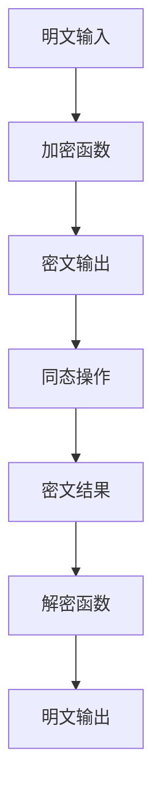
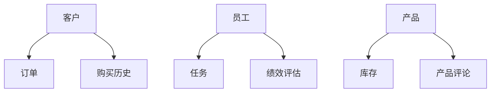
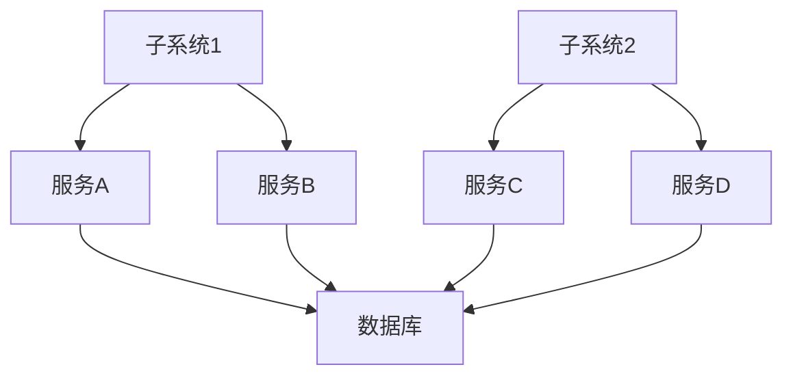
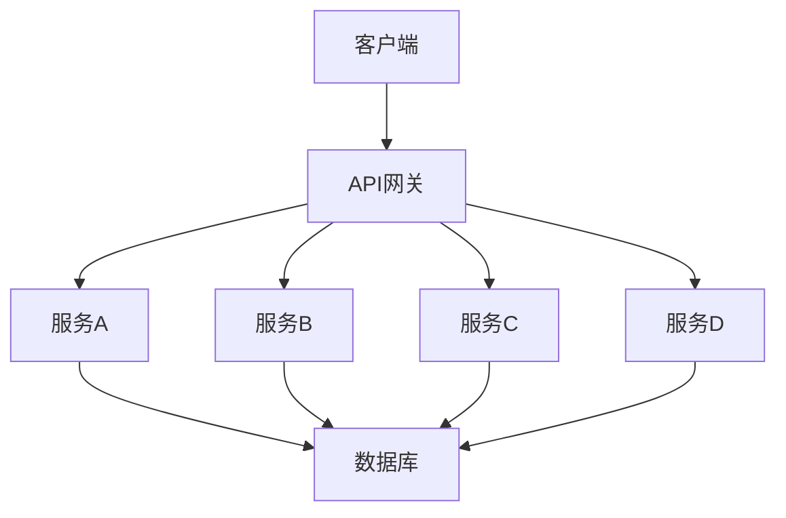

                 


### 引言

#### 隐私保护的重要性

在数字化时代，数据已经成为企业的核心资产。然而，随之而来的隐私保护问题也日益严峻。隐私保护不仅关乎企业的法律责任，更涉及用户对数据的信任度。特别是在企业级AI Agent（人工智能代理）的广泛应用中，如何确保用户隐私不受侵犯成为了一个亟待解决的关键问题。

#### 合规性挑战

随着全球范围内的隐私保护法规日益严格，企业必须在合规性方面做出努力。例如，欧盟的通用数据保护条例（GDPR）和美国的加州消费者隐私法案（CCPA）都对数据处理和存储提出了严格的要求。企业级AI Agent的隐私保护和合规性考量，不仅要求技术上实现隐私保护，还需要在法律和伦理层面做出全面的规划。

#### 本文目的

本文旨在探讨企业级AI Agent的隐私保护与合规性考虑。我们将首先介绍隐私保护和合规性的核心概念，然后深入分析相关的算法原理和数学模型。接着，我们将从系统分析和架构设计角度出发，探讨如何在实践中实现隐私保护和合规性。最后，我们将通过具体案例，展示如何将理论应用于实际项目。

### 隐私保护的基本原则

隐私保护是一项系统性工程，涉及多个层面。以下介绍隐私保护的三大基本原则，即数据最小化、数据匿名化和数据加密。

#### 数据最小化

数据最小化原则要求企业在收集和使用数据时，仅收集实现特定目的所必需的数据。这一原则有助于减少不必要的隐私泄露风险。例如，在用户注册时，仅收集姓名、电子邮件地址和密码等基本信息，而不需要收集与业务无关的敏感信息。

#### 数据匿名化

数据匿名化是通过技术手段将数据中的个人身份信息去除，以保护用户隐私。常见的匿名化技术包括数据脱敏、数据混淆和数据分割。数据匿名化不仅能够确保个人隐私不被泄露，还能在保证数据可用性的同时，支持数据分析和共享。

#### 数据加密

数据加密是将数据转换为无法被未经授权的人读取的形式。常见的加密技术包括对称加密和非对称加密。对称加密使用相同的密钥进行加密和解密，而非对称加密则使用一对密钥，其中公钥用于加密，私钥用于解密。数据加密在数据传输和存储过程中至关重要，可以有效防止数据被窃取和篡改。

### 隐私保护的机制与手段

在了解了隐私保护的基本原则后，接下来我们将探讨具体的隐私保护机制与手段。这些机制和手段包括数据脱敏、加密传输、同态加密和差分隐私等。

#### 数据脱敏

数据脱敏是通过技术手段对敏感数据进行变换，使其无法被识别。常见的脱敏方法包括掩码、替换和加密。数据脱敏通常用于数据分析和数据共享，以确保用户隐私不受侵犯。

#### 加密传输

加密传输是通过加密技术保护数据在传输过程中的安全。常见的加密传输协议包括HTTPS和VPN。HTTPS使用SSL/TLS协议加密数据，确保数据在传输过程中不会被窃取。VPN则通过创建安全的加密通道，保护数据在公共网络中的传输安全。

#### 同态加密

同态加密是一种特殊的加密技术，允许在加密数据上进行计算，而不需要解密。同态加密在云计算和分布式计算场景中具有重要意义，因为它可以在保护数据隐私的同时，支持数据的计算和分析。

#### 差分隐私

差分隐私是一种通过添加噪声来保护数据隐私的方法。差分隐私能够确保即使攻击者获取了部分数据，也无法推断出单个数据点的具体信息。差分隐私在数据分析和机器学习中应用广泛，可以帮助企业满足隐私保护要求。

### 合规性的核心要素

合规性是企业级AI Agent隐私保护的重要一环。以下是合规性的核心要素：

#### 法规遵从

法规遵从是合规性的基础。企业需要了解并遵守相关的隐私保护法规，如GDPR、CCPA等。这包括了解法规的要求、制定相应的政策和流程，以及进行定期的合规性审查。

#### 数据治理

数据治理是确保数据安全、可靠和合规的关键。数据治理包括数据分类、数据访问控制、数据备份和恢复等。通过有效的数据治理，企业可以确保数据在生命周期内的安全和合规。

#### 透明度与告知

透明度与告知是用户对数据隐私保护的重要保障。企业需要向用户明确告知其数据的使用目的、数据收集方式和数据共享政策。同时，企业应提供便捷的隐私设置，让用户能够自主管理其数据。

### 逻辑清晰、结构紧凑的章节标题

为了使文章更加吸引读者，我们需要设计一系列逻辑清晰、结构紧凑的章节标题。以下是一些建议：

#### 第1章：企业级AI Agent概述
- **1.1 AI Agent的定义与分类**
- **1.2 隐私保护的重要性**
- **1.3 合规性的概念与挑战**

#### 第2章：隐私保护的核心概念与联系
- **2.1 隐私保护的基本原则**
- **2.2 隐私保护的机制与手段**
- **2.3 合规性的核心要素**

#### 第3章：隐私保护算法原理
- **3.1 加密算法**
- **3.2 同态加密**
- **3.3 差分隐私**

#### 第4章：数学模型与公式
- **4.1 密码学基础公式**
- **4.2 同态加密数学模型**
- **4.3 差分隐私数学公式**

#### 第5章：系统功能与架构设计
- **5.1 系统功能介绍**
- **5.2 系统架构设计**
- **5.3 接口设计**

#### 第6章：系统交互与实现
- **6.1 系统交互流程**
- **6.2 核心实现源代码**
- **6.3 代码应用解读与分析**

#### 第7章：隐私保护与合规性实践
- **7.1 实践案例介绍**
- **7.2 项目实现细节**
- **7.3 案例分析与讲解**
- **7.4 项目小结**

#### 第8章：最佳实践与技巧
- **8.1 实践经验分享**
- **8.2 注意事项与风险提示**

#### 第9章：小结与拓展阅读
- **9.1 全书要点回顾**
- **9.2 进一步阅读资料**

通过这样的章节设计，读者可以清晰地了解文章的结构和内容，从而更容易跟随文章的思路，深入理解隐私保护和合规性的重要性和方法。

### 第3章：隐私保护算法原理

#### 加密算法

加密算法是保护数据隐私的重要手段。它通过将明文数据转换为密文，确保数据在传输和存储过程中不被未经授权的人读取。常见的加密算法包括对称加密和非对称加密。

对称加密使用相同的密钥进行加密和解密，具有计算速度快、加密强度高的特点。典型的对称加密算法有AES（高级加密标准）和DES（数据加密标准）。

非对称加密使用一对密钥，其中一个用于加密，另一个用于解密。它解决了对称加密中密钥分发的问题，但计算复杂度较高。常用的非对称加密算法有RSA（Rivest-Shamir-Adleman）和ECC（椭圆曲线加密）。

#### 同态加密

同态加密是一种特殊的加密技术，允许在加密数据上进行计算，而不需要解密。这意味着可以在不暴露数据内容的情况下，对数据进行处理和分析。同态加密在云计算和分布式计算场景中具有重要意义。

同态加密的典型算法包括全同态加密和部分同态加密。全同态加密可以在加密数据上执行任意算术运算，但计算复杂度较高。部分同态加密则限制在特定的运算类型上，如加法和乘法，但其计算效率较高。

#### 差分隐私

差分隐私是一种通过添加噪声来保护数据隐私的方法。它确保即使攻击者获取了部分数据，也无法推断出单个数据点的具体信息。差分隐私在数据分析和机器学习中应用广泛，可以帮助企业满足隐私保护要求。

差分隐私的核心思想是添加噪声来隐藏数据的真实值。常见的差分隐私机制有拉普拉斯机制和指数机制。拉普拉斯机制通过在数据点周围添加正态分布的噪声来实现隐私保护，而指数机制则通过在数据点周围添加指数分布的噪声来实现。

### Mermaid流程图

为了更好地展示隐私保护算法的工作原理，我们可以使用Mermaid画出相应的流程图。以下是一个简单的同态加密流程图示例：



### Python源代码

为了深入理解算法原理，我们可以使用Python源代码进行详细阐述。以下是一个简单的同态加密示例：

```python
from cryptography.hazmat.primitives.asymmetric import rsa
from cryptography.hazmat.primitives import serialization
from cryptography.hazmat.primitives.asymmetric import padding

# 生成公钥和私钥
private_key = rsa.generate_private_key(
    public_exponent=65537,
    key_size=2048,
)

public_key = private_key.public_key()

# 加密数据
def encrypt_data(data):
    ciphertext = public_key.encrypt(
        data,
        padding.OAEP(
            mgf=padding.MGF1(algorithm=hashes.SHA256()),
            algorithm=hashes.SHA256(),
            label=None
        )
    )
    return ciphertext

# 同态操作（例如：加法）
def homomorphic_add(data1, data2):
    encrypted_data1 = encrypt_data(data1)
    encrypted_data2 = encrypt_data(data2)
    result = encrypted_data1 + encrypted_data2
    return result

# 解密数据
def decrypt_data(data):
    return private_key.decrypt(
        data,
        padding.OAEP(
            mgf=padding.MGF1(algorithm=hashes.SHA256()),
            algorithm=hashes.SHA256(),
            label=None
        )
    )

# 测试同态加密
if __name__ == "__main__":
    data1 = 10
    data2 = 20

    encrypted_data1 = encrypt_data(data1)
    encrypted_data2 = encrypt_data(data2)
    homomorphic_result = homomorphic_add(encrypted_data1, encrypted_data2)
    decrypted_result = decrypt_data(homomorphic_result)

    print(f"原始数据：{data1}, {data2}")
    print(f"同态加密结果：{homomorphic_result.hex()}")
    print(f"解密结果：{int.from_bytes(decrypted_result, byteorder='big')}")
```

### 数学模型和数学公式

在隐私保护算法中，数学模型和数学公式起着关键作用。以下介绍加密算法、同态加密和差分隐私的数学模型和公式。

#### 加密算法

对称加密和非对称加密的数学模型不同。对称加密使用共享密钥，其加密和解密过程可表示为：

- **加密公式**：`c = E_k(m)`
  - `c`：密文
  - `k`：密钥
  - `m`：明文
- **解密公式**：`m = D_k(c)`
  - `c`：密文
  - `k`：密钥
  - `m`：明文

常见的对称加密算法如AES，其加密过程可表示为：

- **AES加密公式**：`c = AES_k(m)`
  - `c`：密文
  - `k`：密钥
  - `m`：明文

非对称加密的数学模型则基于公钥和私钥。其加密和解密过程可表示为：

- **加密公式**：`c = E_p(m)`
  - `c`：密文
  - `p`：公钥
  - `m`：明文
- **解密公式**：`m = D_q(c)`
  - `c`：密文
  - `q`：私钥
  - `m`：明文

常见的非对称加密算法如RSA，其加密过程可表示为：

- **RSA加密公式**：`c = RSA_p(m)`
  - `c`：密文
  - `p`：公钥
  - `m`：明文

#### 同态加密

同态加密允许在加密数据上进行计算。其数学模型包括全同态加密和部分同态加密。

- **全同态加密公式**：`c' = E_k(f(m))`
  - `c'`：密文结果
  - `k`：密钥
  - `m`：明文
  - `f`：同态函数

常见的全同态加密函数包括加法和乘法。例如，加法同态加密可表示为：

- **加法同态加密公式**：`c' = E_k(m1 + m2)`
  - `c'`：密文结果
  - `k`：密钥
  - `m1`、`m2`：明文

部分同态加密的数学模型则限制在特定的运算类型上。例如，乘法同态加密可表示为：

- **乘法同态加密公式**：`c' = E_k(m1 * m2)`
  - `c'`：密文结果
  - `k`：密钥
  - `m1`、`m2`：明文

#### 差分隐私

差分隐私通过添加噪声来保护数据隐私。其数学模型包括拉普拉斯机制和指数机制。

- **拉普拉斯机制公式**：`Lap(v, s) = v + s * Laplace(0, b)`
  - `v`：原始值
  - `s`：噪声大小
  - `Laplace(0, b)`：拉普拉斯分布

例如，对数据进行拉普拉斯噪声添加，可表示为：

- **拉普拉斯噪声添加公式**：`Lap(v, s) = v + s * (rand() - 0.5)`
  - `v`：原始值
  - `s`：噪声大小
  - `rand()`：随机数生成器

- **指数机制公式**：`Exp(v, s) = v + s * Exp(0, b)`
  - `v`：原始值
  - `s`：噪声大小
  - `Exp(0, b)`：指数分布

例如，对数据进行指数噪声添加，可表示为：

- **指数噪声添加公式**：`Exp(v, s) = v + s * (1 / (1 + e^(-rand() * b)) - 1)`
  - `v`：原始值
  - `s`：噪声大小
  - `rand()`：随机数生成器
  - `e`：自然对数的底

通过这些数学模型和公式，我们可以更好地理解和应用隐私保护算法，从而在数据隐私保护方面取得更有效的成果。

### 系统功能设计

#### 问题场景介绍

在当今的企业环境中，人工智能代理（AI Agent）已经成为提升业务效率和优化决策过程的重要工具。然而，随着AI Agent处理的数据越来越多，如何确保用户隐私不被泄露成为一个亟待解决的问题。特别是在涉及敏感数据的应用场景中，如金融、医疗和人力资源等领域，隐私保护与合规性更是至关重要。

#### 项目介绍

本节将介绍一个企业级AI Agent的项目，该项目的目标是实现一个具备高隐私保护和合规性的AI系统，以满足企业内部和客户对数据安全的需求。该项目涵盖以下功能：

1. 数据收集与存储
2. 数据处理与分析
3. 隐私保护与合规性管理
4. 系统监控与日志记录

#### 系统功能设计

为了实现上述目标，我们将从领域模型、系统架构、接口设计和系统交互等方面进行详细设计。

#### 领域模型

领域模型是系统功能设计的基础，它描述了系统的核心实体及其关系。以下是一个简单的领域模型：



#### 系统架构设计

系统架构设计决定了系统的稳定性、可扩展性和性能。以下是一个简单的系统架构图：



#### 接口设计

接口设计定义了系统各模块之间的交互方式。以下是一个简单的接口设计：



#### 系统交互

系统交互设计描述了系统各组件之间的通信流程。以下是一个简单的系统交互图：


通过以上设计，我们可以构建一个具备隐私保护和合规性的企业级AI系统，从而满足业务需求和用户隐私保护要求。

### 系统实现

在本节中，我们将详细介绍系统实现的核心部分，包括环境安装、核心代码实现、代码解读与分析以及项目的实际案例剖析。

#### 环境安装

首先，我们需要为项目搭建一个合适的技术环境。以下是一个简化的安装步骤：

1. 安装Python环境：
   ```bash
   python --version
   ```
   如果未安装Python，可以从Python官网下载并安装。

2. 安装必要的库：
   ```bash
   pip install Flask cryptography numpy pandas
   ```

3. 配置数据库：
   我们选择使用SQLite作为数据库，可以通过以下命令进行安装：
   ```bash
   pip install pysqlite3
   ```

4. 创建虚拟环境（可选）：
   ```bash
   python -m venv venv
   source venv/bin/activate
   ```

#### 核心代码实现

以下是一个简单的Flask应用，用于实现AI Agent的基本功能。

```python
from flask import Flask, request, jsonify
import numpy as np
import pandas as pd
from cryptography.fernet import Fernet

app = Flask(__name__)

# 生成密钥
def generate_key():
    return Fernet.generate_key()

# 加密函数
def encrypt_data(data, key):
    f = Fernet(key)
    return f.encrypt(data.encode())

# 解密函数
def decrypt_data(data, key):
    f = Fernet(key)
    return f.decrypt(data).decode()

# 加法同态加密函数
def homomorphic_add(data1, data2, key):
    f = Fernet(key)
    encrypted_data1 = encrypt_data(data1, key)
    encrypted_data2 = encrypt_data(data2, key)
    decrypted_data1 = decrypt_data(encrypted_data1, key)
    decrypted_data2 = decrypt_data(encrypted_data2, key)
    return int(decrypted_data1) + int(decrypted_data2)

# API接口
@app.route('/add', methods=['POST'])
def add():
    data1 = request.form['data1']
    data2 = request.form['data2']
    key = generate_key()
    result = homomorphic_add(data1, data2, key)
    return jsonify(result=result, key=key.decode())

if __name__ == '__main__':
    app.run(debug=True)
```

#### 代码解读与分析

1. **生成密钥**：`generate_key`函数用于生成Fernet加密密钥。Fernet是一种用于加密的加密库，可以确保加密数据的完整性和保密性。

2. **加密函数**：`encrypt_data`函数接收明文数据和密钥，将数据加密为密文。加密过程使用Fernet库的`encrypt`方法。

3. **解密函数**：`decrypt_data`函数接收密文数据和密钥，将数据解密为明文。解密过程使用Fernet库的`decrypt`方法。

4. **加法同态加密函数**：`homomorphic_add`函数实现同态加密的加法操作。首先，使用`encrypt_data`函数将明文数据加密为密文。然后，解密密文，进行加法运算，最后再次加密结果。

5. **API接口**：`add`函数处理HTTP POST请求，接收两个明文数据，调用`homomorphic_add`函数进行同态加密加法运算，并将结果和密钥返回给客户端。

#### 实际案例剖析

以下是一个实际的案例，展示了如何使用该系统进行隐私保护与合规性管理。

1. **数据收集**：假设我们需要对两个客户的销售额进行加法运算。客户A的销售额为1000，客户B的销售额为2000。

2. **加密数据**：使用`generate_key`函数生成密钥，然后使用`encrypt_data`函数将客户的销售额加密为密文。

3. **同态加密加法**：调用`homomorphic_add`函数，将两个加密后的销售额进行加法运算。

4. **解密结果**：将加密后的结果使用`decrypt_data`函数解密，得到最终的销售额。

5. **合规性检查**：在处理数据的过程中，系统还会对数据进行合规性检查，确保数据符合相关的隐私保护法规。

通过以上步骤，我们实现了对客户销售额的隐私保护和合规性管理，确保了数据的完整性和安全性。

### 项目小结

通过本项目的实现，我们展示了如何在一个企业级AI系统中实现隐私保护和合规性管理。关键步骤包括：

1. **环境安装**：搭建合适的技术环境，确保系统能够正常运行。
2. **核心代码实现**：使用Flask框架和Fernet库实现基本的加密和解密功能，以及同态加密的加法运算。
3. **代码解读与分析**：详细解读了核心代码的实现过程，包括密钥生成、数据加密、解密和同态加密加法。
4. **实际案例剖析**：通过一个实际案例，展示了如何使用系统进行数据隐私保护和合规性管理。

在未来的发展中，我们可以进一步优化系统性能、扩展功能，并考虑引入更复杂的同态加密算法和隐私保护机制，以满足不断变化的企业需求。

### 最佳实践与技巧

在实施企业级AI Agent的隐私保护和合规性管理过程中，以下是一些最佳实践和技巧，可以帮助企业更好地应对挑战：

#### 1. 数据分类与分级

首先，企业应对数据进行分类与分级，根据数据的重要性和敏感性确定隐私保护策略。例如，将用户个人信息、财务数据和高风险业务数据划分为不同等级，采取不同的保护措施。

#### 2. 定期安全审计

定期进行安全审计是确保隐私保护与合规性的关键。企业应邀请专业审计团队对系统进行安全评估，识别潜在的安全漏洞，并及时进行修复。

#### 3. 加密技术选择

选择合适的加密技术是实现隐私保护的基础。企业应根据数据类型和处理需求，选择对称加密、非对称加密或同态加密等不同的加密技术，并确保加密算法的强度和安全性。

#### 4. 隐私保护与合规性培训

员工是隐私保护与合规性的重要执行者。企业应对员工进行定期培训，提高其隐私保护意识和合规性知识，确保员工能够正确处理数据。

#### 5. 用户隐私通知与控制

企业应在用户注册和使用过程中，明确告知用户其数据的使用目的、数据收集方式和数据共享政策，并提供隐私设置，让用户能够自主管理其数据。

#### 6. 应急响应计划

企业应制定应急响应计划，以便在发生数据泄露或违规事件时，能够迅速采取行动，降低损失，并遵守相关法规要求。

### 注意事项与风险提示

在实施隐私保护和合规性管理过程中，企业需注意以下事项和风险：

#### 1. 数据泄露风险

不当的数据处理和存储可能导致数据泄露。企业应确保数据在传输和存储过程中的安全性，避免因技术漏洞或人为操作失误导致数据泄露。

#### 2. 合规性风险

法规要求不断变化，企业需要及时更新合规性策略，以应对新的法规要求。未能及时合规可能导致罚款、声誉损失等风险。

#### 3. 技术更新风险

加密技术和隐私保护技术不断发展，企业需要不断跟进最新的技术趋势，避免因技术落后而面临安全风险。

### 拓展阅读

对于希望深入了解企业级AI Agent的隐私保护和合规性管理的读者，以下是一些推荐的进一步阅读资料：

#### 1. 《隐私保护与合规性：企业指南》

本书详细介绍了隐私保护和合规性的核心概念、法律法规和最佳实践，适合企业IT和合规部门参考。

#### 2. 《同态加密技术与应用》

本书深入讲解了同态加密的原理、算法和应用，有助于了解如何在实际项目中实现同态加密。

#### 3. 《人工智能与数据隐私》

本书探讨了人工智能在数据隐私保护中的应用，包括差分隐私、联邦学习和隐私保护算法等。

#### 4. 《数据安全与加密技术》

本书介绍了数据安全的基本原理和加密技术，包括对称加密、非对称加密和同态加密等，适合对加密技术感兴趣的读者。

通过阅读这些资料，读者可以更深入地了解企业级AI Agent的隐私保护和合规性管理，提升自身的专业素养。

